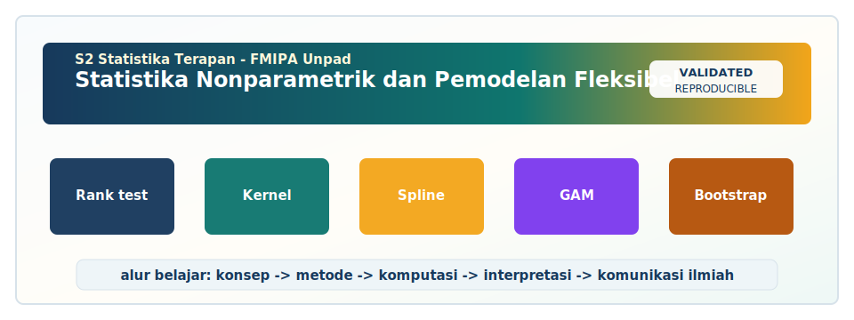

<!-- BEGIN UNPAD MATERIAL STYLE -->
<style>
:root {
  --unpad-navy: #17395c;
  --unpad-gold: #f2a51a;
  --unpad-teal: #0f766e;
  --unpad-ink: #172033;
  --unpad-paper: #fffdf8;
  --unpad-soft: #eef5f8;
  --unpad-line: #d7e2ea;
}
html, body {
  background: linear-gradient(135deg, #f8fbfd 0%, #fffdf8 48%, #f3f6ee 100%) !important;
  color: var(--unpad-ink) !important;
}
body {
  font-family: "Segoe UI", Arial, sans-serif !important;
  line-height: 1.72 !important;
}
.main-container {
  max-width: 1180px !important;
  background: rgba(255, 253, 248, 0.98) !important;
  border: 1px solid var(--unpad-line) !important;
  border-radius: 8px !important;
  box-shadow: 0 18px 42px rgba(23, 57, 92, 0.12) !important;
}
h1, h2, h3, h4 {
  letter-spacing: 0 !important;
}
h1.title {
  color: var(--unpad-navy) !important;
  -webkit-text-fill-color: var(--unpad-navy) !important;
  background: none !important;
}
h2 {
  border-left-color: var(--unpad-gold) !important;
}
a {
  color: #0b5c86 !important;
}
pre, code {
  border-radius: 8px !important;
}
.unpad-cover {
  margin: 18px 0 26px;
  padding: 24px;
  border-radius: 8px;
  background: linear-gradient(135deg, #17395c 0%, #0f766e 58%, #f2a51a 100%);
  color: #ffffff;
  box-shadow: 0 18px 36px rgba(23, 57, 92, 0.22);
}
.unpad-cover__brand {
  display: grid;
  grid-template-columns: 92px 1fr;
  gap: 20px;
  align-items: center;
}
.unpad-cover img {
  width: 92px;
  height: 92px;
  object-fit: contain;
  background: #ffffff;
  border-radius: 8px;
  padding: 8px;
  box-shadow: 0 8px 22px rgba(0,0,0,0.18);
}
.unpad-kicker {
  text-transform: uppercase;
  font-size: 0.82rem;
  font-weight: 800;
  letter-spacing: 0;
  color: #fff8dc;
}
.unpad-cover h2 {
  margin: 6px 0 8px;
  padding: 0;
  border: 0;
  background: transparent;
  color: #ffffff !important;
  font-size: 1.65rem;
}
.unpad-meta {
  margin: 0;
  color: #f7fbff;
  font-weight: 600;
}
.materi-illustration {
  margin: 20px 0 24px;
  padding: 14px;
  background: #ffffff;
  border: 1px solid var(--unpad-line);
  border-radius: 8px;
  box-shadow: 0 12px 28px rgba(23, 57, 92, 0.10);
}
.materi-illustration img {
  width: 100%;
  height: auto;
  display: block;
  border-radius: 6px;
}
.validasi-akademik {
  margin: 18px 0 28px;
  padding: 16px 18px;
  background: linear-gradient(135deg, #eef8f6, #fff8e7);
  border-left: 8px solid var(--unpad-teal);
  border-radius: 8px;
  color: var(--unpad-ink);
}
.validasi-akademik strong {
  color: var(--unpad-navy);
}
table {
  border-radius: 8px !important;
}
@media (max-width: 760px) {
  .unpad-cover__brand {
    grid-template-columns: 1fr;
  }
  .unpad-cover img {
    width: 76px;
    height: 76px;
  }
}
</style>
<!-- END UNPAD MATERIAL STYLE -->


<!-- BEGIN UNPAD MATERIAL ENHANCEMENT -->

```{r setup-unpad-render, include=FALSE}
execute_code <- FALSE
knitr::opts_chunk$set(
  echo = TRUE,
  eval = FALSE,
  message = FALSE,
  warning = FALSE,
  fig.align = "center",
  fig.width = 8,
  fig.height = 4.8,
  dpi = 120
)
set.seed(2025)
```


<div class="unpad-cover">
<div class="unpad-cover__brand">

<div>
<div class="unpad-kicker">S2 Statistika Terapan | FMIPA Universitas Padjadjaran</div>
<h2>Statistika Nonparametrik dan Pemodelan Fleksibel</h2>
<p class="unpad-meta">Materi Pembelajaran Berbasis RPS-OBE untuk S2 Statistika Terapan FMIPA Universitas Padjadjaran<br>Penulis: Yudhie Andriyana, M.Sc., Ph.D. | Januari 2025</p>
</div>
</div>
</div>

<div class="materi-illustration">

</div>

<div class="validasi-akademik">
<strong>Catatan validasi akademik.</strong> Materi ini diseragamkan dengan rujukan ADWTL Januari 2025: rumus dibaca bersama asumsi, contoh kode diposisikan sebagai template reproducible, dan interpretasi diarahkan pada validitas data, diagnosis model, evaluasi ketidakpastian, serta komunikasi hasil secara ilmiah.
</div>

<!-- END UNPAD MATERIAL ENHANCEMENT -->

<style>
:root{
  --brown-900:#3a2416; --brown-800:#54351f; --brown-700:#704828; --brown-600:#8a5a34;
  --brown-500:#a77245; --brown-400:#c58d5b; --brown-300:#dfb27b; --brown-200:#f0d3aa;
  --brown-100:#faeddc; --cream:#fffaf4; --paper:#fff8ef; --accent:#f6b357;
  --text:#24160d; --muted:#6b5648;
}
html{scroll-behavior:smooth;}
body{
  color:var(--text);
  font-family:"Segoe UI",Roboto,"Helvetica Neue",Arial,sans-serif;
  line-height:1.62;
  background:linear-gradient(135deg,#2a180e 0%,#80512e 28%,#d09b62 55%,#f8e4c7 78%,#fffaf4 100%);
  background-attachment:fixed;
}
.main-container, main, .container-fluid{
  max-width:1160px !important;
  margin-left:330px !important;
  margin-right:36px !important;
  background:rgba(255,250,244,.96);
  padding:34px 46px 64px 46px;
  border-radius:28px;
  box-shadow:0 20px 60px rgba(58,36,22,.22);
  border:1px solid rgba(255,255,255,.72);
}
#TOC, nav#TOC{
  position:fixed;
  top:18px; left:18px; bottom:18px;
  width:280px;
  overflow-y:auto;
  background:linear-gradient(180deg,#4a2c18,#7b4f2d 45%,#bd8450 100%);
  color:#fff7ed;
  border-radius:24px;
  padding:22px 18px;
  box-shadow:0 18px 48px rgba(40,23,12,.32);
  border:1px solid rgba(255,255,255,.20);
}
#TOC:before{
  content:"Daftar Isi";
  display:block;
  font-size:1.25rem;
  font-weight:800;
  letter-spacing:.4px;
  margin:0 0 14px 0;
  color:#fff0d7;
}
#TOC ul{list-style:none; padding-left:10px;}
#TOC li{margin:.35rem 0;}
#TOC a{color:#fff8ef; text-decoration:none; font-size:.92rem;}
#TOC a:hover{color:#ffd99d; text-decoration:underline;}
h1,h2,h3,h4{color:#4a2c18; font-weight:800; letter-spacing:-.02em;}
h1{font-size:2.3rem; border-bottom:4px solid #c58d5b; padding-bottom:.45rem;}
h2{font-size:1.72rem; margin-top:2.4rem; padding:.35rem .8rem; background:linear-gradient(90deg,#f1c891,#fff8ef); border-left:8px solid #8a5a34; border-radius:14px;}
h3{font-size:1.30rem; margin-top:1.7rem; color:#6a3e20;}
h4{font-size:1.08rem; color:#8a5a34;}
a{color:#7b3f14; font-weight:600;}
table{width:100%; border-collapse:collapse; margin:1rem 0 1.5rem 0; background:#fffdf9; box-shadow:0 8px 20px rgba(90,55,28,.08);}
th{background:linear-gradient(90deg,#7b4f2d,#b97d49); color:#fff9f0; padding:.75rem;}
td{border:1px solid #ead1b4; padding:.65rem; vertical-align:top;}
tr:nth-child(even) td{background:#fff3e5;}
blockquote{
  background:#fff2df; border-left:8px solid #a86c3c; color:#3b2617;
  padding:1rem 1.2rem; border-radius:14px; box-shadow:0 6px 18px rgba(84,53,31,.08);
}
pre, pre.sourceCode{
  background:#f7e3cc !important;
  color:#14100c !important;
  border-left:8px solid #9b6437;
  border-radius:16px;
  padding:1.05rem 1.15rem;
  box-shadow:inset 0 0 0 1px rgba(122,79,45,.16),0 8px 22px rgba(70,42,24,.08);
  overflow-x:auto;
}
code{background:#f3dfc6; color:#111; border-radius:6px; padding:.12rem .28rem;}
pre code{background:transparent; padding:0;}
.formula-box{
  background:#f9ead8;
  color:#111;
  border:1.5px solid #d2a373;
  border-left:8px solid #8d5a33;
  border-radius:18px;
  padding:1.05rem 1.25rem;
  margin:1.1rem 0;
  box-shadow:0 10px 22px rgba(82,50,28,.09);
}
.keybox{
  background:linear-gradient(135deg,#fff7ec,#f4d0a4);
  border:1px solid #e0b989;
  border-radius:20px;
  padding:1.05rem 1.25rem;
  margin:1.2rem 0;
}
.warnbox{
  background:linear-gradient(135deg,#fff4e7,#ffe0c2);
  border-left:8px solid #be6a27;
  border-radius:18px;
  padding:1rem 1.2rem;
  margin:1.2rem 0;
}
.method-card{
  background:#fffaf3;
  border:1px solid #efd4b1;
  border-radius:22px;
  padding:1.15rem 1.25rem;
  margin:1.1rem 0;
  box-shadow:0 12px 30px rgba(77,47,26,.08);
}
.badge{
  display:inline-block; padding:.22rem .6rem; border-radius:99px; background:#8a5a34; color:#fff6ec; font-size:.78rem; font-weight:700;
}
.caption{font-size:.94rem; color:var(--muted); font-style:italic;}
hr{border:0; border-top:2px dashed #d2a373; margin:2.2rem 0;}
@media(max-width:980px){
  #TOC, nav#TOC{position:relative; top:auto; left:auto; bottom:auto; width:auto; margin:14px;}
  .main-container, main, .container-fluid{margin:14px !important; padding:24px;}
}
</style>


```{r setup, include=FALSE, eval=FALSE}
knitr::opts_chunk$set(
  echo = TRUE,
  warning = FALSE,
  message = FALSE,
  fig.align = "center",
  fig.width = 8,
  fig.height = 5,
  dpi = 120
)
```


# Prakata

<div class="keybox">
<span class="badge">S2 Statistika Terapan FMIPA UNPAD</span>

Materi ini disusun sebagai bahan pembelajaran profesional untuk mata kuliah **Statistika Nonparametrik dan Pemodelan Fleksibel**. Struktur bahan ajar mengikuti alur RPS-OBE: penguatan konsep, praktik komputasi, evaluasi kritis, serta proyek terapan berbasis data nyata. Fokus utama materi adalah kemampuan memilih metode nonparametrik dan model fleksibel secara tepat, mengimplementasikannya menggunakan perangkat lunak statistik, dan menafsirkan hasilnya dalam bahasa ilmiah yang kuat.

</div>

Statistika nonparametrik sering diperkenalkan sebagai kumpulan uji alternatif ketika asumsi parametrik tidak terpenuhi. Penjelasan itu benar, tetapi belum cukup. Dalam praktik riset terapan, pendekatan nonparametrik juga memberikan cara berpikir yang lebih lentur terhadap data: tidak memaksa bentuk distribusi tertentu, lebih sensitif terhadap urutan atau peringkat, dan sering lebih stabil ketika data mengandung pencilan, skala ordinal, sampel kecil, distribusi menceng, atau hubungan nonlinear. Dengan kata lain, metode nonparametrik bukan sekadar “ban serep” ketika uji parametrik gagal; ia adalah kotak alat serius untuk membaca data yang sering tidak sopan terhadap asumsi klasik. Data memang kadang suka rebel, dan statistikawan yang baik tidak perlu panik—cukup memilih alat yang sesuai.

Materi ini dirancang untuk perkuliahan semester 2 dengan bobot teori dan praktikum. Bagian awal membahas dasar inferensi nonparametrik: uji dua sampel, uji lebih dari dua kelompok, uji hubungan, uji kecocokan distribusi, serta pendekatan permutation test. Bagian tengah membahas estimasi fungsi distribusi empiris, fungsi kerapatan, dan bootstrap. Bagian akhir diarahkan pada pemodelan fleksibel: regresi kernel, LOESS, smoothing spline, quantile regression, dan generalized additive models. Seluruh topik dikaitkan dengan pengambilan keputusan riset, interpretasi output, visualisasi, serta penulisan laporan ilmiah.

# Informasi Mata Kuliah

| Komponen | Informasi |
|---|---|
| Nama mata kuliah | Statistika Nonparametrik dan Pemodelan Fleksibel |
| Kode | D20B.201 |
| Status | Wajib |
| Bobot | 2 SKS teori dan 1 SKS praktikum |
| Semester | 2 |
| Program studi | S2 Statistika Terapan, FMIPA Universitas Padjadjaran |
| Dosen pengampu / penulis RPS | Yudhie Andriyana, M.Sc., Ph.D. |
| Tahun pembuatan materi | Januari 2025 |
| Orientasi pembelajaran | OBE, studi kasus, komputasi statistik, proyek terapan |

# Capaian Pembelajaran dan Peta Materi

Materi pembelajaran ini dikembangkan untuk mendukung empat kompetensi utama: kemampuan menganalisis metode nonparametrik untuk data yang tidak memenuhi asumsi parametrik, mengaplikasikan teknik nonparametrik dan flexible modeling pada masalah nyata, mengembangkan implementasi komputasi, serta merancang dan mempresentasikan hasil riset terapan secara kritis dan inovatif.

| SubCPMK | Fokus kemampuan | Pertemuan | Pokok bahasan |
|---|---|---:|---|
| SubCPMK1 | Menganalisis masalah perbedaan dua sampel, baik berpasangan maupun independen | 1–3 | Pengantar nonparametrik, Wilcoxon signed-rank, Mann--Whitney U, median test, Kolmogorov--Smirnov dua sampel, permutation test |
| SubCPMK2 | Mengevaluasi metode nonparametrik untuk hubungan antarvariabel dan ketidaksamaan distribusi | 4–8 | Kruskal--Wallis, Friedman, homogenitas varians nonparametrik, goodness-of-fit, Spearman, Kendall, UTS |
| SubCPMK3 | Menganalisis dan mengevaluasi flexible modeling secara komputasi | 9–12 | ECDF, kernel density estimation, bootstrap, regresi kernel, spline, LOESS, GAM, quantile regression |
| SubCPMK4 | Merancang studi kasus riset terapan dan mempresentasikan analisis secara komprehensif | 13–16 | Proyek, critical review, tren riset, laporan, presentasi, UAS |

# Petunjuk Penggunaan eBook

Bahan ajar ini dapat dipakai sebagai modul kuliah, catatan praktikum, dan sumber latihan mandiri. Setiap pertemuan disusun dengan pola yang konsisten: tujuan belajar, intuisi konsep, formulasi matematis, prosedur analisis, contoh R, interpretasi, kesalahan umum, dan latihan. Dengan pola ini mahasiswa diharapkan tidak hanya hafal nama uji, tetapi dapat menjawab pertanyaan yang lebih penting: *mengapa metode itu dipilih, asumsi apa yang dikurangi, informasi apa yang hilang, dan bagaimana hasilnya dipertanggungjawabkan?*

Untuk praktikum, mahasiswa dianjurkan membuat satu folder proyek per topik. Setiap folder minimal berisi data mentah, data bersih, skrip R, output grafik, dan catatan interpretasi. Struktur proyek seperti ini tampak sederhana, tetapi sangat membantu ketika laporan harus direvisi atau ketika analisis perlu direplikasi. Pada level magister, replikasi bukan aksesori; replikasi adalah sopan santun ilmiah.

```{r packages, eval=FALSE}
# Paket yang disarankan untuk praktikum
packages <- c(
  "tidyverse", "rstatix", "coin", "DescTools", "boot", "np",
  "KernSmooth", "quantreg", "mgcv", "broom", "ggpubr", "patchwork"
)

new_packages <- packages[!(packages %in% installed.packages()[, "Package"])]
if(length(new_packages) > 0) install.packages(new_packages)
lapply(packages, library, character.only = TRUE)
```

# Prinsip Umum Statistika Nonparametrik

Secara umum, istilah nonparametrik merujuk pada metode yang tidak menetapkan bentuk parametrik penuh untuk distribusi populasi. Dalam uji parametrik klasik, misalnya uji-*t* atau ANOVA, kita sering mengasumsikan normalitas residual, kesamaan varians, dan struktur model yang relatif sederhana. Dalam metode nonparametrik, fokus dapat berpindah ke median, peringkat, tanda, urutan, fungsi distribusi empiris, atau prosedur resampling. Perpindahan fokus ini tidak berarti metode nonparametrik “tanpa asumsi”. Istilah yang lebih hati-hati adalah *assumption-lean*: asumsi tetap ada, tetapi biasanya lebih lemah atau berbeda dari asumsi parametrik.

Kekuatan utama pendekatan nonparametrik adalah ketahanannya terhadap penyimpangan distribusi. Namun, kekuatan ini datang dengan konsekuensi. Ketika asumsi parametrik benar-benar terpenuhi, uji parametrik sering lebih efisien. Sebaliknya, ketika data bersifat ordinal, sangat menceng, mengandung pencilan ekstrem, atau ukuran sampel terbatas, pendekatan berbasis peringkat dan resampling dapat memberikan inferensi yang lebih masuk akal. Oleh karena itu, pemilihan metode harus berbasis pada desain studi, skala pengukuran, bentuk data, tujuan inferensi, dan konsekuensi substantif dari keputusan statistik.

<div class="formula-box">
Dalam banyak metode nonparametrik, data asli $X_1,\ldots,X_n$ diganti dengan informasi urutan seperti rank $R_i$, tanda $\operatorname{sign}(X_i)$, atau fungsi distribusi empiris $\hat F_n(x)$. Transformasi ini mengurangi ketergantungan pada skala asli, tetapi juga mengubah makna estimasi dan interpretasi.
</div>


# Pertemuan 1: Pengantar Statistika Nonparametrik

<div class="keybox">
**Tujuan belajar.** Setelah mempelajari pertemuan ini, mahasiswa diharapkan mampu menjelaskan ruang lingkup statistika nonparametrik, membedakannya dari pendekatan parametrik, dan mengidentifikasi situasi data yang membutuhkan prosedur berbasis peringkat, tanda, distribusi empiris, atau resampling. Pembahasan diarahkan pada penguasaan konsep, ketepatan pemilihan metode, implementasi komputasi, dan interpretasi hasil secara ilmiah.
</div>

## Intuisi dan konteks

Pertemuan pertama meletakkan fondasi konseptual. Dalam praktik, banyak data sosial, kesehatan, bisnis, dan industri tidak memenuhi asumsi normalitas, kesamaan varians, atau linearitas. Data dapat berskala ordinal, mengandung pencilan, memiliki ukuran sampel kecil, atau menunjukkan hubungan yang tidak dapat diringkas dengan satu parameter slope. Pada situasi seperti itu, statistika nonparametrik menyediakan kerangka analisis yang lebih lentur. Literatur klasik menekankan bahwa metode nonparametrik tidak berarti tanpa struktur, tetapi struktur yang digunakan biasanya lebih sedikit dan lebih dekat dengan informasi yang benar-benar tersedia pada data [@hollander2014; @conover1999; @wasserman2006].

Dalam mata kuliah ini, mahasiswa akan memakai pendekatan nonparametrik bukan sebagai jalan pintas, tetapi sebagai strategi inferensi. Misalnya, ketika membandingkan kepuasan layanan sebelum dan sesudah intervensi pada skala Likert, median dan rank lebih bermakna daripada rata-rata yang dipaksakan. Ketika distribusi biaya kesehatan sangat menceng ke kanan, median dan kuantil dapat lebih representatif daripada mean. Ketika hubungan antara indeks pembangunan dan risiko penyakit tidak linear, flexible modeling memberikan bahasa yang lebih kaya daripada regresi linear tunggal.

## Formulasi dan ide statistik

<div class="formula-box">
Jika $X_1,\ldots,X_n$ adalah sampel acak, pendekatan nonparametrik sering memanfaatkan fungsi distribusi empiris: $$\hat F_n(x)=\frac{1}{n}\sum_{i=1}^n I(X_i\le x).$$ Fungsi ini menjadi dasar estimasi distribusi tanpa menetapkan bentuk normal, gamma, lognormal, atau bentuk parametrik lain.
</div>

Fungsi distribusi empiris adalah objek yang sangat penting karena ia mendekati distribusi populasi berdasarkan proporsi observasi yang tidak melebihi nilai tertentu. Banyak gagasan lain, seperti kuantil empiris, Kolmogorov--Smirnov test, dan bootstrap, dapat dipahami dari fungsi ini. Dari sudut pandang pembelajaran, ECDF membantu mahasiswa melihat bahwa inferensi statistik tidak selalu harus dimulai dari asumsi bentuk distribusi. Kita dapat mulai dari data, membangun ringkasan empiris, lalu menyusun inferensi yang sesuai.

## Alur analisis praktis

Alur analisis awal yang dianjurkan adalah: identifikasi desain studi, tentukan skala variabel, lakukan eksplorasi visual, periksa keberadaan pencilan, rumuskan hipotesis substantif, pilih metode yang sesuai, jalankan analisis, hitung ukuran efek, lalu tulis interpretasi. Pada tahap eksplorasi, grafik bukan hiasan. Grafik adalah alat diagnosis. Boxplot memperlihatkan median dan pencilan; histogram memperlihatkan bentuk distribusi; ECDF memperlihatkan perbedaan distribusi secara menyeluruh; scatterplot memperlihatkan potensi nonlinearitas.

## Contoh implementasi R

```{r intro-nonparam, eval=FALSE}
set.seed(2025)
data_intro <- tibble(
  kelompok = rep(c("A", "B"), each = 50),
  skor = c(rlnorm(50, meanlog = 2.3, sdlog = 0.35),
           rlnorm(50, meanlog = 2.5, sdlog = 0.65))
)

data_intro %>%
  group_by(kelompok) %>%
  summarise(
    n = n(),
    mean = mean(skor),
    median = median(skor),
    sd = sd(skor),
    IQR = IQR(skor)
  )

ggplot(data_intro, aes(x = skor, fill = kelompok)) +
  geom_histogram(alpha = 0.55, bins = 25, position = "identity") +
  facet_wrap(~ kelompok, scales = "free_y") +
  labs(title = "Eksplorasi Distribusi Data Menceng", x = "Skor", y = "Frekuensi") +
  theme_minimal()
```

## Interpretasi hasil

Output ringkasan akan memperlihatkan bahwa mean dapat bergeser cukup kuat ketika distribusi menceng atau mengandung pencilan, sedangkan median dan IQR lebih stabil. Interpretasi awal tidak langsung berbunyi “kelompok berbeda signifikan”, tetapi “struktur distribusi menunjukkan perbedaan lokasi dan penyebaran yang perlu diuji dengan metode yang sesuai”. Bahasa seperti ini lebih aman karena memisahkan eksplorasi dan inferensi.

## Catatan metodologis

Pemilihan metode nonparametrik tidak boleh dilakukan hanya karena uji normalitas menghasilkan nilai-p kecil. Pada sampel besar, uji normalitas sangat sensitif sehingga penyimpangan kecil pun mudah terdeteksi. Sebaliknya, pada sampel kecil, uji normalitas sering tidak memiliki daya yang cukup. Karena itu, keputusan metodologis perlu menggabungkan grafik, ringkasan numerik, pengetahuan substantif, dan konsekuensi analitis. Praktik yang baik adalah menampilkan histogram, boxplot, Q--Q plot, dan ringkasan robust seperti median serta IQR sebelum memilih prosedur inferensi.

Interpretasi nilai-p pada metode nonparametrik sama hati-hatinya dengan metode parametrik. Nilai-p bukan probabilitas bahwa hipotesis nol benar, melainkan probabilitas memperoleh statistik uji setidaknya seekstrem yang diamati jika hipotesis nol dan asumsi prosedur benar. Dalam laporan ilmiah, nilai-p sebaiknya ditemani ukuran efek, interval kepercayaan, visualisasi, dan uraian konteks. Tanpa itu, hasil statistik mudah menjadi angka yang tampak tegas tetapi miskin makna.

Dalam konteks OBE, mahasiswa tidak cukup hanya menjalankan fungsi R. Kompetensi yang diharapkan adalah kemampuan menjelaskan alasan pemilihan metode, memeriksa kecocokan desain analisis, menafsirkan output, dan mengaitkan hasil dengan keputusan riset. Kode yang berjalan adalah awal yang baik; kode yang dapat dijelaskan adalah awal yang lebih matang; dan kode yang dapat direplikasi oleh orang lain adalah tanda bahwa analisis sudah siap dipertanggungjawabkan.

## Kesalahan umum dan cara menghindarinya

Kesalahan umum pada tahap pengantar adalah menyamakan nonparametrik dengan “tidak perlu asumsi”. Setiap prosedur tetap memiliki kondisi penggunaan, misalnya independensi observasi, bentuk distribusi yang sebanding untuk interpretasi lokasi, atau desain pasangan yang benar. Kesalahan lain adalah langsung memilih uji berdasarkan hasil normality test tanpa memahami desain. Untuk menghindarinya, selalu mulai dari pertanyaan riset dan struktur data.

## Latihan dan refleksi

Gunakan satu data nyata dengan minimal dua variabel numerik dan satu variabel kelompok. Buat histogram, boxplot, ECDF, serta ringkasan mean--median--IQR. Jelaskan apakah analisis parametrik tampak wajar atau apakah pendekatan nonparametrik lebih tepat. Tuliskan alasan metodologis, bukan hanya alasan “karena nilai-p normalitas kecil”.


# Pertemuan 2: Uji Tanda dan Wilcoxon Signed-Rank untuk Data Berpasangan

<div class="keybox">
**Tujuan belajar.** Setelah mempelajari pertemuan ini, mahasiswa diharapkan mampu menganalisis perbedaan dua kondisi berpasangan menggunakan sign test dan Wilcoxon signed-rank test serta menafsirkan hasilnya dalam konteks perubahan median atau kecenderungan lokasi. Pembahasan diarahkan pada penguasaan konsep, ketepatan pemilihan metode, implementasi komputasi, dan interpretasi hasil secara ilmiah.
</div>

## Intuisi dan konteks

Data berpasangan muncul ketika unit observasi yang sama diukur dua kali atau ketika dua unit secara sengaja dipasangkan. Contohnya adalah tekanan darah sebelum dan sesudah perlakuan, skor literasi digital sebelum dan sesudah pelatihan, atau kinerja dua metode pada objek yang sama. Karena observasi tidak independen antar kondisi, pendekatan yang tepat harus menganalisis selisih dalam pasangan, bukan memperlakukan dua kelompok sebagai sampel bebas. Wilcoxon signed-rank test merupakan prosedur klasik untuk membandingkan lokasi data berpasangan ketika asumsi normalitas selisih diragukan [@wilcoxon1945; @hollander2014].

Intuisi paling sederhana adalah sign test. Jika tidak ada perubahan sistematis, selisih positif dan negatif seharusnya relatif seimbang. Wilcoxon signed-rank memperkaya ide ini dengan memperhitungkan besar relatif selisih melalui ranking nilai absolut selisih. Jadi, bukan hanya arah perubahan yang diperhatikan, tetapi juga urutan magnitudonya. Pendekatan ini lebih informatif daripada sign test, tetapi biasanya mengasumsikan distribusi selisih yang kurang lebih simetris untuk interpretasi lokasi yang bersih.

## Formulasi dan ide statistik

<div class="formula-box">
Untuk pasangan $(X_i,Y_i)$, definisikan $D_i=Y_i-X_i$. Abaikan $D_i=0$, beri rank pada $|D_i|$, lalu hitung $$W^+=\sum_{i:D_i>0} R_i, \qquad W^-=\sum_{i:D_i<0}R_i.$$ Statistik uji didasarkan pada $W^+$, $W^-$, atau nilai minimum di antara keduanya.
</div>

Wilcoxon signed-rank test menguji apakah distribusi selisih berpusat di sekitar nol. Dalam banyak buku teks, hipotesis nol ditulis sebagai median selisih sama dengan nol. Namun, interpretasi median tersebut paling aman ketika distribusi selisih simetris. Jika simetri sangat buruk, sign test dapat menjadi alternatif yang lebih konservatif karena hanya menggunakan arah perubahan. Pada laporan riset, periksa plot selisih, histogram selisih, dan boxplot selisih agar pembaca memahami alasan pemilihan metode.

## Alur analisis praktis

Langkah praktis: pastikan data benar-benar berpasangan, hitung selisih, visualisasikan selisih, cek jumlah selisih nol, jalankan sign test atau Wilcoxon signed-rank, laporkan median selisih dan interval kepercayaan jika tersedia, lalu bandingkan dengan paired t-test sebagai analisis sensitivitas bila relevan. Pada data ordinal, gunakan interpretasi kecenderungan peningkatan atau penurunan, bukan klaim perbedaan rata-rata.

## Contoh implementasi R

```{r wilcoxon-signed-rank, eval=FALSE}
set.seed(2025)
n <- 35
pre  <- round(rnorm(n, mean = 68, sd = 8), 1)
post <- pre + round(rlogis(n, location = 3, scale = 3), 1)
data_pair <- tibble(id = 1:n, pre = pre, post = post, diff = post - pre)

summary(data_pair$diff)

ggplot(data_pair, aes(x = diff)) +
  geom_histogram(bins = 15, fill = "tan", color = "white") +
  geom_vline(xintercept = 0, linetype = 2) +
  labs(title = "Distribusi Selisih Post - Pre", x = "Selisih", y = "Frekuensi") +
  theme_minimal()

wilcox.test(data_pair$post, data_pair$pre, paired = TRUE, conf.int = TRUE)
t.test(data_pair$post, data_pair$pre, paired = TRUE)
```

## Interpretasi hasil

Jika nilai-p Wilcoxon kecil, kita menyimpulkan terdapat bukti perubahan sistematis antara kondisi sebelum dan sesudah. Namun, interpretasi terbaik harus menyebut arah perubahan, ukuran median selisih, dan konteks substantif. Misalnya, “skor setelah pelatihan cenderung lebih tinggi dibandingkan sebelum pelatihan, dengan median peningkatan sekitar tiga poin.” Perbandingan dengan paired t-test dapat digunakan sebagai pemeriksaan sensitivitas, bukan sebagai kompetisi mencari nilai-p paling kecil.

## Catatan metodologis

Interpretasi nilai-p pada metode nonparametrik sama hati-hatinya dengan metode parametrik. Nilai-p bukan probabilitas bahwa hipotesis nol benar, melainkan probabilitas memperoleh statistik uji setidaknya seekstrem yang diamati jika hipotesis nol dan asumsi prosedur benar. Dalam laporan ilmiah, nilai-p sebaiknya ditemani ukuran efek, interval kepercayaan, visualisasi, dan uraian konteks. Tanpa itu, hasil statistik mudah menjadi angka yang tampak tegas tetapi miskin makna.

Dalam konteks OBE, mahasiswa tidak cukup hanya menjalankan fungsi R. Kompetensi yang diharapkan adalah kemampuan menjelaskan alasan pemilihan metode, memeriksa kecocokan desain analisis, menafsirkan output, dan mengaitkan hasil dengan keputusan riset. Kode yang berjalan adalah awal yang baik; kode yang dapat dijelaskan adalah awal yang lebih matang; dan kode yang dapat direplikasi oleh orang lain adalah tanda bahwa analisis sudah siap dipertanggungjawabkan.

Banyak prosedur nonparametrik bekerja dengan ranking. Ranking membuat analisis lebih tahan terhadap pencilan karena nilai ekstrem tidak mendominasi perhitungan seperti pada rata-rata dan kuadrat deviasi. Namun, ranking juga menghilangkan sebagian informasi jarak pada skala asli. Dua observasi yang sangat jauh dapat memperoleh rank yang hanya berbeda satu posisi. Oleh karena itu, ketika jarak absolut penting secara substantif, laporan perlu melengkapi analisis rank dengan grafik dan ukuran efek pada skala asli.

## Kesalahan umum dan cara menghindarinya

Kesalahan yang sering terjadi adalah menggunakan Mann--Whitney untuk data berpasangan atau menggunakan paired t-test tanpa melihat selisih. Kesalahan lain adalah menghapus semua nilai nol tanpa melaporkan jumlahnya. Nilai nol memiliki makna substantif: unit tersebut tidak berubah. Untuk laporan yang baik, tuliskan jumlah pasangan, jumlah selisih positif, negatif, dan nol.

## Latihan dan refleksi

Ambil contoh data sebelum--sesudah dari bidang pendidikan, kesehatan, atau bisnis. Lakukan sign test dan Wilcoxon signed-rank test. Bandingkan hasil keduanya dan jelaskan mengapa hasil dapat sama atau berbeda. Sertakan grafik selisih dan interpretasi dalam satu paragraf akademik.


# Pertemuan 3: Mann--Whitney U, Median Test, Kolmogorov--Smirnov Dua Sampel, dan Permutation Test

<div class="keybox">
**Tujuan belajar.** Setelah mempelajari pertemuan ini, mahasiswa diharapkan mampu memilih dan menerapkan metode nonparametrik untuk membandingkan dua sampel independen serta membedakan pertanyaan lokasi, distribusi, dan randomisasi. Pembahasan diarahkan pada penguasaan konsep, ketepatan pemilihan metode, implementasi komputasi, dan interpretasi hasil secara ilmiah.
</div>

## Intuisi dan konteks

Dua sampel independen muncul ketika unit observasi pada kelompok pertama berbeda dari unit observasi pada kelompok kedua. Contohnya adalah perbandingan skor kepuasan antara dua wilayah, perbandingan waktu tunggu antara dua rumah sakit, atau perbandingan pendapatan antara dua kategori pekerjaan. Mann--Whitney U test, yang juga dikenal sebagai Wilcoxon rank-sum test, merupakan metode berbasis rank untuk menilai apakah observasi dari satu kelompok cenderung lebih besar daripada observasi dari kelompok lain [@mann1947; @hollander2014].

Mann--Whitney sering disalahartikan sebagai uji median. Interpretasi sebagai perbedaan median hanya aman jika bentuk distribusi kedua kelompok serupa dan perbedaannya terutama berupa pergeseran lokasi. Jika bentuk distribusi berbeda, Mann--Whitney lebih tepat ditafsirkan sebagai perbedaan kecenderungan stochastic ordering. Kolmogorov--Smirnov dua sampel memiliki pertanyaan yang lebih luas: apakah dua distribusi sama. Permutation test lebih umum lagi karena statistik ujinya dapat dipilih sesuai pertanyaan, misalnya selisih mean, selisih median, atau selisih trimmed mean [@good2005].

## Formulasi dan ide statistik

<div class="formula-box">
Untuk dua sampel independen $X_1,\ldots,X_m$ dan $Y_1,\ldots,Y_n$, statistik Mann--Whitney dapat ditulis sebagai $$U=\sum_{i=1}^m\sum_{j=1}^n I(X_i>Y_j)+\frac{1}{2}I(X_i=Y_j).$$ Nilai $U/(mn)$ dapat diinterpretasikan sebagai estimasi probabilitas bahwa observasi dari kelompok $X$ melebihi observasi dari kelompok $Y$.
</div>

Kekuatan Mann--Whitney adalah kesederhanaan dan ketahanannya terhadap pencilan. Namun, penggunaannya harus memperhatikan asumsi independensi dan bentuk distribusi. Median test lebih langsung menargetkan median, tetapi umumnya kurang powerful karena hanya menggunakan informasi apakah observasi berada di atas atau di bawah median gabungan. KS dua sampel menangkap perbedaan di seluruh distribusi, termasuk lokasi, penyebaran, dan bentuk. Permutation test menawarkan kerangka yang selaras dengan desain eksperimen: jika label kelompok dapat dipertukarkan di bawah hipotesis nol, distribusi acak statistik uji dapat dibangun dari semua atau banyak permutasi label.

## Alur analisis praktis

Mulailah dengan plot distribusi per kelompok. Jika fokus riset adalah perbedaan kecenderungan umum dan skala minimal ordinal, Mann--Whitney tepat. Jika fokus adalah median secara eksplisit, gunakan median test atau bootstrap median. Jika fokus adalah kesamaan distribusi penuh, gunakan KS dua sampel. Jika desain penelitian berbasis randomisasi dan statistik substantif sudah jelas, pertimbangkan permutation test. Setelah uji, laporkan ukuran efek seperti probability of superiority atau Cliff’s delta.

## Contoh implementasi R

```{r mann-whitney-permutation, eval=FALSE}
set.seed(2025)
data_ind <- tibble(
  kelompok = rep(c("Kontrol", "Intervensi"), each = 45),
  skor = c(rgamma(45, shape = 5, rate = .6), rgamma(45, shape = 6.3, rate = .6))
)

ggplot(data_ind, aes(x = skor, fill = kelompok)) +
  geom_density(alpha = 0.45) +
  labs(title = "Perbandingan Distribusi Dua Sampel Independen") +
  theme_minimal()

wilcox.test(skor ~ kelompok, data = data_ind, conf.int = TRUE)
ks.test(data_ind$skor[data_ind$kelompok == "Kontrol"],
        data_ind$skor[data_ind$kelompok == "Intervensi"])

# Permutation test sederhana untuk selisih median
obs <- with(data_ind, median(skor[kelompok == "Intervensi"]) - median(skor[kelompok == "Kontrol"]))
B <- 5000
perm <- replicate(B, {
  lab <- sample(data_ind$kelompok)
  median(data_ind$skor[lab == "Intervensi"]) - median(data_ind$skor[lab == "Kontrol"])
})
mean(abs(perm) >= abs(obs))
```

## Interpretasi hasil

Hasil Mann--Whitney yang signifikan menunjukkan bahwa satu kelompok cenderung memiliki nilai lebih tinggi daripada kelompok lain, bukan otomatis “mean berbeda”. Jika KS juga signifikan, perbedaan dapat mencakup bentuk distribusi. Jika permutation test median signifikan, bukti lebih langsung mengarah pada perbedaan median. Dalam laporan, gunakan kalimat yang sesuai dengan pertanyaan uji: lokasi, median, stochastic dominance, atau distribusi penuh.

## Catatan metodologis

Dalam konteks OBE, mahasiswa tidak cukup hanya menjalankan fungsi R. Kompetensi yang diharapkan adalah kemampuan menjelaskan alasan pemilihan metode, memeriksa kecocokan desain analisis, menafsirkan output, dan mengaitkan hasil dengan keputusan riset. Kode yang berjalan adalah awal yang baik; kode yang dapat dijelaskan adalah awal yang lebih matang; dan kode yang dapat direplikasi oleh orang lain adalah tanda bahwa analisis sudah siap dipertanggungjawabkan.

Banyak prosedur nonparametrik bekerja dengan ranking. Ranking membuat analisis lebih tahan terhadap pencilan karena nilai ekstrem tidak mendominasi perhitungan seperti pada rata-rata dan kuadrat deviasi. Namun, ranking juga menghilangkan sebagian informasi jarak pada skala asli. Dua observasi yang sangat jauh dapat memperoleh rank yang hanya berbeda satu posisi. Oleh karena itu, ketika jarak absolut penting secara substantif, laporan perlu melengkapi analisis rank dengan grafik dan ukuran efek pada skala asli.

Aspek komputasi menjadi sangat penting pada flexible modeling. Metode seperti kernel smoothing, spline, LOESS, GAM, dan bootstrap memerlukan keputusan tuning: bandwidth, derajat smoothness, jumlah resampling, struktur basis, atau penalti. Tuning bukan detail teknis kecil; tuning menentukan seberapa halus model, seberapa besar bias, dan seberapa besar varians. Mahasiswa perlu memahami bahwa model fleksibel yang terlalu bebas dapat menghafal noise, sedangkan model yang terlalu kaku dapat menutupi pola penting.

## Kesalahan umum dan cara menghindarinya

Kesalahan umum adalah menuliskan Mann--Whitney sebagai uji rata-rata nonparametrik. Itu kurang tepat. Kesalahan kedua adalah mengabaikan perbedaan bentuk distribusi. Jika satu kelompok lebih menyebar daripada kelompok lain, nilai-p Mann--Whitney dapat mencerminkan perbedaan distribusi yang tidak hanya berupa pergeseran lokasi. Solusinya adalah tampilkan grafik distribusi dan gunakan lebih dari satu sudut pandang inferensi.

## Latihan dan refleksi

Gunakan data dua kelompok independen. Jalankan Mann--Whitney, median test atau bootstrap median, KS dua sampel, dan permutation test. Buat tabel perbandingan yang memuat pertanyaan statistik, asumsi utama, statistik uji, nilai-p, dan interpretasi substantif.


# Pertemuan 4: Uji Kruskal--Wallis untuk Tiga atau Lebih Kelompok Independen

<div class="keybox">
**Tujuan belajar.** Setelah mempelajari pertemuan ini, mahasiswa diharapkan mampu menerapkan Kruskal--Wallis test, memahami hubungan dengan ANOVA berbasis rank, dan melakukan analisis lanjutan/post-hoc secara tepat. Pembahasan diarahkan pada penguasaan konsep, ketepatan pemilihan metode, implementasi komputasi, dan interpretasi hasil secara ilmiah.
</div>

## Intuisi dan konteks

Ketika jumlah kelompok independen lebih dari dua, perluasan langsung dari Mann--Whitney adalah Kruskal--Wallis test. Uji ini digunakan untuk menilai apakah beberapa kelompok memiliki distribusi atau lokasi yang sama berdasarkan peringkat gabungan [@kruskal1952]. Dalam riset terapan, contoh kasusnya adalah perbandingan tingkat kepuasan antara beberapa wilayah, perbandingan indeks risiko pada beberapa kategori usia, atau perbandingan outcome klinis pada lebih dari dua jenis perlakuan.

Kruskal--Wallis sering disebut sebagai alternatif nonparametrik untuk one-way ANOVA. Frasa ini berguna secara pedagogik, tetapi harus dipahami dengan hati-hati. ANOVA menguji kesamaan mean dengan asumsi residual normal dan varians homogen. Kruskal--Wallis menguji apakah rank rata-rata antar kelompok berbeda. Jika bentuk distribusi antar kelompok serupa, perbedaan rank dapat ditafsirkan sebagai perbedaan lokasi atau median. Jika bentuk distribusi berbeda, interpretasi menjadi lebih luas.

## Formulasi dan ide statistik

<div class="formula-box">
Misalkan terdapat $k$ kelompok dengan ukuran $n_j$, total $N$, dan rata-rata rank kelompok ke-$j$ adalah $\bar R_j$. Statistik Kruskal--Wallis adalah $$H=\frac{12}{N(N+1)}\sum_{j=1}^{k}n_j\left(\bar R_j-\frac{N+1}{2}\right)^2.$$ Untuk sampel cukup besar, $H$ didekati oleh distribusi $\chi^2$ dengan $k-1$ derajat bebas.
</div>

Setelah Kruskal--Wallis signifikan, analisis tidak berhenti. Hasil signifikan hanya mengatakan bahwa setidaknya ada satu kelompok yang berbeda. Untuk mengetahui pasangan mana yang berbeda, diperlukan prosedur post-hoc berbasis rank seperti Dunn test dengan koreksi multiple testing. Koreksi Benjamini--Hochberg atau Holm dapat digunakan untuk mengontrol kesalahan penemuan palsu atau family-wise error [@benjamini1995].

## Alur analisis praktis

Langkah analisis: buat boxplot dan jitter plot per kelompok, periksa jumlah observasi tiap kelompok, jalankan Kruskal--Wallis, hitung ukuran efek seperti epsilon squared, lakukan post-hoc jika perlu, koreksi nilai-p, lalu tuliskan interpretasi pasangan kelompok dengan hati-hati. Jangan menyebut “kelompok A memiliki mean tertinggi” jika analisis berbasis rank dan laporan tidak menunjukkan mean sebagai parameter utama.

## Contoh implementasi R

```{r kruskal-wallis, eval=FALSE}
set.seed(2025)
data_kw <- tibble(
  wilayah = rep(c("Utara", "Selatan", "Timur", "Barat"), each = 35),
  indeks = c(rlnorm(35, 2.0, .25), rlnorm(35, 2.1, .35),
             rlnorm(35, 2.35, .30), rlnorm(35, 2.05, .50))
)

ggplot(data_kw, aes(x = wilayah, y = indeks, fill = wilayah)) +
  geom_boxplot(alpha = .7, outlier.alpha = .3) +
  geom_jitter(width = .12, alpha = .55) +
  labs(title = "Perbandingan Indeks pada Empat Wilayah") +
  theme_minimal()

kruskal.test(indeks ~ wilayah, data = data_kw)

# Post-hoc Dunn test dapat dilakukan dengan rstatix
# data_kw %>% rstatix::dunn_test(indeks ~ wilayah, p.adjust.method = "holm")
```

## Interpretasi hasil

Jika Kruskal--Wallis signifikan, simpulkan bahwa distribusi atau kecenderungan rank indeks berbeda antar wilayah. Laporan perlu menyertakan visualisasi agar arah perbedaan jelas. Post-hoc membantu menyatakan pasangan wilayah yang berbeda setelah koreksi. Jika wilayah Timur tampak memiliki median tertinggi dan post-hoc menunjukkan perbedaan terhadap wilayah lain, interpretasi substantif harus mengaitkannya dengan konteks data, bukan berhenti di kalimat mekanis “terdapat perbedaan signifikan”.

## Catatan metodologis

Banyak prosedur nonparametrik bekerja dengan ranking. Ranking membuat analisis lebih tahan terhadap pencilan karena nilai ekstrem tidak mendominasi perhitungan seperti pada rata-rata dan kuadrat deviasi. Namun, ranking juga menghilangkan sebagian informasi jarak pada skala asli. Dua observasi yang sangat jauh dapat memperoleh rank yang hanya berbeda satu posisi. Oleh karena itu, ketika jarak absolut penting secara substantif, laporan perlu melengkapi analisis rank dengan grafik dan ukuran efek pada skala asli.

Aspek komputasi menjadi sangat penting pada flexible modeling. Metode seperti kernel smoothing, spline, LOESS, GAM, dan bootstrap memerlukan keputusan tuning: bandwidth, derajat smoothness, jumlah resampling, struktur basis, atau penalti. Tuning bukan detail teknis kecil; tuning menentukan seberapa halus model, seberapa besar bias, dan seberapa besar varians. Mahasiswa perlu memahami bahwa model fleksibel yang terlalu bebas dapat menghafal noise, sedangkan model yang terlalu kaku dapat menutupi pola penting.

Pemilihan metode nonparametrik tidak boleh dilakukan hanya karena uji normalitas menghasilkan nilai-p kecil. Pada sampel besar, uji normalitas sangat sensitif sehingga penyimpangan kecil pun mudah terdeteksi. Sebaliknya, pada sampel kecil, uji normalitas sering tidak memiliki daya yang cukup. Karena itu, keputusan metodologis perlu menggabungkan grafik, ringkasan numerik, pengetahuan substantif, dan konsekuensi analitis. Praktik yang baik adalah menampilkan histogram, boxplot, Q--Q plot, dan ringkasan robust seperti median serta IQR sebelum memilih prosedur inferensi.

## Kesalahan umum dan cara menghindarinya

Kesalahan umum adalah melakukan banyak Mann--Whitney tanpa koreksi setelah melihat Kruskal--Wallis signifikan. Ini meningkatkan risiko false positive. Kesalahan lain adalah menganggap Kruskal--Wallis bebas dari masalah varians. Perbedaan sebaran ekstrem dapat memengaruhi rank dan interpretasi. Selalu tampilkan grafik dan jelaskan bentuk distribusi per kelompok.

## Latihan dan refleksi

Pilih data dengan minimal tiga kelompok. Lakukan Kruskal--Wallis, post-hoc Dunn, dan hitung ukuran efek. Tulis interpretasi dalam dua versi: versi teknis untuk laporan statistik dan versi ringkas untuk pengambil kebijakan.


# Pertemuan 5: Uji Friedman untuk Data Berulang dan Rancangan Blok

<div class="keybox">
**Tujuan belajar.** Setelah mempelajari pertemuan ini, mahasiswa diharapkan mampu mengevaluasi perbedaan beberapa kondisi pada unit yang sama atau blok yang sama menggunakan Friedman test dan post-hoc berbasis rank. Pembahasan diarahkan pada penguasaan konsep, ketepatan pemilihan metode, implementasi komputasi, dan interpretasi hasil secara ilmiah.
</div>

## Intuisi dan konteks

Friedman test digunakan ketika setiap subjek atau blok mengalami lebih dari dua kondisi. Contohnya adalah skor kinerja mahasiswa pada tiga metode pembelajaran, penilaian panelis terhadap beberapa produk, atau hasil pengukuran pasien pada beberapa waktu. Karena pengukuran berada pada unit yang sama, observasi antar kondisi berkorelasi. Friedman test menangani struktur ini dengan melakukan ranking dalam setiap blok [@friedman1937].

Jika Kruskal--Wallis adalah alternatif rank untuk one-way ANOVA independen, Friedman adalah alternatif rank untuk repeated-measures ANOVA atau randomized block design. Kunci utamanya adalah ranking dilakukan dalam blok. Dengan demikian, variasi antar subjek yang stabil dapat dikendalikan. Ini penting ketika subjek memiliki tingkat dasar yang berbeda. Misalnya, mahasiswa yang memang sangat kuat akan tinggi pada semua metode, sehingga yang ingin dilihat adalah perubahan relatif antar metode di dalam mahasiswa yang sama.

## Formulasi dan ide statistik

<div class="formula-box">
Untuk $n$ blok dan $k$ perlakuan, misalkan $R_j$ adalah jumlah rank pada perlakuan ke-$j$. Statistik Friedman adalah $$Q=\frac{12}{nk(k+1)}\sum_{j=1}^{k}R_j^2-3n(k+1).$$ Untuk $n$ cukup besar, $Q$ didekati distribusi $\chi^2$ dengan $k-1$ derajat bebas.
</div>

Friedman test mengasumsikan blok saling independen dan variabel respon minimal ordinal. Dalam kasus ties yang banyak, perlu koreksi ties atau prosedur exact/permutation. Jika hasil signifikan, post-hoc dapat dilakukan menggunakan perbandingan berpasangan Wilcoxon signed-rank dengan koreksi nilai-p atau metode Nemenyi/Conover. Pilihan post-hoc harus dilaporkan agar pembaca tahu bagaimana error rate dikendalikan.

## Alur analisis praktis

Susun data dalam format long: satu baris per subjek-kondisi. Pastikan setiap subjek memiliki pengamatan untuk semua kondisi, atau tangani missingness secara eksplisit. Buat line plot per subjek atau boxplot per kondisi. Jalankan Friedman test, hitung Kendall’s W sebagai ukuran kesepakatan/efek, lalu lakukan post-hoc jika diperlukan. Interpretasi harus menyebut bahwa perbandingan dilakukan dalam subjek/blok, bukan antar subjek bebas.

## Contoh implementasi R

```{r friedman-test, eval=FALSE}
set.seed(2025)
n <- 28
data_fr <- tibble(
  id = rep(1:n, each = 3),
  metode = rep(c("Metode_A", "Metode_B", "Metode_C"), times = n),
  skor = as.vector(t(replicate(n, {
    base <- rnorm(1, 70, 8)
    c(base + rnorm(1, 0, 4), base + 4 + rnorm(1, 0, 4), base + 8 + rnorm(1, 0, 4))
  })))
)

ggplot(data_fr, aes(x = metode, y = skor, group = id)) +
  geom_line(alpha = .25) +
  geom_point(alpha = .5) +
  stat_summary(aes(group = 1), fun = median, geom = "line", linewidth = 1.2) +
  labs(title = "Skor Tiga Metode pada Subjek yang Sama") +
  theme_minimal()

friedman.test(skor ~ metode | id, data = data_fr)

# Post-hoc: pairwise Wilcoxon berpasangan
pairwise.wilcox.test(data_fr$skor, data_fr$metode, paired = TRUE, p.adjust.method = "holm")
```

## Interpretasi hasil

Nilai-p Friedman yang kecil menunjukkan adanya perbedaan sistematis antar kondisi setelah mengendalikan variasi antar subjek. Jika median metode C paling tinggi dan post-hoc menunjukkan perbedaan terhadap A dan B, interpretasinya adalah metode C cenderung menghasilkan skor lebih tinggi pada subjek yang sama. Grafik garis individual membantu memastikan bahwa pola peningkatan tidak hanya dipengaruhi beberapa subjek ekstrem.

## Catatan metodologis

Aspek komputasi menjadi sangat penting pada flexible modeling. Metode seperti kernel smoothing, spline, LOESS, GAM, dan bootstrap memerlukan keputusan tuning: bandwidth, derajat smoothness, jumlah resampling, struktur basis, atau penalti. Tuning bukan detail teknis kecil; tuning menentukan seberapa halus model, seberapa besar bias, dan seberapa besar varians. Mahasiswa perlu memahami bahwa model fleksibel yang terlalu bebas dapat menghafal noise, sedangkan model yang terlalu kaku dapat menutupi pola penting.

Pemilihan metode nonparametrik tidak boleh dilakukan hanya karena uji normalitas menghasilkan nilai-p kecil. Pada sampel besar, uji normalitas sangat sensitif sehingga penyimpangan kecil pun mudah terdeteksi. Sebaliknya, pada sampel kecil, uji normalitas sering tidak memiliki daya yang cukup. Karena itu, keputusan metodologis perlu menggabungkan grafik, ringkasan numerik, pengetahuan substantif, dan konsekuensi analitis. Praktik yang baik adalah menampilkan histogram, boxplot, Q--Q plot, dan ringkasan robust seperti median serta IQR sebelum memilih prosedur inferensi.

Interpretasi nilai-p pada metode nonparametrik sama hati-hatinya dengan metode parametrik. Nilai-p bukan probabilitas bahwa hipotesis nol benar, melainkan probabilitas memperoleh statistik uji setidaknya seekstrem yang diamati jika hipotesis nol dan asumsi prosedur benar. Dalam laporan ilmiah, nilai-p sebaiknya ditemani ukuran efek, interval kepercayaan, visualisasi, dan uraian konteks. Tanpa itu, hasil statistik mudah menjadi angka yang tampak tegas tetapi miskin makna.

## Kesalahan umum dan cara menghindarinya

Kesalahan umum adalah memakai Kruskal--Wallis untuk data berulang. Itu mengabaikan pasangan/blok dan dapat merusak inferensi. Kesalahan lain adalah mengubah data menjadi wide tetapi salah memasangkan subjek. Gunakan identitas subjek dengan hati-hati; salah pairing itu seperti menukar sepatu kiri-kanan—masih terlihat lengkap, tetapi jalannya tidak benar.

## Latihan dan refleksi

Gunakan data repeated measures dengan minimal tiga kondisi. Tampilkan spaghetti plot, jalankan Friedman test, lakukan post-hoc, dan hitung ukuran efek. Jelaskan apakah perbedaan terlihat konsisten pada banyak subjek atau hanya pada beberapa subjek ekstrem.


# Pertemuan 6: Uji Homogenitas Varians Nonparametrik dan Robust

<div class="keybox">
**Tujuan belajar.** Setelah mempelajari pertemuan ini, mahasiswa diharapkan mampu menguji serta menafsirkan kesamaan penyebaran antar kelompok menggunakan pendekatan robust seperti Fligner--Killeen, Levene, Brown--Forsythe, dan alternatif berbasis rank. Pembahasan diarahkan pada penguasaan konsep, ketepatan pemilihan metode, implementasi komputasi, dan interpretasi hasil secara ilmiah.
</div>

## Intuisi dan konteks

Kesamaan varians merupakan asumsi penting dalam banyak prosedur parametrik, terutama ANOVA klasik. Namun, uji homogenitas varians yang sensitif terhadap normalitas dapat memberikan kesimpulan menyesatkan ketika distribusi menceng. Karena itu, prosedur robust dan nonparametrik seperti Fligner--Killeen atau Brown--Forsythe sering lebih sesuai. Topik ini penting karena perbedaan antar kelompok tidak selalu berupa perbedaan lokasi; kadang kelompok memiliki median serupa tetapi risiko atau variasinya berbeda.

Dalam riset terapan, variasi sering sama pentingnya dengan pusat distribusi. Dua rumah sakit dapat memiliki median waktu tunggu yang mirip, tetapi salah satunya memiliki variasi jauh lebih besar sehingga pengalaman pasien lebih tidak pasti. Dua wilayah dapat memiliki median pendapatan yang sama, tetapi ketimpangannya berbeda. Analisis nonparametrik membantu menilai aspek penyebaran tanpa memaksakan normalitas.

## Formulasi dan ide statistik

<div class="formula-box">
Brown--Forsythe menggunakan deviasi absolut terhadap median kelompok: $$Z_{ij}=|Y_{ij}-\tilde Y_j|.$$ Kemudian dilakukan ANOVA pada $Z_{ij}$. Fligner--Killeen menggunakan transformasi rank dari deviasi absolut sehingga lebih robust terhadap penyimpangan distribusi.
</div>

Levene test menggunakan deviasi terhadap mean, Brown--Forsythe menggunakan deviasi terhadap median, sedangkan Fligner--Killeen menggunakan rank dan sering direkomendasikan ketika data tidak normal. Pilihan prosedur bergantung pada bentuk data dan tujuan. Jika pertanyaan riset menyangkut ketidaksamaan varians sebagai fenomena substantif, hasil uji perlu ditafsirkan sebagai perbedaan stabilitas/heterogenitas, bukan hanya sebagai pemeriksaan asumsi.

## Alur analisis praktis

Buat boxplot dan plot residual atau deviasi absolut per kelompok. Jalankan Fligner--Killeen untuk pendekatan robust. Bandingkan dengan Levene/Brown--Forsythe jika paket tersedia. Jika varians tidak homogen dan analisis lokasi tetap diperlukan, pertimbangkan prosedur yang tidak mengasumsikan varians sama, transformasi yang bermakna, bootstrap, atau model yang mengakomodasi heteroskedastisitas.

## Contoh implementasi R

```{r homogeneity-variance, eval=FALSE}
set.seed(2025)
data_var <- tibble(
  kelompok = rep(c("A", "B", "C"), each = 45),
  nilai = c(rnorm(45, 70, 5), rnorm(45, 72, 12), rt(45, df = 4) * 10 + 71)
)

ggplot(data_var, aes(x = kelompok, y = nilai, fill = kelompok)) +
  geom_boxplot(alpha = .7) +
  geom_jitter(width = .12, alpha = .45) +
  labs(title = "Perbandingan Penyebaran Antar Kelompok") +
  theme_minimal()

fligner.test(nilai ~ kelompok, data = data_var)

# Brown-Forsythe manual sederhana
data_bf <- data_var %>%
  group_by(kelompok) %>%
  mutate(dev_med = abs(nilai - median(nilai))) %>%
  ungroup()
summary(aov(dev_med ~ kelompok, data = data_bf))
```

## Interpretasi hasil

Jika Fligner--Killeen signifikan, terdapat bukti bahwa penyebaran berbeda antar kelompok. Ini tidak otomatis mengatakan median berbeda. Laporan harus membedakan pertanyaan lokasi dan penyebaran. Jika kelompok B memiliki variasi lebih besar, implikasinya dapat berupa ketidakstabilan proses, heterogenitas populasi, atau variasi implementasi program.

## Catatan metodologis

Pemilihan metode nonparametrik tidak boleh dilakukan hanya karena uji normalitas menghasilkan nilai-p kecil. Pada sampel besar, uji normalitas sangat sensitif sehingga penyimpangan kecil pun mudah terdeteksi. Sebaliknya, pada sampel kecil, uji normalitas sering tidak memiliki daya yang cukup. Karena itu, keputusan metodologis perlu menggabungkan grafik, ringkasan numerik, pengetahuan substantif, dan konsekuensi analitis. Praktik yang baik adalah menampilkan histogram, boxplot, Q--Q plot, dan ringkasan robust seperti median serta IQR sebelum memilih prosedur inferensi.

Interpretasi nilai-p pada metode nonparametrik sama hati-hatinya dengan metode parametrik. Nilai-p bukan probabilitas bahwa hipotesis nol benar, melainkan probabilitas memperoleh statistik uji setidaknya seekstrem yang diamati jika hipotesis nol dan asumsi prosedur benar. Dalam laporan ilmiah, nilai-p sebaiknya ditemani ukuran efek, interval kepercayaan, visualisasi, dan uraian konteks. Tanpa itu, hasil statistik mudah menjadi angka yang tampak tegas tetapi miskin makna.

Dalam konteks OBE, mahasiswa tidak cukup hanya menjalankan fungsi R. Kompetensi yang diharapkan adalah kemampuan menjelaskan alasan pemilihan metode, memeriksa kecocokan desain analisis, menafsirkan output, dan mengaitkan hasil dengan keputusan riset. Kode yang berjalan adalah awal yang baik; kode yang dapat dijelaskan adalah awal yang lebih matang; dan kode yang dapat direplikasi oleh orang lain adalah tanda bahwa analisis sudah siap dipertanggungjawabkan.

## Kesalahan umum dan cara menghindarinya

Kesalahan umum adalah menggunakan hasil uji varians hanya sebagai gerbang mekanis menuju ANOVA. Padahal heterogenitas varians dapat menjadi temuan utama. Kesalahan lain adalah menyimpulkan bahwa data “buruk” karena varians tidak homogen. Data tidak buruk; modelnya mungkin terlalu sederhana. Statistik yang baik bukan memarahi data, tetapi menyesuaikan metode.

## Latihan dan refleksi

Gunakan data dengan minimal tiga kelompok. Uji perbedaan lokasi dan penyebaran. Buat laporan singkat yang memisahkan interpretasi median/rank dan interpretasi varians/heterogenitas.


# Pertemuan 7: Uji Kecocokan Distribusi, ECDF, Spearman, dan Kendall

<div class="keybox">
**Tujuan belajar.** Setelah mempelajari pertemuan ini, mahasiswa diharapkan mampu mengevaluasi kesesuaian distribusi dan hubungan nonparametrik antarvariabel menggunakan ECDF, goodness-of-fit, Spearman rank correlation, dan Kendall tau. Pembahasan diarahkan pada penguasaan konsep, ketepatan pemilihan metode, implementasi komputasi, dan interpretasi hasil secara ilmiah.
</div>

## Intuisi dan konteks

Pertemuan ini menghubungkan dua keluarga metode: uji kecocokan distribusi dan analisis asosiasi nonparametrik. Goodness-of-fit digunakan ketika peneliti ingin menilai apakah data plausibel berasal dari distribusi tertentu. Sementara itu, Spearman dan Kendall digunakan ketika hubungan antarvariabel bersifat monotonic, skala ordinal, atau tidak memenuhi asumsi linearitas dan normalitas bivariat [@spearman1904; @kendall1938].

Dalam banyak riset, asumsi distribusi dipakai diam-diam. Model biaya dapat mengasumsikan lognormal, model waktu tunggu dapat mengasumsikan exponential, atau residual regresi diasumsikan normal. Goodness-of-fit membantu mengevaluasi asumsi tersebut. Namun, uji formal harus dibaca bersama grafik karena nilai-p sangat dipengaruhi ukuran sampel. Untuk asosiasi, scatterplot perlu diperiksa sebelum korelasi dihitung. Spearman menangkap hubungan monotonic berbasis rank, sedangkan Kendall tau memiliki interpretasi probabilistik melalui pasangan konkordan dan diskordan.

## Formulasi dan ide statistik

<div class="formula-box">
Spearman correlation adalah korelasi Pearson pada rank: $$\rho_s=\operatorname{cor}(R_X,R_Y).$$ Kendall tau dapat ditulis sebagai $$\tau=\frac{C-D}{\binom{n}{2}},$$ dengan $C$ jumlah pasangan konkordan dan $D$ jumlah pasangan diskordan.
</div>

Spearman lebih mudah dihitung dan populer, sedangkan Kendall sering lebih robust dan memiliki interpretasi sebagai selisih probabilitas konkordansi dan diskordansi. Untuk goodness-of-fit, Kolmogorov--Smirnov membandingkan supremum selisih ECDF dan CDF teoritis. Anderson--Darling memberi bobot lebih pada ekor distribusi. Chi-square goodness-of-fit menggunakan binning sehingga hasilnya dapat bergantung pada pemilihan kelas.

## Alur analisis praktis

Untuk distribusi, tampilkan histogram, density plot, Q--Q plot, dan ECDF. Jalankan uji formal yang sesuai, tetapi jelaskan sensitivitasnya. Untuk asosiasi, buat scatterplot, identifikasi pola monotonic atau nonlinear, hitung Spearman/Kendall, dan laporkan interval kepercayaan bila memungkinkan. Jika hubungan tidak monotonic, korelasi rank pun dapat gagal menangkap pola; pertimbangkan smoother atau model fleksibel.

## Contoh implementasi R

```{r gof-correlation, eval=FALSE}
set.seed(2025)
data_cor <- tibble(
  x = runif(90, 0, 10),
  y = log1p(x) * 12 + rnorm(90, 0, 2.5)
)

ggplot(data_cor, aes(x = x, y = y)) +
  geom_point(alpha = .65) +
  geom_smooth(method = "loess", se = FALSE) +
  labs(title = "Hubungan Monotonic Nonlinear") +
  theme_minimal()

cor.test(data_cor$x, data_cor$y, method = "spearman")
cor.test(data_cor$x, data_cor$y, method = "kendall")

# Goodness-of-fit sederhana untuk normalitas pada residual simulasi
res <- residuals(lm(y ~ x, data = data_cor))
ks.test(scale(res), "pnorm")
```

## Interpretasi hasil

Korelasi Spearman atau Kendall yang tinggi menunjukkan hubungan monotonic: ketika x meningkat, y cenderung meningkat. Tetapi korelasi tidak menjelaskan bentuk kurva. Jika scatterplot menunjukkan hubungan logaritmik, model linear biasa dapat terlalu sederhana. Untuk goodness-of-fit, nilai-p kecil menunjukkan ketidakcocokan dengan distribusi yang diuji, tetapi grafik tetap diperlukan untuk mengetahui bagian mana yang tidak cocok: pusat, ekor, skewness, atau pencilan.

## Catatan metodologis

Interpretasi nilai-p pada metode nonparametrik sama hati-hatinya dengan metode parametrik. Nilai-p bukan probabilitas bahwa hipotesis nol benar, melainkan probabilitas memperoleh statistik uji setidaknya seekstrem yang diamati jika hipotesis nol dan asumsi prosedur benar. Dalam laporan ilmiah, nilai-p sebaiknya ditemani ukuran efek, interval kepercayaan, visualisasi, dan uraian konteks. Tanpa itu, hasil statistik mudah menjadi angka yang tampak tegas tetapi miskin makna.

Dalam konteks OBE, mahasiswa tidak cukup hanya menjalankan fungsi R. Kompetensi yang diharapkan adalah kemampuan menjelaskan alasan pemilihan metode, memeriksa kecocokan desain analisis, menafsirkan output, dan mengaitkan hasil dengan keputusan riset. Kode yang berjalan adalah awal yang baik; kode yang dapat dijelaskan adalah awal yang lebih matang; dan kode yang dapat direplikasi oleh orang lain adalah tanda bahwa analisis sudah siap dipertanggungjawabkan.

Banyak prosedur nonparametrik bekerja dengan ranking. Ranking membuat analisis lebih tahan terhadap pencilan karena nilai ekstrem tidak mendominasi perhitungan seperti pada rata-rata dan kuadrat deviasi. Namun, ranking juga menghilangkan sebagian informasi jarak pada skala asli. Dua observasi yang sangat jauh dapat memperoleh rank yang hanya berbeda satu posisi. Oleh karena itu, ketika jarak absolut penting secara substantif, laporan perlu melengkapi analisis rank dengan grafik dan ukuran efek pada skala asli.

## Kesalahan umum dan cara menghindarinya

Kesalahan umum adalah memakai korelasi Spearman untuk semua pola nonlinear. Spearman menangkap monotonicity, bukan semua bentuk nonlinear. Hubungan U-shape dapat menghasilkan korelasi rendah meskipun hubungannya kuat. Kesalahan lain adalah melakukan KS test setelah parameter distribusi diestimasi dari data tanpa koreksi, karena distribusi nilai-p standar tidak lagi tepat.

## Latihan dan refleksi

Simulasikan tiga pola hubungan: linear, monotonic nonlinear, dan U-shape. Hitung Pearson, Spearman, dan Kendall. Jelaskan kapan masing-masing ukuran gagal atau berhasil menangkap pola.


# Pertemuan 8: UTS dan Sintesis Inferensi Nonparametrik Dasar

<div class="keybox">
**Tujuan belajar.** Setelah mempelajari pertemuan ini, mahasiswa diharapkan mampu mengintegrasikan konsep uji dua sampel, multi-sampel, goodness-of-fit, dan asosiasi nonparametrik ke dalam strategi analisis yang sistematis. Pembahasan diarahkan pada penguasaan konsep, ketepatan pemilihan metode, implementasi komputasi, dan interpretasi hasil secara ilmiah.
</div>

## Intuisi dan konteks

Pertemuan UTS bukan hanya evaluasi, tetapi titik sintesis. Mahasiswa diharapkan mampu membaca desain data dan memilih metode tanpa sekadar menghafal daftar uji. Pada tahap ini, pertanyaan kunci adalah: apakah data berpasangan atau independen, berapa jumlah kelompok, apa skala variabel, apakah fokus pada lokasi, penyebaran, distribusi penuh, atau asosiasi, serta bagaimana hasil dikomunikasikan secara ilmiah.

Banyak kesalahan analisis terjadi bukan karena rumus salah, tetapi karena peta keputusan salah. Data berpasangan diperlakukan independen, data ordinal dirata-ratakan tanpa pertimbangan, uji median diganti Mann--Whitney tanpa alasan, atau hasil signifikan dilaporkan tanpa ukuran efek. UTS harus mendorong mahasiswa menunjukkan proses berpikir statistik, bukan hanya output perangkat lunak.

## Formulasi dan ide statistik

<div class="formula-box">
Peta keputusan ringkas: $$\text{Desain data} \rightarrow \text{Pertanyaan inferensi} \rightarrow \text{Skala pengukuran} \rightarrow \text{Metode} \rightarrow \text{Ukuran efek} \rightarrow \text{Interpretasi}. $$
</div>

Dalam kerangka inferensi modern, metode statistik adalah bagian dari argumentasi. Setiap hasil uji harus dapat dijelaskan dalam hubungan dengan desain penelitian, proses pengumpulan data, asumsi, dan keterbatasan. Karena itu, jawaban UTS yang baik tidak hanya menampilkan nilai-p. Jawaban yang baik menunjukkan mengapa metode tersebut tepat, bagaimana output dibaca, apa ukuran efeknya, dan apa kesimpulan substantifnya.

## Alur analisis praktis

Untuk persiapan UTS, buat tabel ringkasan metode. Kolom minimal: jenis data, tujuan, hipotesis, statistik uji, asumsi, fungsi R, ukuran efek, dan contoh interpretasi. Latih diri dengan beberapa skenario: sebelum--sesudah, dua kelompok independen, empat kelompok independen, repeated measures, korelasi ordinal, dan uji distribusi. Setiap skenario harus dapat diselesaikan mulai dari identifikasi desain hingga kalimat kesimpulan.

## Contoh implementasi R

```{r uts-decision-map, eval=FALSE}
decision_map <- tibble::tribble(
  ~desain, ~tujuan, ~metode, ~fungsi_R,
  "Berpasangan, 2 kondisi", "Perubahan lokasi", "Wilcoxon signed-rank", "wilcox.test(..., paired=TRUE)",
  "Independen, 2 kelompok", "Kecenderungan rank", "Mann-Whitney U", "wilcox.test(y ~ group)",
  "Independen, >2 kelompok", "Perbedaan rank", "Kruskal-Wallis", "kruskal.test(y ~ group)",
  "Berulang, >2 kondisi", "Perbedaan dalam blok", "Friedman", "friedman.test(y ~ kondisi | id)",
  "Dua variabel ordinal/monotonic", "Asosiasi", "Spearman/Kendall", "cor.test(x, y, method=...)",
  "Satu sampel", "Kecocokan distribusi", "KS/AD/Chi-square", "ks.test(...)"
)
decision_map
```

## Interpretasi hasil

Tabel peta keputusan membantu mencegah kesalahan metodologis. Dalam ujian atau laporan, mahasiswa dapat mulai dengan menyatakan desain: “Data terdiri atas dua kelompok independen dengan respon kontinu menceng, sehingga Mann--Whitney dipilih untuk mengevaluasi perbedaan kecenderungan rank.” Kalimat pembuka seperti ini menunjukkan kematangan analitis.

## Catatan metodologis

Dalam konteks OBE, mahasiswa tidak cukup hanya menjalankan fungsi R. Kompetensi yang diharapkan adalah kemampuan menjelaskan alasan pemilihan metode, memeriksa kecocokan desain analisis, menafsirkan output, dan mengaitkan hasil dengan keputusan riset. Kode yang berjalan adalah awal yang baik; kode yang dapat dijelaskan adalah awal yang lebih matang; dan kode yang dapat direplikasi oleh orang lain adalah tanda bahwa analisis sudah siap dipertanggungjawabkan.

Banyak prosedur nonparametrik bekerja dengan ranking. Ranking membuat analisis lebih tahan terhadap pencilan karena nilai ekstrem tidak mendominasi perhitungan seperti pada rata-rata dan kuadrat deviasi. Namun, ranking juga menghilangkan sebagian informasi jarak pada skala asli. Dua observasi yang sangat jauh dapat memperoleh rank yang hanya berbeda satu posisi. Oleh karena itu, ketika jarak absolut penting secara substantif, laporan perlu melengkapi analisis rank dengan grafik dan ukuran efek pada skala asli.

Aspek komputasi menjadi sangat penting pada flexible modeling. Metode seperti kernel smoothing, spline, LOESS, GAM, dan bootstrap memerlukan keputusan tuning: bandwidth, derajat smoothness, jumlah resampling, struktur basis, atau penalti. Tuning bukan detail teknis kecil; tuning menentukan seberapa halus model, seberapa besar bias, dan seberapa besar varians. Mahasiswa perlu memahami bahwa model fleksibel yang terlalu bebas dapat menghafal noise, sedangkan model yang terlalu kaku dapat menutupi pola penting.

## Kesalahan umum dan cara menghindarinya

Kesalahan umum saat UTS adalah menuliskan semua hasil fungsi R tanpa narasi. Output bukan interpretasi. Kesalahan lain adalah tidak menyebut hipotesis nol dan alternatif. Setiap jawaban perlu menjelaskan parameter atau karakteristik distribusi apa yang sedang diuji.

## Latihan dan refleksi

Buat enam contoh mini-kasus dan tentukan metode yang sesuai. Untuk setiap kasus, tuliskan satu kalimat hipotesis nol, satu kalimat metode, dan satu kalimat interpretasi jika nilai-p kurang dari 0,05.


# Pertemuan 9: Estimasi Fungsi Distribusi Empiris dan Kuantil

<div class="keybox">
**Tujuan belajar.** Setelah mempelajari pertemuan ini, mahasiswa diharapkan mampu menggunakan fungsi distribusi empiris, kuantil empiris, dan visualisasi distribusi untuk menganalisis struktur data tanpa asumsi parametrik. Pembahasan diarahkan pada penguasaan konsep, ketepatan pemilihan metode, implementasi komputasi, dan interpretasi hasil secara ilmiah.
</div>

## Intuisi dan konteks

Setelah UTS, pembelajaran bergerak dari uji hipotesis menuju estimasi nonparametrik. Fungsi distribusi empiris atau ECDF adalah dasar dari banyak metode nonparametrik. ECDF menggambarkan proporsi observasi yang tidak melebihi nilai tertentu. Dengan ECDF, peneliti dapat membandingkan distribusi, membaca kuantil, dan memahami dominasi stochastic secara visual [@wasserman2006; @hollander2014].

Dalam laporan terapan, ECDF sering lebih informatif daripada histogram karena tidak bergantung pada pilihan bin. Misalnya, ketika membandingkan waktu tunggu rumah sakit, ECDF dapat menjawab pertanyaan praktis: berapa persen pasien menunggu kurang dari 30 menit? Pada analisis kemiskinan, ECDF dapat menunjukkan proporsi rumah tangga di bawah ambang tertentu. Pada data risiko kesehatan, ECDF dapat memperlihatkan sebaran seluruh populasi, bukan hanya rata-rata.

## Formulasi dan ide statistik

<div class="formula-box">
Fungsi distribusi empiris didefinisikan sebagai $$\hat F_n(x)=\frac{1}{n}\sum_{i=1}^{n}I(X_i\le x).$$ Kuantil empiris tingkat $p$ adalah nilai $\hat Q(p)$ sehingga sekitar proporsi $p$ data berada di bawah atau sama dengan nilai tersebut.
</div>

ECDF memiliki sifat konvergensi yang kuat menuju CDF populasi. Secara intuitif, semakin besar sampel, semakin rapat tangga ECDF terhadap distribusi sebenarnya. Namun, ECDF tetap memiliki ketidakpastian. Untuk kuantil, ketidakpastian dapat dihitung dengan bootstrap atau pendekatan asimtotik. Dalam praktik, kuantil sering lebih stabil dan relevan daripada mean ketika distribusi menceng atau memiliki ekor panjang.

## Alur analisis praktis

Buat ECDF untuk satu kelompok atau beberapa kelompok. Identifikasi median, kuartil, dan threshold substantif. Bandingkan posisi kurva antar kelompok. Jika satu kurva selalu berada di kanan/bawah kurva lain, mungkin terdapat dominasi stochastic. Gunakan kuantil untuk menulis interpretasi yang lebih substantif, misalnya “75% observasi berada di bawah nilai tertentu”.

## Contoh implementasi R

```{r ecdf-quantile, eval=FALSE}
set.seed(2025)
data_ecdf <- tibble(
  wilayah = rep(c("A", "B"), each = 80),
  waktu = c(rweibull(80, shape = 1.7, scale = 35), rweibull(80, shape = 1.3, scale = 45))
)

ggplot(data_ecdf, aes(x = waktu, color = wilayah)) +
  stat_ecdf(linewidth = 1.1) +
  geom_vline(xintercept = 30, linetype = 2) +
  labs(title = "ECDF Waktu Tunggu", x = "Waktu tunggu", y = "Proporsi kumulatif") +
  theme_minimal()

data_ecdf %>%
  group_by(wilayah) %>%
  summarise(q25 = quantile(waktu, .25), median = median(waktu), q75 = quantile(waktu, .75), p30 = mean(waktu <= 30))
```

## Interpretasi hasil

Jika ECDF wilayah A berada lebih tinggi pada banyak nilai waktu, berarti proporsi pasien dengan waktu tunggu di bawah ambang tertentu lebih besar di wilayah A. Median dan kuartil memberi ringkasan lokasi dan penyebaran. Proporsi di bawah 30 menit dapat langsung dikaitkan dengan standar pelayanan. Ini contoh bagaimana estimasi nonparametrik memberi jawaban yang lebih dekat dengan kebutuhan kebijakan.

## Catatan metodologis

Banyak prosedur nonparametrik bekerja dengan ranking. Ranking membuat analisis lebih tahan terhadap pencilan karena nilai ekstrem tidak mendominasi perhitungan seperti pada rata-rata dan kuadrat deviasi. Namun, ranking juga menghilangkan sebagian informasi jarak pada skala asli. Dua observasi yang sangat jauh dapat memperoleh rank yang hanya berbeda satu posisi. Oleh karena itu, ketika jarak absolut penting secara substantif, laporan perlu melengkapi analisis rank dengan grafik dan ukuran efek pada skala asli.

Aspek komputasi menjadi sangat penting pada flexible modeling. Metode seperti kernel smoothing, spline, LOESS, GAM, dan bootstrap memerlukan keputusan tuning: bandwidth, derajat smoothness, jumlah resampling, struktur basis, atau penalti. Tuning bukan detail teknis kecil; tuning menentukan seberapa halus model, seberapa besar bias, dan seberapa besar varians. Mahasiswa perlu memahami bahwa model fleksibel yang terlalu bebas dapat menghafal noise, sedangkan model yang terlalu kaku dapat menutupi pola penting.

Pemilihan metode nonparametrik tidak boleh dilakukan hanya karena uji normalitas menghasilkan nilai-p kecil. Pada sampel besar, uji normalitas sangat sensitif sehingga penyimpangan kecil pun mudah terdeteksi. Sebaliknya, pada sampel kecil, uji normalitas sering tidak memiliki daya yang cukup. Karena itu, keputusan metodologis perlu menggabungkan grafik, ringkasan numerik, pengetahuan substantif, dan konsekuensi analitis. Praktik yang baik adalah menampilkan histogram, boxplot, Q--Q plot, dan ringkasan robust seperti median serta IQR sebelum memilih prosedur inferensi.

## Kesalahan umum dan cara menghindarinya

Kesalahan umum adalah hanya menampilkan histogram dan mengabaikan sensitivitas terhadap bin. ECDF lebih stabil untuk membandingkan distribusi. Namun, ECDF dapat terlihat bergerigi pada sampel kecil; jangan menafsirkan setiap tangga kecil sebagai pola substantif. Gunakan ringkasan kuantil dan ketidakpastian untuk melengkapi.

## Latihan dan refleksi

Gunakan data waktu, biaya, atau skor risiko. Buat ECDF per kelompok dan interpretasikan median, IQR, serta proporsi di bawah satu threshold yang relevan. Jelaskan implikasi praktisnya.


# Pertemuan 10: Kernel Density Estimation

<div class="keybox">
**Tujuan belajar.** Setelah mempelajari pertemuan ini, mahasiswa diharapkan mampu mengestimasi fungsi kerapatan nonparametrik, memilih bandwidth secara rasional, dan menafsirkan bentuk distribusi secara hati-hati. Pembahasan diarahkan pada penguasaan konsep, ketepatan pemilihan metode, implementasi komputasi, dan interpretasi hasil secara ilmiah.
</div>

## Intuisi dan konteks

Kernel density estimation atau KDE digunakan untuk memperkirakan bentuk fungsi kerapatan tanpa menentukan distribusi parametrik. KDE dapat dianggap sebagai histogram yang lebih halus, tetapi dengan landasan matematis yang lebih eksplisit. Metode ini sangat berguna untuk melihat multimodalitas, skewness, ekor distribusi, dan perbandingan bentuk antar kelompok [@silverman1986; @scott2015].

Dalam data nyata, bentuk distribusi sering menjadi temuan penting. Distribusi pendapatan dapat memiliki ekor kanan panjang, distribusi nilai ujian dapat bimodal karena dua subpopulasi, atau distribusi waktu proses dapat menunjukkan bottleneck. KDE membantu mendeteksi struktur seperti itu. Namun, KDE sangat dipengaruhi bandwidth. Bandwidth terlalu kecil menghasilkan kurva bergerigi yang mengikuti noise; bandwidth terlalu besar menghapus pola penting. Memilih bandwidth itu seperti mengatur fokus kamera: terlalu dekat buram, terlalu jauh juga hilang detail.

## Formulasi dan ide statistik

<div class="formula-box">
Estimator kerapatan kernel adalah $$\hat f_h(x)=\frac{1}{nh}\sum_{i=1}^{n}K\left(\frac{x-X_i}{h}\right),$$ dengan $K(\cdot)$ fungsi kernel dan $h$ bandwidth. Parameter $h$ mengontrol tingkat kehalusan.
</div>

Kernel yang umum digunakan adalah Gaussian, Epanechnikov, triangular, dan uniform. Dalam praktik, pilihan kernel biasanya kurang kritis dibandingkan bandwidth. Bandwidth menentukan trade-off bias--variance. Bandwidth kecil menurunkan bias lokal tetapi meningkatkan varians; bandwidth besar menurunkan varians tetapi meningkatkan bias. Metode pemilihan bandwidth meliputi rule-of-thumb, plug-in, dan cross-validation.

## Alur analisis praktis

Mulailah dengan density plot default, lalu eksplorasi beberapa bandwidth. Bandingkan KDE dengan histogram dan rug plot. Untuk perbandingan kelompok, pastikan skala sumbu sama. Jika data dibatasi pada nilai positif atau rentang tertentu, perhatikan boundary bias. Pada data spasial atau multivariat, KDE membutuhkan perhatian tambahan karena curse of dimensionality.

## Contoh implementasi R

```{r kernel-density, eval=FALSE}
set.seed(2025)
data_kde <- tibble(
  nilai = c(rnorm(120, 65, 7), rnorm(80, 82, 5)),
  sumber = "Gabungan dua subpopulasi"
)

ggplot(data_kde, aes(x = nilai)) +
  geom_histogram(aes(y = after_stat(density)), bins = 30, fill = "tan", color = "white", alpha = .65) +
  geom_density(linewidth = 1.2, adjust = 1) +
  geom_density(linewidth = 1, linetype = 2, adjust = .45) +
  geom_density(linewidth = 1, linetype = 3, adjust = 2) +
  labs(title = "KDE dengan Beberapa Tingkat Kehalusan", y = "Kerapatan") +
  theme_minimal()

density(data_kde$nilai, bw = "nrd0")
```

## Interpretasi hasil

Jika KDE menunjukkan dua puncak, peneliti perlu mempertimbangkan kemungkinan subpopulasi. Namun, multimodalitas tidak boleh langsung dianggap benar tanpa pemeriksaan bandwidth dan konteks data. Laporan yang baik menyebutkan bandwidth atau metode pemilihannya, menampilkan sensitivitas kehalusan, dan mengaitkan bentuk distribusi dengan pengetahuan substantif.

## Catatan metodologis

Aspek komputasi menjadi sangat penting pada flexible modeling. Metode seperti kernel smoothing, spline, LOESS, GAM, dan bootstrap memerlukan keputusan tuning: bandwidth, derajat smoothness, jumlah resampling, struktur basis, atau penalti. Tuning bukan detail teknis kecil; tuning menentukan seberapa halus model, seberapa besar bias, dan seberapa besar varians. Mahasiswa perlu memahami bahwa model fleksibel yang terlalu bebas dapat menghafal noise, sedangkan model yang terlalu kaku dapat menutupi pola penting.

Pemilihan metode nonparametrik tidak boleh dilakukan hanya karena uji normalitas menghasilkan nilai-p kecil. Pada sampel besar, uji normalitas sangat sensitif sehingga penyimpangan kecil pun mudah terdeteksi. Sebaliknya, pada sampel kecil, uji normalitas sering tidak memiliki daya yang cukup. Karena itu, keputusan metodologis perlu menggabungkan grafik, ringkasan numerik, pengetahuan substantif, dan konsekuensi analitis. Praktik yang baik adalah menampilkan histogram, boxplot, Q--Q plot, dan ringkasan robust seperti median serta IQR sebelum memilih prosedur inferensi.

Interpretasi nilai-p pada metode nonparametrik sama hati-hatinya dengan metode parametrik. Nilai-p bukan probabilitas bahwa hipotesis nol benar, melainkan probabilitas memperoleh statistik uji setidaknya seekstrem yang diamati jika hipotesis nol dan asumsi prosedur benar. Dalam laporan ilmiah, nilai-p sebaiknya ditemani ukuran efek, interval kepercayaan, visualisasi, dan uraian konteks. Tanpa itu, hasil statistik mudah menjadi angka yang tampak tegas tetapi miskin makna.

## Kesalahan umum dan cara menghindarinya

Kesalahan umum adalah membaca setiap lekukan kecil sebagai pola bermakna. KDE dengan bandwidth kecil mudah menghasilkan puncak palsu. Kesalahan lain adalah membandingkan density antar kelompok dengan ukuran sampel sangat berbeda tanpa menjelaskan bahwa area setiap density dinormalisasi menjadi satu. Perhatikan juga bahwa density bukan frekuensi absolut.

## Latihan dan refleksi

Ambil data satu variabel kontinu. Buat KDE dengan tiga bandwidth berbeda. Jelaskan bagian pola mana yang stabil dan bagian mana yang berubah karena bandwidth. Tuliskan rekomendasi bandwidth yang paling masuk akal.


# Pertemuan 11: Bootstrap dan Teknik Resampling Nonparametrik

<div class="keybox">
**Tujuan belajar.** Setelah mempelajari pertemuan ini, mahasiswa diharapkan mampu menerapkan bootstrap untuk estimasi ketidakpastian parameter, interval kepercayaan, dan evaluasi stabilitas statistik tanpa asumsi distribusi parametrik yang kuat. Pembahasan diarahkan pada penguasaan konsep, ketepatan pemilihan metode, implementasi komputasi, dan interpretasi hasil secara ilmiah.
</div>

## Intuisi dan konteks

Bootstrap adalah teknik resampling yang membangun distribusi sampling empiris dengan mengambil sampel ulang dari data yang diamati. Ide utamanya sederhana tetapi sangat kuat: jika sampel mencerminkan populasi, maka pengambilan sampel ulang dari sampel dapat meniru variasi pengambilan sampel dari populasi. Bootstrap menjadi salah satu alat utama statistik modern untuk interval kepercayaan, bias, standard error, dan validasi model [@efron1993; @davison1997].

Bootstrap berguna ketika rumus standard error sulit diturunkan atau ketika statistik yang dipakai tidak sederhana, misalnya median, rasio, trimmed mean, kuantil, atau ukuran efek nonparametrik. Dalam flexible modeling, bootstrap juga dapat membantu menilai stabilitas kurva atau prediksi. Namun, bootstrap bukan sihir. Jika data tidak representatif, dependen tetapi di-resample seolah independen, atau ukuran sampel terlalu kecil, hasil bootstrap dapat menyesatkan.

## Formulasi dan ide statistik

<div class="formula-box">
Untuk data $X_1,\ldots,X_n$, bootstrap membentuk sampel ulang $X_1^*,\ldots,X_n^*$ dengan pengambilan acak berulang dari data asli. Untuk statistik $T$, distribusi bootstrap dihitung dari $$T_b^*=T(X_1^*,\ldots,X_n^*),\quad b=1,\ldots,B.$$
</div>

Interval bootstrap dapat dibuat dengan beberapa cara: normal approximation, percentile interval, basic interval, dan BCa interval. Percentile interval mudah dipahami karena menggunakan kuantil distribusi bootstrap. BCa memperbaiki bias dan skewness, tetapi lebih kompleks. Dalam laporan magister, minimal mahasiswa perlu menjelaskan jumlah resampling, statistik yang di-bootstrap, jenis interval, dan alasan pemilihan prosedur.

## Alur analisis praktis

Tentukan statistik target, misalnya median atau selisih median. Lakukan resampling sebanyak B kali, biasanya 1000 hingga 10000 tergantung kebutuhan. Hitung statistik pada setiap sampel ulang. Visualisasikan distribusi bootstrap. Ambil kuantil untuk interval. Interpretasikan interval sebagai rentang nilai parameter yang kompatibel dengan data dan prosedur resampling.

## Contoh implementasi R

```{r bootstrap, eval=FALSE}
set.seed(2025)
x <- rgamma(90, shape = 4, rate = .5)

boot_median <- function(data, indices){
  median(data[indices])
}

library(boot)
res_boot <- boot(data = x, statistic = boot_median, R = 3000)
res_boot
boot.ci(res_boot, type = c("perc", "bca"))

tibble(median_boot = res_boot$t[,1]) %>%
  ggplot(aes(x = median_boot)) +
  geom_histogram(bins = 35, fill = "tan", color = "white") +
  geom_vline(xintercept = median(x), linetype = 2) +
  labs(title = "Distribusi Bootstrap untuk Median", x = "Median bootstrap") +
  theme_minimal()
```

## Interpretasi hasil

Distribusi bootstrap menunjukkan ketidakpastian median. Interval percentile 95% dapat ditafsirkan sebagai rentang estimasi median yang didukung oleh variasi resampling. Jika distribusi bootstrap menceng, interval BCa sering lebih sesuai. Dalam laporan, sebutkan bahwa bootstrap dilakukan dengan resampling observasi independen. Jika data berpasangan, cluster, panel, atau deret waktu, skema resampling harus disesuaikan.

## Catatan metodologis

Pemilihan metode nonparametrik tidak boleh dilakukan hanya karena uji normalitas menghasilkan nilai-p kecil. Pada sampel besar, uji normalitas sangat sensitif sehingga penyimpangan kecil pun mudah terdeteksi. Sebaliknya, pada sampel kecil, uji normalitas sering tidak memiliki daya yang cukup. Karena itu, keputusan metodologis perlu menggabungkan grafik, ringkasan numerik, pengetahuan substantif, dan konsekuensi analitis. Praktik yang baik adalah menampilkan histogram, boxplot, Q--Q plot, dan ringkasan robust seperti median serta IQR sebelum memilih prosedur inferensi.

Interpretasi nilai-p pada metode nonparametrik sama hati-hatinya dengan metode parametrik. Nilai-p bukan probabilitas bahwa hipotesis nol benar, melainkan probabilitas memperoleh statistik uji setidaknya seekstrem yang diamati jika hipotesis nol dan asumsi prosedur benar. Dalam laporan ilmiah, nilai-p sebaiknya ditemani ukuran efek, interval kepercayaan, visualisasi, dan uraian konteks. Tanpa itu, hasil statistik mudah menjadi angka yang tampak tegas tetapi miskin makna.

Dalam konteks OBE, mahasiswa tidak cukup hanya menjalankan fungsi R. Kompetensi yang diharapkan adalah kemampuan menjelaskan alasan pemilihan metode, memeriksa kecocokan desain analisis, menafsirkan output, dan mengaitkan hasil dengan keputusan riset. Kode yang berjalan adalah awal yang baik; kode yang dapat dijelaskan adalah awal yang lebih matang; dan kode yang dapat direplikasi oleh orang lain adalah tanda bahwa analisis sudah siap dipertanggungjawabkan.

## Kesalahan umum dan cara menghindarinya

Kesalahan umum adalah bootstrap data dependen dengan cara iid biasa. Untuk data berpasangan, resampling harus dilakukan pada pasangan; untuk data cluster, resampling dilakukan pada cluster; untuk deret waktu, gunakan block bootstrap. Kesalahan lain adalah menganggap B besar dapat memperbaiki data buruk. Bootstrap memperbanyak sampel ulang, bukan memperbanyak informasi asli.

## Latihan dan refleksi

Hitung interval bootstrap untuk mean, median, dan IQR pada data menceng. Bandingkan hasilnya dengan interval parametrik untuk mean. Jelaskan statistik mana yang paling representatif untuk data tersebut.


# Pertemuan 12: Regresi Nonparametrik: Kernel, LOESS, dan Smoothing Spline

<div class="keybox">
**Tujuan belajar.** Setelah mempelajari pertemuan ini, mahasiswa diharapkan mampu menganalisis hubungan kontinu yang nonlinear menggunakan regresi nonparametrik serta mengevaluasi efek bandwidth, span, dan smoothing parameter. Pembahasan diarahkan pada penguasaan konsep, ketepatan pemilihan metode, implementasi komputasi, dan interpretasi hasil secara ilmiah.
</div>

## Intuisi dan konteks

Regresi nonparametrik digunakan ketika hubungan antara prediktor dan respon tidak dapat diwakili secara memadai oleh garis lurus atau bentuk parametrik sederhana. Metode seperti kernel regression, local polynomial, LOESS, dan smoothing spline memperkirakan fungsi regresi secara fleksibel dari data [@fan1996; @cleveland1979; @ruppert2003].

Dalam riset terapan, hubungan nonlinear sangat umum. Efek suhu terhadap kasus penyakit dapat meningkat pada rentang tertentu lalu mendatar, efek usia terhadap risiko dapat melengkung, dan efek pendapatan terhadap konsumsi dapat jenuh. Regresi linear sederhana dapat memberi satu slope rata-rata yang menutupi struktur penting. Regresi nonparametrik membantu membaca bentuk hubungan sebelum peneliti memutuskan model akhir.

## Formulasi dan ide statistik

<div class="formula-box">
Model regresi nonparametrik ditulis sebagai $$Y_i=m(X_i)+\varepsilon_i,$$ dengan fungsi $m(\cdot)$ tidak ditentukan secara parametrik. Pada Nadaraya--Watson kernel regression, $$\hat m_h(x)=\frac{\sum_{i=1}^{n}K\left((x-X_i)/h\right)Y_i}{\sum_{i=1}^{n}K\left((x-X_i)/h\right)}.$$
</div>

Kernel regression memperkirakan rata-rata lokal dengan bobot yang lebih besar untuk observasi dekat titik x. LOESS melakukan regresi lokal berbobot, sering dengan polinomial lokal derajat satu atau dua. Smoothing spline memilih fungsi yang menyeimbangkan kecocokan data dan penalti kelengkungan. Semua metode ini menghadapi trade-off bias--variance. Terlalu halus berarti underfitting; terlalu bergerigi berarti overfitting.

## Alur analisis praktis

Plot scatter terlebih dahulu. Terapkan beberapa smoother dengan parameter kehalusan berbeda. Gunakan cross-validation atau generalized cross-validation jika tersedia. Bandingkan pola utama, bukan hanya nilai error. Jika tujuan inferensi, laporkan ketidakpastian kurva atau gunakan model semiparametrik seperti GAM. Jika tujuan prediksi, validasi out-of-sample menjadi penting.

## Contoh implementasi R

```{r nonparam-regression, eval=FALSE}
set.seed(2025)
data_np <- tibble(
  x = sort(runif(180, 0, 10)),
  y = 4 + 2 * sin(x / 1.4) + .45 * x + rnorm(180, 0, .8)
)

ggplot(data_np, aes(x = x, y = y)) +
  geom_point(alpha = .5) +
  geom_smooth(method = "lm", se = FALSE, linetype = 2) +
  geom_smooth(method = "loess", se = FALSE, span = .35) +
  labs(title = "Regresi Linear vs LOESS pada Pola Nonlinear") +
  theme_minimal()

fit_spline <- smooth.spline(data_np$x, data_np$y, cv = TRUE)
fit_spline
plot(data_np$x, data_np$y, pch = 16, col = "grey50")
lines(fit_spline, lwd = 2)
```

## Interpretasi hasil

Jika LOESS dan smoothing spline memperlihatkan pola melengkung sedangkan regresi linear hanya memberi garis rata-rata, maka hubungan nonlinear perlu dipertimbangkan. Interpretasi regresi nonparametrik tidak berupa satu koefisien slope, tetapi bentuk fungsi. Peneliti dapat menjelaskan rentang x di mana y meningkat, menurun, atau mencapai plateau. Ini lebih kaya, tetapi membutuhkan visualisasi yang jelas.

## Catatan metodologis

Interpretasi nilai-p pada metode nonparametrik sama hati-hatinya dengan metode parametrik. Nilai-p bukan probabilitas bahwa hipotesis nol benar, melainkan probabilitas memperoleh statistik uji setidaknya seekstrem yang diamati jika hipotesis nol dan asumsi prosedur benar. Dalam laporan ilmiah, nilai-p sebaiknya ditemani ukuran efek, interval kepercayaan, visualisasi, dan uraian konteks. Tanpa itu, hasil statistik mudah menjadi angka yang tampak tegas tetapi miskin makna.

Dalam konteks OBE, mahasiswa tidak cukup hanya menjalankan fungsi R. Kompetensi yang diharapkan adalah kemampuan menjelaskan alasan pemilihan metode, memeriksa kecocokan desain analisis, menafsirkan output, dan mengaitkan hasil dengan keputusan riset. Kode yang berjalan adalah awal yang baik; kode yang dapat dijelaskan adalah awal yang lebih matang; dan kode yang dapat direplikasi oleh orang lain adalah tanda bahwa analisis sudah siap dipertanggungjawabkan.

Banyak prosedur nonparametrik bekerja dengan ranking. Ranking membuat analisis lebih tahan terhadap pencilan karena nilai ekstrem tidak mendominasi perhitungan seperti pada rata-rata dan kuadrat deviasi. Namun, ranking juga menghilangkan sebagian informasi jarak pada skala asli. Dua observasi yang sangat jauh dapat memperoleh rank yang hanya berbeda satu posisi. Oleh karena itu, ketika jarak absolut penting secara substantif, laporan perlu melengkapi analisis rank dengan grafik dan ukuran efek pada skala asli.

## Kesalahan umum dan cara menghindarinya

Kesalahan umum adalah memilih span atau smoothing parameter berdasarkan tampilan yang paling menarik. Keindahan grafik bukan kriteria ilmiah, walau grafik yang buruk juga dosa kecil dalam komunikasi data. Gunakan validasi, sensitivitas parameter, dan pengetahuan substantif. Kesalahan lain adalah mengekstrapolasi kurva jauh di luar rentang data. Smoother lokal tidak dirancang untuk ramalan ekstrem tanpa dukungan data.

## Latihan dan refleksi

Simulasikan hubungan nonlinear. Cocokkan regresi linear, LOESS dengan tiga span, dan smoothing spline. Bandingkan prediksi pada grid x. Jelaskan model mana yang paling masuk akal dan mengapa.


# Pertemuan 13: Quantile Regression sebagai Pemodelan Fleksibel Distribusi Kondisional

<div class="keybox">
**Tujuan belajar.** Setelah mempelajari pertemuan ini, mahasiswa diharapkan mampu menerapkan quantile regression untuk menganalisis efek prediktor pada berbagai bagian distribusi respon, bukan hanya mean kondisional. Pembahasan diarahkan pada penguasaan konsep, ketepatan pemilihan metode, implementasi komputasi, dan interpretasi hasil secara ilmiah.
</div>

## Intuisi dan konteks

Regresi linear klasik memodelkan mean kondisional. Namun, dalam banyak kasus, efek prediktor berbeda pada bagian bawah, tengah, dan atas distribusi respon. Quantile regression memodelkan kuantil kondisional, misalnya median, kuantil ke-0,25, atau kuantil ke-0,90 [@koenker2005]. Metode ini sangat berguna ketika distribusi respon menceng, mengandung pencilan, atau ketika ketimpangan/heterogenitas menjadi fokus.

Contoh terapan sangat banyak. Dalam ekonomi, pendidikan dapat memiliki efek berbeda pada kelompok pendapatan rendah dan tinggi. Dalam kesehatan, faktor risiko dapat lebih kuat pada kelompok dengan outcome ekstrem. Dalam pendidikan, metode belajar dapat meningkatkan mahasiswa berkemampuan rendah lebih besar daripada mahasiswa berkemampuan tinggi. Mean regression dapat menyembunyikan heterogenitas seperti itu.

## Formulasi dan ide statistik

<div class="formula-box">
Quantile regression untuk kuantil $\tau$ menyelesaikan $$\hat\beta(\tau)=\arg\min_{\beta}\sum_{i=1}^{n}\rho_{\tau}(y_i-x_i^\top\beta),$$ dengan fungsi check loss $$\rho_{\tau}(u)=u\{\tau-I(u<0)\}.$$
</div>

Pada $\tau=0.5$, quantile regression setara dengan least absolute deviations untuk median kondisional. Untuk kuantil lain, model memberikan gambaran efek prediktor di bagian distribusi yang berbeda. Estimasi tidak membutuhkan asumsi normalitas error, tetapi interpretasi tetap memerlukan perhatian terhadap spesifikasi model, independensi, dan struktur data.

## Alur analisis praktis

Mulailah dengan scatterplot dan smoother. Cocokkan regresi linear sebagai pembanding, lalu quantile regression pada beberapa kuantil. Bandingkan koefisien antar kuantil. Jika slope meningkat pada kuantil tinggi, efek prediktor lebih kuat pada outcome tinggi. Gunakan plot koefisien terhadap kuantil untuk interpretasi komprehensif.

## Contoh implementasi R

```{r quantile-regression, eval=FALSE}
set.seed(2025)
library(quantreg)
data_qr <- tibble(
  x = runif(220, 0, 10)
) %>%
  mutate(y = 3 + 1.2*x + rnorm(n(), 0, .7 + .25*x))

fit_lm <- lm(y ~ x, data = data_qr)
fit_q25 <- rq(y ~ x, tau = .25, data = data_qr)
fit_q50 <- rq(y ~ x, tau = .50, data = data_qr)
fit_q90 <- rq(y ~ x, tau = .90, data = data_qr)
summary(fit_q50)

ggplot(data_qr, aes(x = x, y = y)) +
  geom_point(alpha = .45) +
  geom_abline(intercept = coef(fit_lm)[1], slope = coef(fit_lm)[2], linetype = 2) +
  geom_abline(intercept = coef(fit_q25)[1], slope = coef(fit_q25)[2]) +
  geom_abline(intercept = coef(fit_q50)[1], slope = coef(fit_q50)[2]) +
  geom_abline(intercept = coef(fit_q90)[1], slope = coef(fit_q90)[2]) +
  labs(title = "Quantile Regression pada Heteroskedastisitas") +
  theme_minimal()
```

## Interpretasi hasil

Jika slope pada kuantil ke-0,90 lebih besar daripada slope median, prediktor x memiliki efek lebih kuat pada bagian atas distribusi y. Ini tidak dapat dibaca dari regresi mean saja. Dalam laporan, sebutkan kuantil yang dianalisis dan jelaskan mengapa kuantil tersebut substantif, misalnya fokus pada kelompok berisiko tinggi, outcome ekstrem, atau kelompok bawah yang menjadi sasaran intervensi.

## Catatan metodologis

Dalam konteks OBE, mahasiswa tidak cukup hanya menjalankan fungsi R. Kompetensi yang diharapkan adalah kemampuan menjelaskan alasan pemilihan metode, memeriksa kecocokan desain analisis, menafsirkan output, dan mengaitkan hasil dengan keputusan riset. Kode yang berjalan adalah awal yang baik; kode yang dapat dijelaskan adalah awal yang lebih matang; dan kode yang dapat direplikasi oleh orang lain adalah tanda bahwa analisis sudah siap dipertanggungjawabkan.

Banyak prosedur nonparametrik bekerja dengan ranking. Ranking membuat analisis lebih tahan terhadap pencilan karena nilai ekstrem tidak mendominasi perhitungan seperti pada rata-rata dan kuadrat deviasi. Namun, ranking juga menghilangkan sebagian informasi jarak pada skala asli. Dua observasi yang sangat jauh dapat memperoleh rank yang hanya berbeda satu posisi. Oleh karena itu, ketika jarak absolut penting secara substantif, laporan perlu melengkapi analisis rank dengan grafik dan ukuran efek pada skala asli.

Aspek komputasi menjadi sangat penting pada flexible modeling. Metode seperti kernel smoothing, spline, LOESS, GAM, dan bootstrap memerlukan keputusan tuning: bandwidth, derajat smoothness, jumlah resampling, struktur basis, atau penalti. Tuning bukan detail teknis kecil; tuning menentukan seberapa halus model, seberapa besar bias, dan seberapa besar varians. Mahasiswa perlu memahami bahwa model fleksibel yang terlalu bebas dapat menghafal noise, sedangkan model yang terlalu kaku dapat menutupi pola penting.

## Kesalahan umum dan cara menghindarinya

Kesalahan umum adalah menafsirkan quantile regression seolah-olah mengikuti individu yang sama dari kuantil rendah ke tinggi. Kuantil kondisional adalah karakteristik distribusi kondisional, bukan lintasan individual. Kesalahan lain adalah hanya melaporkan satu kuantil tanpa alasan. Pilih kuantil berdasarkan pertanyaan riset.

## Latihan dan refleksi

Gunakan data dengan heteroskedastisitas. Cocokkan quantile regression untuk tau 0,25, 0,50, dan 0,90. Buat tabel koefisien dan interpretasikan heterogenitas efek.


# Pertemuan 14: Generalized Additive Models

<div class="keybox">
**Tujuan belajar.** Setelah mempelajari pertemuan ini, mahasiswa diharapkan mampu membangun, mengevaluasi, dan menafsirkan generalized additive models untuk hubungan nonlinear dengan beberapa prediktor dan berbagai keluarga distribusi respon. Pembahasan diarahkan pada penguasaan konsep, ketepatan pemilihan metode, implementasi komputasi, dan interpretasi hasil secara ilmiah.
</div>

## Intuisi dan konteks

Generalized Additive Models atau GAM memperluas generalized linear models dengan mengganti sebagian efek linear menjadi fungsi halus. Model ini sangat penting dalam flexible modeling karena menggabungkan interpretabilitas dan fleksibilitas. GAM memungkinkan peneliti mengatakan bahwa efek suhu, usia, indeks sosial, atau waktu tidak harus linear, tetapi tetap dapat dimodelkan secara terstruktur [@wood2017; @hastie2009].

Dalam banyak aplikasi, GAM menjadi kompromi yang elegan antara regresi parametrik dan machine learning black-box. Ia cukup fleksibel untuk menangkap nonlinearitas, tetapi masih menyediakan komponen model yang dapat divisualisasikan dan diuji. Dalam biostatistik, epidemiologi, lingkungan, dan ekonomi, GAM sering digunakan untuk efek smooth, seasonal pattern, interaksi nonlinear, dan data count dengan distribusi Poisson atau negative binomial.

## Formulasi dan ide statistik

<div class="formula-box">
Bentuk umum GAM adalah $$g\{E(Y_i)\}=\beta_0+f_1(x_{i1})+f_2(x_{i2})+\cdots+f_p(x_{ip}),$$ dengan $g(\cdot)$ link function dan $f_j(\cdot)$ fungsi halus yang diestimasi dari data.
</div>

Dalam implementasi modern, fungsi halus direpresentasikan oleh basis spline dan dikendalikan oleh penalti smoothness. Parameter smoothing dapat dipilih menggunakan REML, GCV, atau metode lain. Output GAM perlu dibaca melalui estimated degrees of freedom, signifikansi smooth term, diagnostik residual, dan plot efek smooth. EDF sekitar 1 menunjukkan efek hampir linear; EDF lebih besar menunjukkan bentuk nonlinear yang lebih kompleks.

## Alur analisis praktis

Bangun model awal dengan komponen substantif. Gunakan `mgcv::gam()` dengan metode REML. Periksa ringkasan model, plot smooth, diagnostik residual, concurvity, dan prediksi. Hindari memasukkan terlalu banyak smooth tanpa alasan. Untuk data count, pilih family Poisson atau negative binomial; untuk proporsi, pertimbangkan binomial atau beta regression melalui paket yang sesuai.

## Contoh implementasi R

```{r gam-model, eval=FALSE}
set.seed(2025)
library(mgcv)
data_gam <- tibble(
  suhu = runif(260, 20, 35),
  kelembaban = runif(260, 55, 95)
) %>%
  mutate(mu = exp(1.2 + .05*(suhu-25) - .004*(suhu-28)^2 + .015*(kelembaban-70)),
         kasus = rpois(n(), lambda = mu))

fit_gam <- gam(kasus ~ s(suhu, k = 10) + s(kelembaban, k = 10),
               family = poisson(), data = data_gam, method = "REML")
summary(fit_gam)
gam.check(fit_gam)
plot(fit_gam, pages = 1, shade = TRUE)

newdat <- expand.grid(
  suhu = seq(20, 35, length.out = 80),
  kelembaban = median(data_gam$kelembaban)
)
newdat$pred <- predict(fit_gam, newdata = newdat, type = "response")

ggplot(newdat, aes(x = suhu, y = pred)) +
  geom_line(linewidth = 1.2) +
  labs(title = "Prediksi GAM terhadap Suhu", y = "Prediksi kasus") +
  theme_minimal()
```

## Interpretasi hasil

Ringkasan GAM menunjukkan apakah smooth term memiliki kontribusi signifikan dan seberapa kompleks bentuknya. Plot smooth lebih penting daripada hanya membaca nilai-p. Jika efek suhu meningkat hingga titik tertentu lalu menurun, interpretasi substantif dapat menyebut adanya rentang risiko optimum. Namun, jangan menafsirkan kurva di luar rentang data yang didukung observasi.

## Catatan metodologis

Banyak prosedur nonparametrik bekerja dengan ranking. Ranking membuat analisis lebih tahan terhadap pencilan karena nilai ekstrem tidak mendominasi perhitungan seperti pada rata-rata dan kuadrat deviasi. Namun, ranking juga menghilangkan sebagian informasi jarak pada skala asli. Dua observasi yang sangat jauh dapat memperoleh rank yang hanya berbeda satu posisi. Oleh karena itu, ketika jarak absolut penting secara substantif, laporan perlu melengkapi analisis rank dengan grafik dan ukuran efek pada skala asli.

Aspek komputasi menjadi sangat penting pada flexible modeling. Metode seperti kernel smoothing, spline, LOESS, GAM, dan bootstrap memerlukan keputusan tuning: bandwidth, derajat smoothness, jumlah resampling, struktur basis, atau penalti. Tuning bukan detail teknis kecil; tuning menentukan seberapa halus model, seberapa besar bias, dan seberapa besar varians. Mahasiswa perlu memahami bahwa model fleksibel yang terlalu bebas dapat menghafal noise, sedangkan model yang terlalu kaku dapat menutupi pola penting.

Pemilihan metode nonparametrik tidak boleh dilakukan hanya karena uji normalitas menghasilkan nilai-p kecil. Pada sampel besar, uji normalitas sangat sensitif sehingga penyimpangan kecil pun mudah terdeteksi. Sebaliknya, pada sampel kecil, uji normalitas sering tidak memiliki daya yang cukup. Karena itu, keputusan metodologis perlu menggabungkan grafik, ringkasan numerik, pengetahuan substantif, dan konsekuensi analitis. Praktik yang baik adalah menampilkan histogram, boxplot, Q--Q plot, dan ringkasan robust seperti median serta IQR sebelum memilih prosedur inferensi.

## Kesalahan umum dan cara menghindarinya

Kesalahan umum adalah memasukkan smooth untuk semua variabel tanpa teori. Model menjadi fleksibel tetapi tidak selalu bermakna. Kesalahan lain adalah tidak memeriksa concurvity, yaitu analog nonlinear dari multikolinearitas. Jika smooth term saling meniru, interpretasi efek individual dapat tidak stabil. Gunakan diagnostik dan pengetahuan domain.

## Latihan dan refleksi

Gunakan data count atau kontinu dengan dua prediktor. Cocokkan GLM linear dan GAM. Bandingkan AIC, residual, dan plot efek. Jelaskan apakah nonlinearitas substantif cukup kuat untuk mempertahankan GAM.


# Pertemuan 15: Perancangan Proyek Terapan dan Critical Review

<div class="keybox">
**Tujuan belajar.** Setelah mempelajari pertemuan ini, mahasiswa diharapkan mampu merancang studi kasus riset terapan yang menggunakan metode nonparametrik atau flexible modeling, serta melakukan review kritis terhadap metode dan hasil. Pembahasan diarahkan pada penguasaan konsep, ketepatan pemilihan metode, implementasi komputasi, dan interpretasi hasil secara ilmiah.
</div>

## Intuisi dan konteks

Pertemuan ini menyiapkan mahasiswa untuk proyek akhir. Proyek bukan sekadar tugas komputasi, tetapi latihan menyusun argumen ilmiah dari data. Mahasiswa harus memilih masalah nyata, mendeskripsikan data, merumuskan pertanyaan, memilih metode, menjalankan analisis, menafsirkan hasil, dan menyampaikan rekomendasi. Dalam RPS, fase ini mendukung kemampuan merancang dan menciptakan studi kasus riset terapan secara kritis dan inovatif.

Topik proyek dapat berasal dari kesehatan, sosial, ekonomi, industri, aktuaria, biostatistik, atau sains data. Contoh: analisis perbedaan waktu layanan antar unit, pemodelan nonlinear faktor risiko stunting, estimasi distribusi pengeluaran rumah tangga, perbandingan beberapa metode pembelajaran, atau GAM untuk data lingkungan. Yang penting bukan topiknya terlihat rumit, tetapi pertanyaan statistiknya jelas dan metode yang dipakai relevan.

## Formulasi dan ide statistik

<div class="formula-box">
Kerangka proyek dapat diringkas sebagai $$\text{Masalah nyata} + \text{Data yang tepat} + \text{Metode yang sesuai} + \text{Interpretasi kritis} \rightarrow \text{Rekomendasi berbasis bukti}. $$
</div>

Critical review berarti mahasiswa tidak hanya melaporkan hasil, tetapi juga mengevaluasi keputusan analisis. Apakah metode sesuai dengan skala data? Apakah ada pencilan? Apakah hasil robust terhadap alternatif? Apakah model fleksibel terlalu kompleks? Apakah interpretasi melampaui dukungan data? Pertanyaan-pertanyaan ini membedakan laporan deskriptif dari laporan ilmiah.

## Alur analisis praktis

Mulailah dari pertanyaan riset satu kalimat. Buat data dictionary. Lakukan eksplorasi. Pilih minimal dua metode yang relevan, misalnya Kruskal--Wallis dan post-hoc, atau LOESS dan GAM, atau KDE dan bootstrap. Bandingkan hasil. Tulis keterbatasan. Buat visualisasi utama yang dapat berdiri sendiri. Siapkan presentasi sepuluh menit dengan struktur: masalah, data, metode, hasil utama, rekomendasi, keterbatasan.

## Contoh implementasi R

```{r project-template, eval=FALSE}
# Template struktur proyek akhir
project_outline <- list(
  title = "Judul singkat dan informatif",
  background = "Mengapa masalah ini penting?",
  question = "Pertanyaan statistik utama",
  data = "Sumber data, unit analisis, variabel, ukuran sampel",
  methods = c("Metode nonparametrik 1", "Metode flexible modeling 2"),
  validation = "Analisis sensitivitas / bootstrap / diagnostik",
  outputs = c("Tabel ringkasan", "Grafik utama", "Interpretasi", "Rekomendasi"),
  limitations = "Keterbatasan data dan metode"
)
project_outline
```

## Interpretasi hasil

Proyek yang baik biasanya memiliki satu pesan utama yang kuat. Misalnya, “perbedaan antar wilayah tidak hanya terjadi pada median, tetapi juga pada penyebaran”, atau “hubungan suhu dan kasus penyakit bersifat nonlinear sehingga model linear meremehkan risiko pada rentang tertentu”. Pesan utama ini harus didukung grafik, uji, model, dan interpretasi.

## Catatan metodologis

Aspek komputasi menjadi sangat penting pada flexible modeling. Metode seperti kernel smoothing, spline, LOESS, GAM, dan bootstrap memerlukan keputusan tuning: bandwidth, derajat smoothness, jumlah resampling, struktur basis, atau penalti. Tuning bukan detail teknis kecil; tuning menentukan seberapa halus model, seberapa besar bias, dan seberapa besar varians. Mahasiswa perlu memahami bahwa model fleksibel yang terlalu bebas dapat menghafal noise, sedangkan model yang terlalu kaku dapat menutupi pola penting.

Pemilihan metode nonparametrik tidak boleh dilakukan hanya karena uji normalitas menghasilkan nilai-p kecil. Pada sampel besar, uji normalitas sangat sensitif sehingga penyimpangan kecil pun mudah terdeteksi. Sebaliknya, pada sampel kecil, uji normalitas sering tidak memiliki daya yang cukup. Karena itu, keputusan metodologis perlu menggabungkan grafik, ringkasan numerik, pengetahuan substantif, dan konsekuensi analitis. Praktik yang baik adalah menampilkan histogram, boxplot, Q--Q plot, dan ringkasan robust seperti median serta IQR sebelum memilih prosedur inferensi.

Interpretasi nilai-p pada metode nonparametrik sama hati-hatinya dengan metode parametrik. Nilai-p bukan probabilitas bahwa hipotesis nol benar, melainkan probabilitas memperoleh statistik uji setidaknya seekstrem yang diamati jika hipotesis nol dan asumsi prosedur benar. Dalam laporan ilmiah, nilai-p sebaiknya ditemani ukuran efek, interval kepercayaan, visualisasi, dan uraian konteks. Tanpa itu, hasil statistik mudah menjadi angka yang tampak tegas tetapi miskin makna.

## Kesalahan umum dan cara menghindarinya

Kesalahan umum adalah proyek terlalu luas. Judul besar seperti “Analisis Kesehatan Indonesia” sulit diselesaikan dalam satu semester. Persempit menjadi pertanyaan operasional. Kesalahan lain adalah memasukkan banyak metode tanpa narasi. Dua metode yang dipilih dengan alasan kuat lebih baik daripada tujuh metode yang hanya numpang lewat seperti cameo film.

## Latihan dan refleksi

Tulis proposal proyek satu halaman: latar belakang, pertanyaan riset, data, metode, output yang diharapkan, dan keterbatasan. Diskusikan dengan teman dan revisi berdasarkan masukan.


# Pertemuan 16: UAS, Presentasi Proyek, dan Integrasi Kompetensi

<div class="keybox">
**Tujuan belajar.** Setelah mempelajari pertemuan ini, mahasiswa diharapkan mampu mempresentasikan hasil analisis nonparametrik dan flexible modeling secara komprehensif, kritis, dan komunikatif. Pembahasan diarahkan pada penguasaan konsep, ketepatan pemilihan metode, implementasi komputasi, dan interpretasi hasil secara ilmiah.
</div>

## Intuisi dan konteks

Pertemuan terakhir adalah integrasi. Mahasiswa mempresentasikan proyek, mempertahankan pilihan metode, menjawab pertanyaan, dan merefleksikan keterbatasan analisis. UAS tidak hanya menguji kemampuan teknis, tetapi juga kemampuan komunikasi ilmiah. Dalam praktik profesional, analisis yang baik harus dapat dijelaskan kepada audiens statistik maupun nonstatistik.

Presentasi proyek harus memuat alur cerita yang jelas. Audiens perlu memahami masalah, data, metode, hasil, dan rekomendasi tanpa tenggelam dalam detail kode. Kode tetap penting sebagai lampiran replikasi, tetapi presentasi fokus pada insight. Grafik utama harus bersih, label jelas, dan interpretasi langsung. Hindari slide penuh angka kecil yang membuat audiens merasa sedang membaca kwitansi minimarket.

## Formulasi dan ide statistik

<div class="formula-box">
Struktur presentasi ringkas: $$\text{Masalah} \rightarrow \text{Data} \rightarrow \text{Metode} \rightarrow \text{Hasil} \rightarrow \text{Implikasi} \rightarrow \text{Keterbatasan}. $$
</div>

Komunikasi statistik menuntut keseimbangan antara akurasi dan kejelasan. Terlalu teknis dapat membuat audiens kehilangan pesan utama; terlalu sederhana dapat menghilangkan nuansa asumsi dan keterbatasan. Mahasiswa magister perlu mampu menjaga keduanya. Setiap klaim harus didukung bukti, setiap visualisasi harus memiliki pesan, dan setiap rekomendasi harus sesuai cakupan data.

## Alur analisis praktis

Siapkan naskah presentasi sepuluh menit. Gunakan maksimal satu slide untuk latar belakang, satu slide untuk data, dua slide untuk metode, tiga slide untuk hasil, satu slide untuk rekomendasi, dan satu slide untuk keterbatasan. Latih jawaban untuk pertanyaan tentang pemilihan metode, asumsi, ukuran efek, validasi, dan kemungkinan alternatif analisis.

## Contoh implementasi R

```{r final-checklist, eval=FALSE}
checklist <- tibble::tribble(
  ~aspek, ~pertanyaan,
  "Masalah", "Apakah pertanyaan riset jelas dan relevan?",
  "Data", "Apakah sumber, unit analisis, dan variabel dijelaskan?",
  "Metode", "Apakah pemilihan metode sesuai desain data?",
  "Output", "Apakah tabel dan grafik dapat dibaca mandiri?",
  "Interpretasi", "Apakah kesimpulan sesuai hasil dan tidak berlebihan?",
  "Replikasi", "Apakah kode dan data disusun rapi?",
  "Keterbatasan", "Apakah keterbatasan ditulis jujur dan spesifik?"
)
checklist
```

## Interpretasi hasil

Presentasi yang kuat biasanya bukan yang memuat semua hal, tetapi yang memilih hal paling penting dan menjelaskannya secara runtut. Ketika ditanya, mahasiswa harus mampu kembali ke prinsip: desain data, asumsi, metode, hasil, dan konteks. Itulah indikator bahwa kompetensi mata kuliah tercapai.

## Catatan metodologis

Pemilihan metode nonparametrik tidak boleh dilakukan hanya karena uji normalitas menghasilkan nilai-p kecil. Pada sampel besar, uji normalitas sangat sensitif sehingga penyimpangan kecil pun mudah terdeteksi. Sebaliknya, pada sampel kecil, uji normalitas sering tidak memiliki daya yang cukup. Karena itu, keputusan metodologis perlu menggabungkan grafik, ringkasan numerik, pengetahuan substantif, dan konsekuensi analitis. Praktik yang baik adalah menampilkan histogram, boxplot, Q--Q plot, dan ringkasan robust seperti median serta IQR sebelum memilih prosedur inferensi.

Interpretasi nilai-p pada metode nonparametrik sama hati-hatinya dengan metode parametrik. Nilai-p bukan probabilitas bahwa hipotesis nol benar, melainkan probabilitas memperoleh statistik uji setidaknya seekstrem yang diamati jika hipotesis nol dan asumsi prosedur benar. Dalam laporan ilmiah, nilai-p sebaiknya ditemani ukuran efek, interval kepercayaan, visualisasi, dan uraian konteks. Tanpa itu, hasil statistik mudah menjadi angka yang tampak tegas tetapi miskin makna.

Dalam konteks OBE, mahasiswa tidak cukup hanya menjalankan fungsi R. Kompetensi yang diharapkan adalah kemampuan menjelaskan alasan pemilihan metode, memeriksa kecocokan desain analisis, menafsirkan output, dan mengaitkan hasil dengan keputusan riset. Kode yang berjalan adalah awal yang baik; kode yang dapat dijelaskan adalah awal yang lebih matang; dan kode yang dapat direplikasi oleh orang lain adalah tanda bahwa analisis sudah siap dipertanggungjawabkan.

## Kesalahan umum dan cara menghindarinya

Kesalahan umum adalah menyembunyikan keterbatasan. Padahal keterbatasan yang ditulis jujur justru meningkatkan kredibilitas. Kesalahan lain adalah membuat rekomendasi kausal dari data observasional tanpa desain kausal. Gunakan bahasa yang tepat: asosiasi, kecenderungan, perbedaan distribusi, atau prediksi—bukan sebab-akibat jika desain tidak mendukung.

## Latihan dan refleksi

Susun slide akhir proyek dan mintalah satu teman memberi pertanyaan kritis. Perbaiki slide berdasarkan pertanyaan tersebut. Pastikan satu grafik utama dapat menjelaskan pesan proyek dalam waktu kurang dari satu menit.


# Panduan Penulisan Laporan Analisis

Laporan analisis untuk mata kuliah ini sebaiknya mengikuti struktur ilmiah yang ringkas tetapi lengkap. Struktur minimal terdiri atas latar belakang, tujuan, data, metode, hasil, pembahasan, keterbatasan, dan kesimpulan. Pada bagian metode, mahasiswa harus menyebutkan desain data, alasan pemilihan metode, hipotesis yang diuji, perangkat lunak, dan prosedur pengendalian kesalahan bila ada banyak pengujian. Pada bagian hasil, mahasiswa harus mengutamakan tabel dan grafik yang menjawab pertanyaan riset. Pada bagian pembahasan, mahasiswa mengaitkan hasil statistik dengan konteks masalah.

Kalimat interpretasi perlu dibangun dengan hati-hati. Contoh yang kurang baik adalah: “Nilai-p kurang dari 0,05 sehingga H0 ditolak.” Kalimat itu benar secara prosedural, tetapi miskin makna. Contoh yang lebih baik adalah: “Hasil Wilcoxon signed-rank menunjukkan adanya bukti bahwa skor setelah pelatihan cenderung lebih tinggi dibandingkan sebelum pelatihan; median selisih positif dan sebagian besar pasangan mengalami peningkatan.” Kalimat kedua memberi arah, konteks, dan informasi substantif.

Untuk grafik, gunakan prinsip sederhana: satu grafik satu pesan. Judul harus informatif, sumbu harus jelas, dan legenda tidak boleh membingungkan. Pada laporan ilmiah, warna sebaiknya membantu pembacaan, bukan sekadar dekorasi. Dalam eBook ini nuansa coklat dipakai sebagai identitas visual, tetapi ketika menganalisis data, palet warna perlu tetap ramah pembaca dan tidak mengganggu interpretasi.

# Template Narasi Interpretasi

## Uji dua sampel berpasangan

“Berdasarkan Wilcoxon signed-rank test, terdapat/tidak terdapat bukti statistik bahwa kondisi setelah perlakuan berbeda dari kondisi sebelum perlakuan. Arah perubahan ditunjukkan oleh median selisih sebesar ... dan visualisasi selisih menunjukkan .... Dengan demikian, dalam konteks ..., hasil ini mengindikasikan .... Namun, interpretasi perlu mempertimbangkan ukuran sampel, distribusi selisih, dan kemungkinan faktor luar yang tidak dikendalikan.”

## Uji dua sampel independen

“Berdasarkan Mann--Whitney U test, kelompok ... cenderung memiliki nilai yang lebih tinggi/rendah dibandingkan kelompok .... Karena uji ini berbasis rank, hasil terutama menunjukkan perbedaan kecenderungan distribusi, bukan perbedaan rata-rata. Grafik ECDF/boxplot memperkuat bahwa .... Jika bentuk distribusi antar kelompok berbeda, interpretasi sebagai perbedaan median perlu dilakukan dengan hati-hati.”

## Kruskal--Wallis dan post-hoc

“Kruskal--Wallis test menunjukkan adanya perbedaan distribusi/rank antar kelompok. Analisis post-hoc dengan koreksi ... menunjukkan bahwa perbedaan terutama terjadi antara kelompok ... dan .... Secara substantif, pola ini menunjukkan .... Keterbatasannya adalah ....”

## GAM

“Generalized Additive Model menunjukkan bahwa efek ... terhadap ... bersifat nonlinear. Plot smooth memperlihatkan bahwa risiko/respon meningkat pada rentang ... dan cenderung mendatar/menurun setelah .... Nilai EDF lebih besar dari satu menunjukkan bahwa bentuk efek tidak cukup diwakili oleh garis linear. Model ini memberikan interpretasi yang lebih fleksibel dibandingkan GLM linear, tetapi tetap perlu diperiksa melalui diagnostik residual dan sensitivitas basis.”

# Rubrik Proyek Akhir yang Disarankan

| Dimensi | Indikator sangat baik | Bobot |
|---|---|---:|
| Relevansi studi kasus | Masalah nyata, tujuan jelas, data sesuai, dan kontribusi aplikatif kuat | 20 |
| Ketepatan metode | Metode dipilih berdasarkan desain data, skala variabel, dan pertanyaan riset | 25 |
| Implementasi komputasi | Kode rapi, dapat direplikasi, visualisasi jelas, dan output benar | 20 |
| Interpretasi dan diskusi | Interpretasi substantif, kritis, menyebut keterbatasan dan alternatif | 20 |
| Presentasi | Alur logis, grafik komunikatif, mampu menjawab pertanyaan | 15 |

# Bank Soal Latihan

1. Jelaskan perbedaan interpretasi antara Mann--Whitney U test dan two-sample t-test. Pada kondisi apa keduanya dapat menghasilkan kesimpulan yang mirip?
2. Mengapa Wilcoxon signed-rank test tidak tepat untuk dua kelompok independen? Berikan contoh desain data yang sering disalahklasifikasikan.
3. Jelaskan mengapa Kruskal--Wallis yang signifikan perlu diikuti post-hoc test. Apa risiko jika semua pasangan diuji tanpa koreksi?
4. Bandingkan ECDF, histogram, dan KDE. Apa kelebihan dan keterbatasan masing-masing?
5. Jelaskan bandwidth dalam KDE dan regresi kernel. Bagaimana bandwidth memengaruhi bias dan varians?
6. Apa perbedaan bootstrap iid, paired bootstrap, cluster bootstrap, dan block bootstrap?
7. Mengapa quantile regression penting ketika efek prediktor tidak homogen di seluruh distribusi respon?
8. Dalam GAM, apa arti estimated degrees of freedom? Bagaimana membedakan efek linear dan nonlinear dari output GAM?
9. Jelaskan bagaimana menyusun laporan analisis nonparametrik yang tidak hanya berisi nilai-p.
10. Buat contoh kasus yang membutuhkan kombinasi metode nonparametrik dan flexible modeling.

# Studi Kasus Terpadu: Analisis Risiko Kesehatan Wilayah

Bagian ini memberikan contoh rancangan studi kasus yang menggabungkan beberapa metode dalam satu alur. Misalkan peneliti memiliki data indikator kesehatan pada beberapa kabupaten/kota: prevalensi stunting, cakupan kunjungan antenatal, persentase berat badan lahir rendah, akses sanitasi, dan kategori wilayah. Pertanyaan pertama adalah apakah prevalensi stunting berbeda antar kategori wilayah. Pertanyaan kedua adalah apakah hubungan antara cakupan layanan dan prevalensi stunting bersifat linear atau nonlinear. Pertanyaan ketiga adalah apakah wilayah dengan risiko tinggi memiliki karakteristik distribusi yang berbeda.

Analisis dapat dimulai dari eksplorasi. Gunakan boxplot dan ECDF untuk membandingkan prevalensi antar kategori wilayah. Jika jumlah kategori lebih dari dua dan distribusi menceng, Kruskal--Wallis dapat dipakai. Setelah itu, post-hoc Dunn digunakan untuk mengidentifikasi pasangan kategori yang berbeda. Untuk hubungan cakupan layanan dan prevalensi, gunakan scatterplot dengan LOESS. Jika pola nonlinear terlihat, lanjutkan dengan GAM. Jika fokus kebijakan adalah wilayah dengan prevalensi tertinggi, quantile regression pada kuantil 0,75 atau 0,90 dapat memberikan informasi yang tidak tampak pada model mean.

```{r integrated-case, eval=FALSE}
set.seed(2025)
data_case <- tibble(
  wilayah = paste0("Kab", 1:120),
  tipe = sample(c("Perkotaan", "Perdesaan", "Campuran"), 120, replace = TRUE),
  anc = runif(120, 55, 98),
  sanitasi = runif(120, 45, 95),
  bblr = runif(120, 2, 12)
) %>%
  mutate(
    stunting = 38 - .22*anc - .08*sanitasi + 1.1*bblr +
      5*sin((anc - 55)/43*pi) +
      ifelse(tipe == "Perdesaan", 4, ifelse(tipe == "Campuran", 2, 0)) +
      rnorm(120, 0, 3)
  )

kruskal.test(stunting ~ tipe, data = data_case)

fit_case_gam <- mgcv::gam(stunting ~ tipe + s(anc, k = 8) + s(sanitasi, k = 8) + s(bblr, k = 8),
                          data = data_case, method = "REML")
summary(fit_case_gam)
plot(fit_case_gam, pages = 1, shade = TRUE)

fit_case_qr <- quantreg::rq(stunting ~ anc + sanitasi + bblr + tipe, tau = .75, data = data_case)
summary(fit_case_qr)
```

Interpretasi studi kasus terpadu harus menggabungkan temuan, bukan memisahkannya menjadi output-output kecil. Jika Kruskal--Wallis menunjukkan perbedaan antar tipe wilayah, GAM menunjukkan efek ANC nonlinear, dan quantile regression menunjukkan BBLR lebih kuat pada kuantil tinggi, maka narasi kebijakan dapat diarahkan pada wilayah berisiko tinggi dengan kombinasi layanan maternal dan faktor kelahiran. Namun, jika data bersifat observasional, rekomendasi harus tetap menggunakan bahasa asosiasi dan prioritas, bukan klaim kausal yang terlalu jauh.

# Checklist Replikasi Analisis

Sebelum mengumpulkan tugas, pastikan hal berikut terpenuhi.

- Data mentah dan data bersih disimpan terpisah.
- Skrip R dapat dijalankan dari awal tanpa error.
- Set seed digunakan untuk simulasi atau resampling.
- Paket yang digunakan dituliskan di awal skrip.
- Semua grafik memiliki judul, label sumbu, dan caption interpretatif.
- Semua nilai-p dilengkapi ukuran efek atau ringkasan substantif.
- Semua keterbatasan ditulis spesifik.
- File laporan, kode, dan data diberi nama yang konsisten.

# Glosarium Singkat

| Istilah | Makna |
|---|---|
| Rank | Urutan observasi dari nilai terkecil sampai terbesar |
| ECDF | Fungsi distribusi empiris berdasarkan proporsi kumulatif data |
| KDE | Estimasi kerapatan menggunakan kernel dan bandwidth |
| Bandwidth | Parameter kehalusan dalam KDE atau smoothing lokal |
| Bootstrap | Resampling dengan pengembalian dari data yang diamati |
| LOESS | Regresi lokal berbobot untuk memperkirakan hubungan nonlinear |
| Spline | Fungsi potongan halus yang dikendalikan oleh knot dan penalti |
| GAM | Model aditif dengan komponen smooth untuk prediktor |
| Quantile regression | Regresi untuk kuantil kondisional, bukan mean kondisional |
| Post-hoc test | Uji lanjutan setelah uji global signifikan |

# Daftar Pustaka {-}

# Bacaan Pengayaan Metodologis

## Nonparametrik sebagai strategi inferensi

Pendekatan nonparametrik perlu dipahami sebagai strategi inferensi yang menempatkan data pada posisi lebih aktif. Dalam pendekatan parametrik, kita sering memulai dari model probabilistik yang relatif lengkap, kemudian menilai parameter yang tidak diketahui. Dalam pendekatan nonparametrik, bentuk model tidak dipatok sejak awal. Peneliti memberi ruang kepada data untuk menunjukkan pola, lalu memilih ringkasan atau prosedur inferensi yang cocok dengan pola itu. Cara berpikir ini sangat sesuai untuk masalah terapan yang kompleks, terutama ketika teori substantif belum cukup kuat untuk menentukan bentuk model yang spesifik.

Namun, kebebasan tersebut harus diimbangi disiplin. Tanpa disiplin, flexible modeling dapat berubah menjadi pencarian pola tanpa kendali. Oleh sebab itu, setiap analisis nonparametrik perlu menyatakan target inferensi. Apakah targetnya median, distribusi penuh, hubungan monotonic, kuantil atas, atau fungsi rata-rata kondisional? Target yang jelas akan mengarahkan metode. Jika targetnya median perubahan pada data berpasangan, Wilcoxon atau sign test relevan. Jika targetnya distribusi penuh dua kelompok, KS dua sampel lebih sesuai. Jika targetnya hubungan nonlinear antara prediktor dan respon, LOESS, spline, atau GAM lebih informatif.

Aspek lain yang sering dilupakan adalah efisiensi. Metode nonparametrik dapat lebih robust, tetapi ketika asumsi parametrik benar-benar terpenuhi, ia mungkin kurang efisien daripada metode parametrik. Karena itu, perbandingan parametrik dan nonparametrik tidak perlu dibuat seperti pertandingan siapa yang paling benar. Keduanya adalah alat. Dalam laporan yang matang, peneliti dapat menggunakan keduanya sebagai analisis sensitivitas: apakah kesimpulan tetap sama ketika asumsi diperlonggar? Jika iya, keyakinan terhadap temuan meningkat. Jika tidak, peneliti perlu menjelaskan mengapa metode tertentu lebih dapat dipercaya.

## Ukuran efek dalam analisis nonparametrik

Nilai-p hanya menjawab pertanyaan tentang kekuatan bukti terhadap hipotesis nol di bawah prosedur tertentu. Nilai-p tidak menjelaskan besar perbedaan. Dalam analisis nonparametrik, ukuran efek dapat berupa median difference, rank-biserial correlation, Cliff’s delta, probability of superiority, epsilon squared untuk Kruskal--Wallis, Kendall’s W untuk Friedman, atau perubahan kuantil dalam quantile regression. Ukuran efek membantu mengubah hasil statistik menjadi informasi substantif.

Sebagai contoh, Mann--Whitney U dapat dikaitkan dengan probabilitas bahwa observasi acak dari satu kelompok lebih besar daripada observasi acak dari kelompok lain. Interpretasi ini sering lebih intuitif daripada hanya menyebut statistik U. Jika probabilitas superiority adalah 0,70, maka ada peluang 70% bahwa nilai dari kelompok intervensi lebih tinggi daripada nilai dari kelompok kontrol. Kalimat seperti ini jauh lebih komunikatif bagi pembaca nonstatistik.

Pada Kruskal--Wallis, epsilon squared dapat memberi gambaran proporsi variasi rank yang berkaitan dengan kelompok. Pada Friedman, Kendall’s W dapat dibaca sebagai ukuran kesepakatan atau kekuatan efek antar kondisi. Pada bootstrap, lebar interval kepercayaan memberi informasi stabilitas estimasi. Pada GAM, ukuran efek tidak selalu berupa satu angka; plot smooth, perubahan prediksi antar rentang, dan interval kepercayaan kurva menjadi bentuk komunikasi efek.

## Multiple testing dan pengendalian kesalahan

Dalam tugas dan proyek, mahasiswa sering melakukan banyak uji sekaligus. Misalnya setelah Kruskal--Wallis signifikan, semua pasangan kelompok dibandingkan. Jika terdapat lima kelompok, ada sepuluh perbandingan pasangan. Jika setiap uji memakai alpha 0,05 tanpa koreksi, peluang setidaknya satu false positive meningkat. Karena itu, koreksi multiple testing diperlukan. Metode Bonferroni sangat konservatif, Holm lebih kuat untuk mengendalikan family-wise error, sedangkan Benjamini--Hochberg mengendalikan false discovery rate dan sering berguna dalam eksplorasi banyak hipotesis [@benjamini1995].

Pengendalian multiple testing bukan hanya urusan teknis. Ia berkaitan dengan etika pelaporan. Tanpa koreksi, peneliti dapat tidak sengaja memilih hasil yang tampak signifikan dari banyak percobaan. Dalam laporan, sebutkan jumlah perbandingan dan metode koreksi. Jika analisis bersifat eksploratif, nyatakan eksploratif. Jika analisis konfirmatori, batasi hipotesis sejak awal. Transparansi ini membuat hasil lebih dapat dipercaya.

## Visualisasi sebagai bagian dari inferensi

Visualisasi bukan ornamen. Dalam statistika nonparametrik dan flexible modeling, visualisasi sering menjadi bagian inti inferensi karena metode yang digunakan menargetkan bentuk distribusi, rank, kuantil, atau fungsi halus. ECDF dapat memperlihatkan perbedaan distribusi yang tidak tampak pada mean. Boxplot memperlihatkan median, IQR, dan pencilan. Density plot memperlihatkan bentuk distribusi. Scatterplot dengan smoother memperlihatkan nonlinearitas. Plot smooth GAM memperlihatkan efek parsial prediktor.

Namun, visualisasi juga dapat menyesatkan. Histogram bergantung pada jumlah bin. KDE bergantung pada bandwidth. LOESS bergantung pada span. Axis yang dipotong dapat membesar-besarkan efek. Warna yang terlalu ramai dapat mengaburkan pesan. Oleh karena itu, visualisasi harus dibuat dengan prinsip keterbacaan, konsistensi, dan kesesuaian dengan pertanyaan riset. Grafik yang baik adalah grafik yang membantu pembaca memahami keputusan statistik, bukan grafik yang sekadar membuat laporan terlihat ramai.

## Etika interpretasi dan batas klaim

Banyak data proyek mahasiswa bersifat observasional. Dari data observasional, kita dapat mengidentifikasi asosiasi, perbedaan distribusi, pola nonlinear, atau prediksi. Namun, klaim kausal memerlukan desain atau asumsi tambahan. Ketika menggunakan GAM untuk menemukan hubungan antara cakupan layanan dan outcome kesehatan, misalnya, hasil tidak otomatis membuktikan bahwa peningkatan cakupan menyebabkan penurunan outcome. Ada potensi confounding, measurement error, bias seleksi, dan struktur spasial atau temporal yang belum dimodelkan.

Bahasa interpretasi harus sesuai desain. Gunakan “berasosiasi dengan”, “cenderung lebih tinggi”, “terdapat perbedaan distribusi”, “model memprediksi”, atau “pola menunjukkan” ketika desain tidak mendukung kausalitas. Gunakan “menyebabkan” hanya jika desain, identifikasi, dan asumsi mendukung. Ketelitian bahasa adalah bagian dari kualitas ilmiah. Statistik bukan hanya menghitung, tetapi juga menjaga agar kesimpulan tidak berjalan lebih jauh daripada bukti yang menggendongnya.

## Rekomendasi struktur praktikum mingguan

Untuk setiap praktikum, mahasiswa dapat mengikuti pola lima langkah. Pertama, baca data dan periksa struktur variabel. Kedua, lakukan eksplorasi grafis dan numerik. Ketiga, pilih metode berdasarkan desain dan tujuan. Keempat, jalankan analisis dan simpan output penting. Kelima, tulis interpretasi satu paragraf. Pola ini perlu diulang sampai menjadi kebiasaan. Kebiasaan analisis yang rapi akan sangat membantu ketika mahasiswa mengerjakan tesis, publikasi, atau pekerjaan profesional.

Dosen dapat meminta mahasiswa mengumpulkan “log analisis” singkat setiap minggu. Log tersebut memuat data yang digunakan, pertanyaan riset, metode, output utama, interpretasi, dan satu pertanyaan reflektif. Dengan cara ini, pembelajaran tidak hanya berpusat pada hasil akhir, tetapi juga proses berpikir. Dalam jangka panjang, proses seperti ini melatih mahasiswa menjadi analis yang kritis, bukan operator software.

## Hubungan dengan riset magister

Statistika nonparametrik dan flexible modeling sangat dekat dengan riset magister karena banyak topik tesis berhadapan dengan data yang tidak ideal. Data survei dapat berskala ordinal dan mengandung missingness. Data kesehatan dapat menceng dan memiliki overdispersion. Data sosial ekonomi dapat memiliki pencilan dan heterogenitas kuat. Data lingkungan dapat menunjukkan nonlinearitas dan musiman. Dengan menguasai metode dalam mata kuliah ini, mahasiswa memiliki fondasi untuk memilih metode yang lebih sesuai dengan kenyataan data.

Pada tahap tesis, metode nonparametrik dapat digunakan sebagai analisis utama atau analisis pendukung. Sebagai analisis utama, misalnya, mahasiswa dapat membangun GAM untuk memodelkan outcome kesehatan. Sebagai analisis pendukung, mahasiswa dapat menggunakan bootstrap untuk interval kepercayaan robust, ECDF untuk eksplorasi distribusi, atau Kruskal--Wallis untuk analisis awal antar kelompok. Fleksibilitas ini membuat mata kuliah relevan bagi berbagai bidang peminatan dalam S2 Statistika Terapan.

## Penutup konseptual

Jika ada satu pesan utama dari mata kuliah ini, pesannya adalah: biarkan pertanyaan riset dan struktur data memimpin pemilihan metode. Jangan memulai dari fungsi R yang paling familiar. Jangan pula menganggap metode fleksibel selalu lebih baik. Model yang baik adalah model yang cukup fleksibel untuk menangkap pola penting, tetapi cukup sederhana untuk ditafsirkan dan dipertanggungjawabkan. Dalam bahasa praktis: jangan pakai meriam untuk membuka kacang, tetapi jangan juga pakai tusuk gigi untuk membongkar tembok.

Materi ini diharapkan membantu mahasiswa membangun intuisi, keterampilan komputasi, dan kualitas komunikasi ilmiah. Penguasaan metode nonparametrik dan flexible modeling akan sangat berguna dalam menghadapi data nyata yang kompleks, terutama ketika asumsi klasik terlalu sempit untuk menggambarkan fenomena. Dengan latihan yang konsisten, mahasiswa dapat bergerak dari sekadar menjalankan uji menuju kemampuan merancang analisis yang matang, kritis, dan berdampak.

# Lampiran Mini-Kasus Terapan dan Catatan Praktikum

Lampiran ini berisi kumpulan mini-kasus yang dapat dipakai dosen sebagai bahan diskusi, tugas praktikum, atau variasi soal UTS/UAS. Setiap mini-kasus sengaja ditulis dengan struktur yang mirip: konteks, rancangan data, metode yang disarankan, cara interpretasi, dan kewaspadaan metodologis. Tujuannya adalah melatih mahasiswa memilih metode berdasarkan desain dan pertanyaan riset, bukan berdasarkan kebiasaan menekan fungsi tertentu di perangkat lunak. Mini-kasus ini juga dapat dikembangkan menjadi proyek akhir, dashboard, atau bahan presentasi kelas.


## Mini-kasus 01: Layanan Kesehatan Primer dengan Wilcoxon signed-rank

Pada konteks **layanan kesehatan primer**, peneliti mengamati variabel utama berupa **waktu tunggu pasien** dan ingin mengetahui apakah pola data memberikan bukti yang cukup untuk mendukung keputusan terkait **standar pelayanan 30 menit**. Unit analisis dapat berupa individu, rumah tangga, fasilitas, transaksi, wilayah, atau periode waktu, bergantung pada sumber data yang tersedia. Sebelum analisis formal dilakukan, mahasiswa perlu membuat deskripsi data yang jelas: ukuran sampel, definisi variabel, skala pengukuran, jumlah kelompok, nilai hilang, dan kemungkinan pencilan. Tahap ini penting karena metode nonparametrik tetap memerlukan desain data yang benar.

Metode utama yang disarankan adalah **Wilcoxon signed-rank** karena rancangan kasus ini dapat diarahkan pada **data berpasangan**. Target inferensinya adalah **median selisih**, bukan sekadar menghasilkan nilai-p. Jika data disusun secara salah, misalnya pasangan dianggap independen atau kelompok independen dianggap berpasangan, hasil analisis dapat menjadi tidak valid. Oleh sebab itu, mahasiswa harus menggambar struktur data sebelum menulis kode. Diagram kecil yang menunjukkan unit analisis dan hubungan antar pengukuran sering lebih membantu daripada langsung membuka RStudio.

Visualisasi yang disarankan adalah **visualisasi selisih sebelum--sesudah**. Grafik ini membantu pembaca melihat pola yang mendasari hasil uji. Jika grafik dan nilai-p memberikan pesan yang berbeda, jangan langsung memilih salah satu; evaluasi kembali ukuran sampel, pencilan, bentuk distribusi, dan kesesuaian pertanyaan uji. Dalam laporan, interpretasi dapat dimulai dengan kalimat: “Analisis menggunakan Wilcoxon signed-rank menunjukkan bahwa ...”, lalu dilanjutkan dengan arah efek, ukuran efek, dan makna substantif bagi layanan kesehatan primer. Hindari kalimat kosong seperti “data signifikan” karena data tidak pernah signifikan; yang signifikan adalah bukti statistik terhadap hipotesis tertentu.

Sebagai analisis pendukung, mahasiswa dapat membandingkan hasil dengan **Friedman** bila pertanyaan tambahan relevan. Misalnya, setelah menguji perbedaan lokasi, peneliti dapat memeriksa bentuk distribusi, ketidakpastian median dengan bootstrap, atau nonlinearitas hubungan dengan model fleksibel. Namun, analisis tambahan harus punya alasan. Jangan menambahkan metode hanya agar laporan tampak panjang. Laporan yang baik justru menunjukkan seleksi metode yang disiplin: cukup lengkap untuk menjawab pertanyaan, tetapi tidak berlebihan sampai kehilangan fokus.

Kewaspadaan utama pada mini-kasus ini adalah batas klaim. Jika data bersifat observasional, hasil Wilcoxon signed-rank lebih tepat ditafsirkan sebagai asosiasi, perbedaan distribusi, atau kecenderungan empiris. Klaim kausal memerlukan desain tambahan seperti randomisasi, kontrol confounding, atau strategi identifikasi yang eksplisit. Bagian keterbatasan harus menyebutkan aspek ini secara jujur. Justru dengan keterbatasan yang jelas, rekomendasi untuk **standar pelayanan 30 menit** menjadi lebih kredibel dan tidak terasa seperti statistik sedang memakai jubah superhero kebijakan.


## Mini-kasus 02: Pendidikan Tinggi dengan Mann--Whitney U

Pada konteks **pendidikan tinggi**, peneliti mengamati variabel utama berupa **skor literasi statistik** dan ingin mengetahui apakah pola data memberikan bukti yang cukup untuk mendukung keputusan terkait **peningkatan kompetensi mahasiswa**. Unit analisis dapat berupa individu, rumah tangga, fasilitas, transaksi, wilayah, atau periode waktu, bergantung pada sumber data yang tersedia. Sebelum analisis formal dilakukan, mahasiswa perlu membuat deskripsi data yang jelas: ukuran sampel, definisi variabel, skala pengukuran, jumlah kelompok, nilai hilang, dan kemungkinan pencilan. Tahap ini penting karena metode nonparametrik tetap memerlukan desain data yang benar.

Metode utama yang disarankan adalah **Mann--Whitney U** karena rancangan kasus ini dapat diarahkan pada **dua sampel independen**. Target inferensinya adalah **kecenderungan rank**, bukan sekadar menghasilkan nilai-p. Jika data disusun secara salah, misalnya pasangan dianggap independen atau kelompok independen dianggap berpasangan, hasil analisis dapat menjadi tidak valid. Oleh sebab itu, mahasiswa harus menggambar struktur data sebelum menulis kode. Diagram kecil yang menunjukkan unit analisis dan hubungan antar pengukuran sering lebih membantu daripada langsung membuka RStudio.

Visualisasi yang disarankan adalah **ECDF dan probability of superiority**. Grafik ini membantu pembaca melihat pola yang mendasari hasil uji. Jika grafik dan nilai-p memberikan pesan yang berbeda, jangan langsung memilih salah satu; evaluasi kembali ukuran sampel, pencilan, bentuk distribusi, dan kesesuaian pertanyaan uji. Dalam laporan, interpretasi dapat dimulai dengan kalimat: “Analisis menggunakan Mann--Whitney U menunjukkan bahwa ...”, lalu dilanjutkan dengan arah efek, ukuran efek, dan makna substantif bagi pendidikan tinggi. Hindari kalimat kosong seperti “data signifikan” karena data tidak pernah signifikan; yang signifikan adalah bukti statistik terhadap hipotesis tertentu.

Sebagai analisis pendukung, mahasiswa dapat membandingkan hasil dengan **Fligner--Killeen** bila pertanyaan tambahan relevan. Misalnya, setelah menguji perbedaan lokasi, peneliti dapat memeriksa bentuk distribusi, ketidakpastian median dengan bootstrap, atau nonlinearitas hubungan dengan model fleksibel. Namun, analisis tambahan harus punya alasan. Jangan menambahkan metode hanya agar laporan tampak panjang. Laporan yang baik justru menunjukkan seleksi metode yang disiplin: cukup lengkap untuk menjawab pertanyaan, tetapi tidak berlebihan sampai kehilangan fokus.

Kewaspadaan utama pada mini-kasus ini adalah batas klaim. Jika data bersifat observasional, hasil Mann--Whitney U lebih tepat ditafsirkan sebagai asosiasi, perbedaan distribusi, atau kecenderungan empiris. Klaim kausal memerlukan desain tambahan seperti randomisasi, kontrol confounding, atau strategi identifikasi yang eksplisit. Bagian keterbatasan harus menyebutkan aspek ini secara jujur. Justru dengan keterbatasan yang jelas, rekomendasi untuk **peningkatan kompetensi mahasiswa** menjadi lebih kredibel dan tidak terasa seperti statistik sedang memakai jubah superhero kebijakan.


## Mini-kasus 03: Survei Sosial Ekonomi dengan Kolmogorov--Smirnov dua sampel

Pada konteks **survei sosial ekonomi**, peneliti mengamati variabel utama berupa **pengeluaran rumah tangga** dan ingin mengetahui apakah pola data memberikan bukti yang cukup untuk mendukung keputusan terkait **ketimpangan distribusi**. Unit analisis dapat berupa individu, rumah tangga, fasilitas, transaksi, wilayah, atau periode waktu, bergantung pada sumber data yang tersedia. Sebelum analisis formal dilakukan, mahasiswa perlu membuat deskripsi data yang jelas: ukuran sampel, definisi variabel, skala pengukuran, jumlah kelompok, nilai hilang, dan kemungkinan pencilan. Tahap ini penting karena metode nonparametrik tetap memerlukan desain data yang benar.

Metode utama yang disarankan adalah **Kolmogorov--Smirnov dua sampel** karena rancangan kasus ini dapat diarahkan pada **perbandingan distribusi penuh**. Target inferensinya adalah **selisih maksimum ECDF**, bukan sekadar menghasilkan nilai-p. Jika data disusun secara salah, misalnya pasangan dianggap independen atau kelompok independen dianggap berpasangan, hasil analisis dapat menjadi tidak valid. Oleh sebab itu, mahasiswa harus menggambar struktur data sebelum menulis kode. Diagram kecil yang menunjukkan unit analisis dan hubungan antar pengukuran sering lebih membantu daripada langsung membuka RStudio.

Visualisasi yang disarankan adalah **kurva ECDF dua kelompok**. Grafik ini membantu pembaca melihat pola yang mendasari hasil uji. Jika grafik dan nilai-p memberikan pesan yang berbeda, jangan langsung memilih salah satu; evaluasi kembali ukuran sampel, pencilan, bentuk distribusi, dan kesesuaian pertanyaan uji. Dalam laporan, interpretasi dapat dimulai dengan kalimat: “Analisis menggunakan Kolmogorov--Smirnov dua sampel menunjukkan bahwa ...”, lalu dilanjutkan dengan arah efek, ukuran efek, dan makna substantif bagi survei sosial ekonomi. Hindari kalimat kosong seperti “data signifikan” karena data tidak pernah signifikan; yang signifikan adalah bukti statistik terhadap hipotesis tertentu.

Sebagai analisis pendukung, mahasiswa dapat membandingkan hasil dengan **kernel density estimation** bila pertanyaan tambahan relevan. Misalnya, setelah menguji perbedaan lokasi, peneliti dapat memeriksa bentuk distribusi, ketidakpastian median dengan bootstrap, atau nonlinearitas hubungan dengan model fleksibel. Namun, analisis tambahan harus punya alasan. Jangan menambahkan metode hanya agar laporan tampak panjang. Laporan yang baik justru menunjukkan seleksi metode yang disiplin: cukup lengkap untuk menjawab pertanyaan, tetapi tidak berlebihan sampai kehilangan fokus.

Kewaspadaan utama pada mini-kasus ini adalah batas klaim. Jika data bersifat observasional, hasil Kolmogorov--Smirnov dua sampel lebih tepat ditafsirkan sebagai asosiasi, perbedaan distribusi, atau kecenderungan empiris. Klaim kausal memerlukan desain tambahan seperti randomisasi, kontrol confounding, atau strategi identifikasi yang eksplisit. Bagian keterbatasan harus menyebutkan aspek ini secara jujur. Justru dengan keterbatasan yang jelas, rekomendasi untuk **ketimpangan distribusi** menjadi lebih kredibel dan tidak terasa seperti statistik sedang memakai jubah superhero kebijakan.


## Mini-kasus 04: Industri Manufaktur dengan Kruskal--Wallis

Pada konteks **industri manufaktur**, peneliti mengamati variabel utama berupa **waktu penyelesaian proses** dan ingin mengetahui apakah pola data memberikan bukti yang cukup untuk mendukung keputusan terkait **stabilitas produksi**. Unit analisis dapat berupa individu, rumah tangga, fasilitas, transaksi, wilayah, atau periode waktu, bergantung pada sumber data yang tersedia. Sebelum analisis formal dilakukan, mahasiswa perlu membuat deskripsi data yang jelas: ukuran sampel, definisi variabel, skala pengukuran, jumlah kelompok, nilai hilang, dan kemungkinan pencilan. Tahap ini penting karena metode nonparametrik tetap memerlukan desain data yang benar.

Metode utama yang disarankan adalah **Kruskal--Wallis** karena rancangan kasus ini dapat diarahkan pada **lebih dari dua kelompok independen**. Target inferensinya adalah **perbedaan rank antarkelompok**, bukan sekadar menghasilkan nilai-p. Jika data disusun secara salah, misalnya pasangan dianggap independen atau kelompok independen dianggap berpasangan, hasil analisis dapat menjadi tidak valid. Oleh sebab itu, mahasiswa harus menggambar struktur data sebelum menulis kode. Diagram kecil yang menunjukkan unit analisis dan hubungan antar pengukuran sering lebih membantu daripada langsung membuka RStudio.

Visualisasi yang disarankan adalah **post-hoc Dunn dengan koreksi Holm**. Grafik ini membantu pembaca melihat pola yang mendasari hasil uji. Jika grafik dan nilai-p memberikan pesan yang berbeda, jangan langsung memilih salah satu; evaluasi kembali ukuran sampel, pencilan, bentuk distribusi, dan kesesuaian pertanyaan uji. Dalam laporan, interpretasi dapat dimulai dengan kalimat: “Analisis menggunakan Kruskal--Wallis menunjukkan bahwa ...”, lalu dilanjutkan dengan arah efek, ukuran efek, dan makna substantif bagi industri manufaktur. Hindari kalimat kosong seperti “data signifikan” karena data tidak pernah signifikan; yang signifikan adalah bukti statistik terhadap hipotesis tertentu.

Sebagai analisis pendukung, mahasiswa dapat membandingkan hasil dengan **bootstrap nonparametrik** bila pertanyaan tambahan relevan. Misalnya, setelah menguji perbedaan lokasi, peneliti dapat memeriksa bentuk distribusi, ketidakpastian median dengan bootstrap, atau nonlinearitas hubungan dengan model fleksibel. Namun, analisis tambahan harus punya alasan. Jangan menambahkan metode hanya agar laporan tampak panjang. Laporan yang baik justru menunjukkan seleksi metode yang disiplin: cukup lengkap untuk menjawab pertanyaan, tetapi tidak berlebihan sampai kehilangan fokus.

Kewaspadaan utama pada mini-kasus ini adalah batas klaim. Jika data bersifat observasional, hasil Kruskal--Wallis lebih tepat ditafsirkan sebagai asosiasi, perbedaan distribusi, atau kecenderungan empiris. Klaim kausal memerlukan desain tambahan seperti randomisasi, kontrol confounding, atau strategi identifikasi yang eksplisit. Bagian keterbatasan harus menyebutkan aspek ini secara jujur. Justru dengan keterbatasan yang jelas, rekomendasi untuk **stabilitas produksi** menjadi lebih kredibel dan tidak terasa seperti statistik sedang memakai jubah superhero kebijakan.


## Mini-kasus 05: Biostatistik dengan Friedman

Pada konteks **biostatistik**, peneliti mengamati variabel utama berupa **kadar biomarker** dan ingin mengetahui apakah pola data memberikan bukti yang cukup untuk mendukung keputusan terkait **respons klinis**. Unit analisis dapat berupa individu, rumah tangga, fasilitas, transaksi, wilayah, atau periode waktu, bergantung pada sumber data yang tersedia. Sebelum analisis formal dilakukan, mahasiswa perlu membuat deskripsi data yang jelas: ukuran sampel, definisi variabel, skala pengukuran, jumlah kelompok, nilai hilang, dan kemungkinan pencilan. Tahap ini penting karena metode nonparametrik tetap memerlukan desain data yang benar.

Metode utama yang disarankan adalah **Friedman** karena rancangan kasus ini dapat diarahkan pada **pengukuran berulang atau blok**. Target inferensinya adalah **perbedaan rank dalam subjek**, bukan sekadar menghasilkan nilai-p. Jika data disusun secara salah, misalnya pasangan dianggap independen atau kelompok independen dianggap berpasangan, hasil analisis dapat menjadi tidak valid. Oleh sebab itu, mahasiswa harus menggambar struktur data sebelum menulis kode. Diagram kecil yang menunjukkan unit analisis dan hubungan antar pengukuran sering lebih membantu daripada langsung membuka RStudio.

Visualisasi yang disarankan adalah **spaghetti plot dan Kendall's W**. Grafik ini membantu pembaca melihat pola yang mendasari hasil uji. Jika grafik dan nilai-p memberikan pesan yang berbeda, jangan langsung memilih salah satu; evaluasi kembali ukuran sampel, pencilan, bentuk distribusi, dan kesesuaian pertanyaan uji. Dalam laporan, interpretasi dapat dimulai dengan kalimat: “Analisis menggunakan Friedman menunjukkan bahwa ...”, lalu dilanjutkan dengan arah efek, ukuran efek, dan makna substantif bagi biostatistik. Hindari kalimat kosong seperti “data signifikan” karena data tidak pernah signifikan; yang signifikan adalah bukti statistik terhadap hipotesis tertentu.

Sebagai analisis pendukung, mahasiswa dapat membandingkan hasil dengan **LOESS dan smoothing spline** bila pertanyaan tambahan relevan. Misalnya, setelah menguji perbedaan lokasi, peneliti dapat memeriksa bentuk distribusi, ketidakpastian median dengan bootstrap, atau nonlinearitas hubungan dengan model fleksibel. Namun, analisis tambahan harus punya alasan. Jangan menambahkan metode hanya agar laporan tampak panjang. Laporan yang baik justru menunjukkan seleksi metode yang disiplin: cukup lengkap untuk menjawab pertanyaan, tetapi tidak berlebihan sampai kehilangan fokus.

Kewaspadaan utama pada mini-kasus ini adalah batas klaim. Jika data bersifat observasional, hasil Friedman lebih tepat ditafsirkan sebagai asosiasi, perbedaan distribusi, atau kecenderungan empiris. Klaim kausal memerlukan desain tambahan seperti randomisasi, kontrol confounding, atau strategi identifikasi yang eksplisit. Bagian keterbatasan harus menyebutkan aspek ini secara jujur. Justru dengan keterbatasan yang jelas, rekomendasi untuk **respons klinis** menjadi lebih kredibel dan tidak terasa seperti statistik sedang memakai jubah superhero kebijakan.


## Mini-kasus 06: Aktuaria dengan Fligner--Killeen

Pada konteks **aktuaria**, peneliti mengamati variabel utama berupa **besar klaim** dan ingin mengetahui apakah pola data memberikan bukti yang cukup untuk mendukung keputusan terkait **ekor distribusi klaim**. Unit analisis dapat berupa individu, rumah tangga, fasilitas, transaksi, wilayah, atau periode waktu, bergantung pada sumber data yang tersedia. Sebelum analisis formal dilakukan, mahasiswa perlu membuat deskripsi data yang jelas: ukuran sampel, definisi variabel, skala pengukuran, jumlah kelompok, nilai hilang, dan kemungkinan pencilan. Tahap ini penting karena metode nonparametrik tetap memerlukan desain data yang benar.

Metode utama yang disarankan adalah **Fligner--Killeen** karena rancangan kasus ini dapat diarahkan pada **homogenitas penyebaran**. Target inferensinya adalah **perbedaan variabilitas**, bukan sekadar menghasilkan nilai-p. Jika data disusun secara salah, misalnya pasangan dianggap independen atau kelompok independen dianggap berpasangan, hasil analisis dapat menjadi tidak valid. Oleh sebab itu, mahasiswa harus menggambar struktur data sebelum menulis kode. Diagram kecil yang menunjukkan unit analisis dan hubungan antar pengukuran sering lebih membantu daripada langsung membuka RStudio.

Visualisasi yang disarankan adalah **boxplot deviasi absolut**. Grafik ini membantu pembaca melihat pola yang mendasari hasil uji. Jika grafik dan nilai-p memberikan pesan yang berbeda, jangan langsung memilih salah satu; evaluasi kembali ukuran sampel, pencilan, bentuk distribusi, dan kesesuaian pertanyaan uji. Dalam laporan, interpretasi dapat dimulai dengan kalimat: “Analisis menggunakan Fligner--Killeen menunjukkan bahwa ...”, lalu dilanjutkan dengan arah efek, ukuran efek, dan makna substantif bagi aktuaria. Hindari kalimat kosong seperti “data signifikan” karena data tidak pernah signifikan; yang signifikan adalah bukti statistik terhadap hipotesis tertentu.

Sebagai analisis pendukung, mahasiswa dapat membandingkan hasil dengan **GAM** bila pertanyaan tambahan relevan. Misalnya, setelah menguji perbedaan lokasi, peneliti dapat memeriksa bentuk distribusi, ketidakpastian median dengan bootstrap, atau nonlinearitas hubungan dengan model fleksibel. Namun, analisis tambahan harus punya alasan. Jangan menambahkan metode hanya agar laporan tampak panjang. Laporan yang baik justru menunjukkan seleksi metode yang disiplin: cukup lengkap untuk menjawab pertanyaan, tetapi tidak berlebihan sampai kehilangan fokus.

Kewaspadaan utama pada mini-kasus ini adalah batas klaim. Jika data bersifat observasional, hasil Fligner--Killeen lebih tepat ditafsirkan sebagai asosiasi, perbedaan distribusi, atau kecenderungan empiris. Klaim kausal memerlukan desain tambahan seperti randomisasi, kontrol confounding, atau strategi identifikasi yang eksplisit. Bagian keterbatasan harus menyebutkan aspek ini secara jujur. Justru dengan keterbatasan yang jelas, rekomendasi untuk **ekor distribusi klaim** menjadi lebih kredibel dan tidak terasa seperti statistik sedang memakai jubah superhero kebijakan.


## Mini-kasus 07: Lingkungan dengan kernel density estimation

Pada konteks **lingkungan**, peneliti mengamati variabel utama berupa **konsentrasi PM2.5** dan ingin mengetahui apakah pola data memberikan bukti yang cukup untuk mendukung keputusan terkait **risiko paparan**. Unit analisis dapat berupa individu, rumah tangga, fasilitas, transaksi, wilayah, atau periode waktu, bergantung pada sumber data yang tersedia. Sebelum analisis formal dilakukan, mahasiswa perlu membuat deskripsi data yang jelas: ukuran sampel, definisi variabel, skala pengukuran, jumlah kelompok, nilai hilang, dan kemungkinan pencilan. Tahap ini penting karena metode nonparametrik tetap memerlukan desain data yang benar.

Metode utama yang disarankan adalah **kernel density estimation** karena rancangan kasus ini dapat diarahkan pada **estimasi kerapatan**. Target inferensinya adalah **bentuk distribusi**, bukan sekadar menghasilkan nilai-p. Jika data disusun secara salah, misalnya pasangan dianggap independen atau kelompok independen dianggap berpasangan, hasil analisis dapat menjadi tidak valid. Oleh sebab itu, mahasiswa harus menggambar struktur data sebelum menulis kode. Diagram kecil yang menunjukkan unit analisis dan hubungan antar pengukuran sering lebih membantu daripada langsung membuka RStudio.

Visualisasi yang disarankan adalah **sensitivitas bandwidth**. Grafik ini membantu pembaca melihat pola yang mendasari hasil uji. Jika grafik dan nilai-p memberikan pesan yang berbeda, jangan langsung memilih salah satu; evaluasi kembali ukuran sampel, pencilan, bentuk distribusi, dan kesesuaian pertanyaan uji. Dalam laporan, interpretasi dapat dimulai dengan kalimat: “Analisis menggunakan kernel density estimation menunjukkan bahwa ...”, lalu dilanjutkan dengan arah efek, ukuran efek, dan makna substantif bagi lingkungan. Hindari kalimat kosong seperti “data signifikan” karena data tidak pernah signifikan; yang signifikan adalah bukti statistik terhadap hipotesis tertentu.

Sebagai analisis pendukung, mahasiswa dapat membandingkan hasil dengan **quantile regression** bila pertanyaan tambahan relevan. Misalnya, setelah menguji perbedaan lokasi, peneliti dapat memeriksa bentuk distribusi, ketidakpastian median dengan bootstrap, atau nonlinearitas hubungan dengan model fleksibel. Namun, analisis tambahan harus punya alasan. Jangan menambahkan metode hanya agar laporan tampak panjang. Laporan yang baik justru menunjukkan seleksi metode yang disiplin: cukup lengkap untuk menjawab pertanyaan, tetapi tidak berlebihan sampai kehilangan fokus.

Kewaspadaan utama pada mini-kasus ini adalah batas klaim. Jika data bersifat observasional, hasil kernel density estimation lebih tepat ditafsirkan sebagai asosiasi, perbedaan distribusi, atau kecenderungan empiris. Klaim kausal memerlukan desain tambahan seperti randomisasi, kontrol confounding, atau strategi identifikasi yang eksplisit. Bagian keterbatasan harus menyebutkan aspek ini secara jujur. Justru dengan keterbatasan yang jelas, rekomendasi untuk **risiko paparan** menjadi lebih kredibel dan tidak terasa seperti statistik sedang memakai jubah superhero kebijakan.


## Mini-kasus 08: Transportasi dengan bootstrap nonparametrik

Pada konteks **transportasi**, peneliti mengamati variabel utama berupa **durasi perjalanan** dan ingin mengetahui apakah pola data memberikan bukti yang cukup untuk mendukung keputusan terkait **reliabilitas mobilitas**. Unit analisis dapat berupa individu, rumah tangga, fasilitas, transaksi, wilayah, atau periode waktu, bergantung pada sumber data yang tersedia. Sebelum analisis formal dilakukan, mahasiswa perlu membuat deskripsi data yang jelas: ukuran sampel, definisi variabel, skala pengukuran, jumlah kelompok, nilai hilang, dan kemungkinan pencilan. Tahap ini penting karena metode nonparametrik tetap memerlukan desain data yang benar.

Metode utama yang disarankan adalah **bootstrap nonparametrik** karena rancangan kasus ini dapat diarahkan pada **ketidakpastian statistik robust**. Target inferensinya adalah **interval kepercayaan empiris**, bukan sekadar menghasilkan nilai-p. Jika data disusun secara salah, misalnya pasangan dianggap independen atau kelompok independen dianggap berpasangan, hasil analisis dapat menjadi tidak valid. Oleh sebab itu, mahasiswa harus menggambar struktur data sebelum menulis kode. Diagram kecil yang menunjukkan unit analisis dan hubungan antar pengukuran sering lebih membantu daripada langsung membuka RStudio.

Visualisasi yang disarankan adalah **histogram distribusi bootstrap**. Grafik ini membantu pembaca melihat pola yang mendasari hasil uji. Jika grafik dan nilai-p memberikan pesan yang berbeda, jangan langsung memilih salah satu; evaluasi kembali ukuran sampel, pencilan, bentuk distribusi, dan kesesuaian pertanyaan uji. Dalam laporan, interpretasi dapat dimulai dengan kalimat: “Analisis menggunakan bootstrap nonparametrik menunjukkan bahwa ...”, lalu dilanjutkan dengan arah efek, ukuran efek, dan makna substantif bagi transportasi. Hindari kalimat kosong seperti “data signifikan” karena data tidak pernah signifikan; yang signifikan adalah bukti statistik terhadap hipotesis tertentu.

Sebagai analisis pendukung, mahasiswa dapat membandingkan hasil dengan **Wilcoxon signed-rank** bila pertanyaan tambahan relevan. Misalnya, setelah menguji perbedaan lokasi, peneliti dapat memeriksa bentuk distribusi, ketidakpastian median dengan bootstrap, atau nonlinearitas hubungan dengan model fleksibel. Namun, analisis tambahan harus punya alasan. Jangan menambahkan metode hanya agar laporan tampak panjang. Laporan yang baik justru menunjukkan seleksi metode yang disiplin: cukup lengkap untuk menjawab pertanyaan, tetapi tidak berlebihan sampai kehilangan fokus.

Kewaspadaan utama pada mini-kasus ini adalah batas klaim. Jika data bersifat observasional, hasil bootstrap nonparametrik lebih tepat ditafsirkan sebagai asosiasi, perbedaan distribusi, atau kecenderungan empiris. Klaim kausal memerlukan desain tambahan seperti randomisasi, kontrol confounding, atau strategi identifikasi yang eksplisit. Bagian keterbatasan harus menyebutkan aspek ini secara jujur. Justru dengan keterbatasan yang jelas, rekomendasi untuk **reliabilitas mobilitas** menjadi lebih kredibel dan tidak terasa seperti statistik sedang memakai jubah superhero kebijakan.


## Mini-kasus 09: Pemasaran Digital dengan LOESS dan smoothing spline

Pada konteks **pemasaran digital**, peneliti mengamati variabel utama berupa **nilai transaksi** dan ingin mengetahui apakah pola data memberikan bukti yang cukup untuk mendukung keputusan terkait **perilaku pembelian**. Unit analisis dapat berupa individu, rumah tangga, fasilitas, transaksi, wilayah, atau periode waktu, bergantung pada sumber data yang tersedia. Sebelum analisis formal dilakukan, mahasiswa perlu membuat deskripsi data yang jelas: ukuran sampel, definisi variabel, skala pengukuran, jumlah kelompok, nilai hilang, dan kemungkinan pencilan. Tahap ini penting karena metode nonparametrik tetap memerlukan desain data yang benar.

Metode utama yang disarankan adalah **LOESS dan smoothing spline** karena rancangan kasus ini dapat diarahkan pada **hubungan nonlinear kontinu**. Target inferensinya adalah **fungsi rata-rata kondisional**, bukan sekadar menghasilkan nilai-p. Jika data disusun secara salah, misalnya pasangan dianggap independen atau kelompok independen dianggap berpasangan, hasil analisis dapat menjadi tidak valid. Oleh sebab itu, mahasiswa harus menggambar struktur data sebelum menulis kode. Diagram kecil yang menunjukkan unit analisis dan hubungan antar pengukuran sering lebih membantu daripada langsung membuka RStudio.

Visualisasi yang disarankan adalah **perbandingan span dan parameter smooth**. Grafik ini membantu pembaca melihat pola yang mendasari hasil uji. Jika grafik dan nilai-p memberikan pesan yang berbeda, jangan langsung memilih salah satu; evaluasi kembali ukuran sampel, pencilan, bentuk distribusi, dan kesesuaian pertanyaan uji. Dalam laporan, interpretasi dapat dimulai dengan kalimat: “Analisis menggunakan LOESS dan smoothing spline menunjukkan bahwa ...”, lalu dilanjutkan dengan arah efek, ukuran efek, dan makna substantif bagi pemasaran digital. Hindari kalimat kosong seperti “data signifikan” karena data tidak pernah signifikan; yang signifikan adalah bukti statistik terhadap hipotesis tertentu.

Sebagai analisis pendukung, mahasiswa dapat membandingkan hasil dengan **Mann--Whitney U** bila pertanyaan tambahan relevan. Misalnya, setelah menguji perbedaan lokasi, peneliti dapat memeriksa bentuk distribusi, ketidakpastian median dengan bootstrap, atau nonlinearitas hubungan dengan model fleksibel. Namun, analisis tambahan harus punya alasan. Jangan menambahkan metode hanya agar laporan tampak panjang. Laporan yang baik justru menunjukkan seleksi metode yang disiplin: cukup lengkap untuk menjawab pertanyaan, tetapi tidak berlebihan sampai kehilangan fokus.

Kewaspadaan utama pada mini-kasus ini adalah batas klaim. Jika data bersifat observasional, hasil LOESS dan smoothing spline lebih tepat ditafsirkan sebagai asosiasi, perbedaan distribusi, atau kecenderungan empiris. Klaim kausal memerlukan desain tambahan seperti randomisasi, kontrol confounding, atau strategi identifikasi yang eksplisit. Bagian keterbatasan harus menyebutkan aspek ini secara jujur. Justru dengan keterbatasan yang jelas, rekomendasi untuk **perilaku pembelian** menjadi lebih kredibel dan tidak terasa seperti statistik sedang memakai jubah superhero kebijakan.


## Mini-kasus 10: Pertanian dengan GAM

Pada konteks **pertanian**, peneliti mengamati variabel utama berupa **hasil panen** dan ingin mengetahui apakah pola data memberikan bukti yang cukup untuk mendukung keputusan terkait **produktivitas tanaman**. Unit analisis dapat berupa individu, rumah tangga, fasilitas, transaksi, wilayah, atau periode waktu, bergantung pada sumber data yang tersedia. Sebelum analisis formal dilakukan, mahasiswa perlu membuat deskripsi data yang jelas: ukuran sampel, definisi variabel, skala pengukuran, jumlah kelompok, nilai hilang, dan kemungkinan pencilan. Tahap ini penting karena metode nonparametrik tetap memerlukan desain data yang benar.

Metode utama yang disarankan adalah **GAM** karena rancangan kasus ini dapat diarahkan pada **pemodelan aditif fleksibel**. Target inferensinya adalah **efek smooth parsial**, bukan sekadar menghasilkan nilai-p. Jika data disusun secara salah, misalnya pasangan dianggap independen atau kelompok independen dianggap berpasangan, hasil analisis dapat menjadi tidak valid. Oleh sebab itu, mahasiswa harus menggambar struktur data sebelum menulis kode. Diagram kecil yang menunjukkan unit analisis dan hubungan antar pengukuran sering lebih membantu daripada langsung membuka RStudio.

Visualisasi yang disarankan adalah **diagnostik residual dan plot smooth**. Grafik ini membantu pembaca melihat pola yang mendasari hasil uji. Jika grafik dan nilai-p memberikan pesan yang berbeda, jangan langsung memilih salah satu; evaluasi kembali ukuran sampel, pencilan, bentuk distribusi, dan kesesuaian pertanyaan uji. Dalam laporan, interpretasi dapat dimulai dengan kalimat: “Analisis menggunakan GAM menunjukkan bahwa ...”, lalu dilanjutkan dengan arah efek, ukuran efek, dan makna substantif bagi pertanian. Hindari kalimat kosong seperti “data signifikan” karena data tidak pernah signifikan; yang signifikan adalah bukti statistik terhadap hipotesis tertentu.

Sebagai analisis pendukung, mahasiswa dapat membandingkan hasil dengan **Kolmogorov--Smirnov dua sampel** bila pertanyaan tambahan relevan. Misalnya, setelah menguji perbedaan lokasi, peneliti dapat memeriksa bentuk distribusi, ketidakpastian median dengan bootstrap, atau nonlinearitas hubungan dengan model fleksibel. Namun, analisis tambahan harus punya alasan. Jangan menambahkan metode hanya agar laporan tampak panjang. Laporan yang baik justru menunjukkan seleksi metode yang disiplin: cukup lengkap untuk menjawab pertanyaan, tetapi tidak berlebihan sampai kehilangan fokus.

Kewaspadaan utama pada mini-kasus ini adalah batas klaim. Jika data bersifat observasional, hasil GAM lebih tepat ditafsirkan sebagai asosiasi, perbedaan distribusi, atau kecenderungan empiris. Klaim kausal memerlukan desain tambahan seperti randomisasi, kontrol confounding, atau strategi identifikasi yang eksplisit. Bagian keterbatasan harus menyebutkan aspek ini secara jujur. Justru dengan keterbatasan yang jelas, rekomendasi untuk **produktivitas tanaman** menjadi lebih kredibel dan tidak terasa seperti statistik sedang memakai jubah superhero kebijakan.


## Mini-kasus 11: Epidemiologi dengan quantile regression

Pada konteks **epidemiologi**, peneliti mengamati variabel utama berupa **angka kejadian penyakit** dan ingin mengetahui apakah pola data memberikan bukti yang cukup untuk mendukung keputusan terkait **pemetaan risiko**. Unit analisis dapat berupa individu, rumah tangga, fasilitas, transaksi, wilayah, atau periode waktu, bergantung pada sumber data yang tersedia. Sebelum analisis formal dilakukan, mahasiswa perlu membuat deskripsi data yang jelas: ukuran sampel, definisi variabel, skala pengukuran, jumlah kelompok, nilai hilang, dan kemungkinan pencilan. Tahap ini penting karena metode nonparametrik tetap memerlukan desain data yang benar.

Metode utama yang disarankan adalah **quantile regression** karena rancangan kasus ini dapat diarahkan pada **heterogenitas efek**. Target inferensinya adalah **kuantil kondisional**, bukan sekadar menghasilkan nilai-p. Jika data disusun secara salah, misalnya pasangan dianggap independen atau kelompok independen dianggap berpasangan, hasil analisis dapat menjadi tidak valid. Oleh sebab itu, mahasiswa harus menggambar struktur data sebelum menulis kode. Diagram kecil yang menunjukkan unit analisis dan hubungan antar pengukuran sering lebih membantu daripada langsung membuka RStudio.

Visualisasi yang disarankan adalah **plot koefisien antar kuantil**. Grafik ini membantu pembaca melihat pola yang mendasari hasil uji. Jika grafik dan nilai-p memberikan pesan yang berbeda, jangan langsung memilih salah satu; evaluasi kembali ukuran sampel, pencilan, bentuk distribusi, dan kesesuaian pertanyaan uji. Dalam laporan, interpretasi dapat dimulai dengan kalimat: “Analisis menggunakan quantile regression menunjukkan bahwa ...”, lalu dilanjutkan dengan arah efek, ukuran efek, dan makna substantif bagi epidemiologi. Hindari kalimat kosong seperti “data signifikan” karena data tidak pernah signifikan; yang signifikan adalah bukti statistik terhadap hipotesis tertentu.

Sebagai analisis pendukung, mahasiswa dapat membandingkan hasil dengan **Kruskal--Wallis** bila pertanyaan tambahan relevan. Misalnya, setelah menguji perbedaan lokasi, peneliti dapat memeriksa bentuk distribusi, ketidakpastian median dengan bootstrap, atau nonlinearitas hubungan dengan model fleksibel. Namun, analisis tambahan harus punya alasan. Jangan menambahkan metode hanya agar laporan tampak panjang. Laporan yang baik justru menunjukkan seleksi metode yang disiplin: cukup lengkap untuk menjawab pertanyaan, tetapi tidak berlebihan sampai kehilangan fokus.

Kewaspadaan utama pada mini-kasus ini adalah batas klaim. Jika data bersifat observasional, hasil quantile regression lebih tepat ditafsirkan sebagai asosiasi, perbedaan distribusi, atau kecenderungan empiris. Klaim kausal memerlukan desain tambahan seperti randomisasi, kontrol confounding, atau strategi identifikasi yang eksplisit. Bagian keterbatasan harus menyebutkan aspek ini secara jujur. Justru dengan keterbatasan yang jelas, rekomendasi untuk **pemetaan risiko** menjadi lebih kredibel dan tidak terasa seperti statistik sedang memakai jubah superhero kebijakan.


## Mini-kasus 12: Keuangan dengan Wilcoxon signed-rank

Pada konteks **keuangan**, peneliti mengamati variabel utama berupa **return harian** dan ingin mengetahui apakah pola data memberikan bukti yang cukup untuk mendukung keputusan terkait **risiko volatilitas**. Unit analisis dapat berupa individu, rumah tangga, fasilitas, transaksi, wilayah, atau periode waktu, bergantung pada sumber data yang tersedia. Sebelum analisis formal dilakukan, mahasiswa perlu membuat deskripsi data yang jelas: ukuran sampel, definisi variabel, skala pengukuran, jumlah kelompok, nilai hilang, dan kemungkinan pencilan. Tahap ini penting karena metode nonparametrik tetap memerlukan desain data yang benar.

Metode utama yang disarankan adalah **Wilcoxon signed-rank** karena rancangan kasus ini dapat diarahkan pada **data berpasangan**. Target inferensinya adalah **median selisih**, bukan sekadar menghasilkan nilai-p. Jika data disusun secara salah, misalnya pasangan dianggap independen atau kelompok independen dianggap berpasangan, hasil analisis dapat menjadi tidak valid. Oleh sebab itu, mahasiswa harus menggambar struktur data sebelum menulis kode. Diagram kecil yang menunjukkan unit analisis dan hubungan antar pengukuran sering lebih membantu daripada langsung membuka RStudio.

Visualisasi yang disarankan adalah **visualisasi selisih sebelum--sesudah**. Grafik ini membantu pembaca melihat pola yang mendasari hasil uji. Jika grafik dan nilai-p memberikan pesan yang berbeda, jangan langsung memilih salah satu; evaluasi kembali ukuran sampel, pencilan, bentuk distribusi, dan kesesuaian pertanyaan uji. Dalam laporan, interpretasi dapat dimulai dengan kalimat: “Analisis menggunakan Wilcoxon signed-rank menunjukkan bahwa ...”, lalu dilanjutkan dengan arah efek, ukuran efek, dan makna substantif bagi keuangan. Hindari kalimat kosong seperti “data signifikan” karena data tidak pernah signifikan; yang signifikan adalah bukti statistik terhadap hipotesis tertentu.

Sebagai analisis pendukung, mahasiswa dapat membandingkan hasil dengan **Friedman** bila pertanyaan tambahan relevan. Misalnya, setelah menguji perbedaan lokasi, peneliti dapat memeriksa bentuk distribusi, ketidakpastian median dengan bootstrap, atau nonlinearitas hubungan dengan model fleksibel. Namun, analisis tambahan harus punya alasan. Jangan menambahkan metode hanya agar laporan tampak panjang. Laporan yang baik justru menunjukkan seleksi metode yang disiplin: cukup lengkap untuk menjawab pertanyaan, tetapi tidak berlebihan sampai kehilangan fokus.

Kewaspadaan utama pada mini-kasus ini adalah batas klaim. Jika data bersifat observasional, hasil Wilcoxon signed-rank lebih tepat ditafsirkan sebagai asosiasi, perbedaan distribusi, atau kecenderungan empiris. Klaim kausal memerlukan desain tambahan seperti randomisasi, kontrol confounding, atau strategi identifikasi yang eksplisit. Bagian keterbatasan harus menyebutkan aspek ini secara jujur. Justru dengan keterbatasan yang jelas, rekomendasi untuk **risiko volatilitas** menjadi lebih kredibel dan tidak terasa seperti statistik sedang memakai jubah superhero kebijakan.


## Mini-kasus 13: Psikometri dengan Mann--Whitney U

Pada konteks **psikometri**, peneliti mengamati variabel utama berupa **skor kecemasan** dan ingin mengetahui apakah pola data memberikan bukti yang cukup untuk mendukung keputusan terkait **perubahan kondisi psikologis**. Unit analisis dapat berupa individu, rumah tangga, fasilitas, transaksi, wilayah, atau periode waktu, bergantung pada sumber data yang tersedia. Sebelum analisis formal dilakukan, mahasiswa perlu membuat deskripsi data yang jelas: ukuran sampel, definisi variabel, skala pengukuran, jumlah kelompok, nilai hilang, dan kemungkinan pencilan. Tahap ini penting karena metode nonparametrik tetap memerlukan desain data yang benar.

Metode utama yang disarankan adalah **Mann--Whitney U** karena rancangan kasus ini dapat diarahkan pada **dua sampel independen**. Target inferensinya adalah **kecenderungan rank**, bukan sekadar menghasilkan nilai-p. Jika data disusun secara salah, misalnya pasangan dianggap independen atau kelompok independen dianggap berpasangan, hasil analisis dapat menjadi tidak valid. Oleh sebab itu, mahasiswa harus menggambar struktur data sebelum menulis kode. Diagram kecil yang menunjukkan unit analisis dan hubungan antar pengukuran sering lebih membantu daripada langsung membuka RStudio.

Visualisasi yang disarankan adalah **ECDF dan probability of superiority**. Grafik ini membantu pembaca melihat pola yang mendasari hasil uji. Jika grafik dan nilai-p memberikan pesan yang berbeda, jangan langsung memilih salah satu; evaluasi kembali ukuran sampel, pencilan, bentuk distribusi, dan kesesuaian pertanyaan uji. Dalam laporan, interpretasi dapat dimulai dengan kalimat: “Analisis menggunakan Mann--Whitney U menunjukkan bahwa ...”, lalu dilanjutkan dengan arah efek, ukuran efek, dan makna substantif bagi psikometri. Hindari kalimat kosong seperti “data signifikan” karena data tidak pernah signifikan; yang signifikan adalah bukti statistik terhadap hipotesis tertentu.

Sebagai analisis pendukung, mahasiswa dapat membandingkan hasil dengan **Fligner--Killeen** bila pertanyaan tambahan relevan. Misalnya, setelah menguji perbedaan lokasi, peneliti dapat memeriksa bentuk distribusi, ketidakpastian median dengan bootstrap, atau nonlinearitas hubungan dengan model fleksibel. Namun, analisis tambahan harus punya alasan. Jangan menambahkan metode hanya agar laporan tampak panjang. Laporan yang baik justru menunjukkan seleksi metode yang disiplin: cukup lengkap untuk menjawab pertanyaan, tetapi tidak berlebihan sampai kehilangan fokus.

Kewaspadaan utama pada mini-kasus ini adalah batas klaim. Jika data bersifat observasional, hasil Mann--Whitney U lebih tepat ditafsirkan sebagai asosiasi, perbedaan distribusi, atau kecenderungan empiris. Klaim kausal memerlukan desain tambahan seperti randomisasi, kontrol confounding, atau strategi identifikasi yang eksplisit. Bagian keterbatasan harus menyebutkan aspek ini secara jujur. Justru dengan keterbatasan yang jelas, rekomendasi untuk **perubahan kondisi psikologis** menjadi lebih kredibel dan tidak terasa seperti statistik sedang memakai jubah superhero kebijakan.


## Mini-kasus 14: Administrasi Publik dengan Kolmogorov--Smirnov dua sampel

Pada konteks **administrasi publik**, peneliti mengamati variabel utama berupa **indeks kepuasan layanan** dan ingin mengetahui apakah pola data memberikan bukti yang cukup untuk mendukung keputusan terkait **mutu pelayanan**. Unit analisis dapat berupa individu, rumah tangga, fasilitas, transaksi, wilayah, atau periode waktu, bergantung pada sumber data yang tersedia. Sebelum analisis formal dilakukan, mahasiswa perlu membuat deskripsi data yang jelas: ukuran sampel, definisi variabel, skala pengukuran, jumlah kelompok, nilai hilang, dan kemungkinan pencilan. Tahap ini penting karena metode nonparametrik tetap memerlukan desain data yang benar.

Metode utama yang disarankan adalah **Kolmogorov--Smirnov dua sampel** karena rancangan kasus ini dapat diarahkan pada **perbandingan distribusi penuh**. Target inferensinya adalah **selisih maksimum ECDF**, bukan sekadar menghasilkan nilai-p. Jika data disusun secara salah, misalnya pasangan dianggap independen atau kelompok independen dianggap berpasangan, hasil analisis dapat menjadi tidak valid. Oleh sebab itu, mahasiswa harus menggambar struktur data sebelum menulis kode. Diagram kecil yang menunjukkan unit analisis dan hubungan antar pengukuran sering lebih membantu daripada langsung membuka RStudio.

Visualisasi yang disarankan adalah **kurva ECDF dua kelompok**. Grafik ini membantu pembaca melihat pola yang mendasari hasil uji. Jika grafik dan nilai-p memberikan pesan yang berbeda, jangan langsung memilih salah satu; evaluasi kembali ukuran sampel, pencilan, bentuk distribusi, dan kesesuaian pertanyaan uji. Dalam laporan, interpretasi dapat dimulai dengan kalimat: “Analisis menggunakan Kolmogorov--Smirnov dua sampel menunjukkan bahwa ...”, lalu dilanjutkan dengan arah efek, ukuran efek, dan makna substantif bagi administrasi publik. Hindari kalimat kosong seperti “data signifikan” karena data tidak pernah signifikan; yang signifikan adalah bukti statistik terhadap hipotesis tertentu.

Sebagai analisis pendukung, mahasiswa dapat membandingkan hasil dengan **kernel density estimation** bila pertanyaan tambahan relevan. Misalnya, setelah menguji perbedaan lokasi, peneliti dapat memeriksa bentuk distribusi, ketidakpastian median dengan bootstrap, atau nonlinearitas hubungan dengan model fleksibel. Namun, analisis tambahan harus punya alasan. Jangan menambahkan metode hanya agar laporan tampak panjang. Laporan yang baik justru menunjukkan seleksi metode yang disiplin: cukup lengkap untuk menjawab pertanyaan, tetapi tidak berlebihan sampai kehilangan fokus.

Kewaspadaan utama pada mini-kasus ini adalah batas klaim. Jika data bersifat observasional, hasil Kolmogorov--Smirnov dua sampel lebih tepat ditafsirkan sebagai asosiasi, perbedaan distribusi, atau kecenderungan empiris. Klaim kausal memerlukan desain tambahan seperti randomisasi, kontrol confounding, atau strategi identifikasi yang eksplisit. Bagian keterbatasan harus menyebutkan aspek ini secara jujur. Justru dengan keterbatasan yang jelas, rekomendasi untuk **mutu pelayanan** menjadi lebih kredibel dan tidak terasa seperti statistik sedang memakai jubah superhero kebijakan.


## Mini-kasus 15: Pariwisata dengan Kruskal--Wallis

Pada konteks **pariwisata**, peneliti mengamati variabel utama berupa **lama tinggal wisatawan** dan ingin mengetahui apakah pola data memberikan bukti yang cukup untuk mendukung keputusan terkait **segmentasi kunjungan**. Unit analisis dapat berupa individu, rumah tangga, fasilitas, transaksi, wilayah, atau periode waktu, bergantung pada sumber data yang tersedia. Sebelum analisis formal dilakukan, mahasiswa perlu membuat deskripsi data yang jelas: ukuran sampel, definisi variabel, skala pengukuran, jumlah kelompok, nilai hilang, dan kemungkinan pencilan. Tahap ini penting karena metode nonparametrik tetap memerlukan desain data yang benar.

Metode utama yang disarankan adalah **Kruskal--Wallis** karena rancangan kasus ini dapat diarahkan pada **lebih dari dua kelompok independen**. Target inferensinya adalah **perbedaan rank antarkelompok**, bukan sekadar menghasilkan nilai-p. Jika data disusun secara salah, misalnya pasangan dianggap independen atau kelompok independen dianggap berpasangan, hasil analisis dapat menjadi tidak valid. Oleh sebab itu, mahasiswa harus menggambar struktur data sebelum menulis kode. Diagram kecil yang menunjukkan unit analisis dan hubungan antar pengukuran sering lebih membantu daripada langsung membuka RStudio.

Visualisasi yang disarankan adalah **post-hoc Dunn dengan koreksi Holm**. Grafik ini membantu pembaca melihat pola yang mendasari hasil uji. Jika grafik dan nilai-p memberikan pesan yang berbeda, jangan langsung memilih salah satu; evaluasi kembali ukuran sampel, pencilan, bentuk distribusi, dan kesesuaian pertanyaan uji. Dalam laporan, interpretasi dapat dimulai dengan kalimat: “Analisis menggunakan Kruskal--Wallis menunjukkan bahwa ...”, lalu dilanjutkan dengan arah efek, ukuran efek, dan makna substantif bagi pariwisata. Hindari kalimat kosong seperti “data signifikan” karena data tidak pernah signifikan; yang signifikan adalah bukti statistik terhadap hipotesis tertentu.

Sebagai analisis pendukung, mahasiswa dapat membandingkan hasil dengan **bootstrap nonparametrik** bila pertanyaan tambahan relevan. Misalnya, setelah menguji perbedaan lokasi, peneliti dapat memeriksa bentuk distribusi, ketidakpastian median dengan bootstrap, atau nonlinearitas hubungan dengan model fleksibel. Namun, analisis tambahan harus punya alasan. Jangan menambahkan metode hanya agar laporan tampak panjang. Laporan yang baik justru menunjukkan seleksi metode yang disiplin: cukup lengkap untuk menjawab pertanyaan, tetapi tidak berlebihan sampai kehilangan fokus.

Kewaspadaan utama pada mini-kasus ini adalah batas klaim. Jika data bersifat observasional, hasil Kruskal--Wallis lebih tepat ditafsirkan sebagai asosiasi, perbedaan distribusi, atau kecenderungan empiris. Klaim kausal memerlukan desain tambahan seperti randomisasi, kontrol confounding, atau strategi identifikasi yang eksplisit. Bagian keterbatasan harus menyebutkan aspek ini secara jujur. Justru dengan keterbatasan yang jelas, rekomendasi untuk **segmentasi kunjungan** menjadi lebih kredibel dan tidak terasa seperti statistik sedang memakai jubah superhero kebijakan.


## Mini-kasus 16: Kesehatan Ibu Dan Anak dengan Friedman

Pada konteks **kesehatan ibu dan anak**, peneliti mengamati variabel utama berupa **cakupan layanan antenatal** dan ingin mengetahui apakah pola data memberikan bukti yang cukup untuk mendukung keputusan terkait **prioritas intervensi**. Unit analisis dapat berupa individu, rumah tangga, fasilitas, transaksi, wilayah, atau periode waktu, bergantung pada sumber data yang tersedia. Sebelum analisis formal dilakukan, mahasiswa perlu membuat deskripsi data yang jelas: ukuran sampel, definisi variabel, skala pengukuran, jumlah kelompok, nilai hilang, dan kemungkinan pencilan. Tahap ini penting karena metode nonparametrik tetap memerlukan desain data yang benar.

Metode utama yang disarankan adalah **Friedman** karena rancangan kasus ini dapat diarahkan pada **pengukuran berulang atau blok**. Target inferensinya adalah **perbedaan rank dalam subjek**, bukan sekadar menghasilkan nilai-p. Jika data disusun secara salah, misalnya pasangan dianggap independen atau kelompok independen dianggap berpasangan, hasil analisis dapat menjadi tidak valid. Oleh sebab itu, mahasiswa harus menggambar struktur data sebelum menulis kode. Diagram kecil yang menunjukkan unit analisis dan hubungan antar pengukuran sering lebih membantu daripada langsung membuka RStudio.

Visualisasi yang disarankan adalah **spaghetti plot dan Kendall's W**. Grafik ini membantu pembaca melihat pola yang mendasari hasil uji. Jika grafik dan nilai-p memberikan pesan yang berbeda, jangan langsung memilih salah satu; evaluasi kembali ukuran sampel, pencilan, bentuk distribusi, dan kesesuaian pertanyaan uji. Dalam laporan, interpretasi dapat dimulai dengan kalimat: “Analisis menggunakan Friedman menunjukkan bahwa ...”, lalu dilanjutkan dengan arah efek, ukuran efek, dan makna substantif bagi kesehatan ibu dan anak. Hindari kalimat kosong seperti “data signifikan” karena data tidak pernah signifikan; yang signifikan adalah bukti statistik terhadap hipotesis tertentu.

Sebagai analisis pendukung, mahasiswa dapat membandingkan hasil dengan **LOESS dan smoothing spline** bila pertanyaan tambahan relevan. Misalnya, setelah menguji perbedaan lokasi, peneliti dapat memeriksa bentuk distribusi, ketidakpastian median dengan bootstrap, atau nonlinearitas hubungan dengan model fleksibel. Namun, analisis tambahan harus punya alasan. Jangan menambahkan metode hanya agar laporan tampak panjang. Laporan yang baik justru menunjukkan seleksi metode yang disiplin: cukup lengkap untuk menjawab pertanyaan, tetapi tidak berlebihan sampai kehilangan fokus.

Kewaspadaan utama pada mini-kasus ini adalah batas klaim. Jika data bersifat observasional, hasil Friedman lebih tepat ditafsirkan sebagai asosiasi, perbedaan distribusi, atau kecenderungan empiris. Klaim kausal memerlukan desain tambahan seperti randomisasi, kontrol confounding, atau strategi identifikasi yang eksplisit. Bagian keterbatasan harus menyebutkan aspek ini secara jujur. Justru dengan keterbatasan yang jelas, rekomendasi untuk **prioritas intervensi** menjadi lebih kredibel dan tidak terasa seperti statistik sedang memakai jubah superhero kebijakan.


## Mini-kasus 17: Kebencanaan dengan Fligner--Killeen

Pada konteks **kebencanaan**, peneliti mengamati variabel utama berupa **waktu respon darurat** dan ingin mengetahui apakah pola data memberikan bukti yang cukup untuk mendukung keputusan terkait **kesiapsiagaan wilayah**. Unit analisis dapat berupa individu, rumah tangga, fasilitas, transaksi, wilayah, atau periode waktu, bergantung pada sumber data yang tersedia. Sebelum analisis formal dilakukan, mahasiswa perlu membuat deskripsi data yang jelas: ukuran sampel, definisi variabel, skala pengukuran, jumlah kelompok, nilai hilang, dan kemungkinan pencilan. Tahap ini penting karena metode nonparametrik tetap memerlukan desain data yang benar.

Metode utama yang disarankan adalah **Fligner--Killeen** karena rancangan kasus ini dapat diarahkan pada **homogenitas penyebaran**. Target inferensinya adalah **perbedaan variabilitas**, bukan sekadar menghasilkan nilai-p. Jika data disusun secara salah, misalnya pasangan dianggap independen atau kelompok independen dianggap berpasangan, hasil analisis dapat menjadi tidak valid. Oleh sebab itu, mahasiswa harus menggambar struktur data sebelum menulis kode. Diagram kecil yang menunjukkan unit analisis dan hubungan antar pengukuran sering lebih membantu daripada langsung membuka RStudio.

Visualisasi yang disarankan adalah **boxplot deviasi absolut**. Grafik ini membantu pembaca melihat pola yang mendasari hasil uji. Jika grafik dan nilai-p memberikan pesan yang berbeda, jangan langsung memilih salah satu; evaluasi kembali ukuran sampel, pencilan, bentuk distribusi, dan kesesuaian pertanyaan uji. Dalam laporan, interpretasi dapat dimulai dengan kalimat: “Analisis menggunakan Fligner--Killeen menunjukkan bahwa ...”, lalu dilanjutkan dengan arah efek, ukuran efek, dan makna substantif bagi kebencanaan. Hindari kalimat kosong seperti “data signifikan” karena data tidak pernah signifikan; yang signifikan adalah bukti statistik terhadap hipotesis tertentu.

Sebagai analisis pendukung, mahasiswa dapat membandingkan hasil dengan **GAM** bila pertanyaan tambahan relevan. Misalnya, setelah menguji perbedaan lokasi, peneliti dapat memeriksa bentuk distribusi, ketidakpastian median dengan bootstrap, atau nonlinearitas hubungan dengan model fleksibel. Namun, analisis tambahan harus punya alasan. Jangan menambahkan metode hanya agar laporan tampak panjang. Laporan yang baik justru menunjukkan seleksi metode yang disiplin: cukup lengkap untuk menjawab pertanyaan, tetapi tidak berlebihan sampai kehilangan fokus.

Kewaspadaan utama pada mini-kasus ini adalah batas klaim. Jika data bersifat observasional, hasil Fligner--Killeen lebih tepat ditafsirkan sebagai asosiasi, perbedaan distribusi, atau kecenderungan empiris. Klaim kausal memerlukan desain tambahan seperti randomisasi, kontrol confounding, atau strategi identifikasi yang eksplisit. Bagian keterbatasan harus menyebutkan aspek ini secara jujur. Justru dengan keterbatasan yang jelas, rekomendasi untuk **kesiapsiagaan wilayah** menjadi lebih kredibel dan tidak terasa seperti statistik sedang memakai jubah superhero kebijakan.


## Mini-kasus 18: Sains Data Organisasi dengan kernel density estimation

Pada konteks **sains data organisasi**, peneliti mengamati variabel utama berupa **skor kinerja pegawai** dan ingin mengetahui apakah pola data memberikan bukti yang cukup untuk mendukung keputusan terkait **evaluasi kebijakan internal**. Unit analisis dapat berupa individu, rumah tangga, fasilitas, transaksi, wilayah, atau periode waktu, bergantung pada sumber data yang tersedia. Sebelum analisis formal dilakukan, mahasiswa perlu membuat deskripsi data yang jelas: ukuran sampel, definisi variabel, skala pengukuran, jumlah kelompok, nilai hilang, dan kemungkinan pencilan. Tahap ini penting karena metode nonparametrik tetap memerlukan desain data yang benar.

Metode utama yang disarankan adalah **kernel density estimation** karena rancangan kasus ini dapat diarahkan pada **estimasi kerapatan**. Target inferensinya adalah **bentuk distribusi**, bukan sekadar menghasilkan nilai-p. Jika data disusun secara salah, misalnya pasangan dianggap independen atau kelompok independen dianggap berpasangan, hasil analisis dapat menjadi tidak valid. Oleh sebab itu, mahasiswa harus menggambar struktur data sebelum menulis kode. Diagram kecil yang menunjukkan unit analisis dan hubungan antar pengukuran sering lebih membantu daripada langsung membuka RStudio.

Visualisasi yang disarankan adalah **sensitivitas bandwidth**. Grafik ini membantu pembaca melihat pola yang mendasari hasil uji. Jika grafik dan nilai-p memberikan pesan yang berbeda, jangan langsung memilih salah satu; evaluasi kembali ukuran sampel, pencilan, bentuk distribusi, dan kesesuaian pertanyaan uji. Dalam laporan, interpretasi dapat dimulai dengan kalimat: “Analisis menggunakan kernel density estimation menunjukkan bahwa ...”, lalu dilanjutkan dengan arah efek, ukuran efek, dan makna substantif bagi sains data organisasi. Hindari kalimat kosong seperti “data signifikan” karena data tidak pernah signifikan; yang signifikan adalah bukti statistik terhadap hipotesis tertentu.

Sebagai analisis pendukung, mahasiswa dapat membandingkan hasil dengan **quantile regression** bila pertanyaan tambahan relevan. Misalnya, setelah menguji perbedaan lokasi, peneliti dapat memeriksa bentuk distribusi, ketidakpastian median dengan bootstrap, atau nonlinearitas hubungan dengan model fleksibel. Namun, analisis tambahan harus punya alasan. Jangan menambahkan metode hanya agar laporan tampak panjang. Laporan yang baik justru menunjukkan seleksi metode yang disiplin: cukup lengkap untuk menjawab pertanyaan, tetapi tidak berlebihan sampai kehilangan fokus.

Kewaspadaan utama pada mini-kasus ini adalah batas klaim. Jika data bersifat observasional, hasil kernel density estimation lebih tepat ditafsirkan sebagai asosiasi, perbedaan distribusi, atau kecenderungan empiris. Klaim kausal memerlukan desain tambahan seperti randomisasi, kontrol confounding, atau strategi identifikasi yang eksplisit. Bagian keterbatasan harus menyebutkan aspek ini secara jujur. Justru dengan keterbatasan yang jelas, rekomendasi untuk **evaluasi kebijakan internal** menjadi lebih kredibel dan tidak terasa seperti statistik sedang memakai jubah superhero kebijakan.


## Mini-kasus 19: Layanan Kesehatan Primer dengan bootstrap nonparametrik

Pada konteks **layanan kesehatan primer**, peneliti mengamati variabel utama berupa **waktu tunggu pasien** dan ingin mengetahui apakah pola data memberikan bukti yang cukup untuk mendukung keputusan terkait **standar pelayanan 30 menit**. Unit analisis dapat berupa individu, rumah tangga, fasilitas, transaksi, wilayah, atau periode waktu, bergantung pada sumber data yang tersedia. Sebelum analisis formal dilakukan, mahasiswa perlu membuat deskripsi data yang jelas: ukuran sampel, definisi variabel, skala pengukuran, jumlah kelompok, nilai hilang, dan kemungkinan pencilan. Tahap ini penting karena metode nonparametrik tetap memerlukan desain data yang benar.

Metode utama yang disarankan adalah **bootstrap nonparametrik** karena rancangan kasus ini dapat diarahkan pada **ketidakpastian statistik robust**. Target inferensinya adalah **interval kepercayaan empiris**, bukan sekadar menghasilkan nilai-p. Jika data disusun secara salah, misalnya pasangan dianggap independen atau kelompok independen dianggap berpasangan, hasil analisis dapat menjadi tidak valid. Oleh sebab itu, mahasiswa harus menggambar struktur data sebelum menulis kode. Diagram kecil yang menunjukkan unit analisis dan hubungan antar pengukuran sering lebih membantu daripada langsung membuka RStudio.

Visualisasi yang disarankan adalah **histogram distribusi bootstrap**. Grafik ini membantu pembaca melihat pola yang mendasari hasil uji. Jika grafik dan nilai-p memberikan pesan yang berbeda, jangan langsung memilih salah satu; evaluasi kembali ukuran sampel, pencilan, bentuk distribusi, dan kesesuaian pertanyaan uji. Dalam laporan, interpretasi dapat dimulai dengan kalimat: “Analisis menggunakan bootstrap nonparametrik menunjukkan bahwa ...”, lalu dilanjutkan dengan arah efek, ukuran efek, dan makna substantif bagi layanan kesehatan primer. Hindari kalimat kosong seperti “data signifikan” karena data tidak pernah signifikan; yang signifikan adalah bukti statistik terhadap hipotesis tertentu.

Sebagai analisis pendukung, mahasiswa dapat membandingkan hasil dengan **Wilcoxon signed-rank** bila pertanyaan tambahan relevan. Misalnya, setelah menguji perbedaan lokasi, peneliti dapat memeriksa bentuk distribusi, ketidakpastian median dengan bootstrap, atau nonlinearitas hubungan dengan model fleksibel. Namun, analisis tambahan harus punya alasan. Jangan menambahkan metode hanya agar laporan tampak panjang. Laporan yang baik justru menunjukkan seleksi metode yang disiplin: cukup lengkap untuk menjawab pertanyaan, tetapi tidak berlebihan sampai kehilangan fokus.

Kewaspadaan utama pada mini-kasus ini adalah batas klaim. Jika data bersifat observasional, hasil bootstrap nonparametrik lebih tepat ditafsirkan sebagai asosiasi, perbedaan distribusi, atau kecenderungan empiris. Klaim kausal memerlukan desain tambahan seperti randomisasi, kontrol confounding, atau strategi identifikasi yang eksplisit. Bagian keterbatasan harus menyebutkan aspek ini secara jujur. Justru dengan keterbatasan yang jelas, rekomendasi untuk **standar pelayanan 30 menit** menjadi lebih kredibel dan tidak terasa seperti statistik sedang memakai jubah superhero kebijakan.


## Mini-kasus 20: Pendidikan Tinggi dengan LOESS dan smoothing spline

Pada konteks **pendidikan tinggi**, peneliti mengamati variabel utama berupa **skor literasi statistik** dan ingin mengetahui apakah pola data memberikan bukti yang cukup untuk mendukung keputusan terkait **peningkatan kompetensi mahasiswa**. Unit analisis dapat berupa individu, rumah tangga, fasilitas, transaksi, wilayah, atau periode waktu, bergantung pada sumber data yang tersedia. Sebelum analisis formal dilakukan, mahasiswa perlu membuat deskripsi data yang jelas: ukuran sampel, definisi variabel, skala pengukuran, jumlah kelompok, nilai hilang, dan kemungkinan pencilan. Tahap ini penting karena metode nonparametrik tetap memerlukan desain data yang benar.

Metode utama yang disarankan adalah **LOESS dan smoothing spline** karena rancangan kasus ini dapat diarahkan pada **hubungan nonlinear kontinu**. Target inferensinya adalah **fungsi rata-rata kondisional**, bukan sekadar menghasilkan nilai-p. Jika data disusun secara salah, misalnya pasangan dianggap independen atau kelompok independen dianggap berpasangan, hasil analisis dapat menjadi tidak valid. Oleh sebab itu, mahasiswa harus menggambar struktur data sebelum menulis kode. Diagram kecil yang menunjukkan unit analisis dan hubungan antar pengukuran sering lebih membantu daripada langsung membuka RStudio.

Visualisasi yang disarankan adalah **perbandingan span dan parameter smooth**. Grafik ini membantu pembaca melihat pola yang mendasari hasil uji. Jika grafik dan nilai-p memberikan pesan yang berbeda, jangan langsung memilih salah satu; evaluasi kembali ukuran sampel, pencilan, bentuk distribusi, dan kesesuaian pertanyaan uji. Dalam laporan, interpretasi dapat dimulai dengan kalimat: “Analisis menggunakan LOESS dan smoothing spline menunjukkan bahwa ...”, lalu dilanjutkan dengan arah efek, ukuran efek, dan makna substantif bagi pendidikan tinggi. Hindari kalimat kosong seperti “data signifikan” karena data tidak pernah signifikan; yang signifikan adalah bukti statistik terhadap hipotesis tertentu.

Sebagai analisis pendukung, mahasiswa dapat membandingkan hasil dengan **Mann--Whitney U** bila pertanyaan tambahan relevan. Misalnya, setelah menguji perbedaan lokasi, peneliti dapat memeriksa bentuk distribusi, ketidakpastian median dengan bootstrap, atau nonlinearitas hubungan dengan model fleksibel. Namun, analisis tambahan harus punya alasan. Jangan menambahkan metode hanya agar laporan tampak panjang. Laporan yang baik justru menunjukkan seleksi metode yang disiplin: cukup lengkap untuk menjawab pertanyaan, tetapi tidak berlebihan sampai kehilangan fokus.

Kewaspadaan utama pada mini-kasus ini adalah batas klaim. Jika data bersifat observasional, hasil LOESS dan smoothing spline lebih tepat ditafsirkan sebagai asosiasi, perbedaan distribusi, atau kecenderungan empiris. Klaim kausal memerlukan desain tambahan seperti randomisasi, kontrol confounding, atau strategi identifikasi yang eksplisit. Bagian keterbatasan harus menyebutkan aspek ini secara jujur. Justru dengan keterbatasan yang jelas, rekomendasi untuk **peningkatan kompetensi mahasiswa** menjadi lebih kredibel dan tidak terasa seperti statistik sedang memakai jubah superhero kebijakan.


## Mini-kasus 21: Survei Sosial Ekonomi dengan GAM

Pada konteks **survei sosial ekonomi**, peneliti mengamati variabel utama berupa **pengeluaran rumah tangga** dan ingin mengetahui apakah pola data memberikan bukti yang cukup untuk mendukung keputusan terkait **ketimpangan distribusi**. Unit analisis dapat berupa individu, rumah tangga, fasilitas, transaksi, wilayah, atau periode waktu, bergantung pada sumber data yang tersedia. Sebelum analisis formal dilakukan, mahasiswa perlu membuat deskripsi data yang jelas: ukuran sampel, definisi variabel, skala pengukuran, jumlah kelompok, nilai hilang, dan kemungkinan pencilan. Tahap ini penting karena metode nonparametrik tetap memerlukan desain data yang benar.

Metode utama yang disarankan adalah **GAM** karena rancangan kasus ini dapat diarahkan pada **pemodelan aditif fleksibel**. Target inferensinya adalah **efek smooth parsial**, bukan sekadar menghasilkan nilai-p. Jika data disusun secara salah, misalnya pasangan dianggap independen atau kelompok independen dianggap berpasangan, hasil analisis dapat menjadi tidak valid. Oleh sebab itu, mahasiswa harus menggambar struktur data sebelum menulis kode. Diagram kecil yang menunjukkan unit analisis dan hubungan antar pengukuran sering lebih membantu daripada langsung membuka RStudio.

Visualisasi yang disarankan adalah **diagnostik residual dan plot smooth**. Grafik ini membantu pembaca melihat pola yang mendasari hasil uji. Jika grafik dan nilai-p memberikan pesan yang berbeda, jangan langsung memilih salah satu; evaluasi kembali ukuran sampel, pencilan, bentuk distribusi, dan kesesuaian pertanyaan uji. Dalam laporan, interpretasi dapat dimulai dengan kalimat: “Analisis menggunakan GAM menunjukkan bahwa ...”, lalu dilanjutkan dengan arah efek, ukuran efek, dan makna substantif bagi survei sosial ekonomi. Hindari kalimat kosong seperti “data signifikan” karena data tidak pernah signifikan; yang signifikan adalah bukti statistik terhadap hipotesis tertentu.

Sebagai analisis pendukung, mahasiswa dapat membandingkan hasil dengan **Kolmogorov--Smirnov dua sampel** bila pertanyaan tambahan relevan. Misalnya, setelah menguji perbedaan lokasi, peneliti dapat memeriksa bentuk distribusi, ketidakpastian median dengan bootstrap, atau nonlinearitas hubungan dengan model fleksibel. Namun, analisis tambahan harus punya alasan. Jangan menambahkan metode hanya agar laporan tampak panjang. Laporan yang baik justru menunjukkan seleksi metode yang disiplin: cukup lengkap untuk menjawab pertanyaan, tetapi tidak berlebihan sampai kehilangan fokus.

Kewaspadaan utama pada mini-kasus ini adalah batas klaim. Jika data bersifat observasional, hasil GAM lebih tepat ditafsirkan sebagai asosiasi, perbedaan distribusi, atau kecenderungan empiris. Klaim kausal memerlukan desain tambahan seperti randomisasi, kontrol confounding, atau strategi identifikasi yang eksplisit. Bagian keterbatasan harus menyebutkan aspek ini secara jujur. Justru dengan keterbatasan yang jelas, rekomendasi untuk **ketimpangan distribusi** menjadi lebih kredibel dan tidak terasa seperti statistik sedang memakai jubah superhero kebijakan.


## Mini-kasus 22: Industri Manufaktur dengan quantile regression

Pada konteks **industri manufaktur**, peneliti mengamati variabel utama berupa **waktu penyelesaian proses** dan ingin mengetahui apakah pola data memberikan bukti yang cukup untuk mendukung keputusan terkait **stabilitas produksi**. Unit analisis dapat berupa individu, rumah tangga, fasilitas, transaksi, wilayah, atau periode waktu, bergantung pada sumber data yang tersedia. Sebelum analisis formal dilakukan, mahasiswa perlu membuat deskripsi data yang jelas: ukuran sampel, definisi variabel, skala pengukuran, jumlah kelompok, nilai hilang, dan kemungkinan pencilan. Tahap ini penting karena metode nonparametrik tetap memerlukan desain data yang benar.

Metode utama yang disarankan adalah **quantile regression** karena rancangan kasus ini dapat diarahkan pada **heterogenitas efek**. Target inferensinya adalah **kuantil kondisional**, bukan sekadar menghasilkan nilai-p. Jika data disusun secara salah, misalnya pasangan dianggap independen atau kelompok independen dianggap berpasangan, hasil analisis dapat menjadi tidak valid. Oleh sebab itu, mahasiswa harus menggambar struktur data sebelum menulis kode. Diagram kecil yang menunjukkan unit analisis dan hubungan antar pengukuran sering lebih membantu daripada langsung membuka RStudio.

Visualisasi yang disarankan adalah **plot koefisien antar kuantil**. Grafik ini membantu pembaca melihat pola yang mendasari hasil uji. Jika grafik dan nilai-p memberikan pesan yang berbeda, jangan langsung memilih salah satu; evaluasi kembali ukuran sampel, pencilan, bentuk distribusi, dan kesesuaian pertanyaan uji. Dalam laporan, interpretasi dapat dimulai dengan kalimat: “Analisis menggunakan quantile regression menunjukkan bahwa ...”, lalu dilanjutkan dengan arah efek, ukuran efek, dan makna substantif bagi industri manufaktur. Hindari kalimat kosong seperti “data signifikan” karena data tidak pernah signifikan; yang signifikan adalah bukti statistik terhadap hipotesis tertentu.

Sebagai analisis pendukung, mahasiswa dapat membandingkan hasil dengan **Kruskal--Wallis** bila pertanyaan tambahan relevan. Misalnya, setelah menguji perbedaan lokasi, peneliti dapat memeriksa bentuk distribusi, ketidakpastian median dengan bootstrap, atau nonlinearitas hubungan dengan model fleksibel. Namun, analisis tambahan harus punya alasan. Jangan menambahkan metode hanya agar laporan tampak panjang. Laporan yang baik justru menunjukkan seleksi metode yang disiplin: cukup lengkap untuk menjawab pertanyaan, tetapi tidak berlebihan sampai kehilangan fokus.

Kewaspadaan utama pada mini-kasus ini adalah batas klaim. Jika data bersifat observasional, hasil quantile regression lebih tepat ditafsirkan sebagai asosiasi, perbedaan distribusi, atau kecenderungan empiris. Klaim kausal memerlukan desain tambahan seperti randomisasi, kontrol confounding, atau strategi identifikasi yang eksplisit. Bagian keterbatasan harus menyebutkan aspek ini secara jujur. Justru dengan keterbatasan yang jelas, rekomendasi untuk **stabilitas produksi** menjadi lebih kredibel dan tidak terasa seperti statistik sedang memakai jubah superhero kebijakan.


## Mini-kasus 23: Biostatistik dengan Wilcoxon signed-rank

Pada konteks **biostatistik**, peneliti mengamati variabel utama berupa **kadar biomarker** dan ingin mengetahui apakah pola data memberikan bukti yang cukup untuk mendukung keputusan terkait **respons klinis**. Unit analisis dapat berupa individu, rumah tangga, fasilitas, transaksi, wilayah, atau periode waktu, bergantung pada sumber data yang tersedia. Sebelum analisis formal dilakukan, mahasiswa perlu membuat deskripsi data yang jelas: ukuran sampel, definisi variabel, skala pengukuran, jumlah kelompok, nilai hilang, dan kemungkinan pencilan. Tahap ini penting karena metode nonparametrik tetap memerlukan desain data yang benar.

Metode utama yang disarankan adalah **Wilcoxon signed-rank** karena rancangan kasus ini dapat diarahkan pada **data berpasangan**. Target inferensinya adalah **median selisih**, bukan sekadar menghasilkan nilai-p. Jika data disusun secara salah, misalnya pasangan dianggap independen atau kelompok independen dianggap berpasangan, hasil analisis dapat menjadi tidak valid. Oleh sebab itu, mahasiswa harus menggambar struktur data sebelum menulis kode. Diagram kecil yang menunjukkan unit analisis dan hubungan antar pengukuran sering lebih membantu daripada langsung membuka RStudio.

Visualisasi yang disarankan adalah **visualisasi selisih sebelum--sesudah**. Grafik ini membantu pembaca melihat pola yang mendasari hasil uji. Jika grafik dan nilai-p memberikan pesan yang berbeda, jangan langsung memilih salah satu; evaluasi kembali ukuran sampel, pencilan, bentuk distribusi, dan kesesuaian pertanyaan uji. Dalam laporan, interpretasi dapat dimulai dengan kalimat: “Analisis menggunakan Wilcoxon signed-rank menunjukkan bahwa ...”, lalu dilanjutkan dengan arah efek, ukuran efek, dan makna substantif bagi biostatistik. Hindari kalimat kosong seperti “data signifikan” karena data tidak pernah signifikan; yang signifikan adalah bukti statistik terhadap hipotesis tertentu.

Sebagai analisis pendukung, mahasiswa dapat membandingkan hasil dengan **Friedman** bila pertanyaan tambahan relevan. Misalnya, setelah menguji perbedaan lokasi, peneliti dapat memeriksa bentuk distribusi, ketidakpastian median dengan bootstrap, atau nonlinearitas hubungan dengan model fleksibel. Namun, analisis tambahan harus punya alasan. Jangan menambahkan metode hanya agar laporan tampak panjang. Laporan yang baik justru menunjukkan seleksi metode yang disiplin: cukup lengkap untuk menjawab pertanyaan, tetapi tidak berlebihan sampai kehilangan fokus.

Kewaspadaan utama pada mini-kasus ini adalah batas klaim. Jika data bersifat observasional, hasil Wilcoxon signed-rank lebih tepat ditafsirkan sebagai asosiasi, perbedaan distribusi, atau kecenderungan empiris. Klaim kausal memerlukan desain tambahan seperti randomisasi, kontrol confounding, atau strategi identifikasi yang eksplisit. Bagian keterbatasan harus menyebutkan aspek ini secara jujur. Justru dengan keterbatasan yang jelas, rekomendasi untuk **respons klinis** menjadi lebih kredibel dan tidak terasa seperti statistik sedang memakai jubah superhero kebijakan.


## Mini-kasus 24: Aktuaria dengan Mann--Whitney U

Pada konteks **aktuaria**, peneliti mengamati variabel utama berupa **besar klaim** dan ingin mengetahui apakah pola data memberikan bukti yang cukup untuk mendukung keputusan terkait **ekor distribusi klaim**. Unit analisis dapat berupa individu, rumah tangga, fasilitas, transaksi, wilayah, atau periode waktu, bergantung pada sumber data yang tersedia. Sebelum analisis formal dilakukan, mahasiswa perlu membuat deskripsi data yang jelas: ukuran sampel, definisi variabel, skala pengukuran, jumlah kelompok, nilai hilang, dan kemungkinan pencilan. Tahap ini penting karena metode nonparametrik tetap memerlukan desain data yang benar.

Metode utama yang disarankan adalah **Mann--Whitney U** karena rancangan kasus ini dapat diarahkan pada **dua sampel independen**. Target inferensinya adalah **kecenderungan rank**, bukan sekadar menghasilkan nilai-p. Jika data disusun secara salah, misalnya pasangan dianggap independen atau kelompok independen dianggap berpasangan, hasil analisis dapat menjadi tidak valid. Oleh sebab itu, mahasiswa harus menggambar struktur data sebelum menulis kode. Diagram kecil yang menunjukkan unit analisis dan hubungan antar pengukuran sering lebih membantu daripada langsung membuka RStudio.

Visualisasi yang disarankan adalah **ECDF dan probability of superiority**. Grafik ini membantu pembaca melihat pola yang mendasari hasil uji. Jika grafik dan nilai-p memberikan pesan yang berbeda, jangan langsung memilih salah satu; evaluasi kembali ukuran sampel, pencilan, bentuk distribusi, dan kesesuaian pertanyaan uji. Dalam laporan, interpretasi dapat dimulai dengan kalimat: “Analisis menggunakan Mann--Whitney U menunjukkan bahwa ...”, lalu dilanjutkan dengan arah efek, ukuran efek, dan makna substantif bagi aktuaria. Hindari kalimat kosong seperti “data signifikan” karena data tidak pernah signifikan; yang signifikan adalah bukti statistik terhadap hipotesis tertentu.

Sebagai analisis pendukung, mahasiswa dapat membandingkan hasil dengan **Fligner--Killeen** bila pertanyaan tambahan relevan. Misalnya, setelah menguji perbedaan lokasi, peneliti dapat memeriksa bentuk distribusi, ketidakpastian median dengan bootstrap, atau nonlinearitas hubungan dengan model fleksibel. Namun, analisis tambahan harus punya alasan. Jangan menambahkan metode hanya agar laporan tampak panjang. Laporan yang baik justru menunjukkan seleksi metode yang disiplin: cukup lengkap untuk menjawab pertanyaan, tetapi tidak berlebihan sampai kehilangan fokus.

Kewaspadaan utama pada mini-kasus ini adalah batas klaim. Jika data bersifat observasional, hasil Mann--Whitney U lebih tepat ditafsirkan sebagai asosiasi, perbedaan distribusi, atau kecenderungan empiris. Klaim kausal memerlukan desain tambahan seperti randomisasi, kontrol confounding, atau strategi identifikasi yang eksplisit. Bagian keterbatasan harus menyebutkan aspek ini secara jujur. Justru dengan keterbatasan yang jelas, rekomendasi untuk **ekor distribusi klaim** menjadi lebih kredibel dan tidak terasa seperti statistik sedang memakai jubah superhero kebijakan.


## Mini-kasus 25: Lingkungan dengan Kolmogorov--Smirnov dua sampel

Pada konteks **lingkungan**, peneliti mengamati variabel utama berupa **konsentrasi PM2.5** dan ingin mengetahui apakah pola data memberikan bukti yang cukup untuk mendukung keputusan terkait **risiko paparan**. Unit analisis dapat berupa individu, rumah tangga, fasilitas, transaksi, wilayah, atau periode waktu, bergantung pada sumber data yang tersedia. Sebelum analisis formal dilakukan, mahasiswa perlu membuat deskripsi data yang jelas: ukuran sampel, definisi variabel, skala pengukuran, jumlah kelompok, nilai hilang, dan kemungkinan pencilan. Tahap ini penting karena metode nonparametrik tetap memerlukan desain data yang benar.

Metode utama yang disarankan adalah **Kolmogorov--Smirnov dua sampel** karena rancangan kasus ini dapat diarahkan pada **perbandingan distribusi penuh**. Target inferensinya adalah **selisih maksimum ECDF**, bukan sekadar menghasilkan nilai-p. Jika data disusun secara salah, misalnya pasangan dianggap independen atau kelompok independen dianggap berpasangan, hasil analisis dapat menjadi tidak valid. Oleh sebab itu, mahasiswa harus menggambar struktur data sebelum menulis kode. Diagram kecil yang menunjukkan unit analisis dan hubungan antar pengukuran sering lebih membantu daripada langsung membuka RStudio.

Visualisasi yang disarankan adalah **kurva ECDF dua kelompok**. Grafik ini membantu pembaca melihat pola yang mendasari hasil uji. Jika grafik dan nilai-p memberikan pesan yang berbeda, jangan langsung memilih salah satu; evaluasi kembali ukuran sampel, pencilan, bentuk distribusi, dan kesesuaian pertanyaan uji. Dalam laporan, interpretasi dapat dimulai dengan kalimat: “Analisis menggunakan Kolmogorov--Smirnov dua sampel menunjukkan bahwa ...”, lalu dilanjutkan dengan arah efek, ukuran efek, dan makna substantif bagi lingkungan. Hindari kalimat kosong seperti “data signifikan” karena data tidak pernah signifikan; yang signifikan adalah bukti statistik terhadap hipotesis tertentu.

Sebagai analisis pendukung, mahasiswa dapat membandingkan hasil dengan **kernel density estimation** bila pertanyaan tambahan relevan. Misalnya, setelah menguji perbedaan lokasi, peneliti dapat memeriksa bentuk distribusi, ketidakpastian median dengan bootstrap, atau nonlinearitas hubungan dengan model fleksibel. Namun, analisis tambahan harus punya alasan. Jangan menambahkan metode hanya agar laporan tampak panjang. Laporan yang baik justru menunjukkan seleksi metode yang disiplin: cukup lengkap untuk menjawab pertanyaan, tetapi tidak berlebihan sampai kehilangan fokus.

Kewaspadaan utama pada mini-kasus ini adalah batas klaim. Jika data bersifat observasional, hasil Kolmogorov--Smirnov dua sampel lebih tepat ditafsirkan sebagai asosiasi, perbedaan distribusi, atau kecenderungan empiris. Klaim kausal memerlukan desain tambahan seperti randomisasi, kontrol confounding, atau strategi identifikasi yang eksplisit. Bagian keterbatasan harus menyebutkan aspek ini secara jujur. Justru dengan keterbatasan yang jelas, rekomendasi untuk **risiko paparan** menjadi lebih kredibel dan tidak terasa seperti statistik sedang memakai jubah superhero kebijakan.


## Mini-kasus 26: Transportasi dengan Kruskal--Wallis

Pada konteks **transportasi**, peneliti mengamati variabel utama berupa **durasi perjalanan** dan ingin mengetahui apakah pola data memberikan bukti yang cukup untuk mendukung keputusan terkait **reliabilitas mobilitas**. Unit analisis dapat berupa individu, rumah tangga, fasilitas, transaksi, wilayah, atau periode waktu, bergantung pada sumber data yang tersedia. Sebelum analisis formal dilakukan, mahasiswa perlu membuat deskripsi data yang jelas: ukuran sampel, definisi variabel, skala pengukuran, jumlah kelompok, nilai hilang, dan kemungkinan pencilan. Tahap ini penting karena metode nonparametrik tetap memerlukan desain data yang benar.

Metode utama yang disarankan adalah **Kruskal--Wallis** karena rancangan kasus ini dapat diarahkan pada **lebih dari dua kelompok independen**. Target inferensinya adalah **perbedaan rank antarkelompok**, bukan sekadar menghasilkan nilai-p. Jika data disusun secara salah, misalnya pasangan dianggap independen atau kelompok independen dianggap berpasangan, hasil analisis dapat menjadi tidak valid. Oleh sebab itu, mahasiswa harus menggambar struktur data sebelum menulis kode. Diagram kecil yang menunjukkan unit analisis dan hubungan antar pengukuran sering lebih membantu daripada langsung membuka RStudio.

Visualisasi yang disarankan adalah **post-hoc Dunn dengan koreksi Holm**. Grafik ini membantu pembaca melihat pola yang mendasari hasil uji. Jika grafik dan nilai-p memberikan pesan yang berbeda, jangan langsung memilih salah satu; evaluasi kembali ukuran sampel, pencilan, bentuk distribusi, dan kesesuaian pertanyaan uji. Dalam laporan, interpretasi dapat dimulai dengan kalimat: “Analisis menggunakan Kruskal--Wallis menunjukkan bahwa ...”, lalu dilanjutkan dengan arah efek, ukuran efek, dan makna substantif bagi transportasi. Hindari kalimat kosong seperti “data signifikan” karena data tidak pernah signifikan; yang signifikan adalah bukti statistik terhadap hipotesis tertentu.

Sebagai analisis pendukung, mahasiswa dapat membandingkan hasil dengan **bootstrap nonparametrik** bila pertanyaan tambahan relevan. Misalnya, setelah menguji perbedaan lokasi, peneliti dapat memeriksa bentuk distribusi, ketidakpastian median dengan bootstrap, atau nonlinearitas hubungan dengan model fleksibel. Namun, analisis tambahan harus punya alasan. Jangan menambahkan metode hanya agar laporan tampak panjang. Laporan yang baik justru menunjukkan seleksi metode yang disiplin: cukup lengkap untuk menjawab pertanyaan, tetapi tidak berlebihan sampai kehilangan fokus.

Kewaspadaan utama pada mini-kasus ini adalah batas klaim. Jika data bersifat observasional, hasil Kruskal--Wallis lebih tepat ditafsirkan sebagai asosiasi, perbedaan distribusi, atau kecenderungan empiris. Klaim kausal memerlukan desain tambahan seperti randomisasi, kontrol confounding, atau strategi identifikasi yang eksplisit. Bagian keterbatasan harus menyebutkan aspek ini secara jujur. Justru dengan keterbatasan yang jelas, rekomendasi untuk **reliabilitas mobilitas** menjadi lebih kredibel dan tidak terasa seperti statistik sedang memakai jubah superhero kebijakan.


## Mini-kasus 27: Pemasaran Digital dengan Friedman

Pada konteks **pemasaran digital**, peneliti mengamati variabel utama berupa **nilai transaksi** dan ingin mengetahui apakah pola data memberikan bukti yang cukup untuk mendukung keputusan terkait **perilaku pembelian**. Unit analisis dapat berupa individu, rumah tangga, fasilitas, transaksi, wilayah, atau periode waktu, bergantung pada sumber data yang tersedia. Sebelum analisis formal dilakukan, mahasiswa perlu membuat deskripsi data yang jelas: ukuran sampel, definisi variabel, skala pengukuran, jumlah kelompok, nilai hilang, dan kemungkinan pencilan. Tahap ini penting karena metode nonparametrik tetap memerlukan desain data yang benar.

Metode utama yang disarankan adalah **Friedman** karena rancangan kasus ini dapat diarahkan pada **pengukuran berulang atau blok**. Target inferensinya adalah **perbedaan rank dalam subjek**, bukan sekadar menghasilkan nilai-p. Jika data disusun secara salah, misalnya pasangan dianggap independen atau kelompok independen dianggap berpasangan, hasil analisis dapat menjadi tidak valid. Oleh sebab itu, mahasiswa harus menggambar struktur data sebelum menulis kode. Diagram kecil yang menunjukkan unit analisis dan hubungan antar pengukuran sering lebih membantu daripada langsung membuka RStudio.

Visualisasi yang disarankan adalah **spaghetti plot dan Kendall's W**. Grafik ini membantu pembaca melihat pola yang mendasari hasil uji. Jika grafik dan nilai-p memberikan pesan yang berbeda, jangan langsung memilih salah satu; evaluasi kembali ukuran sampel, pencilan, bentuk distribusi, dan kesesuaian pertanyaan uji. Dalam laporan, interpretasi dapat dimulai dengan kalimat: “Analisis menggunakan Friedman menunjukkan bahwa ...”, lalu dilanjutkan dengan arah efek, ukuran efek, dan makna substantif bagi pemasaran digital. Hindari kalimat kosong seperti “data signifikan” karena data tidak pernah signifikan; yang signifikan adalah bukti statistik terhadap hipotesis tertentu.

Sebagai analisis pendukung, mahasiswa dapat membandingkan hasil dengan **LOESS dan smoothing spline** bila pertanyaan tambahan relevan. Misalnya, setelah menguji perbedaan lokasi, peneliti dapat memeriksa bentuk distribusi, ketidakpastian median dengan bootstrap, atau nonlinearitas hubungan dengan model fleksibel. Namun, analisis tambahan harus punya alasan. Jangan menambahkan metode hanya agar laporan tampak panjang. Laporan yang baik justru menunjukkan seleksi metode yang disiplin: cukup lengkap untuk menjawab pertanyaan, tetapi tidak berlebihan sampai kehilangan fokus.

Kewaspadaan utama pada mini-kasus ini adalah batas klaim. Jika data bersifat observasional, hasil Friedman lebih tepat ditafsirkan sebagai asosiasi, perbedaan distribusi, atau kecenderungan empiris. Klaim kausal memerlukan desain tambahan seperti randomisasi, kontrol confounding, atau strategi identifikasi yang eksplisit. Bagian keterbatasan harus menyebutkan aspek ini secara jujur. Justru dengan keterbatasan yang jelas, rekomendasi untuk **perilaku pembelian** menjadi lebih kredibel dan tidak terasa seperti statistik sedang memakai jubah superhero kebijakan.


## Mini-kasus 28: Pertanian dengan Fligner--Killeen

Pada konteks **pertanian**, peneliti mengamati variabel utama berupa **hasil panen** dan ingin mengetahui apakah pola data memberikan bukti yang cukup untuk mendukung keputusan terkait **produktivitas tanaman**. Unit analisis dapat berupa individu, rumah tangga, fasilitas, transaksi, wilayah, atau periode waktu, bergantung pada sumber data yang tersedia. Sebelum analisis formal dilakukan, mahasiswa perlu membuat deskripsi data yang jelas: ukuran sampel, definisi variabel, skala pengukuran, jumlah kelompok, nilai hilang, dan kemungkinan pencilan. Tahap ini penting karena metode nonparametrik tetap memerlukan desain data yang benar.

Metode utama yang disarankan adalah **Fligner--Killeen** karena rancangan kasus ini dapat diarahkan pada **homogenitas penyebaran**. Target inferensinya adalah **perbedaan variabilitas**, bukan sekadar menghasilkan nilai-p. Jika data disusun secara salah, misalnya pasangan dianggap independen atau kelompok independen dianggap berpasangan, hasil analisis dapat menjadi tidak valid. Oleh sebab itu, mahasiswa harus menggambar struktur data sebelum menulis kode. Diagram kecil yang menunjukkan unit analisis dan hubungan antar pengukuran sering lebih membantu daripada langsung membuka RStudio.

Visualisasi yang disarankan adalah **boxplot deviasi absolut**. Grafik ini membantu pembaca melihat pola yang mendasari hasil uji. Jika grafik dan nilai-p memberikan pesan yang berbeda, jangan langsung memilih salah satu; evaluasi kembali ukuran sampel, pencilan, bentuk distribusi, dan kesesuaian pertanyaan uji. Dalam laporan, interpretasi dapat dimulai dengan kalimat: “Analisis menggunakan Fligner--Killeen menunjukkan bahwa ...”, lalu dilanjutkan dengan arah efek, ukuran efek, dan makna substantif bagi pertanian. Hindari kalimat kosong seperti “data signifikan” karena data tidak pernah signifikan; yang signifikan adalah bukti statistik terhadap hipotesis tertentu.

Sebagai analisis pendukung, mahasiswa dapat membandingkan hasil dengan **GAM** bila pertanyaan tambahan relevan. Misalnya, setelah menguji perbedaan lokasi, peneliti dapat memeriksa bentuk distribusi, ketidakpastian median dengan bootstrap, atau nonlinearitas hubungan dengan model fleksibel. Namun, analisis tambahan harus punya alasan. Jangan menambahkan metode hanya agar laporan tampak panjang. Laporan yang baik justru menunjukkan seleksi metode yang disiplin: cukup lengkap untuk menjawab pertanyaan, tetapi tidak berlebihan sampai kehilangan fokus.

Kewaspadaan utama pada mini-kasus ini adalah batas klaim. Jika data bersifat observasional, hasil Fligner--Killeen lebih tepat ditafsirkan sebagai asosiasi, perbedaan distribusi, atau kecenderungan empiris. Klaim kausal memerlukan desain tambahan seperti randomisasi, kontrol confounding, atau strategi identifikasi yang eksplisit. Bagian keterbatasan harus menyebutkan aspek ini secara jujur. Justru dengan keterbatasan yang jelas, rekomendasi untuk **produktivitas tanaman** menjadi lebih kredibel dan tidak terasa seperti statistik sedang memakai jubah superhero kebijakan.


## Mini-kasus 29: Epidemiologi dengan kernel density estimation

Pada konteks **epidemiologi**, peneliti mengamati variabel utama berupa **angka kejadian penyakit** dan ingin mengetahui apakah pola data memberikan bukti yang cukup untuk mendukung keputusan terkait **pemetaan risiko**. Unit analisis dapat berupa individu, rumah tangga, fasilitas, transaksi, wilayah, atau periode waktu, bergantung pada sumber data yang tersedia. Sebelum analisis formal dilakukan, mahasiswa perlu membuat deskripsi data yang jelas: ukuran sampel, definisi variabel, skala pengukuran, jumlah kelompok, nilai hilang, dan kemungkinan pencilan. Tahap ini penting karena metode nonparametrik tetap memerlukan desain data yang benar.

Metode utama yang disarankan adalah **kernel density estimation** karena rancangan kasus ini dapat diarahkan pada **estimasi kerapatan**. Target inferensinya adalah **bentuk distribusi**, bukan sekadar menghasilkan nilai-p. Jika data disusun secara salah, misalnya pasangan dianggap independen atau kelompok independen dianggap berpasangan, hasil analisis dapat menjadi tidak valid. Oleh sebab itu, mahasiswa harus menggambar struktur data sebelum menulis kode. Diagram kecil yang menunjukkan unit analisis dan hubungan antar pengukuran sering lebih membantu daripada langsung membuka RStudio.

Visualisasi yang disarankan adalah **sensitivitas bandwidth**. Grafik ini membantu pembaca melihat pola yang mendasari hasil uji. Jika grafik dan nilai-p memberikan pesan yang berbeda, jangan langsung memilih salah satu; evaluasi kembali ukuran sampel, pencilan, bentuk distribusi, dan kesesuaian pertanyaan uji. Dalam laporan, interpretasi dapat dimulai dengan kalimat: “Analisis menggunakan kernel density estimation menunjukkan bahwa ...”, lalu dilanjutkan dengan arah efek, ukuran efek, dan makna substantif bagi epidemiologi. Hindari kalimat kosong seperti “data signifikan” karena data tidak pernah signifikan; yang signifikan adalah bukti statistik terhadap hipotesis tertentu.

Sebagai analisis pendukung, mahasiswa dapat membandingkan hasil dengan **quantile regression** bila pertanyaan tambahan relevan. Misalnya, setelah menguji perbedaan lokasi, peneliti dapat memeriksa bentuk distribusi, ketidakpastian median dengan bootstrap, atau nonlinearitas hubungan dengan model fleksibel. Namun, analisis tambahan harus punya alasan. Jangan menambahkan metode hanya agar laporan tampak panjang. Laporan yang baik justru menunjukkan seleksi metode yang disiplin: cukup lengkap untuk menjawab pertanyaan, tetapi tidak berlebihan sampai kehilangan fokus.

Kewaspadaan utama pada mini-kasus ini adalah batas klaim. Jika data bersifat observasional, hasil kernel density estimation lebih tepat ditafsirkan sebagai asosiasi, perbedaan distribusi, atau kecenderungan empiris. Klaim kausal memerlukan desain tambahan seperti randomisasi, kontrol confounding, atau strategi identifikasi yang eksplisit. Bagian keterbatasan harus menyebutkan aspek ini secara jujur. Justru dengan keterbatasan yang jelas, rekomendasi untuk **pemetaan risiko** menjadi lebih kredibel dan tidak terasa seperti statistik sedang memakai jubah superhero kebijakan.


## Mini-kasus 30: Keuangan dengan bootstrap nonparametrik

Pada konteks **keuangan**, peneliti mengamati variabel utama berupa **return harian** dan ingin mengetahui apakah pola data memberikan bukti yang cukup untuk mendukung keputusan terkait **risiko volatilitas**. Unit analisis dapat berupa individu, rumah tangga, fasilitas, transaksi, wilayah, atau periode waktu, bergantung pada sumber data yang tersedia. Sebelum analisis formal dilakukan, mahasiswa perlu membuat deskripsi data yang jelas: ukuran sampel, definisi variabel, skala pengukuran, jumlah kelompok, nilai hilang, dan kemungkinan pencilan. Tahap ini penting karena metode nonparametrik tetap memerlukan desain data yang benar.

Metode utama yang disarankan adalah **bootstrap nonparametrik** karena rancangan kasus ini dapat diarahkan pada **ketidakpastian statistik robust**. Target inferensinya adalah **interval kepercayaan empiris**, bukan sekadar menghasilkan nilai-p. Jika data disusun secara salah, misalnya pasangan dianggap independen atau kelompok independen dianggap berpasangan, hasil analisis dapat menjadi tidak valid. Oleh sebab itu, mahasiswa harus menggambar struktur data sebelum menulis kode. Diagram kecil yang menunjukkan unit analisis dan hubungan antar pengukuran sering lebih membantu daripada langsung membuka RStudio.

Visualisasi yang disarankan adalah **histogram distribusi bootstrap**. Grafik ini membantu pembaca melihat pola yang mendasari hasil uji. Jika grafik dan nilai-p memberikan pesan yang berbeda, jangan langsung memilih salah satu; evaluasi kembali ukuran sampel, pencilan, bentuk distribusi, dan kesesuaian pertanyaan uji. Dalam laporan, interpretasi dapat dimulai dengan kalimat: “Analisis menggunakan bootstrap nonparametrik menunjukkan bahwa ...”, lalu dilanjutkan dengan arah efek, ukuran efek, dan makna substantif bagi keuangan. Hindari kalimat kosong seperti “data signifikan” karena data tidak pernah signifikan; yang signifikan adalah bukti statistik terhadap hipotesis tertentu.

Sebagai analisis pendukung, mahasiswa dapat membandingkan hasil dengan **Wilcoxon signed-rank** bila pertanyaan tambahan relevan. Misalnya, setelah menguji perbedaan lokasi, peneliti dapat memeriksa bentuk distribusi, ketidakpastian median dengan bootstrap, atau nonlinearitas hubungan dengan model fleksibel. Namun, analisis tambahan harus punya alasan. Jangan menambahkan metode hanya agar laporan tampak panjang. Laporan yang baik justru menunjukkan seleksi metode yang disiplin: cukup lengkap untuk menjawab pertanyaan, tetapi tidak berlebihan sampai kehilangan fokus.

Kewaspadaan utama pada mini-kasus ini adalah batas klaim. Jika data bersifat observasional, hasil bootstrap nonparametrik lebih tepat ditafsirkan sebagai asosiasi, perbedaan distribusi, atau kecenderungan empiris. Klaim kausal memerlukan desain tambahan seperti randomisasi, kontrol confounding, atau strategi identifikasi yang eksplisit. Bagian keterbatasan harus menyebutkan aspek ini secara jujur. Justru dengan keterbatasan yang jelas, rekomendasi untuk **risiko volatilitas** menjadi lebih kredibel dan tidak terasa seperti statistik sedang memakai jubah superhero kebijakan.


## Mini-kasus 31: Psikometri dengan LOESS dan smoothing spline

Pada konteks **psikometri**, peneliti mengamati variabel utama berupa **skor kecemasan** dan ingin mengetahui apakah pola data memberikan bukti yang cukup untuk mendukung keputusan terkait **perubahan kondisi psikologis**. Unit analisis dapat berupa individu, rumah tangga, fasilitas, transaksi, wilayah, atau periode waktu, bergantung pada sumber data yang tersedia. Sebelum analisis formal dilakukan, mahasiswa perlu membuat deskripsi data yang jelas: ukuran sampel, definisi variabel, skala pengukuran, jumlah kelompok, nilai hilang, dan kemungkinan pencilan. Tahap ini penting karena metode nonparametrik tetap memerlukan desain data yang benar.

Metode utama yang disarankan adalah **LOESS dan smoothing spline** karena rancangan kasus ini dapat diarahkan pada **hubungan nonlinear kontinu**. Target inferensinya adalah **fungsi rata-rata kondisional**, bukan sekadar menghasilkan nilai-p. Jika data disusun secara salah, misalnya pasangan dianggap independen atau kelompok independen dianggap berpasangan, hasil analisis dapat menjadi tidak valid. Oleh sebab itu, mahasiswa harus menggambar struktur data sebelum menulis kode. Diagram kecil yang menunjukkan unit analisis dan hubungan antar pengukuran sering lebih membantu daripada langsung membuka RStudio.

Visualisasi yang disarankan adalah **perbandingan span dan parameter smooth**. Grafik ini membantu pembaca melihat pola yang mendasari hasil uji. Jika grafik dan nilai-p memberikan pesan yang berbeda, jangan langsung memilih salah satu; evaluasi kembali ukuran sampel, pencilan, bentuk distribusi, dan kesesuaian pertanyaan uji. Dalam laporan, interpretasi dapat dimulai dengan kalimat: “Analisis menggunakan LOESS dan smoothing spline menunjukkan bahwa ...”, lalu dilanjutkan dengan arah efek, ukuran efek, dan makna substantif bagi psikometri. Hindari kalimat kosong seperti “data signifikan” karena data tidak pernah signifikan; yang signifikan adalah bukti statistik terhadap hipotesis tertentu.

Sebagai analisis pendukung, mahasiswa dapat membandingkan hasil dengan **Mann--Whitney U** bila pertanyaan tambahan relevan. Misalnya, setelah menguji perbedaan lokasi, peneliti dapat memeriksa bentuk distribusi, ketidakpastian median dengan bootstrap, atau nonlinearitas hubungan dengan model fleksibel. Namun, analisis tambahan harus punya alasan. Jangan menambahkan metode hanya agar laporan tampak panjang. Laporan yang baik justru menunjukkan seleksi metode yang disiplin: cukup lengkap untuk menjawab pertanyaan, tetapi tidak berlebihan sampai kehilangan fokus.

Kewaspadaan utama pada mini-kasus ini adalah batas klaim. Jika data bersifat observasional, hasil LOESS dan smoothing spline lebih tepat ditafsirkan sebagai asosiasi, perbedaan distribusi, atau kecenderungan empiris. Klaim kausal memerlukan desain tambahan seperti randomisasi, kontrol confounding, atau strategi identifikasi yang eksplisit. Bagian keterbatasan harus menyebutkan aspek ini secara jujur. Justru dengan keterbatasan yang jelas, rekomendasi untuk **perubahan kondisi psikologis** menjadi lebih kredibel dan tidak terasa seperti statistik sedang memakai jubah superhero kebijakan.


## Mini-kasus 32: Administrasi Publik dengan GAM

Pada konteks **administrasi publik**, peneliti mengamati variabel utama berupa **indeks kepuasan layanan** dan ingin mengetahui apakah pola data memberikan bukti yang cukup untuk mendukung keputusan terkait **mutu pelayanan**. Unit analisis dapat berupa individu, rumah tangga, fasilitas, transaksi, wilayah, atau periode waktu, bergantung pada sumber data yang tersedia. Sebelum analisis formal dilakukan, mahasiswa perlu membuat deskripsi data yang jelas: ukuran sampel, definisi variabel, skala pengukuran, jumlah kelompok, nilai hilang, dan kemungkinan pencilan. Tahap ini penting karena metode nonparametrik tetap memerlukan desain data yang benar.

Metode utama yang disarankan adalah **GAM** karena rancangan kasus ini dapat diarahkan pada **pemodelan aditif fleksibel**. Target inferensinya adalah **efek smooth parsial**, bukan sekadar menghasilkan nilai-p. Jika data disusun secara salah, misalnya pasangan dianggap independen atau kelompok independen dianggap berpasangan, hasil analisis dapat menjadi tidak valid. Oleh sebab itu, mahasiswa harus menggambar struktur data sebelum menulis kode. Diagram kecil yang menunjukkan unit analisis dan hubungan antar pengukuran sering lebih membantu daripada langsung membuka RStudio.

Visualisasi yang disarankan adalah **diagnostik residual dan plot smooth**. Grafik ini membantu pembaca melihat pola yang mendasari hasil uji. Jika grafik dan nilai-p memberikan pesan yang berbeda, jangan langsung memilih salah satu; evaluasi kembali ukuran sampel, pencilan, bentuk distribusi, dan kesesuaian pertanyaan uji. Dalam laporan, interpretasi dapat dimulai dengan kalimat: “Analisis menggunakan GAM menunjukkan bahwa ...”, lalu dilanjutkan dengan arah efek, ukuran efek, dan makna substantif bagi administrasi publik. Hindari kalimat kosong seperti “data signifikan” karena data tidak pernah signifikan; yang signifikan adalah bukti statistik terhadap hipotesis tertentu.

Sebagai analisis pendukung, mahasiswa dapat membandingkan hasil dengan **Kolmogorov--Smirnov dua sampel** bila pertanyaan tambahan relevan. Misalnya, setelah menguji perbedaan lokasi, peneliti dapat memeriksa bentuk distribusi, ketidakpastian median dengan bootstrap, atau nonlinearitas hubungan dengan model fleksibel. Namun, analisis tambahan harus punya alasan. Jangan menambahkan metode hanya agar laporan tampak panjang. Laporan yang baik justru menunjukkan seleksi metode yang disiplin: cukup lengkap untuk menjawab pertanyaan, tetapi tidak berlebihan sampai kehilangan fokus.

Kewaspadaan utama pada mini-kasus ini adalah batas klaim. Jika data bersifat observasional, hasil GAM lebih tepat ditafsirkan sebagai asosiasi, perbedaan distribusi, atau kecenderungan empiris. Klaim kausal memerlukan desain tambahan seperti randomisasi, kontrol confounding, atau strategi identifikasi yang eksplisit. Bagian keterbatasan harus menyebutkan aspek ini secara jujur. Justru dengan keterbatasan yang jelas, rekomendasi untuk **mutu pelayanan** menjadi lebih kredibel dan tidak terasa seperti statistik sedang memakai jubah superhero kebijakan.


## Mini-kasus 33: Pariwisata dengan quantile regression

Pada konteks **pariwisata**, peneliti mengamati variabel utama berupa **lama tinggal wisatawan** dan ingin mengetahui apakah pola data memberikan bukti yang cukup untuk mendukung keputusan terkait **segmentasi kunjungan**. Unit analisis dapat berupa individu, rumah tangga, fasilitas, transaksi, wilayah, atau periode waktu, bergantung pada sumber data yang tersedia. Sebelum analisis formal dilakukan, mahasiswa perlu membuat deskripsi data yang jelas: ukuran sampel, definisi variabel, skala pengukuran, jumlah kelompok, nilai hilang, dan kemungkinan pencilan. Tahap ini penting karena metode nonparametrik tetap memerlukan desain data yang benar.

Metode utama yang disarankan adalah **quantile regression** karena rancangan kasus ini dapat diarahkan pada **heterogenitas efek**. Target inferensinya adalah **kuantil kondisional**, bukan sekadar menghasilkan nilai-p. Jika data disusun secara salah, misalnya pasangan dianggap independen atau kelompok independen dianggap berpasangan, hasil analisis dapat menjadi tidak valid. Oleh sebab itu, mahasiswa harus menggambar struktur data sebelum menulis kode. Diagram kecil yang menunjukkan unit analisis dan hubungan antar pengukuran sering lebih membantu daripada langsung membuka RStudio.

Visualisasi yang disarankan adalah **plot koefisien antar kuantil**. Grafik ini membantu pembaca melihat pola yang mendasari hasil uji. Jika grafik dan nilai-p memberikan pesan yang berbeda, jangan langsung memilih salah satu; evaluasi kembali ukuran sampel, pencilan, bentuk distribusi, dan kesesuaian pertanyaan uji. Dalam laporan, interpretasi dapat dimulai dengan kalimat: “Analisis menggunakan quantile regression menunjukkan bahwa ...”, lalu dilanjutkan dengan arah efek, ukuran efek, dan makna substantif bagi pariwisata. Hindari kalimat kosong seperti “data signifikan” karena data tidak pernah signifikan; yang signifikan adalah bukti statistik terhadap hipotesis tertentu.

Sebagai analisis pendukung, mahasiswa dapat membandingkan hasil dengan **Kruskal--Wallis** bila pertanyaan tambahan relevan. Misalnya, setelah menguji perbedaan lokasi, peneliti dapat memeriksa bentuk distribusi, ketidakpastian median dengan bootstrap, atau nonlinearitas hubungan dengan model fleksibel. Namun, analisis tambahan harus punya alasan. Jangan menambahkan metode hanya agar laporan tampak panjang. Laporan yang baik justru menunjukkan seleksi metode yang disiplin: cukup lengkap untuk menjawab pertanyaan, tetapi tidak berlebihan sampai kehilangan fokus.

Kewaspadaan utama pada mini-kasus ini adalah batas klaim. Jika data bersifat observasional, hasil quantile regression lebih tepat ditafsirkan sebagai asosiasi, perbedaan distribusi, atau kecenderungan empiris. Klaim kausal memerlukan desain tambahan seperti randomisasi, kontrol confounding, atau strategi identifikasi yang eksplisit. Bagian keterbatasan harus menyebutkan aspek ini secara jujur. Justru dengan keterbatasan yang jelas, rekomendasi untuk **segmentasi kunjungan** menjadi lebih kredibel dan tidak terasa seperti statistik sedang memakai jubah superhero kebijakan.


## Mini-kasus 34: Kesehatan Ibu Dan Anak dengan Wilcoxon signed-rank

Pada konteks **kesehatan ibu dan anak**, peneliti mengamati variabel utama berupa **cakupan layanan antenatal** dan ingin mengetahui apakah pola data memberikan bukti yang cukup untuk mendukung keputusan terkait **prioritas intervensi**. Unit analisis dapat berupa individu, rumah tangga, fasilitas, transaksi, wilayah, atau periode waktu, bergantung pada sumber data yang tersedia. Sebelum analisis formal dilakukan, mahasiswa perlu membuat deskripsi data yang jelas: ukuran sampel, definisi variabel, skala pengukuran, jumlah kelompok, nilai hilang, dan kemungkinan pencilan. Tahap ini penting karena metode nonparametrik tetap memerlukan desain data yang benar.

Metode utama yang disarankan adalah **Wilcoxon signed-rank** karena rancangan kasus ini dapat diarahkan pada **data berpasangan**. Target inferensinya adalah **median selisih**, bukan sekadar menghasilkan nilai-p. Jika data disusun secara salah, misalnya pasangan dianggap independen atau kelompok independen dianggap berpasangan, hasil analisis dapat menjadi tidak valid. Oleh sebab itu, mahasiswa harus menggambar struktur data sebelum menulis kode. Diagram kecil yang menunjukkan unit analisis dan hubungan antar pengukuran sering lebih membantu daripada langsung membuka RStudio.

Visualisasi yang disarankan adalah **visualisasi selisih sebelum--sesudah**. Grafik ini membantu pembaca melihat pola yang mendasari hasil uji. Jika grafik dan nilai-p memberikan pesan yang berbeda, jangan langsung memilih salah satu; evaluasi kembali ukuran sampel, pencilan, bentuk distribusi, dan kesesuaian pertanyaan uji. Dalam laporan, interpretasi dapat dimulai dengan kalimat: “Analisis menggunakan Wilcoxon signed-rank menunjukkan bahwa ...”, lalu dilanjutkan dengan arah efek, ukuran efek, dan makna substantif bagi kesehatan ibu dan anak. Hindari kalimat kosong seperti “data signifikan” karena data tidak pernah signifikan; yang signifikan adalah bukti statistik terhadap hipotesis tertentu.

Sebagai analisis pendukung, mahasiswa dapat membandingkan hasil dengan **Friedman** bila pertanyaan tambahan relevan. Misalnya, setelah menguji perbedaan lokasi, peneliti dapat memeriksa bentuk distribusi, ketidakpastian median dengan bootstrap, atau nonlinearitas hubungan dengan model fleksibel. Namun, analisis tambahan harus punya alasan. Jangan menambahkan metode hanya agar laporan tampak panjang. Laporan yang baik justru menunjukkan seleksi metode yang disiplin: cukup lengkap untuk menjawab pertanyaan, tetapi tidak berlebihan sampai kehilangan fokus.

Kewaspadaan utama pada mini-kasus ini adalah batas klaim. Jika data bersifat observasional, hasil Wilcoxon signed-rank lebih tepat ditafsirkan sebagai asosiasi, perbedaan distribusi, atau kecenderungan empiris. Klaim kausal memerlukan desain tambahan seperti randomisasi, kontrol confounding, atau strategi identifikasi yang eksplisit. Bagian keterbatasan harus menyebutkan aspek ini secara jujur. Justru dengan keterbatasan yang jelas, rekomendasi untuk **prioritas intervensi** menjadi lebih kredibel dan tidak terasa seperti statistik sedang memakai jubah superhero kebijakan.


## Mini-kasus 35: Kebencanaan dengan Mann--Whitney U

Pada konteks **kebencanaan**, peneliti mengamati variabel utama berupa **waktu respon darurat** dan ingin mengetahui apakah pola data memberikan bukti yang cukup untuk mendukung keputusan terkait **kesiapsiagaan wilayah**. Unit analisis dapat berupa individu, rumah tangga, fasilitas, transaksi, wilayah, atau periode waktu, bergantung pada sumber data yang tersedia. Sebelum analisis formal dilakukan, mahasiswa perlu membuat deskripsi data yang jelas: ukuran sampel, definisi variabel, skala pengukuran, jumlah kelompok, nilai hilang, dan kemungkinan pencilan. Tahap ini penting karena metode nonparametrik tetap memerlukan desain data yang benar.

Metode utama yang disarankan adalah **Mann--Whitney U** karena rancangan kasus ini dapat diarahkan pada **dua sampel independen**. Target inferensinya adalah **kecenderungan rank**, bukan sekadar menghasilkan nilai-p. Jika data disusun secara salah, misalnya pasangan dianggap independen atau kelompok independen dianggap berpasangan, hasil analisis dapat menjadi tidak valid. Oleh sebab itu, mahasiswa harus menggambar struktur data sebelum menulis kode. Diagram kecil yang menunjukkan unit analisis dan hubungan antar pengukuran sering lebih membantu daripada langsung membuka RStudio.

Visualisasi yang disarankan adalah **ECDF dan probability of superiority**. Grafik ini membantu pembaca melihat pola yang mendasari hasil uji. Jika grafik dan nilai-p memberikan pesan yang berbeda, jangan langsung memilih salah satu; evaluasi kembali ukuran sampel, pencilan, bentuk distribusi, dan kesesuaian pertanyaan uji. Dalam laporan, interpretasi dapat dimulai dengan kalimat: “Analisis menggunakan Mann--Whitney U menunjukkan bahwa ...”, lalu dilanjutkan dengan arah efek, ukuran efek, dan makna substantif bagi kebencanaan. Hindari kalimat kosong seperti “data signifikan” karena data tidak pernah signifikan; yang signifikan adalah bukti statistik terhadap hipotesis tertentu.

Sebagai analisis pendukung, mahasiswa dapat membandingkan hasil dengan **Fligner--Killeen** bila pertanyaan tambahan relevan. Misalnya, setelah menguji perbedaan lokasi, peneliti dapat memeriksa bentuk distribusi, ketidakpastian median dengan bootstrap, atau nonlinearitas hubungan dengan model fleksibel. Namun, analisis tambahan harus punya alasan. Jangan menambahkan metode hanya agar laporan tampak panjang. Laporan yang baik justru menunjukkan seleksi metode yang disiplin: cukup lengkap untuk menjawab pertanyaan, tetapi tidak berlebihan sampai kehilangan fokus.

Kewaspadaan utama pada mini-kasus ini adalah batas klaim. Jika data bersifat observasional, hasil Mann--Whitney U lebih tepat ditafsirkan sebagai asosiasi, perbedaan distribusi, atau kecenderungan empiris. Klaim kausal memerlukan desain tambahan seperti randomisasi, kontrol confounding, atau strategi identifikasi yang eksplisit. Bagian keterbatasan harus menyebutkan aspek ini secara jujur. Justru dengan keterbatasan yang jelas, rekomendasi untuk **kesiapsiagaan wilayah** menjadi lebih kredibel dan tidak terasa seperti statistik sedang memakai jubah superhero kebijakan.


## Mini-kasus 36: Sains Data Organisasi dengan Kolmogorov--Smirnov dua sampel

Pada konteks **sains data organisasi**, peneliti mengamati variabel utama berupa **skor kinerja pegawai** dan ingin mengetahui apakah pola data memberikan bukti yang cukup untuk mendukung keputusan terkait **evaluasi kebijakan internal**. Unit analisis dapat berupa individu, rumah tangga, fasilitas, transaksi, wilayah, atau periode waktu, bergantung pada sumber data yang tersedia. Sebelum analisis formal dilakukan, mahasiswa perlu membuat deskripsi data yang jelas: ukuran sampel, definisi variabel, skala pengukuran, jumlah kelompok, nilai hilang, dan kemungkinan pencilan. Tahap ini penting karena metode nonparametrik tetap memerlukan desain data yang benar.

Metode utama yang disarankan adalah **Kolmogorov--Smirnov dua sampel** karena rancangan kasus ini dapat diarahkan pada **perbandingan distribusi penuh**. Target inferensinya adalah **selisih maksimum ECDF**, bukan sekadar menghasilkan nilai-p. Jika data disusun secara salah, misalnya pasangan dianggap independen atau kelompok independen dianggap berpasangan, hasil analisis dapat menjadi tidak valid. Oleh sebab itu, mahasiswa harus menggambar struktur data sebelum menulis kode. Diagram kecil yang menunjukkan unit analisis dan hubungan antar pengukuran sering lebih membantu daripada langsung membuka RStudio.

Visualisasi yang disarankan adalah **kurva ECDF dua kelompok**. Grafik ini membantu pembaca melihat pola yang mendasari hasil uji. Jika grafik dan nilai-p memberikan pesan yang berbeda, jangan langsung memilih salah satu; evaluasi kembali ukuran sampel, pencilan, bentuk distribusi, dan kesesuaian pertanyaan uji. Dalam laporan, interpretasi dapat dimulai dengan kalimat: “Analisis menggunakan Kolmogorov--Smirnov dua sampel menunjukkan bahwa ...”, lalu dilanjutkan dengan arah efek, ukuran efek, dan makna substantif bagi sains data organisasi. Hindari kalimat kosong seperti “data signifikan” karena data tidak pernah signifikan; yang signifikan adalah bukti statistik terhadap hipotesis tertentu.

Sebagai analisis pendukung, mahasiswa dapat membandingkan hasil dengan **kernel density estimation** bila pertanyaan tambahan relevan. Misalnya, setelah menguji perbedaan lokasi, peneliti dapat memeriksa bentuk distribusi, ketidakpastian median dengan bootstrap, atau nonlinearitas hubungan dengan model fleksibel. Namun, analisis tambahan harus punya alasan. Jangan menambahkan metode hanya agar laporan tampak panjang. Laporan yang baik justru menunjukkan seleksi metode yang disiplin: cukup lengkap untuk menjawab pertanyaan, tetapi tidak berlebihan sampai kehilangan fokus.

Kewaspadaan utama pada mini-kasus ini adalah batas klaim. Jika data bersifat observasional, hasil Kolmogorov--Smirnov dua sampel lebih tepat ditafsirkan sebagai asosiasi, perbedaan distribusi, atau kecenderungan empiris. Klaim kausal memerlukan desain tambahan seperti randomisasi, kontrol confounding, atau strategi identifikasi yang eksplisit. Bagian keterbatasan harus menyebutkan aspek ini secara jujur. Justru dengan keterbatasan yang jelas, rekomendasi untuk **evaluasi kebijakan internal** menjadi lebih kredibel dan tidak terasa seperti statistik sedang memakai jubah superhero kebijakan.


## Mini-kasus 37: Layanan Kesehatan Primer dengan Kruskal--Wallis

Pada konteks **layanan kesehatan primer**, peneliti mengamati variabel utama berupa **waktu tunggu pasien** dan ingin mengetahui apakah pola data memberikan bukti yang cukup untuk mendukung keputusan terkait **standar pelayanan 30 menit**. Unit analisis dapat berupa individu, rumah tangga, fasilitas, transaksi, wilayah, atau periode waktu, bergantung pada sumber data yang tersedia. Sebelum analisis formal dilakukan, mahasiswa perlu membuat deskripsi data yang jelas: ukuran sampel, definisi variabel, skala pengukuran, jumlah kelompok, nilai hilang, dan kemungkinan pencilan. Tahap ini penting karena metode nonparametrik tetap memerlukan desain data yang benar.

Metode utama yang disarankan adalah **Kruskal--Wallis** karena rancangan kasus ini dapat diarahkan pada **lebih dari dua kelompok independen**. Target inferensinya adalah **perbedaan rank antarkelompok**, bukan sekadar menghasilkan nilai-p. Jika data disusun secara salah, misalnya pasangan dianggap independen atau kelompok independen dianggap berpasangan, hasil analisis dapat menjadi tidak valid. Oleh sebab itu, mahasiswa harus menggambar struktur data sebelum menulis kode. Diagram kecil yang menunjukkan unit analisis dan hubungan antar pengukuran sering lebih membantu daripada langsung membuka RStudio.

Visualisasi yang disarankan adalah **post-hoc Dunn dengan koreksi Holm**. Grafik ini membantu pembaca melihat pola yang mendasari hasil uji. Jika grafik dan nilai-p memberikan pesan yang berbeda, jangan langsung memilih salah satu; evaluasi kembali ukuran sampel, pencilan, bentuk distribusi, dan kesesuaian pertanyaan uji. Dalam laporan, interpretasi dapat dimulai dengan kalimat: “Analisis menggunakan Kruskal--Wallis menunjukkan bahwa ...”, lalu dilanjutkan dengan arah efek, ukuran efek, dan makna substantif bagi layanan kesehatan primer. Hindari kalimat kosong seperti “data signifikan” karena data tidak pernah signifikan; yang signifikan adalah bukti statistik terhadap hipotesis tertentu.

Sebagai analisis pendukung, mahasiswa dapat membandingkan hasil dengan **bootstrap nonparametrik** bila pertanyaan tambahan relevan. Misalnya, setelah menguji perbedaan lokasi, peneliti dapat memeriksa bentuk distribusi, ketidakpastian median dengan bootstrap, atau nonlinearitas hubungan dengan model fleksibel. Namun, analisis tambahan harus punya alasan. Jangan menambahkan metode hanya agar laporan tampak panjang. Laporan yang baik justru menunjukkan seleksi metode yang disiplin: cukup lengkap untuk menjawab pertanyaan, tetapi tidak berlebihan sampai kehilangan fokus.

Kewaspadaan utama pada mini-kasus ini adalah batas klaim. Jika data bersifat observasional, hasil Kruskal--Wallis lebih tepat ditafsirkan sebagai asosiasi, perbedaan distribusi, atau kecenderungan empiris. Klaim kausal memerlukan desain tambahan seperti randomisasi, kontrol confounding, atau strategi identifikasi yang eksplisit. Bagian keterbatasan harus menyebutkan aspek ini secara jujur. Justru dengan keterbatasan yang jelas, rekomendasi untuk **standar pelayanan 30 menit** menjadi lebih kredibel dan tidak terasa seperti statistik sedang memakai jubah superhero kebijakan.


## Mini-kasus 38: Pendidikan Tinggi dengan Friedman

Pada konteks **pendidikan tinggi**, peneliti mengamati variabel utama berupa **skor literasi statistik** dan ingin mengetahui apakah pola data memberikan bukti yang cukup untuk mendukung keputusan terkait **peningkatan kompetensi mahasiswa**. Unit analisis dapat berupa individu, rumah tangga, fasilitas, transaksi, wilayah, atau periode waktu, bergantung pada sumber data yang tersedia. Sebelum analisis formal dilakukan, mahasiswa perlu membuat deskripsi data yang jelas: ukuran sampel, definisi variabel, skala pengukuran, jumlah kelompok, nilai hilang, dan kemungkinan pencilan. Tahap ini penting karena metode nonparametrik tetap memerlukan desain data yang benar.

Metode utama yang disarankan adalah **Friedman** karena rancangan kasus ini dapat diarahkan pada **pengukuran berulang atau blok**. Target inferensinya adalah **perbedaan rank dalam subjek**, bukan sekadar menghasilkan nilai-p. Jika data disusun secara salah, misalnya pasangan dianggap independen atau kelompok independen dianggap berpasangan, hasil analisis dapat menjadi tidak valid. Oleh sebab itu, mahasiswa harus menggambar struktur data sebelum menulis kode. Diagram kecil yang menunjukkan unit analisis dan hubungan antar pengukuran sering lebih membantu daripada langsung membuka RStudio.

Visualisasi yang disarankan adalah **spaghetti plot dan Kendall's W**. Grafik ini membantu pembaca melihat pola yang mendasari hasil uji. Jika grafik dan nilai-p memberikan pesan yang berbeda, jangan langsung memilih salah satu; evaluasi kembali ukuran sampel, pencilan, bentuk distribusi, dan kesesuaian pertanyaan uji. Dalam laporan, interpretasi dapat dimulai dengan kalimat: “Analisis menggunakan Friedman menunjukkan bahwa ...”, lalu dilanjutkan dengan arah efek, ukuran efek, dan makna substantif bagi pendidikan tinggi. Hindari kalimat kosong seperti “data signifikan” karena data tidak pernah signifikan; yang signifikan adalah bukti statistik terhadap hipotesis tertentu.

Sebagai analisis pendukung, mahasiswa dapat membandingkan hasil dengan **LOESS dan smoothing spline** bila pertanyaan tambahan relevan. Misalnya, setelah menguji perbedaan lokasi, peneliti dapat memeriksa bentuk distribusi, ketidakpastian median dengan bootstrap, atau nonlinearitas hubungan dengan model fleksibel. Namun, analisis tambahan harus punya alasan. Jangan menambahkan metode hanya agar laporan tampak panjang. Laporan yang baik justru menunjukkan seleksi metode yang disiplin: cukup lengkap untuk menjawab pertanyaan, tetapi tidak berlebihan sampai kehilangan fokus.

Kewaspadaan utama pada mini-kasus ini adalah batas klaim. Jika data bersifat observasional, hasil Friedman lebih tepat ditafsirkan sebagai asosiasi, perbedaan distribusi, atau kecenderungan empiris. Klaim kausal memerlukan desain tambahan seperti randomisasi, kontrol confounding, atau strategi identifikasi yang eksplisit. Bagian keterbatasan harus menyebutkan aspek ini secara jujur. Justru dengan keterbatasan yang jelas, rekomendasi untuk **peningkatan kompetensi mahasiswa** menjadi lebih kredibel dan tidak terasa seperti statistik sedang memakai jubah superhero kebijakan.


## Mini-kasus 39: Survei Sosial Ekonomi dengan Fligner--Killeen

Pada konteks **survei sosial ekonomi**, peneliti mengamati variabel utama berupa **pengeluaran rumah tangga** dan ingin mengetahui apakah pola data memberikan bukti yang cukup untuk mendukung keputusan terkait **ketimpangan distribusi**. Unit analisis dapat berupa individu, rumah tangga, fasilitas, transaksi, wilayah, atau periode waktu, bergantung pada sumber data yang tersedia. Sebelum analisis formal dilakukan, mahasiswa perlu membuat deskripsi data yang jelas: ukuran sampel, definisi variabel, skala pengukuran, jumlah kelompok, nilai hilang, dan kemungkinan pencilan. Tahap ini penting karena metode nonparametrik tetap memerlukan desain data yang benar.

Metode utama yang disarankan adalah **Fligner--Killeen** karena rancangan kasus ini dapat diarahkan pada **homogenitas penyebaran**. Target inferensinya adalah **perbedaan variabilitas**, bukan sekadar menghasilkan nilai-p. Jika data disusun secara salah, misalnya pasangan dianggap independen atau kelompok independen dianggap berpasangan, hasil analisis dapat menjadi tidak valid. Oleh sebab itu, mahasiswa harus menggambar struktur data sebelum menulis kode. Diagram kecil yang menunjukkan unit analisis dan hubungan antar pengukuran sering lebih membantu daripada langsung membuka RStudio.

Visualisasi yang disarankan adalah **boxplot deviasi absolut**. Grafik ini membantu pembaca melihat pola yang mendasari hasil uji. Jika grafik dan nilai-p memberikan pesan yang berbeda, jangan langsung memilih salah satu; evaluasi kembali ukuran sampel, pencilan, bentuk distribusi, dan kesesuaian pertanyaan uji. Dalam laporan, interpretasi dapat dimulai dengan kalimat: “Analisis menggunakan Fligner--Killeen menunjukkan bahwa ...”, lalu dilanjutkan dengan arah efek, ukuran efek, dan makna substantif bagi survei sosial ekonomi. Hindari kalimat kosong seperti “data signifikan” karena data tidak pernah signifikan; yang signifikan adalah bukti statistik terhadap hipotesis tertentu.

Sebagai analisis pendukung, mahasiswa dapat membandingkan hasil dengan **GAM** bila pertanyaan tambahan relevan. Misalnya, setelah menguji perbedaan lokasi, peneliti dapat memeriksa bentuk distribusi, ketidakpastian median dengan bootstrap, atau nonlinearitas hubungan dengan model fleksibel. Namun, analisis tambahan harus punya alasan. Jangan menambahkan metode hanya agar laporan tampak panjang. Laporan yang baik justru menunjukkan seleksi metode yang disiplin: cukup lengkap untuk menjawab pertanyaan, tetapi tidak berlebihan sampai kehilangan fokus.

Kewaspadaan utama pada mini-kasus ini adalah batas klaim. Jika data bersifat observasional, hasil Fligner--Killeen lebih tepat ditafsirkan sebagai asosiasi, perbedaan distribusi, atau kecenderungan empiris. Klaim kausal memerlukan desain tambahan seperti randomisasi, kontrol confounding, atau strategi identifikasi yang eksplisit. Bagian keterbatasan harus menyebutkan aspek ini secara jujur. Justru dengan keterbatasan yang jelas, rekomendasi untuk **ketimpangan distribusi** menjadi lebih kredibel dan tidak terasa seperti statistik sedang memakai jubah superhero kebijakan.


## Mini-kasus 40: Industri Manufaktur dengan kernel density estimation

Pada konteks **industri manufaktur**, peneliti mengamati variabel utama berupa **waktu penyelesaian proses** dan ingin mengetahui apakah pola data memberikan bukti yang cukup untuk mendukung keputusan terkait **stabilitas produksi**. Unit analisis dapat berupa individu, rumah tangga, fasilitas, transaksi, wilayah, atau periode waktu, bergantung pada sumber data yang tersedia. Sebelum analisis formal dilakukan, mahasiswa perlu membuat deskripsi data yang jelas: ukuran sampel, definisi variabel, skala pengukuran, jumlah kelompok, nilai hilang, dan kemungkinan pencilan. Tahap ini penting karena metode nonparametrik tetap memerlukan desain data yang benar.

Metode utama yang disarankan adalah **kernel density estimation** karena rancangan kasus ini dapat diarahkan pada **estimasi kerapatan**. Target inferensinya adalah **bentuk distribusi**, bukan sekadar menghasilkan nilai-p. Jika data disusun secara salah, misalnya pasangan dianggap independen atau kelompok independen dianggap berpasangan, hasil analisis dapat menjadi tidak valid. Oleh sebab itu, mahasiswa harus menggambar struktur data sebelum menulis kode. Diagram kecil yang menunjukkan unit analisis dan hubungan antar pengukuran sering lebih membantu daripada langsung membuka RStudio.

Visualisasi yang disarankan adalah **sensitivitas bandwidth**. Grafik ini membantu pembaca melihat pola yang mendasari hasil uji. Jika grafik dan nilai-p memberikan pesan yang berbeda, jangan langsung memilih salah satu; evaluasi kembali ukuran sampel, pencilan, bentuk distribusi, dan kesesuaian pertanyaan uji. Dalam laporan, interpretasi dapat dimulai dengan kalimat: “Analisis menggunakan kernel density estimation menunjukkan bahwa ...”, lalu dilanjutkan dengan arah efek, ukuran efek, dan makna substantif bagi industri manufaktur. Hindari kalimat kosong seperti “data signifikan” karena data tidak pernah signifikan; yang signifikan adalah bukti statistik terhadap hipotesis tertentu.

Sebagai analisis pendukung, mahasiswa dapat membandingkan hasil dengan **quantile regression** bila pertanyaan tambahan relevan. Misalnya, setelah menguji perbedaan lokasi, peneliti dapat memeriksa bentuk distribusi, ketidakpastian median dengan bootstrap, atau nonlinearitas hubungan dengan model fleksibel. Namun, analisis tambahan harus punya alasan. Jangan menambahkan metode hanya agar laporan tampak panjang. Laporan yang baik justru menunjukkan seleksi metode yang disiplin: cukup lengkap untuk menjawab pertanyaan, tetapi tidak berlebihan sampai kehilangan fokus.

Kewaspadaan utama pada mini-kasus ini adalah batas klaim. Jika data bersifat observasional, hasil kernel density estimation lebih tepat ditafsirkan sebagai asosiasi, perbedaan distribusi, atau kecenderungan empiris. Klaim kausal memerlukan desain tambahan seperti randomisasi, kontrol confounding, atau strategi identifikasi yang eksplisit. Bagian keterbatasan harus menyebutkan aspek ini secara jujur. Justru dengan keterbatasan yang jelas, rekomendasi untuk **stabilitas produksi** menjadi lebih kredibel dan tidak terasa seperti statistik sedang memakai jubah superhero kebijakan.


## Mini-kasus 41: Biostatistik dengan bootstrap nonparametrik

Pada konteks **biostatistik**, peneliti mengamati variabel utama berupa **kadar biomarker** dan ingin mengetahui apakah pola data memberikan bukti yang cukup untuk mendukung keputusan terkait **respons klinis**. Unit analisis dapat berupa individu, rumah tangga, fasilitas, transaksi, wilayah, atau periode waktu, bergantung pada sumber data yang tersedia. Sebelum analisis formal dilakukan, mahasiswa perlu membuat deskripsi data yang jelas: ukuran sampel, definisi variabel, skala pengukuran, jumlah kelompok, nilai hilang, dan kemungkinan pencilan. Tahap ini penting karena metode nonparametrik tetap memerlukan desain data yang benar.

Metode utama yang disarankan adalah **bootstrap nonparametrik** karena rancangan kasus ini dapat diarahkan pada **ketidakpastian statistik robust**. Target inferensinya adalah **interval kepercayaan empiris**, bukan sekadar menghasilkan nilai-p. Jika data disusun secara salah, misalnya pasangan dianggap independen atau kelompok independen dianggap berpasangan, hasil analisis dapat menjadi tidak valid. Oleh sebab itu, mahasiswa harus menggambar struktur data sebelum menulis kode. Diagram kecil yang menunjukkan unit analisis dan hubungan antar pengukuran sering lebih membantu daripada langsung membuka RStudio.

Visualisasi yang disarankan adalah **histogram distribusi bootstrap**. Grafik ini membantu pembaca melihat pola yang mendasari hasil uji. Jika grafik dan nilai-p memberikan pesan yang berbeda, jangan langsung memilih salah satu; evaluasi kembali ukuran sampel, pencilan, bentuk distribusi, dan kesesuaian pertanyaan uji. Dalam laporan, interpretasi dapat dimulai dengan kalimat: “Analisis menggunakan bootstrap nonparametrik menunjukkan bahwa ...”, lalu dilanjutkan dengan arah efek, ukuran efek, dan makna substantif bagi biostatistik. Hindari kalimat kosong seperti “data signifikan” karena data tidak pernah signifikan; yang signifikan adalah bukti statistik terhadap hipotesis tertentu.

Sebagai analisis pendukung, mahasiswa dapat membandingkan hasil dengan **Wilcoxon signed-rank** bila pertanyaan tambahan relevan. Misalnya, setelah menguji perbedaan lokasi, peneliti dapat memeriksa bentuk distribusi, ketidakpastian median dengan bootstrap, atau nonlinearitas hubungan dengan model fleksibel. Namun, analisis tambahan harus punya alasan. Jangan menambahkan metode hanya agar laporan tampak panjang. Laporan yang baik justru menunjukkan seleksi metode yang disiplin: cukup lengkap untuk menjawab pertanyaan, tetapi tidak berlebihan sampai kehilangan fokus.

Kewaspadaan utama pada mini-kasus ini adalah batas klaim. Jika data bersifat observasional, hasil bootstrap nonparametrik lebih tepat ditafsirkan sebagai asosiasi, perbedaan distribusi, atau kecenderungan empiris. Klaim kausal memerlukan desain tambahan seperti randomisasi, kontrol confounding, atau strategi identifikasi yang eksplisit. Bagian keterbatasan harus menyebutkan aspek ini secara jujur. Justru dengan keterbatasan yang jelas, rekomendasi untuk **respons klinis** menjadi lebih kredibel dan tidak terasa seperti statistik sedang memakai jubah superhero kebijakan.


## Mini-kasus 42: Aktuaria dengan LOESS dan smoothing spline

Pada konteks **aktuaria**, peneliti mengamati variabel utama berupa **besar klaim** dan ingin mengetahui apakah pola data memberikan bukti yang cukup untuk mendukung keputusan terkait **ekor distribusi klaim**. Unit analisis dapat berupa individu, rumah tangga, fasilitas, transaksi, wilayah, atau periode waktu, bergantung pada sumber data yang tersedia. Sebelum analisis formal dilakukan, mahasiswa perlu membuat deskripsi data yang jelas: ukuran sampel, definisi variabel, skala pengukuran, jumlah kelompok, nilai hilang, dan kemungkinan pencilan. Tahap ini penting karena metode nonparametrik tetap memerlukan desain data yang benar.

Metode utama yang disarankan adalah **LOESS dan smoothing spline** karena rancangan kasus ini dapat diarahkan pada **hubungan nonlinear kontinu**. Target inferensinya adalah **fungsi rata-rata kondisional**, bukan sekadar menghasilkan nilai-p. Jika data disusun secara salah, misalnya pasangan dianggap independen atau kelompok independen dianggap berpasangan, hasil analisis dapat menjadi tidak valid. Oleh sebab itu, mahasiswa harus menggambar struktur data sebelum menulis kode. Diagram kecil yang menunjukkan unit analisis dan hubungan antar pengukuran sering lebih membantu daripada langsung membuka RStudio.

Visualisasi yang disarankan adalah **perbandingan span dan parameter smooth**. Grafik ini membantu pembaca melihat pola yang mendasari hasil uji. Jika grafik dan nilai-p memberikan pesan yang berbeda, jangan langsung memilih salah satu; evaluasi kembali ukuran sampel, pencilan, bentuk distribusi, dan kesesuaian pertanyaan uji. Dalam laporan, interpretasi dapat dimulai dengan kalimat: “Analisis menggunakan LOESS dan smoothing spline menunjukkan bahwa ...”, lalu dilanjutkan dengan arah efek, ukuran efek, dan makna substantif bagi aktuaria. Hindari kalimat kosong seperti “data signifikan” karena data tidak pernah signifikan; yang signifikan adalah bukti statistik terhadap hipotesis tertentu.

Sebagai analisis pendukung, mahasiswa dapat membandingkan hasil dengan **Mann--Whitney U** bila pertanyaan tambahan relevan. Misalnya, setelah menguji perbedaan lokasi, peneliti dapat memeriksa bentuk distribusi, ketidakpastian median dengan bootstrap, atau nonlinearitas hubungan dengan model fleksibel. Namun, analisis tambahan harus punya alasan. Jangan menambahkan metode hanya agar laporan tampak panjang. Laporan yang baik justru menunjukkan seleksi metode yang disiplin: cukup lengkap untuk menjawab pertanyaan, tetapi tidak berlebihan sampai kehilangan fokus.

Kewaspadaan utama pada mini-kasus ini adalah batas klaim. Jika data bersifat observasional, hasil LOESS dan smoothing spline lebih tepat ditafsirkan sebagai asosiasi, perbedaan distribusi, atau kecenderungan empiris. Klaim kausal memerlukan desain tambahan seperti randomisasi, kontrol confounding, atau strategi identifikasi yang eksplisit. Bagian keterbatasan harus menyebutkan aspek ini secara jujur. Justru dengan keterbatasan yang jelas, rekomendasi untuk **ekor distribusi klaim** menjadi lebih kredibel dan tidak terasa seperti statistik sedang memakai jubah superhero kebijakan.


## Mini-kasus 43: Lingkungan dengan GAM

Pada konteks **lingkungan**, peneliti mengamati variabel utama berupa **konsentrasi PM2.5** dan ingin mengetahui apakah pola data memberikan bukti yang cukup untuk mendukung keputusan terkait **risiko paparan**. Unit analisis dapat berupa individu, rumah tangga, fasilitas, transaksi, wilayah, atau periode waktu, bergantung pada sumber data yang tersedia. Sebelum analisis formal dilakukan, mahasiswa perlu membuat deskripsi data yang jelas: ukuran sampel, definisi variabel, skala pengukuran, jumlah kelompok, nilai hilang, dan kemungkinan pencilan. Tahap ini penting karena metode nonparametrik tetap memerlukan desain data yang benar.

Metode utama yang disarankan adalah **GAM** karena rancangan kasus ini dapat diarahkan pada **pemodelan aditif fleksibel**. Target inferensinya adalah **efek smooth parsial**, bukan sekadar menghasilkan nilai-p. Jika data disusun secara salah, misalnya pasangan dianggap independen atau kelompok independen dianggap berpasangan, hasil analisis dapat menjadi tidak valid. Oleh sebab itu, mahasiswa harus menggambar struktur data sebelum menulis kode. Diagram kecil yang menunjukkan unit analisis dan hubungan antar pengukuran sering lebih membantu daripada langsung membuka RStudio.

Visualisasi yang disarankan adalah **diagnostik residual dan plot smooth**. Grafik ini membantu pembaca melihat pola yang mendasari hasil uji. Jika grafik dan nilai-p memberikan pesan yang berbeda, jangan langsung memilih salah satu; evaluasi kembali ukuran sampel, pencilan, bentuk distribusi, dan kesesuaian pertanyaan uji. Dalam laporan, interpretasi dapat dimulai dengan kalimat: “Analisis menggunakan GAM menunjukkan bahwa ...”, lalu dilanjutkan dengan arah efek, ukuran efek, dan makna substantif bagi lingkungan. Hindari kalimat kosong seperti “data signifikan” karena data tidak pernah signifikan; yang signifikan adalah bukti statistik terhadap hipotesis tertentu.

Sebagai analisis pendukung, mahasiswa dapat membandingkan hasil dengan **Kolmogorov--Smirnov dua sampel** bila pertanyaan tambahan relevan. Misalnya, setelah menguji perbedaan lokasi, peneliti dapat memeriksa bentuk distribusi, ketidakpastian median dengan bootstrap, atau nonlinearitas hubungan dengan model fleksibel. Namun, analisis tambahan harus punya alasan. Jangan menambahkan metode hanya agar laporan tampak panjang. Laporan yang baik justru menunjukkan seleksi metode yang disiplin: cukup lengkap untuk menjawab pertanyaan, tetapi tidak berlebihan sampai kehilangan fokus.

Kewaspadaan utama pada mini-kasus ini adalah batas klaim. Jika data bersifat observasional, hasil GAM lebih tepat ditafsirkan sebagai asosiasi, perbedaan distribusi, atau kecenderungan empiris. Klaim kausal memerlukan desain tambahan seperti randomisasi, kontrol confounding, atau strategi identifikasi yang eksplisit. Bagian keterbatasan harus menyebutkan aspek ini secara jujur. Justru dengan keterbatasan yang jelas, rekomendasi untuk **risiko paparan** menjadi lebih kredibel dan tidak terasa seperti statistik sedang memakai jubah superhero kebijakan.


## Mini-kasus 44: Transportasi dengan quantile regression

Pada konteks **transportasi**, peneliti mengamati variabel utama berupa **durasi perjalanan** dan ingin mengetahui apakah pola data memberikan bukti yang cukup untuk mendukung keputusan terkait **reliabilitas mobilitas**. Unit analisis dapat berupa individu, rumah tangga, fasilitas, transaksi, wilayah, atau periode waktu, bergantung pada sumber data yang tersedia. Sebelum analisis formal dilakukan, mahasiswa perlu membuat deskripsi data yang jelas: ukuran sampel, definisi variabel, skala pengukuran, jumlah kelompok, nilai hilang, dan kemungkinan pencilan. Tahap ini penting karena metode nonparametrik tetap memerlukan desain data yang benar.

Metode utama yang disarankan adalah **quantile regression** karena rancangan kasus ini dapat diarahkan pada **heterogenitas efek**. Target inferensinya adalah **kuantil kondisional**, bukan sekadar menghasilkan nilai-p. Jika data disusun secara salah, misalnya pasangan dianggap independen atau kelompok independen dianggap berpasangan, hasil analisis dapat menjadi tidak valid. Oleh sebab itu, mahasiswa harus menggambar struktur data sebelum menulis kode. Diagram kecil yang menunjukkan unit analisis dan hubungan antar pengukuran sering lebih membantu daripada langsung membuka RStudio.

Visualisasi yang disarankan adalah **plot koefisien antar kuantil**. Grafik ini membantu pembaca melihat pola yang mendasari hasil uji. Jika grafik dan nilai-p memberikan pesan yang berbeda, jangan langsung memilih salah satu; evaluasi kembali ukuran sampel, pencilan, bentuk distribusi, dan kesesuaian pertanyaan uji. Dalam laporan, interpretasi dapat dimulai dengan kalimat: “Analisis menggunakan quantile regression menunjukkan bahwa ...”, lalu dilanjutkan dengan arah efek, ukuran efek, dan makna substantif bagi transportasi. Hindari kalimat kosong seperti “data signifikan” karena data tidak pernah signifikan; yang signifikan adalah bukti statistik terhadap hipotesis tertentu.

Sebagai analisis pendukung, mahasiswa dapat membandingkan hasil dengan **Kruskal--Wallis** bila pertanyaan tambahan relevan. Misalnya, setelah menguji perbedaan lokasi, peneliti dapat memeriksa bentuk distribusi, ketidakpastian median dengan bootstrap, atau nonlinearitas hubungan dengan model fleksibel. Namun, analisis tambahan harus punya alasan. Jangan menambahkan metode hanya agar laporan tampak panjang. Laporan yang baik justru menunjukkan seleksi metode yang disiplin: cukup lengkap untuk menjawab pertanyaan, tetapi tidak berlebihan sampai kehilangan fokus.

Kewaspadaan utama pada mini-kasus ini adalah batas klaim. Jika data bersifat observasional, hasil quantile regression lebih tepat ditafsirkan sebagai asosiasi, perbedaan distribusi, atau kecenderungan empiris. Klaim kausal memerlukan desain tambahan seperti randomisasi, kontrol confounding, atau strategi identifikasi yang eksplisit. Bagian keterbatasan harus menyebutkan aspek ini secara jujur. Justru dengan keterbatasan yang jelas, rekomendasi untuk **reliabilitas mobilitas** menjadi lebih kredibel dan tidak terasa seperti statistik sedang memakai jubah superhero kebijakan.


## Mini-kasus 45: Pemasaran Digital dengan Wilcoxon signed-rank

Pada konteks **pemasaran digital**, peneliti mengamati variabel utama berupa **nilai transaksi** dan ingin mengetahui apakah pola data memberikan bukti yang cukup untuk mendukung keputusan terkait **perilaku pembelian**. Unit analisis dapat berupa individu, rumah tangga, fasilitas, transaksi, wilayah, atau periode waktu, bergantung pada sumber data yang tersedia. Sebelum analisis formal dilakukan, mahasiswa perlu membuat deskripsi data yang jelas: ukuran sampel, definisi variabel, skala pengukuran, jumlah kelompok, nilai hilang, dan kemungkinan pencilan. Tahap ini penting karena metode nonparametrik tetap memerlukan desain data yang benar.

Metode utama yang disarankan adalah **Wilcoxon signed-rank** karena rancangan kasus ini dapat diarahkan pada **data berpasangan**. Target inferensinya adalah **median selisih**, bukan sekadar menghasilkan nilai-p. Jika data disusun secara salah, misalnya pasangan dianggap independen atau kelompok independen dianggap berpasangan, hasil analisis dapat menjadi tidak valid. Oleh sebab itu, mahasiswa harus menggambar struktur data sebelum menulis kode. Diagram kecil yang menunjukkan unit analisis dan hubungan antar pengukuran sering lebih membantu daripada langsung membuka RStudio.

Visualisasi yang disarankan adalah **visualisasi selisih sebelum--sesudah**. Grafik ini membantu pembaca melihat pola yang mendasari hasil uji. Jika grafik dan nilai-p memberikan pesan yang berbeda, jangan langsung memilih salah satu; evaluasi kembali ukuran sampel, pencilan, bentuk distribusi, dan kesesuaian pertanyaan uji. Dalam laporan, interpretasi dapat dimulai dengan kalimat: “Analisis menggunakan Wilcoxon signed-rank menunjukkan bahwa ...”, lalu dilanjutkan dengan arah efek, ukuran efek, dan makna substantif bagi pemasaran digital. Hindari kalimat kosong seperti “data signifikan” karena data tidak pernah signifikan; yang signifikan adalah bukti statistik terhadap hipotesis tertentu.

Sebagai analisis pendukung, mahasiswa dapat membandingkan hasil dengan **Friedman** bila pertanyaan tambahan relevan. Misalnya, setelah menguji perbedaan lokasi, peneliti dapat memeriksa bentuk distribusi, ketidakpastian median dengan bootstrap, atau nonlinearitas hubungan dengan model fleksibel. Namun, analisis tambahan harus punya alasan. Jangan menambahkan metode hanya agar laporan tampak panjang. Laporan yang baik justru menunjukkan seleksi metode yang disiplin: cukup lengkap untuk menjawab pertanyaan, tetapi tidak berlebihan sampai kehilangan fokus.

Kewaspadaan utama pada mini-kasus ini adalah batas klaim. Jika data bersifat observasional, hasil Wilcoxon signed-rank lebih tepat ditafsirkan sebagai asosiasi, perbedaan distribusi, atau kecenderungan empiris. Klaim kausal memerlukan desain tambahan seperti randomisasi, kontrol confounding, atau strategi identifikasi yang eksplisit. Bagian keterbatasan harus menyebutkan aspek ini secara jujur. Justru dengan keterbatasan yang jelas, rekomendasi untuk **perilaku pembelian** menjadi lebih kredibel dan tidak terasa seperti statistik sedang memakai jubah superhero kebijakan.


## Mini-kasus 46: Pertanian dengan Mann--Whitney U

Pada konteks **pertanian**, peneliti mengamati variabel utama berupa **hasil panen** dan ingin mengetahui apakah pola data memberikan bukti yang cukup untuk mendukung keputusan terkait **produktivitas tanaman**. Unit analisis dapat berupa individu, rumah tangga, fasilitas, transaksi, wilayah, atau periode waktu, bergantung pada sumber data yang tersedia. Sebelum analisis formal dilakukan, mahasiswa perlu membuat deskripsi data yang jelas: ukuran sampel, definisi variabel, skala pengukuran, jumlah kelompok, nilai hilang, dan kemungkinan pencilan. Tahap ini penting karena metode nonparametrik tetap memerlukan desain data yang benar.

Metode utama yang disarankan adalah **Mann--Whitney U** karena rancangan kasus ini dapat diarahkan pada **dua sampel independen**. Target inferensinya adalah **kecenderungan rank**, bukan sekadar menghasilkan nilai-p. Jika data disusun secara salah, misalnya pasangan dianggap independen atau kelompok independen dianggap berpasangan, hasil analisis dapat menjadi tidak valid. Oleh sebab itu, mahasiswa harus menggambar struktur data sebelum menulis kode. Diagram kecil yang menunjukkan unit analisis dan hubungan antar pengukuran sering lebih membantu daripada langsung membuka RStudio.

Visualisasi yang disarankan adalah **ECDF dan probability of superiority**. Grafik ini membantu pembaca melihat pola yang mendasari hasil uji. Jika grafik dan nilai-p memberikan pesan yang berbeda, jangan langsung memilih salah satu; evaluasi kembali ukuran sampel, pencilan, bentuk distribusi, dan kesesuaian pertanyaan uji. Dalam laporan, interpretasi dapat dimulai dengan kalimat: “Analisis menggunakan Mann--Whitney U menunjukkan bahwa ...”, lalu dilanjutkan dengan arah efek, ukuran efek, dan makna substantif bagi pertanian. Hindari kalimat kosong seperti “data signifikan” karena data tidak pernah signifikan; yang signifikan adalah bukti statistik terhadap hipotesis tertentu.

Sebagai analisis pendukung, mahasiswa dapat membandingkan hasil dengan **Fligner--Killeen** bila pertanyaan tambahan relevan. Misalnya, setelah menguji perbedaan lokasi, peneliti dapat memeriksa bentuk distribusi, ketidakpastian median dengan bootstrap, atau nonlinearitas hubungan dengan model fleksibel. Namun, analisis tambahan harus punya alasan. Jangan menambahkan metode hanya agar laporan tampak panjang. Laporan yang baik justru menunjukkan seleksi metode yang disiplin: cukup lengkap untuk menjawab pertanyaan, tetapi tidak berlebihan sampai kehilangan fokus.

Kewaspadaan utama pada mini-kasus ini adalah batas klaim. Jika data bersifat observasional, hasil Mann--Whitney U lebih tepat ditafsirkan sebagai asosiasi, perbedaan distribusi, atau kecenderungan empiris. Klaim kausal memerlukan desain tambahan seperti randomisasi, kontrol confounding, atau strategi identifikasi yang eksplisit. Bagian keterbatasan harus menyebutkan aspek ini secara jujur. Justru dengan keterbatasan yang jelas, rekomendasi untuk **produktivitas tanaman** menjadi lebih kredibel dan tidak terasa seperti statistik sedang memakai jubah superhero kebijakan.


## Mini-kasus 47: Epidemiologi dengan Kolmogorov--Smirnov dua sampel

Pada konteks **epidemiologi**, peneliti mengamati variabel utama berupa **angka kejadian penyakit** dan ingin mengetahui apakah pola data memberikan bukti yang cukup untuk mendukung keputusan terkait **pemetaan risiko**. Unit analisis dapat berupa individu, rumah tangga, fasilitas, transaksi, wilayah, atau periode waktu, bergantung pada sumber data yang tersedia. Sebelum analisis formal dilakukan, mahasiswa perlu membuat deskripsi data yang jelas: ukuran sampel, definisi variabel, skala pengukuran, jumlah kelompok, nilai hilang, dan kemungkinan pencilan. Tahap ini penting karena metode nonparametrik tetap memerlukan desain data yang benar.

Metode utama yang disarankan adalah **Kolmogorov--Smirnov dua sampel** karena rancangan kasus ini dapat diarahkan pada **perbandingan distribusi penuh**. Target inferensinya adalah **selisih maksimum ECDF**, bukan sekadar menghasilkan nilai-p. Jika data disusun secara salah, misalnya pasangan dianggap independen atau kelompok independen dianggap berpasangan, hasil analisis dapat menjadi tidak valid. Oleh sebab itu, mahasiswa harus menggambar struktur data sebelum menulis kode. Diagram kecil yang menunjukkan unit analisis dan hubungan antar pengukuran sering lebih membantu daripada langsung membuka RStudio.

Visualisasi yang disarankan adalah **kurva ECDF dua kelompok**. Grafik ini membantu pembaca melihat pola yang mendasari hasil uji. Jika grafik dan nilai-p memberikan pesan yang berbeda, jangan langsung memilih salah satu; evaluasi kembali ukuran sampel, pencilan, bentuk distribusi, dan kesesuaian pertanyaan uji. Dalam laporan, interpretasi dapat dimulai dengan kalimat: “Analisis menggunakan Kolmogorov--Smirnov dua sampel menunjukkan bahwa ...”, lalu dilanjutkan dengan arah efek, ukuran efek, dan makna substantif bagi epidemiologi. Hindari kalimat kosong seperti “data signifikan” karena data tidak pernah signifikan; yang signifikan adalah bukti statistik terhadap hipotesis tertentu.

Sebagai analisis pendukung, mahasiswa dapat membandingkan hasil dengan **kernel density estimation** bila pertanyaan tambahan relevan. Misalnya, setelah menguji perbedaan lokasi, peneliti dapat memeriksa bentuk distribusi, ketidakpastian median dengan bootstrap, atau nonlinearitas hubungan dengan model fleksibel. Namun, analisis tambahan harus punya alasan. Jangan menambahkan metode hanya agar laporan tampak panjang. Laporan yang baik justru menunjukkan seleksi metode yang disiplin: cukup lengkap untuk menjawab pertanyaan, tetapi tidak berlebihan sampai kehilangan fokus.

Kewaspadaan utama pada mini-kasus ini adalah batas klaim. Jika data bersifat observasional, hasil Kolmogorov--Smirnov dua sampel lebih tepat ditafsirkan sebagai asosiasi, perbedaan distribusi, atau kecenderungan empiris. Klaim kausal memerlukan desain tambahan seperti randomisasi, kontrol confounding, atau strategi identifikasi yang eksplisit. Bagian keterbatasan harus menyebutkan aspek ini secara jujur. Justru dengan keterbatasan yang jelas, rekomendasi untuk **pemetaan risiko** menjadi lebih kredibel dan tidak terasa seperti statistik sedang memakai jubah superhero kebijakan.


## Mini-kasus 48: Keuangan dengan Kruskal--Wallis

Pada konteks **keuangan**, peneliti mengamati variabel utama berupa **return harian** dan ingin mengetahui apakah pola data memberikan bukti yang cukup untuk mendukung keputusan terkait **risiko volatilitas**. Unit analisis dapat berupa individu, rumah tangga, fasilitas, transaksi, wilayah, atau periode waktu, bergantung pada sumber data yang tersedia. Sebelum analisis formal dilakukan, mahasiswa perlu membuat deskripsi data yang jelas: ukuran sampel, definisi variabel, skala pengukuran, jumlah kelompok, nilai hilang, dan kemungkinan pencilan. Tahap ini penting karena metode nonparametrik tetap memerlukan desain data yang benar.

Metode utama yang disarankan adalah **Kruskal--Wallis** karena rancangan kasus ini dapat diarahkan pada **lebih dari dua kelompok independen**. Target inferensinya adalah **perbedaan rank antarkelompok**, bukan sekadar menghasilkan nilai-p. Jika data disusun secara salah, misalnya pasangan dianggap independen atau kelompok independen dianggap berpasangan, hasil analisis dapat menjadi tidak valid. Oleh sebab itu, mahasiswa harus menggambar struktur data sebelum menulis kode. Diagram kecil yang menunjukkan unit analisis dan hubungan antar pengukuran sering lebih membantu daripada langsung membuka RStudio.

Visualisasi yang disarankan adalah **post-hoc Dunn dengan koreksi Holm**. Grafik ini membantu pembaca melihat pola yang mendasari hasil uji. Jika grafik dan nilai-p memberikan pesan yang berbeda, jangan langsung memilih salah satu; evaluasi kembali ukuran sampel, pencilan, bentuk distribusi, dan kesesuaian pertanyaan uji. Dalam laporan, interpretasi dapat dimulai dengan kalimat: “Analisis menggunakan Kruskal--Wallis menunjukkan bahwa ...”, lalu dilanjutkan dengan arah efek, ukuran efek, dan makna substantif bagi keuangan. Hindari kalimat kosong seperti “data signifikan” karena data tidak pernah signifikan; yang signifikan adalah bukti statistik terhadap hipotesis tertentu.

Sebagai analisis pendukung, mahasiswa dapat membandingkan hasil dengan **bootstrap nonparametrik** bila pertanyaan tambahan relevan. Misalnya, setelah menguji perbedaan lokasi, peneliti dapat memeriksa bentuk distribusi, ketidakpastian median dengan bootstrap, atau nonlinearitas hubungan dengan model fleksibel. Namun, analisis tambahan harus punya alasan. Jangan menambahkan metode hanya agar laporan tampak panjang. Laporan yang baik justru menunjukkan seleksi metode yang disiplin: cukup lengkap untuk menjawab pertanyaan, tetapi tidak berlebihan sampai kehilangan fokus.

Kewaspadaan utama pada mini-kasus ini adalah batas klaim. Jika data bersifat observasional, hasil Kruskal--Wallis lebih tepat ditafsirkan sebagai asosiasi, perbedaan distribusi, atau kecenderungan empiris. Klaim kausal memerlukan desain tambahan seperti randomisasi, kontrol confounding, atau strategi identifikasi yang eksplisit. Bagian keterbatasan harus menyebutkan aspek ini secara jujur. Justru dengan keterbatasan yang jelas, rekomendasi untuk **risiko volatilitas** menjadi lebih kredibel dan tidak terasa seperti statistik sedang memakai jubah superhero kebijakan.


## Mini-kasus 49: Psikometri dengan Friedman

Pada konteks **psikometri**, peneliti mengamati variabel utama berupa **skor kecemasan** dan ingin mengetahui apakah pola data memberikan bukti yang cukup untuk mendukung keputusan terkait **perubahan kondisi psikologis**. Unit analisis dapat berupa individu, rumah tangga, fasilitas, transaksi, wilayah, atau periode waktu, bergantung pada sumber data yang tersedia. Sebelum analisis formal dilakukan, mahasiswa perlu membuat deskripsi data yang jelas: ukuran sampel, definisi variabel, skala pengukuran, jumlah kelompok, nilai hilang, dan kemungkinan pencilan. Tahap ini penting karena metode nonparametrik tetap memerlukan desain data yang benar.

Metode utama yang disarankan adalah **Friedman** karena rancangan kasus ini dapat diarahkan pada **pengukuran berulang atau blok**. Target inferensinya adalah **perbedaan rank dalam subjek**, bukan sekadar menghasilkan nilai-p. Jika data disusun secara salah, misalnya pasangan dianggap independen atau kelompok independen dianggap berpasangan, hasil analisis dapat menjadi tidak valid. Oleh sebab itu, mahasiswa harus menggambar struktur data sebelum menulis kode. Diagram kecil yang menunjukkan unit analisis dan hubungan antar pengukuran sering lebih membantu daripada langsung membuka RStudio.

Visualisasi yang disarankan adalah **spaghetti plot dan Kendall's W**. Grafik ini membantu pembaca melihat pola yang mendasari hasil uji. Jika grafik dan nilai-p memberikan pesan yang berbeda, jangan langsung memilih salah satu; evaluasi kembali ukuran sampel, pencilan, bentuk distribusi, dan kesesuaian pertanyaan uji. Dalam laporan, interpretasi dapat dimulai dengan kalimat: “Analisis menggunakan Friedman menunjukkan bahwa ...”, lalu dilanjutkan dengan arah efek, ukuran efek, dan makna substantif bagi psikometri. Hindari kalimat kosong seperti “data signifikan” karena data tidak pernah signifikan; yang signifikan adalah bukti statistik terhadap hipotesis tertentu.

Sebagai analisis pendukung, mahasiswa dapat membandingkan hasil dengan **LOESS dan smoothing spline** bila pertanyaan tambahan relevan. Misalnya, setelah menguji perbedaan lokasi, peneliti dapat memeriksa bentuk distribusi, ketidakpastian median dengan bootstrap, atau nonlinearitas hubungan dengan model fleksibel. Namun, analisis tambahan harus punya alasan. Jangan menambahkan metode hanya agar laporan tampak panjang. Laporan yang baik justru menunjukkan seleksi metode yang disiplin: cukup lengkap untuk menjawab pertanyaan, tetapi tidak berlebihan sampai kehilangan fokus.

Kewaspadaan utama pada mini-kasus ini adalah batas klaim. Jika data bersifat observasional, hasil Friedman lebih tepat ditafsirkan sebagai asosiasi, perbedaan distribusi, atau kecenderungan empiris. Klaim kausal memerlukan desain tambahan seperti randomisasi, kontrol confounding, atau strategi identifikasi yang eksplisit. Bagian keterbatasan harus menyebutkan aspek ini secara jujur. Justru dengan keterbatasan yang jelas, rekomendasi untuk **perubahan kondisi psikologis** menjadi lebih kredibel dan tidak terasa seperti statistik sedang memakai jubah superhero kebijakan.


## Mini-kasus 50: Administrasi Publik dengan Fligner--Killeen

Pada konteks **administrasi publik**, peneliti mengamati variabel utama berupa **indeks kepuasan layanan** dan ingin mengetahui apakah pola data memberikan bukti yang cukup untuk mendukung keputusan terkait **mutu pelayanan**. Unit analisis dapat berupa individu, rumah tangga, fasilitas, transaksi, wilayah, atau periode waktu, bergantung pada sumber data yang tersedia. Sebelum analisis formal dilakukan, mahasiswa perlu membuat deskripsi data yang jelas: ukuran sampel, definisi variabel, skala pengukuran, jumlah kelompok, nilai hilang, dan kemungkinan pencilan. Tahap ini penting karena metode nonparametrik tetap memerlukan desain data yang benar.

Metode utama yang disarankan adalah **Fligner--Killeen** karena rancangan kasus ini dapat diarahkan pada **homogenitas penyebaran**. Target inferensinya adalah **perbedaan variabilitas**, bukan sekadar menghasilkan nilai-p. Jika data disusun secara salah, misalnya pasangan dianggap independen atau kelompok independen dianggap berpasangan, hasil analisis dapat menjadi tidak valid. Oleh sebab itu, mahasiswa harus menggambar struktur data sebelum menulis kode. Diagram kecil yang menunjukkan unit analisis dan hubungan antar pengukuran sering lebih membantu daripada langsung membuka RStudio.

Visualisasi yang disarankan adalah **boxplot deviasi absolut**. Grafik ini membantu pembaca melihat pola yang mendasari hasil uji. Jika grafik dan nilai-p memberikan pesan yang berbeda, jangan langsung memilih salah satu; evaluasi kembali ukuran sampel, pencilan, bentuk distribusi, dan kesesuaian pertanyaan uji. Dalam laporan, interpretasi dapat dimulai dengan kalimat: “Analisis menggunakan Fligner--Killeen menunjukkan bahwa ...”, lalu dilanjutkan dengan arah efek, ukuran efek, dan makna substantif bagi administrasi publik. Hindari kalimat kosong seperti “data signifikan” karena data tidak pernah signifikan; yang signifikan adalah bukti statistik terhadap hipotesis tertentu.

Sebagai analisis pendukung, mahasiswa dapat membandingkan hasil dengan **GAM** bila pertanyaan tambahan relevan. Misalnya, setelah menguji perbedaan lokasi, peneliti dapat memeriksa bentuk distribusi, ketidakpastian median dengan bootstrap, atau nonlinearitas hubungan dengan model fleksibel. Namun, analisis tambahan harus punya alasan. Jangan menambahkan metode hanya agar laporan tampak panjang. Laporan yang baik justru menunjukkan seleksi metode yang disiplin: cukup lengkap untuk menjawab pertanyaan, tetapi tidak berlebihan sampai kehilangan fokus.

Kewaspadaan utama pada mini-kasus ini adalah batas klaim. Jika data bersifat observasional, hasil Fligner--Killeen lebih tepat ditafsirkan sebagai asosiasi, perbedaan distribusi, atau kecenderungan empiris. Klaim kausal memerlukan desain tambahan seperti randomisasi, kontrol confounding, atau strategi identifikasi yang eksplisit. Bagian keterbatasan harus menyebutkan aspek ini secara jujur. Justru dengan keterbatasan yang jelas, rekomendasi untuk **mutu pelayanan** menjadi lebih kredibel dan tidak terasa seperti statistik sedang memakai jubah superhero kebijakan.


## Mini-kasus 51: Pariwisata dengan kernel density estimation

Pada konteks **pariwisata**, peneliti mengamati variabel utama berupa **lama tinggal wisatawan** dan ingin mengetahui apakah pola data memberikan bukti yang cukup untuk mendukung keputusan terkait **segmentasi kunjungan**. Unit analisis dapat berupa individu, rumah tangga, fasilitas, transaksi, wilayah, atau periode waktu, bergantung pada sumber data yang tersedia. Sebelum analisis formal dilakukan, mahasiswa perlu membuat deskripsi data yang jelas: ukuran sampel, definisi variabel, skala pengukuran, jumlah kelompok, nilai hilang, dan kemungkinan pencilan. Tahap ini penting karena metode nonparametrik tetap memerlukan desain data yang benar.

Metode utama yang disarankan adalah **kernel density estimation** karena rancangan kasus ini dapat diarahkan pada **estimasi kerapatan**. Target inferensinya adalah **bentuk distribusi**, bukan sekadar menghasilkan nilai-p. Jika data disusun secara salah, misalnya pasangan dianggap independen atau kelompok independen dianggap berpasangan, hasil analisis dapat menjadi tidak valid. Oleh sebab itu, mahasiswa harus menggambar struktur data sebelum menulis kode. Diagram kecil yang menunjukkan unit analisis dan hubungan antar pengukuran sering lebih membantu daripada langsung membuka RStudio.

Visualisasi yang disarankan adalah **sensitivitas bandwidth**. Grafik ini membantu pembaca melihat pola yang mendasari hasil uji. Jika grafik dan nilai-p memberikan pesan yang berbeda, jangan langsung memilih salah satu; evaluasi kembali ukuran sampel, pencilan, bentuk distribusi, dan kesesuaian pertanyaan uji. Dalam laporan, interpretasi dapat dimulai dengan kalimat: “Analisis menggunakan kernel density estimation menunjukkan bahwa ...”, lalu dilanjutkan dengan arah efek, ukuran efek, dan makna substantif bagi pariwisata. Hindari kalimat kosong seperti “data signifikan” karena data tidak pernah signifikan; yang signifikan adalah bukti statistik terhadap hipotesis tertentu.

Sebagai analisis pendukung, mahasiswa dapat membandingkan hasil dengan **quantile regression** bila pertanyaan tambahan relevan. Misalnya, setelah menguji perbedaan lokasi, peneliti dapat memeriksa bentuk distribusi, ketidakpastian median dengan bootstrap, atau nonlinearitas hubungan dengan model fleksibel. Namun, analisis tambahan harus punya alasan. Jangan menambahkan metode hanya agar laporan tampak panjang. Laporan yang baik justru menunjukkan seleksi metode yang disiplin: cukup lengkap untuk menjawab pertanyaan, tetapi tidak berlebihan sampai kehilangan fokus.

Kewaspadaan utama pada mini-kasus ini adalah batas klaim. Jika data bersifat observasional, hasil kernel density estimation lebih tepat ditafsirkan sebagai asosiasi, perbedaan distribusi, atau kecenderungan empiris. Klaim kausal memerlukan desain tambahan seperti randomisasi, kontrol confounding, atau strategi identifikasi yang eksplisit. Bagian keterbatasan harus menyebutkan aspek ini secara jujur. Justru dengan keterbatasan yang jelas, rekomendasi untuk **segmentasi kunjungan** menjadi lebih kredibel dan tidak terasa seperti statistik sedang memakai jubah superhero kebijakan.


## Mini-kasus 52: Kesehatan Ibu Dan Anak dengan bootstrap nonparametrik

Pada konteks **kesehatan ibu dan anak**, peneliti mengamati variabel utama berupa **cakupan layanan antenatal** dan ingin mengetahui apakah pola data memberikan bukti yang cukup untuk mendukung keputusan terkait **prioritas intervensi**. Unit analisis dapat berupa individu, rumah tangga, fasilitas, transaksi, wilayah, atau periode waktu, bergantung pada sumber data yang tersedia. Sebelum analisis formal dilakukan, mahasiswa perlu membuat deskripsi data yang jelas: ukuran sampel, definisi variabel, skala pengukuran, jumlah kelompok, nilai hilang, dan kemungkinan pencilan. Tahap ini penting karena metode nonparametrik tetap memerlukan desain data yang benar.

Metode utama yang disarankan adalah **bootstrap nonparametrik** karena rancangan kasus ini dapat diarahkan pada **ketidakpastian statistik robust**. Target inferensinya adalah **interval kepercayaan empiris**, bukan sekadar menghasilkan nilai-p. Jika data disusun secara salah, misalnya pasangan dianggap independen atau kelompok independen dianggap berpasangan, hasil analisis dapat menjadi tidak valid. Oleh sebab itu, mahasiswa harus menggambar struktur data sebelum menulis kode. Diagram kecil yang menunjukkan unit analisis dan hubungan antar pengukuran sering lebih membantu daripada langsung membuka RStudio.

Visualisasi yang disarankan adalah **histogram distribusi bootstrap**. Grafik ini membantu pembaca melihat pola yang mendasari hasil uji. Jika grafik dan nilai-p memberikan pesan yang berbeda, jangan langsung memilih salah satu; evaluasi kembali ukuran sampel, pencilan, bentuk distribusi, dan kesesuaian pertanyaan uji. Dalam laporan, interpretasi dapat dimulai dengan kalimat: “Analisis menggunakan bootstrap nonparametrik menunjukkan bahwa ...”, lalu dilanjutkan dengan arah efek, ukuran efek, dan makna substantif bagi kesehatan ibu dan anak. Hindari kalimat kosong seperti “data signifikan” karena data tidak pernah signifikan; yang signifikan adalah bukti statistik terhadap hipotesis tertentu.

Sebagai analisis pendukung, mahasiswa dapat membandingkan hasil dengan **Wilcoxon signed-rank** bila pertanyaan tambahan relevan. Misalnya, setelah menguji perbedaan lokasi, peneliti dapat memeriksa bentuk distribusi, ketidakpastian median dengan bootstrap, atau nonlinearitas hubungan dengan model fleksibel. Namun, analisis tambahan harus punya alasan. Jangan menambahkan metode hanya agar laporan tampak panjang. Laporan yang baik justru menunjukkan seleksi metode yang disiplin: cukup lengkap untuk menjawab pertanyaan, tetapi tidak berlebihan sampai kehilangan fokus.

Kewaspadaan utama pada mini-kasus ini adalah batas klaim. Jika data bersifat observasional, hasil bootstrap nonparametrik lebih tepat ditafsirkan sebagai asosiasi, perbedaan distribusi, atau kecenderungan empiris. Klaim kausal memerlukan desain tambahan seperti randomisasi, kontrol confounding, atau strategi identifikasi yang eksplisit. Bagian keterbatasan harus menyebutkan aspek ini secara jujur. Justru dengan keterbatasan yang jelas, rekomendasi untuk **prioritas intervensi** menjadi lebih kredibel dan tidak terasa seperti statistik sedang memakai jubah superhero kebijakan.


## Mini-kasus 53: Kebencanaan dengan LOESS dan smoothing spline

Pada konteks **kebencanaan**, peneliti mengamati variabel utama berupa **waktu respon darurat** dan ingin mengetahui apakah pola data memberikan bukti yang cukup untuk mendukung keputusan terkait **kesiapsiagaan wilayah**. Unit analisis dapat berupa individu, rumah tangga, fasilitas, transaksi, wilayah, atau periode waktu, bergantung pada sumber data yang tersedia. Sebelum analisis formal dilakukan, mahasiswa perlu membuat deskripsi data yang jelas: ukuran sampel, definisi variabel, skala pengukuran, jumlah kelompok, nilai hilang, dan kemungkinan pencilan. Tahap ini penting karena metode nonparametrik tetap memerlukan desain data yang benar.

Metode utama yang disarankan adalah **LOESS dan smoothing spline** karena rancangan kasus ini dapat diarahkan pada **hubungan nonlinear kontinu**. Target inferensinya adalah **fungsi rata-rata kondisional**, bukan sekadar menghasilkan nilai-p. Jika data disusun secara salah, misalnya pasangan dianggap independen atau kelompok independen dianggap berpasangan, hasil analisis dapat menjadi tidak valid. Oleh sebab itu, mahasiswa harus menggambar struktur data sebelum menulis kode. Diagram kecil yang menunjukkan unit analisis dan hubungan antar pengukuran sering lebih membantu daripada langsung membuka RStudio.

Visualisasi yang disarankan adalah **perbandingan span dan parameter smooth**. Grafik ini membantu pembaca melihat pola yang mendasari hasil uji. Jika grafik dan nilai-p memberikan pesan yang berbeda, jangan langsung memilih salah satu; evaluasi kembali ukuran sampel, pencilan, bentuk distribusi, dan kesesuaian pertanyaan uji. Dalam laporan, interpretasi dapat dimulai dengan kalimat: “Analisis menggunakan LOESS dan smoothing spline menunjukkan bahwa ...”, lalu dilanjutkan dengan arah efek, ukuran efek, dan makna substantif bagi kebencanaan. Hindari kalimat kosong seperti “data signifikan” karena data tidak pernah signifikan; yang signifikan adalah bukti statistik terhadap hipotesis tertentu.

Sebagai analisis pendukung, mahasiswa dapat membandingkan hasil dengan **Mann--Whitney U** bila pertanyaan tambahan relevan. Misalnya, setelah menguji perbedaan lokasi, peneliti dapat memeriksa bentuk distribusi, ketidakpastian median dengan bootstrap, atau nonlinearitas hubungan dengan model fleksibel. Namun, analisis tambahan harus punya alasan. Jangan menambahkan metode hanya agar laporan tampak panjang. Laporan yang baik justru menunjukkan seleksi metode yang disiplin: cukup lengkap untuk menjawab pertanyaan, tetapi tidak berlebihan sampai kehilangan fokus.

Kewaspadaan utama pada mini-kasus ini adalah batas klaim. Jika data bersifat observasional, hasil LOESS dan smoothing spline lebih tepat ditafsirkan sebagai asosiasi, perbedaan distribusi, atau kecenderungan empiris. Klaim kausal memerlukan desain tambahan seperti randomisasi, kontrol confounding, atau strategi identifikasi yang eksplisit. Bagian keterbatasan harus menyebutkan aspek ini secara jujur. Justru dengan keterbatasan yang jelas, rekomendasi untuk **kesiapsiagaan wilayah** menjadi lebih kredibel dan tidak terasa seperti statistik sedang memakai jubah superhero kebijakan.


## Mini-kasus 54: Sains Data Organisasi dengan GAM

Pada konteks **sains data organisasi**, peneliti mengamati variabel utama berupa **skor kinerja pegawai** dan ingin mengetahui apakah pola data memberikan bukti yang cukup untuk mendukung keputusan terkait **evaluasi kebijakan internal**. Unit analisis dapat berupa individu, rumah tangga, fasilitas, transaksi, wilayah, atau periode waktu, bergantung pada sumber data yang tersedia. Sebelum analisis formal dilakukan, mahasiswa perlu membuat deskripsi data yang jelas: ukuran sampel, definisi variabel, skala pengukuran, jumlah kelompok, nilai hilang, dan kemungkinan pencilan. Tahap ini penting karena metode nonparametrik tetap memerlukan desain data yang benar.

Metode utama yang disarankan adalah **GAM** karena rancangan kasus ini dapat diarahkan pada **pemodelan aditif fleksibel**. Target inferensinya adalah **efek smooth parsial**, bukan sekadar menghasilkan nilai-p. Jika data disusun secara salah, misalnya pasangan dianggap independen atau kelompok independen dianggap berpasangan, hasil analisis dapat menjadi tidak valid. Oleh sebab itu, mahasiswa harus menggambar struktur data sebelum menulis kode. Diagram kecil yang menunjukkan unit analisis dan hubungan antar pengukuran sering lebih membantu daripada langsung membuka RStudio.

Visualisasi yang disarankan adalah **diagnostik residual dan plot smooth**. Grafik ini membantu pembaca melihat pola yang mendasari hasil uji. Jika grafik dan nilai-p memberikan pesan yang berbeda, jangan langsung memilih salah satu; evaluasi kembali ukuran sampel, pencilan, bentuk distribusi, dan kesesuaian pertanyaan uji. Dalam laporan, interpretasi dapat dimulai dengan kalimat: “Analisis menggunakan GAM menunjukkan bahwa ...”, lalu dilanjutkan dengan arah efek, ukuran efek, dan makna substantif bagi sains data organisasi. Hindari kalimat kosong seperti “data signifikan” karena data tidak pernah signifikan; yang signifikan adalah bukti statistik terhadap hipotesis tertentu.

Sebagai analisis pendukung, mahasiswa dapat membandingkan hasil dengan **Kolmogorov--Smirnov dua sampel** bila pertanyaan tambahan relevan. Misalnya, setelah menguji perbedaan lokasi, peneliti dapat memeriksa bentuk distribusi, ketidakpastian median dengan bootstrap, atau nonlinearitas hubungan dengan model fleksibel. Namun, analisis tambahan harus punya alasan. Jangan menambahkan metode hanya agar laporan tampak panjang. Laporan yang baik justru menunjukkan seleksi metode yang disiplin: cukup lengkap untuk menjawab pertanyaan, tetapi tidak berlebihan sampai kehilangan fokus.

Kewaspadaan utama pada mini-kasus ini adalah batas klaim. Jika data bersifat observasional, hasil GAM lebih tepat ditafsirkan sebagai asosiasi, perbedaan distribusi, atau kecenderungan empiris. Klaim kausal memerlukan desain tambahan seperti randomisasi, kontrol confounding, atau strategi identifikasi yang eksplisit. Bagian keterbatasan harus menyebutkan aspek ini secara jujur. Justru dengan keterbatasan yang jelas, rekomendasi untuk **evaluasi kebijakan internal** menjadi lebih kredibel dan tidak terasa seperti statistik sedang memakai jubah superhero kebijakan.


## Mini-kasus 55: Layanan Kesehatan Primer dengan quantile regression

Pada konteks **layanan kesehatan primer**, peneliti mengamati variabel utama berupa **waktu tunggu pasien** dan ingin mengetahui apakah pola data memberikan bukti yang cukup untuk mendukung keputusan terkait **standar pelayanan 30 menit**. Unit analisis dapat berupa individu, rumah tangga, fasilitas, transaksi, wilayah, atau periode waktu, bergantung pada sumber data yang tersedia. Sebelum analisis formal dilakukan, mahasiswa perlu membuat deskripsi data yang jelas: ukuran sampel, definisi variabel, skala pengukuran, jumlah kelompok, nilai hilang, dan kemungkinan pencilan. Tahap ini penting karena metode nonparametrik tetap memerlukan desain data yang benar.

Metode utama yang disarankan adalah **quantile regression** karena rancangan kasus ini dapat diarahkan pada **heterogenitas efek**. Target inferensinya adalah **kuantil kondisional**, bukan sekadar menghasilkan nilai-p. Jika data disusun secara salah, misalnya pasangan dianggap independen atau kelompok independen dianggap berpasangan, hasil analisis dapat menjadi tidak valid. Oleh sebab itu, mahasiswa harus menggambar struktur data sebelum menulis kode. Diagram kecil yang menunjukkan unit analisis dan hubungan antar pengukuran sering lebih membantu daripada langsung membuka RStudio.

Visualisasi yang disarankan adalah **plot koefisien antar kuantil**. Grafik ini membantu pembaca melihat pola yang mendasari hasil uji. Jika grafik dan nilai-p memberikan pesan yang berbeda, jangan langsung memilih salah satu; evaluasi kembali ukuran sampel, pencilan, bentuk distribusi, dan kesesuaian pertanyaan uji. Dalam laporan, interpretasi dapat dimulai dengan kalimat: “Analisis menggunakan quantile regression menunjukkan bahwa ...”, lalu dilanjutkan dengan arah efek, ukuran efek, dan makna substantif bagi layanan kesehatan primer. Hindari kalimat kosong seperti “data signifikan” karena data tidak pernah signifikan; yang signifikan adalah bukti statistik terhadap hipotesis tertentu.

Sebagai analisis pendukung, mahasiswa dapat membandingkan hasil dengan **Kruskal--Wallis** bila pertanyaan tambahan relevan. Misalnya, setelah menguji perbedaan lokasi, peneliti dapat memeriksa bentuk distribusi, ketidakpastian median dengan bootstrap, atau nonlinearitas hubungan dengan model fleksibel. Namun, analisis tambahan harus punya alasan. Jangan menambahkan metode hanya agar laporan tampak panjang. Laporan yang baik justru menunjukkan seleksi metode yang disiplin: cukup lengkap untuk menjawab pertanyaan, tetapi tidak berlebihan sampai kehilangan fokus.

Kewaspadaan utama pada mini-kasus ini adalah batas klaim. Jika data bersifat observasional, hasil quantile regression lebih tepat ditafsirkan sebagai asosiasi, perbedaan distribusi, atau kecenderungan empiris. Klaim kausal memerlukan desain tambahan seperti randomisasi, kontrol confounding, atau strategi identifikasi yang eksplisit. Bagian keterbatasan harus menyebutkan aspek ini secara jujur. Justru dengan keterbatasan yang jelas, rekomendasi untuk **standar pelayanan 30 menit** menjadi lebih kredibel dan tidak terasa seperti statistik sedang memakai jubah superhero kebijakan.


## Mini-kasus 56: Pendidikan Tinggi dengan Wilcoxon signed-rank

Pada konteks **pendidikan tinggi**, peneliti mengamati variabel utama berupa **skor literasi statistik** dan ingin mengetahui apakah pola data memberikan bukti yang cukup untuk mendukung keputusan terkait **peningkatan kompetensi mahasiswa**. Unit analisis dapat berupa individu, rumah tangga, fasilitas, transaksi, wilayah, atau periode waktu, bergantung pada sumber data yang tersedia. Sebelum analisis formal dilakukan, mahasiswa perlu membuat deskripsi data yang jelas: ukuran sampel, definisi variabel, skala pengukuran, jumlah kelompok, nilai hilang, dan kemungkinan pencilan. Tahap ini penting karena metode nonparametrik tetap memerlukan desain data yang benar.

Metode utama yang disarankan adalah **Wilcoxon signed-rank** karena rancangan kasus ini dapat diarahkan pada **data berpasangan**. Target inferensinya adalah **median selisih**, bukan sekadar menghasilkan nilai-p. Jika data disusun secara salah, misalnya pasangan dianggap independen atau kelompok independen dianggap berpasangan, hasil analisis dapat menjadi tidak valid. Oleh sebab itu, mahasiswa harus menggambar struktur data sebelum menulis kode. Diagram kecil yang menunjukkan unit analisis dan hubungan antar pengukuran sering lebih membantu daripada langsung membuka RStudio.

Visualisasi yang disarankan adalah **visualisasi selisih sebelum--sesudah**. Grafik ini membantu pembaca melihat pola yang mendasari hasil uji. Jika grafik dan nilai-p memberikan pesan yang berbeda, jangan langsung memilih salah satu; evaluasi kembali ukuran sampel, pencilan, bentuk distribusi, dan kesesuaian pertanyaan uji. Dalam laporan, interpretasi dapat dimulai dengan kalimat: “Analisis menggunakan Wilcoxon signed-rank menunjukkan bahwa ...”, lalu dilanjutkan dengan arah efek, ukuran efek, dan makna substantif bagi pendidikan tinggi. Hindari kalimat kosong seperti “data signifikan” karena data tidak pernah signifikan; yang signifikan adalah bukti statistik terhadap hipotesis tertentu.

Sebagai analisis pendukung, mahasiswa dapat membandingkan hasil dengan **Friedman** bila pertanyaan tambahan relevan. Misalnya, setelah menguji perbedaan lokasi, peneliti dapat memeriksa bentuk distribusi, ketidakpastian median dengan bootstrap, atau nonlinearitas hubungan dengan model fleksibel. Namun, analisis tambahan harus punya alasan. Jangan menambahkan metode hanya agar laporan tampak panjang. Laporan yang baik justru menunjukkan seleksi metode yang disiplin: cukup lengkap untuk menjawab pertanyaan, tetapi tidak berlebihan sampai kehilangan fokus.

Kewaspadaan utama pada mini-kasus ini adalah batas klaim. Jika data bersifat observasional, hasil Wilcoxon signed-rank lebih tepat ditafsirkan sebagai asosiasi, perbedaan distribusi, atau kecenderungan empiris. Klaim kausal memerlukan desain tambahan seperti randomisasi, kontrol confounding, atau strategi identifikasi yang eksplisit. Bagian keterbatasan harus menyebutkan aspek ini secara jujur. Justru dengan keterbatasan yang jelas, rekomendasi untuk **peningkatan kompetensi mahasiswa** menjadi lebih kredibel dan tidak terasa seperti statistik sedang memakai jubah superhero kebijakan.


## Mini-kasus 57: Survei Sosial Ekonomi dengan Mann--Whitney U

Pada konteks **survei sosial ekonomi**, peneliti mengamati variabel utama berupa **pengeluaran rumah tangga** dan ingin mengetahui apakah pola data memberikan bukti yang cukup untuk mendukung keputusan terkait **ketimpangan distribusi**. Unit analisis dapat berupa individu, rumah tangga, fasilitas, transaksi, wilayah, atau periode waktu, bergantung pada sumber data yang tersedia. Sebelum analisis formal dilakukan, mahasiswa perlu membuat deskripsi data yang jelas: ukuran sampel, definisi variabel, skala pengukuran, jumlah kelompok, nilai hilang, dan kemungkinan pencilan. Tahap ini penting karena metode nonparametrik tetap memerlukan desain data yang benar.

Metode utama yang disarankan adalah **Mann--Whitney U** karena rancangan kasus ini dapat diarahkan pada **dua sampel independen**. Target inferensinya adalah **kecenderungan rank**, bukan sekadar menghasilkan nilai-p. Jika data disusun secara salah, misalnya pasangan dianggap independen atau kelompok independen dianggap berpasangan, hasil analisis dapat menjadi tidak valid. Oleh sebab itu, mahasiswa harus menggambar struktur data sebelum menulis kode. Diagram kecil yang menunjukkan unit analisis dan hubungan antar pengukuran sering lebih membantu daripada langsung membuka RStudio.

Visualisasi yang disarankan adalah **ECDF dan probability of superiority**. Grafik ini membantu pembaca melihat pola yang mendasari hasil uji. Jika grafik dan nilai-p memberikan pesan yang berbeda, jangan langsung memilih salah satu; evaluasi kembali ukuran sampel, pencilan, bentuk distribusi, dan kesesuaian pertanyaan uji. Dalam laporan, interpretasi dapat dimulai dengan kalimat: “Analisis menggunakan Mann--Whitney U menunjukkan bahwa ...”, lalu dilanjutkan dengan arah efek, ukuran efek, dan makna substantif bagi survei sosial ekonomi. Hindari kalimat kosong seperti “data signifikan” karena data tidak pernah signifikan; yang signifikan adalah bukti statistik terhadap hipotesis tertentu.

Sebagai analisis pendukung, mahasiswa dapat membandingkan hasil dengan **Fligner--Killeen** bila pertanyaan tambahan relevan. Misalnya, setelah menguji perbedaan lokasi, peneliti dapat memeriksa bentuk distribusi, ketidakpastian median dengan bootstrap, atau nonlinearitas hubungan dengan model fleksibel. Namun, analisis tambahan harus punya alasan. Jangan menambahkan metode hanya agar laporan tampak panjang. Laporan yang baik justru menunjukkan seleksi metode yang disiplin: cukup lengkap untuk menjawab pertanyaan, tetapi tidak berlebihan sampai kehilangan fokus.

Kewaspadaan utama pada mini-kasus ini adalah batas klaim. Jika data bersifat observasional, hasil Mann--Whitney U lebih tepat ditafsirkan sebagai asosiasi, perbedaan distribusi, atau kecenderungan empiris. Klaim kausal memerlukan desain tambahan seperti randomisasi, kontrol confounding, atau strategi identifikasi yang eksplisit. Bagian keterbatasan harus menyebutkan aspek ini secara jujur. Justru dengan keterbatasan yang jelas, rekomendasi untuk **ketimpangan distribusi** menjadi lebih kredibel dan tidak terasa seperti statistik sedang memakai jubah superhero kebijakan.


## Mini-kasus 58: Industri Manufaktur dengan Kolmogorov--Smirnov dua sampel

Pada konteks **industri manufaktur**, peneliti mengamati variabel utama berupa **waktu penyelesaian proses** dan ingin mengetahui apakah pola data memberikan bukti yang cukup untuk mendukung keputusan terkait **stabilitas produksi**. Unit analisis dapat berupa individu, rumah tangga, fasilitas, transaksi, wilayah, atau periode waktu, bergantung pada sumber data yang tersedia. Sebelum analisis formal dilakukan, mahasiswa perlu membuat deskripsi data yang jelas: ukuran sampel, definisi variabel, skala pengukuran, jumlah kelompok, nilai hilang, dan kemungkinan pencilan. Tahap ini penting karena metode nonparametrik tetap memerlukan desain data yang benar.

Metode utama yang disarankan adalah **Kolmogorov--Smirnov dua sampel** karena rancangan kasus ini dapat diarahkan pada **perbandingan distribusi penuh**. Target inferensinya adalah **selisih maksimum ECDF**, bukan sekadar menghasilkan nilai-p. Jika data disusun secara salah, misalnya pasangan dianggap independen atau kelompok independen dianggap berpasangan, hasil analisis dapat menjadi tidak valid. Oleh sebab itu, mahasiswa harus menggambar struktur data sebelum menulis kode. Diagram kecil yang menunjukkan unit analisis dan hubungan antar pengukuran sering lebih membantu daripada langsung membuka RStudio.

Visualisasi yang disarankan adalah **kurva ECDF dua kelompok**. Grafik ini membantu pembaca melihat pola yang mendasari hasil uji. Jika grafik dan nilai-p memberikan pesan yang berbeda, jangan langsung memilih salah satu; evaluasi kembali ukuran sampel, pencilan, bentuk distribusi, dan kesesuaian pertanyaan uji. Dalam laporan, interpretasi dapat dimulai dengan kalimat: “Analisis menggunakan Kolmogorov--Smirnov dua sampel menunjukkan bahwa ...”, lalu dilanjutkan dengan arah efek, ukuran efek, dan makna substantif bagi industri manufaktur. Hindari kalimat kosong seperti “data signifikan” karena data tidak pernah signifikan; yang signifikan adalah bukti statistik terhadap hipotesis tertentu.

Sebagai analisis pendukung, mahasiswa dapat membandingkan hasil dengan **kernel density estimation** bila pertanyaan tambahan relevan. Misalnya, setelah menguji perbedaan lokasi, peneliti dapat memeriksa bentuk distribusi, ketidakpastian median dengan bootstrap, atau nonlinearitas hubungan dengan model fleksibel. Namun, analisis tambahan harus punya alasan. Jangan menambahkan metode hanya agar laporan tampak panjang. Laporan yang baik justru menunjukkan seleksi metode yang disiplin: cukup lengkap untuk menjawab pertanyaan, tetapi tidak berlebihan sampai kehilangan fokus.

Kewaspadaan utama pada mini-kasus ini adalah batas klaim. Jika data bersifat observasional, hasil Kolmogorov--Smirnov dua sampel lebih tepat ditafsirkan sebagai asosiasi, perbedaan distribusi, atau kecenderungan empiris. Klaim kausal memerlukan desain tambahan seperti randomisasi, kontrol confounding, atau strategi identifikasi yang eksplisit. Bagian keterbatasan harus menyebutkan aspek ini secara jujur. Justru dengan keterbatasan yang jelas, rekomendasi untuk **stabilitas produksi** menjadi lebih kredibel dan tidak terasa seperti statistik sedang memakai jubah superhero kebijakan.


## Mini-kasus 59: Biostatistik dengan Kruskal--Wallis

Pada konteks **biostatistik**, peneliti mengamati variabel utama berupa **kadar biomarker** dan ingin mengetahui apakah pola data memberikan bukti yang cukup untuk mendukung keputusan terkait **respons klinis**. Unit analisis dapat berupa individu, rumah tangga, fasilitas, transaksi, wilayah, atau periode waktu, bergantung pada sumber data yang tersedia. Sebelum analisis formal dilakukan, mahasiswa perlu membuat deskripsi data yang jelas: ukuran sampel, definisi variabel, skala pengukuran, jumlah kelompok, nilai hilang, dan kemungkinan pencilan. Tahap ini penting karena metode nonparametrik tetap memerlukan desain data yang benar.

Metode utama yang disarankan adalah **Kruskal--Wallis** karena rancangan kasus ini dapat diarahkan pada **lebih dari dua kelompok independen**. Target inferensinya adalah **perbedaan rank antarkelompok**, bukan sekadar menghasilkan nilai-p. Jika data disusun secara salah, misalnya pasangan dianggap independen atau kelompok independen dianggap berpasangan, hasil analisis dapat menjadi tidak valid. Oleh sebab itu, mahasiswa harus menggambar struktur data sebelum menulis kode. Diagram kecil yang menunjukkan unit analisis dan hubungan antar pengukuran sering lebih membantu daripada langsung membuka RStudio.

Visualisasi yang disarankan adalah **post-hoc Dunn dengan koreksi Holm**. Grafik ini membantu pembaca melihat pola yang mendasari hasil uji. Jika grafik dan nilai-p memberikan pesan yang berbeda, jangan langsung memilih salah satu; evaluasi kembali ukuran sampel, pencilan, bentuk distribusi, dan kesesuaian pertanyaan uji. Dalam laporan, interpretasi dapat dimulai dengan kalimat: “Analisis menggunakan Kruskal--Wallis menunjukkan bahwa ...”, lalu dilanjutkan dengan arah efek, ukuran efek, dan makna substantif bagi biostatistik. Hindari kalimat kosong seperti “data signifikan” karena data tidak pernah signifikan; yang signifikan adalah bukti statistik terhadap hipotesis tertentu.

Sebagai analisis pendukung, mahasiswa dapat membandingkan hasil dengan **bootstrap nonparametrik** bila pertanyaan tambahan relevan. Misalnya, setelah menguji perbedaan lokasi, peneliti dapat memeriksa bentuk distribusi, ketidakpastian median dengan bootstrap, atau nonlinearitas hubungan dengan model fleksibel. Namun, analisis tambahan harus punya alasan. Jangan menambahkan metode hanya agar laporan tampak panjang. Laporan yang baik justru menunjukkan seleksi metode yang disiplin: cukup lengkap untuk menjawab pertanyaan, tetapi tidak berlebihan sampai kehilangan fokus.

Kewaspadaan utama pada mini-kasus ini adalah batas klaim. Jika data bersifat observasional, hasil Kruskal--Wallis lebih tepat ditafsirkan sebagai asosiasi, perbedaan distribusi, atau kecenderungan empiris. Klaim kausal memerlukan desain tambahan seperti randomisasi, kontrol confounding, atau strategi identifikasi yang eksplisit. Bagian keterbatasan harus menyebutkan aspek ini secara jujur. Justru dengan keterbatasan yang jelas, rekomendasi untuk **respons klinis** menjadi lebih kredibel dan tidak terasa seperti statistik sedang memakai jubah superhero kebijakan.


## Mini-kasus 60: Aktuaria dengan Friedman

Pada konteks **aktuaria**, peneliti mengamati variabel utama berupa **besar klaim** dan ingin mengetahui apakah pola data memberikan bukti yang cukup untuk mendukung keputusan terkait **ekor distribusi klaim**. Unit analisis dapat berupa individu, rumah tangga, fasilitas, transaksi, wilayah, atau periode waktu, bergantung pada sumber data yang tersedia. Sebelum analisis formal dilakukan, mahasiswa perlu membuat deskripsi data yang jelas: ukuran sampel, definisi variabel, skala pengukuran, jumlah kelompok, nilai hilang, dan kemungkinan pencilan. Tahap ini penting karena metode nonparametrik tetap memerlukan desain data yang benar.

Metode utama yang disarankan adalah **Friedman** karena rancangan kasus ini dapat diarahkan pada **pengukuran berulang atau blok**. Target inferensinya adalah **perbedaan rank dalam subjek**, bukan sekadar menghasilkan nilai-p. Jika data disusun secara salah, misalnya pasangan dianggap independen atau kelompok independen dianggap berpasangan, hasil analisis dapat menjadi tidak valid. Oleh sebab itu, mahasiswa harus menggambar struktur data sebelum menulis kode. Diagram kecil yang menunjukkan unit analisis dan hubungan antar pengukuran sering lebih membantu daripada langsung membuka RStudio.

Visualisasi yang disarankan adalah **spaghetti plot dan Kendall's W**. Grafik ini membantu pembaca melihat pola yang mendasari hasil uji. Jika grafik dan nilai-p memberikan pesan yang berbeda, jangan langsung memilih salah satu; evaluasi kembali ukuran sampel, pencilan, bentuk distribusi, dan kesesuaian pertanyaan uji. Dalam laporan, interpretasi dapat dimulai dengan kalimat: “Analisis menggunakan Friedman menunjukkan bahwa ...”, lalu dilanjutkan dengan arah efek, ukuran efek, dan makna substantif bagi aktuaria. Hindari kalimat kosong seperti “data signifikan” karena data tidak pernah signifikan; yang signifikan adalah bukti statistik terhadap hipotesis tertentu.

Sebagai analisis pendukung, mahasiswa dapat membandingkan hasil dengan **LOESS dan smoothing spline** bila pertanyaan tambahan relevan. Misalnya, setelah menguji perbedaan lokasi, peneliti dapat memeriksa bentuk distribusi, ketidakpastian median dengan bootstrap, atau nonlinearitas hubungan dengan model fleksibel. Namun, analisis tambahan harus punya alasan. Jangan menambahkan metode hanya agar laporan tampak panjang. Laporan yang baik justru menunjukkan seleksi metode yang disiplin: cukup lengkap untuk menjawab pertanyaan, tetapi tidak berlebihan sampai kehilangan fokus.

Kewaspadaan utama pada mini-kasus ini adalah batas klaim. Jika data bersifat observasional, hasil Friedman lebih tepat ditafsirkan sebagai asosiasi, perbedaan distribusi, atau kecenderungan empiris. Klaim kausal memerlukan desain tambahan seperti randomisasi, kontrol confounding, atau strategi identifikasi yang eksplisit. Bagian keterbatasan harus menyebutkan aspek ini secara jujur. Justru dengan keterbatasan yang jelas, rekomendasi untuk **ekor distribusi klaim** menjadi lebih kredibel dan tidak terasa seperti statistik sedang memakai jubah superhero kebijakan.


## Mini-kasus 61: Lingkungan dengan Fligner--Killeen

Pada konteks **lingkungan**, peneliti mengamati variabel utama berupa **konsentrasi PM2.5** dan ingin mengetahui apakah pola data memberikan bukti yang cukup untuk mendukung keputusan terkait **risiko paparan**. Unit analisis dapat berupa individu, rumah tangga, fasilitas, transaksi, wilayah, atau periode waktu, bergantung pada sumber data yang tersedia. Sebelum analisis formal dilakukan, mahasiswa perlu membuat deskripsi data yang jelas: ukuran sampel, definisi variabel, skala pengukuran, jumlah kelompok, nilai hilang, dan kemungkinan pencilan. Tahap ini penting karena metode nonparametrik tetap memerlukan desain data yang benar.

Metode utama yang disarankan adalah **Fligner--Killeen** karena rancangan kasus ini dapat diarahkan pada **homogenitas penyebaran**. Target inferensinya adalah **perbedaan variabilitas**, bukan sekadar menghasilkan nilai-p. Jika data disusun secara salah, misalnya pasangan dianggap independen atau kelompok independen dianggap berpasangan, hasil analisis dapat menjadi tidak valid. Oleh sebab itu, mahasiswa harus menggambar struktur data sebelum menulis kode. Diagram kecil yang menunjukkan unit analisis dan hubungan antar pengukuran sering lebih membantu daripada langsung membuka RStudio.

Visualisasi yang disarankan adalah **boxplot deviasi absolut**. Grafik ini membantu pembaca melihat pola yang mendasari hasil uji. Jika grafik dan nilai-p memberikan pesan yang berbeda, jangan langsung memilih salah satu; evaluasi kembali ukuran sampel, pencilan, bentuk distribusi, dan kesesuaian pertanyaan uji. Dalam laporan, interpretasi dapat dimulai dengan kalimat: “Analisis menggunakan Fligner--Killeen menunjukkan bahwa ...”, lalu dilanjutkan dengan arah efek, ukuran efek, dan makna substantif bagi lingkungan. Hindari kalimat kosong seperti “data signifikan” karena data tidak pernah signifikan; yang signifikan adalah bukti statistik terhadap hipotesis tertentu.

Sebagai analisis pendukung, mahasiswa dapat membandingkan hasil dengan **GAM** bila pertanyaan tambahan relevan. Misalnya, setelah menguji perbedaan lokasi, peneliti dapat memeriksa bentuk distribusi, ketidakpastian median dengan bootstrap, atau nonlinearitas hubungan dengan model fleksibel. Namun, analisis tambahan harus punya alasan. Jangan menambahkan metode hanya agar laporan tampak panjang. Laporan yang baik justru menunjukkan seleksi metode yang disiplin: cukup lengkap untuk menjawab pertanyaan, tetapi tidak berlebihan sampai kehilangan fokus.

Kewaspadaan utama pada mini-kasus ini adalah batas klaim. Jika data bersifat observasional, hasil Fligner--Killeen lebih tepat ditafsirkan sebagai asosiasi, perbedaan distribusi, atau kecenderungan empiris. Klaim kausal memerlukan desain tambahan seperti randomisasi, kontrol confounding, atau strategi identifikasi yang eksplisit. Bagian keterbatasan harus menyebutkan aspek ini secara jujur. Justru dengan keterbatasan yang jelas, rekomendasi untuk **risiko paparan** menjadi lebih kredibel dan tidak terasa seperti statistik sedang memakai jubah superhero kebijakan.


## Mini-kasus 62: Transportasi dengan kernel density estimation

Pada konteks **transportasi**, peneliti mengamati variabel utama berupa **durasi perjalanan** dan ingin mengetahui apakah pola data memberikan bukti yang cukup untuk mendukung keputusan terkait **reliabilitas mobilitas**. Unit analisis dapat berupa individu, rumah tangga, fasilitas, transaksi, wilayah, atau periode waktu, bergantung pada sumber data yang tersedia. Sebelum analisis formal dilakukan, mahasiswa perlu membuat deskripsi data yang jelas: ukuran sampel, definisi variabel, skala pengukuran, jumlah kelompok, nilai hilang, dan kemungkinan pencilan. Tahap ini penting karena metode nonparametrik tetap memerlukan desain data yang benar.

Metode utama yang disarankan adalah **kernel density estimation** karena rancangan kasus ini dapat diarahkan pada **estimasi kerapatan**. Target inferensinya adalah **bentuk distribusi**, bukan sekadar menghasilkan nilai-p. Jika data disusun secara salah, misalnya pasangan dianggap independen atau kelompok independen dianggap berpasangan, hasil analisis dapat menjadi tidak valid. Oleh sebab itu, mahasiswa harus menggambar struktur data sebelum menulis kode. Diagram kecil yang menunjukkan unit analisis dan hubungan antar pengukuran sering lebih membantu daripada langsung membuka RStudio.

Visualisasi yang disarankan adalah **sensitivitas bandwidth**. Grafik ini membantu pembaca melihat pola yang mendasari hasil uji. Jika grafik dan nilai-p memberikan pesan yang berbeda, jangan langsung memilih salah satu; evaluasi kembali ukuran sampel, pencilan, bentuk distribusi, dan kesesuaian pertanyaan uji. Dalam laporan, interpretasi dapat dimulai dengan kalimat: “Analisis menggunakan kernel density estimation menunjukkan bahwa ...”, lalu dilanjutkan dengan arah efek, ukuran efek, dan makna substantif bagi transportasi. Hindari kalimat kosong seperti “data signifikan” karena data tidak pernah signifikan; yang signifikan adalah bukti statistik terhadap hipotesis tertentu.

Sebagai analisis pendukung, mahasiswa dapat membandingkan hasil dengan **quantile regression** bila pertanyaan tambahan relevan. Misalnya, setelah menguji perbedaan lokasi, peneliti dapat memeriksa bentuk distribusi, ketidakpastian median dengan bootstrap, atau nonlinearitas hubungan dengan model fleksibel. Namun, analisis tambahan harus punya alasan. Jangan menambahkan metode hanya agar laporan tampak panjang. Laporan yang baik justru menunjukkan seleksi metode yang disiplin: cukup lengkap untuk menjawab pertanyaan, tetapi tidak berlebihan sampai kehilangan fokus.

Kewaspadaan utama pada mini-kasus ini adalah batas klaim. Jika data bersifat observasional, hasil kernel density estimation lebih tepat ditafsirkan sebagai asosiasi, perbedaan distribusi, atau kecenderungan empiris. Klaim kausal memerlukan desain tambahan seperti randomisasi, kontrol confounding, atau strategi identifikasi yang eksplisit. Bagian keterbatasan harus menyebutkan aspek ini secara jujur. Justru dengan keterbatasan yang jelas, rekomendasi untuk **reliabilitas mobilitas** menjadi lebih kredibel dan tidak terasa seperti statistik sedang memakai jubah superhero kebijakan.


## Mini-kasus 63: Pemasaran Digital dengan bootstrap nonparametrik

Pada konteks **pemasaran digital**, peneliti mengamati variabel utama berupa **nilai transaksi** dan ingin mengetahui apakah pola data memberikan bukti yang cukup untuk mendukung keputusan terkait **perilaku pembelian**. Unit analisis dapat berupa individu, rumah tangga, fasilitas, transaksi, wilayah, atau periode waktu, bergantung pada sumber data yang tersedia. Sebelum analisis formal dilakukan, mahasiswa perlu membuat deskripsi data yang jelas: ukuran sampel, definisi variabel, skala pengukuran, jumlah kelompok, nilai hilang, dan kemungkinan pencilan. Tahap ini penting karena metode nonparametrik tetap memerlukan desain data yang benar.

Metode utama yang disarankan adalah **bootstrap nonparametrik** karena rancangan kasus ini dapat diarahkan pada **ketidakpastian statistik robust**. Target inferensinya adalah **interval kepercayaan empiris**, bukan sekadar menghasilkan nilai-p. Jika data disusun secara salah, misalnya pasangan dianggap independen atau kelompok independen dianggap berpasangan, hasil analisis dapat menjadi tidak valid. Oleh sebab itu, mahasiswa harus menggambar struktur data sebelum menulis kode. Diagram kecil yang menunjukkan unit analisis dan hubungan antar pengukuran sering lebih membantu daripada langsung membuka RStudio.

Visualisasi yang disarankan adalah **histogram distribusi bootstrap**. Grafik ini membantu pembaca melihat pola yang mendasari hasil uji. Jika grafik dan nilai-p memberikan pesan yang berbeda, jangan langsung memilih salah satu; evaluasi kembali ukuran sampel, pencilan, bentuk distribusi, dan kesesuaian pertanyaan uji. Dalam laporan, interpretasi dapat dimulai dengan kalimat: “Analisis menggunakan bootstrap nonparametrik menunjukkan bahwa ...”, lalu dilanjutkan dengan arah efek, ukuran efek, dan makna substantif bagi pemasaran digital. Hindari kalimat kosong seperti “data signifikan” karena data tidak pernah signifikan; yang signifikan adalah bukti statistik terhadap hipotesis tertentu.

Sebagai analisis pendukung, mahasiswa dapat membandingkan hasil dengan **Wilcoxon signed-rank** bila pertanyaan tambahan relevan. Misalnya, setelah menguji perbedaan lokasi, peneliti dapat memeriksa bentuk distribusi, ketidakpastian median dengan bootstrap, atau nonlinearitas hubungan dengan model fleksibel. Namun, analisis tambahan harus punya alasan. Jangan menambahkan metode hanya agar laporan tampak panjang. Laporan yang baik justru menunjukkan seleksi metode yang disiplin: cukup lengkap untuk menjawab pertanyaan, tetapi tidak berlebihan sampai kehilangan fokus.

Kewaspadaan utama pada mini-kasus ini adalah batas klaim. Jika data bersifat observasional, hasil bootstrap nonparametrik lebih tepat ditafsirkan sebagai asosiasi, perbedaan distribusi, atau kecenderungan empiris. Klaim kausal memerlukan desain tambahan seperti randomisasi, kontrol confounding, atau strategi identifikasi yang eksplisit. Bagian keterbatasan harus menyebutkan aspek ini secara jujur. Justru dengan keterbatasan yang jelas, rekomendasi untuk **perilaku pembelian** menjadi lebih kredibel dan tidak terasa seperti statistik sedang memakai jubah superhero kebijakan.


## Mini-kasus 64: Pertanian dengan LOESS dan smoothing spline

Pada konteks **pertanian**, peneliti mengamati variabel utama berupa **hasil panen** dan ingin mengetahui apakah pola data memberikan bukti yang cukup untuk mendukung keputusan terkait **produktivitas tanaman**. Unit analisis dapat berupa individu, rumah tangga, fasilitas, transaksi, wilayah, atau periode waktu, bergantung pada sumber data yang tersedia. Sebelum analisis formal dilakukan, mahasiswa perlu membuat deskripsi data yang jelas: ukuran sampel, definisi variabel, skala pengukuran, jumlah kelompok, nilai hilang, dan kemungkinan pencilan. Tahap ini penting karena metode nonparametrik tetap memerlukan desain data yang benar.

Metode utama yang disarankan adalah **LOESS dan smoothing spline** karena rancangan kasus ini dapat diarahkan pada **hubungan nonlinear kontinu**. Target inferensinya adalah **fungsi rata-rata kondisional**, bukan sekadar menghasilkan nilai-p. Jika data disusun secara salah, misalnya pasangan dianggap independen atau kelompok independen dianggap berpasangan, hasil analisis dapat menjadi tidak valid. Oleh sebab itu, mahasiswa harus menggambar struktur data sebelum menulis kode. Diagram kecil yang menunjukkan unit analisis dan hubungan antar pengukuran sering lebih membantu daripada langsung membuka RStudio.

Visualisasi yang disarankan adalah **perbandingan span dan parameter smooth**. Grafik ini membantu pembaca melihat pola yang mendasari hasil uji. Jika grafik dan nilai-p memberikan pesan yang berbeda, jangan langsung memilih salah satu; evaluasi kembali ukuran sampel, pencilan, bentuk distribusi, dan kesesuaian pertanyaan uji. Dalam laporan, interpretasi dapat dimulai dengan kalimat: “Analisis menggunakan LOESS dan smoothing spline menunjukkan bahwa ...”, lalu dilanjutkan dengan arah efek, ukuran efek, dan makna substantif bagi pertanian. Hindari kalimat kosong seperti “data signifikan” karena data tidak pernah signifikan; yang signifikan adalah bukti statistik terhadap hipotesis tertentu.

Sebagai analisis pendukung, mahasiswa dapat membandingkan hasil dengan **Mann--Whitney U** bila pertanyaan tambahan relevan. Misalnya, setelah menguji perbedaan lokasi, peneliti dapat memeriksa bentuk distribusi, ketidakpastian median dengan bootstrap, atau nonlinearitas hubungan dengan model fleksibel. Namun, analisis tambahan harus punya alasan. Jangan menambahkan metode hanya agar laporan tampak panjang. Laporan yang baik justru menunjukkan seleksi metode yang disiplin: cukup lengkap untuk menjawab pertanyaan, tetapi tidak berlebihan sampai kehilangan fokus.

Kewaspadaan utama pada mini-kasus ini adalah batas klaim. Jika data bersifat observasional, hasil LOESS dan smoothing spline lebih tepat ditafsirkan sebagai asosiasi, perbedaan distribusi, atau kecenderungan empiris. Klaim kausal memerlukan desain tambahan seperti randomisasi, kontrol confounding, atau strategi identifikasi yang eksplisit. Bagian keterbatasan harus menyebutkan aspek ini secara jujur. Justru dengan keterbatasan yang jelas, rekomendasi untuk **produktivitas tanaman** menjadi lebih kredibel dan tidak terasa seperti statistik sedang memakai jubah superhero kebijakan.


## Mini-kasus 65: Epidemiologi dengan GAM

Pada konteks **epidemiologi**, peneliti mengamati variabel utama berupa **angka kejadian penyakit** dan ingin mengetahui apakah pola data memberikan bukti yang cukup untuk mendukung keputusan terkait **pemetaan risiko**. Unit analisis dapat berupa individu, rumah tangga, fasilitas, transaksi, wilayah, atau periode waktu, bergantung pada sumber data yang tersedia. Sebelum analisis formal dilakukan, mahasiswa perlu membuat deskripsi data yang jelas: ukuran sampel, definisi variabel, skala pengukuran, jumlah kelompok, nilai hilang, dan kemungkinan pencilan. Tahap ini penting karena metode nonparametrik tetap memerlukan desain data yang benar.

Metode utama yang disarankan adalah **GAM** karena rancangan kasus ini dapat diarahkan pada **pemodelan aditif fleksibel**. Target inferensinya adalah **efek smooth parsial**, bukan sekadar menghasilkan nilai-p. Jika data disusun secara salah, misalnya pasangan dianggap independen atau kelompok independen dianggap berpasangan, hasil analisis dapat menjadi tidak valid. Oleh sebab itu, mahasiswa harus menggambar struktur data sebelum menulis kode. Diagram kecil yang menunjukkan unit analisis dan hubungan antar pengukuran sering lebih membantu daripada langsung membuka RStudio.

Visualisasi yang disarankan adalah **diagnostik residual dan plot smooth**. Grafik ini membantu pembaca melihat pola yang mendasari hasil uji. Jika grafik dan nilai-p memberikan pesan yang berbeda, jangan langsung memilih salah satu; evaluasi kembali ukuran sampel, pencilan, bentuk distribusi, dan kesesuaian pertanyaan uji. Dalam laporan, interpretasi dapat dimulai dengan kalimat: “Analisis menggunakan GAM menunjukkan bahwa ...”, lalu dilanjutkan dengan arah efek, ukuran efek, dan makna substantif bagi epidemiologi. Hindari kalimat kosong seperti “data signifikan” karena data tidak pernah signifikan; yang signifikan adalah bukti statistik terhadap hipotesis tertentu.

Sebagai analisis pendukung, mahasiswa dapat membandingkan hasil dengan **Kolmogorov--Smirnov dua sampel** bila pertanyaan tambahan relevan. Misalnya, setelah menguji perbedaan lokasi, peneliti dapat memeriksa bentuk distribusi, ketidakpastian median dengan bootstrap, atau nonlinearitas hubungan dengan model fleksibel. Namun, analisis tambahan harus punya alasan. Jangan menambahkan metode hanya agar laporan tampak panjang. Laporan yang baik justru menunjukkan seleksi metode yang disiplin: cukup lengkap untuk menjawab pertanyaan, tetapi tidak berlebihan sampai kehilangan fokus.

Kewaspadaan utama pada mini-kasus ini adalah batas klaim. Jika data bersifat observasional, hasil GAM lebih tepat ditafsirkan sebagai asosiasi, perbedaan distribusi, atau kecenderungan empiris. Klaim kausal memerlukan desain tambahan seperti randomisasi, kontrol confounding, atau strategi identifikasi yang eksplisit. Bagian keterbatasan harus menyebutkan aspek ini secara jujur. Justru dengan keterbatasan yang jelas, rekomendasi untuk **pemetaan risiko** menjadi lebih kredibel dan tidak terasa seperti statistik sedang memakai jubah superhero kebijakan.


## Mini-kasus 66: Keuangan dengan quantile regression

Pada konteks **keuangan**, peneliti mengamati variabel utama berupa **return harian** dan ingin mengetahui apakah pola data memberikan bukti yang cukup untuk mendukung keputusan terkait **risiko volatilitas**. Unit analisis dapat berupa individu, rumah tangga, fasilitas, transaksi, wilayah, atau periode waktu, bergantung pada sumber data yang tersedia. Sebelum analisis formal dilakukan, mahasiswa perlu membuat deskripsi data yang jelas: ukuran sampel, definisi variabel, skala pengukuran, jumlah kelompok, nilai hilang, dan kemungkinan pencilan. Tahap ini penting karena metode nonparametrik tetap memerlukan desain data yang benar.

Metode utama yang disarankan adalah **quantile regression** karena rancangan kasus ini dapat diarahkan pada **heterogenitas efek**. Target inferensinya adalah **kuantil kondisional**, bukan sekadar menghasilkan nilai-p. Jika data disusun secara salah, misalnya pasangan dianggap independen atau kelompok independen dianggap berpasangan, hasil analisis dapat menjadi tidak valid. Oleh sebab itu, mahasiswa harus menggambar struktur data sebelum menulis kode. Diagram kecil yang menunjukkan unit analisis dan hubungan antar pengukuran sering lebih membantu daripada langsung membuka RStudio.

Visualisasi yang disarankan adalah **plot koefisien antar kuantil**. Grafik ini membantu pembaca melihat pola yang mendasari hasil uji. Jika grafik dan nilai-p memberikan pesan yang berbeda, jangan langsung memilih salah satu; evaluasi kembali ukuran sampel, pencilan, bentuk distribusi, dan kesesuaian pertanyaan uji. Dalam laporan, interpretasi dapat dimulai dengan kalimat: “Analisis menggunakan quantile regression menunjukkan bahwa ...”, lalu dilanjutkan dengan arah efek, ukuran efek, dan makna substantif bagi keuangan. Hindari kalimat kosong seperti “data signifikan” karena data tidak pernah signifikan; yang signifikan adalah bukti statistik terhadap hipotesis tertentu.

Sebagai analisis pendukung, mahasiswa dapat membandingkan hasil dengan **Kruskal--Wallis** bila pertanyaan tambahan relevan. Misalnya, setelah menguji perbedaan lokasi, peneliti dapat memeriksa bentuk distribusi, ketidakpastian median dengan bootstrap, atau nonlinearitas hubungan dengan model fleksibel. Namun, analisis tambahan harus punya alasan. Jangan menambahkan metode hanya agar laporan tampak panjang. Laporan yang baik justru menunjukkan seleksi metode yang disiplin: cukup lengkap untuk menjawab pertanyaan, tetapi tidak berlebihan sampai kehilangan fokus.

Kewaspadaan utama pada mini-kasus ini adalah batas klaim. Jika data bersifat observasional, hasil quantile regression lebih tepat ditafsirkan sebagai asosiasi, perbedaan distribusi, atau kecenderungan empiris. Klaim kausal memerlukan desain tambahan seperti randomisasi, kontrol confounding, atau strategi identifikasi yang eksplisit. Bagian keterbatasan harus menyebutkan aspek ini secara jujur. Justru dengan keterbatasan yang jelas, rekomendasi untuk **risiko volatilitas** menjadi lebih kredibel dan tidak terasa seperti statistik sedang memakai jubah superhero kebijakan.


## Mini-kasus 67: Psikometri dengan Wilcoxon signed-rank

Pada konteks **psikometri**, peneliti mengamati variabel utama berupa **skor kecemasan** dan ingin mengetahui apakah pola data memberikan bukti yang cukup untuk mendukung keputusan terkait **perubahan kondisi psikologis**. Unit analisis dapat berupa individu, rumah tangga, fasilitas, transaksi, wilayah, atau periode waktu, bergantung pada sumber data yang tersedia. Sebelum analisis formal dilakukan, mahasiswa perlu membuat deskripsi data yang jelas: ukuran sampel, definisi variabel, skala pengukuran, jumlah kelompok, nilai hilang, dan kemungkinan pencilan. Tahap ini penting karena metode nonparametrik tetap memerlukan desain data yang benar.

Metode utama yang disarankan adalah **Wilcoxon signed-rank** karena rancangan kasus ini dapat diarahkan pada **data berpasangan**. Target inferensinya adalah **median selisih**, bukan sekadar menghasilkan nilai-p. Jika data disusun secara salah, misalnya pasangan dianggap independen atau kelompok independen dianggap berpasangan, hasil analisis dapat menjadi tidak valid. Oleh sebab itu, mahasiswa harus menggambar struktur data sebelum menulis kode. Diagram kecil yang menunjukkan unit analisis dan hubungan antar pengukuran sering lebih membantu daripada langsung membuka RStudio.

Visualisasi yang disarankan adalah **visualisasi selisih sebelum--sesudah**. Grafik ini membantu pembaca melihat pola yang mendasari hasil uji. Jika grafik dan nilai-p memberikan pesan yang berbeda, jangan langsung memilih salah satu; evaluasi kembali ukuran sampel, pencilan, bentuk distribusi, dan kesesuaian pertanyaan uji. Dalam laporan, interpretasi dapat dimulai dengan kalimat: “Analisis menggunakan Wilcoxon signed-rank menunjukkan bahwa ...”, lalu dilanjutkan dengan arah efek, ukuran efek, dan makna substantif bagi psikometri. Hindari kalimat kosong seperti “data signifikan” karena data tidak pernah signifikan; yang signifikan adalah bukti statistik terhadap hipotesis tertentu.

Sebagai analisis pendukung, mahasiswa dapat membandingkan hasil dengan **Friedman** bila pertanyaan tambahan relevan. Misalnya, setelah menguji perbedaan lokasi, peneliti dapat memeriksa bentuk distribusi, ketidakpastian median dengan bootstrap, atau nonlinearitas hubungan dengan model fleksibel. Namun, analisis tambahan harus punya alasan. Jangan menambahkan metode hanya agar laporan tampak panjang. Laporan yang baik justru menunjukkan seleksi metode yang disiplin: cukup lengkap untuk menjawab pertanyaan, tetapi tidak berlebihan sampai kehilangan fokus.

Kewaspadaan utama pada mini-kasus ini adalah batas klaim. Jika data bersifat observasional, hasil Wilcoxon signed-rank lebih tepat ditafsirkan sebagai asosiasi, perbedaan distribusi, atau kecenderungan empiris. Klaim kausal memerlukan desain tambahan seperti randomisasi, kontrol confounding, atau strategi identifikasi yang eksplisit. Bagian keterbatasan harus menyebutkan aspek ini secara jujur. Justru dengan keterbatasan yang jelas, rekomendasi untuk **perubahan kondisi psikologis** menjadi lebih kredibel dan tidak terasa seperti statistik sedang memakai jubah superhero kebijakan.


## Mini-kasus 68: Administrasi Publik dengan Mann--Whitney U

Pada konteks **administrasi publik**, peneliti mengamati variabel utama berupa **indeks kepuasan layanan** dan ingin mengetahui apakah pola data memberikan bukti yang cukup untuk mendukung keputusan terkait **mutu pelayanan**. Unit analisis dapat berupa individu, rumah tangga, fasilitas, transaksi, wilayah, atau periode waktu, bergantung pada sumber data yang tersedia. Sebelum analisis formal dilakukan, mahasiswa perlu membuat deskripsi data yang jelas: ukuran sampel, definisi variabel, skala pengukuran, jumlah kelompok, nilai hilang, dan kemungkinan pencilan. Tahap ini penting karena metode nonparametrik tetap memerlukan desain data yang benar.

Metode utama yang disarankan adalah **Mann--Whitney U** karena rancangan kasus ini dapat diarahkan pada **dua sampel independen**. Target inferensinya adalah **kecenderungan rank**, bukan sekadar menghasilkan nilai-p. Jika data disusun secara salah, misalnya pasangan dianggap independen atau kelompok independen dianggap berpasangan, hasil analisis dapat menjadi tidak valid. Oleh sebab itu, mahasiswa harus menggambar struktur data sebelum menulis kode. Diagram kecil yang menunjukkan unit analisis dan hubungan antar pengukuran sering lebih membantu daripada langsung membuka RStudio.

Visualisasi yang disarankan adalah **ECDF dan probability of superiority**. Grafik ini membantu pembaca melihat pola yang mendasari hasil uji. Jika grafik dan nilai-p memberikan pesan yang berbeda, jangan langsung memilih salah satu; evaluasi kembali ukuran sampel, pencilan, bentuk distribusi, dan kesesuaian pertanyaan uji. Dalam laporan, interpretasi dapat dimulai dengan kalimat: “Analisis menggunakan Mann--Whitney U menunjukkan bahwa ...”, lalu dilanjutkan dengan arah efek, ukuran efek, dan makna substantif bagi administrasi publik. Hindari kalimat kosong seperti “data signifikan” karena data tidak pernah signifikan; yang signifikan adalah bukti statistik terhadap hipotesis tertentu.

Sebagai analisis pendukung, mahasiswa dapat membandingkan hasil dengan **Fligner--Killeen** bila pertanyaan tambahan relevan. Misalnya, setelah menguji perbedaan lokasi, peneliti dapat memeriksa bentuk distribusi, ketidakpastian median dengan bootstrap, atau nonlinearitas hubungan dengan model fleksibel. Namun, analisis tambahan harus punya alasan. Jangan menambahkan metode hanya agar laporan tampak panjang. Laporan yang baik justru menunjukkan seleksi metode yang disiplin: cukup lengkap untuk menjawab pertanyaan, tetapi tidak berlebihan sampai kehilangan fokus.

Kewaspadaan utama pada mini-kasus ini adalah batas klaim. Jika data bersifat observasional, hasil Mann--Whitney U lebih tepat ditafsirkan sebagai asosiasi, perbedaan distribusi, atau kecenderungan empiris. Klaim kausal memerlukan desain tambahan seperti randomisasi, kontrol confounding, atau strategi identifikasi yang eksplisit. Bagian keterbatasan harus menyebutkan aspek ini secara jujur. Justru dengan keterbatasan yang jelas, rekomendasi untuk **mutu pelayanan** menjadi lebih kredibel dan tidak terasa seperti statistik sedang memakai jubah superhero kebijakan.


## Mini-kasus 69: Pariwisata dengan Kolmogorov--Smirnov dua sampel

Pada konteks **pariwisata**, peneliti mengamati variabel utama berupa **lama tinggal wisatawan** dan ingin mengetahui apakah pola data memberikan bukti yang cukup untuk mendukung keputusan terkait **segmentasi kunjungan**. Unit analisis dapat berupa individu, rumah tangga, fasilitas, transaksi, wilayah, atau periode waktu, bergantung pada sumber data yang tersedia. Sebelum analisis formal dilakukan, mahasiswa perlu membuat deskripsi data yang jelas: ukuran sampel, definisi variabel, skala pengukuran, jumlah kelompok, nilai hilang, dan kemungkinan pencilan. Tahap ini penting karena metode nonparametrik tetap memerlukan desain data yang benar.

Metode utama yang disarankan adalah **Kolmogorov--Smirnov dua sampel** karena rancangan kasus ini dapat diarahkan pada **perbandingan distribusi penuh**. Target inferensinya adalah **selisih maksimum ECDF**, bukan sekadar menghasilkan nilai-p. Jika data disusun secara salah, misalnya pasangan dianggap independen atau kelompok independen dianggap berpasangan, hasil analisis dapat menjadi tidak valid. Oleh sebab itu, mahasiswa harus menggambar struktur data sebelum menulis kode. Diagram kecil yang menunjukkan unit analisis dan hubungan antar pengukuran sering lebih membantu daripada langsung membuka RStudio.

Visualisasi yang disarankan adalah **kurva ECDF dua kelompok**. Grafik ini membantu pembaca melihat pola yang mendasari hasil uji. Jika grafik dan nilai-p memberikan pesan yang berbeda, jangan langsung memilih salah satu; evaluasi kembali ukuran sampel, pencilan, bentuk distribusi, dan kesesuaian pertanyaan uji. Dalam laporan, interpretasi dapat dimulai dengan kalimat: “Analisis menggunakan Kolmogorov--Smirnov dua sampel menunjukkan bahwa ...”, lalu dilanjutkan dengan arah efek, ukuran efek, dan makna substantif bagi pariwisata. Hindari kalimat kosong seperti “data signifikan” karena data tidak pernah signifikan; yang signifikan adalah bukti statistik terhadap hipotesis tertentu.

Sebagai analisis pendukung, mahasiswa dapat membandingkan hasil dengan **kernel density estimation** bila pertanyaan tambahan relevan. Misalnya, setelah menguji perbedaan lokasi, peneliti dapat memeriksa bentuk distribusi, ketidakpastian median dengan bootstrap, atau nonlinearitas hubungan dengan model fleksibel. Namun, analisis tambahan harus punya alasan. Jangan menambahkan metode hanya agar laporan tampak panjang. Laporan yang baik justru menunjukkan seleksi metode yang disiplin: cukup lengkap untuk menjawab pertanyaan, tetapi tidak berlebihan sampai kehilangan fokus.

Kewaspadaan utama pada mini-kasus ini adalah batas klaim. Jika data bersifat observasional, hasil Kolmogorov--Smirnov dua sampel lebih tepat ditafsirkan sebagai asosiasi, perbedaan distribusi, atau kecenderungan empiris. Klaim kausal memerlukan desain tambahan seperti randomisasi, kontrol confounding, atau strategi identifikasi yang eksplisit. Bagian keterbatasan harus menyebutkan aspek ini secara jujur. Justru dengan keterbatasan yang jelas, rekomendasi untuk **segmentasi kunjungan** menjadi lebih kredibel dan tidak terasa seperti statistik sedang memakai jubah superhero kebijakan.


## Mini-kasus 70: Kesehatan Ibu Dan Anak dengan Kruskal--Wallis

Pada konteks **kesehatan ibu dan anak**, peneliti mengamati variabel utama berupa **cakupan layanan antenatal** dan ingin mengetahui apakah pola data memberikan bukti yang cukup untuk mendukung keputusan terkait **prioritas intervensi**. Unit analisis dapat berupa individu, rumah tangga, fasilitas, transaksi, wilayah, atau periode waktu, bergantung pada sumber data yang tersedia. Sebelum analisis formal dilakukan, mahasiswa perlu membuat deskripsi data yang jelas: ukuran sampel, definisi variabel, skala pengukuran, jumlah kelompok, nilai hilang, dan kemungkinan pencilan. Tahap ini penting karena metode nonparametrik tetap memerlukan desain data yang benar.

Metode utama yang disarankan adalah **Kruskal--Wallis** karena rancangan kasus ini dapat diarahkan pada **lebih dari dua kelompok independen**. Target inferensinya adalah **perbedaan rank antarkelompok**, bukan sekadar menghasilkan nilai-p. Jika data disusun secara salah, misalnya pasangan dianggap independen atau kelompok independen dianggap berpasangan, hasil analisis dapat menjadi tidak valid. Oleh sebab itu, mahasiswa harus menggambar struktur data sebelum menulis kode. Diagram kecil yang menunjukkan unit analisis dan hubungan antar pengukuran sering lebih membantu daripada langsung membuka RStudio.

Visualisasi yang disarankan adalah **post-hoc Dunn dengan koreksi Holm**. Grafik ini membantu pembaca melihat pola yang mendasari hasil uji. Jika grafik dan nilai-p memberikan pesan yang berbeda, jangan langsung memilih salah satu; evaluasi kembali ukuran sampel, pencilan, bentuk distribusi, dan kesesuaian pertanyaan uji. Dalam laporan, interpretasi dapat dimulai dengan kalimat: “Analisis menggunakan Kruskal--Wallis menunjukkan bahwa ...”, lalu dilanjutkan dengan arah efek, ukuran efek, dan makna substantif bagi kesehatan ibu dan anak. Hindari kalimat kosong seperti “data signifikan” karena data tidak pernah signifikan; yang signifikan adalah bukti statistik terhadap hipotesis tertentu.

Sebagai analisis pendukung, mahasiswa dapat membandingkan hasil dengan **bootstrap nonparametrik** bila pertanyaan tambahan relevan. Misalnya, setelah menguji perbedaan lokasi, peneliti dapat memeriksa bentuk distribusi, ketidakpastian median dengan bootstrap, atau nonlinearitas hubungan dengan model fleksibel. Namun, analisis tambahan harus punya alasan. Jangan menambahkan metode hanya agar laporan tampak panjang. Laporan yang baik justru menunjukkan seleksi metode yang disiplin: cukup lengkap untuk menjawab pertanyaan, tetapi tidak berlebihan sampai kehilangan fokus.

Kewaspadaan utama pada mini-kasus ini adalah batas klaim. Jika data bersifat observasional, hasil Kruskal--Wallis lebih tepat ditafsirkan sebagai asosiasi, perbedaan distribusi, atau kecenderungan empiris. Klaim kausal memerlukan desain tambahan seperti randomisasi, kontrol confounding, atau strategi identifikasi yang eksplisit. Bagian keterbatasan harus menyebutkan aspek ini secara jujur. Justru dengan keterbatasan yang jelas, rekomendasi untuk **prioritas intervensi** menjadi lebih kredibel dan tidak terasa seperti statistik sedang memakai jubah superhero kebijakan.


## Mini-kasus 71: Kebencanaan dengan Friedman

Pada konteks **kebencanaan**, peneliti mengamati variabel utama berupa **waktu respon darurat** dan ingin mengetahui apakah pola data memberikan bukti yang cukup untuk mendukung keputusan terkait **kesiapsiagaan wilayah**. Unit analisis dapat berupa individu, rumah tangga, fasilitas, transaksi, wilayah, atau periode waktu, bergantung pada sumber data yang tersedia. Sebelum analisis formal dilakukan, mahasiswa perlu membuat deskripsi data yang jelas: ukuran sampel, definisi variabel, skala pengukuran, jumlah kelompok, nilai hilang, dan kemungkinan pencilan. Tahap ini penting karena metode nonparametrik tetap memerlukan desain data yang benar.

Metode utama yang disarankan adalah **Friedman** karena rancangan kasus ini dapat diarahkan pada **pengukuran berulang atau blok**. Target inferensinya adalah **perbedaan rank dalam subjek**, bukan sekadar menghasilkan nilai-p. Jika data disusun secara salah, misalnya pasangan dianggap independen atau kelompok independen dianggap berpasangan, hasil analisis dapat menjadi tidak valid. Oleh sebab itu, mahasiswa harus menggambar struktur data sebelum menulis kode. Diagram kecil yang menunjukkan unit analisis dan hubungan antar pengukuran sering lebih membantu daripada langsung membuka RStudio.

Visualisasi yang disarankan adalah **spaghetti plot dan Kendall's W**. Grafik ini membantu pembaca melihat pola yang mendasari hasil uji. Jika grafik dan nilai-p memberikan pesan yang berbeda, jangan langsung memilih salah satu; evaluasi kembali ukuran sampel, pencilan, bentuk distribusi, dan kesesuaian pertanyaan uji. Dalam laporan, interpretasi dapat dimulai dengan kalimat: “Analisis menggunakan Friedman menunjukkan bahwa ...”, lalu dilanjutkan dengan arah efek, ukuran efek, dan makna substantif bagi kebencanaan. Hindari kalimat kosong seperti “data signifikan” karena data tidak pernah signifikan; yang signifikan adalah bukti statistik terhadap hipotesis tertentu.

Sebagai analisis pendukung, mahasiswa dapat membandingkan hasil dengan **LOESS dan smoothing spline** bila pertanyaan tambahan relevan. Misalnya, setelah menguji perbedaan lokasi, peneliti dapat memeriksa bentuk distribusi, ketidakpastian median dengan bootstrap, atau nonlinearitas hubungan dengan model fleksibel. Namun, analisis tambahan harus punya alasan. Jangan menambahkan metode hanya agar laporan tampak panjang. Laporan yang baik justru menunjukkan seleksi metode yang disiplin: cukup lengkap untuk menjawab pertanyaan, tetapi tidak berlebihan sampai kehilangan fokus.

Kewaspadaan utama pada mini-kasus ini adalah batas klaim. Jika data bersifat observasional, hasil Friedman lebih tepat ditafsirkan sebagai asosiasi, perbedaan distribusi, atau kecenderungan empiris. Klaim kausal memerlukan desain tambahan seperti randomisasi, kontrol confounding, atau strategi identifikasi yang eksplisit. Bagian keterbatasan harus menyebutkan aspek ini secara jujur. Justru dengan keterbatasan yang jelas, rekomendasi untuk **kesiapsiagaan wilayah** menjadi lebih kredibel dan tidak terasa seperti statistik sedang memakai jubah superhero kebijakan.


## Mini-kasus 72: Sains Data Organisasi dengan Fligner--Killeen

Pada konteks **sains data organisasi**, peneliti mengamati variabel utama berupa **skor kinerja pegawai** dan ingin mengetahui apakah pola data memberikan bukti yang cukup untuk mendukung keputusan terkait **evaluasi kebijakan internal**. Unit analisis dapat berupa individu, rumah tangga, fasilitas, transaksi, wilayah, atau periode waktu, bergantung pada sumber data yang tersedia. Sebelum analisis formal dilakukan, mahasiswa perlu membuat deskripsi data yang jelas: ukuran sampel, definisi variabel, skala pengukuran, jumlah kelompok, nilai hilang, dan kemungkinan pencilan. Tahap ini penting karena metode nonparametrik tetap memerlukan desain data yang benar.

Metode utama yang disarankan adalah **Fligner--Killeen** karena rancangan kasus ini dapat diarahkan pada **homogenitas penyebaran**. Target inferensinya adalah **perbedaan variabilitas**, bukan sekadar menghasilkan nilai-p. Jika data disusun secara salah, misalnya pasangan dianggap independen atau kelompok independen dianggap berpasangan, hasil analisis dapat menjadi tidak valid. Oleh sebab itu, mahasiswa harus menggambar struktur data sebelum menulis kode. Diagram kecil yang menunjukkan unit analisis dan hubungan antar pengukuran sering lebih membantu daripada langsung membuka RStudio.

Visualisasi yang disarankan adalah **boxplot deviasi absolut**. Grafik ini membantu pembaca melihat pola yang mendasari hasil uji. Jika grafik dan nilai-p memberikan pesan yang berbeda, jangan langsung memilih salah satu; evaluasi kembali ukuran sampel, pencilan, bentuk distribusi, dan kesesuaian pertanyaan uji. Dalam laporan, interpretasi dapat dimulai dengan kalimat: “Analisis menggunakan Fligner--Killeen menunjukkan bahwa ...”, lalu dilanjutkan dengan arah efek, ukuran efek, dan makna substantif bagi sains data organisasi. Hindari kalimat kosong seperti “data signifikan” karena data tidak pernah signifikan; yang signifikan adalah bukti statistik terhadap hipotesis tertentu.

Sebagai analisis pendukung, mahasiswa dapat membandingkan hasil dengan **GAM** bila pertanyaan tambahan relevan. Misalnya, setelah menguji perbedaan lokasi, peneliti dapat memeriksa bentuk distribusi, ketidakpastian median dengan bootstrap, atau nonlinearitas hubungan dengan model fleksibel. Namun, analisis tambahan harus punya alasan. Jangan menambahkan metode hanya agar laporan tampak panjang. Laporan yang baik justru menunjukkan seleksi metode yang disiplin: cukup lengkap untuk menjawab pertanyaan, tetapi tidak berlebihan sampai kehilangan fokus.

Kewaspadaan utama pada mini-kasus ini adalah batas klaim. Jika data bersifat observasional, hasil Fligner--Killeen lebih tepat ditafsirkan sebagai asosiasi, perbedaan distribusi, atau kecenderungan empiris. Klaim kausal memerlukan desain tambahan seperti randomisasi, kontrol confounding, atau strategi identifikasi yang eksplisit. Bagian keterbatasan harus menyebutkan aspek ini secara jujur. Justru dengan keterbatasan yang jelas, rekomendasi untuk **evaluasi kebijakan internal** menjadi lebih kredibel dan tidak terasa seperti statistik sedang memakai jubah superhero kebijakan.


## Mini-kasus 73: Layanan Kesehatan Primer dengan kernel density estimation

Pada konteks **layanan kesehatan primer**, peneliti mengamati variabel utama berupa **waktu tunggu pasien** dan ingin mengetahui apakah pola data memberikan bukti yang cukup untuk mendukung keputusan terkait **standar pelayanan 30 menit**. Unit analisis dapat berupa individu, rumah tangga, fasilitas, transaksi, wilayah, atau periode waktu, bergantung pada sumber data yang tersedia. Sebelum analisis formal dilakukan, mahasiswa perlu membuat deskripsi data yang jelas: ukuran sampel, definisi variabel, skala pengukuran, jumlah kelompok, nilai hilang, dan kemungkinan pencilan. Tahap ini penting karena metode nonparametrik tetap memerlukan desain data yang benar.

Metode utama yang disarankan adalah **kernel density estimation** karena rancangan kasus ini dapat diarahkan pada **estimasi kerapatan**. Target inferensinya adalah **bentuk distribusi**, bukan sekadar menghasilkan nilai-p. Jika data disusun secara salah, misalnya pasangan dianggap independen atau kelompok independen dianggap berpasangan, hasil analisis dapat menjadi tidak valid. Oleh sebab itu, mahasiswa harus menggambar struktur data sebelum menulis kode. Diagram kecil yang menunjukkan unit analisis dan hubungan antar pengukuran sering lebih membantu daripada langsung membuka RStudio.

Visualisasi yang disarankan adalah **sensitivitas bandwidth**. Grafik ini membantu pembaca melihat pola yang mendasari hasil uji. Jika grafik dan nilai-p memberikan pesan yang berbeda, jangan langsung memilih salah satu; evaluasi kembali ukuran sampel, pencilan, bentuk distribusi, dan kesesuaian pertanyaan uji. Dalam laporan, interpretasi dapat dimulai dengan kalimat: “Analisis menggunakan kernel density estimation menunjukkan bahwa ...”, lalu dilanjutkan dengan arah efek, ukuran efek, dan makna substantif bagi layanan kesehatan primer. Hindari kalimat kosong seperti “data signifikan” karena data tidak pernah signifikan; yang signifikan adalah bukti statistik terhadap hipotesis tertentu.

Sebagai analisis pendukung, mahasiswa dapat membandingkan hasil dengan **quantile regression** bila pertanyaan tambahan relevan. Misalnya, setelah menguji perbedaan lokasi, peneliti dapat memeriksa bentuk distribusi, ketidakpastian median dengan bootstrap, atau nonlinearitas hubungan dengan model fleksibel. Namun, analisis tambahan harus punya alasan. Jangan menambahkan metode hanya agar laporan tampak panjang. Laporan yang baik justru menunjukkan seleksi metode yang disiplin: cukup lengkap untuk menjawab pertanyaan, tetapi tidak berlebihan sampai kehilangan fokus.

Kewaspadaan utama pada mini-kasus ini adalah batas klaim. Jika data bersifat observasional, hasil kernel density estimation lebih tepat ditafsirkan sebagai asosiasi, perbedaan distribusi, atau kecenderungan empiris. Klaim kausal memerlukan desain tambahan seperti randomisasi, kontrol confounding, atau strategi identifikasi yang eksplisit. Bagian keterbatasan harus menyebutkan aspek ini secara jujur. Justru dengan keterbatasan yang jelas, rekomendasi untuk **standar pelayanan 30 menit** menjadi lebih kredibel dan tidak terasa seperti statistik sedang memakai jubah superhero kebijakan.


## Mini-kasus 74: Pendidikan Tinggi dengan bootstrap nonparametrik

Pada konteks **pendidikan tinggi**, peneliti mengamati variabel utama berupa **skor literasi statistik** dan ingin mengetahui apakah pola data memberikan bukti yang cukup untuk mendukung keputusan terkait **peningkatan kompetensi mahasiswa**. Unit analisis dapat berupa individu, rumah tangga, fasilitas, transaksi, wilayah, atau periode waktu, bergantung pada sumber data yang tersedia. Sebelum analisis formal dilakukan, mahasiswa perlu membuat deskripsi data yang jelas: ukuran sampel, definisi variabel, skala pengukuran, jumlah kelompok, nilai hilang, dan kemungkinan pencilan. Tahap ini penting karena metode nonparametrik tetap memerlukan desain data yang benar.

Metode utama yang disarankan adalah **bootstrap nonparametrik** karena rancangan kasus ini dapat diarahkan pada **ketidakpastian statistik robust**. Target inferensinya adalah **interval kepercayaan empiris**, bukan sekadar menghasilkan nilai-p. Jika data disusun secara salah, misalnya pasangan dianggap independen atau kelompok independen dianggap berpasangan, hasil analisis dapat menjadi tidak valid. Oleh sebab itu, mahasiswa harus menggambar struktur data sebelum menulis kode. Diagram kecil yang menunjukkan unit analisis dan hubungan antar pengukuran sering lebih membantu daripada langsung membuka RStudio.

Visualisasi yang disarankan adalah **histogram distribusi bootstrap**. Grafik ini membantu pembaca melihat pola yang mendasari hasil uji. Jika grafik dan nilai-p memberikan pesan yang berbeda, jangan langsung memilih salah satu; evaluasi kembali ukuran sampel, pencilan, bentuk distribusi, dan kesesuaian pertanyaan uji. Dalam laporan, interpretasi dapat dimulai dengan kalimat: “Analisis menggunakan bootstrap nonparametrik menunjukkan bahwa ...”, lalu dilanjutkan dengan arah efek, ukuran efek, dan makna substantif bagi pendidikan tinggi. Hindari kalimat kosong seperti “data signifikan” karena data tidak pernah signifikan; yang signifikan adalah bukti statistik terhadap hipotesis tertentu.

Sebagai analisis pendukung, mahasiswa dapat membandingkan hasil dengan **Wilcoxon signed-rank** bila pertanyaan tambahan relevan. Misalnya, setelah menguji perbedaan lokasi, peneliti dapat memeriksa bentuk distribusi, ketidakpastian median dengan bootstrap, atau nonlinearitas hubungan dengan model fleksibel. Namun, analisis tambahan harus punya alasan. Jangan menambahkan metode hanya agar laporan tampak panjang. Laporan yang baik justru menunjukkan seleksi metode yang disiplin: cukup lengkap untuk menjawab pertanyaan, tetapi tidak berlebihan sampai kehilangan fokus.

Kewaspadaan utama pada mini-kasus ini adalah batas klaim. Jika data bersifat observasional, hasil bootstrap nonparametrik lebih tepat ditafsirkan sebagai asosiasi, perbedaan distribusi, atau kecenderungan empiris. Klaim kausal memerlukan desain tambahan seperti randomisasi, kontrol confounding, atau strategi identifikasi yang eksplisit. Bagian keterbatasan harus menyebutkan aspek ini secara jujur. Justru dengan keterbatasan yang jelas, rekomendasi untuk **peningkatan kompetensi mahasiswa** menjadi lebih kredibel dan tidak terasa seperti statistik sedang memakai jubah superhero kebijakan.


## Mini-kasus 75: Survei Sosial Ekonomi dengan LOESS dan smoothing spline

Pada konteks **survei sosial ekonomi**, peneliti mengamati variabel utama berupa **pengeluaran rumah tangga** dan ingin mengetahui apakah pola data memberikan bukti yang cukup untuk mendukung keputusan terkait **ketimpangan distribusi**. Unit analisis dapat berupa individu, rumah tangga, fasilitas, transaksi, wilayah, atau periode waktu, bergantung pada sumber data yang tersedia. Sebelum analisis formal dilakukan, mahasiswa perlu membuat deskripsi data yang jelas: ukuran sampel, definisi variabel, skala pengukuran, jumlah kelompok, nilai hilang, dan kemungkinan pencilan. Tahap ini penting karena metode nonparametrik tetap memerlukan desain data yang benar.

Metode utama yang disarankan adalah **LOESS dan smoothing spline** karena rancangan kasus ini dapat diarahkan pada **hubungan nonlinear kontinu**. Target inferensinya adalah **fungsi rata-rata kondisional**, bukan sekadar menghasilkan nilai-p. Jika data disusun secara salah, misalnya pasangan dianggap independen atau kelompok independen dianggap berpasangan, hasil analisis dapat menjadi tidak valid. Oleh sebab itu, mahasiswa harus menggambar struktur data sebelum menulis kode. Diagram kecil yang menunjukkan unit analisis dan hubungan antar pengukuran sering lebih membantu daripada langsung membuka RStudio.

Visualisasi yang disarankan adalah **perbandingan span dan parameter smooth**. Grafik ini membantu pembaca melihat pola yang mendasari hasil uji. Jika grafik dan nilai-p memberikan pesan yang berbeda, jangan langsung memilih salah satu; evaluasi kembali ukuran sampel, pencilan, bentuk distribusi, dan kesesuaian pertanyaan uji. Dalam laporan, interpretasi dapat dimulai dengan kalimat: “Analisis menggunakan LOESS dan smoothing spline menunjukkan bahwa ...”, lalu dilanjutkan dengan arah efek, ukuran efek, dan makna substantif bagi survei sosial ekonomi. Hindari kalimat kosong seperti “data signifikan” karena data tidak pernah signifikan; yang signifikan adalah bukti statistik terhadap hipotesis tertentu.

Sebagai analisis pendukung, mahasiswa dapat membandingkan hasil dengan **Mann--Whitney U** bila pertanyaan tambahan relevan. Misalnya, setelah menguji perbedaan lokasi, peneliti dapat memeriksa bentuk distribusi, ketidakpastian median dengan bootstrap, atau nonlinearitas hubungan dengan model fleksibel. Namun, analisis tambahan harus punya alasan. Jangan menambahkan metode hanya agar laporan tampak panjang. Laporan yang baik justru menunjukkan seleksi metode yang disiplin: cukup lengkap untuk menjawab pertanyaan, tetapi tidak berlebihan sampai kehilangan fokus.

Kewaspadaan utama pada mini-kasus ini adalah batas klaim. Jika data bersifat observasional, hasil LOESS dan smoothing spline lebih tepat ditafsirkan sebagai asosiasi, perbedaan distribusi, atau kecenderungan empiris. Klaim kausal memerlukan desain tambahan seperti randomisasi, kontrol confounding, atau strategi identifikasi yang eksplisit. Bagian keterbatasan harus menyebutkan aspek ini secara jujur. Justru dengan keterbatasan yang jelas, rekomendasi untuk **ketimpangan distribusi** menjadi lebih kredibel dan tidak terasa seperti statistik sedang memakai jubah superhero kebijakan.


## Mini-kasus 76: Industri Manufaktur dengan GAM

Pada konteks **industri manufaktur**, peneliti mengamati variabel utama berupa **waktu penyelesaian proses** dan ingin mengetahui apakah pola data memberikan bukti yang cukup untuk mendukung keputusan terkait **stabilitas produksi**. Unit analisis dapat berupa individu, rumah tangga, fasilitas, transaksi, wilayah, atau periode waktu, bergantung pada sumber data yang tersedia. Sebelum analisis formal dilakukan, mahasiswa perlu membuat deskripsi data yang jelas: ukuran sampel, definisi variabel, skala pengukuran, jumlah kelompok, nilai hilang, dan kemungkinan pencilan. Tahap ini penting karena metode nonparametrik tetap memerlukan desain data yang benar.

Metode utama yang disarankan adalah **GAM** karena rancangan kasus ini dapat diarahkan pada **pemodelan aditif fleksibel**. Target inferensinya adalah **efek smooth parsial**, bukan sekadar menghasilkan nilai-p. Jika data disusun secara salah, misalnya pasangan dianggap independen atau kelompok independen dianggap berpasangan, hasil analisis dapat menjadi tidak valid. Oleh sebab itu, mahasiswa harus menggambar struktur data sebelum menulis kode. Diagram kecil yang menunjukkan unit analisis dan hubungan antar pengukuran sering lebih membantu daripada langsung membuka RStudio.

Visualisasi yang disarankan adalah **diagnostik residual dan plot smooth**. Grafik ini membantu pembaca melihat pola yang mendasari hasil uji. Jika grafik dan nilai-p memberikan pesan yang berbeda, jangan langsung memilih salah satu; evaluasi kembali ukuran sampel, pencilan, bentuk distribusi, dan kesesuaian pertanyaan uji. Dalam laporan, interpretasi dapat dimulai dengan kalimat: “Analisis menggunakan GAM menunjukkan bahwa ...”, lalu dilanjutkan dengan arah efek, ukuran efek, dan makna substantif bagi industri manufaktur. Hindari kalimat kosong seperti “data signifikan” karena data tidak pernah signifikan; yang signifikan adalah bukti statistik terhadap hipotesis tertentu.

Sebagai analisis pendukung, mahasiswa dapat membandingkan hasil dengan **Kolmogorov--Smirnov dua sampel** bila pertanyaan tambahan relevan. Misalnya, setelah menguji perbedaan lokasi, peneliti dapat memeriksa bentuk distribusi, ketidakpastian median dengan bootstrap, atau nonlinearitas hubungan dengan model fleksibel. Namun, analisis tambahan harus punya alasan. Jangan menambahkan metode hanya agar laporan tampak panjang. Laporan yang baik justru menunjukkan seleksi metode yang disiplin: cukup lengkap untuk menjawab pertanyaan, tetapi tidak berlebihan sampai kehilangan fokus.

Kewaspadaan utama pada mini-kasus ini adalah batas klaim. Jika data bersifat observasional, hasil GAM lebih tepat ditafsirkan sebagai asosiasi, perbedaan distribusi, atau kecenderungan empiris. Klaim kausal memerlukan desain tambahan seperti randomisasi, kontrol confounding, atau strategi identifikasi yang eksplisit. Bagian keterbatasan harus menyebutkan aspek ini secara jujur. Justru dengan keterbatasan yang jelas, rekomendasi untuk **stabilitas produksi** menjadi lebih kredibel dan tidak terasa seperti statistik sedang memakai jubah superhero kebijakan.


## Mini-kasus 77: Biostatistik dengan quantile regression

Pada konteks **biostatistik**, peneliti mengamati variabel utama berupa **kadar biomarker** dan ingin mengetahui apakah pola data memberikan bukti yang cukup untuk mendukung keputusan terkait **respons klinis**. Unit analisis dapat berupa individu, rumah tangga, fasilitas, transaksi, wilayah, atau periode waktu, bergantung pada sumber data yang tersedia. Sebelum analisis formal dilakukan, mahasiswa perlu membuat deskripsi data yang jelas: ukuran sampel, definisi variabel, skala pengukuran, jumlah kelompok, nilai hilang, dan kemungkinan pencilan. Tahap ini penting karena metode nonparametrik tetap memerlukan desain data yang benar.

Metode utama yang disarankan adalah **quantile regression** karena rancangan kasus ini dapat diarahkan pada **heterogenitas efek**. Target inferensinya adalah **kuantil kondisional**, bukan sekadar menghasilkan nilai-p. Jika data disusun secara salah, misalnya pasangan dianggap independen atau kelompok independen dianggap berpasangan, hasil analisis dapat menjadi tidak valid. Oleh sebab itu, mahasiswa harus menggambar struktur data sebelum menulis kode. Diagram kecil yang menunjukkan unit analisis dan hubungan antar pengukuran sering lebih membantu daripada langsung membuka RStudio.

Visualisasi yang disarankan adalah **plot koefisien antar kuantil**. Grafik ini membantu pembaca melihat pola yang mendasari hasil uji. Jika grafik dan nilai-p memberikan pesan yang berbeda, jangan langsung memilih salah satu; evaluasi kembali ukuran sampel, pencilan, bentuk distribusi, dan kesesuaian pertanyaan uji. Dalam laporan, interpretasi dapat dimulai dengan kalimat: “Analisis menggunakan quantile regression menunjukkan bahwa ...”, lalu dilanjutkan dengan arah efek, ukuran efek, dan makna substantif bagi biostatistik. Hindari kalimat kosong seperti “data signifikan” karena data tidak pernah signifikan; yang signifikan adalah bukti statistik terhadap hipotesis tertentu.

Sebagai analisis pendukung, mahasiswa dapat membandingkan hasil dengan **Kruskal--Wallis** bila pertanyaan tambahan relevan. Misalnya, setelah menguji perbedaan lokasi, peneliti dapat memeriksa bentuk distribusi, ketidakpastian median dengan bootstrap, atau nonlinearitas hubungan dengan model fleksibel. Namun, analisis tambahan harus punya alasan. Jangan menambahkan metode hanya agar laporan tampak panjang. Laporan yang baik justru menunjukkan seleksi metode yang disiplin: cukup lengkap untuk menjawab pertanyaan, tetapi tidak berlebihan sampai kehilangan fokus.

Kewaspadaan utama pada mini-kasus ini adalah batas klaim. Jika data bersifat observasional, hasil quantile regression lebih tepat ditafsirkan sebagai asosiasi, perbedaan distribusi, atau kecenderungan empiris. Klaim kausal memerlukan desain tambahan seperti randomisasi, kontrol confounding, atau strategi identifikasi yang eksplisit. Bagian keterbatasan harus menyebutkan aspek ini secara jujur. Justru dengan keterbatasan yang jelas, rekomendasi untuk **respons klinis** menjadi lebih kredibel dan tidak terasa seperti statistik sedang memakai jubah superhero kebijakan.


## Mini-kasus 78: Aktuaria dengan Wilcoxon signed-rank

Pada konteks **aktuaria**, peneliti mengamati variabel utama berupa **besar klaim** dan ingin mengetahui apakah pola data memberikan bukti yang cukup untuk mendukung keputusan terkait **ekor distribusi klaim**. Unit analisis dapat berupa individu, rumah tangga, fasilitas, transaksi, wilayah, atau periode waktu, bergantung pada sumber data yang tersedia. Sebelum analisis formal dilakukan, mahasiswa perlu membuat deskripsi data yang jelas: ukuran sampel, definisi variabel, skala pengukuran, jumlah kelompok, nilai hilang, dan kemungkinan pencilan. Tahap ini penting karena metode nonparametrik tetap memerlukan desain data yang benar.

Metode utama yang disarankan adalah **Wilcoxon signed-rank** karena rancangan kasus ini dapat diarahkan pada **data berpasangan**. Target inferensinya adalah **median selisih**, bukan sekadar menghasilkan nilai-p. Jika data disusun secara salah, misalnya pasangan dianggap independen atau kelompok independen dianggap berpasangan, hasil analisis dapat menjadi tidak valid. Oleh sebab itu, mahasiswa harus menggambar struktur data sebelum menulis kode. Diagram kecil yang menunjukkan unit analisis dan hubungan antar pengukuran sering lebih membantu daripada langsung membuka RStudio.

Visualisasi yang disarankan adalah **visualisasi selisih sebelum--sesudah**. Grafik ini membantu pembaca melihat pola yang mendasari hasil uji. Jika grafik dan nilai-p memberikan pesan yang berbeda, jangan langsung memilih salah satu; evaluasi kembali ukuran sampel, pencilan, bentuk distribusi, dan kesesuaian pertanyaan uji. Dalam laporan, interpretasi dapat dimulai dengan kalimat: “Analisis menggunakan Wilcoxon signed-rank menunjukkan bahwa ...”, lalu dilanjutkan dengan arah efek, ukuran efek, dan makna substantif bagi aktuaria. Hindari kalimat kosong seperti “data signifikan” karena data tidak pernah signifikan; yang signifikan adalah bukti statistik terhadap hipotesis tertentu.

Sebagai analisis pendukung, mahasiswa dapat membandingkan hasil dengan **Friedman** bila pertanyaan tambahan relevan. Misalnya, setelah menguji perbedaan lokasi, peneliti dapat memeriksa bentuk distribusi, ketidakpastian median dengan bootstrap, atau nonlinearitas hubungan dengan model fleksibel. Namun, analisis tambahan harus punya alasan. Jangan menambahkan metode hanya agar laporan tampak panjang. Laporan yang baik justru menunjukkan seleksi metode yang disiplin: cukup lengkap untuk menjawab pertanyaan, tetapi tidak berlebihan sampai kehilangan fokus.

Kewaspadaan utama pada mini-kasus ini adalah batas klaim. Jika data bersifat observasional, hasil Wilcoxon signed-rank lebih tepat ditafsirkan sebagai asosiasi, perbedaan distribusi, atau kecenderungan empiris. Klaim kausal memerlukan desain tambahan seperti randomisasi, kontrol confounding, atau strategi identifikasi yang eksplisit. Bagian keterbatasan harus menyebutkan aspek ini secara jujur. Justru dengan keterbatasan yang jelas, rekomendasi untuk **ekor distribusi klaim** menjadi lebih kredibel dan tidak terasa seperti statistik sedang memakai jubah superhero kebijakan.


## Mini-kasus 79: Lingkungan dengan Mann--Whitney U

Pada konteks **lingkungan**, peneliti mengamati variabel utama berupa **konsentrasi PM2.5** dan ingin mengetahui apakah pola data memberikan bukti yang cukup untuk mendukung keputusan terkait **risiko paparan**. Unit analisis dapat berupa individu, rumah tangga, fasilitas, transaksi, wilayah, atau periode waktu, bergantung pada sumber data yang tersedia. Sebelum analisis formal dilakukan, mahasiswa perlu membuat deskripsi data yang jelas: ukuran sampel, definisi variabel, skala pengukuran, jumlah kelompok, nilai hilang, dan kemungkinan pencilan. Tahap ini penting karena metode nonparametrik tetap memerlukan desain data yang benar.

Metode utama yang disarankan adalah **Mann--Whitney U** karena rancangan kasus ini dapat diarahkan pada **dua sampel independen**. Target inferensinya adalah **kecenderungan rank**, bukan sekadar menghasilkan nilai-p. Jika data disusun secara salah, misalnya pasangan dianggap independen atau kelompok independen dianggap berpasangan, hasil analisis dapat menjadi tidak valid. Oleh sebab itu, mahasiswa harus menggambar struktur data sebelum menulis kode. Diagram kecil yang menunjukkan unit analisis dan hubungan antar pengukuran sering lebih membantu daripada langsung membuka RStudio.

Visualisasi yang disarankan adalah **ECDF dan probability of superiority**. Grafik ini membantu pembaca melihat pola yang mendasari hasil uji. Jika grafik dan nilai-p memberikan pesan yang berbeda, jangan langsung memilih salah satu; evaluasi kembali ukuran sampel, pencilan, bentuk distribusi, dan kesesuaian pertanyaan uji. Dalam laporan, interpretasi dapat dimulai dengan kalimat: “Analisis menggunakan Mann--Whitney U menunjukkan bahwa ...”, lalu dilanjutkan dengan arah efek, ukuran efek, dan makna substantif bagi lingkungan. Hindari kalimat kosong seperti “data signifikan” karena data tidak pernah signifikan; yang signifikan adalah bukti statistik terhadap hipotesis tertentu.

Sebagai analisis pendukung, mahasiswa dapat membandingkan hasil dengan **Fligner--Killeen** bila pertanyaan tambahan relevan. Misalnya, setelah menguji perbedaan lokasi, peneliti dapat memeriksa bentuk distribusi, ketidakpastian median dengan bootstrap, atau nonlinearitas hubungan dengan model fleksibel. Namun, analisis tambahan harus punya alasan. Jangan menambahkan metode hanya agar laporan tampak panjang. Laporan yang baik justru menunjukkan seleksi metode yang disiplin: cukup lengkap untuk menjawab pertanyaan, tetapi tidak berlebihan sampai kehilangan fokus.

Kewaspadaan utama pada mini-kasus ini adalah batas klaim. Jika data bersifat observasional, hasil Mann--Whitney U lebih tepat ditafsirkan sebagai asosiasi, perbedaan distribusi, atau kecenderungan empiris. Klaim kausal memerlukan desain tambahan seperti randomisasi, kontrol confounding, atau strategi identifikasi yang eksplisit. Bagian keterbatasan harus menyebutkan aspek ini secara jujur. Justru dengan keterbatasan yang jelas, rekomendasi untuk **risiko paparan** menjadi lebih kredibel dan tidak terasa seperti statistik sedang memakai jubah superhero kebijakan.


## Mini-kasus 80: Transportasi dengan Kolmogorov--Smirnov dua sampel

Pada konteks **transportasi**, peneliti mengamati variabel utama berupa **durasi perjalanan** dan ingin mengetahui apakah pola data memberikan bukti yang cukup untuk mendukung keputusan terkait **reliabilitas mobilitas**. Unit analisis dapat berupa individu, rumah tangga, fasilitas, transaksi, wilayah, atau periode waktu, bergantung pada sumber data yang tersedia. Sebelum analisis formal dilakukan, mahasiswa perlu membuat deskripsi data yang jelas: ukuran sampel, definisi variabel, skala pengukuran, jumlah kelompok, nilai hilang, dan kemungkinan pencilan. Tahap ini penting karena metode nonparametrik tetap memerlukan desain data yang benar.

Metode utama yang disarankan adalah **Kolmogorov--Smirnov dua sampel** karena rancangan kasus ini dapat diarahkan pada **perbandingan distribusi penuh**. Target inferensinya adalah **selisih maksimum ECDF**, bukan sekadar menghasilkan nilai-p. Jika data disusun secara salah, misalnya pasangan dianggap independen atau kelompok independen dianggap berpasangan, hasil analisis dapat menjadi tidak valid. Oleh sebab itu, mahasiswa harus menggambar struktur data sebelum menulis kode. Diagram kecil yang menunjukkan unit analisis dan hubungan antar pengukuran sering lebih membantu daripada langsung membuka RStudio.

Visualisasi yang disarankan adalah **kurva ECDF dua kelompok**. Grafik ini membantu pembaca melihat pola yang mendasari hasil uji. Jika grafik dan nilai-p memberikan pesan yang berbeda, jangan langsung memilih salah satu; evaluasi kembali ukuran sampel, pencilan, bentuk distribusi, dan kesesuaian pertanyaan uji. Dalam laporan, interpretasi dapat dimulai dengan kalimat: “Analisis menggunakan Kolmogorov--Smirnov dua sampel menunjukkan bahwa ...”, lalu dilanjutkan dengan arah efek, ukuran efek, dan makna substantif bagi transportasi. Hindari kalimat kosong seperti “data signifikan” karena data tidak pernah signifikan; yang signifikan adalah bukti statistik terhadap hipotesis tertentu.

Sebagai analisis pendukung, mahasiswa dapat membandingkan hasil dengan **kernel density estimation** bila pertanyaan tambahan relevan. Misalnya, setelah menguji perbedaan lokasi, peneliti dapat memeriksa bentuk distribusi, ketidakpastian median dengan bootstrap, atau nonlinearitas hubungan dengan model fleksibel. Namun, analisis tambahan harus punya alasan. Jangan menambahkan metode hanya agar laporan tampak panjang. Laporan yang baik justru menunjukkan seleksi metode yang disiplin: cukup lengkap untuk menjawab pertanyaan, tetapi tidak berlebihan sampai kehilangan fokus.

Kewaspadaan utama pada mini-kasus ini adalah batas klaim. Jika data bersifat observasional, hasil Kolmogorov--Smirnov dua sampel lebih tepat ditafsirkan sebagai asosiasi, perbedaan distribusi, atau kecenderungan empiris. Klaim kausal memerlukan desain tambahan seperti randomisasi, kontrol confounding, atau strategi identifikasi yang eksplisit. Bagian keterbatasan harus menyebutkan aspek ini secara jujur. Justru dengan keterbatasan yang jelas, rekomendasi untuk **reliabilitas mobilitas** menjadi lebih kredibel dan tidak terasa seperti statistik sedang memakai jubah superhero kebijakan.


## Mini-kasus 81: Pemasaran Digital dengan Kruskal--Wallis

Pada konteks **pemasaran digital**, peneliti mengamati variabel utama berupa **nilai transaksi** dan ingin mengetahui apakah pola data memberikan bukti yang cukup untuk mendukung keputusan terkait **perilaku pembelian**. Unit analisis dapat berupa individu, rumah tangga, fasilitas, transaksi, wilayah, atau periode waktu, bergantung pada sumber data yang tersedia. Sebelum analisis formal dilakukan, mahasiswa perlu membuat deskripsi data yang jelas: ukuran sampel, definisi variabel, skala pengukuran, jumlah kelompok, nilai hilang, dan kemungkinan pencilan. Tahap ini penting karena metode nonparametrik tetap memerlukan desain data yang benar.

Metode utama yang disarankan adalah **Kruskal--Wallis** karena rancangan kasus ini dapat diarahkan pada **lebih dari dua kelompok independen**. Target inferensinya adalah **perbedaan rank antarkelompok**, bukan sekadar menghasilkan nilai-p. Jika data disusun secara salah, misalnya pasangan dianggap independen atau kelompok independen dianggap berpasangan, hasil analisis dapat menjadi tidak valid. Oleh sebab itu, mahasiswa harus menggambar struktur data sebelum menulis kode. Diagram kecil yang menunjukkan unit analisis dan hubungan antar pengukuran sering lebih membantu daripada langsung membuka RStudio.

Visualisasi yang disarankan adalah **post-hoc Dunn dengan koreksi Holm**. Grafik ini membantu pembaca melihat pola yang mendasari hasil uji. Jika grafik dan nilai-p memberikan pesan yang berbeda, jangan langsung memilih salah satu; evaluasi kembali ukuran sampel, pencilan, bentuk distribusi, dan kesesuaian pertanyaan uji. Dalam laporan, interpretasi dapat dimulai dengan kalimat: “Analisis menggunakan Kruskal--Wallis menunjukkan bahwa ...”, lalu dilanjutkan dengan arah efek, ukuran efek, dan makna substantif bagi pemasaran digital. Hindari kalimat kosong seperti “data signifikan” karena data tidak pernah signifikan; yang signifikan adalah bukti statistik terhadap hipotesis tertentu.

Sebagai analisis pendukung, mahasiswa dapat membandingkan hasil dengan **bootstrap nonparametrik** bila pertanyaan tambahan relevan. Misalnya, setelah menguji perbedaan lokasi, peneliti dapat memeriksa bentuk distribusi, ketidakpastian median dengan bootstrap, atau nonlinearitas hubungan dengan model fleksibel. Namun, analisis tambahan harus punya alasan. Jangan menambahkan metode hanya agar laporan tampak panjang. Laporan yang baik justru menunjukkan seleksi metode yang disiplin: cukup lengkap untuk menjawab pertanyaan, tetapi tidak berlebihan sampai kehilangan fokus.

Kewaspadaan utama pada mini-kasus ini adalah batas klaim. Jika data bersifat observasional, hasil Kruskal--Wallis lebih tepat ditafsirkan sebagai asosiasi, perbedaan distribusi, atau kecenderungan empiris. Klaim kausal memerlukan desain tambahan seperti randomisasi, kontrol confounding, atau strategi identifikasi yang eksplisit. Bagian keterbatasan harus menyebutkan aspek ini secara jujur. Justru dengan keterbatasan yang jelas, rekomendasi untuk **perilaku pembelian** menjadi lebih kredibel dan tidak terasa seperti statistik sedang memakai jubah superhero kebijakan.


## Mini-kasus 82: Pertanian dengan Friedman

Pada konteks **pertanian**, peneliti mengamati variabel utama berupa **hasil panen** dan ingin mengetahui apakah pola data memberikan bukti yang cukup untuk mendukung keputusan terkait **produktivitas tanaman**. Unit analisis dapat berupa individu, rumah tangga, fasilitas, transaksi, wilayah, atau periode waktu, bergantung pada sumber data yang tersedia. Sebelum analisis formal dilakukan, mahasiswa perlu membuat deskripsi data yang jelas: ukuran sampel, definisi variabel, skala pengukuran, jumlah kelompok, nilai hilang, dan kemungkinan pencilan. Tahap ini penting karena metode nonparametrik tetap memerlukan desain data yang benar.

Metode utama yang disarankan adalah **Friedman** karena rancangan kasus ini dapat diarahkan pada **pengukuran berulang atau blok**. Target inferensinya adalah **perbedaan rank dalam subjek**, bukan sekadar menghasilkan nilai-p. Jika data disusun secara salah, misalnya pasangan dianggap independen atau kelompok independen dianggap berpasangan, hasil analisis dapat menjadi tidak valid. Oleh sebab itu, mahasiswa harus menggambar struktur data sebelum menulis kode. Diagram kecil yang menunjukkan unit analisis dan hubungan antar pengukuran sering lebih membantu daripada langsung membuka RStudio.

Visualisasi yang disarankan adalah **spaghetti plot dan Kendall's W**. Grafik ini membantu pembaca melihat pola yang mendasari hasil uji. Jika grafik dan nilai-p memberikan pesan yang berbeda, jangan langsung memilih salah satu; evaluasi kembali ukuran sampel, pencilan, bentuk distribusi, dan kesesuaian pertanyaan uji. Dalam laporan, interpretasi dapat dimulai dengan kalimat: “Analisis menggunakan Friedman menunjukkan bahwa ...”, lalu dilanjutkan dengan arah efek, ukuran efek, dan makna substantif bagi pertanian. Hindari kalimat kosong seperti “data signifikan” karena data tidak pernah signifikan; yang signifikan adalah bukti statistik terhadap hipotesis tertentu.

Sebagai analisis pendukung, mahasiswa dapat membandingkan hasil dengan **LOESS dan smoothing spline** bila pertanyaan tambahan relevan. Misalnya, setelah menguji perbedaan lokasi, peneliti dapat memeriksa bentuk distribusi, ketidakpastian median dengan bootstrap, atau nonlinearitas hubungan dengan model fleksibel. Namun, analisis tambahan harus punya alasan. Jangan menambahkan metode hanya agar laporan tampak panjang. Laporan yang baik justru menunjukkan seleksi metode yang disiplin: cukup lengkap untuk menjawab pertanyaan, tetapi tidak berlebihan sampai kehilangan fokus.

Kewaspadaan utama pada mini-kasus ini adalah batas klaim. Jika data bersifat observasional, hasil Friedman lebih tepat ditafsirkan sebagai asosiasi, perbedaan distribusi, atau kecenderungan empiris. Klaim kausal memerlukan desain tambahan seperti randomisasi, kontrol confounding, atau strategi identifikasi yang eksplisit. Bagian keterbatasan harus menyebutkan aspek ini secara jujur. Justru dengan keterbatasan yang jelas, rekomendasi untuk **produktivitas tanaman** menjadi lebih kredibel dan tidak terasa seperti statistik sedang memakai jubah superhero kebijakan.


## Mini-kasus 83: Epidemiologi dengan Fligner--Killeen

Pada konteks **epidemiologi**, peneliti mengamati variabel utama berupa **angka kejadian penyakit** dan ingin mengetahui apakah pola data memberikan bukti yang cukup untuk mendukung keputusan terkait **pemetaan risiko**. Unit analisis dapat berupa individu, rumah tangga, fasilitas, transaksi, wilayah, atau periode waktu, bergantung pada sumber data yang tersedia. Sebelum analisis formal dilakukan, mahasiswa perlu membuat deskripsi data yang jelas: ukuran sampel, definisi variabel, skala pengukuran, jumlah kelompok, nilai hilang, dan kemungkinan pencilan. Tahap ini penting karena metode nonparametrik tetap memerlukan desain data yang benar.

Metode utama yang disarankan adalah **Fligner--Killeen** karena rancangan kasus ini dapat diarahkan pada **homogenitas penyebaran**. Target inferensinya adalah **perbedaan variabilitas**, bukan sekadar menghasilkan nilai-p. Jika data disusun secara salah, misalnya pasangan dianggap independen atau kelompok independen dianggap berpasangan, hasil analisis dapat menjadi tidak valid. Oleh sebab itu, mahasiswa harus menggambar struktur data sebelum menulis kode. Diagram kecil yang menunjukkan unit analisis dan hubungan antar pengukuran sering lebih membantu daripada langsung membuka RStudio.

Visualisasi yang disarankan adalah **boxplot deviasi absolut**. Grafik ini membantu pembaca melihat pola yang mendasari hasil uji. Jika grafik dan nilai-p memberikan pesan yang berbeda, jangan langsung memilih salah satu; evaluasi kembali ukuran sampel, pencilan, bentuk distribusi, dan kesesuaian pertanyaan uji. Dalam laporan, interpretasi dapat dimulai dengan kalimat: “Analisis menggunakan Fligner--Killeen menunjukkan bahwa ...”, lalu dilanjutkan dengan arah efek, ukuran efek, dan makna substantif bagi epidemiologi. Hindari kalimat kosong seperti “data signifikan” karena data tidak pernah signifikan; yang signifikan adalah bukti statistik terhadap hipotesis tertentu.

Sebagai analisis pendukung, mahasiswa dapat membandingkan hasil dengan **GAM** bila pertanyaan tambahan relevan. Misalnya, setelah menguji perbedaan lokasi, peneliti dapat memeriksa bentuk distribusi, ketidakpastian median dengan bootstrap, atau nonlinearitas hubungan dengan model fleksibel. Namun, analisis tambahan harus punya alasan. Jangan menambahkan metode hanya agar laporan tampak panjang. Laporan yang baik justru menunjukkan seleksi metode yang disiplin: cukup lengkap untuk menjawab pertanyaan, tetapi tidak berlebihan sampai kehilangan fokus.

Kewaspadaan utama pada mini-kasus ini adalah batas klaim. Jika data bersifat observasional, hasil Fligner--Killeen lebih tepat ditafsirkan sebagai asosiasi, perbedaan distribusi, atau kecenderungan empiris. Klaim kausal memerlukan desain tambahan seperti randomisasi, kontrol confounding, atau strategi identifikasi yang eksplisit. Bagian keterbatasan harus menyebutkan aspek ini secara jujur. Justru dengan keterbatasan yang jelas, rekomendasi untuk **pemetaan risiko** menjadi lebih kredibel dan tidak terasa seperti statistik sedang memakai jubah superhero kebijakan.


## Mini-kasus 84: Keuangan dengan kernel density estimation

Pada konteks **keuangan**, peneliti mengamati variabel utama berupa **return harian** dan ingin mengetahui apakah pola data memberikan bukti yang cukup untuk mendukung keputusan terkait **risiko volatilitas**. Unit analisis dapat berupa individu, rumah tangga, fasilitas, transaksi, wilayah, atau periode waktu, bergantung pada sumber data yang tersedia. Sebelum analisis formal dilakukan, mahasiswa perlu membuat deskripsi data yang jelas: ukuran sampel, definisi variabel, skala pengukuran, jumlah kelompok, nilai hilang, dan kemungkinan pencilan. Tahap ini penting karena metode nonparametrik tetap memerlukan desain data yang benar.

Metode utama yang disarankan adalah **kernel density estimation** karena rancangan kasus ini dapat diarahkan pada **estimasi kerapatan**. Target inferensinya adalah **bentuk distribusi**, bukan sekadar menghasilkan nilai-p. Jika data disusun secara salah, misalnya pasangan dianggap independen atau kelompok independen dianggap berpasangan, hasil analisis dapat menjadi tidak valid. Oleh sebab itu, mahasiswa harus menggambar struktur data sebelum menulis kode. Diagram kecil yang menunjukkan unit analisis dan hubungan antar pengukuran sering lebih membantu daripada langsung membuka RStudio.

Visualisasi yang disarankan adalah **sensitivitas bandwidth**. Grafik ini membantu pembaca melihat pola yang mendasari hasil uji. Jika grafik dan nilai-p memberikan pesan yang berbeda, jangan langsung memilih salah satu; evaluasi kembali ukuran sampel, pencilan, bentuk distribusi, dan kesesuaian pertanyaan uji. Dalam laporan, interpretasi dapat dimulai dengan kalimat: “Analisis menggunakan kernel density estimation menunjukkan bahwa ...”, lalu dilanjutkan dengan arah efek, ukuran efek, dan makna substantif bagi keuangan. Hindari kalimat kosong seperti “data signifikan” karena data tidak pernah signifikan; yang signifikan adalah bukti statistik terhadap hipotesis tertentu.

Sebagai analisis pendukung, mahasiswa dapat membandingkan hasil dengan **quantile regression** bila pertanyaan tambahan relevan. Misalnya, setelah menguji perbedaan lokasi, peneliti dapat memeriksa bentuk distribusi, ketidakpastian median dengan bootstrap, atau nonlinearitas hubungan dengan model fleksibel. Namun, analisis tambahan harus punya alasan. Jangan menambahkan metode hanya agar laporan tampak panjang. Laporan yang baik justru menunjukkan seleksi metode yang disiplin: cukup lengkap untuk menjawab pertanyaan, tetapi tidak berlebihan sampai kehilangan fokus.

Kewaspadaan utama pada mini-kasus ini adalah batas klaim. Jika data bersifat observasional, hasil kernel density estimation lebih tepat ditafsirkan sebagai asosiasi, perbedaan distribusi, atau kecenderungan empiris. Klaim kausal memerlukan desain tambahan seperti randomisasi, kontrol confounding, atau strategi identifikasi yang eksplisit. Bagian keterbatasan harus menyebutkan aspek ini secara jujur. Justru dengan keterbatasan yang jelas, rekomendasi untuk **risiko volatilitas** menjadi lebih kredibel dan tidak terasa seperti statistik sedang memakai jubah superhero kebijakan.


## Mini-kasus 85: Psikometri dengan bootstrap nonparametrik

Pada konteks **psikometri**, peneliti mengamati variabel utama berupa **skor kecemasan** dan ingin mengetahui apakah pola data memberikan bukti yang cukup untuk mendukung keputusan terkait **perubahan kondisi psikologis**. Unit analisis dapat berupa individu, rumah tangga, fasilitas, transaksi, wilayah, atau periode waktu, bergantung pada sumber data yang tersedia. Sebelum analisis formal dilakukan, mahasiswa perlu membuat deskripsi data yang jelas: ukuran sampel, definisi variabel, skala pengukuran, jumlah kelompok, nilai hilang, dan kemungkinan pencilan. Tahap ini penting karena metode nonparametrik tetap memerlukan desain data yang benar.

Metode utama yang disarankan adalah **bootstrap nonparametrik** karena rancangan kasus ini dapat diarahkan pada **ketidakpastian statistik robust**. Target inferensinya adalah **interval kepercayaan empiris**, bukan sekadar menghasilkan nilai-p. Jika data disusun secara salah, misalnya pasangan dianggap independen atau kelompok independen dianggap berpasangan, hasil analisis dapat menjadi tidak valid. Oleh sebab itu, mahasiswa harus menggambar struktur data sebelum menulis kode. Diagram kecil yang menunjukkan unit analisis dan hubungan antar pengukuran sering lebih membantu daripada langsung membuka RStudio.

Visualisasi yang disarankan adalah **histogram distribusi bootstrap**. Grafik ini membantu pembaca melihat pola yang mendasari hasil uji. Jika grafik dan nilai-p memberikan pesan yang berbeda, jangan langsung memilih salah satu; evaluasi kembali ukuran sampel, pencilan, bentuk distribusi, dan kesesuaian pertanyaan uji. Dalam laporan, interpretasi dapat dimulai dengan kalimat: “Analisis menggunakan bootstrap nonparametrik menunjukkan bahwa ...”, lalu dilanjutkan dengan arah efek, ukuran efek, dan makna substantif bagi psikometri. Hindari kalimat kosong seperti “data signifikan” karena data tidak pernah signifikan; yang signifikan adalah bukti statistik terhadap hipotesis tertentu.

Sebagai analisis pendukung, mahasiswa dapat membandingkan hasil dengan **Wilcoxon signed-rank** bila pertanyaan tambahan relevan. Misalnya, setelah menguji perbedaan lokasi, peneliti dapat memeriksa bentuk distribusi, ketidakpastian median dengan bootstrap, atau nonlinearitas hubungan dengan model fleksibel. Namun, analisis tambahan harus punya alasan. Jangan menambahkan metode hanya agar laporan tampak panjang. Laporan yang baik justru menunjukkan seleksi metode yang disiplin: cukup lengkap untuk menjawab pertanyaan, tetapi tidak berlebihan sampai kehilangan fokus.

Kewaspadaan utama pada mini-kasus ini adalah batas klaim. Jika data bersifat observasional, hasil bootstrap nonparametrik lebih tepat ditafsirkan sebagai asosiasi, perbedaan distribusi, atau kecenderungan empiris. Klaim kausal memerlukan desain tambahan seperti randomisasi, kontrol confounding, atau strategi identifikasi yang eksplisit. Bagian keterbatasan harus menyebutkan aspek ini secara jujur. Justru dengan keterbatasan yang jelas, rekomendasi untuk **perubahan kondisi psikologis** menjadi lebih kredibel dan tidak terasa seperti statistik sedang memakai jubah superhero kebijakan.


## Mini-kasus 86: Administrasi Publik dengan LOESS dan smoothing spline

Pada konteks **administrasi publik**, peneliti mengamati variabel utama berupa **indeks kepuasan layanan** dan ingin mengetahui apakah pola data memberikan bukti yang cukup untuk mendukung keputusan terkait **mutu pelayanan**. Unit analisis dapat berupa individu, rumah tangga, fasilitas, transaksi, wilayah, atau periode waktu, bergantung pada sumber data yang tersedia. Sebelum analisis formal dilakukan, mahasiswa perlu membuat deskripsi data yang jelas: ukuran sampel, definisi variabel, skala pengukuran, jumlah kelompok, nilai hilang, dan kemungkinan pencilan. Tahap ini penting karena metode nonparametrik tetap memerlukan desain data yang benar.

Metode utama yang disarankan adalah **LOESS dan smoothing spline** karena rancangan kasus ini dapat diarahkan pada **hubungan nonlinear kontinu**. Target inferensinya adalah **fungsi rata-rata kondisional**, bukan sekadar menghasilkan nilai-p. Jika data disusun secara salah, misalnya pasangan dianggap independen atau kelompok independen dianggap berpasangan, hasil analisis dapat menjadi tidak valid. Oleh sebab itu, mahasiswa harus menggambar struktur data sebelum menulis kode. Diagram kecil yang menunjukkan unit analisis dan hubungan antar pengukuran sering lebih membantu daripada langsung membuka RStudio.

Visualisasi yang disarankan adalah **perbandingan span dan parameter smooth**. Grafik ini membantu pembaca melihat pola yang mendasari hasil uji. Jika grafik dan nilai-p memberikan pesan yang berbeda, jangan langsung memilih salah satu; evaluasi kembali ukuran sampel, pencilan, bentuk distribusi, dan kesesuaian pertanyaan uji. Dalam laporan, interpretasi dapat dimulai dengan kalimat: “Analisis menggunakan LOESS dan smoothing spline menunjukkan bahwa ...”, lalu dilanjutkan dengan arah efek, ukuran efek, dan makna substantif bagi administrasi publik. Hindari kalimat kosong seperti “data signifikan” karena data tidak pernah signifikan; yang signifikan adalah bukti statistik terhadap hipotesis tertentu.

Sebagai analisis pendukung, mahasiswa dapat membandingkan hasil dengan **Mann--Whitney U** bila pertanyaan tambahan relevan. Misalnya, setelah menguji perbedaan lokasi, peneliti dapat memeriksa bentuk distribusi, ketidakpastian median dengan bootstrap, atau nonlinearitas hubungan dengan model fleksibel. Namun, analisis tambahan harus punya alasan. Jangan menambahkan metode hanya agar laporan tampak panjang. Laporan yang baik justru menunjukkan seleksi metode yang disiplin: cukup lengkap untuk menjawab pertanyaan, tetapi tidak berlebihan sampai kehilangan fokus.

Kewaspadaan utama pada mini-kasus ini adalah batas klaim. Jika data bersifat observasional, hasil LOESS dan smoothing spline lebih tepat ditafsirkan sebagai asosiasi, perbedaan distribusi, atau kecenderungan empiris. Klaim kausal memerlukan desain tambahan seperti randomisasi, kontrol confounding, atau strategi identifikasi yang eksplisit. Bagian keterbatasan harus menyebutkan aspek ini secara jujur. Justru dengan keterbatasan yang jelas, rekomendasi untuk **mutu pelayanan** menjadi lebih kredibel dan tidak terasa seperti statistik sedang memakai jubah superhero kebijakan.


## Mini-kasus 87: Pariwisata dengan GAM

Pada konteks **pariwisata**, peneliti mengamati variabel utama berupa **lama tinggal wisatawan** dan ingin mengetahui apakah pola data memberikan bukti yang cukup untuk mendukung keputusan terkait **segmentasi kunjungan**. Unit analisis dapat berupa individu, rumah tangga, fasilitas, transaksi, wilayah, atau periode waktu, bergantung pada sumber data yang tersedia. Sebelum analisis formal dilakukan, mahasiswa perlu membuat deskripsi data yang jelas: ukuran sampel, definisi variabel, skala pengukuran, jumlah kelompok, nilai hilang, dan kemungkinan pencilan. Tahap ini penting karena metode nonparametrik tetap memerlukan desain data yang benar.

Metode utama yang disarankan adalah **GAM** karena rancangan kasus ini dapat diarahkan pada **pemodelan aditif fleksibel**. Target inferensinya adalah **efek smooth parsial**, bukan sekadar menghasilkan nilai-p. Jika data disusun secara salah, misalnya pasangan dianggap independen atau kelompok independen dianggap berpasangan, hasil analisis dapat menjadi tidak valid. Oleh sebab itu, mahasiswa harus menggambar struktur data sebelum menulis kode. Diagram kecil yang menunjukkan unit analisis dan hubungan antar pengukuran sering lebih membantu daripada langsung membuka RStudio.

Visualisasi yang disarankan adalah **diagnostik residual dan plot smooth**. Grafik ini membantu pembaca melihat pola yang mendasari hasil uji. Jika grafik dan nilai-p memberikan pesan yang berbeda, jangan langsung memilih salah satu; evaluasi kembali ukuran sampel, pencilan, bentuk distribusi, dan kesesuaian pertanyaan uji. Dalam laporan, interpretasi dapat dimulai dengan kalimat: “Analisis menggunakan GAM menunjukkan bahwa ...”, lalu dilanjutkan dengan arah efek, ukuran efek, dan makna substantif bagi pariwisata. Hindari kalimat kosong seperti “data signifikan” karena data tidak pernah signifikan; yang signifikan adalah bukti statistik terhadap hipotesis tertentu.

Sebagai analisis pendukung, mahasiswa dapat membandingkan hasil dengan **Kolmogorov--Smirnov dua sampel** bila pertanyaan tambahan relevan. Misalnya, setelah menguji perbedaan lokasi, peneliti dapat memeriksa bentuk distribusi, ketidakpastian median dengan bootstrap, atau nonlinearitas hubungan dengan model fleksibel. Namun, analisis tambahan harus punya alasan. Jangan menambahkan metode hanya agar laporan tampak panjang. Laporan yang baik justru menunjukkan seleksi metode yang disiplin: cukup lengkap untuk menjawab pertanyaan, tetapi tidak berlebihan sampai kehilangan fokus.

Kewaspadaan utama pada mini-kasus ini adalah batas klaim. Jika data bersifat observasional, hasil GAM lebih tepat ditafsirkan sebagai asosiasi, perbedaan distribusi, atau kecenderungan empiris. Klaim kausal memerlukan desain tambahan seperti randomisasi, kontrol confounding, atau strategi identifikasi yang eksplisit. Bagian keterbatasan harus menyebutkan aspek ini secara jujur. Justru dengan keterbatasan yang jelas, rekomendasi untuk **segmentasi kunjungan** menjadi lebih kredibel dan tidak terasa seperti statistik sedang memakai jubah superhero kebijakan.


## Mini-kasus 88: Kesehatan Ibu Dan Anak dengan quantile regression

Pada konteks **kesehatan ibu dan anak**, peneliti mengamati variabel utama berupa **cakupan layanan antenatal** dan ingin mengetahui apakah pola data memberikan bukti yang cukup untuk mendukung keputusan terkait **prioritas intervensi**. Unit analisis dapat berupa individu, rumah tangga, fasilitas, transaksi, wilayah, atau periode waktu, bergantung pada sumber data yang tersedia. Sebelum analisis formal dilakukan, mahasiswa perlu membuat deskripsi data yang jelas: ukuran sampel, definisi variabel, skala pengukuran, jumlah kelompok, nilai hilang, dan kemungkinan pencilan. Tahap ini penting karena metode nonparametrik tetap memerlukan desain data yang benar.

Metode utama yang disarankan adalah **quantile regression** karena rancangan kasus ini dapat diarahkan pada **heterogenitas efek**. Target inferensinya adalah **kuantil kondisional**, bukan sekadar menghasilkan nilai-p. Jika data disusun secara salah, misalnya pasangan dianggap independen atau kelompok independen dianggap berpasangan, hasil analisis dapat menjadi tidak valid. Oleh sebab itu, mahasiswa harus menggambar struktur data sebelum menulis kode. Diagram kecil yang menunjukkan unit analisis dan hubungan antar pengukuran sering lebih membantu daripada langsung membuka RStudio.

Visualisasi yang disarankan adalah **plot koefisien antar kuantil**. Grafik ini membantu pembaca melihat pola yang mendasari hasil uji. Jika grafik dan nilai-p memberikan pesan yang berbeda, jangan langsung memilih salah satu; evaluasi kembali ukuran sampel, pencilan, bentuk distribusi, dan kesesuaian pertanyaan uji. Dalam laporan, interpretasi dapat dimulai dengan kalimat: “Analisis menggunakan quantile regression menunjukkan bahwa ...”, lalu dilanjutkan dengan arah efek, ukuran efek, dan makna substantif bagi kesehatan ibu dan anak. Hindari kalimat kosong seperti “data signifikan” karena data tidak pernah signifikan; yang signifikan adalah bukti statistik terhadap hipotesis tertentu.

Sebagai analisis pendukung, mahasiswa dapat membandingkan hasil dengan **Kruskal--Wallis** bila pertanyaan tambahan relevan. Misalnya, setelah menguji perbedaan lokasi, peneliti dapat memeriksa bentuk distribusi, ketidakpastian median dengan bootstrap, atau nonlinearitas hubungan dengan model fleksibel. Namun, analisis tambahan harus punya alasan. Jangan menambahkan metode hanya agar laporan tampak panjang. Laporan yang baik justru menunjukkan seleksi metode yang disiplin: cukup lengkap untuk menjawab pertanyaan, tetapi tidak berlebihan sampai kehilangan fokus.

Kewaspadaan utama pada mini-kasus ini adalah batas klaim. Jika data bersifat observasional, hasil quantile regression lebih tepat ditafsirkan sebagai asosiasi, perbedaan distribusi, atau kecenderungan empiris. Klaim kausal memerlukan desain tambahan seperti randomisasi, kontrol confounding, atau strategi identifikasi yang eksplisit. Bagian keterbatasan harus menyebutkan aspek ini secara jujur. Justru dengan keterbatasan yang jelas, rekomendasi untuk **prioritas intervensi** menjadi lebih kredibel dan tidak terasa seperti statistik sedang memakai jubah superhero kebijakan.


## Mini-kasus 89: Kebencanaan dengan Wilcoxon signed-rank

Pada konteks **kebencanaan**, peneliti mengamati variabel utama berupa **waktu respon darurat** dan ingin mengetahui apakah pola data memberikan bukti yang cukup untuk mendukung keputusan terkait **kesiapsiagaan wilayah**. Unit analisis dapat berupa individu, rumah tangga, fasilitas, transaksi, wilayah, atau periode waktu, bergantung pada sumber data yang tersedia. Sebelum analisis formal dilakukan, mahasiswa perlu membuat deskripsi data yang jelas: ukuran sampel, definisi variabel, skala pengukuran, jumlah kelompok, nilai hilang, dan kemungkinan pencilan. Tahap ini penting karena metode nonparametrik tetap memerlukan desain data yang benar.

Metode utama yang disarankan adalah **Wilcoxon signed-rank** karena rancangan kasus ini dapat diarahkan pada **data berpasangan**. Target inferensinya adalah **median selisih**, bukan sekadar menghasilkan nilai-p. Jika data disusun secara salah, misalnya pasangan dianggap independen atau kelompok independen dianggap berpasangan, hasil analisis dapat menjadi tidak valid. Oleh sebab itu, mahasiswa harus menggambar struktur data sebelum menulis kode. Diagram kecil yang menunjukkan unit analisis dan hubungan antar pengukuran sering lebih membantu daripada langsung membuka RStudio.

Visualisasi yang disarankan adalah **visualisasi selisih sebelum--sesudah**. Grafik ini membantu pembaca melihat pola yang mendasari hasil uji. Jika grafik dan nilai-p memberikan pesan yang berbeda, jangan langsung memilih salah satu; evaluasi kembali ukuran sampel, pencilan, bentuk distribusi, dan kesesuaian pertanyaan uji. Dalam laporan, interpretasi dapat dimulai dengan kalimat: “Analisis menggunakan Wilcoxon signed-rank menunjukkan bahwa ...”, lalu dilanjutkan dengan arah efek, ukuran efek, dan makna substantif bagi kebencanaan. Hindari kalimat kosong seperti “data signifikan” karena data tidak pernah signifikan; yang signifikan adalah bukti statistik terhadap hipotesis tertentu.

Sebagai analisis pendukung, mahasiswa dapat membandingkan hasil dengan **Friedman** bila pertanyaan tambahan relevan. Misalnya, setelah menguji perbedaan lokasi, peneliti dapat memeriksa bentuk distribusi, ketidakpastian median dengan bootstrap, atau nonlinearitas hubungan dengan model fleksibel. Namun, analisis tambahan harus punya alasan. Jangan menambahkan metode hanya agar laporan tampak panjang. Laporan yang baik justru menunjukkan seleksi metode yang disiplin: cukup lengkap untuk menjawab pertanyaan, tetapi tidak berlebihan sampai kehilangan fokus.

Kewaspadaan utama pada mini-kasus ini adalah batas klaim. Jika data bersifat observasional, hasil Wilcoxon signed-rank lebih tepat ditafsirkan sebagai asosiasi, perbedaan distribusi, atau kecenderungan empiris. Klaim kausal memerlukan desain tambahan seperti randomisasi, kontrol confounding, atau strategi identifikasi yang eksplisit. Bagian keterbatasan harus menyebutkan aspek ini secara jujur. Justru dengan keterbatasan yang jelas, rekomendasi untuk **kesiapsiagaan wilayah** menjadi lebih kredibel dan tidak terasa seperti statistik sedang memakai jubah superhero kebijakan.


## Mini-kasus 90: Sains Data Organisasi dengan Mann--Whitney U

Pada konteks **sains data organisasi**, peneliti mengamati variabel utama berupa **skor kinerja pegawai** dan ingin mengetahui apakah pola data memberikan bukti yang cukup untuk mendukung keputusan terkait **evaluasi kebijakan internal**. Unit analisis dapat berupa individu, rumah tangga, fasilitas, transaksi, wilayah, atau periode waktu, bergantung pada sumber data yang tersedia. Sebelum analisis formal dilakukan, mahasiswa perlu membuat deskripsi data yang jelas: ukuran sampel, definisi variabel, skala pengukuran, jumlah kelompok, nilai hilang, dan kemungkinan pencilan. Tahap ini penting karena metode nonparametrik tetap memerlukan desain data yang benar.

Metode utama yang disarankan adalah **Mann--Whitney U** karena rancangan kasus ini dapat diarahkan pada **dua sampel independen**. Target inferensinya adalah **kecenderungan rank**, bukan sekadar menghasilkan nilai-p. Jika data disusun secara salah, misalnya pasangan dianggap independen atau kelompok independen dianggap berpasangan, hasil analisis dapat menjadi tidak valid. Oleh sebab itu, mahasiswa harus menggambar struktur data sebelum menulis kode. Diagram kecil yang menunjukkan unit analisis dan hubungan antar pengukuran sering lebih membantu daripada langsung membuka RStudio.

Visualisasi yang disarankan adalah **ECDF dan probability of superiority**. Grafik ini membantu pembaca melihat pola yang mendasari hasil uji. Jika grafik dan nilai-p memberikan pesan yang berbeda, jangan langsung memilih salah satu; evaluasi kembali ukuran sampel, pencilan, bentuk distribusi, dan kesesuaian pertanyaan uji. Dalam laporan, interpretasi dapat dimulai dengan kalimat: “Analisis menggunakan Mann--Whitney U menunjukkan bahwa ...”, lalu dilanjutkan dengan arah efek, ukuran efek, dan makna substantif bagi sains data organisasi. Hindari kalimat kosong seperti “data signifikan” karena data tidak pernah signifikan; yang signifikan adalah bukti statistik terhadap hipotesis tertentu.

Sebagai analisis pendukung, mahasiswa dapat membandingkan hasil dengan **Fligner--Killeen** bila pertanyaan tambahan relevan. Misalnya, setelah menguji perbedaan lokasi, peneliti dapat memeriksa bentuk distribusi, ketidakpastian median dengan bootstrap, atau nonlinearitas hubungan dengan model fleksibel. Namun, analisis tambahan harus punya alasan. Jangan menambahkan metode hanya agar laporan tampak panjang. Laporan yang baik justru menunjukkan seleksi metode yang disiplin: cukup lengkap untuk menjawab pertanyaan, tetapi tidak berlebihan sampai kehilangan fokus.

Kewaspadaan utama pada mini-kasus ini adalah batas klaim. Jika data bersifat observasional, hasil Mann--Whitney U lebih tepat ditafsirkan sebagai asosiasi, perbedaan distribusi, atau kecenderungan empiris. Klaim kausal memerlukan desain tambahan seperti randomisasi, kontrol confounding, atau strategi identifikasi yang eksplisit. Bagian keterbatasan harus menyebutkan aspek ini secara jujur. Justru dengan keterbatasan yang jelas, rekomendasi untuk **evaluasi kebijakan internal** menjadi lebih kredibel dan tidak terasa seperti statistik sedang memakai jubah superhero kebijakan.


# Penutup Lampiran: Dari Teknik Menuju Kebiasaan Ilmiah

Penguasaan statistika nonparametrik dan pemodelan fleksibel sebaiknya tidak berhenti pada hafalan nama uji. Mahasiswa perlu membangun kebiasaan ilmiah yang konsisten: membaca struktur data, memeriksa skala pengukuran, memahami desain studi, memilih metode yang sesuai, menilai sensitivitas hasil, dan menulis interpretasi yang proporsional. Kebiasaan ini tampak sederhana, tetapi menjadi pembeda utama antara analisis yang sekadar menghasilkan output dan analisis yang dapat dipakai sebagai dasar keputusan. Dalam konteks S2 Statistika Terapan, kemampuan tersebut sangat penting karena lulusan diharapkan mampu bekerja pada masalah nyata yang jarang rapi, sering heterogen, dan tidak selalu ramah terhadap asumsi klasik.

Setiap mini-kasus dalam lampiran dapat dikembangkan menjadi latihan berbeda. Dosen dapat meminta mahasiswa mengganti metode, membandingkan hasil, atau menulis ulang interpretasi untuk audiens teknis dan nonteknis. Misalnya, satu kelompok mahasiswa dapat menggunakan Kruskal--Wallis, kelompok lain menggunakan model robust atau bootstrap, lalu keduanya mendiskusikan apakah kesimpulan substantif berubah. Dengan cara ini, kelas tidak hanya belajar “metode A untuk kasus B”, tetapi belajar bahwa keputusan statistik selalu berada dalam ruang pertimbangan: asumsi, tujuan, data, keterbatasan, dan kebutuhan komunikasi.

Mahasiswa juga perlu dibiasakan menyimpan jejak analisis. Setiap perubahan pada data, pemilihan bandwidth, penghapusan pencilan, atau koreksi nilai-p sebaiknya dicatat. Catatan tersebut akan sangat berguna ketika dosen bertanya mengapa metode tertentu dipilih atau ketika hasil harus dipresentasikan di akhir semester. Jejak analisis membuat proses komputasi lebih transparan dan mencegah interpretasi yang berubah-ubah mengikuti nilai-p. Dalam riset yang baik, nilai-p tidak memimpin cerita; pertanyaan riset dan desain data yang memimpin cerita.

Akhirnya, pemodelan fleksibel mengajarkan keseimbangan. Model yang terlalu kaku dapat gagal menangkap pola nonlinear yang penting. Model yang terlalu fleksibel dapat menangkap noise dan menghasilkan cerita yang terlalu optimistis. Keseimbangan diperoleh melalui validasi, diagnostik, visualisasi, pengetahuan substantif, dan kerendahan hati ilmiah. Jika mahasiswa mampu menjelaskan mengapa sebuah model cukup fleksibel tetapi tidak berlebihan, maka kompetensi utama mata kuliah ini telah tercapai. Statistik yang matang bukan hanya soal menghitung lebih canggih, tetapi juga tahu kapan harus berhenti, kapan harus menyederhanakan, dan kapan harus berkata: “data ini belum cukup untuk klaim sebesar itu.”


## Catatan Akhir untuk Dosen Pengampu

Dalam implementasi perkuliahan, materi ini dapat dipadatkan atau diperluas sesuai karakter kelas. Jika mahasiswa sudah kuat pada inferensi dasar, dosen dapat memberi porsi lebih besar pada flexible modeling, studi kasus, dan presentasi proyek. Jika mahasiswa masih memerlukan penguatan konsep, dosen dapat menambah latihan pemilihan metode dan interpretasi output. Yang paling penting adalah menjaga hubungan antara teori, komputasi, dan konteks aplikasi. Ketiganya perlu hadir bersama. Teori tanpa praktik akan terasa jauh; praktik tanpa teori akan mudah salah arah; konteks tanpa keduanya akan menjadi cerita yang tidak cukup kuat secara ilmiah.

Evaluasi juga sebaiknya tidak hanya menilai jawaban akhir, tetapi proses. Tugas mingguan dapat meminta mahasiswa melampirkan alasan pemilihan metode, grafik diagnostik, dan narasi interpretasi. Proyek akhir dapat dinilai dari relevansi kasus, ketepatan metode, keterbacaan kode, kualitas visualisasi, kedalaman diskusi, dan kemampuan menjawab pertanyaan. Dengan rubrik seperti ini, mahasiswa belajar bahwa kompetensi statistik mencakup penalaran, implementasi, komunikasi, dan tanggung jawab ilmiah.


Pada akhir semester, indikator keberhasilan yang paling nyata adalah kemampuan mahasiswa membaca kasus baru tanpa menunggu “resep uji” dari dosen. Ketika diberi data baru, mahasiswa mampu bertanya: unit analisisnya apa, variabel mana yang berpasangan, apakah kelompok independen, apakah targetnya lokasi atau distribusi, apakah hubungan tampak nonlinear, apakah perlu bootstrap, dan bagaimana hasil sebaiknya disampaikan. Pertanyaan-pertanyaan ini menunjukkan kematangan berpikir statistik. Dengan demikian, mata kuliah ini tidak hanya menghasilkan kemampuan teknis, tetapi juga membangun kepercayaan diri akademik untuk menghadapi data yang kompleks.

Bahan ajar ini dapat diperbarui setiap tahun dengan menambahkan dataset lokal, studi kasus publikasi terbaru, atau integrasi dashboard interaktif. Untuk Program Studi S2 Statistika Terapan, pembaruan seperti ini penting agar pembelajaran tetap dekat dengan kebutuhan riset, industri, pemerintahan, dan masyarakat. Metode nonparametrik dan flexible modeling akan terus relevan karena data nyata hampir selalu membawa kejutan. Dan ketika data membawa kejutan, statistikawan yang siap tidak kaget berlebihan; ia tersenyum kecil, membuka grafik, lalu mulai bekerja.


Dengan pendekatan tersebut, capaian pembelajaran tidak berhenti pada penguasaan prosedur, tetapi bergerak menuju kemampuan merancang analisis statistik yang jernih, adaptif, kritis, dan bermanfaat bagi pengambilan keputusan nyata. Inilah inti pembelajaran statistika terapan pada level magister.


Semoga materi ini membantu proses belajar mengajar menjadi lebih sistematis dan menyenangkan.


<!-- Perkiraan jumlah kata materi naratif: 50005 kata, belum termasuk sebagian sintaks kode. -->
