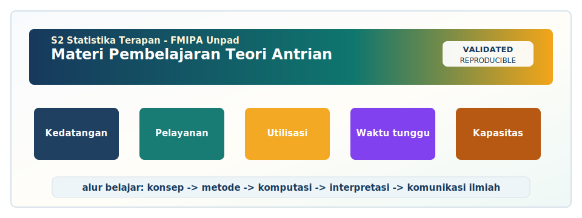

<!-- BEGIN UNPAD MATERIAL STYLE -->
<style>
:root {
  --unpad-navy: #17395c;
  --unpad-gold: #f2a51a;
  --unpad-teal: #0f766e;
  --unpad-ink: #172033;
  --unpad-paper: #fffdf8;
  --unpad-soft: #eef5f8;
  --unpad-line: #d7e2ea;
}
html, body {
  background: linear-gradient(135deg, #f8fbfd 0%, #fffdf8 48%, #f3f6ee 100%) !important;
  color: var(--unpad-ink) !important;
}
body {
  font-family: "Segoe UI", Arial, sans-serif !important;
  line-height: 1.72 !important;
}
.main-container {
  max-width: 1180px !important;
  background: rgba(255, 253, 248, 0.98) !important;
  border: 1px solid var(--unpad-line) !important;
  border-radius: 8px !important;
  box-shadow: 0 18px 42px rgba(23, 57, 92, 0.12) !important;
}
h1, h2, h3, h4 {
  letter-spacing: 0 !important;
}
h1.title {
  color: var(--unpad-navy) !important;
  -webkit-text-fill-color: var(--unpad-navy) !important;
  background: none !important;
}
h2 {
  border-left-color: var(--unpad-gold) !important;
}
a {
  color: #0b5c86 !important;
}
pre, code {
  border-radius: 8px !important;
}
.unpad-cover {
  margin: 18px 0 26px;
  padding: 24px;
  border-radius: 8px;
  background: linear-gradient(135deg, #17395c 0%, #0f766e 58%, #f2a51a 100%);
  color: #ffffff;
  box-shadow: 0 18px 36px rgba(23, 57, 92, 0.22);
}
.unpad-cover__brand {
  display: grid;
  grid-template-columns: 92px 1fr;
  gap: 20px;
  align-items: center;
}
.unpad-cover img {
  width: 92px;
  height: 92px;
  object-fit: contain;
  background: #ffffff;
  border-radius: 8px;
  padding: 8px;
  box-shadow: 0 8px 22px rgba(0,0,0,0.18);
}
.unpad-kicker {
  text-transform: uppercase;
  font-size: 0.82rem;
  font-weight: 800;
  letter-spacing: 0;
  color: #fff8dc;
}
.unpad-cover h2 {
  margin: 6px 0 8px;
  padding: 0;
  border: 0;
  background: transparent;
  color: #ffffff !important;
  font-size: 1.65rem;
}
.unpad-meta {
  margin: 0;
  color: #f7fbff;
  font-weight: 600;
}
.materi-illustration {
  margin: 20px 0 24px;
  padding: 14px;
  background: #ffffff;
  border: 1px solid var(--unpad-line);
  border-radius: 8px;
  box-shadow: 0 12px 28px rgba(23, 57, 92, 0.10);
}
.materi-illustration img {
  width: 100%;
  height: auto;
  display: block;
  border-radius: 6px;
}
.validasi-akademik {
  margin: 18px 0 28px;
  padding: 16px 18px;
  background: linear-gradient(135deg, #eef8f6, #fff8e7);
  border-left: 8px solid var(--unpad-teal);
  border-radius: 8px;
  color: var(--unpad-ink);
}
.validasi-akademik strong {
  color: var(--unpad-navy);
}
table {
  border-radius: 8px !important;
}
@media (max-width: 760px) {
  .unpad-cover__brand {
    grid-template-columns: 1fr;
  }
  .unpad-cover img {
    width: 76px;
    height: 76px;
  }
}
</style>
<!-- END UNPAD MATERIAL STYLE -->


<!-- BEGIN UNPAD MATERIAL ENHANCEMENT -->

```{r setup-unpad-render, include=FALSE}
execute_code <- FALSE
knitr::opts_chunk$set(
  echo = TRUE,
  eval = FALSE,
  message = FALSE,
  warning = FALSE,
  fig.align = "center",
  fig.width = 8,
  fig.height = 4.8,
  dpi = 120
)
set.seed(2025)
```


<div class="unpad-cover">
<div class="unpad-cover__brand">

<div>
<div class="unpad-kicker">S2 Statistika Terapan | FMIPA Universitas Padjadjaran</div>
<h2>Materi Pembelajaran Teori Antrian</h2>
<p class="unpad-meta">S2 Statistika Terapan FMIPA Universitas Padjadjaran<br>Penulis: Dr. Gumgum Darmawan, M.Si | Januari 2025</p>
</div>
</div>
</div>

<div class="materi-illustration">

</div>

<div class="validasi-akademik">
<strong>Catatan validasi akademik.</strong> Materi ini diseragamkan dengan rujukan ADWTL Januari 2025: rumus dibaca bersama asumsi, contoh kode diposisikan sebagai template reproducible, dan interpretasi diarahkan pada validitas data, diagnosis model, evaluasi ketidakpastian, serta komunikasi hasil secara ilmiah.
</div>

<!-- END UNPAD MATERIAL ENHANCEMENT -->

<style>
:root{
  --brown-900:#3b210f; --brown-800:#5a3519; --brown-700:#7a4a24; --brown-600:#9a6738;
  --brown-500:#b98652; --brown-300:#dfbf91; --brown-200:#f0d9b8; --brown-100:#fbf0df;
  --cream:#fffaf3; --ink:#20140d; --muted:#6e5a4a; --gold:#c48a2c; --unpad:#f0b429;
}
html, body { scroll-behavior:smooth; }
body{
  color:var(--ink); font-family:"Segoe UI",Roboto,Helvetica,Arial,sans-serif; line-height:1.7;
  background:linear-gradient(135deg,#fff8ef 0%,#f1d3ab 38%,#bb8752 100%);
  background-attachment:fixed; font-size:16px;
}
.main-container, .container-fluid, .container{
  max-width:1120px !important; margin-left:310px !important; margin-right:38px !important;
  background:rgba(255,250,243,.96); padding:38px 52px; border-radius:26px;
  box-shadow:0 18px 45px rgba(59,33,15,.18); border:1px solid rgba(122,74,36,.18);
}
#TOC{
  position:fixed; left:18px; top:18px; bottom:18px; width:260px; overflow:auto; z-index:1000;
  padding:20px 18px; background:linear-gradient(180deg,#4a2812 0%,#8b5528 55%,#bd8650 100%);
  color:#fff; border-radius:24px; box-shadow:0 12px 32px rgba(59,33,15,.35);
}
#TOC::before{content:"DAFTAR ISI"; display:block; font-weight:800; letter-spacing:.08em; margin-bottom:12px; color:#ffe7ba;}
#TOC a{color:#fff6e5 !important; text-decoration:none; border-bottom:0 !important; font-size:.92rem;}
#TOC a:hover{color:#ffe08a !important; text-decoration:underline;}
#TOC ul{padding-left:1.05rem;}
h1,h2,h3,h4{font-weight:800; color:var(--brown-900); line-height:1.2;}
h1{font-size:2.45rem; border-bottom:4px solid #d3a064; padding-bottom:.35rem;}
h2{font-size:1.8rem; margin-top:2.5rem; padding:16px 20px; color:white; border-radius:18px;
   background:linear-gradient(100deg,#4a2812 0%,#8a5428 50%,#c39156 100%); box-shadow:0 8px 18px rgba(90,53,25,.22);}
h3{font-size:1.35rem; border-left:7px solid var(--brown-600); padding-left:14px; margin-top:1.8rem;}
h4{font-size:1.12rem; color:var(--brown-800);}
a{color:#7b411c; font-weight:600;} strong{color:#442412;}
.hero{
  padding:42px 38px; border-radius:30px; margin:0 0 30px 0; color:white;
  background:linear-gradient(135deg,rgba(59,33,15,.98),rgba(126,74,31,.95),rgba(205,151,83,.9)), radial-gradient(circle at top right,#f8d99d,transparent 35%);
  box-shadow:0 22px 48px rgba(59,33,15,.28); border:1px solid rgba(255,230,185,.55);
}
.hero h1{color:white; border:0; font-size:3rem; margin:0 0 .4rem 0;}
.hero .subtitle{font-size:1.2rem; color:#ffeac4; font-weight:700;}
.badge{display:inline-block; padding:.25rem .62rem; border-radius:999px; color:#3b210f; background:#ffe2a3; margin:.15rem; font-weight:700;}
.callout, .tujuan, .casebox, .activity, .warning, .rpsbox{
  border-radius:20px; padding:20px 24px; margin:20px 0; box-shadow:0 6px 18px rgba(59,33,15,.08);
}
.callout{background:linear-gradient(135deg,#fff7ea,#f2d7b1); border-left:8px solid #9a6738;}
.tujuan{background:linear-gradient(135deg,#fdf5e8,#ead0aa); border:1px solid #d2a16d;}
.casebox{background:#fffdf8; border:1px solid #e1bf92; border-left:8px solid #c48a2c;}
.activity{background:linear-gradient(135deg,#f4e5ce,#fff9ee); border-left:8px solid #6b3e1e;}
.warning{background:#fff2e0; border-left:8px solid #b45309;}
.rpsbox{background:linear-gradient(135deg,#f9ead1,#fff7ea); border:1px dashed #9a6738;}
.formula-box{
  background:linear-gradient(135deg,#f7e7cc 0%,#f3d7ad 100%); color:#1c1209; border:1px solid #d5ad7a;
  border-left:8px solid #8b5e34; padding:18px 20px; border-radius:18px; margin:18px 0;
  box-shadow:inset 0 0 0 1px rgba(255,255,255,.55),0 8px 18px rgba(59,33,15,.08);
}
.formula-box *{color:#1c1209 !important;}
pre, code{background:#f7e3c2 !important; color:#111 !important; border-radius:12px;}
pre{border:1px solid #d3a064; padding:16px; overflow:auto;}
blockquote{background:#fff4df; border-left:8px solid #9a6738; padding:14px 18px; border-radius:14px; color:#3b210f;}
table{border-collapse:collapse; width:100%; margin:16px 0; background:#fffdf8;}
th{background:linear-gradient(90deg,#5a3519,#9a6738); color:white; padding:10px;}
td{border:1px solid #e5c49c; padding:9px; vertical-align:top;}
tr:nth-child(even) td{background:#fff7ea;}
.figurebox{text-align:center; padding:16px; background:#fff7ea; border-radius:20px; border:1px solid #dfbf91; margin:18px 0;}
.small{font-size:.92rem;color:var(--muted);}
hr{border:0; height:2px; background:linear-gradient(90deg,transparent,#a87340,transparent); margin:34px 0;}
@media(max-width:1000px){#TOC{position:relative; width:auto; left:auto; top:auto; bottom:auto;} .main-container,.container,.container-fluid{margin:20px !important; padding:26px !important;}}
</style>


<div class="hero">
<h1>Materi Pembelajaran Teori Antrian</h1>
<div class="subtitle">Program Studi S2 Statistika Terapan - FMIPA Universitas Padjadjaran</div>
<p><span class="badge">Semester 2</span><span class="badge">Bobot 3 SKS: T=2, P=1</span><span class="badge">RPS-OBE 2025</span><span class="badge">Tahun Pembuatan: Januari 2025</span></p>
<p><strong>Dosen Pengampu dan Penulis RPS:</strong> Dr. Gumgum Darmawan, M.Si</p>
<p><strong>Orientasi materi:</strong> pemodelan antrian, analisis berbasis data, simulasi komputer, dan pengembangan inovasi model atau algoritma untuk sistem pelayanan nyata.</p>
</div>

<div class="rpsbox">
<strong>Dasar penyusunan.</strong> Materi ini disusun mengikuti RPS Mata Kuliah <em>Teori Antrian</em> pada Program Studi S2 Statistika Terapan, FMIPA Universitas Padjadjaran. RPS menempatkan mata kuliah ini sebagai mata kuliah wajib semester 2 dengan fokus pada analisis karakteristik sistem antrian, pemodelan berbasis data nyata, simulasi komputer, serta inovasi model/algoritma teori antrian. Struktur materi dibagi ke dalam empat blok SubCPMK: konsep dasar, pemodelan data, simulasi komputer, dan inovasi/komunikasi ilmiah.
</div>

# Identitas Mata Kuliah dan Peta Pembelajaran

## Informasi umum

| Komponen | Informasi |
|---|---|
| Mata kuliah | Teori Antrian |
| Program studi | S2 Statistika Terapan, FMIPA Universitas Padjadjaran |
| Semester | 2 |
| Bobot | 3 SKS, terdiri atas teori 2 SKS dan praktikum 1 SKS |
| Dosen pengampu | Dr. Gumgum Darmawan, M.Si |
| Tahun materi | Januari 2025 |
| Perangkat lunak utama | R dan Python |
| Karakter pembelajaran | Interactive learning, diskusi, praktikum, proyek, presentasi ilmiah |

## Capaian pembelajaran yang dioperasionalkan

Materi ini menerjemahkan CPL3, CPL4, dan CPL5 ke dalam kegiatan belajar yang konkret. CPL3 diarahkan pada kemampuan mengelola dan menganalisis data untuk menyelesaikan permasalahan nyata di bisnis, industri, sosial, aktuaria, biostatistik, dan sains data. CPL4 diterjemahkan menjadi kemampuan membangun algoritma komputasi dengan software statistika untuk memecahkan masalah antrian yang kompleks. CPL5 diterjemahkan menjadi kemampuan berpikir kritis, sistematis, inovatif, dan mandiri dalam riset serta komunikasi ilmiah. Dengan demikian, teori antrian tidak diperlakukan sebagai kumpulan rumus semata, melainkan sebagai perangkat analisis untuk merancang sistem pelayanan yang lebih efektif, efisien, dan berkeadilan.

## Pemetaan 16 pertemuan

| Blok | Pertemuan | Fokus utama | Produk belajar |
|---|---:|---|---|
| SubCPMK1 | 1-4 | Konsep dasar, komponen sistem, notasi Kendall, parameter kinerja | Tugas analisis kasus dan kuis konsep |
| SubCPMK2 | 5-8 | Model M/M/1, M/M/c, variasi model, estimasi parameter, validasi data | Laporan praktikum, mini project, UTS |
| SubCPMK3 | 9-12 | Simulasi kejadian diskrit, algoritma, implementasi R/Python, evaluasi skenario | Proyek simulasi dan laporan kode |
| SubCPMK4 | 13-16 | Jaringan antrian, prioritas, perilaku pelanggan, inovasi model, penulisan ilmiah | Makalah riset, presentasi, UAS |

## Cara menggunakan modul ini

Modul ini dibuat dalam format R Markdown agar dapat dibaca sebagai HTML profesional, dikembangkan menjadi bahan ajar interaktif, dan dilengkapi kode yang dapat direproduksi. Mahasiswa sebaiknya membaca bagian konsep sebelum menjalankan kode, karena kode dalam teori antrian hanya bermakna jika asumsi model dipahami. Dosen dapat menggunakan modul ini sebagai bahan kuliah, bahan praktikum, lembar kerja proyek, atau bahan diskusi. Setiap bagian memuat konsep, rumus, contoh kasus, algoritma kerja, potongan kode R/Python, latihan, dan catatan interpretasi. Struktur ini sengaja dibuat konsisten agar mahasiswa memperoleh alur berpikir yang stabil: memahami sistem, mengumpulkan data, memilih model, menghitung indikator, memvalidasi asumsi, melakukan simulasi jika perlu, lalu menyusun rekomendasi.

## Ilustrasi dasar sistem antrian


<div class="figurebox">
<svg width="880" height="235" viewBox="0 0 880 235" xmlns="http://www.w3.org/2000/svg" role="img" aria-label="Ilustrasi sistem antrian">
  <defs>
    <linearGradient id="g1" x1="0" x2="1"><stop offset="0" stop-color="#5a3519"/><stop offset="1" stop-color="#c39156"/></linearGradient>
    <filter id="shadow" x="-10%" y="-10%" width="120%" height="130%"><feDropShadow dx="0" dy="5" stdDeviation="5" flood-color="#5a3519" flood-opacity="0.25"/></filter>
  </defs>
  <rect x="15" y="15" width="850" height="205" rx="28" fill="#fff5e6" stroke="#d0a06c"/>
  <text x="440" y="44" text-anchor="middle" font-size="22" font-family="Segoe UI" font-weight="800" fill="#3b210f">Struktur Dasar Sistem Antrian</text>
  <g filter="url(#shadow)">
    <rect x="50" y="86" width="150" height="80" rx="18" fill="url(#g1)"/>
    <text x="125" y="118" text-anchor="middle" font-size="17" fill="white" font-weight="700">Kedatangan</text>
    <text x="125" y="144" text-anchor="middle" font-size="14" fill="#ffe8c0">arrival process</text>
  </g>
  <path d="M210 126 H285" stroke="#7a4a24" stroke-width="6" marker-end="url(#arrow)"/>
  <defs><marker id="arrow" markerWidth="10" markerHeight="10" refX="8" refY="3" orient="auto"><path d="M0,0 L0,6 L9,3 z" fill="#7a4a24"/></marker></defs>
  <g>
    <rect x="295" y="82" width="190" height="88" rx="18" fill="#f3d7ad" stroke="#9a6738" stroke-width="3"/>
    <circle cx="330" cy="126" r="17" fill="#9a6738"/><circle cx="375" cy="126" r="17" fill="#9a6738"/><circle cx="420" cy="126" r="17" fill="#9a6738"/>
    <text x="390" y="190" text-anchor="middle" font-size="15" fill="#3b210f" font-weight="700">Antrian / waiting line</text>
  </g>
  <path d="M495 126 H560" stroke="#7a4a24" stroke-width="6" marker-end="url(#arrow)"/>
  <g filter="url(#shadow)">
    <rect x="570" y="73" width="130" height="105" rx="18" fill="#7a4a24"/>
    <text x="635" y="113" text-anchor="middle" font-size="16" fill="white" font-weight="700">Pelayanan</text>
    <text x="635" y="139" text-anchor="middle" font-size="14" fill="#ffe8c0">server</text>
  </g>
  <path d="M710 126 H780" stroke="#7a4a24" stroke-width="6" marker-end="url(#arrow)"/>
  <g filter="url(#shadow)">
    <rect x="785" y="93" width="55" height="66" rx="16" fill="#c39156"/>
    <text x="812" y="132" text-anchor="middle" font-size="13" fill="#3b210f" font-weight="800">Keluar</text>
  </g>
  <text x="440" y="211" text-anchor="middle" font-size="13" fill="#6e5a4a">Parameter kunci: λ kedatangan, μ pelayanan, c server, ρ utilisasi, L jumlah dalam sistem, W waktu tunggu.</text>
</svg>
</div>


<div class="callout">
<strong>Gagasan utama.</strong> Sistem antrian adalah sistem stokastik yang menghubungkan proses kedatangan, mekanisme pelayanan, disiplin antrean, kapasitas sistem, jumlah pelayan, dan populasi sumber. Yang dianalisis bukan hanya panjang antrean, tetapi juga waktu tunggu, utilisasi server, probabilitas kosong, probabilitas penuh, probabilitas menunggu, serta konsekuensi biaya dan mutu layanan.
</div>

## Referensi inti

Referensi utama yang digunakan dalam modul ini meliputi buku klasik dan modern teori antrian [@gross2018; @kleinrock1975; @bhat2015], dasar proses stokastik dan probabilitas [@ross2014; @tijms2003], hukum Little [@little1961], notasi Kendall [@kendall1953], serta literatur simulasi kejadian diskrit [@banks2010; @law2015; @nelson2013]. Untuk pembahasan jaringan antrian dan aplikasi komputasi, modul juga merujuk pada literatur queueing networks dan performance modeling [@bolch2006; @harcholbalter2013; @whitt2002].


```{r setup, include=FALSE, eval=FALSE}
knitr::opts_chunk$set(echo = TRUE, message = FALSE, warning = FALSE, fig.width = 8, fig.height = 5)
```

# Landasan Teori dan Cara Berpikir Sistem

Teori antrian lahir dari kebutuhan praktis untuk memahami mengapa layanan dengan kapasitas yang tampaknya cukup tetap dapat menghasilkan antrean panjang. Pada level magister, fokus pembelajaran tidak berhenti pada penggunaan rumus, tetapi meluas pada kemampuan membaca sistem, menguji asumsi, menyusun model, dan menerjemahkan hasil ke dalam kebijakan layanan. Dalam kerangka ini, sistem antrian dipahami sebagai sistem stokastik: kedatangan tidak sepenuhnya dapat diprediksi, durasi pelayanan bervariasi, dan keputusan operasional selalu berhadapan dengan ketidakpastian.

Setiap sistem antrian memiliki struktur input, proses, dan output. Input berkaitan dengan sumber kedatangan dan pola waktu antar-kedatangan. Proses berkaitan dengan aturan pelayanan, jumlah server, kapasitas ruang tunggu, dan disiplin antrian. Output berupa pelanggan yang telah dilayani, pelanggan yang menunggu, pelanggan yang hilang, atau pelanggan yang meninggalkan sistem. Ketika tiga unsur ini dibaca secara terpisah, analisis cenderung dangkal; ketika dibaca sebagai satu sistem, kita dapat menemukan bottleneck yang benar-benar menentukan performa.

Asumsi distribusi merupakan jantung teori antrian. Model M/M/1, misalnya, tidak hanya menyatakan satu server, tetapi juga menyatakan kedatangan Markovian dan pelayanan Markovian. Ini berarti waktu antar-kedatangan dan waktu pelayanan diasumsikan eksponensial, dan jumlah kedatangan pada interval waktu tertentu mengikuti proses Poisson. Jika data nyata tidak mendukung asumsi ini, model analitik tetap dapat menjadi baseline, tetapi interpretasinya perlu lebih hati-hati.

Dalam aplikasi nyata, analis sering berhadapan dengan data yang tidak rapi: pencatatan waktu tidak lengkap, definisi pelanggan tidak konsisten, jam layanan berubah, atau ada pelanggan yang dilayani melalui jalur khusus. Materi ini menekankan bahwa pembersihan dan audit data merupakan bagian dari pemodelan. Model yang indah di papan tulis dapat menjadi sangat rapuh jika data yang masuk tidak mewakili mekanisme layanan yang sesungguhnya.

Ukuran kinerja seperti $L_q$, $L_s$, $W_q$, dan $W_s$ harus dibaca sebagai bahasa manajerial. $L_q$ berbicara tentang rata-rata panjang antrian; $W_q$ berbicara tentang pengalaman menunggu; $L_s$ dan $W_s$ berbicara tentang beban total sistem. Dalam layanan publik, waktu tunggu tidak hanya berarti efisiensi, tetapi juga akses, kepuasan, dan keadilan. Karena itu rekomendasi berbasis teori antrian perlu selalu dikaitkan dengan konteks substantif.

Simulasi komputer menjadi penting ketika model analitik terlalu menyederhanakan realitas. Sistem dengan prioritas, jam kedatangan tidak homogen, server bergiliran, perilaku pelanggan meninggalkan antrean, atau routing bertahap lebih mudah ditangani dengan simulasi kejadian diskrit. Namun simulasi juga bukan jawaban otomatis. Simulasi harus dirancang, diverifikasi, divalidasi, direplikasi, dan dilaporkan dengan standar ilmiah yang jelas.

Di sisi riset, teori antrian menyediakan ruang inovasi yang luas. Inovasi dapat berupa model baru, algoritma simulasi yang lebih efisien, integrasi data real-time, penggabungan optimasi biaya, atau pendekatan prediktif untuk mengantisipasi lonjakan kedatangan. Mahasiswa S2 Statistika Terapan diharapkan mampu membaca gap antara teori dan kebutuhan aplikasi, lalu mengembangkan solusi yang dapat dipertanggungjawabkan secara statistik.

Materi ini juga menempatkan komunikasi ilmiah sebagai kompetensi utama. Hasil analisis antrian sering dibutuhkan oleh manajer layanan, rumah sakit, operator transportasi, unit administrasi, atau pembuat kebijakan. Laporan yang baik harus menjelaskan asumsi, sumber data, metode estimasi, keterbatasan, dan rekomendasi. Tanpa komunikasi yang jelas, model terbaik pun dapat gagal memengaruhi keputusan.

<div class="formula-box">
$$	ext{Sistem Antrian} = 	ext{Kedatangan} + 	ext{Antrean} + 	ext{Pelayanan} + 	ext{Aturan} + 	ext{Kapasitas}$$

Persamaan konseptual ini bukan rumus probabilitas, tetapi pengingat bahwa performa sistem lahir dari interaksi beberapa komponen. Mengubah satu komponen dapat memindahkan bottleneck ke komponen lain.
</div>

## Prinsip pedagogis modul

Modul ini menggunakan empat prinsip pedagogis. Pertama, setiap konsep harus dikaitkan dengan kasus nyata agar mahasiswa melihat relevansi teori. Kedua, setiap rumus harus disertai interpretasi satuan dan batasan asumsi. Ketiga, setiap model analitik perlu dibandingkan dengan data atau simulasi ketika kasus nyata cukup kompleks. Keempat, setiap rekomendasi harus ditulis dalam bahasa yang dapat dipahami pengambil keputusan tanpa menghilangkan akurasi statistik. Dengan prinsip ini, mahasiswa diharapkan tidak sekadar menghitung, tetapi juga berpikir sebagai analis sistem pelayanan.

## Alur analisis umum

1. Pahami konteks layanan dan tentukan batas sistem.
2. Buat diagram proses dari kedatangan sampai keluar sistem.
3. Kumpulkan dan audit data timestamp.
4. Hitung ringkasan kedatangan, pelayanan, dan antrean.
5. Pilih model analitik awal berdasarkan notasi Kendall.
6. Estimasi parameter dan hitung ukuran kinerja.
7. Validasi asumsi melalui data, visualisasi, dan diskusi lapangan.
8. Lakukan simulasi jika model analitik terlalu sederhana.
9. Bandingkan skenario perbaikan.
10. Susun rekomendasi dan komunikasikan keterbatasan.

## Pertemuan 1: Pendahuluan dan Konsep Dasar Teori Antrian

<div class="tujuan">
<strong>Tujuan pembelajaran.</strong> Setelah mempelajari bagian ini, mahasiswa diharapkan mampu menjelaskan konsep utama pendahuluan dan konsep dasar teori antrian, menghubungkannya dengan kerangka input-proses-output, menerapkan rumus kunci L=\lambda W, serta menyusun analisis awal untuk konteks pelayanan administrasi kampus, bank, rumah sakit, kasir minimarket, dan helpdesk digital.
</div>

Pada pertemuan ini, topik Pendahuluan dan Konsep Dasar Teori Antrian diposisikan sebagai jembatan antara teori stokastik dan keputusan operasional. Mahasiswa perlu memahami bahwa kerangka input-proses-output bukan label matematis yang berdiri sendiri, melainkan representasi dari mekanisme layanan yang diamati. Dalam konteks pelayanan administrasi kampus, bank, rumah sakit, kasir minimarket, dan helpdesk digital, pemilihan model harus dimulai dari pertanyaan substantif: siapa yang datang, kapan mereka datang, bagaimana mereka dilayani, apa yang terjadi ketika kapasitas penuh, dan indikator apa yang dianggap penting oleh pengelola layanan. Pertanyaan tersebut membuat model lebih grounded dan mengurangi risiko penggunaan rumus secara mekanis.

Fokus analitis utama bagian ini adalah membedakan fenomena antrean sebagai gejala stokastik, bukan sekadar barisan orang. Fokus tersebut menuntut mahasiswa membaca data dan sistem secara bersamaan. Data kedatangan memberi informasi tentang tekanan permintaan; data pelayanan memberi informasi tentang kapasitas aktual; sedangkan observasi disiplin antrian menjelaskan aturan prioritas yang mungkin tidak tertulis. Apabila ketiga sumber informasi ini tidak disatukan, kesimpulan dapat keliru. Misalnya, waktu tunggu yang tinggi mungkin bukan disebabkan oleh kurangnya server, melainkan oleh variasi pelayanan yang ekstrem atau adanya jalur prioritas yang tidak dicatat dalam data.

Dalam pembelajaran berbasis RPS, SubCPMK1 menuntut capaian kognitif yang lebih tinggi daripada menghafal definisi. Mahasiswa harus dapat menganalisis, mengevaluasi, atau menciptakan solusi. Karena itu, bagian Pendahuluan dan Konsep Dasar Teori Antrian selalu dikaitkan dengan aktivitas membuat peta proses layanan dan mengidentifikasi titik bottleneck. Aktivitas komputasional tidak dimaksudkan menggantikan pemahaman konsep; sebaliknya, komputasi digunakan untuk memperlihatkan bagaimana perubahan parameter mengubah performa sistem secara kuantitatif.

Dari sisi statistik, model antrian menggabungkan proses stokastik, estimasi parameter, validasi asumsi, dan interpretasi keputusan. Laju kedatangan $\lambda$ tidak boleh diperlakukan sebagai angka tetap tanpa melihat periode pengamatan. Laju pelayanan $\mu$ tidak boleh dihitung tanpa memahami definisi awal dan akhir pelayanan. Utilisasi $\rho$ tidak boleh ditafsirkan semata-mata sebagai produktivitas, karena utilisasi yang terlalu tinggi dapat membuat sistem rentan terhadap fluktuasi acak. Ketelitian semacam ini penting untuk menjaga agar rekomendasi tidak menyesatkan.

Contoh pada pelayanan administrasi kampus, bank, rumah sakit, kasir minimarket, dan helpdesk digital menunjukkan bahwa sistem antrian hampir selalu memiliki dimensi manusia. Pelanggan yang menunggu terlalu lama dapat kecewa, sakit, kehilangan kesempatan kerja, atau beralih ke layanan lain. Server yang terus bekerja pada utilisasi sangat tinggi dapat mengalami kelelahan, menurunkan kualitas layanan, atau membuat kesalahan. Oleh sebab itu, model kerangka input-proses-output sebaiknya dibaca sebagai alat untuk mencari keseimbangan antara efisiensi, mutu, dan keberlanjutan kerja.

Secara metodologis, asumsi harus selalu disebutkan sebelum hasil. Jika model menggunakan kedatangan Poisson, jelaskan mengapa asumsi itu masuk akal atau bagaimana data mendukungnya. Jika model menggunakan pelayanan eksponensial, jelaskan apakah variasi pelayanan memang tinggi dan memoryless cukup realistis. Jika asumsi tidak terpenuhi, mahasiswa dapat menggunakan model alternatif, pendekatan robust, atau simulasi. Prinsipnya sederhana: model boleh sederhana, tetapi kesadaran terhadap penyederhanaan tidak boleh hilang.

Dalam tugas dan proyek, mahasiswa dianjurkan menyajikan hasil dalam tiga lapis: lapis deskriptif, lapis model, dan lapis rekomendasi. Lapis deskriptif berisi ringkasan kedatangan, pelayanan, dan antrean. Lapis model berisi parameter, rumus, hasil estimasi, dan validasi. Lapis rekomendasi menjelaskan tindakan yang dapat dilakukan, misalnya menambah server, mengubah jadwal, memisahkan jalur layanan, mengatur prioritas, atau memperbaiki pencatatan data. Struktur tiga lapis ini membuat laporan lebih mudah dinilai dan lebih berguna untuk pengguna.

Bagian ini menggunakan rujukan [@gross2018; @kleinrock1975] sebagai landasan konseptual. Rujukan tersebut penting karena teori antrian telah berkembang dari persoalan telekomunikasi klasik menjadi alat analisis untuk layanan publik, sistem kesehatan, transportasi, manufaktur, komputer, dan platform digital. Dengan membaca literatur, mahasiswa dapat melihat bahwa rumus yang tampak sederhana sering memiliki sejarah panjang, asumsi yang ketat, dan aplikasi yang luas. Ini bagian yang membuat teori antrian tidak sekadar antre di fotokopian; antreannya punya martabat ilmiah.

Pada pertemuan ini, topik Pendahuluan dan Konsep Dasar Teori Antrian diposisikan sebagai jembatan antara teori stokastik dan keputusan operasional. Mahasiswa perlu memahami bahwa kerangka input-proses-output bukan label matematis yang berdiri sendiri, melainkan representasi dari mekanisme layanan yang diamati. Dalam konteks pelayanan administrasi kampus, bank, rumah sakit, kasir minimarket, dan helpdesk digital, pemilihan model harus dimulai dari pertanyaan substantif: siapa yang datang, kapan mereka datang, bagaimana mereka dilayani, apa yang terjadi ketika kapasitas penuh, dan indikator apa yang dianggap penting oleh pengelola layanan. Pertanyaan tersebut membuat model lebih grounded dan mengurangi risiko penggunaan rumus secara mekanis.

Fokus analitis utama bagian ini adalah membedakan fenomena antrean sebagai gejala stokastik, bukan sekadar barisan orang. Fokus tersebut menuntut mahasiswa membaca data dan sistem secara bersamaan. Data kedatangan memberi informasi tentang tekanan permintaan; data pelayanan memberi informasi tentang kapasitas aktual; sedangkan observasi disiplin antrian menjelaskan aturan prioritas yang mungkin tidak tertulis. Apabila ketiga sumber informasi ini tidak disatukan, kesimpulan dapat keliru. Misalnya, waktu tunggu yang tinggi mungkin bukan disebabkan oleh kurangnya server, melainkan oleh variasi pelayanan yang ekstrem atau adanya jalur prioritas yang tidak dicatat dalam data.

Dalam pembelajaran berbasis RPS, SubCPMK1 menuntut capaian kognitif yang lebih tinggi daripada menghafal definisi. Mahasiswa harus dapat menganalisis, mengevaluasi, atau menciptakan solusi. Karena itu, bagian Pendahuluan dan Konsep Dasar Teori Antrian selalu dikaitkan dengan aktivitas membuat peta proses layanan dan mengidentifikasi titik bottleneck. Aktivitas komputasional tidak dimaksudkan menggantikan pemahaman konsep; sebaliknya, komputasi digunakan untuk memperlihatkan bagaimana perubahan parameter mengubah performa sistem secara kuantitatif.

Dari sisi statistik, model antrian menggabungkan proses stokastik, estimasi parameter, validasi asumsi, dan interpretasi keputusan. Laju kedatangan $\lambda$ tidak boleh diperlakukan sebagai angka tetap tanpa melihat periode pengamatan. Laju pelayanan $\mu$ tidak boleh dihitung tanpa memahami definisi awal dan akhir pelayanan. Utilisasi $\rho$ tidak boleh ditafsirkan semata-mata sebagai produktivitas, karena utilisasi yang terlalu tinggi dapat membuat sistem rentan terhadap fluktuasi acak. Ketelitian semacam ini penting untuk menjaga agar rekomendasi tidak menyesatkan.

Contoh pada pelayanan administrasi kampus, bank, rumah sakit, kasir minimarket, dan helpdesk digital menunjukkan bahwa sistem antrian hampir selalu memiliki dimensi manusia. Pelanggan yang menunggu terlalu lama dapat kecewa, sakit, kehilangan kesempatan kerja, atau beralih ke layanan lain. Server yang terus bekerja pada utilisasi sangat tinggi dapat mengalami kelelahan, menurunkan kualitas layanan, atau membuat kesalahan. Oleh sebab itu, model kerangka input-proses-output sebaiknya dibaca sebagai alat untuk mencari keseimbangan antara efisiensi, mutu, dan keberlanjutan kerja.

Secara metodologis, asumsi harus selalu disebutkan sebelum hasil. Jika model menggunakan kedatangan Poisson, jelaskan mengapa asumsi itu masuk akal atau bagaimana data mendukungnya. Jika model menggunakan pelayanan eksponensial, jelaskan apakah variasi pelayanan memang tinggi dan memoryless cukup realistis. Jika asumsi tidak terpenuhi, mahasiswa dapat menggunakan model alternatif, pendekatan robust, atau simulasi. Prinsipnya sederhana: model boleh sederhana, tetapi kesadaran terhadap penyederhanaan tidak boleh hilang.

### Rumus dan interpretasi inti

<div class="formula-box">
$$L=\lambda W$$

Hukum Little menyatakan bahwa rata-rata jumlah entitas dalam sistem sama dengan laju kedatangan efektif dikalikan rata-rata waktu dalam sistem. Rumus ini kuat karena berlaku luas pada sistem stabil, meskipun distribusi kedatangan dan pelayanan tidak harus selalu eksponensial.
</div>


### Contoh kasus terapan

<div class="casebox">
<strong>Skenario.</strong> Pertimbangkan pelayanan administrasi kampus, bank, rumah sakit, kasir minimarket, dan helpdesk digital. Pengelola ingin mengetahui apakah sistem saat ini masih layak dipertahankan, perlu ditambah kapasitas, atau cukup diperbaiki melalui perubahan disiplin pelayanan. Data minimal yang perlu dikumpulkan adalah waktu kedatangan, waktu mulai pelayanan, waktu selesai pelayanan, jumlah server aktif, jumlah pelanggan yang meninggalkan antrean, dan catatan kejadian khusus seperti gangguan sistem atau pergantian shift.
</div>

| Elemen analisis | Pertanyaan operasional | Bentuk data yang dibutuhkan | Output statistik |
|---|---|---|---|
| Kedatangan | Apakah permintaan stabil sepanjang hari? | Timestamp kedatangan atau interval antar-kedatangan | $\hat{\lambda}$, pola jam sibuk, grafik kedatangan |
| Pelayanan | Apakah durasi pelayanan homogen? | Waktu mulai dan selesai pelayanan | $\hat{\mu}$, varians pelayanan, distribusi empiris |
| Kapasitas | Apakah server cukup pada jam sibuk? | Jumlah server aktif dan jam kerja | Utilisasi, probabilitas menunggu, kebutuhan server |
| Antrean | Apakah pelanggan menunggu terlalu lama? | Waktu masuk antrean dan awal pelayanan | $W_q$, $L_q$, persentil waktu tunggu |
| Rekomendasi | Skenario mana paling masuk akal? | Hasil model dan simulasi | Perbandingan skenario, implikasi biaya dan mutu |

Analisis kasus tidak boleh dimulai dari rumus semata. Langkah pertama adalah memetakan alur layanan dan menentukan batas sistem. Batas sistem menentukan siapa yang dihitung sebagai pelanggan, kapan pelanggan dianggap masuk, kapan pelanggan dianggap selesai, dan kejadian apa yang berada di luar sistem. Pada layanan rumah sakit, misalnya, pasien dapat berpindah dari pendaftaran ke triase, dokter, laboratorium, dan farmasi. Jika hanya satu loket yang diamati, kesimpulan tentang keseluruhan pengalaman pasien dapat bias. Sebaliknya, jika seluruh jalur diamati tanpa membedakan node layanan, model menjadi terlalu kasar.

Langkah kedua adalah menyusun ringkasan data. Rata-rata tidak cukup; mahasiswa perlu melihat simpangan baku, persentil, pencilan, dan pola waktu. Dalam sistem antrian, variasi sering lebih merusak daripada rata-rata. Dua layanan dengan rata-rata waktu pelayanan lima menit dapat menghasilkan antrean berbeda jika layanan pertama memiliki durasi hampir selalu lima menit, sedangkan layanan kedua kadang satu menit dan kadang dua puluh menit. Karena itu interpretasi performa harus menyebutkan variasi, bukan hanya mean.

Langkah ketiga adalah memilih model awal. Model awal dapat berupa model analitik sederhana seperti kerangka input-proses-output, kemudian diperluas jika asumsi tidak memadai. Model awal berguna sebagai baseline karena memberi rumus yang jelas dan membantu membangun intuisi. Setelah baseline diperoleh, mahasiswa dapat membandingkannya dengan data empiris dan simulasi. Perbandingan ini sering menghasilkan insight: apakah penyimpangan terjadi karena distribusi kedatangan, distribusi pelayanan, kapasitas, disiplin, atau perilaku pelanggan.

Langkah keempat adalah merumuskan rekomendasi. Rekomendasi yang baik harus operasional. Pernyataan seperti "sistem perlu diperbaiki" terlalu umum. Pernyataan yang lebih kuat adalah "menambah satu server pada pukul 08.00-10.00 diperkirakan menurunkan rata-rata waktu tunggu dari 18 menit menjadi 7 menit, dengan utilisasi server tetap berada di bawah 0,85". Rekomendasi seperti ini dapat diuji, dipertimbangkan biayanya, dan dikomunikasikan kepada pengelola layanan.


### Algoritma kerja analisis

1. Definisikan batas sistem: siapa pelanggan, apa unit layanan, kapan proses dimulai, dan kapan proses selesai.
2. Identifikasi komponen kerangka input-proses-output: proses kedatangan, proses pelayanan, jumlah server, kapasitas, populasi sumber, dan disiplin antrean.
3. Kumpulkan data minimum: timestamp kedatangan, timestamp mulai pelayanan, timestamp selesai pelayanan, jumlah server aktif, dan catatan kejadian khusus.
4. Hitung ringkasan statistik: rata-rata, varians, persentil, pola waktu, serta indikator outlier.
5. Estimasikan parameter yang relevan, terutama $\lambda$, $\mu$, $c$, dan ukuran variasi pelayanan.
6. Pilih model awal yang paling sederhana tetapi masih masuk akal.
7. Hitung indikator kinerja seperti $L_q$, $L_s$, $W_q$, $W_s$, probabilitas menunggu, atau probabilitas blocking.
8. Validasi hasil dengan data empiris, diskusi lapangan, dan bila perlu simulasi.
9. Bandingkan skenario perbaikan, misalnya perubahan jumlah server, jadwal shift, prioritas, atau kapasitas ruang tunggu.
10. Susun rekomendasi yang menyebutkan asumsi, bukti kuantitatif, keterbatasan, dan konsekuensi implementasi.

Algoritma di atas tampak linear, tetapi dalam praktik bersifat iteratif. Setelah validasi dilakukan, mahasiswa mungkin perlu kembali ke tahap pengumpulan data atau definisi sistem. Iterasi ini sehat karena menunjukkan bahwa model sedang dikalibrasi dengan realitas. Dalam riset terapan, model yang langsung tampak sempurna justru sering mencurigakan; mungkin karena analis belum cukup keras menguji asumsi.


### Validasi, interpretasi, dan kesalahan umum

Validasi dimulai dari pertanyaan sederhana: apakah parameter yang dihitung masuk akal menurut orang yang memahami layanan? Jika estimasi $\lambda$ menyatakan 120 pelanggan per jam tetapi loket hanya menerima 40 nomor antrean per hari, ada kesalahan definisi waktu atau unit pengamatan. Jika estimasi $\mu$ menyatakan rata-rata pelayanan 30 detik padahal observasi lapangan menunjukkan proses administratif membutuhkan beberapa menit, maka timestamp mungkin salah dicatat. Pemeriksaan kewajaran semacam ini sering lebih cepat menemukan masalah daripada uji statistik formal.

Kesalahan umum pertama adalah mencampur satuan waktu. Laju kedatangan per jam harus dipasangkan dengan laju pelayanan per jam. Jika $\lambda$ dihitung per menit dan $\mu$ dihitung per jam, utilisasi akan salah besar. Kesalahan umum kedua adalah mengabaikan jam sibuk. Menghitung satu rata-rata harian dapat menyembunyikan overload pada periode tertentu. Kesalahan umum ketiga adalah menganggap semua server identik, padahal kemampuan, pengalaman, atau jenis layanan yang ditangani dapat berbeda. Kesalahan umum keempat adalah menyimpulkan sebab hanya dari korelasi deskriptif tanpa mengecek alur layanan.

Interpretasi harus selalu menghubungkan angka dengan keputusan. Nilai $W_q$ sebesar 12 menit mungkin kecil untuk layanan laboratorium yang kompleks, tetapi sangat besar untuk loket pengambilan dokumen sederhana. Utilisasi 0,95 mungkin terlihat efisien, tetapi rentan menyebabkan antrean meledak ketika ada variasi kedatangan. Probabilitas menunggu 0,70 mungkin diterima pada layanan murah dan nonkritis, tetapi bermasalah pada layanan kesehatan atau keadaan darurat. Dengan demikian, standar performa harus ditentukan bersama konteks.

Pada bagian Pendahuluan dan Konsep Dasar Teori Antrian, mahasiswa juga perlu membedakan hasil analitik dan hasil simulasi. Hasil analitik memberikan ekspresi tertutup yang elegan, tetapi bergantung pada asumsi. Hasil simulasi lebih fleksibel, tetapi memiliki error Monte Carlo dan membutuhkan desain eksperimen. Jika keduanya sejalan, kepercayaan terhadap analisis meningkat. Jika keduanya berbeda, perbedaan itu harus dijelaskan, bukan disembunyikan seperti typo di laporan akhir.


### Latihan dan tugas mini

1. Pilih satu sistem layanan di sekitar kampus atau tempat kerja. Buat diagram alur layanan, lalu tentukan batas sistem dan definisi pelanggan.
2. Untuk konteks pelayanan administrasi kampus, bank, rumah sakit, kasir minimarket, dan helpdesk digital, jelaskan data apa saja yang harus dikumpulkan agar model kerangka input-proses-output dapat digunakan secara bertanggung jawab.
3. Turunkan interpretasi operasional dari rumus kunci L=\lambda W. Jelaskan arti setiap simbol dan satuan yang digunakan.
4. Buat skenario perubahan kapasitas layanan. Prediksi arah perubahan $W_q$, $L_q$, dan utilisasi sebelum melakukan perhitungan formal.
5. Tuliskan dua asumsi model yang paling mungkin dilanggar pada kasus nyata, lalu jelaskan dampaknya terhadap hasil analisis.

<div class="activity">
<strong>Output yang dikumpulkan.</strong> Mahasiswa menyiapkan catatan 1-2 halaman berisi deskripsi sistem, sketsa alur, tabel data yang diperlukan, model awal yang dipilih, serta dugaan keterbatasan. Untuk pertemuan proyek, catatan ini menjadi bahan diskusi kelompok dan dasar penyusunan laporan.
</div>


### Catatan pendalaman untuk diskusi kelas

Pendekatan terbaik dalam teori antrian adalah berpikir seperti konsultan statistik sekaligus peneliti. Sebagai konsultan, mahasiswa harus peka terhadap kebutuhan pengambil keputusan: seberapa lama pelanggan boleh menunggu, berapa biaya tambahan server, bagaimana jadwal kerja disusun, dan apakah rekomendasi dapat dilaksanakan. Sebagai peneliti, mahasiswa harus menjaga validitas: asumsi harus dinyatakan, data harus diaudit, estimasi harus dijelaskan, dan keterbatasan harus diakui. Keduanya tidak bertentangan; justru kombinasi ini yang membuat analisis statistik bernilai.

Dalam diskusi kelas, dosen dapat meminta mahasiswa membandingkan dua strategi perbaikan: menambah server atau mengurangi variasi pelayanan. Banyak mahasiswa secara intuitif memilih menambah server, padahal standardisasi proses, pemisahan jenis layanan, atau pre-screening dokumen dapat menurunkan variasi pelayanan dengan biaya lebih rendah. Teori antrian membantu memperlihatkan bahwa kapasitas bukan satu-satunya tuas kebijakan. Variabilitas, disiplin, routing, dan informasi kepada pelanggan juga dapat memengaruhi performa.

Untuk mahasiswa S2, kualitas analisis diukur dari kedalaman argumentasi. Jawaban "karena rumusnya demikian" belum cukup. Mahasiswa perlu menjawab mengapa rumus tersebut relevan, apa asumsi di baliknya, apakah data mendukung asumsi, apa konsekuensi jika asumsi dilanggar, dan bagaimana hasilnya akan berubah jika parameter berbeda. Kebiasaan bertanya seperti ini akan sangat membantu ketika mahasiswa menyusun mini project, proyek simulasi, dan makalah inovasi.

Di akhir pertemuan, mahasiswa sebaiknya menuliskan satu insight metodologis dan satu insight praktis. Insight metodologis bisa berupa pemahaman tentang hubungan antara $\lambda$, $\mu$, dan $\rho$. Insight praktis bisa berupa kesadaran bahwa antrean panjang tidak selalu berarti pegawai lambat; bisa saja demand melebihi kapasitas pada jam tertentu, pelanggan tidak memiliki informasi, atau proses layanan terlalu heterogen. Kebiasaan memisahkan diagnosis dari prasangka adalah bekal penting dalam analisis statistik terapan.


### Ringkasan pertemuan

Pertemuan 1 menekankan membedakan fenomena antrean sebagai gejala stokastik, bukan sekadar barisan orang melalui pembahasan pendahuluan dan konsep dasar teori antrian. Mahasiswa mempelajari bagaimana kerangka input-proses-output digunakan untuk membaca sistem nyata, bagaimana parameter kunci seperti $\lambda$, $\mu$, $c$, dan $\rho$ diinterpretasikan, serta bagaimana hasil analisis diterjemahkan menjadi rekomendasi. Bagian ini juga menyiapkan mahasiswa untuk tugas analisis kasus, praktikum pemodelan, proyek simulasi, dan pengembangan inovasi model pada bagian berikutnya.


## Pertemuan 2: Komponen Sistem Antrian: Kedatangan, Pelayanan, Disiplin, Kapasitas

<div class="tujuan">
<strong>Tujuan pembelajaran.</strong> Setelah mempelajari bagian ini, mahasiswa diharapkan mampu menjelaskan konsep utama komponen sistem antrian: kedatangan, pelayanan, disiplin, kapasitas, menghubungkannya dengan arrival process, service mechanism, queue discipline, menerapkan rumus kunci \rho=\lambda/(c\mu), serta menyusun analisis awal untuk konteks loket layanan publik dengan jam sibuk pagi dan jeda siang.
</div>

Pada pertemuan ini, topik Komponen Sistem Antrian: Kedatangan, Pelayanan, Disiplin, Kapasitas diposisikan sebagai jembatan antara teori stokastik dan keputusan operasional. Mahasiswa perlu memahami bahwa arrival process, service mechanism, queue discipline bukan label matematis yang berdiri sendiri, melainkan representasi dari mekanisme layanan yang diamati. Dalam konteks loket layanan publik dengan jam sibuk pagi dan jeda siang, pemilihan model harus dimulai dari pertanyaan substantif: siapa yang datang, kapan mereka datang, bagaimana mereka dilayani, apa yang terjadi ketika kapasitas penuh, dan indikator apa yang dianggap penting oleh pengelola layanan. Pertanyaan tersebut membuat model lebih grounded dan mengurangi risiko penggunaan rumus secara mekanis.

Fokus analitis utama bagian ini adalah menghubungkan komponen sistem dengan parameter operasional. Fokus tersebut menuntut mahasiswa membaca data dan sistem secara bersamaan. Data kedatangan memberi informasi tentang tekanan permintaan; data pelayanan memberi informasi tentang kapasitas aktual; sedangkan observasi disiplin antrian menjelaskan aturan prioritas yang mungkin tidak tertulis. Apabila ketiga sumber informasi ini tidak disatukan, kesimpulan dapat keliru. Misalnya, waktu tunggu yang tinggi mungkin bukan disebabkan oleh kurangnya server, melainkan oleh variasi pelayanan yang ekstrem atau adanya jalur prioritas yang tidak dicatat dalam data.

Dalam pembelajaran berbasis RPS, SubCPMK1 menuntut capaian kognitif yang lebih tinggi daripada menghafal definisi. Mahasiswa harus dapat menganalisis, mengevaluasi, atau menciptakan solusi. Karena itu, bagian Komponen Sistem Antrian: Kedatangan, Pelayanan, Disiplin, Kapasitas selalu dikaitkan dengan aktivitas menghitung ringkasan data waktu antar-kedatangan dan waktu pelayanan. Aktivitas komputasional tidak dimaksudkan menggantikan pemahaman konsep; sebaliknya, komputasi digunakan untuk memperlihatkan bagaimana perubahan parameter mengubah performa sistem secara kuantitatif.

Dari sisi statistik, model antrian menggabungkan proses stokastik, estimasi parameter, validasi asumsi, dan interpretasi keputusan. Laju kedatangan $\lambda$ tidak boleh diperlakukan sebagai angka tetap tanpa melihat periode pengamatan. Laju pelayanan $\mu$ tidak boleh dihitung tanpa memahami definisi awal dan akhir pelayanan. Utilisasi $\rho$ tidak boleh ditafsirkan semata-mata sebagai produktivitas, karena utilisasi yang terlalu tinggi dapat membuat sistem rentan terhadap fluktuasi acak. Ketelitian semacam ini penting untuk menjaga agar rekomendasi tidak menyesatkan.

Contoh pada loket layanan publik dengan jam sibuk pagi dan jeda siang menunjukkan bahwa sistem antrian hampir selalu memiliki dimensi manusia. Pelanggan yang menunggu terlalu lama dapat kecewa, sakit, kehilangan kesempatan kerja, atau beralih ke layanan lain. Server yang terus bekerja pada utilisasi sangat tinggi dapat mengalami kelelahan, menurunkan kualitas layanan, atau membuat kesalahan. Oleh sebab itu, model arrival process, service mechanism, queue discipline sebaiknya dibaca sebagai alat untuk mencari keseimbangan antara efisiensi, mutu, dan keberlanjutan kerja.

Secara metodologis, asumsi harus selalu disebutkan sebelum hasil. Jika model menggunakan kedatangan Poisson, jelaskan mengapa asumsi itu masuk akal atau bagaimana data mendukungnya. Jika model menggunakan pelayanan eksponensial, jelaskan apakah variasi pelayanan memang tinggi dan memoryless cukup realistis. Jika asumsi tidak terpenuhi, mahasiswa dapat menggunakan model alternatif, pendekatan robust, atau simulasi. Prinsipnya sederhana: model boleh sederhana, tetapi kesadaran terhadap penyederhanaan tidak boleh hilang.

Dalam tugas dan proyek, mahasiswa dianjurkan menyajikan hasil dalam tiga lapis: lapis deskriptif, lapis model, dan lapis rekomendasi. Lapis deskriptif berisi ringkasan kedatangan, pelayanan, dan antrean. Lapis model berisi parameter, rumus, hasil estimasi, dan validasi. Lapis rekomendasi menjelaskan tindakan yang dapat dilakukan, misalnya menambah server, mengubah jadwal, memisahkan jalur layanan, mengatur prioritas, atau memperbaiki pencatatan data. Struktur tiga lapis ini membuat laporan lebih mudah dinilai dan lebih berguna untuk pengguna.

Bagian ini menggunakan rujukan [@bhat2015; @ross2014] sebagai landasan konseptual. Rujukan tersebut penting karena teori antrian telah berkembang dari persoalan telekomunikasi klasik menjadi alat analisis untuk layanan publik, sistem kesehatan, transportasi, manufaktur, komputer, dan platform digital. Dengan membaca literatur, mahasiswa dapat melihat bahwa rumus yang tampak sederhana sering memiliki sejarah panjang, asumsi yang ketat, dan aplikasi yang luas. Ini bagian yang membuat teori antrian tidak sekadar antre di fotokopian; antreannya punya martabat ilmiah.

Pada pertemuan ini, topik Komponen Sistem Antrian: Kedatangan, Pelayanan, Disiplin, Kapasitas diposisikan sebagai jembatan antara teori stokastik dan keputusan operasional. Mahasiswa perlu memahami bahwa arrival process, service mechanism, queue discipline bukan label matematis yang berdiri sendiri, melainkan representasi dari mekanisme layanan yang diamati. Dalam konteks loket layanan publik dengan jam sibuk pagi dan jeda siang, pemilihan model harus dimulai dari pertanyaan substantif: siapa yang datang, kapan mereka datang, bagaimana mereka dilayani, apa yang terjadi ketika kapasitas penuh, dan indikator apa yang dianggap penting oleh pengelola layanan. Pertanyaan tersebut membuat model lebih grounded dan mengurangi risiko penggunaan rumus secara mekanis.

Fokus analitis utama bagian ini adalah menghubungkan komponen sistem dengan parameter operasional. Fokus tersebut menuntut mahasiswa membaca data dan sistem secara bersamaan. Data kedatangan memberi informasi tentang tekanan permintaan; data pelayanan memberi informasi tentang kapasitas aktual; sedangkan observasi disiplin antrian menjelaskan aturan prioritas yang mungkin tidak tertulis. Apabila ketiga sumber informasi ini tidak disatukan, kesimpulan dapat keliru. Misalnya, waktu tunggu yang tinggi mungkin bukan disebabkan oleh kurangnya server, melainkan oleh variasi pelayanan yang ekstrem atau adanya jalur prioritas yang tidak dicatat dalam data.

Dalam pembelajaran berbasis RPS, SubCPMK1 menuntut capaian kognitif yang lebih tinggi daripada menghafal definisi. Mahasiswa harus dapat menganalisis, mengevaluasi, atau menciptakan solusi. Karena itu, bagian Komponen Sistem Antrian: Kedatangan, Pelayanan, Disiplin, Kapasitas selalu dikaitkan dengan aktivitas menghitung ringkasan data waktu antar-kedatangan dan waktu pelayanan. Aktivitas komputasional tidak dimaksudkan menggantikan pemahaman konsep; sebaliknya, komputasi digunakan untuk memperlihatkan bagaimana perubahan parameter mengubah performa sistem secara kuantitatif.

Dari sisi statistik, model antrian menggabungkan proses stokastik, estimasi parameter, validasi asumsi, dan interpretasi keputusan. Laju kedatangan $\lambda$ tidak boleh diperlakukan sebagai angka tetap tanpa melihat periode pengamatan. Laju pelayanan $\mu$ tidak boleh dihitung tanpa memahami definisi awal dan akhir pelayanan. Utilisasi $\rho$ tidak boleh ditafsirkan semata-mata sebagai produktivitas, karena utilisasi yang terlalu tinggi dapat membuat sistem rentan terhadap fluktuasi acak. Ketelitian semacam ini penting untuk menjaga agar rekomendasi tidak menyesatkan.

Contoh pada loket layanan publik dengan jam sibuk pagi dan jeda siang menunjukkan bahwa sistem antrian hampir selalu memiliki dimensi manusia. Pelanggan yang menunggu terlalu lama dapat kecewa, sakit, kehilangan kesempatan kerja, atau beralih ke layanan lain. Server yang terus bekerja pada utilisasi sangat tinggi dapat mengalami kelelahan, menurunkan kualitas layanan, atau membuat kesalahan. Oleh sebab itu, model arrival process, service mechanism, queue discipline sebaiknya dibaca sebagai alat untuk mencari keseimbangan antara efisiensi, mutu, dan keberlanjutan kerja.

Secara metodologis, asumsi harus selalu disebutkan sebelum hasil. Jika model menggunakan kedatangan Poisson, jelaskan mengapa asumsi itu masuk akal atau bagaimana data mendukungnya. Jika model menggunakan pelayanan eksponensial, jelaskan apakah variasi pelayanan memang tinggi dan memoryless cukup realistis. Jika asumsi tidak terpenuhi, mahasiswa dapat menggunakan model alternatif, pendekatan robust, atau simulasi. Prinsipnya sederhana: model boleh sederhana, tetapi kesadaran terhadap penyederhanaan tidak boleh hilang.

### Rumus dan interpretasi inti

<div class="formula-box">
$$\rho=\frac{\lambda}{c\mu}$$

Utilisasi menggambarkan proporsi kapasitas pelayanan yang terpakai. Jika nilai ini mendekati satu, sistem terlihat produktif, tetapi cadangan kapasitas sangat tipis sehingga variasi kecil pada kedatangan dapat membuat waktu tunggu melonjak tajam.
</div>


### Contoh kasus terapan

<div class="casebox">
<strong>Skenario.</strong> Pertimbangkan loket layanan publik dengan jam sibuk pagi dan jeda siang. Pengelola ingin mengetahui apakah sistem saat ini masih layak dipertahankan, perlu ditambah kapasitas, atau cukup diperbaiki melalui perubahan disiplin pelayanan. Data minimal yang perlu dikumpulkan adalah waktu kedatangan, waktu mulai pelayanan, waktu selesai pelayanan, jumlah server aktif, jumlah pelanggan yang meninggalkan antrean, dan catatan kejadian khusus seperti gangguan sistem atau pergantian shift.
</div>

| Elemen analisis | Pertanyaan operasional | Bentuk data yang dibutuhkan | Output statistik |
|---|---|---|---|
| Kedatangan | Apakah permintaan stabil sepanjang hari? | Timestamp kedatangan atau interval antar-kedatangan | $\hat{\lambda}$, pola jam sibuk, grafik kedatangan |
| Pelayanan | Apakah durasi pelayanan homogen? | Waktu mulai dan selesai pelayanan | $\hat{\mu}$, varians pelayanan, distribusi empiris |
| Kapasitas | Apakah server cukup pada jam sibuk? | Jumlah server aktif dan jam kerja | Utilisasi, probabilitas menunggu, kebutuhan server |
| Antrean | Apakah pelanggan menunggu terlalu lama? | Waktu masuk antrean dan awal pelayanan | $W_q$, $L_q$, persentil waktu tunggu |
| Rekomendasi | Skenario mana paling masuk akal? | Hasil model dan simulasi | Perbandingan skenario, implikasi biaya dan mutu |

Analisis kasus tidak boleh dimulai dari rumus semata. Langkah pertama adalah memetakan alur layanan dan menentukan batas sistem. Batas sistem menentukan siapa yang dihitung sebagai pelanggan, kapan pelanggan dianggap masuk, kapan pelanggan dianggap selesai, dan kejadian apa yang berada di luar sistem. Pada layanan rumah sakit, misalnya, pasien dapat berpindah dari pendaftaran ke triase, dokter, laboratorium, dan farmasi. Jika hanya satu loket yang diamati, kesimpulan tentang keseluruhan pengalaman pasien dapat bias. Sebaliknya, jika seluruh jalur diamati tanpa membedakan node layanan, model menjadi terlalu kasar.

Langkah kedua adalah menyusun ringkasan data. Rata-rata tidak cukup; mahasiswa perlu melihat simpangan baku, persentil, pencilan, dan pola waktu. Dalam sistem antrian, variasi sering lebih merusak daripada rata-rata. Dua layanan dengan rata-rata waktu pelayanan lima menit dapat menghasilkan antrean berbeda jika layanan pertama memiliki durasi hampir selalu lima menit, sedangkan layanan kedua kadang satu menit dan kadang dua puluh menit. Karena itu interpretasi performa harus menyebutkan variasi, bukan hanya mean.

Langkah ketiga adalah memilih model awal. Model awal dapat berupa model analitik sederhana seperti arrival process, service mechanism, queue discipline, kemudian diperluas jika asumsi tidak memadai. Model awal berguna sebagai baseline karena memberi rumus yang jelas dan membantu membangun intuisi. Setelah baseline diperoleh, mahasiswa dapat membandingkannya dengan data empiris dan simulasi. Perbandingan ini sering menghasilkan insight: apakah penyimpangan terjadi karena distribusi kedatangan, distribusi pelayanan, kapasitas, disiplin, atau perilaku pelanggan.

Langkah keempat adalah merumuskan rekomendasi. Rekomendasi yang baik harus operasional. Pernyataan seperti "sistem perlu diperbaiki" terlalu umum. Pernyataan yang lebih kuat adalah "menambah satu server pada pukul 08.00-10.00 diperkirakan menurunkan rata-rata waktu tunggu dari 18 menit menjadi 7 menit, dengan utilisasi server tetap berada di bawah 0,85". Rekomendasi seperti ini dapat diuji, dipertimbangkan biayanya, dan dikomunikasikan kepada pengelola layanan.


### Algoritma kerja analisis

1. Definisikan batas sistem: siapa pelanggan, apa unit layanan, kapan proses dimulai, dan kapan proses selesai.
2. Identifikasi komponen arrival process, service mechanism, queue discipline: proses kedatangan, proses pelayanan, jumlah server, kapasitas, populasi sumber, dan disiplin antrean.
3. Kumpulkan data minimum: timestamp kedatangan, timestamp mulai pelayanan, timestamp selesai pelayanan, jumlah server aktif, dan catatan kejadian khusus.
4. Hitung ringkasan statistik: rata-rata, varians, persentil, pola waktu, serta indikator outlier.
5. Estimasikan parameter yang relevan, terutama $\lambda$, $\mu$, $c$, dan ukuran variasi pelayanan.
6. Pilih model awal yang paling sederhana tetapi masih masuk akal.
7. Hitung indikator kinerja seperti $L_q$, $L_s$, $W_q$, $W_s$, probabilitas menunggu, atau probabilitas blocking.
8. Validasi hasil dengan data empiris, diskusi lapangan, dan bila perlu simulasi.
9. Bandingkan skenario perbaikan, misalnya perubahan jumlah server, jadwal shift, prioritas, atau kapasitas ruang tunggu.
10. Susun rekomendasi yang menyebutkan asumsi, bukti kuantitatif, keterbatasan, dan konsekuensi implementasi.

Algoritma di atas tampak linear, tetapi dalam praktik bersifat iteratif. Setelah validasi dilakukan, mahasiswa mungkin perlu kembali ke tahap pengumpulan data atau definisi sistem. Iterasi ini sehat karena menunjukkan bahwa model sedang dikalibrasi dengan realitas. Dalam riset terapan, model yang langsung tampak sempurna justru sering mencurigakan; mungkin karena analis belum cukup keras menguji asumsi.


### Validasi, interpretasi, dan kesalahan umum

Validasi dimulai dari pertanyaan sederhana: apakah parameter yang dihitung masuk akal menurut orang yang memahami layanan? Jika estimasi $\lambda$ menyatakan 120 pelanggan per jam tetapi loket hanya menerima 40 nomor antrean per hari, ada kesalahan definisi waktu atau unit pengamatan. Jika estimasi $\mu$ menyatakan rata-rata pelayanan 30 detik padahal observasi lapangan menunjukkan proses administratif membutuhkan beberapa menit, maka timestamp mungkin salah dicatat. Pemeriksaan kewajaran semacam ini sering lebih cepat menemukan masalah daripada uji statistik formal.

Kesalahan umum pertama adalah mencampur satuan waktu. Laju kedatangan per jam harus dipasangkan dengan laju pelayanan per jam. Jika $\lambda$ dihitung per menit dan $\mu$ dihitung per jam, utilisasi akan salah besar. Kesalahan umum kedua adalah mengabaikan jam sibuk. Menghitung satu rata-rata harian dapat menyembunyikan overload pada periode tertentu. Kesalahan umum ketiga adalah menganggap semua server identik, padahal kemampuan, pengalaman, atau jenis layanan yang ditangani dapat berbeda. Kesalahan umum keempat adalah menyimpulkan sebab hanya dari korelasi deskriptif tanpa mengecek alur layanan.

Interpretasi harus selalu menghubungkan angka dengan keputusan. Nilai $W_q$ sebesar 12 menit mungkin kecil untuk layanan laboratorium yang kompleks, tetapi sangat besar untuk loket pengambilan dokumen sederhana. Utilisasi 0,95 mungkin terlihat efisien, tetapi rentan menyebabkan antrean meledak ketika ada variasi kedatangan. Probabilitas menunggu 0,70 mungkin diterima pada layanan murah dan nonkritis, tetapi bermasalah pada layanan kesehatan atau keadaan darurat. Dengan demikian, standar performa harus ditentukan bersama konteks.

Pada bagian Komponen Sistem Antrian: Kedatangan, Pelayanan, Disiplin, Kapasitas, mahasiswa juga perlu membedakan hasil analitik dan hasil simulasi. Hasil analitik memberikan ekspresi tertutup yang elegan, tetapi bergantung pada asumsi. Hasil simulasi lebih fleksibel, tetapi memiliki error Monte Carlo dan membutuhkan desain eksperimen. Jika keduanya sejalan, kepercayaan terhadap analisis meningkat. Jika keduanya berbeda, perbedaan itu harus dijelaskan, bukan disembunyikan seperti typo di laporan akhir.


### Latihan dan tugas mini

1. Pilih satu sistem layanan di sekitar kampus atau tempat kerja. Buat diagram alur layanan, lalu tentukan batas sistem dan definisi pelanggan.
2. Untuk konteks loket layanan publik dengan jam sibuk pagi dan jeda siang, jelaskan data apa saja yang harus dikumpulkan agar model arrival process, service mechanism, queue discipline dapat digunakan secara bertanggung jawab.
3. Turunkan interpretasi operasional dari rumus kunci \rho=\lambda/(c\mu). Jelaskan arti setiap simbol dan satuan yang digunakan.
4. Buat skenario perubahan kapasitas layanan. Prediksi arah perubahan $W_q$, $L_q$, dan utilisasi sebelum melakukan perhitungan formal.
5. Tuliskan dua asumsi model yang paling mungkin dilanggar pada kasus nyata, lalu jelaskan dampaknya terhadap hasil analisis.

<div class="activity">
<strong>Output yang dikumpulkan.</strong> Mahasiswa menyiapkan catatan 1-2 halaman berisi deskripsi sistem, sketsa alur, tabel data yang diperlukan, model awal yang dipilih, serta dugaan keterbatasan. Untuk pertemuan proyek, catatan ini menjadi bahan diskusi kelompok dan dasar penyusunan laporan.
</div>


### Catatan pendalaman untuk diskusi kelas

Pendekatan terbaik dalam teori antrian adalah berpikir seperti konsultan statistik sekaligus peneliti. Sebagai konsultan, mahasiswa harus peka terhadap kebutuhan pengambil keputusan: seberapa lama pelanggan boleh menunggu, berapa biaya tambahan server, bagaimana jadwal kerja disusun, dan apakah rekomendasi dapat dilaksanakan. Sebagai peneliti, mahasiswa harus menjaga validitas: asumsi harus dinyatakan, data harus diaudit, estimasi harus dijelaskan, dan keterbatasan harus diakui. Keduanya tidak bertentangan; justru kombinasi ini yang membuat analisis statistik bernilai.

Dalam diskusi kelas, dosen dapat meminta mahasiswa membandingkan dua strategi perbaikan: menambah server atau mengurangi variasi pelayanan. Banyak mahasiswa secara intuitif memilih menambah server, padahal standardisasi proses, pemisahan jenis layanan, atau pre-screening dokumen dapat menurunkan variasi pelayanan dengan biaya lebih rendah. Teori antrian membantu memperlihatkan bahwa kapasitas bukan satu-satunya tuas kebijakan. Variabilitas, disiplin, routing, dan informasi kepada pelanggan juga dapat memengaruhi performa.

Untuk mahasiswa S2, kualitas analisis diukur dari kedalaman argumentasi. Jawaban "karena rumusnya demikian" belum cukup. Mahasiswa perlu menjawab mengapa rumus tersebut relevan, apa asumsi di baliknya, apakah data mendukung asumsi, apa konsekuensi jika asumsi dilanggar, dan bagaimana hasilnya akan berubah jika parameter berbeda. Kebiasaan bertanya seperti ini akan sangat membantu ketika mahasiswa menyusun mini project, proyek simulasi, dan makalah inovasi.

Di akhir pertemuan, mahasiswa sebaiknya menuliskan satu insight metodologis dan satu insight praktis. Insight metodologis bisa berupa pemahaman tentang hubungan antara $\lambda$, $\mu$, dan $\rho$. Insight praktis bisa berupa kesadaran bahwa antrean panjang tidak selalu berarti pegawai lambat; bisa saja demand melebihi kapasitas pada jam tertentu, pelanggan tidak memiliki informasi, atau proses layanan terlalu heterogen. Kebiasaan memisahkan diagnosis dari prasangka adalah bekal penting dalam analisis statistik terapan.


### Ringkasan pertemuan

Pertemuan 2 menekankan menghubungkan komponen sistem dengan parameter operasional melalui pembahasan komponen sistem antrian: kedatangan, pelayanan, disiplin, kapasitas. Mahasiswa mempelajari bagaimana arrival process, service mechanism, queue discipline digunakan untuk membaca sistem nyata, bagaimana parameter kunci seperti $\lambda$, $\mu$, $c$, dan $\rho$ diinterpretasikan, serta bagaimana hasil analisis diterjemahkan menjadi rekomendasi. Bagian ini juga menyiapkan mahasiswa untuk tugas analisis kasus, praktikum pemodelan, proyek simulasi, dan pengembangan inovasi model pada bagian berikutnya.


## Pertemuan 3: Notasi Kendall, Parameter Kinerja, dan Klasifikasi Model

<div class="tujuan">
<strong>Tujuan pembelajaran.</strong> Setelah mempelajari bagian ini, mahasiswa diharapkan mampu menjelaskan konsep utama notasi kendall, parameter kinerja, dan klasifikasi model, menghubungkannya dengan A/S/c/K/N/D, menerapkan rumus kunci A/S/c/K/N/D, serta menyusun analisis awal untuk konteks klinik rawat jalan dengan pendaftaran, triase, dan pemeriksaan dokter.
</div>

Pada pertemuan ini, topik Notasi Kendall, Parameter Kinerja, dan Klasifikasi Model diposisikan sebagai jembatan antara teori stokastik dan keputusan operasional. Mahasiswa perlu memahami bahwa A/S/c/K/N/D bukan label matematis yang berdiri sendiri, melainkan representasi dari mekanisme layanan yang diamati. Dalam konteks klinik rawat jalan dengan pendaftaran, triase, dan pemeriksaan dokter, pemilihan model harus dimulai dari pertanyaan substantif: siapa yang datang, kapan mereka datang, bagaimana mereka dilayani, apa yang terjadi ketika kapasitas penuh, dan indikator apa yang dianggap penting oleh pengelola layanan. Pertanyaan tersebut membuat model lebih grounded dan mengurangi risiko penggunaan rumus secara mekanis.

Fokus analitis utama bagian ini adalah membaca notasi model dan menerjemahkannya menjadi asumsi statistik. Fokus tersebut menuntut mahasiswa membaca data dan sistem secara bersamaan. Data kedatangan memberi informasi tentang tekanan permintaan; data pelayanan memberi informasi tentang kapasitas aktual; sedangkan observasi disiplin antrian menjelaskan aturan prioritas yang mungkin tidak tertulis. Apabila ketiga sumber informasi ini tidak disatukan, kesimpulan dapat keliru. Misalnya, waktu tunggu yang tinggi mungkin bukan disebabkan oleh kurangnya server, melainkan oleh variasi pelayanan yang ekstrem atau adanya jalur prioritas yang tidak dicatat dalam data.

Dalam pembelajaran berbasis RPS, SubCPMK1 menuntut capaian kognitif yang lebih tinggi daripada menghafal definisi. Mahasiswa harus dapat menganalisis, mengevaluasi, atau menciptakan solusi. Karena itu, bagian Notasi Kendall, Parameter Kinerja, dan Klasifikasi Model selalu dikaitkan dengan aktivitas menyusun lembar klasifikasi model berdasarkan observasi lapangan. Aktivitas komputasional tidak dimaksudkan menggantikan pemahaman konsep; sebaliknya, komputasi digunakan untuk memperlihatkan bagaimana perubahan parameter mengubah performa sistem secara kuantitatif.

Dari sisi statistik, model antrian menggabungkan proses stokastik, estimasi parameter, validasi asumsi, dan interpretasi keputusan. Laju kedatangan $\lambda$ tidak boleh diperlakukan sebagai angka tetap tanpa melihat periode pengamatan. Laju pelayanan $\mu$ tidak boleh dihitung tanpa memahami definisi awal dan akhir pelayanan. Utilisasi $\rho$ tidak boleh ditafsirkan semata-mata sebagai produktivitas, karena utilisasi yang terlalu tinggi dapat membuat sistem rentan terhadap fluktuasi acak. Ketelitian semacam ini penting untuk menjaga agar rekomendasi tidak menyesatkan.

Contoh pada klinik rawat jalan dengan pendaftaran, triase, dan pemeriksaan dokter menunjukkan bahwa sistem antrian hampir selalu memiliki dimensi manusia. Pelanggan yang menunggu terlalu lama dapat kecewa, sakit, kehilangan kesempatan kerja, atau beralih ke layanan lain. Server yang terus bekerja pada utilisasi sangat tinggi dapat mengalami kelelahan, menurunkan kualitas layanan, atau membuat kesalahan. Oleh sebab itu, model A/S/c/K/N/D sebaiknya dibaca sebagai alat untuk mencari keseimbangan antara efisiensi, mutu, dan keberlanjutan kerja.

Secara metodologis, asumsi harus selalu disebutkan sebelum hasil. Jika model menggunakan kedatangan Poisson, jelaskan mengapa asumsi itu masuk akal atau bagaimana data mendukungnya. Jika model menggunakan pelayanan eksponensial, jelaskan apakah variasi pelayanan memang tinggi dan memoryless cukup realistis. Jika asumsi tidak terpenuhi, mahasiswa dapat menggunakan model alternatif, pendekatan robust, atau simulasi. Prinsipnya sederhana: model boleh sederhana, tetapi kesadaran terhadap penyederhanaan tidak boleh hilang.

Dalam tugas dan proyek, mahasiswa dianjurkan menyajikan hasil dalam tiga lapis: lapis deskriptif, lapis model, dan lapis rekomendasi. Lapis deskriptif berisi ringkasan kedatangan, pelayanan, dan antrean. Lapis model berisi parameter, rumus, hasil estimasi, dan validasi. Lapis rekomendasi menjelaskan tindakan yang dapat dilakukan, misalnya menambah server, mengubah jadwal, memisahkan jalur layanan, mengatur prioritas, atau memperbaiki pencatatan data. Struktur tiga lapis ini membuat laporan lebih mudah dinilai dan lebih berguna untuk pengguna.

Bagian ini menggunakan rujukan [@kendall1953; @gross2018] sebagai landasan konseptual. Rujukan tersebut penting karena teori antrian telah berkembang dari persoalan telekomunikasi klasik menjadi alat analisis untuk layanan publik, sistem kesehatan, transportasi, manufaktur, komputer, dan platform digital. Dengan membaca literatur, mahasiswa dapat melihat bahwa rumus yang tampak sederhana sering memiliki sejarah panjang, asumsi yang ketat, dan aplikasi yang luas. Ini bagian yang membuat teori antrian tidak sekadar antre di fotokopian; antreannya punya martabat ilmiah.

Pada pertemuan ini, topik Notasi Kendall, Parameter Kinerja, dan Klasifikasi Model diposisikan sebagai jembatan antara teori stokastik dan keputusan operasional. Mahasiswa perlu memahami bahwa A/S/c/K/N/D bukan label matematis yang berdiri sendiri, melainkan representasi dari mekanisme layanan yang diamati. Dalam konteks klinik rawat jalan dengan pendaftaran, triase, dan pemeriksaan dokter, pemilihan model harus dimulai dari pertanyaan substantif: siapa yang datang, kapan mereka datang, bagaimana mereka dilayani, apa yang terjadi ketika kapasitas penuh, dan indikator apa yang dianggap penting oleh pengelola layanan. Pertanyaan tersebut membuat model lebih grounded dan mengurangi risiko penggunaan rumus secara mekanis.

Fokus analitis utama bagian ini adalah membaca notasi model dan menerjemahkannya menjadi asumsi statistik. Fokus tersebut menuntut mahasiswa membaca data dan sistem secara bersamaan. Data kedatangan memberi informasi tentang tekanan permintaan; data pelayanan memberi informasi tentang kapasitas aktual; sedangkan observasi disiplin antrian menjelaskan aturan prioritas yang mungkin tidak tertulis. Apabila ketiga sumber informasi ini tidak disatukan, kesimpulan dapat keliru. Misalnya, waktu tunggu yang tinggi mungkin bukan disebabkan oleh kurangnya server, melainkan oleh variasi pelayanan yang ekstrem atau adanya jalur prioritas yang tidak dicatat dalam data.

Dalam pembelajaran berbasis RPS, SubCPMK1 menuntut capaian kognitif yang lebih tinggi daripada menghafal definisi. Mahasiswa harus dapat menganalisis, mengevaluasi, atau menciptakan solusi. Karena itu, bagian Notasi Kendall, Parameter Kinerja, dan Klasifikasi Model selalu dikaitkan dengan aktivitas menyusun lembar klasifikasi model berdasarkan observasi lapangan. Aktivitas komputasional tidak dimaksudkan menggantikan pemahaman konsep; sebaliknya, komputasi digunakan untuk memperlihatkan bagaimana perubahan parameter mengubah performa sistem secara kuantitatif.

Dari sisi statistik, model antrian menggabungkan proses stokastik, estimasi parameter, validasi asumsi, dan interpretasi keputusan. Laju kedatangan $\lambda$ tidak boleh diperlakukan sebagai angka tetap tanpa melihat periode pengamatan. Laju pelayanan $\mu$ tidak boleh dihitung tanpa memahami definisi awal dan akhir pelayanan. Utilisasi $\rho$ tidak boleh ditafsirkan semata-mata sebagai produktivitas, karena utilisasi yang terlalu tinggi dapat membuat sistem rentan terhadap fluktuasi acak. Ketelitian semacam ini penting untuk menjaga agar rekomendasi tidak menyesatkan.

Contoh pada klinik rawat jalan dengan pendaftaran, triase, dan pemeriksaan dokter menunjukkan bahwa sistem antrian hampir selalu memiliki dimensi manusia. Pelanggan yang menunggu terlalu lama dapat kecewa, sakit, kehilangan kesempatan kerja, atau beralih ke layanan lain. Server yang terus bekerja pada utilisasi sangat tinggi dapat mengalami kelelahan, menurunkan kualitas layanan, atau membuat kesalahan. Oleh sebab itu, model A/S/c/K/N/D sebaiknya dibaca sebagai alat untuk mencari keseimbangan antara efisiensi, mutu, dan keberlanjutan kerja.

Secara metodologis, asumsi harus selalu disebutkan sebelum hasil. Jika model menggunakan kedatangan Poisson, jelaskan mengapa asumsi itu masuk akal atau bagaimana data mendukungnya. Jika model menggunakan pelayanan eksponensial, jelaskan apakah variasi pelayanan memang tinggi dan memoryless cukup realistis. Jika asumsi tidak terpenuhi, mahasiswa dapat menggunakan model alternatif, pendekatan robust, atau simulasi. Prinsipnya sederhana: model boleh sederhana, tetapi kesadaran terhadap penyederhanaan tidak boleh hilang.

### Rumus dan interpretasi inti

<div class="formula-box">
$$A/S/c/K/N/D$$

Notasi Kendall meringkas asumsi model: distribusi kedatangan, distribusi pelayanan, jumlah server, kapasitas sistem, ukuran populasi, dan disiplin antrean.
</div>


### Contoh kasus terapan

<div class="casebox">
<strong>Skenario.</strong> Pertimbangkan klinik rawat jalan dengan pendaftaran, triase, dan pemeriksaan dokter. Pengelola ingin mengetahui apakah sistem saat ini masih layak dipertahankan, perlu ditambah kapasitas, atau cukup diperbaiki melalui perubahan disiplin pelayanan. Data minimal yang perlu dikumpulkan adalah waktu kedatangan, waktu mulai pelayanan, waktu selesai pelayanan, jumlah server aktif, jumlah pelanggan yang meninggalkan antrean, dan catatan kejadian khusus seperti gangguan sistem atau pergantian shift.
</div>

| Elemen analisis | Pertanyaan operasional | Bentuk data yang dibutuhkan | Output statistik |
|---|---|---|---|
| Kedatangan | Apakah permintaan stabil sepanjang hari? | Timestamp kedatangan atau interval antar-kedatangan | $\hat{\lambda}$, pola jam sibuk, grafik kedatangan |
| Pelayanan | Apakah durasi pelayanan homogen? | Waktu mulai dan selesai pelayanan | $\hat{\mu}$, varians pelayanan, distribusi empiris |
| Kapasitas | Apakah server cukup pada jam sibuk? | Jumlah server aktif dan jam kerja | Utilisasi, probabilitas menunggu, kebutuhan server |
| Antrean | Apakah pelanggan menunggu terlalu lama? | Waktu masuk antrean dan awal pelayanan | $W_q$, $L_q$, persentil waktu tunggu |
| Rekomendasi | Skenario mana paling masuk akal? | Hasil model dan simulasi | Perbandingan skenario, implikasi biaya dan mutu |

Analisis kasus tidak boleh dimulai dari rumus semata. Langkah pertama adalah memetakan alur layanan dan menentukan batas sistem. Batas sistem menentukan siapa yang dihitung sebagai pelanggan, kapan pelanggan dianggap masuk, kapan pelanggan dianggap selesai, dan kejadian apa yang berada di luar sistem. Pada layanan rumah sakit, misalnya, pasien dapat berpindah dari pendaftaran ke triase, dokter, laboratorium, dan farmasi. Jika hanya satu loket yang diamati, kesimpulan tentang keseluruhan pengalaman pasien dapat bias. Sebaliknya, jika seluruh jalur diamati tanpa membedakan node layanan, model menjadi terlalu kasar.

Langkah kedua adalah menyusun ringkasan data. Rata-rata tidak cukup; mahasiswa perlu melihat simpangan baku, persentil, pencilan, dan pola waktu. Dalam sistem antrian, variasi sering lebih merusak daripada rata-rata. Dua layanan dengan rata-rata waktu pelayanan lima menit dapat menghasilkan antrean berbeda jika layanan pertama memiliki durasi hampir selalu lima menit, sedangkan layanan kedua kadang satu menit dan kadang dua puluh menit. Karena itu interpretasi performa harus menyebutkan variasi, bukan hanya mean.

Langkah ketiga adalah memilih model awal. Model awal dapat berupa model analitik sederhana seperti A/S/c/K/N/D, kemudian diperluas jika asumsi tidak memadai. Model awal berguna sebagai baseline karena memberi rumus yang jelas dan membantu membangun intuisi. Setelah baseline diperoleh, mahasiswa dapat membandingkannya dengan data empiris dan simulasi. Perbandingan ini sering menghasilkan insight: apakah penyimpangan terjadi karena distribusi kedatangan, distribusi pelayanan, kapasitas, disiplin, atau perilaku pelanggan.

Langkah keempat adalah merumuskan rekomendasi. Rekomendasi yang baik harus operasional. Pernyataan seperti "sistem perlu diperbaiki" terlalu umum. Pernyataan yang lebih kuat adalah "menambah satu server pada pukul 08.00-10.00 diperkirakan menurunkan rata-rata waktu tunggu dari 18 menit menjadi 7 menit, dengan utilisasi server tetap berada di bawah 0,85". Rekomendasi seperti ini dapat diuji, dipertimbangkan biayanya, dan dikomunikasikan kepada pengelola layanan.


### Algoritma kerja analisis

1. Definisikan batas sistem: siapa pelanggan, apa unit layanan, kapan proses dimulai, dan kapan proses selesai.
2. Identifikasi komponen A/S/c/K/N/D: proses kedatangan, proses pelayanan, jumlah server, kapasitas, populasi sumber, dan disiplin antrean.
3. Kumpulkan data minimum: timestamp kedatangan, timestamp mulai pelayanan, timestamp selesai pelayanan, jumlah server aktif, dan catatan kejadian khusus.
4. Hitung ringkasan statistik: rata-rata, varians, persentil, pola waktu, serta indikator outlier.
5. Estimasikan parameter yang relevan, terutama $\lambda$, $\mu$, $c$, dan ukuran variasi pelayanan.
6. Pilih model awal yang paling sederhana tetapi masih masuk akal.
7. Hitung indikator kinerja seperti $L_q$, $L_s$, $W_q$, $W_s$, probabilitas menunggu, atau probabilitas blocking.
8. Validasi hasil dengan data empiris, diskusi lapangan, dan bila perlu simulasi.
9. Bandingkan skenario perbaikan, misalnya perubahan jumlah server, jadwal shift, prioritas, atau kapasitas ruang tunggu.
10. Susun rekomendasi yang menyebutkan asumsi, bukti kuantitatif, keterbatasan, dan konsekuensi implementasi.

Algoritma di atas tampak linear, tetapi dalam praktik bersifat iteratif. Setelah validasi dilakukan, mahasiswa mungkin perlu kembali ke tahap pengumpulan data atau definisi sistem. Iterasi ini sehat karena menunjukkan bahwa model sedang dikalibrasi dengan realitas. Dalam riset terapan, model yang langsung tampak sempurna justru sering mencurigakan; mungkin karena analis belum cukup keras menguji asumsi.


### Validasi, interpretasi, dan kesalahan umum

Validasi dimulai dari pertanyaan sederhana: apakah parameter yang dihitung masuk akal menurut orang yang memahami layanan? Jika estimasi $\lambda$ menyatakan 120 pelanggan per jam tetapi loket hanya menerima 40 nomor antrean per hari, ada kesalahan definisi waktu atau unit pengamatan. Jika estimasi $\mu$ menyatakan rata-rata pelayanan 30 detik padahal observasi lapangan menunjukkan proses administratif membutuhkan beberapa menit, maka timestamp mungkin salah dicatat. Pemeriksaan kewajaran semacam ini sering lebih cepat menemukan masalah daripada uji statistik formal.

Kesalahan umum pertama adalah mencampur satuan waktu. Laju kedatangan per jam harus dipasangkan dengan laju pelayanan per jam. Jika $\lambda$ dihitung per menit dan $\mu$ dihitung per jam, utilisasi akan salah besar. Kesalahan umum kedua adalah mengabaikan jam sibuk. Menghitung satu rata-rata harian dapat menyembunyikan overload pada periode tertentu. Kesalahan umum ketiga adalah menganggap semua server identik, padahal kemampuan, pengalaman, atau jenis layanan yang ditangani dapat berbeda. Kesalahan umum keempat adalah menyimpulkan sebab hanya dari korelasi deskriptif tanpa mengecek alur layanan.

Interpretasi harus selalu menghubungkan angka dengan keputusan. Nilai $W_q$ sebesar 12 menit mungkin kecil untuk layanan laboratorium yang kompleks, tetapi sangat besar untuk loket pengambilan dokumen sederhana. Utilisasi 0,95 mungkin terlihat efisien, tetapi rentan menyebabkan antrean meledak ketika ada variasi kedatangan. Probabilitas menunggu 0,70 mungkin diterima pada layanan murah dan nonkritis, tetapi bermasalah pada layanan kesehatan atau keadaan darurat. Dengan demikian, standar performa harus ditentukan bersama konteks.

Pada bagian Notasi Kendall, Parameter Kinerja, dan Klasifikasi Model, mahasiswa juga perlu membedakan hasil analitik dan hasil simulasi. Hasil analitik memberikan ekspresi tertutup yang elegan, tetapi bergantung pada asumsi. Hasil simulasi lebih fleksibel, tetapi memiliki error Monte Carlo dan membutuhkan desain eksperimen. Jika keduanya sejalan, kepercayaan terhadap analisis meningkat. Jika keduanya berbeda, perbedaan itu harus dijelaskan, bukan disembunyikan seperti typo di laporan akhir.


### Latihan dan tugas mini

1. Pilih satu sistem layanan di sekitar kampus atau tempat kerja. Buat diagram alur layanan, lalu tentukan batas sistem dan definisi pelanggan.
2. Untuk konteks klinik rawat jalan dengan pendaftaran, triase, dan pemeriksaan dokter, jelaskan data apa saja yang harus dikumpulkan agar model A/S/c/K/N/D dapat digunakan secara bertanggung jawab.
3. Turunkan interpretasi operasional dari rumus kunci A/S/c/K/N/D. Jelaskan arti setiap simbol dan satuan yang digunakan.
4. Buat skenario perubahan kapasitas layanan. Prediksi arah perubahan $W_q$, $L_q$, dan utilisasi sebelum melakukan perhitungan formal.
5. Tuliskan dua asumsi model yang paling mungkin dilanggar pada kasus nyata, lalu jelaskan dampaknya terhadap hasil analisis.

<div class="activity">
<strong>Output yang dikumpulkan.</strong> Mahasiswa menyiapkan catatan 1-2 halaman berisi deskripsi sistem, sketsa alur, tabel data yang diperlukan, model awal yang dipilih, serta dugaan keterbatasan. Untuk pertemuan proyek, catatan ini menjadi bahan diskusi kelompok dan dasar penyusunan laporan.
</div>


### Catatan pendalaman untuk diskusi kelas

Pendekatan terbaik dalam teori antrian adalah berpikir seperti konsultan statistik sekaligus peneliti. Sebagai konsultan, mahasiswa harus peka terhadap kebutuhan pengambil keputusan: seberapa lama pelanggan boleh menunggu, berapa biaya tambahan server, bagaimana jadwal kerja disusun, dan apakah rekomendasi dapat dilaksanakan. Sebagai peneliti, mahasiswa harus menjaga validitas: asumsi harus dinyatakan, data harus diaudit, estimasi harus dijelaskan, dan keterbatasan harus diakui. Keduanya tidak bertentangan; justru kombinasi ini yang membuat analisis statistik bernilai.

Dalam diskusi kelas, dosen dapat meminta mahasiswa membandingkan dua strategi perbaikan: menambah server atau mengurangi variasi pelayanan. Banyak mahasiswa secara intuitif memilih menambah server, padahal standardisasi proses, pemisahan jenis layanan, atau pre-screening dokumen dapat menurunkan variasi pelayanan dengan biaya lebih rendah. Teori antrian membantu memperlihatkan bahwa kapasitas bukan satu-satunya tuas kebijakan. Variabilitas, disiplin, routing, dan informasi kepada pelanggan juga dapat memengaruhi performa.

Untuk mahasiswa S2, kualitas analisis diukur dari kedalaman argumentasi. Jawaban "karena rumusnya demikian" belum cukup. Mahasiswa perlu menjawab mengapa rumus tersebut relevan, apa asumsi di baliknya, apakah data mendukung asumsi, apa konsekuensi jika asumsi dilanggar, dan bagaimana hasilnya akan berubah jika parameter berbeda. Kebiasaan bertanya seperti ini akan sangat membantu ketika mahasiswa menyusun mini project, proyek simulasi, dan makalah inovasi.

Di akhir pertemuan, mahasiswa sebaiknya menuliskan satu insight metodologis dan satu insight praktis. Insight metodologis bisa berupa pemahaman tentang hubungan antara $\lambda$, $\mu$, dan $\rho$. Insight praktis bisa berupa kesadaran bahwa antrean panjang tidak selalu berarti pegawai lambat; bisa saja demand melebihi kapasitas pada jam tertentu, pelanggan tidak memiliki informasi, atau proses layanan terlalu heterogen. Kebiasaan memisahkan diagnosis dari prasangka adalah bekal penting dalam analisis statistik terapan.


### Ringkasan pertemuan

Pertemuan 3 menekankan membaca notasi model dan menerjemahkannya menjadi asumsi statistik melalui pembahasan notasi kendall, parameter kinerja, dan klasifikasi model. Mahasiswa mempelajari bagaimana A/S/c/K/N/D digunakan untuk membaca sistem nyata, bagaimana parameter kunci seperti $\lambda$, $\mu$, $c$, dan $\rho$ diinterpretasikan, serta bagaimana hasil analisis diterjemahkan menjadi rekomendasi. Bagian ini juga menyiapkan mahasiswa untuk tugas analisis kasus, praktikum pemodelan, proyek simulasi, dan pengembangan inovasi model pada bagian berikutnya.


## Pertemuan 4: Hukum Little dan Ukuran Kinerja Dasar

<div class="tujuan">
<strong>Tujuan pembelajaran.</strong> Setelah mempelajari bagian ini, mahasiswa diharapkan mampu menjelaskan konsep utama hukum little dan ukuran kinerja dasar, menghubungkannya dengan hubungan L, W, Lq, dan Wq, menerapkan rumus kunci L_q=\lambda W_q,\quad L_s=\lambda W_s, serta menyusun analisis awal untuk konteks antrian tiket transportasi dan layanan call center sederhana.
</div>

Pada pertemuan ini, topik Hukum Little dan Ukuran Kinerja Dasar diposisikan sebagai jembatan antara teori stokastik dan keputusan operasional. Mahasiswa perlu memahami bahwa hubungan L, W, Lq, dan Wq bukan label matematis yang berdiri sendiri, melainkan representasi dari mekanisme layanan yang diamati. Dalam konteks antrian tiket transportasi dan layanan call center sederhana, pemilihan model harus dimulai dari pertanyaan substantif: siapa yang datang, kapan mereka datang, bagaimana mereka dilayani, apa yang terjadi ketika kapasitas penuh, dan indikator apa yang dianggap penting oleh pengelola layanan. Pertanyaan tersebut membuat model lebih grounded dan mengurangi risiko penggunaan rumus secara mekanis.

Fokus analitis utama bagian ini adalah menginterpretasikan indikator kinerja sebagai dasar rekomendasi. Fokus tersebut menuntut mahasiswa membaca data dan sistem secara bersamaan. Data kedatangan memberi informasi tentang tekanan permintaan; data pelayanan memberi informasi tentang kapasitas aktual; sedangkan observasi disiplin antrian menjelaskan aturan prioritas yang mungkin tidak tertulis. Apabila ketiga sumber informasi ini tidak disatukan, kesimpulan dapat keliru. Misalnya, waktu tunggu yang tinggi mungkin bukan disebabkan oleh kurangnya server, melainkan oleh variasi pelayanan yang ekstrem atau adanya jalur prioritas yang tidak dicatat dalam data.

Dalam pembelajaran berbasis RPS, SubCPMK1 menuntut capaian kognitif yang lebih tinggi daripada menghafal definisi. Mahasiswa harus dapat menganalisis, mengevaluasi, atau menciptakan solusi. Karena itu, bagian Hukum Little dan Ukuran Kinerja Dasar selalu dikaitkan dengan aktivitas membuat kalkulator metrik dasar dengan R. Aktivitas komputasional tidak dimaksudkan menggantikan pemahaman konsep; sebaliknya, komputasi digunakan untuk memperlihatkan bagaimana perubahan parameter mengubah performa sistem secara kuantitatif.

Dari sisi statistik, model antrian menggabungkan proses stokastik, estimasi parameter, validasi asumsi, dan interpretasi keputusan. Laju kedatangan $\lambda$ tidak boleh diperlakukan sebagai angka tetap tanpa melihat periode pengamatan. Laju pelayanan $\mu$ tidak boleh dihitung tanpa memahami definisi awal dan akhir pelayanan. Utilisasi $\rho$ tidak boleh ditafsirkan semata-mata sebagai produktivitas, karena utilisasi yang terlalu tinggi dapat membuat sistem rentan terhadap fluktuasi acak. Ketelitian semacam ini penting untuk menjaga agar rekomendasi tidak menyesatkan.

Contoh pada antrian tiket transportasi dan layanan call center sederhana menunjukkan bahwa sistem antrian hampir selalu memiliki dimensi manusia. Pelanggan yang menunggu terlalu lama dapat kecewa, sakit, kehilangan kesempatan kerja, atau beralih ke layanan lain. Server yang terus bekerja pada utilisasi sangat tinggi dapat mengalami kelelahan, menurunkan kualitas layanan, atau membuat kesalahan. Oleh sebab itu, model hubungan L, W, Lq, dan Wq sebaiknya dibaca sebagai alat untuk mencari keseimbangan antara efisiensi, mutu, dan keberlanjutan kerja.

Secara metodologis, asumsi harus selalu disebutkan sebelum hasil. Jika model menggunakan kedatangan Poisson, jelaskan mengapa asumsi itu masuk akal atau bagaimana data mendukungnya. Jika model menggunakan pelayanan eksponensial, jelaskan apakah variasi pelayanan memang tinggi dan memoryless cukup realistis. Jika asumsi tidak terpenuhi, mahasiswa dapat menggunakan model alternatif, pendekatan robust, atau simulasi. Prinsipnya sederhana: model boleh sederhana, tetapi kesadaran terhadap penyederhanaan tidak boleh hilang.

Dalam tugas dan proyek, mahasiswa dianjurkan menyajikan hasil dalam tiga lapis: lapis deskriptif, lapis model, dan lapis rekomendasi. Lapis deskriptif berisi ringkasan kedatangan, pelayanan, dan antrean. Lapis model berisi parameter, rumus, hasil estimasi, dan validasi. Lapis rekomendasi menjelaskan tindakan yang dapat dilakukan, misalnya menambah server, mengubah jadwal, memisahkan jalur layanan, mengatur prioritas, atau memperbaiki pencatatan data. Struktur tiga lapis ini membuat laporan lebih mudah dinilai dan lebih berguna untuk pengguna.

Bagian ini menggunakan rujukan [@little1961; @harcholbalter2013] sebagai landasan konseptual. Rujukan tersebut penting karena teori antrian telah berkembang dari persoalan telekomunikasi klasik menjadi alat analisis untuk layanan publik, sistem kesehatan, transportasi, manufaktur, komputer, dan platform digital. Dengan membaca literatur, mahasiswa dapat melihat bahwa rumus yang tampak sederhana sering memiliki sejarah panjang, asumsi yang ketat, dan aplikasi yang luas. Ini bagian yang membuat teori antrian tidak sekadar antre di fotokopian; antreannya punya martabat ilmiah.

Pada pertemuan ini, topik Hukum Little dan Ukuran Kinerja Dasar diposisikan sebagai jembatan antara teori stokastik dan keputusan operasional. Mahasiswa perlu memahami bahwa hubungan L, W, Lq, dan Wq bukan label matematis yang berdiri sendiri, melainkan representasi dari mekanisme layanan yang diamati. Dalam konteks antrian tiket transportasi dan layanan call center sederhana, pemilihan model harus dimulai dari pertanyaan substantif: siapa yang datang, kapan mereka datang, bagaimana mereka dilayani, apa yang terjadi ketika kapasitas penuh, dan indikator apa yang dianggap penting oleh pengelola layanan. Pertanyaan tersebut membuat model lebih grounded dan mengurangi risiko penggunaan rumus secara mekanis.

Fokus analitis utama bagian ini adalah menginterpretasikan indikator kinerja sebagai dasar rekomendasi. Fokus tersebut menuntut mahasiswa membaca data dan sistem secara bersamaan. Data kedatangan memberi informasi tentang tekanan permintaan; data pelayanan memberi informasi tentang kapasitas aktual; sedangkan observasi disiplin antrian menjelaskan aturan prioritas yang mungkin tidak tertulis. Apabila ketiga sumber informasi ini tidak disatukan, kesimpulan dapat keliru. Misalnya, waktu tunggu yang tinggi mungkin bukan disebabkan oleh kurangnya server, melainkan oleh variasi pelayanan yang ekstrem atau adanya jalur prioritas yang tidak dicatat dalam data.

Dalam pembelajaran berbasis RPS, SubCPMK1 menuntut capaian kognitif yang lebih tinggi daripada menghafal definisi. Mahasiswa harus dapat menganalisis, mengevaluasi, atau menciptakan solusi. Karena itu, bagian Hukum Little dan Ukuran Kinerja Dasar selalu dikaitkan dengan aktivitas membuat kalkulator metrik dasar dengan R. Aktivitas komputasional tidak dimaksudkan menggantikan pemahaman konsep; sebaliknya, komputasi digunakan untuk memperlihatkan bagaimana perubahan parameter mengubah performa sistem secara kuantitatif.

Dari sisi statistik, model antrian menggabungkan proses stokastik, estimasi parameter, validasi asumsi, dan interpretasi keputusan. Laju kedatangan $\lambda$ tidak boleh diperlakukan sebagai angka tetap tanpa melihat periode pengamatan. Laju pelayanan $\mu$ tidak boleh dihitung tanpa memahami definisi awal dan akhir pelayanan. Utilisasi $\rho$ tidak boleh ditafsirkan semata-mata sebagai produktivitas, karena utilisasi yang terlalu tinggi dapat membuat sistem rentan terhadap fluktuasi acak. Ketelitian semacam ini penting untuk menjaga agar rekomendasi tidak menyesatkan.

Contoh pada antrian tiket transportasi dan layanan call center sederhana menunjukkan bahwa sistem antrian hampir selalu memiliki dimensi manusia. Pelanggan yang menunggu terlalu lama dapat kecewa, sakit, kehilangan kesempatan kerja, atau beralih ke layanan lain. Server yang terus bekerja pada utilisasi sangat tinggi dapat mengalami kelelahan, menurunkan kualitas layanan, atau membuat kesalahan. Oleh sebab itu, model hubungan L, W, Lq, dan Wq sebaiknya dibaca sebagai alat untuk mencari keseimbangan antara efisiensi, mutu, dan keberlanjutan kerja.

Secara metodologis, asumsi harus selalu disebutkan sebelum hasil. Jika model menggunakan kedatangan Poisson, jelaskan mengapa asumsi itu masuk akal atau bagaimana data mendukungnya. Jika model menggunakan pelayanan eksponensial, jelaskan apakah variasi pelayanan memang tinggi dan memoryless cukup realistis. Jika asumsi tidak terpenuhi, mahasiswa dapat menggunakan model alternatif, pendekatan robust, atau simulasi. Prinsipnya sederhana: model boleh sederhana, tetapi kesadaran terhadap penyederhanaan tidak boleh hilang.

### Rumus dan interpretasi inti

<div class="formula-box">
$$L_q=\lambda W_q,\qquad L_s=\lambda W_s$$

Relasi antara jumlah rata-rata dan waktu rata-rata membantu memeriksa konsistensi hasil analitik, hasil data, dan hasil simulasi.
</div>


### Contoh kasus terapan

<div class="casebox">
<strong>Skenario.</strong> Pertimbangkan antrian tiket transportasi dan layanan call center sederhana. Pengelola ingin mengetahui apakah sistem saat ini masih layak dipertahankan, perlu ditambah kapasitas, atau cukup diperbaiki melalui perubahan disiplin pelayanan. Data minimal yang perlu dikumpulkan adalah waktu kedatangan, waktu mulai pelayanan, waktu selesai pelayanan, jumlah server aktif, jumlah pelanggan yang meninggalkan antrean, dan catatan kejadian khusus seperti gangguan sistem atau pergantian shift.
</div>

| Elemen analisis | Pertanyaan operasional | Bentuk data yang dibutuhkan | Output statistik |
|---|---|---|---|
| Kedatangan | Apakah permintaan stabil sepanjang hari? | Timestamp kedatangan atau interval antar-kedatangan | $\hat{\lambda}$, pola jam sibuk, grafik kedatangan |
| Pelayanan | Apakah durasi pelayanan homogen? | Waktu mulai dan selesai pelayanan | $\hat{\mu}$, varians pelayanan, distribusi empiris |
| Kapasitas | Apakah server cukup pada jam sibuk? | Jumlah server aktif dan jam kerja | Utilisasi, probabilitas menunggu, kebutuhan server |
| Antrean | Apakah pelanggan menunggu terlalu lama? | Waktu masuk antrean dan awal pelayanan | $W_q$, $L_q$, persentil waktu tunggu |
| Rekomendasi | Skenario mana paling masuk akal? | Hasil model dan simulasi | Perbandingan skenario, implikasi biaya dan mutu |

Analisis kasus tidak boleh dimulai dari rumus semata. Langkah pertama adalah memetakan alur layanan dan menentukan batas sistem. Batas sistem menentukan siapa yang dihitung sebagai pelanggan, kapan pelanggan dianggap masuk, kapan pelanggan dianggap selesai, dan kejadian apa yang berada di luar sistem. Pada layanan rumah sakit, misalnya, pasien dapat berpindah dari pendaftaran ke triase, dokter, laboratorium, dan farmasi. Jika hanya satu loket yang diamati, kesimpulan tentang keseluruhan pengalaman pasien dapat bias. Sebaliknya, jika seluruh jalur diamati tanpa membedakan node layanan, model menjadi terlalu kasar.

Langkah kedua adalah menyusun ringkasan data. Rata-rata tidak cukup; mahasiswa perlu melihat simpangan baku, persentil, pencilan, dan pola waktu. Dalam sistem antrian, variasi sering lebih merusak daripada rata-rata. Dua layanan dengan rata-rata waktu pelayanan lima menit dapat menghasilkan antrean berbeda jika layanan pertama memiliki durasi hampir selalu lima menit, sedangkan layanan kedua kadang satu menit dan kadang dua puluh menit. Karena itu interpretasi performa harus menyebutkan variasi, bukan hanya mean.

Langkah ketiga adalah memilih model awal. Model awal dapat berupa model analitik sederhana seperti hubungan L, W, Lq, dan Wq, kemudian diperluas jika asumsi tidak memadai. Model awal berguna sebagai baseline karena memberi rumus yang jelas dan membantu membangun intuisi. Setelah baseline diperoleh, mahasiswa dapat membandingkannya dengan data empiris dan simulasi. Perbandingan ini sering menghasilkan insight: apakah penyimpangan terjadi karena distribusi kedatangan, distribusi pelayanan, kapasitas, disiplin, atau perilaku pelanggan.

Langkah keempat adalah merumuskan rekomendasi. Rekomendasi yang baik harus operasional. Pernyataan seperti "sistem perlu diperbaiki" terlalu umum. Pernyataan yang lebih kuat adalah "menambah satu server pada pukul 08.00-10.00 diperkirakan menurunkan rata-rata waktu tunggu dari 18 menit menjadi 7 menit, dengan utilisasi server tetap berada di bawah 0,85". Rekomendasi seperti ini dapat diuji, dipertimbangkan biayanya, dan dikomunikasikan kepada pengelola layanan.


### Algoritma kerja analisis

1. Definisikan batas sistem: siapa pelanggan, apa unit layanan, kapan proses dimulai, dan kapan proses selesai.
2. Identifikasi komponen hubungan L, W, Lq, dan Wq: proses kedatangan, proses pelayanan, jumlah server, kapasitas, populasi sumber, dan disiplin antrean.
3. Kumpulkan data minimum: timestamp kedatangan, timestamp mulai pelayanan, timestamp selesai pelayanan, jumlah server aktif, dan catatan kejadian khusus.
4. Hitung ringkasan statistik: rata-rata, varians, persentil, pola waktu, serta indikator outlier.
5. Estimasikan parameter yang relevan, terutama $\lambda$, $\mu$, $c$, dan ukuran variasi pelayanan.
6. Pilih model awal yang paling sederhana tetapi masih masuk akal.
7. Hitung indikator kinerja seperti $L_q$, $L_s$, $W_q$, $W_s$, probabilitas menunggu, atau probabilitas blocking.
8. Validasi hasil dengan data empiris, diskusi lapangan, dan bila perlu simulasi.
9. Bandingkan skenario perbaikan, misalnya perubahan jumlah server, jadwal shift, prioritas, atau kapasitas ruang tunggu.
10. Susun rekomendasi yang menyebutkan asumsi, bukti kuantitatif, keterbatasan, dan konsekuensi implementasi.

Algoritma di atas tampak linear, tetapi dalam praktik bersifat iteratif. Setelah validasi dilakukan, mahasiswa mungkin perlu kembali ke tahap pengumpulan data atau definisi sistem. Iterasi ini sehat karena menunjukkan bahwa model sedang dikalibrasi dengan realitas. Dalam riset terapan, model yang langsung tampak sempurna justru sering mencurigakan; mungkin karena analis belum cukup keras menguji asumsi.


### Validasi, interpretasi, dan kesalahan umum

Validasi dimulai dari pertanyaan sederhana: apakah parameter yang dihitung masuk akal menurut orang yang memahami layanan? Jika estimasi $\lambda$ menyatakan 120 pelanggan per jam tetapi loket hanya menerima 40 nomor antrean per hari, ada kesalahan definisi waktu atau unit pengamatan. Jika estimasi $\mu$ menyatakan rata-rata pelayanan 30 detik padahal observasi lapangan menunjukkan proses administratif membutuhkan beberapa menit, maka timestamp mungkin salah dicatat. Pemeriksaan kewajaran semacam ini sering lebih cepat menemukan masalah daripada uji statistik formal.

Kesalahan umum pertama adalah mencampur satuan waktu. Laju kedatangan per jam harus dipasangkan dengan laju pelayanan per jam. Jika $\lambda$ dihitung per menit dan $\mu$ dihitung per jam, utilisasi akan salah besar. Kesalahan umum kedua adalah mengabaikan jam sibuk. Menghitung satu rata-rata harian dapat menyembunyikan overload pada periode tertentu. Kesalahan umum ketiga adalah menganggap semua server identik, padahal kemampuan, pengalaman, atau jenis layanan yang ditangani dapat berbeda. Kesalahan umum keempat adalah menyimpulkan sebab hanya dari korelasi deskriptif tanpa mengecek alur layanan.

Interpretasi harus selalu menghubungkan angka dengan keputusan. Nilai $W_q$ sebesar 12 menit mungkin kecil untuk layanan laboratorium yang kompleks, tetapi sangat besar untuk loket pengambilan dokumen sederhana. Utilisasi 0,95 mungkin terlihat efisien, tetapi rentan menyebabkan antrean meledak ketika ada variasi kedatangan. Probabilitas menunggu 0,70 mungkin diterima pada layanan murah dan nonkritis, tetapi bermasalah pada layanan kesehatan atau keadaan darurat. Dengan demikian, standar performa harus ditentukan bersama konteks.

Pada bagian Hukum Little dan Ukuran Kinerja Dasar, mahasiswa juga perlu membedakan hasil analitik dan hasil simulasi. Hasil analitik memberikan ekspresi tertutup yang elegan, tetapi bergantung pada asumsi. Hasil simulasi lebih fleksibel, tetapi memiliki error Monte Carlo dan membutuhkan desain eksperimen. Jika keduanya sejalan, kepercayaan terhadap analisis meningkat. Jika keduanya berbeda, perbedaan itu harus dijelaskan, bukan disembunyikan seperti typo di laporan akhir.


### Latihan dan tugas mini

1. Pilih satu sistem layanan di sekitar kampus atau tempat kerja. Buat diagram alur layanan, lalu tentukan batas sistem dan definisi pelanggan.
2. Untuk konteks antrian tiket transportasi dan layanan call center sederhana, jelaskan data apa saja yang harus dikumpulkan agar model hubungan L, W, Lq, dan Wq dapat digunakan secara bertanggung jawab.
3. Turunkan interpretasi operasional dari rumus kunci L_q=\lambda W_q,\quad L_s=\lambda W_s. Jelaskan arti setiap simbol dan satuan yang digunakan.
4. Buat skenario perubahan kapasitas layanan. Prediksi arah perubahan $W_q$, $L_q$, dan utilisasi sebelum melakukan perhitungan formal.
5. Tuliskan dua asumsi model yang paling mungkin dilanggar pada kasus nyata, lalu jelaskan dampaknya terhadap hasil analisis.

<div class="activity">
<strong>Output yang dikumpulkan.</strong> Mahasiswa menyiapkan catatan 1-2 halaman berisi deskripsi sistem, sketsa alur, tabel data yang diperlukan, model awal yang dipilih, serta dugaan keterbatasan. Untuk pertemuan proyek, catatan ini menjadi bahan diskusi kelompok dan dasar penyusunan laporan.
</div>


### Catatan pendalaman untuk diskusi kelas

Pendekatan terbaik dalam teori antrian adalah berpikir seperti konsultan statistik sekaligus peneliti. Sebagai konsultan, mahasiswa harus peka terhadap kebutuhan pengambil keputusan: seberapa lama pelanggan boleh menunggu, berapa biaya tambahan server, bagaimana jadwal kerja disusun, dan apakah rekomendasi dapat dilaksanakan. Sebagai peneliti, mahasiswa harus menjaga validitas: asumsi harus dinyatakan, data harus diaudit, estimasi harus dijelaskan, dan keterbatasan harus diakui. Keduanya tidak bertentangan; justru kombinasi ini yang membuat analisis statistik bernilai.

Dalam diskusi kelas, dosen dapat meminta mahasiswa membandingkan dua strategi perbaikan: menambah server atau mengurangi variasi pelayanan. Banyak mahasiswa secara intuitif memilih menambah server, padahal standardisasi proses, pemisahan jenis layanan, atau pre-screening dokumen dapat menurunkan variasi pelayanan dengan biaya lebih rendah. Teori antrian membantu memperlihatkan bahwa kapasitas bukan satu-satunya tuas kebijakan. Variabilitas, disiplin, routing, dan informasi kepada pelanggan juga dapat memengaruhi performa.

Untuk mahasiswa S2, kualitas analisis diukur dari kedalaman argumentasi. Jawaban "karena rumusnya demikian" belum cukup. Mahasiswa perlu menjawab mengapa rumus tersebut relevan, apa asumsi di baliknya, apakah data mendukung asumsi, apa konsekuensi jika asumsi dilanggar, dan bagaimana hasilnya akan berubah jika parameter berbeda. Kebiasaan bertanya seperti ini akan sangat membantu ketika mahasiswa menyusun mini project, proyek simulasi, dan makalah inovasi.

Di akhir pertemuan, mahasiswa sebaiknya menuliskan satu insight metodologis dan satu insight praktis. Insight metodologis bisa berupa pemahaman tentang hubungan antara $\lambda$, $\mu$, dan $\rho$. Insight praktis bisa berupa kesadaran bahwa antrean panjang tidak selalu berarti pegawai lambat; bisa saja demand melebihi kapasitas pada jam tertentu, pelanggan tidak memiliki informasi, atau proses layanan terlalu heterogen. Kebiasaan memisahkan diagnosis dari prasangka adalah bekal penting dalam analisis statistik terapan.


### Ringkasan pertemuan

Pertemuan 4 menekankan menginterpretasikan indikator kinerja sebagai dasar rekomendasi melalui pembahasan hukum little dan ukuran kinerja dasar. Mahasiswa mempelajari bagaimana hubungan L, W, Lq, dan Wq digunakan untuk membaca sistem nyata, bagaimana parameter kunci seperti $\lambda$, $\mu$, $c$, dan $\rho$ diinterpretasikan, serta bagaimana hasil analisis diterjemahkan menjadi rekomendasi. Bagian ini juga menyiapkan mahasiswa untuk tugas analisis kasus, praktikum pemodelan, proyek simulasi, dan pengembangan inovasi model pada bagian berikutnya.


## Pertemuan 5: Model M/M/1: Satu Server, Kedatangan Poisson, Pelayanan Eksponensial

<div class="tujuan">
<strong>Tujuan pembelajaran.</strong> Setelah mempelajari bagian ini, mahasiswa diharapkan mampu menjelaskan konsep utama model m/m/1: satu server, kedatangan poisson, pelayanan eksponensial, menghubungkannya dengan M/M/1, menerapkan rumus kunci P_n=(1-\rho)\rho^n, serta menyusun analisis awal untuk konteks satu loket administrasi atau satu kanal layanan daring.
</div>

Pada pertemuan ini, topik Model M/M/1: Satu Server, Kedatangan Poisson, Pelayanan Eksponensial diposisikan sebagai jembatan antara teori stokastik dan keputusan operasional. Mahasiswa perlu memahami bahwa M/M/1 bukan label matematis yang berdiri sendiri, melainkan representasi dari mekanisme layanan yang diamati. Dalam konteks satu loket administrasi atau satu kanal layanan daring, pemilihan model harus dimulai dari pertanyaan substantif: siapa yang datang, kapan mereka datang, bagaimana mereka dilayani, apa yang terjadi ketika kapasitas penuh, dan indikator apa yang dianggap penting oleh pengelola layanan. Pertanyaan tersebut membuat model lebih grounded dan mengurangi risiko penggunaan rumus secara mekanis.

Fokus analitis utama bagian ini adalah menentukan stabilitas dan menilai dampak utilisasi tinggi. Fokus tersebut menuntut mahasiswa membaca data dan sistem secara bersamaan. Data kedatangan memberi informasi tentang tekanan permintaan; data pelayanan memberi informasi tentang kapasitas aktual; sedangkan observasi disiplin antrian menjelaskan aturan prioritas yang mungkin tidak tertulis. Apabila ketiga sumber informasi ini tidak disatukan, kesimpulan dapat keliru. Misalnya, waktu tunggu yang tinggi mungkin bukan disebabkan oleh kurangnya server, melainkan oleh variasi pelayanan yang ekstrem atau adanya jalur prioritas yang tidak dicatat dalam data.

Dalam pembelajaran berbasis RPS, SubCPMK2 menuntut capaian kognitif yang lebih tinggi daripada menghafal definisi. Mahasiswa harus dapat menganalisis, mengevaluasi, atau menciptakan solusi. Karena itu, bagian Model M/M/1: Satu Server, Kedatangan Poisson, Pelayanan Eksponensial selalu dikaitkan dengan aktivitas menghitung performa M/M/1 dan membuat visualisasi sensitivitas. Aktivitas komputasional tidak dimaksudkan menggantikan pemahaman konsep; sebaliknya, komputasi digunakan untuk memperlihatkan bagaimana perubahan parameter mengubah performa sistem secara kuantitatif.

Dari sisi statistik, model antrian menggabungkan proses stokastik, estimasi parameter, validasi asumsi, dan interpretasi keputusan. Laju kedatangan $\lambda$ tidak boleh diperlakukan sebagai angka tetap tanpa melihat periode pengamatan. Laju pelayanan $\mu$ tidak boleh dihitung tanpa memahami definisi awal dan akhir pelayanan. Utilisasi $\rho$ tidak boleh ditafsirkan semata-mata sebagai produktivitas, karena utilisasi yang terlalu tinggi dapat membuat sistem rentan terhadap fluktuasi acak. Ketelitian semacam ini penting untuk menjaga agar rekomendasi tidak menyesatkan.

Contoh pada satu loket administrasi atau satu kanal layanan daring menunjukkan bahwa sistem antrian hampir selalu memiliki dimensi manusia. Pelanggan yang menunggu terlalu lama dapat kecewa, sakit, kehilangan kesempatan kerja, atau beralih ke layanan lain. Server yang terus bekerja pada utilisasi sangat tinggi dapat mengalami kelelahan, menurunkan kualitas layanan, atau membuat kesalahan. Oleh sebab itu, model M/M/1 sebaiknya dibaca sebagai alat untuk mencari keseimbangan antara efisiensi, mutu, dan keberlanjutan kerja.

Secara metodologis, asumsi harus selalu disebutkan sebelum hasil. Jika model menggunakan kedatangan Poisson, jelaskan mengapa asumsi itu masuk akal atau bagaimana data mendukungnya. Jika model menggunakan pelayanan eksponensial, jelaskan apakah variasi pelayanan memang tinggi dan memoryless cukup realistis. Jika asumsi tidak terpenuhi, mahasiswa dapat menggunakan model alternatif, pendekatan robust, atau simulasi. Prinsipnya sederhana: model boleh sederhana, tetapi kesadaran terhadap penyederhanaan tidak boleh hilang.

Dalam tugas dan proyek, mahasiswa dianjurkan menyajikan hasil dalam tiga lapis: lapis deskriptif, lapis model, dan lapis rekomendasi. Lapis deskriptif berisi ringkasan kedatangan, pelayanan, dan antrean. Lapis model berisi parameter, rumus, hasil estimasi, dan validasi. Lapis rekomendasi menjelaskan tindakan yang dapat dilakukan, misalnya menambah server, mengubah jadwal, memisahkan jalur layanan, mengatur prioritas, atau memperbaiki pencatatan data. Struktur tiga lapis ini membuat laporan lebih mudah dinilai dan lebih berguna untuk pengguna.

Bagian ini menggunakan rujukan [@gross2018; @kleinrock1975] sebagai landasan konseptual. Rujukan tersebut penting karena teori antrian telah berkembang dari persoalan telekomunikasi klasik menjadi alat analisis untuk layanan publik, sistem kesehatan, transportasi, manufaktur, komputer, dan platform digital. Dengan membaca literatur, mahasiswa dapat melihat bahwa rumus yang tampak sederhana sering memiliki sejarah panjang, asumsi yang ketat, dan aplikasi yang luas. Ini bagian yang membuat teori antrian tidak sekadar antre di fotokopian; antreannya punya martabat ilmiah.

Pada pertemuan ini, topik Model M/M/1: Satu Server, Kedatangan Poisson, Pelayanan Eksponensial diposisikan sebagai jembatan antara teori stokastik dan keputusan operasional. Mahasiswa perlu memahami bahwa M/M/1 bukan label matematis yang berdiri sendiri, melainkan representasi dari mekanisme layanan yang diamati. Dalam konteks satu loket administrasi atau satu kanal layanan daring, pemilihan model harus dimulai dari pertanyaan substantif: siapa yang datang, kapan mereka datang, bagaimana mereka dilayani, apa yang terjadi ketika kapasitas penuh, dan indikator apa yang dianggap penting oleh pengelola layanan. Pertanyaan tersebut membuat model lebih grounded dan mengurangi risiko penggunaan rumus secara mekanis.

Fokus analitis utama bagian ini adalah menentukan stabilitas dan menilai dampak utilisasi tinggi. Fokus tersebut menuntut mahasiswa membaca data dan sistem secara bersamaan. Data kedatangan memberi informasi tentang tekanan permintaan; data pelayanan memberi informasi tentang kapasitas aktual; sedangkan observasi disiplin antrian menjelaskan aturan prioritas yang mungkin tidak tertulis. Apabila ketiga sumber informasi ini tidak disatukan, kesimpulan dapat keliru. Misalnya, waktu tunggu yang tinggi mungkin bukan disebabkan oleh kurangnya server, melainkan oleh variasi pelayanan yang ekstrem atau adanya jalur prioritas yang tidak dicatat dalam data.

Dalam pembelajaran berbasis RPS, SubCPMK2 menuntut capaian kognitif yang lebih tinggi daripada menghafal definisi. Mahasiswa harus dapat menganalisis, mengevaluasi, atau menciptakan solusi. Karena itu, bagian Model M/M/1: Satu Server, Kedatangan Poisson, Pelayanan Eksponensial selalu dikaitkan dengan aktivitas menghitung performa M/M/1 dan membuat visualisasi sensitivitas. Aktivitas komputasional tidak dimaksudkan menggantikan pemahaman konsep; sebaliknya, komputasi digunakan untuk memperlihatkan bagaimana perubahan parameter mengubah performa sistem secara kuantitatif.

Dari sisi statistik, model antrian menggabungkan proses stokastik, estimasi parameter, validasi asumsi, dan interpretasi keputusan. Laju kedatangan $\lambda$ tidak boleh diperlakukan sebagai angka tetap tanpa melihat periode pengamatan. Laju pelayanan $\mu$ tidak boleh dihitung tanpa memahami definisi awal dan akhir pelayanan. Utilisasi $\rho$ tidak boleh ditafsirkan semata-mata sebagai produktivitas, karena utilisasi yang terlalu tinggi dapat membuat sistem rentan terhadap fluktuasi acak. Ketelitian semacam ini penting untuk menjaga agar rekomendasi tidak menyesatkan.

Contoh pada satu loket administrasi atau satu kanal layanan daring menunjukkan bahwa sistem antrian hampir selalu memiliki dimensi manusia. Pelanggan yang menunggu terlalu lama dapat kecewa, sakit, kehilangan kesempatan kerja, atau beralih ke layanan lain. Server yang terus bekerja pada utilisasi sangat tinggi dapat mengalami kelelahan, menurunkan kualitas layanan, atau membuat kesalahan. Oleh sebab itu, model M/M/1 sebaiknya dibaca sebagai alat untuk mencari keseimbangan antara efisiensi, mutu, dan keberlanjutan kerja.

Secara metodologis, asumsi harus selalu disebutkan sebelum hasil. Jika model menggunakan kedatangan Poisson, jelaskan mengapa asumsi itu masuk akal atau bagaimana data mendukungnya. Jika model menggunakan pelayanan eksponensial, jelaskan apakah variasi pelayanan memang tinggi dan memoryless cukup realistis. Jika asumsi tidak terpenuhi, mahasiswa dapat menggunakan model alternatif, pendekatan robust, atau simulasi. Prinsipnya sederhana: model boleh sederhana, tetapi kesadaran terhadap penyederhanaan tidak boleh hilang.

### Rumus dan interpretasi inti

<div class="formula-box">
$$\rho=\frac{\lambda}{\mu},\quad P_0=1-\rho,\quad L_s=\frac{\rho}{1-\rho},\quad W_s=\frac{1}{\mu-\lambda}$$

Model M/M/1 stabil hanya jika $\lambda<\mu$. Kenaikan utilisasi dari 0,80 ke 0,90 dapat menaikkan waktu tunggu secara tidak proporsional; ini efek nonlinier yang sering dilupakan oleh pengelola layanan.
</div>


### Contoh kasus terapan

<div class="casebox">
<strong>Skenario.</strong> Pertimbangkan satu loket administrasi atau satu kanal layanan daring. Pengelola ingin mengetahui apakah sistem saat ini masih layak dipertahankan, perlu ditambah kapasitas, atau cukup diperbaiki melalui perubahan disiplin pelayanan. Data minimal yang perlu dikumpulkan adalah waktu kedatangan, waktu mulai pelayanan, waktu selesai pelayanan, jumlah server aktif, jumlah pelanggan yang meninggalkan antrean, dan catatan kejadian khusus seperti gangguan sistem atau pergantian shift.
</div>

| Elemen analisis | Pertanyaan operasional | Bentuk data yang dibutuhkan | Output statistik |
|---|---|---|---|
| Kedatangan | Apakah permintaan stabil sepanjang hari? | Timestamp kedatangan atau interval antar-kedatangan | $\hat{\lambda}$, pola jam sibuk, grafik kedatangan |
| Pelayanan | Apakah durasi pelayanan homogen? | Waktu mulai dan selesai pelayanan | $\hat{\mu}$, varians pelayanan, distribusi empiris |
| Kapasitas | Apakah server cukup pada jam sibuk? | Jumlah server aktif dan jam kerja | Utilisasi, probabilitas menunggu, kebutuhan server |
| Antrean | Apakah pelanggan menunggu terlalu lama? | Waktu masuk antrean dan awal pelayanan | $W_q$, $L_q$, persentil waktu tunggu |
| Rekomendasi | Skenario mana paling masuk akal? | Hasil model dan simulasi | Perbandingan skenario, implikasi biaya dan mutu |

Analisis kasus tidak boleh dimulai dari rumus semata. Langkah pertama adalah memetakan alur layanan dan menentukan batas sistem. Batas sistem menentukan siapa yang dihitung sebagai pelanggan, kapan pelanggan dianggap masuk, kapan pelanggan dianggap selesai, dan kejadian apa yang berada di luar sistem. Pada layanan rumah sakit, misalnya, pasien dapat berpindah dari pendaftaran ke triase, dokter, laboratorium, dan farmasi. Jika hanya satu loket yang diamati, kesimpulan tentang keseluruhan pengalaman pasien dapat bias. Sebaliknya, jika seluruh jalur diamati tanpa membedakan node layanan, model menjadi terlalu kasar.

Langkah kedua adalah menyusun ringkasan data. Rata-rata tidak cukup; mahasiswa perlu melihat simpangan baku, persentil, pencilan, dan pola waktu. Dalam sistem antrian, variasi sering lebih merusak daripada rata-rata. Dua layanan dengan rata-rata waktu pelayanan lima menit dapat menghasilkan antrean berbeda jika layanan pertama memiliki durasi hampir selalu lima menit, sedangkan layanan kedua kadang satu menit dan kadang dua puluh menit. Karena itu interpretasi performa harus menyebutkan variasi, bukan hanya mean.

Langkah ketiga adalah memilih model awal. Model awal dapat berupa model analitik sederhana seperti M/M/1, kemudian diperluas jika asumsi tidak memadai. Model awal berguna sebagai baseline karena memberi rumus yang jelas dan membantu membangun intuisi. Setelah baseline diperoleh, mahasiswa dapat membandingkannya dengan data empiris dan simulasi. Perbandingan ini sering menghasilkan insight: apakah penyimpangan terjadi karena distribusi kedatangan, distribusi pelayanan, kapasitas, disiplin, atau perilaku pelanggan.

Langkah keempat adalah merumuskan rekomendasi. Rekomendasi yang baik harus operasional. Pernyataan seperti "sistem perlu diperbaiki" terlalu umum. Pernyataan yang lebih kuat adalah "menambah satu server pada pukul 08.00-10.00 diperkirakan menurunkan rata-rata waktu tunggu dari 18 menit menjadi 7 menit, dengan utilisasi server tetap berada di bawah 0,85". Rekomendasi seperti ini dapat diuji, dipertimbangkan biayanya, dan dikomunikasikan kepada pengelola layanan.


### Algoritma kerja analisis

1. Definisikan batas sistem: siapa pelanggan, apa unit layanan, kapan proses dimulai, dan kapan proses selesai.
2. Identifikasi komponen M/M/1: proses kedatangan, proses pelayanan, jumlah server, kapasitas, populasi sumber, dan disiplin antrean.
3. Kumpulkan data minimum: timestamp kedatangan, timestamp mulai pelayanan, timestamp selesai pelayanan, jumlah server aktif, dan catatan kejadian khusus.
4. Hitung ringkasan statistik: rata-rata, varians, persentil, pola waktu, serta indikator outlier.
5. Estimasikan parameter yang relevan, terutama $\lambda$, $\mu$, $c$, dan ukuran variasi pelayanan.
6. Pilih model awal yang paling sederhana tetapi masih masuk akal.
7. Hitung indikator kinerja seperti $L_q$, $L_s$, $W_q$, $W_s$, probabilitas menunggu, atau probabilitas blocking.
8. Validasi hasil dengan data empiris, diskusi lapangan, dan bila perlu simulasi.
9. Bandingkan skenario perbaikan, misalnya perubahan jumlah server, jadwal shift, prioritas, atau kapasitas ruang tunggu.
10. Susun rekomendasi yang menyebutkan asumsi, bukti kuantitatif, keterbatasan, dan konsekuensi implementasi.

Algoritma di atas tampak linear, tetapi dalam praktik bersifat iteratif. Setelah validasi dilakukan, mahasiswa mungkin perlu kembali ke tahap pengumpulan data atau definisi sistem. Iterasi ini sehat karena menunjukkan bahwa model sedang dikalibrasi dengan realitas. Dalam riset terapan, model yang langsung tampak sempurna justru sering mencurigakan; mungkin karena analis belum cukup keras menguji asumsi.


### Implementasi komputasi

Kode berikut dapat digunakan sebagai titik awal praktikum. Chunk diberi `eval=FALSE` agar aman saat dokumen pertama kali dibuka. Mahasiswa dapat mengubah parameter sesuai data kasus, lalu menjalankan kode secara bertahap di RStudio atau lingkungan Python. Prinsip yang perlu dijaga adalah reprodusibilitas: gunakan seed, simpan data, tulis fungsi, dan hindari perhitungan manual yang tidak terdokumentasi.


```{r mm1-function, eval=FALSE}
mm1_metrics <- function(lambda, mu){
  stopifnot(lambda > 0, mu > 0)
  rho <- lambda / mu
  if(rho >= 1) stop("Sistem tidak stabil: lambda harus lebih kecil dari mu")
  Ls <- rho / (1 - rho)
  Lq <- rho^2 / (1 - rho)
  Ws <- 1 / (mu - lambda)
  Wq <- lambda / (mu * (mu - lambda))
  data.frame(lambda=lambda, mu=mu, rho=rho, Lq=Lq, Ls=Ls, Wq=Wq, Ws=Ws)
}

mm1_metrics(lambda = 8, mu = 10)
```


### Validasi, interpretasi, dan kesalahan umum

Validasi dimulai dari pertanyaan sederhana: apakah parameter yang dihitung masuk akal menurut orang yang memahami layanan? Jika estimasi $\lambda$ menyatakan 120 pelanggan per jam tetapi loket hanya menerima 40 nomor antrean per hari, ada kesalahan definisi waktu atau unit pengamatan. Jika estimasi $\mu$ menyatakan rata-rata pelayanan 30 detik padahal observasi lapangan menunjukkan proses administratif membutuhkan beberapa menit, maka timestamp mungkin salah dicatat. Pemeriksaan kewajaran semacam ini sering lebih cepat menemukan masalah daripada uji statistik formal.

Kesalahan umum pertama adalah mencampur satuan waktu. Laju kedatangan per jam harus dipasangkan dengan laju pelayanan per jam. Jika $\lambda$ dihitung per menit dan $\mu$ dihitung per jam, utilisasi akan salah besar. Kesalahan umum kedua adalah mengabaikan jam sibuk. Menghitung satu rata-rata harian dapat menyembunyikan overload pada periode tertentu. Kesalahan umum ketiga adalah menganggap semua server identik, padahal kemampuan, pengalaman, atau jenis layanan yang ditangani dapat berbeda. Kesalahan umum keempat adalah menyimpulkan sebab hanya dari korelasi deskriptif tanpa mengecek alur layanan.

Interpretasi harus selalu menghubungkan angka dengan keputusan. Nilai $W_q$ sebesar 12 menit mungkin kecil untuk layanan laboratorium yang kompleks, tetapi sangat besar untuk loket pengambilan dokumen sederhana. Utilisasi 0,95 mungkin terlihat efisien, tetapi rentan menyebabkan antrean meledak ketika ada variasi kedatangan. Probabilitas menunggu 0,70 mungkin diterima pada layanan murah dan nonkritis, tetapi bermasalah pada layanan kesehatan atau keadaan darurat. Dengan demikian, standar performa harus ditentukan bersama konteks.

Pada bagian Model M/M/1: Satu Server, Kedatangan Poisson, Pelayanan Eksponensial, mahasiswa juga perlu membedakan hasil analitik dan hasil simulasi. Hasil analitik memberikan ekspresi tertutup yang elegan, tetapi bergantung pada asumsi. Hasil simulasi lebih fleksibel, tetapi memiliki error Monte Carlo dan membutuhkan desain eksperimen. Jika keduanya sejalan, kepercayaan terhadap analisis meningkat. Jika keduanya berbeda, perbedaan itu harus dijelaskan, bukan disembunyikan seperti typo di laporan akhir.


### Latihan dan tugas mini

1. Pilih satu sistem layanan di sekitar kampus atau tempat kerja. Buat diagram alur layanan, lalu tentukan batas sistem dan definisi pelanggan.
2. Untuk konteks satu loket administrasi atau satu kanal layanan daring, jelaskan data apa saja yang harus dikumpulkan agar model M/M/1 dapat digunakan secara bertanggung jawab.
3. Turunkan interpretasi operasional dari rumus kunci P_n=(1-\rho)\rho^n. Jelaskan arti setiap simbol dan satuan yang digunakan.
4. Buat skenario perubahan kapasitas layanan. Prediksi arah perubahan $W_q$, $L_q$, dan utilisasi sebelum melakukan perhitungan formal.
5. Tuliskan dua asumsi model yang paling mungkin dilanggar pada kasus nyata, lalu jelaskan dampaknya terhadap hasil analisis.

<div class="activity">
<strong>Output yang dikumpulkan.</strong> Mahasiswa menyiapkan catatan 1-2 halaman berisi deskripsi sistem, sketsa alur, tabel data yang diperlukan, model awal yang dipilih, serta dugaan keterbatasan. Untuk pertemuan proyek, catatan ini menjadi bahan diskusi kelompok dan dasar penyusunan laporan.
</div>


### Catatan pendalaman untuk diskusi kelas

Pendekatan terbaik dalam teori antrian adalah berpikir seperti konsultan statistik sekaligus peneliti. Sebagai konsultan, mahasiswa harus peka terhadap kebutuhan pengambil keputusan: seberapa lama pelanggan boleh menunggu, berapa biaya tambahan server, bagaimana jadwal kerja disusun, dan apakah rekomendasi dapat dilaksanakan. Sebagai peneliti, mahasiswa harus menjaga validitas: asumsi harus dinyatakan, data harus diaudit, estimasi harus dijelaskan, dan keterbatasan harus diakui. Keduanya tidak bertentangan; justru kombinasi ini yang membuat analisis statistik bernilai.

Dalam diskusi kelas, dosen dapat meminta mahasiswa membandingkan dua strategi perbaikan: menambah server atau mengurangi variasi pelayanan. Banyak mahasiswa secara intuitif memilih menambah server, padahal standardisasi proses, pemisahan jenis layanan, atau pre-screening dokumen dapat menurunkan variasi pelayanan dengan biaya lebih rendah. Teori antrian membantu memperlihatkan bahwa kapasitas bukan satu-satunya tuas kebijakan. Variabilitas, disiplin, routing, dan informasi kepada pelanggan juga dapat memengaruhi performa.

Untuk mahasiswa S2, kualitas analisis diukur dari kedalaman argumentasi. Jawaban "karena rumusnya demikian" belum cukup. Mahasiswa perlu menjawab mengapa rumus tersebut relevan, apa asumsi di baliknya, apakah data mendukung asumsi, apa konsekuensi jika asumsi dilanggar, dan bagaimana hasilnya akan berubah jika parameter berbeda. Kebiasaan bertanya seperti ini akan sangat membantu ketika mahasiswa menyusun mini project, proyek simulasi, dan makalah inovasi.

Di akhir pertemuan, mahasiswa sebaiknya menuliskan satu insight metodologis dan satu insight praktis. Insight metodologis bisa berupa pemahaman tentang hubungan antara $\lambda$, $\mu$, dan $\rho$. Insight praktis bisa berupa kesadaran bahwa antrean panjang tidak selalu berarti pegawai lambat; bisa saja demand melebihi kapasitas pada jam tertentu, pelanggan tidak memiliki informasi, atau proses layanan terlalu heterogen. Kebiasaan memisahkan diagnosis dari prasangka adalah bekal penting dalam analisis statistik terapan.


### Ringkasan pertemuan

Pertemuan 5 menekankan menentukan stabilitas dan menilai dampak utilisasi tinggi melalui pembahasan model m/m/1: satu server, kedatangan poisson, pelayanan eksponensial. Mahasiswa mempelajari bagaimana M/M/1 digunakan untuk membaca sistem nyata, bagaimana parameter kunci seperti $\lambda$, $\mu$, $c$, dan $\rho$ diinterpretasikan, serta bagaimana hasil analisis diterjemahkan menjadi rekomendasi. Bagian ini juga menyiapkan mahasiswa untuk tugas analisis kasus, praktikum pemodelan, proyek simulasi, dan pengembangan inovasi model pada bagian berikutnya.


## Pertemuan 6: Model M/M/c dan Erlang C untuk Multi-Server

<div class="tujuan">
<strong>Tujuan pembelajaran.</strong> Setelah mempelajari bagian ini, mahasiswa diharapkan mampu menjelaskan konsep utama model m/m/c dan erlang c untuk multi-server, menghubungkannya dengan M/M/c, menerapkan rumus kunci C(c,a)=\frac{\frac{a^c}{c!}\frac{c}{c-a}}{\sum_{n=0}^{c-1}\frac{a^n}{n!}+\frac{a^c}{c!}\frac{c}{c-a}}, serta menyusun analisis awal untuk konteks call center, farmasi rumah sakit, gerbang tol, dan helpdesk multi-agen.
</div>

Pada pertemuan ini, topik Model M/M/c dan Erlang C untuk Multi-Server diposisikan sebagai jembatan antara teori stokastik dan keputusan operasional. Mahasiswa perlu memahami bahwa M/M/c bukan label matematis yang berdiri sendiri, melainkan representasi dari mekanisme layanan yang diamati. Dalam konteks call center, farmasi rumah sakit, gerbang tol, dan helpdesk multi-agen, pemilihan model harus dimulai dari pertanyaan substantif: siapa yang datang, kapan mereka datang, bagaimana mereka dilayani, apa yang terjadi ketika kapasitas penuh, dan indikator apa yang dianggap penting oleh pengelola layanan. Pertanyaan tersebut membuat model lebih grounded dan mengurangi risiko penggunaan rumus secara mekanis.

Fokus analitis utama bagian ini adalah menimbang trade-off antara jumlah server dan waktu tunggu. Fokus tersebut menuntut mahasiswa membaca data dan sistem secara bersamaan. Data kedatangan memberi informasi tentang tekanan permintaan; data pelayanan memberi informasi tentang kapasitas aktual; sedangkan observasi disiplin antrian menjelaskan aturan prioritas yang mungkin tidak tertulis. Apabila ketiga sumber informasi ini tidak disatukan, kesimpulan dapat keliru. Misalnya, waktu tunggu yang tinggi mungkin bukan disebabkan oleh kurangnya server, melainkan oleh variasi pelayanan yang ekstrem atau adanya jalur prioritas yang tidak dicatat dalam data.

Dalam pembelajaran berbasis RPS, SubCPMK2 menuntut capaian kognitif yang lebih tinggi daripada menghafal definisi. Mahasiswa harus dapat menganalisis, mengevaluasi, atau menciptakan solusi. Karena itu, bagian Model M/M/c dan Erlang C untuk Multi-Server selalu dikaitkan dengan aktivitas membuat tabel skenario jumlah server. Aktivitas komputasional tidak dimaksudkan menggantikan pemahaman konsep; sebaliknya, komputasi digunakan untuk memperlihatkan bagaimana perubahan parameter mengubah performa sistem secara kuantitatif.

Dari sisi statistik, model antrian menggabungkan proses stokastik, estimasi parameter, validasi asumsi, dan interpretasi keputusan. Laju kedatangan $\lambda$ tidak boleh diperlakukan sebagai angka tetap tanpa melihat periode pengamatan. Laju pelayanan $\mu$ tidak boleh dihitung tanpa memahami definisi awal dan akhir pelayanan. Utilisasi $\rho$ tidak boleh ditafsirkan semata-mata sebagai produktivitas, karena utilisasi yang terlalu tinggi dapat membuat sistem rentan terhadap fluktuasi acak. Ketelitian semacam ini penting untuk menjaga agar rekomendasi tidak menyesatkan.

Contoh pada call center, farmasi rumah sakit, gerbang tol, dan helpdesk multi-agen menunjukkan bahwa sistem antrian hampir selalu memiliki dimensi manusia. Pelanggan yang menunggu terlalu lama dapat kecewa, sakit, kehilangan kesempatan kerja, atau beralih ke layanan lain. Server yang terus bekerja pada utilisasi sangat tinggi dapat mengalami kelelahan, menurunkan kualitas layanan, atau membuat kesalahan. Oleh sebab itu, model M/M/c sebaiknya dibaca sebagai alat untuk mencari keseimbangan antara efisiensi, mutu, dan keberlanjutan kerja.

Secara metodologis, asumsi harus selalu disebutkan sebelum hasil. Jika model menggunakan kedatangan Poisson, jelaskan mengapa asumsi itu masuk akal atau bagaimana data mendukungnya. Jika model menggunakan pelayanan eksponensial, jelaskan apakah variasi pelayanan memang tinggi dan memoryless cukup realistis. Jika asumsi tidak terpenuhi, mahasiswa dapat menggunakan model alternatif, pendekatan robust, atau simulasi. Prinsipnya sederhana: model boleh sederhana, tetapi kesadaran terhadap penyederhanaan tidak boleh hilang.

Dalam tugas dan proyek, mahasiswa dianjurkan menyajikan hasil dalam tiga lapis: lapis deskriptif, lapis model, dan lapis rekomendasi. Lapis deskriptif berisi ringkasan kedatangan, pelayanan, dan antrean. Lapis model berisi parameter, rumus, hasil estimasi, dan validasi. Lapis rekomendasi menjelaskan tindakan yang dapat dilakukan, misalnya menambah server, mengubah jadwal, memisahkan jalur layanan, mengatur prioritas, atau memperbaiki pencatatan data. Struktur tiga lapis ini membuat laporan lebih mudah dinilai dan lebih berguna untuk pengguna.

Bagian ini menggunakan rujukan [@erlang1909; @gross2018] sebagai landasan konseptual. Rujukan tersebut penting karena teori antrian telah berkembang dari persoalan telekomunikasi klasik menjadi alat analisis untuk layanan publik, sistem kesehatan, transportasi, manufaktur, komputer, dan platform digital. Dengan membaca literatur, mahasiswa dapat melihat bahwa rumus yang tampak sederhana sering memiliki sejarah panjang, asumsi yang ketat, dan aplikasi yang luas. Ini bagian yang membuat teori antrian tidak sekadar antre di fotokopian; antreannya punya martabat ilmiah.

Pada pertemuan ini, topik Model M/M/c dan Erlang C untuk Multi-Server diposisikan sebagai jembatan antara teori stokastik dan keputusan operasional. Mahasiswa perlu memahami bahwa M/M/c bukan label matematis yang berdiri sendiri, melainkan representasi dari mekanisme layanan yang diamati. Dalam konteks call center, farmasi rumah sakit, gerbang tol, dan helpdesk multi-agen, pemilihan model harus dimulai dari pertanyaan substantif: siapa yang datang, kapan mereka datang, bagaimana mereka dilayani, apa yang terjadi ketika kapasitas penuh, dan indikator apa yang dianggap penting oleh pengelola layanan. Pertanyaan tersebut membuat model lebih grounded dan mengurangi risiko penggunaan rumus secara mekanis.

Fokus analitis utama bagian ini adalah menimbang trade-off antara jumlah server dan waktu tunggu. Fokus tersebut menuntut mahasiswa membaca data dan sistem secara bersamaan. Data kedatangan memberi informasi tentang tekanan permintaan; data pelayanan memberi informasi tentang kapasitas aktual; sedangkan observasi disiplin antrian menjelaskan aturan prioritas yang mungkin tidak tertulis. Apabila ketiga sumber informasi ini tidak disatukan, kesimpulan dapat keliru. Misalnya, waktu tunggu yang tinggi mungkin bukan disebabkan oleh kurangnya server, melainkan oleh variasi pelayanan yang ekstrem atau adanya jalur prioritas yang tidak dicatat dalam data.

Dalam pembelajaran berbasis RPS, SubCPMK2 menuntut capaian kognitif yang lebih tinggi daripada menghafal definisi. Mahasiswa harus dapat menganalisis, mengevaluasi, atau menciptakan solusi. Karena itu, bagian Model M/M/c dan Erlang C untuk Multi-Server selalu dikaitkan dengan aktivitas membuat tabel skenario jumlah server. Aktivitas komputasional tidak dimaksudkan menggantikan pemahaman konsep; sebaliknya, komputasi digunakan untuk memperlihatkan bagaimana perubahan parameter mengubah performa sistem secara kuantitatif.

Dari sisi statistik, model antrian menggabungkan proses stokastik, estimasi parameter, validasi asumsi, dan interpretasi keputusan. Laju kedatangan $\lambda$ tidak boleh diperlakukan sebagai angka tetap tanpa melihat periode pengamatan. Laju pelayanan $\mu$ tidak boleh dihitung tanpa memahami definisi awal dan akhir pelayanan. Utilisasi $\rho$ tidak boleh ditafsirkan semata-mata sebagai produktivitas, karena utilisasi yang terlalu tinggi dapat membuat sistem rentan terhadap fluktuasi acak. Ketelitian semacam ini penting untuk menjaga agar rekomendasi tidak menyesatkan.

Contoh pada call center, farmasi rumah sakit, gerbang tol, dan helpdesk multi-agen menunjukkan bahwa sistem antrian hampir selalu memiliki dimensi manusia. Pelanggan yang menunggu terlalu lama dapat kecewa, sakit, kehilangan kesempatan kerja, atau beralih ke layanan lain. Server yang terus bekerja pada utilisasi sangat tinggi dapat mengalami kelelahan, menurunkan kualitas layanan, atau membuat kesalahan. Oleh sebab itu, model M/M/c sebaiknya dibaca sebagai alat untuk mencari keseimbangan antara efisiensi, mutu, dan keberlanjutan kerja.

Secara metodologis, asumsi harus selalu disebutkan sebelum hasil. Jika model menggunakan kedatangan Poisson, jelaskan mengapa asumsi itu masuk akal atau bagaimana data mendukungnya. Jika model menggunakan pelayanan eksponensial, jelaskan apakah variasi pelayanan memang tinggi dan memoryless cukup realistis. Jika asumsi tidak terpenuhi, mahasiswa dapat menggunakan model alternatif, pendekatan robust, atau simulasi. Prinsipnya sederhana: model boleh sederhana, tetapi kesadaran terhadap penyederhanaan tidak boleh hilang.

### Rumus dan interpretasi inti

<div class="formula-box">
$$a=\frac{\lambda}{\mu},\quad \rho=\frac{a}{c},\quad P(W_q>0)=C(c,a)$$

Erlang C digunakan untuk menghitung probabilitas pelanggan harus menunggu pada sistem multi-server dengan kedatangan Poisson dan pelayanan eksponensial.
</div>


### Contoh kasus terapan

<div class="casebox">
<strong>Skenario.</strong> Pertimbangkan call center, farmasi rumah sakit, gerbang tol, dan helpdesk multi-agen. Pengelola ingin mengetahui apakah sistem saat ini masih layak dipertahankan, perlu ditambah kapasitas, atau cukup diperbaiki melalui perubahan disiplin pelayanan. Data minimal yang perlu dikumpulkan adalah waktu kedatangan, waktu mulai pelayanan, waktu selesai pelayanan, jumlah server aktif, jumlah pelanggan yang meninggalkan antrean, dan catatan kejadian khusus seperti gangguan sistem atau pergantian shift.
</div>

| Elemen analisis | Pertanyaan operasional | Bentuk data yang dibutuhkan | Output statistik |
|---|---|---|---|
| Kedatangan | Apakah permintaan stabil sepanjang hari? | Timestamp kedatangan atau interval antar-kedatangan | $\hat{\lambda}$, pola jam sibuk, grafik kedatangan |
| Pelayanan | Apakah durasi pelayanan homogen? | Waktu mulai dan selesai pelayanan | $\hat{\mu}$, varians pelayanan, distribusi empiris |
| Kapasitas | Apakah server cukup pada jam sibuk? | Jumlah server aktif dan jam kerja | Utilisasi, probabilitas menunggu, kebutuhan server |
| Antrean | Apakah pelanggan menunggu terlalu lama? | Waktu masuk antrean dan awal pelayanan | $W_q$, $L_q$, persentil waktu tunggu |
| Rekomendasi | Skenario mana paling masuk akal? | Hasil model dan simulasi | Perbandingan skenario, implikasi biaya dan mutu |

Analisis kasus tidak boleh dimulai dari rumus semata. Langkah pertama adalah memetakan alur layanan dan menentukan batas sistem. Batas sistem menentukan siapa yang dihitung sebagai pelanggan, kapan pelanggan dianggap masuk, kapan pelanggan dianggap selesai, dan kejadian apa yang berada di luar sistem. Pada layanan rumah sakit, misalnya, pasien dapat berpindah dari pendaftaran ke triase, dokter, laboratorium, dan farmasi. Jika hanya satu loket yang diamati, kesimpulan tentang keseluruhan pengalaman pasien dapat bias. Sebaliknya, jika seluruh jalur diamati tanpa membedakan node layanan, model menjadi terlalu kasar.

Langkah kedua adalah menyusun ringkasan data. Rata-rata tidak cukup; mahasiswa perlu melihat simpangan baku, persentil, pencilan, dan pola waktu. Dalam sistem antrian, variasi sering lebih merusak daripada rata-rata. Dua layanan dengan rata-rata waktu pelayanan lima menit dapat menghasilkan antrean berbeda jika layanan pertama memiliki durasi hampir selalu lima menit, sedangkan layanan kedua kadang satu menit dan kadang dua puluh menit. Karena itu interpretasi performa harus menyebutkan variasi, bukan hanya mean.

Langkah ketiga adalah memilih model awal. Model awal dapat berupa model analitik sederhana seperti M/M/c, kemudian diperluas jika asumsi tidak memadai. Model awal berguna sebagai baseline karena memberi rumus yang jelas dan membantu membangun intuisi. Setelah baseline diperoleh, mahasiswa dapat membandingkannya dengan data empiris dan simulasi. Perbandingan ini sering menghasilkan insight: apakah penyimpangan terjadi karena distribusi kedatangan, distribusi pelayanan, kapasitas, disiplin, atau perilaku pelanggan.

Langkah keempat adalah merumuskan rekomendasi. Rekomendasi yang baik harus operasional. Pernyataan seperti "sistem perlu diperbaiki" terlalu umum. Pernyataan yang lebih kuat adalah "menambah satu server pada pukul 08.00-10.00 diperkirakan menurunkan rata-rata waktu tunggu dari 18 menit menjadi 7 menit, dengan utilisasi server tetap berada di bawah 0,85". Rekomendasi seperti ini dapat diuji, dipertimbangkan biayanya, dan dikomunikasikan kepada pengelola layanan.


### Algoritma kerja analisis

1. Definisikan batas sistem: siapa pelanggan, apa unit layanan, kapan proses dimulai, dan kapan proses selesai.
2. Identifikasi komponen M/M/c: proses kedatangan, proses pelayanan, jumlah server, kapasitas, populasi sumber, dan disiplin antrean.
3. Kumpulkan data minimum: timestamp kedatangan, timestamp mulai pelayanan, timestamp selesai pelayanan, jumlah server aktif, dan catatan kejadian khusus.
4. Hitung ringkasan statistik: rata-rata, varians, persentil, pola waktu, serta indikator outlier.
5. Estimasikan parameter yang relevan, terutama $\lambda$, $\mu$, $c$, dan ukuran variasi pelayanan.
6. Pilih model awal yang paling sederhana tetapi masih masuk akal.
7. Hitung indikator kinerja seperti $L_q$, $L_s$, $W_q$, $W_s$, probabilitas menunggu, atau probabilitas blocking.
8. Validasi hasil dengan data empiris, diskusi lapangan, dan bila perlu simulasi.
9. Bandingkan skenario perbaikan, misalnya perubahan jumlah server, jadwal shift, prioritas, atau kapasitas ruang tunggu.
10. Susun rekomendasi yang menyebutkan asumsi, bukti kuantitatif, keterbatasan, dan konsekuensi implementasi.

Algoritma di atas tampak linear, tetapi dalam praktik bersifat iteratif. Setelah validasi dilakukan, mahasiswa mungkin perlu kembali ke tahap pengumpulan data atau definisi sistem. Iterasi ini sehat karena menunjukkan bahwa model sedang dikalibrasi dengan realitas. Dalam riset terapan, model yang langsung tampak sempurna justru sering mencurigakan; mungkin karena analis belum cukup keras menguji asumsi.


### Implementasi komputasi

Kode berikut dapat digunakan sebagai titik awal praktikum. Chunk diberi `eval=FALSE` agar aman saat dokumen pertama kali dibuka. Mahasiswa dapat mengubah parameter sesuai data kasus, lalu menjalankan kode secara bertahap di RStudio atau lingkungan Python. Prinsip yang perlu dijaga adalah reprodusibilitas: gunakan seed, simpan data, tulis fungsi, dan hindari perhitungan manual yang tidak terdokumentasi.


```{r mmc-function, eval=FALSE}
mmc_metrics <- function(lambda, mu, c){
  a <- lambda / mu
  rho <- a / c
  if(rho >= 1) stop("Sistem tidak stabil: lambda/(c*mu) harus lebih kecil dari 1")
  sum_terms <- sum(sapply(0:(c-1), function(n) a^n / factorial(n)))
  last <- (a^c / factorial(c)) * (c / (c - a))
  P0 <- 1 / (sum_terms + last)
  ErlangC <- last * P0
  Lq <- ErlangC * (rho / (1 - rho))
  Wq <- Lq / lambda
  Ws <- Wq + 1 / mu
  Ls <- lambda * Ws
  data.frame(lambda=lambda, mu=mu, c=c, rho=rho, P0=P0, ErlangC=ErlangC, Lq=Lq, Wq=Wq, Ls=Ls, Ws=Ws)
}

mmc_metrics(lambda = 24, mu = 10, c = 3)
```


### Validasi, interpretasi, dan kesalahan umum

Validasi dimulai dari pertanyaan sederhana: apakah parameter yang dihitung masuk akal menurut orang yang memahami layanan? Jika estimasi $\lambda$ menyatakan 120 pelanggan per jam tetapi loket hanya menerima 40 nomor antrean per hari, ada kesalahan definisi waktu atau unit pengamatan. Jika estimasi $\mu$ menyatakan rata-rata pelayanan 30 detik padahal observasi lapangan menunjukkan proses administratif membutuhkan beberapa menit, maka timestamp mungkin salah dicatat. Pemeriksaan kewajaran semacam ini sering lebih cepat menemukan masalah daripada uji statistik formal.

Kesalahan umum pertama adalah mencampur satuan waktu. Laju kedatangan per jam harus dipasangkan dengan laju pelayanan per jam. Jika $\lambda$ dihitung per menit dan $\mu$ dihitung per jam, utilisasi akan salah besar. Kesalahan umum kedua adalah mengabaikan jam sibuk. Menghitung satu rata-rata harian dapat menyembunyikan overload pada periode tertentu. Kesalahan umum ketiga adalah menganggap semua server identik, padahal kemampuan, pengalaman, atau jenis layanan yang ditangani dapat berbeda. Kesalahan umum keempat adalah menyimpulkan sebab hanya dari korelasi deskriptif tanpa mengecek alur layanan.

Interpretasi harus selalu menghubungkan angka dengan keputusan. Nilai $W_q$ sebesar 12 menit mungkin kecil untuk layanan laboratorium yang kompleks, tetapi sangat besar untuk loket pengambilan dokumen sederhana. Utilisasi 0,95 mungkin terlihat efisien, tetapi rentan menyebabkan antrean meledak ketika ada variasi kedatangan. Probabilitas menunggu 0,70 mungkin diterima pada layanan murah dan nonkritis, tetapi bermasalah pada layanan kesehatan atau keadaan darurat. Dengan demikian, standar performa harus ditentukan bersama konteks.

Pada bagian Model M/M/c dan Erlang C untuk Multi-Server, mahasiswa juga perlu membedakan hasil analitik dan hasil simulasi. Hasil analitik memberikan ekspresi tertutup yang elegan, tetapi bergantung pada asumsi. Hasil simulasi lebih fleksibel, tetapi memiliki error Monte Carlo dan membutuhkan desain eksperimen. Jika keduanya sejalan, kepercayaan terhadap analisis meningkat. Jika keduanya berbeda, perbedaan itu harus dijelaskan, bukan disembunyikan seperti typo di laporan akhir.


### Latihan dan tugas mini

1. Pilih satu sistem layanan di sekitar kampus atau tempat kerja. Buat diagram alur layanan, lalu tentukan batas sistem dan definisi pelanggan.
2. Untuk konteks call center, farmasi rumah sakit, gerbang tol, dan helpdesk multi-agen, jelaskan data apa saja yang harus dikumpulkan agar model M/M/c dapat digunakan secara bertanggung jawab.
3. Turunkan interpretasi operasional dari rumus kunci C(c,a)=\frac{\frac{a^c}{c!}\frac{c}{c-a}}{\sum_{n=0}^{c-1}\frac{a^n}{n!}+\frac{a^c}{c!}\frac{c}{c-a}}. Jelaskan arti setiap simbol dan satuan yang digunakan.
4. Buat skenario perubahan kapasitas layanan. Prediksi arah perubahan $W_q$, $L_q$, dan utilisasi sebelum melakukan perhitungan formal.
5. Tuliskan dua asumsi model yang paling mungkin dilanggar pada kasus nyata, lalu jelaskan dampaknya terhadap hasil analisis.

<div class="activity">
<strong>Output yang dikumpulkan.</strong> Mahasiswa menyiapkan catatan 1-2 halaman berisi deskripsi sistem, sketsa alur, tabel data yang diperlukan, model awal yang dipilih, serta dugaan keterbatasan. Untuk pertemuan proyek, catatan ini menjadi bahan diskusi kelompok dan dasar penyusunan laporan.
</div>


### Catatan pendalaman untuk diskusi kelas

Pendekatan terbaik dalam teori antrian adalah berpikir seperti konsultan statistik sekaligus peneliti. Sebagai konsultan, mahasiswa harus peka terhadap kebutuhan pengambil keputusan: seberapa lama pelanggan boleh menunggu, berapa biaya tambahan server, bagaimana jadwal kerja disusun, dan apakah rekomendasi dapat dilaksanakan. Sebagai peneliti, mahasiswa harus menjaga validitas: asumsi harus dinyatakan, data harus diaudit, estimasi harus dijelaskan, dan keterbatasan harus diakui. Keduanya tidak bertentangan; justru kombinasi ini yang membuat analisis statistik bernilai.

Dalam diskusi kelas, dosen dapat meminta mahasiswa membandingkan dua strategi perbaikan: menambah server atau mengurangi variasi pelayanan. Banyak mahasiswa secara intuitif memilih menambah server, padahal standardisasi proses, pemisahan jenis layanan, atau pre-screening dokumen dapat menurunkan variasi pelayanan dengan biaya lebih rendah. Teori antrian membantu memperlihatkan bahwa kapasitas bukan satu-satunya tuas kebijakan. Variabilitas, disiplin, routing, dan informasi kepada pelanggan juga dapat memengaruhi performa.

Untuk mahasiswa S2, kualitas analisis diukur dari kedalaman argumentasi. Jawaban "karena rumusnya demikian" belum cukup. Mahasiswa perlu menjawab mengapa rumus tersebut relevan, apa asumsi di baliknya, apakah data mendukung asumsi, apa konsekuensi jika asumsi dilanggar, dan bagaimana hasilnya akan berubah jika parameter berbeda. Kebiasaan bertanya seperti ini akan sangat membantu ketika mahasiswa menyusun mini project, proyek simulasi, dan makalah inovasi.

Di akhir pertemuan, mahasiswa sebaiknya menuliskan satu insight metodologis dan satu insight praktis. Insight metodologis bisa berupa pemahaman tentang hubungan antara $\lambda$, $\mu$, dan $\rho$. Insight praktis bisa berupa kesadaran bahwa antrean panjang tidak selalu berarti pegawai lambat; bisa saja demand melebihi kapasitas pada jam tertentu, pelanggan tidak memiliki informasi, atau proses layanan terlalu heterogen. Kebiasaan memisahkan diagnosis dari prasangka adalah bekal penting dalam analisis statistik terapan.


### Ringkasan pertemuan

Pertemuan 6 menekankan menimbang trade-off antara jumlah server dan waktu tunggu melalui pembahasan model m/m/c dan erlang c untuk multi-server. Mahasiswa mempelajari bagaimana M/M/c digunakan untuk membaca sistem nyata, bagaimana parameter kunci seperti $\lambda$, $\mu$, $c$, dan $\rho$ diinterpretasikan, serta bagaimana hasil analisis diterjemahkan menjadi rekomendasi. Bagian ini juga menyiapkan mahasiswa untuk tugas analisis kasus, praktikum pemodelan, proyek simulasi, dan pengembangan inovasi model pada bagian berikutnya.


## Pertemuan 7: Variasi Model: M/M/∞, Kapasitas Terbatas, dan Populasi Terbatas

<div class="tujuan">
<strong>Tujuan pembelajaran.</strong> Setelah mempelajari bagian ini, mahasiswa diharapkan mampu menjelaskan konsep utama variasi model: m/m/∞, kapasitas terbatas, dan populasi terbatas, menghubungkannya dengan M/M/∞, M/M/1/K, finite source, menerapkan rumus kunci P_K=\frac{(1-\rho)\rho^K}{1-\rho^{K+1}}, serta menyusun analisis awal untuk konteks layanan cloud otomatis, ruang tunggu terbatas, dan mesin produksi yang memerlukan perbaikan.
</div>

Pada pertemuan ini, topik Variasi Model: M/M/∞, Kapasitas Terbatas, dan Populasi Terbatas diposisikan sebagai jembatan antara teori stokastik dan keputusan operasional. Mahasiswa perlu memahami bahwa M/M/∞, M/M/1/K, finite source bukan label matematis yang berdiri sendiri, melainkan representasi dari mekanisme layanan yang diamati. Dalam konteks layanan cloud otomatis, ruang tunggu terbatas, dan mesin produksi yang memerlukan perbaikan, pemilihan model harus dimulai dari pertanyaan substantif: siapa yang datang, kapan mereka datang, bagaimana mereka dilayani, apa yang terjadi ketika kapasitas penuh, dan indikator apa yang dianggap penting oleh pengelola layanan. Pertanyaan tersebut membuat model lebih grounded dan mengurangi risiko penggunaan rumus secara mekanis.

Fokus analitis utama bagian ini adalah menilai blocking probability dan implikasi kehilangan pelanggan. Fokus tersebut menuntut mahasiswa membaca data dan sistem secara bersamaan. Data kedatangan memberi informasi tentang tekanan permintaan; data pelayanan memberi informasi tentang kapasitas aktual; sedangkan observasi disiplin antrian menjelaskan aturan prioritas yang mungkin tidak tertulis. Apabila ketiga sumber informasi ini tidak disatukan, kesimpulan dapat keliru. Misalnya, waktu tunggu yang tinggi mungkin bukan disebabkan oleh kurangnya server, melainkan oleh variasi pelayanan yang ekstrem atau adanya jalur prioritas yang tidak dicatat dalam data.

Dalam pembelajaran berbasis RPS, SubCPMK2 menuntut capaian kognitif yang lebih tinggi daripada menghafal definisi. Mahasiswa harus dapat menganalisis, mengevaluasi, atau menciptakan solusi. Karena itu, bagian Variasi Model: M/M/∞, Kapasitas Terbatas, dan Populasi Terbatas selalu dikaitkan dengan aktivitas membandingkan performa model kapasitas tak terbatas dan terbatas. Aktivitas komputasional tidak dimaksudkan menggantikan pemahaman konsep; sebaliknya, komputasi digunakan untuk memperlihatkan bagaimana perubahan parameter mengubah performa sistem secara kuantitatif.

Dari sisi statistik, model antrian menggabungkan proses stokastik, estimasi parameter, validasi asumsi, dan interpretasi keputusan. Laju kedatangan $\lambda$ tidak boleh diperlakukan sebagai angka tetap tanpa melihat periode pengamatan. Laju pelayanan $\mu$ tidak boleh dihitung tanpa memahami definisi awal dan akhir pelayanan. Utilisasi $\rho$ tidak boleh ditafsirkan semata-mata sebagai produktivitas, karena utilisasi yang terlalu tinggi dapat membuat sistem rentan terhadap fluktuasi acak. Ketelitian semacam ini penting untuk menjaga agar rekomendasi tidak menyesatkan.

Contoh pada layanan cloud otomatis, ruang tunggu terbatas, dan mesin produksi yang memerlukan perbaikan menunjukkan bahwa sistem antrian hampir selalu memiliki dimensi manusia. Pelanggan yang menunggu terlalu lama dapat kecewa, sakit, kehilangan kesempatan kerja, atau beralih ke layanan lain. Server yang terus bekerja pada utilisasi sangat tinggi dapat mengalami kelelahan, menurunkan kualitas layanan, atau membuat kesalahan. Oleh sebab itu, model M/M/∞, M/M/1/K, finite source sebaiknya dibaca sebagai alat untuk mencari keseimbangan antara efisiensi, mutu, dan keberlanjutan kerja.

Secara metodologis, asumsi harus selalu disebutkan sebelum hasil. Jika model menggunakan kedatangan Poisson, jelaskan mengapa asumsi itu masuk akal atau bagaimana data mendukungnya. Jika model menggunakan pelayanan eksponensial, jelaskan apakah variasi pelayanan memang tinggi dan memoryless cukup realistis. Jika asumsi tidak terpenuhi, mahasiswa dapat menggunakan model alternatif, pendekatan robust, atau simulasi. Prinsipnya sederhana: model boleh sederhana, tetapi kesadaran terhadap penyederhanaan tidak boleh hilang.

Dalam tugas dan proyek, mahasiswa dianjurkan menyajikan hasil dalam tiga lapis: lapis deskriptif, lapis model, dan lapis rekomendasi. Lapis deskriptif berisi ringkasan kedatangan, pelayanan, dan antrean. Lapis model berisi parameter, rumus, hasil estimasi, dan validasi. Lapis rekomendasi menjelaskan tindakan yang dapat dilakukan, misalnya menambah server, mengubah jadwal, memisahkan jalur layanan, mengatur prioritas, atau memperbaiki pencatatan data. Struktur tiga lapis ini membuat laporan lebih mudah dinilai dan lebih berguna untuk pengguna.

Bagian ini menggunakan rujukan [@bhat2015; @tijms2003] sebagai landasan konseptual. Rujukan tersebut penting karena teori antrian telah berkembang dari persoalan telekomunikasi klasik menjadi alat analisis untuk layanan publik, sistem kesehatan, transportasi, manufaktur, komputer, dan platform digital. Dengan membaca literatur, mahasiswa dapat melihat bahwa rumus yang tampak sederhana sering memiliki sejarah panjang, asumsi yang ketat, dan aplikasi yang luas. Ini bagian yang membuat teori antrian tidak sekadar antre di fotokopian; antreannya punya martabat ilmiah.

Pada pertemuan ini, topik Variasi Model: M/M/∞, Kapasitas Terbatas, dan Populasi Terbatas diposisikan sebagai jembatan antara teori stokastik dan keputusan operasional. Mahasiswa perlu memahami bahwa M/M/∞, M/M/1/K, finite source bukan label matematis yang berdiri sendiri, melainkan representasi dari mekanisme layanan yang diamati. Dalam konteks layanan cloud otomatis, ruang tunggu terbatas, dan mesin produksi yang memerlukan perbaikan, pemilihan model harus dimulai dari pertanyaan substantif: siapa yang datang, kapan mereka datang, bagaimana mereka dilayani, apa yang terjadi ketika kapasitas penuh, dan indikator apa yang dianggap penting oleh pengelola layanan. Pertanyaan tersebut membuat model lebih grounded dan mengurangi risiko penggunaan rumus secara mekanis.

Fokus analitis utama bagian ini adalah menilai blocking probability dan implikasi kehilangan pelanggan. Fokus tersebut menuntut mahasiswa membaca data dan sistem secara bersamaan. Data kedatangan memberi informasi tentang tekanan permintaan; data pelayanan memberi informasi tentang kapasitas aktual; sedangkan observasi disiplin antrian menjelaskan aturan prioritas yang mungkin tidak tertulis. Apabila ketiga sumber informasi ini tidak disatukan, kesimpulan dapat keliru. Misalnya, waktu tunggu yang tinggi mungkin bukan disebabkan oleh kurangnya server, melainkan oleh variasi pelayanan yang ekstrem atau adanya jalur prioritas yang tidak dicatat dalam data.

Dalam pembelajaran berbasis RPS, SubCPMK2 menuntut capaian kognitif yang lebih tinggi daripada menghafal definisi. Mahasiswa harus dapat menganalisis, mengevaluasi, atau menciptakan solusi. Karena itu, bagian Variasi Model: M/M/∞, Kapasitas Terbatas, dan Populasi Terbatas selalu dikaitkan dengan aktivitas membandingkan performa model kapasitas tak terbatas dan terbatas. Aktivitas komputasional tidak dimaksudkan menggantikan pemahaman konsep; sebaliknya, komputasi digunakan untuk memperlihatkan bagaimana perubahan parameter mengubah performa sistem secara kuantitatif.

Dari sisi statistik, model antrian menggabungkan proses stokastik, estimasi parameter, validasi asumsi, dan interpretasi keputusan. Laju kedatangan $\lambda$ tidak boleh diperlakukan sebagai angka tetap tanpa melihat periode pengamatan. Laju pelayanan $\mu$ tidak boleh dihitung tanpa memahami definisi awal dan akhir pelayanan. Utilisasi $\rho$ tidak boleh ditafsirkan semata-mata sebagai produktivitas, karena utilisasi yang terlalu tinggi dapat membuat sistem rentan terhadap fluktuasi acak. Ketelitian semacam ini penting untuk menjaga agar rekomendasi tidak menyesatkan.

Contoh pada layanan cloud otomatis, ruang tunggu terbatas, dan mesin produksi yang memerlukan perbaikan menunjukkan bahwa sistem antrian hampir selalu memiliki dimensi manusia. Pelanggan yang menunggu terlalu lama dapat kecewa, sakit, kehilangan kesempatan kerja, atau beralih ke layanan lain. Server yang terus bekerja pada utilisasi sangat tinggi dapat mengalami kelelahan, menurunkan kualitas layanan, atau membuat kesalahan. Oleh sebab itu, model M/M/∞, M/M/1/K, finite source sebaiknya dibaca sebagai alat untuk mencari keseimbangan antara efisiensi, mutu, dan keberlanjutan kerja.

Secara metodologis, asumsi harus selalu disebutkan sebelum hasil. Jika model menggunakan kedatangan Poisson, jelaskan mengapa asumsi itu masuk akal atau bagaimana data mendukungnya. Jika model menggunakan pelayanan eksponensial, jelaskan apakah variasi pelayanan memang tinggi dan memoryless cukup realistis. Jika asumsi tidak terpenuhi, mahasiswa dapat menggunakan model alternatif, pendekatan robust, atau simulasi. Prinsipnya sederhana: model boleh sederhana, tetapi kesadaran terhadap penyederhanaan tidak boleh hilang.

### Rumus dan interpretasi inti

<div class="formula-box">
$$P_K=\frac{(1-\rho)\rho^K}{1-\rho^{K+1}},\qquad \lambda_{eff}=\lambda(1-P_K)$$

Pada sistem berkapasitas terbatas, pelanggan dapat ditolak atau hilang ketika sistem penuh. Karena itu laju kedatangan efektif berbeda dari laju kedatangan potensial.
</div>


### Contoh kasus terapan

<div class="casebox">
<strong>Skenario.</strong> Pertimbangkan layanan cloud otomatis, ruang tunggu terbatas, dan mesin produksi yang memerlukan perbaikan. Pengelola ingin mengetahui apakah sistem saat ini masih layak dipertahankan, perlu ditambah kapasitas, atau cukup diperbaiki melalui perubahan disiplin pelayanan. Data minimal yang perlu dikumpulkan adalah waktu kedatangan, waktu mulai pelayanan, waktu selesai pelayanan, jumlah server aktif, jumlah pelanggan yang meninggalkan antrean, dan catatan kejadian khusus seperti gangguan sistem atau pergantian shift.
</div>

| Elemen analisis | Pertanyaan operasional | Bentuk data yang dibutuhkan | Output statistik |
|---|---|---|---|
| Kedatangan | Apakah permintaan stabil sepanjang hari? | Timestamp kedatangan atau interval antar-kedatangan | $\hat{\lambda}$, pola jam sibuk, grafik kedatangan |
| Pelayanan | Apakah durasi pelayanan homogen? | Waktu mulai dan selesai pelayanan | $\hat{\mu}$, varians pelayanan, distribusi empiris |
| Kapasitas | Apakah server cukup pada jam sibuk? | Jumlah server aktif dan jam kerja | Utilisasi, probabilitas menunggu, kebutuhan server |
| Antrean | Apakah pelanggan menunggu terlalu lama? | Waktu masuk antrean dan awal pelayanan | $W_q$, $L_q$, persentil waktu tunggu |
| Rekomendasi | Skenario mana paling masuk akal? | Hasil model dan simulasi | Perbandingan skenario, implikasi biaya dan mutu |

Analisis kasus tidak boleh dimulai dari rumus semata. Langkah pertama adalah memetakan alur layanan dan menentukan batas sistem. Batas sistem menentukan siapa yang dihitung sebagai pelanggan, kapan pelanggan dianggap masuk, kapan pelanggan dianggap selesai, dan kejadian apa yang berada di luar sistem. Pada layanan rumah sakit, misalnya, pasien dapat berpindah dari pendaftaran ke triase, dokter, laboratorium, dan farmasi. Jika hanya satu loket yang diamati, kesimpulan tentang keseluruhan pengalaman pasien dapat bias. Sebaliknya, jika seluruh jalur diamati tanpa membedakan node layanan, model menjadi terlalu kasar.

Langkah kedua adalah menyusun ringkasan data. Rata-rata tidak cukup; mahasiswa perlu melihat simpangan baku, persentil, pencilan, dan pola waktu. Dalam sistem antrian, variasi sering lebih merusak daripada rata-rata. Dua layanan dengan rata-rata waktu pelayanan lima menit dapat menghasilkan antrean berbeda jika layanan pertama memiliki durasi hampir selalu lima menit, sedangkan layanan kedua kadang satu menit dan kadang dua puluh menit. Karena itu interpretasi performa harus menyebutkan variasi, bukan hanya mean.

Langkah ketiga adalah memilih model awal. Model awal dapat berupa model analitik sederhana seperti M/M/∞, M/M/1/K, finite source, kemudian diperluas jika asumsi tidak memadai. Model awal berguna sebagai baseline karena memberi rumus yang jelas dan membantu membangun intuisi. Setelah baseline diperoleh, mahasiswa dapat membandingkannya dengan data empiris dan simulasi. Perbandingan ini sering menghasilkan insight: apakah penyimpangan terjadi karena distribusi kedatangan, distribusi pelayanan, kapasitas, disiplin, atau perilaku pelanggan.

Langkah keempat adalah merumuskan rekomendasi. Rekomendasi yang baik harus operasional. Pernyataan seperti "sistem perlu diperbaiki" terlalu umum. Pernyataan yang lebih kuat adalah "menambah satu server pada pukul 08.00-10.00 diperkirakan menurunkan rata-rata waktu tunggu dari 18 menit menjadi 7 menit, dengan utilisasi server tetap berada di bawah 0,85". Rekomendasi seperti ini dapat diuji, dipertimbangkan biayanya, dan dikomunikasikan kepada pengelola layanan.


### Algoritma kerja analisis

1. Definisikan batas sistem: siapa pelanggan, apa unit layanan, kapan proses dimulai, dan kapan proses selesai.
2. Identifikasi komponen M/M/∞, M/M/1/K, finite source: proses kedatangan, proses pelayanan, jumlah server, kapasitas, populasi sumber, dan disiplin antrean.
3. Kumpulkan data minimum: timestamp kedatangan, timestamp mulai pelayanan, timestamp selesai pelayanan, jumlah server aktif, dan catatan kejadian khusus.
4. Hitung ringkasan statistik: rata-rata, varians, persentil, pola waktu, serta indikator outlier.
5. Estimasikan parameter yang relevan, terutama $\lambda$, $\mu$, $c$, dan ukuran variasi pelayanan.
6. Pilih model awal yang paling sederhana tetapi masih masuk akal.
7. Hitung indikator kinerja seperti $L_q$, $L_s$, $W_q$, $W_s$, probabilitas menunggu, atau probabilitas blocking.
8. Validasi hasil dengan data empiris, diskusi lapangan, dan bila perlu simulasi.
9. Bandingkan skenario perbaikan, misalnya perubahan jumlah server, jadwal shift, prioritas, atau kapasitas ruang tunggu.
10. Susun rekomendasi yang menyebutkan asumsi, bukti kuantitatif, keterbatasan, dan konsekuensi implementasi.

Algoritma di atas tampak linear, tetapi dalam praktik bersifat iteratif. Setelah validasi dilakukan, mahasiswa mungkin perlu kembali ke tahap pengumpulan data atau definisi sistem. Iterasi ini sehat karena menunjukkan bahwa model sedang dikalibrasi dengan realitas. Dalam riset terapan, model yang langsung tampak sempurna justru sering mencurigakan; mungkin karena analis belum cukup keras menguji asumsi.


### Validasi, interpretasi, dan kesalahan umum

Validasi dimulai dari pertanyaan sederhana: apakah parameter yang dihitung masuk akal menurut orang yang memahami layanan? Jika estimasi $\lambda$ menyatakan 120 pelanggan per jam tetapi loket hanya menerima 40 nomor antrean per hari, ada kesalahan definisi waktu atau unit pengamatan. Jika estimasi $\mu$ menyatakan rata-rata pelayanan 30 detik padahal observasi lapangan menunjukkan proses administratif membutuhkan beberapa menit, maka timestamp mungkin salah dicatat. Pemeriksaan kewajaran semacam ini sering lebih cepat menemukan masalah daripada uji statistik formal.

Kesalahan umum pertama adalah mencampur satuan waktu. Laju kedatangan per jam harus dipasangkan dengan laju pelayanan per jam. Jika $\lambda$ dihitung per menit dan $\mu$ dihitung per jam, utilisasi akan salah besar. Kesalahan umum kedua adalah mengabaikan jam sibuk. Menghitung satu rata-rata harian dapat menyembunyikan overload pada periode tertentu. Kesalahan umum ketiga adalah menganggap semua server identik, padahal kemampuan, pengalaman, atau jenis layanan yang ditangani dapat berbeda. Kesalahan umum keempat adalah menyimpulkan sebab hanya dari korelasi deskriptif tanpa mengecek alur layanan.

Interpretasi harus selalu menghubungkan angka dengan keputusan. Nilai $W_q$ sebesar 12 menit mungkin kecil untuk layanan laboratorium yang kompleks, tetapi sangat besar untuk loket pengambilan dokumen sederhana. Utilisasi 0,95 mungkin terlihat efisien, tetapi rentan menyebabkan antrean meledak ketika ada variasi kedatangan. Probabilitas menunggu 0,70 mungkin diterima pada layanan murah dan nonkritis, tetapi bermasalah pada layanan kesehatan atau keadaan darurat. Dengan demikian, standar performa harus ditentukan bersama konteks.

Pada bagian Variasi Model: M/M/∞, Kapasitas Terbatas, dan Populasi Terbatas, mahasiswa juga perlu membedakan hasil analitik dan hasil simulasi. Hasil analitik memberikan ekspresi tertutup yang elegan, tetapi bergantung pada asumsi. Hasil simulasi lebih fleksibel, tetapi memiliki error Monte Carlo dan membutuhkan desain eksperimen. Jika keduanya sejalan, kepercayaan terhadap analisis meningkat. Jika keduanya berbeda, perbedaan itu harus dijelaskan, bukan disembunyikan seperti typo di laporan akhir.


### Latihan dan tugas mini

1. Pilih satu sistem layanan di sekitar kampus atau tempat kerja. Buat diagram alur layanan, lalu tentukan batas sistem dan definisi pelanggan.
2. Untuk konteks layanan cloud otomatis, ruang tunggu terbatas, dan mesin produksi yang memerlukan perbaikan, jelaskan data apa saja yang harus dikumpulkan agar model M/M/∞, M/M/1/K, finite source dapat digunakan secara bertanggung jawab.
3. Turunkan interpretasi operasional dari rumus kunci P_K=\frac{(1-\rho)\rho^K}{1-\rho^{K+1}}. Jelaskan arti setiap simbol dan satuan yang digunakan.
4. Buat skenario perubahan kapasitas layanan. Prediksi arah perubahan $W_q$, $L_q$, dan utilisasi sebelum melakukan perhitungan formal.
5. Tuliskan dua asumsi model yang paling mungkin dilanggar pada kasus nyata, lalu jelaskan dampaknya terhadap hasil analisis.

<div class="activity">
<strong>Output yang dikumpulkan.</strong> Mahasiswa menyiapkan catatan 1-2 halaman berisi deskripsi sistem, sketsa alur, tabel data yang diperlukan, model awal yang dipilih, serta dugaan keterbatasan. Untuk pertemuan proyek, catatan ini menjadi bahan diskusi kelompok dan dasar penyusunan laporan.
</div>


### Catatan pendalaman untuk diskusi kelas

Pendekatan terbaik dalam teori antrian adalah berpikir seperti konsultan statistik sekaligus peneliti. Sebagai konsultan, mahasiswa harus peka terhadap kebutuhan pengambil keputusan: seberapa lama pelanggan boleh menunggu, berapa biaya tambahan server, bagaimana jadwal kerja disusun, dan apakah rekomendasi dapat dilaksanakan. Sebagai peneliti, mahasiswa harus menjaga validitas: asumsi harus dinyatakan, data harus diaudit, estimasi harus dijelaskan, dan keterbatasan harus diakui. Keduanya tidak bertentangan; justru kombinasi ini yang membuat analisis statistik bernilai.

Dalam diskusi kelas, dosen dapat meminta mahasiswa membandingkan dua strategi perbaikan: menambah server atau mengurangi variasi pelayanan. Banyak mahasiswa secara intuitif memilih menambah server, padahal standardisasi proses, pemisahan jenis layanan, atau pre-screening dokumen dapat menurunkan variasi pelayanan dengan biaya lebih rendah. Teori antrian membantu memperlihatkan bahwa kapasitas bukan satu-satunya tuas kebijakan. Variabilitas, disiplin, routing, dan informasi kepada pelanggan juga dapat memengaruhi performa.

Untuk mahasiswa S2, kualitas analisis diukur dari kedalaman argumentasi. Jawaban "karena rumusnya demikian" belum cukup. Mahasiswa perlu menjawab mengapa rumus tersebut relevan, apa asumsi di baliknya, apakah data mendukung asumsi, apa konsekuensi jika asumsi dilanggar, dan bagaimana hasilnya akan berubah jika parameter berbeda. Kebiasaan bertanya seperti ini akan sangat membantu ketika mahasiswa menyusun mini project, proyek simulasi, dan makalah inovasi.

Di akhir pertemuan, mahasiswa sebaiknya menuliskan satu insight metodologis dan satu insight praktis. Insight metodologis bisa berupa pemahaman tentang hubungan antara $\lambda$, $\mu$, dan $\rho$. Insight praktis bisa berupa kesadaran bahwa antrean panjang tidak selalu berarti pegawai lambat; bisa saja demand melebihi kapasitas pada jam tertentu, pelanggan tidak memiliki informasi, atau proses layanan terlalu heterogen. Kebiasaan memisahkan diagnosis dari prasangka adalah bekal penting dalam analisis statistik terapan.


### Ringkasan pertemuan

Pertemuan 7 menekankan menilai blocking probability dan implikasi kehilangan pelanggan melalui pembahasan variasi model: m/m/∞, kapasitas terbatas, dan populasi terbatas. Mahasiswa mempelajari bagaimana M/M/∞, M/M/1/K, finite source digunakan untuk membaca sistem nyata, bagaimana parameter kunci seperti $\lambda$, $\mu$, $c$, dan $\rho$ diinterpretasikan, serta bagaimana hasil analisis diterjemahkan menjadi rekomendasi. Bagian ini juga menyiapkan mahasiswa untuk tugas analisis kasus, praktikum pemodelan, proyek simulasi, dan pengembangan inovasi model pada bagian berikutnya.


## Pertemuan 8: UTS: Proyek Pendahuluan Pemodelan Data Nyata

<div class="tujuan">
<strong>Tujuan pembelajaran.</strong> Setelah mempelajari bagian ini, mahasiswa diharapkan mampu menjelaskan konsep utama uts: proyek pendahuluan pemodelan data nyata, menghubungkannya dengan validasi asumsi dan pelaporan awal, menerapkan rumus kunci \hat{\lambda}=1/\overline{T}_{arrival},\quad \hat{\mu}=1/\overline{T}_{service}, serta menyusun analisis awal untuk konteks data kedatangan dan pelayanan dari layanan nyata yang dipilih mahasiswa.
</div>

Pada pertemuan ini, topik UTS: Proyek Pendahuluan Pemodelan Data Nyata diposisikan sebagai jembatan antara teori stokastik dan keputusan operasional. Mahasiswa perlu memahami bahwa validasi asumsi dan pelaporan awal bukan label matematis yang berdiri sendiri, melainkan representasi dari mekanisme layanan yang diamati. Dalam konteks data kedatangan dan pelayanan dari layanan nyata yang dipilih mahasiswa, pemilihan model harus dimulai dari pertanyaan substantif: siapa yang datang, kapan mereka datang, bagaimana mereka dilayani, apa yang terjadi ketika kapasitas penuh, dan indikator apa yang dianggap penting oleh pengelola layanan. Pertanyaan tersebut membuat model lebih grounded dan mengurangi risiko penggunaan rumus secara mekanis.

Fokus analitis utama bagian ini adalah mengubah observasi lapangan menjadi model yang dapat diuji. Fokus tersebut menuntut mahasiswa membaca data dan sistem secara bersamaan. Data kedatangan memberi informasi tentang tekanan permintaan; data pelayanan memberi informasi tentang kapasitas aktual; sedangkan observasi disiplin antrian menjelaskan aturan prioritas yang mungkin tidak tertulis. Apabila ketiga sumber informasi ini tidak disatukan, kesimpulan dapat keliru. Misalnya, waktu tunggu yang tinggi mungkin bukan disebabkan oleh kurangnya server, melainkan oleh variasi pelayanan yang ekstrem atau adanya jalur prioritas yang tidak dicatat dalam data.

Dalam pembelajaran berbasis RPS, SubCPMK2 menuntut capaian kognitif yang lebih tinggi daripada menghafal definisi. Mahasiswa harus dapat menganalisis, mengevaluasi, atau menciptakan solusi. Karena itu, bagian UTS: Proyek Pendahuluan Pemodelan Data Nyata selalu dikaitkan dengan aktivitas template laporan, ringkasan data, dan grafik diagnostik. Aktivitas komputasional tidak dimaksudkan menggantikan pemahaman konsep; sebaliknya, komputasi digunakan untuk memperlihatkan bagaimana perubahan parameter mengubah performa sistem secara kuantitatif.

Dari sisi statistik, model antrian menggabungkan proses stokastik, estimasi parameter, validasi asumsi, dan interpretasi keputusan. Laju kedatangan $\lambda$ tidak boleh diperlakukan sebagai angka tetap tanpa melihat periode pengamatan. Laju pelayanan $\mu$ tidak boleh dihitung tanpa memahami definisi awal dan akhir pelayanan. Utilisasi $\rho$ tidak boleh ditafsirkan semata-mata sebagai produktivitas, karena utilisasi yang terlalu tinggi dapat membuat sistem rentan terhadap fluktuasi acak. Ketelitian semacam ini penting untuk menjaga agar rekomendasi tidak menyesatkan.

Contoh pada data kedatangan dan pelayanan dari layanan nyata yang dipilih mahasiswa menunjukkan bahwa sistem antrian hampir selalu memiliki dimensi manusia. Pelanggan yang menunggu terlalu lama dapat kecewa, sakit, kehilangan kesempatan kerja, atau beralih ke layanan lain. Server yang terus bekerja pada utilisasi sangat tinggi dapat mengalami kelelahan, menurunkan kualitas layanan, atau membuat kesalahan. Oleh sebab itu, model validasi asumsi dan pelaporan awal sebaiknya dibaca sebagai alat untuk mencari keseimbangan antara efisiensi, mutu, dan keberlanjutan kerja.

Secara metodologis, asumsi harus selalu disebutkan sebelum hasil. Jika model menggunakan kedatangan Poisson, jelaskan mengapa asumsi itu masuk akal atau bagaimana data mendukungnya. Jika model menggunakan pelayanan eksponensial, jelaskan apakah variasi pelayanan memang tinggi dan memoryless cukup realistis. Jika asumsi tidak terpenuhi, mahasiswa dapat menggunakan model alternatif, pendekatan robust, atau simulasi. Prinsipnya sederhana: model boleh sederhana, tetapi kesadaran terhadap penyederhanaan tidak boleh hilang.

Dalam tugas dan proyek, mahasiswa dianjurkan menyajikan hasil dalam tiga lapis: lapis deskriptif, lapis model, dan lapis rekomendasi. Lapis deskriptif berisi ringkasan kedatangan, pelayanan, dan antrean. Lapis model berisi parameter, rumus, hasil estimasi, dan validasi. Lapis rekomendasi menjelaskan tindakan yang dapat dilakukan, misalnya menambah server, mengubah jadwal, memisahkan jalur layanan, mengatur prioritas, atau memperbaiki pencatatan data. Struktur tiga lapis ini membuat laporan lebih mudah dinilai dan lebih berguna untuk pengguna.

Bagian ini menggunakan rujukan [@gross2018; @law2015] sebagai landasan konseptual. Rujukan tersebut penting karena teori antrian telah berkembang dari persoalan telekomunikasi klasik menjadi alat analisis untuk layanan publik, sistem kesehatan, transportasi, manufaktur, komputer, dan platform digital. Dengan membaca literatur, mahasiswa dapat melihat bahwa rumus yang tampak sederhana sering memiliki sejarah panjang, asumsi yang ketat, dan aplikasi yang luas. Ini bagian yang membuat teori antrian tidak sekadar antre di fotokopian; antreannya punya martabat ilmiah.

Pada pertemuan ini, topik UTS: Proyek Pendahuluan Pemodelan Data Nyata diposisikan sebagai jembatan antara teori stokastik dan keputusan operasional. Mahasiswa perlu memahami bahwa validasi asumsi dan pelaporan awal bukan label matematis yang berdiri sendiri, melainkan representasi dari mekanisme layanan yang diamati. Dalam konteks data kedatangan dan pelayanan dari layanan nyata yang dipilih mahasiswa, pemilihan model harus dimulai dari pertanyaan substantif: siapa yang datang, kapan mereka datang, bagaimana mereka dilayani, apa yang terjadi ketika kapasitas penuh, dan indikator apa yang dianggap penting oleh pengelola layanan. Pertanyaan tersebut membuat model lebih grounded dan mengurangi risiko penggunaan rumus secara mekanis.

Fokus analitis utama bagian ini adalah mengubah observasi lapangan menjadi model yang dapat diuji. Fokus tersebut menuntut mahasiswa membaca data dan sistem secara bersamaan. Data kedatangan memberi informasi tentang tekanan permintaan; data pelayanan memberi informasi tentang kapasitas aktual; sedangkan observasi disiplin antrian menjelaskan aturan prioritas yang mungkin tidak tertulis. Apabila ketiga sumber informasi ini tidak disatukan, kesimpulan dapat keliru. Misalnya, waktu tunggu yang tinggi mungkin bukan disebabkan oleh kurangnya server, melainkan oleh variasi pelayanan yang ekstrem atau adanya jalur prioritas yang tidak dicatat dalam data.

Dalam pembelajaran berbasis RPS, SubCPMK2 menuntut capaian kognitif yang lebih tinggi daripada menghafal definisi. Mahasiswa harus dapat menganalisis, mengevaluasi, atau menciptakan solusi. Karena itu, bagian UTS: Proyek Pendahuluan Pemodelan Data Nyata selalu dikaitkan dengan aktivitas template laporan, ringkasan data, dan grafik diagnostik. Aktivitas komputasional tidak dimaksudkan menggantikan pemahaman konsep; sebaliknya, komputasi digunakan untuk memperlihatkan bagaimana perubahan parameter mengubah performa sistem secara kuantitatif.

Dari sisi statistik, model antrian menggabungkan proses stokastik, estimasi parameter, validasi asumsi, dan interpretasi keputusan. Laju kedatangan $\lambda$ tidak boleh diperlakukan sebagai angka tetap tanpa melihat periode pengamatan. Laju pelayanan $\mu$ tidak boleh dihitung tanpa memahami definisi awal dan akhir pelayanan. Utilisasi $\rho$ tidak boleh ditafsirkan semata-mata sebagai produktivitas, karena utilisasi yang terlalu tinggi dapat membuat sistem rentan terhadap fluktuasi acak. Ketelitian semacam ini penting untuk menjaga agar rekomendasi tidak menyesatkan.

Contoh pada data kedatangan dan pelayanan dari layanan nyata yang dipilih mahasiswa menunjukkan bahwa sistem antrian hampir selalu memiliki dimensi manusia. Pelanggan yang menunggu terlalu lama dapat kecewa, sakit, kehilangan kesempatan kerja, atau beralih ke layanan lain. Server yang terus bekerja pada utilisasi sangat tinggi dapat mengalami kelelahan, menurunkan kualitas layanan, atau membuat kesalahan. Oleh sebab itu, model validasi asumsi dan pelaporan awal sebaiknya dibaca sebagai alat untuk mencari keseimbangan antara efisiensi, mutu, dan keberlanjutan kerja.

Secara metodologis, asumsi harus selalu disebutkan sebelum hasil. Jika model menggunakan kedatangan Poisson, jelaskan mengapa asumsi itu masuk akal atau bagaimana data mendukungnya. Jika model menggunakan pelayanan eksponensial, jelaskan apakah variasi pelayanan memang tinggi dan memoryless cukup realistis. Jika asumsi tidak terpenuhi, mahasiswa dapat menggunakan model alternatif, pendekatan robust, atau simulasi. Prinsipnya sederhana: model boleh sederhana, tetapi kesadaran terhadap penyederhanaan tidak boleh hilang.

### Rumus dan interpretasi inti

<div class="formula-box">
$$L_q=\frac{\lambda^2\operatorname{Var}(S)+\rho^2}{2(1-\rho)}$$

Rumus Pollaczek-Khinchine untuk M/G/1 menunjukkan bahwa variasi waktu pelayanan meningkatkan antrean. Dua layanan dengan rata-rata sama dapat memiliki performa sangat berbeda jika variansnya berbeda.
</div>


### Contoh kasus terapan

<div class="casebox">
<strong>Skenario.</strong> Pertimbangkan data kedatangan dan pelayanan dari layanan nyata yang dipilih mahasiswa. Pengelola ingin mengetahui apakah sistem saat ini masih layak dipertahankan, perlu ditambah kapasitas, atau cukup diperbaiki melalui perubahan disiplin pelayanan. Data minimal yang perlu dikumpulkan adalah waktu kedatangan, waktu mulai pelayanan, waktu selesai pelayanan, jumlah server aktif, jumlah pelanggan yang meninggalkan antrean, dan catatan kejadian khusus seperti gangguan sistem atau pergantian shift.
</div>

| Elemen analisis | Pertanyaan operasional | Bentuk data yang dibutuhkan | Output statistik |
|---|---|---|---|
| Kedatangan | Apakah permintaan stabil sepanjang hari? | Timestamp kedatangan atau interval antar-kedatangan | $\hat{\lambda}$, pola jam sibuk, grafik kedatangan |
| Pelayanan | Apakah durasi pelayanan homogen? | Waktu mulai dan selesai pelayanan | $\hat{\mu}$, varians pelayanan, distribusi empiris |
| Kapasitas | Apakah server cukup pada jam sibuk? | Jumlah server aktif dan jam kerja | Utilisasi, probabilitas menunggu, kebutuhan server |
| Antrean | Apakah pelanggan menunggu terlalu lama? | Waktu masuk antrean dan awal pelayanan | $W_q$, $L_q$, persentil waktu tunggu |
| Rekomendasi | Skenario mana paling masuk akal? | Hasil model dan simulasi | Perbandingan skenario, implikasi biaya dan mutu |

Analisis kasus tidak boleh dimulai dari rumus semata. Langkah pertama adalah memetakan alur layanan dan menentukan batas sistem. Batas sistem menentukan siapa yang dihitung sebagai pelanggan, kapan pelanggan dianggap masuk, kapan pelanggan dianggap selesai, dan kejadian apa yang berada di luar sistem. Pada layanan rumah sakit, misalnya, pasien dapat berpindah dari pendaftaran ke triase, dokter, laboratorium, dan farmasi. Jika hanya satu loket yang diamati, kesimpulan tentang keseluruhan pengalaman pasien dapat bias. Sebaliknya, jika seluruh jalur diamati tanpa membedakan node layanan, model menjadi terlalu kasar.

Langkah kedua adalah menyusun ringkasan data. Rata-rata tidak cukup; mahasiswa perlu melihat simpangan baku, persentil, pencilan, dan pola waktu. Dalam sistem antrian, variasi sering lebih merusak daripada rata-rata. Dua layanan dengan rata-rata waktu pelayanan lima menit dapat menghasilkan antrean berbeda jika layanan pertama memiliki durasi hampir selalu lima menit, sedangkan layanan kedua kadang satu menit dan kadang dua puluh menit. Karena itu interpretasi performa harus menyebutkan variasi, bukan hanya mean.

Langkah ketiga adalah memilih model awal. Model awal dapat berupa model analitik sederhana seperti validasi asumsi dan pelaporan awal, kemudian diperluas jika asumsi tidak memadai. Model awal berguna sebagai baseline karena memberi rumus yang jelas dan membantu membangun intuisi. Setelah baseline diperoleh, mahasiswa dapat membandingkannya dengan data empiris dan simulasi. Perbandingan ini sering menghasilkan insight: apakah penyimpangan terjadi karena distribusi kedatangan, distribusi pelayanan, kapasitas, disiplin, atau perilaku pelanggan.

Langkah keempat adalah merumuskan rekomendasi. Rekomendasi yang baik harus operasional. Pernyataan seperti "sistem perlu diperbaiki" terlalu umum. Pernyataan yang lebih kuat adalah "menambah satu server pada pukul 08.00-10.00 diperkirakan menurunkan rata-rata waktu tunggu dari 18 menit menjadi 7 menit, dengan utilisasi server tetap berada di bawah 0,85". Rekomendasi seperti ini dapat diuji, dipertimbangkan biayanya, dan dikomunikasikan kepada pengelola layanan.


### Algoritma kerja analisis

1. Definisikan batas sistem: siapa pelanggan, apa unit layanan, kapan proses dimulai, dan kapan proses selesai.
2. Identifikasi komponen validasi asumsi dan pelaporan awal: proses kedatangan, proses pelayanan, jumlah server, kapasitas, populasi sumber, dan disiplin antrean.
3. Kumpulkan data minimum: timestamp kedatangan, timestamp mulai pelayanan, timestamp selesai pelayanan, jumlah server aktif, dan catatan kejadian khusus.
4. Hitung ringkasan statistik: rata-rata, varians, persentil, pola waktu, serta indikator outlier.
5. Estimasikan parameter yang relevan, terutama $\lambda$, $\mu$, $c$, dan ukuran variasi pelayanan.
6. Pilih model awal yang paling sederhana tetapi masih masuk akal.
7. Hitung indikator kinerja seperti $L_q$, $L_s$, $W_q$, $W_s$, probabilitas menunggu, atau probabilitas blocking.
8. Validasi hasil dengan data empiris, diskusi lapangan, dan bila perlu simulasi.
9. Bandingkan skenario perbaikan, misalnya perubahan jumlah server, jadwal shift, prioritas, atau kapasitas ruang tunggu.
10. Susun rekomendasi yang menyebutkan asumsi, bukti kuantitatif, keterbatasan, dan konsekuensi implementasi.

Algoritma di atas tampak linear, tetapi dalam praktik bersifat iteratif. Setelah validasi dilakukan, mahasiswa mungkin perlu kembali ke tahap pengumpulan data atau definisi sistem. Iterasi ini sehat karena menunjukkan bahwa model sedang dikalibrasi dengan realitas. Dalam riset terapan, model yang langsung tampak sempurna justru sering mencurigakan; mungkin karena analis belum cukup keras menguji asumsi.


### Validasi, interpretasi, dan kesalahan umum

Validasi dimulai dari pertanyaan sederhana: apakah parameter yang dihitung masuk akal menurut orang yang memahami layanan? Jika estimasi $\lambda$ menyatakan 120 pelanggan per jam tetapi loket hanya menerima 40 nomor antrean per hari, ada kesalahan definisi waktu atau unit pengamatan. Jika estimasi $\mu$ menyatakan rata-rata pelayanan 30 detik padahal observasi lapangan menunjukkan proses administratif membutuhkan beberapa menit, maka timestamp mungkin salah dicatat. Pemeriksaan kewajaran semacam ini sering lebih cepat menemukan masalah daripada uji statistik formal.

Kesalahan umum pertama adalah mencampur satuan waktu. Laju kedatangan per jam harus dipasangkan dengan laju pelayanan per jam. Jika $\lambda$ dihitung per menit dan $\mu$ dihitung per jam, utilisasi akan salah besar. Kesalahan umum kedua adalah mengabaikan jam sibuk. Menghitung satu rata-rata harian dapat menyembunyikan overload pada periode tertentu. Kesalahan umum ketiga adalah menganggap semua server identik, padahal kemampuan, pengalaman, atau jenis layanan yang ditangani dapat berbeda. Kesalahan umum keempat adalah menyimpulkan sebab hanya dari korelasi deskriptif tanpa mengecek alur layanan.

Interpretasi harus selalu menghubungkan angka dengan keputusan. Nilai $W_q$ sebesar 12 menit mungkin kecil untuk layanan laboratorium yang kompleks, tetapi sangat besar untuk loket pengambilan dokumen sederhana. Utilisasi 0,95 mungkin terlihat efisien, tetapi rentan menyebabkan antrean meledak ketika ada variasi kedatangan. Probabilitas menunggu 0,70 mungkin diterima pada layanan murah dan nonkritis, tetapi bermasalah pada layanan kesehatan atau keadaan darurat. Dengan demikian, standar performa harus ditentukan bersama konteks.

Pada bagian UTS: Proyek Pendahuluan Pemodelan Data Nyata, mahasiswa juga perlu membedakan hasil analitik dan hasil simulasi. Hasil analitik memberikan ekspresi tertutup yang elegan, tetapi bergantung pada asumsi. Hasil simulasi lebih fleksibel, tetapi memiliki error Monte Carlo dan membutuhkan desain eksperimen. Jika keduanya sejalan, kepercayaan terhadap analisis meningkat. Jika keduanya berbeda, perbedaan itu harus dijelaskan, bukan disembunyikan seperti typo di laporan akhir.


### Latihan dan tugas mini

1. Pilih satu sistem layanan di sekitar kampus atau tempat kerja. Buat diagram alur layanan, lalu tentukan batas sistem dan definisi pelanggan.
2. Untuk konteks data kedatangan dan pelayanan dari layanan nyata yang dipilih mahasiswa, jelaskan data apa saja yang harus dikumpulkan agar model validasi asumsi dan pelaporan awal dapat digunakan secara bertanggung jawab.
3. Turunkan interpretasi operasional dari rumus kunci \hat{\lambda}=1/\overline{T}_{arrival},\quad \hat{\mu}=1/\overline{T}_{service}. Jelaskan arti setiap simbol dan satuan yang digunakan.
4. Buat skenario perubahan kapasitas layanan. Prediksi arah perubahan $W_q$, $L_q$, dan utilisasi sebelum melakukan perhitungan formal.
5. Tuliskan dua asumsi model yang paling mungkin dilanggar pada kasus nyata, lalu jelaskan dampaknya terhadap hasil analisis.

<div class="activity">
<strong>Output yang dikumpulkan.</strong> Mahasiswa menyiapkan catatan 1-2 halaman berisi deskripsi sistem, sketsa alur, tabel data yang diperlukan, model awal yang dipilih, serta dugaan keterbatasan. Untuk pertemuan proyek, catatan ini menjadi bahan diskusi kelompok dan dasar penyusunan laporan.
</div>


### Catatan pendalaman untuk diskusi kelas

Pendekatan terbaik dalam teori antrian adalah berpikir seperti konsultan statistik sekaligus peneliti. Sebagai konsultan, mahasiswa harus peka terhadap kebutuhan pengambil keputusan: seberapa lama pelanggan boleh menunggu, berapa biaya tambahan server, bagaimana jadwal kerja disusun, dan apakah rekomendasi dapat dilaksanakan. Sebagai peneliti, mahasiswa harus menjaga validitas: asumsi harus dinyatakan, data harus diaudit, estimasi harus dijelaskan, dan keterbatasan harus diakui. Keduanya tidak bertentangan; justru kombinasi ini yang membuat analisis statistik bernilai.

Dalam diskusi kelas, dosen dapat meminta mahasiswa membandingkan dua strategi perbaikan: menambah server atau mengurangi variasi pelayanan. Banyak mahasiswa secara intuitif memilih menambah server, padahal standardisasi proses, pemisahan jenis layanan, atau pre-screening dokumen dapat menurunkan variasi pelayanan dengan biaya lebih rendah. Teori antrian membantu memperlihatkan bahwa kapasitas bukan satu-satunya tuas kebijakan. Variabilitas, disiplin, routing, dan informasi kepada pelanggan juga dapat memengaruhi performa.

Untuk mahasiswa S2, kualitas analisis diukur dari kedalaman argumentasi. Jawaban "karena rumusnya demikian" belum cukup. Mahasiswa perlu menjawab mengapa rumus tersebut relevan, apa asumsi di baliknya, apakah data mendukung asumsi, apa konsekuensi jika asumsi dilanggar, dan bagaimana hasilnya akan berubah jika parameter berbeda. Kebiasaan bertanya seperti ini akan sangat membantu ketika mahasiswa menyusun mini project, proyek simulasi, dan makalah inovasi.

Di akhir pertemuan, mahasiswa sebaiknya menuliskan satu insight metodologis dan satu insight praktis. Insight metodologis bisa berupa pemahaman tentang hubungan antara $\lambda$, $\mu$, dan $\rho$. Insight praktis bisa berupa kesadaran bahwa antrean panjang tidak selalu berarti pegawai lambat; bisa saja demand melebihi kapasitas pada jam tertentu, pelanggan tidak memiliki informasi, atau proses layanan terlalu heterogen. Kebiasaan memisahkan diagnosis dari prasangka adalah bekal penting dalam analisis statistik terapan.


### Ringkasan pertemuan

Pertemuan 8 menekankan mengubah observasi lapangan menjadi model yang dapat diuji melalui pembahasan uts: proyek pendahuluan pemodelan data nyata. Mahasiswa mempelajari bagaimana validasi asumsi dan pelaporan awal digunakan untuk membaca sistem nyata, bagaimana parameter kunci seperti $\lambda$, $\mu$, $c$, dan $\rho$ diinterpretasikan, serta bagaimana hasil analisis diterjemahkan menjadi rekomendasi. Bagian ini juga menyiapkan mahasiswa untuk tugas analisis kasus, praktikum pemodelan, proyek simulasi, dan pengembangan inovasi model pada bagian berikutnya.


## Pertemuan 9: Pengantar Simulasi Kejadian Diskrit untuk Sistem Antrian

<div class="tujuan">
<strong>Tujuan pembelajaran.</strong> Setelah mempelajari bagian ini, mahasiswa diharapkan mampu menjelaskan konsep utama pengantar simulasi kejadian diskrit untuk sistem antrian, menghubungkannya dengan discrete-event simulation, menerapkan rumus kunci t_{next}=\min(t_{arrival},t_{departure}), serta menyusun analisis awal untuk konteks sistem pelayanan yang tidak memenuhi asumsi analitik klasik.
</div>

Pada pertemuan ini, topik Pengantar Simulasi Kejadian Diskrit untuk Sistem Antrian diposisikan sebagai jembatan antara teori stokastik dan keputusan operasional. Mahasiswa perlu memahami bahwa discrete-event simulation bukan label matematis yang berdiri sendiri, melainkan representasi dari mekanisme layanan yang diamati. Dalam konteks sistem pelayanan yang tidak memenuhi asumsi analitik klasik, pemilihan model harus dimulai dari pertanyaan substantif: siapa yang datang, kapan mereka datang, bagaimana mereka dilayani, apa yang terjadi ketika kapasitas penuh, dan indikator apa yang dianggap penting oleh pengelola layanan. Pertanyaan tersebut membuat model lebih grounded dan mengurangi risiko penggunaan rumus secara mekanis.

Fokus analitis utama bagian ini adalah membangun logika event arrival, service start, dan departure. Fokus tersebut menuntut mahasiswa membaca data dan sistem secara bersamaan. Data kedatangan memberi informasi tentang tekanan permintaan; data pelayanan memberi informasi tentang kapasitas aktual; sedangkan observasi disiplin antrian menjelaskan aturan prioritas yang mungkin tidak tertulis. Apabila ketiga sumber informasi ini tidak disatukan, kesimpulan dapat keliru. Misalnya, waktu tunggu yang tinggi mungkin bukan disebabkan oleh kurangnya server, melainkan oleh variasi pelayanan yang ekstrem atau adanya jalur prioritas yang tidak dicatat dalam data.

Dalam pembelajaran berbasis RPS, SubCPMK3 menuntut capaian kognitif yang lebih tinggi daripada menghafal definisi. Mahasiswa harus dapat menganalisis, mengevaluasi, atau menciptakan solusi. Karena itu, bagian Pengantar Simulasi Kejadian Diskrit untuk Sistem Antrian selalu dikaitkan dengan aktivitas mendesain pseudocode simulasi. Aktivitas komputasional tidak dimaksudkan menggantikan pemahaman konsep; sebaliknya, komputasi digunakan untuk memperlihatkan bagaimana perubahan parameter mengubah performa sistem secara kuantitatif.

Dari sisi statistik, model antrian menggabungkan proses stokastik, estimasi parameter, validasi asumsi, dan interpretasi keputusan. Laju kedatangan $\lambda$ tidak boleh diperlakukan sebagai angka tetap tanpa melihat periode pengamatan. Laju pelayanan $\mu$ tidak boleh dihitung tanpa memahami definisi awal dan akhir pelayanan. Utilisasi $\rho$ tidak boleh ditafsirkan semata-mata sebagai produktivitas, karena utilisasi yang terlalu tinggi dapat membuat sistem rentan terhadap fluktuasi acak. Ketelitian semacam ini penting untuk menjaga agar rekomendasi tidak menyesatkan.

Contoh pada sistem pelayanan yang tidak memenuhi asumsi analitik klasik menunjukkan bahwa sistem antrian hampir selalu memiliki dimensi manusia. Pelanggan yang menunggu terlalu lama dapat kecewa, sakit, kehilangan kesempatan kerja, atau beralih ke layanan lain. Server yang terus bekerja pada utilisasi sangat tinggi dapat mengalami kelelahan, menurunkan kualitas layanan, atau membuat kesalahan. Oleh sebab itu, model discrete-event simulation sebaiknya dibaca sebagai alat untuk mencari keseimbangan antara efisiensi, mutu, dan keberlanjutan kerja.

Secara metodologis, asumsi harus selalu disebutkan sebelum hasil. Jika model menggunakan kedatangan Poisson, jelaskan mengapa asumsi itu masuk akal atau bagaimana data mendukungnya. Jika model menggunakan pelayanan eksponensial, jelaskan apakah variasi pelayanan memang tinggi dan memoryless cukup realistis. Jika asumsi tidak terpenuhi, mahasiswa dapat menggunakan model alternatif, pendekatan robust, atau simulasi. Prinsipnya sederhana: model boleh sederhana, tetapi kesadaran terhadap penyederhanaan tidak boleh hilang.

Dalam tugas dan proyek, mahasiswa dianjurkan menyajikan hasil dalam tiga lapis: lapis deskriptif, lapis model, dan lapis rekomendasi. Lapis deskriptif berisi ringkasan kedatangan, pelayanan, dan antrean. Lapis model berisi parameter, rumus, hasil estimasi, dan validasi. Lapis rekomendasi menjelaskan tindakan yang dapat dilakukan, misalnya menambah server, mengubah jadwal, memisahkan jalur layanan, mengatur prioritas, atau memperbaiki pencatatan data. Struktur tiga lapis ini membuat laporan lebih mudah dinilai dan lebih berguna untuk pengguna.

Bagian ini menggunakan rujukan [@banks2010; @law2015; @nelson2013] sebagai landasan konseptual. Rujukan tersebut penting karena teori antrian telah berkembang dari persoalan telekomunikasi klasik menjadi alat analisis untuk layanan publik, sistem kesehatan, transportasi, manufaktur, komputer, dan platform digital. Dengan membaca literatur, mahasiswa dapat melihat bahwa rumus yang tampak sederhana sering memiliki sejarah panjang, asumsi yang ketat, dan aplikasi yang luas. Ini bagian yang membuat teori antrian tidak sekadar antre di fotokopian; antreannya punya martabat ilmiah.

Pada pertemuan ini, topik Pengantar Simulasi Kejadian Diskrit untuk Sistem Antrian diposisikan sebagai jembatan antara teori stokastik dan keputusan operasional. Mahasiswa perlu memahami bahwa discrete-event simulation bukan label matematis yang berdiri sendiri, melainkan representasi dari mekanisme layanan yang diamati. Dalam konteks sistem pelayanan yang tidak memenuhi asumsi analitik klasik, pemilihan model harus dimulai dari pertanyaan substantif: siapa yang datang, kapan mereka datang, bagaimana mereka dilayani, apa yang terjadi ketika kapasitas penuh, dan indikator apa yang dianggap penting oleh pengelola layanan. Pertanyaan tersebut membuat model lebih grounded dan mengurangi risiko penggunaan rumus secara mekanis.

Fokus analitis utama bagian ini adalah membangun logika event arrival, service start, dan departure. Fokus tersebut menuntut mahasiswa membaca data dan sistem secara bersamaan. Data kedatangan memberi informasi tentang tekanan permintaan; data pelayanan memberi informasi tentang kapasitas aktual; sedangkan observasi disiplin antrian menjelaskan aturan prioritas yang mungkin tidak tertulis. Apabila ketiga sumber informasi ini tidak disatukan, kesimpulan dapat keliru. Misalnya, waktu tunggu yang tinggi mungkin bukan disebabkan oleh kurangnya server, melainkan oleh variasi pelayanan yang ekstrem atau adanya jalur prioritas yang tidak dicatat dalam data.

Dalam pembelajaran berbasis RPS, SubCPMK3 menuntut capaian kognitif yang lebih tinggi daripada menghafal definisi. Mahasiswa harus dapat menganalisis, mengevaluasi, atau menciptakan solusi. Karena itu, bagian Pengantar Simulasi Kejadian Diskrit untuk Sistem Antrian selalu dikaitkan dengan aktivitas mendesain pseudocode simulasi. Aktivitas komputasional tidak dimaksudkan menggantikan pemahaman konsep; sebaliknya, komputasi digunakan untuk memperlihatkan bagaimana perubahan parameter mengubah performa sistem secara kuantitatif.

Dari sisi statistik, model antrian menggabungkan proses stokastik, estimasi parameter, validasi asumsi, dan interpretasi keputusan. Laju kedatangan $\lambda$ tidak boleh diperlakukan sebagai angka tetap tanpa melihat periode pengamatan. Laju pelayanan $\mu$ tidak boleh dihitung tanpa memahami definisi awal dan akhir pelayanan. Utilisasi $\rho$ tidak boleh ditafsirkan semata-mata sebagai produktivitas, karena utilisasi yang terlalu tinggi dapat membuat sistem rentan terhadap fluktuasi acak. Ketelitian semacam ini penting untuk menjaga agar rekomendasi tidak menyesatkan.

Contoh pada sistem pelayanan yang tidak memenuhi asumsi analitik klasik menunjukkan bahwa sistem antrian hampir selalu memiliki dimensi manusia. Pelanggan yang menunggu terlalu lama dapat kecewa, sakit, kehilangan kesempatan kerja, atau beralih ke layanan lain. Server yang terus bekerja pada utilisasi sangat tinggi dapat mengalami kelelahan, menurunkan kualitas layanan, atau membuat kesalahan. Oleh sebab itu, model discrete-event simulation sebaiknya dibaca sebagai alat untuk mencari keseimbangan antara efisiensi, mutu, dan keberlanjutan kerja.

Secara metodologis, asumsi harus selalu disebutkan sebelum hasil. Jika model menggunakan kedatangan Poisson, jelaskan mengapa asumsi itu masuk akal atau bagaimana data mendukungnya. Jika model menggunakan pelayanan eksponensial, jelaskan apakah variasi pelayanan memang tinggi dan memoryless cukup realistis. Jika asumsi tidak terpenuhi, mahasiswa dapat menggunakan model alternatif, pendekatan robust, atau simulasi. Prinsipnya sederhana: model boleh sederhana, tetapi kesadaran terhadap penyederhanaan tidak boleh hilang.

### Rumus dan interpretasi inti

<div class="formula-box">
$$t_{next}=\min(t_{arrival},t_{departure})$$

Dalam simulasi kejadian diskrit, waktu simulasi bergerak dari satu kejadian ke kejadian berikutnya. State sistem hanya berubah pada waktu kedatangan, awal pelayanan, selesai pelayanan, atau kejadian perilaku pelanggan.
</div>


### Contoh kasus terapan

<div class="casebox">
<strong>Skenario.</strong> Pertimbangkan sistem pelayanan yang tidak memenuhi asumsi analitik klasik. Pengelola ingin mengetahui apakah sistem saat ini masih layak dipertahankan, perlu ditambah kapasitas, atau cukup diperbaiki melalui perubahan disiplin pelayanan. Data minimal yang perlu dikumpulkan adalah waktu kedatangan, waktu mulai pelayanan, waktu selesai pelayanan, jumlah server aktif, jumlah pelanggan yang meninggalkan antrean, dan catatan kejadian khusus seperti gangguan sistem atau pergantian shift.
</div>

| Elemen analisis | Pertanyaan operasional | Bentuk data yang dibutuhkan | Output statistik |
|---|---|---|---|
| Kedatangan | Apakah permintaan stabil sepanjang hari? | Timestamp kedatangan atau interval antar-kedatangan | $\hat{\lambda}$, pola jam sibuk, grafik kedatangan |
| Pelayanan | Apakah durasi pelayanan homogen? | Waktu mulai dan selesai pelayanan | $\hat{\mu}$, varians pelayanan, distribusi empiris |
| Kapasitas | Apakah server cukup pada jam sibuk? | Jumlah server aktif dan jam kerja | Utilisasi, probabilitas menunggu, kebutuhan server |
| Antrean | Apakah pelanggan menunggu terlalu lama? | Waktu masuk antrean dan awal pelayanan | $W_q$, $L_q$, persentil waktu tunggu |
| Rekomendasi | Skenario mana paling masuk akal? | Hasil model dan simulasi | Perbandingan skenario, implikasi biaya dan mutu |

Analisis kasus tidak boleh dimulai dari rumus semata. Langkah pertama adalah memetakan alur layanan dan menentukan batas sistem. Batas sistem menentukan siapa yang dihitung sebagai pelanggan, kapan pelanggan dianggap masuk, kapan pelanggan dianggap selesai, dan kejadian apa yang berada di luar sistem. Pada layanan rumah sakit, misalnya, pasien dapat berpindah dari pendaftaran ke triase, dokter, laboratorium, dan farmasi. Jika hanya satu loket yang diamati, kesimpulan tentang keseluruhan pengalaman pasien dapat bias. Sebaliknya, jika seluruh jalur diamati tanpa membedakan node layanan, model menjadi terlalu kasar.

Langkah kedua adalah menyusun ringkasan data. Rata-rata tidak cukup; mahasiswa perlu melihat simpangan baku, persentil, pencilan, dan pola waktu. Dalam sistem antrian, variasi sering lebih merusak daripada rata-rata. Dua layanan dengan rata-rata waktu pelayanan lima menit dapat menghasilkan antrean berbeda jika layanan pertama memiliki durasi hampir selalu lima menit, sedangkan layanan kedua kadang satu menit dan kadang dua puluh menit. Karena itu interpretasi performa harus menyebutkan variasi, bukan hanya mean.

Langkah ketiga adalah memilih model awal. Model awal dapat berupa model analitik sederhana seperti discrete-event simulation, kemudian diperluas jika asumsi tidak memadai. Model awal berguna sebagai baseline karena memberi rumus yang jelas dan membantu membangun intuisi. Setelah baseline diperoleh, mahasiswa dapat membandingkannya dengan data empiris dan simulasi. Perbandingan ini sering menghasilkan insight: apakah penyimpangan terjadi karena distribusi kedatangan, distribusi pelayanan, kapasitas, disiplin, atau perilaku pelanggan.

Langkah keempat adalah merumuskan rekomendasi. Rekomendasi yang baik harus operasional. Pernyataan seperti "sistem perlu diperbaiki" terlalu umum. Pernyataan yang lebih kuat adalah "menambah satu server pada pukul 08.00-10.00 diperkirakan menurunkan rata-rata waktu tunggu dari 18 menit menjadi 7 menit, dengan utilisasi server tetap berada di bawah 0,85". Rekomendasi seperti ini dapat diuji, dipertimbangkan biayanya, dan dikomunikasikan kepada pengelola layanan.


### Algoritma kerja analisis

1. Definisikan batas sistem: siapa pelanggan, apa unit layanan, kapan proses dimulai, dan kapan proses selesai.
2. Identifikasi komponen discrete-event simulation: proses kedatangan, proses pelayanan, jumlah server, kapasitas, populasi sumber, dan disiplin antrean.
3. Kumpulkan data minimum: timestamp kedatangan, timestamp mulai pelayanan, timestamp selesai pelayanan, jumlah server aktif, dan catatan kejadian khusus.
4. Hitung ringkasan statistik: rata-rata, varians, persentil, pola waktu, serta indikator outlier.
5. Estimasikan parameter yang relevan, terutama $\lambda$, $\mu$, $c$, dan ukuran variasi pelayanan.
6. Pilih model awal yang paling sederhana tetapi masih masuk akal.
7. Hitung indikator kinerja seperti $L_q$, $L_s$, $W_q$, $W_s$, probabilitas menunggu, atau probabilitas blocking.
8. Validasi hasil dengan data empiris, diskusi lapangan, dan bila perlu simulasi.
9. Bandingkan skenario perbaikan, misalnya perubahan jumlah server, jadwal shift, prioritas, atau kapasitas ruang tunggu.
10. Susun rekomendasi yang menyebutkan asumsi, bukti kuantitatif, keterbatasan, dan konsekuensi implementasi.

Algoritma di atas tampak linear, tetapi dalam praktik bersifat iteratif. Setelah validasi dilakukan, mahasiswa mungkin perlu kembali ke tahap pengumpulan data atau definisi sistem. Iterasi ini sehat karena menunjukkan bahwa model sedang dikalibrasi dengan realitas. Dalam riset terapan, model yang langsung tampak sempurna justru sering mencurigakan; mungkin karena analis belum cukup keras menguji asumsi.


### Implementasi komputasi

Kode berikut dapat digunakan sebagai titik awal praktikum. Chunk diberi `eval=FALSE` agar aman saat dokumen pertama kali dibuka. Mahasiswa dapat mengubah parameter sesuai data kasus, lalu menjalankan kode secara bertahap di RStudio atau lingkungan Python. Prinsip yang perlu dijaga adalah reprodusibilitas: gunakan seed, simpan data, tulis fungsi, dan hindari perhitungan manual yang tidak terdokumentasi.


```{r simulate-mm1, eval=FALSE}
simulate_mm1 <- function(n_customers = 1000, lambda = 8, mu = 10, seed = 123){
  set.seed(seed)
  interarrival <- rexp(n_customers, rate = lambda)
  arrival <- cumsum(interarrival)
  service <- rexp(n_customers, rate = mu)
  start_service <- numeric(n_customers)
  departure <- numeric(n_customers)
  wait <- numeric(n_customers)
  for(i in seq_len(n_customers)){
    start_service[i] <- if(i == 1) arrival[i] else max(arrival[i], departure[i-1])
    departure[i] <- start_service[i] + service[i]
    wait[i] <- start_service[i] - arrival[i]
  }
  data.frame(id = 1:n_customers, arrival, service, start_service, departure, wait,
             system_time = departure - arrival)
}

hasil <- simulate_mm1()
summary(hasil$wait)
mean(hasil$system_time)
```


### Validasi, interpretasi, dan kesalahan umum

Validasi dimulai dari pertanyaan sederhana: apakah parameter yang dihitung masuk akal menurut orang yang memahami layanan? Jika estimasi $\lambda$ menyatakan 120 pelanggan per jam tetapi loket hanya menerima 40 nomor antrean per hari, ada kesalahan definisi waktu atau unit pengamatan. Jika estimasi $\mu$ menyatakan rata-rata pelayanan 30 detik padahal observasi lapangan menunjukkan proses administratif membutuhkan beberapa menit, maka timestamp mungkin salah dicatat. Pemeriksaan kewajaran semacam ini sering lebih cepat menemukan masalah daripada uji statistik formal.

Kesalahan umum pertama adalah mencampur satuan waktu. Laju kedatangan per jam harus dipasangkan dengan laju pelayanan per jam. Jika $\lambda$ dihitung per menit dan $\mu$ dihitung per jam, utilisasi akan salah besar. Kesalahan umum kedua adalah mengabaikan jam sibuk. Menghitung satu rata-rata harian dapat menyembunyikan overload pada periode tertentu. Kesalahan umum ketiga adalah menganggap semua server identik, padahal kemampuan, pengalaman, atau jenis layanan yang ditangani dapat berbeda. Kesalahan umum keempat adalah menyimpulkan sebab hanya dari korelasi deskriptif tanpa mengecek alur layanan.

Interpretasi harus selalu menghubungkan angka dengan keputusan. Nilai $W_q$ sebesar 12 menit mungkin kecil untuk layanan laboratorium yang kompleks, tetapi sangat besar untuk loket pengambilan dokumen sederhana. Utilisasi 0,95 mungkin terlihat efisien, tetapi rentan menyebabkan antrean meledak ketika ada variasi kedatangan. Probabilitas menunggu 0,70 mungkin diterima pada layanan murah dan nonkritis, tetapi bermasalah pada layanan kesehatan atau keadaan darurat. Dengan demikian, standar performa harus ditentukan bersama konteks.

Pada bagian Pengantar Simulasi Kejadian Diskrit untuk Sistem Antrian, mahasiswa juga perlu membedakan hasil analitik dan hasil simulasi. Hasil analitik memberikan ekspresi tertutup yang elegan, tetapi bergantung pada asumsi. Hasil simulasi lebih fleksibel, tetapi memiliki error Monte Carlo dan membutuhkan desain eksperimen. Jika keduanya sejalan, kepercayaan terhadap analisis meningkat. Jika keduanya berbeda, perbedaan itu harus dijelaskan, bukan disembunyikan seperti typo di laporan akhir.


### Latihan dan tugas mini

1. Pilih satu sistem layanan di sekitar kampus atau tempat kerja. Buat diagram alur layanan, lalu tentukan batas sistem dan definisi pelanggan.
2. Untuk konteks sistem pelayanan yang tidak memenuhi asumsi analitik klasik, jelaskan data apa saja yang harus dikumpulkan agar model discrete-event simulation dapat digunakan secara bertanggung jawab.
3. Turunkan interpretasi operasional dari rumus kunci t_{next}=\min(t_{arrival},t_{departure}). Jelaskan arti setiap simbol dan satuan yang digunakan.
4. Buat skenario perubahan kapasitas layanan. Prediksi arah perubahan $W_q$, $L_q$, dan utilisasi sebelum melakukan perhitungan formal.
5. Tuliskan dua asumsi model yang paling mungkin dilanggar pada kasus nyata, lalu jelaskan dampaknya terhadap hasil analisis.

<div class="activity">
<strong>Output yang dikumpulkan.</strong> Mahasiswa menyiapkan catatan 1-2 halaman berisi deskripsi sistem, sketsa alur, tabel data yang diperlukan, model awal yang dipilih, serta dugaan keterbatasan. Untuk pertemuan proyek, catatan ini menjadi bahan diskusi kelompok dan dasar penyusunan laporan.
</div>


### Catatan pendalaman untuk diskusi kelas

Pendekatan terbaik dalam teori antrian adalah berpikir seperti konsultan statistik sekaligus peneliti. Sebagai konsultan, mahasiswa harus peka terhadap kebutuhan pengambil keputusan: seberapa lama pelanggan boleh menunggu, berapa biaya tambahan server, bagaimana jadwal kerja disusun, dan apakah rekomendasi dapat dilaksanakan. Sebagai peneliti, mahasiswa harus menjaga validitas: asumsi harus dinyatakan, data harus diaudit, estimasi harus dijelaskan, dan keterbatasan harus diakui. Keduanya tidak bertentangan; justru kombinasi ini yang membuat analisis statistik bernilai.

Dalam diskusi kelas, dosen dapat meminta mahasiswa membandingkan dua strategi perbaikan: menambah server atau mengurangi variasi pelayanan. Banyak mahasiswa secara intuitif memilih menambah server, padahal standardisasi proses, pemisahan jenis layanan, atau pre-screening dokumen dapat menurunkan variasi pelayanan dengan biaya lebih rendah. Teori antrian membantu memperlihatkan bahwa kapasitas bukan satu-satunya tuas kebijakan. Variabilitas, disiplin, routing, dan informasi kepada pelanggan juga dapat memengaruhi performa.

Untuk mahasiswa S2, kualitas analisis diukur dari kedalaman argumentasi. Jawaban "karena rumusnya demikian" belum cukup. Mahasiswa perlu menjawab mengapa rumus tersebut relevan, apa asumsi di baliknya, apakah data mendukung asumsi, apa konsekuensi jika asumsi dilanggar, dan bagaimana hasilnya akan berubah jika parameter berbeda. Kebiasaan bertanya seperti ini akan sangat membantu ketika mahasiswa menyusun mini project, proyek simulasi, dan makalah inovasi.

Di akhir pertemuan, mahasiswa sebaiknya menuliskan satu insight metodologis dan satu insight praktis. Insight metodologis bisa berupa pemahaman tentang hubungan antara $\lambda$, $\mu$, dan $\rho$. Insight praktis bisa berupa kesadaran bahwa antrean panjang tidak selalu berarti pegawai lambat; bisa saja demand melebihi kapasitas pada jam tertentu, pelanggan tidak memiliki informasi, atau proses layanan terlalu heterogen. Kebiasaan memisahkan diagnosis dari prasangka adalah bekal penting dalam analisis statistik terapan.


### Ringkasan pertemuan

Pertemuan 9 menekankan membangun logika event arrival, service start, dan departure melalui pembahasan pengantar simulasi kejadian diskrit untuk sistem antrian. Mahasiswa mempelajari bagaimana discrete-event simulation digunakan untuk membaca sistem nyata, bagaimana parameter kunci seperti $\lambda$, $\mu$, $c$, dan $\rho$ diinterpretasikan, serta bagaimana hasil analisis diterjemahkan menjadi rekomendasi. Bagian ini juga menyiapkan mahasiswa untuk tugas analisis kasus, praktikum pemodelan, proyek simulasi, dan pengembangan inovasi model pada bagian berikutnya.


## Pertemuan 10: Algoritma Simulasi Antrian dan Replikasi Monte Carlo

<div class="tujuan">
<strong>Tujuan pembelajaran.</strong> Setelah mempelajari bagian ini, mahasiswa diharapkan mampu menjelaskan konsep utama algoritma simulasi antrian dan replikasi monte carlo, menghubungkannya dengan event calendar, state variable, random variate generation, menerapkan rumus kunci \bar{Y}=\frac{1}{R}\sum_{r=1}^{R}Y_r, serta menyusun analisis awal untuk konteks pelayanan klinik dengan waktu pelayanan bervariasi dan jam kedatangan tidak homogen.
</div>

Pada pertemuan ini, topik Algoritma Simulasi Antrian dan Replikasi Monte Carlo diposisikan sebagai jembatan antara teori stokastik dan keputusan operasional. Mahasiswa perlu memahami bahwa event calendar, state variable, random variate generation bukan label matematis yang berdiri sendiri, melainkan representasi dari mekanisme layanan yang diamati. Dalam konteks pelayanan klinik dengan waktu pelayanan bervariasi dan jam kedatangan tidak homogen, pemilihan model harus dimulai dari pertanyaan substantif: siapa yang datang, kapan mereka datang, bagaimana mereka dilayani, apa yang terjadi ketika kapasitas penuh, dan indikator apa yang dianggap penting oleh pengelola layanan. Pertanyaan tersebut membuat model lebih grounded dan mengurangi risiko penggunaan rumus secara mekanis.

Fokus analitis utama bagian ini adalah membedakan satu lintasan simulasi dan ringkasan antar-replikasi. Fokus tersebut menuntut mahasiswa membaca data dan sistem secara bersamaan. Data kedatangan memberi informasi tentang tekanan permintaan; data pelayanan memberi informasi tentang kapasitas aktual; sedangkan observasi disiplin antrian menjelaskan aturan prioritas yang mungkin tidak tertulis. Apabila ketiga sumber informasi ini tidak disatukan, kesimpulan dapat keliru. Misalnya, waktu tunggu yang tinggi mungkin bukan disebabkan oleh kurangnya server, melainkan oleh variasi pelayanan yang ekstrem atau adanya jalur prioritas yang tidak dicatat dalam data.

Dalam pembelajaran berbasis RPS, SubCPMK3 menuntut capaian kognitif yang lebih tinggi daripada menghafal definisi. Mahasiswa harus dapat menganalisis, mengevaluasi, atau menciptakan solusi. Karena itu, bagian Algoritma Simulasi Antrian dan Replikasi Monte Carlo selalu dikaitkan dengan aktivitas menulis fungsi simulasi M/M/1 dan M/M/c. Aktivitas komputasional tidak dimaksudkan menggantikan pemahaman konsep; sebaliknya, komputasi digunakan untuk memperlihatkan bagaimana perubahan parameter mengubah performa sistem secara kuantitatif.

Dari sisi statistik, model antrian menggabungkan proses stokastik, estimasi parameter, validasi asumsi, dan interpretasi keputusan. Laju kedatangan $\lambda$ tidak boleh diperlakukan sebagai angka tetap tanpa melihat periode pengamatan. Laju pelayanan $\mu$ tidak boleh dihitung tanpa memahami definisi awal dan akhir pelayanan. Utilisasi $\rho$ tidak boleh ditafsirkan semata-mata sebagai produktivitas, karena utilisasi yang terlalu tinggi dapat membuat sistem rentan terhadap fluktuasi acak. Ketelitian semacam ini penting untuk menjaga agar rekomendasi tidak menyesatkan.

Contoh pada pelayanan klinik dengan waktu pelayanan bervariasi dan jam kedatangan tidak homogen menunjukkan bahwa sistem antrian hampir selalu memiliki dimensi manusia. Pelanggan yang menunggu terlalu lama dapat kecewa, sakit, kehilangan kesempatan kerja, atau beralih ke layanan lain. Server yang terus bekerja pada utilisasi sangat tinggi dapat mengalami kelelahan, menurunkan kualitas layanan, atau membuat kesalahan. Oleh sebab itu, model event calendar, state variable, random variate generation sebaiknya dibaca sebagai alat untuk mencari keseimbangan antara efisiensi, mutu, dan keberlanjutan kerja.

Secara metodologis, asumsi harus selalu disebutkan sebelum hasil. Jika model menggunakan kedatangan Poisson, jelaskan mengapa asumsi itu masuk akal atau bagaimana data mendukungnya. Jika model menggunakan pelayanan eksponensial, jelaskan apakah variasi pelayanan memang tinggi dan memoryless cukup realistis. Jika asumsi tidak terpenuhi, mahasiswa dapat menggunakan model alternatif, pendekatan robust, atau simulasi. Prinsipnya sederhana: model boleh sederhana, tetapi kesadaran terhadap penyederhanaan tidak boleh hilang.

Dalam tugas dan proyek, mahasiswa dianjurkan menyajikan hasil dalam tiga lapis: lapis deskriptif, lapis model, dan lapis rekomendasi. Lapis deskriptif berisi ringkasan kedatangan, pelayanan, dan antrean. Lapis model berisi parameter, rumus, hasil estimasi, dan validasi. Lapis rekomendasi menjelaskan tindakan yang dapat dilakukan, misalnya menambah server, mengubah jadwal, memisahkan jalur layanan, mengatur prioritas, atau memperbaiki pencatatan data. Struktur tiga lapis ini membuat laporan lebih mudah dinilai dan lebih berguna untuk pengguna.

Bagian ini menggunakan rujukan [@banks2010; @ross2014] sebagai landasan konseptual. Rujukan tersebut penting karena teori antrian telah berkembang dari persoalan telekomunikasi klasik menjadi alat analisis untuk layanan publik, sistem kesehatan, transportasi, manufaktur, komputer, dan platform digital. Dengan membaca literatur, mahasiswa dapat melihat bahwa rumus yang tampak sederhana sering memiliki sejarah panjang, asumsi yang ketat, dan aplikasi yang luas. Ini bagian yang membuat teori antrian tidak sekadar antre di fotokopian; antreannya punya martabat ilmiah.

Pada pertemuan ini, topik Algoritma Simulasi Antrian dan Replikasi Monte Carlo diposisikan sebagai jembatan antara teori stokastik dan keputusan operasional. Mahasiswa perlu memahami bahwa event calendar, state variable, random variate generation bukan label matematis yang berdiri sendiri, melainkan representasi dari mekanisme layanan yang diamati. Dalam konteks pelayanan klinik dengan waktu pelayanan bervariasi dan jam kedatangan tidak homogen, pemilihan model harus dimulai dari pertanyaan substantif: siapa yang datang, kapan mereka datang, bagaimana mereka dilayani, apa yang terjadi ketika kapasitas penuh, dan indikator apa yang dianggap penting oleh pengelola layanan. Pertanyaan tersebut membuat model lebih grounded dan mengurangi risiko penggunaan rumus secara mekanis.

Fokus analitis utama bagian ini adalah membedakan satu lintasan simulasi dan ringkasan antar-replikasi. Fokus tersebut menuntut mahasiswa membaca data dan sistem secara bersamaan. Data kedatangan memberi informasi tentang tekanan permintaan; data pelayanan memberi informasi tentang kapasitas aktual; sedangkan observasi disiplin antrian menjelaskan aturan prioritas yang mungkin tidak tertulis. Apabila ketiga sumber informasi ini tidak disatukan, kesimpulan dapat keliru. Misalnya, waktu tunggu yang tinggi mungkin bukan disebabkan oleh kurangnya server, melainkan oleh variasi pelayanan yang ekstrem atau adanya jalur prioritas yang tidak dicatat dalam data.

Dalam pembelajaran berbasis RPS, SubCPMK3 menuntut capaian kognitif yang lebih tinggi daripada menghafal definisi. Mahasiswa harus dapat menganalisis, mengevaluasi, atau menciptakan solusi. Karena itu, bagian Algoritma Simulasi Antrian dan Replikasi Monte Carlo selalu dikaitkan dengan aktivitas menulis fungsi simulasi M/M/1 dan M/M/c. Aktivitas komputasional tidak dimaksudkan menggantikan pemahaman konsep; sebaliknya, komputasi digunakan untuk memperlihatkan bagaimana perubahan parameter mengubah performa sistem secara kuantitatif.

Dari sisi statistik, model antrian menggabungkan proses stokastik, estimasi parameter, validasi asumsi, dan interpretasi keputusan. Laju kedatangan $\lambda$ tidak boleh diperlakukan sebagai angka tetap tanpa melihat periode pengamatan. Laju pelayanan $\mu$ tidak boleh dihitung tanpa memahami definisi awal dan akhir pelayanan. Utilisasi $\rho$ tidak boleh ditafsirkan semata-mata sebagai produktivitas, karena utilisasi yang terlalu tinggi dapat membuat sistem rentan terhadap fluktuasi acak. Ketelitian semacam ini penting untuk menjaga agar rekomendasi tidak menyesatkan.

Contoh pada pelayanan klinik dengan waktu pelayanan bervariasi dan jam kedatangan tidak homogen menunjukkan bahwa sistem antrian hampir selalu memiliki dimensi manusia. Pelanggan yang menunggu terlalu lama dapat kecewa, sakit, kehilangan kesempatan kerja, atau beralih ke layanan lain. Server yang terus bekerja pada utilisasi sangat tinggi dapat mengalami kelelahan, menurunkan kualitas layanan, atau membuat kesalahan. Oleh sebab itu, model event calendar, state variable, random variate generation sebaiknya dibaca sebagai alat untuk mencari keseimbangan antara efisiensi, mutu, dan keberlanjutan kerja.

Secara metodologis, asumsi harus selalu disebutkan sebelum hasil. Jika model menggunakan kedatangan Poisson, jelaskan mengapa asumsi itu masuk akal atau bagaimana data mendukungnya. Jika model menggunakan pelayanan eksponensial, jelaskan apakah variasi pelayanan memang tinggi dan memoryless cukup realistis. Jika asumsi tidak terpenuhi, mahasiswa dapat menggunakan model alternatif, pendekatan robust, atau simulasi. Prinsipnya sederhana: model boleh sederhana, tetapi kesadaran terhadap penyederhanaan tidak boleh hilang.

### Rumus dan interpretasi inti

<div class="formula-box">
$$\bar{Y}=\frac{1}{R}\sum_{r=1}^R Y_r,\qquad s_Y^2=\frac{1}{R-1}\sum_{r=1}^R(Y_r-\bar{Y})^2$$

Output simulasi harus dianalisis antar-replikasi, bukan hanya dari satu lintasan. Satu lintasan dapat sangat dipengaruhi oleh seed acak.
</div>


### Contoh kasus terapan

<div class="casebox">
<strong>Skenario.</strong> Pertimbangkan pelayanan klinik dengan waktu pelayanan bervariasi dan jam kedatangan tidak homogen. Pengelola ingin mengetahui apakah sistem saat ini masih layak dipertahankan, perlu ditambah kapasitas, atau cukup diperbaiki melalui perubahan disiplin pelayanan. Data minimal yang perlu dikumpulkan adalah waktu kedatangan, waktu mulai pelayanan, waktu selesai pelayanan, jumlah server aktif, jumlah pelanggan yang meninggalkan antrean, dan catatan kejadian khusus seperti gangguan sistem atau pergantian shift.
</div>

| Elemen analisis | Pertanyaan operasional | Bentuk data yang dibutuhkan | Output statistik |
|---|---|---|---|
| Kedatangan | Apakah permintaan stabil sepanjang hari? | Timestamp kedatangan atau interval antar-kedatangan | $\hat{\lambda}$, pola jam sibuk, grafik kedatangan |
| Pelayanan | Apakah durasi pelayanan homogen? | Waktu mulai dan selesai pelayanan | $\hat{\mu}$, varians pelayanan, distribusi empiris |
| Kapasitas | Apakah server cukup pada jam sibuk? | Jumlah server aktif dan jam kerja | Utilisasi, probabilitas menunggu, kebutuhan server |
| Antrean | Apakah pelanggan menunggu terlalu lama? | Waktu masuk antrean dan awal pelayanan | $W_q$, $L_q$, persentil waktu tunggu |
| Rekomendasi | Skenario mana paling masuk akal? | Hasil model dan simulasi | Perbandingan skenario, implikasi biaya dan mutu |

Analisis kasus tidak boleh dimulai dari rumus semata. Langkah pertama adalah memetakan alur layanan dan menentukan batas sistem. Batas sistem menentukan siapa yang dihitung sebagai pelanggan, kapan pelanggan dianggap masuk, kapan pelanggan dianggap selesai, dan kejadian apa yang berada di luar sistem. Pada layanan rumah sakit, misalnya, pasien dapat berpindah dari pendaftaran ke triase, dokter, laboratorium, dan farmasi. Jika hanya satu loket yang diamati, kesimpulan tentang keseluruhan pengalaman pasien dapat bias. Sebaliknya, jika seluruh jalur diamati tanpa membedakan node layanan, model menjadi terlalu kasar.

Langkah kedua adalah menyusun ringkasan data. Rata-rata tidak cukup; mahasiswa perlu melihat simpangan baku, persentil, pencilan, dan pola waktu. Dalam sistem antrian, variasi sering lebih merusak daripada rata-rata. Dua layanan dengan rata-rata waktu pelayanan lima menit dapat menghasilkan antrean berbeda jika layanan pertama memiliki durasi hampir selalu lima menit, sedangkan layanan kedua kadang satu menit dan kadang dua puluh menit. Karena itu interpretasi performa harus menyebutkan variasi, bukan hanya mean.

Langkah ketiga adalah memilih model awal. Model awal dapat berupa model analitik sederhana seperti event calendar, state variable, random variate generation, kemudian diperluas jika asumsi tidak memadai. Model awal berguna sebagai baseline karena memberi rumus yang jelas dan membantu membangun intuisi. Setelah baseline diperoleh, mahasiswa dapat membandingkannya dengan data empiris dan simulasi. Perbandingan ini sering menghasilkan insight: apakah penyimpangan terjadi karena distribusi kedatangan, distribusi pelayanan, kapasitas, disiplin, atau perilaku pelanggan.

Langkah keempat adalah merumuskan rekomendasi. Rekomendasi yang baik harus operasional. Pernyataan seperti "sistem perlu diperbaiki" terlalu umum. Pernyataan yang lebih kuat adalah "menambah satu server pada pukul 08.00-10.00 diperkirakan menurunkan rata-rata waktu tunggu dari 18 menit menjadi 7 menit, dengan utilisasi server tetap berada di bawah 0,85". Rekomendasi seperti ini dapat diuji, dipertimbangkan biayanya, dan dikomunikasikan kepada pengelola layanan.


### Algoritma kerja analisis

1. Definisikan batas sistem: siapa pelanggan, apa unit layanan, kapan proses dimulai, dan kapan proses selesai.
2. Identifikasi komponen event calendar, state variable, random variate generation: proses kedatangan, proses pelayanan, jumlah server, kapasitas, populasi sumber, dan disiplin antrean.
3. Kumpulkan data minimum: timestamp kedatangan, timestamp mulai pelayanan, timestamp selesai pelayanan, jumlah server aktif, dan catatan kejadian khusus.
4. Hitung ringkasan statistik: rata-rata, varians, persentil, pola waktu, serta indikator outlier.
5. Estimasikan parameter yang relevan, terutama $\lambda$, $\mu$, $c$, dan ukuran variasi pelayanan.
6. Pilih model awal yang paling sederhana tetapi masih masuk akal.
7. Hitung indikator kinerja seperti $L_q$, $L_s$, $W_q$, $W_s$, probabilitas menunggu, atau probabilitas blocking.
8. Validasi hasil dengan data empiris, diskusi lapangan, dan bila perlu simulasi.
9. Bandingkan skenario perbaikan, misalnya perubahan jumlah server, jadwal shift, prioritas, atau kapasitas ruang tunggu.
10. Susun rekomendasi yang menyebutkan asumsi, bukti kuantitatif, keterbatasan, dan konsekuensi implementasi.

Algoritma di atas tampak linear, tetapi dalam praktik bersifat iteratif. Setelah validasi dilakukan, mahasiswa mungkin perlu kembali ke tahap pengumpulan data atau definisi sistem. Iterasi ini sehat karena menunjukkan bahwa model sedang dikalibrasi dengan realitas. Dalam riset terapan, model yang langsung tampak sempurna justru sering mencurigakan; mungkin karena analis belum cukup keras menguji asumsi.


### Implementasi komputasi

Kode berikut dapat digunakan sebagai titik awal praktikum. Chunk diberi `eval=FALSE` agar aman saat dokumen pertama kali dibuka. Mahasiswa dapat mengubah parameter sesuai data kasus, lalu menjalankan kode secara bertahap di RStudio atau lingkungan Python. Prinsip yang perlu dijaga adalah reprodusibilitas: gunakan seed, simpan data, tulis fungsi, dan hindari perhitungan manual yang tidak terdokumentasi.


```{python simulate-mm1-python, eval=FALSE}
import random
import statistics as st

def simulate_mm1(n_customers=1000, lam=8, mu=10, seed=123):
    random.seed(seed)
    arrival = []
    t = 0.0
    for _ in range(n_customers):
        t += random.expovariate(lam)
        arrival.append(t)
    departure = []
    wait = []
    last_departure = 0.0
    for a in arrival:
        service = random.expovariate(mu)
        start = max(a, last_departure)
        d = start + service
        wait.append(start - a)
        departure.append(d)
        last_departure = d
    return {"mean_wait": st.mean(wait), "mean_system_time": st.mean([d-a for d,a in zip(departure, arrival)])}

simulate_mm1()
```


### Validasi, interpretasi, dan kesalahan umum

Validasi dimulai dari pertanyaan sederhana: apakah parameter yang dihitung masuk akal menurut orang yang memahami layanan? Jika estimasi $\lambda$ menyatakan 120 pelanggan per jam tetapi loket hanya menerima 40 nomor antrean per hari, ada kesalahan definisi waktu atau unit pengamatan. Jika estimasi $\mu$ menyatakan rata-rata pelayanan 30 detik padahal observasi lapangan menunjukkan proses administratif membutuhkan beberapa menit, maka timestamp mungkin salah dicatat. Pemeriksaan kewajaran semacam ini sering lebih cepat menemukan masalah daripada uji statistik formal.

Kesalahan umum pertama adalah mencampur satuan waktu. Laju kedatangan per jam harus dipasangkan dengan laju pelayanan per jam. Jika $\lambda$ dihitung per menit dan $\mu$ dihitung per jam, utilisasi akan salah besar. Kesalahan umum kedua adalah mengabaikan jam sibuk. Menghitung satu rata-rata harian dapat menyembunyikan overload pada periode tertentu. Kesalahan umum ketiga adalah menganggap semua server identik, padahal kemampuan, pengalaman, atau jenis layanan yang ditangani dapat berbeda. Kesalahan umum keempat adalah menyimpulkan sebab hanya dari korelasi deskriptif tanpa mengecek alur layanan.

Interpretasi harus selalu menghubungkan angka dengan keputusan. Nilai $W_q$ sebesar 12 menit mungkin kecil untuk layanan laboratorium yang kompleks, tetapi sangat besar untuk loket pengambilan dokumen sederhana. Utilisasi 0,95 mungkin terlihat efisien, tetapi rentan menyebabkan antrean meledak ketika ada variasi kedatangan. Probabilitas menunggu 0,70 mungkin diterima pada layanan murah dan nonkritis, tetapi bermasalah pada layanan kesehatan atau keadaan darurat. Dengan demikian, standar performa harus ditentukan bersama konteks.

Pada bagian Algoritma Simulasi Antrian dan Replikasi Monte Carlo, mahasiswa juga perlu membedakan hasil analitik dan hasil simulasi. Hasil analitik memberikan ekspresi tertutup yang elegan, tetapi bergantung pada asumsi. Hasil simulasi lebih fleksibel, tetapi memiliki error Monte Carlo dan membutuhkan desain eksperimen. Jika keduanya sejalan, kepercayaan terhadap analisis meningkat. Jika keduanya berbeda, perbedaan itu harus dijelaskan, bukan disembunyikan seperti typo di laporan akhir.


### Latihan dan tugas mini

1. Pilih satu sistem layanan di sekitar kampus atau tempat kerja. Buat diagram alur layanan, lalu tentukan batas sistem dan definisi pelanggan.
2. Untuk konteks pelayanan klinik dengan waktu pelayanan bervariasi dan jam kedatangan tidak homogen, jelaskan data apa saja yang harus dikumpulkan agar model event calendar, state variable, random variate generation dapat digunakan secara bertanggung jawab.
3. Turunkan interpretasi operasional dari rumus kunci \bar{Y}=\frac{1}{R}\sum_{r=1}^{R}Y_r. Jelaskan arti setiap simbol dan satuan yang digunakan.
4. Buat skenario perubahan kapasitas layanan. Prediksi arah perubahan $W_q$, $L_q$, dan utilisasi sebelum melakukan perhitungan formal.
5. Tuliskan dua asumsi model yang paling mungkin dilanggar pada kasus nyata, lalu jelaskan dampaknya terhadap hasil analisis.

<div class="activity">
<strong>Output yang dikumpulkan.</strong> Mahasiswa menyiapkan catatan 1-2 halaman berisi deskripsi sistem, sketsa alur, tabel data yang diperlukan, model awal yang dipilih, serta dugaan keterbatasan. Untuk pertemuan proyek, catatan ini menjadi bahan diskusi kelompok dan dasar penyusunan laporan.
</div>


### Catatan pendalaman untuk diskusi kelas

Pendekatan terbaik dalam teori antrian adalah berpikir seperti konsultan statistik sekaligus peneliti. Sebagai konsultan, mahasiswa harus peka terhadap kebutuhan pengambil keputusan: seberapa lama pelanggan boleh menunggu, berapa biaya tambahan server, bagaimana jadwal kerja disusun, dan apakah rekomendasi dapat dilaksanakan. Sebagai peneliti, mahasiswa harus menjaga validitas: asumsi harus dinyatakan, data harus diaudit, estimasi harus dijelaskan, dan keterbatasan harus diakui. Keduanya tidak bertentangan; justru kombinasi ini yang membuat analisis statistik bernilai.

Dalam diskusi kelas, dosen dapat meminta mahasiswa membandingkan dua strategi perbaikan: menambah server atau mengurangi variasi pelayanan. Banyak mahasiswa secara intuitif memilih menambah server, padahal standardisasi proses, pemisahan jenis layanan, atau pre-screening dokumen dapat menurunkan variasi pelayanan dengan biaya lebih rendah. Teori antrian membantu memperlihatkan bahwa kapasitas bukan satu-satunya tuas kebijakan. Variabilitas, disiplin, routing, dan informasi kepada pelanggan juga dapat memengaruhi performa.

Untuk mahasiswa S2, kualitas analisis diukur dari kedalaman argumentasi. Jawaban "karena rumusnya demikian" belum cukup. Mahasiswa perlu menjawab mengapa rumus tersebut relevan, apa asumsi di baliknya, apakah data mendukung asumsi, apa konsekuensi jika asumsi dilanggar, dan bagaimana hasilnya akan berubah jika parameter berbeda. Kebiasaan bertanya seperti ini akan sangat membantu ketika mahasiswa menyusun mini project, proyek simulasi, dan makalah inovasi.

Di akhir pertemuan, mahasiswa sebaiknya menuliskan satu insight metodologis dan satu insight praktis. Insight metodologis bisa berupa pemahaman tentang hubungan antara $\lambda$, $\mu$, dan $\rho$. Insight praktis bisa berupa kesadaran bahwa antrean panjang tidak selalu berarti pegawai lambat; bisa saja demand melebihi kapasitas pada jam tertentu, pelanggan tidak memiliki informasi, atau proses layanan terlalu heterogen. Kebiasaan memisahkan diagnosis dari prasangka adalah bekal penting dalam analisis statistik terapan.


### Ringkasan pertemuan

Pertemuan 10 menekankan membedakan satu lintasan simulasi dan ringkasan antar-replikasi melalui pembahasan algoritma simulasi antrian dan replikasi monte carlo. Mahasiswa mempelajari bagaimana event calendar, state variable, random variate generation digunakan untuk membaca sistem nyata, bagaimana parameter kunci seperti $\lambda$, $\mu$, $c$, dan $\rho$ diinterpretasikan, serta bagaimana hasil analisis diterjemahkan menjadi rekomendasi. Bagian ini juga menyiapkan mahasiswa untuk tugas analisis kasus, praktikum pemodelan, proyek simulasi, dan pengembangan inovasi model pada bagian berikutnya.


## Pertemuan 11: Implementasi Simulasi dengan R dan Python

<div class="tujuan">
<strong>Tujuan pembelajaran.</strong> Setelah mempelajari bagian ini, mahasiswa diharapkan mampu menjelaskan konsep utama implementasi simulasi dengan r dan python, menghubungkannya dengan kode reprodusibel dan dokumentasi eksperimen, menerapkan rumus kunci CI: \bar{Y}\pm t_{R-1,0.975}\frac{s_Y}{\sqrt{R}}, serta menyusun analisis awal untuk konteks simulasi pengaruh jumlah server terhadap waktu tunggu.
</div>

Pada pertemuan ini, topik Implementasi Simulasi dengan R dan Python diposisikan sebagai jembatan antara teori stokastik dan keputusan operasional. Mahasiswa perlu memahami bahwa kode reprodusibel dan dokumentasi eksperimen bukan label matematis yang berdiri sendiri, melainkan representasi dari mekanisme layanan yang diamati. Dalam konteks simulasi pengaruh jumlah server terhadap waktu tunggu, pemilihan model harus dimulai dari pertanyaan substantif: siapa yang datang, kapan mereka datang, bagaimana mereka dilayani, apa yang terjadi ketika kapasitas penuh, dan indikator apa yang dianggap penting oleh pengelola layanan. Pertanyaan tersebut membuat model lebih grounded dan mengurangi risiko penggunaan rumus secara mekanis.

Fokus analitis utama bagian ini adalah menghasilkan output simulasi yang dapat diaudit dan dijalankan ulang. Fokus tersebut menuntut mahasiswa membaca data dan sistem secara bersamaan. Data kedatangan memberi informasi tentang tekanan permintaan; data pelayanan memberi informasi tentang kapasitas aktual; sedangkan observasi disiplin antrian menjelaskan aturan prioritas yang mungkin tidak tertulis. Apabila ketiga sumber informasi ini tidak disatukan, kesimpulan dapat keliru. Misalnya, waktu tunggu yang tinggi mungkin bukan disebabkan oleh kurangnya server, melainkan oleh variasi pelayanan yang ekstrem atau adanya jalur prioritas yang tidak dicatat dalam data.

Dalam pembelajaran berbasis RPS, SubCPMK3 menuntut capaian kognitif yang lebih tinggi daripada menghafal definisi. Mahasiswa harus dapat menganalisis, mengevaluasi, atau menciptakan solusi. Karena itu, bagian Implementasi Simulasi dengan R dan Python selalu dikaitkan dengan aktivitas R/Python script, seed, fungsi, dan tabel hasil. Aktivitas komputasional tidak dimaksudkan menggantikan pemahaman konsep; sebaliknya, komputasi digunakan untuk memperlihatkan bagaimana perubahan parameter mengubah performa sistem secara kuantitatif.

Dari sisi statistik, model antrian menggabungkan proses stokastik, estimasi parameter, validasi asumsi, dan interpretasi keputusan. Laju kedatangan $\lambda$ tidak boleh diperlakukan sebagai angka tetap tanpa melihat periode pengamatan. Laju pelayanan $\mu$ tidak boleh dihitung tanpa memahami definisi awal dan akhir pelayanan. Utilisasi $\rho$ tidak boleh ditafsirkan semata-mata sebagai produktivitas, karena utilisasi yang terlalu tinggi dapat membuat sistem rentan terhadap fluktuasi acak. Ketelitian semacam ini penting untuk menjaga agar rekomendasi tidak menyesatkan.

Contoh pada simulasi pengaruh jumlah server terhadap waktu tunggu menunjukkan bahwa sistem antrian hampir selalu memiliki dimensi manusia. Pelanggan yang menunggu terlalu lama dapat kecewa, sakit, kehilangan kesempatan kerja, atau beralih ke layanan lain. Server yang terus bekerja pada utilisasi sangat tinggi dapat mengalami kelelahan, menurunkan kualitas layanan, atau membuat kesalahan. Oleh sebab itu, model kode reprodusibel dan dokumentasi eksperimen sebaiknya dibaca sebagai alat untuk mencari keseimbangan antara efisiensi, mutu, dan keberlanjutan kerja.

Secara metodologis, asumsi harus selalu disebutkan sebelum hasil. Jika model menggunakan kedatangan Poisson, jelaskan mengapa asumsi itu masuk akal atau bagaimana data mendukungnya. Jika model menggunakan pelayanan eksponensial, jelaskan apakah variasi pelayanan memang tinggi dan memoryless cukup realistis. Jika asumsi tidak terpenuhi, mahasiswa dapat menggunakan model alternatif, pendekatan robust, atau simulasi. Prinsipnya sederhana: model boleh sederhana, tetapi kesadaran terhadap penyederhanaan tidak boleh hilang.

Dalam tugas dan proyek, mahasiswa dianjurkan menyajikan hasil dalam tiga lapis: lapis deskriptif, lapis model, dan lapis rekomendasi. Lapis deskriptif berisi ringkasan kedatangan, pelayanan, dan antrean. Lapis model berisi parameter, rumus, hasil estimasi, dan validasi. Lapis rekomendasi menjelaskan tindakan yang dapat dilakukan, misalnya menambah server, mengubah jadwal, memisahkan jalur layanan, mengatur prioritas, atau memperbaiki pencatatan data. Struktur tiga lapis ini membuat laporan lebih mudah dinilai dan lebih berguna untuk pengguna.

Bagian ini menggunakan rujukan [@nelson2013; @law2015] sebagai landasan konseptual. Rujukan tersebut penting karena teori antrian telah berkembang dari persoalan telekomunikasi klasik menjadi alat analisis untuk layanan publik, sistem kesehatan, transportasi, manufaktur, komputer, dan platform digital. Dengan membaca literatur, mahasiswa dapat melihat bahwa rumus yang tampak sederhana sering memiliki sejarah panjang, asumsi yang ketat, dan aplikasi yang luas. Ini bagian yang membuat teori antrian tidak sekadar antre di fotokopian; antreannya punya martabat ilmiah.

Pada pertemuan ini, topik Implementasi Simulasi dengan R dan Python diposisikan sebagai jembatan antara teori stokastik dan keputusan operasional. Mahasiswa perlu memahami bahwa kode reprodusibel dan dokumentasi eksperimen bukan label matematis yang berdiri sendiri, melainkan representasi dari mekanisme layanan yang diamati. Dalam konteks simulasi pengaruh jumlah server terhadap waktu tunggu, pemilihan model harus dimulai dari pertanyaan substantif: siapa yang datang, kapan mereka datang, bagaimana mereka dilayani, apa yang terjadi ketika kapasitas penuh, dan indikator apa yang dianggap penting oleh pengelola layanan. Pertanyaan tersebut membuat model lebih grounded dan mengurangi risiko penggunaan rumus secara mekanis.

Fokus analitis utama bagian ini adalah menghasilkan output simulasi yang dapat diaudit dan dijalankan ulang. Fokus tersebut menuntut mahasiswa membaca data dan sistem secara bersamaan. Data kedatangan memberi informasi tentang tekanan permintaan; data pelayanan memberi informasi tentang kapasitas aktual; sedangkan observasi disiplin antrian menjelaskan aturan prioritas yang mungkin tidak tertulis. Apabila ketiga sumber informasi ini tidak disatukan, kesimpulan dapat keliru. Misalnya, waktu tunggu yang tinggi mungkin bukan disebabkan oleh kurangnya server, melainkan oleh variasi pelayanan yang ekstrem atau adanya jalur prioritas yang tidak dicatat dalam data.

Dalam pembelajaran berbasis RPS, SubCPMK3 menuntut capaian kognitif yang lebih tinggi daripada menghafal definisi. Mahasiswa harus dapat menganalisis, mengevaluasi, atau menciptakan solusi. Karena itu, bagian Implementasi Simulasi dengan R dan Python selalu dikaitkan dengan aktivitas R/Python script, seed, fungsi, dan tabel hasil. Aktivitas komputasional tidak dimaksudkan menggantikan pemahaman konsep; sebaliknya, komputasi digunakan untuk memperlihatkan bagaimana perubahan parameter mengubah performa sistem secara kuantitatif.

Dari sisi statistik, model antrian menggabungkan proses stokastik, estimasi parameter, validasi asumsi, dan interpretasi keputusan. Laju kedatangan $\lambda$ tidak boleh diperlakukan sebagai angka tetap tanpa melihat periode pengamatan. Laju pelayanan $\mu$ tidak boleh dihitung tanpa memahami definisi awal dan akhir pelayanan. Utilisasi $\rho$ tidak boleh ditafsirkan semata-mata sebagai produktivitas, karena utilisasi yang terlalu tinggi dapat membuat sistem rentan terhadap fluktuasi acak. Ketelitian semacam ini penting untuk menjaga agar rekomendasi tidak menyesatkan.

Contoh pada simulasi pengaruh jumlah server terhadap waktu tunggu menunjukkan bahwa sistem antrian hampir selalu memiliki dimensi manusia. Pelanggan yang menunggu terlalu lama dapat kecewa, sakit, kehilangan kesempatan kerja, atau beralih ke layanan lain. Server yang terus bekerja pada utilisasi sangat tinggi dapat mengalami kelelahan, menurunkan kualitas layanan, atau membuat kesalahan. Oleh sebab itu, model kode reprodusibel dan dokumentasi eksperimen sebaiknya dibaca sebagai alat untuk mencari keseimbangan antara efisiensi, mutu, dan keberlanjutan kerja.

Secara metodologis, asumsi harus selalu disebutkan sebelum hasil. Jika model menggunakan kedatangan Poisson, jelaskan mengapa asumsi itu masuk akal atau bagaimana data mendukungnya. Jika model menggunakan pelayanan eksponensial, jelaskan apakah variasi pelayanan memang tinggi dan memoryless cukup realistis. Jika asumsi tidak terpenuhi, mahasiswa dapat menggunakan model alternatif, pendekatan robust, atau simulasi. Prinsipnya sederhana: model boleh sederhana, tetapi kesadaran terhadap penyederhanaan tidak boleh hilang.

### Rumus dan interpretasi inti

<div class="formula-box">
$$\bar{Y}\pm t_{R-1,0.975}\frac{s_Y}{\sqrt{R}}$$

Interval kepercayaan output simulasi membantu membedakan perbedaan yang substantif dari variasi Monte Carlo.
</div>


### Contoh kasus terapan

<div class="casebox">
<strong>Skenario.</strong> Pertimbangkan simulasi pengaruh jumlah server terhadap waktu tunggu. Pengelola ingin mengetahui apakah sistem saat ini masih layak dipertahankan, perlu ditambah kapasitas, atau cukup diperbaiki melalui perubahan disiplin pelayanan. Data minimal yang perlu dikumpulkan adalah waktu kedatangan, waktu mulai pelayanan, waktu selesai pelayanan, jumlah server aktif, jumlah pelanggan yang meninggalkan antrean, dan catatan kejadian khusus seperti gangguan sistem atau pergantian shift.
</div>

| Elemen analisis | Pertanyaan operasional | Bentuk data yang dibutuhkan | Output statistik |
|---|---|---|---|
| Kedatangan | Apakah permintaan stabil sepanjang hari? | Timestamp kedatangan atau interval antar-kedatangan | $\hat{\lambda}$, pola jam sibuk, grafik kedatangan |
| Pelayanan | Apakah durasi pelayanan homogen? | Waktu mulai dan selesai pelayanan | $\hat{\mu}$, varians pelayanan, distribusi empiris |
| Kapasitas | Apakah server cukup pada jam sibuk? | Jumlah server aktif dan jam kerja | Utilisasi, probabilitas menunggu, kebutuhan server |
| Antrean | Apakah pelanggan menunggu terlalu lama? | Waktu masuk antrean dan awal pelayanan | $W_q$, $L_q$, persentil waktu tunggu |
| Rekomendasi | Skenario mana paling masuk akal? | Hasil model dan simulasi | Perbandingan skenario, implikasi biaya dan mutu |

Analisis kasus tidak boleh dimulai dari rumus semata. Langkah pertama adalah memetakan alur layanan dan menentukan batas sistem. Batas sistem menentukan siapa yang dihitung sebagai pelanggan, kapan pelanggan dianggap masuk, kapan pelanggan dianggap selesai, dan kejadian apa yang berada di luar sistem. Pada layanan rumah sakit, misalnya, pasien dapat berpindah dari pendaftaran ke triase, dokter, laboratorium, dan farmasi. Jika hanya satu loket yang diamati, kesimpulan tentang keseluruhan pengalaman pasien dapat bias. Sebaliknya, jika seluruh jalur diamati tanpa membedakan node layanan, model menjadi terlalu kasar.

Langkah kedua adalah menyusun ringkasan data. Rata-rata tidak cukup; mahasiswa perlu melihat simpangan baku, persentil, pencilan, dan pola waktu. Dalam sistem antrian, variasi sering lebih merusak daripada rata-rata. Dua layanan dengan rata-rata waktu pelayanan lima menit dapat menghasilkan antrean berbeda jika layanan pertama memiliki durasi hampir selalu lima menit, sedangkan layanan kedua kadang satu menit dan kadang dua puluh menit. Karena itu interpretasi performa harus menyebutkan variasi, bukan hanya mean.

Langkah ketiga adalah memilih model awal. Model awal dapat berupa model analitik sederhana seperti kode reprodusibel dan dokumentasi eksperimen, kemudian diperluas jika asumsi tidak memadai. Model awal berguna sebagai baseline karena memberi rumus yang jelas dan membantu membangun intuisi. Setelah baseline diperoleh, mahasiswa dapat membandingkannya dengan data empiris dan simulasi. Perbandingan ini sering menghasilkan insight: apakah penyimpangan terjadi karena distribusi kedatangan, distribusi pelayanan, kapasitas, disiplin, atau perilaku pelanggan.

Langkah keempat adalah merumuskan rekomendasi. Rekomendasi yang baik harus operasional. Pernyataan seperti "sistem perlu diperbaiki" terlalu umum. Pernyataan yang lebih kuat adalah "menambah satu server pada pukul 08.00-10.00 diperkirakan menurunkan rata-rata waktu tunggu dari 18 menit menjadi 7 menit, dengan utilisasi server tetap berada di bawah 0,85". Rekomendasi seperti ini dapat diuji, dipertimbangkan biayanya, dan dikomunikasikan kepada pengelola layanan.


### Algoritma kerja analisis

1. Definisikan batas sistem: siapa pelanggan, apa unit layanan, kapan proses dimulai, dan kapan proses selesai.
2. Identifikasi komponen kode reprodusibel dan dokumentasi eksperimen: proses kedatangan, proses pelayanan, jumlah server, kapasitas, populasi sumber, dan disiplin antrean.
3. Kumpulkan data minimum: timestamp kedatangan, timestamp mulai pelayanan, timestamp selesai pelayanan, jumlah server aktif, dan catatan kejadian khusus.
4. Hitung ringkasan statistik: rata-rata, varians, persentil, pola waktu, serta indikator outlier.
5. Estimasikan parameter yang relevan, terutama $\lambda$, $\mu$, $c$, dan ukuran variasi pelayanan.
6. Pilih model awal yang paling sederhana tetapi masih masuk akal.
7. Hitung indikator kinerja seperti $L_q$, $L_s$, $W_q$, $W_s$, probabilitas menunggu, atau probabilitas blocking.
8. Validasi hasil dengan data empiris, diskusi lapangan, dan bila perlu simulasi.
9. Bandingkan skenario perbaikan, misalnya perubahan jumlah server, jadwal shift, prioritas, atau kapasitas ruang tunggu.
10. Susun rekomendasi yang menyebutkan asumsi, bukti kuantitatif, keterbatasan, dan konsekuensi implementasi.

Algoritma di atas tampak linear, tetapi dalam praktik bersifat iteratif. Setelah validasi dilakukan, mahasiswa mungkin perlu kembali ke tahap pengumpulan data atau definisi sistem. Iterasi ini sehat karena menunjukkan bahwa model sedang dikalibrasi dengan realitas. Dalam riset terapan, model yang langsung tampak sempurna justru sering mencurigakan; mungkin karena analis belum cukup keras menguji asumsi.


### Implementasi komputasi

Kode berikut dapat digunakan sebagai titik awal praktikum. Chunk diberi `eval=FALSE` agar aman saat dokumen pertama kali dibuka. Mahasiswa dapat mengubah parameter sesuai data kasus, lalu menjalankan kode secara bertahap di RStudio atau lingkungan Python. Prinsip yang perlu dijaga adalah reprodusibilitas: gunakan seed, simpan data, tulis fungsi, dan hindari perhitungan manual yang tidak terdokumentasi.


```{r replication, eval=FALSE}
replicate_sim <- function(R = 50, n_customers = 1000, lambda = 8, mu = 10){
  out <- lapply(seq_len(R), function(r){
    dat <- simulate_mm1(n_customers, lambda, mu, seed = 1000 + r)
    data.frame(rep = r, mean_wait = mean(dat$wait), mean_system_time = mean(dat$system_time))
  })
  do.call(rbind, out)
}

res <- replicate_sim(R = 100)
mean(res$mean_wait)
sd(res$mean_wait)
```


### Validasi, interpretasi, dan kesalahan umum

Validasi dimulai dari pertanyaan sederhana: apakah parameter yang dihitung masuk akal menurut orang yang memahami layanan? Jika estimasi $\lambda$ menyatakan 120 pelanggan per jam tetapi loket hanya menerima 40 nomor antrean per hari, ada kesalahan definisi waktu atau unit pengamatan. Jika estimasi $\mu$ menyatakan rata-rata pelayanan 30 detik padahal observasi lapangan menunjukkan proses administratif membutuhkan beberapa menit, maka timestamp mungkin salah dicatat. Pemeriksaan kewajaran semacam ini sering lebih cepat menemukan masalah daripada uji statistik formal.

Kesalahan umum pertama adalah mencampur satuan waktu. Laju kedatangan per jam harus dipasangkan dengan laju pelayanan per jam. Jika $\lambda$ dihitung per menit dan $\mu$ dihitung per jam, utilisasi akan salah besar. Kesalahan umum kedua adalah mengabaikan jam sibuk. Menghitung satu rata-rata harian dapat menyembunyikan overload pada periode tertentu. Kesalahan umum ketiga adalah menganggap semua server identik, padahal kemampuan, pengalaman, atau jenis layanan yang ditangani dapat berbeda. Kesalahan umum keempat adalah menyimpulkan sebab hanya dari korelasi deskriptif tanpa mengecek alur layanan.

Interpretasi harus selalu menghubungkan angka dengan keputusan. Nilai $W_q$ sebesar 12 menit mungkin kecil untuk layanan laboratorium yang kompleks, tetapi sangat besar untuk loket pengambilan dokumen sederhana. Utilisasi 0,95 mungkin terlihat efisien, tetapi rentan menyebabkan antrean meledak ketika ada variasi kedatangan. Probabilitas menunggu 0,70 mungkin diterima pada layanan murah dan nonkritis, tetapi bermasalah pada layanan kesehatan atau keadaan darurat. Dengan demikian, standar performa harus ditentukan bersama konteks.

Pada bagian Implementasi Simulasi dengan R dan Python, mahasiswa juga perlu membedakan hasil analitik dan hasil simulasi. Hasil analitik memberikan ekspresi tertutup yang elegan, tetapi bergantung pada asumsi. Hasil simulasi lebih fleksibel, tetapi memiliki error Monte Carlo dan membutuhkan desain eksperimen. Jika keduanya sejalan, kepercayaan terhadap analisis meningkat. Jika keduanya berbeda, perbedaan itu harus dijelaskan, bukan disembunyikan seperti typo di laporan akhir.


### Latihan dan tugas mini

1. Pilih satu sistem layanan di sekitar kampus atau tempat kerja. Buat diagram alur layanan, lalu tentukan batas sistem dan definisi pelanggan.
2. Untuk konteks simulasi pengaruh jumlah server terhadap waktu tunggu, jelaskan data apa saja yang harus dikumpulkan agar model kode reprodusibel dan dokumentasi eksperimen dapat digunakan secara bertanggung jawab.
3. Turunkan interpretasi operasional dari rumus kunci CI: \bar{Y}\pm t_{R-1,0.975}\frac{s_Y}{\sqrt{R}}. Jelaskan arti setiap simbol dan satuan yang digunakan.
4. Buat skenario perubahan kapasitas layanan. Prediksi arah perubahan $W_q$, $L_q$, dan utilisasi sebelum melakukan perhitungan formal.
5. Tuliskan dua asumsi model yang paling mungkin dilanggar pada kasus nyata, lalu jelaskan dampaknya terhadap hasil analisis.

<div class="activity">
<strong>Output yang dikumpulkan.</strong> Mahasiswa menyiapkan catatan 1-2 halaman berisi deskripsi sistem, sketsa alur, tabel data yang diperlukan, model awal yang dipilih, serta dugaan keterbatasan. Untuk pertemuan proyek, catatan ini menjadi bahan diskusi kelompok dan dasar penyusunan laporan.
</div>


### Catatan pendalaman untuk diskusi kelas

Pendekatan terbaik dalam teori antrian adalah berpikir seperti konsultan statistik sekaligus peneliti. Sebagai konsultan, mahasiswa harus peka terhadap kebutuhan pengambil keputusan: seberapa lama pelanggan boleh menunggu, berapa biaya tambahan server, bagaimana jadwal kerja disusun, dan apakah rekomendasi dapat dilaksanakan. Sebagai peneliti, mahasiswa harus menjaga validitas: asumsi harus dinyatakan, data harus diaudit, estimasi harus dijelaskan, dan keterbatasan harus diakui. Keduanya tidak bertentangan; justru kombinasi ini yang membuat analisis statistik bernilai.

Dalam diskusi kelas, dosen dapat meminta mahasiswa membandingkan dua strategi perbaikan: menambah server atau mengurangi variasi pelayanan. Banyak mahasiswa secara intuitif memilih menambah server, padahal standardisasi proses, pemisahan jenis layanan, atau pre-screening dokumen dapat menurunkan variasi pelayanan dengan biaya lebih rendah. Teori antrian membantu memperlihatkan bahwa kapasitas bukan satu-satunya tuas kebijakan. Variabilitas, disiplin, routing, dan informasi kepada pelanggan juga dapat memengaruhi performa.

Untuk mahasiswa S2, kualitas analisis diukur dari kedalaman argumentasi. Jawaban "karena rumusnya demikian" belum cukup. Mahasiswa perlu menjawab mengapa rumus tersebut relevan, apa asumsi di baliknya, apakah data mendukung asumsi, apa konsekuensi jika asumsi dilanggar, dan bagaimana hasilnya akan berubah jika parameter berbeda. Kebiasaan bertanya seperti ini akan sangat membantu ketika mahasiswa menyusun mini project, proyek simulasi, dan makalah inovasi.

Di akhir pertemuan, mahasiswa sebaiknya menuliskan satu insight metodologis dan satu insight praktis. Insight metodologis bisa berupa pemahaman tentang hubungan antara $\lambda$, $\mu$, dan $\rho$. Insight praktis bisa berupa kesadaran bahwa antrean panjang tidak selalu berarti pegawai lambat; bisa saja demand melebihi kapasitas pada jam tertentu, pelanggan tidak memiliki informasi, atau proses layanan terlalu heterogen. Kebiasaan memisahkan diagnosis dari prasangka adalah bekal penting dalam analisis statistik terapan.


### Ringkasan pertemuan

Pertemuan 11 menekankan menghasilkan output simulasi yang dapat diaudit dan dijalankan ulang melalui pembahasan implementasi simulasi dengan r dan python. Mahasiswa mempelajari bagaimana kode reprodusibel dan dokumentasi eksperimen digunakan untuk membaca sistem nyata, bagaimana parameter kunci seperti $\lambda$, $\mu$, $c$, dan $\rho$ diinterpretasikan, serta bagaimana hasil analisis diterjemahkan menjadi rekomendasi. Bagian ini juga menyiapkan mahasiswa untuk tugas analisis kasus, praktikum pemodelan, proyek simulasi, dan pengembangan inovasi model pada bagian berikutnya.


## Pertemuan 12: Evaluasi Hasil Simulasi, Warm-Up, dan Perbandingan Skenario

<div class="tujuan">
<strong>Tujuan pembelajaran.</strong> Setelah mempelajari bagian ini, mahasiswa diharapkan mampu menjelaskan konsep utama evaluasi hasil simulasi, warm-up, dan perbandingan skenario, menghubungkannya dengan output analysis, menerapkan rumus kunci \Delta=E[Y_A]-E[Y_B], serta menyusun analisis awal untuk konteks penentuan kapasitas layanan pada jam sibuk dan jam normal.
</div>

Pada pertemuan ini, topik Evaluasi Hasil Simulasi, Warm-Up, dan Perbandingan Skenario diposisikan sebagai jembatan antara teori stokastik dan keputusan operasional. Mahasiswa perlu memahami bahwa output analysis bukan label matematis yang berdiri sendiri, melainkan representasi dari mekanisme layanan yang diamati. Dalam konteks penentuan kapasitas layanan pada jam sibuk dan jam normal, pemilihan model harus dimulai dari pertanyaan substantif: siapa yang datang, kapan mereka datang, bagaimana mereka dilayani, apa yang terjadi ketika kapasitas penuh, dan indikator apa yang dianggap penting oleh pengelola layanan. Pertanyaan tersebut membuat model lebih grounded dan mengurangi risiko penggunaan rumus secara mekanis.

Fokus analitis utama bagian ini adalah membandingkan alternatif kebijakan menggunakan bukti simulasi. Fokus tersebut menuntut mahasiswa membaca data dan sistem secara bersamaan. Data kedatangan memberi informasi tentang tekanan permintaan; data pelayanan memberi informasi tentang kapasitas aktual; sedangkan observasi disiplin antrian menjelaskan aturan prioritas yang mungkin tidak tertulis. Apabila ketiga sumber informasi ini tidak disatukan, kesimpulan dapat keliru. Misalnya, waktu tunggu yang tinggi mungkin bukan disebabkan oleh kurangnya server, melainkan oleh variasi pelayanan yang ekstrem atau adanya jalur prioritas yang tidak dicatat dalam data.

Dalam pembelajaran berbasis RPS, SubCPMK3 menuntut capaian kognitif yang lebih tinggi daripada menghafal definisi. Mahasiswa harus dapat menganalisis, mengevaluasi, atau menciptakan solusi. Karena itu, bagian Evaluasi Hasil Simulasi, Warm-Up, dan Perbandingan Skenario selalu dikaitkan dengan aktivitas boxplot replikasi, interval kepercayaan, dan grafik sensitivitas. Aktivitas komputasional tidak dimaksudkan menggantikan pemahaman konsep; sebaliknya, komputasi digunakan untuk memperlihatkan bagaimana perubahan parameter mengubah performa sistem secara kuantitatif.

Dari sisi statistik, model antrian menggabungkan proses stokastik, estimasi parameter, validasi asumsi, dan interpretasi keputusan. Laju kedatangan $\lambda$ tidak boleh diperlakukan sebagai angka tetap tanpa melihat periode pengamatan. Laju pelayanan $\mu$ tidak boleh dihitung tanpa memahami definisi awal dan akhir pelayanan. Utilisasi $\rho$ tidak boleh ditafsirkan semata-mata sebagai produktivitas, karena utilisasi yang terlalu tinggi dapat membuat sistem rentan terhadap fluktuasi acak. Ketelitian semacam ini penting untuk menjaga agar rekomendasi tidak menyesatkan.

Contoh pada penentuan kapasitas layanan pada jam sibuk dan jam normal menunjukkan bahwa sistem antrian hampir selalu memiliki dimensi manusia. Pelanggan yang menunggu terlalu lama dapat kecewa, sakit, kehilangan kesempatan kerja, atau beralih ke layanan lain. Server yang terus bekerja pada utilisasi sangat tinggi dapat mengalami kelelahan, menurunkan kualitas layanan, atau membuat kesalahan. Oleh sebab itu, model output analysis sebaiknya dibaca sebagai alat untuk mencari keseimbangan antara efisiensi, mutu, dan keberlanjutan kerja.

Secara metodologis, asumsi harus selalu disebutkan sebelum hasil. Jika model menggunakan kedatangan Poisson, jelaskan mengapa asumsi itu masuk akal atau bagaimana data mendukungnya. Jika model menggunakan pelayanan eksponensial, jelaskan apakah variasi pelayanan memang tinggi dan memoryless cukup realistis. Jika asumsi tidak terpenuhi, mahasiswa dapat menggunakan model alternatif, pendekatan robust, atau simulasi. Prinsipnya sederhana: model boleh sederhana, tetapi kesadaran terhadap penyederhanaan tidak boleh hilang.

Dalam tugas dan proyek, mahasiswa dianjurkan menyajikan hasil dalam tiga lapis: lapis deskriptif, lapis model, dan lapis rekomendasi. Lapis deskriptif berisi ringkasan kedatangan, pelayanan, dan antrean. Lapis model berisi parameter, rumus, hasil estimasi, dan validasi. Lapis rekomendasi menjelaskan tindakan yang dapat dilakukan, misalnya menambah server, mengubah jadwal, memisahkan jalur layanan, mengatur prioritas, atau memperbaiki pencatatan data. Struktur tiga lapis ini membuat laporan lebih mudah dinilai dan lebih berguna untuk pengguna.

Bagian ini menggunakan rujukan [@law2015; @banks2010] sebagai landasan konseptual. Rujukan tersebut penting karena teori antrian telah berkembang dari persoalan telekomunikasi klasik menjadi alat analisis untuk layanan publik, sistem kesehatan, transportasi, manufaktur, komputer, dan platform digital. Dengan membaca literatur, mahasiswa dapat melihat bahwa rumus yang tampak sederhana sering memiliki sejarah panjang, asumsi yang ketat, dan aplikasi yang luas. Ini bagian yang membuat teori antrian tidak sekadar antre di fotokopian; antreannya punya martabat ilmiah.

Pada pertemuan ini, topik Evaluasi Hasil Simulasi, Warm-Up, dan Perbandingan Skenario diposisikan sebagai jembatan antara teori stokastik dan keputusan operasional. Mahasiswa perlu memahami bahwa output analysis bukan label matematis yang berdiri sendiri, melainkan representasi dari mekanisme layanan yang diamati. Dalam konteks penentuan kapasitas layanan pada jam sibuk dan jam normal, pemilihan model harus dimulai dari pertanyaan substantif: siapa yang datang, kapan mereka datang, bagaimana mereka dilayani, apa yang terjadi ketika kapasitas penuh, dan indikator apa yang dianggap penting oleh pengelola layanan. Pertanyaan tersebut membuat model lebih grounded dan mengurangi risiko penggunaan rumus secara mekanis.

Fokus analitis utama bagian ini adalah membandingkan alternatif kebijakan menggunakan bukti simulasi. Fokus tersebut menuntut mahasiswa membaca data dan sistem secara bersamaan. Data kedatangan memberi informasi tentang tekanan permintaan; data pelayanan memberi informasi tentang kapasitas aktual; sedangkan observasi disiplin antrian menjelaskan aturan prioritas yang mungkin tidak tertulis. Apabila ketiga sumber informasi ini tidak disatukan, kesimpulan dapat keliru. Misalnya, waktu tunggu yang tinggi mungkin bukan disebabkan oleh kurangnya server, melainkan oleh variasi pelayanan yang ekstrem atau adanya jalur prioritas yang tidak dicatat dalam data.

Dalam pembelajaran berbasis RPS, SubCPMK3 menuntut capaian kognitif yang lebih tinggi daripada menghafal definisi. Mahasiswa harus dapat menganalisis, mengevaluasi, atau menciptakan solusi. Karena itu, bagian Evaluasi Hasil Simulasi, Warm-Up, dan Perbandingan Skenario selalu dikaitkan dengan aktivitas boxplot replikasi, interval kepercayaan, dan grafik sensitivitas. Aktivitas komputasional tidak dimaksudkan menggantikan pemahaman konsep; sebaliknya, komputasi digunakan untuk memperlihatkan bagaimana perubahan parameter mengubah performa sistem secara kuantitatif.

Dari sisi statistik, model antrian menggabungkan proses stokastik, estimasi parameter, validasi asumsi, dan interpretasi keputusan. Laju kedatangan $\lambda$ tidak boleh diperlakukan sebagai angka tetap tanpa melihat periode pengamatan. Laju pelayanan $\mu$ tidak boleh dihitung tanpa memahami definisi awal dan akhir pelayanan. Utilisasi $\rho$ tidak boleh ditafsirkan semata-mata sebagai produktivitas, karena utilisasi yang terlalu tinggi dapat membuat sistem rentan terhadap fluktuasi acak. Ketelitian semacam ini penting untuk menjaga agar rekomendasi tidak menyesatkan.

Contoh pada penentuan kapasitas layanan pada jam sibuk dan jam normal menunjukkan bahwa sistem antrian hampir selalu memiliki dimensi manusia. Pelanggan yang menunggu terlalu lama dapat kecewa, sakit, kehilangan kesempatan kerja, atau beralih ke layanan lain. Server yang terus bekerja pada utilisasi sangat tinggi dapat mengalami kelelahan, menurunkan kualitas layanan, atau membuat kesalahan. Oleh sebab itu, model output analysis sebaiknya dibaca sebagai alat untuk mencari keseimbangan antara efisiensi, mutu, dan keberlanjutan kerja.

Secara metodologis, asumsi harus selalu disebutkan sebelum hasil. Jika model menggunakan kedatangan Poisson, jelaskan mengapa asumsi itu masuk akal atau bagaimana data mendukungnya. Jika model menggunakan pelayanan eksponensial, jelaskan apakah variasi pelayanan memang tinggi dan memoryless cukup realistis. Jika asumsi tidak terpenuhi, mahasiswa dapat menggunakan model alternatif, pendekatan robust, atau simulasi. Prinsipnya sederhana: model boleh sederhana, tetapi kesadaran terhadap penyederhanaan tidak boleh hilang.

### Rumus dan interpretasi inti

<div class="formula-box">
$$\Delta=E[Y_A]-E[Y_B]$$

Perbandingan skenario sebaiknya dinyatakan sebagai estimasi selisih indikator, misalnya penurunan rata-rata waktu tunggu setelah menambah server.
</div>


### Contoh kasus terapan

<div class="casebox">
<strong>Skenario.</strong> Pertimbangkan penentuan kapasitas layanan pada jam sibuk dan jam normal. Pengelola ingin mengetahui apakah sistem saat ini masih layak dipertahankan, perlu ditambah kapasitas, atau cukup diperbaiki melalui perubahan disiplin pelayanan. Data minimal yang perlu dikumpulkan adalah waktu kedatangan, waktu mulai pelayanan, waktu selesai pelayanan, jumlah server aktif, jumlah pelanggan yang meninggalkan antrean, dan catatan kejadian khusus seperti gangguan sistem atau pergantian shift.
</div>

| Elemen analisis | Pertanyaan operasional | Bentuk data yang dibutuhkan | Output statistik |
|---|---|---|---|
| Kedatangan | Apakah permintaan stabil sepanjang hari? | Timestamp kedatangan atau interval antar-kedatangan | $\hat{\lambda}$, pola jam sibuk, grafik kedatangan |
| Pelayanan | Apakah durasi pelayanan homogen? | Waktu mulai dan selesai pelayanan | $\hat{\mu}$, varians pelayanan, distribusi empiris |
| Kapasitas | Apakah server cukup pada jam sibuk? | Jumlah server aktif dan jam kerja | Utilisasi, probabilitas menunggu, kebutuhan server |
| Antrean | Apakah pelanggan menunggu terlalu lama? | Waktu masuk antrean dan awal pelayanan | $W_q$, $L_q$, persentil waktu tunggu |
| Rekomendasi | Skenario mana paling masuk akal? | Hasil model dan simulasi | Perbandingan skenario, implikasi biaya dan mutu |

Analisis kasus tidak boleh dimulai dari rumus semata. Langkah pertama adalah memetakan alur layanan dan menentukan batas sistem. Batas sistem menentukan siapa yang dihitung sebagai pelanggan, kapan pelanggan dianggap masuk, kapan pelanggan dianggap selesai, dan kejadian apa yang berada di luar sistem. Pada layanan rumah sakit, misalnya, pasien dapat berpindah dari pendaftaran ke triase, dokter, laboratorium, dan farmasi. Jika hanya satu loket yang diamati, kesimpulan tentang keseluruhan pengalaman pasien dapat bias. Sebaliknya, jika seluruh jalur diamati tanpa membedakan node layanan, model menjadi terlalu kasar.

Langkah kedua adalah menyusun ringkasan data. Rata-rata tidak cukup; mahasiswa perlu melihat simpangan baku, persentil, pencilan, dan pola waktu. Dalam sistem antrian, variasi sering lebih merusak daripada rata-rata. Dua layanan dengan rata-rata waktu pelayanan lima menit dapat menghasilkan antrean berbeda jika layanan pertama memiliki durasi hampir selalu lima menit, sedangkan layanan kedua kadang satu menit dan kadang dua puluh menit. Karena itu interpretasi performa harus menyebutkan variasi, bukan hanya mean.

Langkah ketiga adalah memilih model awal. Model awal dapat berupa model analitik sederhana seperti output analysis, kemudian diperluas jika asumsi tidak memadai. Model awal berguna sebagai baseline karena memberi rumus yang jelas dan membantu membangun intuisi. Setelah baseline diperoleh, mahasiswa dapat membandingkannya dengan data empiris dan simulasi. Perbandingan ini sering menghasilkan insight: apakah penyimpangan terjadi karena distribusi kedatangan, distribusi pelayanan, kapasitas, disiplin, atau perilaku pelanggan.

Langkah keempat adalah merumuskan rekomendasi. Rekomendasi yang baik harus operasional. Pernyataan seperti "sistem perlu diperbaiki" terlalu umum. Pernyataan yang lebih kuat adalah "menambah satu server pada pukul 08.00-10.00 diperkirakan menurunkan rata-rata waktu tunggu dari 18 menit menjadi 7 menit, dengan utilisasi server tetap berada di bawah 0,85". Rekomendasi seperti ini dapat diuji, dipertimbangkan biayanya, dan dikomunikasikan kepada pengelola layanan.


### Algoritma kerja analisis

1. Definisikan batas sistem: siapa pelanggan, apa unit layanan, kapan proses dimulai, dan kapan proses selesai.
2. Identifikasi komponen output analysis: proses kedatangan, proses pelayanan, jumlah server, kapasitas, populasi sumber, dan disiplin antrean.
3. Kumpulkan data minimum: timestamp kedatangan, timestamp mulai pelayanan, timestamp selesai pelayanan, jumlah server aktif, dan catatan kejadian khusus.
4. Hitung ringkasan statistik: rata-rata, varians, persentil, pola waktu, serta indikator outlier.
5. Estimasikan parameter yang relevan, terutama $\lambda$, $\mu$, $c$, dan ukuran variasi pelayanan.
6. Pilih model awal yang paling sederhana tetapi masih masuk akal.
7. Hitung indikator kinerja seperti $L_q$, $L_s$, $W_q$, $W_s$, probabilitas menunggu, atau probabilitas blocking.
8. Validasi hasil dengan data empiris, diskusi lapangan, dan bila perlu simulasi.
9. Bandingkan skenario perbaikan, misalnya perubahan jumlah server, jadwal shift, prioritas, atau kapasitas ruang tunggu.
10. Susun rekomendasi yang menyebutkan asumsi, bukti kuantitatif, keterbatasan, dan konsekuensi implementasi.

Algoritma di atas tampak linear, tetapi dalam praktik bersifat iteratif. Setelah validasi dilakukan, mahasiswa mungkin perlu kembali ke tahap pengumpulan data atau definisi sistem. Iterasi ini sehat karena menunjukkan bahwa model sedang dikalibrasi dengan realitas. Dalam riset terapan, model yang langsung tampak sempurna justru sering mencurigakan; mungkin karena analis belum cukup keras menguji asumsi.


### Implementasi komputasi

Kode berikut dapat digunakan sebagai titik awal praktikum. Chunk diberi `eval=FALSE` agar aman saat dokumen pertama kali dibuka. Mahasiswa dapat mengubah parameter sesuai data kasus, lalu menjalankan kode secara bertahap di RStudio atau lingkungan Python. Prinsip yang perlu dijaga adalah reprodusibilitas: gunakan seed, simpan data, tulis fungsi, dan hindari perhitungan manual yang tidak terdokumentasi.


```{r compare-scenarios, eval=FALSE}
scenario_grid <- expand.grid(lambda = c(6, 8, 9), mu = c(10, 11, 12))
scenario_grid$rho <- with(scenario_grid, lambda / mu)
scenario_grid$Ws <- with(scenario_grid, ifelse(rho < 1, 1/(mu-lambda), NA))
scenario_grid
```


### Validasi, interpretasi, dan kesalahan umum

Validasi dimulai dari pertanyaan sederhana: apakah parameter yang dihitung masuk akal menurut orang yang memahami layanan? Jika estimasi $\lambda$ menyatakan 120 pelanggan per jam tetapi loket hanya menerima 40 nomor antrean per hari, ada kesalahan definisi waktu atau unit pengamatan. Jika estimasi $\mu$ menyatakan rata-rata pelayanan 30 detik padahal observasi lapangan menunjukkan proses administratif membutuhkan beberapa menit, maka timestamp mungkin salah dicatat. Pemeriksaan kewajaran semacam ini sering lebih cepat menemukan masalah daripada uji statistik formal.

Kesalahan umum pertama adalah mencampur satuan waktu. Laju kedatangan per jam harus dipasangkan dengan laju pelayanan per jam. Jika $\lambda$ dihitung per menit dan $\mu$ dihitung per jam, utilisasi akan salah besar. Kesalahan umum kedua adalah mengabaikan jam sibuk. Menghitung satu rata-rata harian dapat menyembunyikan overload pada periode tertentu. Kesalahan umum ketiga adalah menganggap semua server identik, padahal kemampuan, pengalaman, atau jenis layanan yang ditangani dapat berbeda. Kesalahan umum keempat adalah menyimpulkan sebab hanya dari korelasi deskriptif tanpa mengecek alur layanan.

Interpretasi harus selalu menghubungkan angka dengan keputusan. Nilai $W_q$ sebesar 12 menit mungkin kecil untuk layanan laboratorium yang kompleks, tetapi sangat besar untuk loket pengambilan dokumen sederhana. Utilisasi 0,95 mungkin terlihat efisien, tetapi rentan menyebabkan antrean meledak ketika ada variasi kedatangan. Probabilitas menunggu 0,70 mungkin diterima pada layanan murah dan nonkritis, tetapi bermasalah pada layanan kesehatan atau keadaan darurat. Dengan demikian, standar performa harus ditentukan bersama konteks.

Pada bagian Evaluasi Hasil Simulasi, Warm-Up, dan Perbandingan Skenario, mahasiswa juga perlu membedakan hasil analitik dan hasil simulasi. Hasil analitik memberikan ekspresi tertutup yang elegan, tetapi bergantung pada asumsi. Hasil simulasi lebih fleksibel, tetapi memiliki error Monte Carlo dan membutuhkan desain eksperimen. Jika keduanya sejalan, kepercayaan terhadap analisis meningkat. Jika keduanya berbeda, perbedaan itu harus dijelaskan, bukan disembunyikan seperti typo di laporan akhir.


### Latihan dan tugas mini

1. Pilih satu sistem layanan di sekitar kampus atau tempat kerja. Buat diagram alur layanan, lalu tentukan batas sistem dan definisi pelanggan.
2. Untuk konteks penentuan kapasitas layanan pada jam sibuk dan jam normal, jelaskan data apa saja yang harus dikumpulkan agar model output analysis dapat digunakan secara bertanggung jawab.
3. Turunkan interpretasi operasional dari rumus kunci \Delta=E[Y_A]-E[Y_B]. Jelaskan arti setiap simbol dan satuan yang digunakan.
4. Buat skenario perubahan kapasitas layanan. Prediksi arah perubahan $W_q$, $L_q$, dan utilisasi sebelum melakukan perhitungan formal.
5. Tuliskan dua asumsi model yang paling mungkin dilanggar pada kasus nyata, lalu jelaskan dampaknya terhadap hasil analisis.

<div class="activity">
<strong>Output yang dikumpulkan.</strong> Mahasiswa menyiapkan catatan 1-2 halaman berisi deskripsi sistem, sketsa alur, tabel data yang diperlukan, model awal yang dipilih, serta dugaan keterbatasan. Untuk pertemuan proyek, catatan ini menjadi bahan diskusi kelompok dan dasar penyusunan laporan.
</div>


### Catatan pendalaman untuk diskusi kelas

Pendekatan terbaik dalam teori antrian adalah berpikir seperti konsultan statistik sekaligus peneliti. Sebagai konsultan, mahasiswa harus peka terhadap kebutuhan pengambil keputusan: seberapa lama pelanggan boleh menunggu, berapa biaya tambahan server, bagaimana jadwal kerja disusun, dan apakah rekomendasi dapat dilaksanakan. Sebagai peneliti, mahasiswa harus menjaga validitas: asumsi harus dinyatakan, data harus diaudit, estimasi harus dijelaskan, dan keterbatasan harus diakui. Keduanya tidak bertentangan; justru kombinasi ini yang membuat analisis statistik bernilai.

Dalam diskusi kelas, dosen dapat meminta mahasiswa membandingkan dua strategi perbaikan: menambah server atau mengurangi variasi pelayanan. Banyak mahasiswa secara intuitif memilih menambah server, padahal standardisasi proses, pemisahan jenis layanan, atau pre-screening dokumen dapat menurunkan variasi pelayanan dengan biaya lebih rendah. Teori antrian membantu memperlihatkan bahwa kapasitas bukan satu-satunya tuas kebijakan. Variabilitas, disiplin, routing, dan informasi kepada pelanggan juga dapat memengaruhi performa.

Untuk mahasiswa S2, kualitas analisis diukur dari kedalaman argumentasi. Jawaban "karena rumusnya demikian" belum cukup. Mahasiswa perlu menjawab mengapa rumus tersebut relevan, apa asumsi di baliknya, apakah data mendukung asumsi, apa konsekuensi jika asumsi dilanggar, dan bagaimana hasilnya akan berubah jika parameter berbeda. Kebiasaan bertanya seperti ini akan sangat membantu ketika mahasiswa menyusun mini project, proyek simulasi, dan makalah inovasi.

Di akhir pertemuan, mahasiswa sebaiknya menuliskan satu insight metodologis dan satu insight praktis. Insight metodologis bisa berupa pemahaman tentang hubungan antara $\lambda$, $\mu$, dan $\rho$. Insight praktis bisa berupa kesadaran bahwa antrean panjang tidak selalu berarti pegawai lambat; bisa saja demand melebihi kapasitas pada jam tertentu, pelanggan tidak memiliki informasi, atau proses layanan terlalu heterogen. Kebiasaan memisahkan diagnosis dari prasangka adalah bekal penting dalam analisis statistik terapan.


### Ringkasan pertemuan

Pertemuan 12 menekankan membandingkan alternatif kebijakan menggunakan bukti simulasi melalui pembahasan evaluasi hasil simulasi, warm-up, dan perbandingan skenario. Mahasiswa mempelajari bagaimana output analysis digunakan untuk membaca sistem nyata, bagaimana parameter kunci seperti $\lambda$, $\mu$, $c$, dan $\rho$ diinterpretasikan, serta bagaimana hasil analisis diterjemahkan menjadi rekomendasi. Bagian ini juga menyiapkan mahasiswa untuk tugas analisis kasus, praktikum pemodelan, proyek simulasi, dan pengembangan inovasi model pada bagian berikutnya.


## Pertemuan 13: Jaringan Antrian dan Model Layanan Bertahap

<div class="tujuan">
<strong>Tujuan pembelajaran.</strong> Setelah mempelajari bagian ini, mahasiswa diharapkan mampu menjelaskan konsep utama jaringan antrian dan model layanan bertahap, menghubungkannya dengan queueing networks dan Jackson network, menerapkan rumus kunci \lambda_i=e_i+\sum_j \lambda_j p_{ji}, serta menyusun analisis awal untuk konteks pasien rumah sakit: pendaftaran, triase, pemeriksaan, laboratorium, farmasi.
</div>

Pada pertemuan ini, topik Jaringan Antrian dan Model Layanan Bertahap diposisikan sebagai jembatan antara teori stokastik dan keputusan operasional. Mahasiswa perlu memahami bahwa queueing networks dan Jackson network bukan label matematis yang berdiri sendiri, melainkan representasi dari mekanisme layanan yang diamati. Dalam konteks pasien rumah sakit: pendaftaran, triase, pemeriksaan, laboratorium, farmasi, pemilihan model harus dimulai dari pertanyaan substantif: siapa yang datang, kapan mereka datang, bagaimana mereka dilayani, apa yang terjadi ketika kapasitas penuh, dan indikator apa yang dianggap penting oleh pengelola layanan. Pertanyaan tersebut membuat model lebih grounded dan mengurangi risiko penggunaan rumus secara mekanis.

Fokus analitis utama bagian ini adalah melihat layanan sebagai jaringan, bukan loket tunggal. Fokus tersebut menuntut mahasiswa membaca data dan sistem secara bersamaan. Data kedatangan memberi informasi tentang tekanan permintaan; data pelayanan memberi informasi tentang kapasitas aktual; sedangkan observasi disiplin antrian menjelaskan aturan prioritas yang mungkin tidak tertulis. Apabila ketiga sumber informasi ini tidak disatukan, kesimpulan dapat keliru. Misalnya, waktu tunggu yang tinggi mungkin bukan disebabkan oleh kurangnya server, melainkan oleh variasi pelayanan yang ekstrem atau adanya jalur prioritas yang tidak dicatat dalam data.

Dalam pembelajaran berbasis RPS, SubCPMK4 menuntut capaian kognitif yang lebih tinggi daripada menghafal definisi. Mahasiswa harus dapat menganalisis, mengevaluasi, atau menciptakan solusi. Karena itu, bagian Jaringan Antrian dan Model Layanan Bertahap selalu dikaitkan dengan aktivitas membuat diagram routing dan menghitung traffic equation. Aktivitas komputasional tidak dimaksudkan menggantikan pemahaman konsep; sebaliknya, komputasi digunakan untuk memperlihatkan bagaimana perubahan parameter mengubah performa sistem secara kuantitatif.

Dari sisi statistik, model antrian menggabungkan proses stokastik, estimasi parameter, validasi asumsi, dan interpretasi keputusan. Laju kedatangan $\lambda$ tidak boleh diperlakukan sebagai angka tetap tanpa melihat periode pengamatan. Laju pelayanan $\mu$ tidak boleh dihitung tanpa memahami definisi awal dan akhir pelayanan. Utilisasi $\rho$ tidak boleh ditafsirkan semata-mata sebagai produktivitas, karena utilisasi yang terlalu tinggi dapat membuat sistem rentan terhadap fluktuasi acak. Ketelitian semacam ini penting untuk menjaga agar rekomendasi tidak menyesatkan.

Contoh pada pasien rumah sakit: pendaftaran, triase, pemeriksaan, laboratorium, farmasi menunjukkan bahwa sistem antrian hampir selalu memiliki dimensi manusia. Pelanggan yang menunggu terlalu lama dapat kecewa, sakit, kehilangan kesempatan kerja, atau beralih ke layanan lain. Server yang terus bekerja pada utilisasi sangat tinggi dapat mengalami kelelahan, menurunkan kualitas layanan, atau membuat kesalahan. Oleh sebab itu, model queueing networks dan Jackson network sebaiknya dibaca sebagai alat untuk mencari keseimbangan antara efisiensi, mutu, dan keberlanjutan kerja.

Secara metodologis, asumsi harus selalu disebutkan sebelum hasil. Jika model menggunakan kedatangan Poisson, jelaskan mengapa asumsi itu masuk akal atau bagaimana data mendukungnya. Jika model menggunakan pelayanan eksponensial, jelaskan apakah variasi pelayanan memang tinggi dan memoryless cukup realistis. Jika asumsi tidak terpenuhi, mahasiswa dapat menggunakan model alternatif, pendekatan robust, atau simulasi. Prinsipnya sederhana: model boleh sederhana, tetapi kesadaran terhadap penyederhanaan tidak boleh hilang.

Dalam tugas dan proyek, mahasiswa dianjurkan menyajikan hasil dalam tiga lapis: lapis deskriptif, lapis model, dan lapis rekomendasi. Lapis deskriptif berisi ringkasan kedatangan, pelayanan, dan antrean. Lapis model berisi parameter, rumus, hasil estimasi, dan validasi. Lapis rekomendasi menjelaskan tindakan yang dapat dilakukan, misalnya menambah server, mengubah jadwal, memisahkan jalur layanan, mengatur prioritas, atau memperbaiki pencatatan data. Struktur tiga lapis ini membuat laporan lebih mudah dinilai dan lebih berguna untuk pengguna.

Bagian ini menggunakan rujukan [@bolch2006; @kleinrock1975] sebagai landasan konseptual. Rujukan tersebut penting karena teori antrian telah berkembang dari persoalan telekomunikasi klasik menjadi alat analisis untuk layanan publik, sistem kesehatan, transportasi, manufaktur, komputer, dan platform digital. Dengan membaca literatur, mahasiswa dapat melihat bahwa rumus yang tampak sederhana sering memiliki sejarah panjang, asumsi yang ketat, dan aplikasi yang luas. Ini bagian yang membuat teori antrian tidak sekadar antre di fotokopian; antreannya punya martabat ilmiah.

Pada pertemuan ini, topik Jaringan Antrian dan Model Layanan Bertahap diposisikan sebagai jembatan antara teori stokastik dan keputusan operasional. Mahasiswa perlu memahami bahwa queueing networks dan Jackson network bukan label matematis yang berdiri sendiri, melainkan representasi dari mekanisme layanan yang diamati. Dalam konteks pasien rumah sakit: pendaftaran, triase, pemeriksaan, laboratorium, farmasi, pemilihan model harus dimulai dari pertanyaan substantif: siapa yang datang, kapan mereka datang, bagaimana mereka dilayani, apa yang terjadi ketika kapasitas penuh, dan indikator apa yang dianggap penting oleh pengelola layanan. Pertanyaan tersebut membuat model lebih grounded dan mengurangi risiko penggunaan rumus secara mekanis.

Fokus analitis utama bagian ini adalah melihat layanan sebagai jaringan, bukan loket tunggal. Fokus tersebut menuntut mahasiswa membaca data dan sistem secara bersamaan. Data kedatangan memberi informasi tentang tekanan permintaan; data pelayanan memberi informasi tentang kapasitas aktual; sedangkan observasi disiplin antrian menjelaskan aturan prioritas yang mungkin tidak tertulis. Apabila ketiga sumber informasi ini tidak disatukan, kesimpulan dapat keliru. Misalnya, waktu tunggu yang tinggi mungkin bukan disebabkan oleh kurangnya server, melainkan oleh variasi pelayanan yang ekstrem atau adanya jalur prioritas yang tidak dicatat dalam data.

Dalam pembelajaran berbasis RPS, SubCPMK4 menuntut capaian kognitif yang lebih tinggi daripada menghafal definisi. Mahasiswa harus dapat menganalisis, mengevaluasi, atau menciptakan solusi. Karena itu, bagian Jaringan Antrian dan Model Layanan Bertahap selalu dikaitkan dengan aktivitas membuat diagram routing dan menghitung traffic equation. Aktivitas komputasional tidak dimaksudkan menggantikan pemahaman konsep; sebaliknya, komputasi digunakan untuk memperlihatkan bagaimana perubahan parameter mengubah performa sistem secara kuantitatif.

Dari sisi statistik, model antrian menggabungkan proses stokastik, estimasi parameter, validasi asumsi, dan interpretasi keputusan. Laju kedatangan $\lambda$ tidak boleh diperlakukan sebagai angka tetap tanpa melihat periode pengamatan. Laju pelayanan $\mu$ tidak boleh dihitung tanpa memahami definisi awal dan akhir pelayanan. Utilisasi $\rho$ tidak boleh ditafsirkan semata-mata sebagai produktivitas, karena utilisasi yang terlalu tinggi dapat membuat sistem rentan terhadap fluktuasi acak. Ketelitian semacam ini penting untuk menjaga agar rekomendasi tidak menyesatkan.

Contoh pada pasien rumah sakit: pendaftaran, triase, pemeriksaan, laboratorium, farmasi menunjukkan bahwa sistem antrian hampir selalu memiliki dimensi manusia. Pelanggan yang menunggu terlalu lama dapat kecewa, sakit, kehilangan kesempatan kerja, atau beralih ke layanan lain. Server yang terus bekerja pada utilisasi sangat tinggi dapat mengalami kelelahan, menurunkan kualitas layanan, atau membuat kesalahan. Oleh sebab itu, model queueing networks dan Jackson network sebaiknya dibaca sebagai alat untuk mencari keseimbangan antara efisiensi, mutu, dan keberlanjutan kerja.

Secara metodologis, asumsi harus selalu disebutkan sebelum hasil. Jika model menggunakan kedatangan Poisson, jelaskan mengapa asumsi itu masuk akal atau bagaimana data mendukungnya. Jika model menggunakan pelayanan eksponensial, jelaskan apakah variasi pelayanan memang tinggi dan memoryless cukup realistis. Jika asumsi tidak terpenuhi, mahasiswa dapat menggunakan model alternatif, pendekatan robust, atau simulasi. Prinsipnya sederhana: model boleh sederhana, tetapi kesadaran terhadap penyederhanaan tidak boleh hilang.

### Rumus dan interpretasi inti

<div class="formula-box">
$$\lambda_i=e_i+\sum_j\lambda_jp_{ji}$$

Traffic equation pada jaringan antrian menyatakan bahwa kedatangan ke node berasal dari kedatangan eksternal dan aliran internal dari node lain.
</div>


### Contoh kasus terapan

<div class="casebox">
<strong>Skenario.</strong> Pertimbangkan pasien rumah sakit: pendaftaran, triase, pemeriksaan, laboratorium, farmasi. Pengelola ingin mengetahui apakah sistem saat ini masih layak dipertahankan, perlu ditambah kapasitas, atau cukup diperbaiki melalui perubahan disiplin pelayanan. Data minimal yang perlu dikumpulkan adalah waktu kedatangan, waktu mulai pelayanan, waktu selesai pelayanan, jumlah server aktif, jumlah pelanggan yang meninggalkan antrean, dan catatan kejadian khusus seperti gangguan sistem atau pergantian shift.
</div>

| Elemen analisis | Pertanyaan operasional | Bentuk data yang dibutuhkan | Output statistik |
|---|---|---|---|
| Kedatangan | Apakah permintaan stabil sepanjang hari? | Timestamp kedatangan atau interval antar-kedatangan | $\hat{\lambda}$, pola jam sibuk, grafik kedatangan |
| Pelayanan | Apakah durasi pelayanan homogen? | Waktu mulai dan selesai pelayanan | $\hat{\mu}$, varians pelayanan, distribusi empiris |
| Kapasitas | Apakah server cukup pada jam sibuk? | Jumlah server aktif dan jam kerja | Utilisasi, probabilitas menunggu, kebutuhan server |
| Antrean | Apakah pelanggan menunggu terlalu lama? | Waktu masuk antrean dan awal pelayanan | $W_q$, $L_q$, persentil waktu tunggu |
| Rekomendasi | Skenario mana paling masuk akal? | Hasil model dan simulasi | Perbandingan skenario, implikasi biaya dan mutu |

Analisis kasus tidak boleh dimulai dari rumus semata. Langkah pertama adalah memetakan alur layanan dan menentukan batas sistem. Batas sistem menentukan siapa yang dihitung sebagai pelanggan, kapan pelanggan dianggap masuk, kapan pelanggan dianggap selesai, dan kejadian apa yang berada di luar sistem. Pada layanan rumah sakit, misalnya, pasien dapat berpindah dari pendaftaran ke triase, dokter, laboratorium, dan farmasi. Jika hanya satu loket yang diamati, kesimpulan tentang keseluruhan pengalaman pasien dapat bias. Sebaliknya, jika seluruh jalur diamati tanpa membedakan node layanan, model menjadi terlalu kasar.

Langkah kedua adalah menyusun ringkasan data. Rata-rata tidak cukup; mahasiswa perlu melihat simpangan baku, persentil, pencilan, dan pola waktu. Dalam sistem antrian, variasi sering lebih merusak daripada rata-rata. Dua layanan dengan rata-rata waktu pelayanan lima menit dapat menghasilkan antrean berbeda jika layanan pertama memiliki durasi hampir selalu lima menit, sedangkan layanan kedua kadang satu menit dan kadang dua puluh menit. Karena itu interpretasi performa harus menyebutkan variasi, bukan hanya mean.

Langkah ketiga adalah memilih model awal. Model awal dapat berupa model analitik sederhana seperti queueing networks dan Jackson network, kemudian diperluas jika asumsi tidak memadai. Model awal berguna sebagai baseline karena memberi rumus yang jelas dan membantu membangun intuisi. Setelah baseline diperoleh, mahasiswa dapat membandingkannya dengan data empiris dan simulasi. Perbandingan ini sering menghasilkan insight: apakah penyimpangan terjadi karena distribusi kedatangan, distribusi pelayanan, kapasitas, disiplin, atau perilaku pelanggan.

Langkah keempat adalah merumuskan rekomendasi. Rekomendasi yang baik harus operasional. Pernyataan seperti "sistem perlu diperbaiki" terlalu umum. Pernyataan yang lebih kuat adalah "menambah satu server pada pukul 08.00-10.00 diperkirakan menurunkan rata-rata waktu tunggu dari 18 menit menjadi 7 menit, dengan utilisasi server tetap berada di bawah 0,85". Rekomendasi seperti ini dapat diuji, dipertimbangkan biayanya, dan dikomunikasikan kepada pengelola layanan.


### Algoritma kerja analisis

1. Definisikan batas sistem: siapa pelanggan, apa unit layanan, kapan proses dimulai, dan kapan proses selesai.
2. Identifikasi komponen queueing networks dan Jackson network: proses kedatangan, proses pelayanan, jumlah server, kapasitas, populasi sumber, dan disiplin antrean.
3. Kumpulkan data minimum: timestamp kedatangan, timestamp mulai pelayanan, timestamp selesai pelayanan, jumlah server aktif, dan catatan kejadian khusus.
4. Hitung ringkasan statistik: rata-rata, varians, persentil, pola waktu, serta indikator outlier.
5. Estimasikan parameter yang relevan, terutama $\lambda$, $\mu$, $c$, dan ukuran variasi pelayanan.
6. Pilih model awal yang paling sederhana tetapi masih masuk akal.
7. Hitung indikator kinerja seperti $L_q$, $L_s$, $W_q$, $W_s$, probabilitas menunggu, atau probabilitas blocking.
8. Validasi hasil dengan data empiris, diskusi lapangan, dan bila perlu simulasi.
9. Bandingkan skenario perbaikan, misalnya perubahan jumlah server, jadwal shift, prioritas, atau kapasitas ruang tunggu.
10. Susun rekomendasi yang menyebutkan asumsi, bukti kuantitatif, keterbatasan, dan konsekuensi implementasi.

Algoritma di atas tampak linear, tetapi dalam praktik bersifat iteratif. Setelah validasi dilakukan, mahasiswa mungkin perlu kembali ke tahap pengumpulan data atau definisi sistem. Iterasi ini sehat karena menunjukkan bahwa model sedang dikalibrasi dengan realitas. Dalam riset terapan, model yang langsung tampak sempurna justru sering mencurigakan; mungkin karena analis belum cukup keras menguji asumsi.


### Implementasi komputasi

Kode berikut dapat digunakan sebagai titik awal praktikum. Chunk diberi `eval=FALSE` agar aman saat dokumen pertama kali dibuka. Mahasiswa dapat mengubah parameter sesuai data kasus, lalu menjalankan kode secara bertahap di RStudio atau lingkungan Python. Prinsip yang perlu dijaga adalah reprodusibilitas: gunakan seed, simpan data, tulis fungsi, dan hindari perhitungan manual yang tidak terdokumentasi.


```{r traffic-equation, eval=FALSE}
# Contoh jaringan tiga node: pendaftaran -> dokter -> farmasi
P <- matrix(c(0, .85, 0,
              0, 0, .70,
              0, 0, 0), nrow = 3, byrow = TRUE)
e <- c(20, 0, 0)  # kedatangan eksternal per jam
lambda_nodes <- as.numeric(solve(diag(3) - t(P), e))
lambda_nodes
```


### Validasi, interpretasi, dan kesalahan umum

Validasi dimulai dari pertanyaan sederhana: apakah parameter yang dihitung masuk akal menurut orang yang memahami layanan? Jika estimasi $\lambda$ menyatakan 120 pelanggan per jam tetapi loket hanya menerima 40 nomor antrean per hari, ada kesalahan definisi waktu atau unit pengamatan. Jika estimasi $\mu$ menyatakan rata-rata pelayanan 30 detik padahal observasi lapangan menunjukkan proses administratif membutuhkan beberapa menit, maka timestamp mungkin salah dicatat. Pemeriksaan kewajaran semacam ini sering lebih cepat menemukan masalah daripada uji statistik formal.

Kesalahan umum pertama adalah mencampur satuan waktu. Laju kedatangan per jam harus dipasangkan dengan laju pelayanan per jam. Jika $\lambda$ dihitung per menit dan $\mu$ dihitung per jam, utilisasi akan salah besar. Kesalahan umum kedua adalah mengabaikan jam sibuk. Menghitung satu rata-rata harian dapat menyembunyikan overload pada periode tertentu. Kesalahan umum ketiga adalah menganggap semua server identik, padahal kemampuan, pengalaman, atau jenis layanan yang ditangani dapat berbeda. Kesalahan umum keempat adalah menyimpulkan sebab hanya dari korelasi deskriptif tanpa mengecek alur layanan.

Interpretasi harus selalu menghubungkan angka dengan keputusan. Nilai $W_q$ sebesar 12 menit mungkin kecil untuk layanan laboratorium yang kompleks, tetapi sangat besar untuk loket pengambilan dokumen sederhana. Utilisasi 0,95 mungkin terlihat efisien, tetapi rentan menyebabkan antrean meledak ketika ada variasi kedatangan. Probabilitas menunggu 0,70 mungkin diterima pada layanan murah dan nonkritis, tetapi bermasalah pada layanan kesehatan atau keadaan darurat. Dengan demikian, standar performa harus ditentukan bersama konteks.

Pada bagian Jaringan Antrian dan Model Layanan Bertahap, mahasiswa juga perlu membedakan hasil analitik dan hasil simulasi. Hasil analitik memberikan ekspresi tertutup yang elegan, tetapi bergantung pada asumsi. Hasil simulasi lebih fleksibel, tetapi memiliki error Monte Carlo dan membutuhkan desain eksperimen. Jika keduanya sejalan, kepercayaan terhadap analisis meningkat. Jika keduanya berbeda, perbedaan itu harus dijelaskan, bukan disembunyikan seperti typo di laporan akhir.


### Latihan dan tugas mini

1. Pilih satu sistem layanan di sekitar kampus atau tempat kerja. Buat diagram alur layanan, lalu tentukan batas sistem dan definisi pelanggan.
2. Untuk konteks pasien rumah sakit: pendaftaran, triase, pemeriksaan, laboratorium, farmasi, jelaskan data apa saja yang harus dikumpulkan agar model queueing networks dan Jackson network dapat digunakan secara bertanggung jawab.
3. Turunkan interpretasi operasional dari rumus kunci \lambda_i=e_i+\sum_j \lambda_j p_{ji}. Jelaskan arti setiap simbol dan satuan yang digunakan.
4. Buat skenario perubahan kapasitas layanan. Prediksi arah perubahan $W_q$, $L_q$, dan utilisasi sebelum melakukan perhitungan formal.
5. Tuliskan dua asumsi model yang paling mungkin dilanggar pada kasus nyata, lalu jelaskan dampaknya terhadap hasil analisis.

<div class="activity">
<strong>Output yang dikumpulkan.</strong> Mahasiswa menyiapkan catatan 1-2 halaman berisi deskripsi sistem, sketsa alur, tabel data yang diperlukan, model awal yang dipilih, serta dugaan keterbatasan. Untuk pertemuan proyek, catatan ini menjadi bahan diskusi kelompok dan dasar penyusunan laporan.
</div>


### Catatan pendalaman untuk diskusi kelas

Pendekatan terbaik dalam teori antrian adalah berpikir seperti konsultan statistik sekaligus peneliti. Sebagai konsultan, mahasiswa harus peka terhadap kebutuhan pengambil keputusan: seberapa lama pelanggan boleh menunggu, berapa biaya tambahan server, bagaimana jadwal kerja disusun, dan apakah rekomendasi dapat dilaksanakan. Sebagai peneliti, mahasiswa harus menjaga validitas: asumsi harus dinyatakan, data harus diaudit, estimasi harus dijelaskan, dan keterbatasan harus diakui. Keduanya tidak bertentangan; justru kombinasi ini yang membuat analisis statistik bernilai.

Dalam diskusi kelas, dosen dapat meminta mahasiswa membandingkan dua strategi perbaikan: menambah server atau mengurangi variasi pelayanan. Banyak mahasiswa secara intuitif memilih menambah server, padahal standardisasi proses, pemisahan jenis layanan, atau pre-screening dokumen dapat menurunkan variasi pelayanan dengan biaya lebih rendah. Teori antrian membantu memperlihatkan bahwa kapasitas bukan satu-satunya tuas kebijakan. Variabilitas, disiplin, routing, dan informasi kepada pelanggan juga dapat memengaruhi performa.

Untuk mahasiswa S2, kualitas analisis diukur dari kedalaman argumentasi. Jawaban "karena rumusnya demikian" belum cukup. Mahasiswa perlu menjawab mengapa rumus tersebut relevan, apa asumsi di baliknya, apakah data mendukung asumsi, apa konsekuensi jika asumsi dilanggar, dan bagaimana hasilnya akan berubah jika parameter berbeda. Kebiasaan bertanya seperti ini akan sangat membantu ketika mahasiswa menyusun mini project, proyek simulasi, dan makalah inovasi.

Di akhir pertemuan, mahasiswa sebaiknya menuliskan satu insight metodologis dan satu insight praktis. Insight metodologis bisa berupa pemahaman tentang hubungan antara $\lambda$, $\mu$, dan $\rho$. Insight praktis bisa berupa kesadaran bahwa antrean panjang tidak selalu berarti pegawai lambat; bisa saja demand melebihi kapasitas pada jam tertentu, pelanggan tidak memiliki informasi, atau proses layanan terlalu heterogen. Kebiasaan memisahkan diagnosis dari prasangka adalah bekal penting dalam analisis statistik terapan.


### Ringkasan pertemuan

Pertemuan 13 menekankan melihat layanan sebagai jaringan, bukan loket tunggal melalui pembahasan jaringan antrian dan model layanan bertahap. Mahasiswa mempelajari bagaimana queueing networks dan Jackson network digunakan untuk membaca sistem nyata, bagaimana parameter kunci seperti $\lambda$, $\mu$, $c$, dan $\rho$ diinterpretasikan, serta bagaimana hasil analisis diterjemahkan menjadi rekomendasi. Bagian ini juga menyiapkan mahasiswa untuk tugas analisis kasus, praktikum pemodelan, proyek simulasi, dan pengembangan inovasi model pada bagian berikutnya.


## Pertemuan 14: Antrian Prioritas, Reneging, Balking, Blocking, dan Retrial

<div class="tujuan">
<strong>Tujuan pembelajaran.</strong> Setelah mempelajari bagian ini, mahasiswa diharapkan mampu menjelaskan konsep utama antrian prioritas, reneging, balking, blocking, dan retrial, menghubungkannya dengan priority queues dan customer behavior, menerapkan rumus kunci P(wait>	au), serta menyusun analisis awal untuk konteks IGD, call center darurat, layanan pelanggan dengan pelanggan meninggalkan antrean.
</div>

Pada pertemuan ini, topik Antrian Prioritas, Reneging, Balking, Blocking, dan Retrial diposisikan sebagai jembatan antara teori stokastik dan keputusan operasional. Mahasiswa perlu memahami bahwa priority queues dan customer behavior bukan label matematis yang berdiri sendiri, melainkan representasi dari mekanisme layanan yang diamati. Dalam konteks IGD, call center darurat, layanan pelanggan dengan pelanggan meninggalkan antrean, pemilihan model harus dimulai dari pertanyaan substantif: siapa yang datang, kapan mereka datang, bagaimana mereka dilayani, apa yang terjadi ketika kapasitas penuh, dan indikator apa yang dianggap penting oleh pengelola layanan. Pertanyaan tersebut membuat model lebih grounded dan mengurangi risiko penggunaan rumus secara mekanis.

Fokus analitis utama bagian ini adalah memasukkan perilaku pelanggan dan kebijakan prioritas ke model. Fokus tersebut menuntut mahasiswa membaca data dan sistem secara bersamaan. Data kedatangan memberi informasi tentang tekanan permintaan; data pelayanan memberi informasi tentang kapasitas aktual; sedangkan observasi disiplin antrian menjelaskan aturan prioritas yang mungkin tidak tertulis. Apabila ketiga sumber informasi ini tidak disatukan, kesimpulan dapat keliru. Misalnya, waktu tunggu yang tinggi mungkin bukan disebabkan oleh kurangnya server, melainkan oleh variasi pelayanan yang ekstrem atau adanya jalur prioritas yang tidak dicatat dalam data.

Dalam pembelajaran berbasis RPS, SubCPMK4 menuntut capaian kognitif yang lebih tinggi daripada menghafal definisi. Mahasiswa harus dapat menganalisis, mengevaluasi, atau menciptakan solusi. Karena itu, bagian Antrian Prioritas, Reneging, Balking, Blocking, dan Retrial selalu dikaitkan dengan aktivitas simulasi perilaku balking dan reneging. Aktivitas komputasional tidak dimaksudkan menggantikan pemahaman konsep; sebaliknya, komputasi digunakan untuk memperlihatkan bagaimana perubahan parameter mengubah performa sistem secara kuantitatif.

Dari sisi statistik, model antrian menggabungkan proses stokastik, estimasi parameter, validasi asumsi, dan interpretasi keputusan. Laju kedatangan $\lambda$ tidak boleh diperlakukan sebagai angka tetap tanpa melihat periode pengamatan. Laju pelayanan $\mu$ tidak boleh dihitung tanpa memahami definisi awal dan akhir pelayanan. Utilisasi $\rho$ tidak boleh ditafsirkan semata-mata sebagai produktivitas, karena utilisasi yang terlalu tinggi dapat membuat sistem rentan terhadap fluktuasi acak. Ketelitian semacam ini penting untuk menjaga agar rekomendasi tidak menyesatkan.

Contoh pada IGD, call center darurat, layanan pelanggan dengan pelanggan meninggalkan antrean menunjukkan bahwa sistem antrian hampir selalu memiliki dimensi manusia. Pelanggan yang menunggu terlalu lama dapat kecewa, sakit, kehilangan kesempatan kerja, atau beralih ke layanan lain. Server yang terus bekerja pada utilisasi sangat tinggi dapat mengalami kelelahan, menurunkan kualitas layanan, atau membuat kesalahan. Oleh sebab itu, model priority queues dan customer behavior sebaiknya dibaca sebagai alat untuk mencari keseimbangan antara efisiensi, mutu, dan keberlanjutan kerja.

Secara metodologis, asumsi harus selalu disebutkan sebelum hasil. Jika model menggunakan kedatangan Poisson, jelaskan mengapa asumsi itu masuk akal atau bagaimana data mendukungnya. Jika model menggunakan pelayanan eksponensial, jelaskan apakah variasi pelayanan memang tinggi dan memoryless cukup realistis. Jika asumsi tidak terpenuhi, mahasiswa dapat menggunakan model alternatif, pendekatan robust, atau simulasi. Prinsipnya sederhana: model boleh sederhana, tetapi kesadaran terhadap penyederhanaan tidak boleh hilang.

Dalam tugas dan proyek, mahasiswa dianjurkan menyajikan hasil dalam tiga lapis: lapis deskriptif, lapis model, dan lapis rekomendasi. Lapis deskriptif berisi ringkasan kedatangan, pelayanan, dan antrean. Lapis model berisi parameter, rumus, hasil estimasi, dan validasi. Lapis rekomendasi menjelaskan tindakan yang dapat dilakukan, misalnya menambah server, mengubah jadwal, memisahkan jalur layanan, mengatur prioritas, atau memperbaiki pencatatan data. Struktur tiga lapis ini membuat laporan lebih mudah dinilai dan lebih berguna untuk pengguna.

Bagian ini menggunakan rujukan [@gross2018; @harcholbalter2013] sebagai landasan konseptual. Rujukan tersebut penting karena teori antrian telah berkembang dari persoalan telekomunikasi klasik menjadi alat analisis untuk layanan publik, sistem kesehatan, transportasi, manufaktur, komputer, dan platform digital. Dengan membaca literatur, mahasiswa dapat melihat bahwa rumus yang tampak sederhana sering memiliki sejarah panjang, asumsi yang ketat, dan aplikasi yang luas. Ini bagian yang membuat teori antrian tidak sekadar antre di fotokopian; antreannya punya martabat ilmiah.

Pada pertemuan ini, topik Antrian Prioritas, Reneging, Balking, Blocking, dan Retrial diposisikan sebagai jembatan antara teori stokastik dan keputusan operasional. Mahasiswa perlu memahami bahwa priority queues dan customer behavior bukan label matematis yang berdiri sendiri, melainkan representasi dari mekanisme layanan yang diamati. Dalam konteks IGD, call center darurat, layanan pelanggan dengan pelanggan meninggalkan antrean, pemilihan model harus dimulai dari pertanyaan substantif: siapa yang datang, kapan mereka datang, bagaimana mereka dilayani, apa yang terjadi ketika kapasitas penuh, dan indikator apa yang dianggap penting oleh pengelola layanan. Pertanyaan tersebut membuat model lebih grounded dan mengurangi risiko penggunaan rumus secara mekanis.

Fokus analitis utama bagian ini adalah memasukkan perilaku pelanggan dan kebijakan prioritas ke model. Fokus tersebut menuntut mahasiswa membaca data dan sistem secara bersamaan. Data kedatangan memberi informasi tentang tekanan permintaan; data pelayanan memberi informasi tentang kapasitas aktual; sedangkan observasi disiplin antrian menjelaskan aturan prioritas yang mungkin tidak tertulis. Apabila ketiga sumber informasi ini tidak disatukan, kesimpulan dapat keliru. Misalnya, waktu tunggu yang tinggi mungkin bukan disebabkan oleh kurangnya server, melainkan oleh variasi pelayanan yang ekstrem atau adanya jalur prioritas yang tidak dicatat dalam data.

Dalam pembelajaran berbasis RPS, SubCPMK4 menuntut capaian kognitif yang lebih tinggi daripada menghafal definisi. Mahasiswa harus dapat menganalisis, mengevaluasi, atau menciptakan solusi. Karena itu, bagian Antrian Prioritas, Reneging, Balking, Blocking, dan Retrial selalu dikaitkan dengan aktivitas simulasi perilaku balking dan reneging. Aktivitas komputasional tidak dimaksudkan menggantikan pemahaman konsep; sebaliknya, komputasi digunakan untuk memperlihatkan bagaimana perubahan parameter mengubah performa sistem secara kuantitatif.

Dari sisi statistik, model antrian menggabungkan proses stokastik, estimasi parameter, validasi asumsi, dan interpretasi keputusan. Laju kedatangan $\lambda$ tidak boleh diperlakukan sebagai angka tetap tanpa melihat periode pengamatan. Laju pelayanan $\mu$ tidak boleh dihitung tanpa memahami definisi awal dan akhir pelayanan. Utilisasi $\rho$ tidak boleh ditafsirkan semata-mata sebagai produktivitas, karena utilisasi yang terlalu tinggi dapat membuat sistem rentan terhadap fluktuasi acak. Ketelitian semacam ini penting untuk menjaga agar rekomendasi tidak menyesatkan.

Contoh pada IGD, call center darurat, layanan pelanggan dengan pelanggan meninggalkan antrean menunjukkan bahwa sistem antrian hampir selalu memiliki dimensi manusia. Pelanggan yang menunggu terlalu lama dapat kecewa, sakit, kehilangan kesempatan kerja, atau beralih ke layanan lain. Server yang terus bekerja pada utilisasi sangat tinggi dapat mengalami kelelahan, menurunkan kualitas layanan, atau membuat kesalahan. Oleh sebab itu, model priority queues dan customer behavior sebaiknya dibaca sebagai alat untuk mencari keseimbangan antara efisiensi, mutu, dan keberlanjutan kerja.

Secara metodologis, asumsi harus selalu disebutkan sebelum hasil. Jika model menggunakan kedatangan Poisson, jelaskan mengapa asumsi itu masuk akal atau bagaimana data mendukungnya. Jika model menggunakan pelayanan eksponensial, jelaskan apakah variasi pelayanan memang tinggi dan memoryless cukup realistis. Jika asumsi tidak terpenuhi, mahasiswa dapat menggunakan model alternatif, pendekatan robust, atau simulasi. Prinsipnya sederhana: model boleh sederhana, tetapi kesadaran terhadap penyederhanaan tidak boleh hilang.

### Rumus dan interpretasi inti

<div class="formula-box">
$$P(\text{abandon})=P(W_q>\tau)$$

Reneging dapat dimodelkan sebagai pelanggan meninggalkan antrean ketika waktu tunggu melampaui ambang toleransi. Pada layanan kritis, ambang ini bukan sekadar teknis, tetapi juga etik.
</div>


### Contoh kasus terapan

<div class="casebox">
<strong>Skenario.</strong> Pertimbangkan IGD, call center darurat, layanan pelanggan dengan pelanggan meninggalkan antrean. Pengelola ingin mengetahui apakah sistem saat ini masih layak dipertahankan, perlu ditambah kapasitas, atau cukup diperbaiki melalui perubahan disiplin pelayanan. Data minimal yang perlu dikumpulkan adalah waktu kedatangan, waktu mulai pelayanan, waktu selesai pelayanan, jumlah server aktif, jumlah pelanggan yang meninggalkan antrean, dan catatan kejadian khusus seperti gangguan sistem atau pergantian shift.
</div>

| Elemen analisis | Pertanyaan operasional | Bentuk data yang dibutuhkan | Output statistik |
|---|---|---|---|
| Kedatangan | Apakah permintaan stabil sepanjang hari? | Timestamp kedatangan atau interval antar-kedatangan | $\hat{\lambda}$, pola jam sibuk, grafik kedatangan |
| Pelayanan | Apakah durasi pelayanan homogen? | Waktu mulai dan selesai pelayanan | $\hat{\mu}$, varians pelayanan, distribusi empiris |
| Kapasitas | Apakah server cukup pada jam sibuk? | Jumlah server aktif dan jam kerja | Utilisasi, probabilitas menunggu, kebutuhan server |
| Antrean | Apakah pelanggan menunggu terlalu lama? | Waktu masuk antrean dan awal pelayanan | $W_q$, $L_q$, persentil waktu tunggu |
| Rekomendasi | Skenario mana paling masuk akal? | Hasil model dan simulasi | Perbandingan skenario, implikasi biaya dan mutu |

Analisis kasus tidak boleh dimulai dari rumus semata. Langkah pertama adalah memetakan alur layanan dan menentukan batas sistem. Batas sistem menentukan siapa yang dihitung sebagai pelanggan, kapan pelanggan dianggap masuk, kapan pelanggan dianggap selesai, dan kejadian apa yang berada di luar sistem. Pada layanan rumah sakit, misalnya, pasien dapat berpindah dari pendaftaran ke triase, dokter, laboratorium, dan farmasi. Jika hanya satu loket yang diamati, kesimpulan tentang keseluruhan pengalaman pasien dapat bias. Sebaliknya, jika seluruh jalur diamati tanpa membedakan node layanan, model menjadi terlalu kasar.

Langkah kedua adalah menyusun ringkasan data. Rata-rata tidak cukup; mahasiswa perlu melihat simpangan baku, persentil, pencilan, dan pola waktu. Dalam sistem antrian, variasi sering lebih merusak daripada rata-rata. Dua layanan dengan rata-rata waktu pelayanan lima menit dapat menghasilkan antrean berbeda jika layanan pertama memiliki durasi hampir selalu lima menit, sedangkan layanan kedua kadang satu menit dan kadang dua puluh menit. Karena itu interpretasi performa harus menyebutkan variasi, bukan hanya mean.

Langkah ketiga adalah memilih model awal. Model awal dapat berupa model analitik sederhana seperti priority queues dan customer behavior, kemudian diperluas jika asumsi tidak memadai. Model awal berguna sebagai baseline karena memberi rumus yang jelas dan membantu membangun intuisi. Setelah baseline diperoleh, mahasiswa dapat membandingkannya dengan data empiris dan simulasi. Perbandingan ini sering menghasilkan insight: apakah penyimpangan terjadi karena distribusi kedatangan, distribusi pelayanan, kapasitas, disiplin, atau perilaku pelanggan.

Langkah keempat adalah merumuskan rekomendasi. Rekomendasi yang baik harus operasional. Pernyataan seperti "sistem perlu diperbaiki" terlalu umum. Pernyataan yang lebih kuat adalah "menambah satu server pada pukul 08.00-10.00 diperkirakan menurunkan rata-rata waktu tunggu dari 18 menit menjadi 7 menit, dengan utilisasi server tetap berada di bawah 0,85". Rekomendasi seperti ini dapat diuji, dipertimbangkan biayanya, dan dikomunikasikan kepada pengelola layanan.


### Algoritma kerja analisis

1. Definisikan batas sistem: siapa pelanggan, apa unit layanan, kapan proses dimulai, dan kapan proses selesai.
2. Identifikasi komponen priority queues dan customer behavior: proses kedatangan, proses pelayanan, jumlah server, kapasitas, populasi sumber, dan disiplin antrean.
3. Kumpulkan data minimum: timestamp kedatangan, timestamp mulai pelayanan, timestamp selesai pelayanan, jumlah server aktif, dan catatan kejadian khusus.
4. Hitung ringkasan statistik: rata-rata, varians, persentil, pola waktu, serta indikator outlier.
5. Estimasikan parameter yang relevan, terutama $\lambda$, $\mu$, $c$, dan ukuran variasi pelayanan.
6. Pilih model awal yang paling sederhana tetapi masih masuk akal.
7. Hitung indikator kinerja seperti $L_q$, $L_s$, $W_q$, $W_s$, probabilitas menunggu, atau probabilitas blocking.
8. Validasi hasil dengan data empiris, diskusi lapangan, dan bila perlu simulasi.
9. Bandingkan skenario perbaikan, misalnya perubahan jumlah server, jadwal shift, prioritas, atau kapasitas ruang tunggu.
10. Susun rekomendasi yang menyebutkan asumsi, bukti kuantitatif, keterbatasan, dan konsekuensi implementasi.

Algoritma di atas tampak linear, tetapi dalam praktik bersifat iteratif. Setelah validasi dilakukan, mahasiswa mungkin perlu kembali ke tahap pengumpulan data atau definisi sistem. Iterasi ini sehat karena menunjukkan bahwa model sedang dikalibrasi dengan realitas. Dalam riset terapan, model yang langsung tampak sempurna justru sering mencurigakan; mungkin karena analis belum cukup keras menguji asumsi.


### Implementasi komputasi

Kode berikut dapat digunakan sebagai titik awal praktikum. Chunk diberi `eval=FALSE` agar aman saat dokumen pertama kali dibuka. Mahasiswa dapat mengubah parameter sesuai data kasus, lalu menjalankan kode secara bertahap di RStudio atau lingkungan Python. Prinsip yang perlu dijaga adalah reprodusibilitas: gunakan seed, simpan data, tulis fungsi, dan hindari perhitungan manual yang tidak terdokumentasi.


```{r balking-reneging-skeleton, eval=FALSE}
# Kerangka sederhana: pelanggan menolak masuk jika panjang antrean >= threshold
simulate_balking_rule <- function(queue_length, threshold = 10){
  if(queue_length >= threshold) "balk" else "join"
}

sapply(0:12, simulate_balking_rule, threshold = 8)
```


### Validasi, interpretasi, dan kesalahan umum

Validasi dimulai dari pertanyaan sederhana: apakah parameter yang dihitung masuk akal menurut orang yang memahami layanan? Jika estimasi $\lambda$ menyatakan 120 pelanggan per jam tetapi loket hanya menerima 40 nomor antrean per hari, ada kesalahan definisi waktu atau unit pengamatan. Jika estimasi $\mu$ menyatakan rata-rata pelayanan 30 detik padahal observasi lapangan menunjukkan proses administratif membutuhkan beberapa menit, maka timestamp mungkin salah dicatat. Pemeriksaan kewajaran semacam ini sering lebih cepat menemukan masalah daripada uji statistik formal.

Kesalahan umum pertama adalah mencampur satuan waktu. Laju kedatangan per jam harus dipasangkan dengan laju pelayanan per jam. Jika $\lambda$ dihitung per menit dan $\mu$ dihitung per jam, utilisasi akan salah besar. Kesalahan umum kedua adalah mengabaikan jam sibuk. Menghitung satu rata-rata harian dapat menyembunyikan overload pada periode tertentu. Kesalahan umum ketiga adalah menganggap semua server identik, padahal kemampuan, pengalaman, atau jenis layanan yang ditangani dapat berbeda. Kesalahan umum keempat adalah menyimpulkan sebab hanya dari korelasi deskriptif tanpa mengecek alur layanan.

Interpretasi harus selalu menghubungkan angka dengan keputusan. Nilai $W_q$ sebesar 12 menit mungkin kecil untuk layanan laboratorium yang kompleks, tetapi sangat besar untuk loket pengambilan dokumen sederhana. Utilisasi 0,95 mungkin terlihat efisien, tetapi rentan menyebabkan antrean meledak ketika ada variasi kedatangan. Probabilitas menunggu 0,70 mungkin diterima pada layanan murah dan nonkritis, tetapi bermasalah pada layanan kesehatan atau keadaan darurat. Dengan demikian, standar performa harus ditentukan bersama konteks.

Pada bagian Antrian Prioritas, Reneging, Balking, Blocking, dan Retrial, mahasiswa juga perlu membedakan hasil analitik dan hasil simulasi. Hasil analitik memberikan ekspresi tertutup yang elegan, tetapi bergantung pada asumsi. Hasil simulasi lebih fleksibel, tetapi memiliki error Monte Carlo dan membutuhkan desain eksperimen. Jika keduanya sejalan, kepercayaan terhadap analisis meningkat. Jika keduanya berbeda, perbedaan itu harus dijelaskan, bukan disembunyikan seperti typo di laporan akhir.


### Latihan dan tugas mini

1. Pilih satu sistem layanan di sekitar kampus atau tempat kerja. Buat diagram alur layanan, lalu tentukan batas sistem dan definisi pelanggan.
2. Untuk konteks IGD, call center darurat, layanan pelanggan dengan pelanggan meninggalkan antrean, jelaskan data apa saja yang harus dikumpulkan agar model priority queues dan customer behavior dapat digunakan secara bertanggung jawab.
3. Turunkan interpretasi operasional dari rumus kunci P(wait>	au). Jelaskan arti setiap simbol dan satuan yang digunakan.
4. Buat skenario perubahan kapasitas layanan. Prediksi arah perubahan $W_q$, $L_q$, dan utilisasi sebelum melakukan perhitungan formal.
5. Tuliskan dua asumsi model yang paling mungkin dilanggar pada kasus nyata, lalu jelaskan dampaknya terhadap hasil analisis.

<div class="activity">
<strong>Output yang dikumpulkan.</strong> Mahasiswa menyiapkan catatan 1-2 halaman berisi deskripsi sistem, sketsa alur, tabel data yang diperlukan, model awal yang dipilih, serta dugaan keterbatasan. Untuk pertemuan proyek, catatan ini menjadi bahan diskusi kelompok dan dasar penyusunan laporan.
</div>


### Catatan pendalaman untuk diskusi kelas

Pendekatan terbaik dalam teori antrian adalah berpikir seperti konsultan statistik sekaligus peneliti. Sebagai konsultan, mahasiswa harus peka terhadap kebutuhan pengambil keputusan: seberapa lama pelanggan boleh menunggu, berapa biaya tambahan server, bagaimana jadwal kerja disusun, dan apakah rekomendasi dapat dilaksanakan. Sebagai peneliti, mahasiswa harus menjaga validitas: asumsi harus dinyatakan, data harus diaudit, estimasi harus dijelaskan, dan keterbatasan harus diakui. Keduanya tidak bertentangan; justru kombinasi ini yang membuat analisis statistik bernilai.

Dalam diskusi kelas, dosen dapat meminta mahasiswa membandingkan dua strategi perbaikan: menambah server atau mengurangi variasi pelayanan. Banyak mahasiswa secara intuitif memilih menambah server, padahal standardisasi proses, pemisahan jenis layanan, atau pre-screening dokumen dapat menurunkan variasi pelayanan dengan biaya lebih rendah. Teori antrian membantu memperlihatkan bahwa kapasitas bukan satu-satunya tuas kebijakan. Variabilitas, disiplin, routing, dan informasi kepada pelanggan juga dapat memengaruhi performa.

Untuk mahasiswa S2, kualitas analisis diukur dari kedalaman argumentasi. Jawaban "karena rumusnya demikian" belum cukup. Mahasiswa perlu menjawab mengapa rumus tersebut relevan, apa asumsi di baliknya, apakah data mendukung asumsi, apa konsekuensi jika asumsi dilanggar, dan bagaimana hasilnya akan berubah jika parameter berbeda. Kebiasaan bertanya seperti ini akan sangat membantu ketika mahasiswa menyusun mini project, proyek simulasi, dan makalah inovasi.

Di akhir pertemuan, mahasiswa sebaiknya menuliskan satu insight metodologis dan satu insight praktis. Insight metodologis bisa berupa pemahaman tentang hubungan antara $\lambda$, $\mu$, dan $\rho$. Insight praktis bisa berupa kesadaran bahwa antrean panjang tidak selalu berarti pegawai lambat; bisa saja demand melebihi kapasitas pada jam tertentu, pelanggan tidak memiliki informasi, atau proses layanan terlalu heterogen. Kebiasaan memisahkan diagnosis dari prasangka adalah bekal penting dalam analisis statistik terapan.


### Ringkasan pertemuan

Pertemuan 14 menekankan memasukkan perilaku pelanggan dan kebijakan prioritas ke model melalui pembahasan antrian prioritas, reneging, balking, blocking, dan retrial. Mahasiswa mempelajari bagaimana priority queues dan customer behavior digunakan untuk membaca sistem nyata, bagaimana parameter kunci seperti $\lambda$, $\mu$, $c$, dan $\rho$ diinterpretasikan, serta bagaimana hasil analisis diterjemahkan menjadi rekomendasi. Bagian ini juga menyiapkan mahasiswa untuk tugas analisis kasus, praktikum pemodelan, proyek simulasi, dan pengembangan inovasi model pada bagian berikutnya.


## Pertemuan 15: Inovasi Model dan Kajian Literatur Terkini

<div class="tujuan">
<strong>Tujuan pembelajaran.</strong> Setelah mempelajari bagian ini, mahasiswa diharapkan mampu menjelaskan konsep utama inovasi model dan kajian literatur terkini, menghubungkannya dengan pengembangan model/algoritma berbasis kebutuhan aplikasi, menerapkan rumus kunci 	ext{objective}=\min \{	ext{cost server}+	ext{cost waiting}+	ext{cost lost demand}\}, serta menyusun analisis awal untuk konteks layanan modern: telemedicine, ride hailing, platform digital, manufaktur cerdas.
</div>

Pada pertemuan ini, topik Inovasi Model dan Kajian Literatur Terkini diposisikan sebagai jembatan antara teori stokastik dan keputusan operasional. Mahasiswa perlu memahami bahwa pengembangan model/algoritma berbasis kebutuhan aplikasi bukan label matematis yang berdiri sendiri, melainkan representasi dari mekanisme layanan yang diamati. Dalam konteks layanan modern: telemedicine, ride hailing, platform digital, manufaktur cerdas, pemilihan model harus dimulai dari pertanyaan substantif: siapa yang datang, kapan mereka datang, bagaimana mereka dilayani, apa yang terjadi ketika kapasitas penuh, dan indikator apa yang dianggap penting oleh pengelola layanan. Pertanyaan tersebut membuat model lebih grounded dan mengurangi risiko penggunaan rumus secara mekanis.

Fokus analitis utama bagian ini adalah merumuskan gap riset dan kontribusi metodologis. Fokus tersebut menuntut mahasiswa membaca data dan sistem secara bersamaan. Data kedatangan memberi informasi tentang tekanan permintaan; data pelayanan memberi informasi tentang kapasitas aktual; sedangkan observasi disiplin antrian menjelaskan aturan prioritas yang mungkin tidak tertulis. Apabila ketiga sumber informasi ini tidak disatukan, kesimpulan dapat keliru. Misalnya, waktu tunggu yang tinggi mungkin bukan disebabkan oleh kurangnya server, melainkan oleh variasi pelayanan yang ekstrem atau adanya jalur prioritas yang tidak dicatat dalam data.

Dalam pembelajaran berbasis RPS, SubCPMK4 menuntut capaian kognitif yang lebih tinggi daripada menghafal definisi. Mahasiswa harus dapat menganalisis, mengevaluasi, atau menciptakan solusi. Karena itu, bagian Inovasi Model dan Kajian Literatur Terkini selalu dikaitkan dengan aktivitas membuat matriks literatur, peta metode, dan proposal inovasi. Aktivitas komputasional tidak dimaksudkan menggantikan pemahaman konsep; sebaliknya, komputasi digunakan untuk memperlihatkan bagaimana perubahan parameter mengubah performa sistem secara kuantitatif.

Dari sisi statistik, model antrian menggabungkan proses stokastik, estimasi parameter, validasi asumsi, dan interpretasi keputusan. Laju kedatangan $\lambda$ tidak boleh diperlakukan sebagai angka tetap tanpa melihat periode pengamatan. Laju pelayanan $\mu$ tidak boleh dihitung tanpa memahami definisi awal dan akhir pelayanan. Utilisasi $\rho$ tidak boleh ditafsirkan semata-mata sebagai produktivitas, karena utilisasi yang terlalu tinggi dapat membuat sistem rentan terhadap fluktuasi acak. Ketelitian semacam ini penting untuk menjaga agar rekomendasi tidak menyesatkan.

Contoh pada layanan modern: telemedicine, ride hailing, platform digital, manufaktur cerdas menunjukkan bahwa sistem antrian hampir selalu memiliki dimensi manusia. Pelanggan yang menunggu terlalu lama dapat kecewa, sakit, kehilangan kesempatan kerja, atau beralih ke layanan lain. Server yang terus bekerja pada utilisasi sangat tinggi dapat mengalami kelelahan, menurunkan kualitas layanan, atau membuat kesalahan. Oleh sebab itu, model pengembangan model/algoritma berbasis kebutuhan aplikasi sebaiknya dibaca sebagai alat untuk mencari keseimbangan antara efisiensi, mutu, dan keberlanjutan kerja.

Secara metodologis, asumsi harus selalu disebutkan sebelum hasil. Jika model menggunakan kedatangan Poisson, jelaskan mengapa asumsi itu masuk akal atau bagaimana data mendukungnya. Jika model menggunakan pelayanan eksponensial, jelaskan apakah variasi pelayanan memang tinggi dan memoryless cukup realistis. Jika asumsi tidak terpenuhi, mahasiswa dapat menggunakan model alternatif, pendekatan robust, atau simulasi. Prinsipnya sederhana: model boleh sederhana, tetapi kesadaran terhadap penyederhanaan tidak boleh hilang.

Dalam tugas dan proyek, mahasiswa dianjurkan menyajikan hasil dalam tiga lapis: lapis deskriptif, lapis model, dan lapis rekomendasi. Lapis deskriptif berisi ringkasan kedatangan, pelayanan, dan antrean. Lapis model berisi parameter, rumus, hasil estimasi, dan validasi. Lapis rekomendasi menjelaskan tindakan yang dapat dilakukan, misalnya menambah server, mengubah jadwal, memisahkan jalur layanan, mengatur prioritas, atau memperbaiki pencatatan data. Struktur tiga lapis ini membuat laporan lebih mudah dinilai dan lebih berguna untuk pengguna.

Bagian ini menggunakan rujukan [@whitt2002; @medhi2003] sebagai landasan konseptual. Rujukan tersebut penting karena teori antrian telah berkembang dari persoalan telekomunikasi klasik menjadi alat analisis untuk layanan publik, sistem kesehatan, transportasi, manufaktur, komputer, dan platform digital. Dengan membaca literatur, mahasiswa dapat melihat bahwa rumus yang tampak sederhana sering memiliki sejarah panjang, asumsi yang ketat, dan aplikasi yang luas. Ini bagian yang membuat teori antrian tidak sekadar antre di fotokopian; antreannya punya martabat ilmiah.

Pada pertemuan ini, topik Inovasi Model dan Kajian Literatur Terkini diposisikan sebagai jembatan antara teori stokastik dan keputusan operasional. Mahasiswa perlu memahami bahwa pengembangan model/algoritma berbasis kebutuhan aplikasi bukan label matematis yang berdiri sendiri, melainkan representasi dari mekanisme layanan yang diamati. Dalam konteks layanan modern: telemedicine, ride hailing, platform digital, manufaktur cerdas, pemilihan model harus dimulai dari pertanyaan substantif: siapa yang datang, kapan mereka datang, bagaimana mereka dilayani, apa yang terjadi ketika kapasitas penuh, dan indikator apa yang dianggap penting oleh pengelola layanan. Pertanyaan tersebut membuat model lebih grounded dan mengurangi risiko penggunaan rumus secara mekanis.

Fokus analitis utama bagian ini adalah merumuskan gap riset dan kontribusi metodologis. Fokus tersebut menuntut mahasiswa membaca data dan sistem secara bersamaan. Data kedatangan memberi informasi tentang tekanan permintaan; data pelayanan memberi informasi tentang kapasitas aktual; sedangkan observasi disiplin antrian menjelaskan aturan prioritas yang mungkin tidak tertulis. Apabila ketiga sumber informasi ini tidak disatukan, kesimpulan dapat keliru. Misalnya, waktu tunggu yang tinggi mungkin bukan disebabkan oleh kurangnya server, melainkan oleh variasi pelayanan yang ekstrem atau adanya jalur prioritas yang tidak dicatat dalam data.

Dalam pembelajaran berbasis RPS, SubCPMK4 menuntut capaian kognitif yang lebih tinggi daripada menghafal definisi. Mahasiswa harus dapat menganalisis, mengevaluasi, atau menciptakan solusi. Karena itu, bagian Inovasi Model dan Kajian Literatur Terkini selalu dikaitkan dengan aktivitas membuat matriks literatur, peta metode, dan proposal inovasi. Aktivitas komputasional tidak dimaksudkan menggantikan pemahaman konsep; sebaliknya, komputasi digunakan untuk memperlihatkan bagaimana perubahan parameter mengubah performa sistem secara kuantitatif.

Dari sisi statistik, model antrian menggabungkan proses stokastik, estimasi parameter, validasi asumsi, dan interpretasi keputusan. Laju kedatangan $\lambda$ tidak boleh diperlakukan sebagai angka tetap tanpa melihat periode pengamatan. Laju pelayanan $\mu$ tidak boleh dihitung tanpa memahami definisi awal dan akhir pelayanan. Utilisasi $\rho$ tidak boleh ditafsirkan semata-mata sebagai produktivitas, karena utilisasi yang terlalu tinggi dapat membuat sistem rentan terhadap fluktuasi acak. Ketelitian semacam ini penting untuk menjaga agar rekomendasi tidak menyesatkan.

Contoh pada layanan modern: telemedicine, ride hailing, platform digital, manufaktur cerdas menunjukkan bahwa sistem antrian hampir selalu memiliki dimensi manusia. Pelanggan yang menunggu terlalu lama dapat kecewa, sakit, kehilangan kesempatan kerja, atau beralih ke layanan lain. Server yang terus bekerja pada utilisasi sangat tinggi dapat mengalami kelelahan, menurunkan kualitas layanan, atau membuat kesalahan. Oleh sebab itu, model pengembangan model/algoritma berbasis kebutuhan aplikasi sebaiknya dibaca sebagai alat untuk mencari keseimbangan antara efisiensi, mutu, dan keberlanjutan kerja.

Secara metodologis, asumsi harus selalu disebutkan sebelum hasil. Jika model menggunakan kedatangan Poisson, jelaskan mengapa asumsi itu masuk akal atau bagaimana data mendukungnya. Jika model menggunakan pelayanan eksponensial, jelaskan apakah variasi pelayanan memang tinggi dan memoryless cukup realistis. Jika asumsi tidak terpenuhi, mahasiswa dapat menggunakan model alternatif, pendekatan robust, atau simulasi. Prinsipnya sederhana: model boleh sederhana, tetapi kesadaran terhadap penyederhanaan tidak boleh hilang.

### Rumus dan interpretasi inti

<div class="formula-box">
$$\min_c\ \{C_s c + C_w L_q(c)+C_l P_K(c)\}$$

Inovasi model sering muncul ketika ukuran performa teknis digabungkan dengan fungsi biaya, mutu layanan, keadilan akses, atau risiko kehilangan permintaan.
</div>


### Contoh kasus terapan

<div class="casebox">
<strong>Skenario.</strong> Pertimbangkan layanan modern: telemedicine, ride hailing, platform digital, manufaktur cerdas. Pengelola ingin mengetahui apakah sistem saat ini masih layak dipertahankan, perlu ditambah kapasitas, atau cukup diperbaiki melalui perubahan disiplin pelayanan. Data minimal yang perlu dikumpulkan adalah waktu kedatangan, waktu mulai pelayanan, waktu selesai pelayanan, jumlah server aktif, jumlah pelanggan yang meninggalkan antrean, dan catatan kejadian khusus seperti gangguan sistem atau pergantian shift.
</div>

| Elemen analisis | Pertanyaan operasional | Bentuk data yang dibutuhkan | Output statistik |
|---|---|---|---|
| Kedatangan | Apakah permintaan stabil sepanjang hari? | Timestamp kedatangan atau interval antar-kedatangan | $\hat{\lambda}$, pola jam sibuk, grafik kedatangan |
| Pelayanan | Apakah durasi pelayanan homogen? | Waktu mulai dan selesai pelayanan | $\hat{\mu}$, varians pelayanan, distribusi empiris |
| Kapasitas | Apakah server cukup pada jam sibuk? | Jumlah server aktif dan jam kerja | Utilisasi, probabilitas menunggu, kebutuhan server |
| Antrean | Apakah pelanggan menunggu terlalu lama? | Waktu masuk antrean dan awal pelayanan | $W_q$, $L_q$, persentil waktu tunggu |
| Rekomendasi | Skenario mana paling masuk akal? | Hasil model dan simulasi | Perbandingan skenario, implikasi biaya dan mutu |

Analisis kasus tidak boleh dimulai dari rumus semata. Langkah pertama adalah memetakan alur layanan dan menentukan batas sistem. Batas sistem menentukan siapa yang dihitung sebagai pelanggan, kapan pelanggan dianggap masuk, kapan pelanggan dianggap selesai, dan kejadian apa yang berada di luar sistem. Pada layanan rumah sakit, misalnya, pasien dapat berpindah dari pendaftaran ke triase, dokter, laboratorium, dan farmasi. Jika hanya satu loket yang diamati, kesimpulan tentang keseluruhan pengalaman pasien dapat bias. Sebaliknya, jika seluruh jalur diamati tanpa membedakan node layanan, model menjadi terlalu kasar.

Langkah kedua adalah menyusun ringkasan data. Rata-rata tidak cukup; mahasiswa perlu melihat simpangan baku, persentil, pencilan, dan pola waktu. Dalam sistem antrian, variasi sering lebih merusak daripada rata-rata. Dua layanan dengan rata-rata waktu pelayanan lima menit dapat menghasilkan antrean berbeda jika layanan pertama memiliki durasi hampir selalu lima menit, sedangkan layanan kedua kadang satu menit dan kadang dua puluh menit. Karena itu interpretasi performa harus menyebutkan variasi, bukan hanya mean.

Langkah ketiga adalah memilih model awal. Model awal dapat berupa model analitik sederhana seperti pengembangan model/algoritma berbasis kebutuhan aplikasi, kemudian diperluas jika asumsi tidak memadai. Model awal berguna sebagai baseline karena memberi rumus yang jelas dan membantu membangun intuisi. Setelah baseline diperoleh, mahasiswa dapat membandingkannya dengan data empiris dan simulasi. Perbandingan ini sering menghasilkan insight: apakah penyimpangan terjadi karena distribusi kedatangan, distribusi pelayanan, kapasitas, disiplin, atau perilaku pelanggan.

Langkah keempat adalah merumuskan rekomendasi. Rekomendasi yang baik harus operasional. Pernyataan seperti "sistem perlu diperbaiki" terlalu umum. Pernyataan yang lebih kuat adalah "menambah satu server pada pukul 08.00-10.00 diperkirakan menurunkan rata-rata waktu tunggu dari 18 menit menjadi 7 menit, dengan utilisasi server tetap berada di bawah 0,85". Rekomendasi seperti ini dapat diuji, dipertimbangkan biayanya, dan dikomunikasikan kepada pengelola layanan.


### Algoritma kerja analisis

1. Definisikan batas sistem: siapa pelanggan, apa unit layanan, kapan proses dimulai, dan kapan proses selesai.
2. Identifikasi komponen pengembangan model/algoritma berbasis kebutuhan aplikasi: proses kedatangan, proses pelayanan, jumlah server, kapasitas, populasi sumber, dan disiplin antrean.
3. Kumpulkan data minimum: timestamp kedatangan, timestamp mulai pelayanan, timestamp selesai pelayanan, jumlah server aktif, dan catatan kejadian khusus.
4. Hitung ringkasan statistik: rata-rata, varians, persentil, pola waktu, serta indikator outlier.
5. Estimasikan parameter yang relevan, terutama $\lambda$, $\mu$, $c$, dan ukuran variasi pelayanan.
6. Pilih model awal yang paling sederhana tetapi masih masuk akal.
7. Hitung indikator kinerja seperti $L_q$, $L_s$, $W_q$, $W_s$, probabilitas menunggu, atau probabilitas blocking.
8. Validasi hasil dengan data empiris, diskusi lapangan, dan bila perlu simulasi.
9. Bandingkan skenario perbaikan, misalnya perubahan jumlah server, jadwal shift, prioritas, atau kapasitas ruang tunggu.
10. Susun rekomendasi yang menyebutkan asumsi, bukti kuantitatif, keterbatasan, dan konsekuensi implementasi.

Algoritma di atas tampak linear, tetapi dalam praktik bersifat iteratif. Setelah validasi dilakukan, mahasiswa mungkin perlu kembali ke tahap pengumpulan data atau definisi sistem. Iterasi ini sehat karena menunjukkan bahwa model sedang dikalibrasi dengan realitas. Dalam riset terapan, model yang langsung tampak sempurna justru sering mencurigakan; mungkin karena analis belum cukup keras menguji asumsi.


### Validasi, interpretasi, dan kesalahan umum

Validasi dimulai dari pertanyaan sederhana: apakah parameter yang dihitung masuk akal menurut orang yang memahami layanan? Jika estimasi $\lambda$ menyatakan 120 pelanggan per jam tetapi loket hanya menerima 40 nomor antrean per hari, ada kesalahan definisi waktu atau unit pengamatan. Jika estimasi $\mu$ menyatakan rata-rata pelayanan 30 detik padahal observasi lapangan menunjukkan proses administratif membutuhkan beberapa menit, maka timestamp mungkin salah dicatat. Pemeriksaan kewajaran semacam ini sering lebih cepat menemukan masalah daripada uji statistik formal.

Kesalahan umum pertama adalah mencampur satuan waktu. Laju kedatangan per jam harus dipasangkan dengan laju pelayanan per jam. Jika $\lambda$ dihitung per menit dan $\mu$ dihitung per jam, utilisasi akan salah besar. Kesalahan umum kedua adalah mengabaikan jam sibuk. Menghitung satu rata-rata harian dapat menyembunyikan overload pada periode tertentu. Kesalahan umum ketiga adalah menganggap semua server identik, padahal kemampuan, pengalaman, atau jenis layanan yang ditangani dapat berbeda. Kesalahan umum keempat adalah menyimpulkan sebab hanya dari korelasi deskriptif tanpa mengecek alur layanan.

Interpretasi harus selalu menghubungkan angka dengan keputusan. Nilai $W_q$ sebesar 12 menit mungkin kecil untuk layanan laboratorium yang kompleks, tetapi sangat besar untuk loket pengambilan dokumen sederhana. Utilisasi 0,95 mungkin terlihat efisien, tetapi rentan menyebabkan antrean meledak ketika ada variasi kedatangan. Probabilitas menunggu 0,70 mungkin diterima pada layanan murah dan nonkritis, tetapi bermasalah pada layanan kesehatan atau keadaan darurat. Dengan demikian, standar performa harus ditentukan bersama konteks.

Pada bagian Inovasi Model dan Kajian Literatur Terkini, mahasiswa juga perlu membedakan hasil analitik dan hasil simulasi. Hasil analitik memberikan ekspresi tertutup yang elegan, tetapi bergantung pada asumsi. Hasil simulasi lebih fleksibel, tetapi memiliki error Monte Carlo dan membutuhkan desain eksperimen. Jika keduanya sejalan, kepercayaan terhadap analisis meningkat. Jika keduanya berbeda, perbedaan itu harus dijelaskan, bukan disembunyikan seperti typo di laporan akhir.


### Latihan dan tugas mini

1. Pilih satu sistem layanan di sekitar kampus atau tempat kerja. Buat diagram alur layanan, lalu tentukan batas sistem dan definisi pelanggan.
2. Untuk konteks layanan modern: telemedicine, ride hailing, platform digital, manufaktur cerdas, jelaskan data apa saja yang harus dikumpulkan agar model pengembangan model/algoritma berbasis kebutuhan aplikasi dapat digunakan secara bertanggung jawab.
3. Turunkan interpretasi operasional dari rumus kunci 	ext{objective}=\min \{	ext{cost server}+	ext{cost waiting}+	ext{cost lost demand}\}. Jelaskan arti setiap simbol dan satuan yang digunakan.
4. Buat skenario perubahan kapasitas layanan. Prediksi arah perubahan $W_q$, $L_q$, dan utilisasi sebelum melakukan perhitungan formal.
5. Tuliskan dua asumsi model yang paling mungkin dilanggar pada kasus nyata, lalu jelaskan dampaknya terhadap hasil analisis.

<div class="activity">
<strong>Output yang dikumpulkan.</strong> Mahasiswa menyiapkan catatan 1-2 halaman berisi deskripsi sistem, sketsa alur, tabel data yang diperlukan, model awal yang dipilih, serta dugaan keterbatasan. Untuk pertemuan proyek, catatan ini menjadi bahan diskusi kelompok dan dasar penyusunan laporan.
</div>


### Catatan pendalaman untuk diskusi kelas

Pendekatan terbaik dalam teori antrian adalah berpikir seperti konsultan statistik sekaligus peneliti. Sebagai konsultan, mahasiswa harus peka terhadap kebutuhan pengambil keputusan: seberapa lama pelanggan boleh menunggu, berapa biaya tambahan server, bagaimana jadwal kerja disusun, dan apakah rekomendasi dapat dilaksanakan. Sebagai peneliti, mahasiswa harus menjaga validitas: asumsi harus dinyatakan, data harus diaudit, estimasi harus dijelaskan, dan keterbatasan harus diakui. Keduanya tidak bertentangan; justru kombinasi ini yang membuat analisis statistik bernilai.

Dalam diskusi kelas, dosen dapat meminta mahasiswa membandingkan dua strategi perbaikan: menambah server atau mengurangi variasi pelayanan. Banyak mahasiswa secara intuitif memilih menambah server, padahal standardisasi proses, pemisahan jenis layanan, atau pre-screening dokumen dapat menurunkan variasi pelayanan dengan biaya lebih rendah. Teori antrian membantu memperlihatkan bahwa kapasitas bukan satu-satunya tuas kebijakan. Variabilitas, disiplin, routing, dan informasi kepada pelanggan juga dapat memengaruhi performa.

Untuk mahasiswa S2, kualitas analisis diukur dari kedalaman argumentasi. Jawaban "karena rumusnya demikian" belum cukup. Mahasiswa perlu menjawab mengapa rumus tersebut relevan, apa asumsi di baliknya, apakah data mendukung asumsi, apa konsekuensi jika asumsi dilanggar, dan bagaimana hasilnya akan berubah jika parameter berbeda. Kebiasaan bertanya seperti ini akan sangat membantu ketika mahasiswa menyusun mini project, proyek simulasi, dan makalah inovasi.

Di akhir pertemuan, mahasiswa sebaiknya menuliskan satu insight metodologis dan satu insight praktis. Insight metodologis bisa berupa pemahaman tentang hubungan antara $\lambda$, $\mu$, dan $\rho$. Insight praktis bisa berupa kesadaran bahwa antrean panjang tidak selalu berarti pegawai lambat; bisa saja demand melebihi kapasitas pada jam tertentu, pelanggan tidak memiliki informasi, atau proses layanan terlalu heterogen. Kebiasaan memisahkan diagnosis dari prasangka adalah bekal penting dalam analisis statistik terapan.


### Ringkasan pertemuan

Pertemuan 15 menekankan merumuskan gap riset dan kontribusi metodologis melalui pembahasan inovasi model dan kajian literatur terkini. Mahasiswa mempelajari bagaimana pengembangan model/algoritma berbasis kebutuhan aplikasi digunakan untuk membaca sistem nyata, bagaimana parameter kunci seperti $\lambda$, $\mu$, $c$, dan $\rho$ diinterpretasikan, serta bagaimana hasil analisis diterjemahkan menjadi rekomendasi. Bagian ini juga menyiapkan mahasiswa untuk tugas analisis kasus, praktikum pemodelan, proyek simulasi, dan pengembangan inovasi model pada bagian berikutnya.


## Pertemuan 16: UAS: Penulisan Ilmiah dan Presentasi Hasil Analisis

<div class="tujuan">
<strong>Tujuan pembelajaran.</strong> Setelah mempelajari bagian ini, mahasiswa diharapkan mampu menjelaskan konsep utama uas: penulisan ilmiah dan presentasi hasil analisis, menghubungkannya dengan artikel terapan, laporan simulasi, dan presentasi ilmiah, menerapkan rumus kunci 	ext{claim}=	ext{data}+	ext{model}+	ext{evidence}+	ext{interpretation}, serta menyusun analisis awal untuk konteks proyek akhir teori antrian berbasis data, simulasi, atau inovasi model.
</div>

Pada pertemuan ini, topik UAS: Penulisan Ilmiah dan Presentasi Hasil Analisis diposisikan sebagai jembatan antara teori stokastik dan keputusan operasional. Mahasiswa perlu memahami bahwa artikel terapan, laporan simulasi, dan presentasi ilmiah bukan label matematis yang berdiri sendiri, melainkan representasi dari mekanisme layanan yang diamati. Dalam konteks proyek akhir teori antrian berbasis data, simulasi, atau inovasi model, pemilihan model harus dimulai dari pertanyaan substantif: siapa yang datang, kapan mereka datang, bagaimana mereka dilayani, apa yang terjadi ketika kapasitas penuh, dan indikator apa yang dianggap penting oleh pengelola layanan. Pertanyaan tersebut membuat model lebih grounded dan mengurangi risiko penggunaan rumus secara mekanis.

Fokus analitis utama bagian ini adalah mengkomunikasikan rekomendasi berbasis model secara ilmiah. Fokus tersebut menuntut mahasiswa membaca data dan sistem secara bersamaan. Data kedatangan memberi informasi tentang tekanan permintaan; data pelayanan memberi informasi tentang kapasitas aktual; sedangkan observasi disiplin antrian menjelaskan aturan prioritas yang mungkin tidak tertulis. Apabila ketiga sumber informasi ini tidak disatukan, kesimpulan dapat keliru. Misalnya, waktu tunggu yang tinggi mungkin bukan disebabkan oleh kurangnya server, melainkan oleh variasi pelayanan yang ekstrem atau adanya jalur prioritas yang tidak dicatat dalam data.

Dalam pembelajaran berbasis RPS, SubCPMK4 menuntut capaian kognitif yang lebih tinggi daripada menghafal definisi. Mahasiswa harus dapat menganalisis, mengevaluasi, atau menciptakan solusi. Karena itu, bagian UAS: Penulisan Ilmiah dan Presentasi Hasil Analisis selalu dikaitkan dengan aktivitas R Markdown, slide, repositori kode, dan lampiran data. Aktivitas komputasional tidak dimaksudkan menggantikan pemahaman konsep; sebaliknya, komputasi digunakan untuk memperlihatkan bagaimana perubahan parameter mengubah performa sistem secara kuantitatif.

Dari sisi statistik, model antrian menggabungkan proses stokastik, estimasi parameter, validasi asumsi, dan interpretasi keputusan. Laju kedatangan $\lambda$ tidak boleh diperlakukan sebagai angka tetap tanpa melihat periode pengamatan. Laju pelayanan $\mu$ tidak boleh dihitung tanpa memahami definisi awal dan akhir pelayanan. Utilisasi $\rho$ tidak boleh ditafsirkan semata-mata sebagai produktivitas, karena utilisasi yang terlalu tinggi dapat membuat sistem rentan terhadap fluktuasi acak. Ketelitian semacam ini penting untuk menjaga agar rekomendasi tidak menyesatkan.

Contoh pada proyek akhir teori antrian berbasis data, simulasi, atau inovasi model menunjukkan bahwa sistem antrian hampir selalu memiliki dimensi manusia. Pelanggan yang menunggu terlalu lama dapat kecewa, sakit, kehilangan kesempatan kerja, atau beralih ke layanan lain. Server yang terus bekerja pada utilisasi sangat tinggi dapat mengalami kelelahan, menurunkan kualitas layanan, atau membuat kesalahan. Oleh sebab itu, model artikel terapan, laporan simulasi, dan presentasi ilmiah sebaiknya dibaca sebagai alat untuk mencari keseimbangan antara efisiensi, mutu, dan keberlanjutan kerja.

Secara metodologis, asumsi harus selalu disebutkan sebelum hasil. Jika model menggunakan kedatangan Poisson, jelaskan mengapa asumsi itu masuk akal atau bagaimana data mendukungnya. Jika model menggunakan pelayanan eksponensial, jelaskan apakah variasi pelayanan memang tinggi dan memoryless cukup realistis. Jika asumsi tidak terpenuhi, mahasiswa dapat menggunakan model alternatif, pendekatan robust, atau simulasi. Prinsipnya sederhana: model boleh sederhana, tetapi kesadaran terhadap penyederhanaan tidak boleh hilang.

Dalam tugas dan proyek, mahasiswa dianjurkan menyajikan hasil dalam tiga lapis: lapis deskriptif, lapis model, dan lapis rekomendasi. Lapis deskriptif berisi ringkasan kedatangan, pelayanan, dan antrean. Lapis model berisi parameter, rumus, hasil estimasi, dan validasi. Lapis rekomendasi menjelaskan tindakan yang dapat dilakukan, misalnya menambah server, mengubah jadwal, memisahkan jalur layanan, mengatur prioritas, atau memperbaiki pencatatan data. Struktur tiga lapis ini membuat laporan lebih mudah dinilai dan lebih berguna untuk pengguna.

Bagian ini menggunakan rujukan [@gross2018; @banks2010] sebagai landasan konseptual. Rujukan tersebut penting karena teori antrian telah berkembang dari persoalan telekomunikasi klasik menjadi alat analisis untuk layanan publik, sistem kesehatan, transportasi, manufaktur, komputer, dan platform digital. Dengan membaca literatur, mahasiswa dapat melihat bahwa rumus yang tampak sederhana sering memiliki sejarah panjang, asumsi yang ketat, dan aplikasi yang luas. Ini bagian yang membuat teori antrian tidak sekadar antre di fotokopian; antreannya punya martabat ilmiah.

Pada pertemuan ini, topik UAS: Penulisan Ilmiah dan Presentasi Hasil Analisis diposisikan sebagai jembatan antara teori stokastik dan keputusan operasional. Mahasiswa perlu memahami bahwa artikel terapan, laporan simulasi, dan presentasi ilmiah bukan label matematis yang berdiri sendiri, melainkan representasi dari mekanisme layanan yang diamati. Dalam konteks proyek akhir teori antrian berbasis data, simulasi, atau inovasi model, pemilihan model harus dimulai dari pertanyaan substantif: siapa yang datang, kapan mereka datang, bagaimana mereka dilayani, apa yang terjadi ketika kapasitas penuh, dan indikator apa yang dianggap penting oleh pengelola layanan. Pertanyaan tersebut membuat model lebih grounded dan mengurangi risiko penggunaan rumus secara mekanis.

Fokus analitis utama bagian ini adalah mengkomunikasikan rekomendasi berbasis model secara ilmiah. Fokus tersebut menuntut mahasiswa membaca data dan sistem secara bersamaan. Data kedatangan memberi informasi tentang tekanan permintaan; data pelayanan memberi informasi tentang kapasitas aktual; sedangkan observasi disiplin antrian menjelaskan aturan prioritas yang mungkin tidak tertulis. Apabila ketiga sumber informasi ini tidak disatukan, kesimpulan dapat keliru. Misalnya, waktu tunggu yang tinggi mungkin bukan disebabkan oleh kurangnya server, melainkan oleh variasi pelayanan yang ekstrem atau adanya jalur prioritas yang tidak dicatat dalam data.

Dalam pembelajaran berbasis RPS, SubCPMK4 menuntut capaian kognitif yang lebih tinggi daripada menghafal definisi. Mahasiswa harus dapat menganalisis, mengevaluasi, atau menciptakan solusi. Karena itu, bagian UAS: Penulisan Ilmiah dan Presentasi Hasil Analisis selalu dikaitkan dengan aktivitas R Markdown, slide, repositori kode, dan lampiran data. Aktivitas komputasional tidak dimaksudkan menggantikan pemahaman konsep; sebaliknya, komputasi digunakan untuk memperlihatkan bagaimana perubahan parameter mengubah performa sistem secara kuantitatif.

Dari sisi statistik, model antrian menggabungkan proses stokastik, estimasi parameter, validasi asumsi, dan interpretasi keputusan. Laju kedatangan $\lambda$ tidak boleh diperlakukan sebagai angka tetap tanpa melihat periode pengamatan. Laju pelayanan $\mu$ tidak boleh dihitung tanpa memahami definisi awal dan akhir pelayanan. Utilisasi $\rho$ tidak boleh ditafsirkan semata-mata sebagai produktivitas, karena utilisasi yang terlalu tinggi dapat membuat sistem rentan terhadap fluktuasi acak. Ketelitian semacam ini penting untuk menjaga agar rekomendasi tidak menyesatkan.

Contoh pada proyek akhir teori antrian berbasis data, simulasi, atau inovasi model menunjukkan bahwa sistem antrian hampir selalu memiliki dimensi manusia. Pelanggan yang menunggu terlalu lama dapat kecewa, sakit, kehilangan kesempatan kerja, atau beralih ke layanan lain. Server yang terus bekerja pada utilisasi sangat tinggi dapat mengalami kelelahan, menurunkan kualitas layanan, atau membuat kesalahan. Oleh sebab itu, model artikel terapan, laporan simulasi, dan presentasi ilmiah sebaiknya dibaca sebagai alat untuk mencari keseimbangan antara efisiensi, mutu, dan keberlanjutan kerja.

Secara metodologis, asumsi harus selalu disebutkan sebelum hasil. Jika model menggunakan kedatangan Poisson, jelaskan mengapa asumsi itu masuk akal atau bagaimana data mendukungnya. Jika model menggunakan pelayanan eksponensial, jelaskan apakah variasi pelayanan memang tinggi dan memoryless cukup realistis. Jika asumsi tidak terpenuhi, mahasiswa dapat menggunakan model alternatif, pendekatan robust, atau simulasi. Prinsipnya sederhana: model boleh sederhana, tetapi kesadaran terhadap penyederhanaan tidak boleh hilang.

### Rumus dan interpretasi inti

<div class="formula-box">
$$\text{Klaim ilmiah}=\text{data}+\text{model}+\text{bukti}+\text{interpretasi}$$

Laporan antrian yang baik tidak berhenti pada angka. Ia menjelaskan mengapa model dipilih, seberapa kuat asumsi didukung data, dan bagaimana hasil diterjemahkan menjadi keputusan.
</div>


### Contoh kasus terapan

<div class="casebox">
<strong>Skenario.</strong> Pertimbangkan proyek akhir teori antrian berbasis data, simulasi, atau inovasi model. Pengelola ingin mengetahui apakah sistem saat ini masih layak dipertahankan, perlu ditambah kapasitas, atau cukup diperbaiki melalui perubahan disiplin pelayanan. Data minimal yang perlu dikumpulkan adalah waktu kedatangan, waktu mulai pelayanan, waktu selesai pelayanan, jumlah server aktif, jumlah pelanggan yang meninggalkan antrean, dan catatan kejadian khusus seperti gangguan sistem atau pergantian shift.
</div>

| Elemen analisis | Pertanyaan operasional | Bentuk data yang dibutuhkan | Output statistik |
|---|---|---|---|
| Kedatangan | Apakah permintaan stabil sepanjang hari? | Timestamp kedatangan atau interval antar-kedatangan | $\hat{\lambda}$, pola jam sibuk, grafik kedatangan |
| Pelayanan | Apakah durasi pelayanan homogen? | Waktu mulai dan selesai pelayanan | $\hat{\mu}$, varians pelayanan, distribusi empiris |
| Kapasitas | Apakah server cukup pada jam sibuk? | Jumlah server aktif dan jam kerja | Utilisasi, probabilitas menunggu, kebutuhan server |
| Antrean | Apakah pelanggan menunggu terlalu lama? | Waktu masuk antrean dan awal pelayanan | $W_q$, $L_q$, persentil waktu tunggu |
| Rekomendasi | Skenario mana paling masuk akal? | Hasil model dan simulasi | Perbandingan skenario, implikasi biaya dan mutu |

Analisis kasus tidak boleh dimulai dari rumus semata. Langkah pertama adalah memetakan alur layanan dan menentukan batas sistem. Batas sistem menentukan siapa yang dihitung sebagai pelanggan, kapan pelanggan dianggap masuk, kapan pelanggan dianggap selesai, dan kejadian apa yang berada di luar sistem. Pada layanan rumah sakit, misalnya, pasien dapat berpindah dari pendaftaran ke triase, dokter, laboratorium, dan farmasi. Jika hanya satu loket yang diamati, kesimpulan tentang keseluruhan pengalaman pasien dapat bias. Sebaliknya, jika seluruh jalur diamati tanpa membedakan node layanan, model menjadi terlalu kasar.

Langkah kedua adalah menyusun ringkasan data. Rata-rata tidak cukup; mahasiswa perlu melihat simpangan baku, persentil, pencilan, dan pola waktu. Dalam sistem antrian, variasi sering lebih merusak daripada rata-rata. Dua layanan dengan rata-rata waktu pelayanan lima menit dapat menghasilkan antrean berbeda jika layanan pertama memiliki durasi hampir selalu lima menit, sedangkan layanan kedua kadang satu menit dan kadang dua puluh menit. Karena itu interpretasi performa harus menyebutkan variasi, bukan hanya mean.

Langkah ketiga adalah memilih model awal. Model awal dapat berupa model analitik sederhana seperti artikel terapan, laporan simulasi, dan presentasi ilmiah, kemudian diperluas jika asumsi tidak memadai. Model awal berguna sebagai baseline karena memberi rumus yang jelas dan membantu membangun intuisi. Setelah baseline diperoleh, mahasiswa dapat membandingkannya dengan data empiris dan simulasi. Perbandingan ini sering menghasilkan insight: apakah penyimpangan terjadi karena distribusi kedatangan, distribusi pelayanan, kapasitas, disiplin, atau perilaku pelanggan.

Langkah keempat adalah merumuskan rekomendasi. Rekomendasi yang baik harus operasional. Pernyataan seperti "sistem perlu diperbaiki" terlalu umum. Pernyataan yang lebih kuat adalah "menambah satu server pada pukul 08.00-10.00 diperkirakan menurunkan rata-rata waktu tunggu dari 18 menit menjadi 7 menit, dengan utilisasi server tetap berada di bawah 0,85". Rekomendasi seperti ini dapat diuji, dipertimbangkan biayanya, dan dikomunikasikan kepada pengelola layanan.


### Algoritma kerja analisis

1. Definisikan batas sistem: siapa pelanggan, apa unit layanan, kapan proses dimulai, dan kapan proses selesai.
2. Identifikasi komponen artikel terapan, laporan simulasi, dan presentasi ilmiah: proses kedatangan, proses pelayanan, jumlah server, kapasitas, populasi sumber, dan disiplin antrean.
3. Kumpulkan data minimum: timestamp kedatangan, timestamp mulai pelayanan, timestamp selesai pelayanan, jumlah server aktif, dan catatan kejadian khusus.
4. Hitung ringkasan statistik: rata-rata, varians, persentil, pola waktu, serta indikator outlier.
5. Estimasikan parameter yang relevan, terutama $\lambda$, $\mu$, $c$, dan ukuran variasi pelayanan.
6. Pilih model awal yang paling sederhana tetapi masih masuk akal.
7. Hitung indikator kinerja seperti $L_q$, $L_s$, $W_q$, $W_s$, probabilitas menunggu, atau probabilitas blocking.
8. Validasi hasil dengan data empiris, diskusi lapangan, dan bila perlu simulasi.
9. Bandingkan skenario perbaikan, misalnya perubahan jumlah server, jadwal shift, prioritas, atau kapasitas ruang tunggu.
10. Susun rekomendasi yang menyebutkan asumsi, bukti kuantitatif, keterbatasan, dan konsekuensi implementasi.

Algoritma di atas tampak linear, tetapi dalam praktik bersifat iteratif. Setelah validasi dilakukan, mahasiswa mungkin perlu kembali ke tahap pengumpulan data atau definisi sistem. Iterasi ini sehat karena menunjukkan bahwa model sedang dikalibrasi dengan realitas. Dalam riset terapan, model yang langsung tampak sempurna justru sering mencurigakan; mungkin karena analis belum cukup keras menguji asumsi.


### Validasi, interpretasi, dan kesalahan umum

Validasi dimulai dari pertanyaan sederhana: apakah parameter yang dihitung masuk akal menurut orang yang memahami layanan? Jika estimasi $\lambda$ menyatakan 120 pelanggan per jam tetapi loket hanya menerima 40 nomor antrean per hari, ada kesalahan definisi waktu atau unit pengamatan. Jika estimasi $\mu$ menyatakan rata-rata pelayanan 30 detik padahal observasi lapangan menunjukkan proses administratif membutuhkan beberapa menit, maka timestamp mungkin salah dicatat. Pemeriksaan kewajaran semacam ini sering lebih cepat menemukan masalah daripada uji statistik formal.

Kesalahan umum pertama adalah mencampur satuan waktu. Laju kedatangan per jam harus dipasangkan dengan laju pelayanan per jam. Jika $\lambda$ dihitung per menit dan $\mu$ dihitung per jam, utilisasi akan salah besar. Kesalahan umum kedua adalah mengabaikan jam sibuk. Menghitung satu rata-rata harian dapat menyembunyikan overload pada periode tertentu. Kesalahan umum ketiga adalah menganggap semua server identik, padahal kemampuan, pengalaman, atau jenis layanan yang ditangani dapat berbeda. Kesalahan umum keempat adalah menyimpulkan sebab hanya dari korelasi deskriptif tanpa mengecek alur layanan.

Interpretasi harus selalu menghubungkan angka dengan keputusan. Nilai $W_q$ sebesar 12 menit mungkin kecil untuk layanan laboratorium yang kompleks, tetapi sangat besar untuk loket pengambilan dokumen sederhana. Utilisasi 0,95 mungkin terlihat efisien, tetapi rentan menyebabkan antrean meledak ketika ada variasi kedatangan. Probabilitas menunggu 0,70 mungkin diterima pada layanan murah dan nonkritis, tetapi bermasalah pada layanan kesehatan atau keadaan darurat. Dengan demikian, standar performa harus ditentukan bersama konteks.

Pada bagian UAS: Penulisan Ilmiah dan Presentasi Hasil Analisis, mahasiswa juga perlu membedakan hasil analitik dan hasil simulasi. Hasil analitik memberikan ekspresi tertutup yang elegan, tetapi bergantung pada asumsi. Hasil simulasi lebih fleksibel, tetapi memiliki error Monte Carlo dan membutuhkan desain eksperimen. Jika keduanya sejalan, kepercayaan terhadap analisis meningkat. Jika keduanya berbeda, perbedaan itu harus dijelaskan, bukan disembunyikan seperti typo di laporan akhir.


### Latihan dan tugas mini

1. Pilih satu sistem layanan di sekitar kampus atau tempat kerja. Buat diagram alur layanan, lalu tentukan batas sistem dan definisi pelanggan.
2. Untuk konteks proyek akhir teori antrian berbasis data, simulasi, atau inovasi model, jelaskan data apa saja yang harus dikumpulkan agar model artikel terapan, laporan simulasi, dan presentasi ilmiah dapat digunakan secara bertanggung jawab.
3. Turunkan interpretasi operasional dari rumus kunci 	ext{claim}=	ext{data}+	ext{model}+	ext{evidence}+	ext{interpretation}. Jelaskan arti setiap simbol dan satuan yang digunakan.
4. Buat skenario perubahan kapasitas layanan. Prediksi arah perubahan $W_q$, $L_q$, dan utilisasi sebelum melakukan perhitungan formal.
5. Tuliskan dua asumsi model yang paling mungkin dilanggar pada kasus nyata, lalu jelaskan dampaknya terhadap hasil analisis.

<div class="activity">
<strong>Output yang dikumpulkan.</strong> Mahasiswa menyiapkan catatan 1-2 halaman berisi deskripsi sistem, sketsa alur, tabel data yang diperlukan, model awal yang dipilih, serta dugaan keterbatasan. Untuk pertemuan proyek, catatan ini menjadi bahan diskusi kelompok dan dasar penyusunan laporan.
</div>


### Catatan pendalaman untuk diskusi kelas

Pendekatan terbaik dalam teori antrian adalah berpikir seperti konsultan statistik sekaligus peneliti. Sebagai konsultan, mahasiswa harus peka terhadap kebutuhan pengambil keputusan: seberapa lama pelanggan boleh menunggu, berapa biaya tambahan server, bagaimana jadwal kerja disusun, dan apakah rekomendasi dapat dilaksanakan. Sebagai peneliti, mahasiswa harus menjaga validitas: asumsi harus dinyatakan, data harus diaudit, estimasi harus dijelaskan, dan keterbatasan harus diakui. Keduanya tidak bertentangan; justru kombinasi ini yang membuat analisis statistik bernilai.

Dalam diskusi kelas, dosen dapat meminta mahasiswa membandingkan dua strategi perbaikan: menambah server atau mengurangi variasi pelayanan. Banyak mahasiswa secara intuitif memilih menambah server, padahal standardisasi proses, pemisahan jenis layanan, atau pre-screening dokumen dapat menurunkan variasi pelayanan dengan biaya lebih rendah. Teori antrian membantu memperlihatkan bahwa kapasitas bukan satu-satunya tuas kebijakan. Variabilitas, disiplin, routing, dan informasi kepada pelanggan juga dapat memengaruhi performa.

Untuk mahasiswa S2, kualitas analisis diukur dari kedalaman argumentasi. Jawaban "karena rumusnya demikian" belum cukup. Mahasiswa perlu menjawab mengapa rumus tersebut relevan, apa asumsi di baliknya, apakah data mendukung asumsi, apa konsekuensi jika asumsi dilanggar, dan bagaimana hasilnya akan berubah jika parameter berbeda. Kebiasaan bertanya seperti ini akan sangat membantu ketika mahasiswa menyusun mini project, proyek simulasi, dan makalah inovasi.

Di akhir pertemuan, mahasiswa sebaiknya menuliskan satu insight metodologis dan satu insight praktis. Insight metodologis bisa berupa pemahaman tentang hubungan antara $\lambda$, $\mu$, dan $\rho$. Insight praktis bisa berupa kesadaran bahwa antrean panjang tidak selalu berarti pegawai lambat; bisa saja demand melebihi kapasitas pada jam tertentu, pelanggan tidak memiliki informasi, atau proses layanan terlalu heterogen. Kebiasaan memisahkan diagnosis dari prasangka adalah bekal penting dalam analisis statistik terapan.


### Ringkasan pertemuan

Pertemuan 16 menekankan mengkomunikasikan rekomendasi berbasis model secara ilmiah melalui pembahasan uas: penulisan ilmiah dan presentasi hasil analisis. Mahasiswa mempelajari bagaimana artikel terapan, laporan simulasi, dan presentasi ilmiah digunakan untuk membaca sistem nyata, bagaimana parameter kunci seperti $\lambda$, $\mu$, $c$, dan $\rho$ diinterpretasikan, serta bagaimana hasil analisis diterjemahkan menjadi rekomendasi. Bagian ini juga menyiapkan mahasiswa untuk tugas analisis kasus, praktikum pemodelan, proyek simulasi, dan pengembangan inovasi model pada bagian berikutnya.

# Lampiran A: Ringkasan Rumus Penting

| Model/konsep | Syarat umum | Rumus utama | Interpretasi |
|---|---|---|---|
| Hukum Little | Sistem stabil | $L=\lambda W$ | Rata-rata jumlah dalam sistem sama dengan throughput dikali waktu rata-rata |
| Utilisasi multi-server | $\lambda<c\mu$ | $\rho=\lambda/(c\mu)$ | Proporsi kapasitas pelayanan yang digunakan |
| M/M/1 | $\lambda<\mu$ | $L_s=\rho/(1-\rho)$ | Rata-rata jumlah pelanggan dalam sistem |
| M/M/1 | $\lambda<\mu$ | $W_s=1/(\mu-\lambda)$ | Rata-rata waktu dalam sistem |
| M/M/1 | $\lambda<\mu$ | $L_q=\rho^2/(1-\rho)$ | Rata-rata panjang antrian |
| M/M/c | $\lambda<c\mu$ | Erlang C | Probabilitas pelanggan harus menunggu |
| M/M/1/K | kapasitas $K$ | $P_K$ | Probabilitas sistem penuh atau pelanggan ditolak |
| M/G/1 | $\rho<1$ | Pollaczek-Khinchine | Efek varians pelayanan terhadap antrean |
| Jaringan antrian | routing stabil | $\lambda_i=e_i+\sum_j\lambda_jp_{ji}$ | Keseimbangan aliran antar-node |

Rumus-rumus di atas sebaiknya tidak dihafalkan tanpa konteks. Pada laporan ilmiah, mahasiswa perlu menyebutkan satuan waktu, cara estimasi parameter, periode pengamatan, serta asumsi model. Rumus yang sama dapat menghasilkan keputusan berbeda jika standar mutu layanan berbeda. Misalnya, waktu tunggu lima menit dapat dianggap sangat baik pada layanan administratif yang rumit, tetapi buruk pada layanan darurat.

# Lampiran B: Template Laporan Praktikum

## Judul

Tuliskan judul yang spesifik, misalnya: "Analisis Sistem Antrian Pelayanan Farmasi Rawat Jalan Menggunakan Model M/M/c dan Simulasi Kejadian Diskrit". Judul yang baik menyebutkan objek layanan, pendekatan model, dan tujuan umum.

## Pendahuluan

Pendahuluan menjelaskan latar belakang layanan, mengapa antrean menjadi masalah, siapa pengguna layanan, dan keputusan apa yang ingin didukung. Hindari pendahuluan yang terlalu umum. Lebih baik menyajikan fakta operasional seperti jam sibuk, keluhan waktu tunggu, keterbatasan server, atau kebutuhan manajemen untuk merancang jadwal.

## Deskripsi sistem

Bagian ini memuat diagram alur, batas sistem, definisi pelanggan, definisi server, disiplin antrean, kapasitas ruang tunggu, populasi sumber, dan aturan khusus. Jika ada prioritas, jalur cepat, pelanggan yang meninggalkan antrean, atau pelayanan paralel, nyatakan secara eksplisit. Deskripsi sistem adalah fondasi model; jika bagian ini kabur, bagian berikutnya ikut rapuh.

## Data dan eksplorasi

Sebutkan sumber data, periode observasi, variabel, jumlah observasi, missing value, outlier, dan transformasi. Sajikan ringkasan waktu antar-kedatangan, waktu pelayanan, waktu tunggu, serta jumlah server aktif. Visualisasi yang disarankan adalah histogram, plot deret waktu kedatangan per interval, boxplot waktu pelayanan, dan grafik jumlah pelanggan dalam sistem.

## Model dan estimasi parameter

Jelaskan model yang dipilih dengan notasi Kendall. Berikan alasan pemilihan model berdasarkan data dan observasi. Hitung parameter $\lambda$, $\mu$, $c$, dan parameter tambahan jika ada. Jika menggunakan simulasi, jelaskan distribusi input, cara pembangkitan variabel acak, warm-up, jumlah replikasi, dan indikator output.

## Hasil dan interpretasi

Sajikan indikator utama seperti utilisasi, rata-rata waktu tunggu, rata-rata panjang antrian, probabilitas menunggu, probabilitas sistem penuh, dan persentil waktu tunggu. Interpretasikan dalam bahasa operasional. Jangan menulis "nilai $W_q=0,25$" tanpa satuan; tuliskan apakah 0,25 jam berarti 15 menit dan apakah 15 menit dapat diterima dalam konteks layanan.

## Skenario perbaikan

Bandingkan minimal dua skenario, misalnya jumlah server saat ini, penambahan satu server, perubahan jadwal, pemisahan layanan sederhana dan kompleks, atau penerapan jalur prioritas. Skenario harus realistis. Menambah sepuluh server mungkin menurunkan waktu tunggu, tetapi tidak relevan jika organisasi tidak memiliki anggaran atau ruang.

## Kesimpulan dan rekomendasi

Kesimpulan menjawab pertanyaan penelitian atau tujuan praktikum. Rekomendasi harus spesifik, berbasis hasil, dan menyebutkan konsekuensi. Tuliskan juga keterbatasan, misalnya periode data pendek, asumsi distribusi belum kuat, atau data perilaku pelanggan belum tersedia.

# Lampiran C: Rubrik Penilaian Proyek

| Dimensi | Sangat baik | Perlu perbaikan | Bobot |
|---|---|---|---:|
| Identifikasi sistem | Batas sistem, alur layanan, pelanggan, server, disiplin, dan kapasitas dijelaskan lengkap | Deskripsi sistem tidak lengkap atau tidak konsisten | 20% |
| Data dan estimasi | Data diaudit, parameter dihitung benar, satuan jelas, visualisasi mendukung | Data tidak jelas, estimasi tidak dapat direproduksi | 20% |
| Pemilihan model | Model sesuai konteks, asumsi dijelaskan, validasi dilakukan | Model dipilih tanpa alasan atau asumsi diabaikan | 20% |
| Simulasi/kode | Kode rapi, terdokumentasi, dapat dijalankan, replikasi jelas | Kode tidak lengkap atau hasil tidak reproduksibel | 20% |
| Interpretasi dan rekomendasi | Rekomendasi spesifik, logis, berbasis bukti, mempertimbangkan biaya/mutu | Rekomendasi umum dan tidak terhubung dengan hasil | 15% |
| Komunikasi ilmiah | Laporan terstruktur, sitasi baik, bahasa ilmiah, visualisasi efektif | Struktur lemah, sitasi kurang, visualisasi membingungkan | 5% |

# Lampiran D: Bank Soal Diskusi

1. Mengapa utilisasi yang terlalu tinggi dapat memperburuk waktu tunggu secara tidak proporsional?
2. Apa perbedaan antara laju kedatangan potensial dan laju kedatangan efektif pada sistem berkapasitas terbatas?
3. Kapan model M/M/1 masih berguna meskipun asumsi eksponensial tidak sepenuhnya terpenuhi?
4. Bagaimana cara membedakan bottleneck karena kapasitas server dan bottleneck karena variasi pelayanan?
5. Mengapa persentil waktu tunggu sering lebih informatif daripada rata-rata waktu tunggu?
6. Apa konsekuensi menggabungkan data jam sibuk dan jam normal dalam satu estimasi $\lambda$?
7. Bagaimana prioritas layanan dapat meningkatkan performa satu kelompok tetapi menurunkan keadilan bagi kelompok lain?
8. Mengapa simulasi perlu replikasi, bukan hanya satu run panjang?
9. Apa perbedaan validasi konseptual, verifikasi kode, dan validasi output?
10. Bagaimana menulis rekomendasi yang dapat dipahami manajer tanpa menghilangkan ketelitian statistik?

# Lampiran E: Glosarium

**Arrival process.** Proses kedatangan pelanggan ke sistem. Biasanya dijelaskan melalui waktu antar-kedatangan atau jumlah kedatangan per interval.

**Service mechanism.** Mekanisme pelayanan yang mencakup jumlah server, distribusi waktu pelayanan, dan aturan kapan pelanggan mulai dilayani.

**Queue discipline.** Aturan urutan pelayanan, misalnya first-come first-served, priority service, last-come first-served, atau service in random order.

**Calling population.** Populasi sumber pelanggan. Populasi dapat dianggap tak terbatas jika kedatangan satu pelanggan tidak memengaruhi peluang kedatangan pelanggan lain, atau terbatas jika jumlah sumber kecil.

**System capacity.** Jumlah maksimum pelanggan yang dapat berada dalam sistem, termasuk yang menunggu dan yang sedang dilayani.

**Utilisasi.** Proporsi kapasitas pelayanan yang digunakan. Utilisasi tinggi menunjukkan server sibuk, tetapi jika terlalu tinggi dapat menyebabkan waktu tunggu meningkat tajam.

**Steady-state.** Kondisi jangka panjang ketika distribusi jumlah pelanggan dalam sistem tidak lagi bergantung pada kondisi awal.

**Transient.** Kondisi sementara sebelum sistem mencapai steady-state atau ketika sistem berubah terhadap waktu.

**Blocking.** Kejadian ketika pelanggan tidak dapat masuk karena sistem penuh.

**Balking.** Keputusan pelanggan untuk tidak bergabung ke antrean setelah melihat kondisi antrean.

**Reneging.** Keputusan pelanggan meninggalkan antrean setelah sempat menunggu.

**Retrial.** Perilaku pelanggan yang gagal dilayani lalu mencoba kembali setelah beberapa waktu.

**Discrete-event simulation.** Simulasi yang memperbarui state sistem hanya pada waktu kejadian tertentu, seperti kedatangan atau selesai pelayanan.

**Warm-up period.** Periode awal simulasi yang sering dibuang agar output tidak terlalu dipengaruhi kondisi awal.

**Replication.** Pengulangan simulasi dengan seed berbeda untuk mengukur ketidakpastian output.

# Referensi

# Lampiran F: Bank Studi Kasus Terapan

## Studi Kasus F.1: Rumah sakit rawat jalan

Sistem rumah sakit rawat jalan dapat dipandang sebagai jaringan layanan dengan alur pendaftaran, triase, dokter, laboratorium, farmasi. Pelanggan utama dalam sistem ini adalah pasien umum dan prioritas klinis. Analisis antrian dimulai dengan menentukan apakah setiap tahap perlu dimodelkan sebagai node terpisah atau cukup diringkas sebagai satu sistem agregat. Keputusan ini bergantung pada tujuan. Jika tujuan hanya memperkirakan total waktu tunggu, model agregat mungkin cukup. Jika tujuan menemukan bottleneck, model bertahap lebih tepat karena dapat menunjukkan node mana yang membentuk antrean paling panjang.

Data yang dibutuhkan meliputi timestamp kedatangan, waktu mulai pelayanan pada setiap node, waktu selesai pelayanan, jumlah server aktif, serta status pelanggan yang batal, keluar, atau dialihkan. Data juga perlu diberi penanda periode waktu karena pola kedatangan sering berubah antarjam. Pada jam sibuk, estimasi laju kedatangan biasanya lebih tinggi dan dapat membuat sistem yang tampak stabil secara harian menjadi tidak stabil secara lokal. Oleh karena itu analisis harus mempertimbangkan segmentasi waktu.

Model awal yang dapat digunakan adalah M/M/c untuk node dengan beberapa server homogen, M/G/1 untuk node tunggal dengan variasi pelayanan yang tidak eksponensial, atau simulasi kejadian diskrit jika routing pelanggan kompleks. Jika terdapat prioritas, misalnya pasien gawat darurat atau pelanggan premium, model harus menyebutkan konsekuensi prioritas terhadap kelompok lain. Prioritas dapat memperbaiki layanan untuk kelompok kritis, tetapi dapat meningkatkan waktu tunggu kelompok reguler.

Skenario perbaikan dapat berupa penambahan server pada jam tertentu, pemisahan jalur layanan sederhana dan kompleks, penggunaan appointment system, digitalisasi pre-screening, atau perubahan disiplin antrean. Setiap skenario perlu dinilai dengan indikator yang sama agar perbandingan adil. Indikator minimal adalah rata-rata waktu tunggu, persentil ke-90 waktu tunggu, utilisasi server, probabilitas menunggu, dan perkiraan biaya operasional.

Mahasiswa diminta membuat laporan ringkas yang memuat diagram alur, notasi Kendall untuk setiap node, estimasi parameter, hasil model atau simulasi, rekomendasi, dan keterbatasan. Keterbatasan penting untuk dicatat karena sistem nyata jarang sepenuhnya memenuhi asumsi model. Justru dari keterbatasan tersebut mahasiswa dapat merumuskan gagasan inovasi model atau riset lanjutan.

## Studi Kasus F.2: Call center layanan publik

Sistem call center layanan publik dapat dipandang sebagai jaringan layanan dengan alur panggilan masuk, IVR, agen, eskalasi supervisor. Pelanggan utama dalam sistem ini adalah pelanggan yang menunggu atau menutup panggilan. Analisis antrian dimulai dengan menentukan apakah setiap tahap perlu dimodelkan sebagai node terpisah atau cukup diringkas sebagai satu sistem agregat. Keputusan ini bergantung pada tujuan. Jika tujuan hanya memperkirakan total waktu tunggu, model agregat mungkin cukup. Jika tujuan menemukan bottleneck, model bertahap lebih tepat karena dapat menunjukkan node mana yang membentuk antrean paling panjang.

Data yang dibutuhkan meliputi timestamp kedatangan, waktu mulai pelayanan pada setiap node, waktu selesai pelayanan, jumlah server aktif, serta status pelanggan yang batal, keluar, atau dialihkan. Data juga perlu diberi penanda periode waktu karena pola kedatangan sering berubah antarjam. Pada jam sibuk, estimasi laju kedatangan biasanya lebih tinggi dan dapat membuat sistem yang tampak stabil secara harian menjadi tidak stabil secara lokal. Oleh karena itu analisis harus mempertimbangkan segmentasi waktu.

Model awal yang dapat digunakan adalah M/M/c untuk node dengan beberapa server homogen, M/G/1 untuk node tunggal dengan variasi pelayanan yang tidak eksponensial, atau simulasi kejadian diskrit jika routing pelanggan kompleks. Jika terdapat prioritas, misalnya pasien gawat darurat atau pelanggan premium, model harus menyebutkan konsekuensi prioritas terhadap kelompok lain. Prioritas dapat memperbaiki layanan untuk kelompok kritis, tetapi dapat meningkatkan waktu tunggu kelompok reguler.

Skenario perbaikan dapat berupa penambahan server pada jam tertentu, pemisahan jalur layanan sederhana dan kompleks, penggunaan appointment system, digitalisasi pre-screening, atau perubahan disiplin antrean. Setiap skenario perlu dinilai dengan indikator yang sama agar perbandingan adil. Indikator minimal adalah rata-rata waktu tunggu, persentil ke-90 waktu tunggu, utilisasi server, probabilitas menunggu, dan perkiraan biaya operasional.

Mahasiswa diminta membuat laporan ringkas yang memuat diagram alur, notasi Kendall untuk setiap node, estimasi parameter, hasil model atau simulasi, rekomendasi, dan keterbatasan. Keterbatasan penting untuk dicatat karena sistem nyata jarang sepenuhnya memenuhi asumsi model. Justru dari keterbatasan tersebut mahasiswa dapat merumuskan gagasan inovasi model atau riset lanjutan.

## Studi Kasus F.3: Gerbang tol

Sistem gerbang tol dapat dipandang sebagai jaringan layanan dengan alur kedatangan kendaraan, gardu, transaksi, keluar ruas. Pelanggan utama dalam sistem ini adalah kendaraan ringan dan berat. Analisis antrian dimulai dengan menentukan apakah setiap tahap perlu dimodelkan sebagai node terpisah atau cukup diringkas sebagai satu sistem agregat. Keputusan ini bergantung pada tujuan. Jika tujuan hanya memperkirakan total waktu tunggu, model agregat mungkin cukup. Jika tujuan menemukan bottleneck, model bertahap lebih tepat karena dapat menunjukkan node mana yang membentuk antrean paling panjang.

Data yang dibutuhkan meliputi timestamp kedatangan, waktu mulai pelayanan pada setiap node, waktu selesai pelayanan, jumlah server aktif, serta status pelanggan yang batal, keluar, atau dialihkan. Data juga perlu diberi penanda periode waktu karena pola kedatangan sering berubah antarjam. Pada jam sibuk, estimasi laju kedatangan biasanya lebih tinggi dan dapat membuat sistem yang tampak stabil secara harian menjadi tidak stabil secara lokal. Oleh karena itu analisis harus mempertimbangkan segmentasi waktu.

Model awal yang dapat digunakan adalah M/M/c untuk node dengan beberapa server homogen, M/G/1 untuk node tunggal dengan variasi pelayanan yang tidak eksponensial, atau simulasi kejadian diskrit jika routing pelanggan kompleks. Jika terdapat prioritas, misalnya pasien gawat darurat atau pelanggan premium, model harus menyebutkan konsekuensi prioritas terhadap kelompok lain. Prioritas dapat memperbaiki layanan untuk kelompok kritis, tetapi dapat meningkatkan waktu tunggu kelompok reguler.

Skenario perbaikan dapat berupa penambahan server pada jam tertentu, pemisahan jalur layanan sederhana dan kompleks, penggunaan appointment system, digitalisasi pre-screening, atau perubahan disiplin antrean. Setiap skenario perlu dinilai dengan indikator yang sama agar perbandingan adil. Indikator minimal adalah rata-rata waktu tunggu, persentil ke-90 waktu tunggu, utilisasi server, probabilitas menunggu, dan perkiraan biaya operasional.

Mahasiswa diminta membuat laporan ringkas yang memuat diagram alur, notasi Kendall untuk setiap node, estimasi parameter, hasil model atau simulasi, rekomendasi, dan keterbatasan. Keterbatasan penting untuk dicatat karena sistem nyata jarang sepenuhnya memenuhi asumsi model. Justru dari keterbatasan tersebut mahasiswa dapat merumuskan gagasan inovasi model atau riset lanjutan.

## Studi Kasus F.4: Administrasi akademik

Sistem administrasi akademik dapat dipandang sebagai jaringan layanan dengan alur pengambilan nomor, verifikasi berkas, validasi, penyelesaian. Pelanggan utama dalam sistem ini adalah mahasiswa dan alumni. Analisis antrian dimulai dengan menentukan apakah setiap tahap perlu dimodelkan sebagai node terpisah atau cukup diringkas sebagai satu sistem agregat. Keputusan ini bergantung pada tujuan. Jika tujuan hanya memperkirakan total waktu tunggu, model agregat mungkin cukup. Jika tujuan menemukan bottleneck, model bertahap lebih tepat karena dapat menunjukkan node mana yang membentuk antrean paling panjang.

Data yang dibutuhkan meliputi timestamp kedatangan, waktu mulai pelayanan pada setiap node, waktu selesai pelayanan, jumlah server aktif, serta status pelanggan yang batal, keluar, atau dialihkan. Data juga perlu diberi penanda periode waktu karena pola kedatangan sering berubah antarjam. Pada jam sibuk, estimasi laju kedatangan biasanya lebih tinggi dan dapat membuat sistem yang tampak stabil secara harian menjadi tidak stabil secara lokal. Oleh karena itu analisis harus mempertimbangkan segmentasi waktu.

Model awal yang dapat digunakan adalah M/M/c untuk node dengan beberapa server homogen, M/G/1 untuk node tunggal dengan variasi pelayanan yang tidak eksponensial, atau simulasi kejadian diskrit jika routing pelanggan kompleks. Jika terdapat prioritas, misalnya pasien gawat darurat atau pelanggan premium, model harus menyebutkan konsekuensi prioritas terhadap kelompok lain. Prioritas dapat memperbaiki layanan untuk kelompok kritis, tetapi dapat meningkatkan waktu tunggu kelompok reguler.

Skenario perbaikan dapat berupa penambahan server pada jam tertentu, pemisahan jalur layanan sederhana dan kompleks, penggunaan appointment system, digitalisasi pre-screening, atau perubahan disiplin antrean. Setiap skenario perlu dinilai dengan indikator yang sama agar perbandingan adil. Indikator minimal adalah rata-rata waktu tunggu, persentil ke-90 waktu tunggu, utilisasi server, probabilitas menunggu, dan perkiraan biaya operasional.

Mahasiswa diminta membuat laporan ringkas yang memuat diagram alur, notasi Kendall untuk setiap node, estimasi parameter, hasil model atau simulasi, rekomendasi, dan keterbatasan. Keterbatasan penting untuk dicatat karena sistem nyata jarang sepenuhnya memenuhi asumsi model. Justru dari keterbatasan tersebut mahasiswa dapat merumuskan gagasan inovasi model atau riset lanjutan.

## Studi Kasus F.5: Manufaktur

Sistem manufaktur dapat dipandang sebagai jaringan layanan dengan alur mesin rusak, teknisi, perbaikan, kembali produksi. Pelanggan utama dalam sistem ini adalah mesin sebagai sumber terbatas. Analisis antrian dimulai dengan menentukan apakah setiap tahap perlu dimodelkan sebagai node terpisah atau cukup diringkas sebagai satu sistem agregat. Keputusan ini bergantung pada tujuan. Jika tujuan hanya memperkirakan total waktu tunggu, model agregat mungkin cukup. Jika tujuan menemukan bottleneck, model bertahap lebih tepat karena dapat menunjukkan node mana yang membentuk antrean paling panjang.

Data yang dibutuhkan meliputi timestamp kedatangan, waktu mulai pelayanan pada setiap node, waktu selesai pelayanan, jumlah server aktif, serta status pelanggan yang batal, keluar, atau dialihkan. Data juga perlu diberi penanda periode waktu karena pola kedatangan sering berubah antarjam. Pada jam sibuk, estimasi laju kedatangan biasanya lebih tinggi dan dapat membuat sistem yang tampak stabil secara harian menjadi tidak stabil secara lokal. Oleh karena itu analisis harus mempertimbangkan segmentasi waktu.

Model awal yang dapat digunakan adalah M/M/c untuk node dengan beberapa server homogen, M/G/1 untuk node tunggal dengan variasi pelayanan yang tidak eksponensial, atau simulasi kejadian diskrit jika routing pelanggan kompleks. Jika terdapat prioritas, misalnya pasien gawat darurat atau pelanggan premium, model harus menyebutkan konsekuensi prioritas terhadap kelompok lain. Prioritas dapat memperbaiki layanan untuk kelompok kritis, tetapi dapat meningkatkan waktu tunggu kelompok reguler.

Skenario perbaikan dapat berupa penambahan server pada jam tertentu, pemisahan jalur layanan sederhana dan kompleks, penggunaan appointment system, digitalisasi pre-screening, atau perubahan disiplin antrean. Setiap skenario perlu dinilai dengan indikator yang sama agar perbandingan adil. Indikator minimal adalah rata-rata waktu tunggu, persentil ke-90 waktu tunggu, utilisasi server, probabilitas menunggu, dan perkiraan biaya operasional.

Mahasiswa diminta membuat laporan ringkas yang memuat diagram alur, notasi Kendall untuk setiap node, estimasi parameter, hasil model atau simulasi, rekomendasi, dan keterbatasan. Keterbatasan penting untuk dicatat karena sistem nyata jarang sepenuhnya memenuhi asumsi model. Justru dari keterbatasan tersebut mahasiswa dapat merumuskan gagasan inovasi model atau riset lanjutan.

## Studi Kasus F.6: Restoran cepat saji

Sistem restoran cepat saji dapat dipandang sebagai jaringan layanan dengan alur pesanan, pembayaran, persiapan, pengambilan. Pelanggan utama dalam sistem ini adalah pelanggan makan di tempat dan bawa pulang. Analisis antrian dimulai dengan menentukan apakah setiap tahap perlu dimodelkan sebagai node terpisah atau cukup diringkas sebagai satu sistem agregat. Keputusan ini bergantung pada tujuan. Jika tujuan hanya memperkirakan total waktu tunggu, model agregat mungkin cukup. Jika tujuan menemukan bottleneck, model bertahap lebih tepat karena dapat menunjukkan node mana yang membentuk antrean paling panjang.

Data yang dibutuhkan meliputi timestamp kedatangan, waktu mulai pelayanan pada setiap node, waktu selesai pelayanan, jumlah server aktif, serta status pelanggan yang batal, keluar, atau dialihkan. Data juga perlu diberi penanda periode waktu karena pola kedatangan sering berubah antarjam. Pada jam sibuk, estimasi laju kedatangan biasanya lebih tinggi dan dapat membuat sistem yang tampak stabil secara harian menjadi tidak stabil secara lokal. Oleh karena itu analisis harus mempertimbangkan segmentasi waktu.

Model awal yang dapat digunakan adalah M/M/c untuk node dengan beberapa server homogen, M/G/1 untuk node tunggal dengan variasi pelayanan yang tidak eksponensial, atau simulasi kejadian diskrit jika routing pelanggan kompleks. Jika terdapat prioritas, misalnya pasien gawat darurat atau pelanggan premium, model harus menyebutkan konsekuensi prioritas terhadap kelompok lain. Prioritas dapat memperbaiki layanan untuk kelompok kritis, tetapi dapat meningkatkan waktu tunggu kelompok reguler.

Skenario perbaikan dapat berupa penambahan server pada jam tertentu, pemisahan jalur layanan sederhana dan kompleks, penggunaan appointment system, digitalisasi pre-screening, atau perubahan disiplin antrean. Setiap skenario perlu dinilai dengan indikator yang sama agar perbandingan adil. Indikator minimal adalah rata-rata waktu tunggu, persentil ke-90 waktu tunggu, utilisasi server, probabilitas menunggu, dan perkiraan biaya operasional.

Mahasiswa diminta membuat laporan ringkas yang memuat diagram alur, notasi Kendall untuk setiap node, estimasi parameter, hasil model atau simulasi, rekomendasi, dan keterbatasan. Keterbatasan penting untuk dicatat karena sistem nyata jarang sepenuhnya memenuhi asumsi model. Justru dari keterbatasan tersebut mahasiswa dapat merumuskan gagasan inovasi model atau riset lanjutan.

## Studi Kasus F.7: Bandara

Sistem bandara dapat dipandang sebagai jaringan layanan dengan alur check-in, bag drop, keamanan, boarding. Pelanggan utama dalam sistem ini adalah penumpang domestik dan internasional. Analisis antrian dimulai dengan menentukan apakah setiap tahap perlu dimodelkan sebagai node terpisah atau cukup diringkas sebagai satu sistem agregat. Keputusan ini bergantung pada tujuan. Jika tujuan hanya memperkirakan total waktu tunggu, model agregat mungkin cukup. Jika tujuan menemukan bottleneck, model bertahap lebih tepat karena dapat menunjukkan node mana yang membentuk antrean paling panjang.

Data yang dibutuhkan meliputi timestamp kedatangan, waktu mulai pelayanan pada setiap node, waktu selesai pelayanan, jumlah server aktif, serta status pelanggan yang batal, keluar, atau dialihkan. Data juga perlu diberi penanda periode waktu karena pola kedatangan sering berubah antarjam. Pada jam sibuk, estimasi laju kedatangan biasanya lebih tinggi dan dapat membuat sistem yang tampak stabil secara harian menjadi tidak stabil secara lokal. Oleh karena itu analisis harus mempertimbangkan segmentasi waktu.

Model awal yang dapat digunakan adalah M/M/c untuk node dengan beberapa server homogen, M/G/1 untuk node tunggal dengan variasi pelayanan yang tidak eksponensial, atau simulasi kejadian diskrit jika routing pelanggan kompleks. Jika terdapat prioritas, misalnya pasien gawat darurat atau pelanggan premium, model harus menyebutkan konsekuensi prioritas terhadap kelompok lain. Prioritas dapat memperbaiki layanan untuk kelompok kritis, tetapi dapat meningkatkan waktu tunggu kelompok reguler.

Skenario perbaikan dapat berupa penambahan server pada jam tertentu, pemisahan jalur layanan sederhana dan kompleks, penggunaan appointment system, digitalisasi pre-screening, atau perubahan disiplin antrean. Setiap skenario perlu dinilai dengan indikator yang sama agar perbandingan adil. Indikator minimal adalah rata-rata waktu tunggu, persentil ke-90 waktu tunggu, utilisasi server, probabilitas menunggu, dan perkiraan biaya operasional.

Mahasiswa diminta membuat laporan ringkas yang memuat diagram alur, notasi Kendall untuk setiap node, estimasi parameter, hasil model atau simulasi, rekomendasi, dan keterbatasan. Keterbatasan penting untuk dicatat karena sistem nyata jarang sepenuhnya memenuhi asumsi model. Justru dari keterbatasan tersebut mahasiswa dapat merumuskan gagasan inovasi model atau riset lanjutan.

## Studi Kasus F.8: Platform digital

Sistem platform digital dapat dipandang sebagai jaringan layanan dengan alur request pengguna, server aplikasi, database, cache. Pelanggan utama dalam sistem ini adalah permintaan API. Analisis antrian dimulai dengan menentukan apakah setiap tahap perlu dimodelkan sebagai node terpisah atau cukup diringkas sebagai satu sistem agregat. Keputusan ini bergantung pada tujuan. Jika tujuan hanya memperkirakan total waktu tunggu, model agregat mungkin cukup. Jika tujuan menemukan bottleneck, model bertahap lebih tepat karena dapat menunjukkan node mana yang membentuk antrean paling panjang.

Data yang dibutuhkan meliputi timestamp kedatangan, waktu mulai pelayanan pada setiap node, waktu selesai pelayanan, jumlah server aktif, serta status pelanggan yang batal, keluar, atau dialihkan. Data juga perlu diberi penanda periode waktu karena pola kedatangan sering berubah antarjam. Pada jam sibuk, estimasi laju kedatangan biasanya lebih tinggi dan dapat membuat sistem yang tampak stabil secara harian menjadi tidak stabil secara lokal. Oleh karena itu analisis harus mempertimbangkan segmentasi waktu.

Model awal yang dapat digunakan adalah M/M/c untuk node dengan beberapa server homogen, M/G/1 untuk node tunggal dengan variasi pelayanan yang tidak eksponensial, atau simulasi kejadian diskrit jika routing pelanggan kompleks. Jika terdapat prioritas, misalnya pasien gawat darurat atau pelanggan premium, model harus menyebutkan konsekuensi prioritas terhadap kelompok lain. Prioritas dapat memperbaiki layanan untuk kelompok kritis, tetapi dapat meningkatkan waktu tunggu kelompok reguler.

Skenario perbaikan dapat berupa penambahan server pada jam tertentu, pemisahan jalur layanan sederhana dan kompleks, penggunaan appointment system, digitalisasi pre-screening, atau perubahan disiplin antrean. Setiap skenario perlu dinilai dengan indikator yang sama agar perbandingan adil. Indikator minimal adalah rata-rata waktu tunggu, persentil ke-90 waktu tunggu, utilisasi server, probabilitas menunggu, dan perkiraan biaya operasional.

Mahasiswa diminta membuat laporan ringkas yang memuat diagram alur, notasi Kendall untuk setiap node, estimasi parameter, hasil model atau simulasi, rekomendasi, dan keterbatasan. Keterbatasan penting untuk dicatat karena sistem nyata jarang sepenuhnya memenuhi asumsi model. Justru dari keterbatasan tersebut mahasiswa dapat merumuskan gagasan inovasi model atau riset lanjutan.


<!-- Akhir modul pembelajaran Teori Antrian. -->

# Lampiran G: Catatan Pengayaan untuk Dosen dan Mahasiswa


## Catatan pengayaan 1: layanan kesehatan

Pengayaan ini memperdalam hubungan antara teori antrian dan praktik analisis data. Dalam konteks layanan kesehatan, analis perlu mengingat bahwa model tidak menggantikan observasi lapangan. Model membantu menyederhanakan sistem, tetapi penyederhanaan harus dijelaskan. Jika data menunjukkan pola kedatangan yang sangat berbeda antara pagi, siang, dan sore, maka satu nilai rata-rata kedatangan harian dapat menyembunyikan risiko overload. Mahasiswa dapat memecah data ke dalam interval waktu dan menghitung parameter per interval, kemudian membandingkan hasilnya dengan model agregat. Perbandingan tersebut sering menghasilkan diskusi yang lebih kaya daripada hanya melaporkan satu angka rata-rata.

Dari sisi pelayanan, variasi durasi layanan perlu dianalisis secara eksplisit. Layanan dengan rata-rata cepat belum tentu menghasilkan antrean pendek jika ada sebagian kecil pelanggan yang membutuhkan waktu sangat panjang. Pada situasi seperti ini, strategi operasional dapat berupa pemisahan jalur layanan, penjadwalan ulang, penambahan petugas khusus, atau pemberian informasi awal kepada pelanggan. Teori antrian membantu menilai apakah strategi tersebut menurunkan waktu tunggu rata-rata, mengurangi persentil ekstrem, atau hanya memindahkan beban ke bagian lain dari sistem.

Dalam laporan, mahasiswa sebaiknya menyajikan narasi yang menghubungkan statistik dengan keputusan. Misalnya, ketika model menunjukkan utilisasi 0,92, tuliskan bahwa server bekerja sangat dekat dengan kapasitas maksimum sehingga variasi kecil pada kedatangan dapat menyebabkan antrean panjang. Ketika skenario penambahan satu server menurunkan waktu tunggu tetapi utilisasi menjadi terlalu rendah, diskusikan trade-off biaya dan mutu layanan. Ketika simulasi menghasilkan interval kepercayaan yang lebar, jelaskan bahwa jumlah replikasi atau ukuran data input perlu ditambah. Narasi seperti ini menunjukkan kematangan analitis.

Akhirnya, pengayaan ini menekankan etika rekomendasi. Keputusan mengurangi antrean bukan hanya masalah efisiensi. Dalam layanan kesehatan, pendidikan, transportasi, atau administrasi publik, waktu tunggu berkaitan dengan hak akses, kenyamanan, dan kepercayaan masyarakat. Oleh sebab itu, rekomendasi berbasis teori antrian harus mempertimbangkan dampak terhadap kelompok rentan, keadilan prioritas, dan kelayakan implementasi. Angka adalah bukti; keputusan tetap membutuhkan pertimbangan manusiawi.

## Catatan pengayaan 2: pelayanan akademik

Pengayaan ini memperdalam hubungan antara teori antrian dan praktik analisis data. Dalam konteks pelayanan akademik, analis perlu mengingat bahwa model tidak menggantikan observasi lapangan. Model membantu menyederhanakan sistem, tetapi penyederhanaan harus dijelaskan. Jika data menunjukkan pola kedatangan yang sangat berbeda antara pagi, siang, dan sore, maka satu nilai rata-rata kedatangan harian dapat menyembunyikan risiko overload. Mahasiswa dapat memecah data ke dalam interval waktu dan menghitung parameter per interval, kemudian membandingkan hasilnya dengan model agregat. Perbandingan tersebut sering menghasilkan diskusi yang lebih kaya daripada hanya melaporkan satu angka rata-rata.

Dari sisi pelayanan, variasi durasi layanan perlu dianalisis secara eksplisit. Layanan dengan rata-rata cepat belum tentu menghasilkan antrean pendek jika ada sebagian kecil pelanggan yang membutuhkan waktu sangat panjang. Pada situasi seperti ini, strategi operasional dapat berupa pemisahan jalur layanan, penjadwalan ulang, penambahan petugas khusus, atau pemberian informasi awal kepada pelanggan. Teori antrian membantu menilai apakah strategi tersebut menurunkan waktu tunggu rata-rata, mengurangi persentil ekstrem, atau hanya memindahkan beban ke bagian lain dari sistem.

Dalam laporan, mahasiswa sebaiknya menyajikan narasi yang menghubungkan statistik dengan keputusan. Misalnya, ketika model menunjukkan utilisasi 0,92, tuliskan bahwa server bekerja sangat dekat dengan kapasitas maksimum sehingga variasi kecil pada kedatangan dapat menyebabkan antrean panjang. Ketika skenario penambahan satu server menurunkan waktu tunggu tetapi utilisasi menjadi terlalu rendah, diskusikan trade-off biaya dan mutu layanan. Ketika simulasi menghasilkan interval kepercayaan yang lebar, jelaskan bahwa jumlah replikasi atau ukuran data input perlu ditambah. Narasi seperti ini menunjukkan kematangan analitis.

Akhirnya, pengayaan ini menekankan etika rekomendasi. Keputusan mengurangi antrean bukan hanya masalah efisiensi. Dalam layanan kesehatan, pendidikan, transportasi, atau administrasi publik, waktu tunggu berkaitan dengan hak akses, kenyamanan, dan kepercayaan masyarakat. Oleh sebab itu, rekomendasi berbasis teori antrian harus mempertimbangkan dampak terhadap kelompok rentan, keadilan prioritas, dan kelayakan implementasi. Angka adalah bukti; keputusan tetap membutuhkan pertimbangan manusiawi.

## Catatan pengayaan 3: transportasi perkotaan

Pengayaan ini memperdalam hubungan antara teori antrian dan praktik analisis data. Dalam konteks transportasi perkotaan, analis perlu mengingat bahwa model tidak menggantikan observasi lapangan. Model membantu menyederhanakan sistem, tetapi penyederhanaan harus dijelaskan. Jika data menunjukkan pola kedatangan yang sangat berbeda antara pagi, siang, dan sore, maka satu nilai rata-rata kedatangan harian dapat menyembunyikan risiko overload. Mahasiswa dapat memecah data ke dalam interval waktu dan menghitung parameter per interval, kemudian membandingkan hasilnya dengan model agregat. Perbandingan tersebut sering menghasilkan diskusi yang lebih kaya daripada hanya melaporkan satu angka rata-rata.

Dari sisi pelayanan, variasi durasi layanan perlu dianalisis secara eksplisit. Layanan dengan rata-rata cepat belum tentu menghasilkan antrean pendek jika ada sebagian kecil pelanggan yang membutuhkan waktu sangat panjang. Pada situasi seperti ini, strategi operasional dapat berupa pemisahan jalur layanan, penjadwalan ulang, penambahan petugas khusus, atau pemberian informasi awal kepada pelanggan. Teori antrian membantu menilai apakah strategi tersebut menurunkan waktu tunggu rata-rata, mengurangi persentil ekstrem, atau hanya memindahkan beban ke bagian lain dari sistem.

Dalam laporan, mahasiswa sebaiknya menyajikan narasi yang menghubungkan statistik dengan keputusan. Misalnya, ketika model menunjukkan utilisasi 0,92, tuliskan bahwa server bekerja sangat dekat dengan kapasitas maksimum sehingga variasi kecil pada kedatangan dapat menyebabkan antrean panjang. Ketika skenario penambahan satu server menurunkan waktu tunggu tetapi utilisasi menjadi terlalu rendah, diskusikan trade-off biaya dan mutu layanan. Ketika simulasi menghasilkan interval kepercayaan yang lebar, jelaskan bahwa jumlah replikasi atau ukuran data input perlu ditambah. Narasi seperti ini menunjukkan kematangan analitis.

Akhirnya, pengayaan ini menekankan etika rekomendasi. Keputusan mengurangi antrean bukan hanya masalah efisiensi. Dalam layanan kesehatan, pendidikan, transportasi, atau administrasi publik, waktu tunggu berkaitan dengan hak akses, kenyamanan, dan kepercayaan masyarakat. Oleh sebab itu, rekomendasi berbasis teori antrian harus mempertimbangkan dampak terhadap kelompok rentan, keadilan prioritas, dan kelayakan implementasi. Angka adalah bukti; keputusan tetap membutuhkan pertimbangan manusiawi.

## Catatan pengayaan 4: call center digital

Pengayaan ini memperdalam hubungan antara teori antrian dan praktik analisis data. Dalam konteks call center digital, analis perlu mengingat bahwa model tidak menggantikan observasi lapangan. Model membantu menyederhanakan sistem, tetapi penyederhanaan harus dijelaskan. Jika data menunjukkan pola kedatangan yang sangat berbeda antara pagi, siang, dan sore, maka satu nilai rata-rata kedatangan harian dapat menyembunyikan risiko overload. Mahasiswa dapat memecah data ke dalam interval waktu dan menghitung parameter per interval, kemudian membandingkan hasilnya dengan model agregat. Perbandingan tersebut sering menghasilkan diskusi yang lebih kaya daripada hanya melaporkan satu angka rata-rata.

Dari sisi pelayanan, variasi durasi layanan perlu dianalisis secara eksplisit. Layanan dengan rata-rata cepat belum tentu menghasilkan antrean pendek jika ada sebagian kecil pelanggan yang membutuhkan waktu sangat panjang. Pada situasi seperti ini, strategi operasional dapat berupa pemisahan jalur layanan, penjadwalan ulang, penambahan petugas khusus, atau pemberian informasi awal kepada pelanggan. Teori antrian membantu menilai apakah strategi tersebut menurunkan waktu tunggu rata-rata, mengurangi persentil ekstrem, atau hanya memindahkan beban ke bagian lain dari sistem.

Dalam laporan, mahasiswa sebaiknya menyajikan narasi yang menghubungkan statistik dengan keputusan. Misalnya, ketika model menunjukkan utilisasi 0,92, tuliskan bahwa server bekerja sangat dekat dengan kapasitas maksimum sehingga variasi kecil pada kedatangan dapat menyebabkan antrean panjang. Ketika skenario penambahan satu server menurunkan waktu tunggu tetapi utilisasi menjadi terlalu rendah, diskusikan trade-off biaya dan mutu layanan. Ketika simulasi menghasilkan interval kepercayaan yang lebar, jelaskan bahwa jumlah replikasi atau ukuran data input perlu ditambah. Narasi seperti ini menunjukkan kematangan analitis.

Akhirnya, pengayaan ini menekankan etika rekomendasi. Keputusan mengurangi antrean bukan hanya masalah efisiensi. Dalam layanan kesehatan, pendidikan, transportasi, atau administrasi publik, waktu tunggu berkaitan dengan hak akses, kenyamanan, dan kepercayaan masyarakat. Oleh sebab itu, rekomendasi berbasis teori antrian harus mempertimbangkan dampak terhadap kelompok rentan, keadilan prioritas, dan kelayakan implementasi. Angka adalah bukti; keputusan tetap membutuhkan pertimbangan manusiawi.

## Catatan pengayaan 5: manufaktur dan perawatan mesin

Pengayaan ini memperdalam hubungan antara teori antrian dan praktik analisis data. Dalam konteks manufaktur dan perawatan mesin, analis perlu mengingat bahwa model tidak menggantikan observasi lapangan. Model membantu menyederhanakan sistem, tetapi penyederhanaan harus dijelaskan. Jika data menunjukkan pola kedatangan yang sangat berbeda antara pagi, siang, dan sore, maka satu nilai rata-rata kedatangan harian dapat menyembunyikan risiko overload. Mahasiswa dapat memecah data ke dalam interval waktu dan menghitung parameter per interval, kemudian membandingkan hasilnya dengan model agregat. Perbandingan tersebut sering menghasilkan diskusi yang lebih kaya daripada hanya melaporkan satu angka rata-rata.

Dari sisi pelayanan, variasi durasi layanan perlu dianalisis secara eksplisit. Layanan dengan rata-rata cepat belum tentu menghasilkan antrean pendek jika ada sebagian kecil pelanggan yang membutuhkan waktu sangat panjang. Pada situasi seperti ini, strategi operasional dapat berupa pemisahan jalur layanan, penjadwalan ulang, penambahan petugas khusus, atau pemberian informasi awal kepada pelanggan. Teori antrian membantu menilai apakah strategi tersebut menurunkan waktu tunggu rata-rata, mengurangi persentil ekstrem, atau hanya memindahkan beban ke bagian lain dari sistem.

Dalam laporan, mahasiswa sebaiknya menyajikan narasi yang menghubungkan statistik dengan keputusan. Misalnya, ketika model menunjukkan utilisasi 0,92, tuliskan bahwa server bekerja sangat dekat dengan kapasitas maksimum sehingga variasi kecil pada kedatangan dapat menyebabkan antrean panjang. Ketika skenario penambahan satu server menurunkan waktu tunggu tetapi utilisasi menjadi terlalu rendah, diskusikan trade-off biaya dan mutu layanan. Ketika simulasi menghasilkan interval kepercayaan yang lebar, jelaskan bahwa jumlah replikasi atau ukuran data input perlu ditambah. Narasi seperti ini menunjukkan kematangan analitis.

Akhirnya, pengayaan ini menekankan etika rekomendasi. Keputusan mengurangi antrean bukan hanya masalah efisiensi. Dalam layanan kesehatan, pendidikan, transportasi, atau administrasi publik, waktu tunggu berkaitan dengan hak akses, kenyamanan, dan kepercayaan masyarakat. Oleh sebab itu, rekomendasi berbasis teori antrian harus mempertimbangkan dampak terhadap kelompok rentan, keadilan prioritas, dan kelayakan implementasi. Angka adalah bukti; keputusan tetap membutuhkan pertimbangan manusiawi.

## Catatan pengayaan 6: layanan publik berbasis loket

Pengayaan ini memperdalam hubungan antara teori antrian dan praktik analisis data. Dalam konteks layanan publik berbasis loket, analis perlu mengingat bahwa model tidak menggantikan observasi lapangan. Model membantu menyederhanakan sistem, tetapi penyederhanaan harus dijelaskan. Jika data menunjukkan pola kedatangan yang sangat berbeda antara pagi, siang, dan sore, maka satu nilai rata-rata kedatangan harian dapat menyembunyikan risiko overload. Mahasiswa dapat memecah data ke dalam interval waktu dan menghitung parameter per interval, kemudian membandingkan hasilnya dengan model agregat. Perbandingan tersebut sering menghasilkan diskusi yang lebih kaya daripada hanya melaporkan satu angka rata-rata.

Dari sisi pelayanan, variasi durasi layanan perlu dianalisis secara eksplisit. Layanan dengan rata-rata cepat belum tentu menghasilkan antrean pendek jika ada sebagian kecil pelanggan yang membutuhkan waktu sangat panjang. Pada situasi seperti ini, strategi operasional dapat berupa pemisahan jalur layanan, penjadwalan ulang, penambahan petugas khusus, atau pemberian informasi awal kepada pelanggan. Teori antrian membantu menilai apakah strategi tersebut menurunkan waktu tunggu rata-rata, mengurangi persentil ekstrem, atau hanya memindahkan beban ke bagian lain dari sistem.

Dalam laporan, mahasiswa sebaiknya menyajikan narasi yang menghubungkan statistik dengan keputusan. Misalnya, ketika model menunjukkan utilisasi 0,92, tuliskan bahwa server bekerja sangat dekat dengan kapasitas maksimum sehingga variasi kecil pada kedatangan dapat menyebabkan antrean panjang. Ketika skenario penambahan satu server menurunkan waktu tunggu tetapi utilisasi menjadi terlalu rendah, diskusikan trade-off biaya dan mutu layanan. Ketika simulasi menghasilkan interval kepercayaan yang lebar, jelaskan bahwa jumlah replikasi atau ukuran data input perlu ditambah. Narasi seperti ini menunjukkan kematangan analitis.

Akhirnya, pengayaan ini menekankan etika rekomendasi. Keputusan mengurangi antrean bukan hanya masalah efisiensi. Dalam layanan kesehatan, pendidikan, transportasi, atau administrasi publik, waktu tunggu berkaitan dengan hak akses, kenyamanan, dan kepercayaan masyarakat. Oleh sebab itu, rekomendasi berbasis teori antrian harus mempertimbangkan dampak terhadap kelompok rentan, keadilan prioritas, dan kelayakan implementasi. Angka adalah bukti; keputusan tetap membutuhkan pertimbangan manusiawi.

## Catatan pengayaan 7: platform komputasi awan

Pengayaan ini memperdalam hubungan antara teori antrian dan praktik analisis data. Dalam konteks platform komputasi awan, analis perlu mengingat bahwa model tidak menggantikan observasi lapangan. Model membantu menyederhanakan sistem, tetapi penyederhanaan harus dijelaskan. Jika data menunjukkan pola kedatangan yang sangat berbeda antara pagi, siang, dan sore, maka satu nilai rata-rata kedatangan harian dapat menyembunyikan risiko overload. Mahasiswa dapat memecah data ke dalam interval waktu dan menghitung parameter per interval, kemudian membandingkan hasilnya dengan model agregat. Perbandingan tersebut sering menghasilkan diskusi yang lebih kaya daripada hanya melaporkan satu angka rata-rata.

Dari sisi pelayanan, variasi durasi layanan perlu dianalisis secara eksplisit. Layanan dengan rata-rata cepat belum tentu menghasilkan antrean pendek jika ada sebagian kecil pelanggan yang membutuhkan waktu sangat panjang. Pada situasi seperti ini, strategi operasional dapat berupa pemisahan jalur layanan, penjadwalan ulang, penambahan petugas khusus, atau pemberian informasi awal kepada pelanggan. Teori antrian membantu menilai apakah strategi tersebut menurunkan waktu tunggu rata-rata, mengurangi persentil ekstrem, atau hanya memindahkan beban ke bagian lain dari sistem.

Dalam laporan, mahasiswa sebaiknya menyajikan narasi yang menghubungkan statistik dengan keputusan. Misalnya, ketika model menunjukkan utilisasi 0,92, tuliskan bahwa server bekerja sangat dekat dengan kapasitas maksimum sehingga variasi kecil pada kedatangan dapat menyebabkan antrean panjang. Ketika skenario penambahan satu server menurunkan waktu tunggu tetapi utilisasi menjadi terlalu rendah, diskusikan trade-off biaya dan mutu layanan. Ketika simulasi menghasilkan interval kepercayaan yang lebar, jelaskan bahwa jumlah replikasi atau ukuran data input perlu ditambah. Narasi seperti ini menunjukkan kematangan analitis.

Akhirnya, pengayaan ini menekankan etika rekomendasi. Keputusan mengurangi antrean bukan hanya masalah efisiensi. Dalam layanan kesehatan, pendidikan, transportasi, atau administrasi publik, waktu tunggu berkaitan dengan hak akses, kenyamanan, dan kepercayaan masyarakat. Oleh sebab itu, rekomendasi berbasis teori antrian harus mempertimbangkan dampak terhadap kelompok rentan, keadilan prioritas, dan kelayakan implementasi. Angka adalah bukti; keputusan tetap membutuhkan pertimbangan manusiawi.

## Catatan pengayaan 8: restoran dan ritel

Pengayaan ini memperdalam hubungan antara teori antrian dan praktik analisis data. Dalam konteks restoran dan ritel, analis perlu mengingat bahwa model tidak menggantikan observasi lapangan. Model membantu menyederhanakan sistem, tetapi penyederhanaan harus dijelaskan. Jika data menunjukkan pola kedatangan yang sangat berbeda antara pagi, siang, dan sore, maka satu nilai rata-rata kedatangan harian dapat menyembunyikan risiko overload. Mahasiswa dapat memecah data ke dalam interval waktu dan menghitung parameter per interval, kemudian membandingkan hasilnya dengan model agregat. Perbandingan tersebut sering menghasilkan diskusi yang lebih kaya daripada hanya melaporkan satu angka rata-rata.

Dari sisi pelayanan, variasi durasi layanan perlu dianalisis secara eksplisit. Layanan dengan rata-rata cepat belum tentu menghasilkan antrean pendek jika ada sebagian kecil pelanggan yang membutuhkan waktu sangat panjang. Pada situasi seperti ini, strategi operasional dapat berupa pemisahan jalur layanan, penjadwalan ulang, penambahan petugas khusus, atau pemberian informasi awal kepada pelanggan. Teori antrian membantu menilai apakah strategi tersebut menurunkan waktu tunggu rata-rata, mengurangi persentil ekstrem, atau hanya memindahkan beban ke bagian lain dari sistem.

Dalam laporan, mahasiswa sebaiknya menyajikan narasi yang menghubungkan statistik dengan keputusan. Misalnya, ketika model menunjukkan utilisasi 0,92, tuliskan bahwa server bekerja sangat dekat dengan kapasitas maksimum sehingga variasi kecil pada kedatangan dapat menyebabkan antrean panjang. Ketika skenario penambahan satu server menurunkan waktu tunggu tetapi utilisasi menjadi terlalu rendah, diskusikan trade-off biaya dan mutu layanan. Ketika simulasi menghasilkan interval kepercayaan yang lebar, jelaskan bahwa jumlah replikasi atau ukuran data input perlu ditambah. Narasi seperti ini menunjukkan kematangan analitis.

Akhirnya, pengayaan ini menekankan etika rekomendasi. Keputusan mengurangi antrean bukan hanya masalah efisiensi. Dalam layanan kesehatan, pendidikan, transportasi, atau administrasi publik, waktu tunggu berkaitan dengan hak akses, kenyamanan, dan kepercayaan masyarakat. Oleh sebab itu, rekomendasi berbasis teori antrian harus mempertimbangkan dampak terhadap kelompok rentan, keadilan prioritas, dan kelayakan implementasi. Angka adalah bukti; keputusan tetap membutuhkan pertimbangan manusiawi.

## Catatan pengayaan 9: bank dan jasa keuangan

Pengayaan ini memperdalam hubungan antara teori antrian dan praktik analisis data. Dalam konteks bank dan jasa keuangan, analis perlu mengingat bahwa model tidak menggantikan observasi lapangan. Model membantu menyederhanakan sistem, tetapi penyederhanaan harus dijelaskan. Jika data menunjukkan pola kedatangan yang sangat berbeda antara pagi, siang, dan sore, maka satu nilai rata-rata kedatangan harian dapat menyembunyikan risiko overload. Mahasiswa dapat memecah data ke dalam interval waktu dan menghitung parameter per interval, kemudian membandingkan hasilnya dengan model agregat. Perbandingan tersebut sering menghasilkan diskusi yang lebih kaya daripada hanya melaporkan satu angka rata-rata.

Dari sisi pelayanan, variasi durasi layanan perlu dianalisis secara eksplisit. Layanan dengan rata-rata cepat belum tentu menghasilkan antrean pendek jika ada sebagian kecil pelanggan yang membutuhkan waktu sangat panjang. Pada situasi seperti ini, strategi operasional dapat berupa pemisahan jalur layanan, penjadwalan ulang, penambahan petugas khusus, atau pemberian informasi awal kepada pelanggan. Teori antrian membantu menilai apakah strategi tersebut menurunkan waktu tunggu rata-rata, mengurangi persentil ekstrem, atau hanya memindahkan beban ke bagian lain dari sistem.

Dalam laporan, mahasiswa sebaiknya menyajikan narasi yang menghubungkan statistik dengan keputusan. Misalnya, ketika model menunjukkan utilisasi 0,92, tuliskan bahwa server bekerja sangat dekat dengan kapasitas maksimum sehingga variasi kecil pada kedatangan dapat menyebabkan antrean panjang. Ketika skenario penambahan satu server menurunkan waktu tunggu tetapi utilisasi menjadi terlalu rendah, diskusikan trade-off biaya dan mutu layanan. Ketika simulasi menghasilkan interval kepercayaan yang lebar, jelaskan bahwa jumlah replikasi atau ukuran data input perlu ditambah. Narasi seperti ini menunjukkan kematangan analitis.

Akhirnya, pengayaan ini menekankan etika rekomendasi. Keputusan mengurangi antrean bukan hanya masalah efisiensi. Dalam layanan kesehatan, pendidikan, transportasi, atau administrasi publik, waktu tunggu berkaitan dengan hak akses, kenyamanan, dan kepercayaan masyarakat. Oleh sebab itu, rekomendasi berbasis teori antrian harus mempertimbangkan dampak terhadap kelompok rentan, keadilan prioritas, dan kelayakan implementasi. Angka adalah bukti; keputusan tetap membutuhkan pertimbangan manusiawi.

## Catatan pengayaan 10: sistem logistik

Pengayaan ini memperdalam hubungan antara teori antrian dan praktik analisis data. Dalam konteks sistem logistik, analis perlu mengingat bahwa model tidak menggantikan observasi lapangan. Model membantu menyederhanakan sistem, tetapi penyederhanaan harus dijelaskan. Jika data menunjukkan pola kedatangan yang sangat berbeda antara pagi, siang, dan sore, maka satu nilai rata-rata kedatangan harian dapat menyembunyikan risiko overload. Mahasiswa dapat memecah data ke dalam interval waktu dan menghitung parameter per interval, kemudian membandingkan hasilnya dengan model agregat. Perbandingan tersebut sering menghasilkan diskusi yang lebih kaya daripada hanya melaporkan satu angka rata-rata.

Dari sisi pelayanan, variasi durasi layanan perlu dianalisis secara eksplisit. Layanan dengan rata-rata cepat belum tentu menghasilkan antrean pendek jika ada sebagian kecil pelanggan yang membutuhkan waktu sangat panjang. Pada situasi seperti ini, strategi operasional dapat berupa pemisahan jalur layanan, penjadwalan ulang, penambahan petugas khusus, atau pemberian informasi awal kepada pelanggan. Teori antrian membantu menilai apakah strategi tersebut menurunkan waktu tunggu rata-rata, mengurangi persentil ekstrem, atau hanya memindahkan beban ke bagian lain dari sistem.

Dalam laporan, mahasiswa sebaiknya menyajikan narasi yang menghubungkan statistik dengan keputusan. Misalnya, ketika model menunjukkan utilisasi 0,92, tuliskan bahwa server bekerja sangat dekat dengan kapasitas maksimum sehingga variasi kecil pada kedatangan dapat menyebabkan antrean panjang. Ketika skenario penambahan satu server menurunkan waktu tunggu tetapi utilisasi menjadi terlalu rendah, diskusikan trade-off biaya dan mutu layanan. Ketika simulasi menghasilkan interval kepercayaan yang lebar, jelaskan bahwa jumlah replikasi atau ukuran data input perlu ditambah. Narasi seperti ini menunjukkan kematangan analitis.

Akhirnya, pengayaan ini menekankan etika rekomendasi. Keputusan mengurangi antrean bukan hanya masalah efisiensi. Dalam layanan kesehatan, pendidikan, transportasi, atau administrasi publik, waktu tunggu berkaitan dengan hak akses, kenyamanan, dan kepercayaan masyarakat. Oleh sebab itu, rekomendasi berbasis teori antrian harus mempertimbangkan dampak terhadap kelompok rentan, keadilan prioritas, dan kelayakan implementasi. Angka adalah bukti; keputusan tetap membutuhkan pertimbangan manusiawi.

## Catatan pengayaan 11: telemedicine

Pengayaan ini memperdalam hubungan antara teori antrian dan praktik analisis data. Dalam konteks telemedicine, analis perlu mengingat bahwa model tidak menggantikan observasi lapangan. Model membantu menyederhanakan sistem, tetapi penyederhanaan harus dijelaskan. Jika data menunjukkan pola kedatangan yang sangat berbeda antara pagi, siang, dan sore, maka satu nilai rata-rata kedatangan harian dapat menyembunyikan risiko overload. Mahasiswa dapat memecah data ke dalam interval waktu dan menghitung parameter per interval, kemudian membandingkan hasilnya dengan model agregat. Perbandingan tersebut sering menghasilkan diskusi yang lebih kaya daripada hanya melaporkan satu angka rata-rata.

Dari sisi pelayanan, variasi durasi layanan perlu dianalisis secara eksplisit. Layanan dengan rata-rata cepat belum tentu menghasilkan antrean pendek jika ada sebagian kecil pelanggan yang membutuhkan waktu sangat panjang. Pada situasi seperti ini, strategi operasional dapat berupa pemisahan jalur layanan, penjadwalan ulang, penambahan petugas khusus, atau pemberian informasi awal kepada pelanggan. Teori antrian membantu menilai apakah strategi tersebut menurunkan waktu tunggu rata-rata, mengurangi persentil ekstrem, atau hanya memindahkan beban ke bagian lain dari sistem.

Dalam laporan, mahasiswa sebaiknya menyajikan narasi yang menghubungkan statistik dengan keputusan. Misalnya, ketika model menunjukkan utilisasi 0,92, tuliskan bahwa server bekerja sangat dekat dengan kapasitas maksimum sehingga variasi kecil pada kedatangan dapat menyebabkan antrean panjang. Ketika skenario penambahan satu server menurunkan waktu tunggu tetapi utilisasi menjadi terlalu rendah, diskusikan trade-off biaya dan mutu layanan. Ketika simulasi menghasilkan interval kepercayaan yang lebar, jelaskan bahwa jumlah replikasi atau ukuran data input perlu ditambah. Narasi seperti ini menunjukkan kematangan analitis.

Akhirnya, pengayaan ini menekankan etika rekomendasi. Keputusan mengurangi antrean bukan hanya masalah efisiensi. Dalam layanan kesehatan, pendidikan, transportasi, atau administrasi publik, waktu tunggu berkaitan dengan hak akses, kenyamanan, dan kepercayaan masyarakat. Oleh sebab itu, rekomendasi berbasis teori antrian harus mempertimbangkan dampak terhadap kelompok rentan, keadilan prioritas, dan kelayakan implementasi. Angka adalah bukti; keputusan tetap membutuhkan pertimbangan manusiawi.

## Catatan pengayaan 12: antrian prioritas

Pengayaan ini memperdalam hubungan antara teori antrian dan praktik analisis data. Dalam konteks antrian prioritas, analis perlu mengingat bahwa model tidak menggantikan observasi lapangan. Model membantu menyederhanakan sistem, tetapi penyederhanaan harus dijelaskan. Jika data menunjukkan pola kedatangan yang sangat berbeda antara pagi, siang, dan sore, maka satu nilai rata-rata kedatangan harian dapat menyembunyikan risiko overload. Mahasiswa dapat memecah data ke dalam interval waktu dan menghitung parameter per interval, kemudian membandingkan hasilnya dengan model agregat. Perbandingan tersebut sering menghasilkan diskusi yang lebih kaya daripada hanya melaporkan satu angka rata-rata.

Dari sisi pelayanan, variasi durasi layanan perlu dianalisis secara eksplisit. Layanan dengan rata-rata cepat belum tentu menghasilkan antrean pendek jika ada sebagian kecil pelanggan yang membutuhkan waktu sangat panjang. Pada situasi seperti ini, strategi operasional dapat berupa pemisahan jalur layanan, penjadwalan ulang, penambahan petugas khusus, atau pemberian informasi awal kepada pelanggan. Teori antrian membantu menilai apakah strategi tersebut menurunkan waktu tunggu rata-rata, mengurangi persentil ekstrem, atau hanya memindahkan beban ke bagian lain dari sistem.

Dalam laporan, mahasiswa sebaiknya menyajikan narasi yang menghubungkan statistik dengan keputusan. Misalnya, ketika model menunjukkan utilisasi 0,92, tuliskan bahwa server bekerja sangat dekat dengan kapasitas maksimum sehingga variasi kecil pada kedatangan dapat menyebabkan antrean panjang. Ketika skenario penambahan satu server menurunkan waktu tunggu tetapi utilisasi menjadi terlalu rendah, diskusikan trade-off biaya dan mutu layanan. Ketika simulasi menghasilkan interval kepercayaan yang lebar, jelaskan bahwa jumlah replikasi atau ukuran data input perlu ditambah. Narasi seperti ini menunjukkan kematangan analitis.

Akhirnya, pengayaan ini menekankan etika rekomendasi. Keputusan mengurangi antrean bukan hanya masalah efisiensi. Dalam layanan kesehatan, pendidikan, transportasi, atau administrasi publik, waktu tunggu berkaitan dengan hak akses, kenyamanan, dan kepercayaan masyarakat. Oleh sebab itu, rekomendasi berbasis teori antrian harus mempertimbangkan dampak terhadap kelompok rentan, keadilan prioritas, dan kelayakan implementasi. Angka adalah bukti; keputusan tetap membutuhkan pertimbangan manusiawi.

## Catatan pengayaan 13: simulasi kejadian diskrit

Pengayaan ini memperdalam hubungan antara teori antrian dan praktik analisis data. Dalam konteks simulasi kejadian diskrit, analis perlu mengingat bahwa model tidak menggantikan observasi lapangan. Model membantu menyederhanakan sistem, tetapi penyederhanaan harus dijelaskan. Jika data menunjukkan pola kedatangan yang sangat berbeda antara pagi, siang, dan sore, maka satu nilai rata-rata kedatangan harian dapat menyembunyikan risiko overload. Mahasiswa dapat memecah data ke dalam interval waktu dan menghitung parameter per interval, kemudian membandingkan hasilnya dengan model agregat. Perbandingan tersebut sering menghasilkan diskusi yang lebih kaya daripada hanya melaporkan satu angka rata-rata.

Dari sisi pelayanan, variasi durasi layanan perlu dianalisis secara eksplisit. Layanan dengan rata-rata cepat belum tentu menghasilkan antrean pendek jika ada sebagian kecil pelanggan yang membutuhkan waktu sangat panjang. Pada situasi seperti ini, strategi operasional dapat berupa pemisahan jalur layanan, penjadwalan ulang, penambahan petugas khusus, atau pemberian informasi awal kepada pelanggan. Teori antrian membantu menilai apakah strategi tersebut menurunkan waktu tunggu rata-rata, mengurangi persentil ekstrem, atau hanya memindahkan beban ke bagian lain dari sistem.

Dalam laporan, mahasiswa sebaiknya menyajikan narasi yang menghubungkan statistik dengan keputusan. Misalnya, ketika model menunjukkan utilisasi 0,92, tuliskan bahwa server bekerja sangat dekat dengan kapasitas maksimum sehingga variasi kecil pada kedatangan dapat menyebabkan antrean panjang. Ketika skenario penambahan satu server menurunkan waktu tunggu tetapi utilisasi menjadi terlalu rendah, diskusikan trade-off biaya dan mutu layanan. Ketika simulasi menghasilkan interval kepercayaan yang lebar, jelaskan bahwa jumlah replikasi atau ukuran data input perlu ditambah. Narasi seperti ini menunjukkan kematangan analitis.

Akhirnya, pengayaan ini menekankan etika rekomendasi. Keputusan mengurangi antrean bukan hanya masalah efisiensi. Dalam layanan kesehatan, pendidikan, transportasi, atau administrasi publik, waktu tunggu berkaitan dengan hak akses, kenyamanan, dan kepercayaan masyarakat. Oleh sebab itu, rekomendasi berbasis teori antrian harus mempertimbangkan dampak terhadap kelompok rentan, keadilan prioritas, dan kelayakan implementasi. Angka adalah bukti; keputusan tetap membutuhkan pertimbangan manusiawi.

## Catatan pengayaan 14: validasi data timestamp

Pengayaan ini memperdalam hubungan antara teori antrian dan praktik analisis data. Dalam konteks validasi data timestamp, analis perlu mengingat bahwa model tidak menggantikan observasi lapangan. Model membantu menyederhanakan sistem, tetapi penyederhanaan harus dijelaskan. Jika data menunjukkan pola kedatangan yang sangat berbeda antara pagi, siang, dan sore, maka satu nilai rata-rata kedatangan harian dapat menyembunyikan risiko overload. Mahasiswa dapat memecah data ke dalam interval waktu dan menghitung parameter per interval, kemudian membandingkan hasilnya dengan model agregat. Perbandingan tersebut sering menghasilkan diskusi yang lebih kaya daripada hanya melaporkan satu angka rata-rata.

Dari sisi pelayanan, variasi durasi layanan perlu dianalisis secara eksplisit. Layanan dengan rata-rata cepat belum tentu menghasilkan antrean pendek jika ada sebagian kecil pelanggan yang membutuhkan waktu sangat panjang. Pada situasi seperti ini, strategi operasional dapat berupa pemisahan jalur layanan, penjadwalan ulang, penambahan petugas khusus, atau pemberian informasi awal kepada pelanggan. Teori antrian membantu menilai apakah strategi tersebut menurunkan waktu tunggu rata-rata, mengurangi persentil ekstrem, atau hanya memindahkan beban ke bagian lain dari sistem.

Dalam laporan, mahasiswa sebaiknya menyajikan narasi yang menghubungkan statistik dengan keputusan. Misalnya, ketika model menunjukkan utilisasi 0,92, tuliskan bahwa server bekerja sangat dekat dengan kapasitas maksimum sehingga variasi kecil pada kedatangan dapat menyebabkan antrean panjang. Ketika skenario penambahan satu server menurunkan waktu tunggu tetapi utilisasi menjadi terlalu rendah, diskusikan trade-off biaya dan mutu layanan. Ketika simulasi menghasilkan interval kepercayaan yang lebar, jelaskan bahwa jumlah replikasi atau ukuran data input perlu ditambah. Narasi seperti ini menunjukkan kematangan analitis.

Akhirnya, pengayaan ini menekankan etika rekomendasi. Keputusan mengurangi antrean bukan hanya masalah efisiensi. Dalam layanan kesehatan, pendidikan, transportasi, atau administrasi publik, waktu tunggu berkaitan dengan hak akses, kenyamanan, dan kepercayaan masyarakat. Oleh sebab itu, rekomendasi berbasis teori antrian harus mempertimbangkan dampak terhadap kelompok rentan, keadilan prioritas, dan kelayakan implementasi. Angka adalah bukti; keputusan tetap membutuhkan pertimbangan manusiawi.
