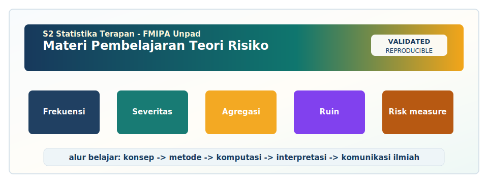

<!-- BEGIN UNPAD MATERIAL STYLE -->
<style>
:root {
  --unpad-navy: #17395c;
  --unpad-gold: #f2a51a;
  --unpad-teal: #0f766e;
  --unpad-ink: #172033;
  --unpad-paper: #fffdf8;
  --unpad-soft: #eef5f8;
  --unpad-line: #d7e2ea;
}
html, body {
  background: linear-gradient(135deg, #f8fbfd 0%, #fffdf8 48%, #f3f6ee 100%) !important;
  color: var(--unpad-ink) !important;
}
body {
  font-family: "Segoe UI", Arial, sans-serif !important;
  line-height: 1.72 !important;
}
.main-container {
  max-width: 1180px !important;
  background: rgba(255, 253, 248, 0.98) !important;
  border: 1px solid var(--unpad-line) !important;
  border-radius: 8px !important;
  box-shadow: 0 18px 42px rgba(23, 57, 92, 0.12) !important;
}
h1, h2, h3, h4 {
  letter-spacing: 0 !important;
}
h1.title {
  color: var(--unpad-navy) !important;
  -webkit-text-fill-color: var(--unpad-navy) !important;
  background: none !important;
}
h2 {
  border-left-color: var(--unpad-gold) !important;
}
a {
  color: #0b5c86 !important;
}
pre, code {
  border-radius: 8px !important;
}
.unpad-cover {
  margin: 18px 0 26px;
  padding: 24px;
  border-radius: 8px;
  background: linear-gradient(135deg, #17395c 0%, #0f766e 58%, #f2a51a 100%);
  color: #ffffff;
  box-shadow: 0 18px 36px rgba(23, 57, 92, 0.22);
}
.unpad-cover__brand {
  display: grid;
  grid-template-columns: 92px 1fr;
  gap: 20px;
  align-items: center;
}
.unpad-cover img {
  width: 92px;
  height: 92px;
  object-fit: contain;
  background: #ffffff;
  border-radius: 8px;
  padding: 8px;
  box-shadow: 0 8px 22px rgba(0,0,0,0.18);
}
.unpad-kicker {
  text-transform: uppercase;
  font-size: 0.82rem;
  font-weight: 800;
  letter-spacing: 0;
  color: #fff8dc;
}
.unpad-cover h2 {
  margin: 6px 0 8px;
  padding: 0;
  border: 0;
  background: transparent;
  color: #ffffff !important;
  font-size: 1.65rem;
}
.unpad-meta {
  margin: 0;
  color: #f7fbff;
  font-weight: 600;
}
.materi-illustration {
  margin: 20px 0 24px;
  padding: 14px;
  background: #ffffff;
  border: 1px solid var(--unpad-line);
  border-radius: 8px;
  box-shadow: 0 12px 28px rgba(23, 57, 92, 0.10);
}
.materi-illustration img {
  width: 100%;
  height: auto;
  display: block;
  border-radius: 6px;
}
.validasi-akademik {
  margin: 18px 0 28px;
  padding: 16px 18px;
  background: linear-gradient(135deg, #eef8f6, #fff8e7);
  border-left: 8px solid var(--unpad-teal);
  border-radius: 8px;
  color: var(--unpad-ink);
}
.validasi-akademik strong {
  color: var(--unpad-navy);
}
table {
  border-radius: 8px !important;
}
@media (max-width: 760px) {
  .unpad-cover__brand {
    grid-template-columns: 1fr;
  }
  .unpad-cover img {
    width: 76px;
    height: 76px;
  }
}
</style>
<!-- END UNPAD MATERIAL STYLE -->


<!-- BEGIN UNPAD MATERIAL ENHANCEMENT -->

```{r setup-unpad-render, include=FALSE}
execute_code <- FALSE
knitr::opts_chunk$set(
  echo = TRUE,
  eval = FALSE,
  message = FALSE,
  warning = FALSE,
  fig.align = "center",
  fig.width = 8,
  fig.height = 4.8,
  dpi = 120
)
set.seed(2025)
```


<div class="unpad-cover">
<div class="unpad-cover__brand">

<div>
<div class="unpad-kicker">S2 Statistika Terapan | FMIPA Universitas Padjadjaran</div>
<h2>Materi Pembelajaran Teori Risiko</h2>
<p class="unpad-meta">Program Studi S2 Statistika Terapan, FMIPA Universitas Padjadjaran<br>Penulis: Dr. Lienda Noviyanti, M.Si | Januari 2025</p>
</div>
</div>
</div>

<div class="materi-illustration">

</div>

<div class="validasi-akademik">
<strong>Catatan validasi akademik.</strong> Materi ini diseragamkan dengan rujukan ADWTL Januari 2025: rumus dibaca bersama asumsi, contoh kode diposisikan sebagai template reproducible, dan interpretasi diarahkan pada validitas data, diagnosis model, evaluasi ketidakpastian, serta komunikasi hasil secara ilmiah.
</div>

<!-- END UNPAD MATERIAL ENHANCEMENT -->

<style>
:root{
  --brown-900:#2f1b0c; --brown-800:#4b2a14; --brown-700:#6b3f20; --brown-600:#8a5a2b;
  --brown-500:#a77545; --brown-300:#d7b98c; --brown-200:#ead8bc; --brown-100:#f7efe2;
  --cream:#fff9ef; --amber:#f0b44c; --rose:#ad6551; --green:#5a7d59; --ink:#24150d;
}
html, body { scroll-behavior: smooth; }
body{
  color:var(--ink);
  background:linear-gradient(135deg,#fff8eb 0%,#f1dfc5 32%,#d3a66c 70%,#75441f 100%);
  font-family:-apple-system,BlinkMacSystemFont,"Segoe UI",Roboto,"Helvetica Neue",Arial,"Noto Sans",sans-serif;
  line-height:1.72;
}
#TOC{
  position:fixed; top:0; left:0; bottom:0; width:310px; overflow-y:auto;
  padding:26px 20px; background:linear-gradient(180deg,#4b2a14 0%,#7a4d28 58%,#a6723e 100%);
  color:#fff8ea; box-shadow:8px 0 28px rgba(47,27,12,.25); z-index:10;
}
#TOC:before{ content:"📚 Daftar Isi"; display:block; font-weight:800; font-size:1.25rem; margin-bottom:18px; color:#ffe0a1; }
#TOC a{ color:#fff4d8; text-decoration:none; border-bottom:1px dotted rgba(255,255,255,.25); }
#TOC a:hover{ color:#ffe2a3; border-bottom:1px solid #ffe2a3; }
#TOC ul{ padding-left:1.05rem; }
body > .container, body > main, body > div:not(#TOC){ max-width:1060px; margin-left:350px; margin-right:40px; }
@media(max-width:980px){ #TOC{position:relative; width:auto; max-height:380px;} body > .container, body > main, body > div:not(#TOC){margin:18px;} }
h1,h2,h3,h4{ color:var(--brown-900); font-weight:800; letter-spacing:.01em; }
h1{ margin-top:1rem; padding:1.2rem 1.4rem; border-radius:24px; color:#fff8ec;
    background:linear-gradient(135deg,#3b210f 0%,#7b4d27 50%,#d49b4e 100%); box-shadow:0 16px 38px rgba(60,32,14,.28); }
h2{ margin-top:2.4rem; padding:.8rem 1rem; border-left:10px solid var(--amber); background:linear-gradient(90deg,#fff3d9,#f6e1bc); border-radius:14px; }
h3{ margin-top:1.7rem; color:#5e351a; }
h4{ color:#74461f; }
a{ color:#7b4017; font-weight:650; }
blockquote{ background:linear-gradient(90deg,#fff8eb,#efd0a4); border-left:8px solid #9b632f; padding:1.0rem 1.2rem; border-radius:14px; }
pre, code{ font-family:"Fira Code","Source Code Pro",Menlo,Consolas,monospace; }
pre{ background:#f7e7cf !important; color:#1c120a !important; border:1px solid #d2a66d; border-radius:16px; padding:1.1rem; overflow:auto; box-shadow:inset 0 0 0 1px rgba(255,255,255,.45); }
code{ background:#f5dfbf; color:#24150d; border-radius:6px; padding:.12rem .33rem; }
table{ border-collapse:collapse; width:100%; background:#fffaf2; border-radius:14px; overflow:hidden; box-shadow:0 8px 24px rgba(74,42,20,.08); }
th{ background:linear-gradient(90deg,#6f441f,#a66f36); color:white; }
th,td{ padding:.7rem .8rem; border:1px solid #d9b889; vertical-align:top; }
tr:nth-child(even) td{ background:#fff3df; }
.hero-card{ padding:2rem; margin:1rem 0 2rem 0; border-radius:28px; color:#fff8ea;
  background:radial-gradient(circle at top left,#e2b05d 0%,transparent 28%),linear-gradient(135deg,#2f1b0c 0%,#6e3f1d 45%,#c4873f 100%);
  box-shadow:0 24px 60px rgba(47,27,12,.35); }
.hero-card .subtitle{ font-size:1.15rem; opacity:.95; }
.badge{ display:inline-block; padding:.35rem .72rem; border-radius:999px; background:#ffe0a1; color:#4b2a14; margin:.15rem; font-weight:750; }
.info-grid{ display:grid; grid-template-columns:repeat(auto-fit,minmax(240px,1fr)); gap:1rem; }
.info-card,.callout,.case-box,.formula-box,.practice-box,.rubric-box,.warning-box{ border-radius:20px; padding:1.1rem 1.25rem; margin:1rem 0; box-shadow:0 12px 28px rgba(72,42,19,.10); }
.info-card{ background:linear-gradient(135deg,#fffaf2,#f2d4a9); border:1px solid #e2bc82; }
.callout{ background:linear-gradient(135deg,#fff8ea,#f5dab3); border-left:8px solid #b87633; }
.case-box{ background:linear-gradient(135deg,#fff7e8,#edd0a4); border:1px solid #c8904e; }
.formula-box{ background:#f7e4c4; border:2px solid #c99455; color:#111; }
.practice-box{ background:linear-gradient(135deg,#fdf4df,#f1d6ad); border-left:8px solid #5a7d59; }
.rubric-box{ background:linear-gradient(135deg,#fff6e7,#efd1a6); border-left:8px solid #ad6551; }
.warning-box{ background:linear-gradient(135deg,#fff2dc,#e9bc82); border-left:8px solid #8a331e; }
.figure-box{ background:#fffaf2; border:1px solid #e0bd87; border-radius:22px; padding:1rem; margin:1.25rem 0; text-align:center; box-shadow:0 14px 36px rgba(72,42,19,.12); }
.caption{ font-size:.92rem; color:#6b3f20; font-weight:650; margin-top:.4rem; }
hr{ border:0; height:4px; border-radius:999px; background:linear-gradient(90deg,#4b2a14,#d8a15a,#fff3d6); margin:2rem 0; }
.small-note{ font-size:.95rem; color:#5c3a1f; }
</style>


<div class="hero-card">
<h1 style="margin:0; box-shadow:none; background:transparent; padding:0;">Teori Risiko</h1>
<p class="subtitle"><strong>S2 Statistika Terapan - FMIPA Universitas Padjadjaran</strong><br/>Materi pembelajaran komprehensif berbasis RPS-OBE, dirancang untuk kuliah, praktikum, studi kasus, simulasi, dan proyek akhir.</p>
<span class="badge">Semester 2</span><span class="badge">2 SKS Teori + 1 SKS Praktikum</span><span class="badge">R/Python</span><span class="badge">Aktuaria - Keuangan - Asuransi</span>
</div>

<div class="info-grid">
<div class="info-card"><strong>Mata kuliah</strong><br/>Teori Risiko</div>
<div class="info-card"><strong>Program</strong><br/>S2 Statistika Terapan, FMIPA UNPAD</div>
<div class="info-card"><strong>Dosen pengampu</strong><br/>Dr. Lienda Noviyanti, M.Si</div>
<div class="info-card"><strong>Tahun pembuatan materi</strong><br/>Januari 2025</div>
</div>

> Materi ini mengikuti struktur RPS Teori Risiko: konsep dasar risiko, identifikasi dan pengukuran risiko, model probabilitas, agregasi risiko, simulasi komputasi, diversifikasi portofolio, strategi mitigasi, dan evaluasi solusi inovatif. Pendekatan pembelajaran diarahkan pada kemampuan analitis, komputasional, dan komunikatif mahasiswa pascasarjana statistika terapan.

# Petunjuk Penggunaan Materi

Materi ini disusun sebagai bahan ajar panjang untuk satu semester. Setiap bab dapat digunakan sebagai bahan bacaan sebelum kuliah, bahan diskusi saat pertemuan sinkron, serta panduan praktikum. Struktur bab mengikuti pola pembelajaran berbasis capaian: definisi, konsep, model matematis, contoh interpretasi, latihan terarah, implementasi komputasi, dan tugas reflektif. Dengan pola ini mahasiswa tidak hanya menghafal istilah risiko, tetapi juga membangun kemampuan untuk menilai risiko, memilih model probabilitas, menjalankan simulasi, dan menulis rekomendasi yang dapat dipertanggungjawabkan.

Mata kuliah Teori Risiko pada jenjang magister harus dipahami sebagai jembatan antara teori peluang, statistika inferensial, aktuaria, komputasi statistik, dan pengambilan keputusan. Risiko bukan sekadar angka kerugian, melainkan distribusi kemungkinan yang melekat pada kejadian yang tidak pasti. Karena itu, pembelajaran di kelas perlu bergerak dari bahasa konseptual menuju bahasa probabilistik, lalu menuju simulasi dan keputusan. Dalam kerangka aktuaria dan asuransi, risiko muncul sebagai klaim yang memiliki frekuensi dan severitas. Dalam keuangan, risiko muncul sebagai kerugian nilai portofolio. Dalam bisnis, risiko muncul sebagai gangguan operasional, kegagalan proses, ketidakstabilan permintaan, atau perubahan regulasi. Dalam kebijakan publik, risiko muncul sebagai ketidakpastian dampak intervensi terhadap populasi. Satu benang merahnya adalah kebutuhan untuk mengubah ketidakpastian menjadi informasi kuantitatif yang dapat digunakan untuk bertindak.

Pembelajaran juga menekankan bahwa model risiko adalah penyederhanaan. Model Poisson dapat menjelaskan jumlah klaim, tetapi tidak selalu memadai ketika terdapat overdispersion. Distribusi lognormal dapat menjelaskan klaim positif yang miring ke kanan, tetapi mungkin gagal untuk ekor yang sangat berat. VaR populer dalam praktik risiko keuangan, tetapi tidak selalu memenuhi sifat koherensi tertentu dan dapat kurang informatif tentang besarnya kerugian setelah ambang kuantil. TVaR atau Expected Shortfall sering dipakai untuk membaca ekor dengan lebih hati-hati. Dengan demikian, mahasiswa perlu berlatih membandingkan model, membaca asumsi, memeriksa sensitivitas, dan mengkomunikasikan ketidakpastian secara jujur [@artzner1999; @mcneil2015; @rockafellar2000].


<div class="figure-box">
<svg viewBox="0 0 900 360" width="100%" role="img" aria-label="Siklus manajemen risiko">
  <defs>
    <linearGradient id="g1" x1="0" x2="1"><stop offset="0" stop-color="#6e3f1d"/><stop offset="1" stop-color="#d9a45c"/></linearGradient>
    <filter id="shadow"><feDropShadow dx="0" dy="6" stdDeviation="6" flood-color="#3a210f" flood-opacity=".28"/></filter>
  </defs>
  <rect x="20" y="20" width="860" height="320" rx="28" fill="#fff7e8" stroke="#d7aa72"/>
  <text x="450" y="58" text-anchor="middle" font-size="28" font-weight="800" fill="#4b2a14">Siklus Manajemen Risiko Berbasis Data</text>
  <g filter="url(#shadow)">
    <circle cx="165" cy="175" r="58" fill="url(#g1)"/><text x="165" y="168" text-anchor="middle" font-size="17" fill="white" font-weight="700">Identifikasi</text><text x="165" y="191" text-anchor="middle" font-size="13" fill="#fff3d0">sumber risiko</text>
    <circle cx="330" cy="175" r="58" fill="url(#g1)"/><text x="330" y="168" text-anchor="middle" font-size="17" fill="white" font-weight="700">Pengukuran</text><text x="330" y="191" text-anchor="middle" font-size="13" fill="#fff3d0">EL, VaR, TVaR</text>
    <circle cx="495" cy="175" r="58" fill="url(#g1)"/><text x="495" y="168" text-anchor="middle" font-size="17" fill="white" font-weight="700">Pemodelan</text><text x="495" y="191" text-anchor="middle" font-size="13" fill="#fff3d0">frekuensi-severitas</text>
    <circle cx="660" cy="175" r="58" fill="url(#g1)"/><text x="660" y="168" text-anchor="middle" font-size="17" fill="white" font-weight="700">Mitigasi</text><text x="660" y="191" text-anchor="middle" font-size="13" fill="#fff3d0">transfer, kontrol</text>
  </g>
  <g stroke="#8a5a2b" stroke-width="5" fill="none" marker-end="url(#arrow)">
    <defs><marker id="arrow" markerWidth="10" markerHeight="10" refX="7" refY="3" orient="auto"><path d="M0,0 L0,6 L8,3 z" fill="#8a5a2b"/></marker></defs>
    <path d="M225 175 C250 160 263 160 272 175"/><path d="M390 175 C415 160 428 160 437 175"/><path d="M555 175 C580 160 593 160 602 175"/>
    <path d="M660 238 C550 310 270 310 165 238"/>
  </g>
  <text x="450" y="300" text-anchor="middle" font-size="16" fill="#6b3f20">Validasi, komunikasi, dan pembelajaran organisasi menghubungkan seluruh tahap.</text>
</svg>
<div class="caption">Gambar 1. Alur umum pembelajaran Teori Risiko: dari identifikasi hingga mitigasi berbasis bukti.</div>
</div>


# Peta Capaian Pembelajaran dan Struktur Semester

| Komponen | Rumusan ringkas |
|---|---|
| CPMK1 | Mahasiswa mampu menganalisis konsep dasar risiko dan aplikasinya dalam manajemen risiko. |
| CPMK2 | Mahasiswa mampu mengevaluasi model distribusi probabilitas dalam pengukuran risiko. |
| CPMK3 | Mahasiswa mampu mengembangkan model simulasi komputasi untuk agregasi risiko portofolio. |
| CPMK4 | Mahasiswa mampu menyusun rekomendasi inovatif dalam mitigasi risiko dan mempresentasikannya. |

| Blok Pertemuan | Fokus pembelajaran | Luaran utama |
|---|---|---|
| 1-3 | Konsep risiko, ketidakpastian, klasifikasi, identifikasi, siklus manajemen risiko | Analisis kasus risiko nyata |
| 4-7 | Distribusi probabilitas, frekuensi klaim, severitas klaim, estimasi dan goodness of fit | Evaluasi model probabilitas risiko |
| 8 | UTS berbasis proyek pendahuluan | Laporan dan presentasi analisis data risiko |
| 9-12 | Agregasi risiko, korelasi antar risiko, diversifikasi, VaR, TVaR, simulasi Monte Carlo | Proyek simulasi risiko portofolio |
| 13-15 | Mitigasi, asuransi, reasuransi, strategi operasional, rekomendasi berbasis data | Proposal inovasi mitigasi risiko |
| 16 | UAS/proyek akhir | Presentasi proyek akhir dan evaluasi solusi |

<div class="callout"><strong>Catatan dosen.</strong> Gunakan materi ini secara modular. Untuk kelas reguler, satu bab dapat dibahas dalam satu pertemuan. Untuk praktikum, pilih bagian implementasi dan tugas kecil. Untuk proyek akhir, gabungkan bab 5 sampai bab 16 agar mahasiswa memiliki alur lengkap dari data, model, simulasi, sampai rekomendasi.</div>

# Ringkasan Formula Inti

<div class="formula-box">
Rata-rata kerugian atau expected loss dirumuskan sebagai

$$E[X]=\sum_x x f(x) \quad \text{untuk diskrit}, \qquad E[X]=\int_{-\infty}^{\infty} x f(x)\,dx \quad \text{untuk kontinu}.$$

Variansi kerugian mengukur dispersi:

$$\operatorname{Var}(X)=E[(X-E[X])^2]=E[X^2]-\{E[X]\}^2.$$
</div>

<div class="formula-box">
Jika \(S\) adalah kerugian agregat dan \(\alpha\) adalah tingkat kepercayaan, maka

$$\operatorname{VaR}_{\alpha}(S)=\inf\{s: F_S(s)\ge \alpha\},$$

sedangkan Tail Value at Risk dapat ditulis secara intuitif sebagai

$$\operatorname{TVaR}_{\alpha}(S)=E[S\mid S>\operatorname{VaR}_{\alpha}(S)].$$
</div>


<div class="figure-box">
<svg viewBox="0 0 900 370" width="100%" role="img" aria-label="Ilustrasi VaR dan TVaR">
  <rect x="20" y="20" width="860" height="330" rx="26" fill="#fff7e8" stroke="#d7aa72"/>
  <text x="450" y="58" text-anchor="middle" font-size="28" font-weight="800" fill="#4b2a14">VaR dan TVaR pada Ekor Kerugian</text>
  <path d="M80 285 C160 278,180 260,230 230 C280 200,315 110,390 102 C500 92,540 205,620 240 C690 270,760 282,820 287" fill="none" stroke="#6e3f1d" stroke-width="5"/>
  <path d="M620 240 C690 270,760 282,820 287 L620 287 Z" fill="#d69d52" opacity=".55"/>
  <line x1="620" y1="85" x2="620" y2="292" stroke="#9b3f25" stroke-width="4" stroke-dasharray="10 8"/>
  <line x1="700" y1="105" x2="700" y2="292" stroke="#5a7d59" stroke-width="4" stroke-dasharray="8 7"/>
  <text x="620" y="78" text-anchor="middle" font-size="19" fill="#9b3f25" font-weight="800">VaRα</text>
  <text x="700" y="98" text-anchor="middle" font-size="19" fill="#5a7d59" font-weight="800">TVaRα</text>
  <text x="723" y="230" font-size="17" fill="#6b3f20" font-weight="700">wilayah ekor</text>
  <line x1="80" y1="288" x2="840" y2="288" stroke="#4b2a14" stroke-width="3"/>
  <text x="840" y="318" text-anchor="end" font-size="16" fill="#4b2a14">Besar kerugian</text>
</svg>
<div class="caption">Gambar 2. VaR membaca ambang kuantil, sedangkan TVaR membaca rata-rata kerugian setelah ambang.</div>
</div>


# Rencana Praktikum Komputasi

Praktikum diarahkan agar mahasiswa mampu menghubungkan konsep dengan data. Pada awal semester mahasiswa dapat memakai data simulasi sederhana, misalnya jumlah klaim bulanan, besar klaim asuransi kendaraan, kerugian operasional, atau return portofolio. Setelah memahami alur dasar, mahasiswa dapat memakai data nyata yang tersedia secara publik atau data internal yang telah dianonimkan. Prinsip pentingnya adalah etika data: jangan menggunakan data sensitif tanpa izin, jangan menampilkan identitas individu, dan selalu jelaskan keterbatasan data.

```{r setup, eval=FALSE}
# Contoh pengaturan awal bila materi ini dijalankan di R Markdown
set.seed(2025)
options(digits = 4)
```

```{r contoh-data-risiko, eval=FALSE}
# Simulasi sederhana: jumlah klaim dan severitas klaim
n_bulan <- 120
frekuensi <- rpois(n_bulan, lambda = 8)
severitas <- rgamma(sum(frekuensi), shape = 2.5, rate = 1/1500)
ringkasan <- data.frame(
  bulan = 1:n_bulan,
  jumlah_klaim = frekuensi
)
summary(ringkasan$jumlah_klaim)
```

# Etika, Validitas, dan Komunikasi Risiko

Dalam pembelajaran Teori Risiko, ukuran kuantitatif tidak boleh dipisahkan dari implikasi etis. Ketika model menunjukkan adanya risiko tinggi, keputusan yang diambil dapat memengaruhi premi, akses layanan, cadangan modal, atau strategi bisnis. Model yang terlalu agresif dapat menyebabkan biaya mitigasi yang tidak proporsional. Model yang terlalu optimistis dapat membuat organisasi tidak siap menghadapi kerugian besar. Oleh sebab itu, mahasiswa perlu menyeimbangkan ketelitian statistik dengan kejelasan komunikasi dan tanggung jawab profesional. Prinsip ini sejalan dengan literatur manajemen risiko yang menempatkan komunikasi, konsultasi, dan monitoring sebagai bagian integral dari siklus risiko [@iso31000; @vaughan2020].

Komunikasi risiko yang baik tidak menyembunyikan ketidakpastian. Kalimat seperti "VaR 95% sebesar Rp2 miliar" perlu dilengkapi dengan arti operasional: pada model dan data yang digunakan, sekitar lima persen skenario terburuk dapat melebihi nilai tersebut. Lebih baik lagi jika disertai TVaR atau ringkasan ekor agar pengambil keputusan tidak berhenti pada ambang. Visualisasi distribusi, interval ketidakpastian, dan skenario stres membantu audiens memahami bahwa risiko bukan satu angka tunggal, melainkan spektrum kemungkinan. Inilah alasan praktikum diarahkan tidak hanya menghasilkan output, tetapi juga narasi interpretasi.
# Bab 1. Pendahuluan Teori Risiko

<div class="callout"><strong>Pertemuan 1 - SubCPMK1.</strong> Fokus bab ini adalah pengertian risiko dan ketidakpastian. Mahasiswa diharapkan mampu menjelaskan konsep, menerapkan prosedur analisis, serta menghubungkan hasilnya dengan keputusan manajemen risiko.</div>

## Orientasi Konseptual

Bab ini membahas pengertian risiko dan ketidakpastian dalam kerangka Teori Risiko. Konsep utama yang perlu dikuasai adalah risiko sebagai variasi hasil, ketidakpastian dan informasi, peran teori risiko dalam aktuaria, dan bahasa probabilitas untuk keputusan. Dalam literatur aktuaria dan manajemen risiko, materi ini menjadi fondasi untuk memahami bagaimana ketidakpastian diterjemahkan menjadi model yang dapat dihitung, dibandingkan, dan dipakai untuk keputusan [@vaughan2020; @kaas2021]. Perlu ditekankan bahwa risiko tidak hanya dipahami sebagai kejadian buruk. Risiko adalah kemungkinan penyimpangan hasil dari kondisi yang diharapkan. Penyimpangan tersebut dapat bernilai negatif, netral, atau bahkan positif, tetapi dalam konteks aktuaria, asuransi, dan pengelolaan kerugian, perhatian utama biasanya diberikan pada sisi kerugian.


Secara pedagogis, bagian ini penting karena mahasiswa sering kali melihat risiko sebagai istilah umum, padahal dalam analisis statistik risiko harus diterjemahkan menjadi peubah acak, distribusi, parameter, dan keputusan. Pada level magister, mahasiswa perlu membaca setiap konsep sebagai bagian dari sistem analisis. Identifikasi risiko tanpa pengukuran akan menghasilkan daftar masalah yang panjang tetapi kurang prioritas. Pengukuran risiko tanpa pemahaman konteks dapat menghasilkan angka yang rapi tetapi tidak relevan. Simulasi tanpa validasi dapat memberi kesan ilmiah tetapi berpotensi menyesatkan. Karena itu, setiap tahap pembelajaran harus selalu ditautkan dengan pertanyaan: risiko apa yang sedang dianalisis, data apa yang tersedia, asumsi apa yang digunakan, dan keputusan apa yang akan diambil setelah analisis selesai.


Dalam kasus perusahaan asuransi kesehatan yang harus memperkirakan klaim rawat inap tahunan, analis risiko harus membangun jembatan antara informasi lapangan dan model statistik. Informasi lapangan menjelaskan proses munculnya risiko, sedangkan model statistik menjelaskan variasi kemungkinan secara kuantitatif. Ketika dua sisi ini tidak konsisten, hasil analisis perlu ditinjau ulang. Misalnya, model dapat menunjukkan rata-rata kerugian yang rendah, tetapi manajemen mungkin tetap khawatir karena terdapat skenario ekstrem yang berdampak besar. Sebaliknya, manajemen dapat merasa suatu risiko sangat menakutkan, tetapi data historis menunjukkan bahwa peluang dan dampaknya relatif kecil dibandingkan risiko lain yang kurang terlihat.


## Peta Konsep


### 1. Risiko Sebagai Variasi Hasil

Konsep **risiko sebagai variasi hasil** perlu dibaca sebagai komponen dari sistem pengukuran risiko. Pada tahap awal, mahasiswa perlu menjelaskan definisi operasionalnya, bukan hanya definisi kamus. Definisi operasional berarti menjawab bagaimana konsep tersebut dapat diamati, bagaimana datanya dikumpulkan, dan bagaimana indikatornya dihitung. Dalam Teori Risiko, konsep yang tidak dapat dioperasionalkan akan sulit digunakan untuk estimasi, simulasi, atau evaluasi. Oleh karena itu, setiap konsep harus dihubungkan dengan unit analisis, horizon waktu, dan satuan kerugian. Horizon waktu bisa harian, bulanan, tahunan, atau sepanjang masa polis. Satuan kerugian bisa rupiah, jumlah klaim, waktu keterlambatan, atau indeks dampak.


Dari sisi statistika, **risiko sebagai variasi hasil** menuntut pemilihan peubah acak yang tepat. Jika yang diamati adalah kejadian terjadi atau tidak terjadi, model Bernoulli atau Binomial dapat menjadi titik awal. Jika yang diamati adalah jumlah kejadian dalam periode tertentu, model Poisson sering dipakai sebagai baseline. Jika yang diamati adalah besar kerugian positif, distribusi kontinu seperti Gamma, Lognormal, atau Pareto lebih relevan. Pilihan ini tidak boleh bersifat otomatis. Setiap pilihan harus didukung oleh penalaran proses data, eksplorasi visual, estimasi parameter, serta pemeriksaan kecocokan model.


Dalam diskusi kelas, dosen dapat meminta mahasiswa memberi contoh nyata untuk **risiko sebagai variasi hasil**. Contoh yang baik harus memuat sumber risiko, pihak yang terdampak, mekanisme terjadinya kerugian, data yang mungkin tersedia, serta konsekuensi keputusan. Dengan cara ini, mahasiswa belajar bahwa istilah risiko tidak berdiri sendiri. Ia selalu melekat pada proses, aktor, data, model, dan keputusan. Humor tipisnya: risiko yang tidak didefinisikan itu seperti sinyal Wi-Fi kampus saat hujan - terasa ada, tetapi susah dipakai untuk rapat penting.


### 2. Ketidakpastian Dan Informasi

Konsep **ketidakpastian dan informasi** perlu dibaca sebagai komponen dari sistem pengukuran risiko. Pada tahap awal, mahasiswa perlu menjelaskan definisi operasionalnya, bukan hanya definisi kamus. Definisi operasional berarti menjawab bagaimana konsep tersebut dapat diamati, bagaimana datanya dikumpulkan, dan bagaimana indikatornya dihitung. Dalam Teori Risiko, konsep yang tidak dapat dioperasionalkan akan sulit digunakan untuk estimasi, simulasi, atau evaluasi. Oleh karena itu, setiap konsep harus dihubungkan dengan unit analisis, horizon waktu, dan satuan kerugian. Horizon waktu bisa harian, bulanan, tahunan, atau sepanjang masa polis. Satuan kerugian bisa rupiah, jumlah klaim, waktu keterlambatan, atau indeks dampak.


Dari sisi statistika, **ketidakpastian dan informasi** menuntut pemilihan peubah acak yang tepat. Jika yang diamati adalah kejadian terjadi atau tidak terjadi, model Bernoulli atau Binomial dapat menjadi titik awal. Jika yang diamati adalah jumlah kejadian dalam periode tertentu, model Poisson sering dipakai sebagai baseline. Jika yang diamati adalah besar kerugian positif, distribusi kontinu seperti Gamma, Lognormal, atau Pareto lebih relevan. Pilihan ini tidak boleh bersifat otomatis. Setiap pilihan harus didukung oleh penalaran proses data, eksplorasi visual, estimasi parameter, serta pemeriksaan kecocokan model.


Dalam diskusi kelas, dosen dapat meminta mahasiswa memberi contoh nyata untuk **ketidakpastian dan informasi**. Contoh yang baik harus memuat sumber risiko, pihak yang terdampak, mekanisme terjadinya kerugian, data yang mungkin tersedia, serta konsekuensi keputusan. Dengan cara ini, mahasiswa belajar bahwa istilah risiko tidak berdiri sendiri. Ia selalu melekat pada proses, aktor, data, model, dan keputusan. Humor tipisnya: risiko yang tidak didefinisikan itu seperti sinyal Wi-Fi kampus saat hujan - terasa ada, tetapi susah dipakai untuk rapat penting.


### 3. Peran Teori Risiko Dalam Aktuaria

Konsep **peran teori risiko dalam aktuaria** perlu dibaca sebagai komponen dari sistem pengukuran risiko. Pada tahap awal, mahasiswa perlu menjelaskan definisi operasionalnya, bukan hanya definisi kamus. Definisi operasional berarti menjawab bagaimana konsep tersebut dapat diamati, bagaimana datanya dikumpulkan, dan bagaimana indikatornya dihitung. Dalam Teori Risiko, konsep yang tidak dapat dioperasionalkan akan sulit digunakan untuk estimasi, simulasi, atau evaluasi. Oleh karena itu, setiap konsep harus dihubungkan dengan unit analisis, horizon waktu, dan satuan kerugian. Horizon waktu bisa harian, bulanan, tahunan, atau sepanjang masa polis. Satuan kerugian bisa rupiah, jumlah klaim, waktu keterlambatan, atau indeks dampak.


Dari sisi statistika, **peran teori risiko dalam aktuaria** menuntut pemilihan peubah acak yang tepat. Jika yang diamati adalah kejadian terjadi atau tidak terjadi, model Bernoulli atau Binomial dapat menjadi titik awal. Jika yang diamati adalah jumlah kejadian dalam periode tertentu, model Poisson sering dipakai sebagai baseline. Jika yang diamati adalah besar kerugian positif, distribusi kontinu seperti Gamma, Lognormal, atau Pareto lebih relevan. Pilihan ini tidak boleh bersifat otomatis. Setiap pilihan harus didukung oleh penalaran proses data, eksplorasi visual, estimasi parameter, serta pemeriksaan kecocokan model.


Dalam diskusi kelas, dosen dapat meminta mahasiswa memberi contoh nyata untuk **peran teori risiko dalam aktuaria**. Contoh yang baik harus memuat sumber risiko, pihak yang terdampak, mekanisme terjadinya kerugian, data yang mungkin tersedia, serta konsekuensi keputusan. Dengan cara ini, mahasiswa belajar bahwa istilah risiko tidak berdiri sendiri. Ia selalu melekat pada proses, aktor, data, model, dan keputusan. Humor tipisnya: risiko yang tidak didefinisikan itu seperti sinyal Wi-Fi kampus saat hujan - terasa ada, tetapi susah dipakai untuk rapat penting.


### 4. Bahasa Probabilitas Untuk Keputusan

Konsep **bahasa probabilitas untuk keputusan** perlu dibaca sebagai komponen dari sistem pengukuran risiko. Pada tahap awal, mahasiswa perlu menjelaskan definisi operasionalnya, bukan hanya definisi kamus. Definisi operasional berarti menjawab bagaimana konsep tersebut dapat diamati, bagaimana datanya dikumpulkan, dan bagaimana indikatornya dihitung. Dalam Teori Risiko, konsep yang tidak dapat dioperasionalkan akan sulit digunakan untuk estimasi, simulasi, atau evaluasi. Oleh karena itu, setiap konsep harus dihubungkan dengan unit analisis, horizon waktu, dan satuan kerugian. Horizon waktu bisa harian, bulanan, tahunan, atau sepanjang masa polis. Satuan kerugian bisa rupiah, jumlah klaim, waktu keterlambatan, atau indeks dampak.


Dari sisi statistika, **bahasa probabilitas untuk keputusan** menuntut pemilihan peubah acak yang tepat. Jika yang diamati adalah kejadian terjadi atau tidak terjadi, model Bernoulli atau Binomial dapat menjadi titik awal. Jika yang diamati adalah jumlah kejadian dalam periode tertentu, model Poisson sering dipakai sebagai baseline. Jika yang diamati adalah besar kerugian positif, distribusi kontinu seperti Gamma, Lognormal, atau Pareto lebih relevan. Pilihan ini tidak boleh bersifat otomatis. Setiap pilihan harus didukung oleh penalaran proses data, eksplorasi visual, estimasi parameter, serta pemeriksaan kecocokan model.


Dalam diskusi kelas, dosen dapat meminta mahasiswa memberi contoh nyata untuk **bahasa probabilitas untuk keputusan**. Contoh yang baik harus memuat sumber risiko, pihak yang terdampak, mekanisme terjadinya kerugian, data yang mungkin tersedia, serta konsekuensi keputusan. Dengan cara ini, mahasiswa belajar bahwa istilah risiko tidak berdiri sendiri. Ia selalu melekat pada proses, aktor, data, model, dan keputusan. Humor tipisnya: risiko yang tidak didefinisikan itu seperti sinyal Wi-Fi kampus saat hujan - terasa ada, tetapi susah dipakai untuk rapat penting.


## Formulasi Statistik dan Interpretasi

Untuk fokus pengertian risiko dan ketidakpastian, formulasi statistik yang paling berguna adalah formulasi yang menjaga hubungan antara proses risiko dan ukuran kuantitatif. Misalkan \(X\) menyatakan kerugian individual dan \(N\) menyatakan jumlah kejadian dalam suatu periode. Kerugian agregat sering ditulis sebagai \(S=\sum_{i=1}^N X_i\). Notasi ini sederhana, tetapi sangat kaya makna. Ia menyatakan bahwa total kerugian bergantung pada dua sumber ketidakpastian: berapa banyak kejadian yang muncul dan seberapa besar kerugian pada setiap kejadian. Literatur aktuaria memakai struktur ini sebagai dasar model frekuensi-severitas dan model kerugian agregat [@vaughan2020; @kaas2021].\n

<div class="formula-box">
Jika \(N\) dan \(X_i\) saling bebas, serta \(X_i\) identik berdistribusi dengan rata-rata \(\mu_X\) dan variansi \(\sigma_X^2\), maka secara umum:

$$E[S]=E[N]E[X],$$

$$\operatorname{Var}(S)=E[N]\operatorname{Var}(X)+\operatorname{Var}(N)\{E[X]\}^2.$$

Formula ini membantu mahasiswa memahami mengapa risiko agregat dipengaruhi oleh frekuensi dan severitas sekaligus.
</div>

\nPada tahap interpretasi, rumus tidak boleh berhenti sebagai simbol. Jika \(E[S]\) meningkat, analis harus menelusuri apakah kenaikan tersebut berasal dari peningkatan jumlah kejadian, peningkatan besar kerugian, atau kombinasi keduanya. Jika variansi meningkat, analis perlu memeriksa apakah penyebabnya adalah klaim ekstrem, heterogenitas portofolio, perubahan proses bisnis, atau dependensi antar risiko. Dalam praktik, satu angka expected loss sering tidak cukup. Keputusan cadangan modal, tarif premi, atau mitigasi membutuhkan informasi tentang ekor distribusi karena kerugian yang jarang tetapi besar dapat menentukan ketahanan organisasi.\n

## Contoh Kasus Terarah

Pertimbangkan perusahaan asuransi kesehatan yang harus memperkirakan klaim rawat inap tahunan. Langkah pertama adalah menyusun narasi proses risiko. Mahasiswa harus menjawab: apa unit eksposurnya, apa kejadian risikonya, kapan risiko dihitung, apa bentuk kerugiannya, dan siapa pengambil keputusannya. Setelah itu, data dapat disusun dalam tabel yang memuat waktu, unit eksposur, jumlah kejadian, besar kerugian, dan variabel penjelas yang relevan. Variabel penjelas dapat berupa usia polis, wilayah, jenis produk, kategori pelanggan, atau indikator operasional.


Langkah kedua adalah memilih representasi probabilistik. Untuk bab ini, pendekatan yang disarankan adalah Bernoulli dan distribusi empiris. Representasi tersebut dipilih bukan karena paling canggih, tetapi karena sesuai dengan sifat data dan tujuan analisis. Jika data masih terbatas, mahasiswa dapat memulai dengan analisis deskriptif: jumlah observasi, rata-rata, median, kuartil, nilai maksimum, proporsi nol, dan pola waktu. Setelah itu, mahasiswa dapat menguji model sederhana dan membandingkan hasilnya dengan penilaian substantif.


Langkah ketiga adalah menyusun rekomendasi awal. Rekomendasi tidak boleh hanya berbunyi 'risiko perlu dikurangi'. Rekomendasi harus spesifik: risiko mana yang diprioritaskan, mengapa prioritas tersebut dipilih, ukuran statistik apa yang mendukungnya, alternatif tindakan apa yang tersedia, dan bagaimana efektivitasnya dievaluasi. Untuk perusahaan asuransi kesehatan yang harus memperkirakan klaim rawat inap tahunan, rekomendasi dapat berupa perbaikan underwriting, penyesuaian premi, peningkatan cadangan, audit proses, pembatasan eksposur, atau pembelian reasuransi.


## Implementasi R/Python yang Disarankan

Bagian komputasi untuk bab ini dapat dilakukan menggunakan R atau Python. Kode berikut bersifat template dan dapat dimodifikasi sesuai data. Tujuan utama kode bukan sekadar menghasilkan angka, melainkan memperlihatkan alur kerja analisis risiko: membuat atau membaca data, melakukan ringkasan, memvisualisasikan distribusi, menghitung ukuran risiko, dan menyiapkan interpretasi.


```{r bab-1-template-r, eval=FALSE}
# Template R untuk Bab 1: Pendahuluan Teori Risiko
set.seed(2025 + 1)

# Contoh data simulasi yang dapat diganti dengan data nyata
n <- 250
frekuensi <- rpois(n, lambda = 4)
severitas <- rgamma(n, shape = 3, rate = 1/1120)
kerugian <- frekuensi * severitas

summary(kerugian)
quantile(kerugian, probs = c(0.50, 0.75, 0.90, 0.95, 0.99))

# Ukuran risiko dasar
expected_loss <- mean(kerugian)
volatilitas <- sd(kerugian)
var_95 <- quantile(kerugian, 0.95)
tvar_95 <- mean(kerugian[kerugian > var_95])

list(expected_loss = expected_loss, sd = volatilitas, VaR95 = var_95, TVaR95 = tvar_95)
```


```{python bab-1-template-python, eval=FALSE}
# Template Python untuk Bab 1: Pendahuluan Teori Risiko
import numpy as np
import pandas as pd

rng = np.random.default_rng(2025 + 1)
n = 250
frekuensi = rng.poisson(lam=4, size=n)
severitas = rng.gamma(shape=3, scale=1120, size=n)
kerugian = frekuensi * severitas

ringkasan = pd.Series(kerugian).describe(percentiles=[.5, .75, .90, .95, .99])
var95 = np.quantile(kerugian, .95)
tvar95 = kerugian[kerugian > var95].mean()
print(ringkasan)
print({'VaR95': var95, 'TVaR95': tvar95})
```


## Praktikum dan Diskusi Kelas

<div class="practice-box"><strong>Praktikum Bab 1.</strong> Mahasiswa diminta membentuk kelompok kecil, memilih satu kasus risiko, lalu menyusun risk register. Setiap risiko diberi deskripsi, sumber, konsekuensi, indikator data, ukuran probabilitas, ukuran dampak, dan rencana analisis. Untuk bab yang berorientasi model, mahasiswa melanjutkan dengan estimasi parameter dan evaluasi model. Untuk bab yang berorientasi mitigasi, mahasiswa menghubungkan output model dengan rekomendasi tindakan.</div>

Diskusi kelas dapat diarahkan dengan pertanyaan berikut. Pertama, apakah definisi risiko dalam kasus sudah cukup spesifik untuk dianalisis secara statistik? Kedua, apakah data yang tersedia mencerminkan proses risiko atau hanya mencerminkan proses pencatatan administrasi? Ketiga, apakah model yang dipilih dapat menjelaskan pola sentral dan pola ekor sekaligus? Keempat, bagaimana hasil analisis akan berubah jika asumsi utama dilonggarkan? Pertanyaan-pertanyaan ini membuat kelas tidak berhenti pada penghitungan, tetapi bergerak menuju evaluasi kritis.


## Kesalahan Umum dan Cara Menghindarinya

<div class="warning-box"><strong>Waspada.</strong> Kesalahan yang sering muncul pada topik pengertian risiko dan ketidakpastian adalah memperlakukan seluruh risiko seolah-olah homogen. Dalam data nyata, portofolio biasanya tersusun dari kelompok berbeda. Jika heterogenitas tidak diperiksa, rata-rata dapat menipu. Kelompok kecil dengan risiko ekstrem dapat tertutup oleh kelompok besar dengan risiko rendah. Solusinya adalah melakukan segmentasi awal, analisis eksplorasi, dan uji sensitivitas.</div>

Kesalahan kedua adalah terlalu cepat memilih model. Mahasiswa sering tertarik pada distribusi tertentu karena rumusnya familiar, bukan karena didukung data. Strategi yang lebih baik adalah memulai dari visualisasi, menulis alasan substantif, lalu membandingkan beberapa kandidat model. Kesalahan ketiga adalah mengabaikan interpretasi. Output statistik yang benar tetapi tidak dijelaskan dengan bahasa risiko akan sulit diterima oleh audiens nonteknis. Oleh karena itu, setiap tabel dan grafik harus disertai narasi implikasi.


## Latihan Mandiri

1. Jelaskan dengan bahasa sendiri apa arti pengertian risiko dan ketidakpastian dalam konteks aktuaria, keuangan, dan bisnis.

2. Buat contoh data sederhana untuk perusahaan asuransi kesehatan yang harus memperkirakan klaim rawat inap tahunan, minimal 30 observasi, lalu hitung ringkasan statistiknya.

3. Tentukan satu ukuran risiko utama dan satu ukuran risiko pendukung. Jelaskan mengapa dua ukuran tersebut dipilih.

4. Tuliskan interpretasi hasil seolah-olah Anda sedang memberi rekomendasi kepada manajer yang tidak memiliki latar belakang statistika.

5. Identifikasi satu asumsi model yang paling rentan dilanggar dan jelaskan dampaknya terhadap keputusan.


## Ringkasan Bab

Bab 1 menekankan bahwa pengertian risiko dan ketidakpastian harus dipahami melalui tiga lapisan: konsep, model, dan keputusan. Lapisan konsep memastikan mahasiswa memahami makna risiko. Lapisan model memastikan mahasiswa mampu mengubah risiko menjadi struktur probabilistik. Lapisan keputusan memastikan hasil analisis berakhir sebagai tindakan yang dapat dipertanggungjawabkan. Dengan menguasai risiko sebagai variasi hasil, ketidakpastian dan informasi, peran teori risiko dalam aktuaria, dan bahasa probabilitas untuk keputusan, mahasiswa membangun fondasi yang diperlukan untuk bab berikutnya.


## Pendalaman Akademik

Dalam literatur risiko modern, pendekatan kuantitatif dan pendekatan manajerial tidak dipandang sebagai dua dunia yang terpisah. Ukuran probabilistik seperti expected loss, variansi, VaR, dan TVaR berfungsi sebagai bahasa ringkas untuk menjelaskan tingkat eksposur. Namun keputusan akhir selalu membutuhkan konteks. Misalnya, dua unit bisnis dapat memiliki expected loss yang sama, tetapi profil ekornya berbeda. Unit pertama mungkin memiliki kerugian stabil dan mudah diprediksi, sedangkan unit kedua memiliki peluang kecil untuk mengalami kerugian sangat besar. Jika organisasi hanya melihat rata-rata, kedua unit tersebut tampak sama. Jika organisasi melihat distribusi penuh, prioritas pengawasan dapat berbeda. Inilah alasan teori risiko menuntut mahasiswa berpikir distribusional, bukan hanya berpikir rata-rata.

Pendekatan distribusional juga membantu membangun disiplin validasi. Setiap kali mahasiswa memilih model untuk Bernoulli dan distribusi empiris, mereka harus memeriksa apakah model tersebut memadai pada bagian tengah distribusi dan pada bagian ekor. Bagian tengah penting untuk prediksi rutin, sedangkan bagian ekor penting untuk ketahanan organisasi. Dalam aktuaria, kegagalan memahami ekor dapat menyebabkan cadangan tidak cukup. Dalam keuangan, kegagalan memahami ekor dapat menyebabkan kerugian portofolio melewati batas toleransi. Dalam operasional, kegagalan memahami ekor dapat menyebabkan proses darurat tidak siap. Oleh sebab itu, pembahasan bab ini sebaiknya selalu menekankan pertanyaan: apa yang terjadi pada skenario buruk, dan apakah organisasi siap menghadapinya?

Mahasiswa juga perlu memahami bahwa kualitas data memengaruhi kualitas inferensi. Data klaim dapat mengandung keterlambatan pelaporan, perubahan kebijakan pencatatan, batas polis, deductible, sensor, truncation, atau outlier administratif. Data kerugian operasional dapat bias karena kejadian kecil tidak selalu dicatat. Data pasar keuangan dapat mengandung volatilitas berubah waktu dan dependensi ekstrem. Ketika data memiliki masalah seperti ini, model paling elegan sekalipun dapat menghasilkan rekomendasi yang keliru. Karena itu, tugas praktikum sebaiknya meminta mahasiswa menulis bagian 'keterbatasan data' secara eksplisit. Bagian ini bukan formalitas, melainkan inti dari akuntabilitas analisis.

Akhirnya, pendahuluan teori risiko perlu dikaitkan dengan budaya pengambilan keputusan. Analisis risiko yang baik membantu organisasi belajar. Setelah mitigasi diterapkan, data baru perlu dikumpulkan, model diperbarui, dan rekomendasi dievaluasi. Jika risiko tetap tinggi, mungkin strategi tidak efektif atau asumsi awal salah. Jika risiko menurun, perlu diperiksa apakah penurunan tersebut benar akibat strategi atau hanya fluktuasi alami. Dengan cara ini, Teori Risiko menjadi proses pembelajaran berkelanjutan, bukan sekadar tugas hitung di akhir semester.

# Bab 2. Risiko Murni, Risiko Spekulatif, dan Konteks Aplikasi

<div class="callout"><strong>Pertemuan 2 - SubCPMK1.</strong> Fokus bab ini adalah perbedaan risiko murni dan risiko spekulatif. Mahasiswa diharapkan mampu menjelaskan konsep, menerapkan prosedur analisis, serta menghubungkan hasilnya dengan keputusan manajemen risiko.</div>

## Orientasi Konseptual

Bab ini membahas perbedaan risiko murni dan risiko spekulatif dalam kerangka Teori Risiko. Konsep utama yang perlu dikuasai adalah risiko murni, risiko spekulatif, eksposur, dan kerugian langsung dan tidak langsung. Dalam literatur aktuaria dan manajemen risiko, materi ini menjadi fondasi untuk memahami bagaimana ketidakpastian diterjemahkan menjadi model yang dapat dihitung, dibandingkan, dan dipakai untuk keputusan [@vaughan2020; @bowers1997]. Perlu ditekankan bahwa risiko tidak hanya dipahami sebagai kejadian buruk. Risiko adalah kemungkinan penyimpangan hasil dari kondisi yang diharapkan. Penyimpangan tersebut dapat bernilai negatif, netral, atau bahkan positif, tetapi dalam konteks aktuaria, asuransi, dan pengelolaan kerugian, perhatian utama biasanya diberikan pada sisi kerugian.


Dalam praktik profesional, pemilihan model yang tampak sederhana sering lebih berguna daripada model yang rumit tetapi tidak dapat dijelaskan kepada pengambil keputusan. Pada level magister, mahasiswa perlu membaca setiap konsep sebagai bagian dari sistem analisis. Identifikasi risiko tanpa pengukuran akan menghasilkan daftar masalah yang panjang tetapi kurang prioritas. Pengukuran risiko tanpa pemahaman konteks dapat menghasilkan angka yang rapi tetapi tidak relevan. Simulasi tanpa validasi dapat memberi kesan ilmiah tetapi berpotensi menyesatkan. Karena itu, setiap tahap pembelajaran harus selalu ditautkan dengan pertanyaan: risiko apa yang sedang dianalisis, data apa yang tersedia, asumsi apa yang digunakan, dan keputusan apa yang akan diambil setelah analisis selesai.


Dalam kasus koperasi pegawai yang menghadapi risiko kebakaran, kredit macet, dan fluktuasi investasi, analis risiko harus membangun jembatan antara informasi lapangan dan model statistik. Informasi lapangan menjelaskan proses munculnya risiko, sedangkan model statistik menjelaskan variasi kemungkinan secara kuantitatif. Ketika dua sisi ini tidak konsisten, hasil analisis perlu ditinjau ulang. Misalnya, model dapat menunjukkan rata-rata kerugian yang rendah, tetapi manajemen mungkin tetap khawatir karena terdapat skenario ekstrem yang berdampak besar. Sebaliknya, manajemen dapat merasa suatu risiko sangat menakutkan, tetapi data historis menunjukkan bahwa peluang dan dampaknya relatif kecil dibandingkan risiko lain yang kurang terlihat.


## Peta Konsep


### 1. Risiko Murni

Konsep **risiko murni** perlu dibaca sebagai komponen dari sistem pengukuran risiko. Pada tahap awal, mahasiswa perlu menjelaskan definisi operasionalnya, bukan hanya definisi kamus. Definisi operasional berarti menjawab bagaimana konsep tersebut dapat diamati, bagaimana datanya dikumpulkan, dan bagaimana indikatornya dihitung. Dalam Teori Risiko, konsep yang tidak dapat dioperasionalkan akan sulit digunakan untuk estimasi, simulasi, atau evaluasi. Oleh karena itu, setiap konsep harus dihubungkan dengan unit analisis, horizon waktu, dan satuan kerugian. Horizon waktu bisa harian, bulanan, tahunan, atau sepanjang masa polis. Satuan kerugian bisa rupiah, jumlah klaim, waktu keterlambatan, atau indeks dampak.


Dari sisi statistika, **risiko murni** menuntut pemilihan peubah acak yang tepat. Jika yang diamati adalah kejadian terjadi atau tidak terjadi, model Bernoulli atau Binomial dapat menjadi titik awal. Jika yang diamati adalah jumlah kejadian dalam periode tertentu, model Poisson sering dipakai sebagai baseline. Jika yang diamati adalah besar kerugian positif, distribusi kontinu seperti Gamma, Lognormal, atau Pareto lebih relevan. Pilihan ini tidak boleh bersifat otomatis. Setiap pilihan harus didukung oleh penalaran proses data, eksplorasi visual, estimasi parameter, serta pemeriksaan kecocokan model.


Dalam diskusi kelas, dosen dapat meminta mahasiswa memberi contoh nyata untuk **risiko murni**. Contoh yang baik harus memuat sumber risiko, pihak yang terdampak, mekanisme terjadinya kerugian, data yang mungkin tersedia, serta konsekuensi keputusan. Dengan cara ini, mahasiswa belajar bahwa istilah risiko tidak berdiri sendiri. Ia selalu melekat pada proses, aktor, data, model, dan keputusan. Humor tipisnya: risiko yang tidak didefinisikan itu seperti sinyal Wi-Fi kampus saat hujan - terasa ada, tetapi susah dipakai untuk rapat penting.


### 2. Risiko Spekulatif

Konsep **risiko spekulatif** perlu dibaca sebagai komponen dari sistem pengukuran risiko. Pada tahap awal, mahasiswa perlu menjelaskan definisi operasionalnya, bukan hanya definisi kamus. Definisi operasional berarti menjawab bagaimana konsep tersebut dapat diamati, bagaimana datanya dikumpulkan, dan bagaimana indikatornya dihitung. Dalam Teori Risiko, konsep yang tidak dapat dioperasionalkan akan sulit digunakan untuk estimasi, simulasi, atau evaluasi. Oleh karena itu, setiap konsep harus dihubungkan dengan unit analisis, horizon waktu, dan satuan kerugian. Horizon waktu bisa harian, bulanan, tahunan, atau sepanjang masa polis. Satuan kerugian bisa rupiah, jumlah klaim, waktu keterlambatan, atau indeks dampak.


Dari sisi statistika, **risiko spekulatif** menuntut pemilihan peubah acak yang tepat. Jika yang diamati adalah kejadian terjadi atau tidak terjadi, model Bernoulli atau Binomial dapat menjadi titik awal. Jika yang diamati adalah jumlah kejadian dalam periode tertentu, model Poisson sering dipakai sebagai baseline. Jika yang diamati adalah besar kerugian positif, distribusi kontinu seperti Gamma, Lognormal, atau Pareto lebih relevan. Pilihan ini tidak boleh bersifat otomatis. Setiap pilihan harus didukung oleh penalaran proses data, eksplorasi visual, estimasi parameter, serta pemeriksaan kecocokan model.


Dalam diskusi kelas, dosen dapat meminta mahasiswa memberi contoh nyata untuk **risiko spekulatif**. Contoh yang baik harus memuat sumber risiko, pihak yang terdampak, mekanisme terjadinya kerugian, data yang mungkin tersedia, serta konsekuensi keputusan. Dengan cara ini, mahasiswa belajar bahwa istilah risiko tidak berdiri sendiri. Ia selalu melekat pada proses, aktor, data, model, dan keputusan. Humor tipisnya: risiko yang tidak didefinisikan itu seperti sinyal Wi-Fi kampus saat hujan - terasa ada, tetapi susah dipakai untuk rapat penting.


### 3. Eksposur

Konsep **eksposur** perlu dibaca sebagai komponen dari sistem pengukuran risiko. Pada tahap awal, mahasiswa perlu menjelaskan definisi operasionalnya, bukan hanya definisi kamus. Definisi operasional berarti menjawab bagaimana konsep tersebut dapat diamati, bagaimana datanya dikumpulkan, dan bagaimana indikatornya dihitung. Dalam Teori Risiko, konsep yang tidak dapat dioperasionalkan akan sulit digunakan untuk estimasi, simulasi, atau evaluasi. Oleh karena itu, setiap konsep harus dihubungkan dengan unit analisis, horizon waktu, dan satuan kerugian. Horizon waktu bisa harian, bulanan, tahunan, atau sepanjang masa polis. Satuan kerugian bisa rupiah, jumlah klaim, waktu keterlambatan, atau indeks dampak.


Dari sisi statistika, **eksposur** menuntut pemilihan peubah acak yang tepat. Jika yang diamati adalah kejadian terjadi atau tidak terjadi, model Bernoulli atau Binomial dapat menjadi titik awal. Jika yang diamati adalah jumlah kejadian dalam periode tertentu, model Poisson sering dipakai sebagai baseline. Jika yang diamati adalah besar kerugian positif, distribusi kontinu seperti Gamma, Lognormal, atau Pareto lebih relevan. Pilihan ini tidak boleh bersifat otomatis. Setiap pilihan harus didukung oleh penalaran proses data, eksplorasi visual, estimasi parameter, serta pemeriksaan kecocokan model.


Dalam diskusi kelas, dosen dapat meminta mahasiswa memberi contoh nyata untuk **eksposur**. Contoh yang baik harus memuat sumber risiko, pihak yang terdampak, mekanisme terjadinya kerugian, data yang mungkin tersedia, serta konsekuensi keputusan. Dengan cara ini, mahasiswa belajar bahwa istilah risiko tidak berdiri sendiri. Ia selalu melekat pada proses, aktor, data, model, dan keputusan. Humor tipisnya: risiko yang tidak didefinisikan itu seperti sinyal Wi-Fi kampus saat hujan - terasa ada, tetapi susah dipakai untuk rapat penting.


### 4. Kerugian Langsung Dan Tidak Langsung

Konsep **kerugian langsung dan tidak langsung** perlu dibaca sebagai komponen dari sistem pengukuran risiko. Pada tahap awal, mahasiswa perlu menjelaskan definisi operasionalnya, bukan hanya definisi kamus. Definisi operasional berarti menjawab bagaimana konsep tersebut dapat diamati, bagaimana datanya dikumpulkan, dan bagaimana indikatornya dihitung. Dalam Teori Risiko, konsep yang tidak dapat dioperasionalkan akan sulit digunakan untuk estimasi, simulasi, atau evaluasi. Oleh karena itu, setiap konsep harus dihubungkan dengan unit analisis, horizon waktu, dan satuan kerugian. Horizon waktu bisa harian, bulanan, tahunan, atau sepanjang masa polis. Satuan kerugian bisa rupiah, jumlah klaim, waktu keterlambatan, atau indeks dampak.


Dari sisi statistika, **kerugian langsung dan tidak langsung** menuntut pemilihan peubah acak yang tepat. Jika yang diamati adalah kejadian terjadi atau tidak terjadi, model Bernoulli atau Binomial dapat menjadi titik awal. Jika yang diamati adalah jumlah kejadian dalam periode tertentu, model Poisson sering dipakai sebagai baseline. Jika yang diamati adalah besar kerugian positif, distribusi kontinu seperti Gamma, Lognormal, atau Pareto lebih relevan. Pilihan ini tidak boleh bersifat otomatis. Setiap pilihan harus didukung oleh penalaran proses data, eksplorasi visual, estimasi parameter, serta pemeriksaan kecocokan model.


Dalam diskusi kelas, dosen dapat meminta mahasiswa memberi contoh nyata untuk **kerugian langsung dan tidak langsung**. Contoh yang baik harus memuat sumber risiko, pihak yang terdampak, mekanisme terjadinya kerugian, data yang mungkin tersedia, serta konsekuensi keputusan. Dengan cara ini, mahasiswa belajar bahwa istilah risiko tidak berdiri sendiri. Ia selalu melekat pada proses, aktor, data, model, dan keputusan. Humor tipisnya: risiko yang tidak didefinisikan itu seperti sinyal Wi-Fi kampus saat hujan - terasa ada, tetapi susah dipakai untuk rapat penting.


## Formulasi Statistik dan Interpretasi

Untuk fokus perbedaan risiko murni dan risiko spekulatif, formulasi statistik yang paling berguna adalah formulasi yang menjaga hubungan antara proses risiko dan ukuran kuantitatif. Misalkan \(X\) menyatakan kerugian individual dan \(N\) menyatakan jumlah kejadian dalam suatu periode. Kerugian agregat sering ditulis sebagai \(S=\sum_{i=1}^N X_i\). Notasi ini sederhana, tetapi sangat kaya makna. Ia menyatakan bahwa total kerugian bergantung pada dua sumber ketidakpastian: berapa banyak kejadian yang muncul dan seberapa besar kerugian pada setiap kejadian. Literatur aktuaria memakai struktur ini sebagai dasar model frekuensi-severitas dan model kerugian agregat [@vaughan2020; @bowers1997].\n

<div class="formula-box">
Jika \(N\) dan \(X_i\) saling bebas, serta \(X_i\) identik berdistribusi dengan rata-rata \(\mu_X\) dan variansi \(\sigma_X^2\), maka secara umum:

$$E[S]=E[N]E[X],$$

$$\operatorname{Var}(S)=E[N]\operatorname{Var}(X)+\operatorname{Var}(N)\{E[X]\}^2.$$

Formula ini membantu mahasiswa memahami mengapa risiko agregat dipengaruhi oleh frekuensi dan severitas sekaligus.
</div>

\nPada tahap interpretasi, rumus tidak boleh berhenti sebagai simbol. Jika \(E[S]\) meningkat, analis harus menelusuri apakah kenaikan tersebut berasal dari peningkatan jumlah kejadian, peningkatan besar kerugian, atau kombinasi keduanya. Jika variansi meningkat, analis perlu memeriksa apakah penyebabnya adalah klaim ekstrem, heterogenitas portofolio, perubahan proses bisnis, atau dependensi antar risiko. Dalam praktik, satu angka expected loss sering tidak cukup. Keputusan cadangan modal, tarif premi, atau mitigasi membutuhkan informasi tentang ekor distribusi karena kerugian yang jarang tetapi besar dapat menentukan ketahanan organisasi.\n

## Contoh Kasus Terarah

Pertimbangkan koperasi pegawai yang menghadapi risiko kebakaran, kredit macet, dan fluktuasi investasi. Langkah pertama adalah menyusun narasi proses risiko. Mahasiswa harus menjawab: apa unit eksposurnya, apa kejadian risikonya, kapan risiko dihitung, apa bentuk kerugiannya, dan siapa pengambil keputusannya. Setelah itu, data dapat disusun dalam tabel yang memuat waktu, unit eksposur, jumlah kejadian, besar kerugian, dan variabel penjelas yang relevan. Variabel penjelas dapat berupa usia polis, wilayah, jenis produk, kategori pelanggan, atau indikator operasional.


Langkah kedua adalah memilih representasi probabilistik. Untuk bab ini, pendekatan yang disarankan adalah klasifikasi eksposur. Representasi tersebut dipilih bukan karena paling canggih, tetapi karena sesuai dengan sifat data dan tujuan analisis. Jika data masih terbatas, mahasiswa dapat memulai dengan analisis deskriptif: jumlah observasi, rata-rata, median, kuartil, nilai maksimum, proporsi nol, dan pola waktu. Setelah itu, mahasiswa dapat menguji model sederhana dan membandingkan hasilnya dengan penilaian substantif.


Langkah ketiga adalah menyusun rekomendasi awal. Rekomendasi tidak boleh hanya berbunyi 'risiko perlu dikurangi'. Rekomendasi harus spesifik: risiko mana yang diprioritaskan, mengapa prioritas tersebut dipilih, ukuran statistik apa yang mendukungnya, alternatif tindakan apa yang tersedia, dan bagaimana efektivitasnya dievaluasi. Untuk koperasi pegawai yang menghadapi risiko kebakaran, kredit macet, dan fluktuasi investasi, rekomendasi dapat berupa perbaikan underwriting, penyesuaian premi, peningkatan cadangan, audit proses, pembatasan eksposur, atau pembelian reasuransi.


## Implementasi R/Python yang Disarankan

Bagian komputasi untuk bab ini dapat dilakukan menggunakan R atau Python. Kode berikut bersifat template dan dapat dimodifikasi sesuai data. Tujuan utama kode bukan sekadar menghasilkan angka, melainkan memperlihatkan alur kerja analisis risiko: membuat atau membaca data, melakukan ringkasan, memvisualisasikan distribusi, menghitung ukuran risiko, dan menyiapkan interpretasi.


```{r bab-2-template-r, eval=FALSE}
# Template R untuk Bab 2: Risiko Murni, Risiko Spekulatif, dan Konteks Aplikasi
set.seed(2025 + 2)

# Contoh data simulasi yang dapat diganti dengan data nyata
n <- 250
frekuensi <- rpois(n, lambda = 5)
severitas <- rgamma(n, shape = 4, rate = 1/1240)
kerugian <- frekuensi * severitas

summary(kerugian)
quantile(kerugian, probs = c(0.50, 0.75, 0.90, 0.95, 0.99))

# Ukuran risiko dasar
expected_loss <- mean(kerugian)
volatilitas <- sd(kerugian)
var_95 <- quantile(kerugian, 0.95)
tvar_95 <- mean(kerugian[kerugian > var_95])

list(expected_loss = expected_loss, sd = volatilitas, VaR95 = var_95, TVaR95 = tvar_95)
```


```{python bab-2-template-python, eval=FALSE}
# Template Python untuk Bab 2: Risiko Murni, Risiko Spekulatif, dan Konteks Aplikasi
import numpy as np
import pandas as pd

rng = np.random.default_rng(2025 + 2)
n = 250
frekuensi = rng.poisson(lam=5, size=n)
severitas = rng.gamma(shape=4, scale=1240, size=n)
kerugian = frekuensi * severitas

ringkasan = pd.Series(kerugian).describe(percentiles=[.5, .75, .90, .95, .99])
var95 = np.quantile(kerugian, .95)
tvar95 = kerugian[kerugian > var95].mean()
print(ringkasan)
print({'VaR95': var95, 'TVaR95': tvar95})
```


## Praktikum dan Diskusi Kelas

<div class="practice-box"><strong>Praktikum Bab 2.</strong> Mahasiswa diminta membentuk kelompok kecil, memilih satu kasus risiko, lalu menyusun risk register. Setiap risiko diberi deskripsi, sumber, konsekuensi, indikator data, ukuran probabilitas, ukuran dampak, dan rencana analisis. Untuk bab yang berorientasi model, mahasiswa melanjutkan dengan estimasi parameter dan evaluasi model. Untuk bab yang berorientasi mitigasi, mahasiswa menghubungkan output model dengan rekomendasi tindakan.</div>

Diskusi kelas dapat diarahkan dengan pertanyaan berikut. Pertama, apakah definisi risiko dalam kasus sudah cukup spesifik untuk dianalisis secara statistik? Kedua, apakah data yang tersedia mencerminkan proses risiko atau hanya mencerminkan proses pencatatan administrasi? Ketiga, apakah model yang dipilih dapat menjelaskan pola sentral dan pola ekor sekaligus? Keempat, bagaimana hasil analisis akan berubah jika asumsi utama dilonggarkan? Pertanyaan-pertanyaan ini membuat kelas tidak berhenti pada penghitungan, tetapi bergerak menuju evaluasi kritis.


## Kesalahan Umum dan Cara Menghindarinya

<div class="warning-box"><strong>Waspada.</strong> Kesalahan yang sering muncul pada topik perbedaan risiko murni dan risiko spekulatif adalah memperlakukan seluruh risiko seolah-olah homogen. Dalam data nyata, portofolio biasanya tersusun dari kelompok berbeda. Jika heterogenitas tidak diperiksa, rata-rata dapat menipu. Kelompok kecil dengan risiko ekstrem dapat tertutup oleh kelompok besar dengan risiko rendah. Solusinya adalah melakukan segmentasi awal, analisis eksplorasi, dan uji sensitivitas.</div>

Kesalahan kedua adalah terlalu cepat memilih model. Mahasiswa sering tertarik pada distribusi tertentu karena rumusnya familiar, bukan karena didukung data. Strategi yang lebih baik adalah memulai dari visualisasi, menulis alasan substantif, lalu membandingkan beberapa kandidat model. Kesalahan ketiga adalah mengabaikan interpretasi. Output statistik yang benar tetapi tidak dijelaskan dengan bahasa risiko akan sulit diterima oleh audiens nonteknis. Oleh karena itu, setiap tabel dan grafik harus disertai narasi implikasi.


## Latihan Mandiri

1. Jelaskan dengan bahasa sendiri apa arti perbedaan risiko murni dan risiko spekulatif dalam konteks aktuaria, keuangan, dan bisnis.

2. Buat contoh data sederhana untuk koperasi pegawai yang menghadapi risiko kebakaran, kredit macet, dan fluktuasi investasi, minimal 30 observasi, lalu hitung ringkasan statistiknya.

3. Tentukan satu ukuran risiko utama dan satu ukuran risiko pendukung. Jelaskan mengapa dua ukuran tersebut dipilih.

4. Tuliskan interpretasi hasil seolah-olah Anda sedang memberi rekomendasi kepada manajer yang tidak memiliki latar belakang statistika.

5. Identifikasi satu asumsi model yang paling rentan dilanggar dan jelaskan dampaknya terhadap keputusan.


## Ringkasan Bab

Bab 2 menekankan bahwa perbedaan risiko murni dan risiko spekulatif harus dipahami melalui tiga lapisan: konsep, model, dan keputusan. Lapisan konsep memastikan mahasiswa memahami makna risiko. Lapisan model memastikan mahasiswa mampu mengubah risiko menjadi struktur probabilistik. Lapisan keputusan memastikan hasil analisis berakhir sebagai tindakan yang dapat dipertanggungjawabkan. Dengan menguasai risiko murni, risiko spekulatif, eksposur, dan kerugian langsung dan tidak langsung, mahasiswa membangun fondasi yang diperlukan untuk bab berikutnya.


## Pendalaman Akademik

Dalam literatur risiko modern, pendekatan kuantitatif dan pendekatan manajerial tidak dipandang sebagai dua dunia yang terpisah. Ukuran probabilistik seperti expected loss, variansi, VaR, dan TVaR berfungsi sebagai bahasa ringkas untuk menjelaskan tingkat eksposur. Namun keputusan akhir selalu membutuhkan konteks. Misalnya, dua unit bisnis dapat memiliki expected loss yang sama, tetapi profil ekornya berbeda. Unit pertama mungkin memiliki kerugian stabil dan mudah diprediksi, sedangkan unit kedua memiliki peluang kecil untuk mengalami kerugian sangat besar. Jika organisasi hanya melihat rata-rata, kedua unit tersebut tampak sama. Jika organisasi melihat distribusi penuh, prioritas pengawasan dapat berbeda. Inilah alasan teori risiko menuntut mahasiswa berpikir distribusional, bukan hanya berpikir rata-rata.

Pendekatan distribusional juga membantu membangun disiplin validasi. Setiap kali mahasiswa memilih model untuk klasifikasi eksposur, mereka harus memeriksa apakah model tersebut memadai pada bagian tengah distribusi dan pada bagian ekor. Bagian tengah penting untuk prediksi rutin, sedangkan bagian ekor penting untuk ketahanan organisasi. Dalam aktuaria, kegagalan memahami ekor dapat menyebabkan cadangan tidak cukup. Dalam keuangan, kegagalan memahami ekor dapat menyebabkan kerugian portofolio melewati batas toleransi. Dalam operasional, kegagalan memahami ekor dapat menyebabkan proses darurat tidak siap. Oleh sebab itu, pembahasan bab ini sebaiknya selalu menekankan pertanyaan: apa yang terjadi pada skenario buruk, dan apakah organisasi siap menghadapinya?

Mahasiswa juga perlu memahami bahwa kualitas data memengaruhi kualitas inferensi. Data klaim dapat mengandung keterlambatan pelaporan, perubahan kebijakan pencatatan, batas polis, deductible, sensor, truncation, atau outlier administratif. Data kerugian operasional dapat bias karena kejadian kecil tidak selalu dicatat. Data pasar keuangan dapat mengandung volatilitas berubah waktu dan dependensi ekstrem. Ketika data memiliki masalah seperti ini, model paling elegan sekalipun dapat menghasilkan rekomendasi yang keliru. Karena itu, tugas praktikum sebaiknya meminta mahasiswa menulis bagian 'keterbatasan data' secara eksplisit. Bagian ini bukan formalitas, melainkan inti dari akuntabilitas analisis.

Akhirnya, risiko murni, risiko spekulatif, dan konteks aplikasi perlu dikaitkan dengan budaya pengambilan keputusan. Analisis risiko yang baik membantu organisasi belajar. Setelah mitigasi diterapkan, data baru perlu dikumpulkan, model diperbarui, dan rekomendasi dievaluasi. Jika risiko tetap tinggi, mungkin strategi tidak efektif atau asumsi awal salah. Jika risiko menurun, perlu diperiksa apakah penurunan tersebut benar akibat strategi atau hanya fluktuasi alami. Dengan cara ini, Teori Risiko menjadi proses pembelajaran berkelanjutan, bukan sekadar tugas hitung di akhir semester.

# Bab 3. Identifikasi, Klasifikasi, dan Siklus Manajemen Risiko

<div class="callout"><strong>Pertemuan 3 - SubCPMK1.</strong> Fokus bab ini adalah sumber risiko dan siklus manajemen risiko. Mahasiswa diharapkan mampu menjelaskan konsep, menerapkan prosedur analisis, serta menghubungkan hasilnya dengan keputusan manajemen risiko.</div>

## Orientasi Konseptual

Bab ini membahas sumber risiko dan siklus manajemen risiko dalam kerangka Teori Risiko. Konsep utama yang perlu dikuasai adalah risk register, likelihood-impact matrix, root cause, dan prioritas mitigasi. Dalam literatur aktuaria dan manajemen risiko, materi ini menjadi fondasi untuk memahami bagaimana ketidakpastian diterjemahkan menjadi model yang dapat dihitung, dibandingkan, dan dipakai untuk keputusan [@iso31000; @vaughan2020]. Perlu ditekankan bahwa risiko tidak hanya dipahami sebagai kejadian buruk. Risiko adalah kemungkinan penyimpangan hasil dari kondisi yang diharapkan. Penyimpangan tersebut dapat bernilai negatif, netral, atau bahkan positif, tetapi dalam konteks aktuaria, asuransi, dan pengelolaan kerugian, perhatian utama biasanya diberikan pada sisi kerugian.


Kekuatan utama teori risiko terletak pada kemampuannya menghubungkan bahasa bisnis dengan bahasa probabilitas, lalu mengembalikannya sebagai rekomendasi yang dapat dilaksanakan. Pada level magister, mahasiswa perlu membaca setiap konsep sebagai bagian dari sistem analisis. Identifikasi risiko tanpa pengukuran akan menghasilkan daftar masalah yang panjang tetapi kurang prioritas. Pengukuran risiko tanpa pemahaman konteks dapat menghasilkan angka yang rapi tetapi tidak relevan. Simulasi tanpa validasi dapat memberi kesan ilmiah tetapi berpotensi menyesatkan. Karena itu, setiap tahap pembelajaran harus selalu ditautkan dengan pertanyaan: risiko apa yang sedang dianalisis, data apa yang tersedia, asumsi apa yang digunakan, dan keputusan apa yang akan diambil setelah analisis selesai.


Dalam kasus rumah sakit yang menghadapi risiko keterlambatan klaim BPJS, infeksi nosokomial, dan gangguan sistem informasi, analis risiko harus membangun jembatan antara informasi lapangan dan model statistik. Informasi lapangan menjelaskan proses munculnya risiko, sedangkan model statistik menjelaskan variasi kemungkinan secara kuantitatif. Ketika dua sisi ini tidak konsisten, hasil analisis perlu ditinjau ulang. Misalnya, model dapat menunjukkan rata-rata kerugian yang rendah, tetapi manajemen mungkin tetap khawatir karena terdapat skenario ekstrem yang berdampak besar. Sebaliknya, manajemen dapat merasa suatu risiko sangat menakutkan, tetapi data historis menunjukkan bahwa peluang dan dampaknya relatif kecil dibandingkan risiko lain yang kurang terlihat.


## Peta Konsep


### 1. Risk Register

Konsep **risk register** perlu dibaca sebagai komponen dari sistem pengukuran risiko. Pada tahap awal, mahasiswa perlu menjelaskan definisi operasionalnya, bukan hanya definisi kamus. Definisi operasional berarti menjawab bagaimana konsep tersebut dapat diamati, bagaimana datanya dikumpulkan, dan bagaimana indikatornya dihitung. Dalam Teori Risiko, konsep yang tidak dapat dioperasionalkan akan sulit digunakan untuk estimasi, simulasi, atau evaluasi. Oleh karena itu, setiap konsep harus dihubungkan dengan unit analisis, horizon waktu, dan satuan kerugian. Horizon waktu bisa harian, bulanan, tahunan, atau sepanjang masa polis. Satuan kerugian bisa rupiah, jumlah klaim, waktu keterlambatan, atau indeks dampak.


Dari sisi statistika, **risk register** menuntut pemilihan peubah acak yang tepat. Jika yang diamati adalah kejadian terjadi atau tidak terjadi, model Bernoulli atau Binomial dapat menjadi titik awal. Jika yang diamati adalah jumlah kejadian dalam periode tertentu, model Poisson sering dipakai sebagai baseline. Jika yang diamati adalah besar kerugian positif, distribusi kontinu seperti Gamma, Lognormal, atau Pareto lebih relevan. Pilihan ini tidak boleh bersifat otomatis. Setiap pilihan harus didukung oleh penalaran proses data, eksplorasi visual, estimasi parameter, serta pemeriksaan kecocokan model.


Dalam diskusi kelas, dosen dapat meminta mahasiswa memberi contoh nyata untuk **risk register**. Contoh yang baik harus memuat sumber risiko, pihak yang terdampak, mekanisme terjadinya kerugian, data yang mungkin tersedia, serta konsekuensi keputusan. Dengan cara ini, mahasiswa belajar bahwa istilah risiko tidak berdiri sendiri. Ia selalu melekat pada proses, aktor, data, model, dan keputusan. Humor tipisnya: risiko yang tidak didefinisikan itu seperti sinyal Wi-Fi kampus saat hujan - terasa ada, tetapi susah dipakai untuk rapat penting.


### 2. Likelihood-Impact Matrix

Konsep **likelihood-impact matrix** perlu dibaca sebagai komponen dari sistem pengukuran risiko. Pada tahap awal, mahasiswa perlu menjelaskan definisi operasionalnya, bukan hanya definisi kamus. Definisi operasional berarti menjawab bagaimana konsep tersebut dapat diamati, bagaimana datanya dikumpulkan, dan bagaimana indikatornya dihitung. Dalam Teori Risiko, konsep yang tidak dapat dioperasionalkan akan sulit digunakan untuk estimasi, simulasi, atau evaluasi. Oleh karena itu, setiap konsep harus dihubungkan dengan unit analisis, horizon waktu, dan satuan kerugian. Horizon waktu bisa harian, bulanan, tahunan, atau sepanjang masa polis. Satuan kerugian bisa rupiah, jumlah klaim, waktu keterlambatan, atau indeks dampak.


Dari sisi statistika, **likelihood-impact matrix** menuntut pemilihan peubah acak yang tepat. Jika yang diamati adalah kejadian terjadi atau tidak terjadi, model Bernoulli atau Binomial dapat menjadi titik awal. Jika yang diamati adalah jumlah kejadian dalam periode tertentu, model Poisson sering dipakai sebagai baseline. Jika yang diamati adalah besar kerugian positif, distribusi kontinu seperti Gamma, Lognormal, atau Pareto lebih relevan. Pilihan ini tidak boleh bersifat otomatis. Setiap pilihan harus didukung oleh penalaran proses data, eksplorasi visual, estimasi parameter, serta pemeriksaan kecocokan model.


Dalam diskusi kelas, dosen dapat meminta mahasiswa memberi contoh nyata untuk **likelihood-impact matrix**. Contoh yang baik harus memuat sumber risiko, pihak yang terdampak, mekanisme terjadinya kerugian, data yang mungkin tersedia, serta konsekuensi keputusan. Dengan cara ini, mahasiswa belajar bahwa istilah risiko tidak berdiri sendiri. Ia selalu melekat pada proses, aktor, data, model, dan keputusan. Humor tipisnya: risiko yang tidak didefinisikan itu seperti sinyal Wi-Fi kampus saat hujan - terasa ada, tetapi susah dipakai untuk rapat penting.


### 3. Root Cause

Konsep **root cause** perlu dibaca sebagai komponen dari sistem pengukuran risiko. Pada tahap awal, mahasiswa perlu menjelaskan definisi operasionalnya, bukan hanya definisi kamus. Definisi operasional berarti menjawab bagaimana konsep tersebut dapat diamati, bagaimana datanya dikumpulkan, dan bagaimana indikatornya dihitung. Dalam Teori Risiko, konsep yang tidak dapat dioperasionalkan akan sulit digunakan untuk estimasi, simulasi, atau evaluasi. Oleh karena itu, setiap konsep harus dihubungkan dengan unit analisis, horizon waktu, dan satuan kerugian. Horizon waktu bisa harian, bulanan, tahunan, atau sepanjang masa polis. Satuan kerugian bisa rupiah, jumlah klaim, waktu keterlambatan, atau indeks dampak.


Dari sisi statistika, **root cause** menuntut pemilihan peubah acak yang tepat. Jika yang diamati adalah kejadian terjadi atau tidak terjadi, model Bernoulli atau Binomial dapat menjadi titik awal. Jika yang diamati adalah jumlah kejadian dalam periode tertentu, model Poisson sering dipakai sebagai baseline. Jika yang diamati adalah besar kerugian positif, distribusi kontinu seperti Gamma, Lognormal, atau Pareto lebih relevan. Pilihan ini tidak boleh bersifat otomatis. Setiap pilihan harus didukung oleh penalaran proses data, eksplorasi visual, estimasi parameter, serta pemeriksaan kecocokan model.


Dalam diskusi kelas, dosen dapat meminta mahasiswa memberi contoh nyata untuk **root cause**. Contoh yang baik harus memuat sumber risiko, pihak yang terdampak, mekanisme terjadinya kerugian, data yang mungkin tersedia, serta konsekuensi keputusan. Dengan cara ini, mahasiswa belajar bahwa istilah risiko tidak berdiri sendiri. Ia selalu melekat pada proses, aktor, data, model, dan keputusan. Humor tipisnya: risiko yang tidak didefinisikan itu seperti sinyal Wi-Fi kampus saat hujan - terasa ada, tetapi susah dipakai untuk rapat penting.


### 4. Prioritas Mitigasi

Konsep **prioritas mitigasi** perlu dibaca sebagai komponen dari sistem pengukuran risiko. Pada tahap awal, mahasiswa perlu menjelaskan definisi operasionalnya, bukan hanya definisi kamus. Definisi operasional berarti menjawab bagaimana konsep tersebut dapat diamati, bagaimana datanya dikumpulkan, dan bagaimana indikatornya dihitung. Dalam Teori Risiko, konsep yang tidak dapat dioperasionalkan akan sulit digunakan untuk estimasi, simulasi, atau evaluasi. Oleh karena itu, setiap konsep harus dihubungkan dengan unit analisis, horizon waktu, dan satuan kerugian. Horizon waktu bisa harian, bulanan, tahunan, atau sepanjang masa polis. Satuan kerugian bisa rupiah, jumlah klaim, waktu keterlambatan, atau indeks dampak.


Dari sisi statistika, **prioritas mitigasi** menuntut pemilihan peubah acak yang tepat. Jika yang diamati adalah kejadian terjadi atau tidak terjadi, model Bernoulli atau Binomial dapat menjadi titik awal. Jika yang diamati adalah jumlah kejadian dalam periode tertentu, model Poisson sering dipakai sebagai baseline. Jika yang diamati adalah besar kerugian positif, distribusi kontinu seperti Gamma, Lognormal, atau Pareto lebih relevan. Pilihan ini tidak boleh bersifat otomatis. Setiap pilihan harus didukung oleh penalaran proses data, eksplorasi visual, estimasi parameter, serta pemeriksaan kecocokan model.


Dalam diskusi kelas, dosen dapat meminta mahasiswa memberi contoh nyata untuk **prioritas mitigasi**. Contoh yang baik harus memuat sumber risiko, pihak yang terdampak, mekanisme terjadinya kerugian, data yang mungkin tersedia, serta konsekuensi keputusan. Dengan cara ini, mahasiswa belajar bahwa istilah risiko tidak berdiri sendiri. Ia selalu melekat pada proses, aktor, data, model, dan keputusan. Humor tipisnya: risiko yang tidak didefinisikan itu seperti sinyal Wi-Fi kampus saat hujan - terasa ada, tetapi susah dipakai untuk rapat penting.


## Formulasi Statistik dan Interpretasi

Untuk fokus sumber risiko dan siklus manajemen risiko, formulasi statistik yang paling berguna adalah formulasi yang menjaga hubungan antara proses risiko dan ukuran kuantitatif. Misalkan \(X\) menyatakan kerugian individual dan \(N\) menyatakan jumlah kejadian dalam suatu periode. Kerugian agregat sering ditulis sebagai \(S=\sum_{i=1}^N X_i\). Notasi ini sederhana, tetapi sangat kaya makna. Ia menyatakan bahwa total kerugian bergantung pada dua sumber ketidakpastian: berapa banyak kejadian yang muncul dan seberapa besar kerugian pada setiap kejadian. Literatur aktuaria memakai struktur ini sebagai dasar model frekuensi-severitas dan model kerugian agregat [@iso31000; @vaughan2020].\n

<div class="formula-box">
Jika \(N\) dan \(X_i\) saling bebas, serta \(X_i\) identik berdistribusi dengan rata-rata \(\mu_X\) dan variansi \(\sigma_X^2\), maka secara umum:

$$E[S]=E[N]E[X],$$

$$\operatorname{Var}(S)=E[N]\operatorname{Var}(X)+\operatorname{Var}(N)\{E[X]\}^2.$$

Formula ini membantu mahasiswa memahami mengapa risiko agregat dipengaruhi oleh frekuensi dan severitas sekaligus.
</div>

\nPada tahap interpretasi, rumus tidak boleh berhenti sebagai simbol. Jika \(E[S]\) meningkat, analis harus menelusuri apakah kenaikan tersebut berasal dari peningkatan jumlah kejadian, peningkatan besar kerugian, atau kombinasi keduanya. Jika variansi meningkat, analis perlu memeriksa apakah penyebabnya adalah klaim ekstrem, heterogenitas portofolio, perubahan proses bisnis, atau dependensi antar risiko. Dalam praktik, satu angka expected loss sering tidak cukup. Keputusan cadangan modal, tarif premi, atau mitigasi membutuhkan informasi tentang ekor distribusi karena kerugian yang jarang tetapi besar dapat menentukan ketahanan organisasi.\n

## Contoh Kasus Terarah

Pertimbangkan rumah sakit yang menghadapi risiko keterlambatan klaim BPJS, infeksi nosokomial, dan gangguan sistem informasi. Langkah pertama adalah menyusun narasi proses risiko. Mahasiswa harus menjawab: apa unit eksposurnya, apa kejadian risikonya, kapan risiko dihitung, apa bentuk kerugiannya, dan siapa pengambil keputusannya. Setelah itu, data dapat disusun dalam tabel yang memuat waktu, unit eksposur, jumlah kejadian, besar kerugian, dan variabel penjelas yang relevan. Variabel penjelas dapat berupa usia polis, wilayah, jenis produk, kategori pelanggan, atau indikator operasional.


Langkah kedua adalah memilih representasi probabilistik. Untuk bab ini, pendekatan yang disarankan adalah matriks risiko. Representasi tersebut dipilih bukan karena paling canggih, tetapi karena sesuai dengan sifat data dan tujuan analisis. Jika data masih terbatas, mahasiswa dapat memulai dengan analisis deskriptif: jumlah observasi, rata-rata, median, kuartil, nilai maksimum, proporsi nol, dan pola waktu. Setelah itu, mahasiswa dapat menguji model sederhana dan membandingkan hasilnya dengan penilaian substantif.


Langkah ketiga adalah menyusun rekomendasi awal. Rekomendasi tidak boleh hanya berbunyi 'risiko perlu dikurangi'. Rekomendasi harus spesifik: risiko mana yang diprioritaskan, mengapa prioritas tersebut dipilih, ukuran statistik apa yang mendukungnya, alternatif tindakan apa yang tersedia, dan bagaimana efektivitasnya dievaluasi. Untuk rumah sakit yang menghadapi risiko keterlambatan klaim BPJS, infeksi nosokomial, dan gangguan sistem informasi, rekomendasi dapat berupa perbaikan underwriting, penyesuaian premi, peningkatan cadangan, audit proses, pembatasan eksposur, atau pembelian reasuransi.


## Implementasi R/Python yang Disarankan

Bagian komputasi untuk bab ini dapat dilakukan menggunakan R atau Python. Kode berikut bersifat template dan dapat dimodifikasi sesuai data. Tujuan utama kode bukan sekadar menghasilkan angka, melainkan memperlihatkan alur kerja analisis risiko: membuat atau membaca data, melakukan ringkasan, memvisualisasikan distribusi, menghitung ukuran risiko, dan menyiapkan interpretasi.


```{r bab-3-template-r, eval=FALSE}
# Template R untuk Bab 3: Identifikasi, Klasifikasi, dan Siklus Manajemen Risiko
set.seed(2025 + 3)

# Contoh data simulasi yang dapat diganti dengan data nyata
n <- 250
frekuensi <- rpois(n, lambda = 6)
severitas <- rgamma(n, shape = 2, rate = 1/1360)
kerugian <- frekuensi * severitas

summary(kerugian)
quantile(kerugian, probs = c(0.50, 0.75, 0.90, 0.95, 0.99))

# Ukuran risiko dasar
expected_loss <- mean(kerugian)
volatilitas <- sd(kerugian)
var_95 <- quantile(kerugian, 0.95)
tvar_95 <- mean(kerugian[kerugian > var_95])

list(expected_loss = expected_loss, sd = volatilitas, VaR95 = var_95, TVaR95 = tvar_95)
```


```{python bab-3-template-python, eval=FALSE}
# Template Python untuk Bab 3: Identifikasi, Klasifikasi, dan Siklus Manajemen Risiko
import numpy as np
import pandas as pd

rng = np.random.default_rng(2025 + 3)
n = 250
frekuensi = rng.poisson(lam=6, size=n)
severitas = rng.gamma(shape=2, scale=1360, size=n)
kerugian = frekuensi * severitas

ringkasan = pd.Series(kerugian).describe(percentiles=[.5, .75, .90, .95, .99])
var95 = np.quantile(kerugian, .95)
tvar95 = kerugian[kerugian > var95].mean()
print(ringkasan)
print({'VaR95': var95, 'TVaR95': tvar95})
```


## Praktikum dan Diskusi Kelas

<div class="practice-box"><strong>Praktikum Bab 3.</strong> Mahasiswa diminta membentuk kelompok kecil, memilih satu kasus risiko, lalu menyusun risk register. Setiap risiko diberi deskripsi, sumber, konsekuensi, indikator data, ukuran probabilitas, ukuran dampak, dan rencana analisis. Untuk bab yang berorientasi model, mahasiswa melanjutkan dengan estimasi parameter dan evaluasi model. Untuk bab yang berorientasi mitigasi, mahasiswa menghubungkan output model dengan rekomendasi tindakan.</div>

Diskusi kelas dapat diarahkan dengan pertanyaan berikut. Pertama, apakah definisi risiko dalam kasus sudah cukup spesifik untuk dianalisis secara statistik? Kedua, apakah data yang tersedia mencerminkan proses risiko atau hanya mencerminkan proses pencatatan administrasi? Ketiga, apakah model yang dipilih dapat menjelaskan pola sentral dan pola ekor sekaligus? Keempat, bagaimana hasil analisis akan berubah jika asumsi utama dilonggarkan? Pertanyaan-pertanyaan ini membuat kelas tidak berhenti pada penghitungan, tetapi bergerak menuju evaluasi kritis.


## Kesalahan Umum dan Cara Menghindarinya

<div class="warning-box"><strong>Waspada.</strong> Kesalahan yang sering muncul pada topik sumber risiko dan siklus manajemen risiko adalah memperlakukan seluruh risiko seolah-olah homogen. Dalam data nyata, portofolio biasanya tersusun dari kelompok berbeda. Jika heterogenitas tidak diperiksa, rata-rata dapat menipu. Kelompok kecil dengan risiko ekstrem dapat tertutup oleh kelompok besar dengan risiko rendah. Solusinya adalah melakukan segmentasi awal, analisis eksplorasi, dan uji sensitivitas.</div>

Kesalahan kedua adalah terlalu cepat memilih model. Mahasiswa sering tertarik pada distribusi tertentu karena rumusnya familiar, bukan karena didukung data. Strategi yang lebih baik adalah memulai dari visualisasi, menulis alasan substantif, lalu membandingkan beberapa kandidat model. Kesalahan ketiga adalah mengabaikan interpretasi. Output statistik yang benar tetapi tidak dijelaskan dengan bahasa risiko akan sulit diterima oleh audiens nonteknis. Oleh karena itu, setiap tabel dan grafik harus disertai narasi implikasi.


## Latihan Mandiri

1. Jelaskan dengan bahasa sendiri apa arti sumber risiko dan siklus manajemen risiko dalam konteks aktuaria, keuangan, dan bisnis.

2. Buat contoh data sederhana untuk rumah sakit yang menghadapi risiko keterlambatan klaim BPJS, infeksi nosokomial, dan gangguan sistem informasi, minimal 30 observasi, lalu hitung ringkasan statistiknya.

3. Tentukan satu ukuran risiko utama dan satu ukuran risiko pendukung. Jelaskan mengapa dua ukuran tersebut dipilih.

4. Tuliskan interpretasi hasil seolah-olah Anda sedang memberi rekomendasi kepada manajer yang tidak memiliki latar belakang statistika.

5. Identifikasi satu asumsi model yang paling rentan dilanggar dan jelaskan dampaknya terhadap keputusan.


## Ringkasan Bab

Bab 3 menekankan bahwa sumber risiko dan siklus manajemen risiko harus dipahami melalui tiga lapisan: konsep, model, dan keputusan. Lapisan konsep memastikan mahasiswa memahami makna risiko. Lapisan model memastikan mahasiswa mampu mengubah risiko menjadi struktur probabilistik. Lapisan keputusan memastikan hasil analisis berakhir sebagai tindakan yang dapat dipertanggungjawabkan. Dengan menguasai risk register, likelihood-impact matrix, root cause, dan prioritas mitigasi, mahasiswa membangun fondasi yang diperlukan untuk bab berikutnya.


## Pendalaman Akademik

Dalam literatur risiko modern, pendekatan kuantitatif dan pendekatan manajerial tidak dipandang sebagai dua dunia yang terpisah. Ukuran probabilistik seperti expected loss, variansi, VaR, dan TVaR berfungsi sebagai bahasa ringkas untuk menjelaskan tingkat eksposur. Namun keputusan akhir selalu membutuhkan konteks. Misalnya, dua unit bisnis dapat memiliki expected loss yang sama, tetapi profil ekornya berbeda. Unit pertama mungkin memiliki kerugian stabil dan mudah diprediksi, sedangkan unit kedua memiliki peluang kecil untuk mengalami kerugian sangat besar. Jika organisasi hanya melihat rata-rata, kedua unit tersebut tampak sama. Jika organisasi melihat distribusi penuh, prioritas pengawasan dapat berbeda. Inilah alasan teori risiko menuntut mahasiswa berpikir distribusional, bukan hanya berpikir rata-rata.

Pendekatan distribusional juga membantu membangun disiplin validasi. Setiap kali mahasiswa memilih model untuk matriks risiko, mereka harus memeriksa apakah model tersebut memadai pada bagian tengah distribusi dan pada bagian ekor. Bagian tengah penting untuk prediksi rutin, sedangkan bagian ekor penting untuk ketahanan organisasi. Dalam aktuaria, kegagalan memahami ekor dapat menyebabkan cadangan tidak cukup. Dalam keuangan, kegagalan memahami ekor dapat menyebabkan kerugian portofolio melewati batas toleransi. Dalam operasional, kegagalan memahami ekor dapat menyebabkan proses darurat tidak siap. Oleh sebab itu, pembahasan bab ini sebaiknya selalu menekankan pertanyaan: apa yang terjadi pada skenario buruk, dan apakah organisasi siap menghadapinya?

Mahasiswa juga perlu memahami bahwa kualitas data memengaruhi kualitas inferensi. Data klaim dapat mengandung keterlambatan pelaporan, perubahan kebijakan pencatatan, batas polis, deductible, sensor, truncation, atau outlier administratif. Data kerugian operasional dapat bias karena kejadian kecil tidak selalu dicatat. Data pasar keuangan dapat mengandung volatilitas berubah waktu dan dependensi ekstrem. Ketika data memiliki masalah seperti ini, model paling elegan sekalipun dapat menghasilkan rekomendasi yang keliru. Karena itu, tugas praktikum sebaiknya meminta mahasiswa menulis bagian 'keterbatasan data' secara eksplisit. Bagian ini bukan formalitas, melainkan inti dari akuntabilitas analisis.

Akhirnya, identifikasi, klasifikasi, dan siklus manajemen risiko perlu dikaitkan dengan budaya pengambilan keputusan. Analisis risiko yang baik membantu organisasi belajar. Setelah mitigasi diterapkan, data baru perlu dikumpulkan, model diperbarui, dan rekomendasi dievaluasi. Jika risiko tetap tinggi, mungkin strategi tidak efektif atau asumsi awal salah. Jika risiko menurun, perlu diperiksa apakah penurunan tersebut benar akibat strategi atau hanya fluktuasi alami. Dengan cara ini, Teori Risiko menjadi proses pembelajaran berkelanjutan, bukan sekadar tugas hitung di akhir semester.

# Bab 4. Ukuran Risiko Dasar: Mean, Variansi, Skewness, dan Kurtosis

<div class="callout"><strong>Pertemuan 4 - SubCPMK2.</strong> Fokus bab ini adalah pengukuran risiko menggunakan momen distribusi. Mahasiswa diharapkan mampu menjelaskan konsep, menerapkan prosedur analisis, serta menghubungkan hasilnya dengan keputusan manajemen risiko.</div>

## Orientasi Konseptual

Bab ini membahas pengukuran risiko menggunakan momen distribusi dalam kerangka Teori Risiko. Konsep utama yang perlu dikuasai adalah expected loss, variansi, skewness, dan kurtosis. Dalam literatur aktuaria dan manajemen risiko, materi ini menjadi fondasi untuk memahami bagaimana ketidakpastian diterjemahkan menjadi model yang dapat dihitung, dibandingkan, dan dipakai untuk keputusan [@klugman2019; @hogg2019]. Perlu ditekankan bahwa risiko tidak hanya dipahami sebagai kejadian buruk. Risiko adalah kemungkinan penyimpangan hasil dari kondisi yang diharapkan. Penyimpangan tersebut dapat bernilai negatif, netral, atau bahkan positif, tetapi dalam konteks aktuaria, asuransi, dan pengelolaan kerugian, perhatian utama biasanya diberikan pada sisi kerugian.


Ketika data terbatas, analis harus lebih hati-hati membedakan antara pola yang benar-benar didukung data dan pola yang hanya muncul karena fluktuasi sampel. Pada level magister, mahasiswa perlu membaca setiap konsep sebagai bagian dari sistem analisis. Identifikasi risiko tanpa pengukuran akan menghasilkan daftar masalah yang panjang tetapi kurang prioritas. Pengukuran risiko tanpa pemahaman konteks dapat menghasilkan angka yang rapi tetapi tidak relevan. Simulasi tanpa validasi dapat memberi kesan ilmiah tetapi berpotensi menyesatkan. Karena itu, setiap tahap pembelajaran harus selalu ditautkan dengan pertanyaan: risiko apa yang sedang dianalisis, data apa yang tersedia, asumsi apa yang digunakan, dan keputusan apa yang akan diambil setelah analisis selesai.


Dalam kasus data besar klaim kendaraan yang memiliki banyak klaim kecil dan sedikit klaim sangat besar, analis risiko harus membangun jembatan antara informasi lapangan dan model statistik. Informasi lapangan menjelaskan proses munculnya risiko, sedangkan model statistik menjelaskan variasi kemungkinan secara kuantitatif. Ketika dua sisi ini tidak konsisten, hasil analisis perlu ditinjau ulang. Misalnya, model dapat menunjukkan rata-rata kerugian yang rendah, tetapi manajemen mungkin tetap khawatir karena terdapat skenario ekstrem yang berdampak besar. Sebaliknya, manajemen dapat merasa suatu risiko sangat menakutkan, tetapi data historis menunjukkan bahwa peluang dan dampaknya relatif kecil dibandingkan risiko lain yang kurang terlihat.


## Peta Konsep


### 1. Expected Loss

Konsep **expected loss** perlu dibaca sebagai komponen dari sistem pengukuran risiko. Pada tahap awal, mahasiswa perlu menjelaskan definisi operasionalnya, bukan hanya definisi kamus. Definisi operasional berarti menjawab bagaimana konsep tersebut dapat diamati, bagaimana datanya dikumpulkan, dan bagaimana indikatornya dihitung. Dalam Teori Risiko, konsep yang tidak dapat dioperasionalkan akan sulit digunakan untuk estimasi, simulasi, atau evaluasi. Oleh karena itu, setiap konsep harus dihubungkan dengan unit analisis, horizon waktu, dan satuan kerugian. Horizon waktu bisa harian, bulanan, tahunan, atau sepanjang masa polis. Satuan kerugian bisa rupiah, jumlah klaim, waktu keterlambatan, atau indeks dampak.


Dari sisi statistika, **expected loss** menuntut pemilihan peubah acak yang tepat. Jika yang diamati adalah kejadian terjadi atau tidak terjadi, model Bernoulli atau Binomial dapat menjadi titik awal. Jika yang diamati adalah jumlah kejadian dalam periode tertentu, model Poisson sering dipakai sebagai baseline. Jika yang diamati adalah besar kerugian positif, distribusi kontinu seperti Gamma, Lognormal, atau Pareto lebih relevan. Pilihan ini tidak boleh bersifat otomatis. Setiap pilihan harus didukung oleh penalaran proses data, eksplorasi visual, estimasi parameter, serta pemeriksaan kecocokan model.


Dalam diskusi kelas, dosen dapat meminta mahasiswa memberi contoh nyata untuk **expected loss**. Contoh yang baik harus memuat sumber risiko, pihak yang terdampak, mekanisme terjadinya kerugian, data yang mungkin tersedia, serta konsekuensi keputusan. Dengan cara ini, mahasiswa belajar bahwa istilah risiko tidak berdiri sendiri. Ia selalu melekat pada proses, aktor, data, model, dan keputusan. Humor tipisnya: risiko yang tidak didefinisikan itu seperti sinyal Wi-Fi kampus saat hujan - terasa ada, tetapi susah dipakai untuk rapat penting.


### 2. Variansi

Konsep **variansi** perlu dibaca sebagai komponen dari sistem pengukuran risiko. Pada tahap awal, mahasiswa perlu menjelaskan definisi operasionalnya, bukan hanya definisi kamus. Definisi operasional berarti menjawab bagaimana konsep tersebut dapat diamati, bagaimana datanya dikumpulkan, dan bagaimana indikatornya dihitung. Dalam Teori Risiko, konsep yang tidak dapat dioperasionalkan akan sulit digunakan untuk estimasi, simulasi, atau evaluasi. Oleh karena itu, setiap konsep harus dihubungkan dengan unit analisis, horizon waktu, dan satuan kerugian. Horizon waktu bisa harian, bulanan, tahunan, atau sepanjang masa polis. Satuan kerugian bisa rupiah, jumlah klaim, waktu keterlambatan, atau indeks dampak.


Dari sisi statistika, **variansi** menuntut pemilihan peubah acak yang tepat. Jika yang diamati adalah kejadian terjadi atau tidak terjadi, model Bernoulli atau Binomial dapat menjadi titik awal. Jika yang diamati adalah jumlah kejadian dalam periode tertentu, model Poisson sering dipakai sebagai baseline. Jika yang diamati adalah besar kerugian positif, distribusi kontinu seperti Gamma, Lognormal, atau Pareto lebih relevan. Pilihan ini tidak boleh bersifat otomatis. Setiap pilihan harus didukung oleh penalaran proses data, eksplorasi visual, estimasi parameter, serta pemeriksaan kecocokan model.


Dalam diskusi kelas, dosen dapat meminta mahasiswa memberi contoh nyata untuk **variansi**. Contoh yang baik harus memuat sumber risiko, pihak yang terdampak, mekanisme terjadinya kerugian, data yang mungkin tersedia, serta konsekuensi keputusan. Dengan cara ini, mahasiswa belajar bahwa istilah risiko tidak berdiri sendiri. Ia selalu melekat pada proses, aktor, data, model, dan keputusan. Humor tipisnya: risiko yang tidak didefinisikan itu seperti sinyal Wi-Fi kampus saat hujan - terasa ada, tetapi susah dipakai untuk rapat penting.


### 3. Skewness

Konsep **skewness** perlu dibaca sebagai komponen dari sistem pengukuran risiko. Pada tahap awal, mahasiswa perlu menjelaskan definisi operasionalnya, bukan hanya definisi kamus. Definisi operasional berarti menjawab bagaimana konsep tersebut dapat diamati, bagaimana datanya dikumpulkan, dan bagaimana indikatornya dihitung. Dalam Teori Risiko, konsep yang tidak dapat dioperasionalkan akan sulit digunakan untuk estimasi, simulasi, atau evaluasi. Oleh karena itu, setiap konsep harus dihubungkan dengan unit analisis, horizon waktu, dan satuan kerugian. Horizon waktu bisa harian, bulanan, tahunan, atau sepanjang masa polis. Satuan kerugian bisa rupiah, jumlah klaim, waktu keterlambatan, atau indeks dampak.


Dari sisi statistika, **skewness** menuntut pemilihan peubah acak yang tepat. Jika yang diamati adalah kejadian terjadi atau tidak terjadi, model Bernoulli atau Binomial dapat menjadi titik awal. Jika yang diamati adalah jumlah kejadian dalam periode tertentu, model Poisson sering dipakai sebagai baseline. Jika yang diamati adalah besar kerugian positif, distribusi kontinu seperti Gamma, Lognormal, atau Pareto lebih relevan. Pilihan ini tidak boleh bersifat otomatis. Setiap pilihan harus didukung oleh penalaran proses data, eksplorasi visual, estimasi parameter, serta pemeriksaan kecocokan model.


Dalam diskusi kelas, dosen dapat meminta mahasiswa memberi contoh nyata untuk **skewness**. Contoh yang baik harus memuat sumber risiko, pihak yang terdampak, mekanisme terjadinya kerugian, data yang mungkin tersedia, serta konsekuensi keputusan. Dengan cara ini, mahasiswa belajar bahwa istilah risiko tidak berdiri sendiri. Ia selalu melekat pada proses, aktor, data, model, dan keputusan. Humor tipisnya: risiko yang tidak didefinisikan itu seperti sinyal Wi-Fi kampus saat hujan - terasa ada, tetapi susah dipakai untuk rapat penting.


### 4. Kurtosis

Konsep **kurtosis** perlu dibaca sebagai komponen dari sistem pengukuran risiko. Pada tahap awal, mahasiswa perlu menjelaskan definisi operasionalnya, bukan hanya definisi kamus. Definisi operasional berarti menjawab bagaimana konsep tersebut dapat diamati, bagaimana datanya dikumpulkan, dan bagaimana indikatornya dihitung. Dalam Teori Risiko, konsep yang tidak dapat dioperasionalkan akan sulit digunakan untuk estimasi, simulasi, atau evaluasi. Oleh karena itu, setiap konsep harus dihubungkan dengan unit analisis, horizon waktu, dan satuan kerugian. Horizon waktu bisa harian, bulanan, tahunan, atau sepanjang masa polis. Satuan kerugian bisa rupiah, jumlah klaim, waktu keterlambatan, atau indeks dampak.


Dari sisi statistika, **kurtosis** menuntut pemilihan peubah acak yang tepat. Jika yang diamati adalah kejadian terjadi atau tidak terjadi, model Bernoulli atau Binomial dapat menjadi titik awal. Jika yang diamati adalah jumlah kejadian dalam periode tertentu, model Poisson sering dipakai sebagai baseline. Jika yang diamati adalah besar kerugian positif, distribusi kontinu seperti Gamma, Lognormal, atau Pareto lebih relevan. Pilihan ini tidak boleh bersifat otomatis. Setiap pilihan harus didukung oleh penalaran proses data, eksplorasi visual, estimasi parameter, serta pemeriksaan kecocokan model.


Dalam diskusi kelas, dosen dapat meminta mahasiswa memberi contoh nyata untuk **kurtosis**. Contoh yang baik harus memuat sumber risiko, pihak yang terdampak, mekanisme terjadinya kerugian, data yang mungkin tersedia, serta konsekuensi keputusan. Dengan cara ini, mahasiswa belajar bahwa istilah risiko tidak berdiri sendiri. Ia selalu melekat pada proses, aktor, data, model, dan keputusan. Humor tipisnya: risiko yang tidak didefinisikan itu seperti sinyal Wi-Fi kampus saat hujan - terasa ada, tetapi susah dipakai untuk rapat penting.


## Formulasi Statistik dan Interpretasi

Untuk fokus pengukuran risiko menggunakan momen distribusi, formulasi statistik yang paling berguna adalah formulasi yang menjaga hubungan antara proses risiko dan ukuran kuantitatif. Misalkan \(X\) menyatakan kerugian individual dan \(N\) menyatakan jumlah kejadian dalam suatu periode. Kerugian agregat sering ditulis sebagai \(S=\sum_{i=1}^N X_i\). Notasi ini sederhana, tetapi sangat kaya makna. Ia menyatakan bahwa total kerugian bergantung pada dua sumber ketidakpastian: berapa banyak kejadian yang muncul dan seberapa besar kerugian pada setiap kejadian. Literatur aktuaria memakai struktur ini sebagai dasar model frekuensi-severitas dan model kerugian agregat [@klugman2019; @hogg2019].\n

<div class="formula-box">
Jika \(N\) dan \(X_i\) saling bebas, serta \(X_i\) identik berdistribusi dengan rata-rata \(\mu_X\) dan variansi \(\sigma_X^2\), maka secara umum:

$$E[S]=E[N]E[X],$$

$$\operatorname{Var}(S)=E[N]\operatorname{Var}(X)+\operatorname{Var}(N)\{E[X]\}^2.$$

Formula ini membantu mahasiswa memahami mengapa risiko agregat dipengaruhi oleh frekuensi dan severitas sekaligus.
</div>

\nPada tahap interpretasi, rumus tidak boleh berhenti sebagai simbol. Jika \(E[S]\) meningkat, analis harus menelusuri apakah kenaikan tersebut berasal dari peningkatan jumlah kejadian, peningkatan besar kerugian, atau kombinasi keduanya. Jika variansi meningkat, analis perlu memeriksa apakah penyebabnya adalah klaim ekstrem, heterogenitas portofolio, perubahan proses bisnis, atau dependensi antar risiko. Dalam praktik, satu angka expected loss sering tidak cukup. Keputusan cadangan modal, tarif premi, atau mitigasi membutuhkan informasi tentang ekor distribusi karena kerugian yang jarang tetapi besar dapat menentukan ketahanan organisasi.\n

## Contoh Kasus Terarah

Pertimbangkan data besar klaim kendaraan yang memiliki banyak klaim kecil dan sedikit klaim sangat besar. Langkah pertama adalah menyusun narasi proses risiko. Mahasiswa harus menjawab: apa unit eksposurnya, apa kejadian risikonya, kapan risiko dihitung, apa bentuk kerugiannya, dan siapa pengambil keputusannya. Setelah itu, data dapat disusun dalam tabel yang memuat waktu, unit eksposur, jumlah kejadian, besar kerugian, dan variabel penjelas yang relevan. Variabel penjelas dapat berupa usia polis, wilayah, jenis produk, kategori pelanggan, atau indikator operasional.


Langkah kedua adalah memilih representasi probabilistik. Untuk bab ini, pendekatan yang disarankan adalah momen distribusi. Representasi tersebut dipilih bukan karena paling canggih, tetapi karena sesuai dengan sifat data dan tujuan analisis. Jika data masih terbatas, mahasiswa dapat memulai dengan analisis deskriptif: jumlah observasi, rata-rata, median, kuartil, nilai maksimum, proporsi nol, dan pola waktu. Setelah itu, mahasiswa dapat menguji model sederhana dan membandingkan hasilnya dengan penilaian substantif.


Langkah ketiga adalah menyusun rekomendasi awal. Rekomendasi tidak boleh hanya berbunyi 'risiko perlu dikurangi'. Rekomendasi harus spesifik: risiko mana yang diprioritaskan, mengapa prioritas tersebut dipilih, ukuran statistik apa yang mendukungnya, alternatif tindakan apa yang tersedia, dan bagaimana efektivitasnya dievaluasi. Untuk data besar klaim kendaraan yang memiliki banyak klaim kecil dan sedikit klaim sangat besar, rekomendasi dapat berupa perbaikan underwriting, penyesuaian premi, peningkatan cadangan, audit proses, pembatasan eksposur, atau pembelian reasuransi.


## Implementasi R/Python yang Disarankan

Bagian komputasi untuk bab ini dapat dilakukan menggunakan R atau Python. Kode berikut bersifat template dan dapat dimodifikasi sesuai data. Tujuan utama kode bukan sekadar menghasilkan angka, melainkan memperlihatkan alur kerja analisis risiko: membuat atau membaca data, melakukan ringkasan, memvisualisasikan distribusi, menghitung ukuran risiko, dan menyiapkan interpretasi.


```{r bab-4-template-r, eval=FALSE}
# Template R untuk Bab 4: Ukuran Risiko Dasar: Mean, Variansi, Skewness, dan Kurtosis
set.seed(2025 + 4)

# Contoh data simulasi yang dapat diganti dengan data nyata
n <- 250
frekuensi <- rpois(n, lambda = 7)
severitas <- rgamma(n, shape = 3, rate = 1/1480)
kerugian <- frekuensi * severitas

summary(kerugian)
quantile(kerugian, probs = c(0.50, 0.75, 0.90, 0.95, 0.99))

# Ukuran risiko dasar
expected_loss <- mean(kerugian)
volatilitas <- sd(kerugian)
var_95 <- quantile(kerugian, 0.95)
tvar_95 <- mean(kerugian[kerugian > var_95])

list(expected_loss = expected_loss, sd = volatilitas, VaR95 = var_95, TVaR95 = tvar_95)
```


```{python bab-4-template-python, eval=FALSE}
# Template Python untuk Bab 4: Ukuran Risiko Dasar: Mean, Variansi, Skewness, dan Kurtosis
import numpy as np
import pandas as pd

rng = np.random.default_rng(2025 + 4)
n = 250
frekuensi = rng.poisson(lam=7, size=n)
severitas = rng.gamma(shape=3, scale=1480, size=n)
kerugian = frekuensi * severitas

ringkasan = pd.Series(kerugian).describe(percentiles=[.5, .75, .90, .95, .99])
var95 = np.quantile(kerugian, .95)
tvar95 = kerugian[kerugian > var95].mean()
print(ringkasan)
print({'VaR95': var95, 'TVaR95': tvar95})
```


## Praktikum dan Diskusi Kelas

<div class="practice-box"><strong>Praktikum Bab 4.</strong> Mahasiswa diminta membentuk kelompok kecil, memilih satu kasus risiko, lalu menyusun risk register. Setiap risiko diberi deskripsi, sumber, konsekuensi, indikator data, ukuran probabilitas, ukuran dampak, dan rencana analisis. Untuk bab yang berorientasi model, mahasiswa melanjutkan dengan estimasi parameter dan evaluasi model. Untuk bab yang berorientasi mitigasi, mahasiswa menghubungkan output model dengan rekomendasi tindakan.</div>

Diskusi kelas dapat diarahkan dengan pertanyaan berikut. Pertama, apakah definisi risiko dalam kasus sudah cukup spesifik untuk dianalisis secara statistik? Kedua, apakah data yang tersedia mencerminkan proses risiko atau hanya mencerminkan proses pencatatan administrasi? Ketiga, apakah model yang dipilih dapat menjelaskan pola sentral dan pola ekor sekaligus? Keempat, bagaimana hasil analisis akan berubah jika asumsi utama dilonggarkan? Pertanyaan-pertanyaan ini membuat kelas tidak berhenti pada penghitungan, tetapi bergerak menuju evaluasi kritis.


## Kesalahan Umum dan Cara Menghindarinya

<div class="warning-box"><strong>Waspada.</strong> Kesalahan yang sering muncul pada topik pengukuran risiko menggunakan momen distribusi adalah memperlakukan seluruh risiko seolah-olah homogen. Dalam data nyata, portofolio biasanya tersusun dari kelompok berbeda. Jika heterogenitas tidak diperiksa, rata-rata dapat menipu. Kelompok kecil dengan risiko ekstrem dapat tertutup oleh kelompok besar dengan risiko rendah. Solusinya adalah melakukan segmentasi awal, analisis eksplorasi, dan uji sensitivitas.</div>

Kesalahan kedua adalah terlalu cepat memilih model. Mahasiswa sering tertarik pada distribusi tertentu karena rumusnya familiar, bukan karena didukung data. Strategi yang lebih baik adalah memulai dari visualisasi, menulis alasan substantif, lalu membandingkan beberapa kandidat model. Kesalahan ketiga adalah mengabaikan interpretasi. Output statistik yang benar tetapi tidak dijelaskan dengan bahasa risiko akan sulit diterima oleh audiens nonteknis. Oleh karena itu, setiap tabel dan grafik harus disertai narasi implikasi.


## Latihan Mandiri

1. Jelaskan dengan bahasa sendiri apa arti pengukuran risiko menggunakan momen distribusi dalam konteks aktuaria, keuangan, dan bisnis.

2. Buat contoh data sederhana untuk data besar klaim kendaraan yang memiliki banyak klaim kecil dan sedikit klaim sangat besar, minimal 30 observasi, lalu hitung ringkasan statistiknya.

3. Tentukan satu ukuran risiko utama dan satu ukuran risiko pendukung. Jelaskan mengapa dua ukuran tersebut dipilih.

4. Tuliskan interpretasi hasil seolah-olah Anda sedang memberi rekomendasi kepada manajer yang tidak memiliki latar belakang statistika.

5. Identifikasi satu asumsi model yang paling rentan dilanggar dan jelaskan dampaknya terhadap keputusan.


## Ringkasan Bab

Bab 4 menekankan bahwa pengukuran risiko menggunakan momen distribusi harus dipahami melalui tiga lapisan: konsep, model, dan keputusan. Lapisan konsep memastikan mahasiswa memahami makna risiko. Lapisan model memastikan mahasiswa mampu mengubah risiko menjadi struktur probabilistik. Lapisan keputusan memastikan hasil analisis berakhir sebagai tindakan yang dapat dipertanggungjawabkan. Dengan menguasai expected loss, variansi, skewness, dan kurtosis, mahasiswa membangun fondasi yang diperlukan untuk bab berikutnya.


## Pendalaman Akademik

Dalam literatur risiko modern, pendekatan kuantitatif dan pendekatan manajerial tidak dipandang sebagai dua dunia yang terpisah. Ukuran probabilistik seperti expected loss, variansi, VaR, dan TVaR berfungsi sebagai bahasa ringkas untuk menjelaskan tingkat eksposur. Namun keputusan akhir selalu membutuhkan konteks. Misalnya, dua unit bisnis dapat memiliki expected loss yang sama, tetapi profil ekornya berbeda. Unit pertama mungkin memiliki kerugian stabil dan mudah diprediksi, sedangkan unit kedua memiliki peluang kecil untuk mengalami kerugian sangat besar. Jika organisasi hanya melihat rata-rata, kedua unit tersebut tampak sama. Jika organisasi melihat distribusi penuh, prioritas pengawasan dapat berbeda. Inilah alasan teori risiko menuntut mahasiswa berpikir distribusional, bukan hanya berpikir rata-rata.

Pendekatan distribusional juga membantu membangun disiplin validasi. Setiap kali mahasiswa memilih model untuk momen distribusi, mereka harus memeriksa apakah model tersebut memadai pada bagian tengah distribusi dan pada bagian ekor. Bagian tengah penting untuk prediksi rutin, sedangkan bagian ekor penting untuk ketahanan organisasi. Dalam aktuaria, kegagalan memahami ekor dapat menyebabkan cadangan tidak cukup. Dalam keuangan, kegagalan memahami ekor dapat menyebabkan kerugian portofolio melewati batas toleransi. Dalam operasional, kegagalan memahami ekor dapat menyebabkan proses darurat tidak siap. Oleh sebab itu, pembahasan bab ini sebaiknya selalu menekankan pertanyaan: apa yang terjadi pada skenario buruk, dan apakah organisasi siap menghadapinya?

Mahasiswa juga perlu memahami bahwa kualitas data memengaruhi kualitas inferensi. Data klaim dapat mengandung keterlambatan pelaporan, perubahan kebijakan pencatatan, batas polis, deductible, sensor, truncation, atau outlier administratif. Data kerugian operasional dapat bias karena kejadian kecil tidak selalu dicatat. Data pasar keuangan dapat mengandung volatilitas berubah waktu dan dependensi ekstrem. Ketika data memiliki masalah seperti ini, model paling elegan sekalipun dapat menghasilkan rekomendasi yang keliru. Karena itu, tugas praktikum sebaiknya meminta mahasiswa menulis bagian 'keterbatasan data' secara eksplisit. Bagian ini bukan formalitas, melainkan inti dari akuntabilitas analisis.

Akhirnya, ukuran risiko dasar: mean, variansi, skewness, dan kurtosis perlu dikaitkan dengan budaya pengambilan keputusan. Analisis risiko yang baik membantu organisasi belajar. Setelah mitigasi diterapkan, data baru perlu dikumpulkan, model diperbarui, dan rekomendasi dievaluasi. Jika risiko tetap tinggi, mungkin strategi tidak efektif atau asumsi awal salah. Jika risiko menurun, perlu diperiksa apakah penurunan tersebut benar akibat strategi atau hanya fluktuasi alami. Dengan cara ini, Teori Risiko menjadi proses pembelajaran berkelanjutan, bukan sekadar tugas hitung di akhir semester.

# Bab 5. Distribusi Diskrit untuk Frekuensi Klaim

<div class="callout"><strong>Pertemuan 5 - SubCPMK2.</strong> Fokus bab ini adalah model probabilitas diskrit. Mahasiswa diharapkan mampu menjelaskan konsep, menerapkan prosedur analisis, serta menghubungkan hasilnya dengan keputusan manajemen risiko.</div>

## Orientasi Konseptual

Bab ini membahas model probabilitas diskrit dalam kerangka Teori Risiko. Konsep utama yang perlu dikuasai adalah Bernoulli, Binomial, Poisson, dan Negative Binomial. Dalam literatur aktuaria dan manajemen risiko, materi ini menjadi fondasi untuk memahami bagaimana ketidakpastian diterjemahkan menjadi model yang dapat dihitung, dibandingkan, dan dipakai untuk keputusan [@ross2014; @klugman2019]. Perlu ditekankan bahwa risiko tidak hanya dipahami sebagai kejadian buruk. Risiko adalah kemungkinan penyimpangan hasil dari kondisi yang diharapkan. Penyimpangan tersebut dapat bernilai negatif, netral, atau bahkan positif, tetapi dalam konteks aktuaria, asuransi, dan pengelolaan kerugian, perhatian utama biasanya diberikan pada sisi kerugian.


Secara pedagogis, bagian ini penting karena mahasiswa sering kali melihat risiko sebagai istilah umum, padahal dalam analisis statistik risiko harus diterjemahkan menjadi peubah acak, distribusi, parameter, dan keputusan. Pada level magister, mahasiswa perlu membaca setiap konsep sebagai bagian dari sistem analisis. Identifikasi risiko tanpa pengukuran akan menghasilkan daftar masalah yang panjang tetapi kurang prioritas. Pengukuran risiko tanpa pemahaman konteks dapat menghasilkan angka yang rapi tetapi tidak relevan. Simulasi tanpa validasi dapat memberi kesan ilmiah tetapi berpotensi menyesatkan. Karena itu, setiap tahap pembelajaran harus selalu ditautkan dengan pertanyaan: risiko apa yang sedang dianalisis, data apa yang tersedia, asumsi apa yang digunakan, dan keputusan apa yang akan diambil setelah analisis selesai.


Dalam kasus jumlah klaim kecelakaan kendaraan per bulan pada perusahaan asuransi umum, analis risiko harus membangun jembatan antara informasi lapangan dan model statistik. Informasi lapangan menjelaskan proses munculnya risiko, sedangkan model statistik menjelaskan variasi kemungkinan secara kuantitatif. Ketika dua sisi ini tidak konsisten, hasil analisis perlu ditinjau ulang. Misalnya, model dapat menunjukkan rata-rata kerugian yang rendah, tetapi manajemen mungkin tetap khawatir karena terdapat skenario ekstrem yang berdampak besar. Sebaliknya, manajemen dapat merasa suatu risiko sangat menakutkan, tetapi data historis menunjukkan bahwa peluang dan dampaknya relatif kecil dibandingkan risiko lain yang kurang terlihat.


## Peta Konsep


### 1. Bernoulli

Konsep **Bernoulli** perlu dibaca sebagai komponen dari sistem pengukuran risiko. Pada tahap awal, mahasiswa perlu menjelaskan definisi operasionalnya, bukan hanya definisi kamus. Definisi operasional berarti menjawab bagaimana konsep tersebut dapat diamati, bagaimana datanya dikumpulkan, dan bagaimana indikatornya dihitung. Dalam Teori Risiko, konsep yang tidak dapat dioperasionalkan akan sulit digunakan untuk estimasi, simulasi, atau evaluasi. Oleh karena itu, setiap konsep harus dihubungkan dengan unit analisis, horizon waktu, dan satuan kerugian. Horizon waktu bisa harian, bulanan, tahunan, atau sepanjang masa polis. Satuan kerugian bisa rupiah, jumlah klaim, waktu keterlambatan, atau indeks dampak.


Dari sisi statistika, **Bernoulli** menuntut pemilihan peubah acak yang tepat. Jika yang diamati adalah kejadian terjadi atau tidak terjadi, model Bernoulli atau Binomial dapat menjadi titik awal. Jika yang diamati adalah jumlah kejadian dalam periode tertentu, model Poisson sering dipakai sebagai baseline. Jika yang diamati adalah besar kerugian positif, distribusi kontinu seperti Gamma, Lognormal, atau Pareto lebih relevan. Pilihan ini tidak boleh bersifat otomatis. Setiap pilihan harus didukung oleh penalaran proses data, eksplorasi visual, estimasi parameter, serta pemeriksaan kecocokan model.


Dalam diskusi kelas, dosen dapat meminta mahasiswa memberi contoh nyata untuk **Bernoulli**. Contoh yang baik harus memuat sumber risiko, pihak yang terdampak, mekanisme terjadinya kerugian, data yang mungkin tersedia, serta konsekuensi keputusan. Dengan cara ini, mahasiswa belajar bahwa istilah risiko tidak berdiri sendiri. Ia selalu melekat pada proses, aktor, data, model, dan keputusan. Humor tipisnya: risiko yang tidak didefinisikan itu seperti sinyal Wi-Fi kampus saat hujan - terasa ada, tetapi susah dipakai untuk rapat penting.


### 2. Binomial

Konsep **Binomial** perlu dibaca sebagai komponen dari sistem pengukuran risiko. Pada tahap awal, mahasiswa perlu menjelaskan definisi operasionalnya, bukan hanya definisi kamus. Definisi operasional berarti menjawab bagaimana konsep tersebut dapat diamati, bagaimana datanya dikumpulkan, dan bagaimana indikatornya dihitung. Dalam Teori Risiko, konsep yang tidak dapat dioperasionalkan akan sulit digunakan untuk estimasi, simulasi, atau evaluasi. Oleh karena itu, setiap konsep harus dihubungkan dengan unit analisis, horizon waktu, dan satuan kerugian. Horizon waktu bisa harian, bulanan, tahunan, atau sepanjang masa polis. Satuan kerugian bisa rupiah, jumlah klaim, waktu keterlambatan, atau indeks dampak.


Dari sisi statistika, **Binomial** menuntut pemilihan peubah acak yang tepat. Jika yang diamati adalah kejadian terjadi atau tidak terjadi, model Bernoulli atau Binomial dapat menjadi titik awal. Jika yang diamati adalah jumlah kejadian dalam periode tertentu, model Poisson sering dipakai sebagai baseline. Jika yang diamati adalah besar kerugian positif, distribusi kontinu seperti Gamma, Lognormal, atau Pareto lebih relevan. Pilihan ini tidak boleh bersifat otomatis. Setiap pilihan harus didukung oleh penalaran proses data, eksplorasi visual, estimasi parameter, serta pemeriksaan kecocokan model.


Dalam diskusi kelas, dosen dapat meminta mahasiswa memberi contoh nyata untuk **Binomial**. Contoh yang baik harus memuat sumber risiko, pihak yang terdampak, mekanisme terjadinya kerugian, data yang mungkin tersedia, serta konsekuensi keputusan. Dengan cara ini, mahasiswa belajar bahwa istilah risiko tidak berdiri sendiri. Ia selalu melekat pada proses, aktor, data, model, dan keputusan. Humor tipisnya: risiko yang tidak didefinisikan itu seperti sinyal Wi-Fi kampus saat hujan - terasa ada, tetapi susah dipakai untuk rapat penting.


### 3. Poisson

Konsep **Poisson** perlu dibaca sebagai komponen dari sistem pengukuran risiko. Pada tahap awal, mahasiswa perlu menjelaskan definisi operasionalnya, bukan hanya definisi kamus. Definisi operasional berarti menjawab bagaimana konsep tersebut dapat diamati, bagaimana datanya dikumpulkan, dan bagaimana indikatornya dihitung. Dalam Teori Risiko, konsep yang tidak dapat dioperasionalkan akan sulit digunakan untuk estimasi, simulasi, atau evaluasi. Oleh karena itu, setiap konsep harus dihubungkan dengan unit analisis, horizon waktu, dan satuan kerugian. Horizon waktu bisa harian, bulanan, tahunan, atau sepanjang masa polis. Satuan kerugian bisa rupiah, jumlah klaim, waktu keterlambatan, atau indeks dampak.


Dari sisi statistika, **Poisson** menuntut pemilihan peubah acak yang tepat. Jika yang diamati adalah kejadian terjadi atau tidak terjadi, model Bernoulli atau Binomial dapat menjadi titik awal. Jika yang diamati adalah jumlah kejadian dalam periode tertentu, model Poisson sering dipakai sebagai baseline. Jika yang diamati adalah besar kerugian positif, distribusi kontinu seperti Gamma, Lognormal, atau Pareto lebih relevan. Pilihan ini tidak boleh bersifat otomatis. Setiap pilihan harus didukung oleh penalaran proses data, eksplorasi visual, estimasi parameter, serta pemeriksaan kecocokan model.


Dalam diskusi kelas, dosen dapat meminta mahasiswa memberi contoh nyata untuk **Poisson**. Contoh yang baik harus memuat sumber risiko, pihak yang terdampak, mekanisme terjadinya kerugian, data yang mungkin tersedia, serta konsekuensi keputusan. Dengan cara ini, mahasiswa belajar bahwa istilah risiko tidak berdiri sendiri. Ia selalu melekat pada proses, aktor, data, model, dan keputusan. Humor tipisnya: risiko yang tidak didefinisikan itu seperti sinyal Wi-Fi kampus saat hujan - terasa ada, tetapi susah dipakai untuk rapat penting.


### 4. Negative Binomial

Konsep **Negative Binomial** perlu dibaca sebagai komponen dari sistem pengukuran risiko. Pada tahap awal, mahasiswa perlu menjelaskan definisi operasionalnya, bukan hanya definisi kamus. Definisi operasional berarti menjawab bagaimana konsep tersebut dapat diamati, bagaimana datanya dikumpulkan, dan bagaimana indikatornya dihitung. Dalam Teori Risiko, konsep yang tidak dapat dioperasionalkan akan sulit digunakan untuk estimasi, simulasi, atau evaluasi. Oleh karena itu, setiap konsep harus dihubungkan dengan unit analisis, horizon waktu, dan satuan kerugian. Horizon waktu bisa harian, bulanan, tahunan, atau sepanjang masa polis. Satuan kerugian bisa rupiah, jumlah klaim, waktu keterlambatan, atau indeks dampak.


Dari sisi statistika, **Negative Binomial** menuntut pemilihan peubah acak yang tepat. Jika yang diamati adalah kejadian terjadi atau tidak terjadi, model Bernoulli atau Binomial dapat menjadi titik awal. Jika yang diamati adalah jumlah kejadian dalam periode tertentu, model Poisson sering dipakai sebagai baseline. Jika yang diamati adalah besar kerugian positif, distribusi kontinu seperti Gamma, Lognormal, atau Pareto lebih relevan. Pilihan ini tidak boleh bersifat otomatis. Setiap pilihan harus didukung oleh penalaran proses data, eksplorasi visual, estimasi parameter, serta pemeriksaan kecocokan model.


Dalam diskusi kelas, dosen dapat meminta mahasiswa memberi contoh nyata untuk **Negative Binomial**. Contoh yang baik harus memuat sumber risiko, pihak yang terdampak, mekanisme terjadinya kerugian, data yang mungkin tersedia, serta konsekuensi keputusan. Dengan cara ini, mahasiswa belajar bahwa istilah risiko tidak berdiri sendiri. Ia selalu melekat pada proses, aktor, data, model, dan keputusan. Humor tipisnya: risiko yang tidak didefinisikan itu seperti sinyal Wi-Fi kampus saat hujan - terasa ada, tetapi susah dipakai untuk rapat penting.


## Formulasi Statistik dan Interpretasi

Untuk fokus model probabilitas diskrit, formulasi statistik yang paling berguna adalah formulasi yang menjaga hubungan antara proses risiko dan ukuran kuantitatif. Misalkan \(X\) menyatakan kerugian individual dan \(N\) menyatakan jumlah kejadian dalam suatu periode. Kerugian agregat sering ditulis sebagai \(S=\sum_{i=1}^N X_i\). Notasi ini sederhana, tetapi sangat kaya makna. Ia menyatakan bahwa total kerugian bergantung pada dua sumber ketidakpastian: berapa banyak kejadian yang muncul dan seberapa besar kerugian pada setiap kejadian. Literatur aktuaria memakai struktur ini sebagai dasar model frekuensi-severitas dan model kerugian agregat [@ross2014; @klugman2019].\n

<div class="formula-box">
Jika \(N\) dan \(X_i\) saling bebas, serta \(X_i\) identik berdistribusi dengan rata-rata \(\mu_X\) dan variansi \(\sigma_X^2\), maka secara umum:

$$E[S]=E[N]E[X],$$

$$\operatorname{Var}(S)=E[N]\operatorname{Var}(X)+\operatorname{Var}(N)\{E[X]\}^2.$$

Formula ini membantu mahasiswa memahami mengapa risiko agregat dipengaruhi oleh frekuensi dan severitas sekaligus.
</div>

\nPada tahap interpretasi, rumus tidak boleh berhenti sebagai simbol. Jika \(E[S]\) meningkat, analis harus menelusuri apakah kenaikan tersebut berasal dari peningkatan jumlah kejadian, peningkatan besar kerugian, atau kombinasi keduanya. Jika variansi meningkat, analis perlu memeriksa apakah penyebabnya adalah klaim ekstrem, heterogenitas portofolio, perubahan proses bisnis, atau dependensi antar risiko. Dalam praktik, satu angka expected loss sering tidak cukup. Keputusan cadangan modal, tarif premi, atau mitigasi membutuhkan informasi tentang ekor distribusi karena kerugian yang jarang tetapi besar dapat menentukan ketahanan organisasi.\n

## Contoh Kasus Terarah

Pertimbangkan jumlah klaim kecelakaan kendaraan per bulan pada perusahaan asuransi umum. Langkah pertama adalah menyusun narasi proses risiko. Mahasiswa harus menjawab: apa unit eksposurnya, apa kejadian risikonya, kapan risiko dihitung, apa bentuk kerugiannya, dan siapa pengambil keputusannya. Setelah itu, data dapat disusun dalam tabel yang memuat waktu, unit eksposur, jumlah kejadian, besar kerugian, dan variabel penjelas yang relevan. Variabel penjelas dapat berupa usia polis, wilayah, jenis produk, kategori pelanggan, atau indikator operasional.


Langkah kedua adalah memilih representasi probabilistik. Untuk bab ini, pendekatan yang disarankan adalah Poisson dan Negative Binomial. Representasi tersebut dipilih bukan karena paling canggih, tetapi karena sesuai dengan sifat data dan tujuan analisis. Jika data masih terbatas, mahasiswa dapat memulai dengan analisis deskriptif: jumlah observasi, rata-rata, median, kuartil, nilai maksimum, proporsi nol, dan pola waktu. Setelah itu, mahasiswa dapat menguji model sederhana dan membandingkan hasilnya dengan penilaian substantif.


Langkah ketiga adalah menyusun rekomendasi awal. Rekomendasi tidak boleh hanya berbunyi 'risiko perlu dikurangi'. Rekomendasi harus spesifik: risiko mana yang diprioritaskan, mengapa prioritas tersebut dipilih, ukuran statistik apa yang mendukungnya, alternatif tindakan apa yang tersedia, dan bagaimana efektivitasnya dievaluasi. Untuk jumlah klaim kecelakaan kendaraan per bulan pada perusahaan asuransi umum, rekomendasi dapat berupa perbaikan underwriting, penyesuaian premi, peningkatan cadangan, audit proses, pembatasan eksposur, atau pembelian reasuransi.


## Implementasi R/Python yang Disarankan

Bagian komputasi untuk bab ini dapat dilakukan menggunakan R atau Python. Kode berikut bersifat template dan dapat dimodifikasi sesuai data. Tujuan utama kode bukan sekadar menghasilkan angka, melainkan memperlihatkan alur kerja analisis risiko: membuat atau membaca data, melakukan ringkasan, memvisualisasikan distribusi, menghitung ukuran risiko, dan menyiapkan interpretasi.


```{r bab-5-template-r, eval=FALSE}
# Template R untuk Bab 5: Distribusi Diskrit untuk Frekuensi Klaim
set.seed(2025 + 5)

# Contoh data simulasi yang dapat diganti dengan data nyata
n <- 250
frekuensi <- rpois(n, lambda = 8)
severitas <- rgamma(n, shape = 4, rate = 1/1600)
kerugian <- frekuensi * severitas

summary(kerugian)
quantile(kerugian, probs = c(0.50, 0.75, 0.90, 0.95, 0.99))

# Ukuran risiko dasar
expected_loss <- mean(kerugian)
volatilitas <- sd(kerugian)
var_95 <- quantile(kerugian, 0.95)
tvar_95 <- mean(kerugian[kerugian > var_95])

list(expected_loss = expected_loss, sd = volatilitas, VaR95 = var_95, TVaR95 = tvar_95)
```


```{python bab-5-template-python, eval=FALSE}
# Template Python untuk Bab 5: Distribusi Diskrit untuk Frekuensi Klaim
import numpy as np
import pandas as pd

rng = np.random.default_rng(2025 + 5)
n = 250
frekuensi = rng.poisson(lam=8, size=n)
severitas = rng.gamma(shape=4, scale=1600, size=n)
kerugian = frekuensi * severitas

ringkasan = pd.Series(kerugian).describe(percentiles=[.5, .75, .90, .95, .99])
var95 = np.quantile(kerugian, .95)
tvar95 = kerugian[kerugian > var95].mean()
print(ringkasan)
print({'VaR95': var95, 'TVaR95': tvar95})
```


## Praktikum dan Diskusi Kelas

<div class="practice-box"><strong>Praktikum Bab 5.</strong> Mahasiswa diminta membentuk kelompok kecil, memilih satu kasus risiko, lalu menyusun risk register. Setiap risiko diberi deskripsi, sumber, konsekuensi, indikator data, ukuran probabilitas, ukuran dampak, dan rencana analisis. Untuk bab yang berorientasi model, mahasiswa melanjutkan dengan estimasi parameter dan evaluasi model. Untuk bab yang berorientasi mitigasi, mahasiswa menghubungkan output model dengan rekomendasi tindakan.</div>

Diskusi kelas dapat diarahkan dengan pertanyaan berikut. Pertama, apakah definisi risiko dalam kasus sudah cukup spesifik untuk dianalisis secara statistik? Kedua, apakah data yang tersedia mencerminkan proses risiko atau hanya mencerminkan proses pencatatan administrasi? Ketiga, apakah model yang dipilih dapat menjelaskan pola sentral dan pola ekor sekaligus? Keempat, bagaimana hasil analisis akan berubah jika asumsi utama dilonggarkan? Pertanyaan-pertanyaan ini membuat kelas tidak berhenti pada penghitungan, tetapi bergerak menuju evaluasi kritis.


## Kesalahan Umum dan Cara Menghindarinya

<div class="warning-box"><strong>Waspada.</strong> Kesalahan yang sering muncul pada topik model probabilitas diskrit adalah memperlakukan seluruh risiko seolah-olah homogen. Dalam data nyata, portofolio biasanya tersusun dari kelompok berbeda. Jika heterogenitas tidak diperiksa, rata-rata dapat menipu. Kelompok kecil dengan risiko ekstrem dapat tertutup oleh kelompok besar dengan risiko rendah. Solusinya adalah melakukan segmentasi awal, analisis eksplorasi, dan uji sensitivitas.</div>

Kesalahan kedua adalah terlalu cepat memilih model. Mahasiswa sering tertarik pada distribusi tertentu karena rumusnya familiar, bukan karena didukung data. Strategi yang lebih baik adalah memulai dari visualisasi, menulis alasan substantif, lalu membandingkan beberapa kandidat model. Kesalahan ketiga adalah mengabaikan interpretasi. Output statistik yang benar tetapi tidak dijelaskan dengan bahasa risiko akan sulit diterima oleh audiens nonteknis. Oleh karena itu, setiap tabel dan grafik harus disertai narasi implikasi.


## Latihan Mandiri

1. Jelaskan dengan bahasa sendiri apa arti model probabilitas diskrit dalam konteks aktuaria, keuangan, dan bisnis.

2. Buat contoh data sederhana untuk jumlah klaim kecelakaan kendaraan per bulan pada perusahaan asuransi umum, minimal 30 observasi, lalu hitung ringkasan statistiknya.

3. Tentukan satu ukuran risiko utama dan satu ukuran risiko pendukung. Jelaskan mengapa dua ukuran tersebut dipilih.

4. Tuliskan interpretasi hasil seolah-olah Anda sedang memberi rekomendasi kepada manajer yang tidak memiliki latar belakang statistika.

5. Identifikasi satu asumsi model yang paling rentan dilanggar dan jelaskan dampaknya terhadap keputusan.


## Ringkasan Bab

Bab 5 menekankan bahwa model probabilitas diskrit harus dipahami melalui tiga lapisan: konsep, model, dan keputusan. Lapisan konsep memastikan mahasiswa memahami makna risiko. Lapisan model memastikan mahasiswa mampu mengubah risiko menjadi struktur probabilistik. Lapisan keputusan memastikan hasil analisis berakhir sebagai tindakan yang dapat dipertanggungjawabkan. Dengan menguasai Bernoulli, Binomial, Poisson, dan Negative Binomial, mahasiswa membangun fondasi yang diperlukan untuk bab berikutnya.


## Pendalaman Akademik

Dalam literatur risiko modern, pendekatan kuantitatif dan pendekatan manajerial tidak dipandang sebagai dua dunia yang terpisah. Ukuran probabilistik seperti expected loss, variansi, VaR, dan TVaR berfungsi sebagai bahasa ringkas untuk menjelaskan tingkat eksposur. Namun keputusan akhir selalu membutuhkan konteks. Misalnya, dua unit bisnis dapat memiliki expected loss yang sama, tetapi profil ekornya berbeda. Unit pertama mungkin memiliki kerugian stabil dan mudah diprediksi, sedangkan unit kedua memiliki peluang kecil untuk mengalami kerugian sangat besar. Jika organisasi hanya melihat rata-rata, kedua unit tersebut tampak sama. Jika organisasi melihat distribusi penuh, prioritas pengawasan dapat berbeda. Inilah alasan teori risiko menuntut mahasiswa berpikir distribusional, bukan hanya berpikir rata-rata.

Pendekatan distribusional juga membantu membangun disiplin validasi. Setiap kali mahasiswa memilih model untuk Poisson dan Negative Binomial, mereka harus memeriksa apakah model tersebut memadai pada bagian tengah distribusi dan pada bagian ekor. Bagian tengah penting untuk prediksi rutin, sedangkan bagian ekor penting untuk ketahanan organisasi. Dalam aktuaria, kegagalan memahami ekor dapat menyebabkan cadangan tidak cukup. Dalam keuangan, kegagalan memahami ekor dapat menyebabkan kerugian portofolio melewati batas toleransi. Dalam operasional, kegagalan memahami ekor dapat menyebabkan proses darurat tidak siap. Oleh sebab itu, pembahasan bab ini sebaiknya selalu menekankan pertanyaan: apa yang terjadi pada skenario buruk, dan apakah organisasi siap menghadapinya?

Mahasiswa juga perlu memahami bahwa kualitas data memengaruhi kualitas inferensi. Data klaim dapat mengandung keterlambatan pelaporan, perubahan kebijakan pencatatan, batas polis, deductible, sensor, truncation, atau outlier administratif. Data kerugian operasional dapat bias karena kejadian kecil tidak selalu dicatat. Data pasar keuangan dapat mengandung volatilitas berubah waktu dan dependensi ekstrem. Ketika data memiliki masalah seperti ini, model paling elegan sekalipun dapat menghasilkan rekomendasi yang keliru. Karena itu, tugas praktikum sebaiknya meminta mahasiswa menulis bagian 'keterbatasan data' secara eksplisit. Bagian ini bukan formalitas, melainkan inti dari akuntabilitas analisis.

Akhirnya, distribusi diskrit untuk frekuensi klaim perlu dikaitkan dengan budaya pengambilan keputusan. Analisis risiko yang baik membantu organisasi belajar. Setelah mitigasi diterapkan, data baru perlu dikumpulkan, model diperbarui, dan rekomendasi dievaluasi. Jika risiko tetap tinggi, mungkin strategi tidak efektif atau asumsi awal salah. Jika risiko menurun, perlu diperiksa apakah penurunan tersebut benar akibat strategi atau hanya fluktuasi alami. Dengan cara ini, Teori Risiko menjadi proses pembelajaran berkelanjutan, bukan sekadar tugas hitung di akhir semester.

# Bab 6. Distribusi Kontinu untuk Severitas Klaim

<div class="callout"><strong>Pertemuan 6 - SubCPMK2.</strong> Fokus bab ini adalah model probabilitas kontinu untuk besar kerugian. Mahasiswa diharapkan mampu menjelaskan konsep, menerapkan prosedur analisis, serta menghubungkan hasilnya dengan keputusan manajemen risiko.</div>

## Orientasi Konseptual

Bab ini membahas model probabilitas kontinu untuk besar kerugian dalam kerangka Teori Risiko. Konsep utama yang perlu dikuasai adalah Exponential, Gamma, Lognormal, dan Pareto. Dalam literatur aktuaria dan manajemen risiko, materi ini menjadi fondasi untuk memahami bagaimana ketidakpastian diterjemahkan menjadi model yang dapat dihitung, dibandingkan, dan dipakai untuk keputusan [@klugman2019; @embrechts1997]. Perlu ditekankan bahwa risiko tidak hanya dipahami sebagai kejadian buruk. Risiko adalah kemungkinan penyimpangan hasil dari kondisi yang diharapkan. Penyimpangan tersebut dapat bernilai negatif, netral, atau bahkan positif, tetapi dalam konteks aktuaria, asuransi, dan pengelolaan kerugian, perhatian utama biasanya diberikan pada sisi kerugian.


Dalam praktik profesional, pemilihan model yang tampak sederhana sering lebih berguna daripada model yang rumit tetapi tidak dapat dijelaskan kepada pengambil keputusan. Pada level magister, mahasiswa perlu membaca setiap konsep sebagai bagian dari sistem analisis. Identifikasi risiko tanpa pengukuran akan menghasilkan daftar masalah yang panjang tetapi kurang prioritas. Pengukuran risiko tanpa pemahaman konteks dapat menghasilkan angka yang rapi tetapi tidak relevan. Simulasi tanpa validasi dapat memberi kesan ilmiah tetapi berpotensi menyesatkan. Karena itu, setiap tahap pembelajaran harus selalu ditautkan dengan pertanyaan: risiko apa yang sedang dianalisis, data apa yang tersedia, asumsi apa yang digunakan, dan keputusan apa yang akan diambil setelah analisis selesai.


Dalam kasus klaim kebakaran properti yang jarang terjadi tetapi dapat bernilai sangat besar, analis risiko harus membangun jembatan antara informasi lapangan dan model statistik. Informasi lapangan menjelaskan proses munculnya risiko, sedangkan model statistik menjelaskan variasi kemungkinan secara kuantitatif. Ketika dua sisi ini tidak konsisten, hasil analisis perlu ditinjau ulang. Misalnya, model dapat menunjukkan rata-rata kerugian yang rendah, tetapi manajemen mungkin tetap khawatir karena terdapat skenario ekstrem yang berdampak besar. Sebaliknya, manajemen dapat merasa suatu risiko sangat menakutkan, tetapi data historis menunjukkan bahwa peluang dan dampaknya relatif kecil dibandingkan risiko lain yang kurang terlihat.


## Peta Konsep


### 1. Exponential

Konsep **Exponential** perlu dibaca sebagai komponen dari sistem pengukuran risiko. Pada tahap awal, mahasiswa perlu menjelaskan definisi operasionalnya, bukan hanya definisi kamus. Definisi operasional berarti menjawab bagaimana konsep tersebut dapat diamati, bagaimana datanya dikumpulkan, dan bagaimana indikatornya dihitung. Dalam Teori Risiko, konsep yang tidak dapat dioperasionalkan akan sulit digunakan untuk estimasi, simulasi, atau evaluasi. Oleh karena itu, setiap konsep harus dihubungkan dengan unit analisis, horizon waktu, dan satuan kerugian. Horizon waktu bisa harian, bulanan, tahunan, atau sepanjang masa polis. Satuan kerugian bisa rupiah, jumlah klaim, waktu keterlambatan, atau indeks dampak.


Dari sisi statistika, **Exponential** menuntut pemilihan peubah acak yang tepat. Jika yang diamati adalah kejadian terjadi atau tidak terjadi, model Bernoulli atau Binomial dapat menjadi titik awal. Jika yang diamati adalah jumlah kejadian dalam periode tertentu, model Poisson sering dipakai sebagai baseline. Jika yang diamati adalah besar kerugian positif, distribusi kontinu seperti Gamma, Lognormal, atau Pareto lebih relevan. Pilihan ini tidak boleh bersifat otomatis. Setiap pilihan harus didukung oleh penalaran proses data, eksplorasi visual, estimasi parameter, serta pemeriksaan kecocokan model.


Dalam diskusi kelas, dosen dapat meminta mahasiswa memberi contoh nyata untuk **Exponential**. Contoh yang baik harus memuat sumber risiko, pihak yang terdampak, mekanisme terjadinya kerugian, data yang mungkin tersedia, serta konsekuensi keputusan. Dengan cara ini, mahasiswa belajar bahwa istilah risiko tidak berdiri sendiri. Ia selalu melekat pada proses, aktor, data, model, dan keputusan. Humor tipisnya: risiko yang tidak didefinisikan itu seperti sinyal Wi-Fi kampus saat hujan - terasa ada, tetapi susah dipakai untuk rapat penting.


### 2. Gamma

Konsep **Gamma** perlu dibaca sebagai komponen dari sistem pengukuran risiko. Pada tahap awal, mahasiswa perlu menjelaskan definisi operasionalnya, bukan hanya definisi kamus. Definisi operasional berarti menjawab bagaimana konsep tersebut dapat diamati, bagaimana datanya dikumpulkan, dan bagaimana indikatornya dihitung. Dalam Teori Risiko, konsep yang tidak dapat dioperasionalkan akan sulit digunakan untuk estimasi, simulasi, atau evaluasi. Oleh karena itu, setiap konsep harus dihubungkan dengan unit analisis, horizon waktu, dan satuan kerugian. Horizon waktu bisa harian, bulanan, tahunan, atau sepanjang masa polis. Satuan kerugian bisa rupiah, jumlah klaim, waktu keterlambatan, atau indeks dampak.


Dari sisi statistika, **Gamma** menuntut pemilihan peubah acak yang tepat. Jika yang diamati adalah kejadian terjadi atau tidak terjadi, model Bernoulli atau Binomial dapat menjadi titik awal. Jika yang diamati adalah jumlah kejadian dalam periode tertentu, model Poisson sering dipakai sebagai baseline. Jika yang diamati adalah besar kerugian positif, distribusi kontinu seperti Gamma, Lognormal, atau Pareto lebih relevan. Pilihan ini tidak boleh bersifat otomatis. Setiap pilihan harus didukung oleh penalaran proses data, eksplorasi visual, estimasi parameter, serta pemeriksaan kecocokan model.


Dalam diskusi kelas, dosen dapat meminta mahasiswa memberi contoh nyata untuk **Gamma**. Contoh yang baik harus memuat sumber risiko, pihak yang terdampak, mekanisme terjadinya kerugian, data yang mungkin tersedia, serta konsekuensi keputusan. Dengan cara ini, mahasiswa belajar bahwa istilah risiko tidak berdiri sendiri. Ia selalu melekat pada proses, aktor, data, model, dan keputusan. Humor tipisnya: risiko yang tidak didefinisikan itu seperti sinyal Wi-Fi kampus saat hujan - terasa ada, tetapi susah dipakai untuk rapat penting.


### 3. Lognormal

Konsep **Lognormal** perlu dibaca sebagai komponen dari sistem pengukuran risiko. Pada tahap awal, mahasiswa perlu menjelaskan definisi operasionalnya, bukan hanya definisi kamus. Definisi operasional berarti menjawab bagaimana konsep tersebut dapat diamati, bagaimana datanya dikumpulkan, dan bagaimana indikatornya dihitung. Dalam Teori Risiko, konsep yang tidak dapat dioperasionalkan akan sulit digunakan untuk estimasi, simulasi, atau evaluasi. Oleh karena itu, setiap konsep harus dihubungkan dengan unit analisis, horizon waktu, dan satuan kerugian. Horizon waktu bisa harian, bulanan, tahunan, atau sepanjang masa polis. Satuan kerugian bisa rupiah, jumlah klaim, waktu keterlambatan, atau indeks dampak.


Dari sisi statistika, **Lognormal** menuntut pemilihan peubah acak yang tepat. Jika yang diamati adalah kejadian terjadi atau tidak terjadi, model Bernoulli atau Binomial dapat menjadi titik awal. Jika yang diamati adalah jumlah kejadian dalam periode tertentu, model Poisson sering dipakai sebagai baseline. Jika yang diamati adalah besar kerugian positif, distribusi kontinu seperti Gamma, Lognormal, atau Pareto lebih relevan. Pilihan ini tidak boleh bersifat otomatis. Setiap pilihan harus didukung oleh penalaran proses data, eksplorasi visual, estimasi parameter, serta pemeriksaan kecocokan model.


Dalam diskusi kelas, dosen dapat meminta mahasiswa memberi contoh nyata untuk **Lognormal**. Contoh yang baik harus memuat sumber risiko, pihak yang terdampak, mekanisme terjadinya kerugian, data yang mungkin tersedia, serta konsekuensi keputusan. Dengan cara ini, mahasiswa belajar bahwa istilah risiko tidak berdiri sendiri. Ia selalu melekat pada proses, aktor, data, model, dan keputusan. Humor tipisnya: risiko yang tidak didefinisikan itu seperti sinyal Wi-Fi kampus saat hujan - terasa ada, tetapi susah dipakai untuk rapat penting.


### 4. Pareto

Konsep **Pareto** perlu dibaca sebagai komponen dari sistem pengukuran risiko. Pada tahap awal, mahasiswa perlu menjelaskan definisi operasionalnya, bukan hanya definisi kamus. Definisi operasional berarti menjawab bagaimana konsep tersebut dapat diamati, bagaimana datanya dikumpulkan, dan bagaimana indikatornya dihitung. Dalam Teori Risiko, konsep yang tidak dapat dioperasionalkan akan sulit digunakan untuk estimasi, simulasi, atau evaluasi. Oleh karena itu, setiap konsep harus dihubungkan dengan unit analisis, horizon waktu, dan satuan kerugian. Horizon waktu bisa harian, bulanan, tahunan, atau sepanjang masa polis. Satuan kerugian bisa rupiah, jumlah klaim, waktu keterlambatan, atau indeks dampak.


Dari sisi statistika, **Pareto** menuntut pemilihan peubah acak yang tepat. Jika yang diamati adalah kejadian terjadi atau tidak terjadi, model Bernoulli atau Binomial dapat menjadi titik awal. Jika yang diamati adalah jumlah kejadian dalam periode tertentu, model Poisson sering dipakai sebagai baseline. Jika yang diamati adalah besar kerugian positif, distribusi kontinu seperti Gamma, Lognormal, atau Pareto lebih relevan. Pilihan ini tidak boleh bersifat otomatis. Setiap pilihan harus didukung oleh penalaran proses data, eksplorasi visual, estimasi parameter, serta pemeriksaan kecocokan model.


Dalam diskusi kelas, dosen dapat meminta mahasiswa memberi contoh nyata untuk **Pareto**. Contoh yang baik harus memuat sumber risiko, pihak yang terdampak, mekanisme terjadinya kerugian, data yang mungkin tersedia, serta konsekuensi keputusan. Dengan cara ini, mahasiswa belajar bahwa istilah risiko tidak berdiri sendiri. Ia selalu melekat pada proses, aktor, data, model, dan keputusan. Humor tipisnya: risiko yang tidak didefinisikan itu seperti sinyal Wi-Fi kampus saat hujan - terasa ada, tetapi susah dipakai untuk rapat penting.


## Formulasi Statistik dan Interpretasi

Untuk fokus model probabilitas kontinu untuk besar kerugian, formulasi statistik yang paling berguna adalah formulasi yang menjaga hubungan antara proses risiko dan ukuran kuantitatif. Misalkan \(X\) menyatakan kerugian individual dan \(N\) menyatakan jumlah kejadian dalam suatu periode. Kerugian agregat sering ditulis sebagai \(S=\sum_{i=1}^N X_i\). Notasi ini sederhana, tetapi sangat kaya makna. Ia menyatakan bahwa total kerugian bergantung pada dua sumber ketidakpastian: berapa banyak kejadian yang muncul dan seberapa besar kerugian pada setiap kejadian. Literatur aktuaria memakai struktur ini sebagai dasar model frekuensi-severitas dan model kerugian agregat [@klugman2019; @embrechts1997].\n

<div class="formula-box">
Jika \(N\) dan \(X_i\) saling bebas, serta \(X_i\) identik berdistribusi dengan rata-rata \(\mu_X\) dan variansi \(\sigma_X^2\), maka secara umum:

$$E[S]=E[N]E[X],$$

$$\operatorname{Var}(S)=E[N]\operatorname{Var}(X)+\operatorname{Var}(N)\{E[X]\}^2.$$

Formula ini membantu mahasiswa memahami mengapa risiko agregat dipengaruhi oleh frekuensi dan severitas sekaligus.
</div>

\nPada tahap interpretasi, rumus tidak boleh berhenti sebagai simbol. Jika \(E[S]\) meningkat, analis harus menelusuri apakah kenaikan tersebut berasal dari peningkatan jumlah kejadian, peningkatan besar kerugian, atau kombinasi keduanya. Jika variansi meningkat, analis perlu memeriksa apakah penyebabnya adalah klaim ekstrem, heterogenitas portofolio, perubahan proses bisnis, atau dependensi antar risiko. Dalam praktik, satu angka expected loss sering tidak cukup. Keputusan cadangan modal, tarif premi, atau mitigasi membutuhkan informasi tentang ekor distribusi karena kerugian yang jarang tetapi besar dapat menentukan ketahanan organisasi.\n

## Contoh Kasus Terarah

Pertimbangkan klaim kebakaran properti yang jarang terjadi tetapi dapat bernilai sangat besar. Langkah pertama adalah menyusun narasi proses risiko. Mahasiswa harus menjawab: apa unit eksposurnya, apa kejadian risikonya, kapan risiko dihitung, apa bentuk kerugiannya, dan siapa pengambil keputusannya. Setelah itu, data dapat disusun dalam tabel yang memuat waktu, unit eksposur, jumlah kejadian, besar kerugian, dan variabel penjelas yang relevan. Variabel penjelas dapat berupa usia polis, wilayah, jenis produk, kategori pelanggan, atau indikator operasional.


Langkah kedua adalah memilih representasi probabilistik. Untuk bab ini, pendekatan yang disarankan adalah Gamma, Lognormal, Pareto. Representasi tersebut dipilih bukan karena paling canggih, tetapi karena sesuai dengan sifat data dan tujuan analisis. Jika data masih terbatas, mahasiswa dapat memulai dengan analisis deskriptif: jumlah observasi, rata-rata, median, kuartil, nilai maksimum, proporsi nol, dan pola waktu. Setelah itu, mahasiswa dapat menguji model sederhana dan membandingkan hasilnya dengan penilaian substantif.


Langkah ketiga adalah menyusun rekomendasi awal. Rekomendasi tidak boleh hanya berbunyi 'risiko perlu dikurangi'. Rekomendasi harus spesifik: risiko mana yang diprioritaskan, mengapa prioritas tersebut dipilih, ukuran statistik apa yang mendukungnya, alternatif tindakan apa yang tersedia, dan bagaimana efektivitasnya dievaluasi. Untuk klaim kebakaran properti yang jarang terjadi tetapi dapat bernilai sangat besar, rekomendasi dapat berupa perbaikan underwriting, penyesuaian premi, peningkatan cadangan, audit proses, pembatasan eksposur, atau pembelian reasuransi.


## Implementasi R/Python yang Disarankan

Bagian komputasi untuk bab ini dapat dilakukan menggunakan R atau Python. Kode berikut bersifat template dan dapat dimodifikasi sesuai data. Tujuan utama kode bukan sekadar menghasilkan angka, melainkan memperlihatkan alur kerja analisis risiko: membuat atau membaca data, melakukan ringkasan, memvisualisasikan distribusi, menghitung ukuran risiko, dan menyiapkan interpretasi.


```{r bab-6-template-r, eval=FALSE}
# Template R untuk Bab 6: Distribusi Kontinu untuk Severitas Klaim
set.seed(2025 + 6)

# Contoh data simulasi yang dapat diganti dengan data nyata
n <- 250
frekuensi <- rpois(n, lambda = 3)
severitas <- rgamma(n, shape = 2, rate = 1/1720)
kerugian <- frekuensi * severitas

summary(kerugian)
quantile(kerugian, probs = c(0.50, 0.75, 0.90, 0.95, 0.99))

# Ukuran risiko dasar
expected_loss <- mean(kerugian)
volatilitas <- sd(kerugian)
var_95 <- quantile(kerugian, 0.95)
tvar_95 <- mean(kerugian[kerugian > var_95])

list(expected_loss = expected_loss, sd = volatilitas, VaR95 = var_95, TVaR95 = tvar_95)
```


```{python bab-6-template-python, eval=FALSE}
# Template Python untuk Bab 6: Distribusi Kontinu untuk Severitas Klaim
import numpy as np
import pandas as pd

rng = np.random.default_rng(2025 + 6)
n = 250
frekuensi = rng.poisson(lam=3, size=n)
severitas = rng.gamma(shape=2, scale=1720, size=n)
kerugian = frekuensi * severitas

ringkasan = pd.Series(kerugian).describe(percentiles=[.5, .75, .90, .95, .99])
var95 = np.quantile(kerugian, .95)
tvar95 = kerugian[kerugian > var95].mean()
print(ringkasan)
print({'VaR95': var95, 'TVaR95': tvar95})
```


## Praktikum dan Diskusi Kelas

<div class="practice-box"><strong>Praktikum Bab 6.</strong> Mahasiswa diminta membentuk kelompok kecil, memilih satu kasus risiko, lalu menyusun risk register. Setiap risiko diberi deskripsi, sumber, konsekuensi, indikator data, ukuran probabilitas, ukuran dampak, dan rencana analisis. Untuk bab yang berorientasi model, mahasiswa melanjutkan dengan estimasi parameter dan evaluasi model. Untuk bab yang berorientasi mitigasi, mahasiswa menghubungkan output model dengan rekomendasi tindakan.</div>

Diskusi kelas dapat diarahkan dengan pertanyaan berikut. Pertama, apakah definisi risiko dalam kasus sudah cukup spesifik untuk dianalisis secara statistik? Kedua, apakah data yang tersedia mencerminkan proses risiko atau hanya mencerminkan proses pencatatan administrasi? Ketiga, apakah model yang dipilih dapat menjelaskan pola sentral dan pola ekor sekaligus? Keempat, bagaimana hasil analisis akan berubah jika asumsi utama dilonggarkan? Pertanyaan-pertanyaan ini membuat kelas tidak berhenti pada penghitungan, tetapi bergerak menuju evaluasi kritis.


## Kesalahan Umum dan Cara Menghindarinya

<div class="warning-box"><strong>Waspada.</strong> Kesalahan yang sering muncul pada topik model probabilitas kontinu untuk besar kerugian adalah memperlakukan seluruh risiko seolah-olah homogen. Dalam data nyata, portofolio biasanya tersusun dari kelompok berbeda. Jika heterogenitas tidak diperiksa, rata-rata dapat menipu. Kelompok kecil dengan risiko ekstrem dapat tertutup oleh kelompok besar dengan risiko rendah. Solusinya adalah melakukan segmentasi awal, analisis eksplorasi, dan uji sensitivitas.</div>

Kesalahan kedua adalah terlalu cepat memilih model. Mahasiswa sering tertarik pada distribusi tertentu karena rumusnya familiar, bukan karena didukung data. Strategi yang lebih baik adalah memulai dari visualisasi, menulis alasan substantif, lalu membandingkan beberapa kandidat model. Kesalahan ketiga adalah mengabaikan interpretasi. Output statistik yang benar tetapi tidak dijelaskan dengan bahasa risiko akan sulit diterima oleh audiens nonteknis. Oleh karena itu, setiap tabel dan grafik harus disertai narasi implikasi.


## Latihan Mandiri

1. Jelaskan dengan bahasa sendiri apa arti model probabilitas kontinu untuk besar kerugian dalam konteks aktuaria, keuangan, dan bisnis.

2. Buat contoh data sederhana untuk klaim kebakaran properti yang jarang terjadi tetapi dapat bernilai sangat besar, minimal 30 observasi, lalu hitung ringkasan statistiknya.

3. Tentukan satu ukuran risiko utama dan satu ukuran risiko pendukung. Jelaskan mengapa dua ukuran tersebut dipilih.

4. Tuliskan interpretasi hasil seolah-olah Anda sedang memberi rekomendasi kepada manajer yang tidak memiliki latar belakang statistika.

5. Identifikasi satu asumsi model yang paling rentan dilanggar dan jelaskan dampaknya terhadap keputusan.


## Ringkasan Bab

Bab 6 menekankan bahwa model probabilitas kontinu untuk besar kerugian harus dipahami melalui tiga lapisan: konsep, model, dan keputusan. Lapisan konsep memastikan mahasiswa memahami makna risiko. Lapisan model memastikan mahasiswa mampu mengubah risiko menjadi struktur probabilistik. Lapisan keputusan memastikan hasil analisis berakhir sebagai tindakan yang dapat dipertanggungjawabkan. Dengan menguasai Exponential, Gamma, Lognormal, dan Pareto, mahasiswa membangun fondasi yang diperlukan untuk bab berikutnya.


## Pendalaman Akademik

Dalam literatur risiko modern, pendekatan kuantitatif dan pendekatan manajerial tidak dipandang sebagai dua dunia yang terpisah. Ukuran probabilistik seperti expected loss, variansi, VaR, dan TVaR berfungsi sebagai bahasa ringkas untuk menjelaskan tingkat eksposur. Namun keputusan akhir selalu membutuhkan konteks. Misalnya, dua unit bisnis dapat memiliki expected loss yang sama, tetapi profil ekornya berbeda. Unit pertama mungkin memiliki kerugian stabil dan mudah diprediksi, sedangkan unit kedua memiliki peluang kecil untuk mengalami kerugian sangat besar. Jika organisasi hanya melihat rata-rata, kedua unit tersebut tampak sama. Jika organisasi melihat distribusi penuh, prioritas pengawasan dapat berbeda. Inilah alasan teori risiko menuntut mahasiswa berpikir distribusional, bukan hanya berpikir rata-rata.

Pendekatan distribusional juga membantu membangun disiplin validasi. Setiap kali mahasiswa memilih model untuk Gamma, Lognormal, Pareto, mereka harus memeriksa apakah model tersebut memadai pada bagian tengah distribusi dan pada bagian ekor. Bagian tengah penting untuk prediksi rutin, sedangkan bagian ekor penting untuk ketahanan organisasi. Dalam aktuaria, kegagalan memahami ekor dapat menyebabkan cadangan tidak cukup. Dalam keuangan, kegagalan memahami ekor dapat menyebabkan kerugian portofolio melewati batas toleransi. Dalam operasional, kegagalan memahami ekor dapat menyebabkan proses darurat tidak siap. Oleh sebab itu, pembahasan bab ini sebaiknya selalu menekankan pertanyaan: apa yang terjadi pada skenario buruk, dan apakah organisasi siap menghadapinya?

Mahasiswa juga perlu memahami bahwa kualitas data memengaruhi kualitas inferensi. Data klaim dapat mengandung keterlambatan pelaporan, perubahan kebijakan pencatatan, batas polis, deductible, sensor, truncation, atau outlier administratif. Data kerugian operasional dapat bias karena kejadian kecil tidak selalu dicatat. Data pasar keuangan dapat mengandung volatilitas berubah waktu dan dependensi ekstrem. Ketika data memiliki masalah seperti ini, model paling elegan sekalipun dapat menghasilkan rekomendasi yang keliru. Karena itu, tugas praktikum sebaiknya meminta mahasiswa menulis bagian 'keterbatasan data' secara eksplisit. Bagian ini bukan formalitas, melainkan inti dari akuntabilitas analisis.

Akhirnya, distribusi kontinu untuk severitas klaim perlu dikaitkan dengan budaya pengambilan keputusan. Analisis risiko yang baik membantu organisasi belajar. Setelah mitigasi diterapkan, data baru perlu dikumpulkan, model diperbarui, dan rekomendasi dievaluasi. Jika risiko tetap tinggi, mungkin strategi tidak efektif atau asumsi awal salah. Jika risiko menurun, perlu diperiksa apakah penurunan tersebut benar akibat strategi atau hanya fluktuasi alami. Dengan cara ini, Teori Risiko menjadi proses pembelajaran berkelanjutan, bukan sekadar tugas hitung di akhir semester.

# Bab 7. Estimasi Parameter dan Goodness of Fit

<div class="callout"><strong>Pertemuan 7 - SubCPMK2.</strong> Fokus bab ini adalah pemilihan model distribusi terbaik. Mahasiswa diharapkan mampu menjelaskan konsep, menerapkan prosedur analisis, serta menghubungkan hasilnya dengan keputusan manajemen risiko.</div>

## Orientasi Konseptual

Bab ini membahas pemilihan model distribusi terbaik dalam kerangka Teori Risiko. Konsep utama yang perlu dikuasai adalah maximum likelihood, QQ plot, AIC dan BIC, dan uji Kolmogorov-Smirnov. Dalam literatur aktuaria dan manajemen risiko, materi ini menjadi fondasi untuk memahami bagaimana ketidakpastian diterjemahkan menjadi model yang dapat dihitung, dibandingkan, dan dipakai untuk keputusan [@hogg2019; @klugman2019]. Perlu ditekankan bahwa risiko tidak hanya dipahami sebagai kejadian buruk. Risiko adalah kemungkinan penyimpangan hasil dari kondisi yang diharapkan. Penyimpangan tersebut dapat bernilai negatif, netral, atau bahkan positif, tetapi dalam konteks aktuaria, asuransi, dan pengelolaan kerugian, perhatian utama biasanya diberikan pada sisi kerugian.


Kekuatan utama teori risiko terletak pada kemampuannya menghubungkan bahasa bisnis dengan bahasa probabilitas, lalu mengembalikannya sebagai rekomendasi yang dapat dilaksanakan. Pada level magister, mahasiswa perlu membaca setiap konsep sebagai bagian dari sistem analisis. Identifikasi risiko tanpa pengukuran akan menghasilkan daftar masalah yang panjang tetapi kurang prioritas. Pengukuran risiko tanpa pemahaman konteks dapat menghasilkan angka yang rapi tetapi tidak relevan. Simulasi tanpa validasi dapat memberi kesan ilmiah tetapi berpotensi menyesatkan. Karena itu, setiap tahap pembelajaran harus selalu ditautkan dengan pertanyaan: risiko apa yang sedang dianalisis, data apa yang tersedia, asumsi apa yang digunakan, dan keputusan apa yang akan diambil setelah analisis selesai.


Dalam kasus membandingkan model lognormal dan gamma untuk data klaim rawat inap, analis risiko harus membangun jembatan antara informasi lapangan dan model statistik. Informasi lapangan menjelaskan proses munculnya risiko, sedangkan model statistik menjelaskan variasi kemungkinan secara kuantitatif. Ketika dua sisi ini tidak konsisten, hasil analisis perlu ditinjau ulang. Misalnya, model dapat menunjukkan rata-rata kerugian yang rendah, tetapi manajemen mungkin tetap khawatir karena terdapat skenario ekstrem yang berdampak besar. Sebaliknya, manajemen dapat merasa suatu risiko sangat menakutkan, tetapi data historis menunjukkan bahwa peluang dan dampaknya relatif kecil dibandingkan risiko lain yang kurang terlihat.


## Peta Konsep


### 1. Maximum Likelihood

Konsep **maximum likelihood** perlu dibaca sebagai komponen dari sistem pengukuran risiko. Pada tahap awal, mahasiswa perlu menjelaskan definisi operasionalnya, bukan hanya definisi kamus. Definisi operasional berarti menjawab bagaimana konsep tersebut dapat diamati, bagaimana datanya dikumpulkan, dan bagaimana indikatornya dihitung. Dalam Teori Risiko, konsep yang tidak dapat dioperasionalkan akan sulit digunakan untuk estimasi, simulasi, atau evaluasi. Oleh karena itu, setiap konsep harus dihubungkan dengan unit analisis, horizon waktu, dan satuan kerugian. Horizon waktu bisa harian, bulanan, tahunan, atau sepanjang masa polis. Satuan kerugian bisa rupiah, jumlah klaim, waktu keterlambatan, atau indeks dampak.


Dari sisi statistika, **maximum likelihood** menuntut pemilihan peubah acak yang tepat. Jika yang diamati adalah kejadian terjadi atau tidak terjadi, model Bernoulli atau Binomial dapat menjadi titik awal. Jika yang diamati adalah jumlah kejadian dalam periode tertentu, model Poisson sering dipakai sebagai baseline. Jika yang diamati adalah besar kerugian positif, distribusi kontinu seperti Gamma, Lognormal, atau Pareto lebih relevan. Pilihan ini tidak boleh bersifat otomatis. Setiap pilihan harus didukung oleh penalaran proses data, eksplorasi visual, estimasi parameter, serta pemeriksaan kecocokan model.


Dalam diskusi kelas, dosen dapat meminta mahasiswa memberi contoh nyata untuk **maximum likelihood**. Contoh yang baik harus memuat sumber risiko, pihak yang terdampak, mekanisme terjadinya kerugian, data yang mungkin tersedia, serta konsekuensi keputusan. Dengan cara ini, mahasiswa belajar bahwa istilah risiko tidak berdiri sendiri. Ia selalu melekat pada proses, aktor, data, model, dan keputusan. Humor tipisnya: risiko yang tidak didefinisikan itu seperti sinyal Wi-Fi kampus saat hujan - terasa ada, tetapi susah dipakai untuk rapat penting.


### 2. Qq Plot

Konsep **QQ plot** perlu dibaca sebagai komponen dari sistem pengukuran risiko. Pada tahap awal, mahasiswa perlu menjelaskan definisi operasionalnya, bukan hanya definisi kamus. Definisi operasional berarti menjawab bagaimana konsep tersebut dapat diamati, bagaimana datanya dikumpulkan, dan bagaimana indikatornya dihitung. Dalam Teori Risiko, konsep yang tidak dapat dioperasionalkan akan sulit digunakan untuk estimasi, simulasi, atau evaluasi. Oleh karena itu, setiap konsep harus dihubungkan dengan unit analisis, horizon waktu, dan satuan kerugian. Horizon waktu bisa harian, bulanan, tahunan, atau sepanjang masa polis. Satuan kerugian bisa rupiah, jumlah klaim, waktu keterlambatan, atau indeks dampak.


Dari sisi statistika, **QQ plot** menuntut pemilihan peubah acak yang tepat. Jika yang diamati adalah kejadian terjadi atau tidak terjadi, model Bernoulli atau Binomial dapat menjadi titik awal. Jika yang diamati adalah jumlah kejadian dalam periode tertentu, model Poisson sering dipakai sebagai baseline. Jika yang diamati adalah besar kerugian positif, distribusi kontinu seperti Gamma, Lognormal, atau Pareto lebih relevan. Pilihan ini tidak boleh bersifat otomatis. Setiap pilihan harus didukung oleh penalaran proses data, eksplorasi visual, estimasi parameter, serta pemeriksaan kecocokan model.


Dalam diskusi kelas, dosen dapat meminta mahasiswa memberi contoh nyata untuk **QQ plot**. Contoh yang baik harus memuat sumber risiko, pihak yang terdampak, mekanisme terjadinya kerugian, data yang mungkin tersedia, serta konsekuensi keputusan. Dengan cara ini, mahasiswa belajar bahwa istilah risiko tidak berdiri sendiri. Ia selalu melekat pada proses, aktor, data, model, dan keputusan. Humor tipisnya: risiko yang tidak didefinisikan itu seperti sinyal Wi-Fi kampus saat hujan - terasa ada, tetapi susah dipakai untuk rapat penting.


### 3. Aic Dan Bic

Konsep **AIC dan BIC** perlu dibaca sebagai komponen dari sistem pengukuran risiko. Pada tahap awal, mahasiswa perlu menjelaskan definisi operasionalnya, bukan hanya definisi kamus. Definisi operasional berarti menjawab bagaimana konsep tersebut dapat diamati, bagaimana datanya dikumpulkan, dan bagaimana indikatornya dihitung. Dalam Teori Risiko, konsep yang tidak dapat dioperasionalkan akan sulit digunakan untuk estimasi, simulasi, atau evaluasi. Oleh karena itu, setiap konsep harus dihubungkan dengan unit analisis, horizon waktu, dan satuan kerugian. Horizon waktu bisa harian, bulanan, tahunan, atau sepanjang masa polis. Satuan kerugian bisa rupiah, jumlah klaim, waktu keterlambatan, atau indeks dampak.


Dari sisi statistika, **AIC dan BIC** menuntut pemilihan peubah acak yang tepat. Jika yang diamati adalah kejadian terjadi atau tidak terjadi, model Bernoulli atau Binomial dapat menjadi titik awal. Jika yang diamati adalah jumlah kejadian dalam periode tertentu, model Poisson sering dipakai sebagai baseline. Jika yang diamati adalah besar kerugian positif, distribusi kontinu seperti Gamma, Lognormal, atau Pareto lebih relevan. Pilihan ini tidak boleh bersifat otomatis. Setiap pilihan harus didukung oleh penalaran proses data, eksplorasi visual, estimasi parameter, serta pemeriksaan kecocokan model.


Dalam diskusi kelas, dosen dapat meminta mahasiswa memberi contoh nyata untuk **AIC dan BIC**. Contoh yang baik harus memuat sumber risiko, pihak yang terdampak, mekanisme terjadinya kerugian, data yang mungkin tersedia, serta konsekuensi keputusan. Dengan cara ini, mahasiswa belajar bahwa istilah risiko tidak berdiri sendiri. Ia selalu melekat pada proses, aktor, data, model, dan keputusan. Humor tipisnya: risiko yang tidak didefinisikan itu seperti sinyal Wi-Fi kampus saat hujan - terasa ada, tetapi susah dipakai untuk rapat penting.


### 4. Uji Kolmogorov-Smirnov

Konsep **uji Kolmogorov-Smirnov** perlu dibaca sebagai komponen dari sistem pengukuran risiko. Pada tahap awal, mahasiswa perlu menjelaskan definisi operasionalnya, bukan hanya definisi kamus. Definisi operasional berarti menjawab bagaimana konsep tersebut dapat diamati, bagaimana datanya dikumpulkan, dan bagaimana indikatornya dihitung. Dalam Teori Risiko, konsep yang tidak dapat dioperasionalkan akan sulit digunakan untuk estimasi, simulasi, atau evaluasi. Oleh karena itu, setiap konsep harus dihubungkan dengan unit analisis, horizon waktu, dan satuan kerugian. Horizon waktu bisa harian, bulanan, tahunan, atau sepanjang masa polis. Satuan kerugian bisa rupiah, jumlah klaim, waktu keterlambatan, atau indeks dampak.


Dari sisi statistika, **uji Kolmogorov-Smirnov** menuntut pemilihan peubah acak yang tepat. Jika yang diamati adalah kejadian terjadi atau tidak terjadi, model Bernoulli atau Binomial dapat menjadi titik awal. Jika yang diamati adalah jumlah kejadian dalam periode tertentu, model Poisson sering dipakai sebagai baseline. Jika yang diamati adalah besar kerugian positif, distribusi kontinu seperti Gamma, Lognormal, atau Pareto lebih relevan. Pilihan ini tidak boleh bersifat otomatis. Setiap pilihan harus didukung oleh penalaran proses data, eksplorasi visual, estimasi parameter, serta pemeriksaan kecocokan model.


Dalam diskusi kelas, dosen dapat meminta mahasiswa memberi contoh nyata untuk **uji Kolmogorov-Smirnov**. Contoh yang baik harus memuat sumber risiko, pihak yang terdampak, mekanisme terjadinya kerugian, data yang mungkin tersedia, serta konsekuensi keputusan. Dengan cara ini, mahasiswa belajar bahwa istilah risiko tidak berdiri sendiri. Ia selalu melekat pada proses, aktor, data, model, dan keputusan. Humor tipisnya: risiko yang tidak didefinisikan itu seperti sinyal Wi-Fi kampus saat hujan - terasa ada, tetapi susah dipakai untuk rapat penting.


## Formulasi Statistik dan Interpretasi

Untuk fokus pemilihan model distribusi terbaik, formulasi statistik yang paling berguna adalah formulasi yang menjaga hubungan antara proses risiko dan ukuran kuantitatif. Misalkan \(X\) menyatakan kerugian individual dan \(N\) menyatakan jumlah kejadian dalam suatu periode. Kerugian agregat sering ditulis sebagai \(S=\sum_{i=1}^N X_i\). Notasi ini sederhana, tetapi sangat kaya makna. Ia menyatakan bahwa total kerugian bergantung pada dua sumber ketidakpastian: berapa banyak kejadian yang muncul dan seberapa besar kerugian pada setiap kejadian. Literatur aktuaria memakai struktur ini sebagai dasar model frekuensi-severitas dan model kerugian agregat [@hogg2019; @klugman2019].\n

<div class="formula-box">
Jika \(N\) dan \(X_i\) saling bebas, serta \(X_i\) identik berdistribusi dengan rata-rata \(\mu_X\) dan variansi \(\sigma_X^2\), maka secara umum:

$$E[S]=E[N]E[X],$$

$$\operatorname{Var}(S)=E[N]\operatorname{Var}(X)+\operatorname{Var}(N)\{E[X]\}^2.$$

Formula ini membantu mahasiswa memahami mengapa risiko agregat dipengaruhi oleh frekuensi dan severitas sekaligus.
</div>

\nPada tahap interpretasi, rumus tidak boleh berhenti sebagai simbol. Jika \(E[S]\) meningkat, analis harus menelusuri apakah kenaikan tersebut berasal dari peningkatan jumlah kejadian, peningkatan besar kerugian, atau kombinasi keduanya. Jika variansi meningkat, analis perlu memeriksa apakah penyebabnya adalah klaim ekstrem, heterogenitas portofolio, perubahan proses bisnis, atau dependensi antar risiko. Dalam praktik, satu angka expected loss sering tidak cukup. Keputusan cadangan modal, tarif premi, atau mitigasi membutuhkan informasi tentang ekor distribusi karena kerugian yang jarang tetapi besar dapat menentukan ketahanan organisasi.\n

## Contoh Kasus Terarah

Pertimbangkan membandingkan model lognormal dan gamma untuk data klaim rawat inap. Langkah pertama adalah menyusun narasi proses risiko. Mahasiswa harus menjawab: apa unit eksposurnya, apa kejadian risikonya, kapan risiko dihitung, apa bentuk kerugiannya, dan siapa pengambil keputusannya. Setelah itu, data dapat disusun dalam tabel yang memuat waktu, unit eksposur, jumlah kejadian, besar kerugian, dan variabel penjelas yang relevan. Variabel penjelas dapat berupa usia polis, wilayah, jenis produk, kategori pelanggan, atau indikator operasional.


Langkah kedua adalah memilih representasi probabilistik. Untuk bab ini, pendekatan yang disarankan adalah MLE dan evaluasi model. Representasi tersebut dipilih bukan karena paling canggih, tetapi karena sesuai dengan sifat data dan tujuan analisis. Jika data masih terbatas, mahasiswa dapat memulai dengan analisis deskriptif: jumlah observasi, rata-rata, median, kuartil, nilai maksimum, proporsi nol, dan pola waktu. Setelah itu, mahasiswa dapat menguji model sederhana dan membandingkan hasilnya dengan penilaian substantif.


Langkah ketiga adalah menyusun rekomendasi awal. Rekomendasi tidak boleh hanya berbunyi 'risiko perlu dikurangi'. Rekomendasi harus spesifik: risiko mana yang diprioritaskan, mengapa prioritas tersebut dipilih, ukuran statistik apa yang mendukungnya, alternatif tindakan apa yang tersedia, dan bagaimana efektivitasnya dievaluasi. Untuk membandingkan model lognormal dan gamma untuk data klaim rawat inap, rekomendasi dapat berupa perbaikan underwriting, penyesuaian premi, peningkatan cadangan, audit proses, pembatasan eksposur, atau pembelian reasuransi.


## Implementasi R/Python yang Disarankan

Bagian komputasi untuk bab ini dapat dilakukan menggunakan R atau Python. Kode berikut bersifat template dan dapat dimodifikasi sesuai data. Tujuan utama kode bukan sekadar menghasilkan angka, melainkan memperlihatkan alur kerja analisis risiko: membuat atau membaca data, melakukan ringkasan, memvisualisasikan distribusi, menghitung ukuran risiko, dan menyiapkan interpretasi.


```{r bab-7-template-r, eval=FALSE}
# Template R untuk Bab 7: Estimasi Parameter dan Goodness of Fit
set.seed(2025 + 7)

# Contoh data simulasi yang dapat diganti dengan data nyata
n <- 250
frekuensi <- rpois(n, lambda = 4)
severitas <- rgamma(n, shape = 3, rate = 1/1840)
kerugian <- frekuensi * severitas

summary(kerugian)
quantile(kerugian, probs = c(0.50, 0.75, 0.90, 0.95, 0.99))

# Ukuran risiko dasar
expected_loss <- mean(kerugian)
volatilitas <- sd(kerugian)
var_95 <- quantile(kerugian, 0.95)
tvar_95 <- mean(kerugian[kerugian > var_95])

list(expected_loss = expected_loss, sd = volatilitas, VaR95 = var_95, TVaR95 = tvar_95)
```


```{python bab-7-template-python, eval=FALSE}
# Template Python untuk Bab 7: Estimasi Parameter dan Goodness of Fit
import numpy as np
import pandas as pd

rng = np.random.default_rng(2025 + 7)
n = 250
frekuensi = rng.poisson(lam=4, size=n)
severitas = rng.gamma(shape=3, scale=1840, size=n)
kerugian = frekuensi * severitas

ringkasan = pd.Series(kerugian).describe(percentiles=[.5, .75, .90, .95, .99])
var95 = np.quantile(kerugian, .95)
tvar95 = kerugian[kerugian > var95].mean()
print(ringkasan)
print({'VaR95': var95, 'TVaR95': tvar95})
```


## Praktikum dan Diskusi Kelas

<div class="practice-box"><strong>Praktikum Bab 7.</strong> Mahasiswa diminta membentuk kelompok kecil, memilih satu kasus risiko, lalu menyusun risk register. Setiap risiko diberi deskripsi, sumber, konsekuensi, indikator data, ukuran probabilitas, ukuran dampak, dan rencana analisis. Untuk bab yang berorientasi model, mahasiswa melanjutkan dengan estimasi parameter dan evaluasi model. Untuk bab yang berorientasi mitigasi, mahasiswa menghubungkan output model dengan rekomendasi tindakan.</div>

Diskusi kelas dapat diarahkan dengan pertanyaan berikut. Pertama, apakah definisi risiko dalam kasus sudah cukup spesifik untuk dianalisis secara statistik? Kedua, apakah data yang tersedia mencerminkan proses risiko atau hanya mencerminkan proses pencatatan administrasi? Ketiga, apakah model yang dipilih dapat menjelaskan pola sentral dan pola ekor sekaligus? Keempat, bagaimana hasil analisis akan berubah jika asumsi utama dilonggarkan? Pertanyaan-pertanyaan ini membuat kelas tidak berhenti pada penghitungan, tetapi bergerak menuju evaluasi kritis.


## Kesalahan Umum dan Cara Menghindarinya

<div class="warning-box"><strong>Waspada.</strong> Kesalahan yang sering muncul pada topik pemilihan model distribusi terbaik adalah memperlakukan seluruh risiko seolah-olah homogen. Dalam data nyata, portofolio biasanya tersusun dari kelompok berbeda. Jika heterogenitas tidak diperiksa, rata-rata dapat menipu. Kelompok kecil dengan risiko ekstrem dapat tertutup oleh kelompok besar dengan risiko rendah. Solusinya adalah melakukan segmentasi awal, analisis eksplorasi, dan uji sensitivitas.</div>

Kesalahan kedua adalah terlalu cepat memilih model. Mahasiswa sering tertarik pada distribusi tertentu karena rumusnya familiar, bukan karena didukung data. Strategi yang lebih baik adalah memulai dari visualisasi, menulis alasan substantif, lalu membandingkan beberapa kandidat model. Kesalahan ketiga adalah mengabaikan interpretasi. Output statistik yang benar tetapi tidak dijelaskan dengan bahasa risiko akan sulit diterima oleh audiens nonteknis. Oleh karena itu, setiap tabel dan grafik harus disertai narasi implikasi.


## Latihan Mandiri

1. Jelaskan dengan bahasa sendiri apa arti pemilihan model distribusi terbaik dalam konteks aktuaria, keuangan, dan bisnis.

2. Buat contoh data sederhana untuk membandingkan model lognormal dan gamma untuk data klaim rawat inap, minimal 30 observasi, lalu hitung ringkasan statistiknya.

3. Tentukan satu ukuran risiko utama dan satu ukuran risiko pendukung. Jelaskan mengapa dua ukuran tersebut dipilih.

4. Tuliskan interpretasi hasil seolah-olah Anda sedang memberi rekomendasi kepada manajer yang tidak memiliki latar belakang statistika.

5. Identifikasi satu asumsi model yang paling rentan dilanggar dan jelaskan dampaknya terhadap keputusan.


## Ringkasan Bab

Bab 7 menekankan bahwa pemilihan model distribusi terbaik harus dipahami melalui tiga lapisan: konsep, model, dan keputusan. Lapisan konsep memastikan mahasiswa memahami makna risiko. Lapisan model memastikan mahasiswa mampu mengubah risiko menjadi struktur probabilistik. Lapisan keputusan memastikan hasil analisis berakhir sebagai tindakan yang dapat dipertanggungjawabkan. Dengan menguasai maximum likelihood, QQ plot, AIC dan BIC, dan uji Kolmogorov-Smirnov, mahasiswa membangun fondasi yang diperlukan untuk bab berikutnya.


## Pendalaman Akademik

Dalam literatur risiko modern, pendekatan kuantitatif dan pendekatan manajerial tidak dipandang sebagai dua dunia yang terpisah. Ukuran probabilistik seperti expected loss, variansi, VaR, dan TVaR berfungsi sebagai bahasa ringkas untuk menjelaskan tingkat eksposur. Namun keputusan akhir selalu membutuhkan konteks. Misalnya, dua unit bisnis dapat memiliki expected loss yang sama, tetapi profil ekornya berbeda. Unit pertama mungkin memiliki kerugian stabil dan mudah diprediksi, sedangkan unit kedua memiliki peluang kecil untuk mengalami kerugian sangat besar. Jika organisasi hanya melihat rata-rata, kedua unit tersebut tampak sama. Jika organisasi melihat distribusi penuh, prioritas pengawasan dapat berbeda. Inilah alasan teori risiko menuntut mahasiswa berpikir distribusional, bukan hanya berpikir rata-rata.

Pendekatan distribusional juga membantu membangun disiplin validasi. Setiap kali mahasiswa memilih model untuk MLE dan evaluasi model, mereka harus memeriksa apakah model tersebut memadai pada bagian tengah distribusi dan pada bagian ekor. Bagian tengah penting untuk prediksi rutin, sedangkan bagian ekor penting untuk ketahanan organisasi. Dalam aktuaria, kegagalan memahami ekor dapat menyebabkan cadangan tidak cukup. Dalam keuangan, kegagalan memahami ekor dapat menyebabkan kerugian portofolio melewati batas toleransi. Dalam operasional, kegagalan memahami ekor dapat menyebabkan proses darurat tidak siap. Oleh sebab itu, pembahasan bab ini sebaiknya selalu menekankan pertanyaan: apa yang terjadi pada skenario buruk, dan apakah organisasi siap menghadapinya?

Mahasiswa juga perlu memahami bahwa kualitas data memengaruhi kualitas inferensi. Data klaim dapat mengandung keterlambatan pelaporan, perubahan kebijakan pencatatan, batas polis, deductible, sensor, truncation, atau outlier administratif. Data kerugian operasional dapat bias karena kejadian kecil tidak selalu dicatat. Data pasar keuangan dapat mengandung volatilitas berubah waktu dan dependensi ekstrem. Ketika data memiliki masalah seperti ini, model paling elegan sekalipun dapat menghasilkan rekomendasi yang keliru. Karena itu, tugas praktikum sebaiknya meminta mahasiswa menulis bagian 'keterbatasan data' secara eksplisit. Bagian ini bukan formalitas, melainkan inti dari akuntabilitas analisis.

Akhirnya, estimasi parameter dan goodness of fit perlu dikaitkan dengan budaya pengambilan keputusan. Analisis risiko yang baik membantu organisasi belajar. Setelah mitigasi diterapkan, data baru perlu dikumpulkan, model diperbarui, dan rekomendasi dievaluasi. Jika risiko tetap tinggi, mungkin strategi tidak efektif atau asumsi awal salah. Jika risiko menurun, perlu diperiksa apakah penurunan tersebut benar akibat strategi atau hanya fluktuasi alami. Dengan cara ini, Teori Risiko menjadi proses pembelajaran berkelanjutan, bukan sekadar tugas hitung di akhir semester.

# Bab 8. UTS: Proyek Pendahuluan Analisis Risiko

<div class="callout"><strong>Pertemuan 8 - SubCPMK2.</strong> Fokus bab ini adalah integrasi konsep awal sampai evaluasi distribusi. Mahasiswa diharapkan mampu menjelaskan konsep, menerapkan prosedur analisis, serta menghubungkan hasilnya dengan keputusan manajemen risiko.</div>

## Orientasi Konseptual

Bab ini membahas integrasi konsep awal sampai evaluasi distribusi dalam kerangka Teori Risiko. Konsep utama yang perlu dikuasai adalah rumusan masalah, data dictionary, analisis eksplorasi, dan argumentasi model. Dalam literatur aktuaria dan manajemen risiko, materi ini menjadi fondasi untuk memahami bagaimana ketidakpastian diterjemahkan menjadi model yang dapat dihitung, dibandingkan, dan dipakai untuk keputusan [@wickham2023; @klugman2019]. Perlu ditekankan bahwa risiko tidak hanya dipahami sebagai kejadian buruk. Risiko adalah kemungkinan penyimpangan hasil dari kondisi yang diharapkan. Penyimpangan tersebut dapat bernilai negatif, netral, atau bahkan positif, tetapi dalam konteks aktuaria, asuransi, dan pengelolaan kerugian, perhatian utama biasanya diberikan pada sisi kerugian.


Ketika data terbatas, analis harus lebih hati-hati membedakan antara pola yang benar-benar didukung data dan pola yang hanya muncul karena fluktuasi sampel. Pada level magister, mahasiswa perlu membaca setiap konsep sebagai bagian dari sistem analisis. Identifikasi risiko tanpa pengukuran akan menghasilkan daftar masalah yang panjang tetapi kurang prioritas. Pengukuran risiko tanpa pemahaman konteks dapat menghasilkan angka yang rapi tetapi tidak relevan. Simulasi tanpa validasi dapat memberi kesan ilmiah tetapi berpotensi menyesatkan. Karena itu, setiap tahap pembelajaran harus selalu ditautkan dengan pertanyaan: risiko apa yang sedang dianalisis, data apa yang tersedia, asumsi apa yang digunakan, dan keputusan apa yang akan diambil setelah analisis selesai.


Dalam kasus mini project pengukuran risiko pada data klaim atau data kerugian operasional, analis risiko harus membangun jembatan antara informasi lapangan dan model statistik. Informasi lapangan menjelaskan proses munculnya risiko, sedangkan model statistik menjelaskan variasi kemungkinan secara kuantitatif. Ketika dua sisi ini tidak konsisten, hasil analisis perlu ditinjau ulang. Misalnya, model dapat menunjukkan rata-rata kerugian yang rendah, tetapi manajemen mungkin tetap khawatir karena terdapat skenario ekstrem yang berdampak besar. Sebaliknya, manajemen dapat merasa suatu risiko sangat menakutkan, tetapi data historis menunjukkan bahwa peluang dan dampaknya relatif kecil dibandingkan risiko lain yang kurang terlihat.


## Peta Konsep


### 1. Rumusan Masalah

Konsep **rumusan masalah** perlu dibaca sebagai komponen dari sistem pengukuran risiko. Pada tahap awal, mahasiswa perlu menjelaskan definisi operasionalnya, bukan hanya definisi kamus. Definisi operasional berarti menjawab bagaimana konsep tersebut dapat diamati, bagaimana datanya dikumpulkan, dan bagaimana indikatornya dihitung. Dalam Teori Risiko, konsep yang tidak dapat dioperasionalkan akan sulit digunakan untuk estimasi, simulasi, atau evaluasi. Oleh karena itu, setiap konsep harus dihubungkan dengan unit analisis, horizon waktu, dan satuan kerugian. Horizon waktu bisa harian, bulanan, tahunan, atau sepanjang masa polis. Satuan kerugian bisa rupiah, jumlah klaim, waktu keterlambatan, atau indeks dampak.


Dari sisi statistika, **rumusan masalah** menuntut pemilihan peubah acak yang tepat. Jika yang diamati adalah kejadian terjadi atau tidak terjadi, model Bernoulli atau Binomial dapat menjadi titik awal. Jika yang diamati adalah jumlah kejadian dalam periode tertentu, model Poisson sering dipakai sebagai baseline. Jika yang diamati adalah besar kerugian positif, distribusi kontinu seperti Gamma, Lognormal, atau Pareto lebih relevan. Pilihan ini tidak boleh bersifat otomatis. Setiap pilihan harus didukung oleh penalaran proses data, eksplorasi visual, estimasi parameter, serta pemeriksaan kecocokan model.


Dalam diskusi kelas, dosen dapat meminta mahasiswa memberi contoh nyata untuk **rumusan masalah**. Contoh yang baik harus memuat sumber risiko, pihak yang terdampak, mekanisme terjadinya kerugian, data yang mungkin tersedia, serta konsekuensi keputusan. Dengan cara ini, mahasiswa belajar bahwa istilah risiko tidak berdiri sendiri. Ia selalu melekat pada proses, aktor, data, model, dan keputusan. Humor tipisnya: risiko yang tidak didefinisikan itu seperti sinyal Wi-Fi kampus saat hujan - terasa ada, tetapi susah dipakai untuk rapat penting.


### 2. Data Dictionary

Konsep **data dictionary** perlu dibaca sebagai komponen dari sistem pengukuran risiko. Pada tahap awal, mahasiswa perlu menjelaskan definisi operasionalnya, bukan hanya definisi kamus. Definisi operasional berarti menjawab bagaimana konsep tersebut dapat diamati, bagaimana datanya dikumpulkan, dan bagaimana indikatornya dihitung. Dalam Teori Risiko, konsep yang tidak dapat dioperasionalkan akan sulit digunakan untuk estimasi, simulasi, atau evaluasi. Oleh karena itu, setiap konsep harus dihubungkan dengan unit analisis, horizon waktu, dan satuan kerugian. Horizon waktu bisa harian, bulanan, tahunan, atau sepanjang masa polis. Satuan kerugian bisa rupiah, jumlah klaim, waktu keterlambatan, atau indeks dampak.


Dari sisi statistika, **data dictionary** menuntut pemilihan peubah acak yang tepat. Jika yang diamati adalah kejadian terjadi atau tidak terjadi, model Bernoulli atau Binomial dapat menjadi titik awal. Jika yang diamati adalah jumlah kejadian dalam periode tertentu, model Poisson sering dipakai sebagai baseline. Jika yang diamati adalah besar kerugian positif, distribusi kontinu seperti Gamma, Lognormal, atau Pareto lebih relevan. Pilihan ini tidak boleh bersifat otomatis. Setiap pilihan harus didukung oleh penalaran proses data, eksplorasi visual, estimasi parameter, serta pemeriksaan kecocokan model.


Dalam diskusi kelas, dosen dapat meminta mahasiswa memberi contoh nyata untuk **data dictionary**. Contoh yang baik harus memuat sumber risiko, pihak yang terdampak, mekanisme terjadinya kerugian, data yang mungkin tersedia, serta konsekuensi keputusan. Dengan cara ini, mahasiswa belajar bahwa istilah risiko tidak berdiri sendiri. Ia selalu melekat pada proses, aktor, data, model, dan keputusan. Humor tipisnya: risiko yang tidak didefinisikan itu seperti sinyal Wi-Fi kampus saat hujan - terasa ada, tetapi susah dipakai untuk rapat penting.


### 3. Analisis Eksplorasi

Konsep **analisis eksplorasi** perlu dibaca sebagai komponen dari sistem pengukuran risiko. Pada tahap awal, mahasiswa perlu menjelaskan definisi operasionalnya, bukan hanya definisi kamus. Definisi operasional berarti menjawab bagaimana konsep tersebut dapat diamati, bagaimana datanya dikumpulkan, dan bagaimana indikatornya dihitung. Dalam Teori Risiko, konsep yang tidak dapat dioperasionalkan akan sulit digunakan untuk estimasi, simulasi, atau evaluasi. Oleh karena itu, setiap konsep harus dihubungkan dengan unit analisis, horizon waktu, dan satuan kerugian. Horizon waktu bisa harian, bulanan, tahunan, atau sepanjang masa polis. Satuan kerugian bisa rupiah, jumlah klaim, waktu keterlambatan, atau indeks dampak.


Dari sisi statistika, **analisis eksplorasi** menuntut pemilihan peubah acak yang tepat. Jika yang diamati adalah kejadian terjadi atau tidak terjadi, model Bernoulli atau Binomial dapat menjadi titik awal. Jika yang diamati adalah jumlah kejadian dalam periode tertentu, model Poisson sering dipakai sebagai baseline. Jika yang diamati adalah besar kerugian positif, distribusi kontinu seperti Gamma, Lognormal, atau Pareto lebih relevan. Pilihan ini tidak boleh bersifat otomatis. Setiap pilihan harus didukung oleh penalaran proses data, eksplorasi visual, estimasi parameter, serta pemeriksaan kecocokan model.


Dalam diskusi kelas, dosen dapat meminta mahasiswa memberi contoh nyata untuk **analisis eksplorasi**. Contoh yang baik harus memuat sumber risiko, pihak yang terdampak, mekanisme terjadinya kerugian, data yang mungkin tersedia, serta konsekuensi keputusan. Dengan cara ini, mahasiswa belajar bahwa istilah risiko tidak berdiri sendiri. Ia selalu melekat pada proses, aktor, data, model, dan keputusan. Humor tipisnya: risiko yang tidak didefinisikan itu seperti sinyal Wi-Fi kampus saat hujan - terasa ada, tetapi susah dipakai untuk rapat penting.


### 4. Argumentasi Model

Konsep **argumentasi model** perlu dibaca sebagai komponen dari sistem pengukuran risiko. Pada tahap awal, mahasiswa perlu menjelaskan definisi operasionalnya, bukan hanya definisi kamus. Definisi operasional berarti menjawab bagaimana konsep tersebut dapat diamati, bagaimana datanya dikumpulkan, dan bagaimana indikatornya dihitung. Dalam Teori Risiko, konsep yang tidak dapat dioperasionalkan akan sulit digunakan untuk estimasi, simulasi, atau evaluasi. Oleh karena itu, setiap konsep harus dihubungkan dengan unit analisis, horizon waktu, dan satuan kerugian. Horizon waktu bisa harian, bulanan, tahunan, atau sepanjang masa polis. Satuan kerugian bisa rupiah, jumlah klaim, waktu keterlambatan, atau indeks dampak.


Dari sisi statistika, **argumentasi model** menuntut pemilihan peubah acak yang tepat. Jika yang diamati adalah kejadian terjadi atau tidak terjadi, model Bernoulli atau Binomial dapat menjadi titik awal. Jika yang diamati adalah jumlah kejadian dalam periode tertentu, model Poisson sering dipakai sebagai baseline. Jika yang diamati adalah besar kerugian positif, distribusi kontinu seperti Gamma, Lognormal, atau Pareto lebih relevan. Pilihan ini tidak boleh bersifat otomatis. Setiap pilihan harus didukung oleh penalaran proses data, eksplorasi visual, estimasi parameter, serta pemeriksaan kecocokan model.


Dalam diskusi kelas, dosen dapat meminta mahasiswa memberi contoh nyata untuk **argumentasi model**. Contoh yang baik harus memuat sumber risiko, pihak yang terdampak, mekanisme terjadinya kerugian, data yang mungkin tersedia, serta konsekuensi keputusan. Dengan cara ini, mahasiswa belajar bahwa istilah risiko tidak berdiri sendiri. Ia selalu melekat pada proses, aktor, data, model, dan keputusan. Humor tipisnya: risiko yang tidak didefinisikan itu seperti sinyal Wi-Fi kampus saat hujan - terasa ada, tetapi susah dipakai untuk rapat penting.


## Formulasi Statistik dan Interpretasi

Untuk fokus integrasi konsep awal sampai evaluasi distribusi, formulasi statistik yang paling berguna adalah formulasi yang menjaga hubungan antara proses risiko dan ukuran kuantitatif. Misalkan \(X\) menyatakan kerugian individual dan \(N\) menyatakan jumlah kejadian dalam suatu periode. Kerugian agregat sering ditulis sebagai \(S=\sum_{i=1}^N X_i\). Notasi ini sederhana, tetapi sangat kaya makna. Ia menyatakan bahwa total kerugian bergantung pada dua sumber ketidakpastian: berapa banyak kejadian yang muncul dan seberapa besar kerugian pada setiap kejadian. Literatur aktuaria memakai struktur ini sebagai dasar model frekuensi-severitas dan model kerugian agregat [@wickham2023; @klugman2019].\n

<div class="formula-box">
Jika \(N\) dan \(X_i\) saling bebas, serta \(X_i\) identik berdistribusi dengan rata-rata \(\mu_X\) dan variansi \(\sigma_X^2\), maka secara umum:

$$E[S]=E[N]E[X],$$

$$\operatorname{Var}(S)=E[N]\operatorname{Var}(X)+\operatorname{Var}(N)\{E[X]\}^2.$$

Formula ini membantu mahasiswa memahami mengapa risiko agregat dipengaruhi oleh frekuensi dan severitas sekaligus.
</div>

\nPada tahap interpretasi, rumus tidak boleh berhenti sebagai simbol. Jika \(E[S]\) meningkat, analis harus menelusuri apakah kenaikan tersebut berasal dari peningkatan jumlah kejadian, peningkatan besar kerugian, atau kombinasi keduanya. Jika variansi meningkat, analis perlu memeriksa apakah penyebabnya adalah klaim ekstrem, heterogenitas portofolio, perubahan proses bisnis, atau dependensi antar risiko. Dalam praktik, satu angka expected loss sering tidak cukup. Keputusan cadangan modal, tarif premi, atau mitigasi membutuhkan informasi tentang ekor distribusi karena kerugian yang jarang tetapi besar dapat menentukan ketahanan organisasi.\n

## Contoh Kasus Terarah

Pertimbangkan mini project pengukuran risiko pada data klaim atau data kerugian operasional. Langkah pertama adalah menyusun narasi proses risiko. Mahasiswa harus menjawab: apa unit eksposurnya, apa kejadian risikonya, kapan risiko dihitung, apa bentuk kerugiannya, dan siapa pengambil keputusannya. Setelah itu, data dapat disusun dalam tabel yang memuat waktu, unit eksposur, jumlah kejadian, besar kerugian, dan variabel penjelas yang relevan. Variabel penjelas dapat berupa usia polis, wilayah, jenis produk, kategori pelanggan, atau indikator operasional.


Langkah kedua adalah memilih representasi probabilistik. Untuk bab ini, pendekatan yang disarankan adalah laporan analisis risiko. Representasi tersebut dipilih bukan karena paling canggih, tetapi karena sesuai dengan sifat data dan tujuan analisis. Jika data masih terbatas, mahasiswa dapat memulai dengan analisis deskriptif: jumlah observasi, rata-rata, median, kuartil, nilai maksimum, proporsi nol, dan pola waktu. Setelah itu, mahasiswa dapat menguji model sederhana dan membandingkan hasilnya dengan penilaian substantif.


Langkah ketiga adalah menyusun rekomendasi awal. Rekomendasi tidak boleh hanya berbunyi 'risiko perlu dikurangi'. Rekomendasi harus spesifik: risiko mana yang diprioritaskan, mengapa prioritas tersebut dipilih, ukuran statistik apa yang mendukungnya, alternatif tindakan apa yang tersedia, dan bagaimana efektivitasnya dievaluasi. Untuk mini project pengukuran risiko pada data klaim atau data kerugian operasional, rekomendasi dapat berupa perbaikan underwriting, penyesuaian premi, peningkatan cadangan, audit proses, pembatasan eksposur, atau pembelian reasuransi.


## Implementasi R/Python yang Disarankan

Bagian komputasi untuk bab ini dapat dilakukan menggunakan R atau Python. Kode berikut bersifat template dan dapat dimodifikasi sesuai data. Tujuan utama kode bukan sekadar menghasilkan angka, melainkan memperlihatkan alur kerja analisis risiko: membuat atau membaca data, melakukan ringkasan, memvisualisasikan distribusi, menghitung ukuran risiko, dan menyiapkan interpretasi.


```{r bab-8-template-r, eval=FALSE}
# Template R untuk Bab 8: UTS: Proyek Pendahuluan Analisis Risiko
set.seed(2025 + 8)

# Contoh data simulasi yang dapat diganti dengan data nyata
n <- 250
frekuensi <- rpois(n, lambda = 5)
severitas <- rgamma(n, shape = 4, rate = 1/1960)
kerugian <- frekuensi * severitas

summary(kerugian)
quantile(kerugian, probs = c(0.50, 0.75, 0.90, 0.95, 0.99))

# Ukuran risiko dasar
expected_loss <- mean(kerugian)
volatilitas <- sd(kerugian)
var_95 <- quantile(kerugian, 0.95)
tvar_95 <- mean(kerugian[kerugian > var_95])

list(expected_loss = expected_loss, sd = volatilitas, VaR95 = var_95, TVaR95 = tvar_95)
```


```{python bab-8-template-python, eval=FALSE}
# Template Python untuk Bab 8: UTS: Proyek Pendahuluan Analisis Risiko
import numpy as np
import pandas as pd

rng = np.random.default_rng(2025 + 8)
n = 250
frekuensi = rng.poisson(lam=5, size=n)
severitas = rng.gamma(shape=4, scale=1960, size=n)
kerugian = frekuensi * severitas

ringkasan = pd.Series(kerugian).describe(percentiles=[.5, .75, .90, .95, .99])
var95 = np.quantile(kerugian, .95)
tvar95 = kerugian[kerugian > var95].mean()
print(ringkasan)
print({'VaR95': var95, 'TVaR95': tvar95})
```


## Praktikum dan Diskusi Kelas

<div class="practice-box"><strong>Praktikum Bab 8.</strong> Mahasiswa diminta membentuk kelompok kecil, memilih satu kasus risiko, lalu menyusun risk register. Setiap risiko diberi deskripsi, sumber, konsekuensi, indikator data, ukuran probabilitas, ukuran dampak, dan rencana analisis. Untuk bab yang berorientasi model, mahasiswa melanjutkan dengan estimasi parameter dan evaluasi model. Untuk bab yang berorientasi mitigasi, mahasiswa menghubungkan output model dengan rekomendasi tindakan.</div>

Diskusi kelas dapat diarahkan dengan pertanyaan berikut. Pertama, apakah definisi risiko dalam kasus sudah cukup spesifik untuk dianalisis secara statistik? Kedua, apakah data yang tersedia mencerminkan proses risiko atau hanya mencerminkan proses pencatatan administrasi? Ketiga, apakah model yang dipilih dapat menjelaskan pola sentral dan pola ekor sekaligus? Keempat, bagaimana hasil analisis akan berubah jika asumsi utama dilonggarkan? Pertanyaan-pertanyaan ini membuat kelas tidak berhenti pada penghitungan, tetapi bergerak menuju evaluasi kritis.


## Kesalahan Umum dan Cara Menghindarinya

<div class="warning-box"><strong>Waspada.</strong> Kesalahan yang sering muncul pada topik integrasi konsep awal sampai evaluasi distribusi adalah memperlakukan seluruh risiko seolah-olah homogen. Dalam data nyata, portofolio biasanya tersusun dari kelompok berbeda. Jika heterogenitas tidak diperiksa, rata-rata dapat menipu. Kelompok kecil dengan risiko ekstrem dapat tertutup oleh kelompok besar dengan risiko rendah. Solusinya adalah melakukan segmentasi awal, analisis eksplorasi, dan uji sensitivitas.</div>

Kesalahan kedua adalah terlalu cepat memilih model. Mahasiswa sering tertarik pada distribusi tertentu karena rumusnya familiar, bukan karena didukung data. Strategi yang lebih baik adalah memulai dari visualisasi, menulis alasan substantif, lalu membandingkan beberapa kandidat model. Kesalahan ketiga adalah mengabaikan interpretasi. Output statistik yang benar tetapi tidak dijelaskan dengan bahasa risiko akan sulit diterima oleh audiens nonteknis. Oleh karena itu, setiap tabel dan grafik harus disertai narasi implikasi.


## Latihan Mandiri

1. Jelaskan dengan bahasa sendiri apa arti integrasi konsep awal sampai evaluasi distribusi dalam konteks aktuaria, keuangan, dan bisnis.

2. Buat contoh data sederhana untuk mini project pengukuran risiko pada data klaim atau data kerugian operasional, minimal 30 observasi, lalu hitung ringkasan statistiknya.

3. Tentukan satu ukuran risiko utama dan satu ukuran risiko pendukung. Jelaskan mengapa dua ukuran tersebut dipilih.

4. Tuliskan interpretasi hasil seolah-olah Anda sedang memberi rekomendasi kepada manajer yang tidak memiliki latar belakang statistika.

5. Identifikasi satu asumsi model yang paling rentan dilanggar dan jelaskan dampaknya terhadap keputusan.


## Ringkasan Bab

Bab 8 menekankan bahwa integrasi konsep awal sampai evaluasi distribusi harus dipahami melalui tiga lapisan: konsep, model, dan keputusan. Lapisan konsep memastikan mahasiswa memahami makna risiko. Lapisan model memastikan mahasiswa mampu mengubah risiko menjadi struktur probabilistik. Lapisan keputusan memastikan hasil analisis berakhir sebagai tindakan yang dapat dipertanggungjawabkan. Dengan menguasai rumusan masalah, data dictionary, analisis eksplorasi, dan argumentasi model, mahasiswa membangun fondasi yang diperlukan untuk bab berikutnya.


## Pendalaman Akademik

Dalam literatur risiko modern, pendekatan kuantitatif dan pendekatan manajerial tidak dipandang sebagai dua dunia yang terpisah. Ukuran probabilistik seperti expected loss, variansi, VaR, dan TVaR berfungsi sebagai bahasa ringkas untuk menjelaskan tingkat eksposur. Namun keputusan akhir selalu membutuhkan konteks. Misalnya, dua unit bisnis dapat memiliki expected loss yang sama, tetapi profil ekornya berbeda. Unit pertama mungkin memiliki kerugian stabil dan mudah diprediksi, sedangkan unit kedua memiliki peluang kecil untuk mengalami kerugian sangat besar. Jika organisasi hanya melihat rata-rata, kedua unit tersebut tampak sama. Jika organisasi melihat distribusi penuh, prioritas pengawasan dapat berbeda. Inilah alasan teori risiko menuntut mahasiswa berpikir distribusional, bukan hanya berpikir rata-rata.

Pendekatan distribusional juga membantu membangun disiplin validasi. Setiap kali mahasiswa memilih model untuk laporan analisis risiko, mereka harus memeriksa apakah model tersebut memadai pada bagian tengah distribusi dan pada bagian ekor. Bagian tengah penting untuk prediksi rutin, sedangkan bagian ekor penting untuk ketahanan organisasi. Dalam aktuaria, kegagalan memahami ekor dapat menyebabkan cadangan tidak cukup. Dalam keuangan, kegagalan memahami ekor dapat menyebabkan kerugian portofolio melewati batas toleransi. Dalam operasional, kegagalan memahami ekor dapat menyebabkan proses darurat tidak siap. Oleh sebab itu, pembahasan bab ini sebaiknya selalu menekankan pertanyaan: apa yang terjadi pada skenario buruk, dan apakah organisasi siap menghadapinya?

Mahasiswa juga perlu memahami bahwa kualitas data memengaruhi kualitas inferensi. Data klaim dapat mengandung keterlambatan pelaporan, perubahan kebijakan pencatatan, batas polis, deductible, sensor, truncation, atau outlier administratif. Data kerugian operasional dapat bias karena kejadian kecil tidak selalu dicatat. Data pasar keuangan dapat mengandung volatilitas berubah waktu dan dependensi ekstrem. Ketika data memiliki masalah seperti ini, model paling elegan sekalipun dapat menghasilkan rekomendasi yang keliru. Karena itu, tugas praktikum sebaiknya meminta mahasiswa menulis bagian 'keterbatasan data' secara eksplisit. Bagian ini bukan formalitas, melainkan inti dari akuntabilitas analisis.

Akhirnya, uts: proyek pendahuluan analisis risiko perlu dikaitkan dengan budaya pengambilan keputusan. Analisis risiko yang baik membantu organisasi belajar. Setelah mitigasi diterapkan, data baru perlu dikumpulkan, model diperbarui, dan rekomendasi dievaluasi. Jika risiko tetap tinggi, mungkin strategi tidak efektif atau asumsi awal salah. Jika risiko menurun, perlu diperiksa apakah penurunan tersebut benar akibat strategi atau hanya fluktuasi alami. Dengan cara ini, Teori Risiko menjadi proses pembelajaran berkelanjutan, bukan sekadar tugas hitung di akhir semester.


<div class="figure-box">
<svg viewBox="0 0 940 390" width="100%" role="img" aria-label="Model agregasi frekuensi severitas">
  <defs><linearGradient id="g2" x1="0" x2="1"><stop offset="0" stop-color="#71411e"/><stop offset="1" stop-color="#d9a45c"/></linearGradient></defs>
  <rect x="20" y="20" width="900" height="350" rx="28" fill="#fff7e8" stroke="#d7aa72"/>
  <text x="470" y="58" text-anchor="middle" font-size="28" font-weight="800" fill="#4b2a14">Model Kerugian Agregat</text>
  <rect x="70" y="120" width="210" height="90" rx="20" fill="url(#g2)"/><text x="175" y="154" text-anchor="middle" font-size="21" fill="white" font-weight="800">Frekuensi Klaim</text><text x="175" y="183" text-anchor="middle" font-size="15" fill="#fff3d0">N ~ Poisson, NegBin</text>
  <rect x="365" y="120" width="210" height="90" rx="20" fill="url(#g2)"/><text x="470" y="154" text-anchor="middle" font-size="21" fill="white" font-weight="800">Severitas Klaim</text><text x="470" y="183" text-anchor="middle" font-size="15" fill="#fff3d0">X ~ Gamma, Lognormal</text>
  <rect x="660" y="120" width="210" height="90" rx="20" fill="url(#g2)"/><text x="765" y="154" text-anchor="middle" font-size="21" fill="white" font-weight="800">Agregat</text><text x="765" y="183" text-anchor="middle" font-size="15" fill="#fff3d0">S = X1 + ... + XN</text>
  <path d="M282 165 L360 165" stroke="#8a5a2b" stroke-width="6" marker-end="url(#arr2)"/><path d="M577 165 L655 165" stroke="#8a5a2b" stroke-width="6" marker-end="url(#arr2)"/>
  <defs><marker id="arr2" markerWidth="10" markerHeight="10" refX="7" refY="3" orient="auto"><path d="M0,0 L0,6 L8,3 z" fill="#8a5a2b"/></marker></defs>
  <rect x="155" y="260" width="630" height="55" rx="18" fill="#f4dfbd" stroke="#c6904c"/>
  <text x="470" y="294" text-anchor="middle" font-size="18" fill="#4b2a14" font-weight="700">Output: distribusi kerugian agregat, expected loss, VaR, TVaR, ruin probability</text>
</svg>
<div class="caption">Gambar 3. Inti pemodelan risiko aktuaria: jumlah klaim dan besar klaim digabungkan menjadi kerugian agregat.</div>
</div>

# Bab 9. Agregasi Risiko dan Model Frekuensi-Severitas

<div class="callout"><strong>Pertemuan 9 - SubCPMK3.</strong> Fokus bab ini adalah kerugian agregat dan compound distribution. Mahasiswa diharapkan mampu menjelaskan konsep, menerapkan prosedur analisis, serta menghubungkan hasilnya dengan keputusan manajemen risiko.</div>

## Orientasi Konseptual

Bab ini membahas kerugian agregat dan compound distribution dalam kerangka Teori Risiko. Konsep utama yang perlu dikuasai adalah aggregate loss, compound Poisson, konvolusi, dan independensi frekuensi dan severitas. Dalam literatur aktuaria dan manajemen risiko, materi ini menjadi fondasi untuk memahami bagaimana ketidakpastian diterjemahkan menjadi model yang dapat dihitung, dibandingkan, dan dipakai untuk keputusan [@panjer1992; @kaas2021]. Perlu ditekankan bahwa risiko tidak hanya dipahami sebagai kejadian buruk. Risiko adalah kemungkinan penyimpangan hasil dari kondisi yang diharapkan. Penyimpangan tersebut dapat bernilai negatif, netral, atau bahkan positif, tetapi dalam konteks aktuaria, asuransi, dan pengelolaan kerugian, perhatian utama biasanya diberikan pada sisi kerugian.


Secara pedagogis, bagian ini penting karena mahasiswa sering kali melihat risiko sebagai istilah umum, padahal dalam analisis statistik risiko harus diterjemahkan menjadi peubah acak, distribusi, parameter, dan keputusan. Pada level magister, mahasiswa perlu membaca setiap konsep sebagai bagian dari sistem analisis. Identifikasi risiko tanpa pengukuran akan menghasilkan daftar masalah yang panjang tetapi kurang prioritas. Pengukuran risiko tanpa pemahaman konteks dapat menghasilkan angka yang rapi tetapi tidak relevan. Simulasi tanpa validasi dapat memberi kesan ilmiah tetapi berpotensi menyesatkan. Karena itu, setiap tahap pembelajaran harus selalu ditautkan dengan pertanyaan: risiko apa yang sedang dianalisis, data apa yang tersedia, asumsi apa yang digunakan, dan keputusan apa yang akan diambil setelah analisis selesai.


Dalam kasus portofolio asuransi kendaraan yang menggabungkan jumlah klaim dan besar klaim, analis risiko harus membangun jembatan antara informasi lapangan dan model statistik. Informasi lapangan menjelaskan proses munculnya risiko, sedangkan model statistik menjelaskan variasi kemungkinan secara kuantitatif. Ketika dua sisi ini tidak konsisten, hasil analisis perlu ditinjau ulang. Misalnya, model dapat menunjukkan rata-rata kerugian yang rendah, tetapi manajemen mungkin tetap khawatir karena terdapat skenario ekstrem yang berdampak besar. Sebaliknya, manajemen dapat merasa suatu risiko sangat menakutkan, tetapi data historis menunjukkan bahwa peluang dan dampaknya relatif kecil dibandingkan risiko lain yang kurang terlihat.


## Peta Konsep


### 1. Aggregate Loss

Konsep **aggregate loss** perlu dibaca sebagai komponen dari sistem pengukuran risiko. Pada tahap awal, mahasiswa perlu menjelaskan definisi operasionalnya, bukan hanya definisi kamus. Definisi operasional berarti menjawab bagaimana konsep tersebut dapat diamati, bagaimana datanya dikumpulkan, dan bagaimana indikatornya dihitung. Dalam Teori Risiko, konsep yang tidak dapat dioperasionalkan akan sulit digunakan untuk estimasi, simulasi, atau evaluasi. Oleh karena itu, setiap konsep harus dihubungkan dengan unit analisis, horizon waktu, dan satuan kerugian. Horizon waktu bisa harian, bulanan, tahunan, atau sepanjang masa polis. Satuan kerugian bisa rupiah, jumlah klaim, waktu keterlambatan, atau indeks dampak.


Dari sisi statistika, **aggregate loss** menuntut pemilihan peubah acak yang tepat. Jika yang diamati adalah kejadian terjadi atau tidak terjadi, model Bernoulli atau Binomial dapat menjadi titik awal. Jika yang diamati adalah jumlah kejadian dalam periode tertentu, model Poisson sering dipakai sebagai baseline. Jika yang diamati adalah besar kerugian positif, distribusi kontinu seperti Gamma, Lognormal, atau Pareto lebih relevan. Pilihan ini tidak boleh bersifat otomatis. Setiap pilihan harus didukung oleh penalaran proses data, eksplorasi visual, estimasi parameter, serta pemeriksaan kecocokan model.


Dalam diskusi kelas, dosen dapat meminta mahasiswa memberi contoh nyata untuk **aggregate loss**. Contoh yang baik harus memuat sumber risiko, pihak yang terdampak, mekanisme terjadinya kerugian, data yang mungkin tersedia, serta konsekuensi keputusan. Dengan cara ini, mahasiswa belajar bahwa istilah risiko tidak berdiri sendiri. Ia selalu melekat pada proses, aktor, data, model, dan keputusan. Humor tipisnya: risiko yang tidak didefinisikan itu seperti sinyal Wi-Fi kampus saat hujan - terasa ada, tetapi susah dipakai untuk rapat penting.


### 2. Compound Poisson

Konsep **compound Poisson** perlu dibaca sebagai komponen dari sistem pengukuran risiko. Pada tahap awal, mahasiswa perlu menjelaskan definisi operasionalnya, bukan hanya definisi kamus. Definisi operasional berarti menjawab bagaimana konsep tersebut dapat diamati, bagaimana datanya dikumpulkan, dan bagaimana indikatornya dihitung. Dalam Teori Risiko, konsep yang tidak dapat dioperasionalkan akan sulit digunakan untuk estimasi, simulasi, atau evaluasi. Oleh karena itu, setiap konsep harus dihubungkan dengan unit analisis, horizon waktu, dan satuan kerugian. Horizon waktu bisa harian, bulanan, tahunan, atau sepanjang masa polis. Satuan kerugian bisa rupiah, jumlah klaim, waktu keterlambatan, atau indeks dampak.


Dari sisi statistika, **compound Poisson** menuntut pemilihan peubah acak yang tepat. Jika yang diamati adalah kejadian terjadi atau tidak terjadi, model Bernoulli atau Binomial dapat menjadi titik awal. Jika yang diamati adalah jumlah kejadian dalam periode tertentu, model Poisson sering dipakai sebagai baseline. Jika yang diamati adalah besar kerugian positif, distribusi kontinu seperti Gamma, Lognormal, atau Pareto lebih relevan. Pilihan ini tidak boleh bersifat otomatis. Setiap pilihan harus didukung oleh penalaran proses data, eksplorasi visual, estimasi parameter, serta pemeriksaan kecocokan model.


Dalam diskusi kelas, dosen dapat meminta mahasiswa memberi contoh nyata untuk **compound Poisson**. Contoh yang baik harus memuat sumber risiko, pihak yang terdampak, mekanisme terjadinya kerugian, data yang mungkin tersedia, serta konsekuensi keputusan. Dengan cara ini, mahasiswa belajar bahwa istilah risiko tidak berdiri sendiri. Ia selalu melekat pada proses, aktor, data, model, dan keputusan. Humor tipisnya: risiko yang tidak didefinisikan itu seperti sinyal Wi-Fi kampus saat hujan - terasa ada, tetapi susah dipakai untuk rapat penting.


### 3. Konvolusi

Konsep **konvolusi** perlu dibaca sebagai komponen dari sistem pengukuran risiko. Pada tahap awal, mahasiswa perlu menjelaskan definisi operasionalnya, bukan hanya definisi kamus. Definisi operasional berarti menjawab bagaimana konsep tersebut dapat diamati, bagaimana datanya dikumpulkan, dan bagaimana indikatornya dihitung. Dalam Teori Risiko, konsep yang tidak dapat dioperasionalkan akan sulit digunakan untuk estimasi, simulasi, atau evaluasi. Oleh karena itu, setiap konsep harus dihubungkan dengan unit analisis, horizon waktu, dan satuan kerugian. Horizon waktu bisa harian, bulanan, tahunan, atau sepanjang masa polis. Satuan kerugian bisa rupiah, jumlah klaim, waktu keterlambatan, atau indeks dampak.


Dari sisi statistika, **konvolusi** menuntut pemilihan peubah acak yang tepat. Jika yang diamati adalah kejadian terjadi atau tidak terjadi, model Bernoulli atau Binomial dapat menjadi titik awal. Jika yang diamati adalah jumlah kejadian dalam periode tertentu, model Poisson sering dipakai sebagai baseline. Jika yang diamati adalah besar kerugian positif, distribusi kontinu seperti Gamma, Lognormal, atau Pareto lebih relevan. Pilihan ini tidak boleh bersifat otomatis. Setiap pilihan harus didukung oleh penalaran proses data, eksplorasi visual, estimasi parameter, serta pemeriksaan kecocokan model.


Dalam diskusi kelas, dosen dapat meminta mahasiswa memberi contoh nyata untuk **konvolusi**. Contoh yang baik harus memuat sumber risiko, pihak yang terdampak, mekanisme terjadinya kerugian, data yang mungkin tersedia, serta konsekuensi keputusan. Dengan cara ini, mahasiswa belajar bahwa istilah risiko tidak berdiri sendiri. Ia selalu melekat pada proses, aktor, data, model, dan keputusan. Humor tipisnya: risiko yang tidak didefinisikan itu seperti sinyal Wi-Fi kampus saat hujan - terasa ada, tetapi susah dipakai untuk rapat penting.


### 4. Independensi Frekuensi Dan Severitas

Konsep **independensi frekuensi dan severitas** perlu dibaca sebagai komponen dari sistem pengukuran risiko. Pada tahap awal, mahasiswa perlu menjelaskan definisi operasionalnya, bukan hanya definisi kamus. Definisi operasional berarti menjawab bagaimana konsep tersebut dapat diamati, bagaimana datanya dikumpulkan, dan bagaimana indikatornya dihitung. Dalam Teori Risiko, konsep yang tidak dapat dioperasionalkan akan sulit digunakan untuk estimasi, simulasi, atau evaluasi. Oleh karena itu, setiap konsep harus dihubungkan dengan unit analisis, horizon waktu, dan satuan kerugian. Horizon waktu bisa harian, bulanan, tahunan, atau sepanjang masa polis. Satuan kerugian bisa rupiah, jumlah klaim, waktu keterlambatan, atau indeks dampak.


Dari sisi statistika, **independensi frekuensi dan severitas** menuntut pemilihan peubah acak yang tepat. Jika yang diamati adalah kejadian terjadi atau tidak terjadi, model Bernoulli atau Binomial dapat menjadi titik awal. Jika yang diamati adalah jumlah kejadian dalam periode tertentu, model Poisson sering dipakai sebagai baseline. Jika yang diamati adalah besar kerugian positif, distribusi kontinu seperti Gamma, Lognormal, atau Pareto lebih relevan. Pilihan ini tidak boleh bersifat otomatis. Setiap pilihan harus didukung oleh penalaran proses data, eksplorasi visual, estimasi parameter, serta pemeriksaan kecocokan model.


Dalam diskusi kelas, dosen dapat meminta mahasiswa memberi contoh nyata untuk **independensi frekuensi dan severitas**. Contoh yang baik harus memuat sumber risiko, pihak yang terdampak, mekanisme terjadinya kerugian, data yang mungkin tersedia, serta konsekuensi keputusan. Dengan cara ini, mahasiswa belajar bahwa istilah risiko tidak berdiri sendiri. Ia selalu melekat pada proses, aktor, data, model, dan keputusan. Humor tipisnya: risiko yang tidak didefinisikan itu seperti sinyal Wi-Fi kampus saat hujan - terasa ada, tetapi susah dipakai untuk rapat penting.


## Formulasi Statistik dan Interpretasi

Untuk fokus kerugian agregat dan compound distribution, formulasi statistik yang paling berguna adalah formulasi yang menjaga hubungan antara proses risiko dan ukuran kuantitatif. Misalkan \(X\) menyatakan kerugian individual dan \(N\) menyatakan jumlah kejadian dalam suatu periode. Kerugian agregat sering ditulis sebagai \(S=\sum_{i=1}^N X_i\). Notasi ini sederhana, tetapi sangat kaya makna. Ia menyatakan bahwa total kerugian bergantung pada dua sumber ketidakpastian: berapa banyak kejadian yang muncul dan seberapa besar kerugian pada setiap kejadian. Literatur aktuaria memakai struktur ini sebagai dasar model frekuensi-severitas dan model kerugian agregat [@panjer1992; @kaas2021].\n

<div class="formula-box">
Jika \(N\) dan \(X_i\) saling bebas, serta \(X_i\) identik berdistribusi dengan rata-rata \(\mu_X\) dan variansi \(\sigma_X^2\), maka secara umum:

$$E[S]=E[N]E[X],$$

$$\operatorname{Var}(S)=E[N]\operatorname{Var}(X)+\operatorname{Var}(N)\{E[X]\}^2.$$

Formula ini membantu mahasiswa memahami mengapa risiko agregat dipengaruhi oleh frekuensi dan severitas sekaligus.
</div>

\nPada tahap interpretasi, rumus tidak boleh berhenti sebagai simbol. Jika \(E[S]\) meningkat, analis harus menelusuri apakah kenaikan tersebut berasal dari peningkatan jumlah kejadian, peningkatan besar kerugian, atau kombinasi keduanya. Jika variansi meningkat, analis perlu memeriksa apakah penyebabnya adalah klaim ekstrem, heterogenitas portofolio, perubahan proses bisnis, atau dependensi antar risiko. Dalam praktik, satu angka expected loss sering tidak cukup. Keputusan cadangan modal, tarif premi, atau mitigasi membutuhkan informasi tentang ekor distribusi karena kerugian yang jarang tetapi besar dapat menentukan ketahanan organisasi.\n

## Contoh Kasus Terarah

Pertimbangkan portofolio asuransi kendaraan yang menggabungkan jumlah klaim dan besar klaim. Langkah pertama adalah menyusun narasi proses risiko. Mahasiswa harus menjawab: apa unit eksposurnya, apa kejadian risikonya, kapan risiko dihitung, apa bentuk kerugiannya, dan siapa pengambil keputusannya. Setelah itu, data dapat disusun dalam tabel yang memuat waktu, unit eksposur, jumlah kejadian, besar kerugian, dan variabel penjelas yang relevan. Variabel penjelas dapat berupa usia polis, wilayah, jenis produk, kategori pelanggan, atau indikator operasional.


Langkah kedua adalah memilih representasi probabilistik. Untuk bab ini, pendekatan yang disarankan adalah S = X1 + ... + XN. Representasi tersebut dipilih bukan karena paling canggih, tetapi karena sesuai dengan sifat data dan tujuan analisis. Jika data masih terbatas, mahasiswa dapat memulai dengan analisis deskriptif: jumlah observasi, rata-rata, median, kuartil, nilai maksimum, proporsi nol, dan pola waktu. Setelah itu, mahasiswa dapat menguji model sederhana dan membandingkan hasilnya dengan penilaian substantif.


Langkah ketiga adalah menyusun rekomendasi awal. Rekomendasi tidak boleh hanya berbunyi 'risiko perlu dikurangi'. Rekomendasi harus spesifik: risiko mana yang diprioritaskan, mengapa prioritas tersebut dipilih, ukuran statistik apa yang mendukungnya, alternatif tindakan apa yang tersedia, dan bagaimana efektivitasnya dievaluasi. Untuk portofolio asuransi kendaraan yang menggabungkan jumlah klaim dan besar klaim, rekomendasi dapat berupa perbaikan underwriting, penyesuaian premi, peningkatan cadangan, audit proses, pembatasan eksposur, atau pembelian reasuransi.


## Implementasi R/Python yang Disarankan

Bagian komputasi untuk bab ini dapat dilakukan menggunakan R atau Python. Kode berikut bersifat template dan dapat dimodifikasi sesuai data. Tujuan utama kode bukan sekadar menghasilkan angka, melainkan memperlihatkan alur kerja analisis risiko: membuat atau membaca data, melakukan ringkasan, memvisualisasikan distribusi, menghitung ukuran risiko, dan menyiapkan interpretasi.


```{r bab-9-template-r, eval=FALSE}
# Template R untuk Bab 9: Agregasi Risiko dan Model Frekuensi-Severitas
set.seed(2025 + 9)

# Contoh data simulasi yang dapat diganti dengan data nyata
n <- 250
frekuensi <- rpois(n, lambda = 6)
severitas <- rgamma(n, shape = 2, rate = 1/2080)
kerugian <- frekuensi * severitas

summary(kerugian)
quantile(kerugian, probs = c(0.50, 0.75, 0.90, 0.95, 0.99))

# Ukuran risiko dasar
expected_loss <- mean(kerugian)
volatilitas <- sd(kerugian)
var_95 <- quantile(kerugian, 0.95)
tvar_95 <- mean(kerugian[kerugian > var_95])

list(expected_loss = expected_loss, sd = volatilitas, VaR95 = var_95, TVaR95 = tvar_95)
```


```{python bab-9-template-python, eval=FALSE}
# Template Python untuk Bab 9: Agregasi Risiko dan Model Frekuensi-Severitas
import numpy as np
import pandas as pd

rng = np.random.default_rng(2025 + 9)
n = 250
frekuensi = rng.poisson(lam=6, size=n)
severitas = rng.gamma(shape=2, scale=2080, size=n)
kerugian = frekuensi * severitas

ringkasan = pd.Series(kerugian).describe(percentiles=[.5, .75, .90, .95, .99])
var95 = np.quantile(kerugian, .95)
tvar95 = kerugian[kerugian > var95].mean()
print(ringkasan)
print({'VaR95': var95, 'TVaR95': tvar95})
```


## Praktikum dan Diskusi Kelas

<div class="practice-box"><strong>Praktikum Bab 9.</strong> Mahasiswa diminta membentuk kelompok kecil, memilih satu kasus risiko, lalu menyusun risk register. Setiap risiko diberi deskripsi, sumber, konsekuensi, indikator data, ukuran probabilitas, ukuran dampak, dan rencana analisis. Untuk bab yang berorientasi model, mahasiswa melanjutkan dengan estimasi parameter dan evaluasi model. Untuk bab yang berorientasi mitigasi, mahasiswa menghubungkan output model dengan rekomendasi tindakan.</div>

Diskusi kelas dapat diarahkan dengan pertanyaan berikut. Pertama, apakah definisi risiko dalam kasus sudah cukup spesifik untuk dianalisis secara statistik? Kedua, apakah data yang tersedia mencerminkan proses risiko atau hanya mencerminkan proses pencatatan administrasi? Ketiga, apakah model yang dipilih dapat menjelaskan pola sentral dan pola ekor sekaligus? Keempat, bagaimana hasil analisis akan berubah jika asumsi utama dilonggarkan? Pertanyaan-pertanyaan ini membuat kelas tidak berhenti pada penghitungan, tetapi bergerak menuju evaluasi kritis.


## Kesalahan Umum dan Cara Menghindarinya

<div class="warning-box"><strong>Waspada.</strong> Kesalahan yang sering muncul pada topik kerugian agregat dan compound distribution adalah memperlakukan seluruh risiko seolah-olah homogen. Dalam data nyata, portofolio biasanya tersusun dari kelompok berbeda. Jika heterogenitas tidak diperiksa, rata-rata dapat menipu. Kelompok kecil dengan risiko ekstrem dapat tertutup oleh kelompok besar dengan risiko rendah. Solusinya adalah melakukan segmentasi awal, analisis eksplorasi, dan uji sensitivitas.</div>

Kesalahan kedua adalah terlalu cepat memilih model. Mahasiswa sering tertarik pada distribusi tertentu karena rumusnya familiar, bukan karena didukung data. Strategi yang lebih baik adalah memulai dari visualisasi, menulis alasan substantif, lalu membandingkan beberapa kandidat model. Kesalahan ketiga adalah mengabaikan interpretasi. Output statistik yang benar tetapi tidak dijelaskan dengan bahasa risiko akan sulit diterima oleh audiens nonteknis. Oleh karena itu, setiap tabel dan grafik harus disertai narasi implikasi.


## Latihan Mandiri

1. Jelaskan dengan bahasa sendiri apa arti kerugian agregat dan compound distribution dalam konteks aktuaria, keuangan, dan bisnis.

2. Buat contoh data sederhana untuk portofolio asuransi kendaraan yang menggabungkan jumlah klaim dan besar klaim, minimal 30 observasi, lalu hitung ringkasan statistiknya.

3. Tentukan satu ukuran risiko utama dan satu ukuran risiko pendukung. Jelaskan mengapa dua ukuran tersebut dipilih.

4. Tuliskan interpretasi hasil seolah-olah Anda sedang memberi rekomendasi kepada manajer yang tidak memiliki latar belakang statistika.

5. Identifikasi satu asumsi model yang paling rentan dilanggar dan jelaskan dampaknya terhadap keputusan.


## Ringkasan Bab

Bab 9 menekankan bahwa kerugian agregat dan compound distribution harus dipahami melalui tiga lapisan: konsep, model, dan keputusan. Lapisan konsep memastikan mahasiswa memahami makna risiko. Lapisan model memastikan mahasiswa mampu mengubah risiko menjadi struktur probabilistik. Lapisan keputusan memastikan hasil analisis berakhir sebagai tindakan yang dapat dipertanggungjawabkan. Dengan menguasai aggregate loss, compound Poisson, konvolusi, dan independensi frekuensi dan severitas, mahasiswa membangun fondasi yang diperlukan untuk bab berikutnya.


## Pendalaman Akademik

Dalam literatur risiko modern, pendekatan kuantitatif dan pendekatan manajerial tidak dipandang sebagai dua dunia yang terpisah. Ukuran probabilistik seperti expected loss, variansi, VaR, dan TVaR berfungsi sebagai bahasa ringkas untuk menjelaskan tingkat eksposur. Namun keputusan akhir selalu membutuhkan konteks. Misalnya, dua unit bisnis dapat memiliki expected loss yang sama, tetapi profil ekornya berbeda. Unit pertama mungkin memiliki kerugian stabil dan mudah diprediksi, sedangkan unit kedua memiliki peluang kecil untuk mengalami kerugian sangat besar. Jika organisasi hanya melihat rata-rata, kedua unit tersebut tampak sama. Jika organisasi melihat distribusi penuh, prioritas pengawasan dapat berbeda. Inilah alasan teori risiko menuntut mahasiswa berpikir distribusional, bukan hanya berpikir rata-rata.

Pendekatan distribusional juga membantu membangun disiplin validasi. Setiap kali mahasiswa memilih model untuk S = X1 + ... + XN, mereka harus memeriksa apakah model tersebut memadai pada bagian tengah distribusi dan pada bagian ekor. Bagian tengah penting untuk prediksi rutin, sedangkan bagian ekor penting untuk ketahanan organisasi. Dalam aktuaria, kegagalan memahami ekor dapat menyebabkan cadangan tidak cukup. Dalam keuangan, kegagalan memahami ekor dapat menyebabkan kerugian portofolio melewati batas toleransi. Dalam operasional, kegagalan memahami ekor dapat menyebabkan proses darurat tidak siap. Oleh sebab itu, pembahasan bab ini sebaiknya selalu menekankan pertanyaan: apa yang terjadi pada skenario buruk, dan apakah organisasi siap menghadapinya?

Mahasiswa juga perlu memahami bahwa kualitas data memengaruhi kualitas inferensi. Data klaim dapat mengandung keterlambatan pelaporan, perubahan kebijakan pencatatan, batas polis, deductible, sensor, truncation, atau outlier administratif. Data kerugian operasional dapat bias karena kejadian kecil tidak selalu dicatat. Data pasar keuangan dapat mengandung volatilitas berubah waktu dan dependensi ekstrem. Ketika data memiliki masalah seperti ini, model paling elegan sekalipun dapat menghasilkan rekomendasi yang keliru. Karena itu, tugas praktikum sebaiknya meminta mahasiswa menulis bagian 'keterbatasan data' secara eksplisit. Bagian ini bukan formalitas, melainkan inti dari akuntabilitas analisis.

Akhirnya, agregasi risiko dan model frekuensi-severitas perlu dikaitkan dengan budaya pengambilan keputusan. Analisis risiko yang baik membantu organisasi belajar. Setelah mitigasi diterapkan, data baru perlu dikumpulkan, model diperbarui, dan rekomendasi dievaluasi. Jika risiko tetap tinggi, mungkin strategi tidak efektif atau asumsi awal salah. Jika risiko menurun, perlu diperiksa apakah penurunan tersebut benar akibat strategi atau hanya fluktuasi alami. Dengan cara ini, Teori Risiko menjadi proses pembelajaran berkelanjutan, bukan sekadar tugas hitung di akhir semester.

# Bab 10. Simulasi Monte Carlo untuk Kerugian Agregat

<div class="callout"><strong>Pertemuan 10 - SubCPMK3.</strong> Fokus bab ini adalah simulasi komputasi untuk distribusi risiko. Mahasiswa diharapkan mampu menjelaskan konsep, menerapkan prosedur analisis, serta menghubungkan hasilnya dengan keputusan manajemen risiko.</div>

## Orientasi Konseptual

Bab ini membahas simulasi komputasi untuk distribusi risiko dalam kerangka Teori Risiko. Konsep utama yang perlu dikuasai adalah random number generation, replikasi, error simulasi, dan validasi hasil simulasi. Dalam literatur aktuaria dan manajemen risiko, materi ini menjadi fondasi untuk memahami bagaimana ketidakpastian diterjemahkan menjadi model yang dapat dihitung, dibandingkan, dan dipakai untuk keputusan [@glasserman2003; @mcneil2015]. Perlu ditekankan bahwa risiko tidak hanya dipahami sebagai kejadian buruk. Risiko adalah kemungkinan penyimpangan hasil dari kondisi yang diharapkan. Penyimpangan tersebut dapat bernilai negatif, netral, atau bahkan positif, tetapi dalam konteks aktuaria, asuransi, dan pengelolaan kerugian, perhatian utama biasanya diberikan pada sisi kerugian.


Dalam praktik profesional, pemilihan model yang tampak sederhana sering lebih berguna daripada model yang rumit tetapi tidak dapat dijelaskan kepada pengambil keputusan. Pada level magister, mahasiswa perlu membaca setiap konsep sebagai bagian dari sistem analisis. Identifikasi risiko tanpa pengukuran akan menghasilkan daftar masalah yang panjang tetapi kurang prioritas. Pengukuran risiko tanpa pemahaman konteks dapat menghasilkan angka yang rapi tetapi tidak relevan. Simulasi tanpa validasi dapat memberi kesan ilmiah tetapi berpotensi menyesatkan. Karena itu, setiap tahap pembelajaran harus selalu ditautkan dengan pertanyaan: risiko apa yang sedang dianalisis, data apa yang tersedia, asumsi apa yang digunakan, dan keputusan apa yang akan diambil setelah analisis selesai.


Dalam kasus estimasi distribusi total klaim tahunan dengan 100.000 skenario, analis risiko harus membangun jembatan antara informasi lapangan dan model statistik. Informasi lapangan menjelaskan proses munculnya risiko, sedangkan model statistik menjelaskan variasi kemungkinan secara kuantitatif. Ketika dua sisi ini tidak konsisten, hasil analisis perlu ditinjau ulang. Misalnya, model dapat menunjukkan rata-rata kerugian yang rendah, tetapi manajemen mungkin tetap khawatir karena terdapat skenario ekstrem yang berdampak besar. Sebaliknya, manajemen dapat merasa suatu risiko sangat menakutkan, tetapi data historis menunjukkan bahwa peluang dan dampaknya relatif kecil dibandingkan risiko lain yang kurang terlihat.


## Peta Konsep


### 1. Random Number Generation

Konsep **random number generation** perlu dibaca sebagai komponen dari sistem pengukuran risiko. Pada tahap awal, mahasiswa perlu menjelaskan definisi operasionalnya, bukan hanya definisi kamus. Definisi operasional berarti menjawab bagaimana konsep tersebut dapat diamati, bagaimana datanya dikumpulkan, dan bagaimana indikatornya dihitung. Dalam Teori Risiko, konsep yang tidak dapat dioperasionalkan akan sulit digunakan untuk estimasi, simulasi, atau evaluasi. Oleh karena itu, setiap konsep harus dihubungkan dengan unit analisis, horizon waktu, dan satuan kerugian. Horizon waktu bisa harian, bulanan, tahunan, atau sepanjang masa polis. Satuan kerugian bisa rupiah, jumlah klaim, waktu keterlambatan, atau indeks dampak.


Dari sisi statistika, **random number generation** menuntut pemilihan peubah acak yang tepat. Jika yang diamati adalah kejadian terjadi atau tidak terjadi, model Bernoulli atau Binomial dapat menjadi titik awal. Jika yang diamati adalah jumlah kejadian dalam periode tertentu, model Poisson sering dipakai sebagai baseline. Jika yang diamati adalah besar kerugian positif, distribusi kontinu seperti Gamma, Lognormal, atau Pareto lebih relevan. Pilihan ini tidak boleh bersifat otomatis. Setiap pilihan harus didukung oleh penalaran proses data, eksplorasi visual, estimasi parameter, serta pemeriksaan kecocokan model.


Dalam diskusi kelas, dosen dapat meminta mahasiswa memberi contoh nyata untuk **random number generation**. Contoh yang baik harus memuat sumber risiko, pihak yang terdampak, mekanisme terjadinya kerugian, data yang mungkin tersedia, serta konsekuensi keputusan. Dengan cara ini, mahasiswa belajar bahwa istilah risiko tidak berdiri sendiri. Ia selalu melekat pada proses, aktor, data, model, dan keputusan. Humor tipisnya: risiko yang tidak didefinisikan itu seperti sinyal Wi-Fi kampus saat hujan - terasa ada, tetapi susah dipakai untuk rapat penting.


### 2. Replikasi

Konsep **replikasi** perlu dibaca sebagai komponen dari sistem pengukuran risiko. Pada tahap awal, mahasiswa perlu menjelaskan definisi operasionalnya, bukan hanya definisi kamus. Definisi operasional berarti menjawab bagaimana konsep tersebut dapat diamati, bagaimana datanya dikumpulkan, dan bagaimana indikatornya dihitung. Dalam Teori Risiko, konsep yang tidak dapat dioperasionalkan akan sulit digunakan untuk estimasi, simulasi, atau evaluasi. Oleh karena itu, setiap konsep harus dihubungkan dengan unit analisis, horizon waktu, dan satuan kerugian. Horizon waktu bisa harian, bulanan, tahunan, atau sepanjang masa polis. Satuan kerugian bisa rupiah, jumlah klaim, waktu keterlambatan, atau indeks dampak.


Dari sisi statistika, **replikasi** menuntut pemilihan peubah acak yang tepat. Jika yang diamati adalah kejadian terjadi atau tidak terjadi, model Bernoulli atau Binomial dapat menjadi titik awal. Jika yang diamati adalah jumlah kejadian dalam periode tertentu, model Poisson sering dipakai sebagai baseline. Jika yang diamati adalah besar kerugian positif, distribusi kontinu seperti Gamma, Lognormal, atau Pareto lebih relevan. Pilihan ini tidak boleh bersifat otomatis. Setiap pilihan harus didukung oleh penalaran proses data, eksplorasi visual, estimasi parameter, serta pemeriksaan kecocokan model.


Dalam diskusi kelas, dosen dapat meminta mahasiswa memberi contoh nyata untuk **replikasi**. Contoh yang baik harus memuat sumber risiko, pihak yang terdampak, mekanisme terjadinya kerugian, data yang mungkin tersedia, serta konsekuensi keputusan. Dengan cara ini, mahasiswa belajar bahwa istilah risiko tidak berdiri sendiri. Ia selalu melekat pada proses, aktor, data, model, dan keputusan. Humor tipisnya: risiko yang tidak didefinisikan itu seperti sinyal Wi-Fi kampus saat hujan - terasa ada, tetapi susah dipakai untuk rapat penting.


### 3. Error Simulasi

Konsep **error simulasi** perlu dibaca sebagai komponen dari sistem pengukuran risiko. Pada tahap awal, mahasiswa perlu menjelaskan definisi operasionalnya, bukan hanya definisi kamus. Definisi operasional berarti menjawab bagaimana konsep tersebut dapat diamati, bagaimana datanya dikumpulkan, dan bagaimana indikatornya dihitung. Dalam Teori Risiko, konsep yang tidak dapat dioperasionalkan akan sulit digunakan untuk estimasi, simulasi, atau evaluasi. Oleh karena itu, setiap konsep harus dihubungkan dengan unit analisis, horizon waktu, dan satuan kerugian. Horizon waktu bisa harian, bulanan, tahunan, atau sepanjang masa polis. Satuan kerugian bisa rupiah, jumlah klaim, waktu keterlambatan, atau indeks dampak.


Dari sisi statistika, **error simulasi** menuntut pemilihan peubah acak yang tepat. Jika yang diamati adalah kejadian terjadi atau tidak terjadi, model Bernoulli atau Binomial dapat menjadi titik awal. Jika yang diamati adalah jumlah kejadian dalam periode tertentu, model Poisson sering dipakai sebagai baseline. Jika yang diamati adalah besar kerugian positif, distribusi kontinu seperti Gamma, Lognormal, atau Pareto lebih relevan. Pilihan ini tidak boleh bersifat otomatis. Setiap pilihan harus didukung oleh penalaran proses data, eksplorasi visual, estimasi parameter, serta pemeriksaan kecocokan model.


Dalam diskusi kelas, dosen dapat meminta mahasiswa memberi contoh nyata untuk **error simulasi**. Contoh yang baik harus memuat sumber risiko, pihak yang terdampak, mekanisme terjadinya kerugian, data yang mungkin tersedia, serta konsekuensi keputusan. Dengan cara ini, mahasiswa belajar bahwa istilah risiko tidak berdiri sendiri. Ia selalu melekat pada proses, aktor, data, model, dan keputusan. Humor tipisnya: risiko yang tidak didefinisikan itu seperti sinyal Wi-Fi kampus saat hujan - terasa ada, tetapi susah dipakai untuk rapat penting.


### 4. Validasi Hasil Simulasi

Konsep **validasi hasil simulasi** perlu dibaca sebagai komponen dari sistem pengukuran risiko. Pada tahap awal, mahasiswa perlu menjelaskan definisi operasionalnya, bukan hanya definisi kamus. Definisi operasional berarti menjawab bagaimana konsep tersebut dapat diamati, bagaimana datanya dikumpulkan, dan bagaimana indikatornya dihitung. Dalam Teori Risiko, konsep yang tidak dapat dioperasionalkan akan sulit digunakan untuk estimasi, simulasi, atau evaluasi. Oleh karena itu, setiap konsep harus dihubungkan dengan unit analisis, horizon waktu, dan satuan kerugian. Horizon waktu bisa harian, bulanan, tahunan, atau sepanjang masa polis. Satuan kerugian bisa rupiah, jumlah klaim, waktu keterlambatan, atau indeks dampak.


Dari sisi statistika, **validasi hasil simulasi** menuntut pemilihan peubah acak yang tepat. Jika yang diamati adalah kejadian terjadi atau tidak terjadi, model Bernoulli atau Binomial dapat menjadi titik awal. Jika yang diamati adalah jumlah kejadian dalam periode tertentu, model Poisson sering dipakai sebagai baseline. Jika yang diamati adalah besar kerugian positif, distribusi kontinu seperti Gamma, Lognormal, atau Pareto lebih relevan. Pilihan ini tidak boleh bersifat otomatis. Setiap pilihan harus didukung oleh penalaran proses data, eksplorasi visual, estimasi parameter, serta pemeriksaan kecocokan model.


Dalam diskusi kelas, dosen dapat meminta mahasiswa memberi contoh nyata untuk **validasi hasil simulasi**. Contoh yang baik harus memuat sumber risiko, pihak yang terdampak, mekanisme terjadinya kerugian, data yang mungkin tersedia, serta konsekuensi keputusan. Dengan cara ini, mahasiswa belajar bahwa istilah risiko tidak berdiri sendiri. Ia selalu melekat pada proses, aktor, data, model, dan keputusan. Humor tipisnya: risiko yang tidak didefinisikan itu seperti sinyal Wi-Fi kampus saat hujan - terasa ada, tetapi susah dipakai untuk rapat penting.


## Formulasi Statistik dan Interpretasi

Untuk fokus simulasi komputasi untuk distribusi risiko, formulasi statistik yang paling berguna adalah formulasi yang menjaga hubungan antara proses risiko dan ukuran kuantitatif. Misalkan \(X\) menyatakan kerugian individual dan \(N\) menyatakan jumlah kejadian dalam suatu periode. Kerugian agregat sering ditulis sebagai \(S=\sum_{i=1}^N X_i\). Notasi ini sederhana, tetapi sangat kaya makna. Ia menyatakan bahwa total kerugian bergantung pada dua sumber ketidakpastian: berapa banyak kejadian yang muncul dan seberapa besar kerugian pada setiap kejadian. Literatur aktuaria memakai struktur ini sebagai dasar model frekuensi-severitas dan model kerugian agregat [@glasserman2003; @mcneil2015].\n

<div class="formula-box">
Jika \(N\) dan \(X_i\) saling bebas, serta \(X_i\) identik berdistribusi dengan rata-rata \(\mu_X\) dan variansi \(\sigma_X^2\), maka secara umum:

$$E[S]=E[N]E[X],$$

$$\operatorname{Var}(S)=E[N]\operatorname{Var}(X)+\operatorname{Var}(N)\{E[X]\}^2.$$

Formula ini membantu mahasiswa memahami mengapa risiko agregat dipengaruhi oleh frekuensi dan severitas sekaligus.
</div>

\nPada tahap interpretasi, rumus tidak boleh berhenti sebagai simbol. Jika \(E[S]\) meningkat, analis harus menelusuri apakah kenaikan tersebut berasal dari peningkatan jumlah kejadian, peningkatan besar kerugian, atau kombinasi keduanya. Jika variansi meningkat, analis perlu memeriksa apakah penyebabnya adalah klaim ekstrem, heterogenitas portofolio, perubahan proses bisnis, atau dependensi antar risiko. Dalam praktik, satu angka expected loss sering tidak cukup. Keputusan cadangan modal, tarif premi, atau mitigasi membutuhkan informasi tentang ekor distribusi karena kerugian yang jarang tetapi besar dapat menentukan ketahanan organisasi.\n

## Contoh Kasus Terarah

Pertimbangkan estimasi distribusi total klaim tahunan dengan 100.000 skenario. Langkah pertama adalah menyusun narasi proses risiko. Mahasiswa harus menjawab: apa unit eksposurnya, apa kejadian risikonya, kapan risiko dihitung, apa bentuk kerugiannya, dan siapa pengambil keputusannya. Setelah itu, data dapat disusun dalam tabel yang memuat waktu, unit eksposur, jumlah kejadian, besar kerugian, dan variabel penjelas yang relevan. Variabel penjelas dapat berupa usia polis, wilayah, jenis produk, kategori pelanggan, atau indikator operasional.


Langkah kedua adalah memilih representasi probabilistik. Untuk bab ini, pendekatan yang disarankan adalah Monte Carlo. Representasi tersebut dipilih bukan karena paling canggih, tetapi karena sesuai dengan sifat data dan tujuan analisis. Jika data masih terbatas, mahasiswa dapat memulai dengan analisis deskriptif: jumlah observasi, rata-rata, median, kuartil, nilai maksimum, proporsi nol, dan pola waktu. Setelah itu, mahasiswa dapat menguji model sederhana dan membandingkan hasilnya dengan penilaian substantif.


Langkah ketiga adalah menyusun rekomendasi awal. Rekomendasi tidak boleh hanya berbunyi 'risiko perlu dikurangi'. Rekomendasi harus spesifik: risiko mana yang diprioritaskan, mengapa prioritas tersebut dipilih, ukuran statistik apa yang mendukungnya, alternatif tindakan apa yang tersedia, dan bagaimana efektivitasnya dievaluasi. Untuk estimasi distribusi total klaim tahunan dengan 100.000 skenario, rekomendasi dapat berupa perbaikan underwriting, penyesuaian premi, peningkatan cadangan, audit proses, pembatasan eksposur, atau pembelian reasuransi.


## Implementasi R/Python yang Disarankan

Bagian komputasi untuk bab ini dapat dilakukan menggunakan R atau Python. Kode berikut bersifat template dan dapat dimodifikasi sesuai data. Tujuan utama kode bukan sekadar menghasilkan angka, melainkan memperlihatkan alur kerja analisis risiko: membuat atau membaca data, melakukan ringkasan, memvisualisasikan distribusi, menghitung ukuran risiko, dan menyiapkan interpretasi.


```{r bab-10-template-r, eval=FALSE}
# Template R untuk Bab 10: Simulasi Monte Carlo untuk Kerugian Agregat
set.seed(2025 + 10)

# Contoh data simulasi yang dapat diganti dengan data nyata
n <- 250
frekuensi <- rpois(n, lambda = 7)
severitas <- rgamma(n, shape = 3, rate = 1/2200)
kerugian <- frekuensi * severitas

summary(kerugian)
quantile(kerugian, probs = c(0.50, 0.75, 0.90, 0.95, 0.99))

# Ukuran risiko dasar
expected_loss <- mean(kerugian)
volatilitas <- sd(kerugian)
var_95 <- quantile(kerugian, 0.95)
tvar_95 <- mean(kerugian[kerugian > var_95])

list(expected_loss = expected_loss, sd = volatilitas, VaR95 = var_95, TVaR95 = tvar_95)
```


```{python bab-10-template-python, eval=FALSE}
# Template Python untuk Bab 10: Simulasi Monte Carlo untuk Kerugian Agregat
import numpy as np
import pandas as pd

rng = np.random.default_rng(2025 + 10)
n = 250
frekuensi = rng.poisson(lam=7, size=n)
severitas = rng.gamma(shape=3, scale=2200, size=n)
kerugian = frekuensi * severitas

ringkasan = pd.Series(kerugian).describe(percentiles=[.5, .75, .90, .95, .99])
var95 = np.quantile(kerugian, .95)
tvar95 = kerugian[kerugian > var95].mean()
print(ringkasan)
print({'VaR95': var95, 'TVaR95': tvar95})
```


## Praktikum dan Diskusi Kelas

<div class="practice-box"><strong>Praktikum Bab 10.</strong> Mahasiswa diminta membentuk kelompok kecil, memilih satu kasus risiko, lalu menyusun risk register. Setiap risiko diberi deskripsi, sumber, konsekuensi, indikator data, ukuran probabilitas, ukuran dampak, dan rencana analisis. Untuk bab yang berorientasi model, mahasiswa melanjutkan dengan estimasi parameter dan evaluasi model. Untuk bab yang berorientasi mitigasi, mahasiswa menghubungkan output model dengan rekomendasi tindakan.</div>

Diskusi kelas dapat diarahkan dengan pertanyaan berikut. Pertama, apakah definisi risiko dalam kasus sudah cukup spesifik untuk dianalisis secara statistik? Kedua, apakah data yang tersedia mencerminkan proses risiko atau hanya mencerminkan proses pencatatan administrasi? Ketiga, apakah model yang dipilih dapat menjelaskan pola sentral dan pola ekor sekaligus? Keempat, bagaimana hasil analisis akan berubah jika asumsi utama dilonggarkan? Pertanyaan-pertanyaan ini membuat kelas tidak berhenti pada penghitungan, tetapi bergerak menuju evaluasi kritis.


## Kesalahan Umum dan Cara Menghindarinya

<div class="warning-box"><strong>Waspada.</strong> Kesalahan yang sering muncul pada topik simulasi komputasi untuk distribusi risiko adalah memperlakukan seluruh risiko seolah-olah homogen. Dalam data nyata, portofolio biasanya tersusun dari kelompok berbeda. Jika heterogenitas tidak diperiksa, rata-rata dapat menipu. Kelompok kecil dengan risiko ekstrem dapat tertutup oleh kelompok besar dengan risiko rendah. Solusinya adalah melakukan segmentasi awal, analisis eksplorasi, dan uji sensitivitas.</div>

Kesalahan kedua adalah terlalu cepat memilih model. Mahasiswa sering tertarik pada distribusi tertentu karena rumusnya familiar, bukan karena didukung data. Strategi yang lebih baik adalah memulai dari visualisasi, menulis alasan substantif, lalu membandingkan beberapa kandidat model. Kesalahan ketiga adalah mengabaikan interpretasi. Output statistik yang benar tetapi tidak dijelaskan dengan bahasa risiko akan sulit diterima oleh audiens nonteknis. Oleh karena itu, setiap tabel dan grafik harus disertai narasi implikasi.


## Latihan Mandiri

1. Jelaskan dengan bahasa sendiri apa arti simulasi komputasi untuk distribusi risiko dalam konteks aktuaria, keuangan, dan bisnis.

2. Buat contoh data sederhana untuk estimasi distribusi total klaim tahunan dengan 100.000 skenario, minimal 30 observasi, lalu hitung ringkasan statistiknya.

3. Tentukan satu ukuran risiko utama dan satu ukuran risiko pendukung. Jelaskan mengapa dua ukuran tersebut dipilih.

4. Tuliskan interpretasi hasil seolah-olah Anda sedang memberi rekomendasi kepada manajer yang tidak memiliki latar belakang statistika.

5. Identifikasi satu asumsi model yang paling rentan dilanggar dan jelaskan dampaknya terhadap keputusan.


## Ringkasan Bab

Bab 10 menekankan bahwa simulasi komputasi untuk distribusi risiko harus dipahami melalui tiga lapisan: konsep, model, dan keputusan. Lapisan konsep memastikan mahasiswa memahami makna risiko. Lapisan model memastikan mahasiswa mampu mengubah risiko menjadi struktur probabilistik. Lapisan keputusan memastikan hasil analisis berakhir sebagai tindakan yang dapat dipertanggungjawabkan. Dengan menguasai random number generation, replikasi, error simulasi, dan validasi hasil simulasi, mahasiswa membangun fondasi yang diperlukan untuk bab berikutnya.


## Pendalaman Akademik

Dalam literatur risiko modern, pendekatan kuantitatif dan pendekatan manajerial tidak dipandang sebagai dua dunia yang terpisah. Ukuran probabilistik seperti expected loss, variansi, VaR, dan TVaR berfungsi sebagai bahasa ringkas untuk menjelaskan tingkat eksposur. Namun keputusan akhir selalu membutuhkan konteks. Misalnya, dua unit bisnis dapat memiliki expected loss yang sama, tetapi profil ekornya berbeda. Unit pertama mungkin memiliki kerugian stabil dan mudah diprediksi, sedangkan unit kedua memiliki peluang kecil untuk mengalami kerugian sangat besar. Jika organisasi hanya melihat rata-rata, kedua unit tersebut tampak sama. Jika organisasi melihat distribusi penuh, prioritas pengawasan dapat berbeda. Inilah alasan teori risiko menuntut mahasiswa berpikir distribusional, bukan hanya berpikir rata-rata.

Pendekatan distribusional juga membantu membangun disiplin validasi. Setiap kali mahasiswa memilih model untuk Monte Carlo, mereka harus memeriksa apakah model tersebut memadai pada bagian tengah distribusi dan pada bagian ekor. Bagian tengah penting untuk prediksi rutin, sedangkan bagian ekor penting untuk ketahanan organisasi. Dalam aktuaria, kegagalan memahami ekor dapat menyebabkan cadangan tidak cukup. Dalam keuangan, kegagalan memahami ekor dapat menyebabkan kerugian portofolio melewati batas toleransi. Dalam operasional, kegagalan memahami ekor dapat menyebabkan proses darurat tidak siap. Oleh sebab itu, pembahasan bab ini sebaiknya selalu menekankan pertanyaan: apa yang terjadi pada skenario buruk, dan apakah organisasi siap menghadapinya?

Mahasiswa juga perlu memahami bahwa kualitas data memengaruhi kualitas inferensi. Data klaim dapat mengandung keterlambatan pelaporan, perubahan kebijakan pencatatan, batas polis, deductible, sensor, truncation, atau outlier administratif. Data kerugian operasional dapat bias karena kejadian kecil tidak selalu dicatat. Data pasar keuangan dapat mengandung volatilitas berubah waktu dan dependensi ekstrem. Ketika data memiliki masalah seperti ini, model paling elegan sekalipun dapat menghasilkan rekomendasi yang keliru. Karena itu, tugas praktikum sebaiknya meminta mahasiswa menulis bagian 'keterbatasan data' secara eksplisit. Bagian ini bukan formalitas, melainkan inti dari akuntabilitas analisis.

Akhirnya, simulasi monte carlo untuk kerugian agregat perlu dikaitkan dengan budaya pengambilan keputusan. Analisis risiko yang baik membantu organisasi belajar. Setelah mitigasi diterapkan, data baru perlu dikumpulkan, model diperbarui, dan rekomendasi dievaluasi. Jika risiko tetap tinggi, mungkin strategi tidak efektif atau asumsi awal salah. Jika risiko menurun, perlu diperiksa apakah penurunan tersebut benar akibat strategi atau hanya fluktuasi alami. Dengan cara ini, Teori Risiko menjadi proses pembelajaran berkelanjutan, bukan sekadar tugas hitung di akhir semester.

# Bab 11. Value at Risk, TVaR, dan Risiko Ekor

<div class="callout"><strong>Pertemuan 11 - SubCPMK3.</strong> Fokus bab ini adalah ukuran risiko berbasis kuantil dan ekor. Mahasiswa diharapkan mampu menjelaskan konsep, menerapkan prosedur analisis, serta menghubungkan hasilnya dengan keputusan manajemen risiko.</div>

## Orientasi Konseptual

Bab ini membahas ukuran risiko berbasis kuantil dan ekor dalam kerangka Teori Risiko. Konsep utama yang perlu dikuasai adalah VaR, TVaR, Expected Shortfall, dan coherence. Dalam literatur aktuaria dan manajemen risiko, materi ini menjadi fondasi untuk memahami bagaimana ketidakpastian diterjemahkan menjadi model yang dapat dihitung, dibandingkan, dan dipakai untuk keputusan [@artzner1999; @rockafellar2000; @dowd2005]. Perlu ditekankan bahwa risiko tidak hanya dipahami sebagai kejadian buruk. Risiko adalah kemungkinan penyimpangan hasil dari kondisi yang diharapkan. Penyimpangan tersebut dapat bernilai negatif, netral, atau bahkan positif, tetapi dalam konteks aktuaria, asuransi, dan pengelolaan kerugian, perhatian utama biasanya diberikan pada sisi kerugian.


Kekuatan utama teori risiko terletak pada kemampuannya menghubungkan bahasa bisnis dengan bahasa probabilitas, lalu mengembalikannya sebagai rekomendasi yang dapat dilaksanakan. Pada level magister, mahasiswa perlu membaca setiap konsep sebagai bagian dari sistem analisis. Identifikasi risiko tanpa pengukuran akan menghasilkan daftar masalah yang panjang tetapi kurang prioritas. Pengukuran risiko tanpa pemahaman konteks dapat menghasilkan angka yang rapi tetapi tidak relevan. Simulasi tanpa validasi dapat memberi kesan ilmiah tetapi berpotensi menyesatkan. Karena itu, setiap tahap pembelajaran harus selalu ditautkan dengan pertanyaan: risiko apa yang sedang dianalisis, data apa yang tersedia, asumsi apa yang digunakan, dan keputusan apa yang akan diambil setelah analisis selesai.


Dalam kasus penentuan modal risiko untuk portofolio klaim kesehatan, analis risiko harus membangun jembatan antara informasi lapangan dan model statistik. Informasi lapangan menjelaskan proses munculnya risiko, sedangkan model statistik menjelaskan variasi kemungkinan secara kuantitatif. Ketika dua sisi ini tidak konsisten, hasil analisis perlu ditinjau ulang. Misalnya, model dapat menunjukkan rata-rata kerugian yang rendah, tetapi manajemen mungkin tetap khawatir karena terdapat skenario ekstrem yang berdampak besar. Sebaliknya, manajemen dapat merasa suatu risiko sangat menakutkan, tetapi data historis menunjukkan bahwa peluang dan dampaknya relatif kecil dibandingkan risiko lain yang kurang terlihat.


## Peta Konsep


### 1. Var

Konsep **VaR** perlu dibaca sebagai komponen dari sistem pengukuran risiko. Pada tahap awal, mahasiswa perlu menjelaskan definisi operasionalnya, bukan hanya definisi kamus. Definisi operasional berarti menjawab bagaimana konsep tersebut dapat diamati, bagaimana datanya dikumpulkan, dan bagaimana indikatornya dihitung. Dalam Teori Risiko, konsep yang tidak dapat dioperasionalkan akan sulit digunakan untuk estimasi, simulasi, atau evaluasi. Oleh karena itu, setiap konsep harus dihubungkan dengan unit analisis, horizon waktu, dan satuan kerugian. Horizon waktu bisa harian, bulanan, tahunan, atau sepanjang masa polis. Satuan kerugian bisa rupiah, jumlah klaim, waktu keterlambatan, atau indeks dampak.


Dari sisi statistika, **VaR** menuntut pemilihan peubah acak yang tepat. Jika yang diamati adalah kejadian terjadi atau tidak terjadi, model Bernoulli atau Binomial dapat menjadi titik awal. Jika yang diamati adalah jumlah kejadian dalam periode tertentu, model Poisson sering dipakai sebagai baseline. Jika yang diamati adalah besar kerugian positif, distribusi kontinu seperti Gamma, Lognormal, atau Pareto lebih relevan. Pilihan ini tidak boleh bersifat otomatis. Setiap pilihan harus didukung oleh penalaran proses data, eksplorasi visual, estimasi parameter, serta pemeriksaan kecocokan model.


Dalam diskusi kelas, dosen dapat meminta mahasiswa memberi contoh nyata untuk **VaR**. Contoh yang baik harus memuat sumber risiko, pihak yang terdampak, mekanisme terjadinya kerugian, data yang mungkin tersedia, serta konsekuensi keputusan. Dengan cara ini, mahasiswa belajar bahwa istilah risiko tidak berdiri sendiri. Ia selalu melekat pada proses, aktor, data, model, dan keputusan. Humor tipisnya: risiko yang tidak didefinisikan itu seperti sinyal Wi-Fi kampus saat hujan - terasa ada, tetapi susah dipakai untuk rapat penting.


### 2. Tvar

Konsep **TVaR** perlu dibaca sebagai komponen dari sistem pengukuran risiko. Pada tahap awal, mahasiswa perlu menjelaskan definisi operasionalnya, bukan hanya definisi kamus. Definisi operasional berarti menjawab bagaimana konsep tersebut dapat diamati, bagaimana datanya dikumpulkan, dan bagaimana indikatornya dihitung. Dalam Teori Risiko, konsep yang tidak dapat dioperasionalkan akan sulit digunakan untuk estimasi, simulasi, atau evaluasi. Oleh karena itu, setiap konsep harus dihubungkan dengan unit analisis, horizon waktu, dan satuan kerugian. Horizon waktu bisa harian, bulanan, tahunan, atau sepanjang masa polis. Satuan kerugian bisa rupiah, jumlah klaim, waktu keterlambatan, atau indeks dampak.


Dari sisi statistika, **TVaR** menuntut pemilihan peubah acak yang tepat. Jika yang diamati adalah kejadian terjadi atau tidak terjadi, model Bernoulli atau Binomial dapat menjadi titik awal. Jika yang diamati adalah jumlah kejadian dalam periode tertentu, model Poisson sering dipakai sebagai baseline. Jika yang diamati adalah besar kerugian positif, distribusi kontinu seperti Gamma, Lognormal, atau Pareto lebih relevan. Pilihan ini tidak boleh bersifat otomatis. Setiap pilihan harus didukung oleh penalaran proses data, eksplorasi visual, estimasi parameter, serta pemeriksaan kecocokan model.


Dalam diskusi kelas, dosen dapat meminta mahasiswa memberi contoh nyata untuk **TVaR**. Contoh yang baik harus memuat sumber risiko, pihak yang terdampak, mekanisme terjadinya kerugian, data yang mungkin tersedia, serta konsekuensi keputusan. Dengan cara ini, mahasiswa belajar bahwa istilah risiko tidak berdiri sendiri. Ia selalu melekat pada proses, aktor, data, model, dan keputusan. Humor tipisnya: risiko yang tidak didefinisikan itu seperti sinyal Wi-Fi kampus saat hujan - terasa ada, tetapi susah dipakai untuk rapat penting.


### 3. Expected Shortfall

Konsep **Expected Shortfall** perlu dibaca sebagai komponen dari sistem pengukuran risiko. Pada tahap awal, mahasiswa perlu menjelaskan definisi operasionalnya, bukan hanya definisi kamus. Definisi operasional berarti menjawab bagaimana konsep tersebut dapat diamati, bagaimana datanya dikumpulkan, dan bagaimana indikatornya dihitung. Dalam Teori Risiko, konsep yang tidak dapat dioperasionalkan akan sulit digunakan untuk estimasi, simulasi, atau evaluasi. Oleh karena itu, setiap konsep harus dihubungkan dengan unit analisis, horizon waktu, dan satuan kerugian. Horizon waktu bisa harian, bulanan, tahunan, atau sepanjang masa polis. Satuan kerugian bisa rupiah, jumlah klaim, waktu keterlambatan, atau indeks dampak.


Dari sisi statistika, **Expected Shortfall** menuntut pemilihan peubah acak yang tepat. Jika yang diamati adalah kejadian terjadi atau tidak terjadi, model Bernoulli atau Binomial dapat menjadi titik awal. Jika yang diamati adalah jumlah kejadian dalam periode tertentu, model Poisson sering dipakai sebagai baseline. Jika yang diamati adalah besar kerugian positif, distribusi kontinu seperti Gamma, Lognormal, atau Pareto lebih relevan. Pilihan ini tidak boleh bersifat otomatis. Setiap pilihan harus didukung oleh penalaran proses data, eksplorasi visual, estimasi parameter, serta pemeriksaan kecocokan model.


Dalam diskusi kelas, dosen dapat meminta mahasiswa memberi contoh nyata untuk **Expected Shortfall**. Contoh yang baik harus memuat sumber risiko, pihak yang terdampak, mekanisme terjadinya kerugian, data yang mungkin tersedia, serta konsekuensi keputusan. Dengan cara ini, mahasiswa belajar bahwa istilah risiko tidak berdiri sendiri. Ia selalu melekat pada proses, aktor, data, model, dan keputusan. Humor tipisnya: risiko yang tidak didefinisikan itu seperti sinyal Wi-Fi kampus saat hujan - terasa ada, tetapi susah dipakai untuk rapat penting.


### 4. Coherence

Konsep **coherence** perlu dibaca sebagai komponen dari sistem pengukuran risiko. Pada tahap awal, mahasiswa perlu menjelaskan definisi operasionalnya, bukan hanya definisi kamus. Definisi operasional berarti menjawab bagaimana konsep tersebut dapat diamati, bagaimana datanya dikumpulkan, dan bagaimana indikatornya dihitung. Dalam Teori Risiko, konsep yang tidak dapat dioperasionalkan akan sulit digunakan untuk estimasi, simulasi, atau evaluasi. Oleh karena itu, setiap konsep harus dihubungkan dengan unit analisis, horizon waktu, dan satuan kerugian. Horizon waktu bisa harian, bulanan, tahunan, atau sepanjang masa polis. Satuan kerugian bisa rupiah, jumlah klaim, waktu keterlambatan, atau indeks dampak.


Dari sisi statistika, **coherence** menuntut pemilihan peubah acak yang tepat. Jika yang diamati adalah kejadian terjadi atau tidak terjadi, model Bernoulli atau Binomial dapat menjadi titik awal. Jika yang diamati adalah jumlah kejadian dalam periode tertentu, model Poisson sering dipakai sebagai baseline. Jika yang diamati adalah besar kerugian positif, distribusi kontinu seperti Gamma, Lognormal, atau Pareto lebih relevan. Pilihan ini tidak boleh bersifat otomatis. Setiap pilihan harus didukung oleh penalaran proses data, eksplorasi visual, estimasi parameter, serta pemeriksaan kecocokan model.


Dalam diskusi kelas, dosen dapat meminta mahasiswa memberi contoh nyata untuk **coherence**. Contoh yang baik harus memuat sumber risiko, pihak yang terdampak, mekanisme terjadinya kerugian, data yang mungkin tersedia, serta konsekuensi keputusan. Dengan cara ini, mahasiswa belajar bahwa istilah risiko tidak berdiri sendiri. Ia selalu melekat pada proses, aktor, data, model, dan keputusan. Humor tipisnya: risiko yang tidak didefinisikan itu seperti sinyal Wi-Fi kampus saat hujan - terasa ada, tetapi susah dipakai untuk rapat penting.


## Formulasi Statistik dan Interpretasi

Untuk fokus ukuran risiko berbasis kuantil dan ekor, formulasi statistik yang paling berguna adalah formulasi yang menjaga hubungan antara proses risiko dan ukuran kuantitatif. Misalkan \(X\) menyatakan kerugian individual dan \(N\) menyatakan jumlah kejadian dalam suatu periode. Kerugian agregat sering ditulis sebagai \(S=\sum_{i=1}^N X_i\). Notasi ini sederhana, tetapi sangat kaya makna. Ia menyatakan bahwa total kerugian bergantung pada dua sumber ketidakpastian: berapa banyak kejadian yang muncul dan seberapa besar kerugian pada setiap kejadian. Literatur aktuaria memakai struktur ini sebagai dasar model frekuensi-severitas dan model kerugian agregat [@artzner1999; @rockafellar2000; @dowd2005].\n

<div class="formula-box">
Jika \(N\) dan \(X_i\) saling bebas, serta \(X_i\) identik berdistribusi dengan rata-rata \(\mu_X\) dan variansi \(\sigma_X^2\), maka secara umum:

$$E[S]=E[N]E[X],$$

$$\operatorname{Var}(S)=E[N]\operatorname{Var}(X)+\operatorname{Var}(N)\{E[X]\}^2.$$

Formula ini membantu mahasiswa memahami mengapa risiko agregat dipengaruhi oleh frekuensi dan severitas sekaligus.
</div>

\nPada tahap interpretasi, rumus tidak boleh berhenti sebagai simbol. Jika \(E[S]\) meningkat, analis harus menelusuri apakah kenaikan tersebut berasal dari peningkatan jumlah kejadian, peningkatan besar kerugian, atau kombinasi keduanya. Jika variansi meningkat, analis perlu memeriksa apakah penyebabnya adalah klaim ekstrem, heterogenitas portofolio, perubahan proses bisnis, atau dependensi antar risiko. Dalam praktik, satu angka expected loss sering tidak cukup. Keputusan cadangan modal, tarif premi, atau mitigasi membutuhkan informasi tentang ekor distribusi karena kerugian yang jarang tetapi besar dapat menentukan ketahanan organisasi.\n

## Contoh Kasus Terarah

Pertimbangkan penentuan modal risiko untuk portofolio klaim kesehatan. Langkah pertama adalah menyusun narasi proses risiko. Mahasiswa harus menjawab: apa unit eksposurnya, apa kejadian risikonya, kapan risiko dihitung, apa bentuk kerugiannya, dan siapa pengambil keputusannya. Setelah itu, data dapat disusun dalam tabel yang memuat waktu, unit eksposur, jumlah kejadian, besar kerugian, dan variabel penjelas yang relevan. Variabel penjelas dapat berupa usia polis, wilayah, jenis produk, kategori pelanggan, atau indikator operasional.


Langkah kedua adalah memilih representasi probabilistik. Untuk bab ini, pendekatan yang disarankan adalah kuantil dan tail expectation. Representasi tersebut dipilih bukan karena paling canggih, tetapi karena sesuai dengan sifat data dan tujuan analisis. Jika data masih terbatas, mahasiswa dapat memulai dengan analisis deskriptif: jumlah observasi, rata-rata, median, kuartil, nilai maksimum, proporsi nol, dan pola waktu. Setelah itu, mahasiswa dapat menguji model sederhana dan membandingkan hasilnya dengan penilaian substantif.


Langkah ketiga adalah menyusun rekomendasi awal. Rekomendasi tidak boleh hanya berbunyi 'risiko perlu dikurangi'. Rekomendasi harus spesifik: risiko mana yang diprioritaskan, mengapa prioritas tersebut dipilih, ukuran statistik apa yang mendukungnya, alternatif tindakan apa yang tersedia, dan bagaimana efektivitasnya dievaluasi. Untuk penentuan modal risiko untuk portofolio klaim kesehatan, rekomendasi dapat berupa perbaikan underwriting, penyesuaian premi, peningkatan cadangan, audit proses, pembatasan eksposur, atau pembelian reasuransi.


## Implementasi R/Python yang Disarankan

Bagian komputasi untuk bab ini dapat dilakukan menggunakan R atau Python. Kode berikut bersifat template dan dapat dimodifikasi sesuai data. Tujuan utama kode bukan sekadar menghasilkan angka, melainkan memperlihatkan alur kerja analisis risiko: membuat atau membaca data, melakukan ringkasan, memvisualisasikan distribusi, menghitung ukuran risiko, dan menyiapkan interpretasi.


```{r bab-11-template-r, eval=FALSE}
# Template R untuk Bab 11: Value at Risk, TVaR, dan Risiko Ekor
set.seed(2025 + 11)

# Contoh data simulasi yang dapat diganti dengan data nyata
n <- 250
frekuensi <- rpois(n, lambda = 8)
severitas <- rgamma(n, shape = 4, rate = 1/2320)
kerugian <- frekuensi * severitas

summary(kerugian)
quantile(kerugian, probs = c(0.50, 0.75, 0.90, 0.95, 0.99))

# Ukuran risiko dasar
expected_loss <- mean(kerugian)
volatilitas <- sd(kerugian)
var_95 <- quantile(kerugian, 0.95)
tvar_95 <- mean(kerugian[kerugian > var_95])

list(expected_loss = expected_loss, sd = volatilitas, VaR95 = var_95, TVaR95 = tvar_95)
```


```{python bab-11-template-python, eval=FALSE}
# Template Python untuk Bab 11: Value at Risk, TVaR, dan Risiko Ekor
import numpy as np
import pandas as pd

rng = np.random.default_rng(2025 + 11)
n = 250
frekuensi = rng.poisson(lam=8, size=n)
severitas = rng.gamma(shape=4, scale=2320, size=n)
kerugian = frekuensi * severitas

ringkasan = pd.Series(kerugian).describe(percentiles=[.5, .75, .90, .95, .99])
var95 = np.quantile(kerugian, .95)
tvar95 = kerugian[kerugian > var95].mean()
print(ringkasan)
print({'VaR95': var95, 'TVaR95': tvar95})
```


## Praktikum dan Diskusi Kelas

<div class="practice-box"><strong>Praktikum Bab 11.</strong> Mahasiswa diminta membentuk kelompok kecil, memilih satu kasus risiko, lalu menyusun risk register. Setiap risiko diberi deskripsi, sumber, konsekuensi, indikator data, ukuran probabilitas, ukuran dampak, dan rencana analisis. Untuk bab yang berorientasi model, mahasiswa melanjutkan dengan estimasi parameter dan evaluasi model. Untuk bab yang berorientasi mitigasi, mahasiswa menghubungkan output model dengan rekomendasi tindakan.</div>

Diskusi kelas dapat diarahkan dengan pertanyaan berikut. Pertama, apakah definisi risiko dalam kasus sudah cukup spesifik untuk dianalisis secara statistik? Kedua, apakah data yang tersedia mencerminkan proses risiko atau hanya mencerminkan proses pencatatan administrasi? Ketiga, apakah model yang dipilih dapat menjelaskan pola sentral dan pola ekor sekaligus? Keempat, bagaimana hasil analisis akan berubah jika asumsi utama dilonggarkan? Pertanyaan-pertanyaan ini membuat kelas tidak berhenti pada penghitungan, tetapi bergerak menuju evaluasi kritis.


## Kesalahan Umum dan Cara Menghindarinya

<div class="warning-box"><strong>Waspada.</strong> Kesalahan yang sering muncul pada topik ukuran risiko berbasis kuantil dan ekor adalah memperlakukan seluruh risiko seolah-olah homogen. Dalam data nyata, portofolio biasanya tersusun dari kelompok berbeda. Jika heterogenitas tidak diperiksa, rata-rata dapat menipu. Kelompok kecil dengan risiko ekstrem dapat tertutup oleh kelompok besar dengan risiko rendah. Solusinya adalah melakukan segmentasi awal, analisis eksplorasi, dan uji sensitivitas.</div>

Kesalahan kedua adalah terlalu cepat memilih model. Mahasiswa sering tertarik pada distribusi tertentu karena rumusnya familiar, bukan karena didukung data. Strategi yang lebih baik adalah memulai dari visualisasi, menulis alasan substantif, lalu membandingkan beberapa kandidat model. Kesalahan ketiga adalah mengabaikan interpretasi. Output statistik yang benar tetapi tidak dijelaskan dengan bahasa risiko akan sulit diterima oleh audiens nonteknis. Oleh karena itu, setiap tabel dan grafik harus disertai narasi implikasi.


## Latihan Mandiri

1. Jelaskan dengan bahasa sendiri apa arti ukuran risiko berbasis kuantil dan ekor dalam konteks aktuaria, keuangan, dan bisnis.

2. Buat contoh data sederhana untuk penentuan modal risiko untuk portofolio klaim kesehatan, minimal 30 observasi, lalu hitung ringkasan statistiknya.

3. Tentukan satu ukuran risiko utama dan satu ukuran risiko pendukung. Jelaskan mengapa dua ukuran tersebut dipilih.

4. Tuliskan interpretasi hasil seolah-olah Anda sedang memberi rekomendasi kepada manajer yang tidak memiliki latar belakang statistika.

5. Identifikasi satu asumsi model yang paling rentan dilanggar dan jelaskan dampaknya terhadap keputusan.


## Ringkasan Bab

Bab 11 menekankan bahwa ukuran risiko berbasis kuantil dan ekor harus dipahami melalui tiga lapisan: konsep, model, dan keputusan. Lapisan konsep memastikan mahasiswa memahami makna risiko. Lapisan model memastikan mahasiswa mampu mengubah risiko menjadi struktur probabilistik. Lapisan keputusan memastikan hasil analisis berakhir sebagai tindakan yang dapat dipertanggungjawabkan. Dengan menguasai VaR, TVaR, Expected Shortfall, dan coherence, mahasiswa membangun fondasi yang diperlukan untuk bab berikutnya.


## Pendalaman Akademik

Dalam literatur risiko modern, pendekatan kuantitatif dan pendekatan manajerial tidak dipandang sebagai dua dunia yang terpisah. Ukuran probabilistik seperti expected loss, variansi, VaR, dan TVaR berfungsi sebagai bahasa ringkas untuk menjelaskan tingkat eksposur. Namun keputusan akhir selalu membutuhkan konteks. Misalnya, dua unit bisnis dapat memiliki expected loss yang sama, tetapi profil ekornya berbeda. Unit pertama mungkin memiliki kerugian stabil dan mudah diprediksi, sedangkan unit kedua memiliki peluang kecil untuk mengalami kerugian sangat besar. Jika organisasi hanya melihat rata-rata, kedua unit tersebut tampak sama. Jika organisasi melihat distribusi penuh, prioritas pengawasan dapat berbeda. Inilah alasan teori risiko menuntut mahasiswa berpikir distribusional, bukan hanya berpikir rata-rata.

Pendekatan distribusional juga membantu membangun disiplin validasi. Setiap kali mahasiswa memilih model untuk kuantil dan tail expectation, mereka harus memeriksa apakah model tersebut memadai pada bagian tengah distribusi dan pada bagian ekor. Bagian tengah penting untuk prediksi rutin, sedangkan bagian ekor penting untuk ketahanan organisasi. Dalam aktuaria, kegagalan memahami ekor dapat menyebabkan cadangan tidak cukup. Dalam keuangan, kegagalan memahami ekor dapat menyebabkan kerugian portofolio melewati batas toleransi. Dalam operasional, kegagalan memahami ekor dapat menyebabkan proses darurat tidak siap. Oleh sebab itu, pembahasan bab ini sebaiknya selalu menekankan pertanyaan: apa yang terjadi pada skenario buruk, dan apakah organisasi siap menghadapinya?

Mahasiswa juga perlu memahami bahwa kualitas data memengaruhi kualitas inferensi. Data klaim dapat mengandung keterlambatan pelaporan, perubahan kebijakan pencatatan, batas polis, deductible, sensor, truncation, atau outlier administratif. Data kerugian operasional dapat bias karena kejadian kecil tidak selalu dicatat. Data pasar keuangan dapat mengandung volatilitas berubah waktu dan dependensi ekstrem. Ketika data memiliki masalah seperti ini, model paling elegan sekalipun dapat menghasilkan rekomendasi yang keliru. Karena itu, tugas praktikum sebaiknya meminta mahasiswa menulis bagian 'keterbatasan data' secara eksplisit. Bagian ini bukan formalitas, melainkan inti dari akuntabilitas analisis.

Akhirnya, value at risk, tvar, dan risiko ekor perlu dikaitkan dengan budaya pengambilan keputusan. Analisis risiko yang baik membantu organisasi belajar. Setelah mitigasi diterapkan, data baru perlu dikumpulkan, model diperbarui, dan rekomendasi dievaluasi. Jika risiko tetap tinggi, mungkin strategi tidak efektif atau asumsi awal salah. Jika risiko menurun, perlu diperiksa apakah penurunan tersebut benar akibat strategi atau hanya fluktuasi alami. Dengan cara ini, Teori Risiko menjadi proses pembelajaran berkelanjutan, bukan sekadar tugas hitung di akhir semester.

# Bab 12. Diversifikasi, Dependensi, dan Portofolio Risiko

<div class="callout"><strong>Pertemuan 12 - SubCPMK3.</strong> Fokus bab ini adalah korelasi antar risiko dan efek portofolio. Mahasiswa diharapkan mampu menjelaskan konsep, menerapkan prosedur analisis, serta menghubungkan hasilnya dengan keputusan manajemen risiko.</div>

## Orientasi Konseptual

Bab ini membahas korelasi antar risiko dan efek portofolio dalam kerangka Teori Risiko. Konsep utama yang perlu dikuasai adalah diversifikasi, korelasi, dependensi ekor, dan stress testing. Dalam literatur aktuaria dan manajemen risiko, materi ini menjadi fondasi untuk memahami bagaimana ketidakpastian diterjemahkan menjadi model yang dapat dihitung, dibandingkan, dan dipakai untuk keputusan [@denuit2005; @mcneil2015]. Perlu ditekankan bahwa risiko tidak hanya dipahami sebagai kejadian buruk. Risiko adalah kemungkinan penyimpangan hasil dari kondisi yang diharapkan. Penyimpangan tersebut dapat bernilai negatif, netral, atau bahkan positif, tetapi dalam konteks aktuaria, asuransi, dan pengelolaan kerugian, perhatian utama biasanya diberikan pada sisi kerugian.


Ketika data terbatas, analis harus lebih hati-hati membedakan antara pola yang benar-benar didukung data dan pola yang hanya muncul karena fluktuasi sampel. Pada level magister, mahasiswa perlu membaca setiap konsep sebagai bagian dari sistem analisis. Identifikasi risiko tanpa pengukuran akan menghasilkan daftar masalah yang panjang tetapi kurang prioritas. Pengukuran risiko tanpa pemahaman konteks dapat menghasilkan angka yang rapi tetapi tidak relevan. Simulasi tanpa validasi dapat memberi kesan ilmiah tetapi berpotensi menyesatkan. Karena itu, setiap tahap pembelajaran harus selalu ditautkan dengan pertanyaan: risiko apa yang sedang dianalisis, data apa yang tersedia, asumsi apa yang digunakan, dan keputusan apa yang akan diambil setelah analisis selesai.


Dalam kasus gabungan risiko klaim kesehatan, kendaraan, dan properti pada satu perusahaan asuransi, analis risiko harus membangun jembatan antara informasi lapangan dan model statistik. Informasi lapangan menjelaskan proses munculnya risiko, sedangkan model statistik menjelaskan variasi kemungkinan secara kuantitatif. Ketika dua sisi ini tidak konsisten, hasil analisis perlu ditinjau ulang. Misalnya, model dapat menunjukkan rata-rata kerugian yang rendah, tetapi manajemen mungkin tetap khawatir karena terdapat skenario ekstrem yang berdampak besar. Sebaliknya, manajemen dapat merasa suatu risiko sangat menakutkan, tetapi data historis menunjukkan bahwa peluang dan dampaknya relatif kecil dibandingkan risiko lain yang kurang terlihat.


## Peta Konsep


### 1. Diversifikasi

Konsep **diversifikasi** perlu dibaca sebagai komponen dari sistem pengukuran risiko. Pada tahap awal, mahasiswa perlu menjelaskan definisi operasionalnya, bukan hanya definisi kamus. Definisi operasional berarti menjawab bagaimana konsep tersebut dapat diamati, bagaimana datanya dikumpulkan, dan bagaimana indikatornya dihitung. Dalam Teori Risiko, konsep yang tidak dapat dioperasionalkan akan sulit digunakan untuk estimasi, simulasi, atau evaluasi. Oleh karena itu, setiap konsep harus dihubungkan dengan unit analisis, horizon waktu, dan satuan kerugian. Horizon waktu bisa harian, bulanan, tahunan, atau sepanjang masa polis. Satuan kerugian bisa rupiah, jumlah klaim, waktu keterlambatan, atau indeks dampak.


Dari sisi statistika, **diversifikasi** menuntut pemilihan peubah acak yang tepat. Jika yang diamati adalah kejadian terjadi atau tidak terjadi, model Bernoulli atau Binomial dapat menjadi titik awal. Jika yang diamati adalah jumlah kejadian dalam periode tertentu, model Poisson sering dipakai sebagai baseline. Jika yang diamati adalah besar kerugian positif, distribusi kontinu seperti Gamma, Lognormal, atau Pareto lebih relevan. Pilihan ini tidak boleh bersifat otomatis. Setiap pilihan harus didukung oleh penalaran proses data, eksplorasi visual, estimasi parameter, serta pemeriksaan kecocokan model.


Dalam diskusi kelas, dosen dapat meminta mahasiswa memberi contoh nyata untuk **diversifikasi**. Contoh yang baik harus memuat sumber risiko, pihak yang terdampak, mekanisme terjadinya kerugian, data yang mungkin tersedia, serta konsekuensi keputusan. Dengan cara ini, mahasiswa belajar bahwa istilah risiko tidak berdiri sendiri. Ia selalu melekat pada proses, aktor, data, model, dan keputusan. Humor tipisnya: risiko yang tidak didefinisikan itu seperti sinyal Wi-Fi kampus saat hujan - terasa ada, tetapi susah dipakai untuk rapat penting.


### 2. Korelasi

Konsep **korelasi** perlu dibaca sebagai komponen dari sistem pengukuran risiko. Pada tahap awal, mahasiswa perlu menjelaskan definisi operasionalnya, bukan hanya definisi kamus. Definisi operasional berarti menjawab bagaimana konsep tersebut dapat diamati, bagaimana datanya dikumpulkan, dan bagaimana indikatornya dihitung. Dalam Teori Risiko, konsep yang tidak dapat dioperasionalkan akan sulit digunakan untuk estimasi, simulasi, atau evaluasi. Oleh karena itu, setiap konsep harus dihubungkan dengan unit analisis, horizon waktu, dan satuan kerugian. Horizon waktu bisa harian, bulanan, tahunan, atau sepanjang masa polis. Satuan kerugian bisa rupiah, jumlah klaim, waktu keterlambatan, atau indeks dampak.


Dari sisi statistika, **korelasi** menuntut pemilihan peubah acak yang tepat. Jika yang diamati adalah kejadian terjadi atau tidak terjadi, model Bernoulli atau Binomial dapat menjadi titik awal. Jika yang diamati adalah jumlah kejadian dalam periode tertentu, model Poisson sering dipakai sebagai baseline. Jika yang diamati adalah besar kerugian positif, distribusi kontinu seperti Gamma, Lognormal, atau Pareto lebih relevan. Pilihan ini tidak boleh bersifat otomatis. Setiap pilihan harus didukung oleh penalaran proses data, eksplorasi visual, estimasi parameter, serta pemeriksaan kecocokan model.


Dalam diskusi kelas, dosen dapat meminta mahasiswa memberi contoh nyata untuk **korelasi**. Contoh yang baik harus memuat sumber risiko, pihak yang terdampak, mekanisme terjadinya kerugian, data yang mungkin tersedia, serta konsekuensi keputusan. Dengan cara ini, mahasiswa belajar bahwa istilah risiko tidak berdiri sendiri. Ia selalu melekat pada proses, aktor, data, model, dan keputusan. Humor tipisnya: risiko yang tidak didefinisikan itu seperti sinyal Wi-Fi kampus saat hujan - terasa ada, tetapi susah dipakai untuk rapat penting.


### 3. Dependensi Ekor

Konsep **dependensi ekor** perlu dibaca sebagai komponen dari sistem pengukuran risiko. Pada tahap awal, mahasiswa perlu menjelaskan definisi operasionalnya, bukan hanya definisi kamus. Definisi operasional berarti menjawab bagaimana konsep tersebut dapat diamati, bagaimana datanya dikumpulkan, dan bagaimana indikatornya dihitung. Dalam Teori Risiko, konsep yang tidak dapat dioperasionalkan akan sulit digunakan untuk estimasi, simulasi, atau evaluasi. Oleh karena itu, setiap konsep harus dihubungkan dengan unit analisis, horizon waktu, dan satuan kerugian. Horizon waktu bisa harian, bulanan, tahunan, atau sepanjang masa polis. Satuan kerugian bisa rupiah, jumlah klaim, waktu keterlambatan, atau indeks dampak.


Dari sisi statistika, **dependensi ekor** menuntut pemilihan peubah acak yang tepat. Jika yang diamati adalah kejadian terjadi atau tidak terjadi, model Bernoulli atau Binomial dapat menjadi titik awal. Jika yang diamati adalah jumlah kejadian dalam periode tertentu, model Poisson sering dipakai sebagai baseline. Jika yang diamati adalah besar kerugian positif, distribusi kontinu seperti Gamma, Lognormal, atau Pareto lebih relevan. Pilihan ini tidak boleh bersifat otomatis. Setiap pilihan harus didukung oleh penalaran proses data, eksplorasi visual, estimasi parameter, serta pemeriksaan kecocokan model.


Dalam diskusi kelas, dosen dapat meminta mahasiswa memberi contoh nyata untuk **dependensi ekor**. Contoh yang baik harus memuat sumber risiko, pihak yang terdampak, mekanisme terjadinya kerugian, data yang mungkin tersedia, serta konsekuensi keputusan. Dengan cara ini, mahasiswa belajar bahwa istilah risiko tidak berdiri sendiri. Ia selalu melekat pada proses, aktor, data, model, dan keputusan. Humor tipisnya: risiko yang tidak didefinisikan itu seperti sinyal Wi-Fi kampus saat hujan - terasa ada, tetapi susah dipakai untuk rapat penting.


### 4. Stress Testing

Konsep **stress testing** perlu dibaca sebagai komponen dari sistem pengukuran risiko. Pada tahap awal, mahasiswa perlu menjelaskan definisi operasionalnya, bukan hanya definisi kamus. Definisi operasional berarti menjawab bagaimana konsep tersebut dapat diamati, bagaimana datanya dikumpulkan, dan bagaimana indikatornya dihitung. Dalam Teori Risiko, konsep yang tidak dapat dioperasionalkan akan sulit digunakan untuk estimasi, simulasi, atau evaluasi. Oleh karena itu, setiap konsep harus dihubungkan dengan unit analisis, horizon waktu, dan satuan kerugian. Horizon waktu bisa harian, bulanan, tahunan, atau sepanjang masa polis. Satuan kerugian bisa rupiah, jumlah klaim, waktu keterlambatan, atau indeks dampak.


Dari sisi statistika, **stress testing** menuntut pemilihan peubah acak yang tepat. Jika yang diamati adalah kejadian terjadi atau tidak terjadi, model Bernoulli atau Binomial dapat menjadi titik awal. Jika yang diamati adalah jumlah kejadian dalam periode tertentu, model Poisson sering dipakai sebagai baseline. Jika yang diamati adalah besar kerugian positif, distribusi kontinu seperti Gamma, Lognormal, atau Pareto lebih relevan. Pilihan ini tidak boleh bersifat otomatis. Setiap pilihan harus didukung oleh penalaran proses data, eksplorasi visual, estimasi parameter, serta pemeriksaan kecocokan model.


Dalam diskusi kelas, dosen dapat meminta mahasiswa memberi contoh nyata untuk **stress testing**. Contoh yang baik harus memuat sumber risiko, pihak yang terdampak, mekanisme terjadinya kerugian, data yang mungkin tersedia, serta konsekuensi keputusan. Dengan cara ini, mahasiswa belajar bahwa istilah risiko tidak berdiri sendiri. Ia selalu melekat pada proses, aktor, data, model, dan keputusan. Humor tipisnya: risiko yang tidak didefinisikan itu seperti sinyal Wi-Fi kampus saat hujan - terasa ada, tetapi susah dipakai untuk rapat penting.


## Formulasi Statistik dan Interpretasi

Untuk fokus korelasi antar risiko dan efek portofolio, formulasi statistik yang paling berguna adalah formulasi yang menjaga hubungan antara proses risiko dan ukuran kuantitatif. Misalkan \(X\) menyatakan kerugian individual dan \(N\) menyatakan jumlah kejadian dalam suatu periode. Kerugian agregat sering ditulis sebagai \(S=\sum_{i=1}^N X_i\). Notasi ini sederhana, tetapi sangat kaya makna. Ia menyatakan bahwa total kerugian bergantung pada dua sumber ketidakpastian: berapa banyak kejadian yang muncul dan seberapa besar kerugian pada setiap kejadian. Literatur aktuaria memakai struktur ini sebagai dasar model frekuensi-severitas dan model kerugian agregat [@denuit2005; @mcneil2015].\n

<div class="formula-box">
Jika \(N\) dan \(X_i\) saling bebas, serta \(X_i\) identik berdistribusi dengan rata-rata \(\mu_X\) dan variansi \(\sigma_X^2\), maka secara umum:

$$E[S]=E[N]E[X],$$

$$\operatorname{Var}(S)=E[N]\operatorname{Var}(X)+\operatorname{Var}(N)\{E[X]\}^2.$$

Formula ini membantu mahasiswa memahami mengapa risiko agregat dipengaruhi oleh frekuensi dan severitas sekaligus.
</div>

\nPada tahap interpretasi, rumus tidak boleh berhenti sebagai simbol. Jika \(E[S]\) meningkat, analis harus menelusuri apakah kenaikan tersebut berasal dari peningkatan jumlah kejadian, peningkatan besar kerugian, atau kombinasi keduanya. Jika variansi meningkat, analis perlu memeriksa apakah penyebabnya adalah klaim ekstrem, heterogenitas portofolio, perubahan proses bisnis, atau dependensi antar risiko. Dalam praktik, satu angka expected loss sering tidak cukup. Keputusan cadangan modal, tarif premi, atau mitigasi membutuhkan informasi tentang ekor distribusi karena kerugian yang jarang tetapi besar dapat menentukan ketahanan organisasi.\n

## Contoh Kasus Terarah

Pertimbangkan gabungan risiko klaim kesehatan, kendaraan, dan properti pada satu perusahaan asuransi. Langkah pertama adalah menyusun narasi proses risiko. Mahasiswa harus menjawab: apa unit eksposurnya, apa kejadian risikonya, kapan risiko dihitung, apa bentuk kerugiannya, dan siapa pengambil keputusannya. Setelah itu, data dapat disusun dalam tabel yang memuat waktu, unit eksposur, jumlah kejadian, besar kerugian, dan variabel penjelas yang relevan. Variabel penjelas dapat berupa usia polis, wilayah, jenis produk, kategori pelanggan, atau indikator operasional.


Langkah kedua adalah memilih representasi probabilistik. Untuk bab ini, pendekatan yang disarankan adalah portofolio multivariat. Representasi tersebut dipilih bukan karena paling canggih, tetapi karena sesuai dengan sifat data dan tujuan analisis. Jika data masih terbatas, mahasiswa dapat memulai dengan analisis deskriptif: jumlah observasi, rata-rata, median, kuartil, nilai maksimum, proporsi nol, dan pola waktu. Setelah itu, mahasiswa dapat menguji model sederhana dan membandingkan hasilnya dengan penilaian substantif.


Langkah ketiga adalah menyusun rekomendasi awal. Rekomendasi tidak boleh hanya berbunyi 'risiko perlu dikurangi'. Rekomendasi harus spesifik: risiko mana yang diprioritaskan, mengapa prioritas tersebut dipilih, ukuran statistik apa yang mendukungnya, alternatif tindakan apa yang tersedia, dan bagaimana efektivitasnya dievaluasi. Untuk gabungan risiko klaim kesehatan, kendaraan, dan properti pada satu perusahaan asuransi, rekomendasi dapat berupa perbaikan underwriting, penyesuaian premi, peningkatan cadangan, audit proses, pembatasan eksposur, atau pembelian reasuransi.


## Implementasi R/Python yang Disarankan

Bagian komputasi untuk bab ini dapat dilakukan menggunakan R atau Python. Kode berikut bersifat template dan dapat dimodifikasi sesuai data. Tujuan utama kode bukan sekadar menghasilkan angka, melainkan memperlihatkan alur kerja analisis risiko: membuat atau membaca data, melakukan ringkasan, memvisualisasikan distribusi, menghitung ukuran risiko, dan menyiapkan interpretasi.


```{r bab-12-template-r, eval=FALSE}
# Template R untuk Bab 12: Diversifikasi, Dependensi, dan Portofolio Risiko
set.seed(2025 + 12)

# Contoh data simulasi yang dapat diganti dengan data nyata
n <- 250
frekuensi <- rpois(n, lambda = 3)
severitas <- rgamma(n, shape = 2, rate = 1/2440)
kerugian <- frekuensi * severitas

summary(kerugian)
quantile(kerugian, probs = c(0.50, 0.75, 0.90, 0.95, 0.99))

# Ukuran risiko dasar
expected_loss <- mean(kerugian)
volatilitas <- sd(kerugian)
var_95 <- quantile(kerugian, 0.95)
tvar_95 <- mean(kerugian[kerugian > var_95])

list(expected_loss = expected_loss, sd = volatilitas, VaR95 = var_95, TVaR95 = tvar_95)
```


```{python bab-12-template-python, eval=FALSE}
# Template Python untuk Bab 12: Diversifikasi, Dependensi, dan Portofolio Risiko
import numpy as np
import pandas as pd

rng = np.random.default_rng(2025 + 12)
n = 250
frekuensi = rng.poisson(lam=3, size=n)
severitas = rng.gamma(shape=2, scale=2440, size=n)
kerugian = frekuensi * severitas

ringkasan = pd.Series(kerugian).describe(percentiles=[.5, .75, .90, .95, .99])
var95 = np.quantile(kerugian, .95)
tvar95 = kerugian[kerugian > var95].mean()
print(ringkasan)
print({'VaR95': var95, 'TVaR95': tvar95})
```


## Praktikum dan Diskusi Kelas

<div class="practice-box"><strong>Praktikum Bab 12.</strong> Mahasiswa diminta membentuk kelompok kecil, memilih satu kasus risiko, lalu menyusun risk register. Setiap risiko diberi deskripsi, sumber, konsekuensi, indikator data, ukuran probabilitas, ukuran dampak, dan rencana analisis. Untuk bab yang berorientasi model, mahasiswa melanjutkan dengan estimasi parameter dan evaluasi model. Untuk bab yang berorientasi mitigasi, mahasiswa menghubungkan output model dengan rekomendasi tindakan.</div>

Diskusi kelas dapat diarahkan dengan pertanyaan berikut. Pertama, apakah definisi risiko dalam kasus sudah cukup spesifik untuk dianalisis secara statistik? Kedua, apakah data yang tersedia mencerminkan proses risiko atau hanya mencerminkan proses pencatatan administrasi? Ketiga, apakah model yang dipilih dapat menjelaskan pola sentral dan pola ekor sekaligus? Keempat, bagaimana hasil analisis akan berubah jika asumsi utama dilonggarkan? Pertanyaan-pertanyaan ini membuat kelas tidak berhenti pada penghitungan, tetapi bergerak menuju evaluasi kritis.


## Kesalahan Umum dan Cara Menghindarinya

<div class="warning-box"><strong>Waspada.</strong> Kesalahan yang sering muncul pada topik korelasi antar risiko dan efek portofolio adalah memperlakukan seluruh risiko seolah-olah homogen. Dalam data nyata, portofolio biasanya tersusun dari kelompok berbeda. Jika heterogenitas tidak diperiksa, rata-rata dapat menipu. Kelompok kecil dengan risiko ekstrem dapat tertutup oleh kelompok besar dengan risiko rendah. Solusinya adalah melakukan segmentasi awal, analisis eksplorasi, dan uji sensitivitas.</div>

Kesalahan kedua adalah terlalu cepat memilih model. Mahasiswa sering tertarik pada distribusi tertentu karena rumusnya familiar, bukan karena didukung data. Strategi yang lebih baik adalah memulai dari visualisasi, menulis alasan substantif, lalu membandingkan beberapa kandidat model. Kesalahan ketiga adalah mengabaikan interpretasi. Output statistik yang benar tetapi tidak dijelaskan dengan bahasa risiko akan sulit diterima oleh audiens nonteknis. Oleh karena itu, setiap tabel dan grafik harus disertai narasi implikasi.


## Latihan Mandiri

1. Jelaskan dengan bahasa sendiri apa arti korelasi antar risiko dan efek portofolio dalam konteks aktuaria, keuangan, dan bisnis.

2. Buat contoh data sederhana untuk gabungan risiko klaim kesehatan, kendaraan, dan properti pada satu perusahaan asuransi, minimal 30 observasi, lalu hitung ringkasan statistiknya.

3. Tentukan satu ukuran risiko utama dan satu ukuran risiko pendukung. Jelaskan mengapa dua ukuran tersebut dipilih.

4. Tuliskan interpretasi hasil seolah-olah Anda sedang memberi rekomendasi kepada manajer yang tidak memiliki latar belakang statistika.

5. Identifikasi satu asumsi model yang paling rentan dilanggar dan jelaskan dampaknya terhadap keputusan.


## Ringkasan Bab

Bab 12 menekankan bahwa korelasi antar risiko dan efek portofolio harus dipahami melalui tiga lapisan: konsep, model, dan keputusan. Lapisan konsep memastikan mahasiswa memahami makna risiko. Lapisan model memastikan mahasiswa mampu mengubah risiko menjadi struktur probabilistik. Lapisan keputusan memastikan hasil analisis berakhir sebagai tindakan yang dapat dipertanggungjawabkan. Dengan menguasai diversifikasi, korelasi, dependensi ekor, dan stress testing, mahasiswa membangun fondasi yang diperlukan untuk bab berikutnya.


## Pendalaman Akademik

Dalam literatur risiko modern, pendekatan kuantitatif dan pendekatan manajerial tidak dipandang sebagai dua dunia yang terpisah. Ukuran probabilistik seperti expected loss, variansi, VaR, dan TVaR berfungsi sebagai bahasa ringkas untuk menjelaskan tingkat eksposur. Namun keputusan akhir selalu membutuhkan konteks. Misalnya, dua unit bisnis dapat memiliki expected loss yang sama, tetapi profil ekornya berbeda. Unit pertama mungkin memiliki kerugian stabil dan mudah diprediksi, sedangkan unit kedua memiliki peluang kecil untuk mengalami kerugian sangat besar. Jika organisasi hanya melihat rata-rata, kedua unit tersebut tampak sama. Jika organisasi melihat distribusi penuh, prioritas pengawasan dapat berbeda. Inilah alasan teori risiko menuntut mahasiswa berpikir distribusional, bukan hanya berpikir rata-rata.

Pendekatan distribusional juga membantu membangun disiplin validasi. Setiap kali mahasiswa memilih model untuk portofolio multivariat, mereka harus memeriksa apakah model tersebut memadai pada bagian tengah distribusi dan pada bagian ekor. Bagian tengah penting untuk prediksi rutin, sedangkan bagian ekor penting untuk ketahanan organisasi. Dalam aktuaria, kegagalan memahami ekor dapat menyebabkan cadangan tidak cukup. Dalam keuangan, kegagalan memahami ekor dapat menyebabkan kerugian portofolio melewati batas toleransi. Dalam operasional, kegagalan memahami ekor dapat menyebabkan proses darurat tidak siap. Oleh sebab itu, pembahasan bab ini sebaiknya selalu menekankan pertanyaan: apa yang terjadi pada skenario buruk, dan apakah organisasi siap menghadapinya?

Mahasiswa juga perlu memahami bahwa kualitas data memengaruhi kualitas inferensi. Data klaim dapat mengandung keterlambatan pelaporan, perubahan kebijakan pencatatan, batas polis, deductible, sensor, truncation, atau outlier administratif. Data kerugian operasional dapat bias karena kejadian kecil tidak selalu dicatat. Data pasar keuangan dapat mengandung volatilitas berubah waktu dan dependensi ekstrem. Ketika data memiliki masalah seperti ini, model paling elegan sekalipun dapat menghasilkan rekomendasi yang keliru. Karena itu, tugas praktikum sebaiknya meminta mahasiswa menulis bagian 'keterbatasan data' secara eksplisit. Bagian ini bukan formalitas, melainkan inti dari akuntabilitas analisis.

Akhirnya, diversifikasi, dependensi, dan portofolio risiko perlu dikaitkan dengan budaya pengambilan keputusan. Analisis risiko yang baik membantu organisasi belajar. Setelah mitigasi diterapkan, data baru perlu dikumpulkan, model diperbarui, dan rekomendasi dievaluasi. Jika risiko tetap tinggi, mungkin strategi tidak efektif atau asumsi awal salah. Jika risiko menurun, perlu diperiksa apakah penurunan tersebut benar akibat strategi atau hanya fluktuasi alami. Dengan cara ini, Teori Risiko menjadi proses pembelajaran berkelanjutan, bukan sekadar tugas hitung di akhir semester.


<div class="figure-box">
<svg viewBox="0 0 900 480" width="100%" role="img" aria-label="Matriks risiko likelihood impact">
  <rect x="20" y="20" width="860" height="440" rx="28" fill="#fff7e8" stroke="#d7aa72"/>
  <text x="450" y="58" text-anchor="middle" font-size="28" font-weight="800" fill="#4b2a14">Matriks Prioritas Risiko</text>
  <g transform="translate(145,95)">
    <rect x="0" y="0" width="600" height="300" fill="#f7e4c4" stroke="#9b632f" stroke-width="3"/>
    <rect x="0" y="200" width="200" height="100" fill="#dfe8c6"/><rect x="200" y="200" width="200" height="100" fill="#f4d69f"/><rect x="400" y="200" width="200" height="100" fill="#eaa375"/>
    <rect x="0" y="100" width="200" height="100" fill="#f4d69f"/><rect x="200" y="100" width="200" height="100" fill="#eaa375"/><rect x="400" y="100" width="200" height="100" fill="#c75d45"/>
    <rect x="0" y="0" width="200" height="100" fill="#eaa375"/><rect x="200" y="0" width="200" height="100" fill="#c75d45"/><rect x="400" y="0" width="200" height="100" fill="#8a331e"/>
    <g stroke="#9b632f" stroke-width="2"><path d="M200 0V300"/><path d="M400 0V300"/><path d="M0 100H600"/><path d="M0 200H600"/></g>
    <text x="100" y="55" text-anchor="middle" font-size="18" font-weight="800" fill="#4b2a14">Monitor</text>
    <text x="300" y="55" text-anchor="middle" font-size="18" font-weight="800" fill="white">Mitigasi</text>
    <text x="500" y="55" text-anchor="middle" font-size="18" font-weight="800" fill="white">Prioritas</text>
    <text x="100" y="155" text-anchor="middle" font-size="18" font-weight="800" fill="#4b2a14">Kontrol</text>
    <text x="300" y="155" text-anchor="middle" font-size="18" font-weight="800" fill="white">Transfer</text>
    <text x="500" y="155" text-anchor="middle" font-size="18" font-weight="800" fill="white">Respons cepat</text>
    <text x="100" y="255" text-anchor="middle" font-size="18" font-weight="800" fill="#4b2a14">Terima</text>
    <text x="300" y="255" text-anchor="middle" font-size="18" font-weight="800" fill="#4b2a14">Kurangi</text>
    <text x="500" y="255" text-anchor="middle" font-size="18" font-weight="800" fill="#4b2a14">Kontinjensi</text>
  </g>
  <text x="450" y="430" text-anchor="middle" font-size="17" fill="#6b3f20" font-weight="700">Sumbu horizontal: dampak. Sumbu vertikal: peluang kejadian.</text>
</svg>
<div class="caption">Gambar 4. Matriks risiko membantu menghubungkan hasil model dengan keputusan mitigasi.</div>
</div>

# Bab 13. Strategi Mitigasi Risiko Berbasis Data

<div class="callout"><strong>Pertemuan 13 - SubCPMK4.</strong> Fokus bab ini adalah alternatif mitigasi risiko. Mahasiswa diharapkan mampu menjelaskan konsep, menerapkan prosedur analisis, serta menghubungkan hasilnya dengan keputusan manajemen risiko.</div>

## Orientasi Konseptual

Bab ini membahas alternatif mitigasi risiko dalam kerangka Teori Risiko. Konsep utama yang perlu dikuasai adalah avoidance, reduction, transfer, dan retention. Dalam literatur aktuaria dan manajemen risiko, materi ini menjadi fondasi untuk memahami bagaimana ketidakpastian diterjemahkan menjadi model yang dapat dihitung, dibandingkan, dan dipakai untuk keputusan [@iso31000; @vaughan2020]. Perlu ditekankan bahwa risiko tidak hanya dipahami sebagai kejadian buruk. Risiko adalah kemungkinan penyimpangan hasil dari kondisi yang diharapkan. Penyimpangan tersebut dapat bernilai negatif, netral, atau bahkan positif, tetapi dalam konteks aktuaria, asuransi, dan pengelolaan kerugian, perhatian utama biasanya diberikan pada sisi kerugian.


Secara pedagogis, bagian ini penting karena mahasiswa sering kali melihat risiko sebagai istilah umum, padahal dalam analisis statistik risiko harus diterjemahkan menjadi peubah acak, distribusi, parameter, dan keputusan. Pada level magister, mahasiswa perlu membaca setiap konsep sebagai bagian dari sistem analisis. Identifikasi risiko tanpa pengukuran akan menghasilkan daftar masalah yang panjang tetapi kurang prioritas. Pengukuran risiko tanpa pemahaman konteks dapat menghasilkan angka yang rapi tetapi tidak relevan. Simulasi tanpa validasi dapat memberi kesan ilmiah tetapi berpotensi menyesatkan. Karena itu, setiap tahap pembelajaran harus selalu ditautkan dengan pertanyaan: risiko apa yang sedang dianalisis, data apa yang tersedia, asumsi apa yang digunakan, dan keputusan apa yang akan diambil setelah analisis selesai.


Dalam kasus perusahaan logistik yang menghadapi risiko keterlambatan, kecelakaan, dan lonjakan biaya bahan bakar, analis risiko harus membangun jembatan antara informasi lapangan dan model statistik. Informasi lapangan menjelaskan proses munculnya risiko, sedangkan model statistik menjelaskan variasi kemungkinan secara kuantitatif. Ketika dua sisi ini tidak konsisten, hasil analisis perlu ditinjau ulang. Misalnya, model dapat menunjukkan rata-rata kerugian yang rendah, tetapi manajemen mungkin tetap khawatir karena terdapat skenario ekstrem yang berdampak besar. Sebaliknya, manajemen dapat merasa suatu risiko sangat menakutkan, tetapi data historis menunjukkan bahwa peluang dan dampaknya relatif kecil dibandingkan risiko lain yang kurang terlihat.


## Peta Konsep


### 1. Avoidance

Konsep **avoidance** perlu dibaca sebagai komponen dari sistem pengukuran risiko. Pada tahap awal, mahasiswa perlu menjelaskan definisi operasionalnya, bukan hanya definisi kamus. Definisi operasional berarti menjawab bagaimana konsep tersebut dapat diamati, bagaimana datanya dikumpulkan, dan bagaimana indikatornya dihitung. Dalam Teori Risiko, konsep yang tidak dapat dioperasionalkan akan sulit digunakan untuk estimasi, simulasi, atau evaluasi. Oleh karena itu, setiap konsep harus dihubungkan dengan unit analisis, horizon waktu, dan satuan kerugian. Horizon waktu bisa harian, bulanan, tahunan, atau sepanjang masa polis. Satuan kerugian bisa rupiah, jumlah klaim, waktu keterlambatan, atau indeks dampak.


Dari sisi statistika, **avoidance** menuntut pemilihan peubah acak yang tepat. Jika yang diamati adalah kejadian terjadi atau tidak terjadi, model Bernoulli atau Binomial dapat menjadi titik awal. Jika yang diamati adalah jumlah kejadian dalam periode tertentu, model Poisson sering dipakai sebagai baseline. Jika yang diamati adalah besar kerugian positif, distribusi kontinu seperti Gamma, Lognormal, atau Pareto lebih relevan. Pilihan ini tidak boleh bersifat otomatis. Setiap pilihan harus didukung oleh penalaran proses data, eksplorasi visual, estimasi parameter, serta pemeriksaan kecocokan model.


Dalam diskusi kelas, dosen dapat meminta mahasiswa memberi contoh nyata untuk **avoidance**. Contoh yang baik harus memuat sumber risiko, pihak yang terdampak, mekanisme terjadinya kerugian, data yang mungkin tersedia, serta konsekuensi keputusan. Dengan cara ini, mahasiswa belajar bahwa istilah risiko tidak berdiri sendiri. Ia selalu melekat pada proses, aktor, data, model, dan keputusan. Humor tipisnya: risiko yang tidak didefinisikan itu seperti sinyal Wi-Fi kampus saat hujan - terasa ada, tetapi susah dipakai untuk rapat penting.


### 2. Reduction

Konsep **reduction** perlu dibaca sebagai komponen dari sistem pengukuran risiko. Pada tahap awal, mahasiswa perlu menjelaskan definisi operasionalnya, bukan hanya definisi kamus. Definisi operasional berarti menjawab bagaimana konsep tersebut dapat diamati, bagaimana datanya dikumpulkan, dan bagaimana indikatornya dihitung. Dalam Teori Risiko, konsep yang tidak dapat dioperasionalkan akan sulit digunakan untuk estimasi, simulasi, atau evaluasi. Oleh karena itu, setiap konsep harus dihubungkan dengan unit analisis, horizon waktu, dan satuan kerugian. Horizon waktu bisa harian, bulanan, tahunan, atau sepanjang masa polis. Satuan kerugian bisa rupiah, jumlah klaim, waktu keterlambatan, atau indeks dampak.


Dari sisi statistika, **reduction** menuntut pemilihan peubah acak yang tepat. Jika yang diamati adalah kejadian terjadi atau tidak terjadi, model Bernoulli atau Binomial dapat menjadi titik awal. Jika yang diamati adalah jumlah kejadian dalam periode tertentu, model Poisson sering dipakai sebagai baseline. Jika yang diamati adalah besar kerugian positif, distribusi kontinu seperti Gamma, Lognormal, atau Pareto lebih relevan. Pilihan ini tidak boleh bersifat otomatis. Setiap pilihan harus didukung oleh penalaran proses data, eksplorasi visual, estimasi parameter, serta pemeriksaan kecocokan model.


Dalam diskusi kelas, dosen dapat meminta mahasiswa memberi contoh nyata untuk **reduction**. Contoh yang baik harus memuat sumber risiko, pihak yang terdampak, mekanisme terjadinya kerugian, data yang mungkin tersedia, serta konsekuensi keputusan. Dengan cara ini, mahasiswa belajar bahwa istilah risiko tidak berdiri sendiri. Ia selalu melekat pada proses, aktor, data, model, dan keputusan. Humor tipisnya: risiko yang tidak didefinisikan itu seperti sinyal Wi-Fi kampus saat hujan - terasa ada, tetapi susah dipakai untuk rapat penting.


### 3. Transfer

Konsep **transfer** perlu dibaca sebagai komponen dari sistem pengukuran risiko. Pada tahap awal, mahasiswa perlu menjelaskan definisi operasionalnya, bukan hanya definisi kamus. Definisi operasional berarti menjawab bagaimana konsep tersebut dapat diamati, bagaimana datanya dikumpulkan, dan bagaimana indikatornya dihitung. Dalam Teori Risiko, konsep yang tidak dapat dioperasionalkan akan sulit digunakan untuk estimasi, simulasi, atau evaluasi. Oleh karena itu, setiap konsep harus dihubungkan dengan unit analisis, horizon waktu, dan satuan kerugian. Horizon waktu bisa harian, bulanan, tahunan, atau sepanjang masa polis. Satuan kerugian bisa rupiah, jumlah klaim, waktu keterlambatan, atau indeks dampak.


Dari sisi statistika, **transfer** menuntut pemilihan peubah acak yang tepat. Jika yang diamati adalah kejadian terjadi atau tidak terjadi, model Bernoulli atau Binomial dapat menjadi titik awal. Jika yang diamati adalah jumlah kejadian dalam periode tertentu, model Poisson sering dipakai sebagai baseline. Jika yang diamati adalah besar kerugian positif, distribusi kontinu seperti Gamma, Lognormal, atau Pareto lebih relevan. Pilihan ini tidak boleh bersifat otomatis. Setiap pilihan harus didukung oleh penalaran proses data, eksplorasi visual, estimasi parameter, serta pemeriksaan kecocokan model.


Dalam diskusi kelas, dosen dapat meminta mahasiswa memberi contoh nyata untuk **transfer**. Contoh yang baik harus memuat sumber risiko, pihak yang terdampak, mekanisme terjadinya kerugian, data yang mungkin tersedia, serta konsekuensi keputusan. Dengan cara ini, mahasiswa belajar bahwa istilah risiko tidak berdiri sendiri. Ia selalu melekat pada proses, aktor, data, model, dan keputusan. Humor tipisnya: risiko yang tidak didefinisikan itu seperti sinyal Wi-Fi kampus saat hujan - terasa ada, tetapi susah dipakai untuk rapat penting.


### 4. Retention

Konsep **retention** perlu dibaca sebagai komponen dari sistem pengukuran risiko. Pada tahap awal, mahasiswa perlu menjelaskan definisi operasionalnya, bukan hanya definisi kamus. Definisi operasional berarti menjawab bagaimana konsep tersebut dapat diamati, bagaimana datanya dikumpulkan, dan bagaimana indikatornya dihitung. Dalam Teori Risiko, konsep yang tidak dapat dioperasionalkan akan sulit digunakan untuk estimasi, simulasi, atau evaluasi. Oleh karena itu, setiap konsep harus dihubungkan dengan unit analisis, horizon waktu, dan satuan kerugian. Horizon waktu bisa harian, bulanan, tahunan, atau sepanjang masa polis. Satuan kerugian bisa rupiah, jumlah klaim, waktu keterlambatan, atau indeks dampak.


Dari sisi statistika, **retention** menuntut pemilihan peubah acak yang tepat. Jika yang diamati adalah kejadian terjadi atau tidak terjadi, model Bernoulli atau Binomial dapat menjadi titik awal. Jika yang diamati adalah jumlah kejadian dalam periode tertentu, model Poisson sering dipakai sebagai baseline. Jika yang diamati adalah besar kerugian positif, distribusi kontinu seperti Gamma, Lognormal, atau Pareto lebih relevan. Pilihan ini tidak boleh bersifat otomatis. Setiap pilihan harus didukung oleh penalaran proses data, eksplorasi visual, estimasi parameter, serta pemeriksaan kecocokan model.


Dalam diskusi kelas, dosen dapat meminta mahasiswa memberi contoh nyata untuk **retention**. Contoh yang baik harus memuat sumber risiko, pihak yang terdampak, mekanisme terjadinya kerugian, data yang mungkin tersedia, serta konsekuensi keputusan. Dengan cara ini, mahasiswa belajar bahwa istilah risiko tidak berdiri sendiri. Ia selalu melekat pada proses, aktor, data, model, dan keputusan. Humor tipisnya: risiko yang tidak didefinisikan itu seperti sinyal Wi-Fi kampus saat hujan - terasa ada, tetapi susah dipakai untuk rapat penting.


## Formulasi Statistik dan Interpretasi

Untuk fokus alternatif mitigasi risiko, formulasi statistik yang paling berguna adalah formulasi yang menjaga hubungan antara proses risiko dan ukuran kuantitatif. Misalkan \(X\) menyatakan kerugian individual dan \(N\) menyatakan jumlah kejadian dalam suatu periode. Kerugian agregat sering ditulis sebagai \(S=\sum_{i=1}^N X_i\). Notasi ini sederhana, tetapi sangat kaya makna. Ia menyatakan bahwa total kerugian bergantung pada dua sumber ketidakpastian: berapa banyak kejadian yang muncul dan seberapa besar kerugian pada setiap kejadian. Literatur aktuaria memakai struktur ini sebagai dasar model frekuensi-severitas dan model kerugian agregat [@iso31000; @vaughan2020].\n

<div class="formula-box">
Jika \(N\) dan \(X_i\) saling bebas, serta \(X_i\) identik berdistribusi dengan rata-rata \(\mu_X\) dan variansi \(\sigma_X^2\), maka secara umum:

$$E[S]=E[N]E[X],$$

$$\operatorname{Var}(S)=E[N]\operatorname{Var}(X)+\operatorname{Var}(N)\{E[X]\}^2.$$

Formula ini membantu mahasiswa memahami mengapa risiko agregat dipengaruhi oleh frekuensi dan severitas sekaligus.
</div>

\nPada tahap interpretasi, rumus tidak boleh berhenti sebagai simbol. Jika \(E[S]\) meningkat, analis harus menelusuri apakah kenaikan tersebut berasal dari peningkatan jumlah kejadian, peningkatan besar kerugian, atau kombinasi keduanya. Jika variansi meningkat, analis perlu memeriksa apakah penyebabnya adalah klaim ekstrem, heterogenitas portofolio, perubahan proses bisnis, atau dependensi antar risiko. Dalam praktik, satu angka expected loss sering tidak cukup. Keputusan cadangan modal, tarif premi, atau mitigasi membutuhkan informasi tentang ekor distribusi karena kerugian yang jarang tetapi besar dapat menentukan ketahanan organisasi.\n

## Contoh Kasus Terarah

Pertimbangkan perusahaan logistik yang menghadapi risiko keterlambatan, kecelakaan, dan lonjakan biaya bahan bakar. Langkah pertama adalah menyusun narasi proses risiko. Mahasiswa harus menjawab: apa unit eksposurnya, apa kejadian risikonya, kapan risiko dihitung, apa bentuk kerugiannya, dan siapa pengambil keputusannya. Setelah itu, data dapat disusun dalam tabel yang memuat waktu, unit eksposur, jumlah kejadian, besar kerugian, dan variabel penjelas yang relevan. Variabel penjelas dapat berupa usia polis, wilayah, jenis produk, kategori pelanggan, atau indikator operasional.


Langkah kedua adalah memilih representasi probabilistik. Untuk bab ini, pendekatan yang disarankan adalah matriks strategi. Representasi tersebut dipilih bukan karena paling canggih, tetapi karena sesuai dengan sifat data dan tujuan analisis. Jika data masih terbatas, mahasiswa dapat memulai dengan analisis deskriptif: jumlah observasi, rata-rata, median, kuartil, nilai maksimum, proporsi nol, dan pola waktu. Setelah itu, mahasiswa dapat menguji model sederhana dan membandingkan hasilnya dengan penilaian substantif.


Langkah ketiga adalah menyusun rekomendasi awal. Rekomendasi tidak boleh hanya berbunyi 'risiko perlu dikurangi'. Rekomendasi harus spesifik: risiko mana yang diprioritaskan, mengapa prioritas tersebut dipilih, ukuran statistik apa yang mendukungnya, alternatif tindakan apa yang tersedia, dan bagaimana efektivitasnya dievaluasi. Untuk perusahaan logistik yang menghadapi risiko keterlambatan, kecelakaan, dan lonjakan biaya bahan bakar, rekomendasi dapat berupa perbaikan underwriting, penyesuaian premi, peningkatan cadangan, audit proses, pembatasan eksposur, atau pembelian reasuransi.


## Implementasi R/Python yang Disarankan

Bagian komputasi untuk bab ini dapat dilakukan menggunakan R atau Python. Kode berikut bersifat template dan dapat dimodifikasi sesuai data. Tujuan utama kode bukan sekadar menghasilkan angka, melainkan memperlihatkan alur kerja analisis risiko: membuat atau membaca data, melakukan ringkasan, memvisualisasikan distribusi, menghitung ukuran risiko, dan menyiapkan interpretasi.


```{r bab-13-template-r, eval=FALSE}
# Template R untuk Bab 13: Strategi Mitigasi Risiko Berbasis Data
set.seed(2025 + 13)

# Contoh data simulasi yang dapat diganti dengan data nyata
n <- 250
frekuensi <- rpois(n, lambda = 4)
severitas <- rgamma(n, shape = 3, rate = 1/2560)
kerugian <- frekuensi * severitas

summary(kerugian)
quantile(kerugian, probs = c(0.50, 0.75, 0.90, 0.95, 0.99))

# Ukuran risiko dasar
expected_loss <- mean(kerugian)
volatilitas <- sd(kerugian)
var_95 <- quantile(kerugian, 0.95)
tvar_95 <- mean(kerugian[kerugian > var_95])

list(expected_loss = expected_loss, sd = volatilitas, VaR95 = var_95, TVaR95 = tvar_95)
```


```{python bab-13-template-python, eval=FALSE}
# Template Python untuk Bab 13: Strategi Mitigasi Risiko Berbasis Data
import numpy as np
import pandas as pd

rng = np.random.default_rng(2025 + 13)
n = 250
frekuensi = rng.poisson(lam=4, size=n)
severitas = rng.gamma(shape=3, scale=2560, size=n)
kerugian = frekuensi * severitas

ringkasan = pd.Series(kerugian).describe(percentiles=[.5, .75, .90, .95, .99])
var95 = np.quantile(kerugian, .95)
tvar95 = kerugian[kerugian > var95].mean()
print(ringkasan)
print({'VaR95': var95, 'TVaR95': tvar95})
```


## Praktikum dan Diskusi Kelas

<div class="practice-box"><strong>Praktikum Bab 13.</strong> Mahasiswa diminta membentuk kelompok kecil, memilih satu kasus risiko, lalu menyusun risk register. Setiap risiko diberi deskripsi, sumber, konsekuensi, indikator data, ukuran probabilitas, ukuran dampak, dan rencana analisis. Untuk bab yang berorientasi model, mahasiswa melanjutkan dengan estimasi parameter dan evaluasi model. Untuk bab yang berorientasi mitigasi, mahasiswa menghubungkan output model dengan rekomendasi tindakan.</div>

Diskusi kelas dapat diarahkan dengan pertanyaan berikut. Pertama, apakah definisi risiko dalam kasus sudah cukup spesifik untuk dianalisis secara statistik? Kedua, apakah data yang tersedia mencerminkan proses risiko atau hanya mencerminkan proses pencatatan administrasi? Ketiga, apakah model yang dipilih dapat menjelaskan pola sentral dan pola ekor sekaligus? Keempat, bagaimana hasil analisis akan berubah jika asumsi utama dilonggarkan? Pertanyaan-pertanyaan ini membuat kelas tidak berhenti pada penghitungan, tetapi bergerak menuju evaluasi kritis.


## Kesalahan Umum dan Cara Menghindarinya

<div class="warning-box"><strong>Waspada.</strong> Kesalahan yang sering muncul pada topik alternatif mitigasi risiko adalah memperlakukan seluruh risiko seolah-olah homogen. Dalam data nyata, portofolio biasanya tersusun dari kelompok berbeda. Jika heterogenitas tidak diperiksa, rata-rata dapat menipu. Kelompok kecil dengan risiko ekstrem dapat tertutup oleh kelompok besar dengan risiko rendah. Solusinya adalah melakukan segmentasi awal, analisis eksplorasi, dan uji sensitivitas.</div>

Kesalahan kedua adalah terlalu cepat memilih model. Mahasiswa sering tertarik pada distribusi tertentu karena rumusnya familiar, bukan karena didukung data. Strategi yang lebih baik adalah memulai dari visualisasi, menulis alasan substantif, lalu membandingkan beberapa kandidat model. Kesalahan ketiga adalah mengabaikan interpretasi. Output statistik yang benar tetapi tidak dijelaskan dengan bahasa risiko akan sulit diterima oleh audiens nonteknis. Oleh karena itu, setiap tabel dan grafik harus disertai narasi implikasi.


## Latihan Mandiri

1. Jelaskan dengan bahasa sendiri apa arti alternatif mitigasi risiko dalam konteks aktuaria, keuangan, dan bisnis.

2. Buat contoh data sederhana untuk perusahaan logistik yang menghadapi risiko keterlambatan, kecelakaan, dan lonjakan biaya bahan bakar, minimal 30 observasi, lalu hitung ringkasan statistiknya.

3. Tentukan satu ukuran risiko utama dan satu ukuran risiko pendukung. Jelaskan mengapa dua ukuran tersebut dipilih.

4. Tuliskan interpretasi hasil seolah-olah Anda sedang memberi rekomendasi kepada manajer yang tidak memiliki latar belakang statistika.

5. Identifikasi satu asumsi model yang paling rentan dilanggar dan jelaskan dampaknya terhadap keputusan.


## Ringkasan Bab

Bab 13 menekankan bahwa alternatif mitigasi risiko harus dipahami melalui tiga lapisan: konsep, model, dan keputusan. Lapisan konsep memastikan mahasiswa memahami makna risiko. Lapisan model memastikan mahasiswa mampu mengubah risiko menjadi struktur probabilistik. Lapisan keputusan memastikan hasil analisis berakhir sebagai tindakan yang dapat dipertanggungjawabkan. Dengan menguasai avoidance, reduction, transfer, dan retention, mahasiswa membangun fondasi yang diperlukan untuk bab berikutnya.


## Pendalaman Akademik

Dalam literatur risiko modern, pendekatan kuantitatif dan pendekatan manajerial tidak dipandang sebagai dua dunia yang terpisah. Ukuran probabilistik seperti expected loss, variansi, VaR, dan TVaR berfungsi sebagai bahasa ringkas untuk menjelaskan tingkat eksposur. Namun keputusan akhir selalu membutuhkan konteks. Misalnya, dua unit bisnis dapat memiliki expected loss yang sama, tetapi profil ekornya berbeda. Unit pertama mungkin memiliki kerugian stabil dan mudah diprediksi, sedangkan unit kedua memiliki peluang kecil untuk mengalami kerugian sangat besar. Jika organisasi hanya melihat rata-rata, kedua unit tersebut tampak sama. Jika organisasi melihat distribusi penuh, prioritas pengawasan dapat berbeda. Inilah alasan teori risiko menuntut mahasiswa berpikir distribusional, bukan hanya berpikir rata-rata.

Pendekatan distribusional juga membantu membangun disiplin validasi. Setiap kali mahasiswa memilih model untuk matriks strategi, mereka harus memeriksa apakah model tersebut memadai pada bagian tengah distribusi dan pada bagian ekor. Bagian tengah penting untuk prediksi rutin, sedangkan bagian ekor penting untuk ketahanan organisasi. Dalam aktuaria, kegagalan memahami ekor dapat menyebabkan cadangan tidak cukup. Dalam keuangan, kegagalan memahami ekor dapat menyebabkan kerugian portofolio melewati batas toleransi. Dalam operasional, kegagalan memahami ekor dapat menyebabkan proses darurat tidak siap. Oleh sebab itu, pembahasan bab ini sebaiknya selalu menekankan pertanyaan: apa yang terjadi pada skenario buruk, dan apakah organisasi siap menghadapinya?

Mahasiswa juga perlu memahami bahwa kualitas data memengaruhi kualitas inferensi. Data klaim dapat mengandung keterlambatan pelaporan, perubahan kebijakan pencatatan, batas polis, deductible, sensor, truncation, atau outlier administratif. Data kerugian operasional dapat bias karena kejadian kecil tidak selalu dicatat. Data pasar keuangan dapat mengandung volatilitas berubah waktu dan dependensi ekstrem. Ketika data memiliki masalah seperti ini, model paling elegan sekalipun dapat menghasilkan rekomendasi yang keliru. Karena itu, tugas praktikum sebaiknya meminta mahasiswa menulis bagian 'keterbatasan data' secara eksplisit. Bagian ini bukan formalitas, melainkan inti dari akuntabilitas analisis.

Akhirnya, strategi mitigasi risiko berbasis data perlu dikaitkan dengan budaya pengambilan keputusan. Analisis risiko yang baik membantu organisasi belajar. Setelah mitigasi diterapkan, data baru perlu dikumpulkan, model diperbarui, dan rekomendasi dievaluasi. Jika risiko tetap tinggi, mungkin strategi tidak efektif atau asumsi awal salah. Jika risiko menurun, perlu diperiksa apakah penurunan tersebut benar akibat strategi atau hanya fluktuasi alami. Dengan cara ini, Teori Risiko menjadi proses pembelajaran berkelanjutan, bukan sekadar tugas hitung di akhir semester.

# Bab 14. Asuransi, Reasuransi, dan Transfer Risiko

<div class="callout"><strong>Pertemuan 14 - SubCPMK4.</strong> Fokus bab ini adalah mekanisme transfer risiko. Mahasiswa diharapkan mampu menjelaskan konsep, menerapkan prosedur analisis, serta menghubungkan hasilnya dengan keputusan manajemen risiko.</div>

## Orientasi Konseptual

Bab ini membahas mekanisme transfer risiko dalam kerangka Teori Risiko. Konsep utama yang perlu dikuasai adalah premi, deductible, policy limit, dan reinsurance. Dalam literatur aktuaria dan manajemen risiko, materi ini menjadi fondasi untuk memahami bagaimana ketidakpastian diterjemahkan menjadi model yang dapat dihitung, dibandingkan, dan dipakai untuk keputusan [@bowers1997; @daykin2020]. Perlu ditekankan bahwa risiko tidak hanya dipahami sebagai kejadian buruk. Risiko adalah kemungkinan penyimpangan hasil dari kondisi yang diharapkan. Penyimpangan tersebut dapat bernilai negatif, netral, atau bahkan positif, tetapi dalam konteks aktuaria, asuransi, dan pengelolaan kerugian, perhatian utama biasanya diberikan pada sisi kerugian.


Dalam praktik profesional, pemilihan model yang tampak sederhana sering lebih berguna daripada model yang rumit tetapi tidak dapat dijelaskan kepada pengambil keputusan. Pada level magister, mahasiswa perlu membaca setiap konsep sebagai bagian dari sistem analisis. Identifikasi risiko tanpa pengukuran akan menghasilkan daftar masalah yang panjang tetapi kurang prioritas. Pengukuran risiko tanpa pemahaman konteks dapat menghasilkan angka yang rapi tetapi tidak relevan. Simulasi tanpa validasi dapat memberi kesan ilmiah tetapi berpotensi menyesatkan. Karena itu, setiap tahap pembelajaran harus selalu ditautkan dengan pertanyaan: risiko apa yang sedang dianalisis, data apa yang tersedia, asumsi apa yang digunakan, dan keputusan apa yang akan diambil setelah analisis selesai.


Dalam kasus perusahaan asuransi umum yang membeli reasuransi excess-of-loss, analis risiko harus membangun jembatan antara informasi lapangan dan model statistik. Informasi lapangan menjelaskan proses munculnya risiko, sedangkan model statistik menjelaskan variasi kemungkinan secara kuantitatif. Ketika dua sisi ini tidak konsisten, hasil analisis perlu ditinjau ulang. Misalnya, model dapat menunjukkan rata-rata kerugian yang rendah, tetapi manajemen mungkin tetap khawatir karena terdapat skenario ekstrem yang berdampak besar. Sebaliknya, manajemen dapat merasa suatu risiko sangat menakutkan, tetapi data historis menunjukkan bahwa peluang dan dampaknya relatif kecil dibandingkan risiko lain yang kurang terlihat.


## Peta Konsep


### 1. Premi

Konsep **premi** perlu dibaca sebagai komponen dari sistem pengukuran risiko. Pada tahap awal, mahasiswa perlu menjelaskan definisi operasionalnya, bukan hanya definisi kamus. Definisi operasional berarti menjawab bagaimana konsep tersebut dapat diamati, bagaimana datanya dikumpulkan, dan bagaimana indikatornya dihitung. Dalam Teori Risiko, konsep yang tidak dapat dioperasionalkan akan sulit digunakan untuk estimasi, simulasi, atau evaluasi. Oleh karena itu, setiap konsep harus dihubungkan dengan unit analisis, horizon waktu, dan satuan kerugian. Horizon waktu bisa harian, bulanan, tahunan, atau sepanjang masa polis. Satuan kerugian bisa rupiah, jumlah klaim, waktu keterlambatan, atau indeks dampak.


Dari sisi statistika, **premi** menuntut pemilihan peubah acak yang tepat. Jika yang diamati adalah kejadian terjadi atau tidak terjadi, model Bernoulli atau Binomial dapat menjadi titik awal. Jika yang diamati adalah jumlah kejadian dalam periode tertentu, model Poisson sering dipakai sebagai baseline. Jika yang diamati adalah besar kerugian positif, distribusi kontinu seperti Gamma, Lognormal, atau Pareto lebih relevan. Pilihan ini tidak boleh bersifat otomatis. Setiap pilihan harus didukung oleh penalaran proses data, eksplorasi visual, estimasi parameter, serta pemeriksaan kecocokan model.


Dalam diskusi kelas, dosen dapat meminta mahasiswa memberi contoh nyata untuk **premi**. Contoh yang baik harus memuat sumber risiko, pihak yang terdampak, mekanisme terjadinya kerugian, data yang mungkin tersedia, serta konsekuensi keputusan. Dengan cara ini, mahasiswa belajar bahwa istilah risiko tidak berdiri sendiri. Ia selalu melekat pada proses, aktor, data, model, dan keputusan. Humor tipisnya: risiko yang tidak didefinisikan itu seperti sinyal Wi-Fi kampus saat hujan - terasa ada, tetapi susah dipakai untuk rapat penting.


### 2. Deductible

Konsep **deductible** perlu dibaca sebagai komponen dari sistem pengukuran risiko. Pada tahap awal, mahasiswa perlu menjelaskan definisi operasionalnya, bukan hanya definisi kamus. Definisi operasional berarti menjawab bagaimana konsep tersebut dapat diamati, bagaimana datanya dikumpulkan, dan bagaimana indikatornya dihitung. Dalam Teori Risiko, konsep yang tidak dapat dioperasionalkan akan sulit digunakan untuk estimasi, simulasi, atau evaluasi. Oleh karena itu, setiap konsep harus dihubungkan dengan unit analisis, horizon waktu, dan satuan kerugian. Horizon waktu bisa harian, bulanan, tahunan, atau sepanjang masa polis. Satuan kerugian bisa rupiah, jumlah klaim, waktu keterlambatan, atau indeks dampak.


Dari sisi statistika, **deductible** menuntut pemilihan peubah acak yang tepat. Jika yang diamati adalah kejadian terjadi atau tidak terjadi, model Bernoulli atau Binomial dapat menjadi titik awal. Jika yang diamati adalah jumlah kejadian dalam periode tertentu, model Poisson sering dipakai sebagai baseline. Jika yang diamati adalah besar kerugian positif, distribusi kontinu seperti Gamma, Lognormal, atau Pareto lebih relevan. Pilihan ini tidak boleh bersifat otomatis. Setiap pilihan harus didukung oleh penalaran proses data, eksplorasi visual, estimasi parameter, serta pemeriksaan kecocokan model.


Dalam diskusi kelas, dosen dapat meminta mahasiswa memberi contoh nyata untuk **deductible**. Contoh yang baik harus memuat sumber risiko, pihak yang terdampak, mekanisme terjadinya kerugian, data yang mungkin tersedia, serta konsekuensi keputusan. Dengan cara ini, mahasiswa belajar bahwa istilah risiko tidak berdiri sendiri. Ia selalu melekat pada proses, aktor, data, model, dan keputusan. Humor tipisnya: risiko yang tidak didefinisikan itu seperti sinyal Wi-Fi kampus saat hujan - terasa ada, tetapi susah dipakai untuk rapat penting.


### 3. Policy Limit

Konsep **policy limit** perlu dibaca sebagai komponen dari sistem pengukuran risiko. Pada tahap awal, mahasiswa perlu menjelaskan definisi operasionalnya, bukan hanya definisi kamus. Definisi operasional berarti menjawab bagaimana konsep tersebut dapat diamati, bagaimana datanya dikumpulkan, dan bagaimana indikatornya dihitung. Dalam Teori Risiko, konsep yang tidak dapat dioperasionalkan akan sulit digunakan untuk estimasi, simulasi, atau evaluasi. Oleh karena itu, setiap konsep harus dihubungkan dengan unit analisis, horizon waktu, dan satuan kerugian. Horizon waktu bisa harian, bulanan, tahunan, atau sepanjang masa polis. Satuan kerugian bisa rupiah, jumlah klaim, waktu keterlambatan, atau indeks dampak.


Dari sisi statistika, **policy limit** menuntut pemilihan peubah acak yang tepat. Jika yang diamati adalah kejadian terjadi atau tidak terjadi, model Bernoulli atau Binomial dapat menjadi titik awal. Jika yang diamati adalah jumlah kejadian dalam periode tertentu, model Poisson sering dipakai sebagai baseline. Jika yang diamati adalah besar kerugian positif, distribusi kontinu seperti Gamma, Lognormal, atau Pareto lebih relevan. Pilihan ini tidak boleh bersifat otomatis. Setiap pilihan harus didukung oleh penalaran proses data, eksplorasi visual, estimasi parameter, serta pemeriksaan kecocokan model.


Dalam diskusi kelas, dosen dapat meminta mahasiswa memberi contoh nyata untuk **policy limit**. Contoh yang baik harus memuat sumber risiko, pihak yang terdampak, mekanisme terjadinya kerugian, data yang mungkin tersedia, serta konsekuensi keputusan. Dengan cara ini, mahasiswa belajar bahwa istilah risiko tidak berdiri sendiri. Ia selalu melekat pada proses, aktor, data, model, dan keputusan. Humor tipisnya: risiko yang tidak didefinisikan itu seperti sinyal Wi-Fi kampus saat hujan - terasa ada, tetapi susah dipakai untuk rapat penting.


### 4. Reinsurance

Konsep **reinsurance** perlu dibaca sebagai komponen dari sistem pengukuran risiko. Pada tahap awal, mahasiswa perlu menjelaskan definisi operasionalnya, bukan hanya definisi kamus. Definisi operasional berarti menjawab bagaimana konsep tersebut dapat diamati, bagaimana datanya dikumpulkan, dan bagaimana indikatornya dihitung. Dalam Teori Risiko, konsep yang tidak dapat dioperasionalkan akan sulit digunakan untuk estimasi, simulasi, atau evaluasi. Oleh karena itu, setiap konsep harus dihubungkan dengan unit analisis, horizon waktu, dan satuan kerugian. Horizon waktu bisa harian, bulanan, tahunan, atau sepanjang masa polis. Satuan kerugian bisa rupiah, jumlah klaim, waktu keterlambatan, atau indeks dampak.


Dari sisi statistika, **reinsurance** menuntut pemilihan peubah acak yang tepat. Jika yang diamati adalah kejadian terjadi atau tidak terjadi, model Bernoulli atau Binomial dapat menjadi titik awal. Jika yang diamati adalah jumlah kejadian dalam periode tertentu, model Poisson sering dipakai sebagai baseline. Jika yang diamati adalah besar kerugian positif, distribusi kontinu seperti Gamma, Lognormal, atau Pareto lebih relevan. Pilihan ini tidak boleh bersifat otomatis. Setiap pilihan harus didukung oleh penalaran proses data, eksplorasi visual, estimasi parameter, serta pemeriksaan kecocokan model.


Dalam diskusi kelas, dosen dapat meminta mahasiswa memberi contoh nyata untuk **reinsurance**. Contoh yang baik harus memuat sumber risiko, pihak yang terdampak, mekanisme terjadinya kerugian, data yang mungkin tersedia, serta konsekuensi keputusan. Dengan cara ini, mahasiswa belajar bahwa istilah risiko tidak berdiri sendiri. Ia selalu melekat pada proses, aktor, data, model, dan keputusan. Humor tipisnya: risiko yang tidak didefinisikan itu seperti sinyal Wi-Fi kampus saat hujan - terasa ada, tetapi susah dipakai untuk rapat penting.


## Formulasi Statistik dan Interpretasi

Untuk fokus mekanisme transfer risiko, formulasi statistik yang paling berguna adalah formulasi yang menjaga hubungan antara proses risiko dan ukuran kuantitatif. Misalkan \(X\) menyatakan kerugian individual dan \(N\) menyatakan jumlah kejadian dalam suatu periode. Kerugian agregat sering ditulis sebagai \(S=\sum_{i=1}^N X_i\). Notasi ini sederhana, tetapi sangat kaya makna. Ia menyatakan bahwa total kerugian bergantung pada dua sumber ketidakpastian: berapa banyak kejadian yang muncul dan seberapa besar kerugian pada setiap kejadian. Literatur aktuaria memakai struktur ini sebagai dasar model frekuensi-severitas dan model kerugian agregat [@bowers1997; @daykin2020].\n

<div class="formula-box">
Jika \(N\) dan \(X_i\) saling bebas, serta \(X_i\) identik berdistribusi dengan rata-rata \(\mu_X\) dan variansi \(\sigma_X^2\), maka secara umum:

$$E[S]=E[N]E[X],$$

$$\operatorname{Var}(S)=E[N]\operatorname{Var}(X)+\operatorname{Var}(N)\{E[X]\}^2.$$

Formula ini membantu mahasiswa memahami mengapa risiko agregat dipengaruhi oleh frekuensi dan severitas sekaligus.
</div>

\nPada tahap interpretasi, rumus tidak boleh berhenti sebagai simbol. Jika \(E[S]\) meningkat, analis harus menelusuri apakah kenaikan tersebut berasal dari peningkatan jumlah kejadian, peningkatan besar kerugian, atau kombinasi keduanya. Jika variansi meningkat, analis perlu memeriksa apakah penyebabnya adalah klaim ekstrem, heterogenitas portofolio, perubahan proses bisnis, atau dependensi antar risiko. Dalam praktik, satu angka expected loss sering tidak cukup. Keputusan cadangan modal, tarif premi, atau mitigasi membutuhkan informasi tentang ekor distribusi karena kerugian yang jarang tetapi besar dapat menentukan ketahanan organisasi.\n

## Contoh Kasus Terarah

Pertimbangkan perusahaan asuransi umum yang membeli reasuransi excess-of-loss. Langkah pertama adalah menyusun narasi proses risiko. Mahasiswa harus menjawab: apa unit eksposurnya, apa kejadian risikonya, kapan risiko dihitung, apa bentuk kerugiannya, dan siapa pengambil keputusannya. Setelah itu, data dapat disusun dalam tabel yang memuat waktu, unit eksposur, jumlah kejadian, besar kerugian, dan variabel penjelas yang relevan. Variabel penjelas dapat berupa usia polis, wilayah, jenis produk, kategori pelanggan, atau indikator operasional.


Langkah kedua adalah memilih representasi probabilistik. Untuk bab ini, pendekatan yang disarankan adalah risk transfer. Representasi tersebut dipilih bukan karena paling canggih, tetapi karena sesuai dengan sifat data dan tujuan analisis. Jika data masih terbatas, mahasiswa dapat memulai dengan analisis deskriptif: jumlah observasi, rata-rata, median, kuartil, nilai maksimum, proporsi nol, dan pola waktu. Setelah itu, mahasiswa dapat menguji model sederhana dan membandingkan hasilnya dengan penilaian substantif.


Langkah ketiga adalah menyusun rekomendasi awal. Rekomendasi tidak boleh hanya berbunyi 'risiko perlu dikurangi'. Rekomendasi harus spesifik: risiko mana yang diprioritaskan, mengapa prioritas tersebut dipilih, ukuran statistik apa yang mendukungnya, alternatif tindakan apa yang tersedia, dan bagaimana efektivitasnya dievaluasi. Untuk perusahaan asuransi umum yang membeli reasuransi excess-of-loss, rekomendasi dapat berupa perbaikan underwriting, penyesuaian premi, peningkatan cadangan, audit proses, pembatasan eksposur, atau pembelian reasuransi.


## Implementasi R/Python yang Disarankan

Bagian komputasi untuk bab ini dapat dilakukan menggunakan R atau Python. Kode berikut bersifat template dan dapat dimodifikasi sesuai data. Tujuan utama kode bukan sekadar menghasilkan angka, melainkan memperlihatkan alur kerja analisis risiko: membuat atau membaca data, melakukan ringkasan, memvisualisasikan distribusi, menghitung ukuran risiko, dan menyiapkan interpretasi.


```{r bab-14-template-r, eval=FALSE}
# Template R untuk Bab 14: Asuransi, Reasuransi, dan Transfer Risiko
set.seed(2025 + 14)

# Contoh data simulasi yang dapat diganti dengan data nyata
n <- 250
frekuensi <- rpois(n, lambda = 5)
severitas <- rgamma(n, shape = 4, rate = 1/2680)
kerugian <- frekuensi * severitas

summary(kerugian)
quantile(kerugian, probs = c(0.50, 0.75, 0.90, 0.95, 0.99))

# Ukuran risiko dasar
expected_loss <- mean(kerugian)
volatilitas <- sd(kerugian)
var_95 <- quantile(kerugian, 0.95)
tvar_95 <- mean(kerugian[kerugian > var_95])

list(expected_loss = expected_loss, sd = volatilitas, VaR95 = var_95, TVaR95 = tvar_95)
```


```{python bab-14-template-python, eval=FALSE}
# Template Python untuk Bab 14: Asuransi, Reasuransi, dan Transfer Risiko
import numpy as np
import pandas as pd

rng = np.random.default_rng(2025 + 14)
n = 250
frekuensi = rng.poisson(lam=5, size=n)
severitas = rng.gamma(shape=4, scale=2680, size=n)
kerugian = frekuensi * severitas

ringkasan = pd.Series(kerugian).describe(percentiles=[.5, .75, .90, .95, .99])
var95 = np.quantile(kerugian, .95)
tvar95 = kerugian[kerugian > var95].mean()
print(ringkasan)
print({'VaR95': var95, 'TVaR95': tvar95})
```


## Praktikum dan Diskusi Kelas

<div class="practice-box"><strong>Praktikum Bab 14.</strong> Mahasiswa diminta membentuk kelompok kecil, memilih satu kasus risiko, lalu menyusun risk register. Setiap risiko diberi deskripsi, sumber, konsekuensi, indikator data, ukuran probabilitas, ukuran dampak, dan rencana analisis. Untuk bab yang berorientasi model, mahasiswa melanjutkan dengan estimasi parameter dan evaluasi model. Untuk bab yang berorientasi mitigasi, mahasiswa menghubungkan output model dengan rekomendasi tindakan.</div>

Diskusi kelas dapat diarahkan dengan pertanyaan berikut. Pertama, apakah definisi risiko dalam kasus sudah cukup spesifik untuk dianalisis secara statistik? Kedua, apakah data yang tersedia mencerminkan proses risiko atau hanya mencerminkan proses pencatatan administrasi? Ketiga, apakah model yang dipilih dapat menjelaskan pola sentral dan pola ekor sekaligus? Keempat, bagaimana hasil analisis akan berubah jika asumsi utama dilonggarkan? Pertanyaan-pertanyaan ini membuat kelas tidak berhenti pada penghitungan, tetapi bergerak menuju evaluasi kritis.


## Kesalahan Umum dan Cara Menghindarinya

<div class="warning-box"><strong>Waspada.</strong> Kesalahan yang sering muncul pada topik mekanisme transfer risiko adalah memperlakukan seluruh risiko seolah-olah homogen. Dalam data nyata, portofolio biasanya tersusun dari kelompok berbeda. Jika heterogenitas tidak diperiksa, rata-rata dapat menipu. Kelompok kecil dengan risiko ekstrem dapat tertutup oleh kelompok besar dengan risiko rendah. Solusinya adalah melakukan segmentasi awal, analisis eksplorasi, dan uji sensitivitas.</div>

Kesalahan kedua adalah terlalu cepat memilih model. Mahasiswa sering tertarik pada distribusi tertentu karena rumusnya familiar, bukan karena didukung data. Strategi yang lebih baik adalah memulai dari visualisasi, menulis alasan substantif, lalu membandingkan beberapa kandidat model. Kesalahan ketiga adalah mengabaikan interpretasi. Output statistik yang benar tetapi tidak dijelaskan dengan bahasa risiko akan sulit diterima oleh audiens nonteknis. Oleh karena itu, setiap tabel dan grafik harus disertai narasi implikasi.


## Latihan Mandiri

1. Jelaskan dengan bahasa sendiri apa arti mekanisme transfer risiko dalam konteks aktuaria, keuangan, dan bisnis.

2. Buat contoh data sederhana untuk perusahaan asuransi umum yang membeli reasuransi excess-of-loss, minimal 30 observasi, lalu hitung ringkasan statistiknya.

3. Tentukan satu ukuran risiko utama dan satu ukuran risiko pendukung. Jelaskan mengapa dua ukuran tersebut dipilih.

4. Tuliskan interpretasi hasil seolah-olah Anda sedang memberi rekomendasi kepada manajer yang tidak memiliki latar belakang statistika.

5. Identifikasi satu asumsi model yang paling rentan dilanggar dan jelaskan dampaknya terhadap keputusan.


## Ringkasan Bab

Bab 14 menekankan bahwa mekanisme transfer risiko harus dipahami melalui tiga lapisan: konsep, model, dan keputusan. Lapisan konsep memastikan mahasiswa memahami makna risiko. Lapisan model memastikan mahasiswa mampu mengubah risiko menjadi struktur probabilistik. Lapisan keputusan memastikan hasil analisis berakhir sebagai tindakan yang dapat dipertanggungjawabkan. Dengan menguasai premi, deductible, policy limit, dan reinsurance, mahasiswa membangun fondasi yang diperlukan untuk bab berikutnya.


## Pendalaman Akademik

Dalam literatur risiko modern, pendekatan kuantitatif dan pendekatan manajerial tidak dipandang sebagai dua dunia yang terpisah. Ukuran probabilistik seperti expected loss, variansi, VaR, dan TVaR berfungsi sebagai bahasa ringkas untuk menjelaskan tingkat eksposur. Namun keputusan akhir selalu membutuhkan konteks. Misalnya, dua unit bisnis dapat memiliki expected loss yang sama, tetapi profil ekornya berbeda. Unit pertama mungkin memiliki kerugian stabil dan mudah diprediksi, sedangkan unit kedua memiliki peluang kecil untuk mengalami kerugian sangat besar. Jika organisasi hanya melihat rata-rata, kedua unit tersebut tampak sama. Jika organisasi melihat distribusi penuh, prioritas pengawasan dapat berbeda. Inilah alasan teori risiko menuntut mahasiswa berpikir distribusional, bukan hanya berpikir rata-rata.

Pendekatan distribusional juga membantu membangun disiplin validasi. Setiap kali mahasiswa memilih model untuk risk transfer, mereka harus memeriksa apakah model tersebut memadai pada bagian tengah distribusi dan pada bagian ekor. Bagian tengah penting untuk prediksi rutin, sedangkan bagian ekor penting untuk ketahanan organisasi. Dalam aktuaria, kegagalan memahami ekor dapat menyebabkan cadangan tidak cukup. Dalam keuangan, kegagalan memahami ekor dapat menyebabkan kerugian portofolio melewati batas toleransi. Dalam operasional, kegagalan memahami ekor dapat menyebabkan proses darurat tidak siap. Oleh sebab itu, pembahasan bab ini sebaiknya selalu menekankan pertanyaan: apa yang terjadi pada skenario buruk, dan apakah organisasi siap menghadapinya?

Mahasiswa juga perlu memahami bahwa kualitas data memengaruhi kualitas inferensi. Data klaim dapat mengandung keterlambatan pelaporan, perubahan kebijakan pencatatan, batas polis, deductible, sensor, truncation, atau outlier administratif. Data kerugian operasional dapat bias karena kejadian kecil tidak selalu dicatat. Data pasar keuangan dapat mengandung volatilitas berubah waktu dan dependensi ekstrem. Ketika data memiliki masalah seperti ini, model paling elegan sekalipun dapat menghasilkan rekomendasi yang keliru. Karena itu, tugas praktikum sebaiknya meminta mahasiswa menulis bagian 'keterbatasan data' secara eksplisit. Bagian ini bukan formalitas, melainkan inti dari akuntabilitas analisis.

Akhirnya, asuransi, reasuransi, dan transfer risiko perlu dikaitkan dengan budaya pengambilan keputusan. Analisis risiko yang baik membantu organisasi belajar. Setelah mitigasi diterapkan, data baru perlu dikumpulkan, model diperbarui, dan rekomendasi dievaluasi. Jika risiko tetap tinggi, mungkin strategi tidak efektif atau asumsi awal salah. Jika risiko menurun, perlu diperiksa apakah penurunan tersebut benar akibat strategi atau hanya fluktuasi alami. Dengan cara ini, Teori Risiko menjadi proses pembelajaran berkelanjutan, bukan sekadar tugas hitung di akhir semester.

# Bab 15. Laporan, Visualisasi, dan Presentasi Rekomendasi Risiko

<div class="callout"><strong>Pertemuan 15 - SubCPMK4.</strong> Fokus bab ini adalah komunikasi hasil analisis risiko. Mahasiswa diharapkan mampu menjelaskan konsep, menerapkan prosedur analisis, serta menghubungkan hasilnya dengan keputusan manajemen risiko.</div>

## Orientasi Konseptual

Bab ini membahas komunikasi hasil analisis risiko dalam kerangka Teori Risiko. Konsep utama yang perlu dikuasai adalah executive summary, visualisasi distribusi, dashboard risiko, dan argumentasi kebijakan. Dalam literatur aktuaria dan manajemen risiko, materi ini menjadi fondasi untuk memahami bagaimana ketidakpastian diterjemahkan menjadi model yang dapat dihitung, dibandingkan, dan dipakai untuk keputusan [@wickham2016; @mcneil2015]. Perlu ditekankan bahwa risiko tidak hanya dipahami sebagai kejadian buruk. Risiko adalah kemungkinan penyimpangan hasil dari kondisi yang diharapkan. Penyimpangan tersebut dapat bernilai negatif, netral, atau bahkan positif, tetapi dalam konteks aktuaria, asuransi, dan pengelolaan kerugian, perhatian utama biasanya diberikan pada sisi kerugian.


Kekuatan utama teori risiko terletak pada kemampuannya menghubungkan bahasa bisnis dengan bahasa probabilitas, lalu mengembalikannya sebagai rekomendasi yang dapat dilaksanakan. Pada level magister, mahasiswa perlu membaca setiap konsep sebagai bagian dari sistem analisis. Identifikasi risiko tanpa pengukuran akan menghasilkan daftar masalah yang panjang tetapi kurang prioritas. Pengukuran risiko tanpa pemahaman konteks dapat menghasilkan angka yang rapi tetapi tidak relevan. Simulasi tanpa validasi dapat memberi kesan ilmiah tetapi berpotensi menyesatkan. Karena itu, setiap tahap pembelajaran harus selalu ditautkan dengan pertanyaan: risiko apa yang sedang dianalisis, data apa yang tersedia, asumsi apa yang digunakan, dan keputusan apa yang akan diambil setelah analisis selesai.


Dalam kasus presentasi rekomendasi cadangan modal kepada manajemen, analis risiko harus membangun jembatan antara informasi lapangan dan model statistik. Informasi lapangan menjelaskan proses munculnya risiko, sedangkan model statistik menjelaskan variasi kemungkinan secara kuantitatif. Ketika dua sisi ini tidak konsisten, hasil analisis perlu ditinjau ulang. Misalnya, model dapat menunjukkan rata-rata kerugian yang rendah, tetapi manajemen mungkin tetap khawatir karena terdapat skenario ekstrem yang berdampak besar. Sebaliknya, manajemen dapat merasa suatu risiko sangat menakutkan, tetapi data historis menunjukkan bahwa peluang dan dampaknya relatif kecil dibandingkan risiko lain yang kurang terlihat.


## Peta Konsep


### 1. Executive Summary

Konsep **executive summary** perlu dibaca sebagai komponen dari sistem pengukuran risiko. Pada tahap awal, mahasiswa perlu menjelaskan definisi operasionalnya, bukan hanya definisi kamus. Definisi operasional berarti menjawab bagaimana konsep tersebut dapat diamati, bagaimana datanya dikumpulkan, dan bagaimana indikatornya dihitung. Dalam Teori Risiko, konsep yang tidak dapat dioperasionalkan akan sulit digunakan untuk estimasi, simulasi, atau evaluasi. Oleh karena itu, setiap konsep harus dihubungkan dengan unit analisis, horizon waktu, dan satuan kerugian. Horizon waktu bisa harian, bulanan, tahunan, atau sepanjang masa polis. Satuan kerugian bisa rupiah, jumlah klaim, waktu keterlambatan, atau indeks dampak.


Dari sisi statistika, **executive summary** menuntut pemilihan peubah acak yang tepat. Jika yang diamati adalah kejadian terjadi atau tidak terjadi, model Bernoulli atau Binomial dapat menjadi titik awal. Jika yang diamati adalah jumlah kejadian dalam periode tertentu, model Poisson sering dipakai sebagai baseline. Jika yang diamati adalah besar kerugian positif, distribusi kontinu seperti Gamma, Lognormal, atau Pareto lebih relevan. Pilihan ini tidak boleh bersifat otomatis. Setiap pilihan harus didukung oleh penalaran proses data, eksplorasi visual, estimasi parameter, serta pemeriksaan kecocokan model.


Dalam diskusi kelas, dosen dapat meminta mahasiswa memberi contoh nyata untuk **executive summary**. Contoh yang baik harus memuat sumber risiko, pihak yang terdampak, mekanisme terjadinya kerugian, data yang mungkin tersedia, serta konsekuensi keputusan. Dengan cara ini, mahasiswa belajar bahwa istilah risiko tidak berdiri sendiri. Ia selalu melekat pada proses, aktor, data, model, dan keputusan. Humor tipisnya: risiko yang tidak didefinisikan itu seperti sinyal Wi-Fi kampus saat hujan - terasa ada, tetapi susah dipakai untuk rapat penting.


### 2. Visualisasi Distribusi

Konsep **visualisasi distribusi** perlu dibaca sebagai komponen dari sistem pengukuran risiko. Pada tahap awal, mahasiswa perlu menjelaskan definisi operasionalnya, bukan hanya definisi kamus. Definisi operasional berarti menjawab bagaimana konsep tersebut dapat diamati, bagaimana datanya dikumpulkan, dan bagaimana indikatornya dihitung. Dalam Teori Risiko, konsep yang tidak dapat dioperasionalkan akan sulit digunakan untuk estimasi, simulasi, atau evaluasi. Oleh karena itu, setiap konsep harus dihubungkan dengan unit analisis, horizon waktu, dan satuan kerugian. Horizon waktu bisa harian, bulanan, tahunan, atau sepanjang masa polis. Satuan kerugian bisa rupiah, jumlah klaim, waktu keterlambatan, atau indeks dampak.


Dari sisi statistika, **visualisasi distribusi** menuntut pemilihan peubah acak yang tepat. Jika yang diamati adalah kejadian terjadi atau tidak terjadi, model Bernoulli atau Binomial dapat menjadi titik awal. Jika yang diamati adalah jumlah kejadian dalam periode tertentu, model Poisson sering dipakai sebagai baseline. Jika yang diamati adalah besar kerugian positif, distribusi kontinu seperti Gamma, Lognormal, atau Pareto lebih relevan. Pilihan ini tidak boleh bersifat otomatis. Setiap pilihan harus didukung oleh penalaran proses data, eksplorasi visual, estimasi parameter, serta pemeriksaan kecocokan model.


Dalam diskusi kelas, dosen dapat meminta mahasiswa memberi contoh nyata untuk **visualisasi distribusi**. Contoh yang baik harus memuat sumber risiko, pihak yang terdampak, mekanisme terjadinya kerugian, data yang mungkin tersedia, serta konsekuensi keputusan. Dengan cara ini, mahasiswa belajar bahwa istilah risiko tidak berdiri sendiri. Ia selalu melekat pada proses, aktor, data, model, dan keputusan. Humor tipisnya: risiko yang tidak didefinisikan itu seperti sinyal Wi-Fi kampus saat hujan - terasa ada, tetapi susah dipakai untuk rapat penting.


### 3. Dashboard Risiko

Konsep **dashboard risiko** perlu dibaca sebagai komponen dari sistem pengukuran risiko. Pada tahap awal, mahasiswa perlu menjelaskan definisi operasionalnya, bukan hanya definisi kamus. Definisi operasional berarti menjawab bagaimana konsep tersebut dapat diamati, bagaimana datanya dikumpulkan, dan bagaimana indikatornya dihitung. Dalam Teori Risiko, konsep yang tidak dapat dioperasionalkan akan sulit digunakan untuk estimasi, simulasi, atau evaluasi. Oleh karena itu, setiap konsep harus dihubungkan dengan unit analisis, horizon waktu, dan satuan kerugian. Horizon waktu bisa harian, bulanan, tahunan, atau sepanjang masa polis. Satuan kerugian bisa rupiah, jumlah klaim, waktu keterlambatan, atau indeks dampak.


Dari sisi statistika, **dashboard risiko** menuntut pemilihan peubah acak yang tepat. Jika yang diamati adalah kejadian terjadi atau tidak terjadi, model Bernoulli atau Binomial dapat menjadi titik awal. Jika yang diamati adalah jumlah kejadian dalam periode tertentu, model Poisson sering dipakai sebagai baseline. Jika yang diamati adalah besar kerugian positif, distribusi kontinu seperti Gamma, Lognormal, atau Pareto lebih relevan. Pilihan ini tidak boleh bersifat otomatis. Setiap pilihan harus didukung oleh penalaran proses data, eksplorasi visual, estimasi parameter, serta pemeriksaan kecocokan model.


Dalam diskusi kelas, dosen dapat meminta mahasiswa memberi contoh nyata untuk **dashboard risiko**. Contoh yang baik harus memuat sumber risiko, pihak yang terdampak, mekanisme terjadinya kerugian, data yang mungkin tersedia, serta konsekuensi keputusan. Dengan cara ini, mahasiswa belajar bahwa istilah risiko tidak berdiri sendiri. Ia selalu melekat pada proses, aktor, data, model, dan keputusan. Humor tipisnya: risiko yang tidak didefinisikan itu seperti sinyal Wi-Fi kampus saat hujan - terasa ada, tetapi susah dipakai untuk rapat penting.


### 4. Argumentasi Kebijakan

Konsep **argumentasi kebijakan** perlu dibaca sebagai komponen dari sistem pengukuran risiko. Pada tahap awal, mahasiswa perlu menjelaskan definisi operasionalnya, bukan hanya definisi kamus. Definisi operasional berarti menjawab bagaimana konsep tersebut dapat diamati, bagaimana datanya dikumpulkan, dan bagaimana indikatornya dihitung. Dalam Teori Risiko, konsep yang tidak dapat dioperasionalkan akan sulit digunakan untuk estimasi, simulasi, atau evaluasi. Oleh karena itu, setiap konsep harus dihubungkan dengan unit analisis, horizon waktu, dan satuan kerugian. Horizon waktu bisa harian, bulanan, tahunan, atau sepanjang masa polis. Satuan kerugian bisa rupiah, jumlah klaim, waktu keterlambatan, atau indeks dampak.


Dari sisi statistika, **argumentasi kebijakan** menuntut pemilihan peubah acak yang tepat. Jika yang diamati adalah kejadian terjadi atau tidak terjadi, model Bernoulli atau Binomial dapat menjadi titik awal. Jika yang diamati adalah jumlah kejadian dalam periode tertentu, model Poisson sering dipakai sebagai baseline. Jika yang diamati adalah besar kerugian positif, distribusi kontinu seperti Gamma, Lognormal, atau Pareto lebih relevan. Pilihan ini tidak boleh bersifat otomatis. Setiap pilihan harus didukung oleh penalaran proses data, eksplorasi visual, estimasi parameter, serta pemeriksaan kecocokan model.


Dalam diskusi kelas, dosen dapat meminta mahasiswa memberi contoh nyata untuk **argumentasi kebijakan**. Contoh yang baik harus memuat sumber risiko, pihak yang terdampak, mekanisme terjadinya kerugian, data yang mungkin tersedia, serta konsekuensi keputusan. Dengan cara ini, mahasiswa belajar bahwa istilah risiko tidak berdiri sendiri. Ia selalu melekat pada proses, aktor, data, model, dan keputusan. Humor tipisnya: risiko yang tidak didefinisikan itu seperti sinyal Wi-Fi kampus saat hujan - terasa ada, tetapi susah dipakai untuk rapat penting.


## Formulasi Statistik dan Interpretasi

Untuk fokus komunikasi hasil analisis risiko, formulasi statistik yang paling berguna adalah formulasi yang menjaga hubungan antara proses risiko dan ukuran kuantitatif. Misalkan \(X\) menyatakan kerugian individual dan \(N\) menyatakan jumlah kejadian dalam suatu periode. Kerugian agregat sering ditulis sebagai \(S=\sum_{i=1}^N X_i\). Notasi ini sederhana, tetapi sangat kaya makna. Ia menyatakan bahwa total kerugian bergantung pada dua sumber ketidakpastian: berapa banyak kejadian yang muncul dan seberapa besar kerugian pada setiap kejadian. Literatur aktuaria memakai struktur ini sebagai dasar model frekuensi-severitas dan model kerugian agregat [@wickham2016; @mcneil2015].\n

<div class="formula-box">
Jika \(N\) dan \(X_i\) saling bebas, serta \(X_i\) identik berdistribusi dengan rata-rata \(\mu_X\) dan variansi \(\sigma_X^2\), maka secara umum:

$$E[S]=E[N]E[X],$$

$$\operatorname{Var}(S)=E[N]\operatorname{Var}(X)+\operatorname{Var}(N)\{E[X]\}^2.$$

Formula ini membantu mahasiswa memahami mengapa risiko agregat dipengaruhi oleh frekuensi dan severitas sekaligus.
</div>

\nPada tahap interpretasi, rumus tidak boleh berhenti sebagai simbol. Jika \(E[S]\) meningkat, analis harus menelusuri apakah kenaikan tersebut berasal dari peningkatan jumlah kejadian, peningkatan besar kerugian, atau kombinasi keduanya. Jika variansi meningkat, analis perlu memeriksa apakah penyebabnya adalah klaim ekstrem, heterogenitas portofolio, perubahan proses bisnis, atau dependensi antar risiko. Dalam praktik, satu angka expected loss sering tidak cukup. Keputusan cadangan modal, tarif premi, atau mitigasi membutuhkan informasi tentang ekor distribusi karena kerugian yang jarang tetapi besar dapat menentukan ketahanan organisasi.\n

## Contoh Kasus Terarah

Pertimbangkan presentasi rekomendasi cadangan modal kepada manajemen. Langkah pertama adalah menyusun narasi proses risiko. Mahasiswa harus menjawab: apa unit eksposurnya, apa kejadian risikonya, kapan risiko dihitung, apa bentuk kerugiannya, dan siapa pengambil keputusannya. Setelah itu, data dapat disusun dalam tabel yang memuat waktu, unit eksposur, jumlah kejadian, besar kerugian, dan variabel penjelas yang relevan. Variabel penjelas dapat berupa usia polis, wilayah, jenis produk, kategori pelanggan, atau indikator operasional.


Langkah kedua adalah memilih representasi probabilistik. Untuk bab ini, pendekatan yang disarankan adalah komunikasi risiko. Representasi tersebut dipilih bukan karena paling canggih, tetapi karena sesuai dengan sifat data dan tujuan analisis. Jika data masih terbatas, mahasiswa dapat memulai dengan analisis deskriptif: jumlah observasi, rata-rata, median, kuartil, nilai maksimum, proporsi nol, dan pola waktu. Setelah itu, mahasiswa dapat menguji model sederhana dan membandingkan hasilnya dengan penilaian substantif.


Langkah ketiga adalah menyusun rekomendasi awal. Rekomendasi tidak boleh hanya berbunyi 'risiko perlu dikurangi'. Rekomendasi harus spesifik: risiko mana yang diprioritaskan, mengapa prioritas tersebut dipilih, ukuran statistik apa yang mendukungnya, alternatif tindakan apa yang tersedia, dan bagaimana efektivitasnya dievaluasi. Untuk presentasi rekomendasi cadangan modal kepada manajemen, rekomendasi dapat berupa perbaikan underwriting, penyesuaian premi, peningkatan cadangan, audit proses, pembatasan eksposur, atau pembelian reasuransi.


## Implementasi R/Python yang Disarankan

Bagian komputasi untuk bab ini dapat dilakukan menggunakan R atau Python. Kode berikut bersifat template dan dapat dimodifikasi sesuai data. Tujuan utama kode bukan sekadar menghasilkan angka, melainkan memperlihatkan alur kerja analisis risiko: membuat atau membaca data, melakukan ringkasan, memvisualisasikan distribusi, menghitung ukuran risiko, dan menyiapkan interpretasi.


```{r bab-15-template-r, eval=FALSE}
# Template R untuk Bab 15: Laporan, Visualisasi, dan Presentasi Rekomendasi Risiko
set.seed(2025 + 15)

# Contoh data simulasi yang dapat diganti dengan data nyata
n <- 250
frekuensi <- rpois(n, lambda = 6)
severitas <- rgamma(n, shape = 2, rate = 1/2800)
kerugian <- frekuensi * severitas

summary(kerugian)
quantile(kerugian, probs = c(0.50, 0.75, 0.90, 0.95, 0.99))

# Ukuran risiko dasar
expected_loss <- mean(kerugian)
volatilitas <- sd(kerugian)
var_95 <- quantile(kerugian, 0.95)
tvar_95 <- mean(kerugian[kerugian > var_95])

list(expected_loss = expected_loss, sd = volatilitas, VaR95 = var_95, TVaR95 = tvar_95)
```


```{python bab-15-template-python, eval=FALSE}
# Template Python untuk Bab 15: Laporan, Visualisasi, dan Presentasi Rekomendasi Risiko
import numpy as np
import pandas as pd

rng = np.random.default_rng(2025 + 15)
n = 250
frekuensi = rng.poisson(lam=6, size=n)
severitas = rng.gamma(shape=2, scale=2800, size=n)
kerugian = frekuensi * severitas

ringkasan = pd.Series(kerugian).describe(percentiles=[.5, .75, .90, .95, .99])
var95 = np.quantile(kerugian, .95)
tvar95 = kerugian[kerugian > var95].mean()
print(ringkasan)
print({'VaR95': var95, 'TVaR95': tvar95})
```


## Praktikum dan Diskusi Kelas

<div class="practice-box"><strong>Praktikum Bab 15.</strong> Mahasiswa diminta membentuk kelompok kecil, memilih satu kasus risiko, lalu menyusun risk register. Setiap risiko diberi deskripsi, sumber, konsekuensi, indikator data, ukuran probabilitas, ukuran dampak, dan rencana analisis. Untuk bab yang berorientasi model, mahasiswa melanjutkan dengan estimasi parameter dan evaluasi model. Untuk bab yang berorientasi mitigasi, mahasiswa menghubungkan output model dengan rekomendasi tindakan.</div>

Diskusi kelas dapat diarahkan dengan pertanyaan berikut. Pertama, apakah definisi risiko dalam kasus sudah cukup spesifik untuk dianalisis secara statistik? Kedua, apakah data yang tersedia mencerminkan proses risiko atau hanya mencerminkan proses pencatatan administrasi? Ketiga, apakah model yang dipilih dapat menjelaskan pola sentral dan pola ekor sekaligus? Keempat, bagaimana hasil analisis akan berubah jika asumsi utama dilonggarkan? Pertanyaan-pertanyaan ini membuat kelas tidak berhenti pada penghitungan, tetapi bergerak menuju evaluasi kritis.


## Kesalahan Umum dan Cara Menghindarinya

<div class="warning-box"><strong>Waspada.</strong> Kesalahan yang sering muncul pada topik komunikasi hasil analisis risiko adalah memperlakukan seluruh risiko seolah-olah homogen. Dalam data nyata, portofolio biasanya tersusun dari kelompok berbeda. Jika heterogenitas tidak diperiksa, rata-rata dapat menipu. Kelompok kecil dengan risiko ekstrem dapat tertutup oleh kelompok besar dengan risiko rendah. Solusinya adalah melakukan segmentasi awal, analisis eksplorasi, dan uji sensitivitas.</div>

Kesalahan kedua adalah terlalu cepat memilih model. Mahasiswa sering tertarik pada distribusi tertentu karena rumusnya familiar, bukan karena didukung data. Strategi yang lebih baik adalah memulai dari visualisasi, menulis alasan substantif, lalu membandingkan beberapa kandidat model. Kesalahan ketiga adalah mengabaikan interpretasi. Output statistik yang benar tetapi tidak dijelaskan dengan bahasa risiko akan sulit diterima oleh audiens nonteknis. Oleh karena itu, setiap tabel dan grafik harus disertai narasi implikasi.


## Latihan Mandiri

1. Jelaskan dengan bahasa sendiri apa arti komunikasi hasil analisis risiko dalam konteks aktuaria, keuangan, dan bisnis.

2. Buat contoh data sederhana untuk presentasi rekomendasi cadangan modal kepada manajemen, minimal 30 observasi, lalu hitung ringkasan statistiknya.

3. Tentukan satu ukuran risiko utama dan satu ukuran risiko pendukung. Jelaskan mengapa dua ukuran tersebut dipilih.

4. Tuliskan interpretasi hasil seolah-olah Anda sedang memberi rekomendasi kepada manajer yang tidak memiliki latar belakang statistika.

5. Identifikasi satu asumsi model yang paling rentan dilanggar dan jelaskan dampaknya terhadap keputusan.


## Ringkasan Bab

Bab 15 menekankan bahwa komunikasi hasil analisis risiko harus dipahami melalui tiga lapisan: konsep, model, dan keputusan. Lapisan konsep memastikan mahasiswa memahami makna risiko. Lapisan model memastikan mahasiswa mampu mengubah risiko menjadi struktur probabilistik. Lapisan keputusan memastikan hasil analisis berakhir sebagai tindakan yang dapat dipertanggungjawabkan. Dengan menguasai executive summary, visualisasi distribusi, dashboard risiko, dan argumentasi kebijakan, mahasiswa membangun fondasi yang diperlukan untuk bab berikutnya.


## Pendalaman Akademik

Dalam literatur risiko modern, pendekatan kuantitatif dan pendekatan manajerial tidak dipandang sebagai dua dunia yang terpisah. Ukuran probabilistik seperti expected loss, variansi, VaR, dan TVaR berfungsi sebagai bahasa ringkas untuk menjelaskan tingkat eksposur. Namun keputusan akhir selalu membutuhkan konteks. Misalnya, dua unit bisnis dapat memiliki expected loss yang sama, tetapi profil ekornya berbeda. Unit pertama mungkin memiliki kerugian stabil dan mudah diprediksi, sedangkan unit kedua memiliki peluang kecil untuk mengalami kerugian sangat besar. Jika organisasi hanya melihat rata-rata, kedua unit tersebut tampak sama. Jika organisasi melihat distribusi penuh, prioritas pengawasan dapat berbeda. Inilah alasan teori risiko menuntut mahasiswa berpikir distribusional, bukan hanya berpikir rata-rata.

Pendekatan distribusional juga membantu membangun disiplin validasi. Setiap kali mahasiswa memilih model untuk komunikasi risiko, mereka harus memeriksa apakah model tersebut memadai pada bagian tengah distribusi dan pada bagian ekor. Bagian tengah penting untuk prediksi rutin, sedangkan bagian ekor penting untuk ketahanan organisasi. Dalam aktuaria, kegagalan memahami ekor dapat menyebabkan cadangan tidak cukup. Dalam keuangan, kegagalan memahami ekor dapat menyebabkan kerugian portofolio melewati batas toleransi. Dalam operasional, kegagalan memahami ekor dapat menyebabkan proses darurat tidak siap. Oleh sebab itu, pembahasan bab ini sebaiknya selalu menekankan pertanyaan: apa yang terjadi pada skenario buruk, dan apakah organisasi siap menghadapinya?

Mahasiswa juga perlu memahami bahwa kualitas data memengaruhi kualitas inferensi. Data klaim dapat mengandung keterlambatan pelaporan, perubahan kebijakan pencatatan, batas polis, deductible, sensor, truncation, atau outlier administratif. Data kerugian operasional dapat bias karena kejadian kecil tidak selalu dicatat. Data pasar keuangan dapat mengandung volatilitas berubah waktu dan dependensi ekstrem. Ketika data memiliki masalah seperti ini, model paling elegan sekalipun dapat menghasilkan rekomendasi yang keliru. Karena itu, tugas praktikum sebaiknya meminta mahasiswa menulis bagian 'keterbatasan data' secara eksplisit. Bagian ini bukan formalitas, melainkan inti dari akuntabilitas analisis.

Akhirnya, laporan, visualisasi, dan presentasi rekomendasi risiko perlu dikaitkan dengan budaya pengambilan keputusan. Analisis risiko yang baik membantu organisasi belajar. Setelah mitigasi diterapkan, data baru perlu dikumpulkan, model diperbarui, dan rekomendasi dievaluasi. Jika risiko tetap tinggi, mungkin strategi tidak efektif atau asumsi awal salah. Jika risiko menurun, perlu diperiksa apakah penurunan tersebut benar akibat strategi atau hanya fluktuasi alami. Dengan cara ini, Teori Risiko menjadi proses pembelajaran berkelanjutan, bukan sekadar tugas hitung di akhir semester.

# Bab 16. UAS: Proyek Akhir dan Evaluasi Solusi Inovatif

<div class="callout"><strong>Pertemuan 16 - SubCPMK4.</strong> Fokus bab ini adalah integrasi model, simulasi, dan mitigasi. Mahasiswa diharapkan mampu menjelaskan konsep, menerapkan prosedur analisis, serta menghubungkan hasilnya dengan keputusan manajemen risiko.</div>

## Orientasi Konseptual

Bab ini membahas integrasi model, simulasi, dan mitigasi dalam kerangka Teori Risiko. Konsep utama yang perlu dikuasai adalah validasi, skenario, inovasi, dan evaluasi efektivitas. Dalam literatur aktuaria dan manajemen risiko, materi ini menjadi fondasi untuk memahami bagaimana ketidakpastian diterjemahkan menjadi model yang dapat dihitung, dibandingkan, dan dipakai untuk keputusan [@kaas2021; @iso31000; @mcneil2015]. Perlu ditekankan bahwa risiko tidak hanya dipahami sebagai kejadian buruk. Risiko adalah kemungkinan penyimpangan hasil dari kondisi yang diharapkan. Penyimpangan tersebut dapat bernilai negatif, netral, atau bahkan positif, tetapi dalam konteks aktuaria, asuransi, dan pengelolaan kerugian, perhatian utama biasanya diberikan pada sisi kerugian.


Ketika data terbatas, analis harus lebih hati-hati membedakan antara pola yang benar-benar didukung data dan pola yang hanya muncul karena fluktuasi sampel. Pada level magister, mahasiswa perlu membaca setiap konsep sebagai bagian dari sistem analisis. Identifikasi risiko tanpa pengukuran akan menghasilkan daftar masalah yang panjang tetapi kurang prioritas. Pengukuran risiko tanpa pemahaman konteks dapat menghasilkan angka yang rapi tetapi tidak relevan. Simulasi tanpa validasi dapat memberi kesan ilmiah tetapi berpotensi menyesatkan. Karena itu, setiap tahap pembelajaran harus selalu ditautkan dengan pertanyaan: risiko apa yang sedang dianalisis, data apa yang tersedia, asumsi apa yang digunakan, dan keputusan apa yang akan diambil setelah analisis selesai.


Dalam kasus proyek akhir analisis risiko lengkap dari data sampai rekomendasi implementasi, analis risiko harus membangun jembatan antara informasi lapangan dan model statistik. Informasi lapangan menjelaskan proses munculnya risiko, sedangkan model statistik menjelaskan variasi kemungkinan secara kuantitatif. Ketika dua sisi ini tidak konsisten, hasil analisis perlu ditinjau ulang. Misalnya, model dapat menunjukkan rata-rata kerugian yang rendah, tetapi manajemen mungkin tetap khawatir karena terdapat skenario ekstrem yang berdampak besar. Sebaliknya, manajemen dapat merasa suatu risiko sangat menakutkan, tetapi data historis menunjukkan bahwa peluang dan dampaknya relatif kecil dibandingkan risiko lain yang kurang terlihat.


## Peta Konsep


### 1. Validasi

Konsep **validasi** perlu dibaca sebagai komponen dari sistem pengukuran risiko. Pada tahap awal, mahasiswa perlu menjelaskan definisi operasionalnya, bukan hanya definisi kamus. Definisi operasional berarti menjawab bagaimana konsep tersebut dapat diamati, bagaimana datanya dikumpulkan, dan bagaimana indikatornya dihitung. Dalam Teori Risiko, konsep yang tidak dapat dioperasionalkan akan sulit digunakan untuk estimasi, simulasi, atau evaluasi. Oleh karena itu, setiap konsep harus dihubungkan dengan unit analisis, horizon waktu, dan satuan kerugian. Horizon waktu bisa harian, bulanan, tahunan, atau sepanjang masa polis. Satuan kerugian bisa rupiah, jumlah klaim, waktu keterlambatan, atau indeks dampak.


Dari sisi statistika, **validasi** menuntut pemilihan peubah acak yang tepat. Jika yang diamati adalah kejadian terjadi atau tidak terjadi, model Bernoulli atau Binomial dapat menjadi titik awal. Jika yang diamati adalah jumlah kejadian dalam periode tertentu, model Poisson sering dipakai sebagai baseline. Jika yang diamati adalah besar kerugian positif, distribusi kontinu seperti Gamma, Lognormal, atau Pareto lebih relevan. Pilihan ini tidak boleh bersifat otomatis. Setiap pilihan harus didukung oleh penalaran proses data, eksplorasi visual, estimasi parameter, serta pemeriksaan kecocokan model.


Dalam diskusi kelas, dosen dapat meminta mahasiswa memberi contoh nyata untuk **validasi**. Contoh yang baik harus memuat sumber risiko, pihak yang terdampak, mekanisme terjadinya kerugian, data yang mungkin tersedia, serta konsekuensi keputusan. Dengan cara ini, mahasiswa belajar bahwa istilah risiko tidak berdiri sendiri. Ia selalu melekat pada proses, aktor, data, model, dan keputusan. Humor tipisnya: risiko yang tidak didefinisikan itu seperti sinyal Wi-Fi kampus saat hujan - terasa ada, tetapi susah dipakai untuk rapat penting.


### 2. Skenario

Konsep **skenario** perlu dibaca sebagai komponen dari sistem pengukuran risiko. Pada tahap awal, mahasiswa perlu menjelaskan definisi operasionalnya, bukan hanya definisi kamus. Definisi operasional berarti menjawab bagaimana konsep tersebut dapat diamati, bagaimana datanya dikumpulkan, dan bagaimana indikatornya dihitung. Dalam Teori Risiko, konsep yang tidak dapat dioperasionalkan akan sulit digunakan untuk estimasi, simulasi, atau evaluasi. Oleh karena itu, setiap konsep harus dihubungkan dengan unit analisis, horizon waktu, dan satuan kerugian. Horizon waktu bisa harian, bulanan, tahunan, atau sepanjang masa polis. Satuan kerugian bisa rupiah, jumlah klaim, waktu keterlambatan, atau indeks dampak.


Dari sisi statistika, **skenario** menuntut pemilihan peubah acak yang tepat. Jika yang diamati adalah kejadian terjadi atau tidak terjadi, model Bernoulli atau Binomial dapat menjadi titik awal. Jika yang diamati adalah jumlah kejadian dalam periode tertentu, model Poisson sering dipakai sebagai baseline. Jika yang diamati adalah besar kerugian positif, distribusi kontinu seperti Gamma, Lognormal, atau Pareto lebih relevan. Pilihan ini tidak boleh bersifat otomatis. Setiap pilihan harus didukung oleh penalaran proses data, eksplorasi visual, estimasi parameter, serta pemeriksaan kecocokan model.


Dalam diskusi kelas, dosen dapat meminta mahasiswa memberi contoh nyata untuk **skenario**. Contoh yang baik harus memuat sumber risiko, pihak yang terdampak, mekanisme terjadinya kerugian, data yang mungkin tersedia, serta konsekuensi keputusan. Dengan cara ini, mahasiswa belajar bahwa istilah risiko tidak berdiri sendiri. Ia selalu melekat pada proses, aktor, data, model, dan keputusan. Humor tipisnya: risiko yang tidak didefinisikan itu seperti sinyal Wi-Fi kampus saat hujan - terasa ada, tetapi susah dipakai untuk rapat penting.


### 3. Inovasi

Konsep **inovasi** perlu dibaca sebagai komponen dari sistem pengukuran risiko. Pada tahap awal, mahasiswa perlu menjelaskan definisi operasionalnya, bukan hanya definisi kamus. Definisi operasional berarti menjawab bagaimana konsep tersebut dapat diamati, bagaimana datanya dikumpulkan, dan bagaimana indikatornya dihitung. Dalam Teori Risiko, konsep yang tidak dapat dioperasionalkan akan sulit digunakan untuk estimasi, simulasi, atau evaluasi. Oleh karena itu, setiap konsep harus dihubungkan dengan unit analisis, horizon waktu, dan satuan kerugian. Horizon waktu bisa harian, bulanan, tahunan, atau sepanjang masa polis. Satuan kerugian bisa rupiah, jumlah klaim, waktu keterlambatan, atau indeks dampak.


Dari sisi statistika, **inovasi** menuntut pemilihan peubah acak yang tepat. Jika yang diamati adalah kejadian terjadi atau tidak terjadi, model Bernoulli atau Binomial dapat menjadi titik awal. Jika yang diamati adalah jumlah kejadian dalam periode tertentu, model Poisson sering dipakai sebagai baseline. Jika yang diamati adalah besar kerugian positif, distribusi kontinu seperti Gamma, Lognormal, atau Pareto lebih relevan. Pilihan ini tidak boleh bersifat otomatis. Setiap pilihan harus didukung oleh penalaran proses data, eksplorasi visual, estimasi parameter, serta pemeriksaan kecocokan model.


Dalam diskusi kelas, dosen dapat meminta mahasiswa memberi contoh nyata untuk **inovasi**. Contoh yang baik harus memuat sumber risiko, pihak yang terdampak, mekanisme terjadinya kerugian, data yang mungkin tersedia, serta konsekuensi keputusan. Dengan cara ini, mahasiswa belajar bahwa istilah risiko tidak berdiri sendiri. Ia selalu melekat pada proses, aktor, data, model, dan keputusan. Humor tipisnya: risiko yang tidak didefinisikan itu seperti sinyal Wi-Fi kampus saat hujan - terasa ada, tetapi susah dipakai untuk rapat penting.


### 4. Evaluasi Efektivitas

Konsep **evaluasi efektivitas** perlu dibaca sebagai komponen dari sistem pengukuran risiko. Pada tahap awal, mahasiswa perlu menjelaskan definisi operasionalnya, bukan hanya definisi kamus. Definisi operasional berarti menjawab bagaimana konsep tersebut dapat diamati, bagaimana datanya dikumpulkan, dan bagaimana indikatornya dihitung. Dalam Teori Risiko, konsep yang tidak dapat dioperasionalkan akan sulit digunakan untuk estimasi, simulasi, atau evaluasi. Oleh karena itu, setiap konsep harus dihubungkan dengan unit analisis, horizon waktu, dan satuan kerugian. Horizon waktu bisa harian, bulanan, tahunan, atau sepanjang masa polis. Satuan kerugian bisa rupiah, jumlah klaim, waktu keterlambatan, atau indeks dampak.


Dari sisi statistika, **evaluasi efektivitas** menuntut pemilihan peubah acak yang tepat. Jika yang diamati adalah kejadian terjadi atau tidak terjadi, model Bernoulli atau Binomial dapat menjadi titik awal. Jika yang diamati adalah jumlah kejadian dalam periode tertentu, model Poisson sering dipakai sebagai baseline. Jika yang diamati adalah besar kerugian positif, distribusi kontinu seperti Gamma, Lognormal, atau Pareto lebih relevan. Pilihan ini tidak boleh bersifat otomatis. Setiap pilihan harus didukung oleh penalaran proses data, eksplorasi visual, estimasi parameter, serta pemeriksaan kecocokan model.


Dalam diskusi kelas, dosen dapat meminta mahasiswa memberi contoh nyata untuk **evaluasi efektivitas**. Contoh yang baik harus memuat sumber risiko, pihak yang terdampak, mekanisme terjadinya kerugian, data yang mungkin tersedia, serta konsekuensi keputusan. Dengan cara ini, mahasiswa belajar bahwa istilah risiko tidak berdiri sendiri. Ia selalu melekat pada proses, aktor, data, model, dan keputusan. Humor tipisnya: risiko yang tidak didefinisikan itu seperti sinyal Wi-Fi kampus saat hujan - terasa ada, tetapi susah dipakai untuk rapat penting.


## Formulasi Statistik dan Interpretasi

Untuk fokus integrasi model, simulasi, dan mitigasi, formulasi statistik yang paling berguna adalah formulasi yang menjaga hubungan antara proses risiko dan ukuran kuantitatif. Misalkan \(X\) menyatakan kerugian individual dan \(N\) menyatakan jumlah kejadian dalam suatu periode. Kerugian agregat sering ditulis sebagai \(S=\sum_{i=1}^N X_i\). Notasi ini sederhana, tetapi sangat kaya makna. Ia menyatakan bahwa total kerugian bergantung pada dua sumber ketidakpastian: berapa banyak kejadian yang muncul dan seberapa besar kerugian pada setiap kejadian. Literatur aktuaria memakai struktur ini sebagai dasar model frekuensi-severitas dan model kerugian agregat [@kaas2021; @iso31000; @mcneil2015].\n

<div class="formula-box">
Jika \(N\) dan \(X_i\) saling bebas, serta \(X_i\) identik berdistribusi dengan rata-rata \(\mu_X\) dan variansi \(\sigma_X^2\), maka secara umum:

$$E[S]=E[N]E[X],$$

$$\operatorname{Var}(S)=E[N]\operatorname{Var}(X)+\operatorname{Var}(N)\{E[X]\}^2.$$

Formula ini membantu mahasiswa memahami mengapa risiko agregat dipengaruhi oleh frekuensi dan severitas sekaligus.
</div>

\nPada tahap interpretasi, rumus tidak boleh berhenti sebagai simbol. Jika \(E[S]\) meningkat, analis harus menelusuri apakah kenaikan tersebut berasal dari peningkatan jumlah kejadian, peningkatan besar kerugian, atau kombinasi keduanya. Jika variansi meningkat, analis perlu memeriksa apakah penyebabnya adalah klaim ekstrem, heterogenitas portofolio, perubahan proses bisnis, atau dependensi antar risiko. Dalam praktik, satu angka expected loss sering tidak cukup. Keputusan cadangan modal, tarif premi, atau mitigasi membutuhkan informasi tentang ekor distribusi karena kerugian yang jarang tetapi besar dapat menentukan ketahanan organisasi.\n

## Contoh Kasus Terarah

Pertimbangkan proyek akhir analisis risiko lengkap dari data sampai rekomendasi implementasi. Langkah pertama adalah menyusun narasi proses risiko. Mahasiswa harus menjawab: apa unit eksposurnya, apa kejadian risikonya, kapan risiko dihitung, apa bentuk kerugiannya, dan siapa pengambil keputusannya. Setelah itu, data dapat disusun dalam tabel yang memuat waktu, unit eksposur, jumlah kejadian, besar kerugian, dan variabel penjelas yang relevan. Variabel penjelas dapat berupa usia polis, wilayah, jenis produk, kategori pelanggan, atau indikator operasional.


Langkah kedua adalah memilih representasi probabilistik. Untuk bab ini, pendekatan yang disarankan adalah capstone project. Representasi tersebut dipilih bukan karena paling canggih, tetapi karena sesuai dengan sifat data dan tujuan analisis. Jika data masih terbatas, mahasiswa dapat memulai dengan analisis deskriptif: jumlah observasi, rata-rata, median, kuartil, nilai maksimum, proporsi nol, dan pola waktu. Setelah itu, mahasiswa dapat menguji model sederhana dan membandingkan hasilnya dengan penilaian substantif.


Langkah ketiga adalah menyusun rekomendasi awal. Rekomendasi tidak boleh hanya berbunyi 'risiko perlu dikurangi'. Rekomendasi harus spesifik: risiko mana yang diprioritaskan, mengapa prioritas tersebut dipilih, ukuran statistik apa yang mendukungnya, alternatif tindakan apa yang tersedia, dan bagaimana efektivitasnya dievaluasi. Untuk proyek akhir analisis risiko lengkap dari data sampai rekomendasi implementasi, rekomendasi dapat berupa perbaikan underwriting, penyesuaian premi, peningkatan cadangan, audit proses, pembatasan eksposur, atau pembelian reasuransi.


## Implementasi R/Python yang Disarankan

Bagian komputasi untuk bab ini dapat dilakukan menggunakan R atau Python. Kode berikut bersifat template dan dapat dimodifikasi sesuai data. Tujuan utama kode bukan sekadar menghasilkan angka, melainkan memperlihatkan alur kerja analisis risiko: membuat atau membaca data, melakukan ringkasan, memvisualisasikan distribusi, menghitung ukuran risiko, dan menyiapkan interpretasi.


```{r bab-16-template-r, eval=FALSE}
# Template R untuk Bab 16: UAS: Proyek Akhir dan Evaluasi Solusi Inovatif
set.seed(2025 + 16)

# Contoh data simulasi yang dapat diganti dengan data nyata
n <- 250
frekuensi <- rpois(n, lambda = 7)
severitas <- rgamma(n, shape = 3, rate = 1/2920)
kerugian <- frekuensi * severitas

summary(kerugian)
quantile(kerugian, probs = c(0.50, 0.75, 0.90, 0.95, 0.99))

# Ukuran risiko dasar
expected_loss <- mean(kerugian)
volatilitas <- sd(kerugian)
var_95 <- quantile(kerugian, 0.95)
tvar_95 <- mean(kerugian[kerugian > var_95])

list(expected_loss = expected_loss, sd = volatilitas, VaR95 = var_95, TVaR95 = tvar_95)
```


```{python bab-16-template-python, eval=FALSE}
# Template Python untuk Bab 16: UAS: Proyek Akhir dan Evaluasi Solusi Inovatif
import numpy as np
import pandas as pd

rng = np.random.default_rng(2025 + 16)
n = 250
frekuensi = rng.poisson(lam=7, size=n)
severitas = rng.gamma(shape=3, scale=2920, size=n)
kerugian = frekuensi * severitas

ringkasan = pd.Series(kerugian).describe(percentiles=[.5, .75, .90, .95, .99])
var95 = np.quantile(kerugian, .95)
tvar95 = kerugian[kerugian > var95].mean()
print(ringkasan)
print({'VaR95': var95, 'TVaR95': tvar95})
```


## Praktikum dan Diskusi Kelas

<div class="practice-box"><strong>Praktikum Bab 16.</strong> Mahasiswa diminta membentuk kelompok kecil, memilih satu kasus risiko, lalu menyusun risk register. Setiap risiko diberi deskripsi, sumber, konsekuensi, indikator data, ukuran probabilitas, ukuran dampak, dan rencana analisis. Untuk bab yang berorientasi model, mahasiswa melanjutkan dengan estimasi parameter dan evaluasi model. Untuk bab yang berorientasi mitigasi, mahasiswa menghubungkan output model dengan rekomendasi tindakan.</div>

Diskusi kelas dapat diarahkan dengan pertanyaan berikut. Pertama, apakah definisi risiko dalam kasus sudah cukup spesifik untuk dianalisis secara statistik? Kedua, apakah data yang tersedia mencerminkan proses risiko atau hanya mencerminkan proses pencatatan administrasi? Ketiga, apakah model yang dipilih dapat menjelaskan pola sentral dan pola ekor sekaligus? Keempat, bagaimana hasil analisis akan berubah jika asumsi utama dilonggarkan? Pertanyaan-pertanyaan ini membuat kelas tidak berhenti pada penghitungan, tetapi bergerak menuju evaluasi kritis.


## Kesalahan Umum dan Cara Menghindarinya

<div class="warning-box"><strong>Waspada.</strong> Kesalahan yang sering muncul pada topik integrasi model, simulasi, dan mitigasi adalah memperlakukan seluruh risiko seolah-olah homogen. Dalam data nyata, portofolio biasanya tersusun dari kelompok berbeda. Jika heterogenitas tidak diperiksa, rata-rata dapat menipu. Kelompok kecil dengan risiko ekstrem dapat tertutup oleh kelompok besar dengan risiko rendah. Solusinya adalah melakukan segmentasi awal, analisis eksplorasi, dan uji sensitivitas.</div>

Kesalahan kedua adalah terlalu cepat memilih model. Mahasiswa sering tertarik pada distribusi tertentu karena rumusnya familiar, bukan karena didukung data. Strategi yang lebih baik adalah memulai dari visualisasi, menulis alasan substantif, lalu membandingkan beberapa kandidat model. Kesalahan ketiga adalah mengabaikan interpretasi. Output statistik yang benar tetapi tidak dijelaskan dengan bahasa risiko akan sulit diterima oleh audiens nonteknis. Oleh karena itu, setiap tabel dan grafik harus disertai narasi implikasi.


## Latihan Mandiri

1. Jelaskan dengan bahasa sendiri apa arti integrasi model, simulasi, dan mitigasi dalam konteks aktuaria, keuangan, dan bisnis.

2. Buat contoh data sederhana untuk proyek akhir analisis risiko lengkap dari data sampai rekomendasi implementasi, minimal 30 observasi, lalu hitung ringkasan statistiknya.

3. Tentukan satu ukuran risiko utama dan satu ukuran risiko pendukung. Jelaskan mengapa dua ukuran tersebut dipilih.

4. Tuliskan interpretasi hasil seolah-olah Anda sedang memberi rekomendasi kepada manajer yang tidak memiliki latar belakang statistika.

5. Identifikasi satu asumsi model yang paling rentan dilanggar dan jelaskan dampaknya terhadap keputusan.


## Ringkasan Bab

Bab 16 menekankan bahwa integrasi model, simulasi, dan mitigasi harus dipahami melalui tiga lapisan: konsep, model, dan keputusan. Lapisan konsep memastikan mahasiswa memahami makna risiko. Lapisan model memastikan mahasiswa mampu mengubah risiko menjadi struktur probabilistik. Lapisan keputusan memastikan hasil analisis berakhir sebagai tindakan yang dapat dipertanggungjawabkan. Dengan menguasai validasi, skenario, inovasi, dan evaluasi efektivitas, mahasiswa membangun fondasi yang diperlukan untuk bab berikutnya.


## Pendalaman Akademik

Dalam literatur risiko modern, pendekatan kuantitatif dan pendekatan manajerial tidak dipandang sebagai dua dunia yang terpisah. Ukuran probabilistik seperti expected loss, variansi, VaR, dan TVaR berfungsi sebagai bahasa ringkas untuk menjelaskan tingkat eksposur. Namun keputusan akhir selalu membutuhkan konteks. Misalnya, dua unit bisnis dapat memiliki expected loss yang sama, tetapi profil ekornya berbeda. Unit pertama mungkin memiliki kerugian stabil dan mudah diprediksi, sedangkan unit kedua memiliki peluang kecil untuk mengalami kerugian sangat besar. Jika organisasi hanya melihat rata-rata, kedua unit tersebut tampak sama. Jika organisasi melihat distribusi penuh, prioritas pengawasan dapat berbeda. Inilah alasan teori risiko menuntut mahasiswa berpikir distribusional, bukan hanya berpikir rata-rata.

Pendekatan distribusional juga membantu membangun disiplin validasi. Setiap kali mahasiswa memilih model untuk capstone project, mereka harus memeriksa apakah model tersebut memadai pada bagian tengah distribusi dan pada bagian ekor. Bagian tengah penting untuk prediksi rutin, sedangkan bagian ekor penting untuk ketahanan organisasi. Dalam aktuaria, kegagalan memahami ekor dapat menyebabkan cadangan tidak cukup. Dalam keuangan, kegagalan memahami ekor dapat menyebabkan kerugian portofolio melewati batas toleransi. Dalam operasional, kegagalan memahami ekor dapat menyebabkan proses darurat tidak siap. Oleh sebab itu, pembahasan bab ini sebaiknya selalu menekankan pertanyaan: apa yang terjadi pada skenario buruk, dan apakah organisasi siap menghadapinya?

Mahasiswa juga perlu memahami bahwa kualitas data memengaruhi kualitas inferensi. Data klaim dapat mengandung keterlambatan pelaporan, perubahan kebijakan pencatatan, batas polis, deductible, sensor, truncation, atau outlier administratif. Data kerugian operasional dapat bias karena kejadian kecil tidak selalu dicatat. Data pasar keuangan dapat mengandung volatilitas berubah waktu dan dependensi ekstrem. Ketika data memiliki masalah seperti ini, model paling elegan sekalipun dapat menghasilkan rekomendasi yang keliru. Karena itu, tugas praktikum sebaiknya meminta mahasiswa menulis bagian 'keterbatasan data' secara eksplisit. Bagian ini bukan formalitas, melainkan inti dari akuntabilitas analisis.

Akhirnya, uas: proyek akhir dan evaluasi solusi inovatif perlu dikaitkan dengan budaya pengambilan keputusan. Analisis risiko yang baik membantu organisasi belajar. Setelah mitigasi diterapkan, data baru perlu dikumpulkan, model diperbarui, dan rekomendasi dievaluasi. Jika risiko tetap tinggi, mungkin strategi tidak efektif atau asumsi awal salah. Jika risiko menurun, perlu diperiksa apakah penurunan tersebut benar akibat strategi atau hanya fluktuasi alami. Dengan cara ini, Teori Risiko menjadi proses pembelajaran berkelanjutan, bukan sekadar tugas hitung di akhir semester.


# Rubrik Penilaian dan Panduan Proyek

Bagian ini merangkum rubrik pembelajaran agar mahasiswa memahami standar mutu yang diharapkan. Rubrik tidak dimaksudkan sebagai daftar administrasi semata. Rubrik adalah kontrak akademik yang menjelaskan bagaimana pemahaman konsep, ketepatan analisis, kekuatan argumentasi, dan kualitas komunikasi dinilai. Pada jenjang magister, hasil yang baik bukan hanya benar secara teknis, tetapi juga jelas, kritis, dan relevan dengan masalah nyata.

## Rubrik Tugas Analisis Kasus Risiko Nyata

| Dimensi | Indikator sangat memuaskan | Bobot |
|---|---|---:|
| Pemahaman konsep | Identifikasi dan klasifikasi risiko jelas, lengkap, dan tepat | 35% |
| Analisis | Analisis sumber dan dampak risiko tajam, argumentatif, dan terstruktur | 35% |
| Rekomendasi | Rekomendasi realistis, berbasis analisis, dan sesuai kasus | 20% |
| Komunikasi | Format, bahasa, dan presentasi rapi serta komunikatif | 10% |

<div class="rubric-box">Gunakan rubrik ini untuk pertemuan 1-3. Mahasiswa sebaiknya memilih kasus nyata, misalnya perusahaan asuransi, lembaga keuangan, layanan kesehatan, logistik, industri, atau organisasi publik. Kasus harus cukup spesifik agar sumber risiko, konsekuensi, dan alternatif mitigasi dapat dianalisis.</div>

## Rubrik Evaluasi Model Distribusi Probabilitas

| Dimensi | Indikator sangat memuaskan | Bobot |
|---|---|---:|
| Pemilihan model | Model relevan dan didukung alasan teoritis serta eksplorasi data | 25% |
| Analisis dan estimasi | Estimasi parameter akurat, rinci, dan dapat direplikasi | 30% |
| Evaluasi model | Goodness of fit lengkap, interpretasi jelas, dan sensitivitas dibahas | 25% |
| Komunikasi | Laporan dan presentasi sistematis, rapi, dan mudah dipahami | 20% |

## Rubrik Proyek Simulasi Agregasi Risiko Portofolio

| Dimensi | Indikator sangat memuaskan | Bobot |
|---|---|---:|
| Desain model dan simulasi | Model portofolio relevan, logis, dan inovatif | 30% |
| Implementasi dan analisis | Program benar, hasil simulasi lengkap, dan interpretasi kuat | 35% |
| Rekomendasi dan inovasi | Rekomendasi tepat, inovatif, dan berbasis hasil simulasi | 20% |
| Komunikasi | Laporan dan presentasi rapi, sistematis, dan meyakinkan | 15% |

## Rubrik Strategi Mitigasi Risiko

| Dimensi | Indikator sangat memuaskan | Bobot |
|---|---|---:|
| Strategi dan inovasi | Strategi relevan, inovatif, dan berbasis hasil analisis | 35% |
| Argumentasi dan evaluasi | Argumentasi kritis, evaluasi mendalam, dan sistematis | 25% |
| Presentasi | Penyajian jelas, visual menarik, dan mampu menjawab pertanyaan | 20% |
| Keterlibatan diskusi | Aktif, konstruktif, dan memberi umpan balik berkualitas | 20% |

# Template Laporan Proyek Akhir

Laporan proyek akhir disarankan memiliki struktur berikut. Pertama, ringkasan eksekutif satu halaman yang menjelaskan kasus, data, model, hasil utama, dan rekomendasi. Kedua, pendahuluan yang menjelaskan konteks risiko dan tujuan analisis. Ketiga, deskripsi data yang menjelaskan sumber, periode, unit analisis, variabel, missing values, outlier, dan keterbatasan. Keempat, metodologi yang menjelaskan model frekuensi, model severitas, agregasi, simulasi, serta ukuran risiko yang dipakai. Kelima, hasil analisis yang memuat visualisasi, tabel parameter, goodness of fit, simulasi, VaR, TVaR, dan interpretasi. Keenam, strategi mitigasi yang menjelaskan alternatif tindakan, kelebihan, kelemahan, biaya, dan indikator evaluasi. Ketujuh, kesimpulan yang merangkum rekomendasi dan keterbatasan.

<div class="case-box"><strong>Contoh judul proyek.</strong> "Pengukuran Risiko Agregat Klaim Kendaraan Bermotor Menggunakan Model Frekuensi-Severitas dan Simulasi Monte Carlo". Judul ini baik karena menyebut objek risiko, metode, dan tujuan analisis. Hindari judul yang terlalu umum seperti "Analisis Risiko" karena tidak memberi informasi tentang kontribusi proyek.</div>

# Checklist Reproduksibilitas

1. Data asli atau data olahan tersedia dengan penjelasan sumber.
2. Semua variabel memiliki definisi operasional.
3. Script R atau Python dapat dijalankan dari awal sampai akhir.
4. Setiap transformasi data dijelaskan.
5. Model yang dibandingkan memiliki alasan pemilihan.
6. Hasil utama dapat direproduksi dari script.
7. Visualisasi memiliki judul, satuan, dan interpretasi.
8. Keterbatasan data dan asumsi model ditulis eksplisit.
9. Rekomendasi mengacu pada hasil analisis, bukan opini umum.
10. File laporan, slide, dan script diberi nama rapi.

# Glosarium Ringkas

**Risiko** adalah kemungkinan terjadinya penyimpangan hasil dari nilai yang diharapkan, khususnya penyimpangan yang menimbulkan kerugian. **Ketidakpastian** adalah kondisi ketika hasil masa depan belum diketahui secara pasti. **Eksposur** adalah objek atau unit yang rentan terhadap risiko. **Frekuensi klaim** adalah jumlah kejadian klaim dalam periode tertentu. **Severitas klaim** adalah besar kerugian per kejadian. **Kerugian agregat** adalah total kerugian dalam portofolio atau periode tertentu. **Expected loss** adalah rata-rata kerugian yang diharapkan. **VaR** adalah ambang kerugian pada tingkat kepercayaan tertentu. **TVaR** adalah rata-rata kerugian pada bagian ekor setelah melewati ambang VaR. **Mitigasi risiko** adalah tindakan untuk menghindari, mengurangi, mentransfer, atau menerima risiko secara sadar.

# Catatan Penutup

Materi Teori Risiko ini dirancang untuk membantu mahasiswa S2 Statistika Terapan membangun kompetensi analitis, komputasional, dan komunikatif secara utuh. Kompetensi analitis muncul ketika mahasiswa mampu mengurai masalah risiko menjadi konsep, variabel, distribusi, parameter, dan ukuran keputusan. Kompetensi komputasional muncul ketika mahasiswa mampu mengimplementasikan estimasi dan simulasi menggunakan R atau Python. Kompetensi komunikatif muncul ketika mahasiswa mampu menjelaskan hasil model kepada audiens yang membutuhkan keputusan, bukan hanya kepada sesama analis. Bila tiga kompetensi ini menyatu, teori risiko tidak lagi menjadi kumpulan rumus, tetapi menjadi alat profesional untuk melindungi organisasi dari ketidakpastian yang merugikan dan untuk merancang keputusan yang lebih tangguh.

# Daftar Pustaka

- Artzner, P., Delbaen, F., Eber, J.-M., & Heath, D. (1999). Coherent measures of risk. *Mathematical Finance*, 9(3), 203-228.
- Bowers, N. L., Gerber, H. U., Hickman, J. C., Jones, D. A., & Nesbitt, C. J. (1997). *Actuarial Mathematics* (2nd ed.). The Society of Actuaries.
- Daykin, C. D., Pentikainen, T., & Pesonen, M. (2020). *Practical Risk Theory for Actuaries*. Chapman and Hall/CRC.
- Denuit, M., Dhaene, J., Goovaerts, M., & Kaas, R. (2005). *Actuarial Theory for Dependent Risks: Measures, Orders and Models*. Wiley.
- Dowd, K. (2005). *Measuring Market Risk* (2nd ed.). Wiley.
- Embrechts, P., Kluppelberg, C., & Mikosch, T. (1997). *Modelling Extremal Events for Insurance and Finance*. Springer.
- Glasserman, P. (2003). *Monte Carlo Methods in Financial Engineering*. Springer.
- Hogg, R. V., McKean, J. W., & Craig, A. T. (2019). *Introduction to Mathematical Statistics* (8th ed.). Pearson.
- International Organization for Standardization. (2018). *ISO 31000: Risk Management - Guidelines*. ISO.
- Kaas, R., Goovaerts, M., Dhaene, J., & Denuit, M. (2021). *Modern Actuarial Risk Theory: Using R*. Springer.
- Klugman, S. A., Panjer, H. H., & Willmot, G. E. (2019). *Loss Models: From Data to Decisions* (5th ed.). Wiley.
- McNeil, A. J., Frey, R., & Embrechts, P. (2015). *Quantitative Risk Management: Concepts, Techniques and Tools* (rev. ed.). Princeton University Press.
- Panjer, H. H., & Willmot, G. E. (1992). *Insurance Risk Models*. Society of Actuaries.
- Rockafellar, R. T., & Uryasev, S. (2000). Optimization of conditional value-at-risk. *Journal of Risk*, 2, 21-41.
- Ross, S. M. (2014). *Introduction to Probability Models* (11th ed.). Academic Press.
- Vaughan, T. M. (2020). *Fundamentals of Risk and Insurance* (12th ed.). Wiley.
- Wickham, H. (2016). *ggplot2: Elegant Graphics for Data Analysis*. Springer.
- Wickham, H., Cetinkaya-Rundel, M., & Grolemund, G. (2023). *R for Data Science* (2nd ed.). O'Reilly Media.

## Suplemen Pendalaman: Membaca Risiko sebagai Sistem Keputusan

Suplemen ini memperkuat gagasan bahwa setiap model risiko harus berakhir pada keputusan yang terukur. Dalam kelas pascasarjana, mahasiswa sebaiknya tidak hanya menjawab berapa nilai risiko, tetapi juga menjawab bagaimana nilai tersebut mengubah tindakan. Jika hasil model menunjukkan VaR tinggi, keputusan yang mungkin muncul adalah peningkatan cadangan, pembatasan eksposur, peninjauan premi, atau pengalihan risiko melalui reasuransi. Jika hasil model menunjukkan frekuensi klaim meningkat tetapi severitas stabil, maka intervensi pencegahan dapat lebih relevan daripada perubahan struktur limit. Jika severitas meningkat tetapi frekuensi stabil, maka audit pada kasus ekstrem, batas polis, atau desain deductible perlu dipertimbangkan. Dengan demikian, ukuran risiko harus dibaca secara diagnostik, bukan hanya deskriptif.

Dalam praktik, keputusan risiko juga dipengaruhi oleh toleransi organisasi. Dua organisasi dengan data yang sama dapat memilih strategi berbeda karena kapasitas modal, tujuan bisnis, regulasi, dan reputasi berbeda. Organisasi yang sangat konservatif mungkin memilih mitigasi mahal untuk menekan peluang kerugian ekstrem. Organisasi yang lebih agresif mungkin menerima sebagian risiko selama expected return masih memadai. Peran analis statistika bukan menggantikan keputusan manajemen, tetapi menyediakan informasi yang jernih, terukur, dan dapat diuji. Analis perlu menjelaskan konsekuensi dari setiap pilihan, termasuk ketidakpastian model dan sensitivitas terhadap asumsi.

Agar proyek mahasiswa kuat, setiap rekomendasi perlu memiliki indikator evaluasi. Misalnya, bila rekomendasi berupa perubahan underwriting, indikatornya dapat berupa penurunan loss ratio, penurunan frekuensi klaim pada segmen tertentu, atau peningkatan akurasi klasifikasi risiko. Bila rekomendasi berupa pembelian reasuransi, indikatornya dapat berupa penurunan TVaR, stabilitas surplus, atau penurunan peluang ruin. Bila rekomendasi berupa perbaikan proses operasional, indikatornya dapat berupa penurunan waktu pemrosesan, penurunan jumlah insiden, atau penurunan biaya akibat gangguan. Tanpa indikator evaluasi, mitigasi berisiko menjadi slogan yang manis di slide, tetapi sulit dipertanggungjawabkan setelah semester berakhir.

## Suplemen Pendalaman: Membaca Risiko sebagai Sistem Keputusan

Suplemen ini memperkuat gagasan bahwa setiap model risiko harus berakhir pada keputusan yang terukur. Dalam kelas pascasarjana, mahasiswa sebaiknya tidak hanya menjawab berapa nilai risiko, tetapi juga menjawab bagaimana nilai tersebut mengubah tindakan. Jika hasil model menunjukkan VaR tinggi, keputusan yang mungkin muncul adalah peningkatan cadangan, pembatasan eksposur, peninjauan premi, atau pengalihan risiko melalui reasuransi. Jika hasil model menunjukkan frekuensi klaim meningkat tetapi severitas stabil, maka intervensi pencegahan dapat lebih relevan daripada perubahan struktur limit. Jika severitas meningkat tetapi frekuensi stabil, maka audit pada kasus ekstrem, batas polis, atau desain deductible perlu dipertimbangkan. Dengan demikian, ukuran risiko harus dibaca secara diagnostik, bukan hanya deskriptif.

Dalam praktik, keputusan risiko juga dipengaruhi oleh toleransi organisasi. Dua organisasi dengan data yang sama dapat memilih strategi berbeda karena kapasitas modal, tujuan bisnis, regulasi, dan reputasi berbeda. Organisasi yang sangat konservatif mungkin memilih mitigasi mahal untuk menekan peluang kerugian ekstrem. Organisasi yang lebih agresif mungkin menerima sebagian risiko selama expected return masih memadai. Peran analis statistika bukan menggantikan keputusan manajemen, tetapi menyediakan informasi yang jernih, terukur, dan dapat diuji. Analis perlu menjelaskan konsekuensi dari setiap pilihan, termasuk ketidakpastian model dan sensitivitas terhadap asumsi.

Agar proyek mahasiswa kuat, setiap rekomendasi perlu memiliki indikator evaluasi. Misalnya, bila rekomendasi berupa perubahan underwriting, indikatornya dapat berupa penurunan loss ratio, penurunan frekuensi klaim pada segmen tertentu, atau peningkatan akurasi klasifikasi risiko. Bila rekomendasi berupa pembelian reasuransi, indikatornya dapat berupa penurunan TVaR, stabilitas surplus, atau penurunan peluang ruin. Bila rekomendasi berupa perbaikan proses operasional, indikatornya dapat berupa penurunan waktu pemrosesan, penurunan jumlah insiden, atau penurunan biaya akibat gangguan. Tanpa indikator evaluasi, mitigasi berisiko menjadi slogan yang manis di slide, tetapi sulit dipertanggungjawabkan setelah semester berakhir.

## Suplemen Pendalaman: Membaca Risiko sebagai Sistem Keputusan

Suplemen ini memperkuat gagasan bahwa setiap model risiko harus berakhir pada keputusan yang terukur. Dalam kelas pascasarjana, mahasiswa sebaiknya tidak hanya menjawab berapa nilai risiko, tetapi juga menjawab bagaimana nilai tersebut mengubah tindakan. Jika hasil model menunjukkan VaR tinggi, keputusan yang mungkin muncul adalah peningkatan cadangan, pembatasan eksposur, peninjauan premi, atau pengalihan risiko melalui reasuransi. Jika hasil model menunjukkan frekuensi klaim meningkat tetapi severitas stabil, maka intervensi pencegahan dapat lebih relevan daripada perubahan struktur limit. Jika severitas meningkat tetapi frekuensi stabil, maka audit pada kasus ekstrem, batas polis, atau desain deductible perlu dipertimbangkan. Dengan demikian, ukuran risiko harus dibaca secara diagnostik, bukan hanya deskriptif.

Dalam praktik, keputusan risiko juga dipengaruhi oleh toleransi organisasi. Dua organisasi dengan data yang sama dapat memilih strategi berbeda karena kapasitas modal, tujuan bisnis, regulasi, dan reputasi berbeda. Organisasi yang sangat konservatif mungkin memilih mitigasi mahal untuk menekan peluang kerugian ekstrem. Organisasi yang lebih agresif mungkin menerima sebagian risiko selama expected return masih memadai. Peran analis statistika bukan menggantikan keputusan manajemen, tetapi menyediakan informasi yang jernih, terukur, dan dapat diuji. Analis perlu menjelaskan konsekuensi dari setiap pilihan, termasuk ketidakpastian model dan sensitivitas terhadap asumsi.

Agar proyek mahasiswa kuat, setiap rekomendasi perlu memiliki indikator evaluasi. Misalnya, bila rekomendasi berupa perubahan underwriting, indikatornya dapat berupa penurunan loss ratio, penurunan frekuensi klaim pada segmen tertentu, atau peningkatan akurasi klasifikasi risiko. Bila rekomendasi berupa pembelian reasuransi, indikatornya dapat berupa penurunan TVaR, stabilitas surplus, atau penurunan peluang ruin. Bila rekomendasi berupa perbaikan proses operasional, indikatornya dapat berupa penurunan waktu pemrosesan, penurunan jumlah insiden, atau penurunan biaya akibat gangguan. Tanpa indikator evaluasi, mitigasi berisiko menjadi slogan yang manis di slide, tetapi sulit dipertanggungjawabkan setelah semester berakhir.

## Suplemen Pendalaman: Membaca Risiko sebagai Sistem Keputusan

Suplemen ini memperkuat gagasan bahwa setiap model risiko harus berakhir pada keputusan yang terukur. Dalam kelas pascasarjana, mahasiswa sebaiknya tidak hanya menjawab berapa nilai risiko, tetapi juga menjawab bagaimana nilai tersebut mengubah tindakan. Jika hasil model menunjukkan VaR tinggi, keputusan yang mungkin muncul adalah peningkatan cadangan, pembatasan eksposur, peninjauan premi, atau pengalihan risiko melalui reasuransi. Jika hasil model menunjukkan frekuensi klaim meningkat tetapi severitas stabil, maka intervensi pencegahan dapat lebih relevan daripada perubahan struktur limit. Jika severitas meningkat tetapi frekuensi stabil, maka audit pada kasus ekstrem, batas polis, atau desain deductible perlu dipertimbangkan. Dengan demikian, ukuran risiko harus dibaca secara diagnostik, bukan hanya deskriptif.

Dalam praktik, keputusan risiko juga dipengaruhi oleh toleransi organisasi. Dua organisasi dengan data yang sama dapat memilih strategi berbeda karena kapasitas modal, tujuan bisnis, regulasi, dan reputasi berbeda. Organisasi yang sangat konservatif mungkin memilih mitigasi mahal untuk menekan peluang kerugian ekstrem. Organisasi yang lebih agresif mungkin menerima sebagian risiko selama expected return masih memadai. Peran analis statistika bukan menggantikan keputusan manajemen, tetapi menyediakan informasi yang jernih, terukur, dan dapat diuji. Analis perlu menjelaskan konsekuensi dari setiap pilihan, termasuk ketidakpastian model dan sensitivitas terhadap asumsi.

Agar proyek mahasiswa kuat, setiap rekomendasi perlu memiliki indikator evaluasi. Misalnya, bila rekomendasi berupa perubahan underwriting, indikatornya dapat berupa penurunan loss ratio, penurunan frekuensi klaim pada segmen tertentu, atau peningkatan akurasi klasifikasi risiko. Bila rekomendasi berupa pembelian reasuransi, indikatornya dapat berupa penurunan TVaR, stabilitas surplus, atau penurunan peluang ruin. Bila rekomendasi berupa perbaikan proses operasional, indikatornya dapat berupa penurunan waktu pemrosesan, penurunan jumlah insiden, atau penurunan biaya akibat gangguan. Tanpa indikator evaluasi, mitigasi berisiko menjadi slogan yang manis di slide, tetapi sulit dipertanggungjawabkan setelah semester berakhir.

## Suplemen Pendalaman: Membaca Risiko sebagai Sistem Keputusan

Suplemen ini memperkuat gagasan bahwa setiap model risiko harus berakhir pada keputusan yang terukur. Dalam kelas pascasarjana, mahasiswa sebaiknya tidak hanya menjawab berapa nilai risiko, tetapi juga menjawab bagaimana nilai tersebut mengubah tindakan. Jika hasil model menunjukkan VaR tinggi, keputusan yang mungkin muncul adalah peningkatan cadangan, pembatasan eksposur, peninjauan premi, atau pengalihan risiko melalui reasuransi. Jika hasil model menunjukkan frekuensi klaim meningkat tetapi severitas stabil, maka intervensi pencegahan dapat lebih relevan daripada perubahan struktur limit. Jika severitas meningkat tetapi frekuensi stabil, maka audit pada kasus ekstrem, batas polis, atau desain deductible perlu dipertimbangkan. Dengan demikian, ukuran risiko harus dibaca secara diagnostik, bukan hanya deskriptif.

Dalam praktik, keputusan risiko juga dipengaruhi oleh toleransi organisasi. Dua organisasi dengan data yang sama dapat memilih strategi berbeda karena kapasitas modal, tujuan bisnis, regulasi, dan reputasi berbeda. Organisasi yang sangat konservatif mungkin memilih mitigasi mahal untuk menekan peluang kerugian ekstrem. Organisasi yang lebih agresif mungkin menerima sebagian risiko selama expected return masih memadai. Peran analis statistika bukan menggantikan keputusan manajemen, tetapi menyediakan informasi yang jernih, terukur, dan dapat diuji. Analis perlu menjelaskan konsekuensi dari setiap pilihan, termasuk ketidakpastian model dan sensitivitas terhadap asumsi.

Agar proyek mahasiswa kuat, setiap rekomendasi perlu memiliki indikator evaluasi. Misalnya, bila rekomendasi berupa perubahan underwriting, indikatornya dapat berupa penurunan loss ratio, penurunan frekuensi klaim pada segmen tertentu, atau peningkatan akurasi klasifikasi risiko. Bila rekomendasi berupa pembelian reasuransi, indikatornya dapat berupa penurunan TVaR, stabilitas surplus, atau penurunan peluang ruin. Bila rekomendasi berupa perbaikan proses operasional, indikatornya dapat berupa penurunan waktu pemrosesan, penurunan jumlah insiden, atau penurunan biaya akibat gangguan. Tanpa indikator evaluasi, mitigasi berisiko menjadi slogan yang manis di slide, tetapi sulit dipertanggungjawabkan setelah semester berakhir.

## Suplemen Pendalaman: Membaca Risiko sebagai Sistem Keputusan

Suplemen ini memperkuat gagasan bahwa setiap model risiko harus berakhir pada keputusan yang terukur. Dalam kelas pascasarjana, mahasiswa sebaiknya tidak hanya menjawab berapa nilai risiko, tetapi juga menjawab bagaimana nilai tersebut mengubah tindakan. Jika hasil model menunjukkan VaR tinggi, keputusan yang mungkin muncul adalah peningkatan cadangan, pembatasan eksposur, peninjauan premi, atau pengalihan risiko melalui reasuransi. Jika hasil model menunjukkan frekuensi klaim meningkat tetapi severitas stabil, maka intervensi pencegahan dapat lebih relevan daripada perubahan struktur limit. Jika severitas meningkat tetapi frekuensi stabil, maka audit pada kasus ekstrem, batas polis, atau desain deductible perlu dipertimbangkan. Dengan demikian, ukuran risiko harus dibaca secara diagnostik, bukan hanya deskriptif.

Dalam praktik, keputusan risiko juga dipengaruhi oleh toleransi organisasi. Dua organisasi dengan data yang sama dapat memilih strategi berbeda karena kapasitas modal, tujuan bisnis, regulasi, dan reputasi berbeda. Organisasi yang sangat konservatif mungkin memilih mitigasi mahal untuk menekan peluang kerugian ekstrem. Organisasi yang lebih agresif mungkin menerima sebagian risiko selama expected return masih memadai. Peran analis statistika bukan menggantikan keputusan manajemen, tetapi menyediakan informasi yang jernih, terukur, dan dapat diuji. Analis perlu menjelaskan konsekuensi dari setiap pilihan, termasuk ketidakpastian model dan sensitivitas terhadap asumsi.

Agar proyek mahasiswa kuat, setiap rekomendasi perlu memiliki indikator evaluasi. Misalnya, bila rekomendasi berupa perubahan underwriting, indikatornya dapat berupa penurunan loss ratio, penurunan frekuensi klaim pada segmen tertentu, atau peningkatan akurasi klasifikasi risiko. Bila rekomendasi berupa pembelian reasuransi, indikatornya dapat berupa penurunan TVaR, stabilitas surplus, atau penurunan peluang ruin. Bila rekomendasi berupa perbaikan proses operasional, indikatornya dapat berupa penurunan waktu pemrosesan, penurunan jumlah insiden, atau penurunan biaya akibat gangguan. Tanpa indikator evaluasi, mitigasi berisiko menjadi slogan yang manis di slide, tetapi sulit dipertanggungjawabkan setelah semester berakhir.

## Suplemen Pendalaman: Membaca Risiko sebagai Sistem Keputusan

Suplemen ini memperkuat gagasan bahwa setiap model risiko harus berakhir pada keputusan yang terukur. Dalam kelas pascasarjana, mahasiswa sebaiknya tidak hanya menjawab berapa nilai risiko, tetapi juga menjawab bagaimana nilai tersebut mengubah tindakan. Jika hasil model menunjukkan VaR tinggi, keputusan yang mungkin muncul adalah peningkatan cadangan, pembatasan eksposur, peninjauan premi, atau pengalihan risiko melalui reasuransi. Jika hasil model menunjukkan frekuensi klaim meningkat tetapi severitas stabil, maka intervensi pencegahan dapat lebih relevan daripada perubahan struktur limit. Jika severitas meningkat tetapi frekuensi stabil, maka audit pada kasus ekstrem, batas polis, atau desain deductible perlu dipertimbangkan. Dengan demikian, ukuran risiko harus dibaca secara diagnostik, bukan hanya deskriptif.

Dalam praktik, keputusan risiko juga dipengaruhi oleh toleransi organisasi. Dua organisasi dengan data yang sama dapat memilih strategi berbeda karena kapasitas modal, tujuan bisnis, regulasi, dan reputasi berbeda. Organisasi yang sangat konservatif mungkin memilih mitigasi mahal untuk menekan peluang kerugian ekstrem. Organisasi yang lebih agresif mungkin menerima sebagian risiko selama expected return masih memadai. Peran analis statistika bukan menggantikan keputusan manajemen, tetapi menyediakan informasi yang jernih, terukur, dan dapat diuji. Analis perlu menjelaskan konsekuensi dari setiap pilihan, termasuk ketidakpastian model dan sensitivitas terhadap asumsi.

Agar proyek mahasiswa kuat, setiap rekomendasi perlu memiliki indikator evaluasi. Misalnya, bila rekomendasi berupa perubahan underwriting, indikatornya dapat berupa penurunan loss ratio, penurunan frekuensi klaim pada segmen tertentu, atau peningkatan akurasi klasifikasi risiko. Bila rekomendasi berupa pembelian reasuransi, indikatornya dapat berupa penurunan TVaR, stabilitas surplus, atau penurunan peluang ruin. Bila rekomendasi berupa perbaikan proses operasional, indikatornya dapat berupa penurunan waktu pemrosesan, penurunan jumlah insiden, atau penurunan biaya akibat gangguan. Tanpa indikator evaluasi, mitigasi berisiko menjadi slogan yang manis di slide, tetapi sulit dipertanggungjawabkan setelah semester berakhir.

## Suplemen Pendalaman: Membaca Risiko sebagai Sistem Keputusan

Suplemen ini memperkuat gagasan bahwa setiap model risiko harus berakhir pada keputusan yang terukur. Dalam kelas pascasarjana, mahasiswa sebaiknya tidak hanya menjawab berapa nilai risiko, tetapi juga menjawab bagaimana nilai tersebut mengubah tindakan. Jika hasil model menunjukkan VaR tinggi, keputusan yang mungkin muncul adalah peningkatan cadangan, pembatasan eksposur, peninjauan premi, atau pengalihan risiko melalui reasuransi. Jika hasil model menunjukkan frekuensi klaim meningkat tetapi severitas stabil, maka intervensi pencegahan dapat lebih relevan daripada perubahan struktur limit. Jika severitas meningkat tetapi frekuensi stabil, maka audit pada kasus ekstrem, batas polis, atau desain deductible perlu dipertimbangkan. Dengan demikian, ukuran risiko harus dibaca secara diagnostik, bukan hanya deskriptif.

Dalam praktik, keputusan risiko juga dipengaruhi oleh toleransi organisasi. Dua organisasi dengan data yang sama dapat memilih strategi berbeda karena kapasitas modal, tujuan bisnis, regulasi, dan reputasi berbeda. Organisasi yang sangat konservatif mungkin memilih mitigasi mahal untuk menekan peluang kerugian ekstrem. Organisasi yang lebih agresif mungkin menerima sebagian risiko selama expected return masih memadai. Peran analis statistika bukan menggantikan keputusan manajemen, tetapi menyediakan informasi yang jernih, terukur, dan dapat diuji. Analis perlu menjelaskan konsekuensi dari setiap pilihan, termasuk ketidakpastian model dan sensitivitas terhadap asumsi.

Agar proyek mahasiswa kuat, setiap rekomendasi perlu memiliki indikator evaluasi. Misalnya, bila rekomendasi berupa perubahan underwriting, indikatornya dapat berupa penurunan loss ratio, penurunan frekuensi klaim pada segmen tertentu, atau peningkatan akurasi klasifikasi risiko. Bila rekomendasi berupa pembelian reasuransi, indikatornya dapat berupa penurunan TVaR, stabilitas surplus, atau penurunan peluang ruin. Bila rekomendasi berupa perbaikan proses operasional, indikatornya dapat berupa penurunan waktu pemrosesan, penurunan jumlah insiden, atau penurunan biaya akibat gangguan. Tanpa indikator evaluasi, mitigasi berisiko menjadi slogan yang manis di slide, tetapi sulit dipertanggungjawabkan setelah semester berakhir.

## Suplemen Pendalaman: Membaca Risiko sebagai Sistem Keputusan

Suplemen ini memperkuat gagasan bahwa setiap model risiko harus berakhir pada keputusan yang terukur. Dalam kelas pascasarjana, mahasiswa sebaiknya tidak hanya menjawab berapa nilai risiko, tetapi juga menjawab bagaimana nilai tersebut mengubah tindakan. Jika hasil model menunjukkan VaR tinggi, keputusan yang mungkin muncul adalah peningkatan cadangan, pembatasan eksposur, peninjauan premi, atau pengalihan risiko melalui reasuransi. Jika hasil model menunjukkan frekuensi klaim meningkat tetapi severitas stabil, maka intervensi pencegahan dapat lebih relevan daripada perubahan struktur limit. Jika severitas meningkat tetapi frekuensi stabil, maka audit pada kasus ekstrem, batas polis, atau desain deductible perlu dipertimbangkan. Dengan demikian, ukuran risiko harus dibaca secara diagnostik, bukan hanya deskriptif.

Dalam praktik, keputusan risiko juga dipengaruhi oleh toleransi organisasi. Dua organisasi dengan data yang sama dapat memilih strategi berbeda karena kapasitas modal, tujuan bisnis, regulasi, dan reputasi berbeda. Organisasi yang sangat konservatif mungkin memilih mitigasi mahal untuk menekan peluang kerugian ekstrem. Organisasi yang lebih agresif mungkin menerima sebagian risiko selama expected return masih memadai. Peran analis statistika bukan menggantikan keputusan manajemen, tetapi menyediakan informasi yang jernih, terukur, dan dapat diuji. Analis perlu menjelaskan konsekuensi dari setiap pilihan, termasuk ketidakpastian model dan sensitivitas terhadap asumsi.

Agar proyek mahasiswa kuat, setiap rekomendasi perlu memiliki indikator evaluasi. Misalnya, bila rekomendasi berupa perubahan underwriting, indikatornya dapat berupa penurunan loss ratio, penurunan frekuensi klaim pada segmen tertentu, atau peningkatan akurasi klasifikasi risiko. Bila rekomendasi berupa pembelian reasuransi, indikatornya dapat berupa penurunan TVaR, stabilitas surplus, atau penurunan peluang ruin. Bila rekomendasi berupa perbaikan proses operasional, indikatornya dapat berupa penurunan waktu pemrosesan, penurunan jumlah insiden, atau penurunan biaya akibat gangguan. Tanpa indikator evaluasi, mitigasi berisiko menjadi slogan yang manis di slide, tetapi sulit dipertanggungjawabkan setelah semester berakhir.

## Suplemen Pendalaman: Membaca Risiko sebagai Sistem Keputusan

Suplemen ini memperkuat gagasan bahwa setiap model risiko harus berakhir pada keputusan yang terukur. Dalam kelas pascasarjana, mahasiswa sebaiknya tidak hanya menjawab berapa nilai risiko, tetapi juga menjawab bagaimana nilai tersebut mengubah tindakan. Jika hasil model menunjukkan VaR tinggi, keputusan yang mungkin muncul adalah peningkatan cadangan, pembatasan eksposur, peninjauan premi, atau pengalihan risiko melalui reasuransi. Jika hasil model menunjukkan frekuensi klaim meningkat tetapi severitas stabil, maka intervensi pencegahan dapat lebih relevan daripada perubahan struktur limit. Jika severitas meningkat tetapi frekuensi stabil, maka audit pada kasus ekstrem, batas polis, atau desain deductible perlu dipertimbangkan. Dengan demikian, ukuran risiko harus dibaca secara diagnostik, bukan hanya deskriptif.

Dalam praktik, keputusan risiko juga dipengaruhi oleh toleransi organisasi. Dua organisasi dengan data yang sama dapat memilih strategi berbeda karena kapasitas modal, tujuan bisnis, regulasi, dan reputasi berbeda. Organisasi yang sangat konservatif mungkin memilih mitigasi mahal untuk menekan peluang kerugian ekstrem. Organisasi yang lebih agresif mungkin menerima sebagian risiko selama expected return masih memadai. Peran analis statistika bukan menggantikan keputusan manajemen, tetapi menyediakan informasi yang jernih, terukur, dan dapat diuji. Analis perlu menjelaskan konsekuensi dari setiap pilihan, termasuk ketidakpastian model dan sensitivitas terhadap asumsi.

Agar proyek mahasiswa kuat, setiap rekomendasi perlu memiliki indikator evaluasi. Misalnya, bila rekomendasi berupa perubahan underwriting, indikatornya dapat berupa penurunan loss ratio, penurunan frekuensi klaim pada segmen tertentu, atau peningkatan akurasi klasifikasi risiko. Bila rekomendasi berupa pembelian reasuransi, indikatornya dapat berupa penurunan TVaR, stabilitas surplus, atau penurunan peluang ruin. Bila rekomendasi berupa perbaikan proses operasional, indikatornya dapat berupa penurunan waktu pemrosesan, penurunan jumlah insiden, atau penurunan biaya akibat gangguan. Tanpa indikator evaluasi, mitigasi berisiko menjadi slogan yang manis di slide, tetapi sulit dipertanggungjawabkan setelah semester berakhir.

## Suplemen Pendalaman: Membaca Risiko sebagai Sistem Keputusan

Suplemen ini memperkuat gagasan bahwa setiap model risiko harus berakhir pada keputusan yang terukur. Dalam kelas pascasarjana, mahasiswa sebaiknya tidak hanya menjawab berapa nilai risiko, tetapi juga menjawab bagaimana nilai tersebut mengubah tindakan. Jika hasil model menunjukkan VaR tinggi, keputusan yang mungkin muncul adalah peningkatan cadangan, pembatasan eksposur, peninjauan premi, atau pengalihan risiko melalui reasuransi. Jika hasil model menunjukkan frekuensi klaim meningkat tetapi severitas stabil, maka intervensi pencegahan dapat lebih relevan daripada perubahan struktur limit. Jika severitas meningkat tetapi frekuensi stabil, maka audit pada kasus ekstrem, batas polis, atau desain deductible perlu dipertimbangkan. Dengan demikian, ukuran risiko harus dibaca secara diagnostik, bukan hanya deskriptif.

Dalam praktik, keputusan risiko juga dipengaruhi oleh toleransi organisasi. Dua organisasi dengan data yang sama dapat memilih strategi berbeda karena kapasitas modal, tujuan bisnis, regulasi, dan reputasi berbeda. Organisasi yang sangat konservatif mungkin memilih mitigasi mahal untuk menekan peluang kerugian ekstrem. Organisasi yang lebih agresif mungkin menerima sebagian risiko selama expected return masih memadai. Peran analis statistika bukan menggantikan keputusan manajemen, tetapi menyediakan informasi yang jernih, terukur, dan dapat diuji. Analis perlu menjelaskan konsekuensi dari setiap pilihan, termasuk ketidakpastian model dan sensitivitas terhadap asumsi.

Agar proyek mahasiswa kuat, setiap rekomendasi perlu memiliki indikator evaluasi. Misalnya, bila rekomendasi berupa perubahan underwriting, indikatornya dapat berupa penurunan loss ratio, penurunan frekuensi klaim pada segmen tertentu, atau peningkatan akurasi klasifikasi risiko. Bila rekomendasi berupa pembelian reasuransi, indikatornya dapat berupa penurunan TVaR, stabilitas surplus, atau penurunan peluang ruin. Bila rekomendasi berupa perbaikan proses operasional, indikatornya dapat berupa penurunan waktu pemrosesan, penurunan jumlah insiden, atau penurunan biaya akibat gangguan. Tanpa indikator evaluasi, mitigasi berisiko menjadi slogan yang manis di slide, tetapi sulit dipertanggungjawabkan setelah semester berakhir.

## Suplemen Pendalaman: Membaca Risiko sebagai Sistem Keputusan

Suplemen ini memperkuat gagasan bahwa setiap model risiko harus berakhir pada keputusan yang terukur. Dalam kelas pascasarjana, mahasiswa sebaiknya tidak hanya menjawab berapa nilai risiko, tetapi juga menjawab bagaimana nilai tersebut mengubah tindakan. Jika hasil model menunjukkan VaR tinggi, keputusan yang mungkin muncul adalah peningkatan cadangan, pembatasan eksposur, peninjauan premi, atau pengalihan risiko melalui reasuransi. Jika hasil model menunjukkan frekuensi klaim meningkat tetapi severitas stabil, maka intervensi pencegahan dapat lebih relevan daripada perubahan struktur limit. Jika severitas meningkat tetapi frekuensi stabil, maka audit pada kasus ekstrem, batas polis, atau desain deductible perlu dipertimbangkan. Dengan demikian, ukuran risiko harus dibaca secara diagnostik, bukan hanya deskriptif.

Dalam praktik, keputusan risiko juga dipengaruhi oleh toleransi organisasi. Dua organisasi dengan data yang sama dapat memilih strategi berbeda karena kapasitas modal, tujuan bisnis, regulasi, dan reputasi berbeda. Organisasi yang sangat konservatif mungkin memilih mitigasi mahal untuk menekan peluang kerugian ekstrem. Organisasi yang lebih agresif mungkin menerima sebagian risiko selama expected return masih memadai. Peran analis statistika bukan menggantikan keputusan manajemen, tetapi menyediakan informasi yang jernih, terukur, dan dapat diuji. Analis perlu menjelaskan konsekuensi dari setiap pilihan, termasuk ketidakpastian model dan sensitivitas terhadap asumsi.

Agar proyek mahasiswa kuat, setiap rekomendasi perlu memiliki indikator evaluasi. Misalnya, bila rekomendasi berupa perubahan underwriting, indikatornya dapat berupa penurunan loss ratio, penurunan frekuensi klaim pada segmen tertentu, atau peningkatan akurasi klasifikasi risiko. Bila rekomendasi berupa pembelian reasuransi, indikatornya dapat berupa penurunan TVaR, stabilitas surplus, atau penurunan peluang ruin. Bila rekomendasi berupa perbaikan proses operasional, indikatornya dapat berupa penurunan waktu pemrosesan, penurunan jumlah insiden, atau penurunan biaya akibat gangguan. Tanpa indikator evaluasi, mitigasi berisiko menjadi slogan yang manis di slide, tetapi sulit dipertanggungjawabkan setelah semester berakhir.

## Suplemen Pendalaman: Membaca Risiko sebagai Sistem Keputusan

Suplemen ini memperkuat gagasan bahwa setiap model risiko harus berakhir pada keputusan yang terukur. Dalam kelas pascasarjana, mahasiswa sebaiknya tidak hanya menjawab berapa nilai risiko, tetapi juga menjawab bagaimana nilai tersebut mengubah tindakan. Jika hasil model menunjukkan VaR tinggi, keputusan yang mungkin muncul adalah peningkatan cadangan, pembatasan eksposur, peninjauan premi, atau pengalihan risiko melalui reasuransi. Jika hasil model menunjukkan frekuensi klaim meningkat tetapi severitas stabil, maka intervensi pencegahan dapat lebih relevan daripada perubahan struktur limit. Jika severitas meningkat tetapi frekuensi stabil, maka audit pada kasus ekstrem, batas polis, atau desain deductible perlu dipertimbangkan. Dengan demikian, ukuran risiko harus dibaca secara diagnostik, bukan hanya deskriptif.

Dalam praktik, keputusan risiko juga dipengaruhi oleh toleransi organisasi. Dua organisasi dengan data yang sama dapat memilih strategi berbeda karena kapasitas modal, tujuan bisnis, regulasi, dan reputasi berbeda. Organisasi yang sangat konservatif mungkin memilih mitigasi mahal untuk menekan peluang kerugian ekstrem. Organisasi yang lebih agresif mungkin menerima sebagian risiko selama expected return masih memadai. Peran analis statistika bukan menggantikan keputusan manajemen, tetapi menyediakan informasi yang jernih, terukur, dan dapat diuji. Analis perlu menjelaskan konsekuensi dari setiap pilihan, termasuk ketidakpastian model dan sensitivitas terhadap asumsi.

Agar proyek mahasiswa kuat, setiap rekomendasi perlu memiliki indikator evaluasi. Misalnya, bila rekomendasi berupa perubahan underwriting, indikatornya dapat berupa penurunan loss ratio, penurunan frekuensi klaim pada segmen tertentu, atau peningkatan akurasi klasifikasi risiko. Bila rekomendasi berupa pembelian reasuransi, indikatornya dapat berupa penurunan TVaR, stabilitas surplus, atau penurunan peluang ruin. Bila rekomendasi berupa perbaikan proses operasional, indikatornya dapat berupa penurunan waktu pemrosesan, penurunan jumlah insiden, atau penurunan biaya akibat gangguan. Tanpa indikator evaluasi, mitigasi berisiko menjadi slogan yang manis di slide, tetapi sulit dipertanggungjawabkan setelah semester berakhir.

## Suplemen Pendalaman: Membaca Risiko sebagai Sistem Keputusan

Suplemen ini memperkuat gagasan bahwa setiap model risiko harus berakhir pada keputusan yang terukur. Dalam kelas pascasarjana, mahasiswa sebaiknya tidak hanya menjawab berapa nilai risiko, tetapi juga menjawab bagaimana nilai tersebut mengubah tindakan. Jika hasil model menunjukkan VaR tinggi, keputusan yang mungkin muncul adalah peningkatan cadangan, pembatasan eksposur, peninjauan premi, atau pengalihan risiko melalui reasuransi. Jika hasil model menunjukkan frekuensi klaim meningkat tetapi severitas stabil, maka intervensi pencegahan dapat lebih relevan daripada perubahan struktur limit. Jika severitas meningkat tetapi frekuensi stabil, maka audit pada kasus ekstrem, batas polis, atau desain deductible perlu dipertimbangkan. Dengan demikian, ukuran risiko harus dibaca secara diagnostik, bukan hanya deskriptif.

Dalam praktik, keputusan risiko juga dipengaruhi oleh toleransi organisasi. Dua organisasi dengan data yang sama dapat memilih strategi berbeda karena kapasitas modal, tujuan bisnis, regulasi, dan reputasi berbeda. Organisasi yang sangat konservatif mungkin memilih mitigasi mahal untuk menekan peluang kerugian ekstrem. Organisasi yang lebih agresif mungkin menerima sebagian risiko selama expected return masih memadai. Peran analis statistika bukan menggantikan keputusan manajemen, tetapi menyediakan informasi yang jernih, terukur, dan dapat diuji. Analis perlu menjelaskan konsekuensi dari setiap pilihan, termasuk ketidakpastian model dan sensitivitas terhadap asumsi.

Agar proyek mahasiswa kuat, setiap rekomendasi perlu memiliki indikator evaluasi. Misalnya, bila rekomendasi berupa perubahan underwriting, indikatornya dapat berupa penurunan loss ratio, penurunan frekuensi klaim pada segmen tertentu, atau peningkatan akurasi klasifikasi risiko. Bila rekomendasi berupa pembelian reasuransi, indikatornya dapat berupa penurunan TVaR, stabilitas surplus, atau penurunan peluang ruin. Bila rekomendasi berupa perbaikan proses operasional, indikatornya dapat berupa penurunan waktu pemrosesan, penurunan jumlah insiden, atau penurunan biaya akibat gangguan. Tanpa indikator evaluasi, mitigasi berisiko menjadi slogan yang manis di slide, tetapi sulit dipertanggungjawabkan setelah semester berakhir.

## Suplemen Pendalaman: Membaca Risiko sebagai Sistem Keputusan

Suplemen ini memperkuat gagasan bahwa setiap model risiko harus berakhir pada keputusan yang terukur. Dalam kelas pascasarjana, mahasiswa sebaiknya tidak hanya menjawab berapa nilai risiko, tetapi juga menjawab bagaimana nilai tersebut mengubah tindakan. Jika hasil model menunjukkan VaR tinggi, keputusan yang mungkin muncul adalah peningkatan cadangan, pembatasan eksposur, peninjauan premi, atau pengalihan risiko melalui reasuransi. Jika hasil model menunjukkan frekuensi klaim meningkat tetapi severitas stabil, maka intervensi pencegahan dapat lebih relevan daripada perubahan struktur limit. Jika severitas meningkat tetapi frekuensi stabil, maka audit pada kasus ekstrem, batas polis, atau desain deductible perlu dipertimbangkan. Dengan demikian, ukuran risiko harus dibaca secara diagnostik, bukan hanya deskriptif.

Dalam praktik, keputusan risiko juga dipengaruhi oleh toleransi organisasi. Dua organisasi dengan data yang sama dapat memilih strategi berbeda karena kapasitas modal, tujuan bisnis, regulasi, dan reputasi berbeda. Organisasi yang sangat konservatif mungkin memilih mitigasi mahal untuk menekan peluang kerugian ekstrem. Organisasi yang lebih agresif mungkin menerima sebagian risiko selama expected return masih memadai. Peran analis statistika bukan menggantikan keputusan manajemen, tetapi menyediakan informasi yang jernih, terukur, dan dapat diuji. Analis perlu menjelaskan konsekuensi dari setiap pilihan, termasuk ketidakpastian model dan sensitivitas terhadap asumsi.

Agar proyek mahasiswa kuat, setiap rekomendasi perlu memiliki indikator evaluasi. Misalnya, bila rekomendasi berupa perubahan underwriting, indikatornya dapat berupa penurunan loss ratio, penurunan frekuensi klaim pada segmen tertentu, atau peningkatan akurasi klasifikasi risiko. Bila rekomendasi berupa pembelian reasuransi, indikatornya dapat berupa penurunan TVaR, stabilitas surplus, atau penurunan peluang ruin. Bila rekomendasi berupa perbaikan proses operasional, indikatornya dapat berupa penurunan waktu pemrosesan, penurunan jumlah insiden, atau penurunan biaya akibat gangguan. Tanpa indikator evaluasi, mitigasi berisiko menjadi slogan yang manis di slide, tetapi sulit dipertanggungjawabkan setelah semester berakhir.

## Suplemen Pendalaman: Membaca Risiko sebagai Sistem Keputusan

Suplemen ini memperkuat gagasan bahwa setiap model risiko harus berakhir pada keputusan yang terukur. Dalam kelas pascasarjana, mahasiswa sebaiknya tidak hanya menjawab berapa nilai risiko, tetapi juga menjawab bagaimana nilai tersebut mengubah tindakan. Jika hasil model menunjukkan VaR tinggi, keputusan yang mungkin muncul adalah peningkatan cadangan, pembatasan eksposur, peninjauan premi, atau pengalihan risiko melalui reasuransi. Jika hasil model menunjukkan frekuensi klaim meningkat tetapi severitas stabil, maka intervensi pencegahan dapat lebih relevan daripada perubahan struktur limit. Jika severitas meningkat tetapi frekuensi stabil, maka audit pada kasus ekstrem, batas polis, atau desain deductible perlu dipertimbangkan. Dengan demikian, ukuran risiko harus dibaca secara diagnostik, bukan hanya deskriptif.

Dalam praktik, keputusan risiko juga dipengaruhi oleh toleransi organisasi. Dua organisasi dengan data yang sama dapat memilih strategi berbeda karena kapasitas modal, tujuan bisnis, regulasi, dan reputasi berbeda. Organisasi yang sangat konservatif mungkin memilih mitigasi mahal untuk menekan peluang kerugian ekstrem. Organisasi yang lebih agresif mungkin menerima sebagian risiko selama expected return masih memadai. Peran analis statistika bukan menggantikan keputusan manajemen, tetapi menyediakan informasi yang jernih, terukur, dan dapat diuji. Analis perlu menjelaskan konsekuensi dari setiap pilihan, termasuk ketidakpastian model dan sensitivitas terhadap asumsi.

Agar proyek mahasiswa kuat, setiap rekomendasi perlu memiliki indikator evaluasi. Misalnya, bila rekomendasi berupa perubahan underwriting, indikatornya dapat berupa penurunan loss ratio, penurunan frekuensi klaim pada segmen tertentu, atau peningkatan akurasi klasifikasi risiko. Bila rekomendasi berupa pembelian reasuransi, indikatornya dapat berupa penurunan TVaR, stabilitas surplus, atau penurunan peluang ruin. Bila rekomendasi berupa perbaikan proses operasional, indikatornya dapat berupa penurunan waktu pemrosesan, penurunan jumlah insiden, atau penurunan biaya akibat gangguan. Tanpa indikator evaluasi, mitigasi berisiko menjadi slogan yang manis di slide, tetapi sulit dipertanggungjawabkan setelah semester berakhir.

## Suplemen Pendalaman: Membaca Risiko sebagai Sistem Keputusan

Suplemen ini memperkuat gagasan bahwa setiap model risiko harus berakhir pada keputusan yang terukur. Dalam kelas pascasarjana, mahasiswa sebaiknya tidak hanya menjawab berapa nilai risiko, tetapi juga menjawab bagaimana nilai tersebut mengubah tindakan. Jika hasil model menunjukkan VaR tinggi, keputusan yang mungkin muncul adalah peningkatan cadangan, pembatasan eksposur, peninjauan premi, atau pengalihan risiko melalui reasuransi. Jika hasil model menunjukkan frekuensi klaim meningkat tetapi severitas stabil, maka intervensi pencegahan dapat lebih relevan daripada perubahan struktur limit. Jika severitas meningkat tetapi frekuensi stabil, maka audit pada kasus ekstrem, batas polis, atau desain deductible perlu dipertimbangkan. Dengan demikian, ukuran risiko harus dibaca secara diagnostik, bukan hanya deskriptif.

Dalam praktik, keputusan risiko juga dipengaruhi oleh toleransi organisasi. Dua organisasi dengan data yang sama dapat memilih strategi berbeda karena kapasitas modal, tujuan bisnis, regulasi, dan reputasi berbeda. Organisasi yang sangat konservatif mungkin memilih mitigasi mahal untuk menekan peluang kerugian ekstrem. Organisasi yang lebih agresif mungkin menerima sebagian risiko selama expected return masih memadai. Peran analis statistika bukan menggantikan keputusan manajemen, tetapi menyediakan informasi yang jernih, terukur, dan dapat diuji. Analis perlu menjelaskan konsekuensi dari setiap pilihan, termasuk ketidakpastian model dan sensitivitas terhadap asumsi.

Agar proyek mahasiswa kuat, setiap rekomendasi perlu memiliki indikator evaluasi. Misalnya, bila rekomendasi berupa perubahan underwriting, indikatornya dapat berupa penurunan loss ratio, penurunan frekuensi klaim pada segmen tertentu, atau peningkatan akurasi klasifikasi risiko. Bila rekomendasi berupa pembelian reasuransi, indikatornya dapat berupa penurunan TVaR, stabilitas surplus, atau penurunan peluang ruin. Bila rekomendasi berupa perbaikan proses operasional, indikatornya dapat berupa penurunan waktu pemrosesan, penurunan jumlah insiden, atau penurunan biaya akibat gangguan. Tanpa indikator evaluasi, mitigasi berisiko menjadi slogan yang manis di slide, tetapi sulit dipertanggungjawabkan setelah semester berakhir.

## Suplemen Pendalaman: Membaca Risiko sebagai Sistem Keputusan

Suplemen ini memperkuat gagasan bahwa setiap model risiko harus berakhir pada keputusan yang terukur. Dalam kelas pascasarjana, mahasiswa sebaiknya tidak hanya menjawab berapa nilai risiko, tetapi juga menjawab bagaimana nilai tersebut mengubah tindakan. Jika hasil model menunjukkan VaR tinggi, keputusan yang mungkin muncul adalah peningkatan cadangan, pembatasan eksposur, peninjauan premi, atau pengalihan risiko melalui reasuransi. Jika hasil model menunjukkan frekuensi klaim meningkat tetapi severitas stabil, maka intervensi pencegahan dapat lebih relevan daripada perubahan struktur limit. Jika severitas meningkat tetapi frekuensi stabil, maka audit pada kasus ekstrem, batas polis, atau desain deductible perlu dipertimbangkan. Dengan demikian, ukuran risiko harus dibaca secara diagnostik, bukan hanya deskriptif.

Dalam praktik, keputusan risiko juga dipengaruhi oleh toleransi organisasi. Dua organisasi dengan data yang sama dapat memilih strategi berbeda karena kapasitas modal, tujuan bisnis, regulasi, dan reputasi berbeda. Organisasi yang sangat konservatif mungkin memilih mitigasi mahal untuk menekan peluang kerugian ekstrem. Organisasi yang lebih agresif mungkin menerima sebagian risiko selama expected return masih memadai. Peran analis statistika bukan menggantikan keputusan manajemen, tetapi menyediakan informasi yang jernih, terukur, dan dapat diuji. Analis perlu menjelaskan konsekuensi dari setiap pilihan, termasuk ketidakpastian model dan sensitivitas terhadap asumsi.

Agar proyek mahasiswa kuat, setiap rekomendasi perlu memiliki indikator evaluasi. Misalnya, bila rekomendasi berupa perubahan underwriting, indikatornya dapat berupa penurunan loss ratio, penurunan frekuensi klaim pada segmen tertentu, atau peningkatan akurasi klasifikasi risiko. Bila rekomendasi berupa pembelian reasuransi, indikatornya dapat berupa penurunan TVaR, stabilitas surplus, atau penurunan peluang ruin. Bila rekomendasi berupa perbaikan proses operasional, indikatornya dapat berupa penurunan waktu pemrosesan, penurunan jumlah insiden, atau penurunan biaya akibat gangguan. Tanpa indikator evaluasi, mitigasi berisiko menjadi slogan yang manis di slide, tetapi sulit dipertanggungjawabkan setelah semester berakhir.

## Suplemen Pendalaman: Membaca Risiko sebagai Sistem Keputusan

Suplemen ini memperkuat gagasan bahwa setiap model risiko harus berakhir pada keputusan yang terukur. Dalam kelas pascasarjana, mahasiswa sebaiknya tidak hanya menjawab berapa nilai risiko, tetapi juga menjawab bagaimana nilai tersebut mengubah tindakan. Jika hasil model menunjukkan VaR tinggi, keputusan yang mungkin muncul adalah peningkatan cadangan, pembatasan eksposur, peninjauan premi, atau pengalihan risiko melalui reasuransi. Jika hasil model menunjukkan frekuensi klaim meningkat tetapi severitas stabil, maka intervensi pencegahan dapat lebih relevan daripada perubahan struktur limit. Jika severitas meningkat tetapi frekuensi stabil, maka audit pada kasus ekstrem, batas polis, atau desain deductible perlu dipertimbangkan. Dengan demikian, ukuran risiko harus dibaca secara diagnostik, bukan hanya deskriptif.

Dalam praktik, keputusan risiko juga dipengaruhi oleh toleransi organisasi. Dua organisasi dengan data yang sama dapat memilih strategi berbeda karena kapasitas modal, tujuan bisnis, regulasi, dan reputasi berbeda. Organisasi yang sangat konservatif mungkin memilih mitigasi mahal untuk menekan peluang kerugian ekstrem. Organisasi yang lebih agresif mungkin menerima sebagian risiko selama expected return masih memadai. Peran analis statistika bukan menggantikan keputusan manajemen, tetapi menyediakan informasi yang jernih, terukur, dan dapat diuji. Analis perlu menjelaskan konsekuensi dari setiap pilihan, termasuk ketidakpastian model dan sensitivitas terhadap asumsi.

Agar proyek mahasiswa kuat, setiap rekomendasi perlu memiliki indikator evaluasi. Misalnya, bila rekomendasi berupa perubahan underwriting, indikatornya dapat berupa penurunan loss ratio, penurunan frekuensi klaim pada segmen tertentu, atau peningkatan akurasi klasifikasi risiko. Bila rekomendasi berupa pembelian reasuransi, indikatornya dapat berupa penurunan TVaR, stabilitas surplus, atau penurunan peluang ruin. Bila rekomendasi berupa perbaikan proses operasional, indikatornya dapat berupa penurunan waktu pemrosesan, penurunan jumlah insiden, atau penurunan biaya akibat gangguan. Tanpa indikator evaluasi, mitigasi berisiko menjadi slogan yang manis di slide, tetapi sulit dipertanggungjawabkan setelah semester berakhir.

## Suplemen Pendalaman: Membaca Risiko sebagai Sistem Keputusan

Suplemen ini memperkuat gagasan bahwa setiap model risiko harus berakhir pada keputusan yang terukur. Dalam kelas pascasarjana, mahasiswa sebaiknya tidak hanya menjawab berapa nilai risiko, tetapi juga menjawab bagaimana nilai tersebut mengubah tindakan. Jika hasil model menunjukkan VaR tinggi, keputusan yang mungkin muncul adalah peningkatan cadangan, pembatasan eksposur, peninjauan premi, atau pengalihan risiko melalui reasuransi. Jika hasil model menunjukkan frekuensi klaim meningkat tetapi severitas stabil, maka intervensi pencegahan dapat lebih relevan daripada perubahan struktur limit. Jika severitas meningkat tetapi frekuensi stabil, maka audit pada kasus ekstrem, batas polis, atau desain deductible perlu dipertimbangkan. Dengan demikian, ukuran risiko harus dibaca secara diagnostik, bukan hanya deskriptif.

Dalam praktik, keputusan risiko juga dipengaruhi oleh toleransi organisasi. Dua organisasi dengan data yang sama dapat memilih strategi berbeda karena kapasitas modal, tujuan bisnis, regulasi, dan reputasi berbeda. Organisasi yang sangat konservatif mungkin memilih mitigasi mahal untuk menekan peluang kerugian ekstrem. Organisasi yang lebih agresif mungkin menerima sebagian risiko selama expected return masih memadai. Peran analis statistika bukan menggantikan keputusan manajemen, tetapi menyediakan informasi yang jernih, terukur, dan dapat diuji. Analis perlu menjelaskan konsekuensi dari setiap pilihan, termasuk ketidakpastian model dan sensitivitas terhadap asumsi.

Agar proyek mahasiswa kuat, setiap rekomendasi perlu memiliki indikator evaluasi. Misalnya, bila rekomendasi berupa perubahan underwriting, indikatornya dapat berupa penurunan loss ratio, penurunan frekuensi klaim pada segmen tertentu, atau peningkatan akurasi klasifikasi risiko. Bila rekomendasi berupa pembelian reasuransi, indikatornya dapat berupa penurunan TVaR, stabilitas surplus, atau penurunan peluang ruin. Bila rekomendasi berupa perbaikan proses operasional, indikatornya dapat berupa penurunan waktu pemrosesan, penurunan jumlah insiden, atau penurunan biaya akibat gangguan. Tanpa indikator evaluasi, mitigasi berisiko menjadi slogan yang manis di slide, tetapi sulit dipertanggungjawabkan setelah semester berakhir.

## Suplemen Pendalaman: Membaca Risiko sebagai Sistem Keputusan

Suplemen ini memperkuat gagasan bahwa setiap model risiko harus berakhir pada keputusan yang terukur. Dalam kelas pascasarjana, mahasiswa sebaiknya tidak hanya menjawab berapa nilai risiko, tetapi juga menjawab bagaimana nilai tersebut mengubah tindakan. Jika hasil model menunjukkan VaR tinggi, keputusan yang mungkin muncul adalah peningkatan cadangan, pembatasan eksposur, peninjauan premi, atau pengalihan risiko melalui reasuransi. Jika hasil model menunjukkan frekuensi klaim meningkat tetapi severitas stabil, maka intervensi pencegahan dapat lebih relevan daripada perubahan struktur limit. Jika severitas meningkat tetapi frekuensi stabil, maka audit pada kasus ekstrem, batas polis, atau desain deductible perlu dipertimbangkan. Dengan demikian, ukuran risiko harus dibaca secara diagnostik, bukan hanya deskriptif.

Dalam praktik, keputusan risiko juga dipengaruhi oleh toleransi organisasi. Dua organisasi dengan data yang sama dapat memilih strategi berbeda karena kapasitas modal, tujuan bisnis, regulasi, dan reputasi berbeda. Organisasi yang sangat konservatif mungkin memilih mitigasi mahal untuk menekan peluang kerugian ekstrem. Organisasi yang lebih agresif mungkin menerima sebagian risiko selama expected return masih memadai. Peran analis statistika bukan menggantikan keputusan manajemen, tetapi menyediakan informasi yang jernih, terukur, dan dapat diuji. Analis perlu menjelaskan konsekuensi dari setiap pilihan, termasuk ketidakpastian model dan sensitivitas terhadap asumsi.

Agar proyek mahasiswa kuat, setiap rekomendasi perlu memiliki indikator evaluasi. Misalnya, bila rekomendasi berupa perubahan underwriting, indikatornya dapat berupa penurunan loss ratio, penurunan frekuensi klaim pada segmen tertentu, atau peningkatan akurasi klasifikasi risiko. Bila rekomendasi berupa pembelian reasuransi, indikatornya dapat berupa penurunan TVaR, stabilitas surplus, atau penurunan peluang ruin. Bila rekomendasi berupa perbaikan proses operasional, indikatornya dapat berupa penurunan waktu pemrosesan, penurunan jumlah insiden, atau penurunan biaya akibat gangguan. Tanpa indikator evaluasi, mitigasi berisiko menjadi slogan yang manis di slide, tetapi sulit dipertanggungjawabkan setelah semester berakhir.

## Suplemen Pendalaman: Membaca Risiko sebagai Sistem Keputusan

Suplemen ini memperkuat gagasan bahwa setiap model risiko harus berakhir pada keputusan yang terukur. Dalam kelas pascasarjana, mahasiswa sebaiknya tidak hanya menjawab berapa nilai risiko, tetapi juga menjawab bagaimana nilai tersebut mengubah tindakan. Jika hasil model menunjukkan VaR tinggi, keputusan yang mungkin muncul adalah peningkatan cadangan, pembatasan eksposur, peninjauan premi, atau pengalihan risiko melalui reasuransi. Jika hasil model menunjukkan frekuensi klaim meningkat tetapi severitas stabil, maka intervensi pencegahan dapat lebih relevan daripada perubahan struktur limit. Jika severitas meningkat tetapi frekuensi stabil, maka audit pada kasus ekstrem, batas polis, atau desain deductible perlu dipertimbangkan. Dengan demikian, ukuran risiko harus dibaca secara diagnostik, bukan hanya deskriptif.

Dalam praktik, keputusan risiko juga dipengaruhi oleh toleransi organisasi. Dua organisasi dengan data yang sama dapat memilih strategi berbeda karena kapasitas modal, tujuan bisnis, regulasi, dan reputasi berbeda. Organisasi yang sangat konservatif mungkin memilih mitigasi mahal untuk menekan peluang kerugian ekstrem. Organisasi yang lebih agresif mungkin menerima sebagian risiko selama expected return masih memadai. Peran analis statistika bukan menggantikan keputusan manajemen, tetapi menyediakan informasi yang jernih, terukur, dan dapat diuji. Analis perlu menjelaskan konsekuensi dari setiap pilihan, termasuk ketidakpastian model dan sensitivitas terhadap asumsi.

Agar proyek mahasiswa kuat, setiap rekomendasi perlu memiliki indikator evaluasi. Misalnya, bila rekomendasi berupa perubahan underwriting, indikatornya dapat berupa penurunan loss ratio, penurunan frekuensi klaim pada segmen tertentu, atau peningkatan akurasi klasifikasi risiko. Bila rekomendasi berupa pembelian reasuransi, indikatornya dapat berupa penurunan TVaR, stabilitas surplus, atau penurunan peluang ruin. Bila rekomendasi berupa perbaikan proses operasional, indikatornya dapat berupa penurunan waktu pemrosesan, penurunan jumlah insiden, atau penurunan biaya akibat gangguan. Tanpa indikator evaluasi, mitigasi berisiko menjadi slogan yang manis di slide, tetapi sulit dipertanggungjawabkan setelah semester berakhir.

## Suplemen Pendalaman: Membaca Risiko sebagai Sistem Keputusan

Suplemen ini memperkuat gagasan bahwa setiap model risiko harus berakhir pada keputusan yang terukur. Dalam kelas pascasarjana, mahasiswa sebaiknya tidak hanya menjawab berapa nilai risiko, tetapi juga menjawab bagaimana nilai tersebut mengubah tindakan. Jika hasil model menunjukkan VaR tinggi, keputusan yang mungkin muncul adalah peningkatan cadangan, pembatasan eksposur, peninjauan premi, atau pengalihan risiko melalui reasuransi. Jika hasil model menunjukkan frekuensi klaim meningkat tetapi severitas stabil, maka intervensi pencegahan dapat lebih relevan daripada perubahan struktur limit. Jika severitas meningkat tetapi frekuensi stabil, maka audit pada kasus ekstrem, batas polis, atau desain deductible perlu dipertimbangkan. Dengan demikian, ukuran risiko harus dibaca secara diagnostik, bukan hanya deskriptif.

Dalam praktik, keputusan risiko juga dipengaruhi oleh toleransi organisasi. Dua organisasi dengan data yang sama dapat memilih strategi berbeda karena kapasitas modal, tujuan bisnis, regulasi, dan reputasi berbeda. Organisasi yang sangat konservatif mungkin memilih mitigasi mahal untuk menekan peluang kerugian ekstrem. Organisasi yang lebih agresif mungkin menerima sebagian risiko selama expected return masih memadai. Peran analis statistika bukan menggantikan keputusan manajemen, tetapi menyediakan informasi yang jernih, terukur, dan dapat diuji. Analis perlu menjelaskan konsekuensi dari setiap pilihan, termasuk ketidakpastian model dan sensitivitas terhadap asumsi.

Agar proyek mahasiswa kuat, setiap rekomendasi perlu memiliki indikator evaluasi. Misalnya, bila rekomendasi berupa perubahan underwriting, indikatornya dapat berupa penurunan loss ratio, penurunan frekuensi klaim pada segmen tertentu, atau peningkatan akurasi klasifikasi risiko. Bila rekomendasi berupa pembelian reasuransi, indikatornya dapat berupa penurunan TVaR, stabilitas surplus, atau penurunan peluang ruin. Bila rekomendasi berupa perbaikan proses operasional, indikatornya dapat berupa penurunan waktu pemrosesan, penurunan jumlah insiden, atau penurunan biaya akibat gangguan. Tanpa indikator evaluasi, mitigasi berisiko menjadi slogan yang manis di slide, tetapi sulit dipertanggungjawabkan setelah semester berakhir.

## Suplemen Pendalaman: Membaca Risiko sebagai Sistem Keputusan

Suplemen ini memperkuat gagasan bahwa setiap model risiko harus berakhir pada keputusan yang terukur. Dalam kelas pascasarjana, mahasiswa sebaiknya tidak hanya menjawab berapa nilai risiko, tetapi juga menjawab bagaimana nilai tersebut mengubah tindakan. Jika hasil model menunjukkan VaR tinggi, keputusan yang mungkin muncul adalah peningkatan cadangan, pembatasan eksposur, peninjauan premi, atau pengalihan risiko melalui reasuransi. Jika hasil model menunjukkan frekuensi klaim meningkat tetapi severitas stabil, maka intervensi pencegahan dapat lebih relevan daripada perubahan struktur limit. Jika severitas meningkat tetapi frekuensi stabil, maka audit pada kasus ekstrem, batas polis, atau desain deductible perlu dipertimbangkan. Dengan demikian, ukuran risiko harus dibaca secara diagnostik, bukan hanya deskriptif.

Dalam praktik, keputusan risiko juga dipengaruhi oleh toleransi organisasi. Dua organisasi dengan data yang sama dapat memilih strategi berbeda karena kapasitas modal, tujuan bisnis, regulasi, dan reputasi berbeda. Organisasi yang sangat konservatif mungkin memilih mitigasi mahal untuk menekan peluang kerugian ekstrem. Organisasi yang lebih agresif mungkin menerima sebagian risiko selama expected return masih memadai. Peran analis statistika bukan menggantikan keputusan manajemen, tetapi menyediakan informasi yang jernih, terukur, dan dapat diuji. Analis perlu menjelaskan konsekuensi dari setiap pilihan, termasuk ketidakpastian model dan sensitivitas terhadap asumsi.

Agar proyek mahasiswa kuat, setiap rekomendasi perlu memiliki indikator evaluasi. Misalnya, bila rekomendasi berupa perubahan underwriting, indikatornya dapat berupa penurunan loss ratio, penurunan frekuensi klaim pada segmen tertentu, atau peningkatan akurasi klasifikasi risiko. Bila rekomendasi berupa pembelian reasuransi, indikatornya dapat berupa penurunan TVaR, stabilitas surplus, atau penurunan peluang ruin. Bila rekomendasi berupa perbaikan proses operasional, indikatornya dapat berupa penurunan waktu pemrosesan, penurunan jumlah insiden, atau penurunan biaya akibat gangguan. Tanpa indikator evaluasi, mitigasi berisiko menjadi slogan yang manis di slide, tetapi sulit dipertanggungjawabkan setelah semester berakhir.

## Suplemen Pendalaman: Membaca Risiko sebagai Sistem Keputusan

Suplemen ini memperkuat gagasan bahwa setiap model risiko harus berakhir pada keputusan yang terukur. Dalam kelas pascasarjana, mahasiswa sebaiknya tidak hanya menjawab berapa nilai risiko, tetapi juga menjawab bagaimana nilai tersebut mengubah tindakan. Jika hasil model menunjukkan VaR tinggi, keputusan yang mungkin muncul adalah peningkatan cadangan, pembatasan eksposur, peninjauan premi, atau pengalihan risiko melalui reasuransi. Jika hasil model menunjukkan frekuensi klaim meningkat tetapi severitas stabil, maka intervensi pencegahan dapat lebih relevan daripada perubahan struktur limit. Jika severitas meningkat tetapi frekuensi stabil, maka audit pada kasus ekstrem, batas polis, atau desain deductible perlu dipertimbangkan. Dengan demikian, ukuran risiko harus dibaca secara diagnostik, bukan hanya deskriptif.

Dalam praktik, keputusan risiko juga dipengaruhi oleh toleransi organisasi. Dua organisasi dengan data yang sama dapat memilih strategi berbeda karena kapasitas modal, tujuan bisnis, regulasi, dan reputasi berbeda. Organisasi yang sangat konservatif mungkin memilih mitigasi mahal untuk menekan peluang kerugian ekstrem. Organisasi yang lebih agresif mungkin menerima sebagian risiko selama expected return masih memadai. Peran analis statistika bukan menggantikan keputusan manajemen, tetapi menyediakan informasi yang jernih, terukur, dan dapat diuji. Analis perlu menjelaskan konsekuensi dari setiap pilihan, termasuk ketidakpastian model dan sensitivitas terhadap asumsi.

Agar proyek mahasiswa kuat, setiap rekomendasi perlu memiliki indikator evaluasi. Misalnya, bila rekomendasi berupa perubahan underwriting, indikatornya dapat berupa penurunan loss ratio, penurunan frekuensi klaim pada segmen tertentu, atau peningkatan akurasi klasifikasi risiko. Bila rekomendasi berupa pembelian reasuransi, indikatornya dapat berupa penurunan TVaR, stabilitas surplus, atau penurunan peluang ruin. Bila rekomendasi berupa perbaikan proses operasional, indikatornya dapat berupa penurunan waktu pemrosesan, penurunan jumlah insiden, atau penurunan biaya akibat gangguan. Tanpa indikator evaluasi, mitigasi berisiko menjadi slogan yang manis di slide, tetapi sulit dipertanggungjawabkan setelah semester berakhir.

## Suplemen Pendalaman: Membaca Risiko sebagai Sistem Keputusan

Suplemen ini memperkuat gagasan bahwa setiap model risiko harus berakhir pada keputusan yang terukur. Dalam kelas pascasarjana, mahasiswa sebaiknya tidak hanya menjawab berapa nilai risiko, tetapi juga menjawab bagaimana nilai tersebut mengubah tindakan. Jika hasil model menunjukkan VaR tinggi, keputusan yang mungkin muncul adalah peningkatan cadangan, pembatasan eksposur, peninjauan premi, atau pengalihan risiko melalui reasuransi. Jika hasil model menunjukkan frekuensi klaim meningkat tetapi severitas stabil, maka intervensi pencegahan dapat lebih relevan daripada perubahan struktur limit. Jika severitas meningkat tetapi frekuensi stabil, maka audit pada kasus ekstrem, batas polis, atau desain deductible perlu dipertimbangkan. Dengan demikian, ukuran risiko harus dibaca secara diagnostik, bukan hanya deskriptif.

Dalam praktik, keputusan risiko juga dipengaruhi oleh toleransi organisasi. Dua organisasi dengan data yang sama dapat memilih strategi berbeda karena kapasitas modal, tujuan bisnis, regulasi, dan reputasi berbeda. Organisasi yang sangat konservatif mungkin memilih mitigasi mahal untuk menekan peluang kerugian ekstrem. Organisasi yang lebih agresif mungkin menerima sebagian risiko selama expected return masih memadai. Peran analis statistika bukan menggantikan keputusan manajemen, tetapi menyediakan informasi yang jernih, terukur, dan dapat diuji. Analis perlu menjelaskan konsekuensi dari setiap pilihan, termasuk ketidakpastian model dan sensitivitas terhadap asumsi.

Agar proyek mahasiswa kuat, setiap rekomendasi perlu memiliki indikator evaluasi. Misalnya, bila rekomendasi berupa perubahan underwriting, indikatornya dapat berupa penurunan loss ratio, penurunan frekuensi klaim pada segmen tertentu, atau peningkatan akurasi klasifikasi risiko. Bila rekomendasi berupa pembelian reasuransi, indikatornya dapat berupa penurunan TVaR, stabilitas surplus, atau penurunan peluang ruin. Bila rekomendasi berupa perbaikan proses operasional, indikatornya dapat berupa penurunan waktu pemrosesan, penurunan jumlah insiden, atau penurunan biaya akibat gangguan. Tanpa indikator evaluasi, mitigasi berisiko menjadi slogan yang manis di slide, tetapi sulit dipertanggungjawabkan setelah semester berakhir.

## Suplemen Pendalaman: Membaca Risiko sebagai Sistem Keputusan

Suplemen ini memperkuat gagasan bahwa setiap model risiko harus berakhir pada keputusan yang terukur. Dalam kelas pascasarjana, mahasiswa sebaiknya tidak hanya menjawab berapa nilai risiko, tetapi juga menjawab bagaimana nilai tersebut mengubah tindakan. Jika hasil model menunjukkan VaR tinggi, keputusan yang mungkin muncul adalah peningkatan cadangan, pembatasan eksposur, peninjauan premi, atau pengalihan risiko melalui reasuransi. Jika hasil model menunjukkan frekuensi klaim meningkat tetapi severitas stabil, maka intervensi pencegahan dapat lebih relevan daripada perubahan struktur limit. Jika severitas meningkat tetapi frekuensi stabil, maka audit pada kasus ekstrem, batas polis, atau desain deductible perlu dipertimbangkan. Dengan demikian, ukuran risiko harus dibaca secara diagnostik, bukan hanya deskriptif.

Dalam praktik, keputusan risiko juga dipengaruhi oleh toleransi organisasi. Dua organisasi dengan data yang sama dapat memilih strategi berbeda karena kapasitas modal, tujuan bisnis, regulasi, dan reputasi berbeda. Organisasi yang sangat konservatif mungkin memilih mitigasi mahal untuk menekan peluang kerugian ekstrem. Organisasi yang lebih agresif mungkin menerima sebagian risiko selama expected return masih memadai. Peran analis statistika bukan menggantikan keputusan manajemen, tetapi menyediakan informasi yang jernih, terukur, dan dapat diuji. Analis perlu menjelaskan konsekuensi dari setiap pilihan, termasuk ketidakpastian model dan sensitivitas terhadap asumsi.

Agar proyek mahasiswa kuat, setiap rekomendasi perlu memiliki indikator evaluasi. Misalnya, bila rekomendasi berupa perubahan underwriting, indikatornya dapat berupa penurunan loss ratio, penurunan frekuensi klaim pada segmen tertentu, atau peningkatan akurasi klasifikasi risiko. Bila rekomendasi berupa pembelian reasuransi, indikatornya dapat berupa penurunan TVaR, stabilitas surplus, atau penurunan peluang ruin. Bila rekomendasi berupa perbaikan proses operasional, indikatornya dapat berupa penurunan waktu pemrosesan, penurunan jumlah insiden, atau penurunan biaya akibat gangguan. Tanpa indikator evaluasi, mitigasi berisiko menjadi slogan yang manis di slide, tetapi sulit dipertanggungjawabkan setelah semester berakhir.

## Suplemen Pendalaman: Membaca Risiko sebagai Sistem Keputusan

Suplemen ini memperkuat gagasan bahwa setiap model risiko harus berakhir pada keputusan yang terukur. Dalam kelas pascasarjana, mahasiswa sebaiknya tidak hanya menjawab berapa nilai risiko, tetapi juga menjawab bagaimana nilai tersebut mengubah tindakan. Jika hasil model menunjukkan VaR tinggi, keputusan yang mungkin muncul adalah peningkatan cadangan, pembatasan eksposur, peninjauan premi, atau pengalihan risiko melalui reasuransi. Jika hasil model menunjukkan frekuensi klaim meningkat tetapi severitas stabil, maka intervensi pencegahan dapat lebih relevan daripada perubahan struktur limit. Jika severitas meningkat tetapi frekuensi stabil, maka audit pada kasus ekstrem, batas polis, atau desain deductible perlu dipertimbangkan. Dengan demikian, ukuran risiko harus dibaca secara diagnostik, bukan hanya deskriptif.

Dalam praktik, keputusan risiko juga dipengaruhi oleh toleransi organisasi. Dua organisasi dengan data yang sama dapat memilih strategi berbeda karena kapasitas modal, tujuan bisnis, regulasi, dan reputasi berbeda. Organisasi yang sangat konservatif mungkin memilih mitigasi mahal untuk menekan peluang kerugian ekstrem. Organisasi yang lebih agresif mungkin menerima sebagian risiko selama expected return masih memadai. Peran analis statistika bukan menggantikan keputusan manajemen, tetapi menyediakan informasi yang jernih, terukur, dan dapat diuji. Analis perlu menjelaskan konsekuensi dari setiap pilihan, termasuk ketidakpastian model dan sensitivitas terhadap asumsi.

Agar proyek mahasiswa kuat, setiap rekomendasi perlu memiliki indikator evaluasi. Misalnya, bila rekomendasi berupa perubahan underwriting, indikatornya dapat berupa penurunan loss ratio, penurunan frekuensi klaim pada segmen tertentu, atau peningkatan akurasi klasifikasi risiko. Bila rekomendasi berupa pembelian reasuransi, indikatornya dapat berupa penurunan TVaR, stabilitas surplus, atau penurunan peluang ruin. Bila rekomendasi berupa perbaikan proses operasional, indikatornya dapat berupa penurunan waktu pemrosesan, penurunan jumlah insiden, atau penurunan biaya akibat gangguan. Tanpa indikator evaluasi, mitigasi berisiko menjadi slogan yang manis di slide, tetapi sulit dipertanggungjawabkan setelah semester berakhir.

## Suplemen Pendalaman: Membaca Risiko sebagai Sistem Keputusan

Suplemen ini memperkuat gagasan bahwa setiap model risiko harus berakhir pada keputusan yang terukur. Dalam kelas pascasarjana, mahasiswa sebaiknya tidak hanya menjawab berapa nilai risiko, tetapi juga menjawab bagaimana nilai tersebut mengubah tindakan. Jika hasil model menunjukkan VaR tinggi, keputusan yang mungkin muncul adalah peningkatan cadangan, pembatasan eksposur, peninjauan premi, atau pengalihan risiko melalui reasuransi. Jika hasil model menunjukkan frekuensi klaim meningkat tetapi severitas stabil, maka intervensi pencegahan dapat lebih relevan daripada perubahan struktur limit. Jika severitas meningkat tetapi frekuensi stabil, maka audit pada kasus ekstrem, batas polis, atau desain deductible perlu dipertimbangkan. Dengan demikian, ukuran risiko harus dibaca secara diagnostik, bukan hanya deskriptif.

Dalam praktik, keputusan risiko juga dipengaruhi oleh toleransi organisasi. Dua organisasi dengan data yang sama dapat memilih strategi berbeda karena kapasitas modal, tujuan bisnis, regulasi, dan reputasi berbeda. Organisasi yang sangat konservatif mungkin memilih mitigasi mahal untuk menekan peluang kerugian ekstrem. Organisasi yang lebih agresif mungkin menerima sebagian risiko selama expected return masih memadai. Peran analis statistika bukan menggantikan keputusan manajemen, tetapi menyediakan informasi yang jernih, terukur, dan dapat diuji. Analis perlu menjelaskan konsekuensi dari setiap pilihan, termasuk ketidakpastian model dan sensitivitas terhadap asumsi.

Agar proyek mahasiswa kuat, setiap rekomendasi perlu memiliki indikator evaluasi. Misalnya, bila rekomendasi berupa perubahan underwriting, indikatornya dapat berupa penurunan loss ratio, penurunan frekuensi klaim pada segmen tertentu, atau peningkatan akurasi klasifikasi risiko. Bila rekomendasi berupa pembelian reasuransi, indikatornya dapat berupa penurunan TVaR, stabilitas surplus, atau penurunan peluang ruin. Bila rekomendasi berupa perbaikan proses operasional, indikatornya dapat berupa penurunan waktu pemrosesan, penurunan jumlah insiden, atau penurunan biaya akibat gangguan. Tanpa indikator evaluasi, mitigasi berisiko menjadi slogan yang manis di slide, tetapi sulit dipertanggungjawabkan setelah semester berakhir.

## Suplemen Pendalaman: Membaca Risiko sebagai Sistem Keputusan

Suplemen ini memperkuat gagasan bahwa setiap model risiko harus berakhir pada keputusan yang terukur. Dalam kelas pascasarjana, mahasiswa sebaiknya tidak hanya menjawab berapa nilai risiko, tetapi juga menjawab bagaimana nilai tersebut mengubah tindakan. Jika hasil model menunjukkan VaR tinggi, keputusan yang mungkin muncul adalah peningkatan cadangan, pembatasan eksposur, peninjauan premi, atau pengalihan risiko melalui reasuransi. Jika hasil model menunjukkan frekuensi klaim meningkat tetapi severitas stabil, maka intervensi pencegahan dapat lebih relevan daripada perubahan struktur limit. Jika severitas meningkat tetapi frekuensi stabil, maka audit pada kasus ekstrem, batas polis, atau desain deductible perlu dipertimbangkan. Dengan demikian, ukuran risiko harus dibaca secara diagnostik, bukan hanya deskriptif.

Dalam praktik, keputusan risiko juga dipengaruhi oleh toleransi organisasi. Dua organisasi dengan data yang sama dapat memilih strategi berbeda karena kapasitas modal, tujuan bisnis, regulasi, dan reputasi berbeda. Organisasi yang sangat konservatif mungkin memilih mitigasi mahal untuk menekan peluang kerugian ekstrem. Organisasi yang lebih agresif mungkin menerima sebagian risiko selama expected return masih memadai. Peran analis statistika bukan menggantikan keputusan manajemen, tetapi menyediakan informasi yang jernih, terukur, dan dapat diuji. Analis perlu menjelaskan konsekuensi dari setiap pilihan, termasuk ketidakpastian model dan sensitivitas terhadap asumsi.

Agar proyek mahasiswa kuat, setiap rekomendasi perlu memiliki indikator evaluasi. Misalnya, bila rekomendasi berupa perubahan underwriting, indikatornya dapat berupa penurunan loss ratio, penurunan frekuensi klaim pada segmen tertentu, atau peningkatan akurasi klasifikasi risiko. Bila rekomendasi berupa pembelian reasuransi, indikatornya dapat berupa penurunan TVaR, stabilitas surplus, atau penurunan peluang ruin. Bila rekomendasi berupa perbaikan proses operasional, indikatornya dapat berupa penurunan waktu pemrosesan, penurunan jumlah insiden, atau penurunan biaya akibat gangguan. Tanpa indikator evaluasi, mitigasi berisiko menjadi slogan yang manis di slide, tetapi sulit dipertanggungjawabkan setelah semester berakhir.

## Suplemen Pendalaman: Membaca Risiko sebagai Sistem Keputusan

Suplemen ini memperkuat gagasan bahwa setiap model risiko harus berakhir pada keputusan yang terukur. Dalam kelas pascasarjana, mahasiswa sebaiknya tidak hanya menjawab berapa nilai risiko, tetapi juga menjawab bagaimana nilai tersebut mengubah tindakan. Jika hasil model menunjukkan VaR tinggi, keputusan yang mungkin muncul adalah peningkatan cadangan, pembatasan eksposur, peninjauan premi, atau pengalihan risiko melalui reasuransi. Jika hasil model menunjukkan frekuensi klaim meningkat tetapi severitas stabil, maka intervensi pencegahan dapat lebih relevan daripada perubahan struktur limit. Jika severitas meningkat tetapi frekuensi stabil, maka audit pada kasus ekstrem, batas polis, atau desain deductible perlu dipertimbangkan. Dengan demikian, ukuran risiko harus dibaca secara diagnostik, bukan hanya deskriptif.

Dalam praktik, keputusan risiko juga dipengaruhi oleh toleransi organisasi. Dua organisasi dengan data yang sama dapat memilih strategi berbeda karena kapasitas modal, tujuan bisnis, regulasi, dan reputasi berbeda. Organisasi yang sangat konservatif mungkin memilih mitigasi mahal untuk menekan peluang kerugian ekstrem. Organisasi yang lebih agresif mungkin menerima sebagian risiko selama expected return masih memadai. Peran analis statistika bukan menggantikan keputusan manajemen, tetapi menyediakan informasi yang jernih, terukur, dan dapat diuji. Analis perlu menjelaskan konsekuensi dari setiap pilihan, termasuk ketidakpastian model dan sensitivitas terhadap asumsi.

Agar proyek mahasiswa kuat, setiap rekomendasi perlu memiliki indikator evaluasi. Misalnya, bila rekomendasi berupa perubahan underwriting, indikatornya dapat berupa penurunan loss ratio, penurunan frekuensi klaim pada segmen tertentu, atau peningkatan akurasi klasifikasi risiko. Bila rekomendasi berupa pembelian reasuransi, indikatornya dapat berupa penurunan TVaR, stabilitas surplus, atau penurunan peluang ruin. Bila rekomendasi berupa perbaikan proses operasional, indikatornya dapat berupa penurunan waktu pemrosesan, penurunan jumlah insiden, atau penurunan biaya akibat gangguan. Tanpa indikator evaluasi, mitigasi berisiko menjadi slogan yang manis di slide, tetapi sulit dipertanggungjawabkan setelah semester berakhir.

## Suplemen Pendalaman: Membaca Risiko sebagai Sistem Keputusan

Suplemen ini memperkuat gagasan bahwa setiap model risiko harus berakhir pada keputusan yang terukur. Dalam kelas pascasarjana, mahasiswa sebaiknya tidak hanya menjawab berapa nilai risiko, tetapi juga menjawab bagaimana nilai tersebut mengubah tindakan. Jika hasil model menunjukkan VaR tinggi, keputusan yang mungkin muncul adalah peningkatan cadangan, pembatasan eksposur, peninjauan premi, atau pengalihan risiko melalui reasuransi. Jika hasil model menunjukkan frekuensi klaim meningkat tetapi severitas stabil, maka intervensi pencegahan dapat lebih relevan daripada perubahan struktur limit. Jika severitas meningkat tetapi frekuensi stabil, maka audit pada kasus ekstrem, batas polis, atau desain deductible perlu dipertimbangkan. Dengan demikian, ukuran risiko harus dibaca secara diagnostik, bukan hanya deskriptif.

Dalam praktik, keputusan risiko juga dipengaruhi oleh toleransi organisasi. Dua organisasi dengan data yang sama dapat memilih strategi berbeda karena kapasitas modal, tujuan bisnis, regulasi, dan reputasi berbeda. Organisasi yang sangat konservatif mungkin memilih mitigasi mahal untuk menekan peluang kerugian ekstrem. Organisasi yang lebih agresif mungkin menerima sebagian risiko selama expected return masih memadai. Peran analis statistika bukan menggantikan keputusan manajemen, tetapi menyediakan informasi yang jernih, terukur, dan dapat diuji. Analis perlu menjelaskan konsekuensi dari setiap pilihan, termasuk ketidakpastian model dan sensitivitas terhadap asumsi.

Agar proyek mahasiswa kuat, setiap rekomendasi perlu memiliki indikator evaluasi. Misalnya, bila rekomendasi berupa perubahan underwriting, indikatornya dapat berupa penurunan loss ratio, penurunan frekuensi klaim pada segmen tertentu, atau peningkatan akurasi klasifikasi risiko. Bila rekomendasi berupa pembelian reasuransi, indikatornya dapat berupa penurunan TVaR, stabilitas surplus, atau penurunan peluang ruin. Bila rekomendasi berupa perbaikan proses operasional, indikatornya dapat berupa penurunan waktu pemrosesan, penurunan jumlah insiden, atau penurunan biaya akibat gangguan. Tanpa indikator evaluasi, mitigasi berisiko menjadi slogan yang manis di slide, tetapi sulit dipertanggungjawabkan setelah semester berakhir.

## Suplemen Pendalaman: Membaca Risiko sebagai Sistem Keputusan

Suplemen ini memperkuat gagasan bahwa setiap model risiko harus berakhir pada keputusan yang terukur. Dalam kelas pascasarjana, mahasiswa sebaiknya tidak hanya menjawab berapa nilai risiko, tetapi juga menjawab bagaimana nilai tersebut mengubah tindakan. Jika hasil model menunjukkan VaR tinggi, keputusan yang mungkin muncul adalah peningkatan cadangan, pembatasan eksposur, peninjauan premi, atau pengalihan risiko melalui reasuransi. Jika hasil model menunjukkan frekuensi klaim meningkat tetapi severitas stabil, maka intervensi pencegahan dapat lebih relevan daripada perubahan struktur limit. Jika severitas meningkat tetapi frekuensi stabil, maka audit pada kasus ekstrem, batas polis, atau desain deductible perlu dipertimbangkan. Dengan demikian, ukuran risiko harus dibaca secara diagnostik, bukan hanya deskriptif.

Dalam praktik, keputusan risiko juga dipengaruhi oleh toleransi organisasi. Dua organisasi dengan data yang sama dapat memilih strategi berbeda karena kapasitas modal, tujuan bisnis, regulasi, dan reputasi berbeda. Organisasi yang sangat konservatif mungkin memilih mitigasi mahal untuk menekan peluang kerugian ekstrem. Organisasi yang lebih agresif mungkin menerima sebagian risiko selama expected return masih memadai. Peran analis statistika bukan menggantikan keputusan manajemen, tetapi menyediakan informasi yang jernih, terukur, dan dapat diuji. Analis perlu menjelaskan konsekuensi dari setiap pilihan, termasuk ketidakpastian model dan sensitivitas terhadap asumsi.

Agar proyek mahasiswa kuat, setiap rekomendasi perlu memiliki indikator evaluasi. Misalnya, bila rekomendasi berupa perubahan underwriting, indikatornya dapat berupa penurunan loss ratio, penurunan frekuensi klaim pada segmen tertentu, atau peningkatan akurasi klasifikasi risiko. Bila rekomendasi berupa pembelian reasuransi, indikatornya dapat berupa penurunan TVaR, stabilitas surplus, atau penurunan peluang ruin. Bila rekomendasi berupa perbaikan proses operasional, indikatornya dapat berupa penurunan waktu pemrosesan, penurunan jumlah insiden, atau penurunan biaya akibat gangguan. Tanpa indikator evaluasi, mitigasi berisiko menjadi slogan yang manis di slide, tetapi sulit dipertanggungjawabkan setelah semester berakhir.

## Suplemen Pendalaman: Membaca Risiko sebagai Sistem Keputusan

Suplemen ini memperkuat gagasan bahwa setiap model risiko harus berakhir pada keputusan yang terukur. Dalam kelas pascasarjana, mahasiswa sebaiknya tidak hanya menjawab berapa nilai risiko, tetapi juga menjawab bagaimana nilai tersebut mengubah tindakan. Jika hasil model menunjukkan VaR tinggi, keputusan yang mungkin muncul adalah peningkatan cadangan, pembatasan eksposur, peninjauan premi, atau pengalihan risiko melalui reasuransi. Jika hasil model menunjukkan frekuensi klaim meningkat tetapi severitas stabil, maka intervensi pencegahan dapat lebih relevan daripada perubahan struktur limit. Jika severitas meningkat tetapi frekuensi stabil, maka audit pada kasus ekstrem, batas polis, atau desain deductible perlu dipertimbangkan. Dengan demikian, ukuran risiko harus dibaca secara diagnostik, bukan hanya deskriptif.

Dalam praktik, keputusan risiko juga dipengaruhi oleh toleransi organisasi. Dua organisasi dengan data yang sama dapat memilih strategi berbeda karena kapasitas modal, tujuan bisnis, regulasi, dan reputasi berbeda. Organisasi yang sangat konservatif mungkin memilih mitigasi mahal untuk menekan peluang kerugian ekstrem. Organisasi yang lebih agresif mungkin menerima sebagian risiko selama expected return masih memadai. Peran analis statistika bukan menggantikan keputusan manajemen, tetapi menyediakan informasi yang jernih, terukur, dan dapat diuji. Analis perlu menjelaskan konsekuensi dari setiap pilihan, termasuk ketidakpastian model dan sensitivitas terhadap asumsi.

Agar proyek mahasiswa kuat, setiap rekomendasi perlu memiliki indikator evaluasi. Misalnya, bila rekomendasi berupa perubahan underwriting, indikatornya dapat berupa penurunan loss ratio, penurunan frekuensi klaim pada segmen tertentu, atau peningkatan akurasi klasifikasi risiko. Bila rekomendasi berupa pembelian reasuransi, indikatornya dapat berupa penurunan TVaR, stabilitas surplus, atau penurunan peluang ruin. Bila rekomendasi berupa perbaikan proses operasional, indikatornya dapat berupa penurunan waktu pemrosesan, penurunan jumlah insiden, atau penurunan biaya akibat gangguan. Tanpa indikator evaluasi, mitigasi berisiko menjadi slogan yang manis di slide, tetapi sulit dipertanggungjawabkan setelah semester berakhir.

## Suplemen Pendalaman: Membaca Risiko sebagai Sistem Keputusan

Suplemen ini memperkuat gagasan bahwa setiap model risiko harus berakhir pada keputusan yang terukur. Dalam kelas pascasarjana, mahasiswa sebaiknya tidak hanya menjawab berapa nilai risiko, tetapi juga menjawab bagaimana nilai tersebut mengubah tindakan. Jika hasil model menunjukkan VaR tinggi, keputusan yang mungkin muncul adalah peningkatan cadangan, pembatasan eksposur, peninjauan premi, atau pengalihan risiko melalui reasuransi. Jika hasil model menunjukkan frekuensi klaim meningkat tetapi severitas stabil, maka intervensi pencegahan dapat lebih relevan daripada perubahan struktur limit. Jika severitas meningkat tetapi frekuensi stabil, maka audit pada kasus ekstrem, batas polis, atau desain deductible perlu dipertimbangkan. Dengan demikian, ukuran risiko harus dibaca secara diagnostik, bukan hanya deskriptif.

Dalam praktik, keputusan risiko juga dipengaruhi oleh toleransi organisasi. Dua organisasi dengan data yang sama dapat memilih strategi berbeda karena kapasitas modal, tujuan bisnis, regulasi, dan reputasi berbeda. Organisasi yang sangat konservatif mungkin memilih mitigasi mahal untuk menekan peluang kerugian ekstrem. Organisasi yang lebih agresif mungkin menerima sebagian risiko selama expected return masih memadai. Peran analis statistika bukan menggantikan keputusan manajemen, tetapi menyediakan informasi yang jernih, terukur, dan dapat diuji. Analis perlu menjelaskan konsekuensi dari setiap pilihan, termasuk ketidakpastian model dan sensitivitas terhadap asumsi.

Agar proyek mahasiswa kuat, setiap rekomendasi perlu memiliki indikator evaluasi. Misalnya, bila rekomendasi berupa perubahan underwriting, indikatornya dapat berupa penurunan loss ratio, penurunan frekuensi klaim pada segmen tertentu, atau peningkatan akurasi klasifikasi risiko. Bila rekomendasi berupa pembelian reasuransi, indikatornya dapat berupa penurunan TVaR, stabilitas surplus, atau penurunan peluang ruin. Bila rekomendasi berupa perbaikan proses operasional, indikatornya dapat berupa penurunan waktu pemrosesan, penurunan jumlah insiden, atau penurunan biaya akibat gangguan. Tanpa indikator evaluasi, mitigasi berisiko menjadi slogan yang manis di slide, tetapi sulit dipertanggungjawabkan setelah semester berakhir.

## Suplemen Pendalaman: Membaca Risiko sebagai Sistem Keputusan

Suplemen ini memperkuat gagasan bahwa setiap model risiko harus berakhir pada keputusan yang terukur. Dalam kelas pascasarjana, mahasiswa sebaiknya tidak hanya menjawab berapa nilai risiko, tetapi juga menjawab bagaimana nilai tersebut mengubah tindakan. Jika hasil model menunjukkan VaR tinggi, keputusan yang mungkin muncul adalah peningkatan cadangan, pembatasan eksposur, peninjauan premi, atau pengalihan risiko melalui reasuransi. Jika hasil model menunjukkan frekuensi klaim meningkat tetapi severitas stabil, maka intervensi pencegahan dapat lebih relevan daripada perubahan struktur limit. Jika severitas meningkat tetapi frekuensi stabil, maka audit pada kasus ekstrem, batas polis, atau desain deductible perlu dipertimbangkan. Dengan demikian, ukuran risiko harus dibaca secara diagnostik, bukan hanya deskriptif.

Dalam praktik, keputusan risiko juga dipengaruhi oleh toleransi organisasi. Dua organisasi dengan data yang sama dapat memilih strategi berbeda karena kapasitas modal, tujuan bisnis, regulasi, dan reputasi berbeda. Organisasi yang sangat konservatif mungkin memilih mitigasi mahal untuk menekan peluang kerugian ekstrem. Organisasi yang lebih agresif mungkin menerima sebagian risiko selama expected return masih memadai. Peran analis statistika bukan menggantikan keputusan manajemen, tetapi menyediakan informasi yang jernih, terukur, dan dapat diuji. Analis perlu menjelaskan konsekuensi dari setiap pilihan, termasuk ketidakpastian model dan sensitivitas terhadap asumsi.

Agar proyek mahasiswa kuat, setiap rekomendasi perlu memiliki indikator evaluasi. Misalnya, bila rekomendasi berupa perubahan underwriting, indikatornya dapat berupa penurunan loss ratio, penurunan frekuensi klaim pada segmen tertentu, atau peningkatan akurasi klasifikasi risiko. Bila rekomendasi berupa pembelian reasuransi, indikatornya dapat berupa penurunan TVaR, stabilitas surplus, atau penurunan peluang ruin. Bila rekomendasi berupa perbaikan proses operasional, indikatornya dapat berupa penurunan waktu pemrosesan, penurunan jumlah insiden, atau penurunan biaya akibat gangguan. Tanpa indikator evaluasi, mitigasi berisiko menjadi slogan yang manis di slide, tetapi sulit dipertanggungjawabkan setelah semester berakhir.

## Suplemen Pendalaman: Membaca Risiko sebagai Sistem Keputusan

Suplemen ini memperkuat gagasan bahwa setiap model risiko harus berakhir pada keputusan yang terukur. Dalam kelas pascasarjana, mahasiswa sebaiknya tidak hanya menjawab berapa nilai risiko, tetapi juga menjawab bagaimana nilai tersebut mengubah tindakan. Jika hasil model menunjukkan VaR tinggi, keputusan yang mungkin muncul adalah peningkatan cadangan, pembatasan eksposur, peninjauan premi, atau pengalihan risiko melalui reasuransi. Jika hasil model menunjukkan frekuensi klaim meningkat tetapi severitas stabil, maka intervensi pencegahan dapat lebih relevan daripada perubahan struktur limit. Jika severitas meningkat tetapi frekuensi stabil, maka audit pada kasus ekstrem, batas polis, atau desain deductible perlu dipertimbangkan. Dengan demikian, ukuran risiko harus dibaca secara diagnostik, bukan hanya deskriptif.

Dalam praktik, keputusan risiko juga dipengaruhi oleh toleransi organisasi. Dua organisasi dengan data yang sama dapat memilih strategi berbeda karena kapasitas modal, tujuan bisnis, regulasi, dan reputasi berbeda. Organisasi yang sangat konservatif mungkin memilih mitigasi mahal untuk menekan peluang kerugian ekstrem. Organisasi yang lebih agresif mungkin menerima sebagian risiko selama expected return masih memadai. Peran analis statistika bukan menggantikan keputusan manajemen, tetapi menyediakan informasi yang jernih, terukur, dan dapat diuji. Analis perlu menjelaskan konsekuensi dari setiap pilihan, termasuk ketidakpastian model dan sensitivitas terhadap asumsi.

Agar proyek mahasiswa kuat, setiap rekomendasi perlu memiliki indikator evaluasi. Misalnya, bila rekomendasi berupa perubahan underwriting, indikatornya dapat berupa penurunan loss ratio, penurunan frekuensi klaim pada segmen tertentu, atau peningkatan akurasi klasifikasi risiko. Bila rekomendasi berupa pembelian reasuransi, indikatornya dapat berupa penurunan TVaR, stabilitas surplus, atau penurunan peluang ruin. Bila rekomendasi berupa perbaikan proses operasional, indikatornya dapat berupa penurunan waktu pemrosesan, penurunan jumlah insiden, atau penurunan biaya akibat gangguan. Tanpa indikator evaluasi, mitigasi berisiko menjadi slogan yang manis di slide, tetapi sulit dipertanggungjawabkan setelah semester berakhir.

## Suplemen Pendalaman: Membaca Risiko sebagai Sistem Keputusan

Suplemen ini memperkuat gagasan bahwa setiap model risiko harus berakhir pada keputusan yang terukur. Dalam kelas pascasarjana, mahasiswa sebaiknya tidak hanya menjawab berapa nilai risiko, tetapi juga menjawab bagaimana nilai tersebut mengubah tindakan. Jika hasil model menunjukkan VaR tinggi, keputusan yang mungkin muncul adalah peningkatan cadangan, pembatasan eksposur, peninjauan premi, atau pengalihan risiko melalui reasuransi. Jika hasil model menunjukkan frekuensi klaim meningkat tetapi severitas stabil, maka intervensi pencegahan dapat lebih relevan daripada perubahan struktur limit. Jika severitas meningkat tetapi frekuensi stabil, maka audit pada kasus ekstrem, batas polis, atau desain deductible perlu dipertimbangkan. Dengan demikian, ukuran risiko harus dibaca secara diagnostik, bukan hanya deskriptif.

Dalam praktik, keputusan risiko juga dipengaruhi oleh toleransi organisasi. Dua organisasi dengan data yang sama dapat memilih strategi berbeda karena kapasitas modal, tujuan bisnis, regulasi, dan reputasi berbeda. Organisasi yang sangat konservatif mungkin memilih mitigasi mahal untuk menekan peluang kerugian ekstrem. Organisasi yang lebih agresif mungkin menerima sebagian risiko selama expected return masih memadai. Peran analis statistika bukan menggantikan keputusan manajemen, tetapi menyediakan informasi yang jernih, terukur, dan dapat diuji. Analis perlu menjelaskan konsekuensi dari setiap pilihan, termasuk ketidakpastian model dan sensitivitas terhadap asumsi.

Agar proyek mahasiswa kuat, setiap rekomendasi perlu memiliki indikator evaluasi. Misalnya, bila rekomendasi berupa perubahan underwriting, indikatornya dapat berupa penurunan loss ratio, penurunan frekuensi klaim pada segmen tertentu, atau peningkatan akurasi klasifikasi risiko. Bila rekomendasi berupa pembelian reasuransi, indikatornya dapat berupa penurunan TVaR, stabilitas surplus, atau penurunan peluang ruin. Bila rekomendasi berupa perbaikan proses operasional, indikatornya dapat berupa penurunan waktu pemrosesan, penurunan jumlah insiden, atau penurunan biaya akibat gangguan. Tanpa indikator evaluasi, mitigasi berisiko menjadi slogan yang manis di slide, tetapi sulit dipertanggungjawabkan setelah semester berakhir.

## Suplemen Pendalaman: Membaca Risiko sebagai Sistem Keputusan

Suplemen ini memperkuat gagasan bahwa setiap model risiko harus berakhir pada keputusan yang terukur. Dalam kelas pascasarjana, mahasiswa sebaiknya tidak hanya menjawab berapa nilai risiko, tetapi juga menjawab bagaimana nilai tersebut mengubah tindakan. Jika hasil model menunjukkan VaR tinggi, keputusan yang mungkin muncul adalah peningkatan cadangan, pembatasan eksposur, peninjauan premi, atau pengalihan risiko melalui reasuransi. Jika hasil model menunjukkan frekuensi klaim meningkat tetapi severitas stabil, maka intervensi pencegahan dapat lebih relevan daripada perubahan struktur limit. Jika severitas meningkat tetapi frekuensi stabil, maka audit pada kasus ekstrem, batas polis, atau desain deductible perlu dipertimbangkan. Dengan demikian, ukuran risiko harus dibaca secara diagnostik, bukan hanya deskriptif.

Dalam praktik, keputusan risiko juga dipengaruhi oleh toleransi organisasi. Dua organisasi dengan data yang sama dapat memilih strategi berbeda karena kapasitas modal, tujuan bisnis, regulasi, dan reputasi berbeda. Organisasi yang sangat konservatif mungkin memilih mitigasi mahal untuk menekan peluang kerugian ekstrem. Organisasi yang lebih agresif mungkin menerima sebagian risiko selama expected return masih memadai. Peran analis statistika bukan menggantikan keputusan manajemen, tetapi menyediakan informasi yang jernih, terukur, dan dapat diuji. Analis perlu menjelaskan konsekuensi dari setiap pilihan, termasuk ketidakpastian model dan sensitivitas terhadap asumsi.

Agar proyek mahasiswa kuat, setiap rekomendasi perlu memiliki indikator evaluasi. Misalnya, bila rekomendasi berupa perubahan underwriting, indikatornya dapat berupa penurunan loss ratio, penurunan frekuensi klaim pada segmen tertentu, atau peningkatan akurasi klasifikasi risiko. Bila rekomendasi berupa pembelian reasuransi, indikatornya dapat berupa penurunan TVaR, stabilitas surplus, atau penurunan peluang ruin. Bila rekomendasi berupa perbaikan proses operasional, indikatornya dapat berupa penurunan waktu pemrosesan, penurunan jumlah insiden, atau penurunan biaya akibat gangguan. Tanpa indikator evaluasi, mitigasi berisiko menjadi slogan yang manis di slide, tetapi sulit dipertanggungjawabkan setelah semester berakhir.

## Suplemen Pendalaman: Membaca Risiko sebagai Sistem Keputusan

Suplemen ini memperkuat gagasan bahwa setiap model risiko harus berakhir pada keputusan yang terukur. Dalam kelas pascasarjana, mahasiswa sebaiknya tidak hanya menjawab berapa nilai risiko, tetapi juga menjawab bagaimana nilai tersebut mengubah tindakan. Jika hasil model menunjukkan VaR tinggi, keputusan yang mungkin muncul adalah peningkatan cadangan, pembatasan eksposur, peninjauan premi, atau pengalihan risiko melalui reasuransi. Jika hasil model menunjukkan frekuensi klaim meningkat tetapi severitas stabil, maka intervensi pencegahan dapat lebih relevan daripada perubahan struktur limit. Jika severitas meningkat tetapi frekuensi stabil, maka audit pada kasus ekstrem, batas polis, atau desain deductible perlu dipertimbangkan. Dengan demikian, ukuran risiko harus dibaca secara diagnostik, bukan hanya deskriptif.

Dalam praktik, keputusan risiko juga dipengaruhi oleh toleransi organisasi. Dua organisasi dengan data yang sama dapat memilih strategi berbeda karena kapasitas modal, tujuan bisnis, regulasi, dan reputasi berbeda. Organisasi yang sangat konservatif mungkin memilih mitigasi mahal untuk menekan peluang kerugian ekstrem. Organisasi yang lebih agresif mungkin menerima sebagian risiko selama expected return masih memadai. Peran analis statistika bukan menggantikan keputusan manajemen, tetapi menyediakan informasi yang jernih, terukur, dan dapat diuji. Analis perlu menjelaskan konsekuensi dari setiap pilihan, termasuk ketidakpastian model dan sensitivitas terhadap asumsi.

Agar proyek mahasiswa kuat, setiap rekomendasi perlu memiliki indikator evaluasi. Misalnya, bila rekomendasi berupa perubahan underwriting, indikatornya dapat berupa penurunan loss ratio, penurunan frekuensi klaim pada segmen tertentu, atau peningkatan akurasi klasifikasi risiko. Bila rekomendasi berupa pembelian reasuransi, indikatornya dapat berupa penurunan TVaR, stabilitas surplus, atau penurunan peluang ruin. Bila rekomendasi berupa perbaikan proses operasional, indikatornya dapat berupa penurunan waktu pemrosesan, penurunan jumlah insiden, atau penurunan biaya akibat gangguan. Tanpa indikator evaluasi, mitigasi berisiko menjadi slogan yang manis di slide, tetapi sulit dipertanggungjawabkan setelah semester berakhir.

## Suplemen Pendalaman: Membaca Risiko sebagai Sistem Keputusan

Suplemen ini memperkuat gagasan bahwa setiap model risiko harus berakhir pada keputusan yang terukur. Dalam kelas pascasarjana, mahasiswa sebaiknya tidak hanya menjawab berapa nilai risiko, tetapi juga menjawab bagaimana nilai tersebut mengubah tindakan. Jika hasil model menunjukkan VaR tinggi, keputusan yang mungkin muncul adalah peningkatan cadangan, pembatasan eksposur, peninjauan premi, atau pengalihan risiko melalui reasuransi. Jika hasil model menunjukkan frekuensi klaim meningkat tetapi severitas stabil, maka intervensi pencegahan dapat lebih relevan daripada perubahan struktur limit. Jika severitas meningkat tetapi frekuensi stabil, maka audit pada kasus ekstrem, batas polis, atau desain deductible perlu dipertimbangkan. Dengan demikian, ukuran risiko harus dibaca secara diagnostik, bukan hanya deskriptif.

Dalam praktik, keputusan risiko juga dipengaruhi oleh toleransi organisasi. Dua organisasi dengan data yang sama dapat memilih strategi berbeda karena kapasitas modal, tujuan bisnis, regulasi, dan reputasi berbeda. Organisasi yang sangat konservatif mungkin memilih mitigasi mahal untuk menekan peluang kerugian ekstrem. Organisasi yang lebih agresif mungkin menerima sebagian risiko selama expected return masih memadai. Peran analis statistika bukan menggantikan keputusan manajemen, tetapi menyediakan informasi yang jernih, terukur, dan dapat diuji. Analis perlu menjelaskan konsekuensi dari setiap pilihan, termasuk ketidakpastian model dan sensitivitas terhadap asumsi.

Agar proyek mahasiswa kuat, setiap rekomendasi perlu memiliki indikator evaluasi. Misalnya, bila rekomendasi berupa perubahan underwriting, indikatornya dapat berupa penurunan loss ratio, penurunan frekuensi klaim pada segmen tertentu, atau peningkatan akurasi klasifikasi risiko. Bila rekomendasi berupa pembelian reasuransi, indikatornya dapat berupa penurunan TVaR, stabilitas surplus, atau penurunan peluang ruin. Bila rekomendasi berupa perbaikan proses operasional, indikatornya dapat berupa penurunan waktu pemrosesan, penurunan jumlah insiden, atau penurunan biaya akibat gangguan. Tanpa indikator evaluasi, mitigasi berisiko menjadi slogan yang manis di slide, tetapi sulit dipertanggungjawabkan setelah semester berakhir.

## Suplemen Pendalaman: Membaca Risiko sebagai Sistem Keputusan

Suplemen ini memperkuat gagasan bahwa setiap model risiko harus berakhir pada keputusan yang terukur. Dalam kelas pascasarjana, mahasiswa sebaiknya tidak hanya menjawab berapa nilai risiko, tetapi juga menjawab bagaimana nilai tersebut mengubah tindakan. Jika hasil model menunjukkan VaR tinggi, keputusan yang mungkin muncul adalah peningkatan cadangan, pembatasan eksposur, peninjauan premi, atau pengalihan risiko melalui reasuransi. Jika hasil model menunjukkan frekuensi klaim meningkat tetapi severitas stabil, maka intervensi pencegahan dapat lebih relevan daripada perubahan struktur limit. Jika severitas meningkat tetapi frekuensi stabil, maka audit pada kasus ekstrem, batas polis, atau desain deductible perlu dipertimbangkan. Dengan demikian, ukuran risiko harus dibaca secara diagnostik, bukan hanya deskriptif.

Dalam praktik, keputusan risiko juga dipengaruhi oleh toleransi organisasi. Dua organisasi dengan data yang sama dapat memilih strategi berbeda karena kapasitas modal, tujuan bisnis, regulasi, dan reputasi berbeda. Organisasi yang sangat konservatif mungkin memilih mitigasi mahal untuk menekan peluang kerugian ekstrem. Organisasi yang lebih agresif mungkin menerima sebagian risiko selama expected return masih memadai. Peran analis statistika bukan menggantikan keputusan manajemen, tetapi menyediakan informasi yang jernih, terukur, dan dapat diuji. Analis perlu menjelaskan konsekuensi dari setiap pilihan, termasuk ketidakpastian model dan sensitivitas terhadap asumsi.

Agar proyek mahasiswa kuat, setiap rekomendasi perlu memiliki indikator evaluasi. Misalnya, bila rekomendasi berupa perubahan underwriting, indikatornya dapat berupa penurunan loss ratio, penurunan frekuensi klaim pada segmen tertentu, atau peningkatan akurasi klasifikasi risiko. Bila rekomendasi berupa pembelian reasuransi, indikatornya dapat berupa penurunan TVaR, stabilitas surplus, atau penurunan peluang ruin. Bila rekomendasi berupa perbaikan proses operasional, indikatornya dapat berupa penurunan waktu pemrosesan, penurunan jumlah insiden, atau penurunan biaya akibat gangguan. Tanpa indikator evaluasi, mitigasi berisiko menjadi slogan yang manis di slide, tetapi sulit dipertanggungjawabkan setelah semester berakhir.

## Suplemen Pendalaman: Membaca Risiko sebagai Sistem Keputusan

Suplemen ini memperkuat gagasan bahwa setiap model risiko harus berakhir pada keputusan yang terukur. Dalam kelas pascasarjana, mahasiswa sebaiknya tidak hanya menjawab berapa nilai risiko, tetapi juga menjawab bagaimana nilai tersebut mengubah tindakan. Jika hasil model menunjukkan VaR tinggi, keputusan yang mungkin muncul adalah peningkatan cadangan, pembatasan eksposur, peninjauan premi, atau pengalihan risiko melalui reasuransi. Jika hasil model menunjukkan frekuensi klaim meningkat tetapi severitas stabil, maka intervensi pencegahan dapat lebih relevan daripada perubahan struktur limit. Jika severitas meningkat tetapi frekuensi stabil, maka audit pada kasus ekstrem, batas polis, atau desain deductible perlu dipertimbangkan. Dengan demikian, ukuran risiko harus dibaca secara diagnostik, bukan hanya deskriptif.

Dalam praktik, keputusan risiko juga dipengaruhi oleh toleransi organisasi. Dua organisasi dengan data yang sama dapat memilih strategi berbeda karena kapasitas modal, tujuan bisnis, regulasi, dan reputasi berbeda. Organisasi yang sangat konservatif mungkin memilih mitigasi mahal untuk menekan peluang kerugian ekstrem. Organisasi yang lebih agresif mungkin menerima sebagian risiko selama expected return masih memadai. Peran analis statistika bukan menggantikan keputusan manajemen, tetapi menyediakan informasi yang jernih, terukur, dan dapat diuji. Analis perlu menjelaskan konsekuensi dari setiap pilihan, termasuk ketidakpastian model dan sensitivitas terhadap asumsi.

Agar proyek mahasiswa kuat, setiap rekomendasi perlu memiliki indikator evaluasi. Misalnya, bila rekomendasi berupa perubahan underwriting, indikatornya dapat berupa penurunan loss ratio, penurunan frekuensi klaim pada segmen tertentu, atau peningkatan akurasi klasifikasi risiko. Bila rekomendasi berupa pembelian reasuransi, indikatornya dapat berupa penurunan TVaR, stabilitas surplus, atau penurunan peluang ruin. Bila rekomendasi berupa perbaikan proses operasional, indikatornya dapat berupa penurunan waktu pemrosesan, penurunan jumlah insiden, atau penurunan biaya akibat gangguan. Tanpa indikator evaluasi, mitigasi berisiko menjadi slogan yang manis di slide, tetapi sulit dipertanggungjawabkan setelah semester berakhir.

## Suplemen Pendalaman: Membaca Risiko sebagai Sistem Keputusan

Suplemen ini memperkuat gagasan bahwa setiap model risiko harus berakhir pada keputusan yang terukur. Dalam kelas pascasarjana, mahasiswa sebaiknya tidak hanya menjawab berapa nilai risiko, tetapi juga menjawab bagaimana nilai tersebut mengubah tindakan. Jika hasil model menunjukkan VaR tinggi, keputusan yang mungkin muncul adalah peningkatan cadangan, pembatasan eksposur, peninjauan premi, atau pengalihan risiko melalui reasuransi. Jika hasil model menunjukkan frekuensi klaim meningkat tetapi severitas stabil, maka intervensi pencegahan dapat lebih relevan daripada perubahan struktur limit. Jika severitas meningkat tetapi frekuensi stabil, maka audit pada kasus ekstrem, batas polis, atau desain deductible perlu dipertimbangkan. Dengan demikian, ukuran risiko harus dibaca secara diagnostik, bukan hanya deskriptif.

Dalam praktik, keputusan risiko juga dipengaruhi oleh toleransi organisasi. Dua organisasi dengan data yang sama dapat memilih strategi berbeda karena kapasitas modal, tujuan bisnis, regulasi, dan reputasi berbeda. Organisasi yang sangat konservatif mungkin memilih mitigasi mahal untuk menekan peluang kerugian ekstrem. Organisasi yang lebih agresif mungkin menerima sebagian risiko selama expected return masih memadai. Peran analis statistika bukan menggantikan keputusan manajemen, tetapi menyediakan informasi yang jernih, terukur, dan dapat diuji. Analis perlu menjelaskan konsekuensi dari setiap pilihan, termasuk ketidakpastian model dan sensitivitas terhadap asumsi.

Agar proyek mahasiswa kuat, setiap rekomendasi perlu memiliki indikator evaluasi. Misalnya, bila rekomendasi berupa perubahan underwriting, indikatornya dapat berupa penurunan loss ratio, penurunan frekuensi klaim pada segmen tertentu, atau peningkatan akurasi klasifikasi risiko. Bila rekomendasi berupa pembelian reasuransi, indikatornya dapat berupa penurunan TVaR, stabilitas surplus, atau penurunan peluang ruin. Bila rekomendasi berupa perbaikan proses operasional, indikatornya dapat berupa penurunan waktu pemrosesan, penurunan jumlah insiden, atau penurunan biaya akibat gangguan. Tanpa indikator evaluasi, mitigasi berisiko menjadi slogan yang manis di slide, tetapi sulit dipertanggungjawabkan setelah semester berakhir.

## Suplemen Pendalaman: Membaca Risiko sebagai Sistem Keputusan

Suplemen ini memperkuat gagasan bahwa setiap model risiko harus berakhir pada keputusan yang terukur. Dalam kelas pascasarjana, mahasiswa sebaiknya tidak hanya menjawab berapa nilai risiko, tetapi juga menjawab bagaimana nilai tersebut mengubah tindakan. Jika hasil model menunjukkan VaR tinggi, keputusan yang mungkin muncul adalah peningkatan cadangan, pembatasan eksposur, peninjauan premi, atau pengalihan risiko melalui reasuransi. Jika hasil model menunjukkan frekuensi klaim meningkat tetapi severitas stabil, maka intervensi pencegahan dapat lebih relevan daripada perubahan struktur limit. Jika severitas meningkat tetapi frekuensi stabil, maka audit pada kasus ekstrem, batas polis, atau desain deductible perlu dipertimbangkan. Dengan demikian, ukuran risiko harus dibaca secara diagnostik, bukan hanya deskriptif.

Dalam praktik, keputusan risiko juga dipengaruhi oleh toleransi organisasi. Dua organisasi dengan data yang sama dapat memilih strategi berbeda karena kapasitas modal, tujuan bisnis, regulasi, dan reputasi berbeda. Organisasi yang sangat konservatif mungkin memilih mitigasi mahal untuk menekan peluang kerugian ekstrem. Organisasi yang lebih agresif mungkin menerima sebagian risiko selama expected return masih memadai. Peran analis statistika bukan menggantikan keputusan manajemen, tetapi menyediakan informasi yang jernih, terukur, dan dapat diuji. Analis perlu menjelaskan konsekuensi dari setiap pilihan, termasuk ketidakpastian model dan sensitivitas terhadap asumsi.

Agar proyek mahasiswa kuat, setiap rekomendasi perlu memiliki indikator evaluasi. Misalnya, bila rekomendasi berupa perubahan underwriting, indikatornya dapat berupa penurunan loss ratio, penurunan frekuensi klaim pada segmen tertentu, atau peningkatan akurasi klasifikasi risiko. Bila rekomendasi berupa pembelian reasuransi, indikatornya dapat berupa penurunan TVaR, stabilitas surplus, atau penurunan peluang ruin. Bila rekomendasi berupa perbaikan proses operasional, indikatornya dapat berupa penurunan waktu pemrosesan, penurunan jumlah insiden, atau penurunan biaya akibat gangguan. Tanpa indikator evaluasi, mitigasi berisiko menjadi slogan yang manis di slide, tetapi sulit dipertanggungjawabkan setelah semester berakhir.

## Suplemen Pendalaman: Membaca Risiko sebagai Sistem Keputusan

Suplemen ini memperkuat gagasan bahwa setiap model risiko harus berakhir pada keputusan yang terukur. Dalam kelas pascasarjana, mahasiswa sebaiknya tidak hanya menjawab berapa nilai risiko, tetapi juga menjawab bagaimana nilai tersebut mengubah tindakan. Jika hasil model menunjukkan VaR tinggi, keputusan yang mungkin muncul adalah peningkatan cadangan, pembatasan eksposur, peninjauan premi, atau pengalihan risiko melalui reasuransi. Jika hasil model menunjukkan frekuensi klaim meningkat tetapi severitas stabil, maka intervensi pencegahan dapat lebih relevan daripada perubahan struktur limit. Jika severitas meningkat tetapi frekuensi stabil, maka audit pada kasus ekstrem, batas polis, atau desain deductible perlu dipertimbangkan. Dengan demikian, ukuran risiko harus dibaca secara diagnostik, bukan hanya deskriptif.

Dalam praktik, keputusan risiko juga dipengaruhi oleh toleransi organisasi. Dua organisasi dengan data yang sama dapat memilih strategi berbeda karena kapasitas modal, tujuan bisnis, regulasi, dan reputasi berbeda. Organisasi yang sangat konservatif mungkin memilih mitigasi mahal untuk menekan peluang kerugian ekstrem. Organisasi yang lebih agresif mungkin menerima sebagian risiko selama expected return masih memadai. Peran analis statistika bukan menggantikan keputusan manajemen, tetapi menyediakan informasi yang jernih, terukur, dan dapat diuji. Analis perlu menjelaskan konsekuensi dari setiap pilihan, termasuk ketidakpastian model dan sensitivitas terhadap asumsi.

Agar proyek mahasiswa kuat, setiap rekomendasi perlu memiliki indikator evaluasi. Misalnya, bila rekomendasi berupa perubahan underwriting, indikatornya dapat berupa penurunan loss ratio, penurunan frekuensi klaim pada segmen tertentu, atau peningkatan akurasi klasifikasi risiko. Bila rekomendasi berupa pembelian reasuransi, indikatornya dapat berupa penurunan TVaR, stabilitas surplus, atau penurunan peluang ruin. Bila rekomendasi berupa perbaikan proses operasional, indikatornya dapat berupa penurunan waktu pemrosesan, penurunan jumlah insiden, atau penurunan biaya akibat gangguan. Tanpa indikator evaluasi, mitigasi berisiko menjadi slogan yang manis di slide, tetapi sulit dipertanggungjawabkan setelah semester berakhir.

## Suplemen Pendalaman: Membaca Risiko sebagai Sistem Keputusan

Suplemen ini memperkuat gagasan bahwa setiap model risiko harus berakhir pada keputusan yang terukur. Dalam kelas pascasarjana, mahasiswa sebaiknya tidak hanya menjawab berapa nilai risiko, tetapi juga menjawab bagaimana nilai tersebut mengubah tindakan. Jika hasil model menunjukkan VaR tinggi, keputusan yang mungkin muncul adalah peningkatan cadangan, pembatasan eksposur, peninjauan premi, atau pengalihan risiko melalui reasuransi. Jika hasil model menunjukkan frekuensi klaim meningkat tetapi severitas stabil, maka intervensi pencegahan dapat lebih relevan daripada perubahan struktur limit. Jika severitas meningkat tetapi frekuensi stabil, maka audit pada kasus ekstrem, batas polis, atau desain deductible perlu dipertimbangkan. Dengan demikian, ukuran risiko harus dibaca secara diagnostik, bukan hanya deskriptif.

Dalam praktik, keputusan risiko juga dipengaruhi oleh toleransi organisasi. Dua organisasi dengan data yang sama dapat memilih strategi berbeda karena kapasitas modal, tujuan bisnis, regulasi, dan reputasi berbeda. Organisasi yang sangat konservatif mungkin memilih mitigasi mahal untuk menekan peluang kerugian ekstrem. Organisasi yang lebih agresif mungkin menerima sebagian risiko selama expected return masih memadai. Peran analis statistika bukan menggantikan keputusan manajemen, tetapi menyediakan informasi yang jernih, terukur, dan dapat diuji. Analis perlu menjelaskan konsekuensi dari setiap pilihan, termasuk ketidakpastian model dan sensitivitas terhadap asumsi.

Agar proyek mahasiswa kuat, setiap rekomendasi perlu memiliki indikator evaluasi. Misalnya, bila rekomendasi berupa perubahan underwriting, indikatornya dapat berupa penurunan loss ratio, penurunan frekuensi klaim pada segmen tertentu, atau peningkatan akurasi klasifikasi risiko. Bila rekomendasi berupa pembelian reasuransi, indikatornya dapat berupa penurunan TVaR, stabilitas surplus, atau penurunan peluang ruin. Bila rekomendasi berupa perbaikan proses operasional, indikatornya dapat berupa penurunan waktu pemrosesan, penurunan jumlah insiden, atau penurunan biaya akibat gangguan. Tanpa indikator evaluasi, mitigasi berisiko menjadi slogan yang manis di slide, tetapi sulit dipertanggungjawabkan setelah semester berakhir.

## Suplemen Pendalaman: Membaca Risiko sebagai Sistem Keputusan

Suplemen ini memperkuat gagasan bahwa setiap model risiko harus berakhir pada keputusan yang terukur. Dalam kelas pascasarjana, mahasiswa sebaiknya tidak hanya menjawab berapa nilai risiko, tetapi juga menjawab bagaimana nilai tersebut mengubah tindakan. Jika hasil model menunjukkan VaR tinggi, keputusan yang mungkin muncul adalah peningkatan cadangan, pembatasan eksposur, peninjauan premi, atau pengalihan risiko melalui reasuransi. Jika hasil model menunjukkan frekuensi klaim meningkat tetapi severitas stabil, maka intervensi pencegahan dapat lebih relevan daripada perubahan struktur limit. Jika severitas meningkat tetapi frekuensi stabil, maka audit pada kasus ekstrem, batas polis, atau desain deductible perlu dipertimbangkan. Dengan demikian, ukuran risiko harus dibaca secara diagnostik, bukan hanya deskriptif.

Dalam praktik, keputusan risiko juga dipengaruhi oleh toleransi organisasi. Dua organisasi dengan data yang sama dapat memilih strategi berbeda karena kapasitas modal, tujuan bisnis, regulasi, dan reputasi berbeda. Organisasi yang sangat konservatif mungkin memilih mitigasi mahal untuk menekan peluang kerugian ekstrem. Organisasi yang lebih agresif mungkin menerima sebagian risiko selama expected return masih memadai. Peran analis statistika bukan menggantikan keputusan manajemen, tetapi menyediakan informasi yang jernih, terukur, dan dapat diuji. Analis perlu menjelaskan konsekuensi dari setiap pilihan, termasuk ketidakpastian model dan sensitivitas terhadap asumsi.

Agar proyek mahasiswa kuat, setiap rekomendasi perlu memiliki indikator evaluasi. Misalnya, bila rekomendasi berupa perubahan underwriting, indikatornya dapat berupa penurunan loss ratio, penurunan frekuensi klaim pada segmen tertentu, atau peningkatan akurasi klasifikasi risiko. Bila rekomendasi berupa pembelian reasuransi, indikatornya dapat berupa penurunan TVaR, stabilitas surplus, atau penurunan peluang ruin. Bila rekomendasi berupa perbaikan proses operasional, indikatornya dapat berupa penurunan waktu pemrosesan, penurunan jumlah insiden, atau penurunan biaya akibat gangguan. Tanpa indikator evaluasi, mitigasi berisiko menjadi slogan yang manis di slide, tetapi sulit dipertanggungjawabkan setelah semester berakhir.

## Suplemen Pendalaman: Membaca Risiko sebagai Sistem Keputusan

Suplemen ini memperkuat gagasan bahwa setiap model risiko harus berakhir pada keputusan yang terukur. Dalam kelas pascasarjana, mahasiswa sebaiknya tidak hanya menjawab berapa nilai risiko, tetapi juga menjawab bagaimana nilai tersebut mengubah tindakan. Jika hasil model menunjukkan VaR tinggi, keputusan yang mungkin muncul adalah peningkatan cadangan, pembatasan eksposur, peninjauan premi, atau pengalihan risiko melalui reasuransi. Jika hasil model menunjukkan frekuensi klaim meningkat tetapi severitas stabil, maka intervensi pencegahan dapat lebih relevan daripada perubahan struktur limit. Jika severitas meningkat tetapi frekuensi stabil, maka audit pada kasus ekstrem, batas polis, atau desain deductible perlu dipertimbangkan. Dengan demikian, ukuran risiko harus dibaca secara diagnostik, bukan hanya deskriptif.

Dalam praktik, keputusan risiko juga dipengaruhi oleh toleransi organisasi. Dua organisasi dengan data yang sama dapat memilih strategi berbeda karena kapasitas modal, tujuan bisnis, regulasi, dan reputasi berbeda. Organisasi yang sangat konservatif mungkin memilih mitigasi mahal untuk menekan peluang kerugian ekstrem. Organisasi yang lebih agresif mungkin menerima sebagian risiko selama expected return masih memadai. Peran analis statistika bukan menggantikan keputusan manajemen, tetapi menyediakan informasi yang jernih, terukur, dan dapat diuji. Analis perlu menjelaskan konsekuensi dari setiap pilihan, termasuk ketidakpastian model dan sensitivitas terhadap asumsi.

Agar proyek mahasiswa kuat, setiap rekomendasi perlu memiliki indikator evaluasi. Misalnya, bila rekomendasi berupa perubahan underwriting, indikatornya dapat berupa penurunan loss ratio, penurunan frekuensi klaim pada segmen tertentu, atau peningkatan akurasi klasifikasi risiko. Bila rekomendasi berupa pembelian reasuransi, indikatornya dapat berupa penurunan TVaR, stabilitas surplus, atau penurunan peluang ruin. Bila rekomendasi berupa perbaikan proses operasional, indikatornya dapat berupa penurunan waktu pemrosesan, penurunan jumlah insiden, atau penurunan biaya akibat gangguan. Tanpa indikator evaluasi, mitigasi berisiko menjadi slogan yang manis di slide, tetapi sulit dipertanggungjawabkan setelah semester berakhir.

## Suplemen Pendalaman: Membaca Risiko sebagai Sistem Keputusan

Suplemen ini memperkuat gagasan bahwa setiap model risiko harus berakhir pada keputusan yang terukur. Dalam kelas pascasarjana, mahasiswa sebaiknya tidak hanya menjawab berapa nilai risiko, tetapi juga menjawab bagaimana nilai tersebut mengubah tindakan. Jika hasil model menunjukkan VaR tinggi, keputusan yang mungkin muncul adalah peningkatan cadangan, pembatasan eksposur, peninjauan premi, atau pengalihan risiko melalui reasuransi. Jika hasil model menunjukkan frekuensi klaim meningkat tetapi severitas stabil, maka intervensi pencegahan dapat lebih relevan daripada perubahan struktur limit. Jika severitas meningkat tetapi frekuensi stabil, maka audit pada kasus ekstrem, batas polis, atau desain deductible perlu dipertimbangkan. Dengan demikian, ukuran risiko harus dibaca secara diagnostik, bukan hanya deskriptif.

Dalam praktik, keputusan risiko juga dipengaruhi oleh toleransi organisasi. Dua organisasi dengan data yang sama dapat memilih strategi berbeda karena kapasitas modal, tujuan bisnis, regulasi, dan reputasi berbeda. Organisasi yang sangat konservatif mungkin memilih mitigasi mahal untuk menekan peluang kerugian ekstrem. Organisasi yang lebih agresif mungkin menerima sebagian risiko selama expected return masih memadai. Peran analis statistika bukan menggantikan keputusan manajemen, tetapi menyediakan informasi yang jernih, terukur, dan dapat diuji. Analis perlu menjelaskan konsekuensi dari setiap pilihan, termasuk ketidakpastian model dan sensitivitas terhadap asumsi.

Agar proyek mahasiswa kuat, setiap rekomendasi perlu memiliki indikator evaluasi. Misalnya, bila rekomendasi berupa perubahan underwriting, indikatornya dapat berupa penurunan loss ratio, penurunan frekuensi klaim pada segmen tertentu, atau peningkatan akurasi klasifikasi risiko. Bila rekomendasi berupa pembelian reasuransi, indikatornya dapat berupa penurunan TVaR, stabilitas surplus, atau penurunan peluang ruin. Bila rekomendasi berupa perbaikan proses operasional, indikatornya dapat berupa penurunan waktu pemrosesan, penurunan jumlah insiden, atau penurunan biaya akibat gangguan. Tanpa indikator evaluasi, mitigasi berisiko menjadi slogan yang manis di slide, tetapi sulit dipertanggungjawabkan setelah semester berakhir.

## Suplemen Pendalaman: Membaca Risiko sebagai Sistem Keputusan

Suplemen ini memperkuat gagasan bahwa setiap model risiko harus berakhir pada keputusan yang terukur. Dalam kelas pascasarjana, mahasiswa sebaiknya tidak hanya menjawab berapa nilai risiko, tetapi juga menjawab bagaimana nilai tersebut mengubah tindakan. Jika hasil model menunjukkan VaR tinggi, keputusan yang mungkin muncul adalah peningkatan cadangan, pembatasan eksposur, peninjauan premi, atau pengalihan risiko melalui reasuransi. Jika hasil model menunjukkan frekuensi klaim meningkat tetapi severitas stabil, maka intervensi pencegahan dapat lebih relevan daripada perubahan struktur limit. Jika severitas meningkat tetapi frekuensi stabil, maka audit pada kasus ekstrem, batas polis, atau desain deductible perlu dipertimbangkan. Dengan demikian, ukuran risiko harus dibaca secara diagnostik, bukan hanya deskriptif.

Dalam praktik, keputusan risiko juga dipengaruhi oleh toleransi organisasi. Dua organisasi dengan data yang sama dapat memilih strategi berbeda karena kapasitas modal, tujuan bisnis, regulasi, dan reputasi berbeda. Organisasi yang sangat konservatif mungkin memilih mitigasi mahal untuk menekan peluang kerugian ekstrem. Organisasi yang lebih agresif mungkin menerima sebagian risiko selama expected return masih memadai. Peran analis statistika bukan menggantikan keputusan manajemen, tetapi menyediakan informasi yang jernih, terukur, dan dapat diuji. Analis perlu menjelaskan konsekuensi dari setiap pilihan, termasuk ketidakpastian model dan sensitivitas terhadap asumsi.

Agar proyek mahasiswa kuat, setiap rekomendasi perlu memiliki indikator evaluasi. Misalnya, bila rekomendasi berupa perubahan underwriting, indikatornya dapat berupa penurunan loss ratio, penurunan frekuensi klaim pada segmen tertentu, atau peningkatan akurasi klasifikasi risiko. Bila rekomendasi berupa pembelian reasuransi, indikatornya dapat berupa penurunan TVaR, stabilitas surplus, atau penurunan peluang ruin. Bila rekomendasi berupa perbaikan proses operasional, indikatornya dapat berupa penurunan waktu pemrosesan, penurunan jumlah insiden, atau penurunan biaya akibat gangguan. Tanpa indikator evaluasi, mitigasi berisiko menjadi slogan yang manis di slide, tetapi sulit dipertanggungjawabkan setelah semester berakhir.

## Suplemen Pendalaman: Membaca Risiko sebagai Sistem Keputusan

Suplemen ini memperkuat gagasan bahwa setiap model risiko harus berakhir pada keputusan yang terukur. Dalam kelas pascasarjana, mahasiswa sebaiknya tidak hanya menjawab berapa nilai risiko, tetapi juga menjawab bagaimana nilai tersebut mengubah tindakan. Jika hasil model menunjukkan VaR tinggi, keputusan yang mungkin muncul adalah peningkatan cadangan, pembatasan eksposur, peninjauan premi, atau pengalihan risiko melalui reasuransi. Jika hasil model menunjukkan frekuensi klaim meningkat tetapi severitas stabil, maka intervensi pencegahan dapat lebih relevan daripada perubahan struktur limit. Jika severitas meningkat tetapi frekuensi stabil, maka audit pada kasus ekstrem, batas polis, atau desain deductible perlu dipertimbangkan. Dengan demikian, ukuran risiko harus dibaca secara diagnostik, bukan hanya deskriptif.

Dalam praktik, keputusan risiko juga dipengaruhi oleh toleransi organisasi. Dua organisasi dengan data yang sama dapat memilih strategi berbeda karena kapasitas modal, tujuan bisnis, regulasi, dan reputasi berbeda. Organisasi yang sangat konservatif mungkin memilih mitigasi mahal untuk menekan peluang kerugian ekstrem. Organisasi yang lebih agresif mungkin menerima sebagian risiko selama expected return masih memadai. Peran analis statistika bukan menggantikan keputusan manajemen, tetapi menyediakan informasi yang jernih, terukur, dan dapat diuji. Analis perlu menjelaskan konsekuensi dari setiap pilihan, termasuk ketidakpastian model dan sensitivitas terhadap asumsi.

Agar proyek mahasiswa kuat, setiap rekomendasi perlu memiliki indikator evaluasi. Misalnya, bila rekomendasi berupa perubahan underwriting, indikatornya dapat berupa penurunan loss ratio, penurunan frekuensi klaim pada segmen tertentu, atau peningkatan akurasi klasifikasi risiko. Bila rekomendasi berupa pembelian reasuransi, indikatornya dapat berupa penurunan TVaR, stabilitas surplus, atau penurunan peluang ruin. Bila rekomendasi berupa perbaikan proses operasional, indikatornya dapat berupa penurunan waktu pemrosesan, penurunan jumlah insiden, atau penurunan biaya akibat gangguan. Tanpa indikator evaluasi, mitigasi berisiko menjadi slogan yang manis di slide, tetapi sulit dipertanggungjawabkan setelah semester berakhir.

## Suplemen Pendalaman: Membaca Risiko sebagai Sistem Keputusan

Suplemen ini memperkuat gagasan bahwa setiap model risiko harus berakhir pada keputusan yang terukur. Dalam kelas pascasarjana, mahasiswa sebaiknya tidak hanya menjawab berapa nilai risiko, tetapi juga menjawab bagaimana nilai tersebut mengubah tindakan. Jika hasil model menunjukkan VaR tinggi, keputusan yang mungkin muncul adalah peningkatan cadangan, pembatasan eksposur, peninjauan premi, atau pengalihan risiko melalui reasuransi. Jika hasil model menunjukkan frekuensi klaim meningkat tetapi severitas stabil, maka intervensi pencegahan dapat lebih relevan daripada perubahan struktur limit. Jika severitas meningkat tetapi frekuensi stabil, maka audit pada kasus ekstrem, batas polis, atau desain deductible perlu dipertimbangkan. Dengan demikian, ukuran risiko harus dibaca secara diagnostik, bukan hanya deskriptif.

Dalam praktik, keputusan risiko juga dipengaruhi oleh toleransi organisasi. Dua organisasi dengan data yang sama dapat memilih strategi berbeda karena kapasitas modal, tujuan bisnis, regulasi, dan reputasi berbeda. Organisasi yang sangat konservatif mungkin memilih mitigasi mahal untuk menekan peluang kerugian ekstrem. Organisasi yang lebih agresif mungkin menerima sebagian risiko selama expected return masih memadai. Peran analis statistika bukan menggantikan keputusan manajemen, tetapi menyediakan informasi yang jernih, terukur, dan dapat diuji. Analis perlu menjelaskan konsekuensi dari setiap pilihan, termasuk ketidakpastian model dan sensitivitas terhadap asumsi.

Agar proyek mahasiswa kuat, setiap rekomendasi perlu memiliki indikator evaluasi. Misalnya, bila rekomendasi berupa perubahan underwriting, indikatornya dapat berupa penurunan loss ratio, penurunan frekuensi klaim pada segmen tertentu, atau peningkatan akurasi klasifikasi risiko. Bila rekomendasi berupa pembelian reasuransi, indikatornya dapat berupa penurunan TVaR, stabilitas surplus, atau penurunan peluang ruin. Bila rekomendasi berupa perbaikan proses operasional, indikatornya dapat berupa penurunan waktu pemrosesan, penurunan jumlah insiden, atau penurunan biaya akibat gangguan. Tanpa indikator evaluasi, mitigasi berisiko menjadi slogan yang manis di slide, tetapi sulit dipertanggungjawabkan setelah semester berakhir.

## Suplemen Pendalaman: Membaca Risiko sebagai Sistem Keputusan

Suplemen ini memperkuat gagasan bahwa setiap model risiko harus berakhir pada keputusan yang terukur. Dalam kelas pascasarjana, mahasiswa sebaiknya tidak hanya menjawab berapa nilai risiko, tetapi juga menjawab bagaimana nilai tersebut mengubah tindakan. Jika hasil model menunjukkan VaR tinggi, keputusan yang mungkin muncul adalah peningkatan cadangan, pembatasan eksposur, peninjauan premi, atau pengalihan risiko melalui reasuransi. Jika hasil model menunjukkan frekuensi klaim meningkat tetapi severitas stabil, maka intervensi pencegahan dapat lebih relevan daripada perubahan struktur limit. Jika severitas meningkat tetapi frekuensi stabil, maka audit pada kasus ekstrem, batas polis, atau desain deductible perlu dipertimbangkan. Dengan demikian, ukuran risiko harus dibaca secara diagnostik, bukan hanya deskriptif.

Dalam praktik, keputusan risiko juga dipengaruhi oleh toleransi organisasi. Dua organisasi dengan data yang sama dapat memilih strategi berbeda karena kapasitas modal, tujuan bisnis, regulasi, dan reputasi berbeda. Organisasi yang sangat konservatif mungkin memilih mitigasi mahal untuk menekan peluang kerugian ekstrem. Organisasi yang lebih agresif mungkin menerima sebagian risiko selama expected return masih memadai. Peran analis statistika bukan menggantikan keputusan manajemen, tetapi menyediakan informasi yang jernih, terukur, dan dapat diuji. Analis perlu menjelaskan konsekuensi dari setiap pilihan, termasuk ketidakpastian model dan sensitivitas terhadap asumsi.

Agar proyek mahasiswa kuat, setiap rekomendasi perlu memiliki indikator evaluasi. Misalnya, bila rekomendasi berupa perubahan underwriting, indikatornya dapat berupa penurunan loss ratio, penurunan frekuensi klaim pada segmen tertentu, atau peningkatan akurasi klasifikasi risiko. Bila rekomendasi berupa pembelian reasuransi, indikatornya dapat berupa penurunan TVaR, stabilitas surplus, atau penurunan peluang ruin. Bila rekomendasi berupa perbaikan proses operasional, indikatornya dapat berupa penurunan waktu pemrosesan, penurunan jumlah insiden, atau penurunan biaya akibat gangguan. Tanpa indikator evaluasi, mitigasi berisiko menjadi slogan yang manis di slide, tetapi sulit dipertanggungjawabkan setelah semester berakhir.

## Suplemen Pendalaman: Membaca Risiko sebagai Sistem Keputusan

Suplemen ini memperkuat gagasan bahwa setiap model risiko harus berakhir pada keputusan yang terukur. Dalam kelas pascasarjana, mahasiswa sebaiknya tidak hanya menjawab berapa nilai risiko, tetapi juga menjawab bagaimana nilai tersebut mengubah tindakan. Jika hasil model menunjukkan VaR tinggi, keputusan yang mungkin muncul adalah peningkatan cadangan, pembatasan eksposur, peninjauan premi, atau pengalihan risiko melalui reasuransi. Jika hasil model menunjukkan frekuensi klaim meningkat tetapi severitas stabil, maka intervensi pencegahan dapat lebih relevan daripada perubahan struktur limit. Jika severitas meningkat tetapi frekuensi stabil, maka audit pada kasus ekstrem, batas polis, atau desain deductible perlu dipertimbangkan. Dengan demikian, ukuran risiko harus dibaca secara diagnostik, bukan hanya deskriptif.

Dalam praktik, keputusan risiko juga dipengaruhi oleh toleransi organisasi. Dua organisasi dengan data yang sama dapat memilih strategi berbeda karena kapasitas modal, tujuan bisnis, regulasi, dan reputasi berbeda. Organisasi yang sangat konservatif mungkin memilih mitigasi mahal untuk menekan peluang kerugian ekstrem. Organisasi yang lebih agresif mungkin menerima sebagian risiko selama expected return masih memadai. Peran analis statistika bukan menggantikan keputusan manajemen, tetapi menyediakan informasi yang jernih, terukur, dan dapat diuji. Analis perlu menjelaskan konsekuensi dari setiap pilihan, termasuk ketidakpastian model dan sensitivitas terhadap asumsi.

Agar proyek mahasiswa kuat, setiap rekomendasi perlu memiliki indikator evaluasi. Misalnya, bila rekomendasi berupa perubahan underwriting, indikatornya dapat berupa penurunan loss ratio, penurunan frekuensi klaim pada segmen tertentu, atau peningkatan akurasi klasifikasi risiko. Bila rekomendasi berupa pembelian reasuransi, indikatornya dapat berupa penurunan TVaR, stabilitas surplus, atau penurunan peluang ruin. Bila rekomendasi berupa perbaikan proses operasional, indikatornya dapat berupa penurunan waktu pemrosesan, penurunan jumlah insiden, atau penurunan biaya akibat gangguan. Tanpa indikator evaluasi, mitigasi berisiko menjadi slogan yang manis di slide, tetapi sulit dipertanggungjawabkan setelah semester berakhir.

## Suplemen Pendalaman: Membaca Risiko sebagai Sistem Keputusan

Suplemen ini memperkuat gagasan bahwa setiap model risiko harus berakhir pada keputusan yang terukur. Dalam kelas pascasarjana, mahasiswa sebaiknya tidak hanya menjawab berapa nilai risiko, tetapi juga menjawab bagaimana nilai tersebut mengubah tindakan. Jika hasil model menunjukkan VaR tinggi, keputusan yang mungkin muncul adalah peningkatan cadangan, pembatasan eksposur, peninjauan premi, atau pengalihan risiko melalui reasuransi. Jika hasil model menunjukkan frekuensi klaim meningkat tetapi severitas stabil, maka intervensi pencegahan dapat lebih relevan daripada perubahan struktur limit. Jika severitas meningkat tetapi frekuensi stabil, maka audit pada kasus ekstrem, batas polis, atau desain deductible perlu dipertimbangkan. Dengan demikian, ukuran risiko harus dibaca secara diagnostik, bukan hanya deskriptif.

Dalam praktik, keputusan risiko juga dipengaruhi oleh toleransi organisasi. Dua organisasi dengan data yang sama dapat memilih strategi berbeda karena kapasitas modal, tujuan bisnis, regulasi, dan reputasi berbeda. Organisasi yang sangat konservatif mungkin memilih mitigasi mahal untuk menekan peluang kerugian ekstrem. Organisasi yang lebih agresif mungkin menerima sebagian risiko selama expected return masih memadai. Peran analis statistika bukan menggantikan keputusan manajemen, tetapi menyediakan informasi yang jernih, terukur, dan dapat diuji. Analis perlu menjelaskan konsekuensi dari setiap pilihan, termasuk ketidakpastian model dan sensitivitas terhadap asumsi.

Agar proyek mahasiswa kuat, setiap rekomendasi perlu memiliki indikator evaluasi. Misalnya, bila rekomendasi berupa perubahan underwriting, indikatornya dapat berupa penurunan loss ratio, penurunan frekuensi klaim pada segmen tertentu, atau peningkatan akurasi klasifikasi risiko. Bila rekomendasi berupa pembelian reasuransi, indikatornya dapat berupa penurunan TVaR, stabilitas surplus, atau penurunan peluang ruin. Bila rekomendasi berupa perbaikan proses operasional, indikatornya dapat berupa penurunan waktu pemrosesan, penurunan jumlah insiden, atau penurunan biaya akibat gangguan. Tanpa indikator evaluasi, mitigasi berisiko menjadi slogan yang manis di slide, tetapi sulit dipertanggungjawabkan setelah semester berakhir.

## Suplemen Pendalaman: Membaca Risiko sebagai Sistem Keputusan

Suplemen ini memperkuat gagasan bahwa setiap model risiko harus berakhir pada keputusan yang terukur. Dalam kelas pascasarjana, mahasiswa sebaiknya tidak hanya menjawab berapa nilai risiko, tetapi juga menjawab bagaimana nilai tersebut mengubah tindakan. Jika hasil model menunjukkan VaR tinggi, keputusan yang mungkin muncul adalah peningkatan cadangan, pembatasan eksposur, peninjauan premi, atau pengalihan risiko melalui reasuransi. Jika hasil model menunjukkan frekuensi klaim meningkat tetapi severitas stabil, maka intervensi pencegahan dapat lebih relevan daripada perubahan struktur limit. Jika severitas meningkat tetapi frekuensi stabil, maka audit pada kasus ekstrem, batas polis, atau desain deductible perlu dipertimbangkan. Dengan demikian, ukuran risiko harus dibaca secara diagnostik, bukan hanya deskriptif.

Dalam praktik, keputusan risiko juga dipengaruhi oleh toleransi organisasi. Dua organisasi dengan data yang sama dapat memilih strategi berbeda karena kapasitas modal, tujuan bisnis, regulasi, dan reputasi berbeda. Organisasi yang sangat konservatif mungkin memilih mitigasi mahal untuk menekan peluang kerugian ekstrem. Organisasi yang lebih agresif mungkin menerima sebagian risiko selama expected return masih memadai. Peran analis statistika bukan menggantikan keputusan manajemen, tetapi menyediakan informasi yang jernih, terukur, dan dapat diuji. Analis perlu menjelaskan konsekuensi dari setiap pilihan, termasuk ketidakpastian model dan sensitivitas terhadap asumsi.

Agar proyek mahasiswa kuat, setiap rekomendasi perlu memiliki indikator evaluasi. Misalnya, bila rekomendasi berupa perubahan underwriting, indikatornya dapat berupa penurunan loss ratio, penurunan frekuensi klaim pada segmen tertentu, atau peningkatan akurasi klasifikasi risiko. Bila rekomendasi berupa pembelian reasuransi, indikatornya dapat berupa penurunan TVaR, stabilitas surplus, atau penurunan peluang ruin. Bila rekomendasi berupa perbaikan proses operasional, indikatornya dapat berupa penurunan waktu pemrosesan, penurunan jumlah insiden, atau penurunan biaya akibat gangguan. Tanpa indikator evaluasi, mitigasi berisiko menjadi slogan yang manis di slide, tetapi sulit dipertanggungjawabkan setelah semester berakhir.

## Suplemen Pendalaman: Membaca Risiko sebagai Sistem Keputusan

Suplemen ini memperkuat gagasan bahwa setiap model risiko harus berakhir pada keputusan yang terukur. Dalam kelas pascasarjana, mahasiswa sebaiknya tidak hanya menjawab berapa nilai risiko, tetapi juga menjawab bagaimana nilai tersebut mengubah tindakan. Jika hasil model menunjukkan VaR tinggi, keputusan yang mungkin muncul adalah peningkatan cadangan, pembatasan eksposur, peninjauan premi, atau pengalihan risiko melalui reasuransi. Jika hasil model menunjukkan frekuensi klaim meningkat tetapi severitas stabil, maka intervensi pencegahan dapat lebih relevan daripada perubahan struktur limit. Jika severitas meningkat tetapi frekuensi stabil, maka audit pada kasus ekstrem, batas polis, atau desain deductible perlu dipertimbangkan. Dengan demikian, ukuran risiko harus dibaca secara diagnostik, bukan hanya deskriptif.

Dalam praktik, keputusan risiko juga dipengaruhi oleh toleransi organisasi. Dua organisasi dengan data yang sama dapat memilih strategi berbeda karena kapasitas modal, tujuan bisnis, regulasi, dan reputasi berbeda. Organisasi yang sangat konservatif mungkin memilih mitigasi mahal untuk menekan peluang kerugian ekstrem. Organisasi yang lebih agresif mungkin menerima sebagian risiko selama expected return masih memadai. Peran analis statistika bukan menggantikan keputusan manajemen, tetapi menyediakan informasi yang jernih, terukur, dan dapat diuji. Analis perlu menjelaskan konsekuensi dari setiap pilihan, termasuk ketidakpastian model dan sensitivitas terhadap asumsi.

Agar proyek mahasiswa kuat, setiap rekomendasi perlu memiliki indikator evaluasi. Misalnya, bila rekomendasi berupa perubahan underwriting, indikatornya dapat berupa penurunan loss ratio, penurunan frekuensi klaim pada segmen tertentu, atau peningkatan akurasi klasifikasi risiko. Bila rekomendasi berupa pembelian reasuransi, indikatornya dapat berupa penurunan TVaR, stabilitas surplus, atau penurunan peluang ruin. Bila rekomendasi berupa perbaikan proses operasional, indikatornya dapat berupa penurunan waktu pemrosesan, penurunan jumlah insiden, atau penurunan biaya akibat gangguan. Tanpa indikator evaluasi, mitigasi berisiko menjadi slogan yang manis di slide, tetapi sulit dipertanggungjawabkan setelah semester berakhir.

## Suplemen Pendalaman: Membaca Risiko sebagai Sistem Keputusan

Suplemen ini memperkuat gagasan bahwa setiap model risiko harus berakhir pada keputusan yang terukur. Dalam kelas pascasarjana, mahasiswa sebaiknya tidak hanya menjawab berapa nilai risiko, tetapi juga menjawab bagaimana nilai tersebut mengubah tindakan. Jika hasil model menunjukkan VaR tinggi, keputusan yang mungkin muncul adalah peningkatan cadangan, pembatasan eksposur, peninjauan premi, atau pengalihan risiko melalui reasuransi. Jika hasil model menunjukkan frekuensi klaim meningkat tetapi severitas stabil, maka intervensi pencegahan dapat lebih relevan daripada perubahan struktur limit. Jika severitas meningkat tetapi frekuensi stabil, maka audit pada kasus ekstrem, batas polis, atau desain deductible perlu dipertimbangkan. Dengan demikian, ukuran risiko harus dibaca secara diagnostik, bukan hanya deskriptif.

Dalam praktik, keputusan risiko juga dipengaruhi oleh toleransi organisasi. Dua organisasi dengan data yang sama dapat memilih strategi berbeda karena kapasitas modal, tujuan bisnis, regulasi, dan reputasi berbeda. Organisasi yang sangat konservatif mungkin memilih mitigasi mahal untuk menekan peluang kerugian ekstrem. Organisasi yang lebih agresif mungkin menerima sebagian risiko selama expected return masih memadai. Peran analis statistika bukan menggantikan keputusan manajemen, tetapi menyediakan informasi yang jernih, terukur, dan dapat diuji. Analis perlu menjelaskan konsekuensi dari setiap pilihan, termasuk ketidakpastian model dan sensitivitas terhadap asumsi.

Agar proyek mahasiswa kuat, setiap rekomendasi perlu memiliki indikator evaluasi. Misalnya, bila rekomendasi berupa perubahan underwriting, indikatornya dapat berupa penurunan loss ratio, penurunan frekuensi klaim pada segmen tertentu, atau peningkatan akurasi klasifikasi risiko. Bila rekomendasi berupa pembelian reasuransi, indikatornya dapat berupa penurunan TVaR, stabilitas surplus, atau penurunan peluang ruin. Bila rekomendasi berupa perbaikan proses operasional, indikatornya dapat berupa penurunan waktu pemrosesan, penurunan jumlah insiden, atau penurunan biaya akibat gangguan. Tanpa indikator evaluasi, mitigasi berisiko menjadi slogan yang manis di slide, tetapi sulit dipertanggungjawabkan setelah semester berakhir.

## Suplemen Pendalaman: Membaca Risiko sebagai Sistem Keputusan

Suplemen ini memperkuat gagasan bahwa setiap model risiko harus berakhir pada keputusan yang terukur. Dalam kelas pascasarjana, mahasiswa sebaiknya tidak hanya menjawab berapa nilai risiko, tetapi juga menjawab bagaimana nilai tersebut mengubah tindakan. Jika hasil model menunjukkan VaR tinggi, keputusan yang mungkin muncul adalah peningkatan cadangan, pembatasan eksposur, peninjauan premi, atau pengalihan risiko melalui reasuransi. Jika hasil model menunjukkan frekuensi klaim meningkat tetapi severitas stabil, maka intervensi pencegahan dapat lebih relevan daripada perubahan struktur limit. Jika severitas meningkat tetapi frekuensi stabil, maka audit pada kasus ekstrem, batas polis, atau desain deductible perlu dipertimbangkan. Dengan demikian, ukuran risiko harus dibaca secara diagnostik, bukan hanya deskriptif.

Dalam praktik, keputusan risiko juga dipengaruhi oleh toleransi organisasi. Dua organisasi dengan data yang sama dapat memilih strategi berbeda karena kapasitas modal, tujuan bisnis, regulasi, dan reputasi berbeda. Organisasi yang sangat konservatif mungkin memilih mitigasi mahal untuk menekan peluang kerugian ekstrem. Organisasi yang lebih agresif mungkin menerima sebagian risiko selama expected return masih memadai. Peran analis statistika bukan menggantikan keputusan manajemen, tetapi menyediakan informasi yang jernih, terukur, dan dapat diuji. Analis perlu menjelaskan konsekuensi dari setiap pilihan, termasuk ketidakpastian model dan sensitivitas terhadap asumsi.

Agar proyek mahasiswa kuat, setiap rekomendasi perlu memiliki indikator evaluasi. Misalnya, bila rekomendasi berupa perubahan underwriting, indikatornya dapat berupa penurunan loss ratio, penurunan frekuensi klaim pada segmen tertentu, atau peningkatan akurasi klasifikasi risiko. Bila rekomendasi berupa pembelian reasuransi, indikatornya dapat berupa penurunan TVaR, stabilitas surplus, atau penurunan peluang ruin. Bila rekomendasi berupa perbaikan proses operasional, indikatornya dapat berupa penurunan waktu pemrosesan, penurunan jumlah insiden, atau penurunan biaya akibat gangguan. Tanpa indikator evaluasi, mitigasi berisiko menjadi slogan yang manis di slide, tetapi sulit dipertanggungjawabkan setelah semester berakhir.

## Suplemen Pendalaman: Membaca Risiko sebagai Sistem Keputusan

Suplemen ini memperkuat gagasan bahwa setiap model risiko harus berakhir pada keputusan yang terukur. Dalam kelas pascasarjana, mahasiswa sebaiknya tidak hanya menjawab berapa nilai risiko, tetapi juga menjawab bagaimana nilai tersebut mengubah tindakan. Jika hasil model menunjukkan VaR tinggi, keputusan yang mungkin muncul adalah peningkatan cadangan, pembatasan eksposur, peninjauan premi, atau pengalihan risiko melalui reasuransi. Jika hasil model menunjukkan frekuensi klaim meningkat tetapi severitas stabil, maka intervensi pencegahan dapat lebih relevan daripada perubahan struktur limit. Jika severitas meningkat tetapi frekuensi stabil, maka audit pada kasus ekstrem, batas polis, atau desain deductible perlu dipertimbangkan. Dengan demikian, ukuran risiko harus dibaca secara diagnostik, bukan hanya deskriptif.

Dalam praktik, keputusan risiko juga dipengaruhi oleh toleransi organisasi. Dua organisasi dengan data yang sama dapat memilih strategi berbeda karena kapasitas modal, tujuan bisnis, regulasi, dan reputasi berbeda. Organisasi yang sangat konservatif mungkin memilih mitigasi mahal untuk menekan peluang kerugian ekstrem. Organisasi yang lebih agresif mungkin menerima sebagian risiko selama expected return masih memadai. Peran analis statistika bukan menggantikan keputusan manajemen, tetapi menyediakan informasi yang jernih, terukur, dan dapat diuji. Analis perlu menjelaskan konsekuensi dari setiap pilihan, termasuk ketidakpastian model dan sensitivitas terhadap asumsi.

Agar proyek mahasiswa kuat, setiap rekomendasi perlu memiliki indikator evaluasi. Misalnya, bila rekomendasi berupa perubahan underwriting, indikatornya dapat berupa penurunan loss ratio, penurunan frekuensi klaim pada segmen tertentu, atau peningkatan akurasi klasifikasi risiko. Bila rekomendasi berupa pembelian reasuransi, indikatornya dapat berupa penurunan TVaR, stabilitas surplus, atau penurunan peluang ruin. Bila rekomendasi berupa perbaikan proses operasional, indikatornya dapat berupa penurunan waktu pemrosesan, penurunan jumlah insiden, atau penurunan biaya akibat gangguan. Tanpa indikator evaluasi, mitigasi berisiko menjadi slogan yang manis di slide, tetapi sulit dipertanggungjawabkan setelah semester berakhir.

## Suplemen Pendalaman: Membaca Risiko sebagai Sistem Keputusan

Suplemen ini memperkuat gagasan bahwa setiap model risiko harus berakhir pada keputusan yang terukur. Dalam kelas pascasarjana, mahasiswa sebaiknya tidak hanya menjawab berapa nilai risiko, tetapi juga menjawab bagaimana nilai tersebut mengubah tindakan. Jika hasil model menunjukkan VaR tinggi, keputusan yang mungkin muncul adalah peningkatan cadangan, pembatasan eksposur, peninjauan premi, atau pengalihan risiko melalui reasuransi. Jika hasil model menunjukkan frekuensi klaim meningkat tetapi severitas stabil, maka intervensi pencegahan dapat lebih relevan daripada perubahan struktur limit. Jika severitas meningkat tetapi frekuensi stabil, maka audit pada kasus ekstrem, batas polis, atau desain deductible perlu dipertimbangkan. Dengan demikian, ukuran risiko harus dibaca secara diagnostik, bukan hanya deskriptif.

Dalam praktik, keputusan risiko juga dipengaruhi oleh toleransi organisasi. Dua organisasi dengan data yang sama dapat memilih strategi berbeda karena kapasitas modal, tujuan bisnis, regulasi, dan reputasi berbeda. Organisasi yang sangat konservatif mungkin memilih mitigasi mahal untuk menekan peluang kerugian ekstrem. Organisasi yang lebih agresif mungkin menerima sebagian risiko selama expected return masih memadai. Peran analis statistika bukan menggantikan keputusan manajemen, tetapi menyediakan informasi yang jernih, terukur, dan dapat diuji. Analis perlu menjelaskan konsekuensi dari setiap pilihan, termasuk ketidakpastian model dan sensitivitas terhadap asumsi.

Agar proyek mahasiswa kuat, setiap rekomendasi perlu memiliki indikator evaluasi. Misalnya, bila rekomendasi berupa perubahan underwriting, indikatornya dapat berupa penurunan loss ratio, penurunan frekuensi klaim pada segmen tertentu, atau peningkatan akurasi klasifikasi risiko. Bila rekomendasi berupa pembelian reasuransi, indikatornya dapat berupa penurunan TVaR, stabilitas surplus, atau penurunan peluang ruin. Bila rekomendasi berupa perbaikan proses operasional, indikatornya dapat berupa penurunan waktu pemrosesan, penurunan jumlah insiden, atau penurunan biaya akibat gangguan. Tanpa indikator evaluasi, mitigasi berisiko menjadi slogan yang manis di slide, tetapi sulit dipertanggungjawabkan setelah semester berakhir.

## Suplemen Pendalaman: Membaca Risiko sebagai Sistem Keputusan

Suplemen ini memperkuat gagasan bahwa setiap model risiko harus berakhir pada keputusan yang terukur. Dalam kelas pascasarjana, mahasiswa sebaiknya tidak hanya menjawab berapa nilai risiko, tetapi juga menjawab bagaimana nilai tersebut mengubah tindakan. Jika hasil model menunjukkan VaR tinggi, keputusan yang mungkin muncul adalah peningkatan cadangan, pembatasan eksposur, peninjauan premi, atau pengalihan risiko melalui reasuransi. Jika hasil model menunjukkan frekuensi klaim meningkat tetapi severitas stabil, maka intervensi pencegahan dapat lebih relevan daripada perubahan struktur limit. Jika severitas meningkat tetapi frekuensi stabil, maka audit pada kasus ekstrem, batas polis, atau desain deductible perlu dipertimbangkan. Dengan demikian, ukuran risiko harus dibaca secara diagnostik, bukan hanya deskriptif.

Dalam praktik, keputusan risiko juga dipengaruhi oleh toleransi organisasi. Dua organisasi dengan data yang sama dapat memilih strategi berbeda karena kapasitas modal, tujuan bisnis, regulasi, dan reputasi berbeda. Organisasi yang sangat konservatif mungkin memilih mitigasi mahal untuk menekan peluang kerugian ekstrem. Organisasi yang lebih agresif mungkin menerima sebagian risiko selama expected return masih memadai. Peran analis statistika bukan menggantikan keputusan manajemen, tetapi menyediakan informasi yang jernih, terukur, dan dapat diuji. Analis perlu menjelaskan konsekuensi dari setiap pilihan, termasuk ketidakpastian model dan sensitivitas terhadap asumsi.

Agar proyek mahasiswa kuat, setiap rekomendasi perlu memiliki indikator evaluasi. Misalnya, bila rekomendasi berupa perubahan underwriting, indikatornya dapat berupa penurunan loss ratio, penurunan frekuensi klaim pada segmen tertentu, atau peningkatan akurasi klasifikasi risiko. Bila rekomendasi berupa pembelian reasuransi, indikatornya dapat berupa penurunan TVaR, stabilitas surplus, atau penurunan peluang ruin. Bila rekomendasi berupa perbaikan proses operasional, indikatornya dapat berupa penurunan waktu pemrosesan, penurunan jumlah insiden, atau penurunan biaya akibat gangguan. Tanpa indikator evaluasi, mitigasi berisiko menjadi slogan yang manis di slide, tetapi sulit dipertanggungjawabkan setelah semester berakhir.

## Suplemen Pendalaman: Membaca Risiko sebagai Sistem Keputusan

Suplemen ini memperkuat gagasan bahwa setiap model risiko harus berakhir pada keputusan yang terukur. Dalam kelas pascasarjana, mahasiswa sebaiknya tidak hanya menjawab berapa nilai risiko, tetapi juga menjawab bagaimana nilai tersebut mengubah tindakan. Jika hasil model menunjukkan VaR tinggi, keputusan yang mungkin muncul adalah peningkatan cadangan, pembatasan eksposur, peninjauan premi, atau pengalihan risiko melalui reasuransi. Jika hasil model menunjukkan frekuensi klaim meningkat tetapi severitas stabil, maka intervensi pencegahan dapat lebih relevan daripada perubahan struktur limit. Jika severitas meningkat tetapi frekuensi stabil, maka audit pada kasus ekstrem, batas polis, atau desain deductible perlu dipertimbangkan. Dengan demikian, ukuran risiko harus dibaca secara diagnostik, bukan hanya deskriptif.

Dalam praktik, keputusan risiko juga dipengaruhi oleh toleransi organisasi. Dua organisasi dengan data yang sama dapat memilih strategi berbeda karena kapasitas modal, tujuan bisnis, regulasi, dan reputasi berbeda. Organisasi yang sangat konservatif mungkin memilih mitigasi mahal untuk menekan peluang kerugian ekstrem. Organisasi yang lebih agresif mungkin menerima sebagian risiko selama expected return masih memadai. Peran analis statistika bukan menggantikan keputusan manajemen, tetapi menyediakan informasi yang jernih, terukur, dan dapat diuji. Analis perlu menjelaskan konsekuensi dari setiap pilihan, termasuk ketidakpastian model dan sensitivitas terhadap asumsi.

Agar proyek mahasiswa kuat, setiap rekomendasi perlu memiliki indikator evaluasi. Misalnya, bila rekomendasi berupa perubahan underwriting, indikatornya dapat berupa penurunan loss ratio, penurunan frekuensi klaim pada segmen tertentu, atau peningkatan akurasi klasifikasi risiko. Bila rekomendasi berupa pembelian reasuransi, indikatornya dapat berupa penurunan TVaR, stabilitas surplus, atau penurunan peluang ruin. Bila rekomendasi berupa perbaikan proses operasional, indikatornya dapat berupa penurunan waktu pemrosesan, penurunan jumlah insiden, atau penurunan biaya akibat gangguan. Tanpa indikator evaluasi, mitigasi berisiko menjadi slogan yang manis di slide, tetapi sulit dipertanggungjawabkan setelah semester berakhir.

## Suplemen Pendalaman: Membaca Risiko sebagai Sistem Keputusan

Suplemen ini memperkuat gagasan bahwa setiap model risiko harus berakhir pada keputusan yang terukur. Dalam kelas pascasarjana, mahasiswa sebaiknya tidak hanya menjawab berapa nilai risiko, tetapi juga menjawab bagaimana nilai tersebut mengubah tindakan. Jika hasil model menunjukkan VaR tinggi, keputusan yang mungkin muncul adalah peningkatan cadangan, pembatasan eksposur, peninjauan premi, atau pengalihan risiko melalui reasuransi. Jika hasil model menunjukkan frekuensi klaim meningkat tetapi severitas stabil, maka intervensi pencegahan dapat lebih relevan daripada perubahan struktur limit. Jika severitas meningkat tetapi frekuensi stabil, maka audit pada kasus ekstrem, batas polis, atau desain deductible perlu dipertimbangkan. Dengan demikian, ukuran risiko harus dibaca secara diagnostik, bukan hanya deskriptif.

Dalam praktik, keputusan risiko juga dipengaruhi oleh toleransi organisasi. Dua organisasi dengan data yang sama dapat memilih strategi berbeda karena kapasitas modal, tujuan bisnis, regulasi, dan reputasi berbeda. Organisasi yang sangat konservatif mungkin memilih mitigasi mahal untuk menekan peluang kerugian ekstrem. Organisasi yang lebih agresif mungkin menerima sebagian risiko selama expected return masih memadai. Peran analis statistika bukan menggantikan keputusan manajemen, tetapi menyediakan informasi yang jernih, terukur, dan dapat diuji. Analis perlu menjelaskan konsekuensi dari setiap pilihan, termasuk ketidakpastian model dan sensitivitas terhadap asumsi.

Agar proyek mahasiswa kuat, setiap rekomendasi perlu memiliki indikator evaluasi. Misalnya, bila rekomendasi berupa perubahan underwriting, indikatornya dapat berupa penurunan loss ratio, penurunan frekuensi klaim pada segmen tertentu, atau peningkatan akurasi klasifikasi risiko. Bila rekomendasi berupa pembelian reasuransi, indikatornya dapat berupa penurunan TVaR, stabilitas surplus, atau penurunan peluang ruin. Bila rekomendasi berupa perbaikan proses operasional, indikatornya dapat berupa penurunan waktu pemrosesan, penurunan jumlah insiden, atau penurunan biaya akibat gangguan. Tanpa indikator evaluasi, mitigasi berisiko menjadi slogan yang manis di slide, tetapi sulit dipertanggungjawabkan setelah semester berakhir.

## Suplemen Pendalaman: Membaca Risiko sebagai Sistem Keputusan

Suplemen ini memperkuat gagasan bahwa setiap model risiko harus berakhir pada keputusan yang terukur. Dalam kelas pascasarjana, mahasiswa sebaiknya tidak hanya menjawab berapa nilai risiko, tetapi juga menjawab bagaimana nilai tersebut mengubah tindakan. Jika hasil model menunjukkan VaR tinggi, keputusan yang mungkin muncul adalah peningkatan cadangan, pembatasan eksposur, peninjauan premi, atau pengalihan risiko melalui reasuransi. Jika hasil model menunjukkan frekuensi klaim meningkat tetapi severitas stabil, maka intervensi pencegahan dapat lebih relevan daripada perubahan struktur limit. Jika severitas meningkat tetapi frekuensi stabil, maka audit pada kasus ekstrem, batas polis, atau desain deductible perlu dipertimbangkan. Dengan demikian, ukuran risiko harus dibaca secara diagnostik, bukan hanya deskriptif.

Dalam praktik, keputusan risiko juga dipengaruhi oleh toleransi organisasi. Dua organisasi dengan data yang sama dapat memilih strategi berbeda karena kapasitas modal, tujuan bisnis, regulasi, dan reputasi berbeda. Organisasi yang sangat konservatif mungkin memilih mitigasi mahal untuk menekan peluang kerugian ekstrem. Organisasi yang lebih agresif mungkin menerima sebagian risiko selama expected return masih memadai. Peran analis statistika bukan menggantikan keputusan manajemen, tetapi menyediakan informasi yang jernih, terukur, dan dapat diuji. Analis perlu menjelaskan konsekuensi dari setiap pilihan, termasuk ketidakpastian model dan sensitivitas terhadap asumsi.

Agar proyek mahasiswa kuat, setiap rekomendasi perlu memiliki indikator evaluasi. Misalnya, bila rekomendasi berupa perubahan underwriting, indikatornya dapat berupa penurunan loss ratio, penurunan frekuensi klaim pada segmen tertentu, atau peningkatan akurasi klasifikasi risiko. Bila rekomendasi berupa pembelian reasuransi, indikatornya dapat berupa penurunan TVaR, stabilitas surplus, atau penurunan peluang ruin. Bila rekomendasi berupa perbaikan proses operasional, indikatornya dapat berupa penurunan waktu pemrosesan, penurunan jumlah insiden, atau penurunan biaya akibat gangguan. Tanpa indikator evaluasi, mitigasi berisiko menjadi slogan yang manis di slide, tetapi sulit dipertanggungjawabkan setelah semester berakhir.

## Suplemen Pendalaman: Membaca Risiko sebagai Sistem Keputusan

Suplemen ini memperkuat gagasan bahwa setiap model risiko harus berakhir pada keputusan yang terukur. Dalam kelas pascasarjana, mahasiswa sebaiknya tidak hanya menjawab berapa nilai risiko, tetapi juga menjawab bagaimana nilai tersebut mengubah tindakan. Jika hasil model menunjukkan VaR tinggi, keputusan yang mungkin muncul adalah peningkatan cadangan, pembatasan eksposur, peninjauan premi, atau pengalihan risiko melalui reasuransi. Jika hasil model menunjukkan frekuensi klaim meningkat tetapi severitas stabil, maka intervensi pencegahan dapat lebih relevan daripada perubahan struktur limit. Jika severitas meningkat tetapi frekuensi stabil, maka audit pada kasus ekstrem, batas polis, atau desain deductible perlu dipertimbangkan. Dengan demikian, ukuran risiko harus dibaca secara diagnostik, bukan hanya deskriptif.

Dalam praktik, keputusan risiko juga dipengaruhi oleh toleransi organisasi. Dua organisasi dengan data yang sama dapat memilih strategi berbeda karena kapasitas modal, tujuan bisnis, regulasi, dan reputasi berbeda. Organisasi yang sangat konservatif mungkin memilih mitigasi mahal untuk menekan peluang kerugian ekstrem. Organisasi yang lebih agresif mungkin menerima sebagian risiko selama expected return masih memadai. Peran analis statistika bukan menggantikan keputusan manajemen, tetapi menyediakan informasi yang jernih, terukur, dan dapat diuji. Analis perlu menjelaskan konsekuensi dari setiap pilihan, termasuk ketidakpastian model dan sensitivitas terhadap asumsi.

Agar proyek mahasiswa kuat, setiap rekomendasi perlu memiliki indikator evaluasi. Misalnya, bila rekomendasi berupa perubahan underwriting, indikatornya dapat berupa penurunan loss ratio, penurunan frekuensi klaim pada segmen tertentu, atau peningkatan akurasi klasifikasi risiko. Bila rekomendasi berupa pembelian reasuransi, indikatornya dapat berupa penurunan TVaR, stabilitas surplus, atau penurunan peluang ruin. Bila rekomendasi berupa perbaikan proses operasional, indikatornya dapat berupa penurunan waktu pemrosesan, penurunan jumlah insiden, atau penurunan biaya akibat gangguan. Tanpa indikator evaluasi, mitigasi berisiko menjadi slogan yang manis di slide, tetapi sulit dipertanggungjawabkan setelah semester berakhir.

## Suplemen Pendalaman: Membaca Risiko sebagai Sistem Keputusan

Suplemen ini memperkuat gagasan bahwa setiap model risiko harus berakhir pada keputusan yang terukur. Dalam kelas pascasarjana, mahasiswa sebaiknya tidak hanya menjawab berapa nilai risiko, tetapi juga menjawab bagaimana nilai tersebut mengubah tindakan. Jika hasil model menunjukkan VaR tinggi, keputusan yang mungkin muncul adalah peningkatan cadangan, pembatasan eksposur, peninjauan premi, atau pengalihan risiko melalui reasuransi. Jika hasil model menunjukkan frekuensi klaim meningkat tetapi severitas stabil, maka intervensi pencegahan dapat lebih relevan daripada perubahan struktur limit. Jika severitas meningkat tetapi frekuensi stabil, maka audit pada kasus ekstrem, batas polis, atau desain deductible perlu dipertimbangkan. Dengan demikian, ukuran risiko harus dibaca secara diagnostik, bukan hanya deskriptif.

Dalam praktik, keputusan risiko juga dipengaruhi oleh toleransi organisasi. Dua organisasi dengan data yang sama dapat memilih strategi berbeda karena kapasitas modal, tujuan bisnis, regulasi, dan reputasi berbeda. Organisasi yang sangat konservatif mungkin memilih mitigasi mahal untuk menekan peluang kerugian ekstrem. Organisasi yang lebih agresif mungkin menerima sebagian risiko selama expected return masih memadai. Peran analis statistika bukan menggantikan keputusan manajemen, tetapi menyediakan informasi yang jernih, terukur, dan dapat diuji. Analis perlu menjelaskan konsekuensi dari setiap pilihan, termasuk ketidakpastian model dan sensitivitas terhadap asumsi.

Agar proyek mahasiswa kuat, setiap rekomendasi perlu memiliki indikator evaluasi. Misalnya, bila rekomendasi berupa perubahan underwriting, indikatornya dapat berupa penurunan loss ratio, penurunan frekuensi klaim pada segmen tertentu, atau peningkatan akurasi klasifikasi risiko. Bila rekomendasi berupa pembelian reasuransi, indikatornya dapat berupa penurunan TVaR, stabilitas surplus, atau penurunan peluang ruin. Bila rekomendasi berupa perbaikan proses operasional, indikatornya dapat berupa penurunan waktu pemrosesan, penurunan jumlah insiden, atau penurunan biaya akibat gangguan. Tanpa indikator evaluasi, mitigasi berisiko menjadi slogan yang manis di slide, tetapi sulit dipertanggungjawabkan setelah semester berakhir.

## Suplemen Pendalaman: Membaca Risiko sebagai Sistem Keputusan

Suplemen ini memperkuat gagasan bahwa setiap model risiko harus berakhir pada keputusan yang terukur. Dalam kelas pascasarjana, mahasiswa sebaiknya tidak hanya menjawab berapa nilai risiko, tetapi juga menjawab bagaimana nilai tersebut mengubah tindakan. Jika hasil model menunjukkan VaR tinggi, keputusan yang mungkin muncul adalah peningkatan cadangan, pembatasan eksposur, peninjauan premi, atau pengalihan risiko melalui reasuransi. Jika hasil model menunjukkan frekuensi klaim meningkat tetapi severitas stabil, maka intervensi pencegahan dapat lebih relevan daripada perubahan struktur limit. Jika severitas meningkat tetapi frekuensi stabil, maka audit pada kasus ekstrem, batas polis, atau desain deductible perlu dipertimbangkan. Dengan demikian, ukuran risiko harus dibaca secara diagnostik, bukan hanya deskriptif.

Dalam praktik, keputusan risiko juga dipengaruhi oleh toleransi organisasi. Dua organisasi dengan data yang sama dapat memilih strategi berbeda karena kapasitas modal, tujuan bisnis, regulasi, dan reputasi berbeda. Organisasi yang sangat konservatif mungkin memilih mitigasi mahal untuk menekan peluang kerugian ekstrem. Organisasi yang lebih agresif mungkin menerima sebagian risiko selama expected return masih memadai. Peran analis statistika bukan menggantikan keputusan manajemen, tetapi menyediakan informasi yang jernih, terukur, dan dapat diuji. Analis perlu menjelaskan konsekuensi dari setiap pilihan, termasuk ketidakpastian model dan sensitivitas terhadap asumsi.

Agar proyek mahasiswa kuat, setiap rekomendasi perlu memiliki indikator evaluasi. Misalnya, bila rekomendasi berupa perubahan underwriting, indikatornya dapat berupa penurunan loss ratio, penurunan frekuensi klaim pada segmen tertentu, atau peningkatan akurasi klasifikasi risiko. Bila rekomendasi berupa pembelian reasuransi, indikatornya dapat berupa penurunan TVaR, stabilitas surplus, atau penurunan peluang ruin. Bila rekomendasi berupa perbaikan proses operasional, indikatornya dapat berupa penurunan waktu pemrosesan, penurunan jumlah insiden, atau penurunan biaya akibat gangguan. Tanpa indikator evaluasi, mitigasi berisiko menjadi slogan yang manis di slide, tetapi sulit dipertanggungjawabkan setelah semester berakhir.

## Suplemen Pendalaman: Membaca Risiko sebagai Sistem Keputusan

Suplemen ini memperkuat gagasan bahwa setiap model risiko harus berakhir pada keputusan yang terukur. Dalam kelas pascasarjana, mahasiswa sebaiknya tidak hanya menjawab berapa nilai risiko, tetapi juga menjawab bagaimana nilai tersebut mengubah tindakan. Jika hasil model menunjukkan VaR tinggi, keputusan yang mungkin muncul adalah peningkatan cadangan, pembatasan eksposur, peninjauan premi, atau pengalihan risiko melalui reasuransi. Jika hasil model menunjukkan frekuensi klaim meningkat tetapi severitas stabil, maka intervensi pencegahan dapat lebih relevan daripada perubahan struktur limit. Jika severitas meningkat tetapi frekuensi stabil, maka audit pada kasus ekstrem, batas polis, atau desain deductible perlu dipertimbangkan. Dengan demikian, ukuran risiko harus dibaca secara diagnostik, bukan hanya deskriptif.

Dalam praktik, keputusan risiko juga dipengaruhi oleh toleransi organisasi. Dua organisasi dengan data yang sama dapat memilih strategi berbeda karena kapasitas modal, tujuan bisnis, regulasi, dan reputasi berbeda. Organisasi yang sangat konservatif mungkin memilih mitigasi mahal untuk menekan peluang kerugian ekstrem. Organisasi yang lebih agresif mungkin menerima sebagian risiko selama expected return masih memadai. Peran analis statistika bukan menggantikan keputusan manajemen, tetapi menyediakan informasi yang jernih, terukur, dan dapat diuji. Analis perlu menjelaskan konsekuensi dari setiap pilihan, termasuk ketidakpastian model dan sensitivitas terhadap asumsi.

Agar proyek mahasiswa kuat, setiap rekomendasi perlu memiliki indikator evaluasi. Misalnya, bila rekomendasi berupa perubahan underwriting, indikatornya dapat berupa penurunan loss ratio, penurunan frekuensi klaim pada segmen tertentu, atau peningkatan akurasi klasifikasi risiko. Bila rekomendasi berupa pembelian reasuransi, indikatornya dapat berupa penurunan TVaR, stabilitas surplus, atau penurunan peluang ruin. Bila rekomendasi berupa perbaikan proses operasional, indikatornya dapat berupa penurunan waktu pemrosesan, penurunan jumlah insiden, atau penurunan biaya akibat gangguan. Tanpa indikator evaluasi, mitigasi berisiko menjadi slogan yang manis di slide, tetapi sulit dipertanggungjawabkan setelah semester berakhir.

## Suplemen Pendalaman: Membaca Risiko sebagai Sistem Keputusan

Suplemen ini memperkuat gagasan bahwa setiap model risiko harus berakhir pada keputusan yang terukur. Dalam kelas pascasarjana, mahasiswa sebaiknya tidak hanya menjawab berapa nilai risiko, tetapi juga menjawab bagaimana nilai tersebut mengubah tindakan. Jika hasil model menunjukkan VaR tinggi, keputusan yang mungkin muncul adalah peningkatan cadangan, pembatasan eksposur, peninjauan premi, atau pengalihan risiko melalui reasuransi. Jika hasil model menunjukkan frekuensi klaim meningkat tetapi severitas stabil, maka intervensi pencegahan dapat lebih relevan daripada perubahan struktur limit. Jika severitas meningkat tetapi frekuensi stabil, maka audit pada kasus ekstrem, batas polis, atau desain deductible perlu dipertimbangkan. Dengan demikian, ukuran risiko harus dibaca secara diagnostik, bukan hanya deskriptif.

Dalam praktik, keputusan risiko juga dipengaruhi oleh toleransi organisasi. Dua organisasi dengan data yang sama dapat memilih strategi berbeda karena kapasitas modal, tujuan bisnis, regulasi, dan reputasi berbeda. Organisasi yang sangat konservatif mungkin memilih mitigasi mahal untuk menekan peluang kerugian ekstrem. Organisasi yang lebih agresif mungkin menerima sebagian risiko selama expected return masih memadai. Peran analis statistika bukan menggantikan keputusan manajemen, tetapi menyediakan informasi yang jernih, terukur, dan dapat diuji. Analis perlu menjelaskan konsekuensi dari setiap pilihan, termasuk ketidakpastian model dan sensitivitas terhadap asumsi.

Agar proyek mahasiswa kuat, setiap rekomendasi perlu memiliki indikator evaluasi. Misalnya, bila rekomendasi berupa perubahan underwriting, indikatornya dapat berupa penurunan loss ratio, penurunan frekuensi klaim pada segmen tertentu, atau peningkatan akurasi klasifikasi risiko. Bila rekomendasi berupa pembelian reasuransi, indikatornya dapat berupa penurunan TVaR, stabilitas surplus, atau penurunan peluang ruin. Bila rekomendasi berupa perbaikan proses operasional, indikatornya dapat berupa penurunan waktu pemrosesan, penurunan jumlah insiden, atau penurunan biaya akibat gangguan. Tanpa indikator evaluasi, mitigasi berisiko menjadi slogan yang manis di slide, tetapi sulit dipertanggungjawabkan setelah semester berakhir.

## Suplemen Pendalaman: Membaca Risiko sebagai Sistem Keputusan

Suplemen ini memperkuat gagasan bahwa setiap model risiko harus berakhir pada keputusan yang terukur. Dalam kelas pascasarjana, mahasiswa sebaiknya tidak hanya menjawab berapa nilai risiko, tetapi juga menjawab bagaimana nilai tersebut mengubah tindakan. Jika hasil model menunjukkan VaR tinggi, keputusan yang mungkin muncul adalah peningkatan cadangan, pembatasan eksposur, peninjauan premi, atau pengalihan risiko melalui reasuransi. Jika hasil model menunjukkan frekuensi klaim meningkat tetapi severitas stabil, maka intervensi pencegahan dapat lebih relevan daripada perubahan struktur limit. Jika severitas meningkat tetapi frekuensi stabil, maka audit pada kasus ekstrem, batas polis, atau desain deductible perlu dipertimbangkan. Dengan demikian, ukuran risiko harus dibaca secara diagnostik, bukan hanya deskriptif.

Dalam praktik, keputusan risiko juga dipengaruhi oleh toleransi organisasi. Dua organisasi dengan data yang sama dapat memilih strategi berbeda karena kapasitas modal, tujuan bisnis, regulasi, dan reputasi berbeda. Organisasi yang sangat konservatif mungkin memilih mitigasi mahal untuk menekan peluang kerugian ekstrem. Organisasi yang lebih agresif mungkin menerima sebagian risiko selama expected return masih memadai. Peran analis statistika bukan menggantikan keputusan manajemen, tetapi menyediakan informasi yang jernih, terukur, dan dapat diuji. Analis perlu menjelaskan konsekuensi dari setiap pilihan, termasuk ketidakpastian model dan sensitivitas terhadap asumsi.

Agar proyek mahasiswa kuat, setiap rekomendasi perlu memiliki indikator evaluasi. Misalnya, bila rekomendasi berupa perubahan underwriting, indikatornya dapat berupa penurunan loss ratio, penurunan frekuensi klaim pada segmen tertentu, atau peningkatan akurasi klasifikasi risiko. Bila rekomendasi berupa pembelian reasuransi, indikatornya dapat berupa penurunan TVaR, stabilitas surplus, atau penurunan peluang ruin. Bila rekomendasi berupa perbaikan proses operasional, indikatornya dapat berupa penurunan waktu pemrosesan, penurunan jumlah insiden, atau penurunan biaya akibat gangguan. Tanpa indikator evaluasi, mitigasi berisiko menjadi slogan yang manis di slide, tetapi sulit dipertanggungjawabkan setelah semester berakhir.

## Suplemen Pendalaman: Membaca Risiko sebagai Sistem Keputusan

Suplemen ini memperkuat gagasan bahwa setiap model risiko harus berakhir pada keputusan yang terukur. Dalam kelas pascasarjana, mahasiswa sebaiknya tidak hanya menjawab berapa nilai risiko, tetapi juga menjawab bagaimana nilai tersebut mengubah tindakan. Jika hasil model menunjukkan VaR tinggi, keputusan yang mungkin muncul adalah peningkatan cadangan, pembatasan eksposur, peninjauan premi, atau pengalihan risiko melalui reasuransi. Jika hasil model menunjukkan frekuensi klaim meningkat tetapi severitas stabil, maka intervensi pencegahan dapat lebih relevan daripada perubahan struktur limit. Jika severitas meningkat tetapi frekuensi stabil, maka audit pada kasus ekstrem, batas polis, atau desain deductible perlu dipertimbangkan. Dengan demikian, ukuran risiko harus dibaca secara diagnostik, bukan hanya deskriptif.

Dalam praktik, keputusan risiko juga dipengaruhi oleh toleransi organisasi. Dua organisasi dengan data yang sama dapat memilih strategi berbeda karena kapasitas modal, tujuan bisnis, regulasi, dan reputasi berbeda. Organisasi yang sangat konservatif mungkin memilih mitigasi mahal untuk menekan peluang kerugian ekstrem. Organisasi yang lebih agresif mungkin menerima sebagian risiko selama expected return masih memadai. Peran analis statistika bukan menggantikan keputusan manajemen, tetapi menyediakan informasi yang jernih, terukur, dan dapat diuji. Analis perlu menjelaskan konsekuensi dari setiap pilihan, termasuk ketidakpastian model dan sensitivitas terhadap asumsi.

Agar proyek mahasiswa kuat, setiap rekomendasi perlu memiliki indikator evaluasi. Misalnya, bila rekomendasi berupa perubahan underwriting, indikatornya dapat berupa penurunan loss ratio, penurunan frekuensi klaim pada segmen tertentu, atau peningkatan akurasi klasifikasi risiko. Bila rekomendasi berupa pembelian reasuransi, indikatornya dapat berupa penurunan TVaR, stabilitas surplus, atau penurunan peluang ruin. Bila rekomendasi berupa perbaikan proses operasional, indikatornya dapat berupa penurunan waktu pemrosesan, penurunan jumlah insiden, atau penurunan biaya akibat gangguan. Tanpa indikator evaluasi, mitigasi berisiko menjadi slogan yang manis di slide, tetapi sulit dipertanggungjawabkan setelah semester berakhir.

## Suplemen Pendalaman: Membaca Risiko sebagai Sistem Keputusan

Suplemen ini memperkuat gagasan bahwa setiap model risiko harus berakhir pada keputusan yang terukur. Dalam kelas pascasarjana, mahasiswa sebaiknya tidak hanya menjawab berapa nilai risiko, tetapi juga menjawab bagaimana nilai tersebut mengubah tindakan. Jika hasil model menunjukkan VaR tinggi, keputusan yang mungkin muncul adalah peningkatan cadangan, pembatasan eksposur, peninjauan premi, atau pengalihan risiko melalui reasuransi. Jika hasil model menunjukkan frekuensi klaim meningkat tetapi severitas stabil, maka intervensi pencegahan dapat lebih relevan daripada perubahan struktur limit. Jika severitas meningkat tetapi frekuensi stabil, maka audit pada kasus ekstrem, batas polis, atau desain deductible perlu dipertimbangkan. Dengan demikian, ukuran risiko harus dibaca secara diagnostik, bukan hanya deskriptif.

Dalam praktik, keputusan risiko juga dipengaruhi oleh toleransi organisasi. Dua organisasi dengan data yang sama dapat memilih strategi berbeda karena kapasitas modal, tujuan bisnis, regulasi, dan reputasi berbeda. Organisasi yang sangat konservatif mungkin memilih mitigasi mahal untuk menekan peluang kerugian ekstrem. Organisasi yang lebih agresif mungkin menerima sebagian risiko selama expected return masih memadai. Peran analis statistika bukan menggantikan keputusan manajemen, tetapi menyediakan informasi yang jernih, terukur, dan dapat diuji. Analis perlu menjelaskan konsekuensi dari setiap pilihan, termasuk ketidakpastian model dan sensitivitas terhadap asumsi.

Agar proyek mahasiswa kuat, setiap rekomendasi perlu memiliki indikator evaluasi. Misalnya, bila rekomendasi berupa perubahan underwriting, indikatornya dapat berupa penurunan loss ratio, penurunan frekuensi klaim pada segmen tertentu, atau peningkatan akurasi klasifikasi risiko. Bila rekomendasi berupa pembelian reasuransi, indikatornya dapat berupa penurunan TVaR, stabilitas surplus, atau penurunan peluang ruin. Bila rekomendasi berupa perbaikan proses operasional, indikatornya dapat berupa penurunan waktu pemrosesan, penurunan jumlah insiden, atau penurunan biaya akibat gangguan. Tanpa indikator evaluasi, mitigasi berisiko menjadi slogan yang manis di slide, tetapi sulit dipertanggungjawabkan setelah semester berakhir.

## Suplemen Pendalaman: Membaca Risiko sebagai Sistem Keputusan

Suplemen ini memperkuat gagasan bahwa setiap model risiko harus berakhir pada keputusan yang terukur. Dalam kelas pascasarjana, mahasiswa sebaiknya tidak hanya menjawab berapa nilai risiko, tetapi juga menjawab bagaimana nilai tersebut mengubah tindakan. Jika hasil model menunjukkan VaR tinggi, keputusan yang mungkin muncul adalah peningkatan cadangan, pembatasan eksposur, peninjauan premi, atau pengalihan risiko melalui reasuransi. Jika hasil model menunjukkan frekuensi klaim meningkat tetapi severitas stabil, maka intervensi pencegahan dapat lebih relevan daripada perubahan struktur limit. Jika severitas meningkat tetapi frekuensi stabil, maka audit pada kasus ekstrem, batas polis, atau desain deductible perlu dipertimbangkan. Dengan demikian, ukuran risiko harus dibaca secara diagnostik, bukan hanya deskriptif.

Dalam praktik, keputusan risiko juga dipengaruhi oleh toleransi organisasi. Dua organisasi dengan data yang sama dapat memilih strategi berbeda karena kapasitas modal, tujuan bisnis, regulasi, dan reputasi berbeda. Organisasi yang sangat konservatif mungkin memilih mitigasi mahal untuk menekan peluang kerugian ekstrem. Organisasi yang lebih agresif mungkin menerima sebagian risiko selama expected return masih memadai. Peran analis statistika bukan menggantikan keputusan manajemen, tetapi menyediakan informasi yang jernih, terukur, dan dapat diuji. Analis perlu menjelaskan konsekuensi dari setiap pilihan, termasuk ketidakpastian model dan sensitivitas terhadap asumsi.

Agar proyek mahasiswa kuat, setiap rekomendasi perlu memiliki indikator evaluasi. Misalnya, bila rekomendasi berupa perubahan underwriting, indikatornya dapat berupa penurunan loss ratio, penurunan frekuensi klaim pada segmen tertentu, atau peningkatan akurasi klasifikasi risiko. Bila rekomendasi berupa pembelian reasuransi, indikatornya dapat berupa penurunan TVaR, stabilitas surplus, atau penurunan peluang ruin. Bila rekomendasi berupa perbaikan proses operasional, indikatornya dapat berupa penurunan waktu pemrosesan, penurunan jumlah insiden, atau penurunan biaya akibat gangguan. Tanpa indikator evaluasi, mitigasi berisiko menjadi slogan yang manis di slide, tetapi sulit dipertanggungjawabkan setelah semester berakhir.

## Suplemen Pendalaman: Membaca Risiko sebagai Sistem Keputusan

Suplemen ini memperkuat gagasan bahwa setiap model risiko harus berakhir pada keputusan yang terukur. Dalam kelas pascasarjana, mahasiswa sebaiknya tidak hanya menjawab berapa nilai risiko, tetapi juga menjawab bagaimana nilai tersebut mengubah tindakan. Jika hasil model menunjukkan VaR tinggi, keputusan yang mungkin muncul adalah peningkatan cadangan, pembatasan eksposur, peninjauan premi, atau pengalihan risiko melalui reasuransi. Jika hasil model menunjukkan frekuensi klaim meningkat tetapi severitas stabil, maka intervensi pencegahan dapat lebih relevan daripada perubahan struktur limit. Jika severitas meningkat tetapi frekuensi stabil, maka audit pada kasus ekstrem, batas polis, atau desain deductible perlu dipertimbangkan. Dengan demikian, ukuran risiko harus dibaca secara diagnostik, bukan hanya deskriptif.

Dalam praktik, keputusan risiko juga dipengaruhi oleh toleransi organisasi. Dua organisasi dengan data yang sama dapat memilih strategi berbeda karena kapasitas modal, tujuan bisnis, regulasi, dan reputasi berbeda. Organisasi yang sangat konservatif mungkin memilih mitigasi mahal untuk menekan peluang kerugian ekstrem. Organisasi yang lebih agresif mungkin menerima sebagian risiko selama expected return masih memadai. Peran analis statistika bukan menggantikan keputusan manajemen, tetapi menyediakan informasi yang jernih, terukur, dan dapat diuji. Analis perlu menjelaskan konsekuensi dari setiap pilihan, termasuk ketidakpastian model dan sensitivitas terhadap asumsi.

Agar proyek mahasiswa kuat, setiap rekomendasi perlu memiliki indikator evaluasi. Misalnya, bila rekomendasi berupa perubahan underwriting, indikatornya dapat berupa penurunan loss ratio, penurunan frekuensi klaim pada segmen tertentu, atau peningkatan akurasi klasifikasi risiko. Bila rekomendasi berupa pembelian reasuransi, indikatornya dapat berupa penurunan TVaR, stabilitas surplus, atau penurunan peluang ruin. Bila rekomendasi berupa perbaikan proses operasional, indikatornya dapat berupa penurunan waktu pemrosesan, penurunan jumlah insiden, atau penurunan biaya akibat gangguan. Tanpa indikator evaluasi, mitigasi berisiko menjadi slogan yang manis di slide, tetapi sulit dipertanggungjawabkan setelah semester berakhir.

## Suplemen Pendalaman: Membaca Risiko sebagai Sistem Keputusan

Suplemen ini memperkuat gagasan bahwa setiap model risiko harus berakhir pada keputusan yang terukur. Dalam kelas pascasarjana, mahasiswa sebaiknya tidak hanya menjawab berapa nilai risiko, tetapi juga menjawab bagaimana nilai tersebut mengubah tindakan. Jika hasil model menunjukkan VaR tinggi, keputusan yang mungkin muncul adalah peningkatan cadangan, pembatasan eksposur, peninjauan premi, atau pengalihan risiko melalui reasuransi. Jika hasil model menunjukkan frekuensi klaim meningkat tetapi severitas stabil, maka intervensi pencegahan dapat lebih relevan daripada perubahan struktur limit. Jika severitas meningkat tetapi frekuensi stabil, maka audit pada kasus ekstrem, batas polis, atau desain deductible perlu dipertimbangkan. Dengan demikian, ukuran risiko harus dibaca secara diagnostik, bukan hanya deskriptif.

Dalam praktik, keputusan risiko juga dipengaruhi oleh toleransi organisasi. Dua organisasi dengan data yang sama dapat memilih strategi berbeda karena kapasitas modal, tujuan bisnis, regulasi, dan reputasi berbeda. Organisasi yang sangat konservatif mungkin memilih mitigasi mahal untuk menekan peluang kerugian ekstrem. Organisasi yang lebih agresif mungkin menerima sebagian risiko selama expected return masih memadai. Peran analis statistika bukan menggantikan keputusan manajemen, tetapi menyediakan informasi yang jernih, terukur, dan dapat diuji. Analis perlu menjelaskan konsekuensi dari setiap pilihan, termasuk ketidakpastian model dan sensitivitas terhadap asumsi.

Agar proyek mahasiswa kuat, setiap rekomendasi perlu memiliki indikator evaluasi. Misalnya, bila rekomendasi berupa perubahan underwriting, indikatornya dapat berupa penurunan loss ratio, penurunan frekuensi klaim pada segmen tertentu, atau peningkatan akurasi klasifikasi risiko. Bila rekomendasi berupa pembelian reasuransi, indikatornya dapat berupa penurunan TVaR, stabilitas surplus, atau penurunan peluang ruin. Bila rekomendasi berupa perbaikan proses operasional, indikatornya dapat berupa penurunan waktu pemrosesan, penurunan jumlah insiden, atau penurunan biaya akibat gangguan. Tanpa indikator evaluasi, mitigasi berisiko menjadi slogan yang manis di slide, tetapi sulit dipertanggungjawabkan setelah semester berakhir.

## Suplemen Pendalaman: Membaca Risiko sebagai Sistem Keputusan

Suplemen ini memperkuat gagasan bahwa setiap model risiko harus berakhir pada keputusan yang terukur. Dalam kelas pascasarjana, mahasiswa sebaiknya tidak hanya menjawab berapa nilai risiko, tetapi juga menjawab bagaimana nilai tersebut mengubah tindakan. Jika hasil model menunjukkan VaR tinggi, keputusan yang mungkin muncul adalah peningkatan cadangan, pembatasan eksposur, peninjauan premi, atau pengalihan risiko melalui reasuransi. Jika hasil model menunjukkan frekuensi klaim meningkat tetapi severitas stabil, maka intervensi pencegahan dapat lebih relevan daripada perubahan struktur limit. Jika severitas meningkat tetapi frekuensi stabil, maka audit pada kasus ekstrem, batas polis, atau desain deductible perlu dipertimbangkan. Dengan demikian, ukuran risiko harus dibaca secara diagnostik, bukan hanya deskriptif.

Dalam praktik, keputusan risiko juga dipengaruhi oleh toleransi organisasi. Dua organisasi dengan data yang sama dapat memilih strategi berbeda karena kapasitas modal, tujuan bisnis, regulasi, dan reputasi berbeda. Organisasi yang sangat konservatif mungkin memilih mitigasi mahal untuk menekan peluang kerugian ekstrem. Organisasi yang lebih agresif mungkin menerima sebagian risiko selama expected return masih memadai. Peran analis statistika bukan menggantikan keputusan manajemen, tetapi menyediakan informasi yang jernih, terukur, dan dapat diuji. Analis perlu menjelaskan konsekuensi dari setiap pilihan, termasuk ketidakpastian model dan sensitivitas terhadap asumsi.

Agar proyek mahasiswa kuat, setiap rekomendasi perlu memiliki indikator evaluasi. Misalnya, bila rekomendasi berupa perubahan underwriting, indikatornya dapat berupa penurunan loss ratio, penurunan frekuensi klaim pada segmen tertentu, atau peningkatan akurasi klasifikasi risiko. Bila rekomendasi berupa pembelian reasuransi, indikatornya dapat berupa penurunan TVaR, stabilitas surplus, atau penurunan peluang ruin. Bila rekomendasi berupa perbaikan proses operasional, indikatornya dapat berupa penurunan waktu pemrosesan, penurunan jumlah insiden, atau penurunan biaya akibat gangguan. Tanpa indikator evaluasi, mitigasi berisiko menjadi slogan yang manis di slide, tetapi sulit dipertanggungjawabkan setelah semester berakhir.

## Suplemen Pendalaman: Membaca Risiko sebagai Sistem Keputusan

Suplemen ini memperkuat gagasan bahwa setiap model risiko harus berakhir pada keputusan yang terukur. Dalam kelas pascasarjana, mahasiswa sebaiknya tidak hanya menjawab berapa nilai risiko, tetapi juga menjawab bagaimana nilai tersebut mengubah tindakan. Jika hasil model menunjukkan VaR tinggi, keputusan yang mungkin muncul adalah peningkatan cadangan, pembatasan eksposur, peninjauan premi, atau pengalihan risiko melalui reasuransi. Jika hasil model menunjukkan frekuensi klaim meningkat tetapi severitas stabil, maka intervensi pencegahan dapat lebih relevan daripada perubahan struktur limit. Jika severitas meningkat tetapi frekuensi stabil, maka audit pada kasus ekstrem, batas polis, atau desain deductible perlu dipertimbangkan. Dengan demikian, ukuran risiko harus dibaca secara diagnostik, bukan hanya deskriptif.

Dalam praktik, keputusan risiko juga dipengaruhi oleh toleransi organisasi. Dua organisasi dengan data yang sama dapat memilih strategi berbeda karena kapasitas modal, tujuan bisnis, regulasi, dan reputasi berbeda. Organisasi yang sangat konservatif mungkin memilih mitigasi mahal untuk menekan peluang kerugian ekstrem. Organisasi yang lebih agresif mungkin menerima sebagian risiko selama expected return masih memadai. Peran analis statistika bukan menggantikan keputusan manajemen, tetapi menyediakan informasi yang jernih, terukur, dan dapat diuji. Analis perlu menjelaskan konsekuensi dari setiap pilihan, termasuk ketidakpastian model dan sensitivitas terhadap asumsi.

Agar proyek mahasiswa kuat, setiap rekomendasi perlu memiliki indikator evaluasi. Misalnya, bila rekomendasi berupa perubahan underwriting, indikatornya dapat berupa penurunan loss ratio, penurunan frekuensi klaim pada segmen tertentu, atau peningkatan akurasi klasifikasi risiko. Bila rekomendasi berupa pembelian reasuransi, indikatornya dapat berupa penurunan TVaR, stabilitas surplus, atau penurunan peluang ruin. Bila rekomendasi berupa perbaikan proses operasional, indikatornya dapat berupa penurunan waktu pemrosesan, penurunan jumlah insiden, atau penurunan biaya akibat gangguan. Tanpa indikator evaluasi, mitigasi berisiko menjadi slogan yang manis di slide, tetapi sulit dipertanggungjawabkan setelah semester berakhir.

## Suplemen Pendalaman: Membaca Risiko sebagai Sistem Keputusan

Suplemen ini memperkuat gagasan bahwa setiap model risiko harus berakhir pada keputusan yang terukur. Dalam kelas pascasarjana, mahasiswa sebaiknya tidak hanya menjawab berapa nilai risiko, tetapi juga menjawab bagaimana nilai tersebut mengubah tindakan. Jika hasil model menunjukkan VaR tinggi, keputusan yang mungkin muncul adalah peningkatan cadangan, pembatasan eksposur, peninjauan premi, atau pengalihan risiko melalui reasuransi. Jika hasil model menunjukkan frekuensi klaim meningkat tetapi severitas stabil, maka intervensi pencegahan dapat lebih relevan daripada perubahan struktur limit. Jika severitas meningkat tetapi frekuensi stabil, maka audit pada kasus ekstrem, batas polis, atau desain deductible perlu dipertimbangkan. Dengan demikian, ukuran risiko harus dibaca secara diagnostik, bukan hanya deskriptif.

Dalam praktik, keputusan risiko juga dipengaruhi oleh toleransi organisasi. Dua organisasi dengan data yang sama dapat memilih strategi berbeda karena kapasitas modal, tujuan bisnis, regulasi, dan reputasi berbeda. Organisasi yang sangat konservatif mungkin memilih mitigasi mahal untuk menekan peluang kerugian ekstrem. Organisasi yang lebih agresif mungkin menerima sebagian risiko selama expected return masih memadai. Peran analis statistika bukan menggantikan keputusan manajemen, tetapi menyediakan informasi yang jernih, terukur, dan dapat diuji. Analis perlu menjelaskan konsekuensi dari setiap pilihan, termasuk ketidakpastian model dan sensitivitas terhadap asumsi.

Agar proyek mahasiswa kuat, setiap rekomendasi perlu memiliki indikator evaluasi. Misalnya, bila rekomendasi berupa perubahan underwriting, indikatornya dapat berupa penurunan loss ratio, penurunan frekuensi klaim pada segmen tertentu, atau peningkatan akurasi klasifikasi risiko. Bila rekomendasi berupa pembelian reasuransi, indikatornya dapat berupa penurunan TVaR, stabilitas surplus, atau penurunan peluang ruin. Bila rekomendasi berupa perbaikan proses operasional, indikatornya dapat berupa penurunan waktu pemrosesan, penurunan jumlah insiden, atau penurunan biaya akibat gangguan. Tanpa indikator evaluasi, mitigasi berisiko menjadi slogan yang manis di slide, tetapi sulit dipertanggungjawabkan setelah semester berakhir.

## Suplemen Pendalaman: Membaca Risiko sebagai Sistem Keputusan

Suplemen ini memperkuat gagasan bahwa setiap model risiko harus berakhir pada keputusan yang terukur. Dalam kelas pascasarjana, mahasiswa sebaiknya tidak hanya menjawab berapa nilai risiko, tetapi juga menjawab bagaimana nilai tersebut mengubah tindakan. Jika hasil model menunjukkan VaR tinggi, keputusan yang mungkin muncul adalah peningkatan cadangan, pembatasan eksposur, peninjauan premi, atau pengalihan risiko melalui reasuransi. Jika hasil model menunjukkan frekuensi klaim meningkat tetapi severitas stabil, maka intervensi pencegahan dapat lebih relevan daripada perubahan struktur limit. Jika severitas meningkat tetapi frekuensi stabil, maka audit pada kasus ekstrem, batas polis, atau desain deductible perlu dipertimbangkan. Dengan demikian, ukuran risiko harus dibaca secara diagnostik, bukan hanya deskriptif.

Dalam praktik, keputusan risiko juga dipengaruhi oleh toleransi organisasi. Dua organisasi dengan data yang sama dapat memilih strategi berbeda karena kapasitas modal, tujuan bisnis, regulasi, dan reputasi berbeda. Organisasi yang sangat konservatif mungkin memilih mitigasi mahal untuk menekan peluang kerugian ekstrem. Organisasi yang lebih agresif mungkin menerima sebagian risiko selama expected return masih memadai. Peran analis statistika bukan menggantikan keputusan manajemen, tetapi menyediakan informasi yang jernih, terukur, dan dapat diuji. Analis perlu menjelaskan konsekuensi dari setiap pilihan, termasuk ketidakpastian model dan sensitivitas terhadap asumsi.

Agar proyek mahasiswa kuat, setiap rekomendasi perlu memiliki indikator evaluasi. Misalnya, bila rekomendasi berupa perubahan underwriting, indikatornya dapat berupa penurunan loss ratio, penurunan frekuensi klaim pada segmen tertentu, atau peningkatan akurasi klasifikasi risiko. Bila rekomendasi berupa pembelian reasuransi, indikatornya dapat berupa penurunan TVaR, stabilitas surplus, atau penurunan peluang ruin. Bila rekomendasi berupa perbaikan proses operasional, indikatornya dapat berupa penurunan waktu pemrosesan, penurunan jumlah insiden, atau penurunan biaya akibat gangguan. Tanpa indikator evaluasi, mitigasi berisiko menjadi slogan yang manis di slide, tetapi sulit dipertanggungjawabkan setelah semester berakhir.

## Suplemen Pendalaman: Membaca Risiko sebagai Sistem Keputusan

Suplemen ini memperkuat gagasan bahwa setiap model risiko harus berakhir pada keputusan yang terukur. Dalam kelas pascasarjana, mahasiswa sebaiknya tidak hanya menjawab berapa nilai risiko, tetapi juga menjawab bagaimana nilai tersebut mengubah tindakan. Jika hasil model menunjukkan VaR tinggi, keputusan yang mungkin muncul adalah peningkatan cadangan, pembatasan eksposur, peninjauan premi, atau pengalihan risiko melalui reasuransi. Jika hasil model menunjukkan frekuensi klaim meningkat tetapi severitas stabil, maka intervensi pencegahan dapat lebih relevan daripada perubahan struktur limit. Jika severitas meningkat tetapi frekuensi stabil, maka audit pada kasus ekstrem, batas polis, atau desain deductible perlu dipertimbangkan. Dengan demikian, ukuran risiko harus dibaca secara diagnostik, bukan hanya deskriptif.

Dalam praktik, keputusan risiko juga dipengaruhi oleh toleransi organisasi. Dua organisasi dengan data yang sama dapat memilih strategi berbeda karena kapasitas modal, tujuan bisnis, regulasi, dan reputasi berbeda. Organisasi yang sangat konservatif mungkin memilih mitigasi mahal untuk menekan peluang kerugian ekstrem. Organisasi yang lebih agresif mungkin menerima sebagian risiko selama expected return masih memadai. Peran analis statistika bukan menggantikan keputusan manajemen, tetapi menyediakan informasi yang jernih, terukur, dan dapat diuji. Analis perlu menjelaskan konsekuensi dari setiap pilihan, termasuk ketidakpastian model dan sensitivitas terhadap asumsi.

Agar proyek mahasiswa kuat, setiap rekomendasi perlu memiliki indikator evaluasi. Misalnya, bila rekomendasi berupa perubahan underwriting, indikatornya dapat berupa penurunan loss ratio, penurunan frekuensi klaim pada segmen tertentu, atau peningkatan akurasi klasifikasi risiko. Bila rekomendasi berupa pembelian reasuransi, indikatornya dapat berupa penurunan TVaR, stabilitas surplus, atau penurunan peluang ruin. Bila rekomendasi berupa perbaikan proses operasional, indikatornya dapat berupa penurunan waktu pemrosesan, penurunan jumlah insiden, atau penurunan biaya akibat gangguan. Tanpa indikator evaluasi, mitigasi berisiko menjadi slogan yang manis di slide, tetapi sulit dipertanggungjawabkan setelah semester berakhir.

## Suplemen Pendalaman: Membaca Risiko sebagai Sistem Keputusan

Suplemen ini memperkuat gagasan bahwa setiap model risiko harus berakhir pada keputusan yang terukur. Dalam kelas pascasarjana, mahasiswa sebaiknya tidak hanya menjawab berapa nilai risiko, tetapi juga menjawab bagaimana nilai tersebut mengubah tindakan. Jika hasil model menunjukkan VaR tinggi, keputusan yang mungkin muncul adalah peningkatan cadangan, pembatasan eksposur, peninjauan premi, atau pengalihan risiko melalui reasuransi. Jika hasil model menunjukkan frekuensi klaim meningkat tetapi severitas stabil, maka intervensi pencegahan dapat lebih relevan daripada perubahan struktur limit. Jika severitas meningkat tetapi frekuensi stabil, maka audit pada kasus ekstrem, batas polis, atau desain deductible perlu dipertimbangkan. Dengan demikian, ukuran risiko harus dibaca secara diagnostik, bukan hanya deskriptif.

Dalam praktik, keputusan risiko juga dipengaruhi oleh toleransi organisasi. Dua organisasi dengan data yang sama dapat memilih strategi berbeda karena kapasitas modal, tujuan bisnis, regulasi, dan reputasi berbeda. Organisasi yang sangat konservatif mungkin memilih mitigasi mahal untuk menekan peluang kerugian ekstrem. Organisasi yang lebih agresif mungkin menerima sebagian risiko selama expected return masih memadai. Peran analis statistika bukan menggantikan keputusan manajemen, tetapi menyediakan informasi yang jernih, terukur, dan dapat diuji. Analis perlu menjelaskan konsekuensi dari setiap pilihan, termasuk ketidakpastian model dan sensitivitas terhadap asumsi.

Agar proyek mahasiswa kuat, setiap rekomendasi perlu memiliki indikator evaluasi. Misalnya, bila rekomendasi berupa perubahan underwriting, indikatornya dapat berupa penurunan loss ratio, penurunan frekuensi klaim pada segmen tertentu, atau peningkatan akurasi klasifikasi risiko. Bila rekomendasi berupa pembelian reasuransi, indikatornya dapat berupa penurunan TVaR, stabilitas surplus, atau penurunan peluang ruin. Bila rekomendasi berupa perbaikan proses operasional, indikatornya dapat berupa penurunan waktu pemrosesan, penurunan jumlah insiden, atau penurunan biaya akibat gangguan. Tanpa indikator evaluasi, mitigasi berisiko menjadi slogan yang manis di slide, tetapi sulit dipertanggungjawabkan setelah semester berakhir.

## Suplemen Pendalaman: Membaca Risiko sebagai Sistem Keputusan

Suplemen ini memperkuat gagasan bahwa setiap model risiko harus berakhir pada keputusan yang terukur. Dalam kelas pascasarjana, mahasiswa sebaiknya tidak hanya menjawab berapa nilai risiko, tetapi juga menjawab bagaimana nilai tersebut mengubah tindakan. Jika hasil model menunjukkan VaR tinggi, keputusan yang mungkin muncul adalah peningkatan cadangan, pembatasan eksposur, peninjauan premi, atau pengalihan risiko melalui reasuransi. Jika hasil model menunjukkan frekuensi klaim meningkat tetapi severitas stabil, maka intervensi pencegahan dapat lebih relevan daripada perubahan struktur limit. Jika severitas meningkat tetapi frekuensi stabil, maka audit pada kasus ekstrem, batas polis, atau desain deductible perlu dipertimbangkan. Dengan demikian, ukuran risiko harus dibaca secara diagnostik, bukan hanya deskriptif.

Dalam praktik, keputusan risiko juga dipengaruhi oleh toleransi organisasi. Dua organisasi dengan data yang sama dapat memilih strategi berbeda karena kapasitas modal, tujuan bisnis, regulasi, dan reputasi berbeda. Organisasi yang sangat konservatif mungkin memilih mitigasi mahal untuk menekan peluang kerugian ekstrem. Organisasi yang lebih agresif mungkin menerima sebagian risiko selama expected return masih memadai. Peran analis statistika bukan menggantikan keputusan manajemen, tetapi menyediakan informasi yang jernih, terukur, dan dapat diuji. Analis perlu menjelaskan konsekuensi dari setiap pilihan, termasuk ketidakpastian model dan sensitivitas terhadap asumsi.

Agar proyek mahasiswa kuat, setiap rekomendasi perlu memiliki indikator evaluasi. Misalnya, bila rekomendasi berupa perubahan underwriting, indikatornya dapat berupa penurunan loss ratio, penurunan frekuensi klaim pada segmen tertentu, atau peningkatan akurasi klasifikasi risiko. Bila rekomendasi berupa pembelian reasuransi, indikatornya dapat berupa penurunan TVaR, stabilitas surplus, atau penurunan peluang ruin. Bila rekomendasi berupa perbaikan proses operasional, indikatornya dapat berupa penurunan waktu pemrosesan, penurunan jumlah insiden, atau penurunan biaya akibat gangguan. Tanpa indikator evaluasi, mitigasi berisiko menjadi slogan yang manis di slide, tetapi sulit dipertanggungjawabkan setelah semester berakhir.

## Suplemen Pendalaman: Membaca Risiko sebagai Sistem Keputusan

Suplemen ini memperkuat gagasan bahwa setiap model risiko harus berakhir pada keputusan yang terukur. Dalam kelas pascasarjana, mahasiswa sebaiknya tidak hanya menjawab berapa nilai risiko, tetapi juga menjawab bagaimana nilai tersebut mengubah tindakan. Jika hasil model menunjukkan VaR tinggi, keputusan yang mungkin muncul adalah peningkatan cadangan, pembatasan eksposur, peninjauan premi, atau pengalihan risiko melalui reasuransi. Jika hasil model menunjukkan frekuensi klaim meningkat tetapi severitas stabil, maka intervensi pencegahan dapat lebih relevan daripada perubahan struktur limit. Jika severitas meningkat tetapi frekuensi stabil, maka audit pada kasus ekstrem, batas polis, atau desain deductible perlu dipertimbangkan. Dengan demikian, ukuran risiko harus dibaca secara diagnostik, bukan hanya deskriptif.

Dalam praktik, keputusan risiko juga dipengaruhi oleh toleransi organisasi. Dua organisasi dengan data yang sama dapat memilih strategi berbeda karena kapasitas modal, tujuan bisnis, regulasi, dan reputasi berbeda. Organisasi yang sangat konservatif mungkin memilih mitigasi mahal untuk menekan peluang kerugian ekstrem. Organisasi yang lebih agresif mungkin menerima sebagian risiko selama expected return masih memadai. Peran analis statistika bukan menggantikan keputusan manajemen, tetapi menyediakan informasi yang jernih, terukur, dan dapat diuji. Analis perlu menjelaskan konsekuensi dari setiap pilihan, termasuk ketidakpastian model dan sensitivitas terhadap asumsi.

Agar proyek mahasiswa kuat, setiap rekomendasi perlu memiliki indikator evaluasi. Misalnya, bila rekomendasi berupa perubahan underwriting, indikatornya dapat berupa penurunan loss ratio, penurunan frekuensi klaim pada segmen tertentu, atau peningkatan akurasi klasifikasi risiko. Bila rekomendasi berupa pembelian reasuransi, indikatornya dapat berupa penurunan TVaR, stabilitas surplus, atau penurunan peluang ruin. Bila rekomendasi berupa perbaikan proses operasional, indikatornya dapat berupa penurunan waktu pemrosesan, penurunan jumlah insiden, atau penurunan biaya akibat gangguan. Tanpa indikator evaluasi, mitigasi berisiko menjadi slogan yang manis di slide, tetapi sulit dipertanggungjawabkan setelah semester berakhir.

## Suplemen Pendalaman: Membaca Risiko sebagai Sistem Keputusan

Suplemen ini memperkuat gagasan bahwa setiap model risiko harus berakhir pada keputusan yang terukur. Dalam kelas pascasarjana, mahasiswa sebaiknya tidak hanya menjawab berapa nilai risiko, tetapi juga menjawab bagaimana nilai tersebut mengubah tindakan. Jika hasil model menunjukkan VaR tinggi, keputusan yang mungkin muncul adalah peningkatan cadangan, pembatasan eksposur, peninjauan premi, atau pengalihan risiko melalui reasuransi. Jika hasil model menunjukkan frekuensi klaim meningkat tetapi severitas stabil, maka intervensi pencegahan dapat lebih relevan daripada perubahan struktur limit. Jika severitas meningkat tetapi frekuensi stabil, maka audit pada kasus ekstrem, batas polis, atau desain deductible perlu dipertimbangkan. Dengan demikian, ukuran risiko harus dibaca secara diagnostik, bukan hanya deskriptif.

Dalam praktik, keputusan risiko juga dipengaruhi oleh toleransi organisasi. Dua organisasi dengan data yang sama dapat memilih strategi berbeda karena kapasitas modal, tujuan bisnis, regulasi, dan reputasi berbeda. Organisasi yang sangat konservatif mungkin memilih mitigasi mahal untuk menekan peluang kerugian ekstrem. Organisasi yang lebih agresif mungkin menerima sebagian risiko selama expected return masih memadai. Peran analis statistika bukan menggantikan keputusan manajemen, tetapi menyediakan informasi yang jernih, terukur, dan dapat diuji. Analis perlu menjelaskan konsekuensi dari setiap pilihan, termasuk ketidakpastian model dan sensitivitas terhadap asumsi.

Agar proyek mahasiswa kuat, setiap rekomendasi perlu memiliki indikator evaluasi. Misalnya, bila rekomendasi berupa perubahan underwriting, indikatornya dapat berupa penurunan loss ratio, penurunan frekuensi klaim pada segmen tertentu, atau peningkatan akurasi klasifikasi risiko. Bila rekomendasi berupa pembelian reasuransi, indikatornya dapat berupa penurunan TVaR, stabilitas surplus, atau penurunan peluang ruin. Bila rekomendasi berupa perbaikan proses operasional, indikatornya dapat berupa penurunan waktu pemrosesan, penurunan jumlah insiden, atau penurunan biaya akibat gangguan. Tanpa indikator evaluasi, mitigasi berisiko menjadi slogan yang manis di slide, tetapi sulit dipertanggungjawabkan setelah semester berakhir.

## Suplemen Pendalaman: Membaca Risiko sebagai Sistem Keputusan

Suplemen ini memperkuat gagasan bahwa setiap model risiko harus berakhir pada keputusan yang terukur. Dalam kelas pascasarjana, mahasiswa sebaiknya tidak hanya menjawab berapa nilai risiko, tetapi juga menjawab bagaimana nilai tersebut mengubah tindakan. Jika hasil model menunjukkan VaR tinggi, keputusan yang mungkin muncul adalah peningkatan cadangan, pembatasan eksposur, peninjauan premi, atau pengalihan risiko melalui reasuransi. Jika hasil model menunjukkan frekuensi klaim meningkat tetapi severitas stabil, maka intervensi pencegahan dapat lebih relevan daripada perubahan struktur limit. Jika severitas meningkat tetapi frekuensi stabil, maka audit pada kasus ekstrem, batas polis, atau desain deductible perlu dipertimbangkan. Dengan demikian, ukuran risiko harus dibaca secara diagnostik, bukan hanya deskriptif.

Dalam praktik, keputusan risiko juga dipengaruhi oleh toleransi organisasi. Dua organisasi dengan data yang sama dapat memilih strategi berbeda karena kapasitas modal, tujuan bisnis, regulasi, dan reputasi berbeda. Organisasi yang sangat konservatif mungkin memilih mitigasi mahal untuk menekan peluang kerugian ekstrem. Organisasi yang lebih agresif mungkin menerima sebagian risiko selama expected return masih memadai. Peran analis statistika bukan menggantikan keputusan manajemen, tetapi menyediakan informasi yang jernih, terukur, dan dapat diuji. Analis perlu menjelaskan konsekuensi dari setiap pilihan, termasuk ketidakpastian model dan sensitivitas terhadap asumsi.

Agar proyek mahasiswa kuat, setiap rekomendasi perlu memiliki indikator evaluasi. Misalnya, bila rekomendasi berupa perubahan underwriting, indikatornya dapat berupa penurunan loss ratio, penurunan frekuensi klaim pada segmen tertentu, atau peningkatan akurasi klasifikasi risiko. Bila rekomendasi berupa pembelian reasuransi, indikatornya dapat berupa penurunan TVaR, stabilitas surplus, atau penurunan peluang ruin. Bila rekomendasi berupa perbaikan proses operasional, indikatornya dapat berupa penurunan waktu pemrosesan, penurunan jumlah insiden, atau penurunan biaya akibat gangguan. Tanpa indikator evaluasi, mitigasi berisiko menjadi slogan yang manis di slide, tetapi sulit dipertanggungjawabkan setelah semester berakhir.

## Suplemen Pendalaman: Membaca Risiko sebagai Sistem Keputusan

Suplemen ini memperkuat gagasan bahwa setiap model risiko harus berakhir pada keputusan yang terukur. Dalam kelas pascasarjana, mahasiswa sebaiknya tidak hanya menjawab berapa nilai risiko, tetapi juga menjawab bagaimana nilai tersebut mengubah tindakan. Jika hasil model menunjukkan VaR tinggi, keputusan yang mungkin muncul adalah peningkatan cadangan, pembatasan eksposur, peninjauan premi, atau pengalihan risiko melalui reasuransi. Jika hasil model menunjukkan frekuensi klaim meningkat tetapi severitas stabil, maka intervensi pencegahan dapat lebih relevan daripada perubahan struktur limit. Jika severitas meningkat tetapi frekuensi stabil, maka audit pada kasus ekstrem, batas polis, atau desain deductible perlu dipertimbangkan. Dengan demikian, ukuran risiko harus dibaca secara diagnostik, bukan hanya deskriptif.

Dalam praktik, keputusan risiko juga dipengaruhi oleh toleransi organisasi. Dua organisasi dengan data yang sama dapat memilih strategi berbeda karena kapasitas modal, tujuan bisnis, regulasi, dan reputasi berbeda. Organisasi yang sangat konservatif mungkin memilih mitigasi mahal untuk menekan peluang kerugian ekstrem. Organisasi yang lebih agresif mungkin menerima sebagian risiko selama expected return masih memadai. Peran analis statistika bukan menggantikan keputusan manajemen, tetapi menyediakan informasi yang jernih, terukur, dan dapat diuji. Analis perlu menjelaskan konsekuensi dari setiap pilihan, termasuk ketidakpastian model dan sensitivitas terhadap asumsi.

Agar proyek mahasiswa kuat, setiap rekomendasi perlu memiliki indikator evaluasi. Misalnya, bila rekomendasi berupa perubahan underwriting, indikatornya dapat berupa penurunan loss ratio, penurunan frekuensi klaim pada segmen tertentu, atau peningkatan akurasi klasifikasi risiko. Bila rekomendasi berupa pembelian reasuransi, indikatornya dapat berupa penurunan TVaR, stabilitas surplus, atau penurunan peluang ruin. Bila rekomendasi berupa perbaikan proses operasional, indikatornya dapat berupa penurunan waktu pemrosesan, penurunan jumlah insiden, atau penurunan biaya akibat gangguan. Tanpa indikator evaluasi, mitigasi berisiko menjadi slogan yang manis di slide, tetapi sulit dipertanggungjawabkan setelah semester berakhir.

## Suplemen Pendalaman: Membaca Risiko sebagai Sistem Keputusan

Suplemen ini memperkuat gagasan bahwa setiap model risiko harus berakhir pada keputusan yang terukur. Dalam kelas pascasarjana, mahasiswa sebaiknya tidak hanya menjawab berapa nilai risiko, tetapi juga menjawab bagaimana nilai tersebut mengubah tindakan. Jika hasil model menunjukkan VaR tinggi, keputusan yang mungkin muncul adalah peningkatan cadangan, pembatasan eksposur, peninjauan premi, atau pengalihan risiko melalui reasuransi. Jika hasil model menunjukkan frekuensi klaim meningkat tetapi severitas stabil, maka intervensi pencegahan dapat lebih relevan daripada perubahan struktur limit. Jika severitas meningkat tetapi frekuensi stabil, maka audit pada kasus ekstrem, batas polis, atau desain deductible perlu dipertimbangkan. Dengan demikian, ukuran risiko harus dibaca secara diagnostik, bukan hanya deskriptif.

Dalam praktik, keputusan risiko juga dipengaruhi oleh toleransi organisasi. Dua organisasi dengan data yang sama dapat memilih strategi berbeda karena kapasitas modal, tujuan bisnis, regulasi, dan reputasi berbeda. Organisasi yang sangat konservatif mungkin memilih mitigasi mahal untuk menekan peluang kerugian ekstrem. Organisasi yang lebih agresif mungkin menerima sebagian risiko selama expected return masih memadai. Peran analis statistika bukan menggantikan keputusan manajemen, tetapi menyediakan informasi yang jernih, terukur, dan dapat diuji. Analis perlu menjelaskan konsekuensi dari setiap pilihan, termasuk ketidakpastian model dan sensitivitas terhadap asumsi.

Agar proyek mahasiswa kuat, setiap rekomendasi perlu memiliki indikator evaluasi. Misalnya, bila rekomendasi berupa perubahan underwriting, indikatornya dapat berupa penurunan loss ratio, penurunan frekuensi klaim pada segmen tertentu, atau peningkatan akurasi klasifikasi risiko. Bila rekomendasi berupa pembelian reasuransi, indikatornya dapat berupa penurunan TVaR, stabilitas surplus, atau penurunan peluang ruin. Bila rekomendasi berupa perbaikan proses operasional, indikatornya dapat berupa penurunan waktu pemrosesan, penurunan jumlah insiden, atau penurunan biaya akibat gangguan. Tanpa indikator evaluasi, mitigasi berisiko menjadi slogan yang manis di slide, tetapi sulit dipertanggungjawabkan setelah semester berakhir.

## Suplemen Pendalaman: Membaca Risiko sebagai Sistem Keputusan

Suplemen ini memperkuat gagasan bahwa setiap model risiko harus berakhir pada keputusan yang terukur. Dalam kelas pascasarjana, mahasiswa sebaiknya tidak hanya menjawab berapa nilai risiko, tetapi juga menjawab bagaimana nilai tersebut mengubah tindakan. Jika hasil model menunjukkan VaR tinggi, keputusan yang mungkin muncul adalah peningkatan cadangan, pembatasan eksposur, peninjauan premi, atau pengalihan risiko melalui reasuransi. Jika hasil model menunjukkan frekuensi klaim meningkat tetapi severitas stabil, maka intervensi pencegahan dapat lebih relevan daripada perubahan struktur limit. Jika severitas meningkat tetapi frekuensi stabil, maka audit pada kasus ekstrem, batas polis, atau desain deductible perlu dipertimbangkan. Dengan demikian, ukuran risiko harus dibaca secara diagnostik, bukan hanya deskriptif.

Dalam praktik, keputusan risiko juga dipengaruhi oleh toleransi organisasi. Dua organisasi dengan data yang sama dapat memilih strategi berbeda karena kapasitas modal, tujuan bisnis, regulasi, dan reputasi berbeda. Organisasi yang sangat konservatif mungkin memilih mitigasi mahal untuk menekan peluang kerugian ekstrem. Organisasi yang lebih agresif mungkin menerima sebagian risiko selama expected return masih memadai. Peran analis statistika bukan menggantikan keputusan manajemen, tetapi menyediakan informasi yang jernih, terukur, dan dapat diuji. Analis perlu menjelaskan konsekuensi dari setiap pilihan, termasuk ketidakpastian model dan sensitivitas terhadap asumsi.

Agar proyek mahasiswa kuat, setiap rekomendasi perlu memiliki indikator evaluasi. Misalnya, bila rekomendasi berupa perubahan underwriting, indikatornya dapat berupa penurunan loss ratio, penurunan frekuensi klaim pada segmen tertentu, atau peningkatan akurasi klasifikasi risiko. Bila rekomendasi berupa pembelian reasuransi, indikatornya dapat berupa penurunan TVaR, stabilitas surplus, atau penurunan peluang ruin. Bila rekomendasi berupa perbaikan proses operasional, indikatornya dapat berupa penurunan waktu pemrosesan, penurunan jumlah insiden, atau penurunan biaya akibat gangguan. Tanpa indikator evaluasi, mitigasi berisiko menjadi slogan yang manis di slide, tetapi sulit dipertanggungjawabkan setelah semester berakhir.

## Suplemen Pendalaman: Membaca Risiko sebagai Sistem Keputusan

Suplemen ini memperkuat gagasan bahwa setiap model risiko harus berakhir pada keputusan yang terukur. Dalam kelas pascasarjana, mahasiswa sebaiknya tidak hanya menjawab berapa nilai risiko, tetapi juga menjawab bagaimana nilai tersebut mengubah tindakan. Jika hasil model menunjukkan VaR tinggi, keputusan yang mungkin muncul adalah peningkatan cadangan, pembatasan eksposur, peninjauan premi, atau pengalihan risiko melalui reasuransi. Jika hasil model menunjukkan frekuensi klaim meningkat tetapi severitas stabil, maka intervensi pencegahan dapat lebih relevan daripada perubahan struktur limit. Jika severitas meningkat tetapi frekuensi stabil, maka audit pada kasus ekstrem, batas polis, atau desain deductible perlu dipertimbangkan. Dengan demikian, ukuran risiko harus dibaca secara diagnostik, bukan hanya deskriptif.

Dalam praktik, keputusan risiko juga dipengaruhi oleh toleransi organisasi. Dua organisasi dengan data yang sama dapat memilih strategi berbeda karena kapasitas modal, tujuan bisnis, regulasi, dan reputasi berbeda. Organisasi yang sangat konservatif mungkin memilih mitigasi mahal untuk menekan peluang kerugian ekstrem. Organisasi yang lebih agresif mungkin menerima sebagian risiko selama expected return masih memadai. Peran analis statistika bukan menggantikan keputusan manajemen, tetapi menyediakan informasi yang jernih, terukur, dan dapat diuji. Analis perlu menjelaskan konsekuensi dari setiap pilihan, termasuk ketidakpastian model dan sensitivitas terhadap asumsi.

Agar proyek mahasiswa kuat, setiap rekomendasi perlu memiliki indikator evaluasi. Misalnya, bila rekomendasi berupa perubahan underwriting, indikatornya dapat berupa penurunan loss ratio, penurunan frekuensi klaim pada segmen tertentu, atau peningkatan akurasi klasifikasi risiko. Bila rekomendasi berupa pembelian reasuransi, indikatornya dapat berupa penurunan TVaR, stabilitas surplus, atau penurunan peluang ruin. Bila rekomendasi berupa perbaikan proses operasional, indikatornya dapat berupa penurunan waktu pemrosesan, penurunan jumlah insiden, atau penurunan biaya akibat gangguan. Tanpa indikator evaluasi, mitigasi berisiko menjadi slogan yang manis di slide, tetapi sulit dipertanggungjawabkan setelah semester berakhir.

## Suplemen Pendalaman: Membaca Risiko sebagai Sistem Keputusan

Suplemen ini memperkuat gagasan bahwa setiap model risiko harus berakhir pada keputusan yang terukur. Dalam kelas pascasarjana, mahasiswa sebaiknya tidak hanya menjawab berapa nilai risiko, tetapi juga menjawab bagaimana nilai tersebut mengubah tindakan. Jika hasil model menunjukkan VaR tinggi, keputusan yang mungkin muncul adalah peningkatan cadangan, pembatasan eksposur, peninjauan premi, atau pengalihan risiko melalui reasuransi. Jika hasil model menunjukkan frekuensi klaim meningkat tetapi severitas stabil, maka intervensi pencegahan dapat lebih relevan daripada perubahan struktur limit. Jika severitas meningkat tetapi frekuensi stabil, maka audit pada kasus ekstrem, batas polis, atau desain deductible perlu dipertimbangkan. Dengan demikian, ukuran risiko harus dibaca secara diagnostik, bukan hanya deskriptif.

Dalam praktik, keputusan risiko juga dipengaruhi oleh toleransi organisasi. Dua organisasi dengan data yang sama dapat memilih strategi berbeda karena kapasitas modal, tujuan bisnis, regulasi, dan reputasi berbeda. Organisasi yang sangat konservatif mungkin memilih mitigasi mahal untuk menekan peluang kerugian ekstrem. Organisasi yang lebih agresif mungkin menerima sebagian risiko selama expected return masih memadai. Peran analis statistika bukan menggantikan keputusan manajemen, tetapi menyediakan informasi yang jernih, terukur, dan dapat diuji. Analis perlu menjelaskan konsekuensi dari setiap pilihan, termasuk ketidakpastian model dan sensitivitas terhadap asumsi.

Agar proyek mahasiswa kuat, setiap rekomendasi perlu memiliki indikator evaluasi. Misalnya, bila rekomendasi berupa perubahan underwriting, indikatornya dapat berupa penurunan loss ratio, penurunan frekuensi klaim pada segmen tertentu, atau peningkatan akurasi klasifikasi risiko. Bila rekomendasi berupa pembelian reasuransi, indikatornya dapat berupa penurunan TVaR, stabilitas surplus, atau penurunan peluang ruin. Bila rekomendasi berupa perbaikan proses operasional, indikatornya dapat berupa penurunan waktu pemrosesan, penurunan jumlah insiden, atau penurunan biaya akibat gangguan. Tanpa indikator evaluasi, mitigasi berisiko menjadi slogan yang manis di slide, tetapi sulit dipertanggungjawabkan setelah semester berakhir.

## Suplemen Pendalaman: Membaca Risiko sebagai Sistem Keputusan

Suplemen ini memperkuat gagasan bahwa setiap model risiko harus berakhir pada keputusan yang terukur. Dalam kelas pascasarjana, mahasiswa sebaiknya tidak hanya menjawab berapa nilai risiko, tetapi juga menjawab bagaimana nilai tersebut mengubah tindakan. Jika hasil model menunjukkan VaR tinggi, keputusan yang mungkin muncul adalah peningkatan cadangan, pembatasan eksposur, peninjauan premi, atau pengalihan risiko melalui reasuransi. Jika hasil model menunjukkan frekuensi klaim meningkat tetapi severitas stabil, maka intervensi pencegahan dapat lebih relevan daripada perubahan struktur limit. Jika severitas meningkat tetapi frekuensi stabil, maka audit pada kasus ekstrem, batas polis, atau desain deductible perlu dipertimbangkan. Dengan demikian, ukuran risiko harus dibaca secara diagnostik, bukan hanya deskriptif.

Dalam praktik, keputusan risiko juga dipengaruhi oleh toleransi organisasi. Dua organisasi dengan data yang sama dapat memilih strategi berbeda karena kapasitas modal, tujuan bisnis, regulasi, dan reputasi berbeda. Organisasi yang sangat konservatif mungkin memilih mitigasi mahal untuk menekan peluang kerugian ekstrem. Organisasi yang lebih agresif mungkin menerima sebagian risiko selama expected return masih memadai. Peran analis statistika bukan menggantikan keputusan manajemen, tetapi menyediakan informasi yang jernih, terukur, dan dapat diuji. Analis perlu menjelaskan konsekuensi dari setiap pilihan, termasuk ketidakpastian model dan sensitivitas terhadap asumsi.

Agar proyek mahasiswa kuat, setiap rekomendasi perlu memiliki indikator evaluasi. Misalnya, bila rekomendasi berupa perubahan underwriting, indikatornya dapat berupa penurunan loss ratio, penurunan frekuensi klaim pada segmen tertentu, atau peningkatan akurasi klasifikasi risiko. Bila rekomendasi berupa pembelian reasuransi, indikatornya dapat berupa penurunan TVaR, stabilitas surplus, atau penurunan peluang ruin. Bila rekomendasi berupa perbaikan proses operasional, indikatornya dapat berupa penurunan waktu pemrosesan, penurunan jumlah insiden, atau penurunan biaya akibat gangguan. Tanpa indikator evaluasi, mitigasi berisiko menjadi slogan yang manis di slide, tetapi sulit dipertanggungjawabkan setelah semester berakhir.

## Suplemen Pendalaman: Membaca Risiko sebagai Sistem Keputusan

Suplemen ini memperkuat gagasan bahwa setiap model risiko harus berakhir pada keputusan yang terukur. Dalam kelas pascasarjana, mahasiswa sebaiknya tidak hanya menjawab berapa nilai risiko, tetapi juga menjawab bagaimana nilai tersebut mengubah tindakan. Jika hasil model menunjukkan VaR tinggi, keputusan yang mungkin muncul adalah peningkatan cadangan, pembatasan eksposur, peninjauan premi, atau pengalihan risiko melalui reasuransi. Jika hasil model menunjukkan frekuensi klaim meningkat tetapi severitas stabil, maka intervensi pencegahan dapat lebih relevan daripada perubahan struktur limit. Jika severitas meningkat tetapi frekuensi stabil, maka audit pada kasus ekstrem, batas polis, atau desain deductible perlu dipertimbangkan. Dengan demikian, ukuran risiko harus dibaca secara diagnostik, bukan hanya deskriptif.

Dalam praktik, keputusan risiko juga dipengaruhi oleh toleransi organisasi. Dua organisasi dengan data yang sama dapat memilih strategi berbeda karena kapasitas modal, tujuan bisnis, regulasi, dan reputasi berbeda. Organisasi yang sangat konservatif mungkin memilih mitigasi mahal untuk menekan peluang kerugian ekstrem. Organisasi yang lebih agresif mungkin menerima sebagian risiko selama expected return masih memadai. Peran analis statistika bukan menggantikan keputusan manajemen, tetapi menyediakan informasi yang jernih, terukur, dan dapat diuji. Analis perlu menjelaskan konsekuensi dari setiap pilihan, termasuk ketidakpastian model dan sensitivitas terhadap asumsi.

Agar proyek mahasiswa kuat, setiap rekomendasi perlu memiliki indikator evaluasi. Misalnya, bila rekomendasi berupa perubahan underwriting, indikatornya dapat berupa penurunan loss ratio, penurunan frekuensi klaim pada segmen tertentu, atau peningkatan akurasi klasifikasi risiko. Bila rekomendasi berupa pembelian reasuransi, indikatornya dapat berupa penurunan TVaR, stabilitas surplus, atau penurunan peluang ruin. Bila rekomendasi berupa perbaikan proses operasional, indikatornya dapat berupa penurunan waktu pemrosesan, penurunan jumlah insiden, atau penurunan biaya akibat gangguan. Tanpa indikator evaluasi, mitigasi berisiko menjadi slogan yang manis di slide, tetapi sulit dipertanggungjawabkan setelah semester berakhir.

## Suplemen Pendalaman: Membaca Risiko sebagai Sistem Keputusan

Suplemen ini memperkuat gagasan bahwa setiap model risiko harus berakhir pada keputusan yang terukur. Dalam kelas pascasarjana, mahasiswa sebaiknya tidak hanya menjawab berapa nilai risiko, tetapi juga menjawab bagaimana nilai tersebut mengubah tindakan. Jika hasil model menunjukkan VaR tinggi, keputusan yang mungkin muncul adalah peningkatan cadangan, pembatasan eksposur, peninjauan premi, atau pengalihan risiko melalui reasuransi. Jika hasil model menunjukkan frekuensi klaim meningkat tetapi severitas stabil, maka intervensi pencegahan dapat lebih relevan daripada perubahan struktur limit. Jika severitas meningkat tetapi frekuensi stabil, maka audit pada kasus ekstrem, batas polis, atau desain deductible perlu dipertimbangkan. Dengan demikian, ukuran risiko harus dibaca secara diagnostik, bukan hanya deskriptif.

Dalam praktik, keputusan risiko juga dipengaruhi oleh toleransi organisasi. Dua organisasi dengan data yang sama dapat memilih strategi berbeda karena kapasitas modal, tujuan bisnis, regulasi, dan reputasi berbeda. Organisasi yang sangat konservatif mungkin memilih mitigasi mahal untuk menekan peluang kerugian ekstrem. Organisasi yang lebih agresif mungkin menerima sebagian risiko selama expected return masih memadai. Peran analis statistika bukan menggantikan keputusan manajemen, tetapi menyediakan informasi yang jernih, terukur, dan dapat diuji. Analis perlu menjelaskan konsekuensi dari setiap pilihan, termasuk ketidakpastian model dan sensitivitas terhadap asumsi.

Agar proyek mahasiswa kuat, setiap rekomendasi perlu memiliki indikator evaluasi. Misalnya, bila rekomendasi berupa perubahan underwriting, indikatornya dapat berupa penurunan loss ratio, penurunan frekuensi klaim pada segmen tertentu, atau peningkatan akurasi klasifikasi risiko. Bila rekomendasi berupa pembelian reasuransi, indikatornya dapat berupa penurunan TVaR, stabilitas surplus, atau penurunan peluang ruin. Bila rekomendasi berupa perbaikan proses operasional, indikatornya dapat berupa penurunan waktu pemrosesan, penurunan jumlah insiden, atau penurunan biaya akibat gangguan. Tanpa indikator evaluasi, mitigasi berisiko menjadi slogan yang manis di slide, tetapi sulit dipertanggungjawabkan setelah semester berakhir.

## Suplemen Pendalaman: Membaca Risiko sebagai Sistem Keputusan

Suplemen ini memperkuat gagasan bahwa setiap model risiko harus berakhir pada keputusan yang terukur. Dalam kelas pascasarjana, mahasiswa sebaiknya tidak hanya menjawab berapa nilai risiko, tetapi juga menjawab bagaimana nilai tersebut mengubah tindakan. Jika hasil model menunjukkan VaR tinggi, keputusan yang mungkin muncul adalah peningkatan cadangan, pembatasan eksposur, peninjauan premi, atau pengalihan risiko melalui reasuransi. Jika hasil model menunjukkan frekuensi klaim meningkat tetapi severitas stabil, maka intervensi pencegahan dapat lebih relevan daripada perubahan struktur limit. Jika severitas meningkat tetapi frekuensi stabil, maka audit pada kasus ekstrem, batas polis, atau desain deductible perlu dipertimbangkan. Dengan demikian, ukuran risiko harus dibaca secara diagnostik, bukan hanya deskriptif.

Dalam praktik, keputusan risiko juga dipengaruhi oleh toleransi organisasi. Dua organisasi dengan data yang sama dapat memilih strategi berbeda karena kapasitas modal, tujuan bisnis, regulasi, dan reputasi berbeda. Organisasi yang sangat konservatif mungkin memilih mitigasi mahal untuk menekan peluang kerugian ekstrem. Organisasi yang lebih agresif mungkin menerima sebagian risiko selama expected return masih memadai. Peran analis statistika bukan menggantikan keputusan manajemen, tetapi menyediakan informasi yang jernih, terukur, dan dapat diuji. Analis perlu menjelaskan konsekuensi dari setiap pilihan, termasuk ketidakpastian model dan sensitivitas terhadap asumsi.

Agar proyek mahasiswa kuat, setiap rekomendasi perlu memiliki indikator evaluasi. Misalnya, bila rekomendasi berupa perubahan underwriting, indikatornya dapat berupa penurunan loss ratio, penurunan frekuensi klaim pada segmen tertentu, atau peningkatan akurasi klasifikasi risiko. Bila rekomendasi berupa pembelian reasuransi, indikatornya dapat berupa penurunan TVaR, stabilitas surplus, atau penurunan peluang ruin. Bila rekomendasi berupa perbaikan proses operasional, indikatornya dapat berupa penurunan waktu pemrosesan, penurunan jumlah insiden, atau penurunan biaya akibat gangguan. Tanpa indikator evaluasi, mitigasi berisiko menjadi slogan yang manis di slide, tetapi sulit dipertanggungjawabkan setelah semester berakhir.

## Suplemen Pendalaman: Membaca Risiko sebagai Sistem Keputusan

Suplemen ini memperkuat gagasan bahwa setiap model risiko harus berakhir pada keputusan yang terukur. Dalam kelas pascasarjana, mahasiswa sebaiknya tidak hanya menjawab berapa nilai risiko, tetapi juga menjawab bagaimana nilai tersebut mengubah tindakan. Jika hasil model menunjukkan VaR tinggi, keputusan yang mungkin muncul adalah peningkatan cadangan, pembatasan eksposur, peninjauan premi, atau pengalihan risiko melalui reasuransi. Jika hasil model menunjukkan frekuensi klaim meningkat tetapi severitas stabil, maka intervensi pencegahan dapat lebih relevan daripada perubahan struktur limit. Jika severitas meningkat tetapi frekuensi stabil, maka audit pada kasus ekstrem, batas polis, atau desain deductible perlu dipertimbangkan. Dengan demikian, ukuran risiko harus dibaca secara diagnostik, bukan hanya deskriptif.

Dalam praktik, keputusan risiko juga dipengaruhi oleh toleransi organisasi. Dua organisasi dengan data yang sama dapat memilih strategi berbeda karena kapasitas modal, tujuan bisnis, regulasi, dan reputasi berbeda. Organisasi yang sangat konservatif mungkin memilih mitigasi mahal untuk menekan peluang kerugian ekstrem. Organisasi yang lebih agresif mungkin menerima sebagian risiko selama expected return masih memadai. Peran analis statistika bukan menggantikan keputusan manajemen, tetapi menyediakan informasi yang jernih, terukur, dan dapat diuji. Analis perlu menjelaskan konsekuensi dari setiap pilihan, termasuk ketidakpastian model dan sensitivitas terhadap asumsi.

Agar proyek mahasiswa kuat, setiap rekomendasi perlu memiliki indikator evaluasi. Misalnya, bila rekomendasi berupa perubahan underwriting, indikatornya dapat berupa penurunan loss ratio, penurunan frekuensi klaim pada segmen tertentu, atau peningkatan akurasi klasifikasi risiko. Bila rekomendasi berupa pembelian reasuransi, indikatornya dapat berupa penurunan TVaR, stabilitas surplus, atau penurunan peluang ruin. Bila rekomendasi berupa perbaikan proses operasional, indikatornya dapat berupa penurunan waktu pemrosesan, penurunan jumlah insiden, atau penurunan biaya akibat gangguan. Tanpa indikator evaluasi, mitigasi berisiko menjadi slogan yang manis di slide, tetapi sulit dipertanggungjawabkan setelah semester berakhir.

## Suplemen Pendalaman: Membaca Risiko sebagai Sistem Keputusan

Suplemen ini memperkuat gagasan bahwa setiap model risiko harus berakhir pada keputusan yang terukur. Dalam kelas pascasarjana, mahasiswa sebaiknya tidak hanya menjawab berapa nilai risiko, tetapi juga menjawab bagaimana nilai tersebut mengubah tindakan. Jika hasil model menunjukkan VaR tinggi, keputusan yang mungkin muncul adalah peningkatan cadangan, pembatasan eksposur, peninjauan premi, atau pengalihan risiko melalui reasuransi. Jika hasil model menunjukkan frekuensi klaim meningkat tetapi severitas stabil, maka intervensi pencegahan dapat lebih relevan daripada perubahan struktur limit. Jika severitas meningkat tetapi frekuensi stabil, maka audit pada kasus ekstrem, batas polis, atau desain deductible perlu dipertimbangkan. Dengan demikian, ukuran risiko harus dibaca secara diagnostik, bukan hanya deskriptif.

Dalam praktik, keputusan risiko juga dipengaruhi oleh toleransi organisasi. Dua organisasi dengan data yang sama dapat memilih strategi berbeda karena kapasitas modal, tujuan bisnis, regulasi, dan reputasi berbeda. Organisasi yang sangat konservatif mungkin memilih mitigasi mahal untuk menekan peluang kerugian ekstrem. Organisasi yang lebih agresif mungkin menerima sebagian risiko selama expected return masih memadai. Peran analis statistika bukan menggantikan keputusan manajemen, tetapi menyediakan informasi yang jernih, terukur, dan dapat diuji. Analis perlu menjelaskan konsekuensi dari setiap pilihan, termasuk ketidakpastian model dan sensitivitas terhadap asumsi.

Agar proyek mahasiswa kuat, setiap rekomendasi perlu memiliki indikator evaluasi. Misalnya, bila rekomendasi berupa perubahan underwriting, indikatornya dapat berupa penurunan loss ratio, penurunan frekuensi klaim pada segmen tertentu, atau peningkatan akurasi klasifikasi risiko. Bila rekomendasi berupa pembelian reasuransi, indikatornya dapat berupa penurunan TVaR, stabilitas surplus, atau penurunan peluang ruin. Bila rekomendasi berupa perbaikan proses operasional, indikatornya dapat berupa penurunan waktu pemrosesan, penurunan jumlah insiden, atau penurunan biaya akibat gangguan. Tanpa indikator evaluasi, mitigasi berisiko menjadi slogan yang manis di slide, tetapi sulit dipertanggungjawabkan setelah semester berakhir.

## Suplemen Pendalaman: Membaca Risiko sebagai Sistem Keputusan

Suplemen ini memperkuat gagasan bahwa setiap model risiko harus berakhir pada keputusan yang terukur. Dalam kelas pascasarjana, mahasiswa sebaiknya tidak hanya menjawab berapa nilai risiko, tetapi juga menjawab bagaimana nilai tersebut mengubah tindakan. Jika hasil model menunjukkan VaR tinggi, keputusan yang mungkin muncul adalah peningkatan cadangan, pembatasan eksposur, peninjauan premi, atau pengalihan risiko melalui reasuransi. Jika hasil model menunjukkan frekuensi klaim meningkat tetapi severitas stabil, maka intervensi pencegahan dapat lebih relevan daripada perubahan struktur limit. Jika severitas meningkat tetapi frekuensi stabil, maka audit pada kasus ekstrem, batas polis, atau desain deductible perlu dipertimbangkan. Dengan demikian, ukuran risiko harus dibaca secara diagnostik, bukan hanya deskriptif.

Dalam praktik, keputusan risiko juga dipengaruhi oleh toleransi organisasi. Dua organisasi dengan data yang sama dapat memilih strategi berbeda karena kapasitas modal, tujuan bisnis, regulasi, dan reputasi berbeda. Organisasi yang sangat konservatif mungkin memilih mitigasi mahal untuk menekan peluang kerugian ekstrem. Organisasi yang lebih agresif mungkin menerima sebagian risiko selama expected return masih memadai. Peran analis statistika bukan menggantikan keputusan manajemen, tetapi menyediakan informasi yang jernih, terukur, dan dapat diuji. Analis perlu menjelaskan konsekuensi dari setiap pilihan, termasuk ketidakpastian model dan sensitivitas terhadap asumsi.

Agar proyek mahasiswa kuat, setiap rekomendasi perlu memiliki indikator evaluasi. Misalnya, bila rekomendasi berupa perubahan underwriting, indikatornya dapat berupa penurunan loss ratio, penurunan frekuensi klaim pada segmen tertentu, atau peningkatan akurasi klasifikasi risiko. Bila rekomendasi berupa pembelian reasuransi, indikatornya dapat berupa penurunan TVaR, stabilitas surplus, atau penurunan peluang ruin. Bila rekomendasi berupa perbaikan proses operasional, indikatornya dapat berupa penurunan waktu pemrosesan, penurunan jumlah insiden, atau penurunan biaya akibat gangguan. Tanpa indikator evaluasi, mitigasi berisiko menjadi slogan yang manis di slide, tetapi sulit dipertanggungjawabkan setelah semester berakhir.

## Suplemen Pendalaman: Membaca Risiko sebagai Sistem Keputusan

Suplemen ini memperkuat gagasan bahwa setiap model risiko harus berakhir pada keputusan yang terukur. Dalam kelas pascasarjana, mahasiswa sebaiknya tidak hanya menjawab berapa nilai risiko, tetapi juga menjawab bagaimana nilai tersebut mengubah tindakan. Jika hasil model menunjukkan VaR tinggi, keputusan yang mungkin muncul adalah peningkatan cadangan, pembatasan eksposur, peninjauan premi, atau pengalihan risiko melalui reasuransi. Jika hasil model menunjukkan frekuensi klaim meningkat tetapi severitas stabil, maka intervensi pencegahan dapat lebih relevan daripada perubahan struktur limit. Jika severitas meningkat tetapi frekuensi stabil, maka audit pada kasus ekstrem, batas polis, atau desain deductible perlu dipertimbangkan. Dengan demikian, ukuran risiko harus dibaca secara diagnostik, bukan hanya deskriptif.

Dalam praktik, keputusan risiko juga dipengaruhi oleh toleransi organisasi. Dua organisasi dengan data yang sama dapat memilih strategi berbeda karena kapasitas modal, tujuan bisnis, regulasi, dan reputasi berbeda. Organisasi yang sangat konservatif mungkin memilih mitigasi mahal untuk menekan peluang kerugian ekstrem. Organisasi yang lebih agresif mungkin menerima sebagian risiko selama expected return masih memadai. Peran analis statistika bukan menggantikan keputusan manajemen, tetapi menyediakan informasi yang jernih, terukur, dan dapat diuji. Analis perlu menjelaskan konsekuensi dari setiap pilihan, termasuk ketidakpastian model dan sensitivitas terhadap asumsi.

Agar proyek mahasiswa kuat, setiap rekomendasi perlu memiliki indikator evaluasi. Misalnya, bila rekomendasi berupa perubahan underwriting, indikatornya dapat berupa penurunan loss ratio, penurunan frekuensi klaim pada segmen tertentu, atau peningkatan akurasi klasifikasi risiko. Bila rekomendasi berupa pembelian reasuransi, indikatornya dapat berupa penurunan TVaR, stabilitas surplus, atau penurunan peluang ruin. Bila rekomendasi berupa perbaikan proses operasional, indikatornya dapat berupa penurunan waktu pemrosesan, penurunan jumlah insiden, atau penurunan biaya akibat gangguan. Tanpa indikator evaluasi, mitigasi berisiko menjadi slogan yang manis di slide, tetapi sulit dipertanggungjawabkan setelah semester berakhir.

## Suplemen Pendalaman: Membaca Risiko sebagai Sistem Keputusan

Suplemen ini memperkuat gagasan bahwa setiap model risiko harus berakhir pada keputusan yang terukur. Dalam kelas pascasarjana, mahasiswa sebaiknya tidak hanya menjawab berapa nilai risiko, tetapi juga menjawab bagaimana nilai tersebut mengubah tindakan. Jika hasil model menunjukkan VaR tinggi, keputusan yang mungkin muncul adalah peningkatan cadangan, pembatasan eksposur, peninjauan premi, atau pengalihan risiko melalui reasuransi. Jika hasil model menunjukkan frekuensi klaim meningkat tetapi severitas stabil, maka intervensi pencegahan dapat lebih relevan daripada perubahan struktur limit. Jika severitas meningkat tetapi frekuensi stabil, maka audit pada kasus ekstrem, batas polis, atau desain deductible perlu dipertimbangkan. Dengan demikian, ukuran risiko harus dibaca secara diagnostik, bukan hanya deskriptif.

Dalam praktik, keputusan risiko juga dipengaruhi oleh toleransi organisasi. Dua organisasi dengan data yang sama dapat memilih strategi berbeda karena kapasitas modal, tujuan bisnis, regulasi, dan reputasi berbeda. Organisasi yang sangat konservatif mungkin memilih mitigasi mahal untuk menekan peluang kerugian ekstrem. Organisasi yang lebih agresif mungkin menerima sebagian risiko selama expected return masih memadai. Peran analis statistika bukan menggantikan keputusan manajemen, tetapi menyediakan informasi yang jernih, terukur, dan dapat diuji. Analis perlu menjelaskan konsekuensi dari setiap pilihan, termasuk ketidakpastian model dan sensitivitas terhadap asumsi.

Agar proyek mahasiswa kuat, setiap rekomendasi perlu memiliki indikator evaluasi. Misalnya, bila rekomendasi berupa perubahan underwriting, indikatornya dapat berupa penurunan loss ratio, penurunan frekuensi klaim pada segmen tertentu, atau peningkatan akurasi klasifikasi risiko. Bila rekomendasi berupa pembelian reasuransi, indikatornya dapat berupa penurunan TVaR, stabilitas surplus, atau penurunan peluang ruin. Bila rekomendasi berupa perbaikan proses operasional, indikatornya dapat berupa penurunan waktu pemrosesan, penurunan jumlah insiden, atau penurunan biaya akibat gangguan. Tanpa indikator evaluasi, mitigasi berisiko menjadi slogan yang manis di slide, tetapi sulit dipertanggungjawabkan setelah semester berakhir.

## Suplemen Pendalaman: Membaca Risiko sebagai Sistem Keputusan

Suplemen ini memperkuat gagasan bahwa setiap model risiko harus berakhir pada keputusan yang terukur. Dalam kelas pascasarjana, mahasiswa sebaiknya tidak hanya menjawab berapa nilai risiko, tetapi juga menjawab bagaimana nilai tersebut mengubah tindakan. Jika hasil model menunjukkan VaR tinggi, keputusan yang mungkin muncul adalah peningkatan cadangan, pembatasan eksposur, peninjauan premi, atau pengalihan risiko melalui reasuransi. Jika hasil model menunjukkan frekuensi klaim meningkat tetapi severitas stabil, maka intervensi pencegahan dapat lebih relevan daripada perubahan struktur limit. Jika severitas meningkat tetapi frekuensi stabil, maka audit pada kasus ekstrem, batas polis, atau desain deductible perlu dipertimbangkan. Dengan demikian, ukuran risiko harus dibaca secara diagnostik, bukan hanya deskriptif.

Dalam praktik, keputusan risiko juga dipengaruhi oleh toleransi organisasi. Dua organisasi dengan data yang sama dapat memilih strategi berbeda karena kapasitas modal, tujuan bisnis, regulasi, dan reputasi berbeda. Organisasi yang sangat konservatif mungkin memilih mitigasi mahal untuk menekan peluang kerugian ekstrem. Organisasi yang lebih agresif mungkin menerima sebagian risiko selama expected return masih memadai. Peran analis statistika bukan menggantikan keputusan manajemen, tetapi menyediakan informasi yang jernih, terukur, dan dapat diuji. Analis perlu menjelaskan konsekuensi dari setiap pilihan, termasuk ketidakpastian model dan sensitivitas terhadap asumsi.

Agar proyek mahasiswa kuat, setiap rekomendasi perlu memiliki indikator evaluasi. Misalnya, bila rekomendasi berupa perubahan underwriting, indikatornya dapat berupa penurunan loss ratio, penurunan frekuensi klaim pada segmen tertentu, atau peningkatan akurasi klasifikasi risiko. Bila rekomendasi berupa pembelian reasuransi, indikatornya dapat berupa penurunan TVaR, stabilitas surplus, atau penurunan peluang ruin. Bila rekomendasi berupa perbaikan proses operasional, indikatornya dapat berupa penurunan waktu pemrosesan, penurunan jumlah insiden, atau penurunan biaya akibat gangguan. Tanpa indikator evaluasi, mitigasi berisiko menjadi slogan yang manis di slide, tetapi sulit dipertanggungjawabkan setelah semester berakhir.

## Suplemen Pendalaman: Membaca Risiko sebagai Sistem Keputusan

Suplemen ini memperkuat gagasan bahwa setiap model risiko harus berakhir pada keputusan yang terukur. Dalam kelas pascasarjana, mahasiswa sebaiknya tidak hanya menjawab berapa nilai risiko, tetapi juga menjawab bagaimana nilai tersebut mengubah tindakan. Jika hasil model menunjukkan VaR tinggi, keputusan yang mungkin muncul adalah peningkatan cadangan, pembatasan eksposur, peninjauan premi, atau pengalihan risiko melalui reasuransi. Jika hasil model menunjukkan frekuensi klaim meningkat tetapi severitas stabil, maka intervensi pencegahan dapat lebih relevan daripada perubahan struktur limit. Jika severitas meningkat tetapi frekuensi stabil, maka audit pada kasus ekstrem, batas polis, atau desain deductible perlu dipertimbangkan. Dengan demikian, ukuran risiko harus dibaca secara diagnostik, bukan hanya deskriptif.

Dalam praktik, keputusan risiko juga dipengaruhi oleh toleransi organisasi. Dua organisasi dengan data yang sama dapat memilih strategi berbeda karena kapasitas modal, tujuan bisnis, regulasi, dan reputasi berbeda. Organisasi yang sangat konservatif mungkin memilih mitigasi mahal untuk menekan peluang kerugian ekstrem. Organisasi yang lebih agresif mungkin menerima sebagian risiko selama expected return masih memadai. Peran analis statistika bukan menggantikan keputusan manajemen, tetapi menyediakan informasi yang jernih, terukur, dan dapat diuji. Analis perlu menjelaskan konsekuensi dari setiap pilihan, termasuk ketidakpastian model dan sensitivitas terhadap asumsi.

Agar proyek mahasiswa kuat, setiap rekomendasi perlu memiliki indikator evaluasi. Misalnya, bila rekomendasi berupa perubahan underwriting, indikatornya dapat berupa penurunan loss ratio, penurunan frekuensi klaim pada segmen tertentu, atau peningkatan akurasi klasifikasi risiko. Bila rekomendasi berupa pembelian reasuransi, indikatornya dapat berupa penurunan TVaR, stabilitas surplus, atau penurunan peluang ruin. Bila rekomendasi berupa perbaikan proses operasional, indikatornya dapat berupa penurunan waktu pemrosesan, penurunan jumlah insiden, atau penurunan biaya akibat gangguan. Tanpa indikator evaluasi, mitigasi berisiko menjadi slogan yang manis di slide, tetapi sulit dipertanggungjawabkan setelah semester berakhir.

## Suplemen Pendalaman: Membaca Risiko sebagai Sistem Keputusan

Suplemen ini memperkuat gagasan bahwa setiap model risiko harus berakhir pada keputusan yang terukur. Dalam kelas pascasarjana, mahasiswa sebaiknya tidak hanya menjawab berapa nilai risiko, tetapi juga menjawab bagaimana nilai tersebut mengubah tindakan. Jika hasil model menunjukkan VaR tinggi, keputusan yang mungkin muncul adalah peningkatan cadangan, pembatasan eksposur, peninjauan premi, atau pengalihan risiko melalui reasuransi. Jika hasil model menunjukkan frekuensi klaim meningkat tetapi severitas stabil, maka intervensi pencegahan dapat lebih relevan daripada perubahan struktur limit. Jika severitas meningkat tetapi frekuensi stabil, maka audit pada kasus ekstrem, batas polis, atau desain deductible perlu dipertimbangkan. Dengan demikian, ukuran risiko harus dibaca secara diagnostik, bukan hanya deskriptif.

Dalam praktik, keputusan risiko juga dipengaruhi oleh toleransi organisasi. Dua organisasi dengan data yang sama dapat memilih strategi berbeda karena kapasitas modal, tujuan bisnis, regulasi, dan reputasi berbeda. Organisasi yang sangat konservatif mungkin memilih mitigasi mahal untuk menekan peluang kerugian ekstrem. Organisasi yang lebih agresif mungkin menerima sebagian risiko selama expected return masih memadai. Peran analis statistika bukan menggantikan keputusan manajemen, tetapi menyediakan informasi yang jernih, terukur, dan dapat diuji. Analis perlu menjelaskan konsekuensi dari setiap pilihan, termasuk ketidakpastian model dan sensitivitas terhadap asumsi.

Agar proyek mahasiswa kuat, setiap rekomendasi perlu memiliki indikator evaluasi. Misalnya, bila rekomendasi berupa perubahan underwriting, indikatornya dapat berupa penurunan loss ratio, penurunan frekuensi klaim pada segmen tertentu, atau peningkatan akurasi klasifikasi risiko. Bila rekomendasi berupa pembelian reasuransi, indikatornya dapat berupa penurunan TVaR, stabilitas surplus, atau penurunan peluang ruin. Bila rekomendasi berupa perbaikan proses operasional, indikatornya dapat berupa penurunan waktu pemrosesan, penurunan jumlah insiden, atau penurunan biaya akibat gangguan. Tanpa indikator evaluasi, mitigasi berisiko menjadi slogan yang manis di slide, tetapi sulit dipertanggungjawabkan setelah semester berakhir.

## Suplemen Pendalaman: Membaca Risiko sebagai Sistem Keputusan

Suplemen ini memperkuat gagasan bahwa setiap model risiko harus berakhir pada keputusan yang terukur. Dalam kelas pascasarjana, mahasiswa sebaiknya tidak hanya menjawab berapa nilai risiko, tetapi juga menjawab bagaimana nilai tersebut mengubah tindakan. Jika hasil model menunjukkan VaR tinggi, keputusan yang mungkin muncul adalah peningkatan cadangan, pembatasan eksposur, peninjauan premi, atau pengalihan risiko melalui reasuransi. Jika hasil model menunjukkan frekuensi klaim meningkat tetapi severitas stabil, maka intervensi pencegahan dapat lebih relevan daripada perubahan struktur limit. Jika severitas meningkat tetapi frekuensi stabil, maka audit pada kasus ekstrem, batas polis, atau desain deductible perlu dipertimbangkan. Dengan demikian, ukuran risiko harus dibaca secara diagnostik, bukan hanya deskriptif.

Dalam praktik, keputusan risiko juga dipengaruhi oleh toleransi organisasi. Dua organisasi dengan data yang sama dapat memilih strategi berbeda karena kapasitas modal, tujuan bisnis, regulasi, dan reputasi berbeda. Organisasi yang sangat konservatif mungkin memilih mitigasi mahal untuk menekan peluang kerugian ekstrem. Organisasi yang lebih agresif mungkin menerima sebagian risiko selama expected return masih memadai. Peran analis statistika bukan menggantikan keputusan manajemen, tetapi menyediakan informasi yang jernih, terukur, dan dapat diuji. Analis perlu menjelaskan konsekuensi dari setiap pilihan, termasuk ketidakpastian model dan sensitivitas terhadap asumsi.

Agar proyek mahasiswa kuat, setiap rekomendasi perlu memiliki indikator evaluasi. Misalnya, bila rekomendasi berupa perubahan underwriting, indikatornya dapat berupa penurunan loss ratio, penurunan frekuensi klaim pada segmen tertentu, atau peningkatan akurasi klasifikasi risiko. Bila rekomendasi berupa pembelian reasuransi, indikatornya dapat berupa penurunan TVaR, stabilitas surplus, atau penurunan peluang ruin. Bila rekomendasi berupa perbaikan proses operasional, indikatornya dapat berupa penurunan waktu pemrosesan, penurunan jumlah insiden, atau penurunan biaya akibat gangguan. Tanpa indikator evaluasi, mitigasi berisiko menjadi slogan yang manis di slide, tetapi sulit dipertanggungjawabkan setelah semester berakhir.

## Suplemen Pendalaman: Membaca Risiko sebagai Sistem Keputusan

Suplemen ini memperkuat gagasan bahwa setiap model risiko harus berakhir pada keputusan yang terukur. Dalam kelas pascasarjana, mahasiswa sebaiknya tidak hanya menjawab berapa nilai risiko, tetapi juga menjawab bagaimana nilai tersebut mengubah tindakan. Jika hasil model menunjukkan VaR tinggi, keputusan yang mungkin muncul adalah peningkatan cadangan, pembatasan eksposur, peninjauan premi, atau pengalihan risiko melalui reasuransi. Jika hasil model menunjukkan frekuensi klaim meningkat tetapi severitas stabil, maka intervensi pencegahan dapat lebih relevan daripada perubahan struktur limit. Jika severitas meningkat tetapi frekuensi stabil, maka audit pada kasus ekstrem, batas polis, atau desain deductible perlu dipertimbangkan. Dengan demikian, ukuran risiko harus dibaca secara diagnostik, bukan hanya deskriptif.

Dalam praktik, keputusan risiko juga dipengaruhi oleh toleransi organisasi. Dua organisasi dengan data yang sama dapat memilih strategi berbeda karena kapasitas modal, tujuan bisnis, regulasi, dan reputasi berbeda. Organisasi yang sangat konservatif mungkin memilih mitigasi mahal untuk menekan peluang kerugian ekstrem. Organisasi yang lebih agresif mungkin menerima sebagian risiko selama expected return masih memadai. Peran analis statistika bukan menggantikan keputusan manajemen, tetapi menyediakan informasi yang jernih, terukur, dan dapat diuji. Analis perlu menjelaskan konsekuensi dari setiap pilihan, termasuk ketidakpastian model dan sensitivitas terhadap asumsi.

Agar proyek mahasiswa kuat, setiap rekomendasi perlu memiliki indikator evaluasi. Misalnya, bila rekomendasi berupa perubahan underwriting, indikatornya dapat berupa penurunan loss ratio, penurunan frekuensi klaim pada segmen tertentu, atau peningkatan akurasi klasifikasi risiko. Bila rekomendasi berupa pembelian reasuransi, indikatornya dapat berupa penurunan TVaR, stabilitas surplus, atau penurunan peluang ruin. Bila rekomendasi berupa perbaikan proses operasional, indikatornya dapat berupa penurunan waktu pemrosesan, penurunan jumlah insiden, atau penurunan biaya akibat gangguan. Tanpa indikator evaluasi, mitigasi berisiko menjadi slogan yang manis di slide, tetapi sulit dipertanggungjawabkan setelah semester berakhir.

## Suplemen Pendalaman: Membaca Risiko sebagai Sistem Keputusan

Suplemen ini memperkuat gagasan bahwa setiap model risiko harus berakhir pada keputusan yang terukur. Dalam kelas pascasarjana, mahasiswa sebaiknya tidak hanya menjawab berapa nilai risiko, tetapi juga menjawab bagaimana nilai tersebut mengubah tindakan. Jika hasil model menunjukkan VaR tinggi, keputusan yang mungkin muncul adalah peningkatan cadangan, pembatasan eksposur, peninjauan premi, atau pengalihan risiko melalui reasuransi. Jika hasil model menunjukkan frekuensi klaim meningkat tetapi severitas stabil, maka intervensi pencegahan dapat lebih relevan daripada perubahan struktur limit. Jika severitas meningkat tetapi frekuensi stabil, maka audit pada kasus ekstrem, batas polis, atau desain deductible perlu dipertimbangkan. Dengan demikian, ukuran risiko harus dibaca secara diagnostik, bukan hanya deskriptif.

Dalam praktik, keputusan risiko juga dipengaruhi oleh toleransi organisasi. Dua organisasi dengan data yang sama dapat memilih strategi berbeda karena kapasitas modal, tujuan bisnis, regulasi, dan reputasi berbeda. Organisasi yang sangat konservatif mungkin memilih mitigasi mahal untuk menekan peluang kerugian ekstrem. Organisasi yang lebih agresif mungkin menerima sebagian risiko selama expected return masih memadai. Peran analis statistika bukan menggantikan keputusan manajemen, tetapi menyediakan informasi yang jernih, terukur, dan dapat diuji. Analis perlu menjelaskan konsekuensi dari setiap pilihan, termasuk ketidakpastian model dan sensitivitas terhadap asumsi.

Agar proyek mahasiswa kuat, setiap rekomendasi perlu memiliki indikator evaluasi. Misalnya, bila rekomendasi berupa perubahan underwriting, indikatornya dapat berupa penurunan loss ratio, penurunan frekuensi klaim pada segmen tertentu, atau peningkatan akurasi klasifikasi risiko. Bila rekomendasi berupa pembelian reasuransi, indikatornya dapat berupa penurunan TVaR, stabilitas surplus, atau penurunan peluang ruin. Bila rekomendasi berupa perbaikan proses operasional, indikatornya dapat berupa penurunan waktu pemrosesan, penurunan jumlah insiden, atau penurunan biaya akibat gangguan. Tanpa indikator evaluasi, mitigasi berisiko menjadi slogan yang manis di slide, tetapi sulit dipertanggungjawabkan setelah semester berakhir.

## Suplemen Pendalaman: Membaca Risiko sebagai Sistem Keputusan

Suplemen ini memperkuat gagasan bahwa setiap model risiko harus berakhir pada keputusan yang terukur. Dalam kelas pascasarjana, mahasiswa sebaiknya tidak hanya menjawab berapa nilai risiko, tetapi juga menjawab bagaimana nilai tersebut mengubah tindakan. Jika hasil model menunjukkan VaR tinggi, keputusan yang mungkin muncul adalah peningkatan cadangan, pembatasan eksposur, peninjauan premi, atau pengalihan risiko melalui reasuransi. Jika hasil model menunjukkan frekuensi klaim meningkat tetapi severitas stabil, maka intervensi pencegahan dapat lebih relevan daripada perubahan struktur limit. Jika severitas meningkat tetapi frekuensi stabil, maka audit pada kasus ekstrem, batas polis, atau desain deductible perlu dipertimbangkan. Dengan demikian, ukuran risiko harus dibaca secara diagnostik, bukan hanya deskriptif.

Dalam praktik, keputusan risiko juga dipengaruhi oleh toleransi organisasi. Dua organisasi dengan data yang sama dapat memilih strategi berbeda karena kapasitas modal, tujuan bisnis, regulasi, dan reputasi berbeda. Organisasi yang sangat konservatif mungkin memilih mitigasi mahal untuk menekan peluang kerugian ekstrem. Organisasi yang lebih agresif mungkin menerima sebagian risiko selama expected return masih memadai. Peran analis statistika bukan menggantikan keputusan manajemen, tetapi menyediakan informasi yang jernih, terukur, dan dapat diuji. Analis perlu menjelaskan konsekuensi dari setiap pilihan, termasuk ketidakpastian model dan sensitivitas terhadap asumsi.

Agar proyek mahasiswa kuat, setiap rekomendasi perlu memiliki indikator evaluasi. Misalnya, bila rekomendasi berupa perubahan underwriting, indikatornya dapat berupa penurunan loss ratio, penurunan frekuensi klaim pada segmen tertentu, atau peningkatan akurasi klasifikasi risiko. Bila rekomendasi berupa pembelian reasuransi, indikatornya dapat berupa penurunan TVaR, stabilitas surplus, atau penurunan peluang ruin. Bila rekomendasi berupa perbaikan proses operasional, indikatornya dapat berupa penurunan waktu pemrosesan, penurunan jumlah insiden, atau penurunan biaya akibat gangguan. Tanpa indikator evaluasi, mitigasi berisiko menjadi slogan yang manis di slide, tetapi sulit dipertanggungjawabkan setelah semester berakhir.

## Suplemen Pendalaman: Membaca Risiko sebagai Sistem Keputusan

Suplemen ini memperkuat gagasan bahwa setiap model risiko harus berakhir pada keputusan yang terukur. Dalam kelas pascasarjana, mahasiswa sebaiknya tidak hanya menjawab berapa nilai risiko, tetapi juga menjawab bagaimana nilai tersebut mengubah tindakan. Jika hasil model menunjukkan VaR tinggi, keputusan yang mungkin muncul adalah peningkatan cadangan, pembatasan eksposur, peninjauan premi, atau pengalihan risiko melalui reasuransi. Jika hasil model menunjukkan frekuensi klaim meningkat tetapi severitas stabil, maka intervensi pencegahan dapat lebih relevan daripada perubahan struktur limit. Jika severitas meningkat tetapi frekuensi stabil, maka audit pada kasus ekstrem, batas polis, atau desain deductible perlu dipertimbangkan. Dengan demikian, ukuran risiko harus dibaca secara diagnostik, bukan hanya deskriptif.

Dalam praktik, keputusan risiko juga dipengaruhi oleh toleransi organisasi. Dua organisasi dengan data yang sama dapat memilih strategi berbeda karena kapasitas modal, tujuan bisnis, regulasi, dan reputasi berbeda. Organisasi yang sangat konservatif mungkin memilih mitigasi mahal untuk menekan peluang kerugian ekstrem. Organisasi yang lebih agresif mungkin menerima sebagian risiko selama expected return masih memadai. Peran analis statistika bukan menggantikan keputusan manajemen, tetapi menyediakan informasi yang jernih, terukur, dan dapat diuji. Analis perlu menjelaskan konsekuensi dari setiap pilihan, termasuk ketidakpastian model dan sensitivitas terhadap asumsi.

Agar proyek mahasiswa kuat, setiap rekomendasi perlu memiliki indikator evaluasi. Misalnya, bila rekomendasi berupa perubahan underwriting, indikatornya dapat berupa penurunan loss ratio, penurunan frekuensi klaim pada segmen tertentu, atau peningkatan akurasi klasifikasi risiko. Bila rekomendasi berupa pembelian reasuransi, indikatornya dapat berupa penurunan TVaR, stabilitas surplus, atau penurunan peluang ruin. Bila rekomendasi berupa perbaikan proses operasional, indikatornya dapat berupa penurunan waktu pemrosesan, penurunan jumlah insiden, atau penurunan biaya akibat gangguan. Tanpa indikator evaluasi, mitigasi berisiko menjadi slogan yang manis di slide, tetapi sulit dipertanggungjawabkan setelah semester berakhir.

## Suplemen Pendalaman: Membaca Risiko sebagai Sistem Keputusan

Suplemen ini memperkuat gagasan bahwa setiap model risiko harus berakhir pada keputusan yang terukur. Dalam kelas pascasarjana, mahasiswa sebaiknya tidak hanya menjawab berapa nilai risiko, tetapi juga menjawab bagaimana nilai tersebut mengubah tindakan. Jika hasil model menunjukkan VaR tinggi, keputusan yang mungkin muncul adalah peningkatan cadangan, pembatasan eksposur, peninjauan premi, atau pengalihan risiko melalui reasuransi. Jika hasil model menunjukkan frekuensi klaim meningkat tetapi severitas stabil, maka intervensi pencegahan dapat lebih relevan daripada perubahan struktur limit. Jika severitas meningkat tetapi frekuensi stabil, maka audit pada kasus ekstrem, batas polis, atau desain deductible perlu dipertimbangkan. Dengan demikian, ukuran risiko harus dibaca secara diagnostik, bukan hanya deskriptif.

Dalam praktik, keputusan risiko juga dipengaruhi oleh toleransi organisasi. Dua organisasi dengan data yang sama dapat memilih strategi berbeda karena kapasitas modal, tujuan bisnis, regulasi, dan reputasi berbeda. Organisasi yang sangat konservatif mungkin memilih mitigasi mahal untuk menekan peluang kerugian ekstrem. Organisasi yang lebih agresif mungkin menerima sebagian risiko selama expected return masih memadai. Peran analis statistika bukan menggantikan keputusan manajemen, tetapi menyediakan informasi yang jernih, terukur, dan dapat diuji. Analis perlu menjelaskan konsekuensi dari setiap pilihan, termasuk ketidakpastian model dan sensitivitas terhadap asumsi.

Agar proyek mahasiswa kuat, setiap rekomendasi perlu memiliki indikator evaluasi. Misalnya, bila rekomendasi berupa perubahan underwriting, indikatornya dapat berupa penurunan loss ratio, penurunan frekuensi klaim pada segmen tertentu, atau peningkatan akurasi klasifikasi risiko. Bila rekomendasi berupa pembelian reasuransi, indikatornya dapat berupa penurunan TVaR, stabilitas surplus, atau penurunan peluang ruin. Bila rekomendasi berupa perbaikan proses operasional, indikatornya dapat berupa penurunan waktu pemrosesan, penurunan jumlah insiden, atau penurunan biaya akibat gangguan. Tanpa indikator evaluasi, mitigasi berisiko menjadi slogan yang manis di slide, tetapi sulit dipertanggungjawabkan setelah semester berakhir.

## Suplemen Pendalaman: Membaca Risiko sebagai Sistem Keputusan

Suplemen ini memperkuat gagasan bahwa setiap model risiko harus berakhir pada keputusan yang terukur. Dalam kelas pascasarjana, mahasiswa sebaiknya tidak hanya menjawab berapa nilai risiko, tetapi juga menjawab bagaimana nilai tersebut mengubah tindakan. Jika hasil model menunjukkan VaR tinggi, keputusan yang mungkin muncul adalah peningkatan cadangan, pembatasan eksposur, peninjauan premi, atau pengalihan risiko melalui reasuransi. Jika hasil model menunjukkan frekuensi klaim meningkat tetapi severitas stabil, maka intervensi pencegahan dapat lebih relevan daripada perubahan struktur limit. Jika severitas meningkat tetapi frekuensi stabil, maka audit pada kasus ekstrem, batas polis, atau desain deductible perlu dipertimbangkan. Dengan demikian, ukuran risiko harus dibaca secara diagnostik, bukan hanya deskriptif.

Dalam praktik, keputusan risiko juga dipengaruhi oleh toleransi organisasi. Dua organisasi dengan data yang sama dapat memilih strategi berbeda karena kapasitas modal, tujuan bisnis, regulasi, dan reputasi berbeda. Organisasi yang sangat konservatif mungkin memilih mitigasi mahal untuk menekan peluang kerugian ekstrem. Organisasi yang lebih agresif mungkin menerima sebagian risiko selama expected return masih memadai. Peran analis statistika bukan menggantikan keputusan manajemen, tetapi menyediakan informasi yang jernih, terukur, dan dapat diuji. Analis perlu menjelaskan konsekuensi dari setiap pilihan, termasuk ketidakpastian model dan sensitivitas terhadap asumsi.

Agar proyek mahasiswa kuat, setiap rekomendasi perlu memiliki indikator evaluasi. Misalnya, bila rekomendasi berupa perubahan underwriting, indikatornya dapat berupa penurunan loss ratio, penurunan frekuensi klaim pada segmen tertentu, atau peningkatan akurasi klasifikasi risiko. Bila rekomendasi berupa pembelian reasuransi, indikatornya dapat berupa penurunan TVaR, stabilitas surplus, atau penurunan peluang ruin. Bila rekomendasi berupa perbaikan proses operasional, indikatornya dapat berupa penurunan waktu pemrosesan, penurunan jumlah insiden, atau penurunan biaya akibat gangguan. Tanpa indikator evaluasi, mitigasi berisiko menjadi slogan yang manis di slide, tetapi sulit dipertanggungjawabkan setelah semester berakhir.

## Suplemen Pendalaman: Membaca Risiko sebagai Sistem Keputusan

Suplemen ini memperkuat gagasan bahwa setiap model risiko harus berakhir pada keputusan yang terukur. Dalam kelas pascasarjana, mahasiswa sebaiknya tidak hanya menjawab berapa nilai risiko, tetapi juga menjawab bagaimana nilai tersebut mengubah tindakan. Jika hasil model menunjukkan VaR tinggi, keputusan yang mungkin muncul adalah peningkatan cadangan, pembatasan eksposur, peninjauan premi, atau pengalihan risiko melalui reasuransi. Jika hasil model menunjukkan frekuensi klaim meningkat tetapi severitas stabil, maka intervensi pencegahan dapat lebih relevan daripada perubahan struktur limit. Jika severitas meningkat tetapi frekuensi stabil, maka audit pada kasus ekstrem, batas polis, atau desain deductible perlu dipertimbangkan. Dengan demikian, ukuran risiko harus dibaca secara diagnostik, bukan hanya deskriptif.

Dalam praktik, keputusan risiko juga dipengaruhi oleh toleransi organisasi. Dua organisasi dengan data yang sama dapat memilih strategi berbeda karena kapasitas modal, tujuan bisnis, regulasi, dan reputasi berbeda. Organisasi yang sangat konservatif mungkin memilih mitigasi mahal untuk menekan peluang kerugian ekstrem. Organisasi yang lebih agresif mungkin menerima sebagian risiko selama expected return masih memadai. Peran analis statistika bukan menggantikan keputusan manajemen, tetapi menyediakan informasi yang jernih, terukur, dan dapat diuji. Analis perlu menjelaskan konsekuensi dari setiap pilihan, termasuk ketidakpastian model dan sensitivitas terhadap asumsi.

Agar proyek mahasiswa kuat, setiap rekomendasi perlu memiliki indikator evaluasi. Misalnya, bila rekomendasi berupa perubahan underwriting, indikatornya dapat berupa penurunan loss ratio, penurunan frekuensi klaim pada segmen tertentu, atau peningkatan akurasi klasifikasi risiko. Bila rekomendasi berupa pembelian reasuransi, indikatornya dapat berupa penurunan TVaR, stabilitas surplus, atau penurunan peluang ruin. Bila rekomendasi berupa perbaikan proses operasional, indikatornya dapat berupa penurunan waktu pemrosesan, penurunan jumlah insiden, atau penurunan biaya akibat gangguan. Tanpa indikator evaluasi, mitigasi berisiko menjadi slogan yang manis di slide, tetapi sulit dipertanggungjawabkan setelah semester berakhir.

## Suplemen Pendalaman: Membaca Risiko sebagai Sistem Keputusan

Suplemen ini memperkuat gagasan bahwa setiap model risiko harus berakhir pada keputusan yang terukur. Dalam kelas pascasarjana, mahasiswa sebaiknya tidak hanya menjawab berapa nilai risiko, tetapi juga menjawab bagaimana nilai tersebut mengubah tindakan. Jika hasil model menunjukkan VaR tinggi, keputusan yang mungkin muncul adalah peningkatan cadangan, pembatasan eksposur, peninjauan premi, atau pengalihan risiko melalui reasuransi. Jika hasil model menunjukkan frekuensi klaim meningkat tetapi severitas stabil, maka intervensi pencegahan dapat lebih relevan daripada perubahan struktur limit. Jika severitas meningkat tetapi frekuensi stabil, maka audit pada kasus ekstrem, batas polis, atau desain deductible perlu dipertimbangkan. Dengan demikian, ukuran risiko harus dibaca secara diagnostik, bukan hanya deskriptif.

Dalam praktik, keputusan risiko juga dipengaruhi oleh toleransi organisasi. Dua organisasi dengan data yang sama dapat memilih strategi berbeda karena kapasitas modal, tujuan bisnis, regulasi, dan reputasi berbeda. Organisasi yang sangat konservatif mungkin memilih mitigasi mahal untuk menekan peluang kerugian ekstrem. Organisasi yang lebih agresif mungkin menerima sebagian risiko selama expected return masih memadai. Peran analis statistika bukan menggantikan keputusan manajemen, tetapi menyediakan informasi yang jernih, terukur, dan dapat diuji. Analis perlu menjelaskan konsekuensi dari setiap pilihan, termasuk ketidakpastian model dan sensitivitas terhadap asumsi.

Agar proyek mahasiswa kuat, setiap rekomendasi perlu memiliki indikator evaluasi. Misalnya, bila rekomendasi berupa perubahan underwriting, indikatornya dapat berupa penurunan loss ratio, penurunan frekuensi klaim pada segmen tertentu, atau peningkatan akurasi klasifikasi risiko. Bila rekomendasi berupa pembelian reasuransi, indikatornya dapat berupa penurunan TVaR, stabilitas surplus, atau penurunan peluang ruin. Bila rekomendasi berupa perbaikan proses operasional, indikatornya dapat berupa penurunan waktu pemrosesan, penurunan jumlah insiden, atau penurunan biaya akibat gangguan. Tanpa indikator evaluasi, mitigasi berisiko menjadi slogan yang manis di slide, tetapi sulit dipertanggungjawabkan setelah semester berakhir.

## Suplemen Pendalaman: Membaca Risiko sebagai Sistem Keputusan

Suplemen ini memperkuat gagasan bahwa setiap model risiko harus berakhir pada keputusan yang terukur. Dalam kelas pascasarjana, mahasiswa sebaiknya tidak hanya menjawab berapa nilai risiko, tetapi juga menjawab bagaimana nilai tersebut mengubah tindakan. Jika hasil model menunjukkan VaR tinggi, keputusan yang mungkin muncul adalah peningkatan cadangan, pembatasan eksposur, peninjauan premi, atau pengalihan risiko melalui reasuransi. Jika hasil model menunjukkan frekuensi klaim meningkat tetapi severitas stabil, maka intervensi pencegahan dapat lebih relevan daripada perubahan struktur limit. Jika severitas meningkat tetapi frekuensi stabil, maka audit pada kasus ekstrem, batas polis, atau desain deductible perlu dipertimbangkan. Dengan demikian, ukuran risiko harus dibaca secara diagnostik, bukan hanya deskriptif.

Dalam praktik, keputusan risiko juga dipengaruhi oleh toleransi organisasi. Dua organisasi dengan data yang sama dapat memilih strategi berbeda karena kapasitas modal, tujuan bisnis, regulasi, dan reputasi berbeda. Organisasi yang sangat konservatif mungkin memilih mitigasi mahal untuk menekan peluang kerugian ekstrem. Organisasi yang lebih agresif mungkin menerima sebagian risiko selama expected return masih memadai. Peran analis statistika bukan menggantikan keputusan manajemen, tetapi menyediakan informasi yang jernih, terukur, dan dapat diuji. Analis perlu menjelaskan konsekuensi dari setiap pilihan, termasuk ketidakpastian model dan sensitivitas terhadap asumsi.

Agar proyek mahasiswa kuat, setiap rekomendasi perlu memiliki indikator evaluasi. Misalnya, bila rekomendasi berupa perubahan underwriting, indikatornya dapat berupa penurunan loss ratio, penurunan frekuensi klaim pada segmen tertentu, atau peningkatan akurasi klasifikasi risiko. Bila rekomendasi berupa pembelian reasuransi, indikatornya dapat berupa penurunan TVaR, stabilitas surplus, atau penurunan peluang ruin. Bila rekomendasi berupa perbaikan proses operasional, indikatornya dapat berupa penurunan waktu pemrosesan, penurunan jumlah insiden, atau penurunan biaya akibat gangguan. Tanpa indikator evaluasi, mitigasi berisiko menjadi slogan yang manis di slide, tetapi sulit dipertanggungjawabkan setelah semester berakhir.

## Suplemen Pendalaman: Membaca Risiko sebagai Sistem Keputusan

Suplemen ini memperkuat gagasan bahwa setiap model risiko harus berakhir pada keputusan yang terukur. Dalam kelas pascasarjana, mahasiswa sebaiknya tidak hanya menjawab berapa nilai risiko, tetapi juga menjawab bagaimana nilai tersebut mengubah tindakan. Jika hasil model menunjukkan VaR tinggi, keputusan yang mungkin muncul adalah peningkatan cadangan, pembatasan eksposur, peninjauan premi, atau pengalihan risiko melalui reasuransi. Jika hasil model menunjukkan frekuensi klaim meningkat tetapi severitas stabil, maka intervensi pencegahan dapat lebih relevan daripada perubahan struktur limit. Jika severitas meningkat tetapi frekuensi stabil, maka audit pada kasus ekstrem, batas polis, atau desain deductible perlu dipertimbangkan. Dengan demikian, ukuran risiko harus dibaca secara diagnostik, bukan hanya deskriptif.

Dalam praktik, keputusan risiko juga dipengaruhi oleh toleransi organisasi. Dua organisasi dengan data yang sama dapat memilih strategi berbeda karena kapasitas modal, tujuan bisnis, regulasi, dan reputasi berbeda. Organisasi yang sangat konservatif mungkin memilih mitigasi mahal untuk menekan peluang kerugian ekstrem. Organisasi yang lebih agresif mungkin menerima sebagian risiko selama expected return masih memadai. Peran analis statistika bukan menggantikan keputusan manajemen, tetapi menyediakan informasi yang jernih, terukur, dan dapat diuji. Analis perlu menjelaskan konsekuensi dari setiap pilihan, termasuk ketidakpastian model dan sensitivitas terhadap asumsi.

Agar proyek mahasiswa kuat, setiap rekomendasi perlu memiliki indikator evaluasi. Misalnya, bila rekomendasi berupa perubahan underwriting, indikatornya dapat berupa penurunan loss ratio, penurunan frekuensi klaim pada segmen tertentu, atau peningkatan akurasi klasifikasi risiko. Bila rekomendasi berupa pembelian reasuransi, indikatornya dapat berupa penurunan TVaR, stabilitas surplus, atau penurunan peluang ruin. Bila rekomendasi berupa perbaikan proses operasional, indikatornya dapat berupa penurunan waktu pemrosesan, penurunan jumlah insiden, atau penurunan biaya akibat gangguan. Tanpa indikator evaluasi, mitigasi berisiko menjadi slogan yang manis di slide, tetapi sulit dipertanggungjawabkan setelah semester berakhir.

## Suplemen Pendalaman: Membaca Risiko sebagai Sistem Keputusan

Suplemen ini memperkuat gagasan bahwa setiap model risiko harus berakhir pada keputusan yang terukur. Dalam kelas pascasarjana, mahasiswa sebaiknya tidak hanya menjawab berapa nilai risiko, tetapi juga menjawab bagaimana nilai tersebut mengubah tindakan. Jika hasil model menunjukkan VaR tinggi, keputusan yang mungkin muncul adalah peningkatan cadangan, pembatasan eksposur, peninjauan premi, atau pengalihan risiko melalui reasuransi. Jika hasil model menunjukkan frekuensi klaim meningkat tetapi severitas stabil, maka intervensi pencegahan dapat lebih relevan daripada perubahan struktur limit. Jika severitas meningkat tetapi frekuensi stabil, maka audit pada kasus ekstrem, batas polis, atau desain deductible perlu dipertimbangkan. Dengan demikian, ukuran risiko harus dibaca secara diagnostik, bukan hanya deskriptif.

Dalam praktik, keputusan risiko juga dipengaruhi oleh toleransi organisasi. Dua organisasi dengan data yang sama dapat memilih strategi berbeda karena kapasitas modal, tujuan bisnis, regulasi, dan reputasi berbeda. Organisasi yang sangat konservatif mungkin memilih mitigasi mahal untuk menekan peluang kerugian ekstrem. Organisasi yang lebih agresif mungkin menerima sebagian risiko selama expected return masih memadai. Peran analis statistika bukan menggantikan keputusan manajemen, tetapi menyediakan informasi yang jernih, terukur, dan dapat diuji. Analis perlu menjelaskan konsekuensi dari setiap pilihan, termasuk ketidakpastian model dan sensitivitas terhadap asumsi.

Agar proyek mahasiswa kuat, setiap rekomendasi perlu memiliki indikator evaluasi. Misalnya, bila rekomendasi berupa perubahan underwriting, indikatornya dapat berupa penurunan loss ratio, penurunan frekuensi klaim pada segmen tertentu, atau peningkatan akurasi klasifikasi risiko. Bila rekomendasi berupa pembelian reasuransi, indikatornya dapat berupa penurunan TVaR, stabilitas surplus, atau penurunan peluang ruin. Bila rekomendasi berupa perbaikan proses operasional, indikatornya dapat berupa penurunan waktu pemrosesan, penurunan jumlah insiden, atau penurunan biaya akibat gangguan. Tanpa indikator evaluasi, mitigasi berisiko menjadi slogan yang manis di slide, tetapi sulit dipertanggungjawabkan setelah semester berakhir.

## Suplemen Pendalaman: Membaca Risiko sebagai Sistem Keputusan

Suplemen ini memperkuat gagasan bahwa setiap model risiko harus berakhir pada keputusan yang terukur. Dalam kelas pascasarjana, mahasiswa sebaiknya tidak hanya menjawab berapa nilai risiko, tetapi juga menjawab bagaimana nilai tersebut mengubah tindakan. Jika hasil model menunjukkan VaR tinggi, keputusan yang mungkin muncul adalah peningkatan cadangan, pembatasan eksposur, peninjauan premi, atau pengalihan risiko melalui reasuransi. Jika hasil model menunjukkan frekuensi klaim meningkat tetapi severitas stabil, maka intervensi pencegahan dapat lebih relevan daripada perubahan struktur limit. Jika severitas meningkat tetapi frekuensi stabil, maka audit pada kasus ekstrem, batas polis, atau desain deductible perlu dipertimbangkan. Dengan demikian, ukuran risiko harus dibaca secara diagnostik, bukan hanya deskriptif.

Dalam praktik, keputusan risiko juga dipengaruhi oleh toleransi organisasi. Dua organisasi dengan data yang sama dapat memilih strategi berbeda karena kapasitas modal, tujuan bisnis, regulasi, dan reputasi berbeda. Organisasi yang sangat konservatif mungkin memilih mitigasi mahal untuk menekan peluang kerugian ekstrem. Organisasi yang lebih agresif mungkin menerima sebagian risiko selama expected return masih memadai. Peran analis statistika bukan menggantikan keputusan manajemen, tetapi menyediakan informasi yang jernih, terukur, dan dapat diuji. Analis perlu menjelaskan konsekuensi dari setiap pilihan, termasuk ketidakpastian model dan sensitivitas terhadap asumsi.

Agar proyek mahasiswa kuat, setiap rekomendasi perlu memiliki indikator evaluasi. Misalnya, bila rekomendasi berupa perubahan underwriting, indikatornya dapat berupa penurunan loss ratio, penurunan frekuensi klaim pada segmen tertentu, atau peningkatan akurasi klasifikasi risiko. Bila rekomendasi berupa pembelian reasuransi, indikatornya dapat berupa penurunan TVaR, stabilitas surplus, atau penurunan peluang ruin. Bila rekomendasi berupa perbaikan proses operasional, indikatornya dapat berupa penurunan waktu pemrosesan, penurunan jumlah insiden, atau penurunan biaya akibat gangguan. Tanpa indikator evaluasi, mitigasi berisiko menjadi slogan yang manis di slide, tetapi sulit dipertanggungjawabkan setelah semester berakhir.

## Suplemen Pendalaman: Membaca Risiko sebagai Sistem Keputusan

Suplemen ini memperkuat gagasan bahwa setiap model risiko harus berakhir pada keputusan yang terukur. Dalam kelas pascasarjana, mahasiswa sebaiknya tidak hanya menjawab berapa nilai risiko, tetapi juga menjawab bagaimana nilai tersebut mengubah tindakan. Jika hasil model menunjukkan VaR tinggi, keputusan yang mungkin muncul adalah peningkatan cadangan, pembatasan eksposur, peninjauan premi, atau pengalihan risiko melalui reasuransi. Jika hasil model menunjukkan frekuensi klaim meningkat tetapi severitas stabil, maka intervensi pencegahan dapat lebih relevan daripada perubahan struktur limit. Jika severitas meningkat tetapi frekuensi stabil, maka audit pada kasus ekstrem, batas polis, atau desain deductible perlu dipertimbangkan. Dengan demikian, ukuran risiko harus dibaca secara diagnostik, bukan hanya deskriptif.

Dalam praktik, keputusan risiko juga dipengaruhi oleh toleransi organisasi. Dua organisasi dengan data yang sama dapat memilih strategi berbeda karena kapasitas modal, tujuan bisnis, regulasi, dan reputasi berbeda. Organisasi yang sangat konservatif mungkin memilih mitigasi mahal untuk menekan peluang kerugian ekstrem. Organisasi yang lebih agresif mungkin menerima sebagian risiko selama expected return masih memadai. Peran analis statistika bukan menggantikan keputusan manajemen, tetapi menyediakan informasi yang jernih, terukur, dan dapat diuji. Analis perlu menjelaskan konsekuensi dari setiap pilihan, termasuk ketidakpastian model dan sensitivitas terhadap asumsi.

Agar proyek mahasiswa kuat, setiap rekomendasi perlu memiliki indikator evaluasi. Misalnya, bila rekomendasi berupa perubahan underwriting, indikatornya dapat berupa penurunan loss ratio, penurunan frekuensi klaim pada segmen tertentu, atau peningkatan akurasi klasifikasi risiko. Bila rekomendasi berupa pembelian reasuransi, indikatornya dapat berupa penurunan TVaR, stabilitas surplus, atau penurunan peluang ruin. Bila rekomendasi berupa perbaikan proses operasional, indikatornya dapat berupa penurunan waktu pemrosesan, penurunan jumlah insiden, atau penurunan biaya akibat gangguan. Tanpa indikator evaluasi, mitigasi berisiko menjadi slogan yang manis di slide, tetapi sulit dipertanggungjawabkan setelah semester berakhir.

## Suplemen Pendalaman: Membaca Risiko sebagai Sistem Keputusan

Suplemen ini memperkuat gagasan bahwa setiap model risiko harus berakhir pada keputusan yang terukur. Dalam kelas pascasarjana, mahasiswa sebaiknya tidak hanya menjawab berapa nilai risiko, tetapi juga menjawab bagaimana nilai tersebut mengubah tindakan. Jika hasil model menunjukkan VaR tinggi, keputusan yang mungkin muncul adalah peningkatan cadangan, pembatasan eksposur, peninjauan premi, atau pengalihan risiko melalui reasuransi. Jika hasil model menunjukkan frekuensi klaim meningkat tetapi severitas stabil, maka intervensi pencegahan dapat lebih relevan daripada perubahan struktur limit. Jika severitas meningkat tetapi frekuensi stabil, maka audit pada kasus ekstrem, batas polis, atau desain deductible perlu dipertimbangkan. Dengan demikian, ukuran risiko harus dibaca secara diagnostik, bukan hanya deskriptif.

Dalam praktik, keputusan risiko juga dipengaruhi oleh toleransi organisasi. Dua organisasi dengan data yang sama dapat memilih strategi berbeda karena kapasitas modal, tujuan bisnis, regulasi, dan reputasi berbeda. Organisasi yang sangat konservatif mungkin memilih mitigasi mahal untuk menekan peluang kerugian ekstrem. Organisasi yang lebih agresif mungkin menerima sebagian risiko selama expected return masih memadai. Peran analis statistika bukan menggantikan keputusan manajemen, tetapi menyediakan informasi yang jernih, terukur, dan dapat diuji. Analis perlu menjelaskan konsekuensi dari setiap pilihan, termasuk ketidakpastian model dan sensitivitas terhadap asumsi.

Agar proyek mahasiswa kuat, setiap rekomendasi perlu memiliki indikator evaluasi. Misalnya, bila rekomendasi berupa perubahan underwriting, indikatornya dapat berupa penurunan loss ratio, penurunan frekuensi klaim pada segmen tertentu, atau peningkatan akurasi klasifikasi risiko. Bila rekomendasi berupa pembelian reasuransi, indikatornya dapat berupa penurunan TVaR, stabilitas surplus, atau penurunan peluang ruin. Bila rekomendasi berupa perbaikan proses operasional, indikatornya dapat berupa penurunan waktu pemrosesan, penurunan jumlah insiden, atau penurunan biaya akibat gangguan. Tanpa indikator evaluasi, mitigasi berisiko menjadi slogan yang manis di slide, tetapi sulit dipertanggungjawabkan setelah semester berakhir.

## Suplemen Pendalaman: Membaca Risiko sebagai Sistem Keputusan

Suplemen ini memperkuat gagasan bahwa setiap model risiko harus berakhir pada keputusan yang terukur. Dalam kelas pascasarjana, mahasiswa sebaiknya tidak hanya menjawab berapa nilai risiko, tetapi juga menjawab bagaimana nilai tersebut mengubah tindakan. Jika hasil model menunjukkan VaR tinggi, keputusan yang mungkin muncul adalah peningkatan cadangan, pembatasan eksposur, peninjauan premi, atau pengalihan risiko melalui reasuransi. Jika hasil model menunjukkan frekuensi klaim meningkat tetapi severitas stabil, maka intervensi pencegahan dapat lebih relevan daripada perubahan struktur limit. Jika severitas meningkat tetapi frekuensi stabil, maka audit pada kasus ekstrem, batas polis, atau desain deductible perlu dipertimbangkan. Dengan demikian, ukuran risiko harus dibaca secara diagnostik, bukan hanya deskriptif.

Dalam praktik, keputusan risiko juga dipengaruhi oleh toleransi organisasi. Dua organisasi dengan data yang sama dapat memilih strategi berbeda karena kapasitas modal, tujuan bisnis, regulasi, dan reputasi berbeda. Organisasi yang sangat konservatif mungkin memilih mitigasi mahal untuk menekan peluang kerugian ekstrem. Organisasi yang lebih agresif mungkin menerima sebagian risiko selama expected return masih memadai. Peran analis statistika bukan menggantikan keputusan manajemen, tetapi menyediakan informasi yang jernih, terukur, dan dapat diuji. Analis perlu menjelaskan konsekuensi dari setiap pilihan, termasuk ketidakpastian model dan sensitivitas terhadap asumsi.

Agar proyek mahasiswa kuat, setiap rekomendasi perlu memiliki indikator evaluasi. Misalnya, bila rekomendasi berupa perubahan underwriting, indikatornya dapat berupa penurunan loss ratio, penurunan frekuensi klaim pada segmen tertentu, atau peningkatan akurasi klasifikasi risiko. Bila rekomendasi berupa pembelian reasuransi, indikatornya dapat berupa penurunan TVaR, stabilitas surplus, atau penurunan peluang ruin. Bila rekomendasi berupa perbaikan proses operasional, indikatornya dapat berupa penurunan waktu pemrosesan, penurunan jumlah insiden, atau penurunan biaya akibat gangguan. Tanpa indikator evaluasi, mitigasi berisiko menjadi slogan yang manis di slide, tetapi sulit dipertanggungjawabkan setelah semester berakhir.

## Suplemen Pendalaman: Membaca Risiko sebagai Sistem Keputusan

Suplemen ini memperkuat gagasan bahwa setiap model risiko harus berakhir pada keputusan yang terukur. Dalam kelas pascasarjana, mahasiswa sebaiknya tidak hanya menjawab berapa nilai risiko, tetapi juga menjawab bagaimana nilai tersebut mengubah tindakan. Jika hasil model menunjukkan VaR tinggi, keputusan yang mungkin muncul adalah peningkatan cadangan, pembatasan eksposur, peninjauan premi, atau pengalihan risiko melalui reasuransi. Jika hasil model menunjukkan frekuensi klaim meningkat tetapi severitas stabil, maka intervensi pencegahan dapat lebih relevan daripada perubahan struktur limit. Jika severitas meningkat tetapi frekuensi stabil, maka audit pada kasus ekstrem, batas polis, atau desain deductible perlu dipertimbangkan. Dengan demikian, ukuran risiko harus dibaca secara diagnostik, bukan hanya deskriptif.

Dalam praktik, keputusan risiko juga dipengaruhi oleh toleransi organisasi. Dua organisasi dengan data yang sama dapat memilih strategi berbeda karena kapasitas modal, tujuan bisnis, regulasi, dan reputasi berbeda. Organisasi yang sangat konservatif mungkin memilih mitigasi mahal untuk menekan peluang kerugian ekstrem. Organisasi yang lebih agresif mungkin menerima sebagian risiko selama expected return masih memadai. Peran analis statistika bukan menggantikan keputusan manajemen, tetapi menyediakan informasi yang jernih, terukur, dan dapat diuji. Analis perlu menjelaskan konsekuensi dari setiap pilihan, termasuk ketidakpastian model dan sensitivitas terhadap asumsi.

Agar proyek mahasiswa kuat, setiap rekomendasi perlu memiliki indikator evaluasi. Misalnya, bila rekomendasi berupa perubahan underwriting, indikatornya dapat berupa penurunan loss ratio, penurunan frekuensi klaim pada segmen tertentu, atau peningkatan akurasi klasifikasi risiko. Bila rekomendasi berupa pembelian reasuransi, indikatornya dapat berupa penurunan TVaR, stabilitas surplus, atau penurunan peluang ruin. Bila rekomendasi berupa perbaikan proses operasional, indikatornya dapat berupa penurunan waktu pemrosesan, penurunan jumlah insiden, atau penurunan biaya akibat gangguan. Tanpa indikator evaluasi, mitigasi berisiko menjadi slogan yang manis di slide, tetapi sulit dipertanggungjawabkan setelah semester berakhir.

## Suplemen Pendalaman: Membaca Risiko sebagai Sistem Keputusan

Suplemen ini memperkuat gagasan bahwa setiap model risiko harus berakhir pada keputusan yang terukur. Dalam kelas pascasarjana, mahasiswa sebaiknya tidak hanya menjawab berapa nilai risiko, tetapi juga menjawab bagaimana nilai tersebut mengubah tindakan. Jika hasil model menunjukkan VaR tinggi, keputusan yang mungkin muncul adalah peningkatan cadangan, pembatasan eksposur, peninjauan premi, atau pengalihan risiko melalui reasuransi. Jika hasil model menunjukkan frekuensi klaim meningkat tetapi severitas stabil, maka intervensi pencegahan dapat lebih relevan daripada perubahan struktur limit. Jika severitas meningkat tetapi frekuensi stabil, maka audit pada kasus ekstrem, batas polis, atau desain deductible perlu dipertimbangkan. Dengan demikian, ukuran risiko harus dibaca secara diagnostik, bukan hanya deskriptif.

Dalam praktik, keputusan risiko juga dipengaruhi oleh toleransi organisasi. Dua organisasi dengan data yang sama dapat memilih strategi berbeda karena kapasitas modal, tujuan bisnis, regulasi, dan reputasi berbeda. Organisasi yang sangat konservatif mungkin memilih mitigasi mahal untuk menekan peluang kerugian ekstrem. Organisasi yang lebih agresif mungkin menerima sebagian risiko selama expected return masih memadai. Peran analis statistika bukan menggantikan keputusan manajemen, tetapi menyediakan informasi yang jernih, terukur, dan dapat diuji. Analis perlu menjelaskan konsekuensi dari setiap pilihan, termasuk ketidakpastian model dan sensitivitas terhadap asumsi.

Agar proyek mahasiswa kuat, setiap rekomendasi perlu memiliki indikator evaluasi. Misalnya, bila rekomendasi berupa perubahan underwriting, indikatornya dapat berupa penurunan loss ratio, penurunan frekuensi klaim pada segmen tertentu, atau peningkatan akurasi klasifikasi risiko. Bila rekomendasi berupa pembelian reasuransi, indikatornya dapat berupa penurunan TVaR, stabilitas surplus, atau penurunan peluang ruin. Bila rekomendasi berupa perbaikan proses operasional, indikatornya dapat berupa penurunan waktu pemrosesan, penurunan jumlah insiden, atau penurunan biaya akibat gangguan. Tanpa indikator evaluasi, mitigasi berisiko menjadi slogan yang manis di slide, tetapi sulit dipertanggungjawabkan setelah semester berakhir.

## Suplemen Pendalaman: Membaca Risiko sebagai Sistem Keputusan

Suplemen ini memperkuat gagasan bahwa setiap model risiko harus berakhir pada keputusan yang terukur. Dalam kelas pascasarjana, mahasiswa sebaiknya tidak hanya menjawab berapa nilai risiko, tetapi juga menjawab bagaimana nilai tersebut mengubah tindakan. Jika hasil model menunjukkan VaR tinggi, keputusan yang mungkin muncul adalah peningkatan cadangan, pembatasan eksposur, peninjauan premi, atau pengalihan risiko melalui reasuransi. Jika hasil model menunjukkan frekuensi klaim meningkat tetapi severitas stabil, maka intervensi pencegahan dapat lebih relevan daripada perubahan struktur limit. Jika severitas meningkat tetapi frekuensi stabil, maka audit pada kasus ekstrem, batas polis, atau desain deductible perlu dipertimbangkan. Dengan demikian, ukuran risiko harus dibaca secara diagnostik, bukan hanya deskriptif.

Dalam praktik, keputusan risiko juga dipengaruhi oleh toleransi organisasi. Dua organisasi dengan data yang sama dapat memilih strategi berbeda karena kapasitas modal, tujuan bisnis, regulasi, dan reputasi berbeda. Organisasi yang sangat konservatif mungkin memilih mitigasi mahal untuk menekan peluang kerugian ekstrem. Organisasi yang lebih agresif mungkin menerima sebagian risiko selama expected return masih memadai. Peran analis statistika bukan menggantikan keputusan manajemen, tetapi menyediakan informasi yang jernih, terukur, dan dapat diuji. Analis perlu menjelaskan konsekuensi dari setiap pilihan, termasuk ketidakpastian model dan sensitivitas terhadap asumsi.

Agar proyek mahasiswa kuat, setiap rekomendasi perlu memiliki indikator evaluasi. Misalnya, bila rekomendasi berupa perubahan underwriting, indikatornya dapat berupa penurunan loss ratio, penurunan frekuensi klaim pada segmen tertentu, atau peningkatan akurasi klasifikasi risiko. Bila rekomendasi berupa pembelian reasuransi, indikatornya dapat berupa penurunan TVaR, stabilitas surplus, atau penurunan peluang ruin. Bila rekomendasi berupa perbaikan proses operasional, indikatornya dapat berupa penurunan waktu pemrosesan, penurunan jumlah insiden, atau penurunan biaya akibat gangguan. Tanpa indikator evaluasi, mitigasi berisiko menjadi slogan yang manis di slide, tetapi sulit dipertanggungjawabkan setelah semester berakhir.

## Suplemen Pendalaman: Membaca Risiko sebagai Sistem Keputusan

Suplemen ini memperkuat gagasan bahwa setiap model risiko harus berakhir pada keputusan yang terukur. Dalam kelas pascasarjana, mahasiswa sebaiknya tidak hanya menjawab berapa nilai risiko, tetapi juga menjawab bagaimana nilai tersebut mengubah tindakan. Jika hasil model menunjukkan VaR tinggi, keputusan yang mungkin muncul adalah peningkatan cadangan, pembatasan eksposur, peninjauan premi, atau pengalihan risiko melalui reasuransi. Jika hasil model menunjukkan frekuensi klaim meningkat tetapi severitas stabil, maka intervensi pencegahan dapat lebih relevan daripada perubahan struktur limit. Jika severitas meningkat tetapi frekuensi stabil, maka audit pada kasus ekstrem, batas polis, atau desain deductible perlu dipertimbangkan. Dengan demikian, ukuran risiko harus dibaca secara diagnostik, bukan hanya deskriptif.

Dalam praktik, keputusan risiko juga dipengaruhi oleh toleransi organisasi. Dua organisasi dengan data yang sama dapat memilih strategi berbeda karena kapasitas modal, tujuan bisnis, regulasi, dan reputasi berbeda. Organisasi yang sangat konservatif mungkin memilih mitigasi mahal untuk menekan peluang kerugian ekstrem. Organisasi yang lebih agresif mungkin menerima sebagian risiko selama expected return masih memadai. Peran analis statistika bukan menggantikan keputusan manajemen, tetapi menyediakan informasi yang jernih, terukur, dan dapat diuji. Analis perlu menjelaskan konsekuensi dari setiap pilihan, termasuk ketidakpastian model dan sensitivitas terhadap asumsi.

Agar proyek mahasiswa kuat, setiap rekomendasi perlu memiliki indikator evaluasi. Misalnya, bila rekomendasi berupa perubahan underwriting, indikatornya dapat berupa penurunan loss ratio, penurunan frekuensi klaim pada segmen tertentu, atau peningkatan akurasi klasifikasi risiko. Bila rekomendasi berupa pembelian reasuransi, indikatornya dapat berupa penurunan TVaR, stabilitas surplus, atau penurunan peluang ruin. Bila rekomendasi berupa perbaikan proses operasional, indikatornya dapat berupa penurunan waktu pemrosesan, penurunan jumlah insiden, atau penurunan biaya akibat gangguan. Tanpa indikator evaluasi, mitigasi berisiko menjadi slogan yang manis di slide, tetapi sulit dipertanggungjawabkan setelah semester berakhir.

## Suplemen Pendalaman: Membaca Risiko sebagai Sistem Keputusan

Suplemen ini memperkuat gagasan bahwa setiap model risiko harus berakhir pada keputusan yang terukur. Dalam kelas pascasarjana, mahasiswa sebaiknya tidak hanya menjawab berapa nilai risiko, tetapi juga menjawab bagaimana nilai tersebut mengubah tindakan. Jika hasil model menunjukkan VaR tinggi, keputusan yang mungkin muncul adalah peningkatan cadangan, pembatasan eksposur, peninjauan premi, atau pengalihan risiko melalui reasuransi. Jika hasil model menunjukkan frekuensi klaim meningkat tetapi severitas stabil, maka intervensi pencegahan dapat lebih relevan daripada perubahan struktur limit. Jika severitas meningkat tetapi frekuensi stabil, maka audit pada kasus ekstrem, batas polis, atau desain deductible perlu dipertimbangkan. Dengan demikian, ukuran risiko harus dibaca secara diagnostik, bukan hanya deskriptif.

Dalam praktik, keputusan risiko juga dipengaruhi oleh toleransi organisasi. Dua organisasi dengan data yang sama dapat memilih strategi berbeda karena kapasitas modal, tujuan bisnis, regulasi, dan reputasi berbeda. Organisasi yang sangat konservatif mungkin memilih mitigasi mahal untuk menekan peluang kerugian ekstrem. Organisasi yang lebih agresif mungkin menerima sebagian risiko selama expected return masih memadai. Peran analis statistika bukan menggantikan keputusan manajemen, tetapi menyediakan informasi yang jernih, terukur, dan dapat diuji. Analis perlu menjelaskan konsekuensi dari setiap pilihan, termasuk ketidakpastian model dan sensitivitas terhadap asumsi.

Agar proyek mahasiswa kuat, setiap rekomendasi perlu memiliki indikator evaluasi. Misalnya, bila rekomendasi berupa perubahan underwriting, indikatornya dapat berupa penurunan loss ratio, penurunan frekuensi klaim pada segmen tertentu, atau peningkatan akurasi klasifikasi risiko. Bila rekomendasi berupa pembelian reasuransi, indikatornya dapat berupa penurunan TVaR, stabilitas surplus, atau penurunan peluang ruin. Bila rekomendasi berupa perbaikan proses operasional, indikatornya dapat berupa penurunan waktu pemrosesan, penurunan jumlah insiden, atau penurunan biaya akibat gangguan. Tanpa indikator evaluasi, mitigasi berisiko menjadi slogan yang manis di slide, tetapi sulit dipertanggungjawabkan setelah semester berakhir.

## Suplemen Pendalaman: Membaca Risiko sebagai Sistem Keputusan

Suplemen ini memperkuat gagasan bahwa setiap model risiko harus berakhir pada keputusan yang terukur. Dalam kelas pascasarjana, mahasiswa sebaiknya tidak hanya menjawab berapa nilai risiko, tetapi juga menjawab bagaimana nilai tersebut mengubah tindakan. Jika hasil model menunjukkan VaR tinggi, keputusan yang mungkin muncul adalah peningkatan cadangan, pembatasan eksposur, peninjauan premi, atau pengalihan risiko melalui reasuransi. Jika hasil model menunjukkan frekuensi klaim meningkat tetapi severitas stabil, maka intervensi pencegahan dapat lebih relevan daripada perubahan struktur limit. Jika severitas meningkat tetapi frekuensi stabil, maka audit pada kasus ekstrem, batas polis, atau desain deductible perlu dipertimbangkan. Dengan demikian, ukuran risiko harus dibaca secara diagnostik, bukan hanya deskriptif.

Dalam praktik, keputusan risiko juga dipengaruhi oleh toleransi organisasi. Dua organisasi dengan data yang sama dapat memilih strategi berbeda karena kapasitas modal, tujuan bisnis, regulasi, dan reputasi berbeda. Organisasi yang sangat konservatif mungkin memilih mitigasi mahal untuk menekan peluang kerugian ekstrem. Organisasi yang lebih agresif mungkin menerima sebagian risiko selama expected return masih memadai. Peran analis statistika bukan menggantikan keputusan manajemen, tetapi menyediakan informasi yang jernih, terukur, dan dapat diuji. Analis perlu menjelaskan konsekuensi dari setiap pilihan, termasuk ketidakpastian model dan sensitivitas terhadap asumsi.

Agar proyek mahasiswa kuat, setiap rekomendasi perlu memiliki indikator evaluasi. Misalnya, bila rekomendasi berupa perubahan underwriting, indikatornya dapat berupa penurunan loss ratio, penurunan frekuensi klaim pada segmen tertentu, atau peningkatan akurasi klasifikasi risiko. Bila rekomendasi berupa pembelian reasuransi, indikatornya dapat berupa penurunan TVaR, stabilitas surplus, atau penurunan peluang ruin. Bila rekomendasi berupa perbaikan proses operasional, indikatornya dapat berupa penurunan waktu pemrosesan, penurunan jumlah insiden, atau penurunan biaya akibat gangguan. Tanpa indikator evaluasi, mitigasi berisiko menjadi slogan yang manis di slide, tetapi sulit dipertanggungjawabkan setelah semester berakhir.

## Suplemen Pendalaman: Membaca Risiko sebagai Sistem Keputusan

Suplemen ini memperkuat gagasan bahwa setiap model risiko harus berakhir pada keputusan yang terukur. Dalam kelas pascasarjana, mahasiswa sebaiknya tidak hanya menjawab berapa nilai risiko, tetapi juga menjawab bagaimana nilai tersebut mengubah tindakan. Jika hasil model menunjukkan VaR tinggi, keputusan yang mungkin muncul adalah peningkatan cadangan, pembatasan eksposur, peninjauan premi, atau pengalihan risiko melalui reasuransi. Jika hasil model menunjukkan frekuensi klaim meningkat tetapi severitas stabil, maka intervensi pencegahan dapat lebih relevan daripada perubahan struktur limit. Jika severitas meningkat tetapi frekuensi stabil, maka audit pada kasus ekstrem, batas polis, atau desain deductible perlu dipertimbangkan. Dengan demikian, ukuran risiko harus dibaca secara diagnostik, bukan hanya deskriptif.

Dalam praktik, keputusan risiko juga dipengaruhi oleh toleransi organisasi. Dua organisasi dengan data yang sama dapat memilih strategi berbeda karena kapasitas modal, tujuan bisnis, regulasi, dan reputasi berbeda. Organisasi yang sangat konservatif mungkin memilih mitigasi mahal untuk menekan peluang kerugian ekstrem. Organisasi yang lebih agresif mungkin menerima sebagian risiko selama expected return masih memadai. Peran analis statistika bukan menggantikan keputusan manajemen, tetapi menyediakan informasi yang jernih, terukur, dan dapat diuji. Analis perlu menjelaskan konsekuensi dari setiap pilihan, termasuk ketidakpastian model dan sensitivitas terhadap asumsi.

Agar proyek mahasiswa kuat, setiap rekomendasi perlu memiliki indikator evaluasi. Misalnya, bila rekomendasi berupa perubahan underwriting, indikatornya dapat berupa penurunan loss ratio, penurunan frekuensi klaim pada segmen tertentu, atau peningkatan akurasi klasifikasi risiko. Bila rekomendasi berupa pembelian reasuransi, indikatornya dapat berupa penurunan TVaR, stabilitas surplus, atau penurunan peluang ruin. Bila rekomendasi berupa perbaikan proses operasional, indikatornya dapat berupa penurunan waktu pemrosesan, penurunan jumlah insiden, atau penurunan biaya akibat gangguan. Tanpa indikator evaluasi, mitigasi berisiko menjadi slogan yang manis di slide, tetapi sulit dipertanggungjawabkan setelah semester berakhir.

## Suplemen Pendalaman: Membaca Risiko sebagai Sistem Keputusan

Suplemen ini memperkuat gagasan bahwa setiap model risiko harus berakhir pada keputusan yang terukur. Dalam kelas pascasarjana, mahasiswa sebaiknya tidak hanya menjawab berapa nilai risiko, tetapi juga menjawab bagaimana nilai tersebut mengubah tindakan. Jika hasil model menunjukkan VaR tinggi, keputusan yang mungkin muncul adalah peningkatan cadangan, pembatasan eksposur, peninjauan premi, atau pengalihan risiko melalui reasuransi. Jika hasil model menunjukkan frekuensi klaim meningkat tetapi severitas stabil, maka intervensi pencegahan dapat lebih relevan daripada perubahan struktur limit. Jika severitas meningkat tetapi frekuensi stabil, maka audit pada kasus ekstrem, batas polis, atau desain deductible perlu dipertimbangkan. Dengan demikian, ukuran risiko harus dibaca secara diagnostik, bukan hanya deskriptif.

Dalam praktik, keputusan risiko juga dipengaruhi oleh toleransi organisasi. Dua organisasi dengan data yang sama dapat memilih strategi berbeda karena kapasitas modal, tujuan bisnis, regulasi, dan reputasi berbeda. Organisasi yang sangat konservatif mungkin memilih mitigasi mahal untuk menekan peluang kerugian ekstrem. Organisasi yang lebih agresif mungkin menerima sebagian risiko selama expected return masih memadai. Peran analis statistika bukan menggantikan keputusan manajemen, tetapi menyediakan informasi yang jernih, terukur, dan dapat diuji. Analis perlu menjelaskan konsekuensi dari setiap pilihan, termasuk ketidakpastian model dan sensitivitas terhadap asumsi.

Agar proyek mahasiswa kuat, setiap rekomendasi perlu memiliki indikator evaluasi. Misalnya, bila rekomendasi berupa perubahan underwriting, indikatornya dapat berupa penurunan loss ratio, penurunan frekuensi klaim pada segmen tertentu, atau peningkatan akurasi klasifikasi risiko. Bila rekomendasi berupa pembelian reasuransi, indikatornya dapat berupa penurunan TVaR, stabilitas surplus, atau penurunan peluang ruin. Bila rekomendasi berupa perbaikan proses operasional, indikatornya dapat berupa penurunan waktu pemrosesan, penurunan jumlah insiden, atau penurunan biaya akibat gangguan. Tanpa indikator evaluasi, mitigasi berisiko menjadi slogan yang manis di slide, tetapi sulit dipertanggungjawabkan setelah semester berakhir.

## Suplemen Pendalaman: Membaca Risiko sebagai Sistem Keputusan

Suplemen ini memperkuat gagasan bahwa setiap model risiko harus berakhir pada keputusan yang terukur. Dalam kelas pascasarjana, mahasiswa sebaiknya tidak hanya menjawab berapa nilai risiko, tetapi juga menjawab bagaimana nilai tersebut mengubah tindakan. Jika hasil model menunjukkan VaR tinggi, keputusan yang mungkin muncul adalah peningkatan cadangan, pembatasan eksposur, peninjauan premi, atau pengalihan risiko melalui reasuransi. Jika hasil model menunjukkan frekuensi klaim meningkat tetapi severitas stabil, maka intervensi pencegahan dapat lebih relevan daripada perubahan struktur limit. Jika severitas meningkat tetapi frekuensi stabil, maka audit pada kasus ekstrem, batas polis, atau desain deductible perlu dipertimbangkan. Dengan demikian, ukuran risiko harus dibaca secara diagnostik, bukan hanya deskriptif.

Dalam praktik, keputusan risiko juga dipengaruhi oleh toleransi organisasi. Dua organisasi dengan data yang sama dapat memilih strategi berbeda karena kapasitas modal, tujuan bisnis, regulasi, dan reputasi berbeda. Organisasi yang sangat konservatif mungkin memilih mitigasi mahal untuk menekan peluang kerugian ekstrem. Organisasi yang lebih agresif mungkin menerima sebagian risiko selama expected return masih memadai. Peran analis statistika bukan menggantikan keputusan manajemen, tetapi menyediakan informasi yang jernih, terukur, dan dapat diuji. Analis perlu menjelaskan konsekuensi dari setiap pilihan, termasuk ketidakpastian model dan sensitivitas terhadap asumsi.

Agar proyek mahasiswa kuat, setiap rekomendasi perlu memiliki indikator evaluasi. Misalnya, bila rekomendasi berupa perubahan underwriting, indikatornya dapat berupa penurunan loss ratio, penurunan frekuensi klaim pada segmen tertentu, atau peningkatan akurasi klasifikasi risiko. Bila rekomendasi berupa pembelian reasuransi, indikatornya dapat berupa penurunan TVaR, stabilitas surplus, atau penurunan peluang ruin. Bila rekomendasi berupa perbaikan proses operasional, indikatornya dapat berupa penurunan waktu pemrosesan, penurunan jumlah insiden, atau penurunan biaya akibat gangguan. Tanpa indikator evaluasi, mitigasi berisiko menjadi slogan yang manis di slide, tetapi sulit dipertanggungjawabkan setelah semester berakhir.

## Suplemen Pendalaman: Membaca Risiko sebagai Sistem Keputusan

Suplemen ini memperkuat gagasan bahwa setiap model risiko harus berakhir pada keputusan yang terukur. Dalam kelas pascasarjana, mahasiswa sebaiknya tidak hanya menjawab berapa nilai risiko, tetapi juga menjawab bagaimana nilai tersebut mengubah tindakan. Jika hasil model menunjukkan VaR tinggi, keputusan yang mungkin muncul adalah peningkatan cadangan, pembatasan eksposur, peninjauan premi, atau pengalihan risiko melalui reasuransi. Jika hasil model menunjukkan frekuensi klaim meningkat tetapi severitas stabil, maka intervensi pencegahan dapat lebih relevan daripada perubahan struktur limit. Jika severitas meningkat tetapi frekuensi stabil, maka audit pada kasus ekstrem, batas polis, atau desain deductible perlu dipertimbangkan. Dengan demikian, ukuran risiko harus dibaca secara diagnostik, bukan hanya deskriptif.

Dalam praktik, keputusan risiko juga dipengaruhi oleh toleransi organisasi. Dua organisasi dengan data yang sama dapat memilih strategi berbeda karena kapasitas modal, tujuan bisnis, regulasi, dan reputasi berbeda. Organisasi yang sangat konservatif mungkin memilih mitigasi mahal untuk menekan peluang kerugian ekstrem. Organisasi yang lebih agresif mungkin menerima sebagian risiko selama expected return masih memadai. Peran analis statistika bukan menggantikan keputusan manajemen, tetapi menyediakan informasi yang jernih, terukur, dan dapat diuji. Analis perlu menjelaskan konsekuensi dari setiap pilihan, termasuk ketidakpastian model dan sensitivitas terhadap asumsi.

Agar proyek mahasiswa kuat, setiap rekomendasi perlu memiliki indikator evaluasi. Misalnya, bila rekomendasi berupa perubahan underwriting, indikatornya dapat berupa penurunan loss ratio, penurunan frekuensi klaim pada segmen tertentu, atau peningkatan akurasi klasifikasi risiko. Bila rekomendasi berupa pembelian reasuransi, indikatornya dapat berupa penurunan TVaR, stabilitas surplus, atau penurunan peluang ruin. Bila rekomendasi berupa perbaikan proses operasional, indikatornya dapat berupa penurunan waktu pemrosesan, penurunan jumlah insiden, atau penurunan biaya akibat gangguan. Tanpa indikator evaluasi, mitigasi berisiko menjadi slogan yang manis di slide, tetapi sulit dipertanggungjawabkan setelah semester berakhir.

## Suplemen Pendalaman: Membaca Risiko sebagai Sistem Keputusan

Suplemen ini memperkuat gagasan bahwa setiap model risiko harus berakhir pada keputusan yang terukur. Dalam kelas pascasarjana, mahasiswa sebaiknya tidak hanya menjawab berapa nilai risiko, tetapi juga menjawab bagaimana nilai tersebut mengubah tindakan. Jika hasil model menunjukkan VaR tinggi, keputusan yang mungkin muncul adalah peningkatan cadangan, pembatasan eksposur, peninjauan premi, atau pengalihan risiko melalui reasuransi. Jika hasil model menunjukkan frekuensi klaim meningkat tetapi severitas stabil, maka intervensi pencegahan dapat lebih relevan daripada perubahan struktur limit. Jika severitas meningkat tetapi frekuensi stabil, maka audit pada kasus ekstrem, batas polis, atau desain deductible perlu dipertimbangkan. Dengan demikian, ukuran risiko harus dibaca secara diagnostik, bukan hanya deskriptif.

Dalam praktik, keputusan risiko juga dipengaruhi oleh toleransi organisasi. Dua organisasi dengan data yang sama dapat memilih strategi berbeda karena kapasitas modal, tujuan bisnis, regulasi, dan reputasi berbeda. Organisasi yang sangat konservatif mungkin memilih mitigasi mahal untuk menekan peluang kerugian ekstrem. Organisasi yang lebih agresif mungkin menerima sebagian risiko selama expected return masih memadai. Peran analis statistika bukan menggantikan keputusan manajemen, tetapi menyediakan informasi yang jernih, terukur, dan dapat diuji. Analis perlu menjelaskan konsekuensi dari setiap pilihan, termasuk ketidakpastian model dan sensitivitas terhadap asumsi.

Agar proyek mahasiswa kuat, setiap rekomendasi perlu memiliki indikator evaluasi. Misalnya, bila rekomendasi berupa perubahan underwriting, indikatornya dapat berupa penurunan loss ratio, penurunan frekuensi klaim pada segmen tertentu, atau peningkatan akurasi klasifikasi risiko. Bila rekomendasi berupa pembelian reasuransi, indikatornya dapat berupa penurunan TVaR, stabilitas surplus, atau penurunan peluang ruin. Bila rekomendasi berupa perbaikan proses operasional, indikatornya dapat berupa penurunan waktu pemrosesan, penurunan jumlah insiden, atau penurunan biaya akibat gangguan. Tanpa indikator evaluasi, mitigasi berisiko menjadi slogan yang manis di slide, tetapi sulit dipertanggungjawabkan setelah semester berakhir.

## Suplemen Pendalaman: Membaca Risiko sebagai Sistem Keputusan

Suplemen ini memperkuat gagasan bahwa setiap model risiko harus berakhir pada keputusan yang terukur. Dalam kelas pascasarjana, mahasiswa sebaiknya tidak hanya menjawab berapa nilai risiko, tetapi juga menjawab bagaimana nilai tersebut mengubah tindakan. Jika hasil model menunjukkan VaR tinggi, keputusan yang mungkin muncul adalah peningkatan cadangan, pembatasan eksposur, peninjauan premi, atau pengalihan risiko melalui reasuransi. Jika hasil model menunjukkan frekuensi klaim meningkat tetapi severitas stabil, maka intervensi pencegahan dapat lebih relevan daripada perubahan struktur limit. Jika severitas meningkat tetapi frekuensi stabil, maka audit pada kasus ekstrem, batas polis, atau desain deductible perlu dipertimbangkan. Dengan demikian, ukuran risiko harus dibaca secara diagnostik, bukan hanya deskriptif.

Dalam praktik, keputusan risiko juga dipengaruhi oleh toleransi organisasi. Dua organisasi dengan data yang sama dapat memilih strategi berbeda karena kapasitas modal, tujuan bisnis, regulasi, dan reputasi berbeda. Organisasi yang sangat konservatif mungkin memilih mitigasi mahal untuk menekan peluang kerugian ekstrem. Organisasi yang lebih agresif mungkin menerima sebagian risiko selama expected return masih memadai. Peran analis statistika bukan menggantikan keputusan manajemen, tetapi menyediakan informasi yang jernih, terukur, dan dapat diuji. Analis perlu menjelaskan konsekuensi dari setiap pilihan, termasuk ketidakpastian model dan sensitivitas terhadap asumsi.

Agar proyek mahasiswa kuat, setiap rekomendasi perlu memiliki indikator evaluasi. Misalnya, bila rekomendasi berupa perubahan underwriting, indikatornya dapat berupa penurunan loss ratio, penurunan frekuensi klaim pada segmen tertentu, atau peningkatan akurasi klasifikasi risiko. Bila rekomendasi berupa pembelian reasuransi, indikatornya dapat berupa penurunan TVaR, stabilitas surplus, atau penurunan peluang ruin. Bila rekomendasi berupa perbaikan proses operasional, indikatornya dapat berupa penurunan waktu pemrosesan, penurunan jumlah insiden, atau penurunan biaya akibat gangguan. Tanpa indikator evaluasi, mitigasi berisiko menjadi slogan yang manis di slide, tetapi sulit dipertanggungjawabkan setelah semester berakhir.

## Suplemen Pendalaman: Membaca Risiko sebagai Sistem Keputusan

Suplemen ini memperkuat gagasan bahwa setiap model risiko harus berakhir pada keputusan yang terukur. Dalam kelas pascasarjana, mahasiswa sebaiknya tidak hanya menjawab berapa nilai risiko, tetapi juga menjawab bagaimana nilai tersebut mengubah tindakan. Jika hasil model menunjukkan VaR tinggi, keputusan yang mungkin muncul adalah peningkatan cadangan, pembatasan eksposur, peninjauan premi, atau pengalihan risiko melalui reasuransi. Jika hasil model menunjukkan frekuensi klaim meningkat tetapi severitas stabil, maka intervensi pencegahan dapat lebih relevan daripada perubahan struktur limit. Jika severitas meningkat tetapi frekuensi stabil, maka audit pada kasus ekstrem, batas polis, atau desain deductible perlu dipertimbangkan. Dengan demikian, ukuran risiko harus dibaca secara diagnostik, bukan hanya deskriptif.

Dalam praktik, keputusan risiko juga dipengaruhi oleh toleransi organisasi. Dua organisasi dengan data yang sama dapat memilih strategi berbeda karena kapasitas modal, tujuan bisnis, regulasi, dan reputasi berbeda. Organisasi yang sangat konservatif mungkin memilih mitigasi mahal untuk menekan peluang kerugian ekstrem. Organisasi yang lebih agresif mungkin menerima sebagian risiko selama expected return masih memadai. Peran analis statistika bukan menggantikan keputusan manajemen, tetapi menyediakan informasi yang jernih, terukur, dan dapat diuji. Analis perlu menjelaskan konsekuensi dari setiap pilihan, termasuk ketidakpastian model dan sensitivitas terhadap asumsi.

Agar proyek mahasiswa kuat, setiap rekomendasi perlu memiliki indikator evaluasi. Misalnya, bila rekomendasi berupa perubahan underwriting, indikatornya dapat berupa penurunan loss ratio, penurunan frekuensi klaim pada segmen tertentu, atau peningkatan akurasi klasifikasi risiko. Bila rekomendasi berupa pembelian reasuransi, indikatornya dapat berupa penurunan TVaR, stabilitas surplus, atau penurunan peluang ruin. Bila rekomendasi berupa perbaikan proses operasional, indikatornya dapat berupa penurunan waktu pemrosesan, penurunan jumlah insiden, atau penurunan biaya akibat gangguan. Tanpa indikator evaluasi, mitigasi berisiko menjadi slogan yang manis di slide, tetapi sulit dipertanggungjawabkan setelah semester berakhir.

## Suplemen Pendalaman: Membaca Risiko sebagai Sistem Keputusan

Suplemen ini memperkuat gagasan bahwa setiap model risiko harus berakhir pada keputusan yang terukur. Dalam kelas pascasarjana, mahasiswa sebaiknya tidak hanya menjawab berapa nilai risiko, tetapi juga menjawab bagaimana nilai tersebut mengubah tindakan. Jika hasil model menunjukkan VaR tinggi, keputusan yang mungkin muncul adalah peningkatan cadangan, pembatasan eksposur, peninjauan premi, atau pengalihan risiko melalui reasuransi. Jika hasil model menunjukkan frekuensi klaim meningkat tetapi severitas stabil, maka intervensi pencegahan dapat lebih relevan daripada perubahan struktur limit. Jika severitas meningkat tetapi frekuensi stabil, maka audit pada kasus ekstrem, batas polis, atau desain deductible perlu dipertimbangkan. Dengan demikian, ukuran risiko harus dibaca secara diagnostik, bukan hanya deskriptif.

Dalam praktik, keputusan risiko juga dipengaruhi oleh toleransi organisasi. Dua organisasi dengan data yang sama dapat memilih strategi berbeda karena kapasitas modal, tujuan bisnis, regulasi, dan reputasi berbeda. Organisasi yang sangat konservatif mungkin memilih mitigasi mahal untuk menekan peluang kerugian ekstrem. Organisasi yang lebih agresif mungkin menerima sebagian risiko selama expected return masih memadai. Peran analis statistika bukan menggantikan keputusan manajemen, tetapi menyediakan informasi yang jernih, terukur, dan dapat diuji. Analis perlu menjelaskan konsekuensi dari setiap pilihan, termasuk ketidakpastian model dan sensitivitas terhadap asumsi.

Agar proyek mahasiswa kuat, setiap rekomendasi perlu memiliki indikator evaluasi. Misalnya, bila rekomendasi berupa perubahan underwriting, indikatornya dapat berupa penurunan loss ratio, penurunan frekuensi klaim pada segmen tertentu, atau peningkatan akurasi klasifikasi risiko. Bila rekomendasi berupa pembelian reasuransi, indikatornya dapat berupa penurunan TVaR, stabilitas surplus, atau penurunan peluang ruin. Bila rekomendasi berupa perbaikan proses operasional, indikatornya dapat berupa penurunan waktu pemrosesan, penurunan jumlah insiden, atau penurunan biaya akibat gangguan. Tanpa indikator evaluasi, mitigasi berisiko menjadi slogan yang manis di slide, tetapi sulit dipertanggungjawabkan setelah semester berakhir.

## Suplemen Pendalaman: Membaca Risiko sebagai Sistem Keputusan

Suplemen ini memperkuat gagasan bahwa setiap model risiko harus berakhir pada keputusan yang terukur. Dalam kelas pascasarjana, mahasiswa sebaiknya tidak hanya menjawab berapa nilai risiko, tetapi juga menjawab bagaimana nilai tersebut mengubah tindakan. Jika hasil model menunjukkan VaR tinggi, keputusan yang mungkin muncul adalah peningkatan cadangan, pembatasan eksposur, peninjauan premi, atau pengalihan risiko melalui reasuransi. Jika hasil model menunjukkan frekuensi klaim meningkat tetapi severitas stabil, maka intervensi pencegahan dapat lebih relevan daripada perubahan struktur limit. Jika severitas meningkat tetapi frekuensi stabil, maka audit pada kasus ekstrem, batas polis, atau desain deductible perlu dipertimbangkan. Dengan demikian, ukuran risiko harus dibaca secara diagnostik, bukan hanya deskriptif.

Dalam praktik, keputusan risiko juga dipengaruhi oleh toleransi organisasi. Dua organisasi dengan data yang sama dapat memilih strategi berbeda karena kapasitas modal, tujuan bisnis, regulasi, dan reputasi berbeda. Organisasi yang sangat konservatif mungkin memilih mitigasi mahal untuk menekan peluang kerugian ekstrem. Organisasi yang lebih agresif mungkin menerima sebagian risiko selama expected return masih memadai. Peran analis statistika bukan menggantikan keputusan manajemen, tetapi menyediakan informasi yang jernih, terukur, dan dapat diuji. Analis perlu menjelaskan konsekuensi dari setiap pilihan, termasuk ketidakpastian model dan sensitivitas terhadap asumsi.

Agar proyek mahasiswa kuat, setiap rekomendasi perlu memiliki indikator evaluasi. Misalnya, bila rekomendasi berupa perubahan underwriting, indikatornya dapat berupa penurunan loss ratio, penurunan frekuensi klaim pada segmen tertentu, atau peningkatan akurasi klasifikasi risiko. Bila rekomendasi berupa pembelian reasuransi, indikatornya dapat berupa penurunan TVaR, stabilitas surplus, atau penurunan peluang ruin. Bila rekomendasi berupa perbaikan proses operasional, indikatornya dapat berupa penurunan waktu pemrosesan, penurunan jumlah insiden, atau penurunan biaya akibat gangguan. Tanpa indikator evaluasi, mitigasi berisiko menjadi slogan yang manis di slide, tetapi sulit dipertanggungjawabkan setelah semester berakhir.

## Suplemen Pendalaman: Membaca Risiko sebagai Sistem Keputusan

Suplemen ini memperkuat gagasan bahwa setiap model risiko harus berakhir pada keputusan yang terukur. Dalam kelas pascasarjana, mahasiswa sebaiknya tidak hanya menjawab berapa nilai risiko, tetapi juga menjawab bagaimana nilai tersebut mengubah tindakan. Jika hasil model menunjukkan VaR tinggi, keputusan yang mungkin muncul adalah peningkatan cadangan, pembatasan eksposur, peninjauan premi, atau pengalihan risiko melalui reasuransi. Jika hasil model menunjukkan frekuensi klaim meningkat tetapi severitas stabil, maka intervensi pencegahan dapat lebih relevan daripada perubahan struktur limit. Jika severitas meningkat tetapi frekuensi stabil, maka audit pada kasus ekstrem, batas polis, atau desain deductible perlu dipertimbangkan. Dengan demikian, ukuran risiko harus dibaca secara diagnostik, bukan hanya deskriptif.

Dalam praktik, keputusan risiko juga dipengaruhi oleh toleransi organisasi. Dua organisasi dengan data yang sama dapat memilih strategi berbeda karena kapasitas modal, tujuan bisnis, regulasi, dan reputasi berbeda. Organisasi yang sangat konservatif mungkin memilih mitigasi mahal untuk menekan peluang kerugian ekstrem. Organisasi yang lebih agresif mungkin menerima sebagian risiko selama expected return masih memadai. Peran analis statistika bukan menggantikan keputusan manajemen, tetapi menyediakan informasi yang jernih, terukur, dan dapat diuji. Analis perlu menjelaskan konsekuensi dari setiap pilihan, termasuk ketidakpastian model dan sensitivitas terhadap asumsi.

Agar proyek mahasiswa kuat, setiap rekomendasi perlu memiliki indikator evaluasi. Misalnya, bila rekomendasi berupa perubahan underwriting, indikatornya dapat berupa penurunan loss ratio, penurunan frekuensi klaim pada segmen tertentu, atau peningkatan akurasi klasifikasi risiko. Bila rekomendasi berupa pembelian reasuransi, indikatornya dapat berupa penurunan TVaR, stabilitas surplus, atau penurunan peluang ruin. Bila rekomendasi berupa perbaikan proses operasional, indikatornya dapat berupa penurunan waktu pemrosesan, penurunan jumlah insiden, atau penurunan biaya akibat gangguan. Tanpa indikator evaluasi, mitigasi berisiko menjadi slogan yang manis di slide, tetapi sulit dipertanggungjawabkan setelah semester berakhir.

## Suplemen Pendalaman: Membaca Risiko sebagai Sistem Keputusan

Suplemen ini memperkuat gagasan bahwa setiap model risiko harus berakhir pada keputusan yang terukur. Dalam kelas pascasarjana, mahasiswa sebaiknya tidak hanya menjawab berapa nilai risiko, tetapi juga menjawab bagaimana nilai tersebut mengubah tindakan. Jika hasil model menunjukkan VaR tinggi, keputusan yang mungkin muncul adalah peningkatan cadangan, pembatasan eksposur, peninjauan premi, atau pengalihan risiko melalui reasuransi. Jika hasil model menunjukkan frekuensi klaim meningkat tetapi severitas stabil, maka intervensi pencegahan dapat lebih relevan daripada perubahan struktur limit. Jika severitas meningkat tetapi frekuensi stabil, maka audit pada kasus ekstrem, batas polis, atau desain deductible perlu dipertimbangkan. Dengan demikian, ukuran risiko harus dibaca secara diagnostik, bukan hanya deskriptif.

Dalam praktik, keputusan risiko juga dipengaruhi oleh toleransi organisasi. Dua organisasi dengan data yang sama dapat memilih strategi berbeda karena kapasitas modal, tujuan bisnis, regulasi, dan reputasi berbeda. Organisasi yang sangat konservatif mungkin memilih mitigasi mahal untuk menekan peluang kerugian ekstrem. Organisasi yang lebih agresif mungkin menerima sebagian risiko selama expected return masih memadai. Peran analis statistika bukan menggantikan keputusan manajemen, tetapi menyediakan informasi yang jernih, terukur, dan dapat diuji. Analis perlu menjelaskan konsekuensi dari setiap pilihan, termasuk ketidakpastian model dan sensitivitas terhadap asumsi.

Agar proyek mahasiswa kuat, setiap rekomendasi perlu memiliki indikator evaluasi. Misalnya, bila rekomendasi berupa perubahan underwriting, indikatornya dapat berupa penurunan loss ratio, penurunan frekuensi klaim pada segmen tertentu, atau peningkatan akurasi klasifikasi risiko. Bila rekomendasi berupa pembelian reasuransi, indikatornya dapat berupa penurunan TVaR, stabilitas surplus, atau penurunan peluang ruin. Bila rekomendasi berupa perbaikan proses operasional, indikatornya dapat berupa penurunan waktu pemrosesan, penurunan jumlah insiden, atau penurunan biaya akibat gangguan. Tanpa indikator evaluasi, mitigasi berisiko menjadi slogan yang manis di slide, tetapi sulit dipertanggungjawabkan setelah semester berakhir.

## Suplemen Pendalaman: Membaca Risiko sebagai Sistem Keputusan

Suplemen ini memperkuat gagasan bahwa setiap model risiko harus berakhir pada keputusan yang terukur. Dalam kelas pascasarjana, mahasiswa sebaiknya tidak hanya menjawab berapa nilai risiko, tetapi juga menjawab bagaimana nilai tersebut mengubah tindakan. Jika hasil model menunjukkan VaR tinggi, keputusan yang mungkin muncul adalah peningkatan cadangan, pembatasan eksposur, peninjauan premi, atau pengalihan risiko melalui reasuransi. Jika hasil model menunjukkan frekuensi klaim meningkat tetapi severitas stabil, maka intervensi pencegahan dapat lebih relevan daripada perubahan struktur limit. Jika severitas meningkat tetapi frekuensi stabil, maka audit pada kasus ekstrem, batas polis, atau desain deductible perlu dipertimbangkan. Dengan demikian, ukuran risiko harus dibaca secara diagnostik, bukan hanya deskriptif.

Dalam praktik, keputusan risiko juga dipengaruhi oleh toleransi organisasi. Dua organisasi dengan data yang sama dapat memilih strategi berbeda karena kapasitas modal, tujuan bisnis, regulasi, dan reputasi berbeda. Organisasi yang sangat konservatif mungkin memilih mitigasi mahal untuk menekan peluang kerugian ekstrem. Organisasi yang lebih agresif mungkin menerima sebagian risiko selama expected return masih memadai. Peran analis statistika bukan menggantikan keputusan manajemen, tetapi menyediakan informasi yang jernih, terukur, dan dapat diuji. Analis perlu menjelaskan konsekuensi dari setiap pilihan, termasuk ketidakpastian model dan sensitivitas terhadap asumsi.

Agar proyek mahasiswa kuat, setiap rekomendasi perlu memiliki indikator evaluasi. Misalnya, bila rekomendasi berupa perubahan underwriting, indikatornya dapat berupa penurunan loss ratio, penurunan frekuensi klaim pada segmen tertentu, atau peningkatan akurasi klasifikasi risiko. Bila rekomendasi berupa pembelian reasuransi, indikatornya dapat berupa penurunan TVaR, stabilitas surplus, atau penurunan peluang ruin. Bila rekomendasi berupa perbaikan proses operasional, indikatornya dapat berupa penurunan waktu pemrosesan, penurunan jumlah insiden, atau penurunan biaya akibat gangguan. Tanpa indikator evaluasi, mitigasi berisiko menjadi slogan yang manis di slide, tetapi sulit dipertanggungjawabkan setelah semester berakhir.

## Suplemen Pendalaman: Membaca Risiko sebagai Sistem Keputusan

Suplemen ini memperkuat gagasan bahwa setiap model risiko harus berakhir pada keputusan yang terukur. Dalam kelas pascasarjana, mahasiswa sebaiknya tidak hanya menjawab berapa nilai risiko, tetapi juga menjawab bagaimana nilai tersebut mengubah tindakan. Jika hasil model menunjukkan VaR tinggi, keputusan yang mungkin muncul adalah peningkatan cadangan, pembatasan eksposur, peninjauan premi, atau pengalihan risiko melalui reasuransi. Jika hasil model menunjukkan frekuensi klaim meningkat tetapi severitas stabil, maka intervensi pencegahan dapat lebih relevan daripada perubahan struktur limit. Jika severitas meningkat tetapi frekuensi stabil, maka audit pada kasus ekstrem, batas polis, atau desain deductible perlu dipertimbangkan. Dengan demikian, ukuran risiko harus dibaca secara diagnostik, bukan hanya deskriptif.

Dalam praktik, keputusan risiko juga dipengaruhi oleh toleransi organisasi. Dua organisasi dengan data yang sama dapat memilih strategi berbeda karena kapasitas modal, tujuan bisnis, regulasi, dan reputasi berbeda. Organisasi yang sangat konservatif mungkin memilih mitigasi mahal untuk menekan peluang kerugian ekstrem. Organisasi yang lebih agresif mungkin menerima sebagian risiko selama expected return masih memadai. Peran analis statistika bukan menggantikan keputusan manajemen, tetapi menyediakan informasi yang jernih, terukur, dan dapat diuji. Analis perlu menjelaskan konsekuensi dari setiap pilihan, termasuk ketidakpastian model dan sensitivitas terhadap asumsi.

Agar proyek mahasiswa kuat, setiap rekomendasi perlu memiliki indikator evaluasi. Misalnya, bila rekomendasi berupa perubahan underwriting, indikatornya dapat berupa penurunan loss ratio, penurunan frekuensi klaim pada segmen tertentu, atau peningkatan akurasi klasifikasi risiko. Bila rekomendasi berupa pembelian reasuransi, indikatornya dapat berupa penurunan TVaR, stabilitas surplus, atau penurunan peluang ruin. Bila rekomendasi berupa perbaikan proses operasional, indikatornya dapat berupa penurunan waktu pemrosesan, penurunan jumlah insiden, atau penurunan biaya akibat gangguan. Tanpa indikator evaluasi, mitigasi berisiko menjadi slogan yang manis di slide, tetapi sulit dipertanggungjawabkan setelah semester berakhir.

## Suplemen Pendalaman: Membaca Risiko sebagai Sistem Keputusan

Suplemen ini memperkuat gagasan bahwa setiap model risiko harus berakhir pada keputusan yang terukur. Dalam kelas pascasarjana, mahasiswa sebaiknya tidak hanya menjawab berapa nilai risiko, tetapi juga menjawab bagaimana nilai tersebut mengubah tindakan. Jika hasil model menunjukkan VaR tinggi, keputusan yang mungkin muncul adalah peningkatan cadangan, pembatasan eksposur, peninjauan premi, atau pengalihan risiko melalui reasuransi. Jika hasil model menunjukkan frekuensi klaim meningkat tetapi severitas stabil, maka intervensi pencegahan dapat lebih relevan daripada perubahan struktur limit. Jika severitas meningkat tetapi frekuensi stabil, maka audit pada kasus ekstrem, batas polis, atau desain deductible perlu dipertimbangkan. Dengan demikian, ukuran risiko harus dibaca secara diagnostik, bukan hanya deskriptif.

Dalam praktik, keputusan risiko juga dipengaruhi oleh toleransi organisasi. Dua organisasi dengan data yang sama dapat memilih strategi berbeda karena kapasitas modal, tujuan bisnis, regulasi, dan reputasi berbeda. Organisasi yang sangat konservatif mungkin memilih mitigasi mahal untuk menekan peluang kerugian ekstrem. Organisasi yang lebih agresif mungkin menerima sebagian risiko selama expected return masih memadai. Peran analis statistika bukan menggantikan keputusan manajemen, tetapi menyediakan informasi yang jernih, terukur, dan dapat diuji. Analis perlu menjelaskan konsekuensi dari setiap pilihan, termasuk ketidakpastian model dan sensitivitas terhadap asumsi.

Agar proyek mahasiswa kuat, setiap rekomendasi perlu memiliki indikator evaluasi. Misalnya, bila rekomendasi berupa perubahan underwriting, indikatornya dapat berupa penurunan loss ratio, penurunan frekuensi klaim pada segmen tertentu, atau peningkatan akurasi klasifikasi risiko. Bila rekomendasi berupa pembelian reasuransi, indikatornya dapat berupa penurunan TVaR, stabilitas surplus, atau penurunan peluang ruin. Bila rekomendasi berupa perbaikan proses operasional, indikatornya dapat berupa penurunan waktu pemrosesan, penurunan jumlah insiden, atau penurunan biaya akibat gangguan. Tanpa indikator evaluasi, mitigasi berisiko menjadi slogan yang manis di slide, tetapi sulit dipertanggungjawabkan setelah semester berakhir.

## Suplemen Pendalaman: Membaca Risiko sebagai Sistem Keputusan

Suplemen ini memperkuat gagasan bahwa setiap model risiko harus berakhir pada keputusan yang terukur. Dalam kelas pascasarjana, mahasiswa sebaiknya tidak hanya menjawab berapa nilai risiko, tetapi juga menjawab bagaimana nilai tersebut mengubah tindakan. Jika hasil model menunjukkan VaR tinggi, keputusan yang mungkin muncul adalah peningkatan cadangan, pembatasan eksposur, peninjauan premi, atau pengalihan risiko melalui reasuransi. Jika hasil model menunjukkan frekuensi klaim meningkat tetapi severitas stabil, maka intervensi pencegahan dapat lebih relevan daripada perubahan struktur limit. Jika severitas meningkat tetapi frekuensi stabil, maka audit pada kasus ekstrem, batas polis, atau desain deductible perlu dipertimbangkan. Dengan demikian, ukuran risiko harus dibaca secara diagnostik, bukan hanya deskriptif.

Dalam praktik, keputusan risiko juga dipengaruhi oleh toleransi organisasi. Dua organisasi dengan data yang sama dapat memilih strategi berbeda karena kapasitas modal, tujuan bisnis, regulasi, dan reputasi berbeda. Organisasi yang sangat konservatif mungkin memilih mitigasi mahal untuk menekan peluang kerugian ekstrem. Organisasi yang lebih agresif mungkin menerima sebagian risiko selama expected return masih memadai. Peran analis statistika bukan menggantikan keputusan manajemen, tetapi menyediakan informasi yang jernih, terukur, dan dapat diuji. Analis perlu menjelaskan konsekuensi dari setiap pilihan, termasuk ketidakpastian model dan sensitivitas terhadap asumsi.

Agar proyek mahasiswa kuat, setiap rekomendasi perlu memiliki indikator evaluasi. Misalnya, bila rekomendasi berupa perubahan underwriting, indikatornya dapat berupa penurunan loss ratio, penurunan frekuensi klaim pada segmen tertentu, atau peningkatan akurasi klasifikasi risiko. Bila rekomendasi berupa pembelian reasuransi, indikatornya dapat berupa penurunan TVaR, stabilitas surplus, atau penurunan peluang ruin. Bila rekomendasi berupa perbaikan proses operasional, indikatornya dapat berupa penurunan waktu pemrosesan, penurunan jumlah insiden, atau penurunan biaya akibat gangguan. Tanpa indikator evaluasi, mitigasi berisiko menjadi slogan yang manis di slide, tetapi sulit dipertanggungjawabkan setelah semester berakhir.

## Suplemen Pendalaman: Membaca Risiko sebagai Sistem Keputusan

Suplemen ini memperkuat gagasan bahwa setiap model risiko harus berakhir pada keputusan yang terukur. Dalam kelas pascasarjana, mahasiswa sebaiknya tidak hanya menjawab berapa nilai risiko, tetapi juga menjawab bagaimana nilai tersebut mengubah tindakan. Jika hasil model menunjukkan VaR tinggi, keputusan yang mungkin muncul adalah peningkatan cadangan, pembatasan eksposur, peninjauan premi, atau pengalihan risiko melalui reasuransi. Jika hasil model menunjukkan frekuensi klaim meningkat tetapi severitas stabil, maka intervensi pencegahan dapat lebih relevan daripada perubahan struktur limit. Jika severitas meningkat tetapi frekuensi stabil, maka audit pada kasus ekstrem, batas polis, atau desain deductible perlu dipertimbangkan. Dengan demikian, ukuran risiko harus dibaca secara diagnostik, bukan hanya deskriptif.

Dalam praktik, keputusan risiko juga dipengaruhi oleh toleransi organisasi. Dua organisasi dengan data yang sama dapat memilih strategi berbeda karena kapasitas modal, tujuan bisnis, regulasi, dan reputasi berbeda. Organisasi yang sangat konservatif mungkin memilih mitigasi mahal untuk menekan peluang kerugian ekstrem. Organisasi yang lebih agresif mungkin menerima sebagian risiko selama expected return masih memadai. Peran analis statistika bukan menggantikan keputusan manajemen, tetapi menyediakan informasi yang jernih, terukur, dan dapat diuji. Analis perlu menjelaskan konsekuensi dari setiap pilihan, termasuk ketidakpastian model dan sensitivitas terhadap asumsi.

Agar proyek mahasiswa kuat, setiap rekomendasi perlu memiliki indikator evaluasi. Misalnya, bila rekomendasi berupa perubahan underwriting, indikatornya dapat berupa penurunan loss ratio, penurunan frekuensi klaim pada segmen tertentu, atau peningkatan akurasi klasifikasi risiko. Bila rekomendasi berupa pembelian reasuransi, indikatornya dapat berupa penurunan TVaR, stabilitas surplus, atau penurunan peluang ruin. Bila rekomendasi berupa perbaikan proses operasional, indikatornya dapat berupa penurunan waktu pemrosesan, penurunan jumlah insiden, atau penurunan biaya akibat gangguan. Tanpa indikator evaluasi, mitigasi berisiko menjadi slogan yang manis di slide, tetapi sulit dipertanggungjawabkan setelah semester berakhir.

## Suplemen Pendalaman: Membaca Risiko sebagai Sistem Keputusan

Suplemen ini memperkuat gagasan bahwa setiap model risiko harus berakhir pada keputusan yang terukur. Dalam kelas pascasarjana, mahasiswa sebaiknya tidak hanya menjawab berapa nilai risiko, tetapi juga menjawab bagaimana nilai tersebut mengubah tindakan. Jika hasil model menunjukkan VaR tinggi, keputusan yang mungkin muncul adalah peningkatan cadangan, pembatasan eksposur, peninjauan premi, atau pengalihan risiko melalui reasuransi. Jika hasil model menunjukkan frekuensi klaim meningkat tetapi severitas stabil, maka intervensi pencegahan dapat lebih relevan daripada perubahan struktur limit. Jika severitas meningkat tetapi frekuensi stabil, maka audit pada kasus ekstrem, batas polis, atau desain deductible perlu dipertimbangkan. Dengan demikian, ukuran risiko harus dibaca secara diagnostik, bukan hanya deskriptif.

Dalam praktik, keputusan risiko juga dipengaruhi oleh toleransi organisasi. Dua organisasi dengan data yang sama dapat memilih strategi berbeda karena kapasitas modal, tujuan bisnis, regulasi, dan reputasi berbeda. Organisasi yang sangat konservatif mungkin memilih mitigasi mahal untuk menekan peluang kerugian ekstrem. Organisasi yang lebih agresif mungkin menerima sebagian risiko selama expected return masih memadai. Peran analis statistika bukan menggantikan keputusan manajemen, tetapi menyediakan informasi yang jernih, terukur, dan dapat diuji. Analis perlu menjelaskan konsekuensi dari setiap pilihan, termasuk ketidakpastian model dan sensitivitas terhadap asumsi.

Agar proyek mahasiswa kuat, setiap rekomendasi perlu memiliki indikator evaluasi. Misalnya, bila rekomendasi berupa perubahan underwriting, indikatornya dapat berupa penurunan loss ratio, penurunan frekuensi klaim pada segmen tertentu, atau peningkatan akurasi klasifikasi risiko. Bila rekomendasi berupa pembelian reasuransi, indikatornya dapat berupa penurunan TVaR, stabilitas surplus, atau penurunan peluang ruin. Bila rekomendasi berupa perbaikan proses operasional, indikatornya dapat berupa penurunan waktu pemrosesan, penurunan jumlah insiden, atau penurunan biaya akibat gangguan. Tanpa indikator evaluasi, mitigasi berisiko menjadi slogan yang manis di slide, tetapi sulit dipertanggungjawabkan setelah semester berakhir.

## Suplemen Pendalaman: Membaca Risiko sebagai Sistem Keputusan

Suplemen ini memperkuat gagasan bahwa setiap model risiko harus berakhir pada keputusan yang terukur. Dalam kelas pascasarjana, mahasiswa sebaiknya tidak hanya menjawab berapa nilai risiko, tetapi juga menjawab bagaimana nilai tersebut mengubah tindakan. Jika hasil model menunjukkan VaR tinggi, keputusan yang mungkin muncul adalah peningkatan cadangan, pembatasan eksposur, peninjauan premi, atau pengalihan risiko melalui reasuransi. Jika hasil model menunjukkan frekuensi klaim meningkat tetapi severitas stabil, maka intervensi pencegahan dapat lebih relevan daripada perubahan struktur limit. Jika severitas meningkat tetapi frekuensi stabil, maka audit pada kasus ekstrem, batas polis, atau desain deductible perlu dipertimbangkan. Dengan demikian, ukuran risiko harus dibaca secara diagnostik, bukan hanya deskriptif.

Dalam praktik, keputusan risiko juga dipengaruhi oleh toleransi organisasi. Dua organisasi dengan data yang sama dapat memilih strategi berbeda karena kapasitas modal, tujuan bisnis, regulasi, dan reputasi berbeda. Organisasi yang sangat konservatif mungkin memilih mitigasi mahal untuk menekan peluang kerugian ekstrem. Organisasi yang lebih agresif mungkin menerima sebagian risiko selama expected return masih memadai. Peran analis statistika bukan menggantikan keputusan manajemen, tetapi menyediakan informasi yang jernih, terukur, dan dapat diuji. Analis perlu menjelaskan konsekuensi dari setiap pilihan, termasuk ketidakpastian model dan sensitivitas terhadap asumsi.

Agar proyek mahasiswa kuat, setiap rekomendasi perlu memiliki indikator evaluasi. Misalnya, bila rekomendasi berupa perubahan underwriting, indikatornya dapat berupa penurunan loss ratio, penurunan frekuensi klaim pada segmen tertentu, atau peningkatan akurasi klasifikasi risiko. Bila rekomendasi berupa pembelian reasuransi, indikatornya dapat berupa penurunan TVaR, stabilitas surplus, atau penurunan peluang ruin. Bila rekomendasi berupa perbaikan proses operasional, indikatornya dapat berupa penurunan waktu pemrosesan, penurunan jumlah insiden, atau penurunan biaya akibat gangguan. Tanpa indikator evaluasi, mitigasi berisiko menjadi slogan yang manis di slide, tetapi sulit dipertanggungjawabkan setelah semester berakhir.

## Suplemen Pendalaman: Membaca Risiko sebagai Sistem Keputusan

Suplemen ini memperkuat gagasan bahwa setiap model risiko harus berakhir pada keputusan yang terukur. Dalam kelas pascasarjana, mahasiswa sebaiknya tidak hanya menjawab berapa nilai risiko, tetapi juga menjawab bagaimana nilai tersebut mengubah tindakan. Jika hasil model menunjukkan VaR tinggi, keputusan yang mungkin muncul adalah peningkatan cadangan, pembatasan eksposur, peninjauan premi, atau pengalihan risiko melalui reasuransi. Jika hasil model menunjukkan frekuensi klaim meningkat tetapi severitas stabil, maka intervensi pencegahan dapat lebih relevan daripada perubahan struktur limit. Jika severitas meningkat tetapi frekuensi stabil, maka audit pada kasus ekstrem, batas polis, atau desain deductible perlu dipertimbangkan. Dengan demikian, ukuran risiko harus dibaca secara diagnostik, bukan hanya deskriptif.

Dalam praktik, keputusan risiko juga dipengaruhi oleh toleransi organisasi. Dua organisasi dengan data yang sama dapat memilih strategi berbeda karena kapasitas modal, tujuan bisnis, regulasi, dan reputasi berbeda. Organisasi yang sangat konservatif mungkin memilih mitigasi mahal untuk menekan peluang kerugian ekstrem. Organisasi yang lebih agresif mungkin menerima sebagian risiko selama expected return masih memadai. Peran analis statistika bukan menggantikan keputusan manajemen, tetapi menyediakan informasi yang jernih, terukur, dan dapat diuji. Analis perlu menjelaskan konsekuensi dari setiap pilihan, termasuk ketidakpastian model dan sensitivitas terhadap asumsi.

Agar proyek mahasiswa kuat, setiap rekomendasi perlu memiliki indikator evaluasi. Misalnya, bila rekomendasi berupa perubahan underwriting, indikatornya dapat berupa penurunan loss ratio, penurunan frekuensi klaim pada segmen tertentu, atau peningkatan akurasi klasifikasi risiko. Bila rekomendasi berupa pembelian reasuransi, indikatornya dapat berupa penurunan TVaR, stabilitas surplus, atau penurunan peluang ruin. Bila rekomendasi berupa perbaikan proses operasional, indikatornya dapat berupa penurunan waktu pemrosesan, penurunan jumlah insiden, atau penurunan biaya akibat gangguan. Tanpa indikator evaluasi, mitigasi berisiko menjadi slogan yang manis di slide, tetapi sulit dipertanggungjawabkan setelah semester berakhir.

## Suplemen Pendalaman: Membaca Risiko sebagai Sistem Keputusan

Suplemen ini memperkuat gagasan bahwa setiap model risiko harus berakhir pada keputusan yang terukur. Dalam kelas pascasarjana, mahasiswa sebaiknya tidak hanya menjawab berapa nilai risiko, tetapi juga menjawab bagaimana nilai tersebut mengubah tindakan. Jika hasil model menunjukkan VaR tinggi, keputusan yang mungkin muncul adalah peningkatan cadangan, pembatasan eksposur, peninjauan premi, atau pengalihan risiko melalui reasuransi. Jika hasil model menunjukkan frekuensi klaim meningkat tetapi severitas stabil, maka intervensi pencegahan dapat lebih relevan daripada perubahan struktur limit. Jika severitas meningkat tetapi frekuensi stabil, maka audit pada kasus ekstrem, batas polis, atau desain deductible perlu dipertimbangkan. Dengan demikian, ukuran risiko harus dibaca secara diagnostik, bukan hanya deskriptif.

Dalam praktik, keputusan risiko juga dipengaruhi oleh toleransi organisasi. Dua organisasi dengan data yang sama dapat memilih strategi berbeda karena kapasitas modal, tujuan bisnis, regulasi, dan reputasi berbeda. Organisasi yang sangat konservatif mungkin memilih mitigasi mahal untuk menekan peluang kerugian ekstrem. Organisasi yang lebih agresif mungkin menerima sebagian risiko selama expected return masih memadai. Peran analis statistika bukan menggantikan keputusan manajemen, tetapi menyediakan informasi yang jernih, terukur, dan dapat diuji. Analis perlu menjelaskan konsekuensi dari setiap pilihan, termasuk ketidakpastian model dan sensitivitas terhadap asumsi.

Agar proyek mahasiswa kuat, setiap rekomendasi perlu memiliki indikator evaluasi. Misalnya, bila rekomendasi berupa perubahan underwriting, indikatornya dapat berupa penurunan loss ratio, penurunan frekuensi klaim pada segmen tertentu, atau peningkatan akurasi klasifikasi risiko. Bila rekomendasi berupa pembelian reasuransi, indikatornya dapat berupa penurunan TVaR, stabilitas surplus, atau penurunan peluang ruin. Bila rekomendasi berupa perbaikan proses operasional, indikatornya dapat berupa penurunan waktu pemrosesan, penurunan jumlah insiden, atau penurunan biaya akibat gangguan. Tanpa indikator evaluasi, mitigasi berisiko menjadi slogan yang manis di slide, tetapi sulit dipertanggungjawabkan setelah semester berakhir.

## Suplemen Pendalaman: Membaca Risiko sebagai Sistem Keputusan

Suplemen ini memperkuat gagasan bahwa setiap model risiko harus berakhir pada keputusan yang terukur. Dalam kelas pascasarjana, mahasiswa sebaiknya tidak hanya menjawab berapa nilai risiko, tetapi juga menjawab bagaimana nilai tersebut mengubah tindakan. Jika hasil model menunjukkan VaR tinggi, keputusan yang mungkin muncul adalah peningkatan cadangan, pembatasan eksposur, peninjauan premi, atau pengalihan risiko melalui reasuransi. Jika hasil model menunjukkan frekuensi klaim meningkat tetapi severitas stabil, maka intervensi pencegahan dapat lebih relevan daripada perubahan struktur limit. Jika severitas meningkat tetapi frekuensi stabil, maka audit pada kasus ekstrem, batas polis, atau desain deductible perlu dipertimbangkan. Dengan demikian, ukuran risiko harus dibaca secara diagnostik, bukan hanya deskriptif.

Dalam praktik, keputusan risiko juga dipengaruhi oleh toleransi organisasi. Dua organisasi dengan data yang sama dapat memilih strategi berbeda karena kapasitas modal, tujuan bisnis, regulasi, dan reputasi berbeda. Organisasi yang sangat konservatif mungkin memilih mitigasi mahal untuk menekan peluang kerugian ekstrem. Organisasi yang lebih agresif mungkin menerima sebagian risiko selama expected return masih memadai. Peran analis statistika bukan menggantikan keputusan manajemen, tetapi menyediakan informasi yang jernih, terukur, dan dapat diuji. Analis perlu menjelaskan konsekuensi dari setiap pilihan, termasuk ketidakpastian model dan sensitivitas terhadap asumsi.

Agar proyek mahasiswa kuat, setiap rekomendasi perlu memiliki indikator evaluasi. Misalnya, bila rekomendasi berupa perubahan underwriting, indikatornya dapat berupa penurunan loss ratio, penurunan frekuensi klaim pada segmen tertentu, atau peningkatan akurasi klasifikasi risiko. Bila rekomendasi berupa pembelian reasuransi, indikatornya dapat berupa penurunan TVaR, stabilitas surplus, atau penurunan peluang ruin. Bila rekomendasi berupa perbaikan proses operasional, indikatornya dapat berupa penurunan waktu pemrosesan, penurunan jumlah insiden, atau penurunan biaya akibat gangguan. Tanpa indikator evaluasi, mitigasi berisiko menjadi slogan yang manis di slide, tetapi sulit dipertanggungjawabkan setelah semester berakhir.

## Suplemen Pendalaman: Membaca Risiko sebagai Sistem Keputusan

Suplemen ini memperkuat gagasan bahwa setiap model risiko harus berakhir pada keputusan yang terukur. Dalam kelas pascasarjana, mahasiswa sebaiknya tidak hanya menjawab berapa nilai risiko, tetapi juga menjawab bagaimana nilai tersebut mengubah tindakan. Jika hasil model menunjukkan VaR tinggi, keputusan yang mungkin muncul adalah peningkatan cadangan, pembatasan eksposur, peninjauan premi, atau pengalihan risiko melalui reasuransi. Jika hasil model menunjukkan frekuensi klaim meningkat tetapi severitas stabil, maka intervensi pencegahan dapat lebih relevan daripada perubahan struktur limit. Jika severitas meningkat tetapi frekuensi stabil, maka audit pada kasus ekstrem, batas polis, atau desain deductible perlu dipertimbangkan. Dengan demikian, ukuran risiko harus dibaca secara diagnostik, bukan hanya deskriptif.

Dalam praktik, keputusan risiko juga dipengaruhi oleh toleransi organisasi. Dua organisasi dengan data yang sama dapat memilih strategi berbeda karena kapasitas modal, tujuan bisnis, regulasi, dan reputasi berbeda. Organisasi yang sangat konservatif mungkin memilih mitigasi mahal untuk menekan peluang kerugian ekstrem. Organisasi yang lebih agresif mungkin menerima sebagian risiko selama expected return masih memadai. Peran analis statistika bukan menggantikan keputusan manajemen, tetapi menyediakan informasi yang jernih, terukur, dan dapat diuji. Analis perlu menjelaskan konsekuensi dari setiap pilihan, termasuk ketidakpastian model dan sensitivitas terhadap asumsi.

Agar proyek mahasiswa kuat, setiap rekomendasi perlu memiliki indikator evaluasi. Misalnya, bila rekomendasi berupa perubahan underwriting, indikatornya dapat berupa penurunan loss ratio, penurunan frekuensi klaim pada segmen tertentu, atau peningkatan akurasi klasifikasi risiko. Bila rekomendasi berupa pembelian reasuransi, indikatornya dapat berupa penurunan TVaR, stabilitas surplus, atau penurunan peluang ruin. Bila rekomendasi berupa perbaikan proses operasional, indikatornya dapat berupa penurunan waktu pemrosesan, penurunan jumlah insiden, atau penurunan biaya akibat gangguan. Tanpa indikator evaluasi, mitigasi berisiko menjadi slogan yang manis di slide, tetapi sulit dipertanggungjawabkan setelah semester berakhir.

## Suplemen Pendalaman: Membaca Risiko sebagai Sistem Keputusan

Suplemen ini memperkuat gagasan bahwa setiap model risiko harus berakhir pada keputusan yang terukur. Dalam kelas pascasarjana, mahasiswa sebaiknya tidak hanya menjawab berapa nilai risiko, tetapi juga menjawab bagaimana nilai tersebut mengubah tindakan. Jika hasil model menunjukkan VaR tinggi, keputusan yang mungkin muncul adalah peningkatan cadangan, pembatasan eksposur, peninjauan premi, atau pengalihan risiko melalui reasuransi. Jika hasil model menunjukkan frekuensi klaim meningkat tetapi severitas stabil, maka intervensi pencegahan dapat lebih relevan daripada perubahan struktur limit. Jika severitas meningkat tetapi frekuensi stabil, maka audit pada kasus ekstrem, batas polis, atau desain deductible perlu dipertimbangkan. Dengan demikian, ukuran risiko harus dibaca secara diagnostik, bukan hanya deskriptif.

Dalam praktik, keputusan risiko juga dipengaruhi oleh toleransi organisasi. Dua organisasi dengan data yang sama dapat memilih strategi berbeda karena kapasitas modal, tujuan bisnis, regulasi, dan reputasi berbeda. Organisasi yang sangat konservatif mungkin memilih mitigasi mahal untuk menekan peluang kerugian ekstrem. Organisasi yang lebih agresif mungkin menerima sebagian risiko selama expected return masih memadai. Peran analis statistika bukan menggantikan keputusan manajemen, tetapi menyediakan informasi yang jernih, terukur, dan dapat diuji. Analis perlu menjelaskan konsekuensi dari setiap pilihan, termasuk ketidakpastian model dan sensitivitas terhadap asumsi.

Agar proyek mahasiswa kuat, setiap rekomendasi perlu memiliki indikator evaluasi. Misalnya, bila rekomendasi berupa perubahan underwriting, indikatornya dapat berupa penurunan loss ratio, penurunan frekuensi klaim pada segmen tertentu, atau peningkatan akurasi klasifikasi risiko. Bila rekomendasi berupa pembelian reasuransi, indikatornya dapat berupa penurunan TVaR, stabilitas surplus, atau penurunan peluang ruin. Bila rekomendasi berupa perbaikan proses operasional, indikatornya dapat berupa penurunan waktu pemrosesan, penurunan jumlah insiden, atau penurunan biaya akibat gangguan. Tanpa indikator evaluasi, mitigasi berisiko menjadi slogan yang manis di slide, tetapi sulit dipertanggungjawabkan setelah semester berakhir.

## Suplemen Pendalaman: Membaca Risiko sebagai Sistem Keputusan

Suplemen ini memperkuat gagasan bahwa setiap model risiko harus berakhir pada keputusan yang terukur. Dalam kelas pascasarjana, mahasiswa sebaiknya tidak hanya menjawab berapa nilai risiko, tetapi juga menjawab bagaimana nilai tersebut mengubah tindakan. Jika hasil model menunjukkan VaR tinggi, keputusan yang mungkin muncul adalah peningkatan cadangan, pembatasan eksposur, peninjauan premi, atau pengalihan risiko melalui reasuransi. Jika hasil model menunjukkan frekuensi klaim meningkat tetapi severitas stabil, maka intervensi pencegahan dapat lebih relevan daripada perubahan struktur limit. Jika severitas meningkat tetapi frekuensi stabil, maka audit pada kasus ekstrem, batas polis, atau desain deductible perlu dipertimbangkan. Dengan demikian, ukuran risiko harus dibaca secara diagnostik, bukan hanya deskriptif.

Dalam praktik, keputusan risiko juga dipengaruhi oleh toleransi organisasi. Dua organisasi dengan data yang sama dapat memilih strategi berbeda karena kapasitas modal, tujuan bisnis, regulasi, dan reputasi berbeda. Organisasi yang sangat konservatif mungkin memilih mitigasi mahal untuk menekan peluang kerugian ekstrem. Organisasi yang lebih agresif mungkin menerima sebagian risiko selama expected return masih memadai. Peran analis statistika bukan menggantikan keputusan manajemen, tetapi menyediakan informasi yang jernih, terukur, dan dapat diuji. Analis perlu menjelaskan konsekuensi dari setiap pilihan, termasuk ketidakpastian model dan sensitivitas terhadap asumsi.

Agar proyek mahasiswa kuat, setiap rekomendasi perlu memiliki indikator evaluasi. Misalnya, bila rekomendasi berupa perubahan underwriting, indikatornya dapat berupa penurunan loss ratio, penurunan frekuensi klaim pada segmen tertentu, atau peningkatan akurasi klasifikasi risiko. Bila rekomendasi berupa pembelian reasuransi, indikatornya dapat berupa penurunan TVaR, stabilitas surplus, atau penurunan peluang ruin. Bila rekomendasi berupa perbaikan proses operasional, indikatornya dapat berupa penurunan waktu pemrosesan, penurunan jumlah insiden, atau penurunan biaya akibat gangguan. Tanpa indikator evaluasi, mitigasi berisiko menjadi slogan yang manis di slide, tetapi sulit dipertanggungjawabkan setelah semester berakhir.

## Suplemen Pendalaman: Membaca Risiko sebagai Sistem Keputusan

Suplemen ini memperkuat gagasan bahwa setiap model risiko harus berakhir pada keputusan yang terukur. Dalam kelas pascasarjana, mahasiswa sebaiknya tidak hanya menjawab berapa nilai risiko, tetapi juga menjawab bagaimana nilai tersebut mengubah tindakan. Jika hasil model menunjukkan VaR tinggi, keputusan yang mungkin muncul adalah peningkatan cadangan, pembatasan eksposur, peninjauan premi, atau pengalihan risiko melalui reasuransi. Jika hasil model menunjukkan frekuensi klaim meningkat tetapi severitas stabil, maka intervensi pencegahan dapat lebih relevan daripada perubahan struktur limit. Jika severitas meningkat tetapi frekuensi stabil, maka audit pada kasus ekstrem, batas polis, atau desain deductible perlu dipertimbangkan. Dengan demikian, ukuran risiko harus dibaca secara diagnostik, bukan hanya deskriptif.

Dalam praktik, keputusan risiko juga dipengaruhi oleh toleransi organisasi. Dua organisasi dengan data yang sama dapat memilih strategi berbeda karena kapasitas modal, tujuan bisnis, regulasi, dan reputasi berbeda. Organisasi yang sangat konservatif mungkin memilih mitigasi mahal untuk menekan peluang kerugian ekstrem. Organisasi yang lebih agresif mungkin menerima sebagian risiko selama expected return masih memadai. Peran analis statistika bukan menggantikan keputusan manajemen, tetapi menyediakan informasi yang jernih, terukur, dan dapat diuji. Analis perlu menjelaskan konsekuensi dari setiap pilihan, termasuk ketidakpastian model dan sensitivitas terhadap asumsi.

Agar proyek mahasiswa kuat, setiap rekomendasi perlu memiliki indikator evaluasi. Misalnya, bila rekomendasi berupa perubahan underwriting, indikatornya dapat berupa penurunan loss ratio, penurunan frekuensi klaim pada segmen tertentu, atau peningkatan akurasi klasifikasi risiko. Bila rekomendasi berupa pembelian reasuransi, indikatornya dapat berupa penurunan TVaR, stabilitas surplus, atau penurunan peluang ruin. Bila rekomendasi berupa perbaikan proses operasional, indikatornya dapat berupa penurunan waktu pemrosesan, penurunan jumlah insiden, atau penurunan biaya akibat gangguan. Tanpa indikator evaluasi, mitigasi berisiko menjadi slogan yang manis di slide, tetapi sulit dipertanggungjawabkan setelah semester berakhir.

## Suplemen Pendalaman: Membaca Risiko sebagai Sistem Keputusan

Suplemen ini memperkuat gagasan bahwa setiap model risiko harus berakhir pada keputusan yang terukur. Dalam kelas pascasarjana, mahasiswa sebaiknya tidak hanya menjawab berapa nilai risiko, tetapi juga menjawab bagaimana nilai tersebut mengubah tindakan. Jika hasil model menunjukkan VaR tinggi, keputusan yang mungkin muncul adalah peningkatan cadangan, pembatasan eksposur, peninjauan premi, atau pengalihan risiko melalui reasuransi. Jika hasil model menunjukkan frekuensi klaim meningkat tetapi severitas stabil, maka intervensi pencegahan dapat lebih relevan daripada perubahan struktur limit. Jika severitas meningkat tetapi frekuensi stabil, maka audit pada kasus ekstrem, batas polis, atau desain deductible perlu dipertimbangkan. Dengan demikian, ukuran risiko harus dibaca secara diagnostik, bukan hanya deskriptif.

Dalam praktik, keputusan risiko juga dipengaruhi oleh toleransi organisasi. Dua organisasi dengan data yang sama dapat memilih strategi berbeda karena kapasitas modal, tujuan bisnis, regulasi, dan reputasi berbeda. Organisasi yang sangat konservatif mungkin memilih mitigasi mahal untuk menekan peluang kerugian ekstrem. Organisasi yang lebih agresif mungkin menerima sebagian risiko selama expected return masih memadai. Peran analis statistika bukan menggantikan keputusan manajemen, tetapi menyediakan informasi yang jernih, terukur, dan dapat diuji. Analis perlu menjelaskan konsekuensi dari setiap pilihan, termasuk ketidakpastian model dan sensitivitas terhadap asumsi.

Agar proyek mahasiswa kuat, setiap rekomendasi perlu memiliki indikator evaluasi. Misalnya, bila rekomendasi berupa perubahan underwriting, indikatornya dapat berupa penurunan loss ratio, penurunan frekuensi klaim pada segmen tertentu, atau peningkatan akurasi klasifikasi risiko. Bila rekomendasi berupa pembelian reasuransi, indikatornya dapat berupa penurunan TVaR, stabilitas surplus, atau penurunan peluang ruin. Bila rekomendasi berupa perbaikan proses operasional, indikatornya dapat berupa penurunan waktu pemrosesan, penurunan jumlah insiden, atau penurunan biaya akibat gangguan. Tanpa indikator evaluasi, mitigasi berisiko menjadi slogan yang manis di slide, tetapi sulit dipertanggungjawabkan setelah semester berakhir.

## Suplemen Pendalaman: Membaca Risiko sebagai Sistem Keputusan

Suplemen ini memperkuat gagasan bahwa setiap model risiko harus berakhir pada keputusan yang terukur. Dalam kelas pascasarjana, mahasiswa sebaiknya tidak hanya menjawab berapa nilai risiko, tetapi juga menjawab bagaimana nilai tersebut mengubah tindakan. Jika hasil model menunjukkan VaR tinggi, keputusan yang mungkin muncul adalah peningkatan cadangan, pembatasan eksposur, peninjauan premi, atau pengalihan risiko melalui reasuransi. Jika hasil model menunjukkan frekuensi klaim meningkat tetapi severitas stabil, maka intervensi pencegahan dapat lebih relevan daripada perubahan struktur limit. Jika severitas meningkat tetapi frekuensi stabil, maka audit pada kasus ekstrem, batas polis, atau desain deductible perlu dipertimbangkan. Dengan demikian, ukuran risiko harus dibaca secara diagnostik, bukan hanya deskriptif.

Dalam praktik, keputusan risiko juga dipengaruhi oleh toleransi organisasi. Dua organisasi dengan data yang sama dapat memilih strategi berbeda karena kapasitas modal, tujuan bisnis, regulasi, dan reputasi berbeda. Organisasi yang sangat konservatif mungkin memilih mitigasi mahal untuk menekan peluang kerugian ekstrem. Organisasi yang lebih agresif mungkin menerima sebagian risiko selama expected return masih memadai. Peran analis statistika bukan menggantikan keputusan manajemen, tetapi menyediakan informasi yang jernih, terukur, dan dapat diuji. Analis perlu menjelaskan konsekuensi dari setiap pilihan, termasuk ketidakpastian model dan sensitivitas terhadap asumsi.

Agar proyek mahasiswa kuat, setiap rekomendasi perlu memiliki indikator evaluasi. Misalnya, bila rekomendasi berupa perubahan underwriting, indikatornya dapat berupa penurunan loss ratio, penurunan frekuensi klaim pada segmen tertentu, atau peningkatan akurasi klasifikasi risiko. Bila rekomendasi berupa pembelian reasuransi, indikatornya dapat berupa penurunan TVaR, stabilitas surplus, atau penurunan peluang ruin. Bila rekomendasi berupa perbaikan proses operasional, indikatornya dapat berupa penurunan waktu pemrosesan, penurunan jumlah insiden, atau penurunan biaya akibat gangguan. Tanpa indikator evaluasi, mitigasi berisiko menjadi slogan yang manis di slide, tetapi sulit dipertanggungjawabkan setelah semester berakhir.

## Suplemen Pendalaman: Membaca Risiko sebagai Sistem Keputusan

Suplemen ini memperkuat gagasan bahwa setiap model risiko harus berakhir pada keputusan yang terukur. Dalam kelas pascasarjana, mahasiswa sebaiknya tidak hanya menjawab berapa nilai risiko, tetapi juga menjawab bagaimana nilai tersebut mengubah tindakan. Jika hasil model menunjukkan VaR tinggi, keputusan yang mungkin muncul adalah peningkatan cadangan, pembatasan eksposur, peninjauan premi, atau pengalihan risiko melalui reasuransi. Jika hasil model menunjukkan frekuensi klaim meningkat tetapi severitas stabil, maka intervensi pencegahan dapat lebih relevan daripada perubahan struktur limit. Jika severitas meningkat tetapi frekuensi stabil, maka audit pada kasus ekstrem, batas polis, atau desain deductible perlu dipertimbangkan. Dengan demikian, ukuran risiko harus dibaca secara diagnostik, bukan hanya deskriptif.

Dalam praktik, keputusan risiko juga dipengaruhi oleh toleransi organisasi. Dua organisasi dengan data yang sama dapat memilih strategi berbeda karena kapasitas modal, tujuan bisnis, regulasi, dan reputasi berbeda. Organisasi yang sangat konservatif mungkin memilih mitigasi mahal untuk menekan peluang kerugian ekstrem. Organisasi yang lebih agresif mungkin menerima sebagian risiko selama expected return masih memadai. Peran analis statistika bukan menggantikan keputusan manajemen, tetapi menyediakan informasi yang jernih, terukur, dan dapat diuji. Analis perlu menjelaskan konsekuensi dari setiap pilihan, termasuk ketidakpastian model dan sensitivitas terhadap asumsi.

Agar proyek mahasiswa kuat, setiap rekomendasi perlu memiliki indikator evaluasi. Misalnya, bila rekomendasi berupa perubahan underwriting, indikatornya dapat berupa penurunan loss ratio, penurunan frekuensi klaim pada segmen tertentu, atau peningkatan akurasi klasifikasi risiko. Bila rekomendasi berupa pembelian reasuransi, indikatornya dapat berupa penurunan TVaR, stabilitas surplus, atau penurunan peluang ruin. Bila rekomendasi berupa perbaikan proses operasional, indikatornya dapat berupa penurunan waktu pemrosesan, penurunan jumlah insiden, atau penurunan biaya akibat gangguan. Tanpa indikator evaluasi, mitigasi berisiko menjadi slogan yang manis di slide, tetapi sulit dipertanggungjawabkan setelah semester berakhir.

## Suplemen Pendalaman: Membaca Risiko sebagai Sistem Keputusan

Suplemen ini memperkuat gagasan bahwa setiap model risiko harus berakhir pada keputusan yang terukur. Dalam kelas pascasarjana, mahasiswa sebaiknya tidak hanya menjawab berapa nilai risiko, tetapi juga menjawab bagaimana nilai tersebut mengubah tindakan. Jika hasil model menunjukkan VaR tinggi, keputusan yang mungkin muncul adalah peningkatan cadangan, pembatasan eksposur, peninjauan premi, atau pengalihan risiko melalui reasuransi. Jika hasil model menunjukkan frekuensi klaim meningkat tetapi severitas stabil, maka intervensi pencegahan dapat lebih relevan daripada perubahan struktur limit. Jika severitas meningkat tetapi frekuensi stabil, maka audit pada kasus ekstrem, batas polis, atau desain deductible perlu dipertimbangkan. Dengan demikian, ukuran risiko harus dibaca secara diagnostik, bukan hanya deskriptif.

Dalam praktik, keputusan risiko juga dipengaruhi oleh toleransi organisasi. Dua organisasi dengan data yang sama dapat memilih strategi berbeda karena kapasitas modal, tujuan bisnis, regulasi, dan reputasi berbeda. Organisasi yang sangat konservatif mungkin memilih mitigasi mahal untuk menekan peluang kerugian ekstrem. Organisasi yang lebih agresif mungkin menerima sebagian risiko selama expected return masih memadai. Peran analis statistika bukan menggantikan keputusan manajemen, tetapi menyediakan informasi yang jernih, terukur, dan dapat diuji. Analis perlu menjelaskan konsekuensi dari setiap pilihan, termasuk ketidakpastian model dan sensitivitas terhadap asumsi.

Agar proyek mahasiswa kuat, setiap rekomendasi perlu memiliki indikator evaluasi. Misalnya, bila rekomendasi berupa perubahan underwriting, indikatornya dapat berupa penurunan loss ratio, penurunan frekuensi klaim pada segmen tertentu, atau peningkatan akurasi klasifikasi risiko. Bila rekomendasi berupa pembelian reasuransi, indikatornya dapat berupa penurunan TVaR, stabilitas surplus, atau penurunan peluang ruin. Bila rekomendasi berupa perbaikan proses operasional, indikatornya dapat berupa penurunan waktu pemrosesan, penurunan jumlah insiden, atau penurunan biaya akibat gangguan. Tanpa indikator evaluasi, mitigasi berisiko menjadi slogan yang manis di slide, tetapi sulit dipertanggungjawabkan setelah semester berakhir.

## Suplemen Pendalaman: Membaca Risiko sebagai Sistem Keputusan

Suplemen ini memperkuat gagasan bahwa setiap model risiko harus berakhir pada keputusan yang terukur. Dalam kelas pascasarjana, mahasiswa sebaiknya tidak hanya menjawab berapa nilai risiko, tetapi juga menjawab bagaimana nilai tersebut mengubah tindakan. Jika hasil model menunjukkan VaR tinggi, keputusan yang mungkin muncul adalah peningkatan cadangan, pembatasan eksposur, peninjauan premi, atau pengalihan risiko melalui reasuransi. Jika hasil model menunjukkan frekuensi klaim meningkat tetapi severitas stabil, maka intervensi pencegahan dapat lebih relevan daripada perubahan struktur limit. Jika severitas meningkat tetapi frekuensi stabil, maka audit pada kasus ekstrem, batas polis, atau desain deductible perlu dipertimbangkan. Dengan demikian, ukuran risiko harus dibaca secara diagnostik, bukan hanya deskriptif.

Dalam praktik, keputusan risiko juga dipengaruhi oleh toleransi organisasi. Dua organisasi dengan data yang sama dapat memilih strategi berbeda karena kapasitas modal, tujuan bisnis, regulasi, dan reputasi berbeda. Organisasi yang sangat konservatif mungkin memilih mitigasi mahal untuk menekan peluang kerugian ekstrem. Organisasi yang lebih agresif mungkin menerima sebagian risiko selama expected return masih memadai. Peran analis statistika bukan menggantikan keputusan manajemen, tetapi menyediakan informasi yang jernih, terukur, dan dapat diuji. Analis perlu menjelaskan konsekuensi dari setiap pilihan, termasuk ketidakpastian model dan sensitivitas terhadap asumsi.

Agar proyek mahasiswa kuat, setiap rekomendasi perlu memiliki indikator evaluasi. Misalnya, bila rekomendasi berupa perubahan underwriting, indikatornya dapat berupa penurunan loss ratio, penurunan frekuensi klaim pada segmen tertentu, atau peningkatan akurasi klasifikasi risiko. Bila rekomendasi berupa pembelian reasuransi, indikatornya dapat berupa penurunan TVaR, stabilitas surplus, atau penurunan peluang ruin. Bila rekomendasi berupa perbaikan proses operasional, indikatornya dapat berupa penurunan waktu pemrosesan, penurunan jumlah insiden, atau penurunan biaya akibat gangguan. Tanpa indikator evaluasi, mitigasi berisiko menjadi slogan yang manis di slide, tetapi sulit dipertanggungjawabkan setelah semester berakhir.

## Suplemen Pendalaman: Membaca Risiko sebagai Sistem Keputusan

Suplemen ini memperkuat gagasan bahwa setiap model risiko harus berakhir pada keputusan yang terukur. Dalam kelas pascasarjana, mahasiswa sebaiknya tidak hanya menjawab berapa nilai risiko, tetapi juga menjawab bagaimana nilai tersebut mengubah tindakan. Jika hasil model menunjukkan VaR tinggi, keputusan yang mungkin muncul adalah peningkatan cadangan, pembatasan eksposur, peninjauan premi, atau pengalihan risiko melalui reasuransi. Jika hasil model menunjukkan frekuensi klaim meningkat tetapi severitas stabil, maka intervensi pencegahan dapat lebih relevan daripada perubahan struktur limit. Jika severitas meningkat tetapi frekuensi stabil, maka audit pada kasus ekstrem, batas polis, atau desain deductible perlu dipertimbangkan. Dengan demikian, ukuran risiko harus dibaca secara diagnostik, bukan hanya deskriptif.

Dalam praktik, keputusan risiko juga dipengaruhi oleh toleransi organisasi. Dua organisasi dengan data yang sama dapat memilih strategi berbeda karena kapasitas modal, tujuan bisnis, regulasi, dan reputasi berbeda. Organisasi yang sangat konservatif mungkin memilih mitigasi mahal untuk menekan peluang kerugian ekstrem. Organisasi yang lebih agresif mungkin menerima sebagian risiko selama expected return masih memadai. Peran analis statistika bukan menggantikan keputusan manajemen, tetapi menyediakan informasi yang jernih, terukur, dan dapat diuji. Analis perlu menjelaskan konsekuensi dari setiap pilihan, termasuk ketidakpastian model dan sensitivitas terhadap asumsi.

Agar proyek mahasiswa kuat, setiap rekomendasi perlu memiliki indikator evaluasi. Misalnya, bila rekomendasi berupa perubahan underwriting, indikatornya dapat berupa penurunan loss ratio, penurunan frekuensi klaim pada segmen tertentu, atau peningkatan akurasi klasifikasi risiko. Bila rekomendasi berupa pembelian reasuransi, indikatornya dapat berupa penurunan TVaR, stabilitas surplus, atau penurunan peluang ruin. Bila rekomendasi berupa perbaikan proses operasional, indikatornya dapat berupa penurunan waktu pemrosesan, penurunan jumlah insiden, atau penurunan biaya akibat gangguan. Tanpa indikator evaluasi, mitigasi berisiko menjadi slogan yang manis di slide, tetapi sulit dipertanggungjawabkan setelah semester berakhir.

## Suplemen Pendalaman: Membaca Risiko sebagai Sistem Keputusan

Suplemen ini memperkuat gagasan bahwa setiap model risiko harus berakhir pada keputusan yang terukur. Dalam kelas pascasarjana, mahasiswa sebaiknya tidak hanya menjawab berapa nilai risiko, tetapi juga menjawab bagaimana nilai tersebut mengubah tindakan. Jika hasil model menunjukkan VaR tinggi, keputusan yang mungkin muncul adalah peningkatan cadangan, pembatasan eksposur, peninjauan premi, atau pengalihan risiko melalui reasuransi. Jika hasil model menunjukkan frekuensi klaim meningkat tetapi severitas stabil, maka intervensi pencegahan dapat lebih relevan daripada perubahan struktur limit. Jika severitas meningkat tetapi frekuensi stabil, maka audit pada kasus ekstrem, batas polis, atau desain deductible perlu dipertimbangkan. Dengan demikian, ukuran risiko harus dibaca secara diagnostik, bukan hanya deskriptif.

Dalam praktik, keputusan risiko juga dipengaruhi oleh toleransi organisasi. Dua organisasi dengan data yang sama dapat memilih strategi berbeda karena kapasitas modal, tujuan bisnis, regulasi, dan reputasi berbeda. Organisasi yang sangat konservatif mungkin memilih mitigasi mahal untuk menekan peluang kerugian ekstrem. Organisasi yang lebih agresif mungkin menerima sebagian risiko selama expected return masih memadai. Peran analis statistika bukan menggantikan keputusan manajemen, tetapi menyediakan informasi yang jernih, terukur, dan dapat diuji. Analis perlu menjelaskan konsekuensi dari setiap pilihan, termasuk ketidakpastian model dan sensitivitas terhadap asumsi.

Agar proyek mahasiswa kuat, setiap rekomendasi perlu memiliki indikator evaluasi. Misalnya, bila rekomendasi berupa perubahan underwriting, indikatornya dapat berupa penurunan loss ratio, penurunan frekuensi klaim pada segmen tertentu, atau peningkatan akurasi klasifikasi risiko. Bila rekomendasi berupa pembelian reasuransi, indikatornya dapat berupa penurunan TVaR, stabilitas surplus, atau penurunan peluang ruin. Bila rekomendasi berupa perbaikan proses operasional, indikatornya dapat berupa penurunan waktu pemrosesan, penurunan jumlah insiden, atau penurunan biaya akibat gangguan. Tanpa indikator evaluasi, mitigasi berisiko menjadi slogan yang manis di slide, tetapi sulit dipertanggungjawabkan setelah semester berakhir.

## Suplemen Pendalaman: Membaca Risiko sebagai Sistem Keputusan

Suplemen ini memperkuat gagasan bahwa setiap model risiko harus berakhir pada keputusan yang terukur. Dalam kelas pascasarjana, mahasiswa sebaiknya tidak hanya menjawab berapa nilai risiko, tetapi juga menjawab bagaimana nilai tersebut mengubah tindakan. Jika hasil model menunjukkan VaR tinggi, keputusan yang mungkin muncul adalah peningkatan cadangan, pembatasan eksposur, peninjauan premi, atau pengalihan risiko melalui reasuransi. Jika hasil model menunjukkan frekuensi klaim meningkat tetapi severitas stabil, maka intervensi pencegahan dapat lebih relevan daripada perubahan struktur limit. Jika severitas meningkat tetapi frekuensi stabil, maka audit pada kasus ekstrem, batas polis, atau desain deductible perlu dipertimbangkan. Dengan demikian, ukuran risiko harus dibaca secara diagnostik, bukan hanya deskriptif.

Dalam praktik, keputusan risiko juga dipengaruhi oleh toleransi organisasi. Dua organisasi dengan data yang sama dapat memilih strategi berbeda karena kapasitas modal, tujuan bisnis, regulasi, dan reputasi berbeda. Organisasi yang sangat konservatif mungkin memilih mitigasi mahal untuk menekan peluang kerugian ekstrem. Organisasi yang lebih agresif mungkin menerima sebagian risiko selama expected return masih memadai. Peran analis statistika bukan menggantikan keputusan manajemen, tetapi menyediakan informasi yang jernih, terukur, dan dapat diuji. Analis perlu menjelaskan konsekuensi dari setiap pilihan, termasuk ketidakpastian model dan sensitivitas terhadap asumsi.

Agar proyek mahasiswa kuat, setiap rekomendasi perlu memiliki indikator evaluasi. Misalnya, bila rekomendasi berupa perubahan underwriting, indikatornya dapat berupa penurunan loss ratio, penurunan frekuensi klaim pada segmen tertentu, atau peningkatan akurasi klasifikasi risiko. Bila rekomendasi berupa pembelian reasuransi, indikatornya dapat berupa penurunan TVaR, stabilitas surplus, atau penurunan peluang ruin. Bila rekomendasi berupa perbaikan proses operasional, indikatornya dapat berupa penurunan waktu pemrosesan, penurunan jumlah insiden, atau penurunan biaya akibat gangguan. Tanpa indikator evaluasi, mitigasi berisiko menjadi slogan yang manis di slide, tetapi sulit dipertanggungjawabkan setelah semester berakhir.

## Suplemen Pendalaman: Membaca Risiko sebagai Sistem Keputusan

Suplemen ini memperkuat gagasan bahwa setiap model risiko harus berakhir pada keputusan yang terukur. Dalam kelas pascasarjana, mahasiswa sebaiknya tidak hanya menjawab berapa nilai risiko, tetapi juga menjawab bagaimana nilai tersebut mengubah tindakan. Jika hasil model menunjukkan VaR tinggi, keputusan yang mungkin muncul adalah peningkatan cadangan, pembatasan eksposur, peninjauan premi, atau pengalihan risiko melalui reasuransi. Jika hasil model menunjukkan frekuensi klaim meningkat tetapi severitas stabil, maka intervensi pencegahan dapat lebih relevan daripada perubahan struktur limit. Jika severitas meningkat tetapi frekuensi stabil, maka audit pada kasus ekstrem, batas polis, atau desain deductible perlu dipertimbangkan. Dengan demikian, ukuran risiko harus dibaca secara diagnostik, bukan hanya deskriptif.

Dalam praktik, keputusan risiko juga dipengaruhi oleh toleransi organisasi. Dua organisasi dengan data yang sama dapat memilih strategi berbeda karena kapasitas modal, tujuan bisnis, regulasi, dan reputasi berbeda. Organisasi yang sangat konservatif mungkin memilih mitigasi mahal untuk menekan peluang kerugian ekstrem. Organisasi yang lebih agresif mungkin menerima sebagian risiko selama expected return masih memadai. Peran analis statistika bukan menggantikan keputusan manajemen, tetapi menyediakan informasi yang jernih, terukur, dan dapat diuji. Analis perlu menjelaskan konsekuensi dari setiap pilihan, termasuk ketidakpastian model dan sensitivitas terhadap asumsi.

Agar proyek mahasiswa kuat, setiap rekomendasi perlu memiliki indikator evaluasi. Misalnya, bila rekomendasi berupa perubahan underwriting, indikatornya dapat berupa penurunan loss ratio, penurunan frekuensi klaim pada segmen tertentu, atau peningkatan akurasi klasifikasi risiko. Bila rekomendasi berupa pembelian reasuransi, indikatornya dapat berupa penurunan TVaR, stabilitas surplus, atau penurunan peluang ruin. Bila rekomendasi berupa perbaikan proses operasional, indikatornya dapat berupa penurunan waktu pemrosesan, penurunan jumlah insiden, atau penurunan biaya akibat gangguan. Tanpa indikator evaluasi, mitigasi berisiko menjadi slogan yang manis di slide, tetapi sulit dipertanggungjawabkan setelah semester berakhir.

## Suplemen Pendalaman: Membaca Risiko sebagai Sistem Keputusan

Suplemen ini memperkuat gagasan bahwa setiap model risiko harus berakhir pada keputusan yang terukur. Dalam kelas pascasarjana, mahasiswa sebaiknya tidak hanya menjawab berapa nilai risiko, tetapi juga menjawab bagaimana nilai tersebut mengubah tindakan. Jika hasil model menunjukkan VaR tinggi, keputusan yang mungkin muncul adalah peningkatan cadangan, pembatasan eksposur, peninjauan premi, atau pengalihan risiko melalui reasuransi. Jika hasil model menunjukkan frekuensi klaim meningkat tetapi severitas stabil, maka intervensi pencegahan dapat lebih relevan daripada perubahan struktur limit. Jika severitas meningkat tetapi frekuensi stabil, maka audit pada kasus ekstrem, batas polis, atau desain deductible perlu dipertimbangkan. Dengan demikian, ukuran risiko harus dibaca secara diagnostik, bukan hanya deskriptif.

Dalam praktik, keputusan risiko juga dipengaruhi oleh toleransi organisasi. Dua organisasi dengan data yang sama dapat memilih strategi berbeda karena kapasitas modal, tujuan bisnis, regulasi, dan reputasi berbeda. Organisasi yang sangat konservatif mungkin memilih mitigasi mahal untuk menekan peluang kerugian ekstrem. Organisasi yang lebih agresif mungkin menerima sebagian risiko selama expected return masih memadai. Peran analis statistika bukan menggantikan keputusan manajemen, tetapi menyediakan informasi yang jernih, terukur, dan dapat diuji. Analis perlu menjelaskan konsekuensi dari setiap pilihan, termasuk ketidakpastian model dan sensitivitas terhadap asumsi.

Agar proyek mahasiswa kuat, setiap rekomendasi perlu memiliki indikator evaluasi. Misalnya, bila rekomendasi berupa perubahan underwriting, indikatornya dapat berupa penurunan loss ratio, penurunan frekuensi klaim pada segmen tertentu, atau peningkatan akurasi klasifikasi risiko. Bila rekomendasi berupa pembelian reasuransi, indikatornya dapat berupa penurunan TVaR, stabilitas surplus, atau penurunan peluang ruin. Bila rekomendasi berupa perbaikan proses operasional, indikatornya dapat berupa penurunan waktu pemrosesan, penurunan jumlah insiden, atau penurunan biaya akibat gangguan. Tanpa indikator evaluasi, mitigasi berisiko menjadi slogan yang manis di slide, tetapi sulit dipertanggungjawabkan setelah semester berakhir.
